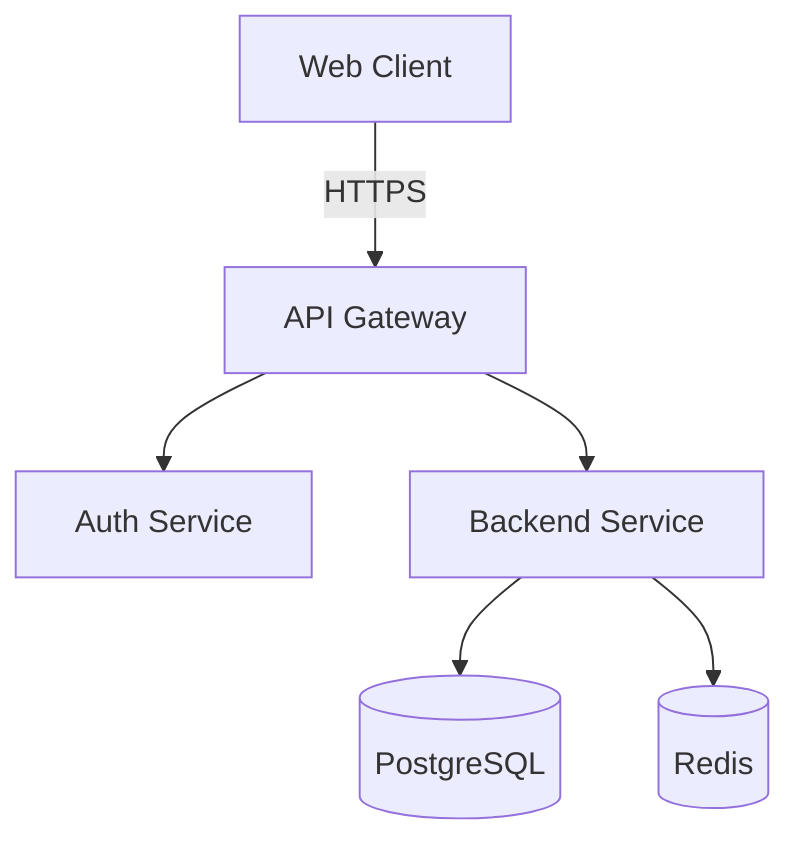
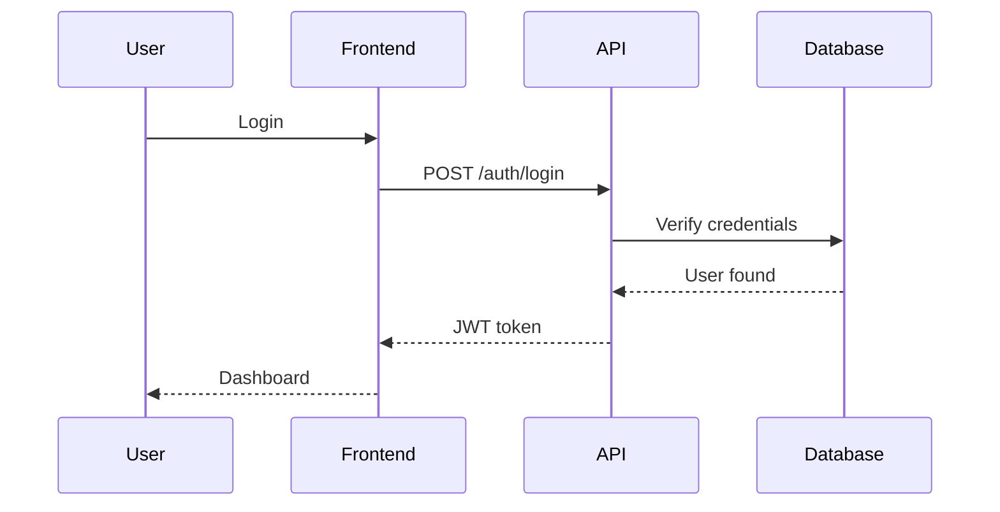

# System Design Skill

Comprehensive system architecture and design toolkit with executable tools.

## When to Use This Skill

- Designing system architecture
- Creating architecture diagrams (sequence, component, deployment)
- Load testing APIs and services
- Generating OpenAPI specifications
- Documenting architectural decisions (ADRs)
- Planning system capacity and scalability
- API contract-first development

**Works with**: `backend-development` (design backends), `infrastructure-as-code` (deploy designs)

## Core Tools

### 1. Diagram Generators
- **Mermaid** - Text-based diagram generation
- **PlantUML** - Sequence and component diagrams
- **C4 Model** - System context, containers, components

### 2. Load Testing
- **k6** - Modern load testing tool (JavaScript)
- **Artillery** - Performance testing toolkit
- **Apache Bench** - Simple HTTP benchmarking

### 3. API Documentation
- **OpenAPI 3.0** - REST API specification
- **AsyncAPI** - Event-driven API specification
- **Swagger UI** - Interactive API documentation

### 4. Decision Making
- **ADR** - Architecture Decision Records
- **Trade-off Analysis** - Systematic decision framework

## Quick Start

### Generate Architecture Diagram
```bash
cd tools/mermaid
node generate-diagram.js > architecture.mmd
```

### Run Load Test
```bash
cd tools/load-testing
k6 run api-load-test.js
```

### Generate OpenAPI Spec
```bash
cd tools/openapi
node generate-spec.js > api-spec.yaml
```

### Create ADR
```bash
cd tools/adr
./create-adr.sh "Use PostgreSQL for primary database"
```

## Tool Examples

### Mermaid Diagrams

**System Architecture**:


**Sequence Diagram**:


### k6 Load Testing

```javascript
// API load test - 100 virtual users for 5 minutes
import http from 'k6/http';
import { check, sleep } from 'k6';

export const options = {
  stages: [
    { duration: '1m', target: 20 },  // Ramp up
    { duration: '3m', target: 100 }, // Stay at 100
    { duration: '1m', target: 0 },   // Ramp down
  ],
  thresholds: {
    http_req_duration: ['p(95)<500'], // 95% requests under 500ms
    http_req_failed: ['rate<0.01'],   // Error rate under 1%
  },
};

export default function () {
  const res = http.get('https://api.example.com/products');

  check(res, {
    'status is 200': (r) => r.status === 200,
    'response time OK': (r) => r.timings.duration < 500,
  });

  sleep(1);
}
```

### OpenAPI Specification

```yaml
openapi: 3.0.0
info:
  title: Backend API
  version: 1.0.0
  description: E-commerce backend API

servers:
  - url: https://api.example.com/v1
    description: Production
  - url: https://staging-api.example.com/v1
    description: Staging

paths:
  /products:
    get:
      summary: List products
      parameters:
        - name: page
          in: query
          schema:
            type: integer
            default: 1
        - name: limit
          in: query
          schema:
            type: integer
            default: 20
      responses:
        '200':
          description: Successful response
          content:
            application/json:
              schema:
                type: object
                properties:
                  products:
                    type: array
                    items:
                      $ref: '#/components/schemas/Product'
                  pagination:
                    $ref: '#/components/schemas/Pagination'

components:
  schemas:
    Product:
      type: object
      properties:
        id:
          type: string
          format: uuid
        name:
          type: string
        price:
          type: number
          format: double
```

## Executable Tools Provided

### Diagram Generators (`tools/mermaid/`)
- `generate-system-context.js` - C4 system context diagram
- `generate-sequence-diagram.js` - API sequence flows
- `generate-deployment-diagram.js` - Infrastructure layout
- `generate-erd.js` - Database entity relationships

### Load Testing (`tools/load-testing/`)
- `api-load-test.js` - General API load test (k6)
- `spike-test.js` - Sudden traffic spike test (k6)
- `stress-test.js` - Find breaking point (k6)
- `artillery-test.yml` - Artillery configuration

### OpenAPI (`tools/openapi/`)
- `generate-spec.js` - Generate OpenAPI from Express routes
- `validate-spec.js` - Validate OpenAPI spec
- `generate-client.sh` - Generate TypeScript client

### ADR (`tools/adr/`)
- `create-adr.sh` - Create new ADR
- `template.md` - ADR template
- `examples/` - Example ADRs

## Architecture Patterns

### Microservices
```
Frontend → API Gateway → [Services] → Databases
                ↓
            Message Queue
```

**When to use**:
- Large teams
- Independent scaling needs
- Different tech stacks per service

### Monolith
```
Frontend → API Server → Database
```

**When to use**:
- Small teams
- Simple domain
- Rapid development needed

### Event-Driven
```
Services → Message Broker → Services
            ↓
        Event Store
```

**When to use**:
- Asynchronous workflows
- High decoupling needed
- Audit trail required

## Load Testing Strategies

### Smoke Test
- **VUs**: 1-5
- **Duration**: 1-2 minutes
- **Goal**: Verify system works

### Load Test
- **VUs**: Expected average load
- **Duration**: 10-30 minutes
- **Goal**: Performance at normal load

### Stress Test
- **VUs**: Beyond expected load
- **Duration**: Until failure
- **Goal**: Find breaking point

### Spike Test
- **Pattern**: Sudden traffic spike
- **Duration**: 5-10 minutes
- **Goal**: Handle sudden load

### Soak Test
- **VUs**: Normal load
- **Duration**: Hours/days
- **Goal**: Memory leaks, degradation

## Performance Metrics

### Response Time
- **p50 (median)**: 50th percentile
- **p95**: 95th percentile (most users)
- **p99**: 99th percentile (worst case)

**Target**: p95 < 500ms for web APIs

### Throughput
- **Requests/second**: Total throughput
- **Concurrent users**: Active users

### Error Rate
- **Target**: < 0.1% (1 in 1000)
- **Monitor**: 4xx (client errors), 5xx (server errors)

### Resource Utilization
- **CPU**: < 70% average
- **Memory**: < 80% with headroom
- **Database**: Connection pool usage

## API Design Best Practices

### RESTful Conventions
- `GET /resources` - List
- `GET /resources/:id` - Retrieve
- `POST /resources` - Create
- `PUT /resources/:id` - Update (full)
- `PATCH /resources/:id` - Update (partial)
- `DELETE /resources/:id` - Delete

### Status Codes
- `200 OK` - Success
- `201 Created` - Resource created
- `400 Bad Request` - Invalid input
- `401 Unauthorized` - Not authenticated
- `403 Forbidden` - Not authorized
- `404 Not Found` - Resource not found
- `500 Internal Server Error` - Server error

### Pagination
```json
{
  "data": [...],
  "pagination": {
    "page": 1,
    "limit": 20,
    "total": 150,
    "totalPages": 8
  }
}
```

### Filtering
```
GET /products?category=tires&minPrice=100&maxPrice=500
```

### Sorting
```
GET /products?sortBy=price&sortOrder=desc
```

## Architecture Decision Records

### ADR Template
```markdown
# ADR-001: Use PostgreSQL for Primary Database

## Status
Accepted

## Context
Need a database for multi-location tire retail system with complex relationships.

## Decision
Use PostgreSQL as primary database.

## Consequences

### Positive
- ACID compliance for transactions
- Strong data integrity
- Rich query capabilities (JOIN, aggregates)
- Mature ecosystem

### Negative
- Vertical scaling limitations
- More complex than NoSQL for some cases
- Requires careful index management

## Alternatives Considered
- MongoDB (too flexible for relational data)
- MySQL (less advanced features)
- DynamoDB (vendor lock-in, learning curve)
```

## Capacity Planning

### Estimation Formula
```
Required Capacity = (Peak Users × Avg Requests/User × Avg Response Time) / Target Response Time
```

### Example
- **Peak Users**: 10,000
- **Avg Requests/User**: 20/minute
- **Avg Response Time**: 200ms
- **Target**: 500ms p95

**Calculation**:
- Total requests/min = 10,000 × 20 = 200,000
- Requests/sec = 200,000 / 60 ≈ 3,333 req/s
- Required servers = (3,333 × 0.2) / 0.5 ≈ 1,333 concurrent
- With 100 req/s per server = 14 servers minimum
- With 2x safety margin = 28 servers

## Integration with CI/CD

### Automated Load Tests
```yaml
# GitHub Actions
name: Load Test
on:
  pull_request:
    branches: [main]

jobs:
  load-test:
    runs-on: ubuntu-latest
    steps:
      - uses: actions/checkout@v3
      - name: Run k6 load test
        uses: grafana/k6-action@v0.3.0
        with:
          filename: tools/load-testing/api-load-test.js
```

### API Spec Validation
```yaml
# Validate OpenAPI spec on PR
- name: Validate OpenAPI
  run: |
    npm install -g @stoplight/spectral-cli
    spectral lint api-spec.yaml
```

## Troubleshooting Performance

### High Latency
1. Check database query times (use EXPLAIN)
2. Review N+1 queries
3. Add caching (Redis)
4. Optimize indexes

### High Error Rate
1. Check logs for patterns
2. Review resource limits (CPU, memory)
3. Check database connections
4. Monitor third-party services

### Low Throughput
1. Profile application (Node.js --prof)
2. Check connection pooling
3. Review blocking operations
4. Scale horizontally

## Related Skills

- `backend-development` - Code the designs
- `infrastructure-as-code` - Deploy architecture
- `production-deployment-skill` - Full deployment pipeline

## Resources

- `tools/` - Executable tools and scripts
- `examples/` - Example architectures and tests
- `templates/` - ADR and documentation templates
