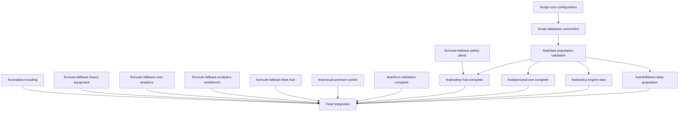

# Fleet Management Multi-Branch Orchestration Plan

## Execution Strategy

Based on dependency analysis, branches will be executed in the following order:

### Batch 1: Independent Critical Fixes (Parallel Ready)
These branches have no dependencies and can be worked on simultaneously:
- `fix/analytics-loading`
- `fix/route-fallback-safety-alerts`
- `fix/route-fallback-heavy-equipment`
- `fix/route-fallback-cost-analytics`
- `fix/route-fallback-analytics-workbench`
- `fix/route-fallback-fleet-hub`
- `feat/visual-premium-polish`
- `feat/form-validation-complete`

**Combined Effort:** 8 branches | **Expected Duration:** 2-3 hours

### Batch 2: API Foundation (Sequential)
These must be done in order due to dependencies:
1. `fix/api-cors-configuration` (blocks all API work)
2. `fix/api-database-connection` (depends on CORS)
3. `feat/data-population-validation` (depends on DB connection)

**Combined Effort:** 3 branches | **Expected Duration:** 1-2 hours

### Batch 3: Hub Completion (Parallel Ready after Batch 2)
All depend on `feat/data-population-validation`:
- `feat/safety-hub-complete` (also depends on route-fallback-safety-alerts)
- `feat/personal-use-complete`
- `feat/policy-engine-data`
- `feat/drilldown-data-population`

**Combined Effort:** 4 branches | **Expected Duration:** 2-3 hours

---

## Dependency Graph



---

## Quality Gates (All Branches)

### Gate A: Implementation Complete
- [ ] All files modified per implementation plan
- [ ] Code follows TypeScript strict mode
- [ ] Component patterns match existing codebase
- [ ] Loading states implemented
- [ ] Error boundaries added

### Gate B: Local Testing
- [ ] `npm run dev` starts without errors
- [ ] Route renders correct component (not fallback)
- [ ] Data fetches successfully
- [ ] Drilldown functionality works
- [ ] No console errors in browser

### Gate C: Build Validation
- [ ] `npm run build` completes successfully
- [ ] No TypeScript errors
- [ ] No ESLint errors
- [ ] Bundle size within acceptable range

### Gate D: Conventional Commits
- [ ] Commit message follows format: `type(scope): description`
- [ ] Types: fix, feat, chore, docs, refactor
- [ ] Description is clear and descriptive

---

## Execution Log Template

Each branch will be logged with:

```json
{
  "branch": "fix/example-branch",
  "started_at": "ISO-8601 timestamp",
  "completed_at": "ISO-8601 timestamp",
  "duration_minutes": 0,
  "gates": {
    "implementation": "pass|fail",
    "testing": "pass|fail",
    "build": "pass|fail",
    "commit": "pass|fail"
  },
  "blockers": [],
  "notes": []
}
```

---

## Success Criteria

### Per-Branch Success
- All 4 quality gates pass
- Changes committed locally
- No merge conflicts with main

### Overall Success
- 15/15 branches completed
- All builds passing
- Status report generated
- No critical blockers remaining

---

## Rollback Strategy

If a branch fails quality gates:
1. Document failure in orchestration_state.json
2. Mark as blocked with specific blocker reason
3. Continue with independent branches
4. Escalate blockers in final report

---

## Next Steps

1. Begin Batch 1 execution (8 independent branches)
2. Update orchestration_state.json after each branch
3. Run quality gates after each branch
4. Proceed to Batch 2 once Batch 1 completes
5. Generate comprehensive status report at end

