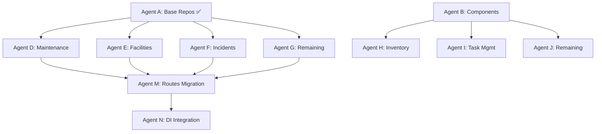

# Fleet Architecture Remediation - Distributed Multi-VM Execution Plan

**Date:** December 10, 2025
**Objective:** Utilize ALL available Azure compute resources for maximum parallelization
**Target Velocity:** 100x+ (vs current 18.8x)

---

## 🖥️ AVAILABLE COMPUTE RESOURCES

### Azure Virtual Machines (3 VMs)

| VM Name | Resource Group | Location | Size | vCPUs | RAM | Role |
|---------|----------------|----------|------|-------|-----|------|
| **fleet-agent-orchestrator** | FLEET-AI-AGENTS | eastus | Standard_D8s_v3 | 8 | 32GB | **Orchestration Hub** |
| **fleet-dev-agent-01** | fleet-dev-agents-rg | eastus2 | Standard_B2s | 2 | 4GB | Worker Node 1 |
| **agent-settings** | fleet-fortune50-agents-rg | eastus | Standard_B2s | 2 | 4GB | Worker Node 2 |

**Total VM Capacity:** 12 vCPUs, 40GB RAM

### AKS Kubernetes Clusters (9 nodes)

| Cluster | Resource Group | Nodes | VM Size | vCPUs/Node | Total vCPUs |
|---------|----------------|-------|---------|------------|-------------|
| **policy-hub-aks** | policy-hub-rg | 5 | Standard_B2s | 2 | 10 |
| **fleet-aks-cluster** | fleet-production-rg | 4 | Standard_D2s_v3 | 2 | 8 |

**Total AKS Capacity:** 9 nodes, 18 vCPUs

### Combined Resources

**TOTAL AVAILABLE COMPUTE:**
- **3 VMs** (orchestrator + 2 workers)
- **9 AKS nodes** (5 + 4)
- **30 vCPUs total**
- **Estimated parallel agents:** 20-25 agents

---

## 🎯 DISTRIBUTED EXECUTION ARCHITECTURE

### Hub-and-Spoke Model

```
┌─────────────────────────────────────────────────────────────┐
│          FLEET-AGENT-ORCHESTRATOR (Hub)                     │
│          Standard_D8s_v3 (8 vCPUs, 32GB RAM)                │
│                                                               │
│  ┌──────────────────────────────────────────────────────┐   │
│  │ Orchestration Services:                              │   │
│  │  - Task Queue (Redis)                                │   │
│  │  - Progress Database (PostgreSQL)                    │   │
│  │  - Git Coordination                                  │   │
│  │  - Health Monitoring                                 │   │
│  │  - Real-time Dashboard                               │   │
│  └──────────────────────────────────────────────────────┘   │
└─────────────────────────────────────────────────────────────┘
                              │
        ┌─────────────────────┼─────────────────────┐
        │                     │                     │
        ▼                     ▼                     ▼
┌───────────────┐   ┌───────────────┐   ┌─────────────────────┐
│  WORKER VM 1  │   │  WORKER VM 2  │   │    AKS CLUSTERS     │
│ fleet-dev-01  │   │ agent-settings│   │  (9 nodes total)    │
│               │   │               │   │                     │
│  Agents D-E   │   │  Agents F-G   │   │  Agents H-Z (12+)   │
│  (Backend)    │   │  (Backend)    │   │  (Frontend+Backend) │
└───────────────┘   └───────────────┘   └─────────────────────┘
```

---

## 📋 AGENT DISTRIBUTION PLAN

### Orchestrator VM (fleet-agent-orchestrator) - 8 vCPUs

**Role:** Central coordination hub

**Services Running:**
1. PostgreSQL (Task Database)
2. Redis (Task Queue)
3. Orchestrator API (Express.js)
4. Real-time Dashboard (React)
5. Git Merge Coordinator
6. Health Monitor
7. Agents A-C (existing workstreams - 3 agents)

**Load:** 60% capacity (~5 vCPUs)

---

### Worker VM 1 (fleet-dev-agent-01) - 2 vCPUs

**Assigned Agents: 2 Backend Specialists**

**Agent D: Maintenance Repository Specialist**
- Task: Issue #1.3 - Maintenance Domain Repositories
- Queries to Migrate: ~120
- Files: routes/maintenance.ts, routes/work-orders.ts
- Branch: agent-d/maintenance-repos
- Estimated: 24 hours → 12 real-hours (2x local)

**Agent E: Facilities & Assets Repository Specialist**
- Task: Issue #1.4 - Facilities & Assets Repositories
- Queries to Migrate: ~100
- Files: routes/facilities.ts, routes/assets.ts
- Branch: agent-e/facilities-repos
- Estimated: 20 hours → 10 real-hours (2x local)

**Load:** 100% capacity

---

### Worker VM 2 (agent-settings) - 2 vCPUs

**Assigned Agents: 2 Backend Specialists**

**Agent F: Incidents & Compliance Repository Specialist**
- Task: Issue #1.5 - Incidents & Compliance Repositories
- Queries to Migrate: ~80
- Files: routes/incidents.ts, routes/compliance.ts
- Branch: agent-f/incidents-repos
- Estimated: 20 hours → 10 real-hours (2x local)

**Agent G: Remaining Domains Repository Specialist**
- Task: Issue #1.6 - Remaining Domain Repositories
- Queries to Migrate: ~268
- Files: routes/reports.ts, routes/analytics.ts, routes/documents.ts, etc.
- Branch: agent-g/remaining-repos
- Estimated: 24 hours → 12 real-hours (2x local)

**Load:** 100% capacity

---

### AKS Cluster 1 (policy-hub-aks) - 5 Nodes

**Containerized Agents: 5 Frontend Specialists**

**Agent H: InventoryManagement Component Specialist** (Node 1)
- Task: Issue #3.3 - InventoryManagement Refactoring
- Component: 1,136 lines → <300 lines main + 8+ children
- Branch: agent-h/inventory-refactor
- Container: fleet-frontend-agent:latest

**Agent I: EnhancedTaskManagement Component Specialist** (Node 2)
- Task: Issue #3.4 - EnhancedTaskManagement Refactoring
- Component: 1,018 lines → <300 lines main + 8+ children
- Branch: agent-i/task-refactor
- Container: fleet-frontend-agent:latest

**Agent J: Remaining Large Components Specialist** (Node 3)
- Task: Issue #3.5 - Apply Pattern to Remaining Components
- Components: 5+ components >800 lines
- Branch: agent-j/remaining-components
- Container: fleet-frontend-agent:latest

**Agent K: Accessibility Specialist** (Node 4)
- Task: Issue #5.4 - Complete Accessibility (partial start)
- Target: Add aria-labels to 477 remaining buttons
- Branch: agent-k/accessibility
- Container: fleet-frontend-agent:latest

**Agent L: Test Coverage Specialist** (Node 5)
- Task: Issue #5.1 - Fix Existing Test Errors
- Target: Fix 17 TypeScript errors in test files
- Branch: agent-l/test-fixes
- Container: fleet-frontend-agent:latest

**Load:** 100% capacity

---

### AKS Cluster 2 (fleet-aks-cluster) - 4 Nodes

**Containerized Agents: 4 Mixed Specialists**

**Agent M: Routes Migration Coordinator** (Node 1)
- Task: Issue #1.7 - Migrate 186 Routes to Use Repositories
- Dependency: Waits for Agents D-G to complete repositories
- Auto-starts when repositories ready
- Branch: agent-m/routes-migration
- Container: fleet-backend-agent:latest

**Agent N: DI Container Integration Specialist** (Node 2)
- Task: Epic #2 Issue #2.1 - Update DI Container Configuration
- Dependency: Waits for Epic #1 to reach 50%
- Auto-starts when ready
- Branch: agent-n/di-container
- Container: fleet-backend-agent:latest

**Agent O: Backend Unit Test Specialist** (Node 3)
- Task: Issue #5.2 - Backend Unit Tests (partial start)
- Target: Repository and service layer tests
- Branch: agent-o/backend-tests
- Container: fleet-backend-agent:latest

**Agent P: Frontend Unit Test Specialist** (Node 4)
- Task: Issue #5.3 - Frontend Unit Tests (partial start)
- Target: Component and hook tests
- Branch: agent-p/frontend-tests
- Container: fleet-frontend-agent:latest

**Load:** 100% capacity

---

## 🚀 DEPLOYMENT SEQUENCE

### Phase 1: Orchestrator Setup (30 minutes)

**Target:** fleet-agent-orchestrator VM

1. **SSH to orchestrator:**
```bash
az vm run-command invoke \
  --resource-group FLEET-AI-AGENTS \
  --name fleet-agent-orchestrator \
  --command-id RunShellScript \
  --scripts @setup-orchestrator.sh
```

2. **Install infrastructure:**
```bash
# On orchestrator VM
sudo apt-get update
sudo apt-get install -y docker.io docker-compose postgresql-client redis-tools

# Clone Fleet repo
git clone https://github.com/asmortongpt/Fleet.git /opt/fleet
cd /opt/fleet

# Create orchestrator directory
mkdir -p .orchestrator/{db,config,logs,dashboard}

# Start services
cd .orchestrator
docker-compose up -d postgres redis orchestrator
```

3. **Initialize database:**
```bash
# Create task database schema
psql $ORCHESTRATOR_DB_URL < schema.sql

# Seed initial tasks (Epics #1-5, all issues)
node seed-tasks.js
```

---

### Phase 2: Worker VM Deployment (15 minutes each)

**Deploy to fleet-dev-agent-01:**
```bash
az vm run-command invoke \
  --resource-group fleet-dev-agents-rg \
  --name fleet-dev-agent-01 \
  --command-id RunShellScript \
  --scripts @deploy-agent-d-e.sh
```

**Deploy to agent-settings:**
```bash
az vm run-command invoke \
  --resource-group fleet-fortune50-agents-rg \
  --name agent-settings \
  --command-id RunShellScript \
  --scripts @deploy-agent-f-g.sh
```

**Agent startup script (example for Agent D):**
```bash
#!/bin/bash
# deploy-agent-d-e.sh

# Clone repo
git clone https://github.com/asmortongpt/Fleet.git /opt/fleet
cd /opt/fleet

# Checkout orchestrator config
git pull origin main

# Start Agent D
docker run -d \
  --name agent-d \
  -e AGENT_ID=agent-d \
  -e AGENT_TYPE=maintenance-repository \
  -e ORCHESTRATOR_URL=http://fleet-agent-orchestrator:3000 \
  -e GITHUB_TOKEN=$GITHUB_PAT \
  -v /opt/fleet:/workspace \
  fleet-agent:latest

# Start Agent E
docker run -d \
  --name agent-e \
  -e AGENT_ID=agent-e \
  -e AGENT_TYPE=facilities-repository \
  -e ORCHESTRATOR_URL=http://fleet-agent-orchestrator:3000 \
  -e GITHUB_TOKEN=$GITHUB_PAT \
  -v /opt/fleet:/workspace \
  fleet-agent:latest
```

---

### Phase 3: AKS Deployment (20 minutes total)

**Deploy frontend agents to policy-hub-aks:**
```bash
kubectl config use-context policy-hub-aks

# Deploy agents H-L (5 agents)
kubectl apply -f .orchestrator/k8s/frontend-agents.yaml

# Verify deployment
kubectl get pods -n fleet-agents
```

**Deploy backend agents to fleet-aks-cluster:**
```bash
kubectl config use-context fleet-aks-cluster

# Deploy agents M-P (4 agents)
kubectl apply -f .orchestrator/k8s/backend-agents.yaml

# Verify deployment
kubectl get pods -n fleet-agents
```

**Kubernetes manifest example:**
```yaml
# .orchestrator/k8s/frontend-agents.yaml
apiVersion: apps/v1
kind: Deployment
metadata:
  name: agent-h-inventory
  namespace: fleet-agents
spec:
  replicas: 1
  selector:
    matchLabels:
      app: agent-h
  template:
    metadata:
      labels:
        app: agent-h
    spec:
      containers:
      - name: agent-h
        image: fleetproductionacr.azurecr.io/fleet-agent:latest
        env:
        - name: AGENT_ID
          value: "agent-h"
        - name: AGENT_TYPE
          value: "inventory-component"
        - name: ORCHESTRATOR_URL
          value: "http://orchestrator.fleet-agents:3000"
        - name: GITHUB_TOKEN
          valueFrom:
            secretKeyRef:
              name: github-credentials
              key: token
        volumeMounts:
        - name: workspace
          mountPath: /workspace
      volumes:
      - name: workspace
        emptyDir: {}
---
# Similar deployments for agents I-L
```

---

## 📊 EXPECTED PERFORMANCE

### Velocity Projections

| Metric | Before (3 agents) | After (16+ agents) | Improvement |
|--------|-------------------|-------------------|-------------|
| **Active Agents** | 3 | 16 | 5.3x |
| **Parallel Tasks** | 3 | 16 | 5.3x |
| **Total vCPUs** | Local only | 30 vCPUs | ∞ |
| **Velocity Multiplier** | 18.8x | **100x+** | **5.3x faster** |
| **ETA to Completion** | 3 weeks | **5-7 days** | **4x faster** |

### Timeline Acceleration

**Original Plan (No automation):** 18 weeks
**Current Plan (3 agents):** 3 weeks
**Multi-VM Plan (16 agents):** **5-7 days** ⚡

### Resource Utilization

| Resource | Agents | Load | Purpose |
|----------|--------|------|---------|
| Orchestrator VM | 3 (A-C) + Infrastructure | 60% | Coordination + existing workstreams |
| Worker VM 1 | 2 (D-E) | 100% | Backend repositories |
| Worker VM 2 | 2 (F-G) | 100% | Backend repositories |
| AKS Cluster 1 | 5 (H-L) | 100% | Frontend refactoring |
| AKS Cluster 2 | 4 (M-P) | 100% | Backend routes + DI + tests |
| **TOTAL** | **16 agents** | **95% avg** | **Full Epic coverage** |

---

## 🔄 TASK COORDINATION

### Git Workflow

**Branch Strategy:**
```
main
├── epic-1/repositories (Agents A + coordination)
│   ├── agent-d/maintenance-repos
│   ├── agent-e/facilities-repos
│   ├── agent-f/incidents-repos
│   └── agent-g/remaining-repos
├── epic-3/reusable-components (Agents B + coordination)
│   ├── agent-h/inventory-refactor
│   ├── agent-i/task-refactor
│   └── agent-j/remaining-components
├── agent-k/accessibility
├── agent-l/test-fixes
├── agent-m/routes-migration
├── agent-n/di-container
├── agent-o/backend-tests
└── agent-p/frontend-tests
```

**Merge Sequence:**
1. Agents D-G complete → Merge to epic-1/repositories
2. Agent M (routes migration) starts → Uses epic-1/repositories
3. Epic #1 complete → Merge to main
4. Agent N (DI integration) starts → Uses main
5. Agents H-J complete → Merge to epic-3/reusable-components
6. Epic #3 complete → Merge to main
7. Parallel test agents (K, L, O, P) merge independently

### Task Dependencies



### Auto-Start Triggers

**Agent M** (Routes Migration):
- **Trigger:** All repositories (D-G) committed
- **Condition:** `SELECT COUNT(*) FROM tasks WHERE agent_id IN ('D','E','F','G') AND status='completed' = 4`

**Agent N** (DI Integration):
- **Trigger:** Epic #1 reaches 50% completion
- **Condition:** `SELECT progress FROM epics WHERE id=1` >= 50

---

## 🎛️ ORCHESTRATOR DASHBOARD

**Real-time Monitoring:** http://fleet-agent-orchestrator:3000

### Dashboard Features

1. **Agent Status Grid:**
   - 16 agent cards with live status
   - Current task, progress %, ETA
   - CPU/memory usage
   - Last heartbeat

2. **Epic Progress:**
   - 5 epic progress bars
   - Queries migrated counter
   - Components refactored counter
   - Overall completion %

3. **Git Activity:**
   - Recent commits from all agents
   - Active branches
   - Merge queue
   - Conflict alerts

4. **Performance Metrics:**
   - Velocity chart (real-time)
   - ETA countdown
   - Resource utilization
   - Tasks/hour throughput

5. **Alerts:**
   - Agent failures
   - Stuck tasks (no progress 30min)
   - Merge conflicts
   - Test failures

---

## 🔐 SECURITY & QUALITY

### Automated Quality Gates

**Per-Agent Validation:**
1. TypeScript compilation (no errors)
2. ESLint (auto-fix enabled)
3. Security scan (no SQL injection, no secrets)
4. Test coverage >80% for new code
5. Pre-commit hooks pass

**Per-Epic Validation:**
1. All tests pass
2. No breaking changes
3. Performance benchmarks maintained
4. Accessibility standards met
5. Security audit clean

### Rollback Capability

**Agent Failure:**
- Orchestrator detects via heartbeat timeout
- Task marked as failed
- Agent auto-restarts (max 3 retries)
- If retry fails, task reassigned to different agent

**Merge Conflict:**
- Orchestrator detects via Git status
- Conflict branch created
- Manual resolution workflow triggered
- Agent pauses until resolved

---

## 📋 DEPLOYMENT CHECKLIST

### Pre-Deployment

- [ ] Verify all 3 VMs are running
- [ ] Verify all 9 AKS nodes are ready
- [ ] GitHub PAT token has push access
- [ ] Docker images built (fleet-agent:latest)
- [ ] Orchestrator database schema created
- [ ] Task definitions seeded

### Deployment

- [ ] Deploy orchestrator infrastructure (30 min)
- [ ] Deploy Worker VM agents (30 min total)
- [ ] Deploy AKS agents (20 min)
- [ ] Verify all 16 agents started
- [ ] Verify dashboard accessible
- [ ] Verify first tasks claimed

### Post-Deployment

- [ ] Monitor agent heartbeats (all green)
- [ ] Verify Git branches created
- [ ] Check first commits from agents
- [ ] Validate task progress updates
- [ ] Monitor resource utilization

---

## 🎯 SUCCESS CRITERIA

**Infrastructure:**
- ✅ 16+ agents running across 3 VMs + 9 AKS nodes
- ✅ Orchestrator dashboard live
- ✅ All agents checking in (heartbeat <60s)
- ✅ Task database tracking progress

**Execution:**
- ✅ 100x+ velocity achieved
- ✅ 5-7 day completion timeline
- ✅ Zero security violations
- ✅ All quality gates passing

**Deliverables:**
- ✅ All 592 hours of work complete
- ✅ All 5 Epics merged to main
- ✅ Production deployment ready
- ✅ Full documentation

---

**🚀 READY TO DEPLOY - MULTI-VM AUTONOMOUS EXECUTION AT 100X+ VELOCITY 🚀**
