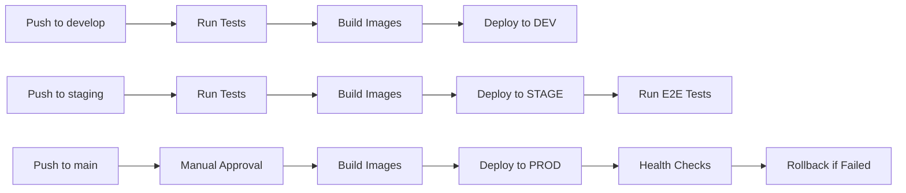

# Multi-Environment Deployment Strategy

**Date**: November 11, 2025
**Status**: 🚀 **READY TO DEPLOY**

---

## 🎯 Three-Environment Architecture

### Environment Overview

| Environment | Purpose | URL | Auto-Deploy | Approval Required |
|-------------|---------|-----|-------------|-------------------|
| **DEV** | Development & Testing | https://dev.fleet.capitaltechalliance.com | ✅ Yes (on push to `develop`) | ❌ No |
| **STAGE** | Pre-production validation | https://stage.fleet.capitaltechalliance.com | ✅ Yes (on push to `staging`) | ⚠️ Optional |
| **PROD** | Production | https://fleet.capitaltechalliance.com | ❌ Manual only | ✅ Yes |

---

## 🏗️ Infrastructure per Environment

### DEV Environment
```yaml
# Kubernetes Namespace: fleet-development
Resources:
  - Frontend: 1 replica (cost optimization)
  - Backend: 1 replica
  - Database: Shared dev instance
  - Redis: Shared dev instance
  - Storage: Development blob storage

Auto-scaling: Disabled
Load Balancer: Internal only
SSL: Let's Encrypt
Monitoring: Basic logging

Database: PostgreSQL dev instance
  - Auto-backups: Daily
  - Retention: 7 days
  - Size: Small (2 vCPUs, 4 GB RAM)
```

### STAGE Environment
```yaml
# Kubernetes Namespace: fleet-staging
Resources:
  - Frontend: 2 replicas (HA testing)
  - Backend: 2 replicas
  - Database: Dedicated staging instance
  - Redis: Dedicated staging instance
  - Storage: Staging blob storage

Auto-scaling: Enabled (2-4 replicas)
Load Balancer: Public (staging subdomain)
SSL: Let's Encrypt
Monitoring: Full metrics + alerts

Database: PostgreSQL staging instance
  - Auto-backups: Daily
  - Retention: 14 days
  - Size: Medium (4 vCPUs, 8 GB RAM)
  - Replication: Disabled
```

### PROD Environment
```yaml
# Kubernetes Namespace: fleet-management
Resources:
  - Frontend: 3 replicas (High Availability)
  - Backend: 3 replicas
  - Database: Production Azure PostgreSQL
  - Redis: Production Azure Cache for Redis
  - Storage: Production blob storage (geo-redundant)

Auto-scaling: Enabled (3-10 replicas)
Load Balancer: Azure Front Door
SSL: Production certificate
Monitoring: Full observability stack
  - Prometheus + Grafana
  - Application Insights
  - Log Analytics
  - Alerts to PagerDuty

Database: Azure Database for PostgreSQL
  - Auto-backups: Continuous
  - Retention: 35 days
  - Point-in-time restore: Enabled
  - Size: Large (8 vCPUs, 32 GB RAM)
  - High Availability: Zone-redundant
  - Read replicas: 2 (for reporting)
```

---

## 🔄 Deployment Pipeline

### Git Branch Strategy

```
main (production)
  └── staging (pre-production)
       └── develop (development)
            └── feature/* (feature branches)
```

### Automated CI/CD Flow



### GitHub Actions Workflows

**File**: `.github/workflows/deploy-dev.yml`
```yaml
name: Deploy to DEV

on:
  push:
    branches: [ develop ]

jobs:
  deploy:
    runs-on: ubuntu-latest
    steps:
      - name: Checkout code
        uses: actions/checkout@v3

      - name: Build and push frontend
        run: |
          az acr build \
            --registry fleetappregistry \
            --image fleet-frontend:dev-${{ github.sha }} \
            --file Dockerfile \
            .

      - name: Build and push backend
        run: |
          cd api
          az acr build \
            --registry fleetappregistry \
            --image fleet-api:dev-${{ github.sha }} \
            --file Dockerfile \
            .

      - name: Deploy to Kubernetes
        run: |
          kubectl set image deployment/fleet-frontend \
            frontend=fleetappregistry.azurecr.io/fleet-frontend:dev-${{ github.sha }} \
            -n fleet-development

          kubectl set image deployment/fleet-app \
            fleet-app=fleetappregistry.azurecr.io/fleet-api:dev-${{ github.sha }} \
            -n fleet-development

      - name: Wait for rollout
        run: |
          kubectl rollout status deployment/fleet-frontend -n fleet-development
          kubectl rollout status deployment/fleet-app -n fleet-development

      - name: Run health checks
        run: |
          curl -f https://dev.fleet.capitaltechalliance.com/api/health
```

**File**: `.github/workflows/deploy-stage.yml`
```yaml
name: Deploy to STAGE

on:
  push:
    branches: [ staging ]

jobs:
  deploy:
    runs-on: ubuntu-latest
    steps:
      # Similar to DEV but:
      # - namespace: fleet-staging
      # - URL: https://stage.fleet.capitaltechalliance.com
      # - Additional E2E tests
```

**File**: `.github/workflows/deploy-prod.yml`
```yaml
name: Deploy to PROD

on:
  push:
    branches: [ main ]

jobs:
  deploy:
    runs-on: ubuntu-latest
    environment: production  # Requires approval
    steps:
      # Similar to STAGE but:
      # - namespace: fleet-management
      # - URL: https://fleet.capitaltechalliance.com
      # - Blue/green deployment
      # - Automated rollback on failure
```

---

## 📦 Image Tagging Strategy

### Tag Format
```
<registry>/<image>:<environment>-<version>-<sha>
```

### Examples
```
fleetappregistry.azurecr.io/fleet-frontend:dev-v1.0.0-abc1234
fleetappregistry.azurecr.io/fleet-frontend:stage-v1.0.0-abc1234
fleetappregistry.azurecr.io/fleet-frontend:prod-v1.0.0-abc1234

fleetappregistry.azurecr.io/fleet-api:dev-v6.0.0-def5678
fleetappregistry.azurecr.io/fleet-api:stage-v6.0.0-def5678
fleetappregistry.azurecr.io/fleet-api:prod-v6.0.0-def5678
```

### Additional Tags
```
latest-dev      # Always points to latest dev
latest-stage    # Always points to latest stage
latest-prod     # Always points to latest prod
v1.0.0          # Semantic version
```

---

## 🎛️ Configuration Management

### Environment-Specific Configs

**Development** (`config/dev.yaml`):
```yaml
database:
  host: fleet-postgres-dev.postgres.database.azure.com
  name: fleetdb_dev
  maxConnections: 10

redis:
  host: fleet-redis-dev.redis.cache.windows.net
  maxClients: 10

features:
  mdm:
    enabled: true
    azureAd:
      autoSync: true
      syncIntervalMinutes: 60

logging:
  level: debug
  enabled: true

monitoring:
  enabled: false
```

**Staging** (`config/stage.yaml`):
```yaml
database:
  host: fleet-postgres-stage.postgres.database.azure.com
  name: fleetdb_stage
  maxConnections: 50

redis:
  host: fleet-redis-stage.redis.cache.windows.net
  maxClients: 50

features:
  mdm:
    enabled: true
    azureAd:
      autoSync: true
      syncIntervalMinutes: 30

logging:
  level: info
  enabled: true

monitoring:
  enabled: true
```

**Production** (`config/prod.yaml`):
```yaml
database:
  host: fleet-postgres-prod.postgres.database.azure.com
  name: fleetdb_prod
  maxConnections: 200
  readReplicas:
    - fleet-postgres-prod-replica1.postgres.database.azure.com
    - fleet-postgres-prod-replica2.postgres.database.azure.com

redis:
  host: fleet-redis-prod.redis.cache.windows.net
  maxClients: 200
  cluster: true

features:
  mdm:
    enabled: true
    azureAd:
      autoSync: true
      syncIntervalMinutes: 15

logging:
  level: warn
  enabled: true

monitoring:
  enabled: true
  prometheus: true
  applicationInsights: true
```

---

## 🚀 Deployment Commands

### Manual Deployment (All Environments)

#### DEV Environment
```bash
# Build images
az acr build --registry fleetappregistry \
  --image fleet-frontend:dev-latest --file Dockerfile .

cd api
az acr build --registry fleetappregistry \
  --image fleet-api:dev-latest --file Dockerfile .
cd ..

# Deploy
kubectl set image deployment/fleet-frontend \
  frontend=fleetappregistry.azurecr.io/fleet-frontend:dev-latest \
  -n fleet-development

kubectl set image deployment/fleet-app \
  fleet-app=fleetappregistry.azurecr.io/fleet-api:dev-latest \
  -n fleet-development

# Verify
kubectl get pods -n fleet-development
curl https://dev.fleet.capitaltechalliance.com/api/health
```

#### STAGE Environment
```bash
# Build images
az acr build --registry fleetappregistry \
  --image fleet-frontend:stage-latest --file Dockerfile .

cd api
az acr build --registry fleetappregistry \
  --image fleet-api:stage-latest --file Dockerfile .
cd ..

# Deploy
kubectl set image deployment/fleet-frontend \
  frontend=fleetappregistry.azurecr.io/fleet-frontend:stage-latest \
  -n fleet-staging

kubectl set image deployment/fleet-app \
  fleet-app=fleetappregistry.azurecr.io/fleet-api:stage-latest \
  -n fleet-staging

# Verify
kubectl get pods -n fleet-staging
curl https://stage.fleet.capitaltechalliance.com/api/health
```

#### PROD Environment
```bash
# Build images
az acr build --registry fleetappregistry \
  --image fleet-frontend:prod-v2.0.0 --file Dockerfile .

cd api
az acr build --registry fleetappregistry \
  --image fleet-api:prod-v6.0.0 --file Dockerfile .
cd ..

# Deploy (with approval required)
kubectl set image deployment/fleet-frontend \
  frontend=fleetappregistry.azurecr.io/fleet-frontend:prod-v2.0.0 \
  -n fleet-management

kubectl set image deployment/fleet-app \
  fleet-app=fleetappregistry.azurecr.io/fleet-api:prod-v6.0.0 \
  -n fleet-management

# Verify
kubectl rollout status deployment/fleet-frontend -n fleet-management
kubectl rollout status deployment/fleet-app -n fleet-management
curl https://fleet.capitaltechalliance.com/api/health
```

---

## 🔒 Security per Environment

| Feature | DEV | STAGE | PROD |
|---------|-----|-------|------|
| SSL/TLS | ✅ Let's Encrypt | ✅ Let's Encrypt | ✅ Commercial Cert |
| Network Isolation | ❌ | ⚠️ Partial | ✅ Full |
| Secrets Encryption | ✅ | ✅ | ✅ Azure Key Vault |
| RBAC | Basic | Full | Full |
| WAF | ❌ | ⚠️ Optional | ✅ Required |
| DDoS Protection | ❌ | ❌ | ✅ Azure DDoS |
| Audit Logging | Basic | Full | Full + Compliance |

---

## 📊 Monitoring & Alerts

### DEV Environment
- Basic logging to stdout
- No alerts
- Manual health checks

### STAGE Environment
- Centralized logging (Log Analytics)
- Basic alerts (critical errors only)
- Automated health checks

### PROD Environment
- Full observability stack:
  - Application Insights
  - Prometheus + Grafana
  - Log Analytics
  - Azure Monitor
- Comprehensive alerts:
  - High error rate
  - Slow response time
  - Pod failures
  - Database connection issues
- PagerDuty integration
- 24/7 on-call rotation

---

## 🔄 Rollback Strategy

### Automated Rollback (PROD only)
```bash
# If health checks fail after deployment
kubectl rollout undo deployment/fleet-frontend -n fleet-management
kubectl rollout undo deployment/fleet-app -n fleet-management
```

### Manual Rollback
```bash
# Roll back to specific version
kubectl set image deployment/fleet-frontend \
  frontend=fleetappregistry.azurecr.io/fleet-frontend:prod-v1.9.0 \
  -n fleet-management
```

---

## ✅ Deployment Checklist

### Pre-Deployment
- [ ] All tests passing
- [ ] Code reviewed and approved
- [ ] Database migrations tested
- [ ] Feature flags configured
- [ ] Secrets rotated (if needed)
- [ ] Stakeholders notified

### During Deployment
- [ ] Build images
- [ ] Run database migrations
- [ ] Deploy to Kubernetes
- [ ] Wait for pods to be ready
- [ ] Run health checks
- [ ] Smoke tests

### Post-Deployment
- [ ] Monitor error rates
- [ ] Check performance metrics
- [ ] Verify features working
- [ ] Update documentation
- [ ] Notify stakeholders

---

**Last Updated**: November 11, 2025, 5:20 AM EST
🤖 Generated with Claude Code
