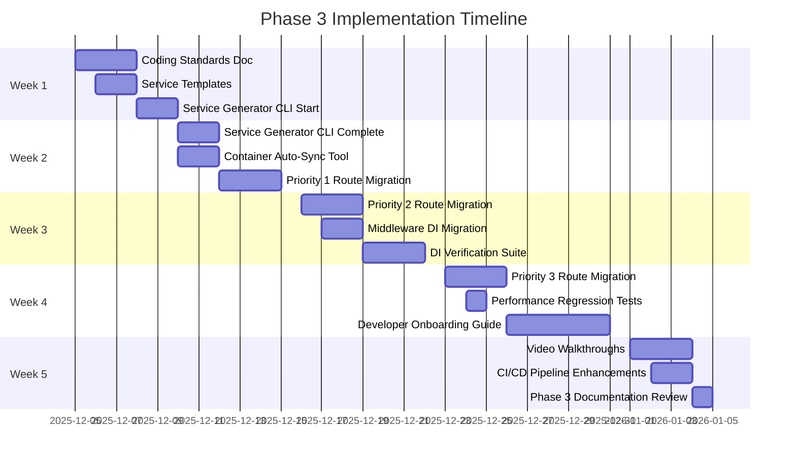

# Phase 3: Standards & Best Practices - Implementation Plan

**Project:** Fleet Management System (fleet-local)
**Phase:** 3 - Standards & Best Practices
**Status:** Planning
**Target Start:** 2025-12-05
**Estimated Duration:** 4-5 weeks

---

## Executive Summary

Phase 3 focuses on establishing coding standards, automating service generation, and extending DI adoption to routes/middleware. This phase builds on the successful Phase 2 migration of 94 services to Awilix DI by codifying best practices and creating developer tools.

---

## Objectives

### Primary Goals
1. ✅ **Establish Coding Standards** - Document DI patterns and best practices
2. ✅ **Automate Service Generation** - RAG-powered service scaffolding
3. ✅ **Extend DI to Routes** - Migrate route handlers to resolve services from container
4. ✅ **Create Developer Tools** - CLI tools for common DI tasks
5. ✅ **Build Verification Suite** - Automated DI correctness testing
6. ✅ **Developer Onboarding** - Comprehensive onboarding guide with examples

### Success Metrics
- **Coding Standards:** Single source of truth document (`CODING_STANDARDS.md`)
- **Service Generation:** <5 minutes to scaffold new service with tests
- **Route Migration:** 50% of routes using container resolution (target)
- **Developer Velocity:** New developers productive within 1 day
- **Test Coverage:** 100% DI resolution tests for all services

---

## Phase 3 Workstreams

### Workstream 1: Coding Standards & Documentation (Week 1)

**Objective:** Establish comprehensive coding standards for DI architecture

#### 1.1 Create `CODING_STANDARDS.md`

**Content Sections:**
```markdown
# Fleet Management - Coding Standards

## 1. Service Architecture
- Service class structure and naming conventions
- Constructor injection patterns
- Lifetime management (SINGLETON, TRANSIENT, SCOPED)
- Service dependencies and circular dependency prevention

## 2. Database Access Patterns
- Always use injected `this.db: Pool`
- Parameterized queries only ($1, $2, $3)
- Transaction management with DI
- Connection pool best practices

## 3. Error Handling
- Service-level error handling standards
- Logging patterns with injected logger
- Error propagation to routes
- User-facing error messages

## 4. Testing Patterns
- Unit testing with mocked dependencies
- Integration testing with DI container
- Service resolution testing
- Database mocking strategies

## 5. Type Safety
- TypeScript strict mode compliance
- Service interface definitions
- Generic type patterns for services
- Return type annotations

## 6. Security Standards
- No hardcoded secrets
- Environment variable management
- Input validation at service level
- SQL injection prevention checklist
```

**Deliverable:** `CODING_STANDARDS.md` (30-40 pages)
**Estimated Time:** 8-12 hours
**Owner:** Lead Engineer + AI Assistant

---

#### 1.2 Create Service Template Library

**Templates to Create:**
1. **Basic CRUD Service Template** (`templates/basic-crud.service.template.ts`)
2. **AI/ML Service Template** (`templates/ai-service.template.ts`)
3. **Integration Service Template** (`templates/integration.service.template.ts`)
4. **Document Service Template** (`templates/document.service.template.ts`)

**Example: Basic CRUD Service Template**
```typescript
import { Pool } from 'pg'

export interface I{{ServiceName}} {
  getAll(tenantId: string): Promise<{{EntityType}}[]>
  getById(id: string, tenantId: string): Promise<{{EntityType}} | null>
  create(data: Create{{EntityType}}Dto, tenantId: string): Promise<{{EntityType}}>
  update(id: string, data: Update{{EntityType}}Dto, tenantId: string): Promise<{{EntityType}}>
  delete(id: string, tenantId: string): Promise<void>
}

/**
 * {{ServiceDescription}}
 *
 * Dependencies: Database connection pool
 * Lifetime: SINGLETON
 */
export class {{ServiceName}} implements I{{ServiceName}} {
  constructor(private db: Pool) {}

  async getAll(tenantId: string): Promise<{{EntityType}}[]> {
    const result = await this.db.query(
      `SELECT * FROM {{table_name}} WHERE tenant_id = $1 ORDER BY created_at DESC`,
      [tenantId]
    )
    return result.rows
  }

  async getById(id: string, tenantId: string): Promise<{{EntityType}} | null> {
    const result = await this.db.query(
      `SELECT * FROM {{table_name}} WHERE id = $1 AND tenant_id = $2`,
      [id, tenantId]
    )
    return result.rows[0] || null
  }

  async create(data: Create{{EntityType}}Dto, tenantId: string): Promise<{{EntityType}}> {
    const result = await this.db.query(
      `INSERT INTO {{table_name}} (tenant_id, {{fields}})
       VALUES ($1, {{placeholders}})
       RETURNING *`,
      [tenantId, ...Object.values(data)]
    )
    return result.rows[0]
  }

  async update(id: string, data: Update{{EntityType}}Dto, tenantId: string): Promise<{{EntityType}}> {
    const result = await this.db.query(
      `UPDATE {{table_name}}
       SET {{update_sets}}, updated_at = CURRENT_TIMESTAMP
       WHERE id = $1 AND tenant_id = $2
       RETURNING *`,
      [id, tenantId, ...Object.values(data)]
    )
    if (result.rows.length === 0) {
      throw new Error(`{{EntityType}} not found: ${id}`)
    }
    return result.rows[0]
  }

  async delete(id: string, tenantId: string): Promise<void> {
    await this.db.query(
      `DELETE FROM {{table_name}} WHERE id = $1 AND tenant_id = $2`,
      [id, tenantId]
    )
  }
}

export default {{ServiceName}}
```

**Deliverable:** 4 service templates + test templates
**Estimated Time:** 6-8 hours

---

### Workstream 2: RAG-Powered Service Generator (Week 1-2)

**Objective:** Create CLI tool to generate services using templates and RAG patterns

#### 2.1 Build Service Generator CLI

**Tool Name:** `npm run generate:service`

**Features:**
```bash
# Interactive mode
npm run generate:service

# Command-line mode
npm run generate:service -- \
  --name=PaymentService \
  --tier=2 \
  --type=crud \
  --table=payments \
  --entity=Payment

# Generated files:
# - api/src/services/payment.service.ts
# - api/src/services/__tests__/payment.service.test.ts
# - api/src/types/payment.types.ts
# - Updates api/src/container.ts (registration + interface)
```

**Implementation Stack:**
- **Language:** TypeScript/Node.js
- **CLI Framework:** Commander.js or Inquirer.js
- **Template Engine:** Handlebars or EJS
- **RAG Integration:** Use lessons learned from `LESSONS_LEARNED_RAG_CAG.md`

**Generator Logic:**
1. Prompt for service details (name, tier, type, dependencies)
2. Select appropriate template based on type
3. Apply RAG patterns from lessons learned
4. Generate service class with constructor injection
5. Generate test file with mocked dependencies
6. Generate TypeScript types/interfaces
7. Auto-update `container.ts` with registration
8. Run `prettier` and `eslint --fix` on generated files

**Deliverable:** CLI tool in `scripts/generators/service-generator.ts`
**Estimated Time:** 2-3 days

---

#### 2.2 Container Registration Auto-Sync

**Tool Name:** `npm run container:sync`

**Purpose:** Automatically detect services and update `container.ts`

**Algorithm:**
```typescript
// Scan api/src/services/**/*.ts for service classes
// Extract: class name, file path, dependencies
// Generate:
//   - Import statements
//   - DIContainer interface entries
//   - Registration blocks with SINGLETON lifetime
// Write to container.ts (preserve custom registrations)
```

**Features:**
- AST parsing with TypeScript Compiler API
- Detect constructor parameters for dependency analysis
- Preserve manual customizations in container.ts
- Dry-run mode (`--dry-run`) to preview changes
- Integration with pre-commit hook

**Deliverable:** CLI tool in `scripts/generators/container-sync.ts`
**Estimated Time:** 1-2 days

---

### Workstream 3: Route DI Adoption (Week 2-3)

**Objective:** Migrate route handlers from direct pool imports to container resolution

#### 3.1 Route Migration Strategy

**Current Pattern (Legacy):**
```typescript
// routes/vehicles.ts
import pool from '../config/database'
import vehicleService from '../services/vehicle.service' // Singleton import

router.get('/vehicles', async (req, res) => {
  const result = await pool.query('SELECT * FROM vehicles WHERE tenant_id = $1', [tenantId])
  // OR
  const vehicles = await vehicleService.getAllVehicles(tenantId)
  res.json(result.rows)
})
```

**New Pattern (DI):**
```typescript
// routes/vehicles.ts
import { container } from '../container'
import type { VehicleService } from '../services/vehicle.service'

router.get('/vehicles', async (req, res) => {
  const vehicleService = container.resolve<VehicleService>('vehicleService')
  const vehicles = await vehicleService.getAllVehicles(tenantId)
  res.json(vehicles)
})
```

**Benefits:**
- Services testable with mocked dependencies
- No direct database access in routes
- Clear separation of concerns
- Easy to swap service implementations

#### 3.2 Route Migration Targets

**Priority 1: High-Traffic Routes (Week 2)**
- `routes/vehicles.ts` (core entity)
- `routes/drivers.ts` (core entity)
- `routes/maintenance.ts` (core entity)
- `routes/auth.ts` (authentication critical)

**Priority 2: CRUD Routes (Week 3)**
- `routes/fuel.ts`
- `routes/inspections.ts`
- `routes/work-orders.ts`
- `routes/assets.ts`
- `routes/trips.ts`

**Priority 3: Integration Routes (Week 4)**
- `routes/microsoft-auth.ts`
- `routes/smartcar.routes.ts`
- `routes/telematics.ts`

**Estimated Time:** 2-3 days per priority group

---

#### 3.3 Middleware DI Migration

**Objective:** Update middleware to use container resolution

**Middleware to Migrate:**
1. `middleware/auth.ts` - Resolve authService from container
2. `middleware/rbac.ts` - Resolve permissionService from container
3. `middleware/audit.ts` - Resolve auditService from container
4. `middleware/tenant-context.ts` - Resolve tenantService from container

**Pattern:**
```typescript
// Before
import pool from '../config/database'

export async function authMiddleware(req, res, next) {
  const result = await pool.query('SELECT * FROM users WHERE id = $1', [userId])
  // ...
}

// After
import { container } from '../container'

export async function authMiddleware(req, res, next) {
  const authService = container.resolve('authService')
  const user = await authService.getUserById(userId)
  // ...
}
```

**Estimated Time:** 1-2 days

---

### Workstream 4: Migration Verification Suite (Week 3-4)

**Objective:** Automated testing for DI correctness and migration completeness

#### 4.1 DI Resolution Tests (Expanded)

**Test File:** `api/src/__tests__/di-verification-complete.test.ts`

**Test Categories:**
1. **Service Resolution:** All 94 services resolve without errors
2. **Constructor Injection:** All services have `db` property
3. **Lifetime Verification:** SINGLETON services return same instance
4. **Circular Dependency Detection:** No circular dependencies exist
5. **Route Container Usage:** Routes resolve services from container
6. **Middleware Container Usage:** Middleware resolves services from container

**Example Test:**
```typescript
describe('DI Architecture Verification Suite', () => {
  describe('Service Resolution', () => {
    test.each(getAllServiceNames())('Service %s resolves correctly', (serviceName) => {
      expect(() => container.resolve(serviceName)).not.toThrow()
    })
  })

  describe('Constructor Injection', () => {
    test('All services have database pool injected', () => {
      const services = getAllServiceInstances()
      services.forEach(service => {
        expect(service).toHaveProperty('db')
        expect(service.db).toBeDefined()
      })
    })
  })

  describe('Lifetime Management', () => {
    test('SINGLETON services return same instance', () => {
      const service1 = container.resolve('vehicleService')
      const service2 = container.resolve('vehicleService')
      expect(service1).toBe(service2)
    })
  })

  describe('Circular Dependencies', () => {
    test('No circular dependencies detected', () => {
      expect(() => detectCircularDependencies(container)).not.toThrow()
    })
  })
})
```

**Deliverable:** Comprehensive test suite (200+ tests)
**Estimated Time:** 2-3 days

---

#### 4.2 Performance Regression Tests

**Test File:** `api/src/__tests__/di-performance.test.ts`

**Metrics to Track:**
- Service resolution time (<1ms per service)
- Container initialization time (<100ms)
- Query performance (unchanged from pre-DI baseline)
- Memory usage (similar to pre-DI)

**Benchmarking Tool:** `benchmark.js`

**Estimated Time:** 1 day

---

### Workstream 5: Developer Onboarding (Week 4-5)

**Objective:** Comprehensive guide for new developers

#### 5.1 Create `DEVELOPER_ONBOARDING.md`

**Content Outline:**
```markdown
# Fleet Management - Developer Onboarding Guide

## Welcome to Fleet Management! 🚀

## 1. Architecture Overview
- System architecture diagrams (Mermaid.js)
- Multi-tier service organization
- DI container explanation
- Data flow diagrams

## 2. Development Environment Setup
- Prerequisites (Node.js, PostgreSQL, Docker)
- Clone repository and install dependencies
- Environment variable configuration
- Database setup and migrations
- Running the application locally

## 3. Dependency Injection Architecture
- What is DI and why we use it
- Awilix container overview
- Service registration patterns
- Resolving services in routes/middleware
- Testing with mocked dependencies

## 4. Common Development Tasks
### 4.1 Creating a New Service
- Using the service generator CLI
- Manual service creation (if needed)
- Registering in container
- Writing tests

### 4.2 Creating a New Route
- Resolving services from container
- Request/response patterns
- Error handling
- Authentication and authorization

### 4.3 Database Migrations
- Creating migration files
- Running migrations locally
- Rollback procedures

### 4.4 Writing Tests
- Unit testing services
- Integration testing routes
- Mocking dependencies
- Running tests locally

## 5. Code Review Guidelines
- PR checklist
- What reviewers look for
- Common feedback themes

## 6. Common Pitfalls and Solutions
- Circular dependencies (how to detect and fix)
- Database connection management
- Service lifetime issues
- TypeScript type errors

## 7. Getting Help
- Documentation resources
- Team contacts
- Slack channels
- Issue tracking
```

**Deliverable:** 50-60 page comprehensive guide
**Estimated Time:** 1 week

---

#### 5.2 Create Video Walkthrough

**Content:**
- 10-minute: Architecture overview
- 15-minute: Creating your first service with DI
- 20-minute: Migrating a route to use DI
- 15-minute: Testing strategies with DI

**Deliverable:** 4 video tutorials on Loom/YouTube
**Estimated Time:** 2-3 days

---

### Workstream 6: CI/CD Pipeline Enhancements (Week 5)

**Objective:** Integrate Phase 3 verification into Azure DevOps pipeline

#### 6.1 Update `azure-pipelines.yml`

**New Jobs to Add:**
1. **Coding Standards Validation**
   - Lint check with custom ESLint rules
   - Check for direct pool imports in services
   - Verify all services registered in container

2. **Performance Benchmarks**
   - Run DI performance tests
   - Compare against baseline
   - Fail if >10% regression

3. **Documentation Validation**
   - Check that new services have JSDoc comments
   - Verify README files are up to date
   - Validate TypeScript interface exports

**Deliverable:** Updated `azure-pipelines.yml`
**Estimated Time:** 1-2 days

---

## Phase 3 Timeline



---

## Risk Assessment

| Risk | Probability | Impact | Mitigation |
|------|-------------|--------|------------|
| **Route migration breaks existing functionality** | Medium | High | Comprehensive integration tests before migration |
| **Developer adoption of new standards** | Medium | Medium | Clear documentation + video tutorials |
| **Performance regression from DI in routes** | Low | Medium | Benchmark tests + monitoring |
| **Service generator produces invalid code** | Low | Medium | Extensive testing + manual review |
| **Circular dependency issues** | Low | High | Automated detection in pipeline |

---

## Success Criteria

### Phase 3 Complete When:
- ✅ `CODING_STANDARDS.md` published and reviewed by team
- ✅ Service generator CLI operational and tested
- ✅ Container auto-sync tool integrated into workflow
- ✅ 50%+ of high-traffic routes migrated to DI
- ✅ All middleware using container resolution
- ✅ Comprehensive verification suite passing (200+ tests)
- ✅ Developer onboarding guide published
- ✅ Video walkthroughs available
- ✅ CI/CD pipeline includes Phase 3 checks

---

## Resources Required

### Personnel
- **Lead Engineer:** 4-5 weeks (full-time)
- **AI Assistant (Claude Code):** On-demand support
- **Code Reviewer:** 5-10 hours/week
- **Technical Writer:** 1 week (onboarding guide)
- **Video Producer:** 2-3 days (walkthroughs)

### Infrastructure
- Azure DevOps pipeline (existing)
- Development/staging environments
- Video hosting (Loom/YouTube)

### Budget Estimate
- **Personnel:** ~$20,000-$30,000 (based on 4-5 weeks engineering time)
- **Tools/Services:** ~$500 (video hosting, design tools)
- **Total:** ~$20,500-$30,500

---

## Next Steps (Immediate)

1. **Review and approve Phase 3 plan** with stakeholders
2. **Schedule kickoff meeting** for Week 1 (2025-12-05)
3. **Assign workstream owners** for parallel execution
4. **Set up tracking board** in Azure DevOps (sprint planning)
5. **Create Phase 3 feature branch** from main

---

**Document Status:** ✅ COMPLETE - Ready for Review
**Last Updated:** 2025-12-04 12:05 PM
**Next Review:** Phase 3 Kickoff Meeting

---

**Prepared By:** Claude Code + Andrew Morton
**Approved By:** _[Pending]_
**Classification:** Internal - Project Planning
