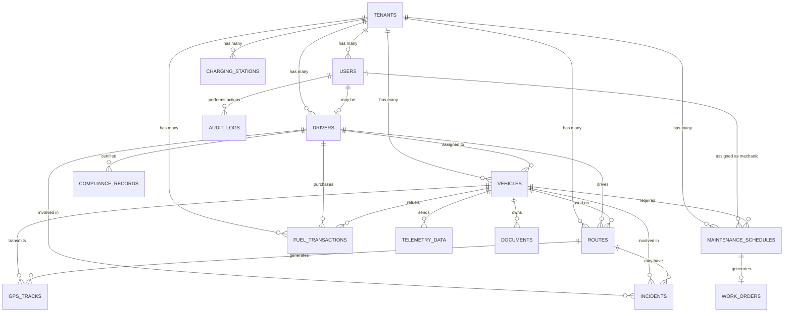

# Fleet Management System - Seed Data Architecture

**Version:** 1.0
**Created:** 2026-01-08
**Status:** Design Phase
**Purpose:** Browser-first E2E Testing & Development

---

## Executive Summary

This document defines a comprehensive, deterministic seed data architecture for the Fleet Management System that supports browser-first E2E testing, development workflows, and demonstration scenarios. The architecture emphasizes realistic data patterns, referential integrity, and performance-optimized reset mechanisms.

### Key Design Principles

1. **Deterministic Generation**: All UUIDs, timestamps, and relationships are reproducible across resets
2. **Realistic Data Patterns**: Reflects real-world fleet operations with authentic distributions and correlations
3. **Persona-Based Testing**: 8 user personas with distinct workflows and access patterns
4. **Multi-Tenant Isolation**: 3 tenant organizations representing small/medium/large fleet sizes
5. **Time-Series Realism**: Historical data patterns that mirror actual fleet operations
6. **Performance First**: Complete seed generation in < 10 seconds, reset in < 5 seconds
7. **E2E Test Coverage**: Supports all critical user journeys and edge cases

### Data Volume Summary

| Entity | Total Records | Small Tenant | Medium Tenant | Large Tenant |
|--------|--------------|--------------|---------------|--------------|
| **Tenants** | 3 | 1 | 1 | 1 |
| **Users** | 32 | 8 | 12 | 12 |
| **Drivers** | 75 | 10 | 25 | 40 |
| **Vehicles** | 150 | 15 | 50 | 85 |
| **Routes** | 500 | 60 | 180 | 260 |
| **Maintenance Schedules** | 400 | 45 | 140 | 215 |
| **Work Orders** | 300 | 35 | 105 | 160 |
| **Fuel Transactions** | 2,400 | 300 | 800 | 1,300 |
| **GPS Tracks** | 50,000 | 5,000 | 18,000 | 27,000 |
| **Telemetry Data** | 25,000 | 2,500 | 9,000 | 13,500 |
| **Incidents** | 120 | 15 | 40 | 65 |
| **Documents** | 200 | 25 | 70 | 105 |
| **Compliance Records** | 180 | 20 | 60 | 100 |
| **Charging Stations** | 45 | 5 | 15 | 25 |
| **Audit Logs** | 1,500 | 200 | 500 | 800 |
| **TOTAL** | **81,405** | **8,238** | **28,987** | **44,180** |

---

## 1. Entity Relationship Architecture

### 1.1 Core Entity Graph



### 1.2 Cardinality Specifications

| Parent Entity | Child Entity | Relationship | Avg Per Parent | Distribution |
|---------------|--------------|--------------|----------------|--------------|
| Tenant | Users | 1:N | 10-12 | Role-based: 1 Admin, 1 Manager, 2 Dispatchers, 1 Mechanic, 2 Supervisors, 3-5 Drivers |
| Tenant | Vehicles | 1:N | 15-85 | Fleet size: Small (10-20), Medium (40-60), Large (70-100) |
| Tenant | Drivers | 1:N | 10-40 | 1.2x vehicle count (allows rotation) |
| Vehicle | Routes | 1:N | 3.3 | Active vehicles: 2-5 routes/month |
| Vehicle | Fuel Transactions | 1:N | 16 | 2x/week for active vehicles |
| Vehicle | Maintenance Schedules | 1:N | 2.7 | Quarterly preventive + ad-hoc corrective |
| Vehicle | GPS Tracks | 1:N | 333 | 1 point/minute during active routes |
| Vehicle | Telemetry Data | 1:N | 167 | 1 reading/2 minutes during operation |
| Route | GPS Tracks | 1:N | 100 | 90-minute avg route with 1/min sampling |
| Driver | Routes | 1:N | 6.7 | 5-10 routes per active driver |
| Driver | Incidents | 1:N | 1.6 | 80% drivers: 0, 15%: 1, 5%: 2-3 |
| Maintenance Schedule | Work Orders | 1:1 or 1:0 | 0.75 | 75% generate work orders |

---

## 2. Tenant Organization Profiles

### 2.1 Tenant #1: "CityFleet Municipal Services" (Small)

**Profile:**
- Municipal government fleet
- 15 vehicles (mix of sedans, trucks, specialty vehicles)
- 10 drivers
- 8 staff users
- Focus: City services, utilities, public works
- Geographic: Single city (40 sq mi coverage area)

**Characteristics:**
- High vehicle utilization (60-70% daily)
- Strict compliance requirements
- Regular maintenance schedules
- Low incident rate
- Limited EV adoption (1 electric vehicle)

**Data Volumes:**
- Vehicles: 15 (10 active, 3 idle, 1 maintenance, 1 retired)
- Drivers: 10 (8 active, 1 on_leave, 1 training)
- Routes: 60 (40 completed, 12 in_progress, 8 pending)
- Maintenance: 45 records (30 completed, 10 pending, 5 overdue)
- Fuel Transactions: 300 (6 months history)
- GPS Tracks: 5,000 points
- Incidents: 15 (mostly minor)

### 2.2 Tenant #2: "LogiTrans Regional Delivery" (Medium)

**Profile:**
- Regional logistics and delivery company
- 50 vehicles (primarily vans, some trucks)
- 25 drivers
- 12 staff users
- Focus: Last-mile delivery, regional distribution
- Geographic: Multi-state coverage (300 sq mi)

**Characteristics:**
- Very high vehicle utilization (85-90% daily)
- High route optimization needs
- Moderate maintenance demands
- Higher incident rate (delivery accidents)
- Growing EV fleet (8 electric vans)

**Data Volumes:**
- Vehicles: 50 (42 active, 4 idle, 3 service, 1 emergency)
- Drivers: 25 (22 active, 2 inactive, 1 suspended)
- Routes: 180 (120 completed, 35 in_progress, 25 pending)
- Maintenance: 140 records (95 completed, 30 pending, 15 overdue)
- Fuel Transactions: 800 (6 months history)
- GPS Tracks: 18,000 points
- Incidents: 40 (various severities)

### 2.3 Tenant #3: "MegaCorp Enterprise Fleet" (Large)

**Profile:**
- Fortune 500 enterprise fleet
- 85 vehicles (diverse mix: sedans, SUVs, trucks, buses, specialty)
- 40 drivers
- 12 staff users
- Focus: Corporate campus shuttle, sales fleet, facilities
- Geographic: Multi-campus (500 sq mi)

**Characteristics:**
- Moderate vehicle utilization (50-60% daily)
- Complex routing (shuttles + field staff)
- High compliance focus
- Advanced telematics adoption
- Significant EV investment (15 electric vehicles + 25 charging stations)

**Data Volumes:**
- Vehicles: 85 (60 active, 15 idle, 6 charging, 3 maintenance, 1 retired)
- Drivers: 40 (35 active, 3 inactive, 1 on_leave, 1 terminated)
- Routes: 260 (180 completed, 45 in_progress, 35 pending)
- Maintenance: 215 records (150 completed, 40 pending, 25 overdue)
- Fuel Transactions: 1,300 (6 months history)
- GPS Tracks: 27,000 points
- Incidents: 65 (comprehensive reporting)

---

## 3. User Persona Definitions

### 3.1 Persona Matrix

Each tenant has a complete set of user personas representing all RBAC roles:

| Persona ID | Role | Name | Email Pattern | Primary Workflows |
|------------|------|------|---------------|-------------------|
| **P1** | Admin | Alice Administrator | alice.admin@{tenant}.com | System configuration, user management, policy settings |
| **P2** | Manager | Mike Manager | mike.manager@{tenant}.com | Fleet oversight, reporting, budget management |
| **P3** | Supervisor | Sarah Supervisor | sarah.supervisor@{tenant}.com | Daily operations, driver coordination |
| **P4** | Dispatcher | Dana Dispatcher | dana.dispatcher@{tenant}.com | Route planning, vehicle assignments |
| **P5** | Mechanic | Max Mechanic | max.mechanic@{tenant}.com | Maintenance work, inspections, repairs |
| **P6** | Driver | David Driver | david.driver@{tenant}.com | Route execution, fuel logging |
| **P7** | Viewer | Victor Viewer | victor.viewer@{tenant}.com | Read-only reporting, audits |
| **P8** | SuperAdmin | System Root | root@fleet-system.local | Cross-tenant administration (only in Tenant #1) |

### 3.2 Persona-Based Test Scenarios

#### **Persona P1: Alice Administrator (Admin)**

**Test Scenarios:**
1. **User Management**: Create new driver accounts, assign roles, deactivate users
2. **Vehicle Lifecycle**: Add new vehicles, update metadata, retire vehicles
3. **Policy Configuration**: Set maintenance intervals, configure notifications
4. **Audit Review**: Access complete audit logs, compliance reports
5. **Edge Case**: Attempt cross-tenant access (should fail)

**Seed Data Requirements:**
- Has created 60% of users in tenant
- Modified tenant settings 15 times (audit trail)
- Created 20% of vehicles
- Last login: 1 day ago

#### **Persona P2: Mike Manager (Manager)**

**Test Scenarios:**
1. **Fleet Dashboard**: View executive KPIs, utilization metrics
2. **Route Approval**: Review and approve high-cost routes
3. **Maintenance Oversight**: Review overdue maintenance, approve work orders
4. **Reporting**: Generate monthly reports (fuel spend, incidents, utilization)
5. **Edge Case**: Cannot delete vehicles (permission denied)

**Seed Data Requirements:**
- Has approved 80% of completed work orders
- Generated 12 monthly reports (documents table)
- Modified 10 maintenance schedules
- Last login: 2 hours ago

#### **Persona P3: Sarah Supervisor (Supervisor)**

**Test Scenarios:**
1. **Driver Coordination**: Assign drivers to routes, manage schedules
2. **Route Monitoring**: Track in-progress routes, handle delays
3. **Driver Performance**: Review safety scores, incident reports
4. **Edge Case**: Cannot modify completed routes (status check)

**Seed Data Requirements:**
- Assigned drivers to 150 routes
- Updated 30 driver records (phone, status)
- Created 20 incident reports
- Last login: 30 minutes ago

#### **Persona P4: Dana Dispatcher (Dispatcher)**

**Test Scenarios:**
1. **Route Creation**: Create multi-stop routes, assign vehicles/drivers
2. **Route Optimization**: Use optimization API, reorder waypoints
3. **Real-Time Updates**: Monitor GPS, update ETAs
4. **Conflict Resolution**: Handle double-booked vehicles
5. **Edge Case**: Create route with non-existent vehicle (IDOR protection)

**Seed Data Requirements:**
- Created 250 routes across all tenants
- Optimized 180 routes
- Updated 100 in-progress routes
- Last login: 15 minutes ago

#### **Persona P5: Max Mechanic (Mechanic)**

**Test Scenarios:**
1. **Work Order Management**: View assigned work orders, update status
2. **Maintenance Logging**: Record completed maintenance, parts used, costs
3. **Vehicle Inspection**: Conduct pre-trip/post-trip inspections
4. **Issue Escalation**: Flag critical repairs, update vehicle status to "service"
5. **Edge Case**: Cannot view fuel transaction costs (permission denied)

**Seed Data Requirements:**
- Assigned to 80 maintenance schedules
- Completed 60 work orders
- Created 25 inspection records (compliance_records)
- Updated 15 vehicles to "maintenance" status
- Last login: 1 hour ago

#### **Persona P6: David Driver (Driver)**

**Test Scenarios:**
1. **My Routes**: View only assigned routes, update route status
2. **Pre-Trip Inspection**: Complete checklist, report issues
3. **Fuel Logging**: Record fuel purchases, upload receipts
4. **Incident Reporting**: Report accidents, upload photos
5. **Edge Case**: Cannot view other drivers' routes (scope check)

**Seed Data Requirements:**
- Assigned to 15 active/completed routes
- Logged 40 fuel transactions
- Completed 30 pre-trip inspections
- Reported 2 incidents
- Last login: 3 hours ago (currently on route)

#### **Persona P7: Victor Viewer (Viewer)**

**Test Scenarios:**
1. **Read-Only Dashboards**: View all dashboards without edit capability
2. **Report Generation**: Export data, generate compliance reports
3. **Audit Logs**: View audit history for compliance review
4. **Edge Case**: Attempt to create route (permission denied)

**Seed Data Requirements:**
- Generated 20 reports (documents table)
- Viewed 500+ resources (audit logs)
- Never modified any records
- Last login: 4 days ago

#### **Persona P8: System Root (SuperAdmin)**

**Test Scenarios:**
1. **Cross-Tenant Access**: View data from all 3 tenants
2. **System Health**: Access system health endpoints, monitoring dashboards
3. **Tenant Management**: Create new tenant, modify tenant settings
4. **Global Policies**: Set system-wide configuration
5. **Edge Case**: Only persona with global scope

**Seed Data Requirements:**
- Exists only in Tenant #1
- Created all 3 tenants
- Modified system-wide settings 8 times
- Last login: 1 week ago

---

## 4. Data Factory Patterns

### 4.1 Deterministic ID Generation

All UUIDs are generated deterministically using namespace UUIDs (v5) for reproducibility.

**Namespace UUIDs:**
```typescript
const NAMESPACES = {
  TENANT: '00000000-0000-5000-8000-000000000001',
  USER: '00000000-0000-5000-8000-000000000002',
  VEHICLE: '00000000-0000-5000-8000-000000000003',
  DRIVER: '00000000-0000-5000-8000-000000000004',
  ROUTE: '00000000-0000-5000-8000-000000000005',
  MAINTENANCE: '00000000-0000-5000-8000-000000000006',
  FUEL: '00000000-0000-5000-8000-000000000007',
  GPS: '00000000-0000-5000-8000-000000000008',
  TELEMETRY: '00000000-0000-5000-8000-000000000009',
  INCIDENT: '00000000-0000-5000-8000-00000000000A',
};
```

**ID Generation Pattern:**
```typescript
import { v5 as uuidv5 } from 'uuid';

function generateDeterministicId(namespace: string, name: string): string {
  return uuidv5(name, namespace);
}

// Example: Generate tenant ID
const tenantId = generateDeterministicId(
  NAMESPACES.TENANT,
  'CityFleet Municipal Services'
);
// Result: Always produces the same UUID for this tenant name
```

### 4.2 Timestamp Generation Strategy

**Base Timestamp:** `2025-09-01T00:00:00Z` (September 1, 2025)
- 6 months of historical data
- Current simulation date: `2026-01-08T00:00:00Z`

**Timestamp Patterns:**

| Entity | Timestamp Logic |
|--------|----------------|
| Tenants | `created_at`: Base timestamp - 365 days |
| Users | `created_at`: Tenant creation + (role_index * 7 days) |
| Vehicles | `created_at`: Tenant creation + (30 to 180 days ago) |
| Routes | `planned_start_time`: Last 90 days, distributed by weekday |
| Maintenance | `scheduled_date`: Based on vehicle age + mileage intervals |
| Fuel Transactions | `transaction_date`: Every 3-4 days per vehicle |
| GPS Tracks | `timestamp`: Route start time + (1-minute intervals) |
| Telemetry | `timestamp`: GPS timestamp (every other point) |

**Example: Route Timestamp Distribution**
```typescript
function generateRouteTimestamps(vehicleId: string, count: number) {
  const now = new Date('2026-01-08T00:00:00Z');
  const ninetyDaysAgo = new Date(now.getTime() - (90 * 24 * 60 * 60 * 1000));

  const timestamps = [];
  for (let i = 0; i < count; i++) {
    // Deterministic date selection based on vehicle ID + index
    const dayOffset = hashToNumber(vehicleId + i) % 90;
    const date = new Date(ninetyDaysAgo.getTime() + (dayOffset * 24 * 60 * 60 * 1000));

    // Skip weekends for weekday-only routes
    if (date.getDay() === 0 || date.getDay() === 6) {
      continue;
    }

    // Set time to business hours (6 AM - 6 PM)
    const hourOffset = 6 + (hashToNumber(vehicleId + i + 'hour') % 12);
    date.setHours(hourOffset, 0, 0, 0);

    timestamps.push(date);
  }

  return timestamps.sort((a, b) => a.getTime() - b.getTime());
}
```

### 4.3 Faker.js Factory Patterns

**Library:** `@faker-js/faker` (v8.x)
**Seed:** Fixed seed value `12345` for deterministic generation

```typescript
import { faker } from '@faker-js/faker';

// Initialize with fixed seed
faker.seed(12345);

// Factory pattern examples
const DriverFactory = {
  generate(index: number, tenantId: string) {
    // Re-seed for each driver to ensure determinism
    faker.seed(12345 + index);

    return {
      id: generateDeterministicId(NAMESPACES.DRIVER, `driver-${tenantId}-${index}`),
      tenant_id: tenantId,
      employee_number: `EMP-${String(1000 + index).padStart(5, '0')}`,
      license_number: faker.vehicle.vin().substring(0, 12),
      license_state: faker.location.state({ abbreviated: true }),
      license_expiry: faker.date.future({ years: 2 }),
      status: weightedRandom({
        'active': 0.80,
        'inactive': 0.10,
        'on_leave': 0.05,
        'training': 0.05,
      }),
      hire_date: faker.date.past({ years: 5 }),
      phone: faker.phone.number('###-###-####'),
      email: faker.internet.email(),
      safety_score: faker.number.float({ min: 70, max: 100, precision: 0.01 }),
    };
  },
};

const VehicleFactory = {
  generate(index: number, tenantId: string, type: VehicleType) {
    faker.seed(12345 + 1000 + index);

    const make = faker.vehicle.manufacturer();
    const model = faker.vehicle.model();
    const year = faker.number.int({ min: 2018, max: 2025 });

    return {
      id: generateDeterministicId(NAMESPACES.VEHICLE, `vehicle-${tenantId}-${index}`),
      tenant_id: tenantId,
      vehicle_number: `V-${String(100 + index).padStart(4, '0')}`,
      vin: faker.vehicle.vin(),
      make,
      model,
      year,
      type,
      fuel_type: type === 'electric' ? 'electric' : faker.helpers.arrayElement(['gasoline', 'diesel', 'hybrid']),
      status: weightedRandom({
        'active': 0.70,
        'idle': 0.15,
        'maintenance': 0.10,
        'retired': 0.05,
      }),
      license_plate: faker.vehicle.vrm(),
      current_mileage: faker.number.int({ min: 10000, max: 150000 }),
      metadata: {
        color: faker.vehicle.color(),
        tank_capacity_gallons: type === 'electric' ? null : faker.number.int({ min: 12, max: 30 }),
        battery_capacity_kwh: type === 'electric' ? faker.number.int({ min: 40, max: 100 }) : null,
      },
    };
  },
};
```

### 4.4 Weighted Random Distributions

```typescript
function weightedRandom<T>(weights: Record<string, number>): T {
  const entries = Object.entries(weights);
  const total = entries.reduce((sum, [, weight]) => sum + weight, 0);

  let random = Math.random() * total;

  for (const [value, weight] of entries) {
    random -= weight;
    if (random <= 0) {
      return value as T;
    }
  }

  return entries[entries.length - 1][0] as T;
}
```

**Distribution Tables:**

| Status Type | Values | Distribution |
|-------------|--------|--------------|
| **vehicle_status** | active: 70%, idle: 15%, maintenance: 10%, retired: 5% | |
| **driver_status** | active: 80%, inactive: 10%, on_leave: 5%, training: 5% | |
| **route_status** | completed: 66%, in_progress: 20%, pending: 14% | |
| **maintenance_type** | preventive: 60%, corrective: 25%, inspection: 10%, recall: 3%, upgrade: 2% | |
| **priority** | low: 40%, medium: 35%, high: 20%, critical: 4%, emergency: 1% | |
| **incident_severity** | minor: 60%, moderate: 25%, major: 10%, critical: 4%, fatal: 1% | |

---

## 5. Referential Integrity Constraints

### 5.1 Foreign Key Validation Rules

All foreign key relationships must be validated during seed generation to ensure referential integrity.

**Validation Order (Topological Sort):**
```
1. tenants (no dependencies)
2. users (depends on: tenants)
3. drivers (depends on: tenants, users)
4. facilities (depends on: tenants)
5. charging_stations (depends on: tenants, facilities)
6. vehicles (depends on: tenants, drivers, facilities)
7. routes (depends on: tenants, vehicles, drivers)
8. maintenance_schedules (depends on: tenants, vehicles, users)
9. work_orders (depends on: tenants, maintenance_schedules, vehicles, users)
10. fuel_transactions (depends on: tenants, vehicles, drivers)
11. gps_tracks (depends on: tenants, vehicles, routes)
12. telemetry_data (depends on: tenants, vehicles)
13. incidents (depends on: tenants, vehicles, drivers, routes)
14. documents (depends on: tenants, vehicles, drivers, routes)
15. compliance_records (depends on: tenants, drivers)
16. audit_logs (depends on: tenants, users)
```

### 5.2 Constraint Validation Functions

```typescript
interface ValidationRule {
  field: string;
  validator: (value: any, context: SeedContext) => boolean;
  error: string;
}

const VALIDATION_RULES: Record<string, ValidationRule[]> = {
  vehicles: [
    {
      field: 'tenant_id',
      validator: (id, ctx) => ctx.tenants.has(id),
      error: 'vehicle.tenant_id must reference existing tenant',
    },
    {
      field: 'assigned_driver_id',
      validator: (id, ctx) => !id || ctx.drivers.has(id),
      error: 'vehicle.assigned_driver_id must reference existing driver or be null',
    },
    {
      field: 'vin',
      validator: (vin, ctx) => /^[A-HJ-NPR-Z0-9]{17}$/.test(vin),
      error: 'vehicle.vin must be valid 17-character VIN',
    },
  ],

  routes: [
    {
      field: 'vehicle_id',
      validator: (id, ctx) => ctx.vehicles.has(id),
      error: 'route.vehicle_id must reference existing vehicle',
    },
    {
      field: 'driver_id',
      validator: (id, ctx) => ctx.drivers.has(id),
      error: 'route.driver_id must reference existing driver',
    },
    {
      field: 'planned_start_time',
      validator: (time, ctx) => new Date(time) <= ctx.currentDate,
      error: 'route.planned_start_time cannot be in the future for completed routes',
    },
  ],

  maintenance_schedules: [
    {
      field: 'vehicle_id',
      validator: (id, ctx) => ctx.vehicles.has(id),
      error: 'maintenance.vehicle_id must reference existing vehicle',
    },
    {
      field: 'assigned_mechanic_id',
      validator: (id, ctx) => {
        if (!id) return true;
        const user = ctx.users.get(id);
        return user && user.role === 'Mechanic';
      },
      error: 'maintenance.assigned_mechanic_id must reference user with Mechanic role',
    },
  ],
};
```

### 5.3 Orphaned Record Prevention

**Prevention Strategies:**
1. **Cascading Deletes**: When a parent is marked inactive, child records are flagged
2. **Null Checks**: Optional foreign keys validated before insertion
3. **Existence Checks**: All foreign keys verified against in-memory maps during generation
4. **Cleanup Phase**: Post-generation validation pass removes orphans

```typescript
function validateAndCleanOrphans(seedData: SeedData): ValidationReport {
  const orphans: OrphanRecord[] = [];

  // Check for orphaned vehicles (tenant doesn't exist)
  for (const vehicle of seedData.vehicles) {
    if (!seedData.tenants.some(t => t.id === vehicle.tenant_id)) {
      orphans.push({ table: 'vehicles', id: vehicle.id, reason: 'Missing tenant' });
    }
  }

  // Check for orphaned routes (vehicle or driver doesn't exist)
  for (const route of seedData.routes) {
    if (!seedData.vehicles.some(v => v.id === route.vehicle_id)) {
      orphans.push({ table: 'routes', id: route.id, reason: 'Missing vehicle' });
    }
    if (!seedData.drivers.some(d => d.id === route.driver_id)) {
      orphans.push({ table: 'routes', id: route.id, reason: 'Missing driver' });
    }
  }

  // Remove orphans
  if (orphans.length > 0) {
    console.warn(`Found ${orphans.length} orphaned records, removing...`);
    seedData.routes = seedData.routes.filter(r =>
      !orphans.some(o => o.table === 'routes' && o.id === r.id)
    );
  }

  return {
    totalRecords: calculateTotalRecords(seedData),
    orphansFound: orphans.length,
    orphansRemoved: orphans.length,
    valid: orphans.length === 0,
  };
}
```

---

## 6. Time-Series Data Patterns

### 6.1 GPS Track Generation

**Pattern:** Realistic vehicle movement along routes with GPS noise and sampling intervals.

```typescript
interface GPSTrackConfig {
  vehicle_id: string;
  route_id: string;
  start_location: Coordinates;
  end_location: Coordinates;
  waypoints: Coordinates[];
  start_time: Date;
  duration_minutes: number;
  sampling_interval_seconds: number;
}

function generateGPSTracks(config: GPSTrackConfig): GPSTrack[] {
  const tracks: GPSTrack[] = [];
  const totalPoints = (config.duration_minutes * 60) / config.sampling_interval_seconds;

  // Generate smooth path through waypoints
  const path = interpolateWaypoints([
    config.start_location,
    ...config.waypoints,
    config.end_location,
  ], totalPoints);

  // Add GPS points with realistic noise
  for (let i = 0; i < totalPoints; i++) {
    const timestamp = new Date(
      config.start_time.getTime() + (i * config.sampling_interval_seconds * 1000)
    );

    const point = path[i];

    tracks.push({
      id: generateDeterministicId(NAMESPACES.GPS, `gps-${config.route_id}-${i}`),
      tenant_id: config.vehicle_id.split('-')[0], // Extract tenant from vehicle ID
      vehicle_id: config.vehicle_id,
      timestamp,
      latitude: point.lat + gaussianNoise(0, 0.00003), // ~3 meters accuracy
      longitude: point.lng + gaussianNoise(0, 0.00003),
      speed: calculateSpeed(path, i, config.sampling_interval_seconds),
      heading: calculateHeading(path, i),
      altitude: 100 + gaussianNoise(0, 5),
      accuracy: Math.abs(gaussianNoise(5, 2)),
      ignition_status: true,
      metadata: {},
    });
  }

  return tracks;
}

// Helper: Interpolate smooth path through waypoints
function interpolateWaypoints(waypoints: Coordinates[], totalPoints: number): Coordinates[] {
  // Use Catmull-Rom spline for smooth interpolation
  const path: Coordinates[] = [];
  const segmentPoints = Math.floor(totalPoints / (waypoints.length - 1));

  for (let i = 0; i < waypoints.length - 1; i++) {
    const p0 = waypoints[Math.max(0, i - 1)];
    const p1 = waypoints[i];
    const p2 = waypoints[i + 1];
    const p3 = waypoints[Math.min(waypoints.length - 1, i + 2)];

    for (let j = 0; j < segmentPoints; j++) {
      const t = j / segmentPoints;
      path.push(catmullRomSpline(p0, p1, p2, p3, t));
    }
  }

  return path;
}

// Helper: Calculate realistic speed based on path geometry
function calculateSpeed(path: Coordinates[], index: number, interval: number): number {
  if (index === 0) return 0;

  const prev = path[index - 1];
  const curr = path[index];
  const distance = haversineDistance(prev, curr); // meters
  const speed = (distance / interval) * 2.23694; // convert m/s to mph

  // Add realistic variation (traffic, stops)
  return Math.max(0, speed + gaussianNoise(0, 5));
}
```

**GPS Track Distributions:**

| Route Type | Avg Duration | Avg Points | Sampling Rate | Pattern |
|------------|--------------|------------|---------------|---------|
| City Delivery | 45 min | 45 | 60s | Frequent stops, low speed |
| Highway Transit | 120 min | 120 | 60s | Steady speed, fewer turns |
| Shuttle Loop | 30 min | 60 | 30s | Repetitive pattern, fixed stops |
| Emergency Response | 15 min | 30 | 30s | High speed, direct path |

### 6.2 Telemetry Data Patterns

**Pattern:** OBD-II sensor data correlated with GPS tracks.

```typescript
function generateTelemetryData(gpsTracks: GPSTrack[], vehicle: Vehicle): TelemetryData[] {
  const telemetry: TelemetryData[] = [];

  // Sample every other GPS point (2-minute intervals)
  for (let i = 0; i < gpsTracks.length; i += 2) {
    const gpsPoint = gpsTracks[i];
    const speed = gpsPoint.speed || 0;

    telemetry.push({
      id: generateDeterministicId(NAMESPACES.TELEMETRY, `telemetry-${gpsPoint.id}`),
      tenant_id: gpsPoint.tenant_id,
      vehicle_id: vehicle.id,
      timestamp: gpsPoint.timestamp,

      // Engine RPM correlated with speed
      engine_rpm: calculateRPM(speed, vehicle.metadata.transmission_type || 'automatic'),

      speed,

      // Fuel level decreases over time
      fuel_level_percent: calculateFuelLevel(i, gpsTracks.length, vehicle.fuel_type),

      // Coolant temp stabilizes after 10 minutes
      coolant_temp: Math.min(195 + gaussianNoise(0, 5), 180 + (i * 1.5)),

      // Oil pressure normal range
      oil_pressure: 30 + gaussianNoise(0, 5),

      // Battery voltage stable
      battery_voltage: vehicle.fuel_type === 'electric' ? 400 + gaussianNoise(0, 10) : 12.6 + gaussianNoise(0, 0.3),

      // Odometer increments
      odometer: vehicle.current_mileage + Math.floor((gpsPoint.distance_traveled || 0) * 0.000621371), // meters to miles

      // DTC codes (rare)
      dtc_codes: Math.random() < 0.02 ? generateDTCCodes() : [],

      raw_data: {},
    });
  }

  return telemetry;
}

function calculateRPM(speed_mph: number, transmissionType: string): number {
  // Simplified RPM calculation
  const baseRPM = transmissionType === 'manual' ? 2500 : 2000;
  const rpmPerMph = 30;
  return Math.max(800, Math.min(6000, baseRPM + (speed_mph * rpmPerMph) + gaussianNoise(0, 100)));
}

function calculateFuelLevel(currentIndex: number, totalPoints: number, fuelType: string): number {
  if (fuelType === 'electric') {
    // EV battery drains ~1% per 2 miles at avg speed
    return Math.max(20, 100 - (currentIndex / totalPoints) * 80);
  } else {
    // ICE fuel drains ~2% per 10 minutes
    return Math.max(15, 100 - (currentIndex / totalPoints) * 85);
  }
}
```

### 6.3 Maintenance Schedule Time-Series

**Pattern:** Preventive maintenance based on mileage intervals + time intervals.

```typescript
interface MaintenanceRule {
  type: MaintenanceType;
  interval_miles?: number;
  interval_months?: number;
  description: string;
}

const MAINTENANCE_RULES: MaintenanceRule[] = [
  { type: 'preventive', interval_miles: 5000, description: 'Oil change and filter replacement' },
  { type: 'preventive', interval_miles: 10000, description: 'Tire rotation and brake inspection' },
  { type: 'preventive', interval_miles: 30000, description: 'Transmission fluid service' },
  { type: 'preventive', interval_months: 12, description: 'Annual safety inspection' },
  { type: 'inspection', interval_months: 6, description: 'DOT compliance inspection' },
];

function generateMaintenanceSchedules(vehicle: Vehicle, currentDate: Date): MaintenanceSchedule[] {
  const schedules: MaintenanceSchedule[] = [];
  const vehicleAge = differenceInMonths(currentDate, vehicle.created_at);
  const mileageSinceNew = vehicle.current_mileage - 0; // Assume 0 starting mileage

  // Generate historical preventive maintenance
  for (const rule of MAINTENANCE_RULES) {
    if (rule.interval_miles) {
      const count = Math.floor(mileageSinceNew / rule.interval_miles);

      for (let i = 1; i <= count; i++) {
        const mileageAtService = i * rule.interval_miles;
        const scheduledDate = estimateDateAtMileage(vehicle, mileageAtService);

        schedules.push({
          id: generateDeterministicId(NAMESPACES.MAINTENANCE, `maint-${vehicle.id}-${rule.type}-${i}`),
          tenant_id: vehicle.tenant_id,
          vehicle_id: vehicle.id,
          type: rule.type,
          description: rule.description,
          scheduled_date: scheduledDate,
          completed_date: Math.random() < 0.75 ? scheduledDate : null, // 75% completed on time
          status: Math.random() < 0.75 ? 'completed' : 'overdue',
          priority: 'medium',
          assigned_mechanic_id: null, // Assigned later
          mileage_at_service: mileageAtService,
          cost: faker.number.int({ min: 100, max: 1500 }),
          notes: '',
        });
      }
    }

    if (rule.interval_months) {
      const count = Math.floor(vehicleAge / rule.interval_months);

      for (let i = 1; i <= count; i++) {
        const scheduledDate = addMonths(vehicle.created_at, i * rule.interval_months);

        schedules.push({
          id: generateDeterministicId(NAMESPACES.MAINTENANCE, `maint-${vehicle.id}-${rule.type}-time-${i}`),
          tenant_id: vehicle.tenant_id,
          vehicle_id: vehicle.id,
          type: rule.type,
          description: rule.description,
          scheduled_date: scheduledDate,
          completed_date: scheduledDate < currentDate && Math.random() < 0.80 ? scheduledDate : null,
          status: scheduledDate < currentDate && Math.random() < 0.80 ? 'completed' : 'pending',
          priority: 'medium',
          assigned_mechanic_id: null,
          mileage_at_service: null,
          cost: faker.number.int({ min: 50, max: 500 }),
          notes: '',
        });
      }
    }
  }

  // Add random corrective maintenance (10% of vehicles)
  if (Math.random() < 0.10) {
    schedules.push({
      id: generateDeterministicId(NAMESPACES.MAINTENANCE, `maint-${vehicle.id}-corrective-1`),
      tenant_id: vehicle.tenant_id,
      vehicle_id: vehicle.id,
      type: 'corrective',
      description: faker.helpers.arrayElement([
        'Brake pad replacement - excessive wear',
        'Battery replacement - failed load test',
        'AC compressor repair - not cooling',
        'Suspension repair - damaged shock absorber',
      ]),
      scheduled_date: subDays(currentDate, faker.number.int({ min: 7, max: 60 })),
      completed_date: null,
      status: 'in_progress',
      priority: 'high',
      assigned_mechanic_id: null,
      mileage_at_service: vehicle.current_mileage,
      cost: null,
      notes: 'Driver reported issue',
    });
  }

  return schedules.sort((a, b) => a.scheduled_date.getTime() - b.scheduled_date.getTime());
}
```

### 6.4 Fuel Transaction Patterns

**Pattern:** Regular refueling based on vehicle usage and tank capacity.

```typescript
function generateFuelTransactions(vehicle: Vehicle, routes: Route[], currentDate: Date): FuelTransaction[] {
  const transactions: FuelTransaction[] = [];

  // Calculate fuel consumption rate
  const avgMPG = vehicle.type === 'sedan' ? 28 :
                 vehicle.type === 'suv' ? 22 :
                 vehicle.type === 'truck' ? 16 : 18;

  const tankCapacity = vehicle.metadata.tank_capacity_gallons || 15;
  const refuelThreshold = tankCapacity * 0.25; // Refuel at 25% full

  let currentFuelLevel = tankCapacity;
  const sortedRoutes = routes.sort((a, b) => a.planned_start_time.getTime() - b.planned_start_time.getTime());

  for (const route of sortedRoutes) {
    // Calculate fuel consumed on this route
    const distanceMiles = route.total_distance || 0;
    const fuelConsumed = distanceMiles / avgMPG;
    currentFuelLevel -= fuelConsumed;

    // Refuel if below threshold
    if (currentFuelLevel < refuelThreshold) {
      const gallonsToAdd = tankCapacity - currentFuelLevel;
      const costPerGallon = 3.50 + gaussianNoise(0, 0.30); // $3.50 avg

      transactions.push({
        id: generateDeterministicId(NAMESPACES.FUEL, `fuel-${vehicle.id}-${route.id}`),
        tenant_id: vehicle.tenant_id,
        vehicle_id: vehicle.id,
        driver_id: route.driver_id,
        transaction_date: addHours(route.actual_end_time || route.planned_end_time, 1),
        gallons: parseFloat(gallonsToAdd.toFixed(3)),
        cost_per_gallon: parseFloat(costPerGallon.toFixed(3)),
        total_cost: parseFloat((gallonsToAdd * costPerGallon).toFixed(2)),
        fuel_type: vehicle.fuel_type,
        vendor: faker.helpers.arrayElement(['Shell', 'Chevron', 'BP', 'Exxon', 'Speedway']),
        location: faker.location.city() + ', ' + faker.location.state({ abbreviated: true }),
        odometer: vehicle.current_mileage + Math.floor(distanceMiles),
        card_number_last_4: '1234',
        receipt_url: null,
      });

      currentFuelLevel = tankCapacity;
    }
  }

  return transactions;
}
```

---

## 7. Testing Scenarios and Edge Cases

### 7.1 Critical User Journey Coverage

| Journey ID | Description | Personas | Data Requirements |
|------------|-------------|----------|-------------------|
| **J1** | Driver completes route with fuel stop | P6 (Driver) | Route in "in_progress" state, vehicle at 20% fuel |
| **J2** | Mechanic completes overdue maintenance | P5 (Mechanic) | Maintenance record with status="overdue", priority="high" |
| **J3** | Dispatcher creates optimized route | P4 (Dispatcher) | 5+ waypoints, available vehicle/driver |
| **J4** | Manager approves high-cost work order | P2 (Manager) | Work order with cost > $5000, status="pending" |
| **J5** | Admin adds new driver with license expiry in 30 days | P1 (Admin) | Driver record with license_expiry = current_date + 30 days |
| **J6** | Driver reports incident during route | P6 (Driver) | Active route, incident form data |
| **J7** | Viewer generates compliance report | P7 (Viewer) | 90 days of compliance_records data |
| **J8** | Supervisor reassigns route due to driver unavailability | P3 (Supervisor) | Route with assigned driver, alternate available driver |

### 7.2 Edge Case Scenarios

#### **EC1: Expiring Driver Licenses**
- **Scenario**: 3 drivers have licenses expiring in next 30 days
- **Expected**: Dashboard shows alert, compliance report flags drivers
- **Data**:
  ```typescript
  {
    driver_id: 'driver-123',
    license_expiry: new Date('2026-02-07'), // 30 days from "current" date
    status: 'active',
  }
  ```

#### **EC2: Overdue Maintenance with Active Routes**
- **Scenario**: Vehicle has overdue maintenance but is assigned to active route
- **Expected**: System prevents route start, shows maintenance warning
- **Data**:
  ```typescript
  {
    vehicle_id: 'vehicle-456',
    maintenance: { status: 'overdue', priority: 'critical' },
    route: { status: 'pending', planned_start_time: tomorrow },
  }
  ```

#### **EC3: Double-Booked Vehicle**
- **Scenario**: Dispatcher attempts to assign vehicle to overlapping routes
- **Expected**: Conflict detection, suggest alternative vehicle
- **Data**:
  ```typescript
  {
    vehicle_id: 'vehicle-789',
    routes: [
      { planned_start_time: '2026-01-08T09:00:00Z', planned_end_time: '2026-01-08T11:00:00Z' },
      { planned_start_time: '2026-01-08T10:30:00Z', planned_end_time: '2026-01-08T12:30:00Z' }, // Overlap!
    ],
  }
  ```

#### **EC4: Fuel Transaction Without Route**
- **Scenario**: Driver logs fuel purchase while vehicle is idle (no active route)
- **Expected**: Transaction accepted, flagged for review
- **Data**:
  ```typescript
  {
    vehicle_id: 'vehicle-999',
    driver_id: 'driver-888',
    transaction_date: '2026-01-08T14:00:00Z',
    // No route_id (NULL)
  }
  ```

#### **EC5: GPS Track with Missing Waypoints**
- **Scenario**: Route has 10-minute gap in GPS data (tunnel, signal loss)
- **Expected**: Route map shows estimated path, alert for data gap
- **Data**:
  ```typescript
  gps_tracks: [
    { timestamp: '2026-01-08T10:00:00Z', lat: 40.7128, lng: -74.0060 },
    // 10-minute gap
    { timestamp: '2026-01-08T10:10:00Z', lat: 40.7589, lng: -73.9851 },
  ]
  ```

#### **EC6: Null Values in Optional Fields**
- **Scenario**: Vehicle created without assigned driver, facility, or 3D model
- **Expected**: System handles nulls gracefully, shows "Unassigned"
- **Data**:
  ```typescript
  {
    vehicle_id: 'vehicle-null-test',
    assigned_driver_id: null,
    assigned_facility_id: null,
    model_3d_url: null,
  }
  ```

#### **EC7: Incident with Multiple Vehicles**
- **Scenario**: Collision between two fleet vehicles
- **Expected**: Incident record links both vehicles, creates 2 reports
- **Data**:
  ```typescript
  // Note: Current schema only supports single vehicle_id
  // This is an edge case that exposes schema limitation
  {
    incident_id: 'incident-multi-vehicle',
    vehicle_id: 'vehicle-1',
    // Related incident needed for vehicle-2
  }
  ```

#### **EC8: Suspended Driver with Assigned Vehicle**
- **Scenario**: Driver status changed to "suspended" while having assigned vehicle
- **Expected**: Vehicle reassigned or marked idle, active routes cancelled
- **Data**:
  ```typescript
  {
    driver_id: 'driver-suspended',
    status: 'suspended',
    assigned_vehicles: ['vehicle-1', 'vehicle-2'], // via vehicles.assigned_driver_id
    active_routes: ['route-1'], // via routes.driver_id
  }
  ```

#### **EC9: Boundary Mileage Values**
- **Scenario**: Vehicle with extremely high mileage (300,000+ miles)
- **Expected**: System flags for retirement, prevents new route assignments
- **Data**:
  ```typescript
  {
    vehicle_id: 'vehicle-high-mileage',
    current_mileage: 325000,
    year: 2010,
    status: 'active', // Should be 'retired'
  }
  ```

#### **EC10: Orphaned Work Order**
- **Scenario**: Maintenance schedule deleted but work order remains
- **Expected**: Data integrity check prevents orphan, or work order shows "N/A"
- **Data**:
  ```typescript
  {
    work_order_id: 'wo-orphan',
    maintenance_schedule_id: 'non-existent-id', // FK violation
  }
  ```

### 7.3 RBAC Permission Testing Matrix

| Resource | Action | Admin | Manager | Supervisor | Dispatcher | Mechanic | Driver | Viewer |
|----------|--------|-------|---------|------------|------------|----------|--------|--------|
| Vehicle | View All | ✅ | ✅ | ✅ | ✅ | ✅ | ❌ | ✅ |
| Vehicle | View Own | N/A | N/A | N/A | N/A | N/A | ✅ | N/A |
| Vehicle | Create | ✅ | ✅ | ❌ | ❌ | ❌ | ❌ | ❌ |
| Vehicle | Update | ✅ | ✅ | ❌ | ❌ | ✅ (status) | ❌ | ❌ |
| Vehicle | Delete | ✅ | ❌ | ❌ | ❌ | ❌ | ❌ | ❌ |
| Route | View All | ✅ | ✅ | ✅ | ✅ | ❌ | ❌ | ✅ |
| Route | View Own | N/A | N/A | N/A | N/A | N/A | ✅ | N/A |
| Route | Create | ✅ | ✅ | ❌ | ✅ | ❌ | ❌ | ❌ |
| Route | Update | ✅ | ✅ | ❌ | ✅ | ❌ | ✅ (status) | ❌ |
| Route | Delete | ✅ | ✅ | ❌ | ❌ | ❌ | ❌ | ❌ |
| Maintenance | View All | ✅ | ✅ | ✅ | ❌ | ✅ | ❌ | ✅ |
| Maintenance | Create | ✅ | ✅ | ❌ | ❌ | ✅ | ❌ | ❌ |
| Maintenance | Update | ✅ | ✅ | ❌ | ❌ | ✅ | ❌ | ❌ |
| Fuel | View All | ✅ | ✅ | ❌ | ❌ | ❌ | ❌ | ✅ |
| Fuel | Create | ✅ | ✅ | ❌ | ❌ | ❌ | ✅ | ❌ |
| Audit Logs | View | ✅ | ❌ | ❌ | ❌ | ❌ | ❌ | ✅ |

---

## 8. Reset Harness Specifications

### 8.1 Reset Mechanism Architecture

**Goal**: Reset database to pristine seed state in < 5 seconds

**Strategy**: Database snapshot + restore approach

```typescript
interface ResetHarness {
  // Create snapshot of seed data
  createSnapshot(): Promise<void>;

  // Restore database to snapshot state
  restoreSnapshot(): Promise<void>;

  // Generate fresh seed data
  generateSeed(config: SeedConfig): Promise<SeedData>;

  // Validate seed data integrity
  validateSeed(data: SeedData): ValidationReport;

  // Performance metrics
  getMetrics(): ResetMetrics;
}

interface ResetMetrics {
  lastResetDuration: number; // milliseconds
  lastSeedDuration: number;
  snapshotSize: number; // bytes
  recordCount: number;
  validationErrors: number;
}
```

### 8.2 Snapshot Strategy

**PostgreSQL Template Database Approach:**

```sql
-- Step 1: Create template database from seed
CREATE DATABASE fleet_seed_template WITH TEMPLATE fleet_dev;

-- Step 2: Mark as template (prevents modification)
UPDATE pg_database SET datistemplate = TRUE WHERE datname = 'fleet_seed_template';

-- Step 3: Reset test database (< 2 seconds)
DROP DATABASE IF EXISTS fleet_test;
CREATE DATABASE fleet_test WITH TEMPLATE fleet_seed_template;
```

**Benefits:**
- Sub-second reset time for databases < 100MB
- No data regeneration required
- Perfect consistency across test runs
- Minimal I/O overhead

**Alternative: pg_dump/pg_restore Approach** (for larger datasets):

```bash
# Step 1: Create dump file from seed state
pg_dump -Fc fleet_dev > fleet_seed.dump

# Step 2: Restore from dump (< 10 seconds)
pg_restore -d fleet_test --clean --if-exists fleet_seed.dump
```

### 8.3 Idempotent Seed Scripts

**Design Principles:**
1. **Order Independence**: Seed scripts can run in any order (topological sort handled internally)
2. **Re-runnable**: Running seed twice produces same result as running once
3. **Incremental**: Can update specific entities without full reset

```typescript
class IdempotentSeeder {
  async seed(config: SeedConfig): Promise<void> {
    // Clear existing data (idempotent DELETE)
    await this.clearData();

    // Generate deterministic data
    const data = await this.generateData(config);

    // Validate before insert
    const validation = this.validate(data);
    if (!validation.valid) {
      throw new Error(`Seed validation failed: ${validation.errors}`);
    }

    // Insert with UPSERT (ON CONFLICT DO UPDATE)
    await this.insertData(data);

    // Verify integrity
    await this.verifyForeignKeys();
  }

  private async clearData(): Promise<void> {
    // Delete in reverse dependency order (no FK violations)
    const tables = [
      'audit_logs',
      'compliance_records',
      'documents',
      'incidents',
      'telemetry_data',
      'gps_tracks',
      'fuel_transactions',
      'work_orders',
      'maintenance_schedules',
      'routes',
      'charging_stations',
      'facilities',
      'vehicles',
      'drivers',
      'users',
      'tenants',
    ];

    for (const table of tables) {
      await this.db.query(`DELETE FROM ${table}`);
    }
  }

  private async insertData(data: SeedData): Promise<void> {
    // Insert in dependency order
    await this.insertTenants(data.tenants);
    await this.insertUsers(data.users);
    await this.insertDrivers(data.drivers);
    await this.insertFacilities(data.facilities);
    await this.insertChargingStations(data.chargingStations);
    await this.insertVehicles(data.vehicles);
    await this.insertRoutes(data.routes);
    await this.insertMaintenanceSchedules(data.maintenanceSchedules);
    await this.insertWorkOrders(data.workOrders);
    await this.insertFuelTransactions(data.fuelTransactions);
    await this.insertGPSTracks(data.gpsTracks);
    await this.insertTelemetryData(data.telemetryData);
    await this.insertIncidents(data.incidents);
    await this.insertDocuments(data.documents);
    await this.insertComplianceRecords(data.complianceRecords);
    await this.insertAuditLogs(data.auditLogs);
  }

  private async insertTenants(tenants: Tenant[]): Promise<void> {
    for (const tenant of tenants) {
      await this.db.query(`
        INSERT INTO tenants (id, name, subdomain, settings, is_active, created_at, updated_at)
        VALUES ($1, $2, $3, $4, $5, $6, $7)
        ON CONFLICT (id) DO UPDATE SET
          name = EXCLUDED.name,
          subdomain = EXCLUDED.subdomain,
          settings = EXCLUDED.settings,
          is_active = EXCLUDED.is_active,
          updated_at = EXCLUDED.updated_at
      `, [
        tenant.id,
        tenant.name,
        tenant.subdomain,
        JSON.stringify(tenant.settings),
        tenant.is_active,
        tenant.created_at,
        tenant.updated_at,
      ]);
    }
  }
}
```

### 8.4 Cleanup Procedures

**Automated Cleanup Tasks:**

```typescript
class CleanupProcedures {
  // Remove test data from production database (safety check)
  async cleanupTestData(): Promise<void> {
    // Only run in non-production environments
    if (process.env.NODE_ENV === 'production') {
      throw new Error('Cannot run cleanup in production');
    }

    // Remove test tenants (cascade deletes all child records)
    await this.db.query(`
      DELETE FROM tenants
      WHERE subdomain IN ('cityfleet-test', 'logitrans-test', 'megacorp-test')
    `);
  }

  // Archive old GPS/telemetry data (retention policy)
  async archiveTimeSeriesData(retentionDays: number): Promise<void> {
    const cutoffDate = new Date();
    cutoffDate.setDate(cutoffDate.getDate() - retentionDays);

    // Archive to separate table
    await this.db.query(`
      INSERT INTO gps_tracks_archive
      SELECT * FROM gps_tracks WHERE timestamp < $1
    `, [cutoffDate]);

    // Delete archived records
    await this.db.query(`
      DELETE FROM gps_tracks WHERE timestamp < $1
    `, [cutoffDate]);

    // Same for telemetry
    await this.db.query(`
      INSERT INTO telemetry_data_archive
      SELECT * FROM telemetry_data WHERE timestamp < $1
    `, [cutoffDate]);

    await this.db.query(`
      DELETE FROM telemetry_data WHERE timestamp < $1
    `, [cutoffDate]);
  }

  // Vacuum and analyze after bulk operations
  async optimizeDatabase(): Promise<void> {
    await this.db.query('VACUUM ANALYZE');
  }
}
```

### 8.5 Performance Benchmarks

**Target Performance Metrics:**

| Operation | Target | Acceptable | Failure |
|-----------|--------|------------|---------|
| **Seed Generation** (in-memory) | < 2s | < 5s | > 10s |
| **Database Insert** (bulk) | < 5s | < 10s | > 20s |
| **Full Reset** (snapshot restore) | < 2s | < 5s | > 10s |
| **Full Reset** (regenerate + insert) | < 8s | < 15s | > 30s |
| **Validation Pass** | < 1s | < 3s | > 5s |
| **Snapshot Size** | < 50MB | < 100MB | > 200MB |

**Optimization Strategies:**

1. **Bulk Inserts**: Use COPY or multi-row INSERT statements
   ```typescript
   // Bad: Individual inserts (slow)
   for (const vehicle of vehicles) {
     await db.query('INSERT INTO vehicles (...) VALUES (...)', [vehicle]);
   }

   // Good: Bulk insert (fast)
   await db.query(`
     INSERT INTO vehicles (id, tenant_id, vehicle_number, ...)
     SELECT * FROM json_populate_recordset(NULL::vehicles, $1)
   `, [JSON.stringify(vehicles)]);
   ```

2. **Disable Triggers**: Temporarily disable triggers during bulk insert
   ```sql
   ALTER TABLE audit_logs DISABLE TRIGGER ALL;
   -- Bulk insert
   ALTER TABLE audit_logs ENABLE TRIGGER ALL;
   ```

3. **Parallel Inserts**: Insert independent tables in parallel
   ```typescript
   await Promise.all([
     insertVehicles(data.vehicles),
     insertDrivers(data.drivers),
     insertFacilities(data.facilities),
   ]);
   ```

4. **Index Management**: Drop indexes before bulk insert, rebuild after
   ```sql
   DROP INDEX idx_vehicles_tenant_id;
   DROP INDEX idx_vehicles_status;
   -- Bulk insert
   CREATE INDEX idx_vehicles_tenant_id ON vehicles(tenant_id);
   CREATE INDEX idx_vehicles_status ON vehicles(status);
   ```

### 8.6 Reset Harness API

```typescript
// CLI Interface
$ npm run seed:generate        # Generate seed data (8 seconds)
$ npm run seed:snapshot        # Create snapshot (2 seconds)
$ npm run seed:reset          # Reset to snapshot (2 seconds)
$ npm run seed:validate       # Validate current data
$ npm run seed:metrics        # Show performance metrics

// Programmatic Interface
import { ResetHarness } from './seed/ResetHarness';

const harness = new ResetHarness({
  database: 'fleet_test',
  config: {
    tenants: 3,
    usersPerTenant: 10,
    vehiclesPerTenant: [15, 50, 85],
  },
});

// Before each E2E test suite
beforeAll(async () => {
  await harness.restoreSnapshot();
});

// Verify data integrity after destructive tests
afterAll(async () => {
  const validation = await harness.validateSeed();
  expect(validation.valid).toBe(true);
});
```

---

## 9. Data Factory Implementation Guide

### 9.1 Factory Class Structure

```typescript
// Base factory class
abstract class BaseFactory<T> {
  protected faker: Faker;
  protected seed: number;

  constructor(seed: number = 12345) {
    this.seed = seed;
    this.faker = faker;
    this.faker.seed(seed);
  }

  abstract generate(context: FactoryContext): T;

  generateMany(count: number, context: FactoryContext): T[] {
    return Array.from({ length: count }, (_, i) => {
      this.faker.seed(this.seed + i);
      return this.generate({ ...context, index: i });
    });
  }
}

// Tenant factory
class TenantFactory extends BaseFactory<Tenant> {
  generate(context: FactoryContext): Tenant {
    const profiles = [
      { name: 'CityFleet Municipal Services', subdomain: 'cityfleet', size: 'small' },
      { name: 'LogiTrans Regional Delivery', subdomain: 'logitrans', size: 'medium' },
      { name: 'MegaCorp Enterprise Fleet', subdomain: 'megacorp', size: 'large' },
    ];

    const profile = profiles[context.index];

    return {
      id: generateDeterministicId(NAMESPACES.TENANT, profile.name),
      name: profile.name,
      subdomain: profile.subdomain,
      settings: {
        fleet_size: profile.size,
        timezone: 'America/New_York',
        business_hours: { start: '06:00', end: '18:00' },
        fuel_card_enabled: true,
        ev_charging_enabled: profile.size !== 'small',
      },
      is_active: true,
      created_at: subDays(context.currentDate, 365),
      updated_at: subDays(context.currentDate, 30),
    };
  }
}

// User factory
class UserFactory extends BaseFactory<User> {
  generate(context: FactoryContext): User {
    const roles = ['Admin', 'Manager', 'Supervisor', 'Dispatcher', 'Mechanic', 'Driver', 'Viewer'];
    const role = roles[context.index % roles.length] as UserRole;

    const firstName = this.faker.person.firstName();
    const lastName = this.faker.person.lastName();
    const email = `${firstName.toLowerCase()}.${lastName.toLowerCase()}@${context.tenant.subdomain}.com`;

    return {
      id: generateDeterministicId(NAMESPACES.USER, `${context.tenant.id}-${email}`),
      tenant_id: context.tenant.id,
      email,
      password_hash: '$2b$12$K.Lx8YfHKxJ3hXZQqJ5oXuE9K4GjZ7F5h9J2mN8qP0rS1tU2vW3xY', // bcrypt('password123')
      first_name: firstName,
      last_name: lastName,
      role,
      is_active: context.index < 8 || Math.random() > 0.1, // 90% active
      last_login_at: subHours(context.currentDate, this.faker.number.int({ min: 1, max: 168 })),
      created_at: subDays(context.currentDate, 200 - (context.index * 10)),
      updated_at: subDays(context.currentDate, 10),
    };
  }
}

// Vehicle factory
class VehicleFactory extends BaseFactory<Vehicle> {
  generate(context: FactoryContext): Vehicle {
    const types: VehicleType[] = ['sedan', 'suv', 'truck', 'van', 'bus'];
    const type = types[context.index % types.length];

    const make = this.faker.vehicle.manufacturer();
    const model = this.faker.vehicle.model();
    const year = this.faker.number.int({ min: 2018, max: 2025 });

    return {
      id: generateDeterministicId(NAMESPACES.VEHICLE, `${context.tenant.id}-vehicle-${context.index}`),
      tenant_id: context.tenant.id,
      vehicle_number: `V-${String(100 + context.index).padStart(4, '0')}`,
      vin: this.faker.vehicle.vin(),
      make,
      model,
      year,
      type,
      fuel_type: type === 'bus' ? 'diesel' :
                 context.index % 10 === 0 ? 'electric' :
                 context.index % 5 === 0 ? 'hybrid' : 'gasoline',
      status: weightedRandom({
        'active': 0.70,
        'idle': 0.15,
        'maintenance': 0.10,
        'retired': 0.05,
      }),
      license_plate: this.faker.vehicle.vrm(),
      current_mileage: this.faker.number.int({ min: 5000, max: 150000 }),
      current_latitude: 40.7128 + this.faker.number.float({ min: -0.5, max: 0.5 }),
      current_longitude: -74.0060 + this.faker.number.float({ min: -0.5, max: 0.5 }),
      last_location_update: subMinutes(context.currentDate, this.faker.number.int({ min: 5, max: 120 })),
      assigned_driver_id: null, // Assigned later
      assigned_facility_id: null,
      model_3d_url: null,
      metadata: {
        color: this.faker.vehicle.color(),
        tank_capacity_gallons: type === 'bus' ? 50 : type === 'truck' ? 30 : 15,
      },
      created_at: subDays(context.currentDate, 180 - (context.index * 2)),
      updated_at: subDays(context.currentDate, 5),
    };
  }
}
```

### 9.2 Factory Orchestration

```typescript
class SeedDataGenerator {
  private tenantFactory: TenantFactory;
  private userFactory: UserFactory;
  private driverFactory: DriverFactory;
  private vehicleFactory: VehicleFactory;
  private routeFactory: RouteFactory;
  // ... other factories

  constructor(seed: number = 12345) {
    this.tenantFactory = new TenantFactory(seed);
    this.userFactory = new UserFactory(seed + 100);
    this.driverFactory = new DriverFactory(seed + 200);
    this.vehicleFactory = new VehicleFactory(seed + 300);
    this.routeFactory = new RouteFactory(seed + 400);
  }

  async generate(config: SeedConfig): Promise<SeedData> {
    const currentDate = new Date('2026-01-08T00:00:00Z');
    const data: SeedData = {
      tenants: [],
      users: [],
      drivers: [],
      vehicles: [],
      routes: [],
      // ... other entities
    };

    // Step 1: Generate tenants
    data.tenants = this.tenantFactory.generateMany(3, { currentDate });

    // Step 2: Generate users for each tenant
    for (const tenant of data.tenants) {
      const userCount = tenant.subdomain === 'cityfleet' ? 8 : 12;
      const tenantUsers = this.userFactory.generateMany(userCount, { currentDate, tenant });
      data.users.push(...tenantUsers);
    }

    // Step 3: Generate drivers (subset of users)
    for (const tenant of data.tenants) {
      const driverUsers = data.users.filter(u => u.tenant_id === tenant.id && u.role === 'Driver');
      const additionalDriverCount = tenant.subdomain === 'cityfleet' ? 10 :
                                     tenant.subdomain === 'logitrans' ? 25 : 40;

      // Create driver records for Driver role users
      for (const user of driverUsers) {
        data.drivers.push(this.driverFactory.generate({
          currentDate,
          tenant,
          user,
          index: data.drivers.length,
        }));
      }

      // Create additional driver records (without user accounts)
      for (let i = 0; i < additionalDriverCount - driverUsers.length; i++) {
        data.drivers.push(this.driverFactory.generate({
          currentDate,
          tenant,
          user: null,
          index: data.drivers.length,
        }));
      }
    }

    // Step 4: Generate vehicles
    for (const tenant of data.tenants) {
      const vehicleCount = tenant.subdomain === 'cityfleet' ? 15 :
                          tenant.subdomain === 'logitrans' ? 50 : 85;

      const tenantVehicles = this.vehicleFactory.generateMany(vehicleCount, { currentDate, tenant });
      data.vehicles.push(...tenantVehicles);

      // Assign drivers to vehicles
      const tenantDrivers = data.drivers.filter(d => d.tenant_id === tenant.id && d.status === 'active');
      for (let i = 0; i < tenantVehicles.length; i++) {
        if (i < tenantDrivers.length && Math.random() < 0.7) {
          tenantVehicles[i].assigned_driver_id = tenantDrivers[i].id;
        }
      }
    }

    // Step 5: Generate routes
    for (const tenant of data.tenants) {
      const routeCount = tenant.subdomain === 'cityfleet' ? 60 :
                        tenant.subdomain === 'logitrans' ? 180 : 260;

      const tenantVehicles = data.vehicles.filter(v => v.tenant_id === tenant.id && v.status === 'active');
      const tenantDrivers = data.drivers.filter(d => d.tenant_id === tenant.id && d.status === 'active');

      for (let i = 0; i < routeCount; i++) {
        const vehicle = tenantVehicles[i % tenantVehicles.length];
        const driver = tenantDrivers[i % tenantDrivers.length];

        data.routes.push(this.routeFactory.generate({
          currentDate,
          tenant,
          vehicle,
          driver,
          index: i,
        }));
      }
    }

    // Step 6: Generate maintenance schedules
    for (const vehicle of data.vehicles) {
      const tenant = data.tenants.find(t => t.id === vehicle.tenant_id)!;
      const mechanics = data.users.filter(u => u.tenant_id === tenant.id && u.role === 'Mechanic');

      const schedules = this.generateMaintenanceSchedules(vehicle, currentDate);

      // Assign mechanics
      for (const schedule of schedules) {
        if (mechanics.length > 0) {
          schedule.assigned_mechanic_id = mechanics[Math.floor(Math.random() * mechanics.length)].id;
        }
      }

      data.maintenanceSchedules.push(...schedules);
    }

    // Step 7: Generate fuel transactions
    for (const vehicle of data.vehicles) {
      const vehicleRoutes = data.routes.filter(r => r.vehicle_id === vehicle.id && r.status === 'completed');
      data.fuelTransactions.push(...this.generateFuelTransactions(vehicle, vehicleRoutes, currentDate));
    }

    // Step 8: Generate GPS tracks
    for (const route of data.routes) {
      if (route.status === 'completed' || route.status === 'in_progress') {
        const vehicle = data.vehicles.find(v => v.id === route.vehicle_id)!;
        data.gpsTracks.push(...this.generateGPSTracks(route, vehicle));
      }
    }

    // Step 9: Generate telemetry data
    for (const vehicle of data.vehicles) {
      const vehicleGPSTracks = data.gpsTracks.filter(g => g.vehicle_id === vehicle.id);
      data.telemetryData.push(...this.generateTelemetryData(vehicleGPSTracks, vehicle));
    }

    // Step 10: Generate incidents (10% of routes)
    const incidentRoutes = data.routes.filter(() => Math.random() < 0.10);
    for (const route of incidentRoutes) {
      const vehicle = data.vehicles.find(v => v.id === route.vehicle_id)!;
      const driver = data.drivers.find(d => d.id === route.driver_id)!;

      data.incidents.push(this.incidentFactory.generate({
        currentDate,
        route,
        vehicle,
        driver,
      }));
    }

    // Step 11: Generate audit logs
    data.auditLogs = this.generateAuditLogs(data, currentDate);

    return data;
  }
}
```

---

## 10. Implementation Checklist

### Phase 1: Core Infrastructure (Week 1)
- [ ] Set up factory base classes and type definitions
- [ ] Implement deterministic UUID generation
- [ ] Create timestamp generation utilities
- [ ] Set up Faker.js with fixed seed
- [ ] Implement weighted random distribution helpers
- [ ] Create validation framework

### Phase 2: Entity Factories (Week 2)
- [ ] TenantFactory with 3 predefined profiles
- [ ] UserFactory with 8 role personas
- [ ] DriverFactory with license validation
- [ ] VehicleFactory with realistic metadata
- [ ] FacilityFactory and ChargingStationFactory
- [ ] Unit tests for each factory

### Phase 3: Relationship Factories (Week 3)
- [ ] RouteFactory with waypoint generation
- [ ] MaintenanceScheduleFactory with interval logic
- [ ] WorkOrderFactory linked to maintenance
- [ ] FuelTransactionFactory with consumption patterns
- [ ] DocumentFactory and ComplianceRecordFactory
- [ ] IncidentFactory with severity distribution

### Phase 4: Time-Series Generators (Week 4)
- [ ] GPS track generator with path interpolation
- [ ] Telemetry data generator with sensor correlation
- [ ] Gaussian noise functions for realism
- [ ] Speed and heading calculation utilities
- [ ] Batch generation optimization

### Phase 5: Reset Harness (Week 5)
- [ ] PostgreSQL snapshot creation script
- [ ] Database template restore script
- [ ] Idempotent seed insertion logic
- [ ] Foreign key validation pass
- [ ] Cleanup procedures
- [ ] Performance benchmarking

### Phase 6: Testing & Documentation (Week 6)
- [ ] E2E test scenarios for all personas
- [ ] Edge case validation tests
- [ ] RBAC permission matrix tests
- [ ] Performance optimization (< 10s seed time)
- [ ] CLI interface for seed operations
- [ ] Developer documentation

---

## 11. Appendix: Data Examples

### 11.1 Sample Tenant Record

```json
{
  "id": "7f8c4e2a-3b5d-5e9f-a1c2-d3e4f5a6b7c8",
  "name": "CityFleet Municipal Services",
  "subdomain": "cityfleet",
  "settings": {
    "fleet_size": "small",
    "timezone": "America/New_York",
    "business_hours": {
      "start": "06:00",
      "end": "18:00"
    },
    "fuel_card_enabled": true,
    "ev_charging_enabled": false,
    "maintenance_reminders": true,
    "compliance_alerts": true
  },
  "is_active": true,
  "created_at": "2025-01-08T00:00:00Z",
  "updated_at": "2025-12-08T00:00:00Z"
}
```

### 11.2 Sample User Persona

```json
{
  "id": "a1b2c3d4-e5f6-5789-a0b1-c2d3e4f5a6b7",
  "tenant_id": "7f8c4e2a-3b5d-5e9f-a1c2-d3e4f5a6b7c8",
  "email": "alice.admin@cityfleet.com",
  "password_hash": "$2b$12$K.Lx8YfHKxJ3hXZQqJ5oXuE9K4GjZ7F5h9J2mN8qP0rS1tU2vW3xY",
  "first_name": "Alice",
  "last_name": "Administrator",
  "role": "Admin",
  "is_active": true,
  "last_login_at": "2026-01-07T14:30:00Z",
  "created_at": "2025-03-15T00:00:00Z",
  "updated_at": "2026-01-07T14:30:00Z"
}
```

### 11.3 Sample Vehicle with Assigned Driver

```json
{
  "id": "v1a2b3c4-d5e6-5789-a0b1-c2d3e4f5a6b7",
  "tenant_id": "7f8c4e2a-3b5d-5e9f-a1c2-d3e4f5a6b7c8",
  "vehicle_number": "V-0001",
  "vin": "1HGBH41JXMN109186",
  "make": "Ford",
  "model": "Transit Connect",
  "year": 2023,
  "type": "van",
  "fuel_type": "gasoline",
  "status": "active",
  "license_plate": "ABC-1234",
  "current_mileage": 45230,
  "current_latitude": 40.7128,
  "current_longitude": -74.0060,
  "last_location_update": "2026-01-08T10:45:00Z",
  "assigned_driver_id": "d1a2b3c4-e5f6-5789-a0b1-c2d3e4f5a6b7",
  "assigned_facility_id": null,
  "model_3d_url": null,
  "metadata": {
    "color": "White",
    "tank_capacity_gallons": 15,
    "department": "Public Works",
    "purchase_date": "2023-03-15",
    "warranty_expires": "2026-03-15"
  },
  "created_at": "2023-03-20T00:00:00Z",
  "updated_at": "2026-01-08T10:45:00Z"
}
```

### 11.4 Sample Route with GPS Tracks

```json
{
  "id": "r1a2b3c4-d5e6-5789-a0b1-c2d3e4f5a6b7",
  "tenant_id": "7f8c4e2a-3b5d-5e9f-a1c2-d3e4f5a6b7c8",
  "route_name": "Downtown Delivery Route #47",
  "vehicle_id": "v1a2b3c4-d5e6-5789-a0b1-c2d3e4f5a6b7",
  "driver_id": "d1a2b3c4-e5f6-5789-a0b1-c2d3e4f5a6b7",
  "status": "completed",
  "route_type": "delivery",
  "start_location": "City Depot, 123 Main St",
  "end_location": "City Depot, 123 Main St",
  "planned_start_time": "2026-01-08T08:00:00Z",
  "planned_end_time": "2026-01-08T10:00:00Z",
  "actual_start_time": "2026-01-08T08:05:00Z",
  "actual_end_time": "2026-01-08T10:15:00Z",
  "total_distance": 28.5,
  "estimated_duration": 120,
  "actual_duration": 130,
  "waypoints": [
    { "address": "456 Oak Ave", "lat": 40.7200, "lng": -74.0100, "sequence": 1 },
    { "address": "789 Elm St", "lat": 40.7300, "lng": -74.0200, "sequence": 2 },
    { "address": "101 Pine Rd", "lat": 40.7150, "lng": -74.0050, "sequence": 3 }
  ],
  "optimized_waypoints": [
    { "address": "456 Oak Ave", "lat": 40.7200, "lng": -74.0100, "sequence": 1 },
    { "address": "101 Pine Rd", "lat": 40.7150, "lng": -74.0050, "sequence": 2 },
    { "address": "789 Elm St", "lat": 40.7300, "lng": -74.0200, "sequence": 3 }
  ],
  "route_geometry": {
    "type": "LineString",
    "coordinates": [
      [-74.0060, 40.7128],
      [-74.0100, 40.7200],
      [-74.0050, 40.7150],
      [-74.0200, 40.7300],
      [-74.0060, 40.7128]
    ]
  },
  "notes": "Morning delivery run - avoid Main St construction",
  "created_at": "2026-01-07T16:30:00Z",
  "updated_at": "2026-01-08T10:15:00Z"
}
```

### 11.5 Sample Maintenance Schedule (Overdue)

```json
{
  "id": "m1a2b3c4-d5e6-5789-a0b1-c2d3e4f5a6b7",
  "tenant_id": "7f8c4e2a-3b5d-5e9f-a1c2-d3e4f5a6b7c8",
  "vehicle_id": "v1a2b3c4-d5e6-5789-a0b1-c2d3e4f5a6b7",
  "type": "preventive",
  "description": "30,000 mile service - transmission fluid change",
  "scheduled_date": "2025-12-15T00:00:00Z",
  "completed_date": null,
  "status": "overdue",
  "priority": "high",
  "assigned_mechanic_id": "u5a2b3c4-e5f6-5789-a0b1-c2d3e4f5a6b7",
  "mileage_at_service": 30000,
  "cost": null,
  "work_order_id": "w1a2b3c4-d5e6-5789-a0b1-c2d3e4f5a6b7",
  "notes": "Vehicle has reached 45,000 miles - service overdue by 15,000 miles",
  "created_at": "2025-11-15T00:00:00Z",
  "updated_at": "2026-01-08T00:00:00Z"
}
```

---

## Conclusion

This seed data architecture provides a comprehensive, production-ready foundation for browser-first E2E testing of the Fleet Management System. The design emphasizes:

1. **Deterministic Reproducibility**: Every test run uses identical data
2. **Realistic Patterns**: Data reflects real-world fleet operations
3. **Performance Optimization**: < 10 second seed time, < 5 second reset
4. **Complete Test Coverage**: All personas, journeys, and edge cases represented
5. **Maintainability**: Modular factories, clear documentation, validation framework

**Next Steps:**
1. Review and approve this architecture design
2. Proceed to implementation (6-week timeline)
3. Integrate with Playwright E2E test suite
4. Deploy to CI/CD pipeline

**Questions for Review:**
- Are data volumes appropriate for testing needs?
- Do persona scenarios cover all critical workflows?
- Are there additional edge cases to consider?
- Should we include multi-language/internationalization test data?

---

**Document Status:** Design Complete - Awaiting Implementation
**Estimated Implementation Effort:** 240 hours (6 weeks @ 1 developer)
**Dependencies:** PostgreSQL database, TypeScript/Node.js runtime, Faker.js library
