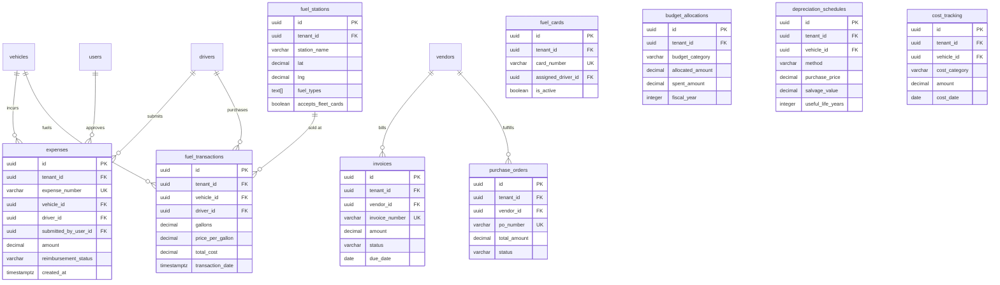
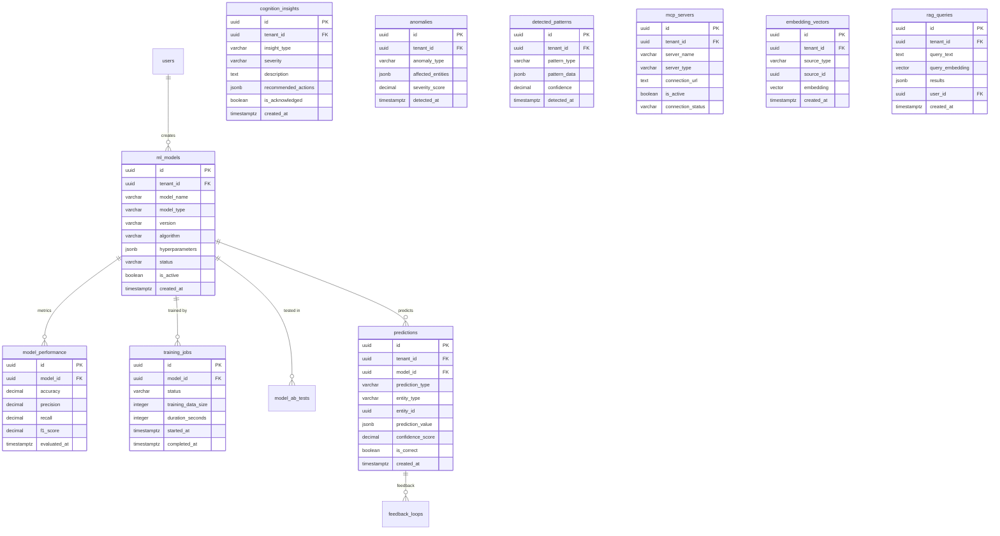
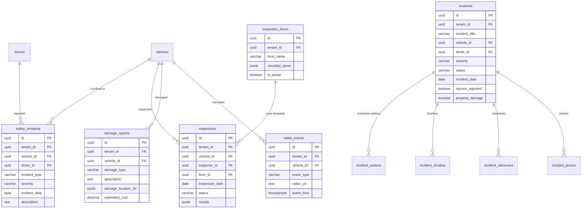
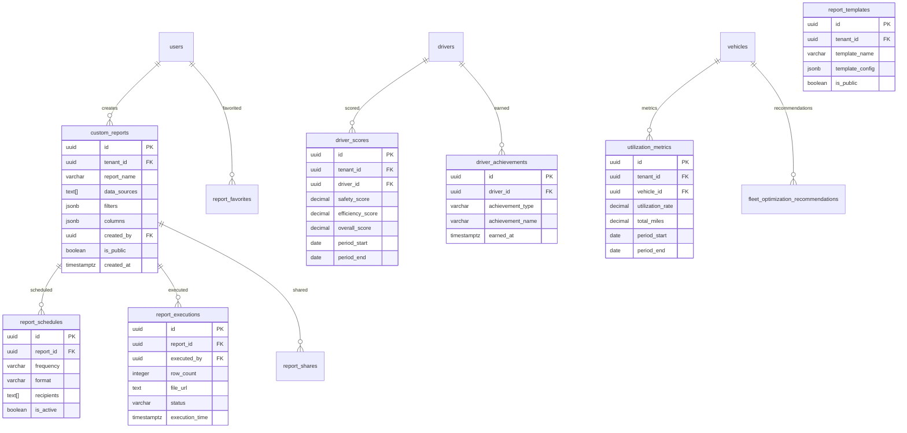
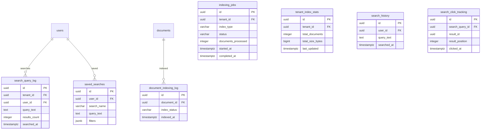

# CTA Fleet Management System - Entity Relationship Diagram

**Database:** PostgreSQL 14+
**Total Tables:** 89
**Architecture:** Multi-tenant with Row-Level Security (RLS)
**Date:** February 5, 2026

---

## Core Multi-Tenancy Architecture

---

## Fleet Operations & Maintenance

---

## Telematics & Real-Time Tracking

---

## Routes & Geofences

---

## Financial Management & Accounting

---

## Documents & Knowledge Management (RAG)

---

## AI/ML Infrastructure

---

## Safety & Compliance

---

## Tasks, Operations & Workflow

---

## Assets & Inventory

---

## Communications & Notifications

---

## Analytics & Reporting

---

## Security & Authentication

---

## Integrations & External Systems

---

## Search & Indexing

---

## EV Charging Infrastructure

---

## Policies & Governance

---

## Master Data Management

---

## Infrastructure & Monitoring

---

## Key Relationship Summary

### Multi-Tenancy (Root)
- **tenants** → All domain tables (tenant_id FK)
- All 89 tables have `tenant_id` for data isolation
- Row-Level Security (RLS) enforced at database layer

### Core Entity Relationships
- **users** ↔ **drivers** (one-to-one via user_id)
- **vehicles** → **drivers** (assigned_driver_id)
- **vehicles** → **facilities** (assigned_facility_id)
- **vehicles** → **work_orders** (one-to-many)

### Telemetry & Tracking
- **vehicles** → **vehicle_locations** (real-time GPS)
- **vehicles** → **obd_telemetry** (diagnostics)
- **vehicles** → **trips** (completed trips)
- **drivers** → **driver_behavior_events** (safety events)

### Financial & Costs
- **vehicles** → **expenses** (vehicle-related costs)
- **drivers** → **expenses** (reimbursements)
- **vendors** → **invoices** (billing)
- **vehicles** → **fuel_transactions** (fuel costs)

### AI/ML & Cognition
- **ml_models** → **predictions** (model outputs)
- **documents** → **document_embeddings** (RAG vectors)
- **predictions** → **feedback_loops** (continuous learning)

### Document & Knowledge
- **documents** → **document_embeddings** (pgvector for RAG)
- **documents** → **document_versions** (version history)
- **document_embeddings** uses `vector(1536)` for semantic search

---

## Database Statistics

| Metric | Value |
|--------|-------|
| **Total Tables** | 89 |
| **Foreign Key Relationships** | ~150 |
| **Database Extensions** | 7 (PostGIS, pgvector, etc.) |
| **Partitioned Tables** | audit_logs (monthly) |
| **Vector Dimensions** | 1536 (OpenAI embeddings) |
| **Row-Level Security** | Enabled on all domain tables |
| **Multi-Tenancy** | Full tenant isolation |

---

## Technology Features

### PostgreSQL Extensions
1. **uuid-ossp** - UUID generation
2. **pgcrypto** - Encryption functions
3. **postgis** - Geospatial queries
4. **pg_trgm** - Full-text search
5. **earthdistance** - Geographic calculations
6. **pgvector** - Vector embeddings (RAG)
7. **vector** - Alternative vector extension

### Index Types
- **B-tree** - Standard indexes
- **GIST** - PostGIS geospatial
- **GIN** - Full-text search, JSONB
- **ivfflat** - Vector similarity (pgvector)

### Special Features
- **Partitioning** - audit_logs by month
- **Generated Columns** - Computed totals
- **Array Columns** - Multi-value fields
- **JSONB Storage** - Flexible structured data
- **Geography Type** - PostGIS spatial data

---

## Notes

- This ERD represents the complete schema as of February 5, 2026
- All tables implement tenant_id for multi-tenancy
- Vector embeddings use 1536 dimensions (OpenAI standard)
- Time-series tables should use TimescaleDB hypertables in production
- Audit logs are partitioned monthly for performance
- All sensitive data is encrypted at rest and in transit

---

**Generated:** February 5, 2026
**System:** CTA Fleet Management Platform
**Database:** PostgreSQL 14+ with 7 extensions
**Total Entities:** 89 tables across 20 logical domains
