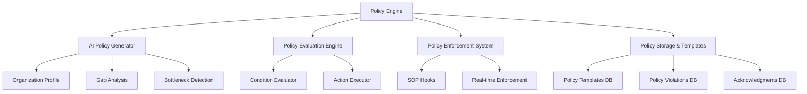
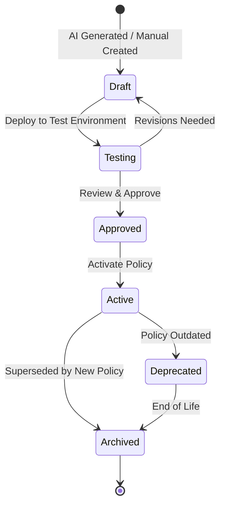
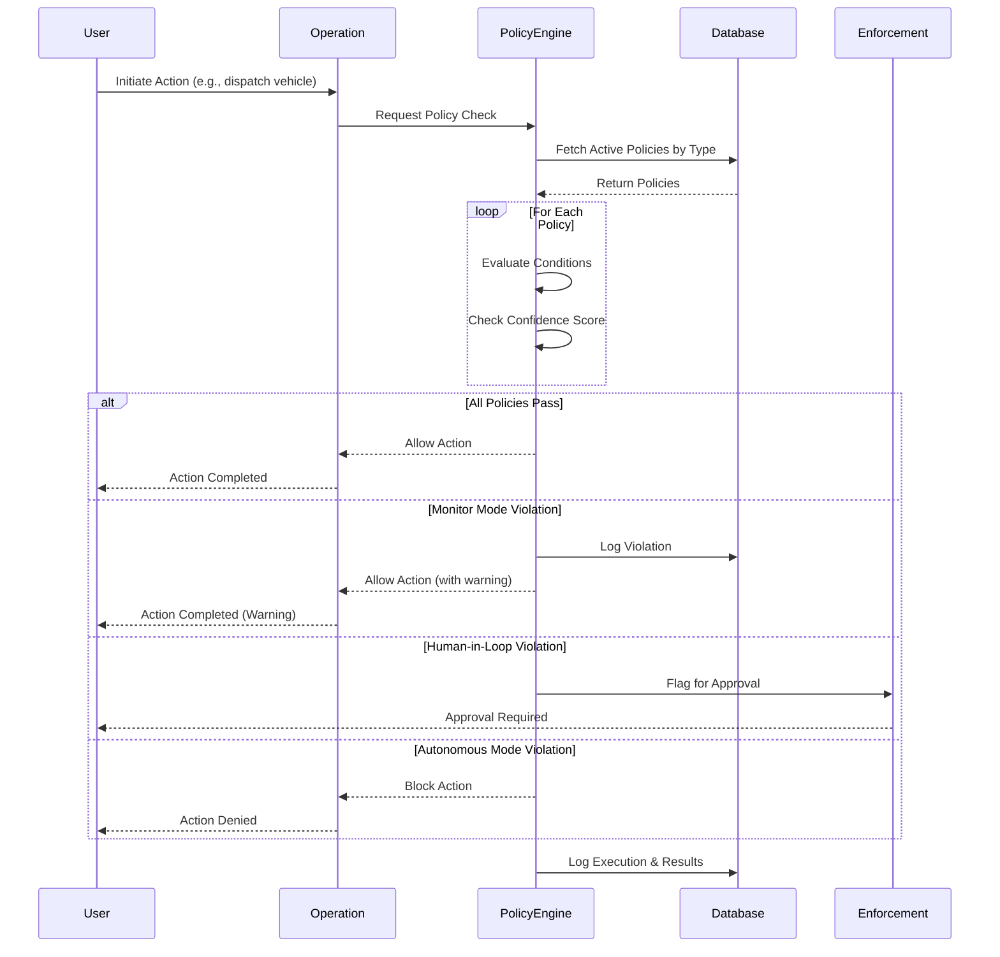
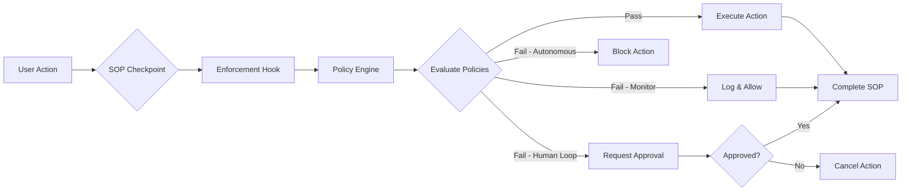
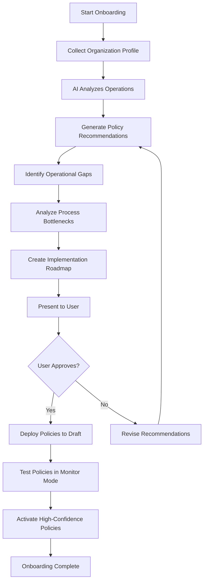
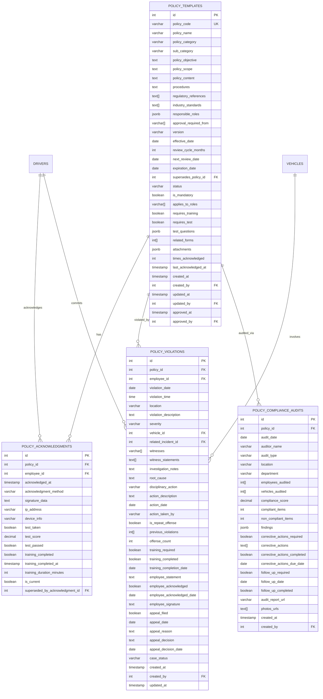

# Policy Engine Documentation

## Table of Contents
1. [Architecture Overview](#architecture-overview)
2. [How Policies Drive Operations](#how-policies-drive-operations)
3. [SOP Integration](#sop-integration)
4. [AI Policy Generation Process](#ai-policy-generation-process)
5. [Database Schema](#database-schema)
6. [API Endpoints](#api-endpoints)
7. [Frontend Components](#frontend-components)
8. [Enforcement Mechanisms](#enforcement-mechanisms)
9. [Testing Procedures](#testing-procedures)
10. [Troubleshooting Guide](#troubleshooting-guide)

---

## Architecture Overview

The Policy Engine is an AI-driven system that evaluates policies against real-time operational data and enforces rules across the fleet management system. It provides three operational modes to balance automation with human oversight.

### Core Components



### Three-Tier Architecture

1. **Presentation Layer** - React components (`PolicyEngineWorkbench.tsx`, `PolicyContext.tsx`)
2. **Business Logic Layer** - Policy engine (`engine.ts`, `policy-enforcement.ts`, `ai-policy-generator.ts`)
3. **Data Layer** - PostgreSQL database with policy templates, acknowledgments, violations, and compliance audits

### Operational Modes

| Mode | Description | Use Case | Human Involvement |
|------|-------------|----------|-------------------|
| **Monitor** | Logs violations but allows all actions | Testing new policies, data collection | Review logs periodically |
| **Human-in-Loop** | Flags violations for approval | High-risk operations, compliance | Approve/deny flagged actions |
| **Autonomous** | Automatically blocks violations | Well-tested policies, clear rules | Exception handling only |

---

## How Policies Drive Operations

### Policy Lifecycle



### Policy Evaluation Flow



### Policy Types

| Type | Description | Example Use Case |
|------|-------------|------------------|
| `safety` | OSHA and safety incident policies | Require supervisor notification for recordable injuries |
| `dispatch` | Vehicle routing and driver assignment | Block dispatch if driver license expired |
| `privacy` | Data protection and PII handling | Restrict access to sensitive employee data |
| `ev-charging` | Electric vehicle charging optimization | Schedule charging during off-peak hours |
| `payments` | Procurement and payment approval | Require dual approval for payments over $10,000 |
| `maintenance` | Preventive maintenance scheduling | Auto-schedule service every 5,000 miles |
| `osha` | OSHA compliance and recordkeeping | Mandate incident reporting within 24 hours |
| `environmental` | Emissions tracking and EPA compliance | Flag vehicles exceeding emission limits |
| `data-retention` | Data archival and deletion policies | Auto-delete records after retention period |
| `security` | Access control and authentication | Require MFA for sensitive operations |
| `vehicle-use` | Personal vs business use tracking | Prevent personal use outside approved hours |
| `driver-behavior` | Driver performance and safety standards | Require training for drivers with low safety scores |

---

## SOP Integration

The Policy Engine integrates with Standard Operating Procedures (SOPs) through **enforcement hooks** that intercept critical operations.

### Enforcement Hooks

```typescript
// Example: Safety Incident Reporting Hook
export async function enforceSafetyIncidentPolicy(
  policies: Policy[],
  incidentData: {
    severity: string;
    type: string;
    vehicleId?: string;
    driverId?: string;
    injuries: number;
    oshaRecordable: boolean;
  }
): Promise<PolicyEnforcementResult>
```

### Available Enforcement Hooks

| Hook Function | SOP | Enforcement Point |
|---------------|-----|-------------------|
| `enforceSafetyIncidentPolicy` | OSHA incident reporting | Before incident submission |
| `enforceMaintenancePolicy` | Preventive maintenance | Before work order creation |
| `enforceDispatchPolicy` | Driver hours & vehicle readiness | Before vehicle dispatch |
| `enforceEVChargingPolicy` | Smart charging optimization | Before charging session start |
| `enforcePaymentPolicy` | Approval workflows | Before payment processing |
| `enforceDriverBehaviorPolicy` | Safety standards | After behavior violation detected |
| `enforceEnvironmentalPolicy` | Emissions compliance | Continuous monitoring |

### SOP-Driven Policy Enforcement



### Example: Maintenance Work Order SOP

1. **User initiates work order** for vehicle maintenance
2. **SOP checkpoint** triggers `enforceMaintenancePolicy` hook
3. **Policy engine evaluates**:
   - Is maintenance overdue? (preventive schedule)
   - Does cost exceed budget threshold?
   - Is vehicle critical to operations?
4. **Policy decisions**:
   - **Pass**: Work order created, parts ordered, mechanic assigned
   - **Monitor**: Work order created with cost warning
   - **Human-in-loop**: Requires supervisor approval
   - **Autonomous**: Blocked if budget exceeded
5. **Audit trail** created for compliance

---

## AI Policy Generation Process

The AI Policy Generator uses organization profiling, gap analysis, and bottleneck detection to create intelligent, industry-standard policies.

### Onboarding Workflow



### Organization Profile

The AI collects the following information during onboarding:

```typescript
interface OrganizationProfile {
  fleetSize: number;
  vehicleTypes: string[]; // 'sedan', 'truck', 'van', 'electric'
  operationTypes: string[]; // 'delivery', 'passenger', 'construction'
  geographicScope: string; // 'local', 'regional', 'national', 'international'
  industryVertical: string; // 'logistics', 'healthcare', 'government'
  complianceRequirements: string[]; // 'OSHA', 'DOT', 'EPA'
  currentChallenges: string[]; // 'maintenance-delays', 'routing-inefficiency'
  safetyPriorities: string[]; // 'incident-tracking', 'driver-training'
  budgetConstraints?: {
    annual: number;
    maintenance: number;
    fuel: number;
  };
  staffing: {
    drivers: number;
    mechanics: number;
    dispatchers: number;
    supervisors: number;
  };
}
```

### AI-Generated Policy Example

When the AI detects that an organization has OSHA compliance requirements, it generates:

**Policy**: Comprehensive Safety Incident Reporting
**Type**: `safety`
**Mode**: `human-in-loop`
**Rationale**: "OSHA requires all recordable injuries to be reported within 24 hours. This policy ensures compliance and protects the organization from penalties."

**Conditions**:
```json
[
  { "field": "oshaRecordable", "operator": "equals", "value": true },
  { "field": "injuries", "operator": "greaterThan", "value": 0 }
]
```

**Actions**:
```json
[
  { "type": "notify_supervisor", "immediate": true },
  { "type": "create_osha_report", "deadline": "24h" },
  { "type": "photograph_scene", "required": true }
]
```

**Estimated Impact**:
- Safety improvement: 35%
- Cost savings: $50,000 (avoided OSHA fines)
- Confidence score: 0.95

### Gap Analysis

The AI identifies gaps between current state and desired state:

| Category | Current State | Desired State | Gap | Severity | Recommendations |
|----------|--------------|---------------|-----|----------|-----------------|
| Safety Management | No incident tracking | Real-time incident reporting with root cause analysis | Missing incident tracking capabilities | High | 1. Implement digital incident reporting forms<br>2. Enable photo/video evidence collection<br>3. Create automated OSHA reporting workflows<br>4. Set up safety analytics dashboard |
| Maintenance Capacity | 2 mechanics for 50 vehicles | Optimal ratio of 1:15 | Insufficient maintenance staffing | Critical | 1. Hire 2 additional mechanics<br>2. Implement predictive maintenance<br>3. Consider outsourcing specialized repairs<br>4. Optimize maintenance scheduling |

### Bottleneck Analysis

The AI detects process bottlenecks and recommends solutions:

**Example: Maintenance Turnaround Time**

- **Process**: Vehicle Maintenance
- **Bottleneck**: Long repair turnaround times
- **Impact**: Increased vehicle downtime, reduced fleet availability
- **Root Cause**: Manual scheduling, parts delays, insufficient technicians
- **Solutions**:
  1. Implement predictive maintenance scheduling
  2. Maintain parts inventory with automated reordering
  3. Use mobile mechanics for minor repairs
  4. Create express service lanes for routine maintenance
- **Estimated Improvement**: 40% reduction in downtime

---

## Database Schema

### Entity Relationship Diagram



### Key Tables

#### 1. `policy_templates`

Master library of company policies with version control.

**Key Fields**:
- `policy_code`: Unique identifier (e.g., 'FLT-SAF-001')
- `policy_category`: 'Safety', 'HR', 'Operations', 'Maintenance', 'Compliance', 'Environmental'
- `regulatory_references`: Array of regulations (e.g., 'OSHA 1910.134', 'FMCSA 49 CFR 391')
- `responsible_roles`: JSON object mapping roles to responsibilities
- `status`: 'Draft', 'Pending Approval', 'Active', 'Archived', 'Superseded'
- `next_review_date`: Calculated from `effective_date` + `review_cycle_months`

#### 2. `policy_acknowledgments`

Employee acknowledgments with digital signatures and training completion.

**Key Fields**:
- `signature_data`: Base64 encoded signature image
- `test_score`: Percentage score if quiz taken
- `is_current`: False when policy is updated (requires re-acknowledgment)

#### 3. `policy_violations`

Violation tracking and progressive discipline management.

**Key Fields**:
- `severity`: 'Minor', 'Moderate', 'Serious', 'Critical'
- `disciplinary_action`: 'Verbal Warning', 'Written Warning', 'Suspension', 'Termination', 'No Action'
- `offense_count`: Tracks progressive discipline
- `appeal_filed`: Supports appeal process

#### 4. `policy_compliance_audits`

Scheduled and incident-triggered policy audits.

**Key Fields**:
- `audit_type`: 'Scheduled', 'Random', 'Incident-Triggered', 'Regulatory'
- `compliance_score`: 0-100% compliance rate
- `findings`: JSON array of non-conformances with corrective actions

### Pre-Built Policy Templates

The system includes three pre-built safety policies:

1. **Vehicle Safety Inspection Policy** (FMCSA 49 CFR 396.11)
2. **Drug and Alcohol Testing Policy** (FMCSA 49 CFR Part 382)
3. **Personal Protective Equipment Policy** (OSHA 29 CFR 1910.132)

Each template includes:
- Full policy text with Markdown support
- Customization fields (placeholders for org-specific values)
- Regulatory references
- Enforcement procedures

### Views

#### `v_policies_due_for_review`

Lists policies requiring review:
```sql
SELECT id, policy_code, policy_name, policy_category, version,
       effective_date, next_review_date,
       CASE
         WHEN next_review_date < CURRENT_DATE THEN 'Overdue'
         WHEN next_review_date <= CURRENT_DATE + INTERVAL '30 days' THEN 'Due Soon'
         ELSE 'Not Due'
       END AS review_status
FROM policy_templates
WHERE status = 'Active' AND next_review_date IS NOT NULL
ORDER BY next_review_date;
```

#### `v_employee_compliance`

Per-employee compliance dashboard:
```sql
SELECT d.id AS employee_id,
       d.first_name || ' ' || d.last_name AS employee_name,
       COUNT(DISTINCT pt.id) AS total_policies,
       COUNT(DISTINCT pa.policy_id) AS acknowledged_policies,
       COUNT(DISTINCT pt.id) - COUNT(DISTINCT pa.policy_id) AS pending_acknowledgments,
       COUNT(DISTINCT CASE WHEN pv.severity IN ('Serious', 'Critical') THEN pv.id END) AS serious_violations,
       MAX(pa.acknowledged_at) AS last_acknowledgment_date
FROM drivers d
CROSS JOIN policy_templates pt
LEFT JOIN policy_acknowledgments pa ON d.id = pa.employee_id AND pt.id = pa.policy_id AND pa.is_current = TRUE
LEFT JOIN policy_violations pv ON d.id = pv.employee_id
WHERE pt.status = 'Active'
  AND (pt.applies_to_roles IS NULL OR d.role = ANY(pt.applies_to_roles))
GROUP BY d.id, d.first_name, d.last_name;
```

---

## API Endpoints

All endpoints require JWT authentication. See [API_POLICY_REFERENCE.md](./API_POLICY_REFERENCE.md) for complete details.

### Policy Templates

| Method | Endpoint | Description | Permission Required |
|--------|----------|-------------|---------------------|
| GET | `/api/policy-templates` | List all policy templates with pagination | `policy:view:global` |
| GET | `/api/policy-templates/:id` | Get single policy template | `policy:view:global` |
| POST | `/api/policy-templates` | Create new policy template | `policy:create:global` |
| PUT | `/api/policy-templates/:id` | Update existing policy template | `policy:update:global` |

### Policy Acknowledgments

| Method | Endpoint | Description | Permission Required |
|--------|----------|-------------|---------------------|
| GET | `/api/policy-templates/:id/acknowledgments` | Get all acknowledgments for a policy | `policy:view:global` |
| POST | `/api/policy-templates/:id/acknowledge` | Employee acknowledges policy (digital signature) | `policy:create:global` |

### Policy Violations

| Method | Endpoint | Description | Permission Required |
|--------|----------|-------------|---------------------|
| GET | `/api/policy-templates/violations` | List violations with filters | `policy:view:global` |
| POST | `/api/policy-templates/violations` | Report new policy violation | `policy:delete:global` |

### Compliance Audits

| Method | Endpoint | Description | Permission Required |
|--------|----------|-------------|---------------------|
| GET | `/api/policy-templates/audits` | List compliance audits | `policy:view:global` |
| POST | `/api/policy-templates/audits` | Create new compliance audit | `policy:create:global` |

### Dashboard & Analytics

| Method | Endpoint | Description | Permission Required |
|--------|----------|-------------|---------------------|
| GET | `/api/policy-templates/dashboard` | Get policy metrics (active policies, compliance rate, violations) | `policy:view:global` |
| GET | `/api/policy-templates/compliance/employee/:employee_id` | Get compliance status for specific employee | `policy:view:global` |

---

## Frontend Components

### PolicyContext (React Context API)

Provides global state management for policies.

**Location**: `/src/contexts/PolicyContext.tsx`

**Features**:
- Fetches policies from backend on mount
- Provides CRUD operations (create, update, delete)
- Exposes query functions (by type, by status, by ID)
- Handles policy evaluation and compliance checking
- Displays toast notifications for user feedback

**Usage**:
```tsx
import { usePolicies } from '@/contexts/PolicyContext';

function MyComponent() {
  const { policies, loading, createPolicy, activatePolicy } = usePolicies();

  const handleActivate = async (policyId: string) => {
    await activatePolicy(policyId);
  };

  return (
    // Component JSX
  );
}
```

### PolicyEngineWorkbench

Admin interface for managing policies.

**Location**: `/src/components/modules/admin/PolicyEngineWorkbench.tsx`

**Features**:
- **Policy Table**: Search, filter by type/status, view all policies
- **Add Policy Dialog**: Create new policies with conditions/actions
- **Edit Policy**: Update existing policies
- **Activate/Deactivate**: Toggle policy status
- **AI Insights**: View AI-generated recommendations
- **Real-time Stats**: Active policies, violations, compliance rate

**UI Components Used**:
- Shadcn UI: Table, Dialog, Badge, Button, Select, Switch
- Phosphor Icons: Robot, Lightning, ShieldCheck, Warning

### PolicyQueue

Displays pending approval requests for human-in-loop policies.

**Location**: `/src/components/radio/PolicyQueue.tsx`

**Features**:
- Shows flagged actions requiring approval
- Displays policy violation details
- Approve/Deny actions with notes
- Real-time updates via WebSocket (if enabled)

---

## Enforcement Mechanisms

### Condition Evaluation

Policies contain an array of conditions that are evaluated using AND logic.

**Supported Operators**:

| Operator | Description | Example |
|----------|-------------|---------|
| `equals`, `==` | Exact match | `{ field: "status", operator: "equals", value: "active" }` |
| `notEquals`, `!=` | Not equal | `{ field: "driverLicenseStatus", operator: "!=", value: "expired" }` |
| `greaterThan`, `>` | Numeric greater than | `{ field: "vehicleMileage", operator: ">", value: 5000 }` |
| `lessThan`, `<` | Numeric less than | `{ field: "batteryLevel", operator: "<", value: 30 }` |
| `greaterThanOrEqual`, `>=` | Numeric ≥ | `{ field: "driverScorecard", operator: ">=", value: 70 }` |
| `lessThanOrEqual`, `<=` | Numeric ≤ | `{ field: "estimatedCost", operator: "<=", value: 10000 }` |
| `contains` | String contains | `{ field: "vehicleType", operator: "contains", value: "electric" }` |
| `notContains` | String does not contain | `{ field: "notes", operator: "notContains", value: "approved" }` |
| `in` | Value in array | `{ field: "severity", operator: "in", value: ["high", "critical"] }` |
| `notIn` | Value not in array | `{ field: "status", operator: "notIn", value: ["archived", "deleted"] }` |
| `matches` | Regex pattern | `{ field: "email", operator: "matches", value: ".*@company\\.com" }` |
| `between` | Numeric range | `{ field: "speed", operator: "between", value: [40, 65] }` |

### Action Execution

When conditions are met (or violated), the policy engine executes actions:

**Action Types**:
- `notify_supervisor`: Send notification to supervisor
- `create_osha_report`: Auto-generate OSHA incident report
- `schedule_maintenance`: Create work order and assign mechanic
- `require_approval`: Flag for human approval
- `block_action`: Prevent operation from proceeding
- `log_event`: Audit trail entry
- `send_alert`: Push notification or email
- `require_training`: Assign training module to employee

### Severity-Based Enforcement

| Violation Severity | Monitor Mode | Human-in-Loop Mode | Autonomous Mode |
|--------------------|--------------|--------------------|--------------------|
| **Low** | Log only | Allow with warning | Allow with warning |
| **Medium** | Log only | Request supervisor approval | Request supervisor approval |
| **High** | Log and alert | Require manager approval | Block action |
| **Critical** | Log and alert | Require executive approval | Block action immediately |

### Confidence Score

Each policy has a `confidenceScore` (0.0 to 1.0) representing AI confidence in the policy's accuracy.

**Score Interpretation**:
- **0.95-1.0**: High confidence - safe for autonomous mode
- **0.85-0.94**: Good confidence - suitable for human-in-loop
- **0.70-0.84**: Moderate confidence - use monitor mode initially
- **Below 0.70**: Low confidence - requires manual review before deployment

### Dual Control & MFA

Policies can require additional security:

- `requiresDualControl: true` - Requires two approvers for high-risk actions
- `requiresMFAForExecution: true` - Requires multi-factor authentication before policy execution

---

## Testing Procedures

### Unit Testing

Test individual policy evaluation logic:

```typescript
import { evaluateCondition } from '@/lib/policy-engine/engine';

describe('Policy Condition Evaluation', () => {
  test('evaluates greaterThan operator correctly', () => {
    const condition = { field: 'vehicleMileage', operator: 'greaterThan', value: 5000 };
    const context = { vehicleMileage: 6000 };

    const result = evaluateCondition(condition, context);
    expect(result).toBe(true);
  });

  test('handles missing context fields', () => {
    const condition = { field: 'vehicleMileage', operator: 'greaterThan', value: 5000 };
    const context = {}; // Missing vehicleMileage

    const result = evaluateCondition(condition, context);
    expect(result).toBe(false);
  });
});
```

### Integration Testing

Test policy enforcement hooks:

```typescript
import { enforceMaintenancePolicy } from '@/lib/policy-engine/policy-enforcement';

describe('Maintenance Policy Enforcement', () => {
  test('blocks work orders exceeding budget', async () => {
    const policies = [/* mock policies */];
    const workOrderData = {
      vehicleId: 'V123',
      type: 'engine_repair',
      estimatedCost: 25000,
      priority: 'high'
    };

    const result = await enforceMaintenancePolicy(policies, workOrderData);
    expect(result.allowed).toBe(false);
    expect(result.violations.length).toBeGreaterThan(0);
  });
});
```

### End-to-End Testing

Test complete policy workflow:

1. **Setup**: Create test policy in Draft status
2. **Activate**: Move policy to Active status
3. **Trigger**: Initiate operation that matches policy conditions
4. **Verify**: Check that policy was evaluated and enforced correctly
5. **Audit**: Verify audit trail created
6. **Cleanup**: Delete test policy

### Performance Testing

Test policy evaluation performance:

```typescript
describe('Policy Engine Performance', () => {
  test('evaluates 100 policies within 500ms', async () => {
    const policies = Array(100).fill(/* mock policy */);
    const context = { /* test context */ };

    const startTime = performance.now();
    await evaluatePoliciesByType(policies, 'safety', context);
    const duration = performance.now() - startTime;

    expect(duration).toBeLessThan(500);
  });
});
```

### Testing Modes

1. **Monitor Mode Testing**: Deploy new policies in monitor mode for 2 weeks, analyze logs before activating
2. **Shadow Testing**: Run policies in parallel with existing manual processes, compare results
3. **A/B Testing**: Test two policy variations to determine which performs better

---

## Troubleshooting Guide

### Common Issues

#### 1. Policy Not Enforcing

**Symptoms**: Policy exists but actions are not blocked/flagged

**Diagnosis**:
```sql
-- Check policy status
SELECT id, policy_name, status, mode FROM policy_templates WHERE id = <policy_id>;

-- Check recent evaluations
SELECT * FROM audit_logs WHERE resource_type = 'policy_execution' AND resource_id = <policy_id> ORDER BY created_at DESC LIMIT 10;
```

**Solutions**:
- Verify policy status is `Active`
- Check policy mode (monitor mode only logs, doesn't block)
- Ensure conditions match the context being evaluated
- Verify policy type matches the operation type

#### 2. Policy Conditions Not Matching

**Symptoms**: Policy should trigger but conditions evaluate to false

**Diagnosis**:
- Add logging to `evaluateCondition` function
- Check if context contains required fields
- Verify data types (string vs number, case sensitivity)

**Solutions**:
```typescript
// Enable debug logging
logger.setLevel('debug');

// Check context in browser console
console.log('Policy evaluation context:', context);
```

#### 3. Performance Issues

**Symptoms**: Slow response times when evaluating policies

**Diagnosis**:
```sql
-- Check number of active policies
SELECT type, COUNT(*) FROM policy_templates WHERE status = 'Active' GROUP BY type;

-- Check database query performance
EXPLAIN ANALYZE SELECT * FROM policy_templates WHERE status = 'Active';
```

**Solutions**:
- Add database indexes:
  ```sql
  CREATE INDEX idx_policies_status_type ON policy_templates(status, type);
  ```
- Cache frequently accessed policies in Redis
- Use database connection pooling
- Implement query result caching

#### 4. Policy Acknowledgment Failures

**Symptoms**: Employees cannot acknowledge policies

**Diagnosis**:
```sql
-- Check existing acknowledgments
SELECT * FROM policy_acknowledgments WHERE policy_id = <policy_id> AND employee_id = <employee_id>;

-- Check for unique constraint violations
SELECT policy_id, employee_id, acknowledged_at, COUNT(*)
FROM policy_acknowledgments
GROUP BY policy_id, employee_id, acknowledged_at
HAVING COUNT(*) > 1;
```

**Solutions**:
- Ensure `is_current` is set to FALSE for previous acknowledgments before creating new ones
- Check CSRF token validity
- Verify employee has required permissions

#### 5. AI Policy Generator Not Producing Recommendations

**Symptoms**: No policies generated during onboarding

**Diagnosis**:
- Check organization profile completeness
- Verify AI generator instantiation
- Check for exceptions in server logs

**Solutions**:
```typescript
// Validate organization profile
if (!profile.fleetSize || profile.fleetSize < 1) {
  throw new Error('Invalid fleet size');
}

// Enable verbose logging
const generator = createAIPolicyGenerator();
generator.conductOnboarding(profile);
```

### Error Codes

| Code | Message | Cause | Solution |
|------|---------|-------|----------|
| `POL-001` | Policy not found | Invalid policy ID | Verify policy ID exists in database |
| `POL-002` | Policy evaluation failed | Exception during condition evaluation | Check condition syntax, verify context fields |
| `POL-003` | Insufficient permissions | User lacks required permission | Grant `policy:view:global` or appropriate permission |
| `POL-004` | Policy in draft status | Attempting to enforce non-active policy | Activate policy or remove from enforcement |
| `POL-005` | Condition field missing | Context doesn't contain required field | Add field to context or update policy conditions |
| `POL-006` | Dual control violation | Policy requires two approvers, only one provided | Add second approver |
| `POL-007` | MFA required | Policy requires MFA but user hasn't authenticated | Prompt user for MFA |

### Debug Mode

Enable debug mode to see detailed policy evaluation logs:

```typescript
// In browser console
localStorage.setItem('policy_debug', 'true');

// In server environment variables
POLICY_DEBUG=true
```

Debug output includes:
- Policy conditions being evaluated
- Context values used for evaluation
- Operator results (true/false for each condition)
- Final policy decision
- Execution time

### Support Escalation

For unresolved issues:

1. **Level 1**: Check this documentation and troubleshooting guide
2. **Level 2**: Review database audit logs and application logs
3. **Level 3**: Contact system administrator with:
   - Policy ID
   - Operation being attempted
   - Context data (sanitized, no PII)
   - Error messages and stack traces
   - Browser console logs (if frontend issue)

---

## Appendix

### Policy Best Practices

1. **Start with Monitor Mode**: Always deploy new policies in monitor mode for 1-2 weeks to collect data
2. **Use High Confidence Scores**: Only activate autonomous policies with confidence ≥ 0.90
3. **Document Rationale**: Include clear rationale and regulatory references for each policy
4. **Regular Reviews**: Schedule annual policy reviews (set `review_cycle_months = 12`)
5. **Test Before Production**: Test policies in staging environment before deploying to production
6. **Version Control**: Increment version when making significant changes, supersede old policies
7. **Audit Trail**: Always enable audit logging for policy executions
8. **User Training**: Train employees on policies before enforcement begins
9. **Gradual Rollout**: Roll out policies to pilot group before organization-wide deployment
10. **Feedback Loop**: Monitor violations and adjust policies based on real-world data

### Regulatory Compliance Mapping

| Regulation | Policy Type | Required Actions |
|------------|-------------|------------------|
| **OSHA 1904** - Recordkeeping | `safety`, `osha` | Log all recordable injuries within 24 hours, maintain OSHA 300 log |
| **FMCSA 49 CFR 396** - Vehicle Inspections | `safety`, `maintenance` | Daily pre-trip and post-trip inspections, annual inspections |
| **FMCSA 49 CFR 382** - Drug & Alcohol Testing | `safety`, `driver-behavior` | Pre-employment, random, post-accident, reasonable suspicion testing |
| **DOT Hours of Service** | `dispatch`, `driver-behavior` | Track driver hours, enforce rest periods, prevent violations |
| **EPA Clean Air Act** | `environmental` | Monitor emissions, schedule emissions testing, flag high emitters |
| **GDPR/CCPA** - Data Privacy | `privacy`, `data-retention` | Consent tracking, data deletion requests, access controls |

### Glossary

- **Policy**: A rule or set of rules that govern fleet operations
- **Condition**: A logical test that must be met for a policy to apply
- **Action**: An operation executed when policy conditions are satisfied (or violated)
- **Enforcement Hook**: Code that intercepts operations and applies policy checks
- **SOP (Standard Operating Procedure)**: Documented process for completing a task
- **Compliance Audit**: Systematic review of adherence to policies
- **Progressive Discipline**: Escalating consequences for repeated violations
- **Dual Control**: Requirement for two independent approvers
- **MFA (Multi-Factor Authentication)**: Additional authentication factor for sensitive operations
- **Confidence Score**: AI's certainty in policy accuracy (0.0 to 1.0)

---

**Document Version**: 1.0
**Last Updated**: 2026-01-02
**Maintained By**: Fleet Platform Development Team
**Related Documentation**: [API_POLICY_REFERENCE.md](./API_POLICY_REFERENCE.md), [POLICY_ONBOARDING_GUIDE.md](./POLICY_ONBOARDING_GUIDE.md)
