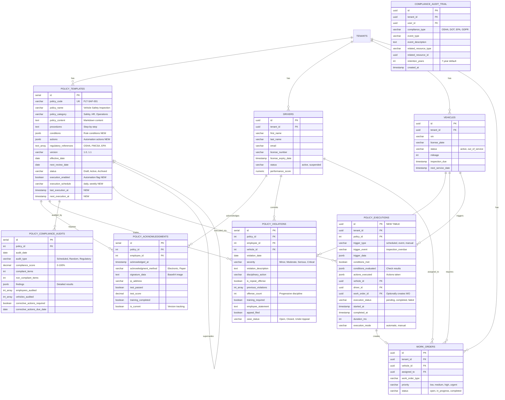
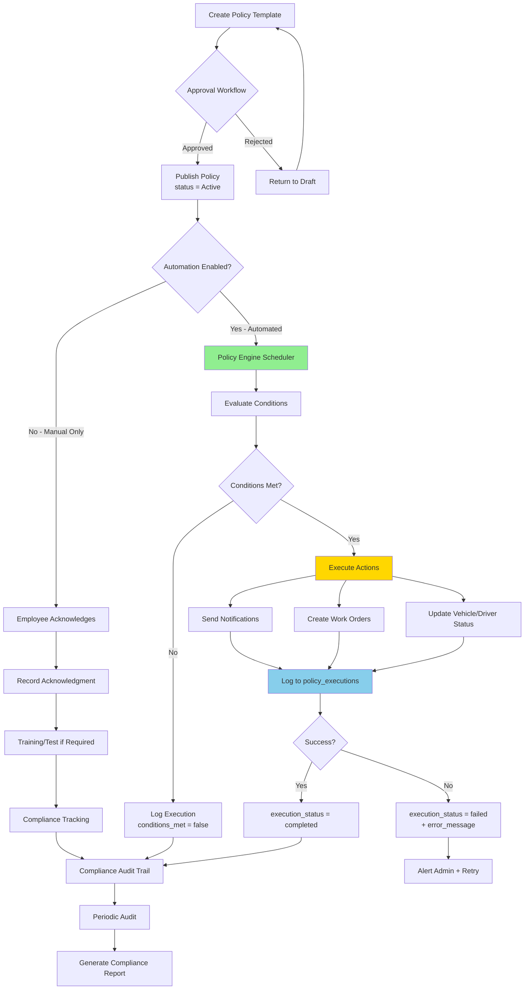
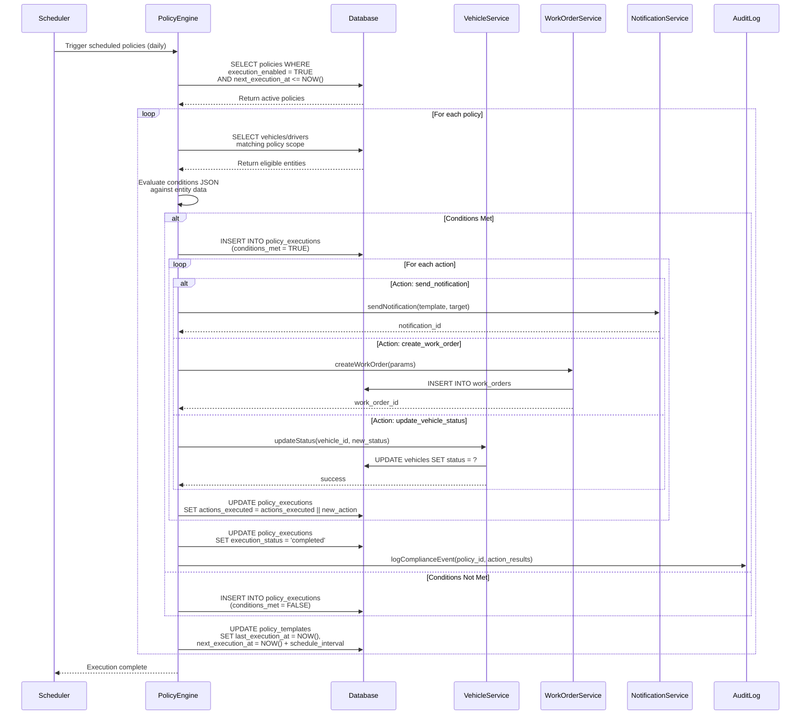
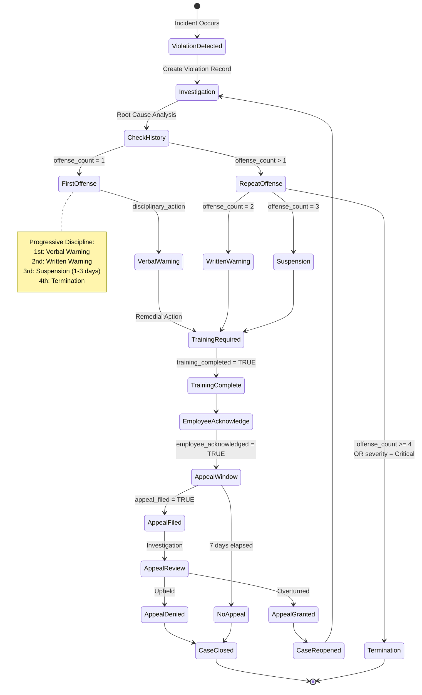
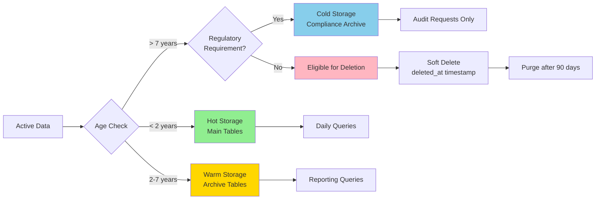
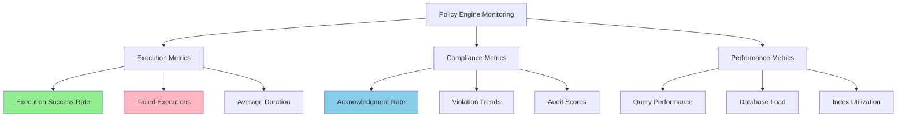

# Policy Engine Database Schema - Visual Diagram

## Entity Relationship Diagram (ERD)



---

## Data Flow Diagram

### Policy Lifecycle with Automation



---

## Policy Execution Flow (Detailed)



---

## Policy Violation Progressive Discipline Flow



---

## Table Relationships Matrix

| From Table | To Table | Relationship | FK Column | Cascade |
|------------|----------|--------------|-----------|---------|
| **policy_templates** | tenants | Many-to-One | (implicit via RLS) | - |
| **policy_templates** | policy_templates | One-to-One | supersedes_policy_id | SET NULL |
| **policy_acknowledgments** | policy_templates | Many-to-One | policy_id | CASCADE |
| **policy_acknowledgments** | drivers | Many-to-One | employee_id | CASCADE |
| **policy_acknowledgments** | policy_acknowledgments | One-to-One | superseded_by_acknowledgment_id | SET NULL |
| **policy_violations** | policy_templates | Many-to-One | policy_id | CASCADE |
| **policy_violations** | drivers | Many-to-One | employee_id | CASCADE |
| **policy_violations** | vehicles | Many-to-One | vehicle_id | SET NULL |
| **policy_compliance_audits** | policy_templates | Many-to-One | policy_id | CASCADE |
| **policy_executions** | policy_templates | Many-to-One | policy_id | CASCADE |
| **policy_executions** | vehicles | Many-to-One | vehicle_id | SET NULL |
| **policy_executions** | drivers | Many-to-One | driver_id | SET NULL |
| **policy_executions** | work_orders | One-to-One | work_order_id | SET NULL |

---

## Indexing Strategy

### Policy Templates Table
```sql
-- Primary queries
CREATE INDEX idx_policies_category ON policy_templates(policy_category);
CREATE INDEX idx_policies_status ON policy_templates(status);
CREATE INDEX idx_policies_effective_date ON policy_templates(effective_date);
CREATE INDEX idx_policies_review_date ON policy_templates(next_review_date);

-- Automation queries
CREATE INDEX idx_policy_templates_execution_enabled ON policy_templates(execution_enabled)
    WHERE execution_enabled = TRUE;
CREATE INDEX idx_policy_templates_next_execution ON policy_templates(next_execution_at)
    WHERE next_execution_at IS NOT NULL;

-- JSONB searches
CREATE INDEX idx_policy_templates_conditions ON policy_templates USING GIN (conditions);
CREATE INDEX idx_policy_templates_actions ON policy_templates USING GIN (actions);
```

### Policy Executions Table
```sql
-- Primary queries
CREATE INDEX idx_policy_executions_tenant ON policy_executions(tenant_id);
CREATE INDEX idx_policy_executions_policy ON policy_executions(policy_id);
CREATE INDEX idx_policy_executions_trigger ON policy_executions(trigger_type);
CREATE INDEX idx_policy_executions_status ON policy_executions(execution_status);

-- Relationship queries
CREATE INDEX idx_policy_executions_vehicle ON policy_executions(vehicle_id)
    WHERE vehicle_id IS NOT NULL;
CREATE INDEX idx_policy_executions_driver ON policy_executions(driver_id)
    WHERE driver_id IS NOT NULL;
CREATE INDEX idx_policy_executions_work_order ON policy_executions(work_order_id)
    WHERE work_order_id IS NOT NULL;

-- Time-series queries
CREATE INDEX idx_policy_executions_started ON policy_executions(started_at);
CREATE INDEX idx_policy_executions_conditions_met ON policy_executions(conditions_met);
```

### Policy Violations Table
```sql
CREATE INDEX idx_violations_policy ON policy_violations(policy_id);
CREATE INDEX idx_violations_employee ON policy_violations(employee_id);
CREATE INDEX idx_violations_date ON policy_violations(violation_date);
CREATE INDEX idx_violations_severity ON policy_violations(severity);
```

---

## Performance Optimization

### Query Patterns

#### 1. Find policies due for execution
```sql
SELECT pt.id, pt.policy_code, pt.conditions, pt.actions
FROM policy_templates pt
WHERE pt.execution_enabled = TRUE
  AND pt.next_execution_at <= CURRENT_TIMESTAMP
  AND pt.status = 'Active'
ORDER BY pt.next_execution_at;
```
**Indexes Used:**
- `idx_policy_templates_next_execution`
- `idx_policies_status`

---

#### 2. Get employee compliance status
```sql
SELECT
    d.id,
    d.first_name || ' ' || d.last_name AS name,
    COUNT(DISTINCT pt.id) AS total_policies,
    COUNT(DISTINCT pa.policy_id) AS acknowledged,
    COUNT(DISTINCT pv.id) FILTER (WHERE pv.severity IN ('Serious', 'Critical')) AS serious_violations
FROM drivers d
CROSS JOIN policy_templates pt
LEFT JOIN policy_acknowledgments pa ON d.id = pa.employee_id
    AND pt.id = pa.policy_id
    AND pa.is_current = TRUE
LEFT JOIN policy_violations pv ON d.id = pv.employee_id
WHERE pt.status = 'Active'
GROUP BY d.id, d.first_name, d.last_name;
```
**Indexes Used:**
- `idx_acknowledgments_employee`
- `idx_violations_employee`
- `idx_policies_status`

---

#### 3. Audit trail for specific vehicle
```sql
SELECT
    pe.started_at,
    pt.policy_name,
    pe.trigger_event,
    pe.conditions_met,
    pe.actions_executed,
    pe.execution_status
FROM policy_executions pe
JOIN policy_templates pt ON pe.policy_id = pt.id
WHERE pe.vehicle_id = $1
ORDER BY pe.started_at DESC
LIMIT 50;
```
**Indexes Used:**
- `idx_policy_executions_vehicle`
- `idx_policy_executions_started`

---

## Data Retention & Archival



### Retention Policy

| Table | Hot Storage | Archive After | Delete After | Notes |
|-------|-------------|---------------|--------------|-------|
| policy_templates | Active versions | Never | Never | Version history preserved |
| policy_acknowledgments | 2 years | 2-7 years | Never | Legal requirement |
| policy_violations | 2 years | 2-7 years | Never | Employment records |
| policy_executions | 90 days | 90 days-2 years | After 7 years | Audit trail |
| policy_compliance_audits | 1 year | 1-7 years | After 10 years | Regulatory compliance |

---

## Security Model

### Row-Level Security (RLS)

```sql
-- Tenant isolation on all tables
CREATE POLICY tenant_isolation_policy_templates ON policy_templates
    USING (tenant_id = current_setting('app.current_tenant_id')::uuid);

CREATE POLICY tenant_isolation_policy_executions ON policy_executions
    USING (tenant_id = current_setting('app.current_tenant_id')::uuid);

-- Service account read access for monitoring
CREATE POLICY service_account_read_policy_executions ON policy_executions
    FOR SELECT
    USING (
        current_setting('app.service_account', true) = 'true'
        OR tenant_id = current_setting('app.current_tenant_id')::uuid
    );
```

### Access Control Matrix

| Role | policy_templates | policy_acknowledgments | policy_violations | policy_executions |
|------|-----------------|----------------------|------------------|-------------------|
| **Admin** | Full CRUD | Read Only | Full CRUD | Read Only |
| **Fleet Manager** | Read, Update | Read All | Full CRUD | Read All |
| **Safety Manager** | Read, Update | Read All | Full CRUD | Read All |
| **Mechanic** | Read | None | None | None |
| **Driver** | Read (assigned) | Read/Write (own) | Read (own) | None |
| **System** | Full CRUD | Full CRUD | Read Only | Full CRUD |

---

## Monitoring & Alerts

### Key Metrics to Monitor



### Alert Rules

1. **Execution Failure Rate > 5%**
   ```sql
   SELECT
       COUNT(*) FILTER (WHERE execution_status = 'failed') * 100.0 / COUNT(*) AS failure_rate
   FROM policy_executions
   WHERE started_at > NOW() - INTERVAL '24 hours';
   ```

2. **Unacknowledged Policies**
   ```sql
   SELECT
       d.email,
       COUNT(*) AS pending_policies
   FROM drivers d
   CROSS JOIN policy_templates pt
   LEFT JOIN policy_acknowledgments pa ON d.id = pa.employee_id AND pt.id = pa.policy_id
   WHERE pt.status = 'Active'
     AND pt.is_mandatory = TRUE
     AND pa.id IS NULL
   GROUP BY d.id, d.email
   HAVING COUNT(*) > 0;
   ```

3. **Overdue Audits**
   ```sql
   SELECT *
   FROM policy_templates
   WHERE status = 'Active'
     AND next_review_date < CURRENT_DATE;
   ```

---

**Diagram Version:** 1.0
**Last Updated:** January 2, 2026
**Author:** Policy Engine Implementation Team
