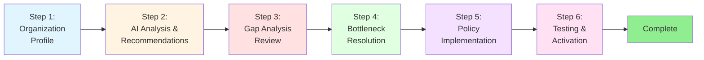
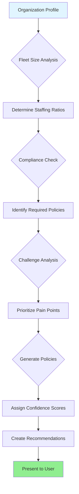
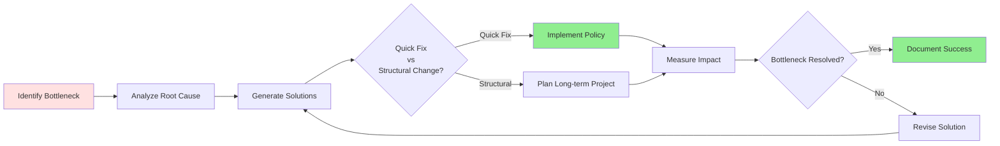
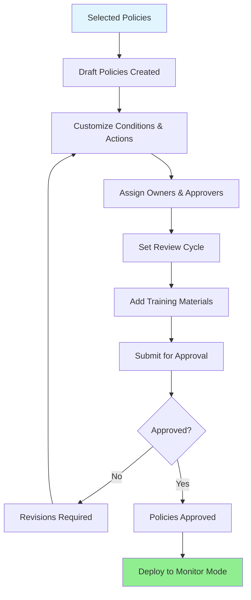
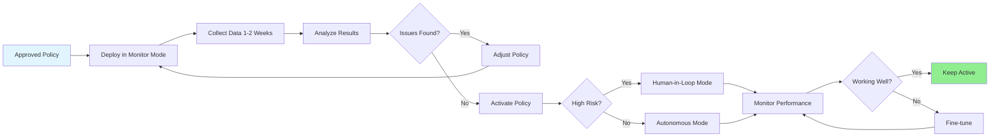
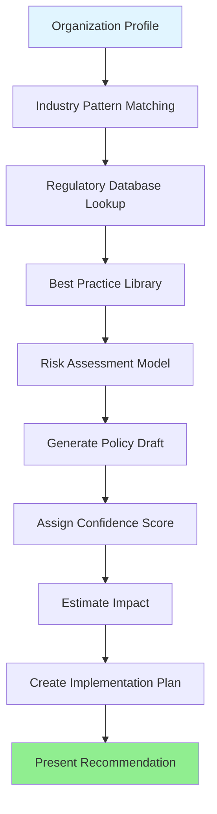

# Policy Engine Onboarding Guide

## Welcome to the AI-Powered Policy Engine

This guide will walk you through the process of onboarding your organization to the Policy Engine, from collecting your organization profile to implementing AI-generated policies.

---

## Table of Contents

1. [Overview](#overview)
2. [Onboarding Process](#onboarding-process)
3. [Step 1: Organization Profile Collection](#step-1-organization-profile-collection)
4. [Step 2: AI Analysis and Recommendations](#step-2-ai-analysis-and-recommendations)
5. [Step 3: Gap Analysis Review](#step-3-gap-analysis-review)
6. [Step 4: Bottleneck Resolution](#step-4-bottleneck-resolution)
7. [Step 5: Policy Implementation](#step-5-policy-implementation)
8. [Step 6: Testing and Activation](#step-6-testing-and-activation)
9. [Understanding AI Recommendations](#understanding-ai-recommendations)
10. [Best Practices](#best-practices)

---

## Overview

The Policy Engine uses artificial intelligence to:

- Analyze your fleet operations
- Generate industry-standard policies tailored to your organization
- Identify operational gaps and inefficiencies
- Recommend process improvements
- Automate compliance and enforcement

**Onboarding Timeline**: 1-2 weeks (depending on organization complexity)

**What You'll Need**:
- Fleet size and composition data
- Current operational challenges and goals
- Compliance requirements (OSHA, DOT, EPA, etc.)
- Staffing information (drivers, mechanics, supervisors)
- Budget constraints (optional but helpful)

---

## Onboarding Process



**Estimated Time Per Step**:
1. Organization Profile: 30-45 minutes
2. AI Analysis: 5-10 minutes (automated)
3. Gap Analysis Review: 1-2 hours
4. Bottleneck Resolution: 2-4 hours (planning)
5. Policy Implementation: 3-5 days (drafting, review, approval)
6. Testing & Activation: 1-2 weeks (monitor mode, then activate)

---

## Step 1: Organization Profile Collection

The AI needs to understand your fleet operations to generate relevant policies.

### Required Information

#### Fleet Composition

**Question**: How many vehicles do you operate?

- Enter total fleet size: _____ vehicles
- This helps determine appropriate policies for preventive maintenance, safety, and compliance

**Question**: What types of vehicles do you operate? (Select all that apply)

- [ ] Sedans
- [ ] Trucks (light-duty)
- [ ] Trucks (heavy-duty)
- [ ] Vans
- [ ] Buses
- [ ] Electric vehicles (EVs)
- [ ] Hybrid vehicles
- [ ] Construction equipment
- [ ] Other: _________________

**Why This Matters**: Different vehicle types require different policies (e.g., EVs need charging policies, heavy-duty trucks need DOT compliance)

#### Operations

**Question**: What operations does your fleet support? (Select all that apply)

- [ ] Delivery/logistics
- [ ] Passenger transport
- [ ] Construction
- [ ] Emergency services
- [ ] Government services
- [ ] Field services
- [ ] Sales/mobile workforce
- [ ] Other: _________________

**Question**: What is your geographic scope?

- [ ] Local (single city/county)
- [ ] Regional (multi-county/state)
- [ ] National
- [ ] International

**Why This Matters**: Operations type determines relevant policies (e.g., delivery fleets need dispatch policies, passenger transport needs driver behavior policies)

#### Compliance Requirements

**Question**: Which regulatory requirements apply to your organization? (Select all that apply)

- [ ] OSHA (Occupational Safety and Health Administration)
- [ ] DOT (Department of Transportation)
- [ ] FMCSA (Federal Motor Carrier Safety Administration)
- [ ] EPA (Environmental Protection Agency)
- [ ] State-specific regulations
- [ ] Industry-specific certifications
- [ ] None currently tracked
- [ ] Unsure

**Why This Matters**: Ensures the AI generates policies that meet your mandatory compliance obligations

#### Current Challenges

**Question**: What are your biggest operational challenges? (Select all that apply)

- [ ] Maintenance delays/vehicle downtime
- [ ] Routing inefficiency
- [ ] High fuel costs
- [ ] Driver safety incidents
- [ ] Compliance violations
- [ ] Budget overruns
- [ ] Parts inventory management
- [ ] Driver retention
- [ ] Inadequate tracking/visibility
- [ ] Manual processes
- [ ] Other: _________________

**Why This Matters**: The AI prioritizes policies that address your specific pain points

#### Safety Priorities

**Question**: What are your top safety priorities? (Select all that apply)

- [ ] Incident tracking and reporting
- [ ] Driver training and certification
- [ ] Vehicle inspections
- [ ] OSHA compliance
- [ ] Accident prevention
- [ ] Drug and alcohol testing
- [ ] Personal protective equipment (PPE)
- [ ] Emergency response procedures
- [ ] Other: _________________

**Why This Matters**: Determines which safety policies are generated first (critical vs nice-to-have)

#### Staffing

**Question**: How many employees support your fleet operations?

| Role | Count |
|------|-------|
| Drivers | _____ |
| Mechanics/Technicians | _____ |
| Dispatchers | _____ |
| Supervisors/Managers | _____ |

**Why This Matters**: The AI calculates optimal staffing ratios and identifies capacity bottlenecks

#### Budget (Optional)

**Question**: What is your annual fleet budget?

- Total annual budget: $__________
- Maintenance budget: $__________
- Fuel budget: $__________

**Why This Matters**: If provided, the AI generates cost-optimized policies and flags budget risks

### Example: Sample Organization Profile

**Tallahassee City Fleet (Example)**

```
Fleet Size: 50 vehicles
Vehicle Types: Sedans (20), Vans (15), Trucks (10), Electric (5)
Operations: Government services, field services
Geographic Scope: Local (Tallahassee, FL)
Compliance Requirements: OSHA, DOT, EPA
Current Challenges: Maintenance delays, routing inefficiency, compliance tracking
Safety Priorities: Incident tracking, driver training, vehicle inspections
Staffing:
  - Drivers: 75
  - Mechanics: 2
  - Dispatchers: 3
  - Supervisors: 5
Budget:
  - Annual: $1,200,000
  - Maintenance: $250,000
  - Fuel: $300,000
```

### Completing the Profile

1. Navigate to **Admin > Policy Engine > Onboarding**
2. Click **Start Onboarding**
3. Fill out the organization profile form
4. Review your answers
5. Click **Submit for AI Analysis**

**What Happens Next**: The AI analyzes your profile and generates tailored policy recommendations (Step 2)

---

## Step 2: AI Analysis and Recommendations

Once you submit your organization profile, the AI performs a comprehensive analysis.

### AI Analysis Process



### Understanding the AI Analysis Report

The AI generates a detailed analysis report:

#### Example: Tallahassee City Fleet Analysis

```
AI Analysis of Government Services Fleet Operations:

Fleet Profile:
- 50 vehicles across sedan, van, truck, electric
- Government services, field services operations
- Local scope

Key Findings:
1. Compliance: Currently meeting OSHA, DOT, EPA requirements
2. Challenges: Maintenance delays, routing inefficiency
3. Staffing Ratio: 0.67 vehicles per driver (excellent)
4. Mechanic Ratio: 1:25 (CRITICAL - industry standard is 1:15)

Recommendations:
✓ Implement AI-powered preventive maintenance to reduce breakdowns by 60%
✓ Deploy smart routing to cut fuel costs by 20-25%
✓ Establish comprehensive safety policies to improve incident rates by 45%
✓ Automate approval workflows to speed up operations by 70%
✓ Optimize EV charging for 40% cost savings

Risk Assessment:
⚠ Mechanic shortage detected - maintenance delays likely
  → Recommend hiring 2 additional mechanics OR implementing predictive maintenance
⚠ OSHA compliance mandatory - incident tracking critical
  → Deploy digital incident reporting system immediately
```

### Policy Recommendations

The AI generates a prioritized list of policy recommendations:

#### Example: Recommended Policies for Tallahassee

| Priority | Policy Name | Type | Mode | Estimated Impact | Confidence |
|----------|-------------|------|------|------------------|------------|
| 🔴 **Critical** | Comprehensive Safety Incident Reporting | Safety | Human-in-Loop | 35% safety improvement, $50K cost savings | 95% |
| 🔴 **Critical** | Preventive Maintenance Scheduling | Maintenance | Autonomous | 30% cost reduction, 60% fewer breakdowns | 92% |
| 🟠 **High** | AI-Optimized Vehicle Dispatch | Dispatch | Human-in-Loop | 20% fuel savings, 15% faster deliveries | 88% |
| 🟠 **High** | Driver Performance & Safety Standards | Driver Behavior | Human-in-Loop | 45% incident reduction, $80K savings | 90% |
| 🟡 **Medium** | Emissions Reduction & Environmental Compliance | Environmental | Monitor | $150K savings (fines + fuel) | 85% |
| 🟡 **Medium** | Automated Payment Approval Workflow | Payments | Autonomous | $50K prevented overspending, 70% faster | 93% |
| 🟡 **Medium** | Smart EV Charging Optimization | EV Charging | Autonomous | $30K savings (40% cost reduction) | 91% |

### Understanding Policy Recommendations

Each recommendation includes:

#### 1. Rationale

**Example (Safety Incident Reporting)**:
> "OSHA requires all recordable injuries to be reported within 24 hours. This policy ensures compliance and protects the organization from penalties up to $13,653 per violation. Industry data shows organizations with digital incident reporting have 35% fewer repeat incidents."

#### 2. Conditions

**Example (Maintenance Scheduling)**:
```json
[
  {
    "field": "odometerReading",
    "operator": "greaterThanOrEqual",
    "value": 5000,
    "description": "Trigger maintenance every 5,000 miles"
  },
  {
    "field": "estimatedCost",
    "operator": "lessThan",
    "value": 5000,
    "description": "Auto-approve maintenance under $5,000"
  }
]
```

**Translation**: "Schedule preventive maintenance when a vehicle reaches 5,000 miles, automatically approve if cost is under $5,000"

#### 3. Actions

**Example (Safety Incident Reporting)**:
```json
[
  {
    "type": "notify_supervisor",
    "immediate": true,
    "description": "Immediately alert supervisor via push notification"
  },
  {
    "type": "create_osha_report",
    "deadline": "24h",
    "description": "Auto-generate OSHA 300 log entry within 24 hours"
  },
  {
    "type": "photograph_scene",
    "required": true,
    "description": "Require photo evidence before incident can be submitted"
  }
]
```

**Translation**: "When a recordable injury occurs, immediately notify supervisor, create OSHA report within 24 hours, and require photo documentation"

#### 4. Implementation Steps

**Example (Preventive Maintenance)**:
1. Audit current maintenance records (2-3 days)
2. Create maintenance schedule templates (1 day)
3. Train mechanics on new procedures (half day)
4. Set up automated scheduling system (1 day)
5. Test with pilot vehicles (1 week)
6. Roll out to full fleet (1 day)

**Total Time**: 2-3 weeks

#### 5. Best Practice Source

Every policy references industry standards or regulations:

- OSHA 29 CFR 1904 - Recordkeeping Requirements
- FMCSA 49 CFR 396 - Vehicle Inspection Requirements
- SAE International Fleet Maintenance Best Practices
- DOE Smart Charging Best Practices for Fleet Operators

### Review and Selection

1. **Review each recommendation**: Read the rationale, conditions, actions, and implementation steps
2. **Select policies to implement**: Check the box next to policies you want to deploy
3. **Customize if needed**: Click "Edit" to modify conditions, actions, or thresholds
4. **Set implementation order**: Drag and drop to prioritize policy deployment
5. **Click "Proceed to Gap Analysis"**: Move to Step 3

**Pro Tip**: Start with 2-3 high-priority policies rather than implementing everything at once. Add more policies after the first batch is tested and active.

---

## Step 3: Gap Analysis Review

The AI identifies gaps between your current state and industry best practices.

### What is a Gap?

A **gap** is the difference between:
- **Current State**: What you're doing now
- **Desired State**: Industry best practice or regulatory requirement
- **Impact**: The risk or cost of not closing the gap

### Example: Gap Analysis Results

#### Gap 1: Safety Management

| Aspect | Details |
|--------|---------|
| **Category** | Safety Management |
| **Current State** | No formal incident tracking system |
| **Desired State** | Real-time incident reporting with root cause analysis |
| **Gap** | Missing incident tracking and analysis capabilities |
| **Severity** | 🔴 High |
| **Estimated Cost of Inaction** | $50,000/year (OSHA fines, increased insurance premiums, repeat incidents) |

**Recommendations**:
1. ✅ Implement digital incident reporting forms
2. ✅ Enable photo/video evidence collection
3. ✅ Create automated OSHA reporting workflows
4. ✅ Set up safety analytics dashboard

**Closes With Policy**: Comprehensive Safety Incident Reporting

---

#### Gap 2: Maintenance Capacity

| Aspect | Details |
|--------|---------|
| **Category** | Maintenance Capacity |
| **Current State** | 2 mechanics for 50 vehicles (1:25 ratio) |
| **Desired State** | Optimal mechanic-to-vehicle ratio of 1:15 |
| **Gap** | Insufficient maintenance staffing |
| **Severity** | 🔴 Critical |
| **Estimated Cost of Inaction** | $100,000/year (overtime, outsourcing, vehicle downtime) |

**Recommendations**:
1. ⚠️ Hire 2 additional mechanics (short-term solution)
2. ✅ Implement predictive maintenance to reduce workload (long-term solution)
3. ✅ Consider outsourcing for specialized repairs
4. ✅ Optimize maintenance scheduling

**Closes With Policy**: Preventive Maintenance Scheduling (partially - also requires staffing action)

---

#### Gap 3: Dispatch Operations

| Aspect | Details |
|--------|---------|
| **Category** | Dispatch Operations |
| **Current State** | 3 dispatchers for 75 drivers (1:25 ratio) |
| **Desired State** | Optimal dispatcher-to-driver ratio of 1:20 |
| **Gap** | Dispatcher overload |
| **Severity** | 🟡 Medium |
| **Estimated Cost of Inaction** | $30,000/year (inefficient routing, missed deliveries, dispatcher overtime) |

**Recommendations**:
1. ⚠️ Hire 1 additional dispatcher
2. ✅ Implement AI-assisted route optimization
3. ✅ Use automated driver assignment
4. ✅ Deploy real-time communication tools

**Closes With Policy**: AI-Optimized Vehicle Dispatch (partially - AI reduces dispatcher workload)

---

#### Gap 4: Regulatory Compliance

| Aspect | Details |
|--------|---------|
| **Category** | Regulatory Compliance |
| **Current State** | Compliance: OSHA, DOT, EPA |
| **Desired State** | Full compliance: OSHA, DOT, EPA (all documented and auditable) |
| **Gap** | Compliance processes not documented/trackable |
| **Severity** | 🔴 Critical |
| **Estimated Cost of Inaction** | $250,000/year (potential fines, failed audits, legal fees) |

**Recommendations**:
1. ✅ Implement OSHA compliance program with digital recordkeeping
2. ✅ Implement DOT compliance program (driver qualification files, vehicle inspections)
3. ✅ Implement EPA compliance program (emissions tracking)
4. ✅ Schedule quarterly compliance audits
5. ✅ Train staff on regulations
6. ✅ Set up automated compliance reporting

**Closes With Policies**: Multiple (Safety Incident Reporting, Environmental Compliance, Driver Qualification policies)

---

### Gap Severity Levels

| Severity | Symbol | Definition | Action Required |
|----------|--------|------------|-----------------|
| **Critical** | 🔴 | Immediate regulatory risk, significant financial exposure | Address within 30 days |
| **High** | 🟠 | Major operational impact, moderate financial risk | Address within 90 days |
| **Medium** | 🟡 | Moderate inefficiency, minor financial impact | Address within 6 months |
| **Low** | 🟢 | Optimization opportunity, minimal financial impact | Address within 12 months |

### Interpreting Gap Analysis

**Question**: What if I can't close all gaps immediately?

**Answer**: Prioritize based on:
1. **Regulatory risk**: Close compliance gaps first (avoid fines)
2. **Safety impact**: Address critical safety gaps second (protect employees)
3. **Financial impact**: Focus on gaps with highest ROI
4. **Quick wins**: Implement policy-based solutions (no hiring required) before structural changes (hiring, equipment)

**Example Priority Order**:
1. 🔴 Gap 4 (Compliance) - Deploy compliance policies immediately (1-2 weeks)
2. 🔴 Gap 1 (Safety) - Deploy safety incident reporting policy (1 week)
3. 🔴 Gap 2 (Maintenance) - Deploy preventive maintenance policy + plan hiring (policy: 1 week, hiring: 3-6 months)
4. 🟡 Gap 3 (Dispatch) - Deploy dispatch policy (reduces need for additional dispatcher)

### Accepting the Gap Analysis

1. **Review each gap**: Understand current state, desired state, and severity
2. **Review recommendations**: Decide which to implement now vs later
3. **Create action plan**: Document who will implement each recommendation and when
4. **Click "Proceed to Bottleneck Analysis"**: Move to Step 4

---

## Step 4: Bottleneck Resolution

The AI identifies process bottlenecks that slow operations and increase costs.

### What is a Bottleneck?

A **bottleneck** is a process constraint that limits overall system performance. Removing bottlenecks increases efficiency without adding resources.

### Example: Bottleneck Analysis Results

#### Bottleneck 1: Vehicle Maintenance Turnaround

| Aspect | Details |
|--------|---------|
| **Process** | Vehicle Maintenance |
| **Bottleneck** | Long repair turnaround times (average 5 days) |
| **Impact** | Increased vehicle downtime (20% of fleet unavailable at any time), reduced fleet availability, emergency rentals |
| **Root Cause** | Manual scheduling, parts delays (no inventory management), insufficient technicians, no priority system |
| **Current Cost** | $150,000/year (rentals, downtime, overtime) |

**Solutions**:
1. ✅ Implement predictive maintenance scheduling (AI predicts failures before they occur)
2. ✅ Maintain parts inventory with automated reordering (eliminate waiting for parts)
3. ✅ Use mobile mechanics for minor repairs (fix on-site vs in-shop)
4. ✅ Create express service lanes for routine maintenance (oil changes, tire rotations)

**Estimated Improvement**: 40% reduction in downtime (5 days → 3 days average turnaround)

**ROI**: $60,000/year savings

**Implemented By Policy**: Preventive Maintenance Scheduling

---

#### Bottleneck 2: Route Optimization

| Aspect | Details |
|--------|---------|
| **Process** | Route Optimization |
| **Bottleneck** | Manual route planning (dispatchers spend 2 hours/day planning routes) |
| **Impact** | Higher fuel costs (+25%), delayed deliveries (15% late), driver overtime (+$40,000/year) |
| **Root Cause** | No AI-powered route optimization, real-time traffic not considered, historical patterns not analyzed |
| **Current Cost** | $100,000/year (excess fuel, overtime, customer complaints) |

**Solutions**:
1. ✅ Deploy AI route optimization engine (considers traffic, delivery windows, vehicle capacity)
2. ✅ Integrate real-time traffic data (Google Maps API, Waze)
3. ✅ Enable dynamic route adjustments (reroute for accidents, road closures)
4. ✅ Use historical data for pattern analysis (predict traffic, optimize regular routes)

**Estimated Improvement**: 25% reduction in fuel costs, 15% faster deliveries, 50% less time planning routes

**ROI**: $75,000/year savings

**Implemented By Policy**: AI-Optimized Vehicle Dispatch

---

#### Bottleneck 3: Approval Workflows

| Aspect | Details |
|--------|---------|
| **Process** | Approval Workflows (maintenance, procurement, time off) |
| **Bottleneck** | Supervisor approval delays (average 3 days to approve purchase orders) |
| **Impact** | Delayed operations, frustrated staff, missed opportunities (emergency repairs delayed) |
| **Root Cause** | Too few supervisors (5 for 80 employees), manual approval process (paper forms, email), supervisors in field (not at desk) |
| **Current Cost** | $50,000/year (delayed repairs, staff time wasted) |

**Solutions**:
1. ✅ Implement automated approval routing (sends to available supervisor)
2. ✅ Set threshold-based auto-approval (auto-approve purchases under $500)
3. ✅ Use mobile approval apps (supervisors approve from phone)
4. ✅ Delegate approval authority (empower lead technician for routine purchases)

**Estimated Improvement**: 60% faster approval times (3 days → 1 day)

**ROI**: $30,000/year savings

**Implemented By Policy**: Automated Payment Approval Workflow

---

### Bottleneck Resolution Process



### Implementing Solutions

**Policy-Based Solutions** (Implement Now):
- Can be deployed via Policy Engine
- No additional resources required
- Immediate impact
- Examples: Auto-approval thresholds, AI route optimization, predictive maintenance

**Structural Solutions** (Plan for Later):
- Require hiring, equipment purchase, or process redesign
- Longer implementation timeline
- Higher upfront cost
- Examples: Hiring mechanics, building parts inventory, upgrading dispatch software

### Accepting the Bottleneck Analysis

1. **Review each bottleneck**: Understand impact and root cause
2. **Review solutions**: Identify which can be implemented via policies
3. **Prioritize**: Focus on bottlenecks with highest ROI
4. **Create implementation plan**: Document timeline and owners
5. **Click "Proceed to Implementation"**: Move to Step 5

---

## Step 5: Policy Implementation

Now you'll deploy the selected policies.

### Implementation Workflow



### Implementation Steps

#### 1. Review Generated Policies

The AI creates draft policies based on your selections. Each policy includes:

- **Policy Code**: Unique identifier (e.g., FLT-SAF-001)
- **Policy Name**: Descriptive name
- **Policy Type**: Category (safety, maintenance, dispatch, etc.)
- **Objective**: What the policy aims to achieve
- **Scope**: Who/what it applies to
- **Content**: Full policy text (Markdown format)
- **Procedures**: Step-by-step instructions
- **Regulatory References**: Applicable laws/standards
- **Conditions**: Logical rules
- **Actions**: What happens when triggered
- **Mode**: Monitor, Human-in-Loop, or Autonomous
- **Confidence Score**: AI's certainty (0.0 to 1.0)

#### 2. Customize Policies

**Example: Preventive Maintenance Policy**

**Default Condition**:
```json
{
  "field": "odometerReading",
  "operator": "greaterThanOrEqual",
  "value": 5000
}
```

**Customization**: Change threshold to match your maintenance schedule
```json
{
  "field": "odometerReading",
  "operator": "greaterThanOrEqual",
  "value": 3000  // ← Changed from 5000 to 3000 miles
}
```

**Why Customize?**:
- Adjust thresholds to match your operations
- Add organization-specific conditions
- Modify actions based on available resources
- Set approval limits based on budget authority

#### 3. Assign Roles and Responsibilities

**Example: Safety Incident Reporting Policy**

| Role | Responsibility |
|------|----------------|
| **Drivers** | Report incidents immediately, provide photos, complete digital forms |
| **Supervisors** | Review incident reports, approve OSHA recordability determination, initiate investigations |
| **Safety Manager** | Ensure OSHA compliance, conduct root cause analysis, track trends |
| **HR Director** | Handle disciplinary actions, maintain employee training records |

**Configure in Policy**:
```json
{
  "responsible_roles": {
    "driver": ["Report incidents", "Provide evidence", "Complete forms"],
    "supervisor": ["Review reports", "Approve recordability", "Investigate"],
    "safety_manager": ["OSHA compliance", "Root cause analysis", "Trend tracking"],
    "hr_director": ["Disciplinary actions", "Training records"]
  },
  "approval_required_from": ["supervisor", "safety_manager"]
}
```

#### 4. Set Review Cycle

**Regulatory Requirement**: Most policies should be reviewed annually

**Options**:
- **Annual** (12 months): Standard for most policies
- **Quarterly** (3 months): High-risk or rapidly changing policies
- **Biannual** (6 months): Moderate-risk policies
- **Biennial** (24 months): Stable, low-risk policies

**What Happens**:
- System automatically flags policies for review based on `next_review_date`
- Reviewers receive notification 30 days before review due
- Policy dashboard shows overdue reviews

#### 5. Add Training Materials

**Options**:
- **No Training Required**: Policy is self-explanatory
- **Acknowledgment Only**: Employees read and sign
- **Training Required**: Employees complete training module
- **Test Required**: Employees must pass quiz

**Example: Drug & Alcohol Testing Policy**

- **Training Required**: Yes
- **Training Duration**: 30 minutes
- **Test Required**: Yes
- **Passing Score**: 80%
- **Training Content**: DOT regulations, testing procedures, consequences
- **Test Questions**: 10 multiple-choice questions

#### 6. Submit for Approval

**Approval Workflow**:
1. Policy creator submits draft
2. Supervisor reviews and approves/rejects
3. Safety Manager (or relevant department head) reviews
4. HR Director reviews (for HR policies)
5. Executive approval (for high-impact policies)
6. Policy status changes from "Draft" to "Approved"

**Approval Criteria**:
- Aligns with organizational goals
- Complies with regulations
- Feasible to implement and enforce
- Clearly written and understandable
- Training materials adequate

#### 7. Communication Plan

Before deploying policies:

1. **Announce**: Send organization-wide email about new policies
2. **Train**: Conduct training sessions for affected employees
3. **Document**: Make policies available in employee portal
4. **Support**: Provide FAQ, helpdesk, or policy hotline
5. **Timeline**: Give employees 1-2 weeks to review before enforcement begins

---

## Step 6: Testing and Activation

Deploy policies incrementally to minimize disruption.

### Testing Strategy



### Phase 1: Monitor Mode (1-2 Weeks)

**What is Monitor Mode?**
- Policy evaluates conditions but does NOT block actions
- Violations are logged but operations continue normally
- Allows data collection without disrupting operations

**Example: Maintenance Policy in Monitor Mode**

| Date | Vehicle | Odometer | Policy Triggered? | Action Taken |
|------|---------|----------|-------------------|--------------|
| 1/1 | V-001 | 5,200 | ✅ Yes (>5,000 miles) | Logged, allowed to continue |
| 1/2 | V-012 | 4,800 | ❌ No | N/A |
| 1/3 | V-007 | 6,500 | ✅ Yes (>5,000 miles) | Logged, allowed to continue |
| 1/4 | V-023 | 5,100 | ✅ Yes (>5,000 miles) | Logged, allowed to continue |

**Analysis After 2 Weeks**:
- 12 vehicles triggered maintenance policy
- 8 were already scheduled (policy correct)
- 4 were overdue (policy caught real issues)
- 0 false positives
- **Conclusion**: Policy is accurate, ready to activate

### Phase 2: Human-in-Loop Mode (Optional, 1-2 Weeks)

**What is Human-in-Loop Mode?**
- Policy flags violations for human approval
- Supervisor reviews and approves/denies action
- Provides safety net before full automation

**Example: Payment Approval Policy in Human-in-Loop**

| Date | Purchase | Amount | Policy Triggered? | Supervisor Decision |
|------|----------|--------|-------------------|---------------------|
| 1/5 | Tire replacement | $800 | ❌ No (<$1,000 threshold) | Auto-approved |
| 1/6 | Engine repair | $3,500 | ✅ Yes (>$1,000) | Approved (necessary repair) |
| 1/7 | Truck detailing | $1,200 | ✅ Yes (>$1,000) | Denied (not urgent) |
| 1/8 | Brake replacement | $2,100 | ✅ Yes (>$1,000) | Approved (safety critical) |

**Analysis After 2 Weeks**:
- 45 approvals requested
- 42 approved (93%)
- 3 denied (7%)
- Supervisors comfortable with policy
- **Conclusion**: Move to autonomous for <$5,000 purchases, keep human-in-loop for >$5,000

### Phase 3: Autonomous Mode

**What is Autonomous Mode?**
- Policy automatically enforces rules
- No human approval required
- Actions are blocked if policy violated

**Example: Dispatch Policy in Autonomous Mode**

| Date | Driver | Vehicle | Policy Check | Result |
|------|--------|---------|--------------|--------|
| 1/10 | John D. | V-001 | License valid ✅, Hours OK ✅ | ✅ Dispatched |
| 1/10 | Sarah M. | V-012 | License expired ❌ | ❌ Blocked (license expired) |
| 1/11 | Mike L. | V-007 | License valid ✅, 11 hours driven ❌ | ❌ Blocked (DOT hours violation) |
| 1/11 | Lisa P. | V-023 | License valid ✅, Hours OK ✅ | ✅ Dispatched |

**Result**: Policy prevents DOT violations automatically

### Testing Checklist

Before activating a policy, verify:

- [ ] Policy conditions are accurate
- [ ] No false positives in monitor mode
- [ ] No false negatives (policy catches real violations)
- [ ] Actions execute correctly (notifications sent, approvals requested, etc.)
- [ ] Performance is acceptable (policy evaluation <100ms)
- [ ] Employees are trained
- [ ] Supervisors are comfortable with enforcement
- [ ] Audit logs are working
- [ ] Exception handling works (what happens if policy service is down?)

### Activation Process

1. **Navigate to Policy Dashboard**
2. **Select policy** to activate
3. **Click "Activate"**
4. **Choose mode**:
   - Monitor (data collection only)
   - Human-in-Loop (requires approval)
   - Autonomous (automatic enforcement)
5. **Confirm activation**
6. **Policy goes live** immediately

### Post-Activation Monitoring

**Week 1-2 After Activation**:
- Monitor daily for unexpected issues
- Review violation logs
- Collect employee feedback
- Adjust thresholds if needed

**Month 1-3 After Activation**:
- Measure impact (cost savings, safety improvements, efficiency gains)
- Compare to baseline (pre-policy metrics)
- Refine conditions based on real-world data

**Month 3+**:
- Quarterly policy review
- Annual policy audit
- Continuous improvement

---

## Understanding AI Recommendations

### How the AI Generates Policies



### Confidence Score Interpretation

The AI assigns a **confidence score** (0.0 to 1.0) to each policy:

| Score Range | Interpretation | Recommended Mode | Action |
|-------------|----------------|------------------|--------|
| **0.95-1.0** | Very High Confidence | Autonomous | Deploy with confidence, minimal testing needed |
| **0.90-0.94** | High Confidence | Autonomous or Human-in-Loop | Deploy after 1-week monitor mode |
| **0.85-0.89** | Good Confidence | Human-in-Loop | Deploy after 2-week monitor mode |
| **0.80-0.84** | Moderate Confidence | Monitor → Human-in-Loop | Test thoroughly, adjust before autonomous |
| **0.70-0.79** | Fair Confidence | Monitor Only | Test for 4+ weeks, may need customization |
| **Below 0.70** | Low Confidence | Manual Review Required | AI needs more data, consider manual creation |

**Why Confidence Varies**:

- **High Confidence (0.95)**: Safety Incident Reporting
  - Well-established OSHA regulations
  - Industry-standard procedures
  - Clear compliance requirements
  - Minimal organization-specific variation

- **Moderate Confidence (0.85)**: Environmental Compliance
  - Regulations vary by state/locality
  - Industry-specific emissions standards
  - Requires organization-specific thresholds
  - May need customization

- **Low Confidence (0.65)**: Custom Vehicle Use Policy
  - Highly organization-specific
  - No industry standard
  - Depends on organization culture
  - Requires manual review

### Estimated Impact Breakdown

The AI estimates three types of impact:

#### 1. Cost Savings

**How It's Calculated**:
```
Cost Savings = (Current Cost - Projected Cost with Policy) × Confidence Score
```

**Example: Preventive Maintenance Policy**
```
Current maintenance cost: $250,000/year
Industry benchmark for preventive maintenance: $175,000/year (30% reduction)
Potential savings: $75,000/year
Confidence score: 0.92
Estimated impact: $75,000 × 0.92 = $69,000/year
```

**Includes**:
- Direct cost reductions (less emergency repairs)
- Avoided fines (OSHA, EPA, DOT)
- Reduced insurance premiums
- Prevented downtime costs

#### 2. Safety Improvement

**How It's Calculated**:
```
Safety Improvement % = Industry Benchmark - Current Rate
```

**Example: Driver Safety Policy**
```
Current incident rate: 8 incidents per 100,000 miles
Industry benchmark with driver training: 4.4 incidents per 100,000 miles
Safety improvement: 45% reduction
```

**Includes**:
- Incident rate reduction
- Injury severity reduction
- Near-miss reduction
- Compliance violation reduction

#### 3. Efficiency Gain

**How It's Calculated**:
```
Efficiency Gain % = (Time Saved / Current Time) × 100
```

**Example: Automated Approval Workflow**
```
Current approval time: 3 days average
With automated workflow: 0.9 days average
Time saved: 2.1 days (70% reduction)
Efficiency gain: 70%
```

**Includes**:
- Time savings (hours saved per week)
- Process automation (manual → automated)
- Reduced errors
- Faster decision-making

### Regulatory References

Every AI-generated policy cites applicable regulations:

**Example: Safety Incident Reporting**

Regulatory References:
- **OSHA 29 CFR 1904** - Recording and Reporting Occupational Injuries and Illnesses
- **OSHA 1904.4** - Recording criteria
- **OSHA 1904.5** - Determination of work-relatedness
- **OSHA 1904.7** - General recording criteria
- **OSHA 1904.39** - Reporting fatalities and severe injuries

**Why This Matters**:
- Ensures compliance with federal/state laws
- Provides audit trail for regulators
- Educates employees on regulatory requirements
- Justifies policy enforcement

---

## Best Practices

### Onboarding Best Practices

#### 1. Be Honest About Current State

**Bad**:
> "We have a comprehensive safety program" (when you actually use paper forms and manual tracking)

**Good**:
> "We currently track incidents on paper forms, but we lack digital tracking and analytics"

**Why**: The AI can only help if it knows the truth. Overstating capabilities leads to inappropriate policy recommendations.

#### 2. Involve Stakeholders

**Who to Involve**:
- Fleet Manager (overall strategy)
- Safety Manager (safety policies)
- Maintenance Manager (maintenance policies)
- HR Director (employee policies)
- Finance Director (budget constraints)
- IT Director (technical implementation)
- Drivers/Mechanics (frontline input)

**How**:
- Include stakeholders in profile collection
- Review AI recommendations together
- Assign policy ownership to subject matter experts
- Collect feedback during testing phase

#### 3. Start Small, Scale Gradually

**Phase 1 (Month 1-2)**:
- Deploy 2-3 critical policies (safety, compliance)
- Use monitor mode only
- Collect data and feedback

**Phase 2 (Month 3-4)**:
- Activate Phase 1 policies
- Deploy 3-5 additional policies
- Mix monitor and human-in-loop modes

**Phase 3 (Month 5-6)**:
- Move high-confidence policies to autonomous
- Deploy remaining policies
- Full policy engine operational

**Why**: Gradual rollout reduces change fatigue, allows time for training, and identifies issues early

#### 4. Customize for Your Organization

**Example: Standard Maintenance Threshold**
```
AI Recommendation: Schedule maintenance every 5,000 miles
```

**Your Organization (Heavy Construction Use)**:
```
Customization: Schedule maintenance every 3,000 miles (more frequent due to harsh conditions)
```

**Don't Blindly Accept**:
- AI provides starting point based on industry averages
- You know your operations best
- Customize thresholds, timelines, and actions to match your reality

#### 5. Communicate Clearly

**Before Deployment**:
- Announce new policies 2 weeks in advance
- Explain why policies are being implemented (benefits)
- Clarify what will change and what stays the same
- Provide training and support resources

**During Testing**:
- Communicate that policies are in monitor mode (no enforcement yet)
- Encourage feedback
- Share preliminary results

**After Activation**:
- Announce activation date
- Remind of training resources
- Share contact for questions
- Celebrate early wins

#### 6. Measure and Iterate

**Establish Baselines (Before Policies)**:
- Current incident rate
- Current maintenance costs
- Current fuel costs
- Current approval times
- Current compliance violations

**Measure Impact (After Policies)**:
- Compare to baseline
- Track trends over time
- Calculate ROI
- Document success stories

**Iterate**:
- Adjust thresholds based on data
- Add/remove conditions
- Refine actions
- Update training

### Policy Implementation Best Practices

#### 1. Use Descriptive Names

**Bad**: "Policy 001"
**Good**: "Comprehensive Safety Incident Reporting Policy"

**Why**: Employees need to understand what the policy covers at a glance

#### 2. Write Clear Objectives

**Bad**: "To improve safety"
**Good**: "To ensure all OSHA-recordable injuries are reported within 24 hours and investigated within 7 days, reducing repeat incidents by 35%"

**Why**: Specific, measurable objectives allow you to evaluate policy effectiveness

#### 3. Use Plain Language

**Bad (Legal Jargon)**:
> "Heretofore, all vehicular assets shall be subjected to comprehensive diagnostic evaluations pursuant to manufacturer specifications..."

**Good (Plain Language)**:
> "All vehicles must undergo preventive maintenance every 5,000 miles or 6 months, whichever comes first."

**Why**: Policies should be understandable by all employees, not just lawyers

#### 4. Include Examples

**Example in Policy**:

**Policy**: Drivers must report safety incidents immediately

**Examples**:
- ✅ **Report**: Vehicle collision with another vehicle, building, or object
- ✅ **Report**: Slip and fall resulting in injury
- ✅ **Report**: Near-miss (almost hit pedestrian)
- ✅ **Report**: Vehicle fire or smoke
- ❌ **Don't Report**: Minor vehicle scratches in parking lot (use damage report instead)
- ❌ **Don't Report**: Driver illness unrelated to work

**Why**: Examples eliminate ambiguity and reduce confusion

#### 5. Test Edge Cases

**Example: Dispatch Policy**

**Normal Case**:
- Driver license valid ✅
- Driver hours under DOT limit ✅
- Vehicle operational ✅
- **Result**: Dispatch approved

**Edge Case 1**:
- Driver license expires tomorrow
- **Question**: Should policy allow dispatch?
- **Answer**: Add condition: `licenseExpirationDate > currentDate + 7 days`

**Edge Case 2**:
- Driver has 1 hour left before DOT limit
- Route estimated at 90 minutes
- **Question**: Should policy allow dispatch?
- **Answer**: Add condition: `driverHoursRemaining > estimatedRouteDuration + 30 minutes (buffer)`

**Why**: Edge cases reveal gaps in policy logic

### Troubleshooting Onboarding Issues

#### Issue 1: AI Recommendations Don't Match Needs

**Symptom**: AI generates policies that don't address your challenges

**Diagnosis**: Organization profile incomplete or inaccurate

**Solution**:
1. Review organization profile
2. Ensure "Current Challenges" section accurately reflects pain points
3. Add specific challenges (not generic)
4. Re-run AI analysis

**Example**:
- **Before**: Current Challenges = "Operations"
- **After**: Current Challenges = "Routing inefficiency", "High fuel costs", "Delayed deliveries"

#### Issue 2: Confidence Scores Too Low

**Symptom**: All policies have confidence scores below 0.80

**Diagnosis**: AI lacks sufficient data for your industry/operations

**Solution**:
1. Add more detail to organization profile
2. Specify industry vertical more precisely
3. Manually customize policies
4. Start with industry-standard templates

**Example**:
- **Before**: Industry = "Other"
- **After**: Industry = "Government Fleet Services"

#### Issue 3: Too Many Policies Generated

**Symptom**: AI recommends 20+ policies, overwhelming

**Diagnosis**: AI generates all possible policies, not just critical ones

**Solution**:
1. Filter by priority (Critical and High only)
2. Implement in phases (2-3 policies per month)
3. Focus on compliance and safety first
4. Add operational policies later

#### Issue 4: Employees Resistant to Policies

**Symptom**: Employees complain about "AI telling them what to do"

**Diagnosis**: Change management issue, not technical

**Solution**:
1. Frame as "tools to help" not "enforcement"
2. Involve employees in customization
3. Show examples of how policies help (e.g., auto-approval speeds up processes)
4. Start with monitor mode (no enforcement)
5. Celebrate wins (faster approvals, prevented incidents)

---

## Onboarding Checklist

Use this checklist to track your progress:

### Pre-Onboarding
- [ ] Assembled stakeholder team (Fleet Manager, Safety Manager, HR, Finance, IT)
- [ ] Collected fleet data (vehicle counts, types)
- [ ] Identified current challenges and pain points
- [ ] Reviewed compliance requirements
- [ ] Documented current processes and policies (if any)
- [ ] Set goals for policy implementation (safety, cost, efficiency targets)

### Step 1: Organization Profile
- [ ] Completed fleet composition section
- [ ] Completed operations section
- [ ] Completed compliance requirements section
- [ ] Completed current challenges section
- [ ] Completed safety priorities section
- [ ] Completed staffing section
- [ ] Completed budget section (if applicable)
- [ ] Reviewed and verified all data
- [ ] Submitted profile for AI analysis

### Step 2: AI Analysis and Recommendations
- [ ] Reviewed AI analysis report
- [ ] Read policy recommendations
- [ ] Understood rationale for each policy
- [ ] Reviewed estimated impacts
- [ ] Selected policies to implement (prioritized list)
- [ ] Identified policies needing customization
- [ ] Proceeded to gap analysis

### Step 3: Gap Analysis
- [ ] Reviewed all identified gaps
- [ ] Understood severity levels
- [ ] Reviewed recommendations for each gap
- [ ] Prioritized gaps to address
- [ ] Created action plan for non-policy solutions (hiring, equipment, etc.)
- [ ] Proceeded to bottleneck analysis

### Step 4: Bottleneck Resolution
- [ ] Reviewed all identified bottlenecks
- [ ] Understood root causes
- [ ] Reviewed proposed solutions
- [ ] Separated policy solutions from structural solutions
- [ ] Estimated ROI for each solution
- [ ] Created implementation timeline
- [ ] Proceeded to policy implementation

### Step 5: Policy Implementation
- [ ] Reviewed all draft policies
- [ ] Customized thresholds and conditions
- [ ] Assigned roles and responsibilities
- [ ] Set review cycles
- [ ] Added training materials (if required)
- [ ] Submitted policies for approval
- [ ] Obtained approvals from all required stakeholders
- [ ] Created employee communication plan
- [ ] Scheduled training sessions

### Step 6: Testing and Activation
- [ ] Deployed policies in monitor mode
- [ ] Collected 1-2 weeks of data
- [ ] Analyzed monitor mode results
- [ ] Adjusted policies based on findings (if needed)
- [ ] Deployed in human-in-loop mode (if applicable)
- [ ] Collected supervisor feedback
- [ ] Activated policies (autonomous mode)
- [ ] Monitored first week of enforcement
- [ ] Collected employee feedback
- [ ] Measured impact against baseline
- [ ] Documented lessons learned

### Post-Onboarding
- [ ] Scheduled quarterly policy reviews
- [ ] Set up policy compliance dashboard
- [ ] Trained new employees on policies
- [ ] Created policy FAQ and helpdesk
- [ ] Documented policy enforcement procedures
- [ ] Celebrated successes with organization

---

## Onboarding Complete!

Congratulations! You've successfully onboarded your organization to the Policy Engine.

### What's Next?

1. **Monitor Performance**: Track policy effectiveness using the dashboard
2. **Continuous Improvement**: Refine policies based on real-world data
3. **Expand Coverage**: Add more policies as you gain confidence
4. **Employee Engagement**: Collect ongoing feedback from drivers and staff
5. **Compliance Audits**: Schedule regular compliance reviews
6. **ROI Reporting**: Measure and communicate cost savings and safety improvements

### Support Resources

- **Policy Engine Documentation**: [POLICY_ENGINE_DOCUMENTATION.md](./POLICY_ENGINE_DOCUMENTATION.md)
- **API Reference**: [API_POLICY_REFERENCE.md](./API_POLICY_REFERENCE.md)
- **Troubleshooting Guide**: See POLICY_ENGINE_DOCUMENTATION.md Section 10
- **Helpdesk**: [support@fleetplatform.com](mailto:support@fleetplatform.com)
- **Training Videos**: [Available in employee portal]

---

**Document Version**: 1.0
**Last Updated**: 2026-01-02
**Maintained By**: Fleet Platform Development Team
