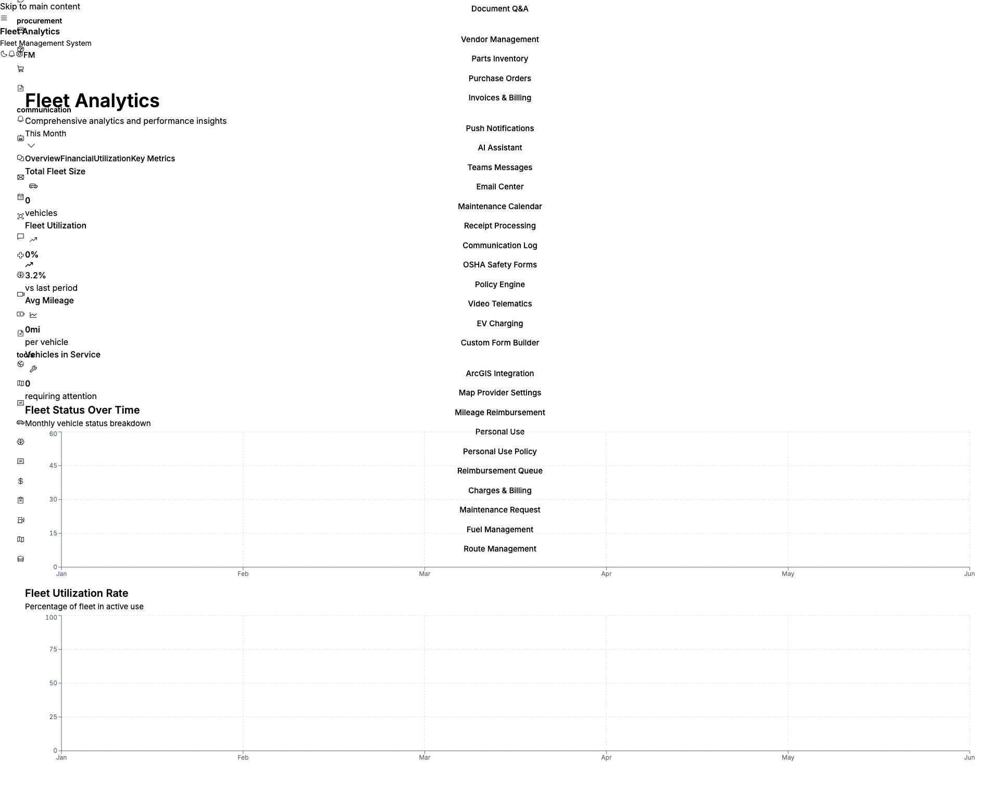
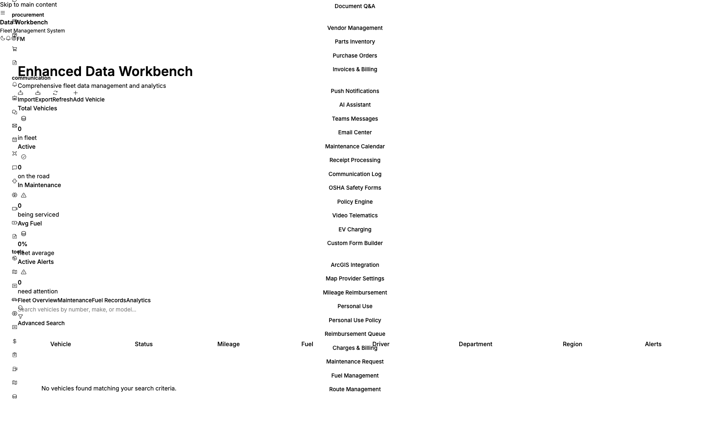
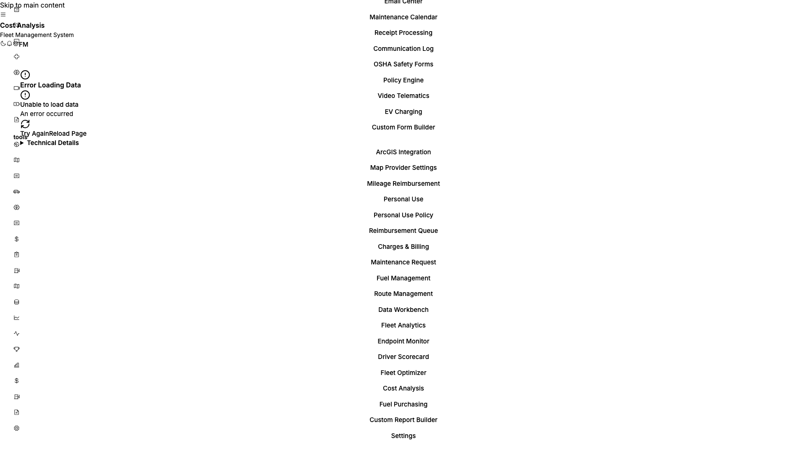

# Fleet Management Platform
## City of Tallahassee Proposal

---

# Unified Fleet Intelligence for Tallahassee

**One Platform. Complete Control. Seamless Integration.**

*Consolidate your fleet operations while keeping your existing Samsara investment*


---

## Executive Summary

The City of Tallahassee currently operates with a fragmented fleet management approach:
- **Samsara devices** for telematics on some vehicles
- **Separate fuel management application** for fuel tracking
- **Multiple systems** requiring manual data reconciliation

**Our Solution:** A unified Fleet Management Platform that:
- **Integrates directly with your existing Samsara devices** - no hardware changes needed
- **Consolidates fuel management** into a single platform
- **Provides complete fleet visibility** across all city departments
- **Ensures government compliance** with DOT, IFTA, OSHA, and municipal requirements

---

## The Problem with Fragmented Systems

| Challenge | Impact on Tallahassee |
|-----------|----------------------|
| Multiple logins & interfaces | Staff inefficiency, training overhead |
| Data silos between systems | Incomplete reporting, blind spots |
| Manual data reconciliation | Wasted staff hours, error-prone |
| Separate fuel tracking | Missed optimization opportunities |
| No unified compliance view | Audit preparation burden |
| Inconsistent driver visibility | Safety gaps across fleet segments |

**Result:** Higher operational costs, increased administrative burden, and reduced fleet efficiency.

---

## Our Solution: Unified Fleet Intelligence


### One Platform That Does It All

```
+------------------------------------------------------------------+
|                    FLEET MANAGEMENT PLATFORM                      |
|                                                                   |
|  +------------+  +------------+  +------------+  +------------+   |
|  |  Samsara   |  |   Fuel     |  |   Asset    |  | Compliance |   |
|  | Integration|  | Management |  | Management |  |  & Safety  |   |
|  +------------+  +------------+  +------------+  +------------+   |
|                                                                   |
|  +------------+  +------------+  +------------+  +------------+   |
|  |   Driver   |  |Maintenance |  | Operations |  | Analytics  |   |
|  | Management |  |    Hub     |  |  Dispatch  |  | & Reports  |   |
|  +------------+  +------------+  +------------+  +------------+   |
|                                                                   |
+------------------------------------------------------------------+
                              |
        +--------------------+--------------------+
        |                    |                    |
   Your Samsara        Your Vehicles        Your Staff
     Devices           & Equipment          & Drivers
```

---

## Key Value Propositions

### 1. Keep Your Samsara Investment
Your existing Samsara devices work seamlessly with our platform. No rip-and-replace required.

### 2. Eliminate the Fuel Management App
Consolidate fuel tracking into the unified platform with enhanced optimization features.

### 3. Complete Government Compliance
Purpose-built compliance modules for municipal fleet requirements.

### 4. AI-Powered Cost Optimization
104 AI agents continuously optimizing fuel, routes, and maintenance.

### 5. Real-Time City-Wide Visibility
See every vehicle, driver, and asset across all departments in one dashboard.

---

## Samsara Integration: Keep What Works

### Seamless Data Synchronization

Our platform integrates with your existing Samsara infrastructure:

| Samsara Data | How We Use It |
|--------------|---------------|
| **Real-time GPS** | Live vehicle tracking on city maps |
| **OBD-II Telemetry** | Fuel levels, odometer, engine state |
| **Dash Cameras** | Video telematics for safety events |
| **Driver Behavior** | Safety scoring and coaching |
| **Speed & Heading** | Route verification and compliance |
| **Harsh Events** | Incident detection and alerts |

### What This Means for Tallahassee:
- **No new hardware purchases** for Samsara-equipped vehicles
- **No driver retraining** on hardware operation
- **Instant data flow** from existing devices
- **Unified view** of both Samsara and non-Samsara vehicles

---

## Fuel Management: Consolidate & Optimize

### Replace Your Separate Fuel App with Enhanced Capabilities

| Current State | With Our Platform |
|---------------|-------------------|
| Separate login for fuel | Single unified dashboard |
| Basic fuel tracking | AI-powered optimization |
| Manual price comparison | Real-time fuel pricing (25-mile radius) |
| No integration with telematics | Idling detection with fuel waste calculation |
| Limited reporting | Advanced analytics and forecasting |

### Fuel Optimization Features

**Real-Time Fuel Intelligence:**
- Nearby station discovery with live pricing
- Fleet card optimization recommendations
- Bulk vs. retail cost analysis
- Price alerts when thresholds are met

**Idling Detection & Waste Prevention:**
- Real-time idling monitoring across all vehicles
- Fuel waste quantification (gallons + cost)
- CO2 emission tracking for sustainability reports
- Authorized vs. unauthorized idling classification
- Driver alerts and manager notifications

**Cost Hedging & Forecasting:**
- Price trend analysis
- Fixed price recommendations
- Volume discount optimization
- Budget forecasting tools

---

## Government Compliance: Built for Municipal Fleets

### Comprehensive Regulatory Coverage


| Compliance Area | Platform Capabilities |
|-----------------|----------------------|
| **DOT Compliance** | Vehicle inspections, HOS tracking, ELD status |
| **IFTA Reporting** | International Fuel Tax Agreement automation |
| **OSHA Standards** | Safety compliance monitoring (92% baseline) |
| **CSA Ratings** | Compliance, Safety & Accountability tracking |
| **Municipal Requirements** | Customizable compliance rules |


### Audit-Ready Documentation

- **Complete audit trails** for all fleet operations
- **Encrypted log storage** for sensitive data
- **Automated retention policies** per city requirements
- **One-click compliance reports** for inspections
- **Role-Based Access Control** for department-level security

### ELD & HOS Management
- 100% Electronic Logging Device compliance
- Hours of Service violation prevention
- Real-time driver availability status
- Automatic violation alerts

---

## Asset Management: Beyond Vehicles

### Complete Asset Lifecycle Tracking

Your fleet includes more than just vehicles. Our platform tracks:

| Asset Type | Tracking Capabilities |
|------------|----------------------|
| **Vehicles** | Full lifecycle from acquisition to disposal |
| **Heavy Equipment** | Maintenance, location, utilization |
| **Trailers & Attachments** | Assignment, condition, availability |
| **Tools & Equipment** | Inventory, checkout, maintenance |
| **Parts Inventory** | Stock levels, reorder alerts, costs |

### Asset Intelligence Dashboard
- **Total asset valuation** with real-time updates
- **Depreciation tracking** for budget planning
- **Utilization rates** to identify underused assets
- **Maintenance scheduling** based on usage patterns
- **Mobile inventory** with barcode/QR scanning

---

## Driver Safety & Management

### Protect Your Drivers. Protect the City.


**Driver Performance Metrics:**
- Safety scores with coaching recommendations
- On-time performance tracking
- License and certification expiration alerts
- Training completion monitoring


**AI-Powered Safety Analysis:**
- Distraction detection from video telematics
- Drowsiness monitoring for long shifts
- Harsh driving event detection
- G-force measurement for accident investigation

**Incident Management:**
- Open incident tracking and resolution
- Days-without-incident dashboards
- Video evidence preservation
- Root cause analysis tools

### Safety KPIs for City Leadership
| Metric | Benchmark |
|--------|-----------|
| Fleet Safety Score | 92/100 |
| Driver Training Completion | 96% |
| Average Alert Response Time | 4.2 minutes |
| ELD Compliance | 100% |

---

## Maintenance Hub: Internal & Vendor Operations

### Built for Cities That Do Both In-House and Outsourced Work

Tallahassee maintains vehicles both internally AND through external vendors. Our platform handles both seamlessly in one unified system.


---

### Internal Maintenance Operations

**Technician Management:**
- Assign work orders to individual city technicians
- Track labor hours with configurable hourly rates
- Monitor technician workload and availability
- Performance tracking per technician

**Service Bay Management:**
- Track service bay capacity per city facility
- Real-time bay utilization monitoring
- Facility-based work order assignment
- Multiple facility support across city locations

**Work Order System:**
| Work Order Type | Internal | Vendor | Both |
|-----------------|----------|--------|------|
| Preventive Maintenance | Yes | Yes | Yes |
| Corrective Repairs | Yes | Yes | Yes |
| Inspections | Yes | Yes | Yes |
| Recalls | - | Yes | Yes |
| Warranty Work | - | Yes | Yes |
| Accident Repairs | Yes | Yes | Yes |
| Tire Service | Yes | Yes | Yes |
| Emergency Work | Yes | Yes | Yes |
| Bodywork | Yes | Yes | Yes |

**Work Order Assignment Flow:**
```
New Work Order Created
        |
        v
+-------+-------+
|               |
v               v
INTERNAL        EXTERNAL
Assign to       Assign to
Technician      Vendor
+ Facility      + PO Creation
|               |
v               v
Track Labor     Track Invoice
& Parts         & Payment
|               |
v               v
+-------+-------+
        |
        v
   Complete &
   Close Order
```

---

### Vendor Management System

**Supported Vendor Types:**
- Service providers (repair shops, dealerships)
- Parts suppliers
- Body shops
- Tire shops
- Towing services
- Equipment rental companies
- Specialty contractors


**Vendor Status Tracking:**
| Status | Description |
|--------|-------------|
| Active | Approved and available for work |
| Preferred | Priority vendors with negotiated rates |
| Pending Approval | New vendors under review |
| On Hold | Temporarily unavailable |
| Blacklisted | Do not use |

**Vendor Capabilities Tracked:**
- Ratings (0-5 stars) based on performance
- Insurance verification with expiration alerts
- License and certification tracking
- Service categories and service areas
- Emergency/24/7 availability
- Contact persons and primary contacts

---

### Parts & Labor Tracking

**Parts Management:**


| Feature | Capability |
|---------|------------|
| Inventory Tracking | SKU, quantity on hand, reserved, available |
| Reorder Alerts | Automatic alerts at reorder points |
| Vendor Pricing | Multi-vendor price comparison |
| Vehicle Compatibility | Make/model/year compatibility matrix |
| Bin Locations | Warehouse location tracking |
| Part Conditions | New, remanufactured, used, OEM, aftermarket |

**Labor Tracking:**
- Individual technician labor entries
- Configurable hourly rates per technician
- Automatic cost calculation: Parts + Labor + Tax
- Labor type categorization
- Date and notes tracking

---

### Purchase Order System

**Full PO Lifecycle:**
1. **Draft** - Create PO with line items
2. **Submitted** - Sent for approval
3. **Approved** - Approved by supervisor
4. **Ordered** - Sent to vendor
5. **Received** - Parts/services delivered
6. **Cancelled** - If needed


**PO Features:**
- Unique PO numbers
- Vendor assignment
- Expected vs. actual delivery dates
- Line item detail (part number, description, quantity, unit price, total)
- Subtotal, tax, shipping, total calculations
- Approval workflow with approver tracking
- Audit trail (created by, approved by, timestamps)

---

### Vendor Invoicing & Payment

**Invoice Tracking:**


| Field | Purpose |
|-------|---------|
| Invoice Number | Vendor's invoice reference |
| Invoice Date | Date of invoice |
| Payment Status | Unpaid / Partial / Paid / Refunded |
| Linked Work Order | Connect invoice to work performed |
| Linked PO | Connect to purchase order |

---

### Vendor Performance Analytics

**Track vendor performance over time:**

| Metric Category | What We Track |
|-----------------|---------------|
| **Quote Response** | Quotes requested, responded, avg response time |
| **Orders** | Orders placed, completed, cancelled, total value |
| **Delivery** | On-time %, late %, wrong parts % |
| **Quality** | Parts returned, warranty claims, quality rating |
| **Pricing** | Competitiveness score, contract compliance |
| **Overall Score** | 0-100 performance score |

**Use for:**
- Vendor selection decisions
- Contract negotiations
- Performance reviews
- Preferred vendor designation

---

### Warranty Management

**Warranty Tracking:**
- Mark work orders as warranty claims
- Warranty claim number tracking
- Parts warranty by months and mileage
- OEM vs. aftermarket warranty differences
- Return policy tracking
- Link warranty work to related maintenance schedules

**Warranty Work Flow:**
```
Identify Warranty Issue
        |
        v
Create Work Order (Type: Warranty)
        |
        v
Assign to Vendor (typically OEM dealer)
        |
        v
Track Claim Number
        |
        v
Monitor Completion & Cost Recovery
```

---

### Recurring Maintenance Automation

**Schedule-Based Work Order Generation:**

| Trigger Type | Example |
|--------------|---------|
| Mileage-based | Oil change every 5,000 miles |
| Time-based | Inspection every 90 days |
| Engine hours | Service every 250 hours |
| Combined | First trigger wins |

**Auto-Assignment Features:**
- Default technician assignment per schedule
- Default vendor assignment per schedule
- Estimated cost and duration
- Priority and parts list templates
- Due date predictions with confidence scoring
- Warning thresholds and grace periods

---

### Maintenance Metrics Dashboard

| Metric | Value | Benefit |
|--------|-------|---------|
| Average Repair Time | 3.2 hours | Track efficiency |
| Maintenance Efficiency | 88% | Identify improvements |
| Parts Inventory Items | 1,456+ | Prevent stockouts |
| Scheduled Weekly | 24+ | Workload visibility |
| Internal vs Vendor | 60%/40% | Resource allocation |
| Warranty Recovery | Track $ | Cost savings |

---

## Operations & Dispatch

### Real-Time Operational Control


**Dispatch Console:**
- Live job tracking and assignment
- Vehicle availability status
- Route optimization
- Delay detection and alerts


**Geofencing:**
- Create zones for city facilities, neighborhoods, restricted areas
- Automatic entry/exit alerts
- Compliance zone enforcement
- Time-in-zone reporting

**Communication:**
- Radio console integration
- Driver messaging
- Emergency alert system
- Shift coordination tools

---

## Analytics & Reporting

### Data-Driven Decision Making


**Executive Dashboard:**
- Real-time KPIs visible at a glance
- Fleet utilization rates
- Cost per mile tracking
- Safety and compliance scores



**Custom Report Builder:**
- Drag-and-drop report creation
- Multiple data sources
- Advanced filtering and aggregations
- Excel export with automated delivery



**AI-Generated Insights:**
- Anomaly detection
- Cost optimization recommendations
- Predictive analytics
- Trend forecasting



### Key Metrics for City Leadership
| Metric | Typical Value | City Benefit |
|--------|---------------|--------------|
| Fleet Utilization | 87% | Maximize vehicle ROI |
| Cost Per Mile | $0.42 | Budget accuracy |
| On-Time Rate | 94% | Service quality |
| Fuel Savings | 15-25% | Tax dollar efficiency |

---

## AI-Powered Optimization

### 104 AI Agents Working for Tallahassee

**What Our AI Does:**
- **Route Optimization:** Reduce fuel consumption and travel time
- **Predictive Maintenance:** Prevent breakdowns before they happen
- **Fuel Optimization:** Recommend best fueling locations and times
- **Driver Coaching:** Personalized safety improvement recommendations
- **Anomaly Detection:** Identify unusual patterns requiring attention
- **Document Intelligence:** Search across all fleet documents instantly

**Machine Learning Benefits:**
- Learns from your fleet's specific patterns
- Improves recommendations over time
- Reduces manual analysis workload
- Surfaces insights humans might miss

---

## Security & Compliance Architecture

### Enterprise-Grade Security for Government Data

| Security Feature | Implementation |
|------------------|----------------|
| **Data Encryption** | At-rest and in-transit encryption |
| **Access Control** | Role-Based Access Control (RBAC) |
| **Audit Logging** | Complete operation audit trail |
| **Tenant Isolation** | Row-Level Security (RLS) |
| **Secret Management** | Azure Key Vault integration |
| **Compliance** | SSRF protection, CSRF tokens, Helmet.js |

### Deployment Security
- **SSL/TLS A+ Rating** for all connections
- **Azure Cloud Infrastructure** with government compliance options
- **Automated backup and recovery**
- **Disaster recovery procedures**
- **24/7 monitoring and alerting**

---

## Implementation Timeline

### Phase 1: Foundation (Weeks 1-2)
- [ ] Platform provisioning and configuration
- [ ] Samsara integration setup and testing
- [ ] User account creation and role assignment
- [ ] Initial vehicle and asset data import

### Phase 2: Integration (Weeks 3-4)
- [ ] Complete Samsara device synchronization
- [ ] Fuel management data migration
- [ ] Geofence configuration for city zones
- [ ] Compliance rules customization

### Phase 3: Training & Rollout (Weeks 5-6)
- [ ] Administrator training sessions
- [ ] Dispatcher and operations training
- [ ] Driver app deployment
- [ ] Management dashboard orientation

### Phase 4: Optimization (Weeks 7-8)
- [ ] AI optimization tuning
- [ ] Custom report development
- [ ] Performance baseline establishment
- [ ] Go-live support and monitoring

---

## ROI Analysis for Tallahassee

### Projected Annual Savings

| Category | Estimated Savings | How |
|----------|-------------------|-----|
| **Fuel Optimization** | 15-25% reduction | AI-powered routing, idling detection |
| **Maintenance** | 20% cost reduction | Predictive maintenance, efficient scheduling |
| **Administrative** | 30% time savings | Unified platform, automated reporting |
| **Compliance** | Avoid penalties | Proactive violation prevention |
| **Safety** | Reduced liability | Lower accident rates, better training |

### Example: 150-Vehicle Fleet

| Current Annual Cost | With Platform | Savings |
|---------------------|---------------|---------|
| Fuel: $500,000 | $400,000 | $100,000 |
| Maintenance: $200,000 | $160,000 | $40,000 |
| Admin Time: $80,000 | $56,000 | $24,000 |
| **Total** | | **$164,000/year** |

*Actual savings vary based on fleet size, vehicle types, and current operational efficiency.*

---

## Why Choose Our Platform?

### Compared to Continuing with Samsara + Fuel App

| Capability | Current Setup | Our Platform |
|------------|---------------|--------------|
| Unified Dashboard | No | Yes |
| Single Sign-On | No | Yes |
| Samsara Integration | Native | Native |
| Fuel Optimization | Basic | AI-Powered |
| Asset Management | Limited | Comprehensive |
| Government Compliance | Partial | Complete |
| Custom Reporting | Limited | Unlimited |
| AI Insights | No | 104 AI Agents |
| Predictive Maintenance | No | Yes |
| 3D Vehicle Visualization | No | Yes |

### Additional Platform Advantages
- **Production-proven** platform with proven reliability
- **Continuous updates** with new features
- **Dedicated support** for municipal clients
- **Customization options** for city-specific needs
- **Scalable** to grow with Tallahassee's fleet

---

## Platform Demonstration

### Live Demo Capabilities

We can demonstrate:

1. **Samsara Integration** - See how your existing devices feed data into the platform
2. **Unified Dashboard** - Real-time fleet visibility across all vehicles
3. **Fuel Management** - AI-powered optimization and idling detection
4. **Compliance Center** - DOT, IFTA, and municipal compliance tracking
5. **Maintenance Hub** - Work orders and predictive maintenance
6. **Custom Reports** - Build a Tallahassee-specific report live
7. **3D Virtual Garage** - Interactive vehicle visualization

### Demo Environment
- Live production platform
- Sample municipal fleet data
- Real Samsara integration
- Interactive exploration

---

## Next Steps

### Getting Started with Tallahassee

1. **Discovery Session**
   - Review current fleet composition
   - Identify priority pain points
   - Map Samsara device coverage
   - Document fuel management requirements

2. **Technical Assessment**
   - Samsara account integration requirements
   - Data migration from fuel app
   - User role requirements
   - Compliance customization needs

3. **Pilot Program**
   - Select department for initial rollout
   - 30-day pilot with full functionality
   - Success metrics establishment
   - Staff feedback collection

4. **Full Deployment**
   - City-wide rollout plan
   - Training program execution
   - Legacy system retirement
   - Ongoing optimization support

---

## Electric Vehicle Fleet Support

### Ready for Tallahassee's EV Transition

As municipalities transition to electric vehicles, our platform is ready:


**EV Charging Management:**
- Charging station tracking and management
- Charge level monitoring across EV fleet
- Charging schedule optimization
- Range analysis for route planning
- Energy cost tracking

**Smartcar Integration for EVs:**
- Battery state of charge
- Charging status
- Remote charging control
- Range estimation
- Charge completion notifications

---

## People & Resource Management

### Complete Workforce Visibility


**Staff Management:**
- Driver roster with status tracking
- Technician workload visibility
- Certification and license tracking
- Training completion monitoring
- Role-based access control

---

## Mobile & Tablet Support

### Access Anywhere


**Mobile Capabilities:**
- Responsive design for all devices
- Driver mobile app
- Technician work order app
- Manager dashboard access
- Real-time notifications

---

## What Sets Us Apart for Tallahassee

### Key Differentiators vs. Current Setup

| Challenge | Current (Samsara + Fuel App) | Our Platform |
|-----------|------------------------------|--------------|
| **Internal + Vendor Work** | Manual tracking | Unified work order system |
| **Parts Inventory** | Separate spreadsheets | Integrated with work orders |
| **Vendor Performance** | No visibility | Automated scoring |
| **Warranty Tracking** | Manual files | System-linked claims |
| **Fuel Optimization** | Basic tracking | AI-powered recommendations |
| **Compliance Reporting** | Multiple systems | One-click reports |
| **Cost Analysis** | Manual consolidation | Real-time dashboards |

### Additional Value for Tallahassee

1. **Unified Internal & Vendor Management**
   - Single system for all maintenance regardless of who does the work
   - Clear visibility into internal vs. outsourced costs
   - Vendor performance tracking for contract negotiations

2. **Government-Ready Compliance**
   - Pre-built compliance modules for DOT, IFTA, OSHA
   - Audit trails meet municipal record-keeping requirements
   - Role-based access for department separation

3. **Future-Proof Platform**
   - EV charging ready for fleet transition
   - AI capabilities that improve over time
   - Regular feature updates included

4. **Consolidation Savings**
   - Eliminate fuel management app subscription
   - Reduce administrative time reconciling systems
   - Single training requirement for staff

---

## Contact Information

### Ready to Unify Tallahassee's Fleet?

**Schedule a Demo:** See the platform in action with your data

**Technical Questions:** Deep-dive on Samsara integration

**Pilot Program:** Start a 30-day evaluation

---

## Appendix A: Feature Comparison Matrix

| Feature | Our Platform | Samsara Standalone | Typical Fuel App |
|---------|--------------|-------------------|------------------|
| Real-time GPS Tracking | Yes | Yes | No |
| Video Telematics | Yes (via Samsara) | Yes | No |
| Driver Safety Scoring | Yes | Yes | No |
| Fuel Price Optimization | Yes | No | Basic |
| Idling Detection | Yes | Yes | No |
| Fuel Cost Forecasting | Yes | No | Limited |
| Asset Management | Yes | Limited | No |
| Work Order Management | Yes | No | No |
| Predictive Maintenance | Yes | No | No |
| DOT Compliance | Yes | Partial | No |
| IFTA Reporting | Yes | No | Partial |
| Custom Reports | Yes | Limited | Limited |
| AI Optimization | Yes | Limited | No |
| Unified Dashboard | Yes | No | No |
| Government Audit Tools | Yes | No | No |

---

## Appendix B: Technical Specifications

### Platform Architecture
- **Frontend:** React 18 + TypeScript
- **Backend:** Node.js + Express (263 service classes)
- **Database:** PostgreSQL 15 with Row-Level Security
- **Real-time:** WebSocket connections
- **Cloud:** Azure Cloud infrastructure
- **APIs:** 142 REST endpoints

### Performance Metrics
- **Response Time:** Sub-1 second
- **Availability:** 99.9% uptime SLA
- **Bundle Size:** 272 KB (optimized)
- **Lazy Loading:** 50+ modules
- **Testing:** 122+ E2E tests

### Security Certifications
- SSL/TLS A+ Rating
- Azure security compliance
- SSRF/CSRF protection
- Encrypted audit logs
- RBAC with RLS

---

## Appendix C: Integration Details

### Samsara API Integration

```
Supported Samsara Data Points:
├── Vehicle Information
│   ├── VIN, Make, Model, Year
│   ├── License Plate
│   └── Asset Tags
├── Real-time Telemetry
│   ├── GPS Location (lat/lng)
│   ├── Speed and Heading
│   ├── Odometer
│   ├── Fuel Level
│   ├── Engine State
│   └── Battery Voltage
├── Safety Events
│   ├── Harsh Acceleration
│   ├── Harsh Braking
│   ├── Harsh Cornering
│   ├── Speeding
│   └── Distracted Driving
└── Video Telematics
    ├── Dash Cam Footage
    ├── Safety Event Clips
    └── Storage Management
```

### Data Refresh Rates
- GPS Location: Real-time (WebSocket)
- Telemetry: 30-second intervals
- Safety Events: Immediate
- Video: On-demand retrieval

---

*This proposal was prepared specifically for the City of Tallahassee Fleet Management Division*

*Platform Version: Production Release*

*Proposal Date: January 2026*
