```mermaid
graph TD
    A["🚀 START: Driver Clicks<br/>Pre-Trip Inspection"] -->|System loads form| B{"Vehicle Type<br/>Match?"}
    B -->|No match| C["⚠️ Report Vehicle<br/>Mismatch"]
    C -->|Contact dispatcher| D["⏹️ STOP - Resolve<br/>Vehicle Issue"]
    B -->|Yes| E["📋 Display Inspection<br/>Checklist by Category"]
    E -->|Lights section| F["Headlights, Brake Lights,<br/>Turn Signals, Clearance"]
    E -->|Tires section| G["Tread Depth, Pressure,<br/>Damage, Lug Nuts"]
    E -->|Brakes section| H["Pedal Feel, Park Brake,<br/>Air Pressure Gauge"]
    E -->|Fluids section| I["Coolant, Oil, Trans,<br/>Brake, Power Steering"]
    F -->|Pass/Fail| J{"Item Passed<br/>or Failed?"}
    G -->|Pass/Fail| J
    H -->|Pass/Fail| J
    I -->|Pass/Fail| J
    J -->|FAILED| K["📸 Require Photo<br/>for Defect"]
    J -->|PASS| L["✓ Mark Complete"]
    K -->|Take photo| M["🎤 Optional Voice<br/>Note Annotation"]
    M -->|Voice saved| N["Convert Voice to<br/>Text Annotation"]
    L -->|Continue| N
    N -->|Next item| O{"All Items<br/>Reviewed?"}
    O -->|No| F
    O -->|Yes| P["📊 Display Summary<br/>Pass/Fail Count"]
    P -->|Review critical failures| Q{"Critical Item<br/>Failures?"}
    Q -->|Yes - Brakes/Lights| R["🚨 ALERT: Cannot Mark<br/>PASS with Critical Failures"]
    R -->|Add notes| S["Note: 'Brakes need mechanic<br/>inspection before route'"]
    Q -->|No failures| T["✓ All Items PASSED"]
    R -->|Sign inspection| U["✍️ Electronic Signature<br/>Capture"]
    S -->|Sign inspection| U
    T -->|Sign inspection| U
    U -->|Fingerprint/Touch| V["📌 Capture GPS<br/>Timestamp"]
    V -->|Encrypt signature| W["🔒 Secure Local<br/>Storage"]
    W -->|Submit| X["📤 Queue for Upload<br/>with Priority Flag"]
    X -->|Upload inspection| Y["🌐 Server Receives<br/>Pre-Trip Data"]
    Y -->|Critical failures?| Z{"Critical<br/>Issues?"}
    Z -->|Yes| AA["📢 Dispatcher Alert:<br/>DO NOT DISPATCH"]
    AA -->|Maintenance alert| AB["Maintenance Team:<br/>Schedule Service"]
    AB -->|Driver waiting| AC["⏸️ WAIT FOR APPROVAL:<br/>Cannot Start Route"]
    AC -->|Mechanic clears| AD["✓ Dispatcher Approves<br/>Start Route"]
    Z -->|No| AD
    AD -->|Navigation available| AE["🗺️ Route Start Enabled<br/>Clock-In Complete"]
    AE -->|Begin delivery| AF["✅ END: Route<br/>Operation Started"]

    style A fill:#e1f5ff
    style AF fill:#c8e6c9
    style R fill:#ffcdd2
    style AA fill:#ffcdd2
    style AC fill:#fff3e0
    style AD fill:#c8e6c9
```

```mermaid
graph TD
    A["🚀 START: Driver Taps<br/>End Shift/Post-Trip"] -->|Route complete| B["📍 Return to Depot<br/>Location"]
    B -->|Click post-trip| C["📋 Load Post-Trip<br/>Inspection Form"]
    C -->|Retrieve pre-trip| D["📊 Display Pre-Trip<br/>Comparison Data"]
    D -->|Pre-trip odometer<br/>Pre-trip fuel| E["📝 Post-Trip Form:<br/>Current Odometer"]
    E -->|Driver enters| F["🔢 Odometer Reading<br/>e.g., 45,412 miles"]
    F -->|Telematics data| G{"Odometer vs GPS<br/>Match?"}
    G -->|Within ±10%| H["✓ Mileage Validated"]
    G -->|>10% variance| I["⚠️ ALERT: Odometer/GPS<br/>Mismatch Detected"]
    I -->|Driver confirms| J["Driver confirms reading<br/>is correct"]
    J -->|Flag for review| K["Dispatcher flag:<br/>Possible error"]
    H -->|Continue| L["⛽ Current Fuel Level"]
    K -->|Continue| L
    L -->|Driver enters| M["3/8 tank (or gauge status)"]
    M -->|Compare to pre-trip| N["📊 System Calculates<br/>Fuel Consumption"]
    N -->|Fuel reasonable?| O{"Fuel Usage<br/>Normal?"}
    O -->|Yes| P["✓ Fuel validated"]
    O -->|No| Q["⚠️ High fuel consumption<br/>Possible leak?"]
    Q -->|Driver note| R["Driver: 'Air conditioning<br/>on full power'"]
    P -->|Continue| S["🔍 Condition Assessment<br/>by Category"]
    R -->|Continue| S
    S -->|Lights, Tires,<br/>Brakes, Fluids| T["Driver marks PASS/FAIL<br/>for each item"]
    T -->|Compare pre-trip| U["📊 Side-by-Side<br/>Pre vs Post"]
    U -->|Check for changes| V{"Changes from<br/>Pre-Trip?"}
    V -->|Brakes improved| W["Pre-trip FAIL →<br/>Post-trip PASS"]
    W -->|Dispatcher flag| X["Possible temporary issue<br/>or mechanic fixed it?"]
    V -->|New damage found| Y["⚠️ Dashboard warning light<br/>Check Engine found"]
    Y -->|Take photo| Z["📸 Photograph warning<br/>light on dashboard"]
    Z -->|Voice note| AA["🎤 'Engine light came on<br/>around 2 PM'"]
    V -->|No changes| AB["✓ No new issues"]
    X -->|Continue| AC["🔨 Damage Assessment"]
    AA -->|Continue| AC
    AB -->|Continue| AC
    AC -->|Cargo area clean?| AD["Driver: 'Cargo removed,<br/>tie-downs secure'"]
    AD -->|Any new damage?| AE{"New Damage<br/>Reported?"}
    AE -->|Yes| AF["📸 Damage photos<br/>with annotations"]
    AF -->|Interactive diagram| AG["Click damage location<br/>on vehicle diagram"]
    AE -->|No| AH["✓ No damage"]
    AG -->|Severity level| AH
    AH -->|Review summary| AI["📊 Post-Trip Summary<br/>Dashboard"]
    AI -->|Mileage: 178 miles<br/>Fuel: 4 tanks used<br/>Issues: Check Engine| AJ["✍️ Driver Signature<br/>Capture"]
    AJ -->|Fingerprint/Touch| AK["📌 GPS + Timestamp<br/>4:52 PM, Depot"]
    AK -->|Encrypt| AL["🔒 Secure Local<br/>Storage"]
    AL -->|Submit| AM["📤 Post-Trip Queued<br/>for Upload"]
    AM -->|Upload to server| AN["🌐 Server Processes<br/>Post-Trip Data"]
    AN -->|Serious issues?| AO{"Vehicle Ready<br/>for Next Driver?"}
    AO -->|Yes| AP["✓ Vehicle Cleared<br/>for Next Shift"]
    AP -->|Mark in service| AQ["Next driver notified:<br/>Vehicle ready, Check Engine flagged"]
    AO -->|No - maintenance req'd| AR["🚨 Vehicle TAKEN OFF<br/>ACTIVE FLEET"]
    AR -->|Alert maintenance| AS["Maintenance: Schedule<br/>service for Vehicle"]
    AR -->|Reassign fleet| AT["Dispatcher assigns<br/>replacement vehicle"]
    AQ -->|Clock out| AU["✅ Driver Clocked Out<br/>Successfully"]
    AT -->|Clock out| AU
    AU -->|End shift| AV["✅ END: Shift Complete<br/>Next Driver Ready"]

    style A fill:#e1f5ff
    style AV fill:#c8e6c9
    style I fill:#ffcdd2
    style Q fill:#fff3e0
    style Y fill:#fff3e0
    style AR fill:#ffcdd2
```

```mermaid
graph TD
    A["🚀 START: Driver<br/>Clocks In"] -->|Default status| B["⭕ Status: Off-Duty"]
    B -->|System ready| C["📊 Display HOS<br/>Dashboard"]
    C -->|Show time available| D["Drive Time: 11 hrs<br/>On-Duty: 14 hrs<br/>7-Day: 60 hrs"]
    D -->|Shift begins| E{"What Activity<br/>Happens?"}
    E -->|Pre-trip inspection| F["On-Duty manual switch<br/>or auto-detect"]
    E -->|Vehicle movement| G["Telematics: Speed<br/>detection >5 mph"]
    E -->|Yard movement| H["<5 mph = Yard move<br/>not charged to drive"]
    E -->|Break/meal| I["Off-Duty manual<br/>switch"]
    F -->|Engine start| J["System logs:<br/>On-Duty (Not Driving)"]
    G -->|Sustained 1 min| K{"Confirmed<br/>Movement?"}
    K -->|Yes| L["🚙 Auto-Switch:<br/>DRIVING"]
    K -->|No - stopped| M["Stationary - On-Duty<br/>or Off-Duty?"]
    L -->|Log switch| N["📌 Timestamp:<br/>Auto-switch at 6:35 AM"]
    M -->|Driver maintains| N
    N -->|Track cumulative| O["Drive Time: 0:00<br/>On-Duty: 0:15"]
    O -->|Continue driving| P["🕐 Accumulating<br/>Drive Hours"]
    P -->|Time passing| Q["At 8:35 AM<br/>Drive: 2:00 hours"]
    Q -->|Stop for delivery| R["Vehicle speed drops<br/>to 0 mph"]
    R -->|Engine running?| S{"Engine<br/>Still Running?"}
    S -->|Yes| T["On-Duty (Not Driving)"]
    S -->|No| U["Off-Duty"]
    T -->|Load/unload cargo| V["On-Duty time: 0:25"]
    V -->|Resume driving| W["Auto-switch back<br/>to DRIVING"]
    U -->|Rest break| V2["Off-Duty time: 0:25"]
    V2 -->|Resume| W
    W -->|Continue route| X["🕐 Accumulating<br/>More Drive Time"]
    X -->|At 1:45 PM| Y["Drive Time: 5.5 hrs<br/>On-Duty: 11 hrs"]
    Y -->|Driver needs break| Z["Driver manual switch:<br/>Off-Duty"]
    Z -->|Log break| AA["Break: Meal Break<br/>Off-Duty time not charged"]
    AA -->|30 min break| AB["2:15 PM - Resume<br/>Driving"]
    AB -->|Back to driving| AC["Auto-switch to<br/>DRIVING"]
    AC -->|Continue rest day| AD["🕐 Multiple deliveries<br/>throughout afternoon"]
    AD -->|At 4:30 PM| AE["Drive Time: 8.5 hrs<br/>Remaining: 2.5 hrs"]
    AE -->|Monitor limit| AF{"Approaching<br/>Limit?"}
    AF -->|Yes - 60 min away| AG["📢 ALERT: Drive time<br/>warning - 2.5 hrs remaining"]
    AF -->|No| AH["Continue normally"]
    AG -->|Driver sees| AI["⏰ Countdown: 2:30:00"]
    AI -->|Driver plans| AJ["Schedule for arrival<br/>before limit"]
    AH -->|End of shift| AK["Final delivery complete<br/>at 5:15 PM"]
    AJ -->|Return to depot| AK
    AK -->|Drive to depot| AL["30 min return (9 hr total)"]
    AL -->|At 5:45 PM| AM["Drive Time: 9:00 hrs<br/>Within 11-hour limit ✓"]
    AM -->|Arrival| AN["Engine stops<br/>Vehicle parked"]
    AN -->|Post-trip complete| AO["Post-trip inspection"]
    AO -->|Clock out| AP["Manual switch:<br/>Off-Duty"]
    AP -->|Log completion| AQ["📊 Daily HOS Summary"]
    AQ -->|Display totals| AR["Drive: 9:00 / 11:00<br/>On-Duty: 11:58 / 14:00<br/>Off-Duty: 12:02 (met 10-hr req)"]
    AR -->|Certify logs| AS["🖊️ Driver Certifies<br/>Daily HOS"]
    AS -->|Digital signature| AT["Signature + GPS<br/>+ Timestamp"]
    AT -->|Upload| AU["🌐 Server Receives<br/>HOS Certification"]
    AU -->|Compliance check| AV["✓ Compliant<br/>- No violations<br/>- All limits met<br/>- Proper breaks taken"]
    AV -->|Historical tracking| AW["7-Day: 34 hrs<br/>8-Day: 58 hrs"]
    AW -->|Next day ready| AX["✅ END: HOS Complete<br/>Ready for Next Shift"]

    style A fill:#e1f5ff
    style AX fill:#c8e6c9
    style AG fill:#fff3e0
    style AM fill:#c8e6c9
```

```mermaid
graph TD
    A["🚀 START: Driver<br/>Accumulating Hours"] -->|Tracking| B["📊 Real-time HOS<br/>Calculation"]
    B -->|Compare to limit| C{"Within 60 min<br/>of Limit?"}
    C -->|No| D["Continue normal<br/>operations"]
    C -->|Yes| E["⏰ Entering Warning<br/>Zone"]
    D -->|Time passes| C
    E -->|Driver notified| F["📢 ALERT:<br/>Drive Time Warning<br/>3.5 hours remaining"]
    F -->|Display warning| G["Dashboard shows<br/>countdown timer"]
    G -->|Driver reviews| H{"Driver Wants<br/>to Plan Break?"}
    H -->|No| I["Continue driving,<br/>monitor limits"]
    H -->|Yes| J["🗺️ View Safe<br/>Rest Options"]
    J -->|Location services| K["Nearby Facilities:"]
    K -->|Option 1| L["Pilot Flying J<br/>8 miles, 11 min<br/>⭐ Full services<br/>📍 Parking available"]
    K -->|Option 2| M["Love's Truck Stop<br/>15 miles, 18 min<br/>⭐ Full services<br/>📍 Usually quiet"]
    K -->|Option 3| N["Rest Area<br/>3 miles, 5 min<br/>⭐ Free, Basic facilities<br/>📍 Limited parking"]
    I -->|Drive more| O{"Now within<br/>30 min of<br/>Limit?"}
    O -->|No| I
    O -->|Yes| P["⚠️⚠️ Escalated<br/>Warning:<br/>30 min remaining"]
    P -->|Driver sees| Q["Countdown: 0:30:00<br/>Must stop by time X"]
    Q -->|Driver action| R{"Driver<br/>Response?"}
    R -->|Dismissed warning| S["Continue driving<br/>with escalating alerts"]
    R -->|Selected break| T["Driver selects<br/>Pilot Flying J"]
    S -->|15 min before| U["🔴 URGENT Alert<br/>15 min remaining"]
    U -->|Driver sees| V["Very urgent tone<br/>Pull over recommendation"]
    T -->|Navigation update| W["🗺️ Add waypoint:<br/>Pilot Flying J"]
    W -->|Route modified| X["New route includes<br/>break stop"]
    X -->|Driver drives| Y["8 miles to Pilot<br/>11 minutes"]
    Y -->|Arrival| Z["Driver arrives<br/>at Pilot Flying J"]
    S -->|5 min before| AA["🛑 CRITICAL Alert<br/>5 min remaining<br/>MUST STOP NOW"]
    AA -->|Driver forced to act| AB["Driver pulls over<br/>or breaks"]
    Z -->|Click break| AC["Log Break button"]
    AB -->|Click break| AC
    AC -->|Break type| AD["Break Type Options:"]
    AD -->|Option A| AE["Meal Break<br/>(Off-Duty)<br/>Doesn't count toward<br/>14-hour limit"]
    AD -->|Option B| AF["On-Duty Break<br/>Counts toward on-duty<br/>but pauses drive time"]
    AD -->|Option C| AG["Sleeper Berth<br/>(Long-haul only)<br/>Full reset"]
    AE -->|Select meal| AH["⏲️ Break Started:<br/>2:47 PM"]
    AF -->|Select on-duty| AH
    AH -->|Timer begins| AI["30-minute break<br/>in progress"]
    AI -->|Break optional| AJ["Driver can:"]
    AJ -->|Check messages| AK["📨 View dispatch<br/>messages"]
    AJ -->|Review performance| AL["📊 Check performance<br/>metrics"]
    AJ -->|Monitor route| AM["🗺️ View next<br/>deliveries"]
    AI -->|Time remaining| AN["Break progress:<br/>5 min remaining"]
    AN -->|Break complete| AO["30 minutes elapsed<br/>3:17 PM"]
    AO -->|Resume?| AP{"Driver<br/>Ready to<br/>Continue?"}
    AP -->|Yes| AQ["Resume Driving"]
    AP -->|No| AR["Extend break<br/>for 15 min"]
    AR -->|Extra time| AN
    AQ -->|Back on route| AS["🚙 Auto-switch:<br/>DRIVING"]
    AS -->|HOS reset| AT["✓ 8-hour clock reset<br/>Can drive 8 more hours"]
    AT -->|Updated dashboard| AU["Drive Remaining:<br/>3.5 hours<br/>(was 3.5, no change<br/>but clock reset)"]
    AU -->|Continue route| AV["🕐 Accumulating new<br/>drive hours"]
    AV -->|Final deliveries| AW["Complete remaining<br/>2 deliveries"]
    AW -->|On schedule| AX["Arrive depot<br/>before limit"]
    AX -->|Clock out| AY["✅ End: HOS<br/>Managed Safely"]

    style A fill:#e1f5ff
    style AY fill:#c8e6c9
    style E fill:#fff3e0
    style P fill:#fff3e0
    style AA fill:#ffcdd2
    style AQ fill:#c8e6c9
```

```mermaid
graph TD
    A["🚀 START: Incident<br/>Occurs"] -->|Driver involved| B["Driver Opens App<br/>or Taps Emergency"]
    B -->|Emergency activation| C["🔴 EMERGENCY<br/>Button Active"]
    C -->|Show options| D["📍 INCIDENT<br/>REPORTING MENU"]
    D -->|Select type| E["Incident Type Options:"]
    E -->|Option 1| F["Accident / Collision"]
    E -->|Option 2| G["Near-Miss"]
    E -->|Option 3| H["Property Damage"]
    E -->|Option 4| I["Injury / Safety Concern"]
    E -->|Option 5| J["Hazmat Issue"]
    E -->|Option 6| K["Other"]
    G -->|Near-miss scenario| L["🚨 NEAR-MISS:<br/>Example: Car cuts in<br/>front causing hard brake"]
    L -->|Near-miss form| M["Form Fields:<br/>Vehicle #412 auto-filled"]
    M -->|Location| N["GPS Location:<br/>Route 95, MM 47<br/>42.1547° N, 72.4892° W<br/>(auto-filled)"]
    N -->|Time| O["Date/Time:<br/>11/10/2025, 2:47 PM<br/>(auto-filled)"]
    O -->|Description| P["Describe Incident<br/>(voice or text)"]
    P -->|Voice option| Q["🎤 Dictate Description"]
    P -->|Text option| R["⌨️ Type Description"]
    Q -->|Voice-to-text| S["'White sedan cut in<br/>front without signaling<br/>Hard brake to avoid'"]
    R -->|Type| S
    S -->|System detects| T["⚠️ Hard Braking<br/>Detected at<br/>Incident Time"]
    T -->|Telematics confirm| U["Telematics Data:<br/>45 mph → 15 mph<br/>Deceleration: 8 mph/s"]
    U -->|Include in report| V["Include hard braking<br/>in incident report"]
    V -->|Injury check| W["Any Injury?<br/>Yes / No"]
    W -->|No injury| X["✓ No Injury"]
    X -->|Continue| Y["Optional: Damage?"]
    Y -->|No damage| Z["✓ No damage reported"]
    Z -->|Add details| AA["Other vehicle fled"]
    AA -->|License info| AB["License plate<br/>not visible"]
    AB -->|Witness info| AC["Witness Info:<br/>Optional - collect<br/>contact if available"]
    W -->|Yes injury| AD["🚑 INJURY:<br/>SERIOUS INCIDENT"]
    AD -->|Severity| AE["Injury Severity:"]
    AE -->|Minor| AF["Minor: Bumps, bruises"]
    AE -->|Moderate| AG["Moderate: Pain,<br/>Limited movement"]
    AE -->|Severe| AH["Severe: Can't move,<br/>Loss of consciousness"]
    AF -->|Alert dispatcher| AI["📢 Injury Reported<br/>Alert Dispatcher"]
    AG -->|Call 911| AJ["🚨 CALL 911<br/>IMMEDIATELY"]
    AH -->|Call 911| AJ
    AJ -->|Emergency button| AK["One-tap Call 911<br/>GPS coordinates<br/>shared automatically"]
    AJ -->|Driver on phone| AL["Driver: 'Commercial<br/>vehicle accident,<br/>I-95 MM 47,<br/>driver injured'"]
    AL -->|Ambulance| AM["911 Dispatcher:<br/>Ambulance dispatched"]
    AM -->|Continue report| AN["Driver completes<br/>incident form<br/>while waiting"]
    AN -->|Continue with injury| AV["Injury Description:<br/>'Head pain, numbness<br/>left arm'"]
    Z -->|Photo option| AW["📸 Take Photos/<br/>Video of Scene?"]
    AC -->|Photo option| AW
    AW -->|Capture media| AX["📷 Photograph:<br/>Scene overview<br/>Vehicle damage<br/>Road conditions"]
    AX -->|Video option| AY["🎥 Record video<br/>30+ seconds"]
    AY -->|Upload queue| AZ["Store photos/video<br/>locally for upload"]
    AZ -->|Summary| BA["📊 Incident Summary<br/>Ready to Submit"]
    BA -->|Display summary| BB["Type: Near-Miss<br/>Location: Route 95 MM 47<br/>Description: [text]<br/>Photos: 2<br/>Video: Yes<br/>Injury: No<br/>Status: Ready"]
    BB -->|Confirm| BC["Driver Confirms:<br/>Information Correct"]
    BC -->|Submit| BD["📤 Submit Incident<br/>Report"]
    BD -->|Priority upload| BE["🔴 PRIORITY UPLOAD:<br/>Critical incident"]
    BE -->|Upload path| BF["To: Dispatcher<br/>To: Safety Officer<br/>To: Insurance<br/>To: Archive"]
    BF -->|Confirmation| BG["✓ Incident Submitted<br/>Report #INC-2025-1847"]
    BG -->|Immediate| BH["📢 Dispatcher Alert:<br/>Near-Miss @ 95 MM 47"]
    BH -->|Message sent| BI["Dispatcher: 'Thanks for<br/>reporting, video<br/>received, drive safe'"]
    BI -->|Driver notified| BJ["Driver receives:<br/>Confirmation + EAP<br/>resources"]
    BJ -->|Incident archived| BK["Safety Officer<br/>receives report<br/>for review"]
    BK -->|Compliance| BL["✅ END:<br/>Incident Documented<br/>Preserved for<br/>Investigation"]

    style A fill:#e1f5ff
    style BL fill:#c8e6c9
    style C fill:#ffcdd2
    style AJ fill:#ffcdd2
    style AD fill:#ffcdd2
    style BE fill:#ffcdd2
```

# Driver Workflows

**Role**: Driver
**Primary Interface**: Mobile App (iOS/Android) - MOBILE-FIRST
**Version**: 1.0
**Date**: November 10, 2025

---

## Table of Contents
1. [Pre-Trip Inspection](#wf-dr-001-pre-trip-vehicle-inspection)
2. [Post-Trip Inspection](#wf-dr-002-post-trip-inspection--clock-out)
3. [HOS Status Logging](#wf-dr-003-hos-duty-status-logging)
4. [HOS Warnings & Breaks](#wf-dr-004-hos-warning-monitoring--break-planning)
5. [Fuel Entry](#wf-dr-005-fuel-transaction-entry)
6. [Incident Reporting](#wf-dr-006-incident--accident-reporting)
7. [Offline Sync](#wf-dr-007-offline-sync-workflow)
8. [In-App Messaging](#wf-dr-008-receive--respond-to-messages)
9. [Route Progress](#wf-dr-009-route-stop-management)
10. [Damage Documentation](#wf-dr-010-vehicle-damage-documentation)
11. [HOS Weekly Summary](#wf-dr-011-weekly-hos-summary-review)
12. [Performance Dashboard](#wf-dr-012-view-performance-metrics)

---

## WF-DR-001: Pre-Trip Vehicle Inspection

**Workflow ID**: WF-DR-001
**Name**: Pre-Trip Vehicle Inspection
**Priority**: High
**Mobile-First**: 95%
**Offline Support**: Yes

### Trigger
- Driver begins shift and needs vehicle safety verification
- System prompts at clock-in or driver manually initiates inspection
- GPS location confirms driver at vehicle location

### Actors
- **Primary**: Driver
- **Secondary**: Dispatcher, Maintenance Team

### Business Context
DOT regulation requires daily pre-trip inspection (DVIR format). Cannot start route until inspection completed and critical items passed.

### Decision Points
1. **Vehicle Type Match**: Auto-loaded vehicle matches driver's assignment?
2. **Critical Item Failure**: Any failed safety items (brakes, lights, etc.)?
3. **Photo Requirement**: Are failed items documented with photos?
4. **Dispatcher Approval**: Critical failures require dispatcher approval before route start

### System Actions
- Auto-load vehicle assignment from GPS location and driver pairing
- Generate standardized inspection form based on vehicle type
- Capture GPS coordinates and timestamp for all items
- Compress and queue photos for upload
- Validate required fields before submission
- Send critical failure alerts to dispatcher and maintenance

### Notifications
- Driver: "Inspection submitted - critical issue flagged" (if failures)
- Driver: "Inspection approved - start your route" (if all pass)
- Dispatcher: "Vehicle #XXX - Pre-trip inspection failed brakes - DO NOT DISPATCH"
- Maintenance: "Critical defect reported - Vehicle #XXX - Brake issue"

### Workflow Diagram



### Step-by-Step Process

**Phase 1: Form Load & Vehicle Verification (30 seconds)**
1. Driver taps "Pre-Trip Inspection" on home screen
2. System auto-loads vehicle assignment from GPS pairing
3. Vehicle details displayed: "Vehicle #342 - Freightliner Cascadia"
4. Driver confirms vehicle VIN matches assignment (or reports mismatch)
5. GPS location captured: coordinates + timestamp

**Phase 2: Checklist Completion (5-8 minutes)**
1. System displays organized checklist by category
2. Driver reviews each category (Lights, Tires, Brakes, Fluids, Cargo, Interior)
3. For each item: Driver marks PASS or FAIL
4. If FAIL: System requires photo documentation + optional voice note
5. Driver can use voice-to-text for faster annotation (3 min vs 8 min typed)

**Phase 3: Critical Item Validation (1-2 minutes)**
1. System prevents PASS if critical items failed (brakes, lights, etc.)
2. Driver cannot proceed without acknowledging critical failures
3. Driver adds notes explaining issue (e.g., "Brake pedal feels spongy")
4. System shows summary: X items passed, Y items failed, Z photos

**Phase 4: Signature & Submission (1 minute)**
1. Driver swipes to signature screen
2. Driver signs electronically (fingerprint or stylus)
3. System captures: Signature image + GPS + Timestamp + Driver ID
4. Driver taps "Submit Inspection"
5. System queues for upload with critical failure flag

**Phase 5: Dispatcher Action (Real-time)**
1. Dispatcher receives critical failure notification immediately
2. Dispatcher contacts driver: "Brakes need mechanic inspection"
3. Driver waits at depot for mechanic
4. Mechanic inspects and approves (or denies) vehicle use
5. Dispatcher sends approval/denial to driver
6. Driver can start route only after dispatcher approval

**Phase 6: Route Start (2 seconds)**
1. Navigation button becomes active
2. Driver taps to begin route with first delivery location
3. Clock-in marked complete, shift timer started
4. Full connectivity to dispatch and real-time routing

### Offline Considerations
- Entire inspection form cached locally for offline completion
- Photos stored at full resolution locally, compressed on sync
- Voice notes stored as audio files locally
- Signature captured and encrypted locally
- All data synced immediately when connectivity restored (critical priority)
- Dispatcher approval requirement may delay if cellular unavailable

### Compliance Notes
- **DOT DVIR Requirement**: Inspection form follows official DVIR format
- **Photo Documentation**: Required for failed items (legal requirement)
- **Timestamp & GPS**: All recorded for audit trail (49 CFR Part 396)
- **Electronic Signature**: Legally binding per ESIGN Act
- **Data Retention**: 3 years for regulatory compliance

---

## WF-DR-002: Post-Trip Inspection & Clock-Out

**Workflow ID**: WF-DR-002
**Name**: Post-Trip Inspection and Vehicle Handoff
**Priority**: High
**Mobile-First**: 95%
**Offline Support**: Yes

### Trigger
- Driver completes final delivery of shift
- Driver manually selects "End Shift" button
- System prompts at scheduled end time
- Next-shift driver approaches vehicle

### Actors
- **Primary**: Driver (current shift)
- **Secondary**: Dispatcher, Next-Shift Driver, Maintenance Team

### Business Context
Post-trip inspection documents vehicle condition at end of shift, identifies new damage, and ensures safe handoff to next driver. Driver cannot clock out until inspection completed.

### Decision Points
1. **Mileage Discrepancy**: Does odometer reading match GPS calculated mileage (±10% tolerance)?
2. **Fuel Level Assessment**: Can fuel gauge be read accurately?
3. **New Damage Detected**: Any damage not noted in pre-trip inspection?
4. **Maintenance Issues**: Does vehicle require service before next use?
5. **Next Driver Handoff**: Can vehicle be released to next driver?

### System Actions
- Load pre-trip inspection comparison data
- Auto-calculate mileage from GPS data vs odometer reading
- Validate fuel consumption against distance traveled
- Generate side-by-side comparison view
- Flag discrepancies for dispatcher review
- Create maintenance work orders for reported issues
- Notify next-shift driver of any reported problems

### Notifications
- Driver: "Post-trip complete - you are clocked out" (success)
- Driver: "⚠️ Odometer/GPS mismatch - confirm reading"
- Dispatcher: "Vehicle #342 mileage: 178 miles - issues: Check Engine light"
- Next-Driver: "Vehicle ready for pickup - Check Engine light flagged for investigation"
- Maintenance: "Vehicle #342 - Check Engine light reported - schedule diagnostics"

### Workflow Diagram



### Step-by-Step Process

**Phase 1: Inspection Setup (30 seconds)**
1. Driver completes final delivery and returns to depot
2. Driver taps "End Shift" or "Post-Trip Inspection" button
3. System loads pre-trip inspection data for comparison
4. Form displays side-by-side pre-trip and post-trip sections

**Phase 2: Mileage & Fuel Assessment (2 minutes)**
1. System auto-fills pre-trip odometer: 45,234 miles
2. Driver enters current odometer: 45,412 miles
3. System calculates: 178 miles driven
4. System compares to GPS calculated: 175 miles (within ±10%)
5. Driver enters fuel level: 3/8 tank (consumed 4 tanks)
6. System validates fuel consumption is reasonable (6.5 MPG × 178 miles ÷ 25 gallons)

**Phase 3: Condition Comparison (2 minutes)**
1. System displays pre-trip condition for each category
2. Driver reviews and marks post-trip condition
3. System highlights changes between pre and post-trip
4. Example: Brakes - Pre-trip FAILED → Post-trip PASSED (flagged for dispatcher)
5. Example: Dashboard - Check Engine light found (new issue)

**Phase 4: Damage Documentation (2-3 minutes if damage found)**
1. If no damage found: Driver marks "No damage"
2. If damage found: Driver taps camera to photograph each area
3. Driver can use interactive vehicle diagram to mark damage location
4. Driver enters damage severity: Minor, Moderate, Major
5. System creates separate damage report linked to post-trip

**Phase 5: Signature & Submission (1 minute)**
1. System displays final summary with all data
2. Driver reviews: Mileage, fuel, issues, damage
3. Driver signs electronically (fingerprint/stylus)
4. System captures: Signature + GPS + Timestamp + Driver ID
5. Driver taps "Submit Post-Trip Inspection and Clock Out"

**Phase 6: Server Processing & Vehicle Status (Real-time)**
1. System uploads inspection with priority flag
2. Server processes and validates all data
3. Dispatcher receives summary notification
4. If serious issues: Vehicle marked off-service, replacement assigned
5. If minor issues: Vehicle marked ready for next driver
6. Next-shift driver receives vehicle status and noted issues

**Phase 7: Clock Out (2 seconds)**
1. Driver receives confirmation: "Post-trip complete - you are clocked out"
2. Shift timer stopped, HOS logged
3. Driver's app returns to home/login state
4. Shift is officially complete

### Offline Considerations
- Post-trip form fully cached locally for offline completion
- Pre-trip comparison data must be available (cached at start of shift)
- Photos stored locally and queued for upload
- Signature captured and encrypted locally
- Driver can clock out even if sync pending (critical data queued for immediate sync)
- Dispatcher receives data as soon as connectivity restored

### Compliance Notes
- **Vehicle Handoff**: Next driver informed of all issues (safety requirement)
- **Mileage Tracking**: Validated against GPS for fraud detection
- **Damage Documentation**: Photos required for work order creation
- **HOS**: Post-trip completion required before off-duty status
- **Data Retention**: 1 year minimum for fleet analytics

---

## WF-DR-003: HOS Duty Status Logging

**Workflow ID**: WF-DR-003
**Name**: Electronic Logging Device (ELD) - Duty Status Logging
**Priority**: High
**Mobile-First**: 98%
**Offline Support**: Yes

### Trigger
- Driver clocks in at shift start (default: Off-Duty)
- Vehicle movement detected (auto-switch to Driving)
- Driver manually changes duty status
- System prompts near HOS limits

### Actors
- **Primary**: Driver
- **Secondary**: Dispatcher, Safety Officer, Telematics System

### Business Context
FMCSA regulation 49 CFR Part 395 requires accurate HOS logging. Four duty statuses: Off-Duty, Sleeper Berth, Driving, On-Duty (Not Driving). Cannot exceed 11-hour drive limit or 14-hour on-duty limit per day.

### Decision Points
1. **Auto-Switch Logic**: Vehicle speed >5 mph for 1 minute = Driving?
2. **Manual Override**: Does driver need to manually correct auto-switch?
3. **HOS Limit Approaching**: Is driver within 60 minutes of 11-hour drive limit?
4. **Status Change Valid**: Is requested status change compliant with FMCSA rules?

### System Actions
- Auto-detect vehicle movement and switch status automatically
- Calculate cumulative daily hours and rolling 7/8-day totals
- Enforce HOS limits (prevent driving if limit reached)
- Generate HOS warnings with countdown timers
- Log all status changes with GPS + timestamp
- Provide audit trail of all manual corrections
- Sync HOS data to dispatcher dashboard in real-time

### Notifications
- Driver: "Auto-switched to Driving status - 6:35 AM" (auto-switch confirmation)
- Driver: "⏰ Drive time remaining: 2.5 hours" (near limit warning)
- Driver: "🛑 STOP - HOS LIMIT REACHED" (at limit enforcement)
- Dispatcher: "HOS Warning - Driver approaching limit - may need break"
- Safety Officer: "Potential HOS Violation - Driver exceeded 11-hour limit"

### Workflow Diagram



### Step-by-Step Process

**Phase 1: Shift Start & Status Display (30 seconds)**
1. Driver clocks in at 6:00 AM
2. System sets default status: Off-Duty
3. Dashboard displays time available:
   - Drive time: 11 hours
   - On-duty time: 14 hours
   - 7-day rolling: 60 hours (34 used, 26 remaining)
4. Driver reviews HOS status before starting work

**Phase 2: Pre-Trip Inspection (30 minutes)**
1. Driver begins pre-trip inspection (0-duty activity)
2. System auto-logs: "On-Duty (Not Driving)" at 6:02 AM
3. On-duty time starts accumulating
4. Pre-trip takes 20 minutes
5. On-duty time accumulated: 0:20

**Phase 3: Auto-Switch to Driving (2 minutes)**
1. Driver starts engine at 6:22 AM
2. System detects: Engine running, vehicle stationary
3. Status: "On-Duty (Not Driving)"
4. Driver receives route assignment, begins driving at 6:35 AM
5. Telematics detects: Speed >5 mph for sustained 1 minute
6. System auto-switches: "DRIVING" (automatic, no driver action needed)
7. Log notification: "Auto-switched to Driving at 6:35 AM"

**Phase 4: Continuous Driving Accumulation (2-4 hours)**
1. Driver drives for 2 hours to first delivery location
2. System continuously tracks: Drive time = 2:00 at 8:35 AM
3. No driver action needed - automatic tracking
4. Driver arrives at delivery, vehicle stops
5. System detects: Speed = 0, engine running
6. System maintains: "On-Duty (Not Driving)" during unload (10 min)
7. Driver resumes, system auto-switches: "DRIVING"
8. Process repeats for 3.5 more hours (total 5.5 hours drive)

**Phase 5: Break Management (45 minutes at 1:45 PM)**
1. Driver has accumulated 5.5 hours drive time
2. Last break was 5.5 hours ago (required break every 8 hours)
3. Driver decides to take 30-minute meal break
4. Driver manually taps: "Change Status"
5. Options displayed: Driving, On-Duty, Off-Duty, Sleeper Berth
6. Driver selects: "Off-Duty"
7. System logs: "Off-Duty - Meal Break" at 1:45 PM
8. Break timer starts: Showing "Break in progress - 30 minutes"
9. Off-duty break time doesn't count toward 14-hour on-duty limit (FMCSA rule)
10. At 2:15 PM driver resumes, taps: "Resume Driving"
11. System auto-switches: "DRIVING"
12. Reset "8-hour clock" - can drive another 8 hours uninterrupted

**Phase 6: Warning Zone (at 4:30 PM)**
1. Driver has accumulated 8.5 hours drive time
2. Remaining: 2.5 hours (within warning zone: 60 min before limit)
3. System sends notification: "📢 Drive Time Warning - 2.5 hours remaining"
4. Dashboard displays countdown: "2:30:00" in large font
5. Driver can see: Final delivery must be completed by 5:45 PM
6. Driver plans: Current stop + return to depot = 1.5 hours (within limit)

**Phase 7: Shift End & HOS Certification (at 5:45 PM)**
1. Driver completes final delivery, drives 30 minutes to depot
2. Total drive time: 9 hours (within 11-hour limit ✓)
3. Total on-duty time: 11 hours 58 minutes (within 14-hour limit ✓)
4. Engine stops, vehicle parked
5. Post-trip inspection completed
6. Driver clocks out (manual status change: Off-Duty)
7. System displays daily HOS summary:
   - Drive Time: 9:00 / 11:00 ✓
   - On-Duty: 11:58 / 14:00 ✓
   - Off-Duty: 12:02 (meets 10-hour requirement) ✓
8. Driver reviews and certifies logs with digital signature
9. System records: Certification timestamp + GPS location
10. Server receives and validates: All compliant ✓

### Offline Considerations
- HOS calculation engine cached locally for offline operations
- Auto-switch logic operates based on local telematics data
- Manual status changes stored locally with queue for sync
- Status change timestamps recorded locally
- When connectivity restored: All changes synced with server
- Server validates no violations occurred during offline period

### Compliance Notes
- **FMCSA 49 CFR Part 395**: Full ELD compliance (electronic logs tamper-proof)
- **Auto-Switch Accuracy**: Vehicle speed >5 mph for 1 minute confirms driving
- **Audit Trail**: Every status change logged with timestamp + GPS + telematics confirmation
- **Data Retention**: 6 months on device, 3 years on server
- **Violation Detection**: Automatic alerts if limits exceeded
- **Certification**: Daily certification required within 13 days (FMCSA requirement)

---

## WF-DR-004: HOS Warning Monitoring & Break Planning

**Workflow ID**: WF-DR-004
**Name**: HOS Violation Warnings and Break Planning
**Priority**: High
**Mobile-First**: 98%
**Offline Support**: Partial (warnings work offline, POI data may be cached)

### Trigger
- Driver approaches 60 minutes before HOS drive time limit
- Driver approaches 30 minutes before on-duty time limit
- Driver requires mandatory 30-minute break after 8 hours driving
- Dispatcher initiates break requirement for safety reasons

### Actors
- **Primary**: Driver
- **Secondary**: Dispatcher, Safety Officer

### Business Context
Proactive HOS management prevents violations while maintaining productivity. System provides escalating warnings and recommends optimal break locations/timing.

### Decision Points
1. **Time to Limit**: 60 min, 30 min, 15 min, 5 min threshold reached?
2. **Break Facilities Available**: Safe places to break within reasonable distance?
3. **Route Completion Feasible**: Can driver complete remaining deliveries within HOS?
4. **Safety Concern**: Is dispatcher recommending break due to fatigue?

### System Actions
- Calculate real-time countdown to HOS limits
- Send escalating push notifications (60/30/15/5 min before limit)
- Display nearby rest facilities (truck stops, rest areas)
- Recommend optimal break timing to complete route
- Suggest parking locations with amenities
- Allow dispatcher to force break (override driver)
- Track break completion and confirm rest effectiveness

### Notifications
- Driver: "📢 Drive Time Warning: 3.5 hours remaining"
- Driver: "⚠️⚠️ Drive time ending soon - 1.5 hours remaining" (30 min warning)
- Driver: "🔴 URGENT: Limited drive time remaining - 15 minutes"
- Driver: "🛑 STOP: Must cease driving within 5 minutes"
- Dispatcher: "Driver approaching HOS limit - break recommended"

### Workflow Diagram



### Step-by-Step Process

**Phase 1: Approaching Warning Zone (at ~3.5 hour drive remaining)**
1. Driver has accumulated 7.5 hours drive time (3.5 remaining of 11-hour limit)
2. System calculates: 60 minutes until limit reached
3. System sends push notification: "📢 Drive Time Warning: 3.5 hours remaining"
4. Dashboard displays countdown timer in large font
5. Driver sees: "Can drive until approximately 5:45 PM"
6. Driver can choose to plan break now or continue

**Phase 2: Break Planning (if driver selects option)**
1. Driver taps "View Safe Rest Options"
2. System displays nearby facilities ranked by suitability:
   - Pilot Flying J (8 miles, 11 min) - Preferred vendor, parking available
   - Love's Truck Stop (15 miles, 18 min) - Alternative, quieter
   - Rest Area (3 miles, 5 min) - Free, limited facilities
3. System shows: Current location + route + break stop + remaining deliveries
4. Driver selects "Pilot Flying J"
5. Navigation automatically adds break waypoint to route

**Phase 3: Escalating Warnings (as limit approaches)**
1. At 30 minutes before limit: "⚠️⚠️ Drive time ending soon - 1.5 hours remaining"
2. At 15 minutes before limit: "🔴 URGENT: Limited drive time remaining - 15 minutes"
3. At 5 minutes before limit: "🛑 CRITICAL: Must cease driving within 5 minutes"
4. If driver ignores: System auto-switches to Off-Duty (forced stop)
5. Dispatcher receives alert: "Driver approaching HOS limit"

**Phase 4: Break Execution**
1. Driver arrives at break location (Pilot Flying J at 2:47 PM)
2. Driver taps "Log Break"
3. System displays break type options:
   - **Meal Break** (Off-Duty): 30 min off-duty time, doesn't count toward 14-hour limit
   - **On-Duty Break**: Counts toward on-duty limit but pauses drive time
   - **Sleeper Berth**: Long-haul, full reset
4. Driver selects "Meal Break"
5. System logs: "Break started at 2:47 PM"
6. Break timer shows: "Time remaining: 30:00"

**Phase 5: Break Completion & Reset**
1. Driver finishes break at 3:17 PM (30 minutes)
2. Driver taps "Resume Driving"
3. System calculates HOS reset:
   - **8-hour driving clock**: RESET (can now drive 8 more uninterrupted hours)
   - **11-hour total daily limit**: NO CHANGE (still 3.5 hours remaining total)
   - **14-hour on-duty limit**: NO CHANGE (on-duty time continues)
   - **Break off-duty time**: Logged and doesn't count toward limits
4. System auto-switches: "DRIVING"
5. Navigation resumes with remaining deliveries

**Phase 6: Continued Operations (post-break)**
1. Driver now has reset "8-hour driving clock" (safety benefit)
2. Total remaining drive time still 3.5 hours (for daily limit)
3. Driver completes 2 more deliveries over next 2 hours
4. No additional HOS warnings needed (well within limits)
5. Driver arrives at depot at 5:40 PM
6. Total: 9 hours drive time (well within 11-hour limit)
7. Shift ends safely with proper break taken

### Alternative Scenario: Ignore Warnings

1. Driver dismisses initial warning at 3.5-hour mark
2. At 30-minute mark: "⚠️⚠️ Drive time ending soon"
3. Driver still ignores
4. At 15-minute mark: "🔴 URGENT" with continuous alert
5. At 5-minute mark: "🛑 CRITICAL - MUST STOP NOW"
6. If driver ignores: System **auto-switches to Off-Duty**
7. Navigation locks until break logged
8. Dispatcher immediately notified: "Driver exceeded HOS limit"
9. Safety officer notified for potential violation

### Offline Considerations
- HOS warning logic works offline (calculated from cached telematics)
- Rest facility POI data may be limited if not pre-cached
- Break type selection works offline
- When connectivity restored: Break data synced immediately (priority)
- Dispatcher may not receive real-time alerts until sync

### Compliance Notes
- **FMCSA Requirement**: Escalating warnings prevent violations
- **Preventive System**: Warnings give driver time to plan rest
- **Mandatory Break**: 30-minute break required after 8 hours driving (enforced)
- **Dispatcher Override**: Can force break for safety (logged and audited)
- **Proper Breaks**: Off-duty breaks don't count toward 14-hour limit

---

## WF-DR-005: Fuel Transaction Entry

**Workflow ID**: WF-DR-005
**Name**: Fuel Transaction Recording and Efficiency Optimization
**Priority**: Medium
**Mobile-First**: 90%
**Offline Support**: Yes

### Trigger
- Driver refuels vehicle at fuel station
- Driver manually initiates fuel entry in app
- System reminds driver at low fuel condition (from telematics)
- Fuel card integration auto-imports transaction

### Actors
- **Primary**: Driver
- **Secondary**: Fleet Manager, Fuel Vendor

### Business Context
Accurate fuel tracking enables cost analysis, MPG trending, vehicle maintenance planning, and driver efficiency scoring. Fuel represents 25-30% of fleet operating costs.

### Decision Points
1. **Manual vs Auto-Import**: Is fuel card integration available for automatic entry?
2. **Receipt OCR Success**: Can system read receipt accurately?
3. **Price Reasonable**: Is fuel price within expected range (not price gouging)?
4. **MPG Normal**: Does fuel efficiency match vehicle baseline?
5. **Vendor Preferred**: Is fuel station on preferred vendor list?

### System Actions
- Auto-load vehicle and fuel type from vehicle profile
- Capture GPS location of fuel station
- Accept manual entry or OCR receipt scan
- Calculate MPG from odometer readings
- Compare to fleet average and vehicle baseline
- Flag outliers for maintenance review
- Import fuel card transactions if available
- Track preferred vendor compliance

### Notifications
- Driver: "✓ Fuel transaction recorded"
- Driver: "⚠️ Fuel price 9.5% above market average"
- Driver: "⚠️ Vehicle #412 below average MPG - possible maintenance needed"
- Fleet Manager: "Vehicle #412 fuel cost $156.04, MPG 3.21 (flagged below average)"
- Maintenance: "Vehicle #412 - Check engine diagnostics (low MPG)"

### Workflow Diagram

```mermaid
graph TD
    A["🚀 START: Driver<br/>at Fuel Station"] -->|Refueling| B["⛽ Fuel Pumps<br/>Complete"]
    B -->|Open app| C["📱 Driver Opens<br/>Mobile App"]
    C -->|Tap fuel| D["🔘 Tap Log Fuel<br/>Button"]
    D -->|Form load| E["📋 Fuel Entry Form<br/>Loads"]
    E -->|Auto-fill| F["Vehicle: #412<br/>(auto-filled)<br/>Fuel Type: Diesel<br/>(auto-filled)<br/>Date/Time: Now<br/>(auto-filled)"]
    F -->|Driver input| G{"Manual Entry<br/>or Receipt<br/>Scan?"}
    G -->|Receipt scan| H["📸 Camera: Scan<br/>Receipt"]
    G -->|Manual entry| I["Manual Input:<br/>Gallons, Price"]
    H -->|OCR processing| J["🔍 OCR Extracts<br/>Receipt Data"]
    J -->|Success?| K{"Receipt<br/>Readable?"}
    K -->|Yes| L["✓ Extracted:<br/>45.23 gal<br/>$3.45/gal<br/>$156.04 total"]
    K -->|No - poor image| M["⚠️ Cannot read receipt<br/>Poor image quality"]
    M -->|Retake photo| H
    M -->|Or skip OCR| I
    L -->|Verify data| N["Driver Confirms<br/>Extracted Data"]
    I -->|Driver enters| O["Driver Manually<br/>Enters Data"]
    N -->|Accept| P["Accept Receipt<br/>Data"]
    O -->|Confirm| P
    P -->|Odometer| Q["Current Odometer<br/>(from telematics):<br/>87,234 miles"]
    Q -->|Verify| R["Driver Confirms<br/>Odometer Reading"]
    R -->|Calculate MPG| S["System Calculates:"]
    S -->|Data| T["Last Fill: 87,089 mi<br/>Current: 87,234 mi<br/>Distance: 145 miles<br/>Gallons: 45.23"]
    T -->|Calculation| U["MPG = 145 / 45.23<br/>= 3.21 MPG"]
    U -->|Baseline check| V{"MPG Normal<br/>for Vehicle?"]
    V -->|Yes| W["✓ MPG within<br/>expected range"]
    V -->|No| X["⚠️ Below Average<br/>Fleet Avg: 6.2 MPG<br/>This: 3.21 MPG<br/>(50% worse)"]
    W -->|Fuel price| Y["Fuel Price:<br/>$3.45/gal<br/>Market Avg: $3.42<br/>(OPIS)"]
    X -->|Alert user| AA["⚠️ Low MPG Alert:<br/>Check vehicle<br/>for issues"]
    Y -->|Compare| Z{"Price<br/>Reasonable?"]
    Z -->|Yes| AA1["✓ Price within range"]
    Z -->|No - gouging| AA2["⚠️ Price 9.5% above<br/>market average"]
    AA -->|Flag for review| AB["Maintenance flag:<br/>Possible issue<br/>with Vehicle #412"]
    AA1 -->|Continue| AC["Check Vendor"]
    AA2 -->|Alert driver| AC
    AC -->|Preferred vendor?| AD{"Fuel Station<br/>on Preferred<br/>List?"]
    AD -->|Yes| AE["✓ Preferred vendor<br/>Pilot Flying J"]
    AD -->|No| AF["⚠️ Non-preferred<br/>vendor<br/>Preferred 3 miles away"]
    AE -->|Notes| AG["Optional: Driver<br/>adds notes"]
    AF -->|Driver choice| AH["Driver: 'Location<br/>convenience'"]
    AG -->|Location| AI["GPS Location<br/>Captured:<br/>Pilot Flying J<br/>Exit 45, I-95 North"]
    AH -->|Location| AI
    AI -->|Summary| AJ["📊 Fuel Entry<br/>Summary"]
    AJ -->|Display all data| AK["Vehicle: #412<br/>Fuel Type: Diesel<br/>Gallons: 45.23<br/>Price: $3.45/gal<br/>Total: $156.04<br/>MPG: 3.21<br/>Location: Pilot FJ<br/>Receipt Photo: ✓"]
    AK -->|Verify| AL["Driver Reviews<br/>All Details"]
    AL -->|Correct?| AM{"All Correct?"]
    AM -->|No| AN["Edit field"]
    AN -->|Correct value| AL
    AM -->|Yes| AO["✓ Ready to Submit"]
    AO -->|Submit| AP["📤 Submit Fuel<br/>Entry"]
    AP -->|Local queue| AQ["🔒 Store locally<br/>with offline flag"]
    AQ -->|Upload| AR["🌐 Upload to<br/>Server when<br/>Connected"]
    AR -->|Server processing| AS["Server validates<br/>and stores"]
    AS -->|Dispatcher view| AT["📊 Fleet Dashboard"]
    AT -->|Display| AU["Vehicle #412<br/>Fuel Cost: $156.04<br/>MPG: 3.21<br/>Status: ⚠️ Low MPG<br/>Action: Review<br/>Maintenance"]
    AU -->|Fleet manager| AV["Fleet Manager<br/>Reviews Alert"]
    AV -->|Take action| AW["Schedule diagnostic<br/>for Vehicle #412"]
    AW -->|Maintenance| AX["Maintenance Team<br/>Schedules Service"]
    AX -->|Completion| AY["✅ END: Fuel Entry<br/>Complete & Logged"]

    style A fill:#e1f5ff
    style AY fill:#c8e6c9
    style X fill:#fff3e0
    style AA2 fill:#fff3e0
    style AB fill:#ffcdd2
```

### Step-by-Step Process

**Phase 1: Fuel Entry Initiation (30 seconds)**
1. Driver finishes refueling at fuel station
2. Driver opens mobile app and taps "Log Fuel"
3. System displays fuel entry form with auto-filled fields:
   - Vehicle: #412 (auto-detected from GPS pairing)
   - Fuel Type: Diesel (from vehicle profile)
   - Date: 11/10/2025
   - Time: 11:30 AM (current time)
4. System offers: "Scan receipt for verification"

**Phase 2: Data Entry - Receipt Scan (optional)**
1. Driver taps camera to scan fuel receipt
2. OCR processes receipt image
3. System extracts: Gallons (45.23), Price per gallon ($3.45), Total ($156.04)
4. System compares to manual entry: "Manual 45 gal vs Receipt 45.23 gal"
5. Driver confirms: "Receipt is correct, rounded for entry"
6. System accepts extracted data

**Phase 2 Alternative: Manual Entry**
1. Driver taps "Manual Entry" (no receipt scan)
2. Driver enters: Gallons = 45
3. Driver enters: Price per gallon = $3.45
4. System calculates: Total = $155.25
5. Driver confirms total cost at pump: $156.04
6. Driver corrects: Total = $156.04 (actual pump total)

**Phase 3: Odometer Validation (1 minute)**
1. System displays: "Current Odometer: 87,234 miles" (from telematics)
2. Driver confirms reading matches vehicle odometer
3. System retrieves last fuel entry:
   - Date: Previous day
   - Odometer: 87,089 miles
   - Gallons: 42 gallons
4. System calculates:
   - Distance: 87,234 - 87,089 = 145 miles
   - MPG: 145 miles ÷ 45.23 gallons = 3.21 MPG
   - System baseline: 6.2 MPG for this truck
   - Variance: 3.21 is 48% worse than baseline

**Phase 4: Alert & Validation (1 minute)**
1. System displays MPG calculation: 3.21 MPG
2. System shows fleet average: 6.2 MPG
3. System alerts: "⚠️ Vehicle #412 below average MPG - possible maintenance needed"
4. System suggests: "Check engine diagnostics"
5. Driver adds note: "Vehicle running fine, higher consumption expected for age"

**Phase 5: Fuel Price Validation (30 seconds)**
1. System displays OPIS (market) average: $3.42/gallon
2. Pump price: $3.45/gallon
3. Variance: +$0.03 (0.9% - within acceptable range)
4. System validates: "✓ Price within market range"

**Phase 6: Vendor Validation (30 seconds)**
1. System identifies location: Pilot Flying J (from GPS)
2. System checks: Is Pilot on preferred vendor list?
3. Result: ✓ Yes, Pilot is preferred vendor
4. System confirms: No price variance concerns

**Phase 7: Summary & Submission (1 minute)**
1. System displays final summary:
   - Vehicle: #412
   - Fuel Type: Diesel
   - Gallons: 45.23
   - Price: $3.45/gal
   - Total: $156.04
   - MPG: 3.21 (⚠️ Low)
   - Location: Pilot Flying J, Exit 45
   - Receipt: Scanned ✓
2. Driver reviews all details
3. Driver taps "Submit Fuel Entry"

**Phase 8: Local Storage & Sync (2 seconds upload)**
1. System stores fuel entry locally (encrypted)
2. Entry queued for upload if offline
3. When connectivity available: Entry uploaded to server
4. Receipt photo stored for 2-year audit trail
5. Driver receives confirmation: "✓ Fuel transaction recorded"

**Phase 9: Fleet Manager Review (async)**
1. Server validates all data
2. Fleet manager dashboard updated:
   - Vehicle #412 fuel cost: $156.04
   - MPG: 3.21 (below average flag)
   - Maintenance recommendation: "Check engine diagnostics"
3. Fleet manager reviews alert
4. Fleet manager schedules maintenance for vehicle diagnostic
5. Maintenance team investigates and resolves issue

### Offline Considerations
- Entire fuel entry form cached locally
- OCR can work offline with pre-downloaded model (optional)
- GPS location captured locally
- Receipt photo stored locally at full resolution
- When connectivity restored: Entry synced with priority for fuel tracking
- MPG calculation works offline with cached vehicle data

### Compliance Notes
- **Fuel Cost Tracking**: Records for tax and operational analysis
- **Receipt Retention**: 2 years minimum for audit purposes
- **Price Auditing**: Helps identify fuel vendor price gouging
- **Vehicle Maintenance**: Low MPG alerts trigger proactive maintenance
- **Driver Accountability**: Tracks fuel efficiency for performance scoring

---

## WF-DR-006: Incident & Accident Reporting

**Workflow ID**: WF-DR-006
**Name**: Safety Incident or Accident Reporting
**Priority**: High
**Mobile-First**: 99%
**Offline Support**: Yes (critical - upload immediately when connected)

### Trigger
- Driver involved in accident or collision
- Driver observes near-miss situation
- Driver observes property damage
- Driver experiences injury or safety concern
- Driver detects hazmat issue
- Emergency button activated (vehicle or manual)

### Actors
- **Primary**: Driver
- **Secondary**: Dispatcher, Safety Officer, Emergency Services, Insurance

### Business Context
Immediate incident documentation protects driver, company, and third parties. Real-time notification enables rapid response and evidence preservation.

### Decision Points
1. **Incident Type**: Accident, Near-Miss, Damage, Injury, Hazmat, or Other?
2. **Severity Level**: Is immediate emergency response needed (911)?
3. **Hazmat Involved**: Does vehicle contain hazardous materials?
4. **Injuries Present**: Any personal injury requiring medical attention?
5. **Third Parties Involved**: Other vehicles, pedestrians, property?

### System Actions
- Accept voice, photo, video documentation
- Auto-capture GPS location and timestamp
- Provide incident type-specific guidance
- Enable one-tap emergency services connection
- Send real-time alerts to dispatcher and safety officer
- Provide driver support resources (EAP, safety hotline)
- Queue for immediate sync (critical priority)
- Generate incident report number

### Notifications
- Driver: "✓ Incident report submitted successfully - Report #INC-2025-1847"
- Driver: "⚠️ CALL 911 IMMEDIATELY - GPS coordinates shared"
- Dispatcher: "📢 Near-Miss reported - Route 95 MM 47 - Vehicle #412"
- Safety Officer: "CRITICAL - Accident reported with possible injury"
- Emergency: "[address/coordinates] - Commercial vehicle accident - dispatch ambulance"

### Workflow Diagram



### Step-by-Step Process

**Phase 1: Incident Triggering (immediate)**
1. Incident occurs (accident, near-miss, injury, hazmat)
2. Driver's telematics may trigger auto-alert (hard braking, collision)
3. Driver opens app or taps red Emergency button (always visible)
4. System displays: "🔴 INCIDENT REPORTING MENU"

**Phase 2: Incident Type Selection (10 seconds)**
1. System presents incident type options:
   - Accident / Collision
   - Near-Miss
   - Property Damage
   - Injury / Safety Concern
   - Hazmat Issue
   - Other
2. Driver selects appropriate type
3. System loads type-specific form

**Phase 3: Near-Miss Example (for this scenario)**
1. Driver selects: "Near-Miss"
2. System auto-fills:
   - Vehicle: #412
   - GPS Location: Route 95 North, MM 47, 42.1547° N, 72.4892° W
   - Date/Time: 11/10/2025, 2:47 PM
3. Driver describes incident (voice or text):
   - Voice: "White sedan cut in front without signaling, hard brake"
   - System converts voice to text
4. System detects: Hard braking occurred at incident time (telematics confirm)
5. System includes: "⚠️ Hard braking detected 8 mph/s deceleration"

**Phase 4: Injury Assessment (critical)**
1. System prompts: "Any Injury? Yes / No"
2. Driver indicates: "No injury"
3. If Yes: System triggers emergency protocol:
   - Display: "🚨 CALL 911 IMMEDIATELY"
   - One-tap button connects to 911
   - GPS coordinates automatically shared
   - Ambulance dispatch authorized

**Phase 5: Damage Assessment**
1. System prompts: "Vehicle damage reported?"
2. Driver marks: "No damage to my vehicle"
3. Driver notes: "Other vehicle fled scene"
4. Driver notes: "License plate not visible"
5. System records: "Third-party vehicle information incomplete"

**Phase 6: Media Capture (if applicable)**
1. System prompts: "Photos or video of scene?"
2. Driver taps camera to record video
3. Driver records 30 seconds of scene
4. Video stored locally and queued for upload
5. System captures: Photos of vehicle condition (if damage)

**Phase 7: Witness Information (optional)**
1. System prompts: "Any witnesses?"
2. If witnesses present:
   - Collect name, phone, description
   - System provides template
3. If no witnesses:
   - Note: "No witnesses available"
4. Driver responsibility to report at later time if witnesses found

**Phase 8: Summary Review (1 minute)**
1. System displays incident summary:
   - Type: Near-Miss
   - Location: Route 95 North, MM 47
   - Time: 2:47 PM
   - Description: [Full text of incident]
   - Photos: 0
   - Video: Yes (30 sec)
   - Injury: No
   - Damage: No
   - Witnesses: None
   - Other vehicle: Fled scene, plate unknown
2. Driver reviews and confirms accuracy
3. Driver can edit any field before submission

**Phase 9: Submission & Upload (priority)**
1. Driver taps "Submit Incident Report"
2. System begins upload:
   - **Priority Level**: Critical (immediate sync, even if low bandwidth)
   - **Destination**: Dispatcher + Safety Officer + Insurance + Archive
   - **Video Queue**: Compress and upload asap
3. System generates: Report #INC-2025-1847

**Phase 10: Notifications & Follow-Up**
1. **Dispatcher Alert** (immediate):
   - "📢 Near-Miss reported - Route 95 MM 47 - Vehicle #412"
   - Dashboard shows: Incident details + GPS location
   - Dispatcher can message driver: "Thanks for reporting"
2. **Safety Officer** (queued for review):
   - Receives complete incident report
   - May initiate follow-up investigation
   - May schedule safety coaching if pattern detected
3. **Driver Confirmation**:
   - "✓ Incident report submitted successfully"
   - Provides EAP (Employee Assistance Program) resources if injury
   - Provides safety hotline number if needed

### Accident Scenario (more serious)

If driver selected "Accident / Collision":

1. System displays comprehensive accident form
2. Driver indicates damage: "Rear bumper damage"
3. Driver indicates other vehicle: "Present - driver available"
4. Driver uses camera to photograph:
   - Other driver's license
   - Insurance card details
   - Vehicle license plate
   - Vehicle damage (multiple angles)
   - Scene overview (position of vehicles)
5. Driver provides: Other driver name, contact, insurance company
6. System displays: "Police report required for accidents"
7. Driver indicates: "Police report filed - Report #2025-ABC-123"
8. System prompts: "Any injuries?"
9. If Yes: Triggers emergency protocol (911 call, ambulance)
10. Full accident report sent to:
    - Dispatcher (immediate priority)
    - Safety officer (investigation)
    - Insurance company (claim processing)
    - Legal team (liability assessment)
    - Police (optional cross-reference)

### Offline Considerations
- Entire incident form cached locally for offline completion
- Photos/videos stored locally at full resolution
- Voice recording stored as audio file locally
- If offline: Data stays in highest priority queue
- **Critical**: Incident is marked for IMMEDIATE upload when connectivity restored
- Dispatcher may not receive notification until sync (potential issue - may need alternative alert)

### Compliance Notes
- **DOT Reportable**: Accidents >$2,000 must be reported to FMCSA
- **OSHA**: Injuries must be reported per OSHA requirements
- **Insurance**: Photos/video critical for claims
- **Legal**: Incident reports are legal documents (immutable after submission)
- **Data Retention**: 7 years minimum per insurance requirements
- **Hazmat**: Environmental agencies notified per state regulations

---

## WF-DR-007: Offline Sync Workflow

**Workflow ID**: WF-DR-007
**Name**: Offline Sync - Work Offline and Sync When Connected
**Priority**: High
**Mobile-First**: 99%
**Offline Support**: Core functionality

### Trigger
- Driver works in area with no or poor cellular coverage
- Cellular connection drops during operations
- Driver manually enables offline mode
- Driver reaches area with strong connectivity for sync

### Actors
- **Primary**: Driver
- **Secondary**: Backend Sync Engine, Dispatcher

### Business Context
Drivers operate in areas with spotty coverage (rural routes, tunnels, dead zones). Offline-first design enables continuous operations with automatic sync when connectivity restored. Critical data (inspections, incidents) synced with priority.

### Decision Points
1. **Connectivity Status**: Is current connectivity adequate for upload?
2. **Offline Queue**: How much data is pending sync?
3. **Storage Available**: Is offline storage sufficient for more data?
4. **Data Conflicts**: Are there conflicts between offline and server versions?
5. **Sync Completeness**: Was all data successfully synced?

### System Actions
- Cache essential data (forms, maps, routes) for offline access
- Store all data entries locally in SQLite database
- Compress photos/videos for offline storage efficiency
- Queue data with priority levels (Critical → High → Normal → Low)
- Detect network connectivity changes
- Auto-initiate sync when connectivity restored
- Validate checksum and data integrity
- Conflict resolution (server version wins by default)
- Cleanup completed sync items

### Notifications
- Driver: "⚠️ Offline mode - Report queued for sync"
- Driver: "Strong connectivity detected - Beginning sync"
- Driver: "Syncing - 3 of 5 items uploaded (60%)"
- Driver: "✓ All data synchronized successfully"
- Dispatcher: "Pre-trip inspection received for Vehicle #412"

### Workflow Diagram

```mermaid
graph TD
    A["🚀 START: Driver<br/>Shifts Beginning"] -->|Low coverage area| B["📡 Signal Strength:<br/>1 bar or no signal"]
    B -->|System detects| C["⚠️ Poor Connectivity<br/>Detected"]
    C -->|Notify driver| D["System Message:<br/>'Offline Mode Available<br/>Download data now?'"]
    D -->|Driver agrees| E["📥 Pre-Download Data<br/>for Offline Use"]
    E -->|Cache data| F["Cache Contents:<br/>- Route forms<br/>- Vehicle data<br/>- Pre-trip form<br/>- HOS database<br/>- Navigation maps"]
    F -->|Confirm ready| G["✓ Offline Data Ready<br/>Inspection cached<br/>Maps cached<br/>Forms cached"]
    G -->|Begin shift| H["🚀 Shift Operations<br/>Begin in Offline<br/>Mode"]
    H -->|Pre-trip| I["Driver: Pre-Trip<br/>Inspection"]
    I -->|Complete form| J["Pre-trip completed<br/>locally - 8 MB"]
    J -->|Local queue| K["📤 Queued for sync:<br/>Pre-trip inspection<br/>(Priority 1 - Critical)"]
    H -->|Deliveries| L["Driver: Delivery #1<br/>Customer signature<br/>+ photo"]
    L -->|Local store| M["Delivery #1 data<br/>stored locally - 4 MB"]
    M -->|Queue| N["📤 Queued for sync:<br/>Delivery (Priority 4)"]
    H -->|Fuel| O["Driver: Fuel entry<br/>with receipt photo"]
    O -->|Local store| P["Fuel transaction<br/>+ photo - 3 MB"]
    P -->|Queue| Q["📤 Queued for sync:<br/>Fuel (Priority 3)"]
    H -->|Deliveries cont| R["Delivery #2 & #3<br/>Completed"]
    R -->|Local store| S["Delivery data<br/>- 8 MB each"]
    S -->|Queue| T["📤 Queued for sync:<br/>Deliveries 2 & 3<br/>(Priority 4)"]
    H -->|HOS| U["HOS Status<br/>Changes Logged<br/>Locally"]
    U -->|Store| V["HOS data - 0.5 MB"]
    V -->|Queue| W["📤 Queued for sync:<br/>HOS (Priority 2)"]
    V -->|Summary| X["📊 Offline Queue<br/>Summary"]
    X -->|Display| Y["Total Pending:<br/>~27 MB<br/>Pre-trip: 8 MB<br/>HOS: 0.5 MB<br/>Fuel: 3 MB<br/>Deliveries: 16 MB"]
    Y -->|Continue ops| Z["Continue driving<br/>and operations<br/>in offline mode"]
    Z -->|Monitor signal| AA{"Connectivity<br/>Restored?"]
    AA -->|No| Z
    AA -->|Yes| AB["📡 Strong Signal<br/>Detected!"]
    AB -->|Signal quality| AC["4G/5G connection<br/>Available"]
    AC -->|System initiates| AD["🔄 BEGIN SYNC<br/>PROCESS"]
    AD -->|Priority queue| AE["Sync Priority Order:"]
    AE -->|P1| AF["Priority 1: CRITICAL<br/>Pre-trip inspection<br/>(safety-critical)"]
    AE -->|P2| AG["Priority 2: HIGH<br/>Incident reports<br/>HOS violations"]
    AE -->|P3| AH["Priority 3: MEDIUM<br/>Fuel transactions<br/>Compliance data"]
    AE -->|P4| AI["Priority 4: NORMAL<br/>Delivery confirmations<br/>Proof of delivery"]
    AE -->|P5| AJ["Priority 5: LOW<br/>Performance data<br/>Metrics"]
    AF -->|Start upload| AK["⬆️ Upload P1 Data:<br/>Pre-trip inspection<br/>8 MB"]
    AK -->|Progress| AL["Upload: 25% complete<br/>2 MB sent"]
    AL -->|Compression| AM["Photo compression:<br/>Full resolution<br/>stored locally<br/>Compressed for upload"]
    AM -->|Continue| AN["Upload: 50% complete<br/>4 MB sent"]
    AN -->|Validation| AO["Checksum validation:<br/>Data integrity<br/>verified"]
    AO -->|Complete| AP["Upload: 100%<br/>8 MB sent<br/>Server confirmed"]
    AP -->|Next item| AQ["✓ P1 Complete<br/>Moving to P2"]
    AQ -->|P2 start| AR["⬆️ Upload P2 Data:<br/>HOS + incident<br/>0.5 MB"]
    AR -->|Quick upload| AS["⬆️ HOS data sent<br/>Server confirmed<br/>Timestamp recorded"]
    AS -->|P3 start| AT["⬆️ Upload P3 Data:<br/>Fuel transactions<br/>3 MB"]
    AT -->|Progress| AU["Fuel + receipts<br/>uploaded"]
    AU -->|P4 start| AV["⬆️ Upload P4 Data:<br/>Deliveries 1-3<br/>16 MB"]
    AV -->|Large upload| AW["Deliveries uploading<br/>via background<br/>transfer"]
    AW -->|Progress| AX["Upload: 50% complete<br/>8 MB sent"]
    AX -->|Continue| AY["Upload: 100%<br/>16 MB sent"]
    AY -->|Verify| AZ["All deliveries<br/>confirmed by server"]
    AZ -->|Final check| BA["📊 Sync Status:<br/>All items uploaded<br/>Total: 27.5 MB<br/>Time: ~45 seconds"]
    BA -->|Display result| BB["✓ All Data<br/>Synchronized<br/>Successfully"]
    BB -->|Driver notified| BC["Driver receives:<br/>'All offline data<br/>uploaded'"]
    BC -->|Dispatcher notified| BD["Dispatcher receives:<br/>Pre-trip ✓<br/>Deliveries 1-3 ✓<br/>Fuel ✓<br/>HOS ✓"]
    BD -->|Real-time| BE["Dispatcher dashboard<br/>updated in real-time"]
    BE -->|Cleanup| BF["Local offline queue<br/>cleared"]
    BF -->|Storage freed| BG["Phone storage freed<br/>(27.5 MB recovered)"]
    BG -->|Return online| BH["🌐 Driver back<br/>in ONLINE mode<br/>- Real-time routing<br/>- Live updates<br/>- Push notifications"]
    BH -->|Continue route| BI["Resume operations<br/>with full connectivity<br/>remainder of shift"]
    BI -->|End shift| BJ["✅ END: Shift<br/>Complete<br/>All Data Synced"]

    style A fill:#e1f5ff
    style BJ fill:#c8e6c9
    style C fill:#fff3e0
    style AD fill:#c8e6c9
    style BB fill:#c8e6c9
    style AK fill:#e3f2fd
    style AR fill:#e3f2fd
    style AT fill:#e3f2fd
```

### Step-by-Step Process

**Phase 1: Offline Mode Activation (30 seconds)**
1. Driver begins shift in rural area (poor cellular coverage)
2. System detects: Signal strength = 1 bar or no signal
3. System displays: "⚠️ Offline Mode Available - Download data now?"
4. Driver confirms: Yes, download essential data
5. System caches:
   - Pre-trip/post-trip inspection forms (2 MB)
   - Vehicle data (0.5 MB)
   - HOS database (1 MB)
   - Offline navigation maps (50-100 MB, pre-downloaded)
   - Form templates (0.5 MB)
6. System confirms: "✓ Offline Data Ready"

**Phase 2: Offline Operations (throughout morning)**
1. **Pre-Trip Inspection** (7 AM):
   - Driver completes inspection on mobile (no connectivity)
   - Photos stored locally (5 MB, compressed from 8 MB)
   - Signature captured and encrypted locally
   - Data stored in SQLite local database
   - System displays: "⚠️ Queued for sync: Pre-trip inspection"
2. **Delivery #1** (8:15 AM):
   - Driver marks delivery complete
   - Customer signature captured locally (canvas-based)
   - Delivery photo taken (1 MB compressed)
   - All data stored locally
   - System displays: "⚠️ Queued for sync: Delivery #1"
3. **Fuel Entry** (10:30 AM):
   - Driver logs fuel transaction manually
   - Receipt photo captured and stored locally (0.5 MB)
   - All data stored locally
   - System displays: "⚠️ Queued for sync: Fuel transaction"
4. **Deliveries #2 & #3** (throughout morning):
   - Similar to Delivery #1
   - Each delivery ~4-5 MB with signature + photo
   - All queued locally
5. **HOS Logging** (continuous):
   - Status changes logged locally (not synced)
   - Timestamps captured
   - Cumulative times calculated locally
   - Data stored in HOS database

**Phase 3: Offline Queue Summary (by noon)**
1. System displays pending sync queue:
   - Pre-trip inspection: 8 MB (Priority 1 - Critical)
   - HOS data: 0.5 MB (Priority 2 - High)
   - Fuel transaction: 3 MB (Priority 3 - Medium)
   - Delivery #1: 4 MB (Priority 4 - Normal)
   - Delivery #2: 4 MB (Priority 4 - Normal)
   - Delivery #3: 4 MB (Priority 4 - Normal)
   - **Total Pending**: ~27.5 MB
2. All data stored locally in encrypted SQLite database
3. Photos stored at full resolution locally for re-upload if needed
4. Driver continues operations normally (transparency - sync happens in background)

**Phase 4: Connectivity Restored (at 12:15 PM)**
1. Driver enters town with strong signal (4G/LTE)
2. System detects: Signal strength = 4 bars, data connection available
3. System initiates: "🔄 BEGIN SYNC PROCESS"
4. System displays sync status window (non-blocking):
   - Progress bar: "Syncing... 0% complete"
   - Item count: "0 of 6 items uploaded"

**Phase 5: Priority-Based Upload**
1. **Priority 1 (Critical)**: Pre-trip inspection (8 MB)
   - Uploaded first (safety-critical data)
   - Time: ~12 seconds
   - Server confirms receipt and checksum
   - System displays: "✓ Pre-trip inspection uploaded"

2. **Priority 2 (High)**: HOS data + incident reports (0.5 MB)
   - If any incidents reported: Uploaded with critical priority
   - Time: ~2 seconds
   - System displays: "✓ HOS data uploaded"

3. **Priority 3 (Medium)**: Fuel transactions (3 MB)
   - Compliance data (fuel card reconciliation)
   - Time: ~5 seconds
   - System displays: "✓ Fuel transaction uploaded"

4. **Priority 4 (Normal)**: Delivery confirmations (16 MB)
   - Proof of delivery (signatures, photos)
   - Time: ~25 seconds
   - System displays: "✓ Deliveries 1-3 uploaded"

5. **Priority 5 (Low)**: Performance metrics (optional, <1 MB)
   - Usually combined with normal priority

**Total Sync Time**: ~45 seconds for 27.5 MB

**Phase 6: Sync Completion & Notifications**
1. System displays: "✓ All Data Synchronized Successfully"
2. Dispatcher receives notifications:
   - "Pre-trip inspection received for Vehicle #412"
   - "Delivery 1 confirmed - 8:47 AM"
   - "Delivery 2 confirmed - 10:15 AM"
   - "Delivery 3 confirmed - 12:05 PM"
   - "Fuel transaction: 45 gal, $156.04"
3. Driver receives: "✓ All offline data uploaded"
4. Local offline queue cleared (freed 27.5 MB storage)
5. Full-resolution photos removed from offline storage (kept on server)

**Phase 7: Return to Online Mode**
1. Driver back in ONLINE mode with full connectivity
2. Can now:
   - Receive real-time route updates
   - Access live traffic data
   - Get push notifications
   - See real-time dispatcher messages
   - Upload photos immediately (no queue delay)
3. Dispatcher has full visibility into operations
4. Remaining deliveries completed normally with connectivity

### Offline Conflict Resolution Example

**Scenario**: Route assigned offline conflicts with dispatcher update

1. **At 6 AM (offline)**: Driver assigned Route #42 (8 stops)
2. **At 10 AM (while syncing)**: Dispatcher removes 1 stop (customer cancelled)
3. **Conflict Detected**: Local version has 8 stops, server has 7 stops
4. **Resolution**:
   - System displays: "Route change detected"
   - Options: Keep local version / Use server version / Merge
   - Driver reviews: Dispatcher removed stop due to cancellation
   - Driver selects: "Use server version"
   - Local route updated, cancelled stop removed
   - Navigation adjusted for remaining 7 stops

### Offline Considerations
- **Storage Limit**: 1 GB maximum offline cache (typical shift ≈27 MB)
- **Photo Compression**: Full-resolution stored locally, compressed for upload
- **Battery Impact**: Continuous sync can drain battery (typically 3-5%)
- **Data Integrity**: Checksum validation prevents corrupted uploads
- **Conflict Resolution**: Server version authoritative (prevents data chaos)

### Compliance Notes
- **Critical Data Priority**: Inspections/incidents synced immediately (within 2 hours)
- **Data Retention**: All synced data retained on server per compliance rules
- **Audit Trail**: Sync timestamps logged for compliance verification
- **Backup**: Server backup ensures offline data not lost
- **Driver Accountability**: All offline actions timestamped and auditable

---

## WF-DR-008: Receive & Respond to Messages

**Workflow ID**: WF-DR-008
**Name**: In-App Messaging with Dispatch (Mobile-First, Safety-Focused)
**Priority**: High
**Mobile-First**: 99%
**Offline Support**: Yes (queued for delivery when connected)

### Trigger
- Dispatcher sends message to driver
- Driver sends message to dispatcher
- Urgent message requires immediate response
- System sends safety or HOS alert
- Driver initiates communication about delivery issue

### Actors
- **Primary**: Driver
- **Secondary**: Dispatcher

### Business Context
In-app messaging eliminates unsafe phone calls while driving. Text-to-speech reads messages to driver (hands-free). Quick message templates enable safe, fast responses.

### Decision Points
1. **Driver Status**: Is driver actively driving (hands-free mode required)?
2. **Message Type**: Standard, urgent, or emergency?
3. **Response Method**: Voice input, quick templates, or typed response?
4. **Urgency Level**: Does message require pull-over response?

### System Actions
- Detect driver motion (vehicle speed >5 mph)
- Use text-to-speech for active drivers (no visual popups)
- Display messages visually for stationary drivers
- Queue offline messages for delivery when connected
- Provide quick message templates for safe responses
- Log all messages with timestamps and GPS
- Enable voice-to-text for hands-free input
- Encrypt messages in transit and at rest

### Notifications
- Driver: Message audio: "Traffic on Main Street. Take alternate route via Oak Avenue."
- Driver: "Quick Reply Options: Acknowledged, Running Late, Break Complete"
- Dispatcher: "James - Acknowledged" (with timestamp + GPS)
- System: "Emergency message - pull over to read"

### Workflow Diagram

```mermaid
graph TD
    A["🚀 START: Dispatcher<br/>Sends Message<br/>to Driver"] -->|Dispatcher<br/>console| B["🖥️ Dispatcher Types:<br/>'Traffic on Main St<br/>take alternate<br/>via Oak Ave'"]
    B -->|Priority| C["Mark Priority:<br/>Standard"]
    C -->|Send| D["📤 Send Message"]
    D -->|Push notification| E["📱 Push notification<br/>to driver phone"]
    E -->|Check status| F{"Is Driver<br/>Currently<br/>Driving?"]
    F -->|Yes - Speed >5mph| G["🚙 DRIVING MODE<br/>ACTIVE"]
    F -->|No - Parked| H["🅿️ PARKED MODE"]
    G -->|Safety rule| I["🚫 No visual popup<br/>(hands-off-road)"]
    I -->|Audio only| J["🔊 Play audio alert:<br/>Distinctive tone"]
    J -->|TTS| K["📢 Text-to-Speech<br/>Reads message<br/>aloud"]
    K -->|Spoken| L["'Traffic on Main<br/>Street. Take<br/>alternate route<br/>via Oak Avenue.'"]
    H -->|Normal display| M["📲 Display message<br/>in chat format"]
    M -->|Full content| N["Show: 'Traffic on<br/>Main St...'"]
    L -->|Driver hears| O["Driver hears<br/>message clearly<br/>while watching<br/>road"]
    N -->|Driver reads| O
    O -->|Response| P{"How Does<br/>Driver<br/>Respond?"]
    P -->|Voice input| Q["Driver: 'Say<br/>acknowledged'"]
    P -->|Quick template| R["Driver: Taps<br/>'Acknowledged'<br/>button"]
    P -->|Typed response| S["Driver: Types at<br/>next stop"]
    Q -->|Voice-to-text| T["🎤 Voice converted<br/>to text:<br/>'Acknowledged'"]
    R -->|Quick select| T
    S -->|Manual type| T
    T -->|Verify| U["Driver confirms<br/>message content<br/>correct"]
    U -->|Send| V["📤 Send Response"]
    V -->|Queue or upload| W{"Connected<br/>or Offline?"]
    W -->|Online| X["📤 Send immediately<br/>to dispatcher"]
    W -->|Offline| Y["📥 Queue message<br/>for delivery<br/>when connected"]
    X -->|Dispatcher| Z["Dispatcher receives:<br/>'James -<br/>Acknowledged'<br/>10:31 AM"]
    Y -->|When online| AA["Auto-send queued<br/>message<br/>when connection<br/>restored"]
    Z -->|Navigation| AB["📍 System updates<br/>navigation:<br/>Main St → Oak Ave<br/>route"]
    AB -->|New directions| AC["🗺️ Speak directions:<br/>'In 0.5 miles,<br/>turn right on<br/>Oak Avenue'"]
    AC -->|Continue| AD["Driver follows<br/>alternate route"]
    AD -->|Traffic avoided| AE["Arrives on-time<br/>despite traffic"]
    AE -->|Success| AF["✅ Message handled<br/>successfully"]

    L -->|Alternative| AG["🔴 URGENT<br/>Message Alert"]
    AG -->|Driver pull over| AH["Driver hears:<br/>Urgent alert tone<br/>'Pull over to<br/>read urgent<br/>message'"]
    AH -->|Next safe spot| AI["Driver pulls over<br/>safely at 10:35 AM"]
    AI -->|Display| AJ["📲 Display message<br/>visually:<br/>'Route reassignment<br/>New destination:<br/>456 Oak Ave'"]
    AJ -->|Confirm| AK["Driver confirms<br/>and sends reply"]
    AK -->|Navigation| AL["Navigation updates<br/>to new destination"]
    AL -->|Success| AF

    style A fill:#e1f5ff
    style AF fill:#c8e6c9
    style G fill:#e3f2fd
    style AG fill:#ffcdd2
    style AI fill:#fff3e0
```

### Step-by-Step Process

**Phase 1: Dispatcher Sends Message**
1. Dispatcher (Rita) opens dispatch console
2. Selects driver (James) from list
3. Types message: "Traffic on Main St - take alternate route via Oak Ave"
4. Selects priority: "Standard" (not urgent)
5. Clicks "Send"
6. Message queued for immediate delivery (if online) or queued (if offline)

**Phase 2: Driver Receives Message (While Actively Driving)**
1. James is driving at 35 mph on Route #45
2. Push notification arrives from backend
3. System checks: "Is driver actively driving?" → Yes, speed 35 mph
4. System enforces **DRIVING MODE**:
   - No visual popup (hands-off-road policy)
   - Audio only - distinctive alert tone
5. System plays TTS: "Message from Dispatch"
6. System reads message aloud: "Traffic on Main Street. Take alternate route via Oak Avenue."
7. James hears message clearly while maintaining focus on road
8. Navigation still visible but TTS message prioritized for attention

**Phase 3: Driver Responds via Quick Message**
1. After hearing message, system displays: "Quick Reply Options" (voice-friendly)
   - "Acknowledged"
   - "Running late"
   - "Safe conditions"
   - "Dictate message" (for custom response)
2. James uses voice command: "Say acknowledged"
3. System recognizes: "Acknowledged"
4. Driver taps to confirm and send
5. Message sent: "James - Acknowledged" with timestamp (10:31 AM) and GPS location

**Phase 3 Alternative: Voice Dictation**
1. If James wants to send custom response:
   - Taps "Dictate message"
   - System displays: "Speak your message"
   - James speaks: "Acknowledged, taking Oak Avenue alternate route"
   - System converts to text: "Acknowledged, taking Oak Avenue alternate route"
   - James confirms text is accurate
   - System sends message

**Phase 4: Dispatcher Receives Response**
1. Dispatcher (Rita) sees: "James - Acknowledged" (10:31 AM)
2. Rita confirms James received message and is taking alternate route
3. Rita updates route status in dispatch console
4. Other drivers may benefit from traffic update

**Phase 5: Navigation Auto-Updates**
1. System receives acknowledgment
2. Navigation automatically removes original Main St route
3. Calculates new route: Current location → Oak Ave → destination
4. Navigation speaks: "In 0.5 miles, turn right on Oak Avenue"
5. James follows new route successfully
6. Arrives on-time despite traffic delay

### Alternative: Urgent Message Scenario

1. Dispatcher sends: "🔴 URGENT - Route reassignment. New destination: 456 Oak Ave (not 123 Main St)"
2. System marks: URGENT priority
3. System audio alert: Continuous beeping (attention-getting)
4. System messages: "URGENT message - please pull over to read"
5. James hears urgent tone and recognizes it as critical
6. James finds safe spot to pull over at next traffic light
7. Message displayed visually: "Route reassignment - New destination: 456 Oak Ave instead of 123 Main St"
8. James reviews details
9. James sends response: "Understood, redirecting to 456 Oak Ave"
10. Navigation immediately updates to new destination

### Multiple Messages Queue

If James receives several messages in sequence:

1. Message 1: "Traffic update"
2. Message 2: "Customer called - location change"
3. Message 3: "Delivery window extended"

**System Behavior**:
- Messages queued for driver safety
- System reads one message at a time
- After each message, system offers: "Next message?" (driver option)
- If driver ignores: System queues remaining messages for later
- When driver pulls over: Can review all messages in conversation thread
- Prevents message overload while driving

### Offline Message Handling

If driver offline when message sent:

1. Dispatcher sends message
2. System queues: "Message pending delivery"
3. Dispatcher sees: "Delivery pending - will send when driver online"
4. Message stored on backend with offline flag
5. When driver connectivity restored: Message auto-delivers
6. Driver hears/reads message as if received in real-time
7. Original timestamp preserved
8. Driver responds normally (now online)

### Pre-Defined Quick Messages (Customizable)

Fleet can configure quick message templates:
- "Acknowledged"
- "Running late - ETA [time]"
- "Break time"
- "Arrived at delivery"
- "Delivery complete"
- "Vehicle issue - need assistance"
- "Customer problem - call dispatcher"
- "Customer not available"
- "Traffic delay expected"
- "Accident/incident reported"

**Usage**:
- One-tap response without voice input
- Fast and safe while driving
- Customizable by fleet admin
- Includes GPS + timestamp automatically

### Offline Considerations
- Messages queued for delivery when offline
- Voice-to-text may require online processing (fallback to manual)
- Quick templates work offline (no internet required)
- When connectivity restored: Queued messages auto-deliver
- Timestamps show original send time (not delivery time)

### Compliance Notes
- **Safety First**: Text-to-speech ensures hands-free operation
- **Distracted Driving**: No visual popups while actively driving
- **Message Logging**: All messages logged with timestamp + GPS for compliance
- **Data Retention**: Message history retained for 30 days minimum
- **Encryption**: Messages encrypted in transit and at rest
- **Audit Trail**: All communications auditable for investigations

---

## WF-DR-009: Route Stop Management

**Workflow ID**: WF-DR-009
**Name**: Route Progress and Stop Management
**Priority**: Medium
**Mobile-First**: 95%
**Offline Support**: Partial (navigation offline, stop updates queued)

### Trigger
- Driver arrives at delivery stop
- Driver marks stop complete
- Driver needs to skip or reschedule stop
- Driver encounters issue at stop (customer unavailable, access problem)
- Dispatcher adds unscheduled stop

### Actors
- **Primary**: Driver
- **Secondary**: Dispatcher, Customer

### Business Context
Real-time stop status updates enable dispatcher to communicate accurate ETAs to customers and optimize operations. Proof of delivery (signature, photo) documents delivery completion.

### Decision Points
1. **Stop Status**: Completed, Skipped, Cancelled, or Rescheduled?
2. **Proof Needed**: Can obtain signature and/or photo?
3. **Issue Present**: Customer not available, access problem, etc.?
4. **Dispatcher Approval**: Do unscheduled stops require dispatcher authorization?

### System Actions
- Display stop details (address, customer info, special instructions)
- Capture arrival timestamp and GPS
- Enable signature capture (electronic canvas)
- Accept photo proof of delivery (POD)
- Allow driver to add notes (customer requests, issues)
- Calculate updated ETAs for remaining stops
- Notify dispatcher of status changes in real-time
- Enable direct customer contact (phone, address)

### Notifications
- Driver: "Arrived at Stop 3 - Mark status"
- Driver: "ETA for remaining stops updated: +5 min"
- Dispatcher: "Stop 3 completed - 2:47 PM - POD captured"
- Customer: "Delivery in progress - will arrive at Stop 5 by 3:15 PM" (optional)

### Workflow Diagram

```mermaid
graph TD
    A["🚀 START: Driver<br/>Approaching Stop"] -->|Navigation| B["🗺️ Navigation shows:<br/>Stop 3 - 123 Main St"]
    B -->|Distance| C["0.5 miles to Stop 3<br/>ETA: 2:45 PM"]
    C -->|Arrival| D["Driver arrives at<br/>address - parked"]
    D -->|Stops| E["🔔 Notification:<br/>Arrived at Stop 3"]
    E -->|Stop details| F["📋 Stop Details:<br/>Customer: ABC Corp<br/>Delivery: 5 boxes<br/>Instructions: Ring bell<br/>twice, ask for John"]
    F -->|Actions| G["Driver Options:"]
    G -->|Check details| H["View customer<br/>contact info"]
    H -->|Phone| I["Customer phone:<br/>Call or text<br/>available"]
    G -->|Address| J["Show address:<br/>123 Main St<br/>Apt 3B"]
    G -->|Contact| K["Click to call<br/>customer"]
    F -->|Delivery| L["Driver exits vehicle<br/>and delivers cargo"]
    L -->|Completion| M["Delivery completed<br/>at 2:47 PM"]
    M -->|Mark stop| N["Tap 'Mark Complete'"]
    N -->|Status form| O["📋 Stop Status<br/>Form"]
    O -->|Options| P["Status Options:"]
    P -->|Option 1| Q["Completed -<br/>Proof Captured"]
    P -->|Option 2| R["Skipped -<br/>Reason"]
    P -->|Option 3| S["Issue -<br/>Customer Problem"]
    Q -->|Signature| T["Signature Capture:<br/>Canvas on screen<br/>Driver signs"]
    T -->|Capture method| U["Signature Options:<br/>Finger, stylus,<br/>PIN, thumbprint"]
    U -->|Sign| V["Customer signs<br/>on screen"]
    V -->|Timestamp| W["📌 Signature captured<br/>2:47 PM<br/>GPS location"]
    R -->|Skip reason| X["Driver selects:<br/>Reschedule -<br/>Reason: Traffic<br/>delay"]
    R -->|Notes| X
    S -->|Issue| Y["Driver selects:<br/>Customer Not<br/>Available"]
    Y -->|Next steps| Z["Options:<br/>Wait, Call,<br/>Reschedule"]
    W -->|Photo POD| AA["📸 Photo Proof<br/>of Delivery?"]
    AA -->|Yes| AB["Take photo:<br/>Delivery box<br/>or location"]
    AA -->|No| AC["Skip photo"]
    AB -->|Capture| AD["📷 Photo captured<br/>and stored locally"]
    AD -->|Add notes| AE["📝 Optional Notes"]
    AE -->|Notes| AF["Driver: 'Delivery<br/>to main reception<br/>Left with John'"]
    AC -->|Notes| AF
    AF -->|Complete| AG["✅ Mark Stop<br/>COMPLETED"]
    X -->|Confirm| AH["⚠️ Stop rescheduled<br/>Notify dispatcher"]
    Y -->|Call customer| AI["☎️ Driver calls<br/>customer<br/>via app"]
    AI -->|Result| AJ["Customer: 'I'm 15<br/>min away, can<br/>you wait?'"]
    AJ -->|Decision| AK{"Wait or<br/>Reschedule?"]
    AK -->|Wait| AL["Driver logs wait<br/>time"]
    AK -->|Reschedule| AM["Reschedule for<br/>later time"]
    AL -->|Complete| AG
    AM -->|Confirm| AH
    AG -->|Update route| AN["🗺️ Route Updated"]
    AN -->|ETA| AO["ETA recalculated:<br/>Remaining stops:<br/>Stop 4: 3:05 PM<br/>Stop 5: 3:30 PM"]
    AN -->|Progress| AP["✅ Stop 3 COMPLETED<br/>3 of 5 stops done<br/>Progress: 60%"]
    AH -->|Dispatcher| AQ["📢 Dispatcher Alert:<br/>Stop 3 rescheduled<br/>Reason: Traffic<br/>Updated ETA<br/>for remaining stops"]
    AP -->|Navigation| AR["🗺️ Navigation:<br/>Next stop: Stop 4<br/>1.2 miles<br/>ETA: 3:05 PM"]
    AQ -->|Next stop| AR
    AR -->|Continue route| AS["Driver continues<br/>to Stop 4<br/>(similar process)"]
    AS -->|End shift| AT["Complete remaining<br/>stops 4 & 5"]
    AT -->|Route end| AU["✅ All stops<br/>completed<br/>Route finished<br/>Post-trip ready"]
    AU -->|Completion| AV["✅ END: Route<br/>Management<br/>Complete"]

    style A fill:#e1f5ff
    style AV fill:#c8e6c9
    style AG fill:#c8e6c9
    style AH fill:#fff3e0
    style AK fill:#fff3e0
```

### Step-by-Step Process

**Phase 1: Stop Approach (5 minutes before arrival)**
1. Driver is en route to Stop 3
2. Navigation shows: "0.5 miles to Stop 3 - 123 Main St"
3. ETA: 2:45 PM
4. Driver receives notification: "Approaching Stop 3"
5. Navigation provides turn-by-turn directions
6. Driver sees stop summary: Customer name, address, delivery details

**Phase 2: Arrival & Stop Details**
1. Driver arrives at 2:45 PM and parks
2. System displays: "📍 Arrived at Stop 3"
3. Stop details shown:
   - Customer: ABC Corporation
   - Address: 123 Main St, Apt 3B
   - Delivery: 5 boxes
   - Special Instructions: "Ring bell twice, ask for John"
   - Contact: (555) 123-4567

**Phase 3: Customer Interaction**
1. Driver can tap to call customer before exiting vehicle
2. Driver exits vehicle and delivers cargo
3. Customer (John) accepts delivery at 2:47 PM
4. Driver returns to vehicle and marks stop

**Phase 4: Stop Completion**
1. Driver taps "Mark Complete"
2. System displays: "Stop Status Form"
3. Options presented:
   - **Completed**: Delivery successful (requires signature/photo)
   - **Skipped**: Delivery not completed (requires reason)
   - **Issue**: Problem encountered (customer unavailable, access problem, etc.)
4. Driver selects: "Completed"

**Phase 5: Proof of Delivery (Signature)**
1. System prompts: "Signature Capture"
2. Displays canvas on screen
3. Options available:
   - Finger signature (most common)
   - Stylus input (if available)
   - PIN entry (if signature unavailable)
   - Thumbprint (biometric)
4. Customer (or authorized recipient) signs on screen
5. System captures: Signature image, timestamp (2:47 PM), GPS location

**Phase 6: Proof of Delivery (Photo)**
1. System offers: "Take photo proof of delivery?"
2. Options: Yes, Skip
3. If Yes: Driver takes photo of delivery (box at location, customer, receipt, etc.)
4. Photo compressed and stored locally
5. Photo queued for upload with delivery data

**Phase 7: Notes & Completion**
1. Driver adds optional notes: "Delivery to main reception, left with John"
2. System displays summary:
   - Stop 3 - ABC Corporation
   - Status: COMPLETED ✓
   - Arrival: 2:45 PM
   - Completion: 2:47 PM (2 min)
   - Signature: Captured ✓
   - Photo: Captured ✓
   - Notes: [text]
3. Driver taps "Confirm - Mark Complete"

**Phase 8: Route Update & Next Stop**
1. System recalculates ETA for remaining stops
2. Navigation updates:
   - Completed: Stops 1-3 (3 of 5)
   - Remaining: Stops 4-5
   - New ETAs:
     - Stop 4: 3:05 PM
     - Stop 5: 3:30 PM
3. Dispatcher receives notification: "Stop 3 completed - 2:47 PM - POD captured"
4. Dashboard updated: Route progress 60% complete
5. Navigation auto-advances to Stop 4

### Alternative Scenario: Skip Stop

1. Driver arrives at Stop 2 but customer is completely closed
2. Driver taps "Mark Status"
3. Selects: "Skipped"
4. System prompts: "Reason for skipped stop?"
5. Options:
   - Customer closed/unavailable
   - Wrong address
   - Refused delivery
   - Rescheduled by customer
   - Rescheduled by dispatcher
6. Driver selects: "Customer closed"
7. Driver adds note: "Store closed, will try tomorrow"
8. System sends alert to dispatcher: "Stop 2 skipped - customer closed"
9. Dispatcher can:
   - Reschedule for next day
   - Assign to different driver
   - Contact customer

### Alternative Scenario: Customer Issue

1. Driver arrives at Stop 4
2. Customer is not available
3. Driver taps "Mark Status"
4. Selects: "Issue - Customer not available"
5. System shows options:
   - Wait for customer (up to X minutes)
   - Call customer
   - Reschedule
   - Leave at location (if permitted)
6. Driver calls customer (one-tap from system)
7. Customer: "I'm 15 minutes away, can you wait?"
8. Driver selects: "Wait"
9. System logs wait time and location
10. Driver waits in vehicle (app can read messages, check performance metrics)
11. Customer arrives, accepts delivery
12. Driver marks complete (signature + photo)
13. System logs total time at stop (original time + wait)

### Offline Considerations
- Stop details cached locally for offline access
- Navigation works offline using cached maps
- Signature/photo capture works offline
- Stop status changes stored locally and queued for sync
- When connectivity restored: Stop updates synced to dispatcher (priority)
- Real-time ETA updates unavailable offline (based on last cached data)

### Compliance Notes
- **POD Legally Binding**: Signature + timestamp + GPS creates legal proof
- **Stop Timing**: All times recorded for dispute resolution
- **Photo Documentation**: Protects against "never delivered" claims
- **GPS Location**: Verifies delivery location accuracy
- **Data Retention**: All POD data retained for dispute resolution (2+ years)

---

## WF-DR-010: Vehicle Damage Documentation

**Workflow ID**: WF-DR-010
**Name**: Vehicle Damage Documentation and Reporting
**Priority**: High
**Mobile-First**: 90%
**Offline Support**: Yes

### Trigger
- Driver discovers damage during pre-trip inspection
- Driver discovers damage during post-trip inspection
- Driver observes new damage during shift
- Driver involved in accident with possible vehicle damage
- System prompts based on impact detection

### Actors
- **Primary**: Driver
- **Secondary**: Maintenance Team, Fleet Manager, Insurance

### Business Context
Damage documentation protects driver (proves pre-existing vs new damage), enables quick maintenance scheduling, and provides insurance evidence. Interactive vehicle diagram allows precise damage location marking.

### Decision Points
1. **Damage Type**: Dent, scratch, broken, missing, fluid leak, other?
2. **Damage Severity**: Minor, moderate, major?
3. **Damage Location**: Precise location on vehicle diagram?
4. **Pre-existing**: Is this known damage or new?
5. **Work Order**: Does damage require immediate maintenance?

### System Actions
- Display interactive vehicle diagram (by vehicle type)
- Allow driver to mark damage location on diagram
- Capture multiple photos with annotations
- Compare to previous damage reports (identify new issues)
- Generate work order for moderate/major damage
- Notify maintenance team
- Archive damage report with photos for insurance

### Notifications
- Driver: "✓ Damage report created - Report #DMG-2025-847"
- Maintenance: "New damage report - Vehicle #412 - Dent on passenger door - Moderate"
- Fleet Manager: "Damage alert - Vehicle #412 - Review and approve work order"
- Insurance: "[If major] Damage report forwarded for insurance assessment"

---

## WF-DR-011: Weekly HOS Summary Review

**Workflow ID**: WF-DR-011
**Name**: Weekly HOS Summary and Reset Analysis
**Priority**: Medium
**Mobile-First**: 85%
**Offline Support**: Cached (summary data pre-cached)

### Trigger
- Driver views HOS dashboard (on-demand)
- System displays weekly summary automatically (once per week)
- Driver approaches reset opportunity
- Driver's 60-hour or 70-hour limit nearly reached

### Actors
- **Primary**: Driver
- **Secondary**: Fleet Manager, Safety Officer

### Business Context
Weekly HOS summary helps drivers plan schedules and maximize productivity while maintaining compliance. 34-hour restart enables full reset of rolling limits.

### Decision Points
1. **Cycle Type**: 60-hour/7-day or 70-hour/8-day?
2. **Hours Remaining**: Can driver work full shifts this week?
3. **Restart Available**: When does 34-hour restart window occur?
4. **Violations Risk**: Is driver on track to violate limits?

### System Actions
- Calculate 7-day and 8-day rolling totals
- Display hours used vs remaining
- Identify optimal restart window (34 consecutive off-duty hours)
- Forecast available drive time for upcoming days
- Provide compliance percentage (target 100%)
- Send proactive warnings if violation risk detected

### Notifications
- Driver: "📊 Weekly HOS Summary: 34 hours used, 26 hours remaining (60-hour cycle)"
- Driver: "🔔 34-hour restart available Friday at 6 PM"
- Safety Officer: "Driver on track for HOS violation - contact to plan break"

---

## WF-DR-012: View Performance Metrics

**Workflow ID**: WF-DR-012
**Name**: Driver Performance Dashboard and Scoring
**Priority**: Medium
**Mobile-First**: 85%
**Offline Support**: Cached daily

### Trigger
- Driver opens dashboard (on-demand)
- System displays daily performance summary at shift end
- Driver wants to track progress toward goals
- Manager schedules performance review

### Actors
- **Primary**: Driver
- **Secondary**: Fleet Manager, Safety Officer

### Business Context
Performance transparency motivates drivers and identifies improvement areas. Safety score reflects: hard braking, harsh acceleration, speeding, inspection pass rate, on-time delivery, HOS compliance.

### Decision Points
1. **Time Period**: Daily, weekly, monthly, quarterly?
2. **Metric Focus**: Safety, efficiency, compliance, or overall?
3. **Comparison**: vs fleet average or personal baseline?
4. **Goals**: Are driver's goals on track?

### System Actions
- Calculate safety score (0-100) with category breakdowns
- Compute efficiency metrics: MPG, on-time delivery %
- Track compliance: HOS %, inspection pass rate
- Compare to fleet average (anonymized)
- Identify strengths and improvement areas
- Provide training resources and tips
- Track gamification elements (badges, achievements)

### Notifications
- Driver: "🎯 Performance Score: 87/100 - Up 5 points from last week!"
- Driver: "⭐ Achievement Unlocked: 30 days no hard braking events"
- Driver: "⚠️ Opportunity: Improve on-time delivery (83% vs fleet 91%)"
- Manager: "[Quarterly] Performance summary for review meeting"

---

## Implementation Priorities

### Phase 1 (MVP - Weeks 1-4)
- **WF-DR-001**: Pre-Trip Inspection
- **WF-DR-002**: Post-Trip Inspection
- **WF-DR-003**: HOS Duty Status Logging
- **WF-DR-007**: Offline Sync Workflow

### Phase 2 (Weeks 5-8)
- **WF-DR-004**: HOS Warning Monitoring
- **WF-DR-005**: Fuel Transaction Entry
- **WF-DR-006**: Incident Reporting
- **WF-DR-008**: In-App Messaging

### Phase 3 (Weeks 9-12)
- **WF-DR-009**: Route Stop Management
- **WF-DR-010**: Damage Documentation
- **WF-DR-011**: HOS Weekly Summary
- **WF-DR-012**: Performance Dashboard

---

## Related Documents
- **User Stories**: `/Users/andrewmorton/Documents/GitHub/Fleet/docs/requirements/user-stories/02_DRIVER_USER_STORIES.md`
- **Use Cases**: `/Users/andrewmorton/Documents/GitHub/Fleet/docs/requirements/use-cases/02_DRIVER_USE_CASES.md`
- **Test Cases**: To be created
- **Mobile Design**: To be created
- **API Specifications**: To be created

---

## Technical Architecture Notes

### Mobile-First Requirements
- **Offline Capability**: SQLite local storage + background sync
- **Real-Time Sync**: Queue-based with conflict resolution
- **Photo/Video**: Compression + local storage + background upload
- **GPS/Telematics**: Real-time location + vehicle data feed
- **Push Notifications**: FCM (Android) + APN (iOS)
- **Digital Signature**: Canvas-based with timestamp + GPS
- **Voice Features**: Speech-to-text + text-to-speech
- **OCR**: Receipt scanning for fuel entries

### Performance Requirements
- App launch: <3 seconds
- Form submission: <1 second (local save)
- Sync initiation: <5 seconds (detect connectivity)
- Total sync time: <1 minute for typical shift data (25 MB)
- Battery impact: <10% per 8-hour shift

### Security & Compliance
- **Encryption**: AES-256 at rest, TLS 1.3 in transit
- **Biometric**: Fingerprint/Face ID authentication
- **FMCSA**: ELD compliance per 49 CFR Part 395
- **DOT**: DVIR inspection format compliance
- **ESIGN Act**: Electronic signature legally binding
- **Data Retention**: 3+ years per regulatory requirements
- **Audit Trail**: Tamper-proof logging of all actions

---

*Document Version 1.0 - November 10, 2025*
*Status: Ready for Development*
