# Maintenance Technician - Workflows

**Role**: Maintenance Technician
**Access Level**: Operational (Maintenance module focus)
**Primary Interface**: 70% Mobile, 30% Web Dashboard
**Version**: 1.0
**Date**: November 10, 2025

---

## Table of Contents
1. [Work Order Processing](#epic-1-work-order-processing)
2. [Parts Inventory Management](#epic-2-parts-inventory-management)
3. [Preventive Maintenance](#epic-3-preventive-maintenance)
4. [Diagnostic and Analysis](#epic-4-diagnostic-and-analysis)

---

## Epic 1: Work Order Processing

### WF-MT-001: Work Order Queue and Assignment

**Workflow ID**: WF-MT-001
**Workflow Name**: Work Order Queue and Assignment
**Trigger**: Technician opens mobile app or receives work order assignment
**Primary Actor**: Maintenance Technician
**Secondary Actors**: Dispatcher, Fleet Manager
**Priority**: High

#### Process Steps:

1. **Receive Assignment** - Dispatcher assigns work order or technician pulls from queue
2. **View Queue** - Technician sees prioritized list (Critical, High, Standard)
3. **Select Work Order** - Technician taps work order to view full details
4. **Vehicle Confirmation** - Scan vehicle barcode to confirm correct vehicle
5. **Safety Acknowledgment** - Review and acknowledge safety warnings
6. **Start Labor Tracking** - System automatically starts labor time tracking
7. **Begin Work** - Technician proceeds with repair work

#### Decision Points:

- **Is vehicle available?** → Yes: Continue to safety acknowledgment / No: Notify dispatcher
- **Are safety warnings critical?** → Yes: Cannot proceed without acknowledgment / No: Acknowledge and continue
- **Is work order complete?** → Yes: Move to WF-MT-002 / No: Continue work

#### System Actions:

- Assign work order to technician
- Update work order status: "In Progress"
- Start automatic labor time tracking
- Display vehicle location and details
- Push notification for urgent/emergency orders
- Cache work order offline if connectivity lost

#### Notifications:

- Push notification: New work order assignment
- Priority alert: Critical/emergency work orders
- Audible alert: Emergency breakdown assignments
- In-app notification: Work order reassignment (if changed)

#### Mermaid Diagram:

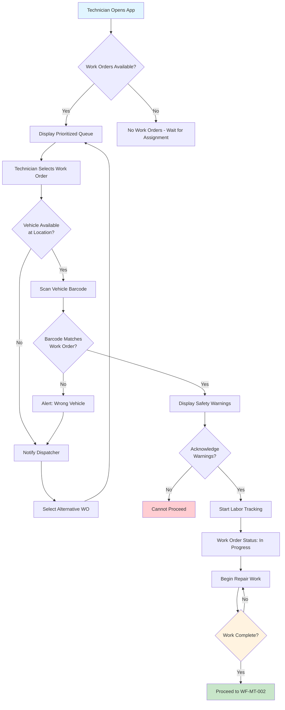

---

### WF-MT-002: Work Order Completion and Documentation

**Workflow ID**: WF-MT-002
**Workflow Name**: Work Order Completion and Documentation
**Trigger**: Technician completes repair work on vehicle
**Primary Actor**: Maintenance Technician
**Secondary Actors**: Parts Manager, Dispatcher
**Priority**: High

#### Process Steps:

1. **Click Complete Work Order** - Technician initiates completion workflow
2. **Enter Work Summary** - Document all work performed with notes
3. **Log Parts Used** - Scan and add all parts consumed in repair
4. **Record Diagnostics** - Document any fault codes found and resolution
5. **Capture Photos** - Take minimum 3 photos of repair work
6. **Calculate Costs** - System auto-calculates labor and parts costs
7. **Digital Signature** - Technician signs work order for completion
8. **Validate All Fields** - System checks all required fields complete
9. **Submit Work Order** - Post completion to system
10. **Sync to System** - Immediate sync or queue if offline

#### Decision Points:

- **Are all required fields complete?** → Yes: Allow submission / No: Highlight missing fields
- **Are photos minimum 3?** → Yes: Continue / No: Request more photos
- **Is digital signature captured?** → Yes: Allow submission / No: Require signature
- **Is parts data valid?** → Yes: Calculate costs / No: Request correction
- **Is internet connectivity available?** → Yes: Immediate sync / No: Queue for later sync

#### System Actions:

- Auto-calculate labor cost from time tracking
- Auto-calculate parts costs from parts database
- Validate required fields (summary, parts, photos, signature)
- Update inventory for parts used
- Create vehicle maintenance history entry
- Send completion notification to dispatcher
- Mark vehicle as "Ready for Service"
- Generate work order completion report

#### Notifications:

- In-app confirmation: Work order successfully submitted
- Dispatcher notification: Work order completion
- Customer notification: Vehicle ready for pickup
- System notification: Parts inventory updated
- Archive notification: Completion data archived

#### Mermaid Diagram:

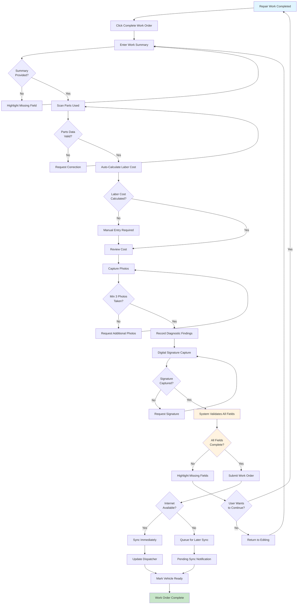

---

### WF-MT-003: Emergency Breakdown Response

**Workflow ID**: WF-MT-003
**Workflow Name**: Emergency Breakdown Response
**Trigger**: Driver initiates emergency breakdown alert or dispatcher assigns critical repair
**Primary Actor**: Maintenance Technician
**Secondary Actors**: Dispatcher, Driver
**Priority**: Critical

#### Process Steps:

1. **Receive Emergency Alert** - Push notification with audible alert and vehicle location
2. **Accept Assignment** - Technician acknowledges emergency response
3. **Navigate to Location** - Use in-app navigation to reach breakdown location
4. **Update Dispatcher** - Contact dispatcher with ETA
5. **Assess Vehicle Condition** - Evaluate vehicle and determine repair options
6. **Connect Diagnostics** - If needed, connect OBD-II adapter for fault codes
7. **Determine Solution** - Choose temporary fix, permanent repair, or tow
8. **Execute Repair** - Perform field repair if feasible
9. **Document Findings** - Record diagnostic data, photos, and actions taken
10. **Update Vehicle Status** - Mark as "Cleared for Duty" or "Out of Service"
11. **Complete Emergency Work Order** - Submit documentation

#### Decision Points:

- **Can vehicle be repaired roadside?** → Yes: Execute field repair / No: Arrange towing
- **Is temporary fix sufficient?** → Yes: Apply temporary fix and limp back / No: Tow required
- **Can vehicle limp back to depot?** → Yes: Escort back / No: Tow required
- **Is driver safe?** → No: Call 911 and prioritize safety / Yes: Proceed with repair

#### System Actions:

- Assign emergency work order with highest priority
- Trigger critical alert to technician mobile device
- Send location coordinates and navigation directions
- Track response time from assignment to on-scene arrival
- Monitor communication between technician and dispatcher
- Log all emergency response actions with timestamps
- Update vehicle status in real-time
- Generate emergency response report

#### Notifications:

- CRITICAL push notification with custom alarm sound
- Real-time location updates to dispatcher
- Estimated time updates during response
- Vehicle status change notifications
- Completion notification with response time

#### Mermaid Diagram:

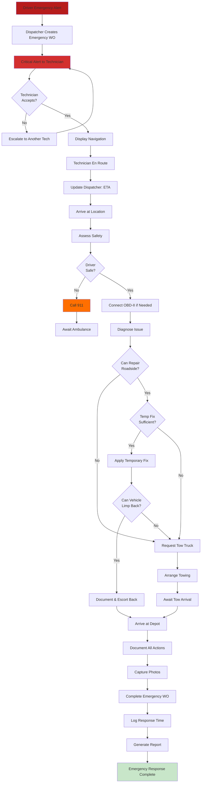

---

## Epic 2: Parts Inventory Management

### WF-MT-004: Parts Search and Reservation

**Workflow ID**: WF-MT-004
**Workflow Name**: Parts Search and Reservation
**Trigger**: Technician needs parts for work order
**Primary Actor**: Maintenance Technician
**Secondary Actors**: Parts Manager
**Priority**: High

#### Process Steps:

1. **Open Parts Search** - Access parts catalog from work order
2. **Search by Method** - Search by part number, description, or vehicle model
3. **Scan Part Barcode** - Option to scan barcode for instant lookup
4. **View Inventory** - System displays availability at current and other locations
5. **Check Pricing** - Review part cost and work order budget impact
6. **Review Alternatives** - If primary part unavailable, see compatible alternatives
7. **Reserve Part** - Reserve for specific work order with 2-hour window
8. **Get Location** - System provides bin/shelf location in warehouse
9. **Retrieve Part** - Walk to location and pick up reserved part
10. **Confirm Receipt** - Scan barcode when picking up to confirm issue from inventory

#### Decision Points:

- **Is part in stock at current location?** → Yes: Reserve immediately / No: Check alternatives
- **Is alternative part acceptable?** → Yes: Use alternative / No: Check other locations
- **Part available at other location?** → Yes: Request transfer / No: Emergency order
- **Is reservation window sufficient?** → Yes: Proceed to pickup / No: Extend or re-reserve

#### System Actions:

- Search parts database by multiple criteria
- Display real-time inventory levels at all locations
- Calculate part costs and work order impact
- Reserve part with 2-hour auto-release timer
- Suggest alternative/compatible parts
- Provide warehouse location coordinates
- Create parts transfer order if needed
- Update work order with part information

#### Notifications:

- Part found confirmation
- Inventory level alerts
- Reservation window notification
- Location updated: Part ready for pickup
- Reservation expiration warning: 30 minutes remaining
- Reservation auto-released: Part returned to available inventory

#### Mermaid Diagram:

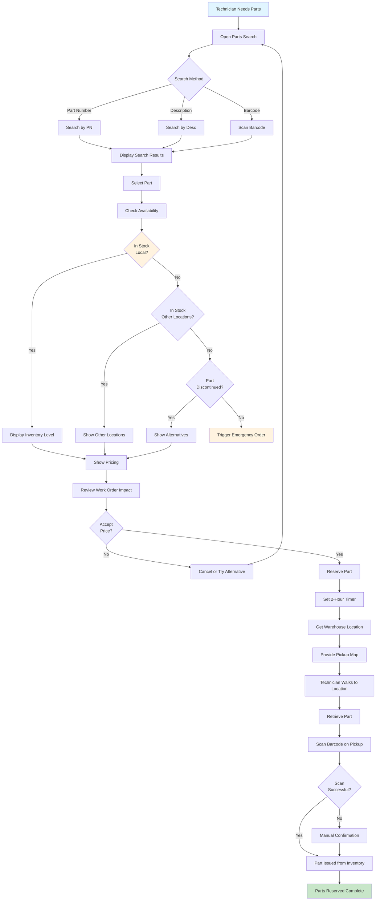

---

### WF-MT-005: Parts Issue and Return

**Workflow ID**: WF-MT-005
**Workflow Name**: Parts Issue and Return
**Trigger**: Technician has retrieved part from inventory or using unused part
**Primary Actor**: Maintenance Technician
**Secondary Actors**: Parts Manager
**Priority**: High

#### Process Steps:

1. **Part Installation or Consumption** - Technician uses part in repair
2. **Return to Parts Area** (if applicable) - Return any unused quantity
3. **Scan Part Barcode** - Confirm part being issued or returned
4. **Select Quantity** - Specify number of units issued or returned
5. **Associate with Work Order** - Link transaction to specific work order
6. **Confirm Transaction** - System asks for confirmation
7. **Update Inventory** - System adjusts inventory levels in real-time
8. **Log Transaction** - Record issue/return with timestamp and technician
9. **Calculate Costs** - For issues: add cost to work order
10. **Archive Record** - Transaction recorded for audit trail

#### Decision Points:

- **Is part being issued or returned?** → Issued: Reduce inventory / Returned: Increase inventory
- **Is part defective/warranty return?** → Yes: Flag for warranty / No: Standard return
- **Is part a core (rebuildable)?** → Yes: Track core deposit / No: Standard return
- **Is transaction valid?** → Yes: Process / No: Request correction

#### System Actions:

- Update inventory counts in real-time
- Create parts transaction record (issue, return, core, warranty)
- Calculate part costs and apply to work order
- Track parts usage by technician and work order
- Flag defective parts for manufacturer return
- Track core deposits and retrieval
- Generate parts transaction report
- Alert if inventory drops below threshold

#### Notifications:

- Confirmation: Part issued to work order
- Confirmation: Part returned to inventory
- Alert: Low inventory threshold reached
- Alert: Core deposit due - reminder notification
- Warranty return flagged: Part held for manufacturer return
- Inventory discrepancy alert: Physical vs. system count mismatch

#### Mermaid Diagram:

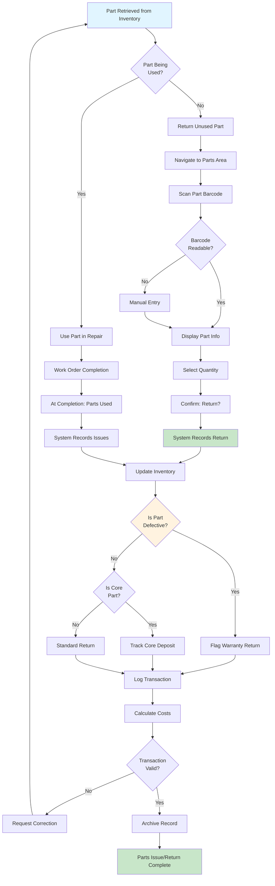

---

### WF-MT-006: Emergency Parts Ordering

**Workflow ID**: WF-MT-006
**Workflow Name**: Emergency Parts Ordering
**Trigger**: Required part not available in inventory, work order is time-sensitive
**Primary Actor**: Maintenance Technician
**Secondary Actors**: Parts Manager, Vendor
**Priority**: Medium

#### Process Steps:

1. **Identify Missing Part** - Part not available in inventory search
2. **Initiate Emergency Order** - Click "Request Emergency Order" on work order
3. **Select Part and Urgency** - Specify part needed and urgency level (same-day, next-day, standard)
4. **Check Vendor Options** - System displays available vendors with delivery times and costs
5. **Select Vendor** - Choose vendor based on cost and delivery time
6. **Add Justification** - Provide business reason for rush order
7. **Route for Approval** - Submit to Parts Manager for cost approval
8. **Manager Review** - Parts Manager approves or denies based on justification and cost
9. **Place Order** - System automatically places order with approved vendor
10. **Track Shipment** - Monitor delivery status and ETA
11. **Receive Notification** - Alert when part arrives and is ready for pickup
12. **Complete Work Order** - Technician installs arrived part and completes work

#### Decision Points:

- **Is part critical for vehicle operation?** → Yes: Approve rush order / No: Standard delivery
- **Does rush cost exceed budget threshold?** → Yes: Require approval / No: Auto-approve
- **Is vendor available?** → Yes: Place order / No: Try alternate vendor
- **Did parts arrive as expected?** → Yes: Proceed to installation / No: Handle damage/return

#### System Actions:

- Search multiple vendor catalogs for availability
- Retrieve real-time pricing and delivery estimates
- Create emergency parts request with urgency flag
- Route to Parts Manager approval queue
- Auto-place purchase order upon approval
- Send order confirmation to vendor
- Track shipment status and updates
- Generate receiving notification
- Create follow-up work order for installation if needed
- Calculate cost impact on work order and customer bill

#### Notifications:

- Emergency order request created
- Awaiting Parts Manager approval notification
- Order approved - shipment in progress
- Delivery ETA update
- Part arrived - ready for pickup notification
- Backorder alert if part not available from vendor
- Delivery delay alert if shipment delayed

#### Mermaid Diagram:

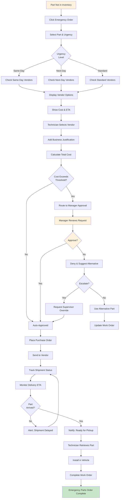

---

## Epic 3: Preventive Maintenance

### WF-MT-007: PM Checklist Execution

**Workflow ID**: WF-MT-007
**Workflow Name**: PM Checklist Execution
**Trigger**: Scheduled PM work order assigned or PM interval reached
**Primary Actor**: Maintenance Technician
**Secondary Actors**: Fleet Manager
**Priority**: High

#### Process Steps:

1. **Receive PM Work Order** - Get assigned PM service (A, B, C service) based on mileage/time
2. **Scan Vehicle** - Confirm correct vehicle with barcode scan
3. **Load Digital Checklist** - System loads vehicle-specific PM checklist
4. **Review Safety Warnings** - Read and acknowledge critical safety warnings
5. **Organize by System** - Checklist organized by vehicle system (engine, brakes, transmission, etc.)
6. **Execute Each Task** - Follow detailed instructions for each PM task
7. **Record Measurements** - Document test readings and compare to specifications
8. **Capture Photos** - Take photos of critical inspection points
9. **Flag Issues Found** - Mark any defects or out-of-spec items found
10. **Validate Measurements** - System alerts if readings out of specification
11. **Mark Tasks Complete** - Check off each task after completion
12. **Create Follow-up WO** - If issues found, create follow-up work orders
13. **Digital Signature** - Sign PM completion for vehicle roadworthiness
14. **Generate Report** - System creates comprehensive PM report with all documentation
15. **Schedule Next PM** - System calculates and schedules next PM due date/mileage

#### Decision Points:

- **Is task applicable to this vehicle?** → Yes: Execute / No: Mark N/A
- **Are measurements within specification?** → Yes: Pass / No: Flag for corrective action
- **Is critical safety issue found?** → Yes: Mark vehicle out of service / No: Continue
- **Are all required fields complete?** → Yes: Allow signature / No: Highlight missing
- **Can vehicle be returned to service?** → Yes: Complete PM / No: Create urgent work order

#### System Actions:

- Load vehicle-specific PM checklist template
- Display detailed task instructions and specifications
- Validate measurements against acceptable ranges
- Capture and store photos with task linkage
- Auto-calculate next PM due date
- Create follow-up work orders for issues found
- Generate PM completion report with all documentation
- Update vehicle maintenance history
- Schedule next PM in calendar
- Alert if critical safety issues discovered

#### Notifications:

- PM work order assigned
- Task-level instructions displayed
- Out-of-spec measurement alert
- Critical safety issue alert
- PM completion confirmation
- Next PM due date reminder
- Follow-up work order created notification

#### Mermaid Diagram:

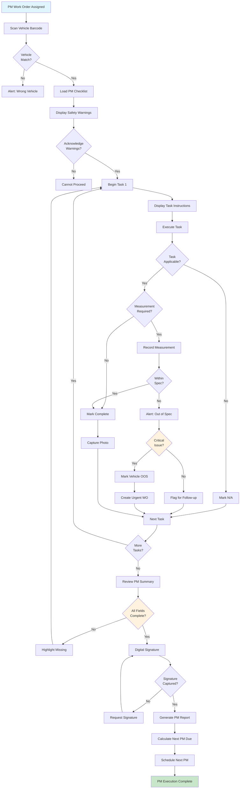

---

### WF-MT-008: Fluid Analysis Sample Collection

**Workflow ID**: WF-MT-008
**Workflow Name**: Fluid Analysis Sample Collection
**Trigger**: PM checklist indicates fluid sampling required
**Primary Actor**: Maintenance Technician
**Secondary Actors**: Fluid Analysis Lab
**Priority**: Medium

#### Process Steps:

1. **PM Checklist Indicates Sampling** - System prompts for fluid sample collection during PM
2. **Retrieve Sample Kit** - Get labeled sample bottles and containers from kit
3. **Scan Sample Bottle** - Scan barcode on sample bottle to link to vehicle/service
4. **Collect Fluid Sample** - Draw sample from appropriate location (engine, transmission, differential)
5. **Record Observations** - Document color, odor, contamination, and condition
6. **Generate Label** - System creates label with vehicle ID, fluid type, mileage, date
7. **Affix Label** - Attach label to sample container
8. **Package Sample** - Place sealed sample in shipping envelope or container
9. **Create Tracking Record** - System generates tracking number and expected delivery date
10. **Add to Shipment** - Place in outbound shipping bin for lab delivery
11. **Track Shipment** - Monitor sample in transit to lab
12. **Lab Receipt** - Lab confirms receipt of sample
13. **Lab Processing** - Lab analyzes sample (typically 5-7 day turnaround)
14. **Receive Results** - System receives lab analysis report
15. **Review Results** - Check for abnormalities in fluid condition
16. **Alert on Abnormalities** - If out-of-spec: Create automatic work order
17. **Archive Results** - File results in vehicle maintenance history

#### Decision Points:

- **Is sample needed for this PM interval?** → Yes: Collect sample / No: Skip to next task
- **Is sample properly collected?** → Yes: Process / No: Discard and recollect
- **Are lab results normal?** → Yes: Archive / No: Create investigation work order
- **Is abnormality critical?** → Yes: Urgent work order / No: Scheduled work order

#### System Actions:

- Generate sample collection requirements for vehicle type
- Create barcode label linking sample to vehicle and mileage
- Track sample shipment to lab
- Receive lab results electronically
- Analyze results against normal ranges
- Alert on abnormal findings (wear metals, viscosity, water content, etc.)
- Auto-create work order for investigation if needed
- Store results in vehicle maintenance history
- Calculate trend analysis if previous samples exist
- Schedule next fluid analysis interval

#### Notifications:

- Sample collection prompt during PM
- Sample shipped to lab notification
- Lab received sample confirmation
- Lab results available notification
- Abnormal result alert requiring investigation
- Next sample due reminder

#### Mermaid Diagram:

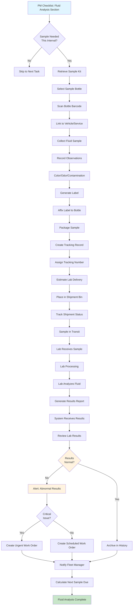

---

## Epic 4: Diagnostic and Analysis

### WF-MT-009: OBD-II Diagnostic Code Reading

**Workflow ID**: WF-MT-009
**Workflow Name**: OBD-II Diagnostic Code Reading and Analysis
**Trigger**: Vehicle has check engine light, diagnostic work order assigned, or suspected fault
**Primary Actor**: Maintenance Technician
**Secondary Actors**: Fleet Manager
**Priority**: High

#### Process Steps:

1. **Identify Need for Diagnostics** - Vehicle has fault symptoms or check engine light
2. **Retrieve OBD Adapter** - Get Bluetooth OBD-II adapter from tool kit
3. **Connect to Vehicle** - Insert adapter into vehicle OBD-II port (under dashboard)
4. **Establish Bluetooth** - Initialize Bluetooth connection to mobile app
5. **Scan for Codes** - Initiate scan for active and pending diagnostic trouble codes
6. **Display DTC Results** - System shows all codes with descriptions and severity
7. **Review Freeze Frame Data** - View vehicle state at time of fault occurrence
8. **View Live Data Stream** - Monitor real-time sensor data for diagnostics
9. **Consult Flowchart** - System displays repair procedure flowchart for each code
10. **Perform Measurements** - Execute measurement steps in diagnostic flowchart
11. **Diagnose Root Cause** - Determine actual failure source based on data
12. **Execute Repair** - Perform repair or component replacement based on diagnosis
13. **Clear Codes** - Use OBD adapter to clear fault codes after repair
14. **Test Drive** - Perform 5+ mile test drive at varying speeds
15. **Re-scan Vehicle** - Rescan for codes after test drive to verify fix
16. **Document Findings** - Record diagnostic report with root cause and resolution
17. **Attach to Work Order** - Link diagnostic report to work order

#### Decision Points:

- **Are fault codes present?** → Yes: Analyze codes / No: Check for intermittent faults
- **Is code interpretation clear?** → Yes: Proceed to diagnosis / No: Escalate for advanced diagnostics
- **Can technician repair?** → Yes: Execute repair / No: Escalate to specialist
- **Did repair resolve code?** → Yes: Complete work order / No: Investigate further
- **Is code recurrence problem?** → Yes: Escalate / No: Complete repair

#### System Actions:

- Scan vehicle OBD-II module for active and pending codes
- Retrieve DTC definitions and severity levels
- Display freeze frame data (vehicle state at fault)
- Stream live sensor data for comparison to specifications
- Provide repair flowcharts and troubleshooting steps
- Link relevant Technical Service Bulletins (TSBs)
- Track diagnostic time and findings
- Record pre-repair and post-repair scan data
- Flag recurring codes or patterns
- Generate diagnostic report with findings and resolution

#### Notifications:

- OBD adapter connected successfully
- Diagnostic codes found alert
- Out-of-specification sensor reading alert
- Critical/emissions code alert
- Test drive completed notification
- Code successfully cleared notification
- Recurring code alert (if code returns)
- Diagnostic report ready notification

#### Mermaid Diagram:

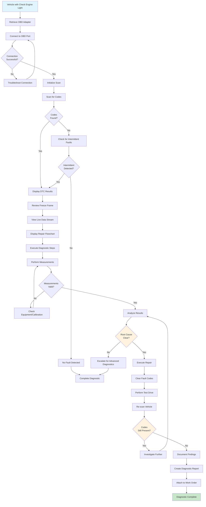

---

### WF-MT-010: Warranty Claim Documentation and Submission

**Workflow ID**: WF-MT-010
**Workflow Name**: Warranty Claim Documentation and Submission
**Trigger**: Component failure during warranty coverage period, repair work identified as warranty-eligible
**Primary Actor**: Maintenance Technician
**Secondary Actors**: Parts Manager, Warranty Administrator
**Priority**: Medium

#### Process Steps:

1. **Identify Warranty-Eligible Failure** - Part fails that may be under manufacturer warranty
2. **Check Warranty Status** - System verifies vehicle warranty coverage and eligibility
3. **Create Warranty Claim** - Initiate warranty claim workflow
4. **Document Failure** - Record component, failure mode, and description
5. **Capture Failed Part** - Photograph failed component showing part number and condition
6. **Review Eligibility** - System checks if failure is within warranty time/mileage limits
7. **Verify Maintenance** - Confirm vehicle maintenance records are current and complete
8. **Gather Evidence** - Collect all supporting documentation (repair invoice, photos, test results)
9. **Assess Repairs Needed** - Determine if original part can be returned or must be destroyed
10. **Calculate Claim Value** - System calculates repair cost eligible for warranty reimbursement
11. **Add Justification** - If borderline coverage, provide business case for approval
12. **Submit to Manufacturer** - Route claim to manufacturer warranty portal
13. **Track Claim Status** - Monitor claim approval/denial process
14. **Receive Decision** - Manufacturer approves, partially approves, or denies claim
15. **Handle Appeal** - If denied, gather additional evidence and appeal
16. **Record Outcome** - Document claim decision and reimbursement amount
17. **Update Work Order** - Adjust customer billing based on warranty coverage

#### Decision Points:

- **Is failure within warranty coverage?** → Yes: Proceed with claim / No: Customer responsible
- **Is maintenance history complete?** → Yes: Claim valid / No: May affect eligibility
- **Is claim amount significant?** → Yes: Request approval / No: Auto-submit
- **Was claim denied?** → Yes: Appeal or accept denial / No: Process reimbursement
- **Is core return required?** → Yes: Track core deposit / No: Standard warranty claim

#### System Actions:

- Verify vehicle warranty status and coverage terms
- Check component coverage time and mileage limits
- Verify maintenance records against warranty requirements
- Calculate eligible repair costs
- Generate warranty claim package with required documentation
- Submit claim electronically to manufacturer portal
- Track claim status through approval process
- Notify of approval/denial decision
- Process reimbursement upon approval
- Manage core returns and deposits
- Archive claim documentation for audit trail
- Update vehicle maintenance history

#### Notifications:

- Warranty eligibility check result
- Claim submitted to manufacturer notification
- Claim under review notification
- Claim decision notification (approval/denial)
- Claim approved - reimbursement processing notification
- Claim denied - appeal option notification
- Core return reminder: 30-day deadline approaching
- Reimbursement received notification

#### Mermaid Diagram:

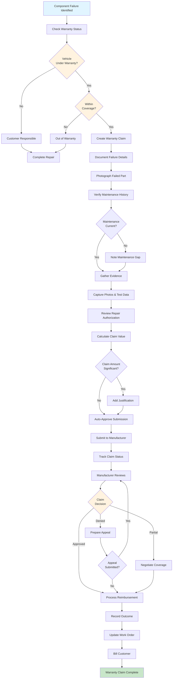

---

### WF-MT-011: Tool Checkout and Tracking

**Workflow ID**: WF-MT-011
**Workflow Name**: Tool Checkout and Tracking
**Trigger**: Technician needs specialized tool for repair work
**Primary Actor**: Maintenance Technician
**Secondary Actors**: Tool Manager
**Priority**: Low

#### Process Steps:

1. **Identify Tool Need** - Determine specialized tool required for work order
2. **Search Tool Inventory** - Query tool database for availability
3. **View Tool Information** - Check tool location, calibration status, availability
4. **Navigate to Tool Location** - Walk to tool storage area
5. **Retrieve Tool** - Locate tool by bin/shelf position
6. **Scan Tool Barcode** - Confirm tool identity and initiate checkout
7. **Link to Work Order** - Associate tool checkout with specific work order
8. **Record Checkout** - System logs technician, time, and tool
9. **Proceed with Work** - Use tool for repair work
10. **Complete Work** - Finish work requiring tool
11. **Return Tool** - Walk tool back to storage area
12. **Scan Return Barcode** - Scan tool to initiate return process
13. **Report Tool Condition** - Note any damage or issues
14. **Confirm Return** - System records return and updates availability
15. **Calculate Usage** - Track tool usage time and frequency

#### Decision Points:

- **Is tool available?** → Yes: Proceed with checkout / No: Wait or use alternative
- **Is tool calibration current?** → Yes: Checkout OK / No: Alert and restrict use
- **Is tool damaged?** → Yes: Flag for repair / No: Return to inventory
- **Was tool returned on time?** → Yes: Archive / No: Generate overdue alert

#### System Actions:

- Search tool database by name, ID, or category
- Display tool location and availability status
- Track calibration schedule and due dates
- Record checkout with technician and work order association
- Generate return reminder after 24 hours
- Track tool usage for maintenance planning
- Alert if tool calibration overdue
- Create work order for tool repair if damaged
- Generate tool utilization reports

#### Notifications:

- Tool available notification
- Tool calibration due soon alert
- Tool checkout confirmed
- Tool overdue return alert (24+ hours)
- Tool return confirmed
- Tool damage reported notification
- Tool utilization report available

#### Mermaid Diagram:

```mermaid
flowchart TD
    A[Work Order Requires Tool] --> B[Search Tool Inventory]
    B --> C[Display Tool Options]
    C --> D{Tool<br/>Available?}
    D -->|No| E[Check Alternatives]
    E --> F{Wait or<br/>Use Different?}
    F -->|Wait| G[Set Availability Alert]
    F -->|Use Different| H[Select Alternative]
    D -->|Yes| I[Navigate to Location]
    H --> I
    G --> I
    I --> J[Retrieve Tool]
    J --> K[Scan Tool Barcode]
    K --> L{Scan<br/>Successful?}
    L -->|No| M[Manual Entry]
    L -->|Yes| N[Display Tool Info]
    M --> N
    N --> O{Calibration<br/>Current?}
    O -->|No| P[Alert: Calibration Overdue]
    O -->|Yes| Q[Link to Work Order]
    P --> Q
    Q --> R[Record Checkout]
    R --> S[Return Checkout Time]
    S --> T[Use Tool in Work]
    T --> U{Work<br/>Complete?}
    U -->|No| T
    U -->|Yes| V[Return Tool to Storage]
    V --> W[Scan Return Barcode]
    W --> X{Scan<br/>Successful?}
    X -->|No| Y[Manual Return Entry]
    X -->|Yes| Z[Display Return Form]
    Y --> Z
    Z --> AA[Report Tool Condition]
    AA --> AB{Tool<br/>Damaged?}
    AB -->|Yes| AC[Flag for Repair]
    AB -->|No| AD[Return to Inventory]
    AC --> AE[Create Tool Repair WO]
    AE --> AF[Record Tool Return]
    AD --> AF
    AF --> AG[Update Availability]
    AG --> AH[Tool Checkout Complete]

    style A fill:#e1f5ff
    style AH fill:#c8e6c9
    style D fill:#fff3e0
    style AB fill:#fff3e0
```

---

### WF-MT-012: Safety Equipment Inspection

**Workflow ID**: WF-MT-012
**Workflow Name**: Safety Equipment Inspection and Compliance
**Trigger**: Daily, weekly, or monthly safety inspection schedule triggered
**Primary Actor**: Maintenance Technician
**Secondary Actors**: Safety Officer
**Priority**: Medium

#### Process Steps:

1. **Receive Inspection Reminder** - System prompts for safety inspection at scheduled interval
2. **Open Inspection Checklist** - Access digital safety equipment inspection form
3. **Begin Daily Inspection** - Start with daily inspection items (hydraulic lifts, air pressure, emergency equipment)
4. **Inspect Each Item** - Visually and functionally test each piece of equipment
5. **Record Results** - Mark each item as Pass or Fail with observations
6. **Capture Photos** - Take photos of equipment status or any issues found
7. **Flag Failed Items** - If item fails, note corrective action required
8. **Create Work Orders** - For failed equipment, create urgent repair work order
9. **Mark Equipment OOS** - Tag failed equipment "Out of Service - Do Not Use"
10. **Document Readings** - For gauges/instruments, record actual readings
11. **Compare to Specs** - System validates readings against required ranges
12. **Escalate Critical Failures** - If critical equipment fails, alert safety officer immediately
13. **Continue Remaining Items** - Proceed with other inspections
14. **Complete All Sections** - Finish all applicable inspection categories
15. **Digital Signature** - Sign inspection for compliance documentation
16. **Submit Report** - Post inspection report and results
17. **Archive Records** - Store for OSHA audit compliance

#### Decision Points:

- **Is inspection due?** → Yes: Proceed / No: Skip
- **Does equipment pass?** → Yes: Proceed to next item / No: Flag for repair
- **Is failure critical?** → Yes: Alert safety officer immediately / No: Schedule repair
- **Are all items inspected?** → Yes: Allow completion / No: Request completion
- **Is signature captured?** → Yes: Archive / No: Request signature

#### System Actions:

- Generate inspection checklist for daily/weekly/monthly schedule
- Create task list for equipment to be inspected
- Record pass/fail status for each item
- Capture photos linked to checklist items
- Validate gauge readings against specification ranges
- Auto-create urgent work order for failed equipment
- Flag equipment as "Out of Service" in inventory
- Alert safety officer for critical failures (within 15 minutes)
- Generate inspection report with all findings
- Archive inspection record for compliance
- Calculate next inspection due date
- Defer inspection only with supervisor approval

#### Notifications:

- Daily safety inspection due reminder (7:30 AM)
- Equipment passed inspection notification
- Equipment failed - work order created notification
- Critical equipment failure alert (escalated to Safety Officer)
- Inspection completed and archived notification
- Failed equipment marked out of service notification
- Next inspection due reminder

#### Mermaid Diagram:

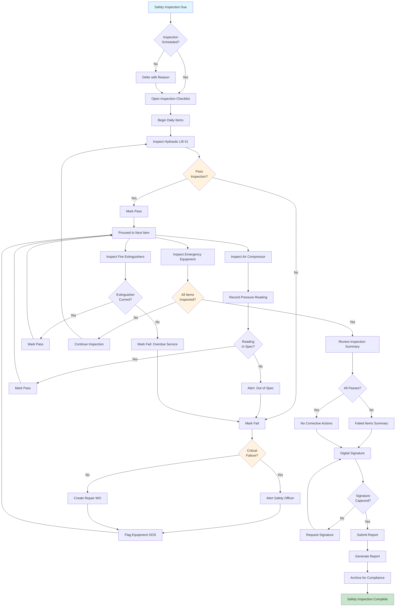

---

## Summary of Workflows

### Workflow Statistics:

**Total Workflows**: 12
- **Work Order Processing**: 3 workflows (WF-MT-001 to WF-MT-003)
- **Parts Inventory Management**: 3 workflows (WF-MT-004 to WF-MT-006)
- **Preventive Maintenance**: 2 workflows (WF-MT-007 to WF-MT-008)
- **Diagnostic and Analysis**: 4 workflows (WF-MT-009 to WF-MT-012)

### Key Workflow Characteristics:

**Primary Flows**: All workflows follow a sequential process with clear decision points
**Mobile-First**: All workflows optimized for mobile device execution with offline capability
**Documentation**: Every workflow includes mandatory photo capture or digital signatures
**Tracking**: Complete audit trail for all actions with timestamp and user attribution
**Notifications**: Multi-channel alerts for time-sensitive items (critical, due dates, completions)
**Error Handling**: Fallback options for system failures (offline mode, manual entry, escalation)

### Integration Points:

- **OBD-II Adapters**: Bluetooth connectivity (WF-MT-009)
- **Parts Inventory System**: Real-time stock levels (WF-MT-004, WF-MT-005, WF-MT-006)
- **Barcode Scanning**: Vehicles, parts, tools, samples (all workflows)
- **Digital Signatures**: Work order completion, PM sign-off (WF-MT-002, WF-MT-007, WF-MT-012)
- **Photo Capture**: Documentation and evidence (WF-MT-002, WF-MT-007, WF-MT-008, WF-MT-012)
- **Lab Integration**: Fluid analysis sample tracking (WF-MT-008)
- **Manufacturer Warranty Portals**: Claim submission (WF-MT-010)
- **Vendor Systems**: Emergency parts ordering (WF-MT-006)

### Performance Requirements:

- Work order queue load: <2 seconds
- Parts search: <1 second with barcode scan
- PM checklist rendering: <3 seconds
- OBD-II code reading: <5 seconds
- Photo upload: <5 seconds per photo (on 4G)
- Offline sync: <10 seconds on reconnection
- Signature capture: <2 seconds

### Mobile Optimization:

- Large touch targets (44x44px minimum for gloved operation)
- High contrast for outdoor readability
- Voice input option for hands-free note-taking
- Single-hand navigation where possible
- Gesture shortcuts for common tasks (swipe, tap, long-press)
- Minimal typing required (barcode, dropdowns, pre-filled values)

---

## Related Documents

- **User Stories**: `user-stories/03_MAINTENANCE_TECHNICIAN_USER_STORIES.md`
- **Use Cases**: `use-cases/03_MAINTENANCE_TECHNICIAN_USE_CASES.md`
- **Test Cases**: `test-cases/03_MAINTENANCE_TECHNICIAN_TEST_CASES.md` (to be created)
- **API Specifications**: `api/maintenance-endpoints.md` (to be created)
- **Mobile App Specifications**: `technical/MOBILE_APP_SPECIFICATIONS.md` (to be created)

---

## Revision History

| Version | Date | Author | Changes |
|---------|------|--------|---------|
| 1.0 | 2025-11-10 | Requirements Team | Initial maintenance technician workflows created with 12 Mermaid diagrams |

---

*This document provides detailed workflow diagrams and processes supporting the Maintenance Technician user stories and use cases.*
