# Dispatcher Workflows

**Role**: Dispatcher
**Access Level**: Operational (Live operations focus)
**Primary Interface**: Web Dashboard + Mobile App (50/50 split)
**Version**: 1.0
**Date**: November 10, 2025

---

## Table of Contents

1. [Route Assignment Workflows](#epic-1-route-assignment-workflows)
2. [Emergency Response Workflows](#epic-2-emergency-response-workflows)
3. [Real-Time Tracking Workflows](#epic-3-real-time-tracking-workflows)
4. [Load Planning Workflows](#epic-4-load-planning-workflows)
5. [Performance Monitoring Workflows](#epic-5-performance-monitoring-workflows)

---

## Epic 1: Route Assignment Workflows

### WF-DS-001: Basic Route Assignment

**Workflow ID**: WF-DS-001
**Name**: Basic Route Assignment
**Priority**: High
**Actor**: Dispatcher
**Related Use Cases**: UC-DI-004

#### Trigger:
- New delivery order received
- Dispatcher begins morning route planning
- Driver becomes available for new assignment

#### Workflow:

```mermaid
graph TD
    A["📋 Pending Job Arrives<br/>(Job created in system)"] -->|Job data received| B["🔍 Analyze Job Requirements<br/>(Pickup location, destination,<br/>time window, cargo type)"]

    B -->|Requirements defined| C{"✅ Auto-recommend<br/>compatible drivers<br/>(location, HOS, capacity)"}

    C -->|Recommendations generated| D["📊 Display Candidate List<br/>(2-5 drivers with metrics)"]

    D -->|Dispatcher reviews| E{"👨‍💼 Manual Selection<br/>or System Recommendation?"}

    E -->|System recommended driver| F["✓ Dispatcher Approves"]
    E -->|Alternative driver selected| G["⚠️ Justify Manual Override"]

    F --> H["📤 Send Assignment to Driver"]
    G --> H

    H -->|Push notification to<br/>driver mobile app| I{"⏱️ Driver Response<br/>(10 min timeout)"}

    I -->|Driver accepts| J["✅ Assignment Confirmed<br/>(Route status: Active)"]
    I -->|Driver rejects| K["❌ Rejection Logged<br/>(Reason captured)"]
    I -->|No response| L["⏰ Auto-timeout<br/>(Unassigned, reassign)"]

    K -->|Find next candidate| D
    L -->|Find next candidate| D

    J --> M["📍 Route tracking begins<br/>(Real-time monitoring)"]

    style A fill:#e1f5ff
    style J fill:#c8e6c9
    style K fill:#ffccbc
    style M fill:#f3e5f5
```

#### Workflow Steps:

1. **Job Receipt**: New delivery order created with requirements
2. **Analysis**: System analyzes requirements (origin, destination, time window, cargo)
3. **Recommendation**: System recommends best-matched drivers (location, HOS, capacity)
4. **Display**: Dispatcher reviews candidate list with metrics
5. **Selection**: Dispatcher approves system recommendation or selects alternative
6. **Assignment**: System sends assignment to driver's mobile app
7. **Confirmation**: Driver accepts or rejects assignment (10-minute timeout)
8. **Tracking**: Route enters active status with real-time monitoring

#### Decision Points:

| Decision | Options | Result |
|----------|---------|--------|
| Auto vs Manual | System recommendation / Manual selection | Route assigned to selected driver |
| Driver Response | Accept / Reject / Timeout | Continue to next candidate if not accepted |
| HOS Sufficient | Yes / No | Proceed / Block assignment |
| Capacity Adequate | Yes / No | Proceed / Suggest different vehicle |

#### System Actions:

- Validate job requirements against driver qualifications
- Calculate distance and estimated drive time
- Check driver HOS remaining hours
- Verify vehicle capacity specifications
- Send push notification to driver app
- Create route record in database
- Log assignment history for analytics

#### Notifications:

| Type | Recipient | Content | Timing |
|------|-----------|---------|--------|
| Assignment | Driver | New route with pickup/delivery details | Immediate |
| Confirmation | Dispatcher | Driver accepted/rejected assignment | Immediate |
| Timeout Alert | Dispatcher | No response from driver in 10 minutes | +10 min |
| Rejection | Dispatcher | Driver rejected with reason | Immediate |

---

### WF-DS-002: Multi-Stop Route Assignment

**Workflow ID**: WF-DS-002
**Name**: Multi-Stop Route Assignment with Optimization
**Priority**: High
**Actor**: Dispatcher
**Related Use Cases**: UC-DI-004, UC-DI-005

#### Trigger:
- Multiple delivery orders to same geographic area
- Dispatcher bulk-assigns related jobs
- Need to optimize delivery sequence

#### Workflow:

```mermaid
graph TD
    A["📦 Multiple Jobs Selected<br/>(2-5 jobs in same region)"] -->|Jobs grouped| B["🔄 Auto-Optimize<br/>Sequence<br/>(TSP algorithm)"]

    B -->|Route optimized| C["📊 Display Optimization<br/>Summary<br/>(Original vs Optimized)"]

    C -->|Dispatcher reviews| D{"✅ Accept<br/>Optimization?"}

    D -->|Accept optimized| E["✓ Optimized sequence"]
    D -->|Modify manually| F["🖱️ Drag & Drop<br/>Reorder Stops"]
    D -->|Reject & keep original| G["📌 Keep original sequence"]

    F -->|Manual adjustments| H["🔄 Recalculate<br/>Drive time"]
    G -->|Preserved| H
    E -->|Proceed| H

    H -->|New timing calculated| I{"⏳ All Time Windows<br/>Still Achievable?"}

    I -->|Yes, all windows achievable| J["✅ Route valid"]
    I -->|No, windows violated| K["⚠️ Alert: Window violation<br/>on Stop 3"]

    K -->|Dispatcher decision| L{"📞 Contact Customer<br/>or Skip Stop?"}
    L -->|Contact customer| M["📱 Extend time window"]
    L -->|Remove stop| N["🗑️ Unassign problematic stop"]

    M -->|Window extended| J
    N -->|Route adjusted| J

    J -->|Final route ready| O["👨‍💼 Select Driver<br/>(Must accommodate<br/>all stops)"]

    O -->|Driver selected| P["✅ Validate Driver<br/>HOS for multi-stop"]

    P -->|HOS sufficient| Q["📤 Send Multi-Stop<br/>Route to Driver"]
    P -->|HOS insufficient| R["❌ Driver unavailable<br/>Select alternative"]

    R -->|Try next candidate| O
    Q -->|Route assigned| S["🗺️ Route tracking<br/>with stop sequence"]

    style A fill:#e1f5ff
    style B fill:#fff9c4
    style J fill:#c8e6c9
    style S fill:#f3e5f5
```

#### Workflow Steps:

1. **Job Selection**: Dispatcher selects multiple jobs (2-5) for same region
2. **Auto-Optimization**: System applies TSP solver to optimize sequence
3. **Review**: Dispatcher reviews original vs optimized routes (time, distance)
4. **Adjustment**: Dispatcher accepts optimization, modifies manually, or rejects
5. **Validation**: System recalculates drive time and validates delivery windows
6. **Resolution**: If windows violated, contact customer or remove problematic stop
7. **Driver Selection**: Find driver with sufficient HOS for complete route
8. **Assignment**: Send optimized multi-stop route to driver's navigation app
9. **Tracking**: Monitor progress through all stops

#### Decision Points:

| Decision | Options | Result |
|----------|---------|--------|
| Optimization | Accept / Modify / Reject | Route sequence determined |
| Time Windows | All achievable / Some violated | Proceed / Contact customer / Remove stop |
| Driver Selection | Sufficient HOS / Insufficient HOS | Assign / Select alternative driver |
| All Stops Fit | Yes / No | Complete multi-stop route / Split into multiple routes |

#### System Actions:

- Apply Traveling Salesman Problem (TSP) algorithm
- Calculate optimal sequence for shortest drive time
- Validate each delivery time window
- Calculate total drive time including stops
- Identify potential time window violations
- Check driver HOS for total route duration
- Generate optimized turn-by-turn directions
- Send route with all waypoints to driver app

#### Notifications:

| Type | Recipient | Content | Timing |
|------|-----------|---------|--------|
| Optimization Result | Dispatcher | Original vs optimized route comparison | Immediate |
| Time Window Alert | Dispatcher | Window violation warning on specific stop | Immediate |
| Route Assignment | Driver | Multi-stop route with all stops in sequence | Immediate |
| Stop Reminder | Driver | Notification before each stop (30 min warning) | Scheduled |

---

### WF-DS-003: Dynamic Route Reassignment

**Workflow ID**: WF-DS-003
**Name**: Dynamic Route Reassignment (Driver Unavailable)
**Priority**: High
**Actor**: Dispatcher
**Related Use Cases**: UC-DI-004

#### Trigger:
- Driver breakdown or emergency during active route
- Driver requests route reassignment
- Driver becomes unavailable (illness, accident)
- Completion requirement changed (expedited delivery)

#### Workflow:

```mermaid
graph TD
    A["🚨 Reassignment Trigger<br/>(Breakdown, emergency,<br/>or unavailability)"] -->|Event detected| B["🔔 Alert Dispatcher<br/>with route details<br/>(stops remaining)"]

    B -->|Route status: In Progress| C["📊 Analyze Route Status<br/>(Completed: 2/5 stops,<br/>Remaining: 3 stops)"]

    C -->|Current progress assessed| D{"🤔 Reassignment Strategy?"}

    D -->|Move to available driver| E["👨‍💼 Find Compatible<br/>Driver<br/>(Location, HOS, type)"]
    D -->|Split between drivers| F["➗ Split Remaining Stops<br/>(between 2 drivers)"]
    D -->|Customer reroute| G["📞 Contact Customers<br/>Remaining stops"]

    E -->|Candidates identified| H["📋 Display Candidate<br/>List<br/>(sorted by proximity)"]

    H -->|Best match selected| I["✅ Validate New Driver<br/>HOS & Capacity"]

    F -->|Stops split| J["👨‍💼 Assign Stop Groups<br/>to different drivers"]
    J -->|Multiple assignments| I

    G -->|Customer contacted| K["📱 Customer confirms<br/>reschedule/delay"]

    I -->|Valid assignment| L["📤 Send Reassignment<br/>to New Driver<br/>(current location,<br/>remaining stops)"]

    K -->|Rescheduled| L

    L -->|Push notification| M["✅ New Driver Accepts<br/>(Original driver<br/>notified of reassignment)"]

    M -->|Route transferred| N["🔄 Update Customer<br/>ETAs<br/>(new driver info)"]

    N -->|Customers notified| O["📍 New route tracking<br/>begins"]

    O -->|Original driver| P["🏁 Original driver<br/>returns to depot<br/>(incident handled)"]

    style A fill:#ffccbc
    style M fill:#c8e6c9
    style O fill:#f3e5f5
    style P fill:#e0e0e0
```

#### Workflow Steps:

1. **Trigger Detection**: System detects driver unavailability or emergency
2. **Alert**: Dispatcher notified with route status and remaining stops
3. **Status Analysis**: Calculate stops completed and remaining work
4. **Strategy Decision**: Determine reassignment approach (single driver, split, delay)
5. **Driver Selection**: Find compatible driver (location, HOS, vehicle type)
6. **Validation**: Verify new driver can complete remaining route
7. **Notification**: Send reassignment with current context to new driver
8. **Acceptance**: New driver accepts and begins work
9. **Communication**: Update customers with new driver info and ETA
10. **Tracking**: Monitor new driver's progress
11. **Original Driver**: Handle incident and return to depot

#### Decision Points:

| Decision | Options | Result |
|----------|---------|--------|
| Strategy | Single driver / Split stops / Customer delay | Determines reassignment approach |
| Candidate | Best match driver / Multiple options | Driver selected for reassignment |
| HOS Check | Sufficient / Insufficient | Proceed / Select alternative driver |
| Customer Contact | Accept delay / Reschedule / Expedite | Updated delivery expectations |

#### System Actions:

- Detect driver unavailability in real-time
- Identify active route with remaining stops
- Search for compatible drivers matching criteria
- Calculate drive time from new driver location to next stop
- Verify new driver has sufficient HOS
- Create reassignment record with original and new driver info
- Send push notification to new driver with context
- Update customer ETAs automatically
- Log incident timeline for insurance/compliance

#### Notifications:

| Type | Recipient | Content | Timing |
|------|-----------|---------|--------|
| Reassignment Alert | Dispatcher | Route reassignment needed with reason | Immediate |
| Candidate List | Dispatcher | Compatible drivers with ETA to next stop | Immediate |
| Reassignment Notice | New Driver | Remaining stops, current context, original sequence | Immediate |
| Customer Update | Customer | New driver info, revised ETA, contact info | Within 5 min |
| Incident Log | Safety Officer | Reassignment reason and timeline | Immediate |

---

## Epic 2: Emergency Response Workflows

### WF-DS-004: Emergency Response Protocol

**Workflow ID**: WF-DS-004
**Name**: Emergency Response Protocol (Panic Button Activation)
**Priority**: Critical
**Actor**: Dispatcher, Safety Officer
**Related Use Cases**: UC-DI-009

#### Trigger:
- Driver activates emergency/panic button
- Severe vehicle fault detected (airbag deployment)
- Third-party reports incident involving fleet vehicle
- Driver calls 911 from vehicle

#### Workflow:

```mermaid
graph TD
    A["🚨 EMERGENCY ALERT<br/>(Panic button OR<br/>Severe fault detected)"] -->|Critical priority| B["🔔 CRITICAL AUDIO ALARM<br/>at dispatcher workstation<br/>(Continuous siren)"]

    B -->|Auto-popup| C["🎯 Emergency Details<br/>Display<br/>(Vehicle, driver, location,<br/>GPS coordinates)"]

    C -->|15 sec timeout| D{"👨‍💼 Dispatcher<br/>Acknowledge?"}

    D -->|Acknowledged| E["✅ Alarm Stops<br/>(Emergency panel<br/>active)"]
    D -->|Not acknowledged| F["⏰ Auto-Escalation<br/>(Supervisor notified,<br/>+2 min)"]

    F -->|Escalated| E

    E -->|Driver contact attempt| G["📞 Hands-Free Call<br/>to Driver<br/>(attempt 2x)"]

    G -->|Driver answers| H["🗣️ Driver Status Assessment<br/>(injuries, vehicle condition,<br/>safety, other parties)"]

    G -->|Driver doesn't answer| I["❗ Assume worst-case<br/>scenario"]

    H -->|Assessment gathered| J{"🏥 Injuries<br/>Reported?"}
    I -->|No response| J

    J -->|Yes, injuries| K["🚑 Call 911<br/>(Ambulance dispatch)"]
    J -->|No injuries| L{"🚗 Vehicle blocking<br/>traffic?"}

    L -->|Yes, blocking| M["🚨 Call 911 for<br/>police/traffic control"]
    L -->|No, clear| N["📞 Call Roadside<br/>Assistance<br/>(towing)"]

    K -->|Ambulance dispatched| O["✅ Safety Officer<br/>Notified"]
    M -->|Police dispatched| O
    N -->|Tow arranged| O

    O -->|All agencies notified| P["📋 Create Incident Record<br/>(Incident ID, timeline,<br/>actions taken)"]

    P -->|Incident documented| Q["👥 Notify Emergency<br/>Contacts<br/>(family, supervisor,<br/>safety director)"]

    Q -->|Contacts notified| R["📍 Real-time Monitoring<br/>(Track responder arrival,<br/>driver status)"]

    R -->|Incident resolving| S["📝 Document Resolution<br/>(First responder arrival,<br/>driver transport,<br/>vehicle status)"]

    S -->|Complete incident| T["🏁 Mark Incident Resolved<br/>(Route reassigned,<br/>follow-up scheduled)"]

    style A fill:#ff5252
    style B fill:#ff5252
    style E fill:#c8e6c9
    style K fill:#ff7043
    style T fill:#e0e0e0
```

#### Workflow Steps:

1. **Alert Trigger**: Emergency signal received from vehicle or manual driver call
2. **Alarm**: System triggers critical audio alarm at dispatcher workstation
3. **Display**: Emergency details auto-popup with vehicle info and GPS location
4. **Acknowledgment**: Dispatcher must acknowledge within 15 seconds or auto-escalate
5. **Driver Contact**: Dispatcher attempts hands-free call to driver (2 attempts)
6. **Status Assessment**: Gather driver status, injuries, vehicle condition
7. **Emergency Services**: Determine which services needed (ambulance, police, tow)
8. **Dispatch**: Call 911 for injuries/traffic hazard, arrange roadside assistance
9. **Notifications**: Alert safety officer and emergency contacts
10. **Documentation**: Create incident record with complete timeline
11. **Monitoring**: Track responder arrival and driver status in real-time
12. **Resolution**: Document all actions and mark incident closed
13. **Follow-up**: Schedule incident investigation and route reassignment

#### Decision Points:

| Decision | Options | Result |
|----------|---------|--------|
| Acknowledgment | Acknowledged / Auto-escalate | Alarm stops / Supervisor notified |
| Driver Response | Answers / No answer | Direct assessment / Worst-case assumption |
| Injuries | Yes / No | Call ambulance 911 / Proceed |
| Traffic Blocked | Yes / No | Call police 911 / Call roadside assistance |
| Hazmat Involved | Yes / No | Notify HAZMAT team / Standard response |

#### System Actions:

- Trigger critical audio alarm (continuous until acknowledged)
- Display emergency panel with vehicle/driver/location data
- Create incident record automatically
- Map nearest emergency services (hospitals, police, fire)
- Alert supervisor if not acknowledged in 2 minutes
- Auto-notify emergency contacts
- Log all timestamps and actions
- Track responder arrival times
- Coordinate resource dispatch (tow, ambulance, police)
- Generate incident timeline report

#### Notifications:

| Type | Recipient | Content | Timing |
|------|-----------|---------|--------|
| Emergency Alert | Dispatcher | Critical alert with audio and popup | Immediate |
| Auto-Escalation | Supervisor | Dispatcher did not acknowledge emergency | +2 min |
| 911 Call | Emergency Services | Vehicle accident/emergency with GPS | Immediate |
| Family Contact | Driver Family | Emergency notification | Immediate |
| Safety Officer | Safety Officer | Incident details and response coordination | Immediate |
| Customer | Customer | Delivery delay due to emergency | Within 15 min |

---

### WF-DS-005: Breakdown and Tow Coordination

**Workflow ID**: WF-DS-005
**Name**: Vehicle Breakdown and Tow Coordination
**Priority**: High
**Actor**: Dispatcher, Maintenance
**Related Use Cases**: UC-DI-010

#### Trigger:
- Driver reports mechanical issue or breakdown
- Vehicle diagnostic system triggers fault alert
- Vehicle becomes disabled and cannot continue operation

#### Workflow:

```mermaid
graph TD
    A["⚙️ Breakdown Reported<br/>(Driver message or<br/>system fault alert)"] -->|Incident logged| B["🔍 Gather Details<br/>(Vehicle fault codes,<br/>location, drivable?)"]

    B -->|Details collected| C{"🚗 Vehicle<br/>Drivable to<br/>Safe Location?"}

    C -->|Yes, drivable| D["🛣️ Instruct Driver<br/>Move to safe area<br/>(shoulder, lot)"]
    C -->|No, immobile| E["🚑 Assess hazard<br/>(Traffic safety,<br/>fuel leak, HAZMAT?)"]

    D -->|Vehicle safe| F["🔧 Diagnose Issue<br/>(From fault codes<br/>and symptoms)"]
    E -->|Hazard assessed| F

    F -->|Diagnosis determined| G{"🔧 Repair<br/>Complexity?"}

    G -->|Simple roadside repair| H["🔨 Dispatch Mobile<br/>Mechanic<br/>(tire change, battery)"]
    G -->|Complex/towing needed| I["🚛 Request Flatbed<br/>Tow Truck<br/>(fuel leak = flatbed)"]

    H -->|Mobile service dispatched| J["⏱️ Monitor ETA<br/>to breakdown location"]
    I -->|Tow truck dispatched| K["🏢 Search Repair<br/>Facilities<br/>(nearest authorized)"]

    K -->|Facility selected| L["📍 Set Tow<br/>Destination<br/>(repair shop)"]

    L -->|Destination set| J

    J -->|Service arrives| M{"📦 High-Value or<br/>Hazmat Cargo?"}

    M -->|Yes, special cargo| N["🚕 Arrange Cargo<br/>Transfer<br/>(replacement vehicle<br/>or courier)"]
    M -->|No, standard cargo| O["✅ Complete Service<br/>or Begin Tow"]

    N -->|Cargo secure| P["🏁 Original vehicle<br/>departs for repair"]
    O -->|Vehicle handled| P

    P -->|Vehicle in repair| Q["👨‍💼 Reassign Driver<br/>Route<br/>(to different vehicle)"]

    Q -->|Route reassigned| R["📞 Update Customer<br/>ETAs<br/>(new driver info,<br/>revised timeline)"]

    R -->|Customers notified| S["🔧 Monitor Repair<br/>Progress<br/>(Parts, labor,<br/>ETA return)"]

    S -->|Repair completed| T["🚗 Return Vehicle<br/>to Depot<br/>(or pick up driver)"]

    T -->|Vehicle returned| U["📊 Log Breakdown<br/>(Costs, downtime,<br/>issue type)"]

    U -->|Documentation complete| V["🏁 Incident closed<br/>(for trend analysis)"]

    style A fill:#fff3e0
    style H fill:#b3e5fc
    style I fill:#b3e5fc
    style P fill:#c8e6c9
    style V fill:#e0e0e0
```

#### Workflow Steps:

1. **Breakdown Report**: Driver reports issue via mobile app or voice
2. **Details Collection**: Gather fault codes, location, and vehicle condition
3. **Safety Assessment**: Determine if vehicle is drivable to safe location
4. **Relocation**: If drivable, instruct driver to move to safe area
5. **Diagnosis**: Analyze fault codes and driver description
6. **Complexity Assessment**: Determine if roadside repair or towing needed
7. **Service Request**: Dispatch mobile mechanic (simple) or tow truck (complex)
8. **Facility Selection**: Identify appropriate repair shop (dealer, certified, etc.)
9. **ETA Monitoring**: Track service/tow arrival and progress
10. **Cargo Handling**: If high-value or hazmat, arrange transfer to replacement vehicle
11. **Route Reassignment**: Reassign driver's route to different vehicle/driver
12. **Customer Notification**: Update all affected customers with revised ETAs
13. **Repair Monitoring**: Track repair progress and estimated return time
14. **Vehicle Return**: Vehicle returned to depot or driver picked up
15. **Documentation**: Log breakdown details, costs, and issue for analysis

#### Decision Points:

| Decision | Options | Result |
|----------|---------|--------|
| Drivable | Yes / No | Drive to safe location / Immediate service call |
| Repair Type | Roadside / Towing | Mobile mechanic / Tow truck dispatch |
| Facility | Dealer / Certified / Shop | Affects repair quality and cost |
| Cargo Type | Standard / High-value / Hazmat | May require special transfer |
| Route Handling | Single driver reassign / Split route | Driver coverage determined |

#### System Actions:

- Log breakdown incident with timestamp and location
- Extract and analyze vehicle diagnostic codes
- Search for nearby repair facilities by type and availability
- Request mobile mechanic or tow truck from approved providers
- Create work order for repair facility
- Notify driver of ETA for service
- Track tow truck location in real-time
- Coordinate cargo transfer if needed
- Reassign driver's remaining route
- Update customer ETAs automatically
- Monitor repair progress with periodic status checks
- Log final repair costs and parts replaced

#### Notifications:

| Type | Recipient | Content | Timing |
|------|-----------|---------|--------|
| Breakdown Alert | Dispatcher | Vehicle breakdown with location and fault codes | Immediate |
| Service ETA | Driver | Mobile mechanic or tow truck ETA | Immediate |
| Tow Destination | Driver | Repair facility location and phone | With tow dispatch |
| Route Reassignment | New Driver | Remaining stops of reassigned route | Immediate |
| Customer Delay | Customer | Delivery delay notification with revised ETA | Within 15 min |
| Repair Status | Dispatcher | Repair progress updates and estimated completion | Periodic (1 hr intervals) |

---

## Epic 3: Real-Time Tracking Workflows

### WF-DS-006: Live Fleet Monitoring

**Workflow ID**: WF-DS-006
**Name**: Live Fleet Monitoring and Status Updates
**Priority**: High
**Actor**: Dispatcher
**Related Use Cases**: UC-DI-001

#### Trigger:
- Dispatcher opens live fleet map dashboard
- System auto-refreshes map every 10-30 seconds
- Real-time vehicle location data stream active

#### Workflow:

```mermaid
graph TD
    A["🗺️ Live Fleet Map<br/>Dashboard Loaded<br/>(center on fleet)"] -->|WebSocket connection| B["📡 Stream Real-Time<br/>GPS Data<br/>(every 10-30 sec)"]

    B -->|Location data received| C["🚗 Update Vehicle<br/>Markers<br/>(with status colors)"]

    C -->|Markers updated| D["🔄 Auto-Refresh Map<br/>(every refresh cycle)"]

    D -->|Continuous updates| E["👁️ Dispatcher Views<br/>Fleet Status"]

    E -->|Visual observation| F{"👆 Dispatcher<br/>Interaction?"}

    F -->|Click vehicle marker| G["ℹ️ Display Vehicle<br/>Details Popup<br/>(driver, load, ETA)"]
    F -->|Toggle layer| H["🎨 Apply Map Layer<br/>(traffic, weather,<br/>satellite, terrain)"]
    F -->|Enable filters| I["🔍 Filter Vehicles<br/>(by status, type,<br/>depot, region)"]

    G -->|Popup shown| J["👨‍💼 View Driver Info<br/>(name, phone,<br/>HOS remaining)"]
    H -->|Layer applied| K["📊 Display Traffic<br/>or Weather Data"]
    I -->|Filters applied| L["📌 Map shows filtered<br/>vehicles only"]

    J -->|Info available| E
    K -->|Layer displayed| E
    L -->|Filtered view| E

    E -->|Monitoring continues| M{"⚠️ Alert<br/>Event?"}

    M -->|Geofence violation| N["🚨 Highlight Vehicle<br/>in Red<br/>(violation popup)"]
    M -->|Emergency button| O["🔴 Flash Vehicle<br/>Red<br/>(critical alert)"]
    M -->|Harsh braking| P["🟡 Yellow Alert<br/>Vehicle<br/>(warning level)"]
    M -->|No alert| E

    N -->|Violation detected| Q["👨‍💼 Dispatcher reviews<br/>alert details"]
    O -->|Emergency detected| Q
    P -->|Driving event| Q

    Q -->|Action taken| R["✅ Acknowledge Alert<br/>(or escalate)"]

    R -->|Alert handled| S["📍 Continue monitoring<br/>other vehicles"]

    style A fill:#e1f5ff
    style B fill:#b3e5fc
    style C fill:#81d4fa
    style E fill:#4fc3f7
    style M fill:#fff9c4
    style Q fill:#c8e6c9
```

#### Workflow Steps:

1. **Dashboard Load**: Dispatcher opens live fleet map view
2. **Data Stream**: System establishes WebSocket for real-time GPS updates
3. **Marker Update**: Vehicle locations update every 10-30 seconds
4. **Color Coding**: Vehicles display status-based colors (active, idle, maintenance, emergency)
5. **Observation**: Dispatcher monitors fleet status on live map
6. **Interaction**: Dispatcher can click markers, toggle layers, apply filters
7. **Details**: Click vehicle to see driver info, load, destination, ETA
8. **Layers**: Toggle traffic, weather, satellite, or terrain views
9. **Filtering**: Filter by status, vehicle type, assigned depot, or region
10. **Alert Detection**: System identifies geofence violations, emergency buttons, driving events
11. **Alert Display**: Alert vehicles highlighted with appropriate visual indicators
12. **Review**: Dispatcher reviews alert details and takes action
13. **Acknowledgment**: Dispatcher acknowledges alert or escalates
14. **Continuous Monitoring**: Return to monitoring other fleet activity

#### Decision Points:

| Decision | Options | Result |
|----------|---------|--------|
| Interaction | View details / Toggle layer / Apply filter | Relevant information displayed |
| Alert Response | Acknowledge / Escalate / Investigate | Alert handled or escalated |
| Route Change | Re-route / Continue / Reassign | Operational decision made |
| Zoom Level | Cluster view / Expanded view | View appropriate detail level |

#### System Actions:

- Maintain WebSocket connection for real-time updates
- Fetch GPS location data every 10-30 seconds
- Update vehicle marker positions on map
- Encode vehicle status as color (green, yellow, orange, red, blue)
- Monitor geofence boundaries for violations
- Detect vehicle emergency button activations
- Receive driving event data (harsh braking, speeding, etc.)
- Calculate vehicle movement vectors and speed
- Estimate vehicle arrival times
- Display map layers (traffic, weather, satellite, terrain)
- Apply vehicle filters based on dispatcher selection
- Cache map state for session persistence

#### Notifications:

| Type | Recipient | Content | Timing |
|------|-----------|---------|--------|
| Map Update | Dispatcher | Real-time vehicle location refresh | Every 10-30 sec |
| Geofence Alert | Dispatcher | Vehicle exit from authorized zone | Immediate |
| Emergency Alert | Dispatcher | Panic button activation | Immediate |
| Driving Event | Dispatcher | Harsh braking, speeding, harsh acceleration | Immediate |
| Stale GPS Data | Dispatcher | GPS data >5 minutes old (connection lost) | At detection |

---

### WF-DS-007: Real-Time Alert Response

**Workflow ID**: WF-DS-007
**Name**: Real-Time Vehicle Alert Response
**Priority**: High
**Actor**: Dispatcher
**Related Use Cases**: UC-DI-002

#### Trigger:
- Vehicle telematics generates event (harsh braking, speeding, geofence violation)
- System creates real-time alert
- Alert enters dispatcher's active queue

#### Workflow:

```mermaid
graph TD
    A["📡 Telematics Event<br/>Detected<br/>(harsh brake, speed,<br/>geofence, etc.)"] -->|Event triggered| B{"🚨 Severity<br/>Level?"}

    B -->|Critical| C["🔴 CRITICAL Alert<br/>(Red background,<br/>continuous alarm)"]
    B -->|Warning| D["🟡 WARNING Alert<br/>(Yellow background,<br/>alert tone)"]
    B -->|Info| E["🔵 INFO Alert<br/>(Blue background,<br/>no sound)"]

    C -->|Auto-popup| F["👨‍💼 Dispatch Console<br/>Alert Panel"]
    D -->|Queue added| F
    E -->|Background queue| F

    F -->|Alert displayed| G{"⏱️ Dispatcher<br/>Response Time<br/>(varies by severity)"}

    G -->|Critical: No ACK in 2 min| H["⏰ Auto-Escalate<br/>to Supervisor<br/>(SMS + email)"]
    G -->|Warning/Info| I["👁️ Dispatcher<br/>Reviews Alert"]

    H -->|Supervisor notified| I

    I -->|Alert information| J["📝 View Alert<br/>Details<br/>(vehicle, event,<br/>location, timestamp)"]

    J -->|Details shown| K["🗺️ Click to Center<br/>Map on Vehicle<br/>(view location)"]

    K -->|Map centered| L["🤔 Dispatcher<br/>Assessment<br/>(severity, action)"]

    L -->|Investigation| M{"⚠️ Action<br/>Required?"}

    M -->|Contact driver| N["📞 Call Driver<br/>(hands-free)"]
    M -->|No action needed| O["✅ Mark False Alert"]
    M -->|Escalate incident| P["📤 Escalate<br/>to Safety Officer"]

    N -->|Driver response| Q["🗣️ Discuss<br/>Event<br/>(confirm safe)"]
    Q -->|Driver explains| R["📝 Add Note<br/>to Alert<br/>(driver statement)"]

    R -->|Resolution| S["✅ Acknowledge Alert"]
    O -->|False positive logged| S
    P -->|Escalated| S

    S -->|Alert closed| T["📋 Move to<br/>Acknowledged<br/>History<br/>(timestamp logged)"]

    T -->|Historical record| U["📊 Alert analytics<br/>for driver/vehicle<br/>review"]

    style A fill:#e1f5ff
    style C fill:#ffccbc
    style I fill:#fff9c4
    style S fill:#c8e6c9
    style U fill:#f3e5f5
```

#### Workflow Steps:

1. **Event Detection**: Telematics system detects event (harsh brake, speed, geofence)
2. **Severity Assessment**: System determines alert severity (critical, warning, info)
3. **Alert Creation**: Alert generated with vehicle/event/location/timestamp data
4. **Display**: Critical alerts auto-popup, others added to queue
5. **Alarm**: Audio alert (critical: continuous siren, warning: beep, info: silent)
6. **Dispatcher Response**: Dispatcher reviews alert details
7. **Investigation**: Dispatcher can click to view location on map
8. **Assessment**: Determine if action is needed
9. **Driver Contact**: Call driver (if critical or warning) to verify safety
10. **Documentation**: Add dispatcher notes or driver statement to alert
11. **Resolution**: Acknowledge alert or escalate to safety officer
12. **Closure**: Move alert to acknowledged history
13. **Analytics**: Use alert history for driver/vehicle performance tracking

#### Decision Points:

| Decision | Options | Result |
|----------|---------|--------|
| Severity | Critical / Warning / Info | Auto-popup / Queue / Background |
| Response | Contact driver / Mark false / Escalate | Action taken or escalated |
| Driver Feedback | Safe explanation / Unsafe / No response | Noted in alert history |
| Follow-up | Coaching needed / Retraining / Monitor | Driver management action |

#### System Actions:

- Receive telematics event from vehicle system
- Classify event severity (critical, warning, info)
- Create alert record with full event details
- Trigger audio alarm (based on severity)
- Display alert in dispatcher console (popup or queue)
- Map vehicle location on live fleet map
- Enable dispatcher to view alert history for vehicle
- Log all timestamps (event, alert, acknowledgment, closure)
- Track alert response time for performance metrics
- Archive alert for compliance and analysis

#### Notifications:

| Type | Recipient | Content | Timing |
|------|-----------|---------|--------|
| Critical Alert | Dispatcher | Audio siren + red popup with alert details | Immediate |
| Warning Alert | Dispatcher | Beep + yellow queue entry | Immediate |
| Info Alert | Dispatcher | Silent + blue queue entry | Immediate |
| Auto-Escalation | Supervisor | Unacknowledged critical alert | +2 min |
| Driver Contact | Driver | May be called for critical/warning alerts | Immediate |

---

## Epic 4: Load Planning Workflows

### WF-DS-008: Vehicle Load Planning and Assignment

**Workflow ID**: WF-DS-008
**Name**: Vehicle Load Planning and Cargo Assignment
**Priority**: Medium
**Actor**: Dispatcher, Warehouse
**Related Use Cases**: UC-DI-007

#### Trigger:
- New cargo orders arrive for shipment
- Dispatcher begins daily load planning process
- Warehouse requests load manifest for outbound shipments

#### Workflow:

```mermaid
graph TD
    A["📦 Cargo Orders<br/>Received<br/>(orders with weight,<br/>volume, destination)"] -->|Orders listed| B["📊 Load Planning<br/>Dashboard<br/>(pending cargo,<br/>available vehicles)"]

    B -->|Load planner views| C["📋 Select Cargo<br/>Order<br/>(weight, volume,<br/>pallets, specs)"]

    C -->|Cargo selected| D["🔍 Auto-Search<br/>Compatible<br/>Vehicles<br/>(capacity, type,<br/>temp requirements)"]

    D -->|Matches found| E["📊 Display<br/>Recommended<br/>Vehicles<br/>(with capacity %)"]

    E -->|Vehicles shown| F{"👨‍💼 Assign to<br/>Vehicle?"}

    F -->|System recommended| G["✓ Assign to<br/>Recommended Vehicle"]
    F -->|Manual selection| H["👆 Select Different<br/>Vehicle<br/>(manual choice)"]

    G -->|Cargo assigned| I["✅ Update Vehicle<br/>Load Status<br/>(weight %, volume %)"]
    H -->|Manual assignment| I

    I -->|Load updated| J{"🔄 Add More<br/>Cargo to<br/>Same Vehicle?"}

    J -->|Yes, consolidate| K["➕ Select Additional<br/>Cargo Order<br/>(same destination)"]
    J -->|No, complete load| L["🎯 Finalize Load"]

    K -->|More cargo selected| M{"⚖️ Capacity<br/>Check<br/>(weight, volume,<br/>balance)"}

    M -->|Within limits| I
    M -->|Exceeds limits| N["❌ Cannot add<br/>(exceeds capacity)"]

    N -->|Cargo rejected| L
    L -->|Load plan complete| O["📄 Generate Load<br/>Manifest<br/>(weight, sequence,<br/>special handling)"]

    O -->|Manifest created| P["👨‍💼 Assign Driver<br/>to Vehicle<br/>(must match<br/>route requirements)"]

    P -->|Driver assigned| Q["✅ Validate Driver<br/>HOS<br/>(for total drive time)"]

    Q -->|HOS sufficient| R["📤 Send Load<br/>Manifest<br/>to Warehouse & Driver"]

    Q -->|HOS insufficient| S["❌ Select Different<br/>Driver<br/>(with sufficient HOS)"]

    S -->|New driver selected| Q

    R -->|Manifest sent| T["🏭 Warehouse<br/>Begins Loading<br/>(per load sequence)"]

    T -->|Loading in progress| U["✅ Driver Confirms<br/>Load Complete<br/>(via mobile app)"]

    U -->|Load confirmed| V["📍 Route tracking<br/>begins<br/>(destination locked)"]

    style A fill:#e1f5ff
    style I fill:#c8e6c9
    style L fill:#b3e5fc
    style R fill:#c8e6c9
    style V fill:#f3e5f5
```

#### Workflow Steps:

1. **Order Receipt**: New cargo orders received with specifications
2. **Load Plan Dashboard**: Dispatcher reviews pending cargo and available vehicles
3. **Cargo Selection**: Select specific order for vehicle assignment
4. **Vehicle Search**: System auto-identifies compatible vehicles by capacity/type
5. **Recommendation**: Display vehicle options with utilization percentages
6. **Assignment**: Assign cargo to selected vehicle
7. **Load Update**: Vehicle load status updated with weight/volume percentages
8. **Consolidation**: Check if additional cargo going to same destination can fit
9. **Capacity Validation**: Verify weight balance and volume limits not exceeded
10. **Manifest Generation**: Create load manifest with loading sequence
11. **Driver Assignment**: Assign driver to vehicle/route
12. **HOS Validation**: Verify driver has sufficient hours for complete route
13. **Manifest Distribution**: Send manifest to warehouse and driver app
14. **Loading**: Warehouse loads cargo in specified sequence
15. **Confirmation**: Driver confirms load complete before departure
16. **Tracking**: Route enters tracking with delivery destinations locked

#### Decision Points:

| Decision | Options | Result |
|----------|---------|--------|
| Vehicle | Recommended / Manual selection | Vehicle assigned |
| Consolidation | Add more cargo / Finalize | Load plan adjusted or completed |
| Capacity | Within limits / Exceeds | Cargo accepted / Rejected |
| Driver | Sufficient HOS / Insufficient | Driver assigned / Select alternative |
| Special Handling | Standard / Fragile / HAZMAT / Temperature | Manifest notes applied |

#### System Actions:

- Query available vehicles with capacity specifications
- Calculate utilization percentages for each vehicle option
- Validate cargo specifications (weight, dimensions, pallet count)
- Calculate combined load weight and volume
- Check weight distribution front/rear balance
- Identify hazmat compatibility issues
- Generate loading sequence for optimal weight distribution
- Create load manifest PDF with all required details
- Verify driver HOS for complete route
- Send manifest to warehouse management system
- Send manifest to driver mobile app
- Track vehicle capacity in real-time

#### Notifications:

| Type | Recipient | Content | Timing |
|------|-----------|---------|--------|
| Load Assigned | Dispatcher | Cargo assigned to vehicle with utilization % | Immediate |
| Capacity Alert | Dispatcher | Warning if load approaches capacity | Immediate |
| Manifest Ready | Warehouse | Load plan complete, ready for loading | Immediate |
| Driver Assignment | Driver | Load manifest with specs and sequence | Immediate |
| Load Complete | Dispatcher | Driver confirmed load complete | Immediate |

---

### WF-DS-009: Multi-Day Trip Planning

**Workflow ID**: WF-DS-009
**Name**: Multi-Day Long-Haul Trip Planning and Scheduling
**Priority**: Medium
**Actor**: Dispatcher, Safety Officer
**Related Use Cases**: UC-DI-008

#### Trigger:
- Long-distance delivery order requiring multi-day trip
- Customer requests cross-country shipment
- Regular scheduled long-haul route needs driver assignment

#### Workflow:

```mermaid
graph TD
    A["🚚 Long-Haul Order<br/>Received<br/>(Boston to LA,<br/>2,982 miles)"] -->|Route analyzed| B["📊 Calculate Trip<br/>Requirements<br/>(distance, hours,<br/>HOS limits)"]

    B -->|Trip data gathered| C["📋 Plan Trip<br/>Based on HOS<br/>(11 hr drive,<br/>10 hr rest)"]

    C -->|Trip plan calculated| D["🗓️ Daily Breakdown<br/>Displayed<br/>(Day 1, Day 2, Day 3,<br/>stops, rest)"]

    D -->|Plan reviewed| E["💰 Calculate Costs<br/>(fuel, tolls,<br/>lodging, per diem)"]

    E -->|Cost estimate shown| F{"👨‍💼 Approve<br/>Trip Plan?"}

    F -->|Approve as-is| G["✓ Accept plan"]
    F -->|Modify plan| H["📝 Manual Adjust<br/>(rest stops,<br/>overnight locations)"]

    H -->|Plan adjusted| E
    G -->|Plan locked| I["👨‍💼 Assign Driver<br/>(experienced<br/>long-haul)"]

    I -->|Driver selected| J{"👥 Team Drivers<br/>or Single?"}

    J -->|Single driver| K["🚗 Send Complete<br/>Trip Plan<br/>to Driver App"]
    J -->|Team drivers| L["👥 Assign 2 Drivers<br/>(alternating shifts)"]

    L -->|Both drivers assigned| K

    K -->|Route sent| M["✅ Driver Reviews<br/>& Accepts<br/>Trip Plan"]

    M -->|Accepted| N["📍 Trip Status:<br/>PLANNED"]

    N -->|Day 1 begins| O["🚗 Driver departs<br/>on schedule"]

    O -->|In transit| P["📡 Real-Time<br/>Monitoring<br/>(location, HOS,<br/>fuel status)"]

    P -->|Drive time increases| Q{"⏱️ HOS Status<br/>Check<br/>(hours remaining)"}

    Q -->|Low HOS remaining| R["🛑 Alert driver:<br/>Time to rest"]
    Q -->|Adequate HOS| P

    R -->|Driver stops| S["🏢 Arrive at<br/>Overnight Stop<br/>(TA Travel Center)"]

    S -->|Rest begins| T["🛌 10-hour Rest<br/>Period<br/>(sleep, log)"]

    T -->|Rest complete| U["⏰ Next morning:<br/>Safe to resume"]

    U -->|Day 2 begins| P

    P -->|Day 3 begins| V["📍 Final drive<br/>to destination"]

    V -->|Approaching destination| W["🎯 Arrival<br/>at Los Angeles"]

    W -->|Delivery site| X["📦 Delivery<br/>completed"]

    X -->|Trip complete| Y["📊 Log Performance<br/>(actual vs planned<br/>for optimization)"]

    style A fill:#e1f5ff
    style E fill:#fff9c4
    style K fill:#c8e6c9
    style Y fill:#f3e5f5
```

#### Workflow Steps:

1. **Order Receipt**: Long-haul delivery order with route details
2. **Trip Analysis**: Calculate total distance and estimated drive hours
3. **HOS Planning**: Plan trip respecting 11-hour drive and 10-hour rest limits
4. **Daily Breakdown**: Create day-by-day plan with stops and rest locations
5. **Cost Estimation**: Calculate fuel, tolls, lodging, and per diem costs
6. **Review**: Dispatcher reviews plan and approves or modifies
7. **Driver Assignment**: Assign qualified long-haul driver (or team)
8. **Team Option**: If team drivers, plan alternating shifts for continuous operation
9. **Distribution**: Send complete trip plan to driver mobile app
10. **Acceptance**: Driver reviews and accepts trip plan
11. **Status**: Trip marked as PLANNED
12. **Departure**: Driver departs on schedule
13. **Monitoring**: Real-time tracking of location, HOS, and fuel
14. **HOS Alerts**: Alert driver when approaching 11-hour limit
15. **Rest Stops**: Driver arrives at overnight rest stop
16. **Rest Period**: Driver completes 10-hour rest requirement
17. **Continuation**: Next morning, driver resumes after rest
18. **Multiple Days**: Process repeats for Day 2 and Day 3
19. **Delivery**: Final day drive to destination
20. **Completion**: Delivery completed
21. **Performance Log**: Record actual vs planned for future optimization

#### Decision Points:

| Decision | Options | Result |
|----------|---------|--------|
| Trip Plan | Approve as-is / Modify | Plan locked or adjusted |
| Driver Type | Single driver / Team drivers | Trip operation mode determined |
| Rest Location | Recommended / Alternative | Overnight location selected |
| HOS Approach | Strictly follow / Flexible | Compliance method determined |
| Weather | Continue / Delay / Reroute | Route adjustment decision |

#### System Actions:

- Calculate total trip distance and driving hours
- Plan HOS-compliant schedule with break requirements
- Identify truck stops and rest areas along route
- Calculate fuel consumption and cost estimates
- Calculate toll costs for planned route
- Estimate lodging costs at rest stops
- Calculate per diem costs
- Plan optimal overnight locations
- Create turn-by-turn navigation with all waypoints
- Send trip plan to driver app with all stops
- Monitor driver progress in real-time
- Track remaining HOS and send alerts
- Monitor fuel consumption vs estimate
- Track actual costs vs estimates
- Log trip completion data for optimization

#### Notifications:

| Type | Recipient | Content | Timing |
|------|-----------|---------|--------|
| Trip Plan | Driver | Complete multi-day plan with all stops | Immediate |
| Trip Acceptance | Dispatcher | Driver accepted trip plan | Immediate |
| HOS Alert | Driver | 15 min remaining before 11-hour limit | At threshold |
| Rest Complete | Driver | 10-hour rest complete, safe to resume | +10 hr |
| Arrival Alert | Dispatcher | Driver arriving at overnight rest | Upon arrival |
| Delivery Complete | Dispatcher | Trip destination reached | At completion |

---

## Epic 5: Performance Monitoring Workflows

### WF-DS-010: Dispatch Performance Dashboard Monitoring

**Workflow ID**: WF-DS-010
**Name**: Real-Time Dispatch Performance Monitoring
**Priority**: Medium
**Actor**: Dispatcher, Fleet Manager
**Related Use Cases**: UC-DI-011

#### Trigger:
- Dispatcher opens performance dashboard
- System auto-refreshes metrics every 5 minutes
- Dispatcher reviews operational metrics during shift

#### Workflow:

```mermaid
graph TD
    A["📊 Performance<br/>Dashboard<br/>Opened<br/>(real-time metrics)"] -->|Dashboard loads| B["📈 Display KPI<br/>Metrics<br/>(active vehicles,<br/>deliveries, on-time %)"]

    B -->|Metrics displayed| C["🔄 Auto-Refresh<br/>Every 5 min<br/>(real-time updates)"]

    C -->|Metrics updated| D["👁️ Dispatcher<br/>Views Dashboard"]

    D -->|Current metrics| E{"📊 Metric<br/>Status?"}

    E -->|On target| F["✅ Green indicator<br/>(goal achieved)"]
    E -->|Below target| G["🟡 Yellow indicator<br/>(warning zone)"]
    E -->|Critical| H["🔴 Red indicator<br/>(below minimum)"]

    F -->|Continue monitoring| D
    G -->|Investigate| I["🔍 Drill-Down<br/>into metric<br/>(contributing factors)"]
    H -->|Take action| I

    I -->|Details displayed| J["📋 View Breakdown<br/>by factor<br/>(traffic, drivers,<br/>route)"]

    J -->|Root causes identified| K{"🤔 Action<br/>Plan?"}

    K -->|Adjust routes| L["🛣️ Re-route<br/>Vehicles<br/>(avoid congestion)"]
    K -->|Reassign drivers| M["👨‍💼 Reassign<br/>Route<br/>(to faster driver)"]
    K -->|Wait & monitor| N["⏰ Monitor<br/>Metric<br/>(improving?)"]

    L -->|Route adjusted| O["📡 Send Updates<br/>to Drivers"]
    M -->|Route transferred| O
    N -->|Continuing| D

    O -->|Drivers updated| P["⏸️ Wait 5-10 min<br/>(metrics update)"]

    P -->|Time elapsed| D

    D -->|Time = end of shift| Q["📋 Generate<br/>Shift Summary<br/>Report"]

    Q -->|Report compiled| R["✅ Compare<br/>vs Goals<br/>(metrics vs targets)"]

    R -->|Performance assessed| S["📊 Highlight<br/>Achievements<br/>(exceeded goals)"]

    S -->|Achievements noted| T["⚠️ Identify<br/>Areas for<br/>Improvement"]

    T -->|Gaps identified| U["📤 Export Report<br/>for Management<br/>(PDF)"]

    U -->|Report saved| V["📈 Archive Metrics<br/>for Trend<br/>Analysis"]

    style A fill:#e1f5ff
    style F fill:#c8e6c9
    style G fill:#fff9c4
    style H fill:#ffccbc
    style U fill:#f3e5f5
```

#### Workflow Steps:

1. **Dashboard Load**: Dispatcher opens performance dashboard
2. **Initial Metrics**: System displays current KPIs (active vehicles, deliveries, on-time %)
3. **Auto-Refresh**: Metrics auto-update every 5 minutes with latest data
4. **Observation**: Dispatcher reviews metrics and status indicators
5. **Status Assessment**: Metrics displayed as green (on-target), yellow (warning), or red (critical)
6. **Drill-Down**: If metric below target, dispatcher investigates root causes
7. **Root Cause Analysis**: System shows contributing factors (traffic, driver, route delays)
8. **Action Planning**: Dispatcher decides corrective action (re-route, reassign, monitor)
9. **Execution**: Route updates sent to drivers or route reassigned
10. **Impact Monitoring**: Wait 5-10 minutes for metrics to update
11. **Continuous Monitoring**: Return to observing dashboard throughout shift
12. **Shift Summary**: At end of shift, generate summary report
13. **Performance Assessment**: Compare actual metrics to goals
14. **Achievements**: Identify metrics that exceeded targets
15. **Improvements**: Identify areas for future optimization
16. **Export**: Export report as PDF for management
17. **Archival**: Store metrics for trend analysis

#### Decision Points:

| Decision | Options | Result |
|----------|---------|--------|
| Metric Status | On-target / Warning / Critical | Action level determined |
| Investigation | Drill-down details / Monitor / Take action | Response strategy selected |
| Corrective Action | Re-route / Reassign / Wait / Escalate | Action executed |
| Report Distribution | Dispatcher / Supervisor / Manager | Report sent to stakeholders |

#### System Actions:

- Query real-time dispatch metrics from data warehouse
- Calculate key metrics (active vehicles, deliveries, on-time %)
- Compare actual metrics to configured targets/goals
- Determine metric status (green, yellow, red)
- Identify contributing factors for below-target metrics
- Calculate trends (improving, stable, declining)
- Fetch historical comparison data (previous shift, week)
- Generate shift summary with actual vs goal comparison
- Export report as PDF with charts and data
- Archive metrics for long-term trend analysis

#### Notifications:

| Type | Recipient | Content | Timing |
|------|-----------|---------|--------|
| Dashboard Update | Dispatcher | Real-time metric refresh | Every 5 min |
| Metric Alert | Dispatcher | Metric dropped below goal threshold | Immediate |
| Corrective Action | Drivers | Route update or reassignment notification | Immediate |
| Shift Summary | Dispatcher | End-of-shift performance report | End of shift |
| Management Report | Manager | Performance summary for review | End of shift |

---

### WF-DS-011: Driver Performance Tracking and Coaching

**Workflow ID**: WF-DS-011
**Name**: Driver Performance Monitoring and Coaching
**Priority**: Medium
**Actor**: Dispatcher, Safety Officer
**Related Use Cases**: UC-DI-012

#### Trigger:
- Dispatcher reviews driver assignments for upcoming routes
- Driver performance issues are observed
- Weekly driver performance review process
- Fleet manager requests driver performance report

#### Workflow:

```mermaid
graph TD
    A["👨‍💼 Driver Performance<br/>Dashboard<br/>Accessed<br/>(all drivers with scores)"] -->|Drivers listed| B["📊 Display<br/>Performance<br/>Scorecard<br/>(overall, on-time,<br/>safety, customer)"]

    B -->|Scores displayed| C{"📈 Score<br/>Range?"}

    C -->|Excellent 90+| D["✅ Top Performer<br/>(green)"]
    C -->|Good 70-89| E["🟡 Average<br/>Performance<br/>(yellow)"]
    C -->|Needs Improvement <70| F["🔴 Below Standard<br/>(red)"]

    D -->|High scorer| G["⭐ Assign High-Priority<br/>Routes<br/>(time-sensitive,<br/>high-value)"]

    E -->|Average scorer| H["📝 Review Details<br/>(identify weak areas)"]
    F -->|Low scorer| I["⚠️ Escalate to<br/>Safety Officer<br/>(performance issue)"]

    G -->|Route assigned| J["🏁 Recognize<br/>Performance<br/>(nomination,<br/>bonus)"]

    H -->|Weak areas found| K{"📊 Root Cause?"}

    K -->|High speeding| L["📞 Coaching<br/>Call<br/>(discuss safety)"]
    K -->|Low on-time rate| M["🗺️ Review Routes<br/>(optimization)"]
    K -->|Customer complaints| N["📞 Customer<br/>Feedback<br/>Review"]

    L -->|Safety discussed| O["📋 Create Note<br/>in Driver Record<br/>(coaching session)"]
    M -->|Route optimization| O
    N -->|Feedback reviewed| O

    O -->|Coaching documented| P["⏰ Schedule<br/>Follow-up<br/>(30 days)"]

    P -->|Monitoring plan| Q["📊 Monitor<br/>Performance<br/>Improvement"]

    I -->|Escalated| R["👨‍⚕️ Safety Officer<br/>Reviews<br/>(dangerous pattern)"]

    R -->|Assessment| S{"🎯 Action<br/>Level?"}

    S -->|Retraining needed| T["🎓 Assign Safety<br/>Retraining<br/>(HOS, defensive)"]
    S -->|Performance plan| U["📋 Create<br/>Performance<br/>Improvement Plan<br/>(PIP)"]
    S -->|Restricted duty| V["🚫 Restrict to<br/>Local Routes<br/>(supervised)"]

    T -->|Training assigned| W["✅ Monitor for<br/>Improvement"]
    U -->|PIP started| W
    V -->|Restrictions applied| W

    W -->|Progress tracked| X["📈 Score improves<br/>or declines?"]

    X -->|Improves| Y["✅ Return to<br/>Full Duty<br/>(recognition)"]
    X -->|Continues declining| Z["📋 Escalate to<br/>Management<br/>(termination review)"]

    style A fill:#e1f5ff
    style D fill:#c8e6c9
    style E fill:#fff9c4
    style F fill:#ffccbc
    style Y fill:#c8e6c9
    style Z fill:#ffccbc
```

#### Workflow Steps:

1. **Dashboard Access**: Open driver performance dashboard showing all drivers
2. **Score Display**: System shows performance scores for each driver (overall, on-time, safety, customer rating)
3. **Tier Assessment**: Categorize drivers as excellent (90+), average (70-89), or below-standard (<70)
4. **Top Performer**: Assign high-priority/high-value routes, recognize with awards
5. **Average Performer**: Review details to identify weak areas
6. **Low Performer**: Escalate to safety officer for performance intervention
7. **Root Cause Analysis**: Investigate weak area (speeding, late deliveries, complaints)
8. **Coaching**: Conduct coaching call to discuss performance issues
9. **Documentation**: Log coaching session in driver record
10. **Follow-up Plan**: Schedule 30-day follow-up to monitor improvement
11. **Safety Escalation**: Low performers reviewed by safety officer
12. **Intervention**: Safety officer determines action (retraining, PIP, restricted duty)
13. **Monitoring**: Track driver performance improvement over intervention period
14. **Outcome**: Driver returns to full duty if improved, or escalates if declining
15. **Recognition**: Top performers and improved drivers recognized and rewarded

#### Decision Points:

| Decision | Options | Result |
|----------|---------|--------|
| Performance Tier | Excellent / Average / Below-standard | Action level determined |
| Root Cause | Speeding / Late / Complaints / HOS | Coaching focus determined |
| Intervention | Coaching / Retraining / PIP / Restrictions | Action type selected |
| Progress | Improving / Stable / Declining | Continue / Escalate |
| Outcome | Full duty / Continued restrictions / Termination | Final disposition |

#### System Actions:

- Calculate driver performance score (weighted composite)
- Analyze on-time delivery rate over rolling 30-day window
- Calculate safety score from telematics events
- Aggregate customer satisfaction ratings
- Identify performance trends (improving, declining, stable)
- Generate detailed performance breakdown by metric
- Create coaching notes in driver personnel file
- Schedule automated follow-up reminders
- Track intervention progress and outcomes
- Update driver status for route assignment filtering
- Export performance reports for management review

#### Notifications:

| Type | Recipient | Content | Timing |
|------|-----------|---------|--------|
| Top Performer | Dispatcher | Driver eligible for priority routes | Immediate |
| Coaching Needed | Dispatcher | Driver flagged for coaching session | Immediate |
| Escalation Alert | Safety Officer | Below-standard driver requires intervention | Immediate |
| Coaching Scheduled | Driver | Coaching session scheduled (date/time) | +1 day |
| Follow-up Reminder | Dispatcher | 30-day follow-up due for coached driver | +30 days |
| Performance Report | Manager | Weekly/monthly driver performance summary | Periodic |

---

### WF-DS-012: Customer ETA Communication and Updates

**Workflow ID**: WF-DS-012
**Name**: Customer ETA Communication and Status Updates
**Priority**: Medium
**Actor**: Dispatcher, Customer
**Related Use Cases**: UC-DI-006

#### Trigger:
- Route assigned and ETA calculated
- ETA changes significantly (>15 minutes variance)
- Customer requests ETA update
- Delivery is within 15 minutes of arrival
- Delivery is completed

#### Workflow:

```mermaid
graph TD
    A["🚗 Route Assigned<br/>to Driver<br/>(ETA calculated)"] -->|Route start| B["📱 System Calculates<br/>Initial ETA<br/>(based on distance<br/>& traffic)"]

    B -->|ETA determined| C["✅ Enable Auto<br/>Customer<br/>Notifications"]

    C -->|Notifications enabled| D["📤 Send Initial<br/>ETA SMS<br/>to Customer<br/>(arrival estimate)"]

    D -->|SMS sent| E["📍 Customer Receives<br/>SMS<br/>(with tracking link)"]

    E -->|Customer can track| F["🌐 Customer Opens<br/>Tracking Link<br/>(live map,<br/>driver location)"]

    F -->|Live tracking| G["📡 Real-Time<br/>Monitoring<br/>(driver location<br/>updates)"]

    G -->|Drive progresses| H{"⏱️ Traffic<br/>Impact?"}

    H -->|No delay| I["✅ Continue<br/>monitoring"]
    H -->|Minor delay <15 min| I
    H -->|Major delay >15 min| J["⚠️ ETA Recalculated<br/>(new arrival time)"]

    J -->|Delay detected| K{"📢 Notify<br/>Customer?"}

    K -->|Yes, send delay notification| L["📱 Send Delay SMS<br/>to Customer<br/>(new ETA)"]
    K -->|No, delay resolving| I

    L -->|SMS sent| M["✅ Customer<br/>Acknowledges"]

    M -->|Tracking continues| N{"⏰ Time to<br/>Delivery?"}

    N -->|>10 min away| G
    N -->|~10 min away| O["📱 Send Proximity<br/>Alert<br/>(driver is near)"]

    O -->|Alert sent| P["👨‍⚖️ Customer<br/>Prepares<br/>Receiving"]

    P -->|Customer ready| Q["🚪 Driver Arrives<br/>at Customer<br/>Location"]

    Q -->|On-site| R["✅ Delivery<br/>Completed<br/>(unload & sign)"]

    R -->|Delivery done| S["📤 Send Delivery<br/>Confirmation<br/>SMS<br/>(completion time,<br/>signature)"]

    S -->|Confirmation sent| T["✅ Customer<br/>Receives<br/>Confirmation<br/>(on-time check)"]

    T -->|Delivery confirmed| U["📊 Update<br/>Performance<br/>Metrics<br/>(on-time %, ETA<br/>accuracy)"]

    U -->|Metrics updated| V["🏁 Route<br/>Complete"]

    style A fill:#e1f5ff
    style D fill:#b3e5fc
    style J fill:#fff9c4
    style L fill:#fff9c4
    style O fill:#b3e5fc
    style R fill:#c8e6c9
    style S fill:#c8e6c9
```

#### Workflow Steps:

1. **Route Assignment**: Route assigned to driver, ETA calculated
2. **Initial ETA**: System calculates arrival time based on distance, traffic, stops
3. **Notification Setup**: Enable automated customer notifications
4. **Initial SMS**: Send SMS to customer with ETA and tracking link
5. **Customer Tracking**: Customer receives SMS and can open tracking link
6. **Live Tracking**: Customer views live map with driver location
7. **Monitoring**: System monitors real-time location and traffic
8. **Traffic Assessment**: Check if traffic delays ETA significantly
9. **Delay Detection**: If delay >15 minutes, recalculate ETA
10. **Delay Notification**: Send SMS to customer with updated ETA
11. **Proximity Alert**: When driver within 10 minutes, send "driver nearby" notification
12. **Customer Preparation**: Customer receives alert and prepares receiving area
13. **Arrival**: Driver arrives at customer location
14. **Delivery**: Delivery unloaded and signed
15. **Confirmation**: Send delivery confirmation SMS with completion time
16. **Performance Update**: Log delivery metrics (on-time, accuracy)
17. **Completion**: Route marked as complete

#### Decision Points:

| Decision | Options | Result |
|----------|---------|--------|
| Delay Status | <15 min / 15-30 min / >30 min | Continue / Notify / Contact |
| Notification | Auto-send / Manual / Suppress | Customer communication method |
| Time Window | On-time / Late | Impacts performance metrics |
| ETA Changes | Notify customer / Monitor only | Customer engagement level |

#### System Actions:

- Calculate initial ETA from driver location to destination
- Incorporate real-time traffic data in ETA calculation
- Monitor driver GPS location updates every 10-30 seconds
- Recalculate ETA if traffic or route changes
- Generate SMS notifications with tracking link
- Send proximity alerts when driver within 10 minutes
- Log delivery completion with timestamp
- Calculate delivery time variance vs ETA (accuracy metric)
- Determine on-time status (within/outside time window)
- Update customer satisfaction data
- Archive all customer communications

#### Notifications:

| Type | Recipient | Content | Timing |
|------|-----------|---------|--------|
| Initial ETA | Customer | Delivery time estimate with tracking link | Route start |
| Delay Alert | Customer | Revised ETA due to traffic or delay | When >15 min delay |
| Proximity Alert | Customer | Driver 10 minutes away, prepare receiving | 10 min before arrival |
| Delivery Confirmation | Customer | Delivery completed with time and signature | Immediately after delivery |
| Follow-up | Customer | Thank you & feedback request (optional) | +24 hrs |

---

## Summary

**Total Workflows**: 12
**High Priority**: 6 workflows
**Medium Priority**: 6 workflows

### Workflow Distribution by Epic:

1. **Route Assignment Workflows** (3 workflows)
   - WF-DS-001: Basic Route Assignment
   - WF-DS-002: Multi-Stop Route Assignment with Optimization
   - WF-DS-003: Dynamic Route Reassignment

2. **Emergency Response Workflows** (2 workflows)
   - WF-DS-004: Emergency Response Protocol
   - WF-DS-005: Vehicle Breakdown and Tow Coordination

3. **Real-Time Tracking Workflows** (2 workflows)
   - WF-DS-006: Live Fleet Monitoring
   - WF-DS-007: Real-Time Alert Response

4. **Load Planning Workflows** (2 workflows)
   - WF-DS-008: Vehicle Load Planning and Cargo Assignment
   - WF-DS-009: Multi-Day Long-Haul Trip Planning

5. **Performance Monitoring Workflows** (3 workflows)
   - WF-DS-010: Dispatch Performance Dashboard Monitoring
   - WF-DS-011: Driver Performance Tracking and Coaching
   - WF-DS-012: Customer ETA Communication and Updates

### Key Workflow Characteristics:

- **Real-Time Decision Making**: Most workflows include decision points for dispatcher judgment
- **Automated Alerts**: Critical workflows use audio/visual alerts to ensure prompt response
- **Multi-Actor**: Workflows involve dispatcher, driver, customer, safety officer, external services
- **Exception Handling**: Each workflow includes fallback paths for system failures or unusual conditions
- **Audit Trail**: All workflows maintain detailed logs for compliance and analysis
- **Integration Points**: Workflows integrate with telematics, mapping, SMS, routing, roadside assistance

### System Requirements:

- **WebSocket Infrastructure**: Real-time data streaming for live tracking
- **Mapping APIs**: Google Maps or Mapbox for route visualization
- **SMS/Push Gateway**: Twilio or Bandwidth for notifications
- **Route Optimization**: Google Routes API or Vroom for multi-stop optimization
- **Telematics Integration**: GPS, vehicle diagnostics, emergency alerts
- **Roadside Assistance**: Agero or similar for tow coordination
- **Real-Time Analytics**: Performance metrics calculation and alerting

---

## Related Documents

- **User Stories**: `user-stories/04_DISPATCHER_USER_STORIES.md`
- **Use Cases**: `use-cases/04_DISPATCHER_USE_CASES.md`
- **Test Cases**: `test-cases/04_DISPATCHER_TEST_CASES.md` (to be created)
- **API Specifications**: `api/dispatcher-endpoints.md` (to be created)
- **UI Mockups**: `mockups/dispatcher-dashboard/` (to be created)

---

## Revision History

| Version | Date | Author | Changes |
|---------|------|--------|---------|
| 1.0 | 2025-11-10 | Requirements Team | Initial dispatcher workflows created (12 diagrams with full specifications) |

---

*This document provides comprehensive workflow specifications with Mermaid diagrams supporting dispatcher operational processes.*
