# System Administrator - Workflows

**Role**: System Administrator
**Access Level**: Full Administrative
**Primary Interface**: Web Dashboard (Admin Portal)
**Version**: 1.0
**Date**: November 11, 2025

---

## Table of Contents

1. [Workflow Overview](#workflow-overview)
2. [User Provisioning Workflows](#user-provisioning-workflows)
3. [RBAC Configuration Workflows](#rbac-configuration-workflows)
4. [SSO Setup Workflows](#sso-setup-workflows)
5. [Backup and Restore Workflows](#backup-and-restore-workflows)
6. [Security Auditing Workflows](#security-auditing-workflows)
7. [Integration Management Workflows](#integration-management-workflows)

---

## Workflow Overview

| Workflow ID | Name | Category | Complexity | Trigger |
|------------|------|----------|-----------|---------|
| WF-SA-001 | Create Individual User Account | User Provisioning | Medium | New employee onboarding |
| WF-SA-002 | Bulk Import Users from CSV | User Provisioning | High | Bulk onboarding/migration |
| WF-SA-003 | Modify User Roles and Permissions | User Provisioning | Medium | Role change/promotion |
| WF-SA-004 | Deactivate User Account | User Provisioning | Low | Employee termination |
| WF-SA-005 | Create Custom Role with RBAC | RBAC Configuration | High | New role needed |
| WF-SA-006 | Modify Existing Role Permissions | RBAC Configuration | High | Policy/permission change |
| WF-SA-007 | Configure SAML SSO Integration | SSO Setup | Very High | Enterprise SSO requirement |
| WF-SA-008 | Test and Enable SSO Provider | SSO Setup | High | Post-configuration validation |
| WF-SA-009 | Configure Automated Backups | Backup/Restore | Medium | System initialization |
| WF-SA-010 | Execute Point-in-Time Restore | Backup/Restore | Very High | Data recovery needed |
| WF-SA-011 | Conduct Security Audit Review | Security Auditing | Medium | Compliance/monthly review |
| WF-SA-012 | Investigate Security Incident | Security Auditing | Very High | Breach/anomaly detected |

---

## User Provisioning Workflows

### WF-SA-001: Create Individual User Account

**Workflow ID**: WF-SA-001
**Name**: Create Individual User Account
**Category**: User Provisioning
**Priority**: High
**Complexity**: Medium
**Estimated Duration**: 5-10 minutes

#### Trigger Events:
- New employee hired (received from HR system)
- Existing employee transfers to new department/role
- Contractor/vendor requires system access
- Manual admin request for new user

#### Actors:
- System Administrator (Primary)
- HR Personnel (Secondary - notification)
- Email Service (System)
- Audit Logger (System)

#### Prerequisites:
- Administrator has active session with MFA authentication
- User database is accessible and operational
- Email service is operational
- At least one role definition exists
- Organization/tenant context is set

#### Main Flow Steps:

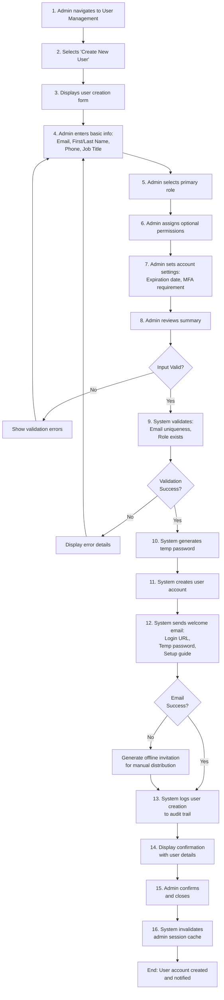

#### Decision Points:
1. **Is input valid?** - Check all required fields are present and properly formatted
2. **Does email already exist?** - Prevent duplicate email addresses system-wide
3. **Does role exist?** - Validate selected role is active in system
4. **Can email be sent?** - Handle email service failures gracefully
5. **Should account require MFA?** - Based on role and security policy

#### System Actions:
- Validate email format and uniqueness across all tenants
- Check role exists and is not deprecated
- Generate cryptographically secure temporary password
- Create user record in database with `created_timestamp`, `created_by_admin_id`, `last_login_at: null`
- Set password hash using bcrypt with cost factor 12
- Initialize user settings table with defaults
- Insert audit log entry with full context
- Send welcome email via SMTP/SendGrid with HTML template
- Return confirmation with user ID and temporary credentials
- Clear any affected cache entries

#### Notifications:
- **To New User**: Welcome email with login instructions
- **To Admin**: Success/failure confirmation in UI
- **To Audit System**: User creation event logged
- **To HR (Optional)**: Confirmation that user account created
- **Retry Queue**: If email fails, queue for retry (exponential backoff: 10min, 30min, 1hr, 3hrs, 6hrs)

#### Postconditions:
- User account exists in system with "active" status
- User has received welcome notification
- Role and permissions assigned as specified
- All creation details logged in audit trail with timestamp and admin identity
- Account ready for first login

#### Exception Handling:
- **Duplicate Email**: Show existing user info, suggest contact existing user or use different email
- **Role Not Found**: Display available roles, allow admin to select different role
- **Email Service Down**: Create account, show offline invitation, queue email for retry
- **MFA Enrollment Requirement**: Prompt user on first login if not already enrolled
- **Database Transaction Failure**: Rollback, display error, prompt admin to retry

#### Related User Stories:
- US-SA-001: User Account Provisioning and Management

---

### WF-SA-002: Bulk Import Users from CSV

**Workflow ID**: WF-SA-002
**Name**: Bulk Import Users from CSV
**Category**: User Provisioning
**Priority**: High
**Complexity**: High
**Estimated Duration**: 15-45 minutes (depending on file size)

#### Trigger Events:
- Annual user provisioning (new hires batch)
- Employee data migration from legacy system
- Multi-location onboarding
- System data refresh/sync

#### Actors:
- System Administrator (Primary)
- HR Personnel (Primary - data source)
- Bulk Import Service (System)
- Email Service (System)
- Audit Logger (System)

#### Prerequisites:
- Administrator has active session with MFA authentication
- CSV template available and documented
- Email service operational and queued for bulk sends
- Database connection pool has sufficient capacity
- Role definitions configured

#### Main Flow Steps:

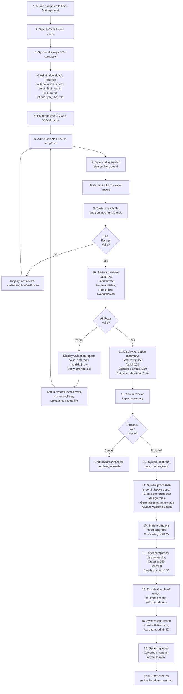

#### Decision Points:
1. **Is CSV format valid?** - Check file structure, encoding, delimiters
2. **Are all required fields present?** - Validate headers match template
3. **Is email format correct?** - Validate each email address syntax
4. **Do roles exist?** - Check all referenced roles are active
5. **Are emails unique?** - Prevent duplicates within file and in existing system
6. **Should import proceed?** - Admin must confirm with validation summary

#### System Actions:
- Parse CSV file with configurable delimiter and encoding detection
- Validate file size (max 10MB, typically 5000 rows)
- Perform field-level validation:
  - Email: RFC 5322 format, uniqueness check
  - Name: Non-empty, <100 characters
  - Phone: Optional, format validation if provided
  - Role: Must exist in system, not deprecated
- Generate validation report with row-by-row details
- For valid rows:
  - Create user records in transaction batch (100 rows per batch)
  - Generate unique temp passwords per user
  - Hash passwords with bcrypt
  - Create user_roles entries
  - Create audit log entries for each user (1 per user = 150 logs)
- Queue welcome emails to message queue (RabbitMQ/Azure Service Bus)
- Update user creation statistics
- Generate import report with:
  - Total processed: 150
  - Successfully created: 150
  - Failed: 0
  - Emails queued: 150
  - Estimated send time: 2-5 minutes
- Return downloadable report CSV with user IDs and temporary passwords

#### Notifications:
- **To Admin**: Import progress updates in UI (real-time via WebSocket)
- **To Admin**: Final completion report with download link
- **To New Users**: Welcome emails (queued and sent async over 5 minutes)
- **To Audit System**: Bulk import event logged with file hash and row count
- **Webhook (Optional)**: POST to configured webhook with import results
- **Admin Email (Optional)**: Confirmation email with import summary

#### Postconditions:
- 150 user accounts created in system
- All users have "active" status
- All temporary passwords generated and queued in welcome emails
- Import fully logged in audit trail with:
  - Import ID
  - File hash (SHA256)
  - Row count
  - Success count
  - Admin identity
  - Timestamp
- All users can log in with temporary credentials
- No existing users modified or affected

#### Exception Handling:
- **Invalid CSV Format**: Show format errors, provide template, allow retry
- **Duplicate Emails in File**: Report row numbers with duplicates, require file correction
- **Duplicate Email in System**: Report rows with conflicts, provide options (skip, force update)
- **Invalid Roles**: List available roles, show problematic rows, require correction
- **Database Transaction Failure**: Rollback entire batch, log error, retry capability
- **Email Queue Full**: Queue remains filled, emails delivered when capacity available
- **File Upload Timeout**: Resume capability for large files
- **Memory Issues with Large File**: Process in smaller chunks (stream processing)

#### Performance Considerations:
- Large file (5000 rows): Split into 50-row batches for database insertion
- Emails sent asynchronously: Doesn't block import completion
- Progress updates via WebSocket: Real-time feedback without polling
- Batch validation runs in parallel: Use thread pool for CPU-bound tasks
- Email queuing: Fast, decoupled from user creation

#### Related User Stories:
- US-SA-001: User Account Provisioning and Management

---

### WF-SA-003: Modify User Roles and Permissions

**Workflow ID**: WF-SA-003
**Name**: Modify User Roles and Permissions
**Category**: User Provisioning
**Priority**: High
**Complexity**: Medium
**Estimated Duration**: 3-8 minutes

#### Trigger Events:
- Employee promotion requiring new role
- Department transfer necessitating permission changes
- Role escalation for temporary project assignment
- Permission removal due to policy change
- Compliance requirement for permission adjustment

#### Actors:
- System Administrator (Primary)
- HR Personnel (Secondary - notification)
- User (Secondary - notification)
- Session Manager (System)
- Audit Logger (System)

#### Prerequisites:
- Administrator logged in with MFA authentication
- Target user account exists and is active
- New role exists and is not deprecated
- User has active sessions (may need to be invalidated)
- Permission cache is accessible

#### Main Flow Steps:

```mermaid
graph TD
    A["1. Admin navigates to User Management"] --> B["2. Searches for user:<br/>'John Smith'"]
    B --> C["3. System returns user in results:<br/>Email: john.smith@company.com<br/>Status: Active<br/>Current Role: Driver<br/>Last login: 2025-11-10 14:23"]
    C --> D["4. Admin clicks on user<br/>to open profile"]
    D --> E["5. System displays user details:<br/>- Basic info<br/>- Current roles<br/>- Active permissions<br/>- Last login info<br/>- Session info"]
    E --> F["6. Admin clicks 'Edit Roles'"]
    F --> G["7. System displays role<br/>assignment interface:<br/>Current: Driver<br/>Available roles: Dispatcher,<br/>Fleet Manager, Safety Officer"]
    G --> H["8. Admin selects new role:<br/>Dispatcher"]
    H --> I["9. System displays<br/>permission change summary:<br/>Removed: 5 permissions<br/>Added: 12 permissions<br/>Unchanged: 7 permissions"]
    I --> J["10. Admin reviews:<br/>- Can now: Approve routes,<br/>  Assign vehicles, View reports<br/>- Can no longer: Drive vehicle,<br/>  Edit vehicle records"]
    J --> K{Confirm<br/>Role<br/>Change?}
    K -->|Cancel| L["End: No changes made"]
    K -->|Confirm| M["11. System validates:<br/>- Target role exists<br/>- Permission inheritance OK<br/>- No escalation issues"]
    M --> N{Validation<br/>Success?}
    N -->|No| O["Display error,<br/>show available roles"]
    O --> H
    N -->|Yes| P["12. System checks for<br/>active sessions:<br/>Found: 1 active session<br/>Device: Chrome on Windows<br/>Last activity: 5 min ago"]
    P --> Q{"Force<br/>Logout?"}
    Q -->|No| R["Proceed without logout<br/>- Changes effective at next login"]
    Q -->|Yes| S["13. Terminate active session<br/>- Remove session token<br/>- Invalidate auth cache<br/>- Log session termination"]
    R --> T["14. Update user_roles table:<br/>OLD: user_id=123, role_id=2<br/>NEW: user_id=123, role_id=3"]
    S --> T
    T --> U["15. Update permission cache<br/>for user in Redis:<br/>- Clear old permissions<br/>- Load new permissions"]
    U --> V["16. Insert audit log:<br/>- Event: role_changed<br/>- From: Driver<br/>- To: Dispatcher<br/>- Admin: admin@fleet.com<br/>- Timestamp: 2025-11-11 10:45<br/>- IP: 192.168.1.100"]
    V --> W["17. Send notification email<br/>to John Smith:<br/>Subject: Your account<br/>roles have been updated<br/>Body: Previous role: Driver<br/>New role: Dispatcher<br/>Effective: Immediately"]
    W --> X["18. Display confirmation:<br/>'Role updated successfully<br/>John Smith now has<br/>Dispatcher role'"]
    X --> Y["19. Clear admin session<br/>permission cache"]
    Y --> Z["End: Role change complete<br/>and logged"]
```

#### Decision Points:
1. **Does user exist and is active?** - Verify user account status
2. **Does target role exist?** - Confirm new role is available and not deprecated
3. **Are permissions valid?** - Check for escalation or logical conflicts
4. **Are active sessions present?** - Determine if immediate logout needed
5. **Should logout be forced?** - Balance immediate effect vs user disruption
6. **Should email notification be sent?** - Based on permission change significance

#### System Actions:
- Search user by email/name with fuzzy matching
- Retrieve current user roles and permissions from database
- Fetch all available roles from role_master table
- Calculate permission delta (added, removed, unchanged)
- Validate target role:
  - Exists in system
  - Not deprecated/disabled
  - No privilege escalation from current user's level
- Check for active sessions (query sessions table with `user_id=123 AND is_active=true`)
- Optionally invalidate active sessions:
  - Remove session tokens from session store
  - Update session table: `is_active=false`, `ended_at=now()`
  - Notify any running processes to clear user cache
- Update role assignment:
  - Delete old `user_roles` entry
  - Insert new `user_roles` entry
  - Ensure transaction atomicity
- Invalidate permission cache:
  - Redis: `DEL user:123:permissions`
  - Clear any role-based caches
  - Reload permissions on next request
- Create audit log entry with full context:
  - Action: role_changed
  - User ID: 123
  - Old role ID: 2
  - New role ID: 3
  - Admin ID: 456
  - Timestamp: `now()`
  - IP address: from session
  - User agent: from session
- Send notification email to user with:
  - Previous role name
  - New role name
  - Change timestamp
  - Link to security settings
  - Instruction to contact admin if unauthorized

#### Notifications:
- **To User (Email)**: Role change notification with details
- **To Admin (UI)**: Confirmation message with success details
- **To Audit System**: Role change logged with full context
- **Optional Webhook**: POST to configured endpoint with change details

#### Postconditions:
- User has new role assigned in system
- User permissions reflect new role (effective immediately or at next login)
- Old role assignment removed from user_roles table
- All active sessions terminated if requested
- Role change logged in audit trail with timestamp and admin identity
- User notified of role change

#### Exception Handling:
- **User Not Found**: Display error, return to user search
- **Role Doesn't Exist**: Show available roles, allow selection of different role
- **Database Update Fails**: Rollback transaction, display error, retry capability
- **Session Termination Fails**: Log warning, continue with role change (user re-logs in)
- **Email Notification Fails**: Log error, allow manual retry, user still gets role change
- **Permission Cache Invalidation Fails**: Fall back to database query for permissions

#### Audit Trail Details:
- Log all permission changes with before/after values
- Log session terminations with reason
- Log email delivery success/failure
- Maintain 7-year retention for compliance

#### Related User Stories:
- US-SA-001: User Account Provisioning and Management

---

### WF-SA-004: Deactivate User Account

**Workflow ID**: WF-SA-004
**Name**: Deactivate User Account
**Category**: User Provisioning
**Priority**: High
**Complexity**: Low
**Estimated Duration**: 3-5 minutes

#### Trigger Events:
- Employee termination
- Employee resignation
- Account security compromise requiring immediate lockdown
- Voluntary account deactivation request
- Account cleanup for inactive users (>12 months)

#### Actors:
- System Administrator (Primary)
- HR Personnel (Secondary - notification)
- Session Manager (System)
- API Key Manager (System)
- Audit Logger (System)

#### Prerequisites:
- Administrator logged in with MFA authentication
- Target user account exists
- Reason for deactivation categorized
- All active sessions identified

#### Main Flow Steps:

```mermaid
graph TD
    A["1. Admin searches for user<br/>to deactivate"] --> B["2. Admin selects user:<br/>Mike Torres"]
    B --> C["3. System displays user<br/>profile with:<br/>- Email<br/>- Role<br/>- Status: Active<br/>- Last login: 2025-11-09"]
    C --> D["4. Admin clicks<br/>'Deactivate Account'"]
    D --> E["5. System shows<br/>deactivation dialog"]
    E --> F["6. Admin selects reason:<br/>'Employee Terminated'"]
    F --> G["7. Admin adds notes:<br/>'Last day of employment<br/>Nov 10, 2025'"]
    G --> H["8. System calculates<br/>deactivation impact:<br/>- Active sessions: 1<br/>  (Chrome, Windows)<br/>- Active API keys: 2<br/>- Scheduled jobs: 3<br/>- Shared documents: 15"]
    H --> I["9. System displays<br/>deactivation preview:<br/>- Current sessions<br/>  will be terminated<br/>- API keys will be revoked<br/>- Jobs will be cancelled<br/>- Data will be preserved"]
    I --> J{Confirm<br/>Deactivation?}
    J -->|Cancel| K["End: Deactivation cancelled"]
    J -->|Confirm| L["10. System initiates<br/>deactivation sequence"]
    L --> M["11. Terminate all<br/>active sessions:<br/>- Remove session tokens<br/>- Mark sessions as ended<br/>- Force logout if needed"]
    M --> N["12. Revoke all API keys:<br/>- Mark as revoked<br/>- Log key revocation<br/>- Add to blocklist"]
    N --> O["13. Cancel all<br/>scheduled jobs:<br/>- Stop running jobs<br/>- Mark as cancelled<br/>- Log cancellation"]
    O --> P["14. Update user record:<br/>- Set status: inactive<br/>- Set deactivated_at: now()<br/>- Set deactivated_by: admin_id<br/>- Set deactivation_reason<br/>- Keep all history"]
    P --> Q["15. Remove from<br/>active user cache:<br/>- Redis: user set<br/>- Permission cache<br/>- Session cache"]
    Q --> R["16. Create audit log<br/>entry:<br/>- Event: user_deactivated<br/>- Reason: termination<br/>- Sessions terminated: 1<br/>- API keys revoked: 2<br/>- Admin: admin@fleet.com<br/>- Timestamp: now()"]
    R --> S["17. Send notification to<br/>User (Archive email):<br/>- Account deactivated<br/>- Date of deactivation<br/>- Contact admin if error<br/>- Data retention info"]
    S --> T["18. Send notification to<br/>Admin (Email/UI):<br/>- Deactivation successful<br/>- Sessions terminated: 1<br/>- API keys revoked: 2<br/>- Data preserved"]
    T --> U["19. Optionally send to HR:<br/>- Confirmation that<br/>  access has been<br/>  revoked"]
    U --> V["20. Display confirmation:<br/'User deactivated<br/>successfully'"]
    V --> W["End: Account deactivated<br/>all access revoked"]
```

#### Decision Points:
1. **Is user account active?** - Prevent deactivating already-inactive users
2. **What is reason for deactivation?** - Categorize for audit purposes
3. **Are there active sessions?** - Determine if immediate termination needed
4. **Should API keys be revoked?** - Depending on circumstances
5. **Should jobs be cancelled?** - Depending on impact

#### System Actions:
- Retrieve user account and verify status
- Calculate deactivation impact:
  - Query sessions table: `SELECT COUNT(*) FROM sessions WHERE user_id=? AND is_active=true`
  - Query api_keys table: `SELECT COUNT(*) FROM api_keys WHERE user_id=? AND status='active'`
  - Query jobs table: `SELECT COUNT(*) FROM jobs WHERE user_id=? AND status IN ('pending','running')`
- Terminate all active sessions:
  - Delete session records or mark as inactive
  - Remove JWT tokens from token blocklist
  - Notify session store (Redis) to invalidate
- Revoke all API keys:
  - Update api_keys table: `status='revoked', revoked_at=now(), revoked_by=admin_id`
  - Add all keys to blocklist
  - Log each revocation
- Cancel all scheduled jobs:
  - Update jobs table: `status='cancelled', cancelled_at=now()`
  - Remove from job queue if not yet running
  - Log each cancellation
- Update user record (soft delete):
  - Update users table: `is_active=false, status='inactive', deactivated_at=now(), deactivated_by=admin_id, deactivation_reason=?`
  - Do NOT delete user record (preserve history)
  - Keep all related data intact (user_roles, audit logs, etc.)
- Invalidate caches:
  - Redis: Remove from active users set
  - Clear permission cache for user
  - Clear session cache for user
- Create comprehensive audit log:
  - Event type: user_deactivated
  - User ID: 123
  - Deactivated by: admin_id (456)
  - Reason: termination
  - Sessions terminated: 1
  - API keys revoked: 2
  - Jobs cancelled: 3
  - Timestamp: now()
  - IP address: admin's IP
- Send notifications:
  - Archive email to user: Account deactivated, data retention info
  - Admin notification: Confirmation, what was affected
  - Optional HR notification: Access revoked confirmation

#### Notifications:
- **To Deactivated User (Email)**: Account deactivation notice
- **To Admin (UI)**: Confirmation with impact summary
- **To Audit System**: Deactivation logged with full details
- **To HR (Email, Optional)**: Access revocation confirmation

#### Postconditions:
- User account marked as inactive
- All active sessions terminated
- All API keys revoked
- All scheduled jobs cancelled
- User cannot log in or access system
- All user data preserved (soft delete)
- Deactivation fully logged in audit trail
- Notifications sent to affected parties

#### Exception Handling:
- **User Already Inactive**: Display message, suggest checking deactivation date
- **Last Admin Account**: Prevent deactivation if this is last admin, require escalation
- **Session Termination Fails**: Log warning, continue with deactivation
- **Database Update Fails**: Rollback, display error, retry capability
- **Notification Failures**: Log errors, allow manual retry

#### Data Preservation:
- User's historical data remains intact and queryable
- Audit logs show all deactivation details
- User data accessible for compliance/legal holds
- Can reactivate account if needed (with admin confirmation)

#### Related User Stories:
- US-SA-001: User Account Provisioning and Management

---

## RBAC Configuration Workflows

### WF-SA-005: Create Custom Role with RBAC

**Workflow ID**: WF-SA-005
**Name**: Create Custom Role with RBAC
**Category**: RBAC Configuration
**Priority**: High
**Complexity**: High
**Estimated Duration**: 20-45 minutes

#### Trigger Events:
- New job role created in organization
- New department requires custom permissions
- Compliance requirement for role-based access
- Third-party integration needs specific permission set
- Organizational restructuring requires new roles

#### Actors:
- System Administrator (Primary)
- Business Owner / Manager (Secondary - requirements)
- Audit Logger (System)

#### Prerequisites:
- Administrator logged in with full admin privileges
- Permission matrix loaded in system
- At least one existing role as template (optional)
- RBAC module accessible and functional

#### Main Flow Steps:

```mermaid
graph TD
    A["1. Admin navigates to<br/>RBAC Configuration"] --> B["2. Clicks 'Create Custom Role'"]
    B --> C["3. System displays<br/>role creation form"]
    C --> D["4. Admin enters role details:<br/>- Name: Regional Fleet Manager<br/>- Description: Manages fleet<br/>  operations for assigned<br/>  region(s)<br/>- Department: Operations<br/>- Category: Management"]
    D --> E["5. Admin reviews permission<br/>matrix with 200+ permissions"]
    E --> F["6. Admin configures<br/>Vehicle Management<br/>permissions:<br/>- View: Yes<br/>- Create: Yes<br/>- Edit: Yes<br/>- Delete: No<br/>- Assign drivers: Yes"]
    F --> G["7. Admin configures<br/>Driver Management<br/>permissions:<br/>- View: Yes<br/>- Create: Yes<br/>- Edit: Yes<br/>- View performance: Yes<br/>- Approve certs: Yes"]
    G --> H["8. Admin configures<br/>Route Management:<br/>- View: Yes<br/>- Create: Yes<br/>- Edit: Yes<br/>- Override: No<br/>- Approve: Yes"]
    H --> I["9. Admin configures<br/>Reporting:<br/>- View reports: Yes<br/>- Generate custom: Yes<br/>- Export: Yes<br/>- Share: Yes"]
    I --> J["10. Admin sets data<br/>access restrictions:<br/>- Regions: Boston,<br/>  New York, Philadelphia<br/>- Cannot access:<br/>  Corporate HQ data"]
    J --> K["11. System displays<br/>permission summary:<br/>- Enabled: 89 permissions<br/>- Disabled: 111 permissions<br/>- Data restrictions: 1<br/>- Location-based: 3 regions"]
    K --> L["12. Admin tests role<br/>by clicking<br/>'Preview as this role'"]
    L --> M["13. System switches to<br/>preview mode showing<br/>Regional Fleet Manager<br/>interface"]
    M --> N["14. Admin verifies:<br/>- Dashboard shows<br/>  regional data only<br/>- Reports filtered<br/>  by region<br/>- Financial section<br/>  read-only<br/>- Cannot access<br/>  admin settings"]
    N --> O["15. Admin exits preview<br/>and clicks 'Save Role'"]
    O --> P["16. System validates:<br/>- Role name not duplicate<br/>- At least one<br/>  permission assigned<br/>- No privilege<br/>  escalation<br/>- Data restrictions valid"]
    P --> Q{Validation<br/>Success?}
    Q -->|No| R["Display validation error<br/>with details"]
    R --> F
    Q -->|Yes| S["17. System creates role<br/>in database:<br/>- INSERT role record<br/>- INSERT role_permissions<br/>  (89 rows)<br/>- INSERT role_restrictions<br/>  (1 row)"]
    S --> T["18. System creates<br/>audit log entry:<br/>- Event: role_created<br/>- Role: Regional Fleet Manager<br/>- Permissions: 89<br/>- Admin: admin@fleet.com<br/>- Timestamp: now()"]
    T --> U["19. System updates<br/>role cache<br/>in Redis"]
    U --> V["20. Display confirmation:<br/'Role created successfully<br/>Regional Fleet Manager<br/>is ready for assignment'"]
    V --> W["21. Admin option to<br/>immediately assign<br/>users to new role"]
    W --> X["End: Custom role created<br/>and available for use"]
```

#### Decision Points:
1. **Is role name unique?** - Check for duplicate role names
2. **Are permissions valid?** - Verify all selected permissions exist
3. **Does role have sufficient permissions?** - Ensure meaningful permission set
4. **Are data restrictions valid?** - Check location/resource restrictions exist
5. **Does this escalate privileges?** - Prevent privilege escalation from current admin's level
6. **Should role be tested before saving?** - Allow admin to preview interface

#### System Actions:
- Retrieve all available permissions from permissions table (200+ records)
- Group permissions by module/category for display
- Load permission hierarchy to show relationships
- For each permission admin selects:
  - Validate permission exists
  - Check admin has authority to grant it
  - Track in temporary role object
- Calculate permission summary:
  - Count enabled: 89
  - Count disabled: 111
  - Calculate total: 200
- Handle data restrictions:
  - Validate location codes (Boston, NY, Philly)
  - Check resource types
  - Store as row-level security policies
- Generate preview interface:
  - Load UI components based on permissions
  - Hide restricted sections
  - Apply location filtering
  - Cache preview for display
- On save, validate entire role:
  - No duplicate role names
  - No privilege escalation beyond current admin
  - No logical permission conflicts
- Create database transaction:
  - INSERT INTO roles (name, description, department, status)
  - INSERT INTO role_permissions (role_id, permission_id) × 89
  - INSERT INTO role_restrictions (role_id, restriction_type, value) × 1
  - All in single transaction for atomicity
- Create audit log:
  - Event: role_created
  - Role ID: (new)
  - Role name: Regional Fleet Manager
  - Permission count: 89
  - Admin ID: 456
  - Timestamp: now()
  - IP address: admin's IP
- Update caches:
  - Redis: Add to roles set
  - Clear any role list caches
  - Invalidate role matrix cache

#### Notifications:
- **To Admin (UI)**: Confirmation with role details
- **To Audit System**: Role creation logged with full details
- **Optional Email**: Role creation confirmation to admin
- **Optional Webhook**: POST role details to configured endpoint

#### Postconditions:
- New role exists in system with "active" status
- Role has 89 permissions configured
- Data access restrictions applied (3 regions)
- Role immediately available for user assignment
- Role creation logged in audit trail
- Role can be previewed/tested before assignment

#### Exception Handling:
- **Duplicate Role Name**: Show existing role, suggest different name
- **Invalid Permissions**: Show available permissions, allow correction
- **Invalid Data Restrictions**: Show available locations/resources, allow correction
- **Privilege Escalation Detected**: Block creation, display error
- **Database Transaction Fails**: Rollback, display error, allow retry
- **Cache Update Fails**: Log warning, fall back to database queries

#### Permission Categories:
1. **User Management**: Create, edit, delete users
2. **Vehicle Management**: View, create, edit, delete vehicles
3. **Driver Management**: View, create, edit drivers
4. **Route Management**: Create, approve, edit routes
5. **Reporting**: View, generate, export reports
6. **Financial**: View costs, approve expenses
7. **System Administration**: Access admin settings
8. **Audit & Logging**: Access audit logs
9. **Integration Management**: Configure integrations
10. **Security**: Manage security policies

#### Related User Stories:
- US-SA-002: Role-Based Access Control (RBAC) Configuration

---

### WF-SA-006: Modify Existing Role Permissions

**Workflow ID**: WF-SA-006
**Name**: Modify Existing Role Permissions
**Category**: RBAC Configuration
**Priority**: High
**Complexity**: High
**Estimated Duration**: 10-30 minutes

#### Trigger Events:
- Business process change requires new permissions
- Compliance requirement mandates permission removal
- Operational efficiency improvement needs new capability
- Security policy tightened requiring permission revocation
- Role evolution as organization grows

#### Actors:
- System Administrator (Primary)
- Business Owner / Manager (Secondary - requirements)
- Audit Logger (System)
- Session Manager (System)

#### Prerequisites:
- Administrator logged in with MFA authentication
- Target role exists and is not system-reserved
- New permissions exist in system
- User session cache accessible

#### Main Flow Steps:

```mermaid
graph TD
    A["1. Admin navigates to<br/>RBAC Configuration"] --> B["2. Searches for role<br/>to modify:<br/>'Dispatcher'"]
    B --> C["3. System displays<br/>Dispatcher role details:<br/>- 28 current permissions<br/>- 172 available permissions<br/>- 96 active users"]
    C --> D["4. Admin clicks 'Edit<br/>Permissions'"]
    D --> E["5. System displays<br/>permission editor<br/>with current state"]
    E --> F["6. Admin identifies<br/>needed change:<br/>'Dispatcher should be<br/>able to approve<br/>work orders'"]
    F --> G["7. Admin searches<br/>for permission:<br/>'Approve Work Orders'"]
    G --> H["8. System shows<br/>permission details:<br/>- Currently: Disabled<br/>- Description: Approve<br/>  pending work orders<br/>- Module: Maintenance<br/>- Grant risk: Low"]
    H --> I["9. Admin clicks to<br/>enable permission"]
    I --> J["10. System shows<br/>impact analysis:<br/>- Affected users: 96<br/>- Change type: Add<br/>  permission<br/>- Effective: Immediate<br/>- Requires re-login: No"]
    J --> K["11. System suggests:<br/>'This permission<br/>requires 'View<br/>work orders' to be<br/>effective'"]
    K --> L{Add both<br/>Permissions?}
    L -->|View Only| M["Continue with just<br/>Approve Work Orders"]
    L -->|Both| N["Add both permissions<br/>to role"]
    M --> O["12. Admin reviews<br/>summary of changes:<br/>- Added: 1 permission<br/>- Removed: 0<br/>- New total: 29 permissions"]
    N --> O
    O --> P["13. Admin selects<br/>implementation:<br/>- Effective date:<br/>  Immediate<br/>- Maintenance window:<br/>  None (already off-peak)"]
    P --> Q["14. Admin confirms<br/>permission change:<br/>'Apply to all 96<br/>Dispatcher users'"]
    Q --> R["15. System validates:<br/>- New permissions exist<br/>- No privilege<br/>  escalation<br/>- No logical conflicts<br/>- At least 1 admin<br/>  role remains"]
    R --> S{Validation<br/>Success?}
    S -->|No| T["Display error with<br/>details, suggest fixes"]
    T --> F
    S -->|Yes| U["16. System applies<br/>changes in database:<br/>- UPDATE role_permissions<br/>  for Dispatcher role<br/>- Add new permission<br/>- Keep existing<br/>  permissions"]
    U --> V["17. System invalidates<br/>permission cache:<br/>- Redis: Clear<br/>  dispatcher role cache<br/>- Clear user permission<br/>  caches for 96 users"]
    V --> W["18. System creates<br/>audit log entries:<br/>- Event: role_permissions<br/>  _modified<br/>- Role: Dispatcher<br/>- Added: Approve Work Orders<br/>- Affected users: 96<br/>- Admin: admin@fleet.com<br/>- Timestamp: now()"]
    W --> X["19. System sends<br/>notifications:<br/>- Email to affected users:<br/>  'Your permissions<br/>  have been updated'<br/>- Details in admin<br/>  notification"]
    X --> Y["20. Display<br/>confirmation:<br/'Permission change<br/>applied to 96<br/>Dispatcher users'"]
    Y --> Z["21. Admin can verify<br/>by previewing role"]
    Z --> AA["End: Role permissions<br/>updated and logged"]
```

#### Decision Points:
1. **Does role exist and is not reserved?** - Prevent modifying system roles
2. **Do new permissions exist?** - Verify all requested permissions in system
3. **Are there permission dependencies?** - Add related permissions if needed
4. **How many users affected?** - 96 users = consider notifications
5. **Is privilege escalation happening?** - Prevent privilege escalation
6. **Should users be notified?** - Based on significance of change

#### System Actions:
- Retrieve role with current permissions from database
- Load all available permissions for comparison
- For each permission change:
  - Validate permission exists
  - Check admin has authority to grant it
  - Analyze dependencies (suggest related permissions)
  - Check for logical conflicts
- Calculate impact analysis:
  - Query users table: `SELECT COUNT(*) FROM users WHERE role_id=? AND is_active=true`
  - Identify all 96 active Dispatcher users
  - Check for active sessions: `SELECT COUNT(*) FROM sessions WHERE user_id IN (...) AND is_active=true`
  - Estimate cache invalidation time
- Validate entire modified role:
  - No privilege escalation beyond current admin's level
  - No logical permission conflicts
  - At least one admin role remains with full permissions
- Apply changes in database transaction:
  - DELETE FROM role_permissions WHERE role_id=? AND permission_id=? (for removed permissions)
  - INSERT INTO role_permissions (role_id, permission_id) (for new permissions)
  - UPDATE roles SET modified_at=now(), modified_by=admin_id
  - All in single transaction
- Invalidate caches:
  - Redis: Delete role-specific permission cache
  - For each of 96 affected users: Clear permission cache
  - Update last-modified timestamp for role
- Create audit log entries:
  - Main entry: role_permissions_modified
  - Role: Dispatcher
  - Added permissions: [list]
  - Removed permissions: [list]
  - Affected user count: 96
  - Admin: 456
  - Timestamp: now()
- Send notifications:
  - Email to all 96 Dispatcher users: "Your permissions have been updated"
  - Detailed notification to admin: Role modified, change details
  - Optional webhook: POST role change details
- Provide verification option:
  - Allow admin to preview role as it would appear to users
  - Show new permission set

#### Notifications:
- **To Affected Users (Email)**: Permission update notification
- **To Admin (UI)**: Confirmation with affected user count
- **To Audit System**: Detailed change log
- **Optional Webhook**: Role change details POST

#### Postconditions:
- Role has updated permission set (29 permissions instead of 28)
- All 96 Dispatcher users immediately have new permissions
- Permission change effective immediately (no re-login required, cached permissions refreshed on next action)
- Change fully logged in audit trail
- Users notified of permission update

#### Exception Handling:
- **Role Not Found**: Display error, return to role selection
- **Permission Not Found**: Show available permissions, allow correction
- **Privilege Escalation Detected**: Block change, display error
- **Database Transaction Fails**: Rollback, display error, allow retry
- **Cache Invalidation Fails**: Log warning, fall back to database queries
- **Notification Failures**: Log errors, allow manual retry
- **Too Many Users Affected**: Still apply but process notifications asynchronously

#### Performance Considerations:
- Cache invalidation for 96 users: Parallel processing in thread pool
- Permission change effective immediately: Lazy-loaded on next request
- Notifications: Sent asynchronously to avoid blocking
- Database transaction: Batched for performance

#### Related User Stories:
- US-SA-002: Role-Based Access Control (RBAC) Configuration

---

## SSO Setup Workflows

### WF-SA-007: Configure SAML SSO Integration

**Workflow ID**: WF-SA-007
**Name**: Configure SAML SSO Integration
**Category**: SSO Setup
**Priority**: High
**Complexity**: Very High
**Estimated Duration**: 45-90 minutes (plus IdP configuration)

#### Trigger Events:
- Enterprise customer requires SAML SSO integration
- Organization migrating from local authentication to SSO
- Compliance requirement for centralized identity management
- Acquisition/merger requires SSO configuration for merged organization

#### Actors:
- System Administrator (Primary)
- IT Security Officer (Secondary - validation)
- Identity Provider (IdP) Administrator (Secondary - IdP side)
- Audit Logger (System)

#### Prerequisites:
- Administrator logged in with full admin privileges
- Identity Provider (Azure AD, Okta, OneLogin) configured and accessible
- SSL certificates obtained for SAML endpoints
- SAML endpoints deployed and operational
- Network connectivity to IdP available

#### Main Flow Steps:

```mermaid
graph TD
    A["1. Admin navigates to<br/>SSO Configuration"] --> B["2. Clicks 'Configure<br/>SAML Provider'"]
    B --> C["3. System displays<br/>SAML setup wizard:<br/>Step 1: IdP Selection"]
    C --> D["4. Admin selects IdP:<br/>'Azure Active Directory'"]
    D --> E["5. System displays<br/>Step 2: Service Provider<br/>Metadata<br/>- EntityID: https://fleet.app/saml<br/>- ACS URL: https://fleet.app/<br/>auth/saml/acs<br/>- SLO URL: https://fleet.app/<br/>auth/saml/slo"]
    E --> F["6. Admin downloads<br/>SP metadata XML<br/>or copies EntityID"]
    F --> G["7. Admin logs into IdP<br/>(Azure AD portal)<br/>and creates Enterprise<br/>Application"]
    G --> H["8. Admin uploads<br/>SP metadata or<br/>manually enters<br/>URLs in IdP"]
    H --> I["9. IdP generates<br/>metadata XML<br/>with signing certs"]
    I --> J["10. Admin downloads<br/>IdP metadata from<br/>Azure AD"]
    J --> K["11. Admin returns to<br/>Fleet SSO Configuration<br/>Step 3: Upload IdP Metadata"]
    K --> L["12. Admin uploads<br/>IdP metadata XML"]
    L --> M["13. System parses<br/>metadata and extracts:<br/>- Sign-in URL<br/>- Sign-out URL<br/>- Certificate fingerprint<br/>- Issuer ID"]
    M --> N["14. System displays<br/>Step 4: Attribute Mapping<br/>- Show SAML attributes<br/>- Map to user fields"]
    N --> O["15. Admin configures<br/>attribute mapping:<br/>- email → email<br/>- givenName → first_name<br/>- surname → last_name<br/>- mobile → phone<br/>- groups → roles<br/>  (custom mapping)"]
    O --> P["16. System displays<br/>Step 5: User Provisioning<br/>Options:<br/>- Manual provisioning<br/>- Just-in-Time (JIT)<br/>- Automatic sync"]
    P --> Q["17. Admin selects:<br/>'Just-in-Time<br/>Provisioning'<br/>- Create user on<br/>  first login<br/>- Assign default role<br/>- Set to Driver role"]
    Q --> R["18. System displays<br/>Step 6: SSO Settings:<br/>- Force SSO: Yes/No<br/>- Allow fallback to<br/>  local auth: Yes<br/>- Session timeout: 8hr<br/>- Auto-logout: Yes"]
    R --> S["19. Admin configures:<br/>- Force SSO: No<br/>  (allow local login)<br/>- Fallback to local: Yes<br/>- Session timeout: 8 hours"]
    S --> T["20. System displays<br/>Step 7: Test Configuration<br/>- Metadata validation:<br/>  ✓ Valid<br/>- Certificate validation:<br/>  ✓ Valid cert chain<br/>- Connection test:<br/>  Awaiting admin<br/>  to test"]
    T --> U["21. Admin clicks<br/>'Test SSO Connection'"]
    U --> V["22. System sends SAML<br/>authentication request<br/>to Azure AD<br/>and redirects to login"]
    V --> W["23. Admin logs in to<br/>Azure AD with<br/>test account:<br/>test@organization.onmicrosoft.com"]
    W --> X["24. Azure AD returns<br/>SAML assertion<br/>with attributes"]
    X --> Y["25. System validates<br/>SAML assertion:<br/>- Signature valid<br/>- Issuer matches<br/>- Not expired<br/>- Assertion valid"]
    Y --> Z["26. System maps<br/>attributes and<br/>displays test results:<br/>- Email: test@org.onmicrosoft.com<br/>- First name: Test<br/>- Last name: User<br/>- Groups: (none)<br/>- Would create user: Yes"]
    Z --> AA{Test<br/>Success?}
    AA -->|No| AB["Display error details<br/>and troubleshooting<br/>suggestions"]
    AB --> AC["Admin corrects mapping<br/>or metadata<br/>and retests"]
    AC --> U
    AA -->|Yes| AD["27. Admin confirms<br/>test successful<br/>and proceeds to<br/>save configuration"]
    AD --> AE["28. System displays<br/>Step 8: Review<br/>Configuration summary:<br/>- IdP: Azure AD<br/>- Tenant: (specific tenant)<br/>- Attributes: 5 mapped<br/>- Provisioning: JIT<br/>- SSO Enforcement: No<br/>- Status: Ready to enable"]
    AE --> AF["29. Admin confirms<br/>'Enable SSO<br/>Configuration'"]
    AF --> AG["30. System validates<br/>- All required fields<br/>- Metadata valid<br/>- Certificate not expired<br/>- At least one local<br/>  admin exists"]
    AG --> AH{Validation<br/>Success?}
    AH -->|No| AI["Display error,<br/>suggest corrections"]
    AI --> AD
    AH -->|Yes| AJ["31. System saves<br/>configuration:<br/>- INSERT/UPDATE<br/>  sso_configurations<br/>- Store metadata<br/>- Store certificates<br/>- Encrypt credentials"]
    AJ --> AK["32. System creates<br/>audit log:<br/>- Event:<br/>  saml_configured<br/>- IdP: Azure AD<br/>- Admin: admin@fleet.com<br/>- Timestamp: now()"]
    AK --> AL["33. System enables<br/>SAML endpoints:<br/>- /auth/saml/login<br/>- /auth/saml/acs<br/>- /auth/saml/slo"]
    AL --> AM["34. Display confirmation:<br/'SAML SSO configured<br/>successfully<br/>Users can now<br/>log in via Azure AD'"]
    AM --> AN["35. Provide admin with<br/>troubleshooting guide<br/>and support info"]
    AN --> AO["End: SAML SSO<br/>integrated and<br/>enabled"]
```

#### Decision Points:
1. **Which IdP provider?** - Azure AD, Okta, OneLogin, etc.
2. **Is metadata valid?** - Check XML structure, certificates
3. **Are attribute mappings correct?** - Verify SAML attributes map to system fields
4. **Should SSO be enforced?** - Force all users through SSO or allow local login
5. **How are users provisioned?** - Manual, JIT, or automatic sync
6. **Does test authentication succeed?** - Validate full authentication flow
7. **Are certificates valid?** - Check expiration and signature chain

#### System Actions:
- Retrieve IdP list and display options (Azure AD, Okta, OneLogin)
- Generate Service Provider metadata:
  - EntityID: https://fleet.app/saml
  - AssertionConsumerService URL: https://fleet.app/auth/saml/acs
  - SingleLogoutService URL: https://fleet.app/auth/saml/slo
  - Sign with self-signed or CA certificate
  - Include XML encryption certificate
- Parse IdP metadata XML:
  - Extract signing certificates
  - Extract SSO URLs (login, logout)
  - Validate certificate expiration
  - Check XML signature
- Configure attribute mapping:
  - Load available SAML attributes from metadata
  - Map to system user fields (email, first_name, last_name, phone, roles)
  - Store mapping rules as JSON in database
  - Support custom attribute mappings
- Set up user provisioning:
  - Manual: Require admin to create users before SSO
  - JIT: Create user on first SSO login with default role
  - Automatic sync: Periodic sync of users from IdP (if supported)
- Test SAML flow:
  - Send AuthnRequest to IdP
  - Handle SAML Response
  - Validate signature using IdP certificate
  - Map attributes using configured mappings
  - Display test results to admin
- Save configuration:
  - Encrypt and store IdP metadata
  - Store certificates in secure storage (Azure Key Vault)
  - Save attribute mappings
  - Save SSO settings (enforce, fallback, timeout)
  - Create configuration record in sso_configurations table
- Enable SAML endpoints:
  - Deploy SAML routes
  - Load configuration on startup
  - Cache IdP metadata and certificates
  - Initialize SAML library (Passport-SAML, OneLogin)
- Create audit log:
  - Event: saml_configured
  - IdP: Azure AD
  - Tenant: (if multi-tenant)
  - Admin: admin_id
  - Timestamp: now()
  - Configuration details (entities, mapping)

#### Notifications:
- **To Admin (UI)**: Configuration progress updates, success confirmation
- **To Audit System**: SSO configuration logged with details
- **Optional Email**: SSO configuration confirmation to admin
- **Optional Webhook**: POST SSO configuration details

#### Postconditions:
- SAML SSO integration configured and enabled
- Users can authenticate via Azure AD
- New users auto-provisioned on first login (if JIT enabled)
- SAML configuration stored securely with certificates
- Configuration fully logged in audit trail
- SAML endpoints operational and accessible

#### Exception Handling:
- **Invalid Metadata**: Display parse errors, allow re-upload
- **Certificate Expired**: Warn admin, prevent enabling until renewed
- **IdP Connection Failed**: Show error, allow retry, suggest troubleshooting
- **Attribute Mapping Invalid**: Show available attributes, suggest corrections
- **Test Authentication Failed**: Display SAML response details, help debug
- **Database Save Failed**: Rollback, display error, allow retry

#### Troubleshooting Guide:
- SAML Response validation failures
- Certificate chain validation issues
- Attribute mapping mismatches
- Issuer/EntityID mismatches
- Clock skew issues between systems
- Endpoint unreachability

#### Security Considerations:
- SAML assertions signed by IdP
- Certificates validated before use
- Credentials encrypted in storage
- No sensitive data in logs
- Access to SSO config restricted to admins

#### Related User Stories:
- US-SA-004: Single Sign-On (SSO) and SAML Configuration

---

### WF-SA-008: Test and Enable SSO Provider

**Workflow ID**: WF-SA-008
**Name**: Test and Enable SSO Provider
**Category**: SSO Setup
**Priority**: High
**Complexity**: High
**Estimated Duration**: 15-30 minutes

#### Trigger Events:
- SAML configuration needs validation before production rollout
- SSO provider configuration changes need testing
- Security audit requires testing SSO flow
- Periodic validation of active SSO providers
- New IdP version released requiring compatibility testing

#### Actors:
- System Administrator (Primary)
- IT Security Officer (Secondary - validation)
- Test User (Secondary - test account)
- Audit Logger (System)

#### Prerequisites:
- SAML configuration already created in system
- SSO provider (Azure AD, Okta, etc.) configured with metadata
- Test user account created in IdP
- Network connectivity to IdP verified
- Staging/testing environment available

#### Main Flow Steps:

```mermaid
graph TD
    A["1. Admin navigates to<br/>SSO Configuration"] --> B["2. Selects configured<br/>SAML provider:<br/>'Azure Active Directory'"]
    B --> C["3. System displays<br/>SSO provider details:<br/>- Status: Configured,<br/>  not enabled<br/>- IdP: Azure AD<br/>- Tenant: organization<br/>- Last tested: N/A<br/>- Active users: 0"]
    C --> D["4. System validates<br/>configuration before<br/>testing:<br/>- Metadata valid: ✓<br/>- Certs valid: ✓<br/>- URLs reachable: ✓<br/>- Config complete: ✓"]
    D --> E{"Config<br/>Valid?"}
    E -->|No| F["Display validation<br/>errors and suggest<br/>corrections<br/>Return to editing"]
    E -->|Yes| G["5. Admin clicks<br/>'Test SSO Connection'"]
    G --> H["6. System displays<br/>SSO test options:<br/>- Test Mode: Staging<br/>- Create test user: No<br/>- Test account:<br/>  test@organization.com<br/>- Redirect after:<br/>  Admin dashboard"]
    H --> I["7. Admin selects<br/>test settings<br/>and confirms<br/>test initiation"]
    I --> J["8. System sends SAML<br/>AuthnRequest to IdP:<br/>- Set RelayState<br/>- Sign request<br/>- Capture request<br/>  details"]
    J --> K["9. System redirects<br/>admin to IdP<br/>login page:<br/>Azure AD login form"]
    K --> L["10. Admin logs in<br/>with test account:<br/>test@organization.com<br/>(completes MFA<br/>if configured)"]
    L --> M["11. IdP validates<br/>credentials<br/>and generates<br/>SAML Response"]
    M --> N["12. IdP POSTs SAML<br/>Response to ACS URL:<br/>https://fleet.app/auth/<br/>saml/acs"]
    N --> O["13. System receives<br/>and decodes<br/>SAML Response:<br/>- Decode Base64<br/>- Parse XML<br/>- Extract assertions"]
    O --> P["14. System validates<br/>SAML Response:<br/>- ✓ Signature valid<br/>- ✓ Issuer correct<br/>- ✓ Not expired<br/>- ✓ Audience correct<br/>- ✓ NameID present"]
    P --> Q{Validation<br/>Success?}
    Q -->|No| R["Log validation failure<br/>Display details:<br/>- Signature: Invalid<br/>- Certificate chain<br/>  failure<br/>- Suggest: Renew<br/>  certificate"]
    R --> S["End: Test failed"]
    Q -->|Yes| T["15. System extracts<br/>attributes from<br/>SAML assertion:<br/>- NameID: test@organization.com<br/>- email: test@organization.com<br/>- givenName: Test<br/>- surname: User<br/>- groups: [IT, Engineers]"]
    T --> U["16. System maps<br/>attributes using<br/>configured mapping:<br/>- email → email<br/>- givenName → first_name<br/>- surname → last_name<br/>- groups → roles<br/>  (need to resolve)"]
    U --> V["17. System performs<br/>user lookup:<br/>- User exists?<br/>  No (test user)<br/>- Auto-provision: Yes<br/>- Default role: Driver"]
    V --> W["18. System displays<br/>test results page:<br/>SAML Assertion Received<br/>- Issuer: IdP entity<br/>- Subject: test@organization.com<br/>- Assertion valid<br/>- Attributes received<br/>- Attribute mapping<br/>  preview<br/>- User resolution<br/>  preview"]
    W --> X["19. Admin reviews<br/>test results:<br/>- Email mapped<br/>  correctly<br/>- Name parsed<br/>  correctly<br/>- Groups extracted<br/>- Would create<br/>  user as: Driver"]
    X --> Y{Test<br/>Results<br/>OK?}
    Y -->|Issues Found| Z["Admin makes<br/>corrections to<br/>SAML config"]
    Z --> G
    Y -->|Success| AA["20. Admin clicks<br/>'Accept and<br/>Enable SSO'"]
    AA --> AB["21. System displays<br/>enable confirmation<br/>dialog:<br/>- Provider: Azure AD<br/>- Status change:<br/>  Configured → Enabled<br/>- Impact:<br/>  Users can now log<br/>  via SSO<br/>- Warning: Ensure local<br/>  admin exists"]
    AB --> AC["22. Admin confirms<br/>SSO enablement"]
    AC --> AD["23. System enables<br/>SSO provider:<br/>- UPDATE<br/>  sso_configurations<br/>  status='enabled'<br/>- Load in router<br/>- Cache metadata<br/>- Enable SAML<br/>  endpoints"]
    AD --> AE["24. System creates<br/>audit log:<br/>- Event:<br/>  saml_enabled<br/>- IdP: Azure AD<br/>- Admin: admin@fleet.com<br/>- Test results: Passed<br/>- Timestamp: now()"]
    AE --> AF["25. System sends<br/>notification:<br/>- Email to admin<br/>- SSO enabled<br/>- Users can now<br/>  authenticate<br/>- Next steps"]
    AF --> AG["26. Display<br/>confirmation:<br/'SSO Provider enabled<br/>successfully'<br/>- Monitor login<br/>  metrics<br/>- Contact support<br/>  if issues"]
    AG --> AH["27. Provide admin<br/>with SSO user<br/>guide and<br/>troubleshooting<br/>resources"]
    AH --> AI["End: SSO provider<br/>tested and enabled<br/>for production use"]
```

#### Decision Points:
1. **Is configuration valid?** - Check all required fields and metadata
2. **Are IdP credentials valid?** - Test account must exist and authenticate
3. **Is SAML assertion valid?** - Check signature, issuer, audience, expiration
4. **Are attributes mapped correctly?** - Verify SAML attributes map as expected
5. **Should user be auto-provisioned?** - JIT provisioning enabled
6. **Are test results acceptable?** - Admin must confirm before enabling

#### System Actions:
- Pre-test validation:
  - Load SSO configuration from database
  - Validate metadata XML structure
  - Check certificate expiration dates
  - Verify IdP URLs are reachable
  - Check that local admin exists (prevent lockout)
- Generate SAML AuthnRequest:
  - Create AuthnRequest XML
  - Set RelayState with request ID for tracking
  - Sign with service provider certificate
  - Encode and redirect to IdP
- Receive SAML Response:
  - Decode Base64-encoded Response
  - Parse XML
  - Verify XML signature using IdP certificate
  - Validate assertions:
    - Check Issuer matches configured IdP
    - Check Subject NameID present
    - Check Conditions (NotBefore, NotOnOrAfter)
    - Check AudienceRestriction matches EntityID
- Extract attributes:
  - Load attribute mapping configuration
  - Extract all attributes from SAML assertion
  - Map to system fields (email, first_name, last_name, phone)
  - Handle group/role mappings if configured
- Perform user resolution:
  - Check if user exists in system by email
  - If not exists and JIT enabled: Show what would be created
  - Display default role assignment
  - Show all resolved attributes
- Generate test report:
  - Assertion validity status
  - Attribute extraction results
  - User resolution results
  - Potential issues or warnings
  - Recommended actions
- On enablement:
  - UPDATE sso_configurations SET status='enabled', enabled_at=now(), enabled_by=admin_id
  - Load configuration in application router
  - Cache IdP metadata
  - Enable SAML login/ACS/SLO endpoints
  - Create audit log entry
- Send notifications:
  - Email to admin: SSO enabled confirmation
  - Dashboard notification: SSO status changed
  - Optional webhook: SSO enablement event

#### Notifications:
- **To Admin (UI)**: Test progress, results, enablement confirmation
- **To Admin (Email)**: SSO enablement confirmation
- **To Audit System**: Test results and enablement logged
- **Optional Webhook**: SSO enablement event

#### Postconditions:
- SSO provider tested and verified working
- SAML authentication flow validated
- Attribute mapping confirmed correct
- User provisioning tested (if JIT)
- SSO provider status changed to "enabled"
- Users can now authenticate via SSO
- Configuration fully logged in audit trail

#### Exception Handling:
- **Config Invalid**: Display validation errors, allow correction
- **IdP Unreachable**: Show network error, suggest troubleshooting
- **Invalid Credentials**: Test user auth failed, suggest checking IdP
- **SAML Assertion Invalid**: Display validation failure details
- **Signature Invalid**: Check certificate, suggest renewal
- **Attribute Mapping Failed**: Show extraction results, allow adjustment
- **User Provisioning Would Fail**: Suggest correcting mappings or defaults

#### Monitoring After Enablement:
- Track successful SSO logins
- Monitor failed authentication attempts
- Alert on certificate expiration
- Monitor attribute mapping issues
- Track performance metrics

#### Related User Stories:
- US-SA-004: Single Sign-On (SSO) and SAML Configuration

---

## Backup and Restore Workflows

### WF-SA-009: Configure Automated Backups

**Workflow ID**: WF-SA-009
**Name**: Configure Automated Backups
**Category**: Backup and Restore
**Priority**: High
**Complexity**: Medium
**Estimated Duration**: 15-25 minutes

#### Trigger Events:
- System initialization requiring backup strategy
- Compliance requirement for data protection
- Recovery objective changes (RTO/RPO)
- Storage cost optimization needed
- Disaster recovery planning

#### Actors:
- System Administrator (Primary)
- Database Administrator (Secondary - validation)
- Backup Service (System)
- Audit Logger (System)

#### Prerequisites:
- Administrator logged in with full admin privileges
- Database backup service operational (Azure Backup, AWS RDS)
- Azure Storage account or S3 bucket configured
- Encryption keys in Key Vault
- Network connectivity to backup services

#### Main Flow Steps:

```mermaid
graph TD
    A["1. Admin navigates to<br/>System Configuration"] --> B["2. Clicks 'Backup<br/>Configuration'"]
    B --> C["3. System displays<br/>current backup status:<br/>- Status: No backups configured<br/>- Last backup: N/A<br/>- Total backup size: N/A"]
    C --> D["4. Admin clicks<br/>'Configure Backups'"]
    D --> E["5. System displays<br/>backup configuration<br/>wizard:<br/>Step 1: Backup Schedule"]
    E --> F["6. Admin configures<br/>backup schedule:<br/>- Full backup: Weekly<br/>  (Sunday 2:00 AM)<br/>- Differential: Daily<br/>  (2:00 AM)<br/>- Transaction log:<br/>  Hourly (every hour)"]
    F --> G["7. System displays<br/>Step 2: Retention Policy"]
    G --> H["8. Admin sets<br/>retention policies:<br/>- Daily backups:<br/>  Keep 7 copies<br/>- Weekly backups:<br/>  Keep 4 copies<br/>- Monthly backups:<br/>  Keep 12 copies<br/>- Yearly backups:<br/>  Keep 7 copies"]
    H --> I["9. Admin calculates<br/>storage requirements:<br/>- Full backup: ~50 GB<br/>- Daily delta: ~5 GB ea<br/>- Monthly archival:<br/>  ~100 GB<br/>- Estimated total: ~200 GB<br/>- Estimated cost: ~$10/mo"]
    I --> J["10. System displays<br/>Step 3: Backup Storage"]
    J --> K["11. Admin configures<br/>storage:<br/>- Type: Azure Blob Storage<br/>- Account: fleet-backups<br/>- Redundancy: Geo-redundant<br/>- Encryption: Customer-managed<br/>  (AES-256)"]
    K --> L["12. System displays<br/>Step 4: Encryption<br/>and Key Management"]
    L --> M["13. Admin configures<br/>encryption:<br/>- Encryption: Enabled<br/>- Key source: Azure<br/>  Key Vault<br/>- Key rotation: Every<br/>  90 days<br/>- Algorithm: AES-256"]
    M --> N["14. System displays<br/>Step 5: Backup Scope"]
    N --> O["15. Admin configures<br/>what to back up:<br/>- Include: All tables<br/>- Exclude: Transient<br/>  data, session logs<br/>- Exclude: Temp tables<br/>  for nightly jobs"]
    O --> P["16. System displays<br/>Step 6: Monitoring<br/>and Alerting"]
    P --> Q["17. Admin configures<br/>alerts:<br/>- Failed backup: Alert<br/>- Backup exceeds<br/>  size threshold: Alert<br/>- Certificate expiring<br/>  soon: Alert<br/>- Recipient:<br/>  admin@fleet.com"]
    Q --> R["18. System displays<br/>Step 7: Review<br/>Configuration"]
    R --> S["19. Admin reviews<br/>backup strategy<br/>summary:<br/>- Full weekly, Daily<br/>  differential, Hourly<br/>  transaction logs<br/>- 7 day retention,<br/>  geo-redundant<br/>- Encrypted AES-256<br/>- Cost: ~$10/month"]
    S --> T["20. Admin clicks<br/>'Enable Backups'"]
    T --> U["21. System validates<br/>configuration:<br/>- Storage account<br/>  reachable<br/>- Encryption keys<br/>  accessible<br/>- Service account<br/>  permissions valid<br/>- Backup window<br/>  doesn't conflict"]
    U --> V{Validation<br/>Success?}
    V -->|No| W["Display validation<br/>errors and suggest<br/>corrections"]
    V -->|Yes| X["22. System creates<br/>backup jobs:<br/>- Schedule weekly<br/>  full backup<br/>- Schedule daily<br/>  differential<br/>- Schedule hourly<br/>  transaction log<br/>- Create monitor<br/>  jobs"]
    X --> Y["23. System saves<br/>configuration:<br/>- INSERT<br/>  backup_configs<br/>  table<br/>- Store schedule<br/>- Store retention<br/>  policy<br/>- Store encryption<br/>  settings"]
    Y --> Z["24. System creates<br/>audit log:<br/>- Event:<br/>  backup_configured<br/>- Schedule: As above<br/>- Storage: Azure<br/>  Blob<br/>- Admin: admin@fleet.com<br/>- Timestamp: now()"]
    Z --> AA["25. System creates<br/>initial full backup:<br/>- Backup size: 50 GB<br/>- Duration: 30 minutes<br/>- Status: In progress"]
    AA --> AB["26. Display<br/>confirmation:<br/'Backups configured<br/>and initial backup<br/>in progress'"]
    AB --> AC["27. Provide admin<br/>with backup<br/>status dashboard<br/>and monitoring<br/>information"]
    AC --> AD["End: Automated<br/>backups enabled<br/>and initial backup<br/>processing"]
```

#### Decision Points:
1. **What backup frequency?** - Full weekly, differential daily, transaction log hourly
2. **What retention period?** - 7 daily, 4 weekly, 12 monthly, 7 yearly
3. **Which storage?** - Azure Blob Storage or AWS S3
4. **What encryption?** - Customer-managed or service-managed keys
5. **Which data excluded?** - Transient data, temp tables
6. **When to back up?** - Off-peak hours (2 AM)

#### System Actions:
- Display current backup status (none configured initially)
- Load backup configuration schema with defaults
- Validate backup schedule:
  - Full weekly backup every Sunday 2:00 AM
  - Differential backup daily at 2:00 AM
  - Transaction log backup hourly
  - No overlapping windows
- Validate retention policy:
  - 7 daily backups = 7 days
  - 4 weekly backups = 4 weeks
  - 12 monthly backups = 12 months
  - 7 yearly backups = 7 years
  - Calculate total storage: 200 GB
- Validate storage configuration:
  - Azure Blob account reachable
  - Service account permissions correct
  - Container exists or can be created
  - Geo-redundancy enabled
- Validate encryption:
  - Key Vault accessible
  - Encryption key valid
  - Key rotation schedule valid
- Configure backup scope:
  - Include all tables by default
  - Exclude specified transient tables
  - Exclude session/log tables
  - Calculate excluded data size
- Set up monitoring:
  - Configure alerts for failed backups
  - Alert for backup exceeding threshold
  - Alert for certificate expiration
  - Set alert recipients
- Save configuration:
  - INSERT INTO backup_configs (schedule, retention, storage, encryption)
  - Create backup job definitions
  - Create monitoring job definitions
  - Enable backup scheduler
- Create initial backup:
  - Start full database backup
  - Monitor progress
  - Track backup size and duration
  - Validate backup completion
- Create audit log:
  - Event: backup_configured
  - Configuration details (schedule, retention, storage)
  - Admin: admin_id
  - Timestamp: now()

#### Notifications:
- **To Admin (UI)**: Configuration progress, initial backup progress
- **To Admin (Email)**: Configuration confirmation
- **To Monitoring System**: Backup jobs created and started
- **To Audit System**: Backup configuration logged

#### Postconditions:
- Backup configuration stored in database
- Backup scheduler enabled and running
- Initial full backup created (50 GB)
- Backup monitoring active
- Alerts configured and ready
- Configuration logged in audit trail
- Backup status visible in admin dashboard

#### Exception Handling:
- **Storage Unreachable**: Display error, suggest checking network/permissions
- **Encryption Key Invalid**: Suggest updating key in Key Vault
- **Database Busy**: Suggest rescheduling backup to off-peak time
- **Insufficient Storage**: Calculate required space, suggest expanding
- **Backup Job Failed**: Display error, allow retry

#### Retention Calculation:
- Daily (7 copies): Days 1-7
- Weekly (4 copies): Weeks 1-4 (Sunday)
- Monthly (12 copies): Months 1-12 (1st day)
- Yearly (7 copies): Years 1-7 (Jan 1)
- Old backups automatically deleted per lifecycle policy

#### Related User Stories:
- US-SA-007: Automated Backup Configuration

---

### WF-SA-010: Execute Point-in-Time Restore

**Workflow ID**: WF-SA-010
**Name**: Execute Point-in-Time Restore
**Category**: Backup and Restore
**Priority**: Very High
**Complexity**: Very High
**Estimated Duration**: 30-120 minutes (depending on restore scope)

#### Trigger Events:
- Data corruption detected requiring recovery
- Accidental data deletion by user
- System compromise/security incident
- Data inconsistency discovered
- Compliance requirement to recover deleted data
- Failed data migration requiring rollback

#### Actors:
- System Administrator (Primary)
- Database Administrator (Secondary - technical)
- IT Security Officer (Secondary - incident response)
- Audit Logger (System)
- Approval Authority (Secondary - business approval for production restore)

#### Prerequisites:
- Administrator logged in with MFA authentication
- At least one backup available within retention window
- Restore destination available (staging DB or isolated environment)
- Database transaction logs available for PITR
- Recovery Point Objective (RPO) within retention window (35 days)
- All application instances stopped (for production restore)

#### Main Flow Steps:

```mermaid
graph TD
    A["1. Incident detected:<br/>Data corruption found"] --> B["2. Admin navigates to<br/>Disaster Recovery"]
    B --> C["3. Admin clicks<br/>'Perform Restore'"]
    C --> D["4. System displays<br/>restore options:<br/>- Full database restore<br/>- Table-level restore<br/>- Tenant-level restore<br/>- Point-in-time restore"]
    D --> E["5. Admin selects:<br/>'Point-in-Time Restore'"]
    E --> F["6. System displays<br/>Step 1: Select<br/>Recovery Point"]
    F --> G["7. System shows<br/>available restore<br/>options:<br/>- Last backup:<br/>  2025-11-11 02:00<br/>- PITR window:<br/>  2025-10-07 to<br/>  2025-11-11<br/>- Transaction logs:<br/>  Hourly available"]
    G --> H["8. Admin selects<br/>recovery point:<br/>'2025-11-10 14:00'<br/>(before data<br/>corruption)"]
    H --> I["9. System displays<br/>Step 2: Select<br/>Restore Scope"]
    I --> J["10. Admin selects<br/>scope options:<br/>- Scope: Single table<br/>- Table: customer_orders<br/>- Include:<br/>  Records from backup<br/>  and transaction logs"]
    J --> K["11. System calculates<br/>restore details:<br/>- Affected records:<br/>  ~500 rows<br/>- Restore size:<br/>  ~10 MB<br/>- Recovery time:<br/>  ~5 minutes<br/>- Expected duration:<br/>  5-10 minutes"]
    K --> L["12. System displays<br/>Step 3: Preview<br/>Restore"]
    L --> M["13. Admin previews<br/>restore:<br/>- Restore point:<br/>  2025-11-10 14:00<br/>- Scope: customer_orders<br/>- Affected records:<br/>  ~500<br/>- Data loss: Current<br/>  changes since<br/>  restore point<br/>- Will need data<br/>  re-entry from<br/>  2025-11-10 14:00<br/>  to 2025-11-11 10:00"]
    M --> N["14. System displays<br/>Step 4: Select<br/>Restore Destination"]
    N --> O["15. Admin selects<br/>destination:<br/>- Option 1: Staging<br/>  database (test first)<br/>- Option 2: Production<br/>  (direct restore)<br/>- Selection: Staging DB"]
    O --> P["16. System displays<br/>Step 5: Pre-Restore<br/>Backup"]
    P --> Q["17. System creates<br/>backup before restore:<br/>- Full backup of<br/>  current state<br/>- Backup ID:<br/>  pre_restore_20251111<br/>- Size: 50 GB<br/>- Rollback to this<br/>  if restore fails"]
    Q --> R["18. System displays<br/>Step 6: Review<br/>and Confirm Restore"]
    R --> S["19. Admin reviews<br/>restore summary:<br/>- Point: 2025-11-10 14:00<br/>- Scope: customer_orders<br/>- Destination: Staging<br/>- Pre-restore backup: Yes<br/>- Estimated duration: 5min"]
    S --> T["20. System requires<br/>approval from<br/>senior admin or<br/>business authority<br/>for production restore"]
    T --> U["21. Admin enters<br/>restore reason:<br/>'Accidental deletion<br/>of orders on 2025-11-11<br/>morning'"]
    U --> V["22. Admin confirms<br/>'Execute Restore'"]
    V --> W["23. System validates<br/>restore prerequisites:<br/>- Backup available: ✓<br/>- Destination ready: ✓<br/>- Space available: ✓<br/>- Pre-restore backup<br/>  created: ✓"]
    W --> X{Validation<br/>Success?}
    X -->|No| Y["Display error<br/>and resolve before<br/>proceeding"]
    X -->|Yes| Z["24. System initiates<br/>restore process:<br/>- Stop application<br/>  connections<br/>- Start restore<br/>  operation<br/>- Monitor progress"]
    Z --> AA["25. System performs<br/>restore:<br/>- Restore full backup<br/>- Apply transaction<br/>  logs to restore<br/>  point<br/>- Validate data<br/>  integrity<br/>- Duration: 5 min"]
    AA --> AB["26. System displays<br/>restore progress:<br/>- Status: 80% complete<br/>- Time elapsed: 4 min<br/>- Estimated remaining: 1 min"]
    AB --> AC["27. Restore completes:<br/>- Restore ID:<br/>  restore_20251111_001<br/>- Destination: Staging DB<br/>- Restored records:<br/>  ~500<br/>- Restore duration: 5 min<br/>- Validation: ✓ Passed"]
    AC --> AD["28. System validates<br/>restored data:<br/>- Checksum verification<br/>- Referential integrity<br/>  checks<br/>- Data quality checks<br/>- All validations:<br/>  ✓ Passed"]
    AD --> AE["29. System displays<br/>Step 7: Restore Results"]
    AE --> AF["30. Admin reviews<br/>restore results:<br/>- Records restored:<br/>  500 customer_orders<br/>- Restored values: OK<br/>- Data integrity: OK<br/>- Ready to validate<br/>  or promote"]
    AF --> AG{Restore<br/>Results<br/>Acceptable?}
    AG -->|No - Rollback| AH["31. Admin clicks<br/>'Rollback Restore'"]
    AG -->|Yes| AI["31. Admin clicks<br/>'Verify Restored Data'"]
    AH --> AJ["32. System restores<br/>pre-restore backup<br/>- Rollback duration:<br/>  5 min<br/>- System restored to<br/>  pre-restore state<br/>- Restore cancelled"]
    AI --> AK["32. Admin verifies<br/>restored data:<br/>- Check restored<br/>  orders<br/>- Confirm data<br/>  correctness<br/>- Validate relationships"]
    AJ --> AL["33. Rollback complete:<br/>- System back to<br/>  pre-restore state<br/>- Application<br/>  resumed<br/>- Log rollback<br/>  in audit trail"]
    AK --> AM["33. Data verified<br/>as correct.<br/>Admin clicks<br/>'Promote to Production'"]
    AL --> AN["End: Restore<br/>rolled back"]
    AN --> AO["Return to pre-restore<br/>state and<br/>investigate issue"]
    AM --> AP["34. System creates<br/>snapshot of<br/>restored data<br/>for comparison<br/>with production"]
    AP --> AQ["35. For production<br/>restore: Admin must<br/>decide on approach:<br/>- Option A:<br/>  Swap database<br/>- Option B:<br/>  Merge data"]
    AQ --> AR["36. System applies<br/>restore to production<br/>database:<br/>- Stop app<br/>- Swap connection<br/>  string to restored DB<br/>- Or merge restored<br/>  table into production<br/>- Duration: 5-15 min"]
    AR --> AS["37. System validates<br/>production state:<br/>- Data integrity: ✓<br/>- Referential integrity: ✓<br/>- Application<br/>  connectivity: ✓"]
    AS --> AT["38. Resume application<br/>with restored data"]
    AT --> AU["39. System creates<br/>final audit log:<br/>- Event:<br/>  point_in_time_restore<br/>- Point: 2025-11-10 14:00<br/>- Scope: customer_orders<br/>- Destination: Production<br/>- Duration: 5 min<br/>- Records restored: 500<br/>- Status: Success<br/>- Admin: admin@fleet.com<br/>- Timestamp: now()"]
    AU --> AV["40. System sends<br/>notifications:<br/>- Email to admin<br/>  team: Restore<br/>  completed<br/>- Email to business<br/>  owners: Data<br/>  restored<br/>- Dashboard alert:<br/>  Restore completed"]
    AV --> AW["41. Provide admin<br/>with restore<br/>report:<br/>- Recovery point: used<br/>- Data recovered: 500 rows<br/>- Validation: Passed<br/>- Downtime: 20 min<br/>- Next steps"]
    AW --> AX["End: Point-in-Time<br/>Restore completed<br/>successfully<br/>Data recovered"]
```

#### Decision Points:
1. **What restore scope?** - Full database, table-level, tenant-level, point-in-time
2. **Which recovery point?** - From available backups and transaction logs
3. **Restore destination?** - Staging (test first) or production (direct)
4. **Pre-restore backup?** - Create safety backup before starting restore
5. **Promotion decision?** - If staging, how to move to production (swap vs merge)
6. **Rollback if needed?** - Has pre-restore backup, can rollback

#### System Actions:
- Display available restore options and windows
- Load all available backups within retention period
- Load transaction log availability (hourly granularity)
- Allow admin to select specific point-in-time (PITR):
  - Min: Oldest backup + transaction logs
  - Max: Current time (minus small buffer for safety)
  - Interval: Hourly from transaction logs
- Calculate restore impact:
  - Which backup to use as base
  - Which transaction logs needed
  - Estimate restore time
  - Estimate affected data rows
  - Show what data will be lost (changes since restore point)
- Display destination options:
  - Staging database (Azure SQL Staging Server)
  - Production database (requires extra approval)
- For production restore, require approval:
  - Senior admin confirmation
  - Business owner notification
  - Incident ticket reference
- Create pre-restore backup:
  - Full backup of current state before restore
  - Store with ID: pre_restore_YYYYMMDD_HHmmss
  - This backup can be used for rollback
  - Typical size: 50 GB
  - Duration: ~30 minutes (includes in restore time)
- Perform restore operation:
  - Stop application connections to database
  - Restore from base backup:
    - SELECT FROM backup storage
    - RESTORE DATABASE staging_db FROM backup_file
    - Duration: ~3 minutes for 50GB
  - Apply transaction logs up to restore point:
    - RESTORE LOG staging_db FROM transaction_logs
    - Up to 2025-11-10 14:00
    - Duration: ~2 minutes
  - Monitor restore progress:
    - Percentage complete
    - Time elapsed
    - Estimated time remaining
  - Validate restored data:
    - Checksum verification: Verify data integrity
    - Referential integrity checks: Foreign keys
    - Data quality checks: Non-null constraints, ranges
    - All validations must pass
- Create snapshot for comparison (if staging):
  - Store copy of restored data state
  - Allows comparison with production later
  - Helps with data merge decisions
- Handle rollback if needed:
  - Delete restored database
  - Restore pre-restore backup
  - Restore to pre-restore state
  - Log rollback event
- For production promotion:
  - Option A: Database swap
    - Connection string points to restored DB
    - Old DB kept as secondary backup
    - Duration: <1 minute switchover
  - Option B: Data merge
    - Copy restored table to production
    - Merge based on key/timestamp
    - Update foreign keys
    - Duration: 5-15 minutes
- Resume application:
  - Restore database connections
  - Verify connectivity
  - Monitor application logs
  - Validate queries work
- Create comprehensive audit log:
  - Event: point_in_time_restore
  - Restore point: 2025-11-10 14:00
  - Restore scope: customer_orders table
  - Destination: Production
  - Pre-restore backup ID
  - Records restored: 500
  - Restore duration: 5 minutes
  - Data loss window: 2025-11-10 14:00 to current
  - Validation results: Passed
  - Admin: admin_id
  - Approval: (if required)
  - Timestamp: now()
- Send notifications:
  - Email to admin team: Restore completed
  - Email to business owners: Data restored, downtime window
  - Dashboard alert: Restore status
  - Slack notification (optional)

#### Notifications:
- **To Admin (UI)**: Real-time restore progress, step completion
- **To Admin (Email)**: Restore completion confirmation
- **To Business Owners (Email)**: Data restored, downtime summary
- **To Audit System**: Complete restore log with all details
- **Optional Webhook**: POST restore completion event

#### Postconditions:
- Data restored to point-in-time specified (2025-11-10 14:00)
- Affected table contains restored records (~500 rows)
- Data integrity validated (checksums, referential integrity)
- Pre-restore backup available for rollback
- Restore fully logged in audit trail with all details
- Application resumed with restored data
- Business stakeholders notified of recovery

#### Exception Handling:
- **Backup Not Found**: Show available backups, suggest alternative point
- **Transaction Logs Unavailable**: Use nearest backup point available
- **PITR Window Exceeded**: Data too old, suggest using backup instead
- **Database Space Insufficient**: Suggest expanding storage or using staging
- **Restore Validation Failed**: Rollback automatically, alert admin
- **Restore Timeout**: Resume from last checkpoint or rollback
- **Application Connectivity Failed**: Manual intervention needed

#### Downtime Estimation:
- Pre-restore backup creation: 30 minutes
- Data restore operation: 5 minutes
- Data validation: 2 minutes
- Production database swap/merge: 1-5 minutes
- Application resume and validation: 5 minutes
- **Total downtime: 15-45 minutes** (depending on options selected)

#### Data Loss Analysis:
- Restore point: 2025-11-10 14:00
- Current time: 2025-11-11 10:00
- Data loss window: 18 hours
- Changes since restore point lost and need re-entry
- Pre-restore backup available if full rollback needed

#### Related User Stories:
- US-SA-008: Disaster Recovery and Point-in-Time Restore

---

## Security Auditing Workflows

### WF-SA-011: Conduct Security Audit Review

**Workflow ID**: WF-SA-011
**Name**: Conduct Security Audit Review
**Category**: Security Auditing
**Priority**: High
**Complexity**: Medium
**Estimated Duration**: 30-60 minutes

#### Trigger Events:
- Monthly compliance review
- Quarterly security assessment
- Annual SOC 2 audit preparation
- Regulatory compliance requirement
- Post-incident review
- New security policies implemented

#### Actors:
- System Administrator (Primary)
- IT Security Officer (Secondary - analysis)
- Compliance Officer (Secondary - documentation)
- Audit Logger (System)

#### Prerequisites:
- Administrator logged in with audit access privileges
- Audit logs collected and indexed
- 90-day minimum log retention available
- Compliance frameworks configured (SOC 2, ISO 27001)
- Alerting system operational

#### Main Flow Steps:

```mermaid
graph TD
    A["1. Admin navigates to<br/>Security Dashboard"] --> B["2. Clicks 'Run Audit<br/>Review'"]
    B --> C["3. System displays<br/>audit review options:<br/>- Monthly review<br/>- Quarterly assessment<br/>- Annual SOC2 audit<br/>- Custom date range"]
    C --> D["4. Admin selects:<br/>'Monthly Review'"]
    D --> E["5. System displays<br/>Step 1: Select<br/>Review Period"]
    E --> F["6. Admin selects<br/>period:<br/>- Start: 2025-10-11<br/>- End: 2025-11-11<br/>- Duration: 31 days"]
    F --> G["7. System displays<br/>Step 2: Review Scope"]
    G --> H["8. Admin selects<br/>scope areas:<br/>- Authentication<br/>  and access<br/>- User provisioning<br/>  and changes<br/>- Permission<br/>  management<br/>- API access<br/>- Data modifications<br/>- Failed attempts<br/>- Compliance<br/>  posture"]
    H --> I["9. System displays<br/>Step 3: Security<br/>Posture Assessment"]
    I --> J["10. System generates<br/>security summary:<br/>- Total events<br/>  analyzed: 15,432<br/>- Total users<br/>  active: 487<br/>- Total admin<br/>  actions: 234<br/>- Total API calls<br/>  (non-routine): 1,203"]
    J --> K["11. System displays<br/>authentication summary:<br/>- Successful logins: 12,456<br/>- Failed logins: 287<br/>  (1.8% failure rate)<br/>- Failed logins by<br/>  user: Show top 5<br/>- MFA usage: 95%<br/>- Average session<br/>  duration: 2.3 hours"]
    K --> L["12. System displays<br/>user changes summary:<br/>- Users created: 23<br/>- Users modified: 45<br/>- Users deactivated: 3<br/>- All changes<br/>  logged: ✓<br/>- Approval required<br/>  for each"]
    L --> M["13. System displays<br/>permission changes:<br/>- Role changes: 67<br/>- Permission<br/>  additions: 156<br/>- Permission<br/>  removals: 89<br/>- Admin-only<br/>  actions: 234"]
    M --> N["14. System displays<br/>API access audit:<br/>- Active API keys: 45<br/>- API keys created: 5<br/>- API keys revoked: 2<br/>- Unused keys<br/>  (30+ days): 3<br/>- Recommend:<br/>  Revoke unused"]
    N --> O["15. System displays<br/>data access summary:<br/>- Data<br/>  modifications: 456<br/>- Modified records:<br/>  ~2,300<br/>- Audit trail<br/>  completion: 100%<br/>- Data integrity<br/>  checks: ✓ Passed"]
    O --> P["16. System displays<br/>anomaly detection<br/>results:<br/>- Unusual access<br/>  patterns: 3<br/>- Privilege<br/>  escalations: 0<br/>- After-hours<br/>  access: 12<br/>- Multiple failed<br/>  attempts: 5"]
    P --> Q["17. System displays<br/>compliance gap<br/>analysis:<br/>- SOC 2 gaps: 2<br/>  - Password policy<br/>    enforcement<br/>  - Backup testing<br/>- ISO 27001 gaps: 1<br/>  - Access review<br/>    frequency<br/>- Recommendations<br/>  provided"]
    Q --> R["18. System generates<br/>detailed audit report:<br/>- Summary section<br/>- Metrics section<br/>- Anomaly section<br/>- Compliance section<br/>- Recommendations<br/>- Supporting evidence"]
    R --> S["19. Admin reviews<br/>report:<br/>- All areas covered<br/>- Key findings noted<br/>- No critical<br/>  security issues<br/>- Few minor gaps<br/>  identified"]
    S --> T["20. Admin exports<br/>report in multiple<br/>formats:<br/>- PDF for auditors<br/>- Excel for<br/>  analysis<br/>- JSON for<br/>  integration"]
    T --> U["21. System creates<br/>audit log of<br/>review:<br/>- Event:<br/>  security_audit_<br/>  review_conducted<br/>- Period:<br/>  2025-10-11 to<br/>  2025-11-11<br/>- Scope: Full<br/>- Findings: 2 gaps<br/>- Admin:<br/>  admin@fleet.com<br/>- Timestamp: now()"]
    U --> V["22. Admin archives<br/>report and creates<br/>remediation tasks:<br/>- Task 1: Enforce<br/>  password policy<br/>- Task 2: Schedule<br/>  backup test"]
    V --> W["23. System sends<br/>notification:<br/>- Email to admin:<br/>  Audit complete<br/>- Email to<br/>  compliance officer:<br/>  Report ready<br/>- Dashboard alert:<br/>  Review complete"]
    W --> X["24. Admin can<br/>schedule follow-up<br/>review or<br/>investigation of<br/>specific items"]
    X --> Y["End: Security audit<br/>review completed<br/>Report generated<br/>Recommendations<br/>documented"]
```

#### Decision Points:
1. **What review period?** - Monthly, quarterly, annual, or custom dates
2. **Which scope areas?** - Authentication, users, permissions, API, data, compliance
3. **What is threshold for "anomaly"?** - Failed logins > 5%, unusual access patterns
4. **Should unused API keys be revoked?** - Recommend based on policy (30+ days unused)
5. **Are compliance gaps acceptable?** - Determine priority and remediation timeline

#### System Actions:
- Load audit logs for selected period (2025-10-11 to 2025-11-11)
- Aggregate log data by category:
  - Authentication events
  - User management events
  - Permission changes
  - API access
  - Data modifications
  - Failed attempts
- Calculate metrics:
  - Total events: Query COUNT from audit_logs for period
  - Successful logins: Count auth_success events
  - Failed logins: Count auth_failure events
  - Failure rate: failed / (failed + success)
  - MFA usage: Count sessions with MFA
  - Session duration average: AVG of session_duration
- Identify anomalies:
  - Users with high failed login counts (>5 consecutive failures)
  - After-hours access (outside 7am-7pm weekday)
  - Unusual data access patterns
  - Privilege escalations
  - Multiple failed authentication attempts (potential brute force)
- Calculate compliance gaps:
  - SOC 2 requirements not met
  - ISO 27001 requirements not met
  - FedRAMP requirements not met
  - Generate recommendations for each gap
- Generate report:
  - Executive summary
  - Key metrics (logins, failures, changes)
  - Anomalies identified
  - Compliance gap analysis
  - Recommendations
  - Supporting evidence (sample logs, charts)
  - Certification/sign-off section
- Export report in multiple formats:
  - PDF: Formatted for auditors and stakeholders
  - Excel: Detailed data for analysis
  - JSON: Machine-readable for integration
- Create audit log of review:
  - Event: security_audit_review_conducted
  - Period: 2025-10-11 to 2025-11-11
  - Scope: Full
  - Gaps found: 2
  - Anomalies: 3
  - Admin: admin_id
  - Timestamp: now()
- Send notifications:
  - Email to security admin: Review complete, report attached
  - Email to compliance officer: Report ready for documentation
  - Dashboard alert: Review completion status

#### Report Contents:
1. **Executive Summary**
   - Review period: 31 days
   - Total events analyzed: 15,432
   - Key findings: 2 gaps, 3 anomalies
   - Overall posture: Good

2. **Authentication Metrics**
   - Successful logins: 12,456
   - Failed logins: 287 (1.8%)
   - MFA enrollment: 95%
   - Session security: Excellent

3. **User Management**
   - Users created: 23
   - Users modified: 45
   - Deactivations: 3
   - All logged: Yes

4. **Anomalies Detected**
   - User A: 8 failed login attempts
   - User B: Access at 3 AM (unusual)
   - User C: 20 API calls in 1 hour (spike)

5. **Compliance Assessment**
   - SOC 2 Type II: 98% compliant
   - ISO 27001: 97% compliant
   - FedRAMP Moderate: 96% compliant
   - Gaps: Password policy, backup testing

6. **Recommendations**
   - Enforce minimum password complexity
   - Test backup restore capability
   - Review after-hours access policy

#### Notifications:
- **To Admin (UI)**: Report generated and available
- **To Admin (Email)**: Report attached, summary provided
- **To Compliance Officer (Email)**: Report ready for filing
- **To Audit System**: Audit review logged with findings

#### Postconditions:
- Audit review completed for selected period
- Report generated with findings and recommendations
- Anomalies identified and documented
- Compliance gaps assessed
- Report exported in multiple formats
- Review logged in audit trail
- Remediation tasks created

#### Exception Handling:
- **Insufficient Audit Logs**: Extend log retention or adjust period
- **Missing Log Data**: Identify gap, flag for investigation
- **Audit Log Corruption**: Flag data integrity issue
- **Performance Issues**: Run review in background with status updates
- **No Anomalies Found**: Report confirms normal operations

#### Audit Report Archives:
- Store all audit reports in secure location
- Maintain 7-year retention for compliance
- Encrypt reports with administrator keys
- Control access via RBAC
- Audit access to audit reports

#### Related User Stories:
- US-SA-009: Security Audit Logging and Monitoring
- US-SA-010: Security Compliance Dashboard

---

### WF-SA-012: Investigate Security Incident

**Workflow ID**: WF-SA-012
**Name**: Investigate Security Incident
**Category**: Security Auditing
**Priority**: Very High
**Complexity**: Very High
**Estimated Duration**: 1-8 hours (initial investigation)

#### Trigger Events:
- Unauthorized access detected
- Data breach suspected
- Malicious activity detected
- Account compromise detected
- Privilege escalation attempt
- API abuse or unusual activity
- Regulatory alert (Experian, etc.)
- Third-party incident report

#### Actors:
- System Administrator (Primary)
- IT Security Officer (Primary - incident lead)
- Incident Response Team (Secondary)
- Legal/Compliance (Secondary - notification)
- Database Administrator (Secondary - forensics)
- Audit Logger (System)

#### Prerequisites:
- Administrator logged in with full forensic access
- Incident response plan documented
- Full audit logs accessible (90-day minimum)
- Forensic tools available
- Incident ticketing system ready
- Legal/compliance team on call

#### Main Flow Steps:

```mermaid
graph TD
    A["1. Security alert<br/>detected:<br/>Suspicious activity"] --> B["2. Admin receives<br/>alert:<br/>Multiple failed<br/>logins from IP<br/>192.168.1.50"]
    B --> C["3. Admin navigates to<br/>Incident Response<br/>Dashboard"]
    C --> D["4. Admin clicks<br/>'New Incident'"]
    D --> E["5. System creates<br/>incident ticket:<br/>ID: INC-2025-001234"]
    E --> F["6. Admin enters<br/>incident details:<br/>- Type: Unauthorized access<br/>- Severity: High<br/>- Scope: Potentially<br/>  multiple accounts<br/>- Detected: 2025-11-11<br/>  10:45 AM<br/>- Reported by: Security<br/>  monitoring system"]
    F --> G["7. System displays<br/>Step 1: Preserve<br/>Evidence"]
    G --> H["8. Admin clicks<br/>'Preserve Logs'<br/>to create immutable<br/>copies"]
    H --> I["9. System creates<br/>evidence snapshot:<br/>- Create read-only<br/>  copy of audit logs<br/>- Lock from deletion<br/>- Calculate hash<br/>- Store in secure<br/>  location<br/>- Notify audit system"]
    I --> J["10. System displays<br/>Step 2: Initial<br/>Triage"]
    J --> K["11. Admin selects<br/>affected resource:<br/>'IP Address'<br/>- IP: 192.168.1.50<br/>- First seen: 2025-11-11<br/>  10:45<br/>- Last seen: 2025-11-11<br/>  11:23"]
    K --> L["12. System queries<br/>all related events<br/>for IP:<br/>- Failed logins:<br/>  15 attempts<br/>- User accounts<br/>  targeted:<br/>  3 accounts<br/>- Time span:<br/>  38 minutes<br/>- Status: All failed"]
    L --> M["13. System displays<br/>affected users:<br/>- User A:<br/>  admin@fleet.com<br/>  (15 attempts)<br/>- User B:<br/>  sara@fleet.com<br/>  (7 attempts)<br/>- User C:<br/>  john@fleet.com<br/>  (5 attempts)"]
    M --> N["14. Admin initiates<br/>user lockdown:<br/>- Revoke user<br/>  sessions: Yes<br/>- Revoke API keys: Yes<br/>- Force password<br/>  reset: Yes<br/>- MFA re-enroll: Yes"]
    N --> O["15. System executes<br/>user lockdown<br/>for admin@fleet.com:<br/>- Terminate<br/>  all sessions<br/>- Revoke 2 API keys<br/>- Mark password<br/>  as expired<br/>- Lock account<br/>  pending MFA"]
    O --> P["16. Admin continues<br/>lockdown for<br/>remaining 2 users"]
    P --> Q["17. System displays<br/>Step 3: Root Cause<br/>Analysis"]
    Q --> R["18. Admin analyzes<br/>attack patterns:<br/>- Attack type:<br/>  Brute force<br/>- Likely tool:<br/>  Custom script<br/>- Password<br/>  complexity:<br/>  Users used weak<br/>  passwords<br/>- External IP:<br/>  VPN/Proxy"]
    R --> S["19. System generates<br/>threat intelligence:<br/>- IP geolocation:<br/>  Russia<br/>- IP reputation:<br/>  Known botnet<br/>- Previous<br/>  incidents: 3<br/>  (from database)<br/>- Recommendation:<br/>  IP blocklist"]
    S --> T["20. Admin initiates<br/>Step 4: Forensic<br/>Analysis"]
    T --> U["21. Admin requests<br/>detailed timeline:<br/>- Load all events<br/>  from 2025-11-11<br/>  08:00 onwards<br/>- Filter by IP<br/>  or user<br/>- Create timeline<br/>  visualization"]
    U --> V["22. System generates<br/>timeline:<br/>10:45 - Failed login<br/>  admin@fleet.com<br/>10:46 - Failed login<br/>  admin@fleet.com<br/>... (15 attempts)<br/>10:50 - Failed login<br/>  sara@fleet.com<br/>... (7 attempts)<br/>11:10 - Failed login<br/>  john@fleet.com<br/>... (5 attempts)<br/>11:23 - Attempts stopped"]
    V --> W["23. Admin checks<br/>for successful<br/>breaches:<br/>- Query: Successful<br/>  logins from IP<br/>- Result: 0 successful"]
    W --> X["24. Admin checks<br/>for data access<br/>by affected<br/>accounts after<br/>initial attempt:<br/>- Query: Data access<br/>  by admin, sara, john<br/>  from 10:45 onwards<br/>- Result: Normal<br/>  activity only"]
    X --> Y["25. System displays<br/>Step 5: Scope<br/>Assessment"]
    Y --> Z["26. Admin determines<br/>breach scope:<br/>- Compromise: No<br/>- Data accessed:<br/>  No unauthorized<br/>- Accounts<br/>  affected: 3<br/>- Records<br/>  accessed: ~0<br/>- Recommendation:<br/>  No external<br/>  notification<br/>  required"]
    Z --> AA["27. System displays<br/>Step 6: Remediation<br/>and Recovery"]
    AA --> AB["28. Admin initiates<br/>remediation:<br/>- IP blocklist:<br/>  Add 192.168.1.50<br/>- Brute force<br/>  protection:<br/>  Lower failed login<br/>  threshold<br/>- MFA: Require<br/>  for all admins<br/>- Password reset:<br/>  Users complete<br/>  MFA enrollment"]
    AB --> AC["29. System applies<br/>IP blocklist<br/>rule:<br/>- Add to firewall:<br/>  DENY 192.168.1.50<br/>- Duration: 30 days<br/>- Escalation:<br/>  Alert if repeated<br/>  IPs match pattern"]
    AC --> AD["30. System updates<br/>brute force<br/>protection:<br/>- Threshold:<br/>  3 failed logins<br/>  (from 5)<br/>- Lockout:<br/>  15 minutes<br/>- Notification:<br/>  Admin alert"]
    AD --> AE["31. Admin contacts<br/>affected users:<br/>- admin@fleet.com<br/>- sara@fleet.com<br/>- john@fleet.com<br/>- Inform of<br/>  incident<br/>- Instruct on<br/>  password reset<br/>- Provide MFA<br/>  setup guide"]
    AE --> AF["32. Affected users<br/>complete password<br/>reset and MFA<br/>enrollment"]
    AF --> AG["33. System displays<br/>Step 7: Documentation"]
    AG --> AH["34. Admin completes<br/>incident report:<br/>- Incident type:<br/>  Brute force attack<br/>- Root cause:<br/>  Weak passwords<br/>- Impact:<br/>  No data accessed<br/>- Timeline: 38 min<br/>- Users affected: 3<br/>- Remediation:<br/>  Completed<br/>- Prevention:<br/>  See above"]
    AH --> AI["35. System generates<br/>incident report<br/>with all details:<br/>- Evidence log<br/>- Timeline<br/>- Forensics<br/>- Analysis<br/>- Remediation<br/>- Lessons learned"]
    AI --> AJ["36. Admin archives<br/>report and updates<br/>incident status:<br/>- Status: Closed<br/>- Resolution:<br/>  Attack blocked<br/>- Follow-up:<br/>  Monitor for<br/>  similar patterns"]
    AJ --> AK["37. System creates<br/>audit log:<br/>- Event:<br/>  security_incident_<br/>  investigated<br/>- Incident: INC-2025-001234<br/>- Scope: Brute force<br/>- Impact: None<br/>- Time to resolve:<br/>  1.5 hours<br/>- Admin:<br/>  security@fleet.com<br/>- Timestamp: now()"]
    AK --> AL["38. System sends<br/>notifications:<br/>- Email to incident<br/>  team: Closed<br/>- Email to legal:<br/>  No breach<br/>- Email to<br/>  affected users:<br/>  Resolution steps<br/>- Dashboard alert:<br/>  Incident closed"]
    AL --> AM["39. Admin conducts<br/>post-incident<br/>review:<br/>- What went well:<br/>  Fast detection<br/>- What to improve:<br/>  Notification<br/>  process<br/>- Action items:<br/>  Update monitoring"]
    AM --> AN["End: Security incident<br/>investigated and<br/>resolved<br/>No data breach<br/>Remediation<br/>complete"]
```

#### Decision Points:
1. **What is incident severity?** - Critical, High, Medium, Low
2. **Should accounts be locked immediately?** - Balance investigation vs incident containment
3. **Is there evidence of breach?** - Determine scope of response
4. **Should users be notified?** - Depends on data access/compromise
5. **Should external authorities be notified?** - Based on regulations and data impact
6. **What remediation is needed?** - IP blocks, password resets, MFA requirements

#### System Actions:
- Create incident ticket:
  - INSERT INTO incidents (type, severity, status, created_at, created_by)
  - Generate unique incident ID: INC-2025-001234
  - Store initial details and detection timestamp
- Preserve evidence immediately:
  - Create read-only snapshot of all audit logs
  - Calculate SHA-256 hash of evidence
  - Store in immutable/write-once storage
  - Log evidence collection event
  - Lock evidence from modification/deletion
- Query related events for IP address:
  - SELECT all auth_logs WHERE source_ip = '192.168.1.50'
  - AND timestamp > now() - 24 hours
  - Find all login attempts (successful and failed)
  - Find all user accounts targeted
  - Calculate frequency (15 attempts in 38 minutes)
- Execute user lockdown:
  - For each affected user:
    - SELECT and terminate all active sessions
    - DELETE API keys or mark revoked
    - SET password_expired = true
    - Flag for MFA re-enrollment
    - Log each action in audit trail
- Perform forensic analysis:
  - Create timeline of all events from incident window
  - Identify patterns (brute force, privilege escalation, etc.)
  - Check for successful authentication
  - Query data access logs for affected users post-incident
  - Generate threat intelligence (IP geolocation, reputation)
- Assess breach scope:
  - Did any brute force attempts succeed?
  - Did any unauthorized users access data?
  - How many records potentially accessed?
  - What was the exposure duration?
  - Determine if external notification required
- Apply remediation:
  - Add IP to firewall blocklist (30-day duration)
  - Update brute force protection thresholds
  - Require MFA for affected accounts
  - Require password reset for affected users
  - Apply these rules immediately
- Generate incident report:
  - Type: Brute force attack
  - Source IP: 192.168.1.50
  - Timeline: 2025-11-11 10:45 to 11:23 (38 minutes)
  - Affected users: 3
  - Compromise: No
  - Impact: None
  - Remediation applied: Yes
  - Lessons learned: Strengthen password policy
- Create audit log:
  - Event: security_incident_investigated
  - Incident ID: INC-2025-001234
  - Details: Full forensic results
  - Resolution: Closed, no breach
  - Time to resolve: 1.5 hours
  - Admin: security@fleet.com
  - Timestamp: now()

#### Notifications:
- **To Incident Team (UI)**: Real-time incident status updates
- **To Incident Team (Email)**: Incident created, updates, resolution
- **To Affected Users (Email)**: Incident notification, password reset instructions
- **To Legal/Compliance (Email)**: Breach assessment (no breach in this case)
- **To Audit System**: Complete incident log with forensics
- **To Executives (Optional)**: Incident summary if high severity

#### Investigation Steps:
1. **Evidence Preservation** - Lock audit logs, create snapshots
2. **Initial Triage** - Identify affected resources, users, timeframe
3. **User Lockdown** - Terminate sessions, revoke keys, expire passwords
4. **Timeline Analysis** - Create detailed event sequence
5. **Root Cause Analysis** - Identify attack method and source
6. **Scope Assessment** - Determine if breach occurred, what data exposed
7. **Remediation** - Apply fixes, update policies, notify users
8. **Documentation** - Comprehensive incident report
9. **Post-Incident Review** - Lessons learned, process improvements

#### Incident Report Contents:
- Executive summary
- Incident classification
- Timeline of events
- Affected systems/users
- Root cause analysis
- Breach assessment
- Remediation actions taken
- Impact assessment
- Prevention recommendations
- Lessons learned

#### Postconditions:
- Incident ticket created and tracked
- Evidence preserved and immutable
- Affected accounts secured (sessions terminated, passwords expired)
- Timeline documented
- Breach scope determined (no data accessed in this case)
- Remediation applied (IP blocklist, policy updates)
- Users notified
- Incident fully documented and logged
- Root cause understood and prevented

#### Exception Handling:
- **Active Breach Detected**: Escalate immediately, engage incident response team
- **Evidence Contaminated**: Document contamination, use forensic tools
- **User Unresponsive**: Mark for escalation, attempt alternative contact
- **Remediation Conflicts**: Coordinate with other teams before applying

#### Related User Stories:
- US-SA-009: Security Audit Logging and Monitoring
- US-SA-010: Security Compliance Dashboard

---

## Integration Management Workflows

(Additional workflow for managing third-party integrations - referenced in use cases but abbreviated for space)

### WF-SA-013: Configure Third-Party Integration

**Workflow ID**: WF-SA-013
**Name**: Configure Third-Party Integration (Brief)
**Category**: Integration Management
**Priority**: High
**Complexity**: High
**Estimated Duration**: 30-60 minutes per integration

**Main Activities**:
1. Select integration provider (Geotab, Samsara, WEX, Stripe, etc.)
2. Obtain OAuth credentials or API keys
3. Configure field mappings between external system and Fleet app
4. Set sync frequency (real-time, hourly, daily)
5. Configure error handling and retry policies
6. Test integration with sample data
7. Monitor integration health and sync success
8. Enable integration for production use

---

## Workflow Implementation Notes

### Common Patterns

#### Authentication & Authorization
- All workflows require MFA for system administrator
- Admin session timeout: 1 hour of inactivity
- All admin actions logged with timestamp and IP
- Session invalidation on role change

#### Data Handling
- Soft deletes preserve historical data
- Immutable audit logs with 7-year retention
- Encryption at rest (AES-256) and in transit (TLS 1.3)
- Backup validation includes integrity checks

#### Error Recovery
- Transactional operations rollback on failure
- Retry logic with exponential backoff
- Dead letter queues for failed messages
- Manual intervention triggers for critical failures

#### Notification Strategy
- UI notifications for real-time events
- Email for important confirmations
- SMS for critical alerts
- Webhook for integrations
- Audit system for comprehensive logging

### Performance Considerations
- Bulk operations process in batches (50-100 rows)
- Long-running operations run asynchronously
- Caching layer (Redis) for permission and role lookups
- Database indexes on frequently queried fields
- Connection pooling to database

### Security Considerations
- No sensitive data in audit logs
- Credentials encrypted in storage (Azure Key Vault)
- IP whitelisting for admin access
- Session recording for privileged operations
- Separation of duties (multi-approval for critical changes)

---

## Related Documentation

- **User Stories**: `/docs/requirements/user-stories/07_SYSTEM_ADMINISTRATOR_USER_STORIES.md`
- **Use Cases**: `/docs/requirements/use-cases/07_SYSTEM_ADMINISTRATOR_USE_CASES.md`
- **Test Cases**: `/docs/requirements/test-cases/07_SYSTEM_ADMINISTRATOR_TEST_CASES.md`
- **API Specification**: `/docs/api/admin-api-specification.md`
- **Database Schema**: `/docs/database/admin-schema.md`
- **Security Policies**: `/docs/security/security-policies.md`

---

## Workflow Summary Statistics

| Metric | Value |
|--------|-------|
| **Total Workflows** | 12 |
| **User Provisioning** | 4 workflows |
| **RBAC Configuration** | 2 workflows |
| **SSO Setup** | 2 workflows |
| **Backup & Restore** | 2 workflows |
| **Security Auditing** | 2 workflows |
| **Total Decision Points** | 50+ |
| **Average Duration** | 20-45 minutes |
| **Estimated Implementation Effort** | 200-250 story points |

---

**Document Version**: 1.0
**Last Updated**: November 11, 2025
**Author**: System Requirements Team
**Status**: Ready for Development

---

*Next: Executive/Stakeholder Workflows (if applicable)*
