# Executive / Stakeholder - Workflows

**Role**: Executive / Stakeholder
**Access Level**: Executive (Read-only, high-level analytics)
**Primary Interface**: Web Dashboard (Executive View) + Mobile App
**Version**: 1.0
**Date**: November 10, 2025

---

## Table of Contents

1. [KPI Monitoring Workflows](#kpi-monitoring-workflows)
2. [Budget Approval Workflows](#budget-approval-workflows)
3. [Report Generation Workflows](#report-generation-workflows)
4. [Strategic Planning Workflows](#strategic-planning-workflows)
5. [Workflow Index Summary](#workflow-index-summary)

---

## KPI Monitoring Workflows

### WF-EX-001: View Executive Dashboard

**Workflow ID**: WF-EX-001
**Name**: View Executive Dashboard
**Priority**: High
**Related User Stories**: US-EX-001

#### Trigger
- Executive opens web application
- Executive navigates to "Executive Dashboard" view
- System auto-refreshes dashboard every 5 minutes during business hours

#### Actors
- Executive (primary)
- System (dashboard engine, data aggregation service)
- Real-time data pipeline
- Redis cache layer

#### Steps

1. **Authenticate & Access**
   - Executive opens web application
   - System redirects to login if not authenticated
   - Executive enters credentials
   - MFA verification (if required)
   - System grants access and validates role permissions

2. **Load Dashboard**
   - Executive navigates to "Executive Dashboard"
   - System initiates data aggregation request
   - Redis cache checks for valid cached metrics (within 15-minute window)
   - If cache valid: Serve cached metrics (performance: <2 seconds)
   - If cache invalid: Query real-time data aggregation service
   - System compiles KPI calculations

3. **Display Metrics**
   - Dashboard renders with critical fleet KPIs:
     - Fleet Overview (vehicle count, driver count, locations)
     - Operational KPIs (utilization, cost per mile, on-time delivery, safety score)
     - Financial KPIs (operating costs, fuel costs, maintenance costs)
     - Compliance KPIs (DOT compliance, HOS violations, inspection status)
   - Each metric displays: current value, trend indicator (↑↓→), color coding (green/yellow/red)
   - All data presented in read-only format

4. **Enable Drill-Down Capability**
   - Executive can click on any metric to view detailed breakdown
   - Drill-down queries source data without modification capability
   - Supporting details displayed in expandable panels
   - Links provided to related reports or operational data

5. **Set Auto-Refresh**
   - Dashboard establishes WebSocket connection for real-time updates
   - Metrics refresh every 5 minutes during business hours
   - System pushes updates via WebSocket without requiring manual refresh
   - Timestamp displays when metrics were last updated

#### Decision Points

| Decision | Condition | Path |
|----------|-----------|------|
| **Use Cached Data?** | Cached metrics <15 minutes old? | YES: Serve immediately; NO: Query live data |
| **Alert Required?** | Any critical metrics in RED status? | YES: Display alert banner; NO: Normal display |
| **Mobile Device?** | Device screen <768px width? | YES: Load responsive view; NO: Load desktop view |
| **Auto-Refresh Enabled?** | User configured auto-refresh? | YES: Enable WebSocket; NO: Manual refresh only |

#### System Actions

- **Caching**: Store compiled metrics in Redis with 15-minute TTL
- **Validation**: Verify all metric values within expected ranges
- **Color Coding**: Apply threshold rules to generate status indicators
- **Logging**: Record dashboard access and export actions
- **Performance**: Monitor page load time, target <2 seconds
- **Update Frequency**: Refresh KPI calculations every 15 minutes
- **Data Pipeline**: Aggregate data from operational, financial, and compliance systems

#### Notifications

- **On Dashboard Load**: None (informational display)
- **On Critical Alert**: Email + SMS + Push notification to executive
- **On Session Timeout**: Warning message (4-hour timeout)
- **On Data Unavailable**: Warning indicator with last update time

#### Related Workflows
- WF-EX-002: Drill-Down into Specific Metrics
- WF-EX-003: Export Dashboard as PDF
- WF-EX-010: Monitor Real-Time Alerts

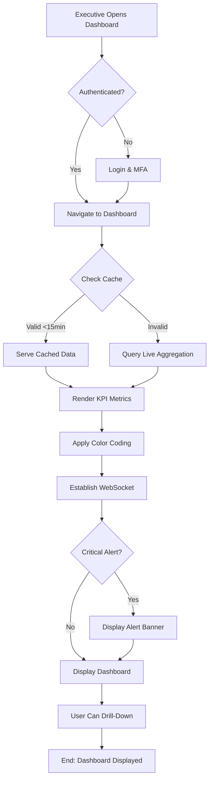

---

### WF-EX-002: Drill-Down into Specific Metrics

**Workflow ID**: WF-EX-002
**Name**: Drill-Down into Specific Metrics
**Priority**: High
**Related User Stories**: US-EX-001, US-EX-002

#### Trigger
- Executive clicks on any KPI metric for detailed view
- Executive selects time period for comparison
- Executive accesses metric history

#### Actors
- Executive (primary)
- Dashboard engine (detail view renderer)
- Data aggregation service
- Audit logging service

#### Steps

1. **Select Metric**
   - Executive clicks on specific KPI metric (e.g., "Safety Score: 88/100")
   - System identifies metric ID and metric category
   - System loads metric configuration and drill-down rules

2. **Query Detail Data**
   - System retrieves detailed breakdown for selected metric
   - Query includes: sub-metrics, contributing factors, location breakdown
   - For safety score: Hard braking, speeding, vehicle defects, driver behavior incidents
   - System maintains read-only access (no ability to modify data)

3. **Apply Time Period Filter**
   - Executive selects time period: Daily, Weekly, Monthly, Quarterly, Annually
   - System recalculates breakdown for selected period
   - Trend analysis shows historical comparison
   - Year-over-year comparison available

4. **Display Detailed Breakdown**
   - Detail panel expands showing:
     - Trend chart (last 12 months)
     - Contributing factors with percentages
     - Location breakdown (which locations driving the metric)
     - Comparison to previous period
     - Comparison to target threshold

5. **Drill-Down Hierarchy**
   - Level 1: High-level KPI (Safety Score: 88/100)
   - Level 2: Contributing categories (4 main categories)
   - Level 3: Location breakdown (52 locations)
   - Level 4: Vehicle type breakdown (within specific location)
   - Cannot drill to driver-level details (privacy protection)

#### Decision Points

| Decision | Condition | Path |
|----------|-----------|------|
| **Can Drill Deeper?** | More detail levels available? | YES: Enable drill-down link; NO: Display leaf data |
| **Time Period Valid?** | Sufficient historical data for period? | YES: Show trend; NO: Display limited history warning |
| **Location Visible?** | User has access to location? | YES: Include in breakdown; NO: Exclude from view |
| **PII Exposure?** | Driver-level data requested? | YES: Block drill-down; NO: Allow drill-down |

#### System Actions

- **Data Retrieval**: Query normalized metric data from analytics database
- **Aggregation**: Compile sub-metric data by location and vehicle type
- **Calculation**: Recompute trend analysis for selected period
- **Caching**: Cache drill-down results for 5 minutes (frequently accessed)
- **Filtering**: Remove any PII or sensitive driver information
- **Logging**: Log drill-down action with metric and timestamp
- **Performance**: Return drill-down data in <5 seconds

#### Notifications

- **On Drill-Down**: No notification (informational action)
- **On Drill-Down Limit Reached**: Information message explaining privacy restrictions
- **On Data Error**: Error message with option to contact support

#### Related Workflows
- WF-EX-001: View Executive Dashboard
- WF-EX-003: Export Dashboard as PDF
- WF-EX-004: Compare Multi-Location Performance

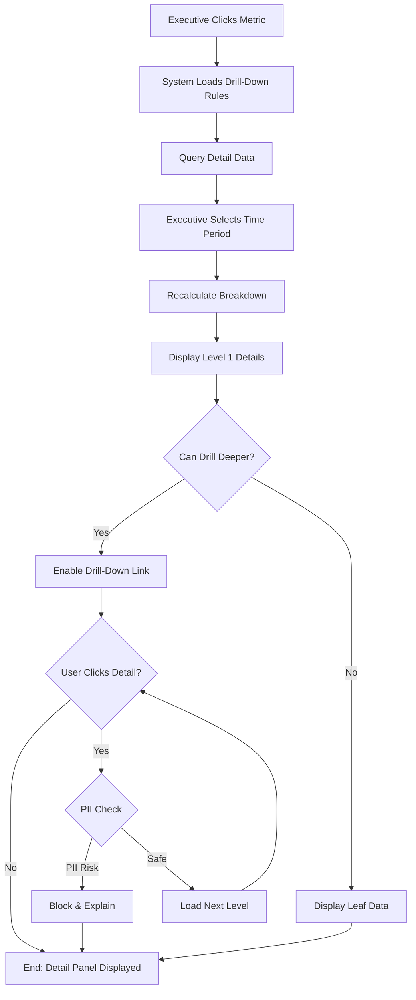

---

### WF-EX-003: Export Dashboard as PDF

**Workflow ID**: WF-EX-003
**Name**: Export Dashboard as PDF
**Priority**: Medium
**Related User Stories**: US-EX-001, US-EX-006

#### Trigger
- Executive clicks "Export" button on dashboard
- Executive selects PDF format
- Executive requests board presentation export

#### Actors
- Executive (primary)
- PDF generation service (wkhtmltopdf)
- File storage service (Azure Blob Storage)
- Email service (SendGrid)

#### Steps

1. **Initiate Export**
   - Executive clicks "Export Dashboard" button
   - System displays export options: PDF, PowerPoint, Excel
   - Executive selects "PDF"

2. **Confirm Export Settings**
   - System displays export dialog:
     - Include executive summary? (YES/NO)
     - Include charts and visualizations? (YES/NO)
     - Include drill-down details? (YES/NO)
     - Include company branding? (YES/NO)
     - Time period to include (current vs. custom date range)

3. **Generate PDF**
   - System queues PDF generation job
   - PDF service retrieves current dashboard data and charts
   - Service generates professional PDF report with:
     - Title page with date and executive name
     - Executive summary section
     - Key metrics with color-coded status
     - Trend charts for critical KPIs
     - Location performance comparison
     - Compliance metrics
     - Footer with report generation time and data freshness
   - Process takes <60 seconds

4. **Store and Deliver**
   - Generated PDF stored in cloud storage (30-day retention)
   - File available for download from system
   - Executive downloads PDF to local device
   - Option to email PDF to other stakeholders

5. **Audit Logging**
   - System logs export action: timestamp, user, format, sections included
   - Maintain audit trail for compliance

#### Decision Points

| Decision | Condition | Path |
|----------|-----------|------|
| **Include Details?** | User selected drill-down details? | YES: Generate multi-page report; NO: Summary only |
| **Company Branding?** | User configured branding template? | YES: Apply template; NO: Standard format |
| **Email Distribution?** | User requested email delivery? | YES: Send to recipients; NO: Download only |
| **PDF Size Large?** | Generated PDF >10MB? | YES: Compress images; NO: Standard export |

#### System Actions

- **Data Snapshot**: Capture current dashboard state at time of export
- **PDF Rendering**: Use wkhtmltopdf to render HTML report to PDF
- **Chart Generation**: Create high-resolution charts for print quality
- **Branding**: Apply company logo, colors, and formatting
- **Metadata**: Embed PDF metadata (author, subject, keywords)
- **Compression**: Optimize PDF for file size while maintaining quality
- **Storage**: Archive PDF for retention period (30 days minimum)
- **Logging**: Record export event with details for audit trail

#### Notifications

- **On Export Started**: Progress indicator shows "Generating PDF..."
- **On Export Complete**: Download link provided, option to email
- **On Export Error**: Error message with option to retry or contact support

#### Related Workflows
- WF-EX-001: View Executive Dashboard
- WF-EX-006: Generate Monthly Executive Summary Report

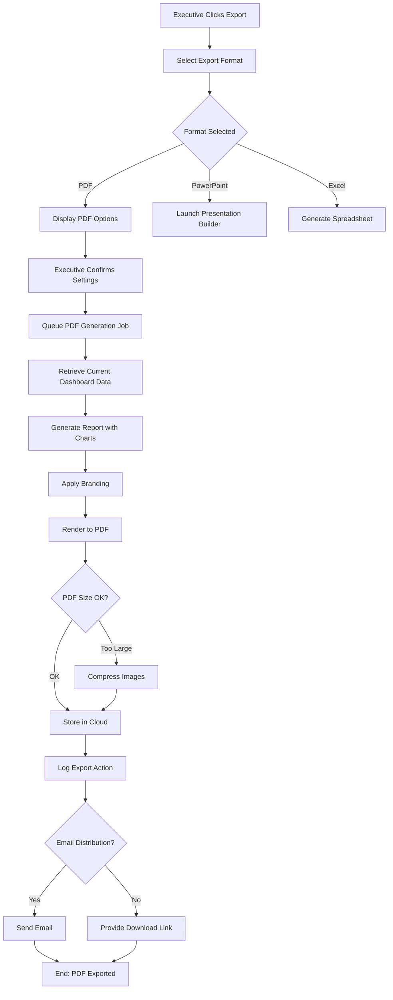

---

### WF-EX-004: Compare Multi-Location Performance

**Workflow ID**: WF-EX-004
**Name**: Compare Multi-Location Performance
**Priority**: High
**Related User Stories**: US-EX-002

#### Trigger
- Executive navigates to "Location Comparison" view
- Executive selects multiple locations for comparison
- Executive applies filters (time period, vehicle type, business unit)

#### Actors
- Executive (primary)
- Analytics engine (multi-location comparison)
- Data aggregation service
- Dashboard visualization service

#### Steps

1. **Access Comparison View**
   - Executive navigates to "Location Comparison" section
   - System loads list of available locations (52 total)
   - Executive has access to assigned business units only

2. **Select Locations**
   - Executive selects locations for comparison
   - Can compare: all locations, specific regions, business units, or custom selection
   - System validates user has access to selected locations

3. **Configure Comparison Metrics**
   - Select metrics to compare: cost per mile, utilization, safety, maintenance, on-time delivery
   - System displays available metrics based on fleet configuration
   - Executive can create custom metric combinations

4. **Apply Filters**
   - Time period: Month, Quarter, Year, or custom date range
   - Vehicle type: All, Light duty, Medium duty, Heavy duty
   - Cost center: All or specific cost centers
   - Status: Active, Inactive, or All

5. **Generate Comparison**
   - System aggregates data for selected locations
   - Calculates metrics for selected period
   - Compares to fleet average and targets
   - Identifies outliers (top and bottom performers)

6. **Display Results**
   - Side-by-side comparison table showing all metrics
   - Heat map visualization highlighting performance gaps
   - Bar charts comparing metrics across locations
   - Ranking table (highest to lowest for each metric)
   - Performance gaps highlighted in red/yellow

7. **Analyze and Export**
   - Executive reviews insights provided by system
   - Can identify best practices from top performers
   - Can drill-down into underperforming locations
   - Export comparison report for leadership meeting

#### Decision Points

| Decision | Condition | Path |
|----------|-----------|------|
| **Access Allowed?** | User has access to selected locations? | YES: Continue; NO: Show access denied message |
| **Sufficient Data?** | Adequate data for selected period? | YES: Generate report; NO: Show data warning |
| **Outliers Found?** | Significant variance from fleet average? | YES: Highlight and flag; NO: Display normally |
| **Drill-Down Requested?** | User clicks on specific location? | YES: Load location details; NO: Remain at comparison |

#### System Actions

- **Data Aggregation**: Compile metrics for each selected location
- **Calculation**: Compute fleet average and variance for each metric
- **Normalization**: Normalize metrics across different location sizes
- **Outlier Detection**: Identify top/bottom performers for each metric
- **Visualization**: Generate heat maps and bar charts
- **Caching**: Cache comparison results for 1 hour
- **Logging**: Record comparison parameters and access
- **Performance**: Return comparison in <5 seconds for up to 20 locations

#### Notifications

- **On Comparison Complete**: Summary card showing key insights
- **On Outlier Detection**: Notification highlighting significant variances
- **On Export**: Success message with file location

#### Related Workflows
- WF-EX-001: View Executive Dashboard
- WF-EX-002: Drill-Down into Specific Metrics
- WF-EX-003: Export Dashboard as PDF

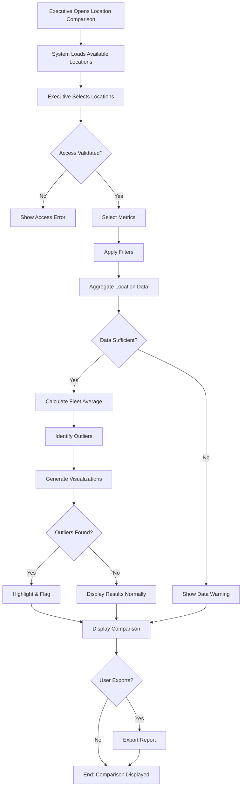

---

## Budget Approval Workflows

### WF-EX-005: Review Budget Variance

**Workflow ID**: WF-EX-005
**Name**: Review Budget Variance
**Priority**: High
**Related User Stories**: US-EX-008

#### Trigger
- Executive opens "Budget Variance" dashboard
- Executive reviews monthly budget vs. actual spending
- System generates monthly variance report (auto-generated on 1st of month)

#### Actors
- Executive (primary)
- Fleet Manager (budget note provider)
- Finance system (budget and actual data)
- Workflow engine (approval routing)

#### Steps

1. **Access Budget Variance Dashboard**
   - Executive navigates to "Budget Variance" section
   - System loads current month variance analysis
   - Time period selector available (current month, YTD, by quarter)

2. **Display Budget Categories**
   - System presents variance for major budget categories:
     - Fuel costs
     - Maintenance and repairs
     - Capital expenses
     - Insurance and licensing
     - Driver and personnel
     - Administrative costs
   - Each category shows: Budget, Actual, Variance $, Variance %

3. **Highlight Significant Variances**
   - System flags variances >10% from budget (positive or negative)
   - Color coding: RED (>15% over), YELLOW (10-15%), GREEN (<10%)
   - Underbudget items shown in blue (cost savings)

4. **Review Fleet Manager Notes**
   - For each flagged variance, display Fleet Manager's explanation
   - Notes describe reasons for variance and corrective actions
   - Executive can view supporting details and drill-down data

5. **Filter and Drill-Down**
   - Filter by location, vehicle type, or cost center
   - Drill-down to transaction level for any category (read-only)
   - View trend analysis (variance over last 3 months)
   - Compare to prior year same period

6. **Analyze Projected Year-End Position**
   - System calculates projected year-end budget position
   - Extrapolates current spending trends to fiscal year end
   - Shows estimated total variance for year
   - Flags if projected overspend will exceed board approval limits

#### Decision Points

| Decision | Condition | Path |
|----------|-----------|------|
| **Variance Significant?** | Variance >10% from budget? | YES: Flag and highlight; NO: Display normally |
| **Overspend Risk?** | Projected year-end variance >10%? | YES: Alert executive; NO: Monitor only |
| **Approval Required?** | Variance >20% and >$100K? | YES: Route to approval; NO: Acknowledge only |
| **Drill-Down Available?** | User has access to supporting data? | YES: Enable drill-down; NO: Disable |

#### System Actions

- **Variance Calculation**: Compute budget variance daily, aggregate to category level
- **Projection**: Extrapolate monthly spending to fiscal year end
- **Flagging**: Apply threshold rules to identify significant variances
- **Trend Analysis**: Calculate 3-month and YoY trends
- **Notation**: Display Fleet Manager explanations for all flagged items
- **Caching**: Cache variance dashboard for 24-hour refresh
- **Logging**: Record all variance reviews and approvals

#### Notifications

- **On Dashboard Load**: Summary showing total variance and top 3 exceptions
- **On Significant Variance**: Alert if any category >20% variance
- **On Approval Request**: Notification if manual approval needed
- **On Year-End Risk**: Warning if projected overspend exceeds limits

#### Related Workflows
- WF-EX-006: Approve Budget Reallocation Request
- WF-EX-007: Approve Capital Expenditure Request

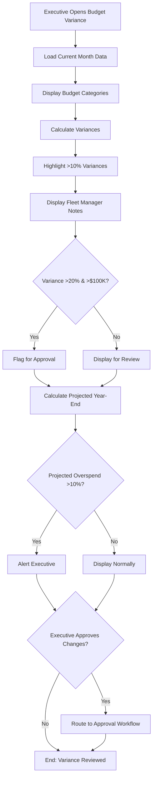

---

### WF-EX-006: Approve Budget Reallocation Request

**Workflow ID**: WF-EX-006
**Name**: Approve Budget Reallocation Request
**Priority**: High
**Related User Stories**: US-EX-008

#### Trigger
- Fleet Manager submits budget reallocation request
- Budget variance exceeds threshold requiring approval
- Executive receives notification of pending approval

#### Actors
- Executive (approver, primary)
- Fleet Manager (requester, secondary)
- Finance system (budget database)
- Workflow engine (routing and approval tracking)
- Notification service

#### Steps

1. **Receive Approval Request**
   - Fleet Manager submits budget reallocation request (from their workflow)
   - System routes request to assigned Executive for approval
   - Executive receives email notification + in-app alert
   - Executive navigates to "Approval Queue" section

2. **Review Reallocation Details**
   - Executive views request with details:
     - From budget category (source of reallocation)
     - To budget category (destination of reallocation)
     - Amount requested
     - Reason/justification from Fleet Manager
     - Impact on both source and destination categories
     - Current variance for both categories

3. **Analyze Business Impact**
   - System provides analysis:
     - Will reallocation resolve identified variance?
     - Impact on projected year-end budget position
     - Available balance in source category
     - Risk assessment (is this the right allocation?)
   - Executive can request additional details from Fleet Manager

4. **Make Approval Decision**
   - Three options: APPROVE, REJECT, REQUEST MORE INFO
   - APPROVE: Confirm button moves forward with reallocation
   - REJECT: Specify reason for rejection (will route back to Fleet Manager)
   - REQUEST MORE INFO: Send request to Fleet Manager with questions

5. **Add Executive Commentary**
   - Optional: Executive adds notes explaining approval decision
   - Notes logged to audit trail
   - Visible to Fleet Manager and Finance team

6. **Execute Reallocation**
   - If APPROVED: System executes budget transfer
   - If REJECTED: System notifies Fleet Manager with reason
   - If MORE INFO: System sends request back to Fleet Manager with timeline
   - All decisions logged with timestamp and executive signature

7. **Confirmation and Notification**
   - Executive receives confirmation of decision
   - Fleet Manager receives notification (approval/rejection/request)
   - Finance team receives notification for budget reconciliation
   - System closes request in approval workflow

#### Decision Points

| Decision | Condition | Path |
|----------|-----------|------|
| **Request Valid?** | All required fields completed? | YES: Display for approval; NO: Return to submitter |
| **Amount Available?** | Sufficient balance in source category? | YES: Proceed; NO: Flag risk and require override |
| **Impact Acceptable?** | Will reallocation improve overall position? | YES: Approve recommended; NO: Note concern |
| **Additional Review?** | Amount >$500K or cross-division? | YES: Require executive sign-off; NO: Standard approval |
| **Audit Required?** | Reallocation violates policy? | YES: Alert compliance; NO: Proceed normally |

#### System Actions

- **Request Validation**: Verify all required information provided
- **Balance Check**: Confirm available balance in source category
- **Impact Analysis**: Calculate impact on source and destination categories
- **Risk Assessment**: Evaluate if reallocation aligns with budget policy
- **Routing**: Route request to correct executive based on amount thresholds
- **Execution**: Transfer budget allocations in financial system
- **Audit Trail**: Log all request details, decision, and timestamp
- **Notification**: Send notifications to all parties (Fleet Manager, Finance, Executive)

#### Notifications

- **On Request Submission**: Executive receives email and in-app notification
- **On Approval**: Fleet Manager notified of approval (email + in-app)
- **On Rejection**: Fleet Manager notified with reason
- **On Request for Info**: Fleet Manager receives request with deadline
- **On Completion**: Finance team notified for budget reconciliation

#### Related Workflows
- WF-EX-005: Review Budget Variance
- WF-EX-007: Approve Capital Expenditure Request
- WF-EX-008: Monitor Budget Alerts

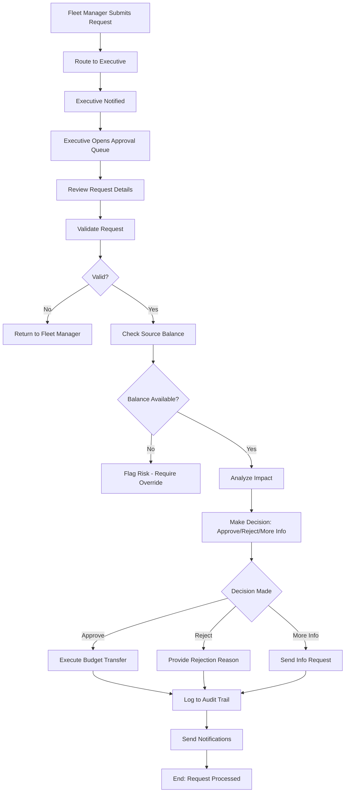

---

### WF-EX-007: Approve Capital Expenditure Request

**Workflow ID**: WF-EX-007
**Name**: Approve Capital Expenditure Request
**Priority**: High
**Related User Stories**: US-EX-009

#### Trigger
- Fleet Manager submits capital expenditure request for vehicles/equipment
- Request exceeds $50,000 approval threshold
- Executive receives capital approval notification

#### Actors
- Executive (approver for >$50K, primary)
- Fleet Manager (requester, secondary)
- Finance system (budget and capital database)
- Procurement team (execution of approved requests)
- Workflow engine (multi-level approval routing)

#### Steps

1. **Receive Capital Request**
   - Fleet Manager submits capital expenditure request (vehicles, equipment, systems)
   - System validates request completeness
   - Routing logic determines approval path:
     - <$50K: Auto-approved by system
     - $50K-$250K: Executive approval required
     - >$250K: Executive + CFO approval required
   - Executive receives notification for requests in their approval tier

2. **Review Request Details**
   - Executive views capital request with:
     - Vehicle/equipment description and specifications
     - Requested amount
     - Business justification and strategic alignment
     - Fleet Manager's ROI analysis and payback period
     - Location/business unit requesting capital
     - Comparison to budget allocation
     - Alternative options considered
     - Implementation timeline

3. **Evaluate Business Case**
   - System provides executive summary of ROI:
     - Projected cost savings (annual)
     - Payback period in months
     - NPV and IRR calculations
     - Risk assessment
   - System highlights alignment with strategic initiatives
   - Budget impact analysis:
     - Available capital budget for this category
     - Impact on total capital plan
     - Year-end capital position if approved

4. **Review Related Requests**
   - System shows related capital requests (same vehicle type, location, or priority)
   - Executive can see approval status of similar requests
   - Helps identify patterns or contradictions

5. **Make Approval Decision**
   - Options: APPROVE, REJECT, DEFER, REQUEST MORE INFO
   - APPROVE: Moves to procurement workflow immediately
   - REJECT: Specify reason (cost, strategic misalignment, timing)
   - DEFER: Schedule for future review with timeline
   - REQUEST MORE INFO: Send back to Fleet Manager with questions

6. **Add Executive Commentary**
   - Optional: Add notes explaining decision rationale
   - Can highlight conditions for approval (e.g., "Approve only if lease cost <$X/month")
   - Notes visible to Fleet Manager and Finance team

7. **Escalate if Needed**
   - If amount >$250K or strategic importance high:
     - System automatically routes for CFO sign-off
     - Executive approval held pending CFO review
     - CFO receives notification with full details

8. **Execute Approved Requests**
   - If APPROVED: Request moves to Procurement workflow
   - Procurement team initiates vendor selection and RFP
   - Budget reserved in capital plan
   - Executive copy provided for tracking

9. **Track Pipeline**
   - Executive can view dashboard of approved capital requests
   - Shows implementation status and timeline
   - Tracks actual spend vs. approved amount

#### Decision Points

| Decision | Condition | Path |
|----------|-----------|------|
| **Auto-Approve?** | Amount <$50K? | YES: Auto-approve, notify; NO: Route for approval |
| **Escalate to CFO?** | Amount >$250K or strategic priority? | YES: Route to CFO; NO: Executive approval final |
| **Budget Available?** | Capital budget available for category? | YES: Approve eligible; NO: Defer or reject |
| **ROI Acceptable?** | Payback period <5 years or strategic priority? | YES: Recommend approval; NO: Query rationale |
| **Strategic Alignment?** | Aligns with fleet modernization/EV/safety plans? | YES: Prioritize; NO: Note misalignment |

#### System Actions

- **Request Validation**: Ensure all required information provided
- **Routing Logic**: Determine approval path based on amount and category
- **ROI Calculation**: Compute payback period, NPV, IRR
- **Budget Check**: Verify capital budget availability
- **Conflict Detection**: Identify related requests that may be redundant
- **Escalation**: Route for CFO approval if required
- **Notification**: Notify all parties of request status
- **Execution**: Move approved requests to procurement workflow
- **Audit Trail**: Log all details, approvals, and conditions
- **Tracking**: Maintain dashboard of approved capital pipeline

#### Notifications

- **On Submission**: Executive receives notification if amount in approval tier
- **On Approval**: Fleet Manager notified (email + in-app)
- **On Rejection**: Fleet Manager notified with reason and resubmission options
- **On Deferral**: Fleet Manager notified with future review timeline
- **On More Info Request**: Fleet Manager receives questions with deadline
- **On CFO Escalation**: CFO notified with all supporting details

#### Related Workflows
- WF-EX-005: Review Budget Variance
- WF-EX-006: Approve Budget Reallocation Request
- WF-FL-003: Submit Capital Expenditure Request (Fleet Manager)

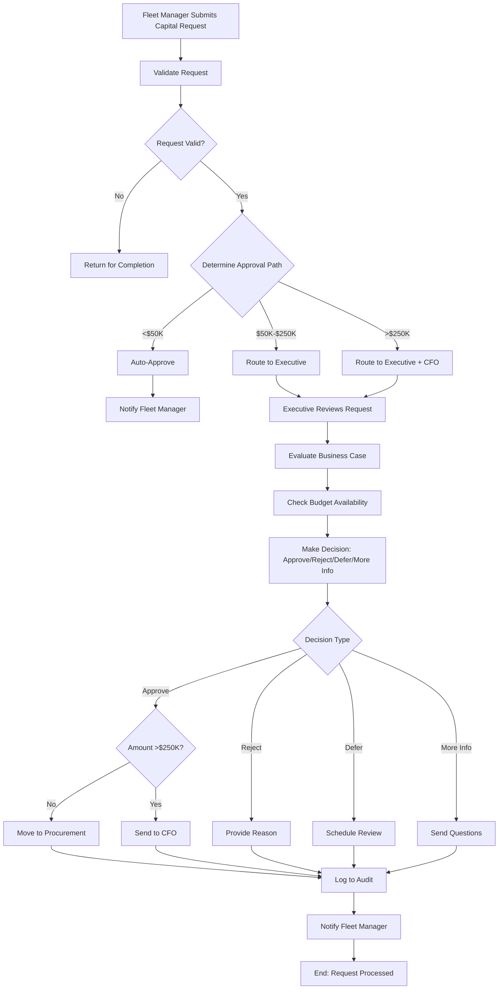

---

## Report Generation Workflows

### WF-EX-008: Generate Monthly Executive Summary Report

**Workflow ID**: WF-EX-008
**Name**: Generate Monthly Executive Summary Report
**Priority**: High
**Related User Stories**: US-EX-006

#### Trigger
- Automatic trigger: First day of each month at 6:00 AM
- Manual trigger: Executive clicks "Generate Report" button
- Executive requests custom month or date range

#### Actors
- Executive (requester, primary)
- Report generation service (template engine, data aggregation)
- Finance system (financial data)
- Analytics engine (KPI calculations)
- PDF/PowerPoint generation service

#### Steps

1. **Initiate Report Generation**
   - System automatically generates report on 1st of month
   - OR Executive manually requests report for specific month
   - System validates date range and data availability

2. **Aggregate Report Data**
   - System pulls data from all relevant systems:
     - Operational KPIs (utilization, safety, compliance)
     - Financial KPIs (costs, variances, ROI)
     - Strategic metrics (initiatives progress, fleet composition)
     - Alert summary (critical incidents, exceptions)
   - Compiles year-to-date and prior year comparisons

3. **Generate Report Sections**
   - **Executive Summary** (1-2 pages):
     - Key highlights and findings
     - Critical metrics summary
     - Major incidents or issues
     - Strategic initiatives status

   - **Key Metrics** (1 page):
     - All KPIs with trend indicators
     - Color-coded status (green/yellow/red)
     - Comparison to target and prior period

   - **Financial Performance** (2-3 pages):
     - Budget vs. actual by category
     - Major variances and explanations
     - Year-end projections
     - Capital spending status

   - **Operational Analysis** (2-3 pages):
     - Safety incident summary
     - Compliance status
     - Maintenance and vehicle status
     - Driver performance highlights/concerns

   - **Strategic Initiatives** (1-2 pages):
     - Progress on major projects (EV transition, safety program, etc.)
     - ROI tracking for completed initiatives
     - Planned initiatives for next quarter

   - **Trend Analysis** (1-2 pages):
     - 12-month trends for key metrics
     - Month-over-month changes
     - Seasonal patterns identified

   - **Appendix** (optional):
     - Detailed data tables
     - Supporting charts and graphs
     - Methodology notes

4. **Add AI-Generated Insights**
   - System generates narrative insights for each section
   - Identifies trends, anomalies, and patterns
   - Provides context and explanation
   - Flags areas requiring executive attention

5. **Format and Brand Report**
   - Apply professional formatting with charts and tables
   - Incorporate company branding (logo, colors, fonts)
   - Add page numbers, headers, footers
   - Insert executive name and report date
   - Create table of contents

6. **Executive Review and Customization**
   - Report saved as draft for executive review
   - Executive can:
     - Accept auto-generated insights
     - Modify narrative text
     - Add custom commentary and notes
     - Select which sections to include
     - Adjust time periods or metrics
   - All changes tracked (audit trail)

7. **Finalize Report**
   - Executive finalizes report (marks as "Ready for Distribution")
   - System locks editing (draft moves to final version)
   - Report timestamped and version-controlled

8. **Export and Distribution**
   - Export to PDF (primary format for board distribution)
   - Export to PowerPoint (for board presentations)
   - Send to selected recipients via email
   - Archive in report repository (1-year retention)

#### Decision Points

| Decision | Condition | Path |
|----------|-----------|------|
| **Automatic Generation?** | First day of month and scheduled time? | YES: Auto-generate; NO: Wait for manual trigger |
| **Data Complete?** | All data sources available and current? | YES: Proceed; NO: Wait for data, notify executive |
| **Insights Valid?** | AI-generated insights reasonable and accurate? | YES: Include; NO: Flag for executive review |
| **Customization Needed?** | Executive requested modifications? | YES: Allow editing; NO: Use defaults |
| **Distribution Requested?** | Executive requested email distribution? | YES: Send to recipients; NO: Download only |

#### System Actions

- **Data Aggregation**: Compile all KPI and financial data for reporting period
- **Calculation**: Compute trends, variances, and comparisons
- **Insight Generation**: Use NLP/analytics to generate narrative insights
- **Formatting**: Apply professional templates and branding
- **Chart Generation**: Create high-quality charts for report sections
- **Editing Interface**: Provide draft editor for executive customization
- **PDF Export**: Generate publication-quality PDF from final report
- **PowerPoint Export**: Create PowerPoint deck with report content
- **Distribution**: Send via email to selected recipients
- **Archival**: Store report in repository with 1-year retention
- **Logging**: Log report generation, customizations, and distribution

#### Notifications

- **On Report Ready**: Executive notified that draft report is ready for review
- **On Report Finalized**: Executive receives confirmation
- **On Distribution**: Confirmation that report emailed to recipients
- **On Error**: If data unavailable or generation fails, executive notified

#### Related Workflows
- WF-EX-001: View Executive Dashboard
- WF-EX-009: Create Board Presentation
- WF-EX-003: Export Dashboard as PDF

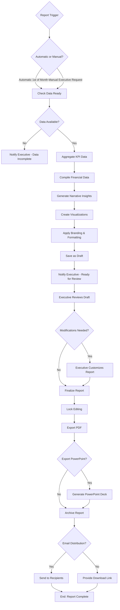

---

### WF-EX-009: Create Board Presentation

**Workflow ID**: WF-EX-009
**Name**: Create Board Presentation
**Priority**: Medium
**Related User Stories**: US-EX-007

#### Trigger
- Executive clicks "Create Presentation" button
- Executive selects presentation template
- Executive prepares for board meeting

#### Actors
- Executive (creator, primary)
- Presentation builder service (slide templates, data integration)
- Chart generation service
- Analytics engine (live data updates)
- PowerPoint export service

#### Steps

1. **Launch Presentation Builder**
   - Executive navigates to "Board Presentation Builder"
   - System displays template library with pre-built options:
     - Board Monthly Review (standard template)
     - Strategic Planning Presentation
     - Capital Approval Presentation
     - Performance Benchmarking Presentation
     - Custom blank template

2. **Select Template or Start from Scratch**
   - Executive selects appropriate template
   - System loads template with placeholder slides
   - All slides populated with current data (auto-updated)

3. **Customize Slide Content**
   - Executive can modify each slide:
     - Title slides: Add custom title, subtitle, date
     - KPI slides: Select which metrics to display, time period
     - Chart slides: Choose chart type, axis labels, data range
     - Comparison slides: Select locations/categories to compare
     - Text slides: Add custom narrative and analysis
   - All changes update data in real-time

4. **Organize Slide Order**
   - Drag-and-drop interface for slide reordering
   - Add custom section dividers
   - Insert blank slides for custom content
   - Delete unnecessary slides
   - System validates presentation structure

5. **Add Speaker Notes**
   - System auto-generates speaker notes for each slide
   - Notes provide key insights and talking points
   - Executive can customize speaker notes
   - Notes not included in presentation output

6. **Review Presentation**
   - Preview presentation in full-screen mode
   - Verify data accuracy and formatting
   - Check chart readability and visual consistency
   - Review slide transitions and animations

7. **Save Presentation Template**
   - Option to save customized presentation as template
   - Template reusable for future board meetings
   - Versioning tracks template updates

8. **Export and Distribute**
   - Export to PowerPoint (.pptx format)
   - Charts are editable in PowerPoint
   - Maintain company branding and design
   - Option to email presentation to board members
   - Archive presentation with meeting notes

#### Decision Points

| Decision | Condition | Path |
|----------|-----------|------|
| **Template Selected?** | User chose template or custom start? | YES: Load template; NO: Ask for template selection |
| **All Data Updated?** | All metrics current for selected period? | YES: Proceed; NO: Show data refresh status |
| **Valid Presentation?** | At least 3 slides and required elements? | YES: Enable export; NO: Show validation errors |
| **Save Template?** | User wants to save for future use? | YES: Save template; NO: Don't save |
| **Distribution Requested?** | User wants to email to board members? | YES: Send email; NO: Download only |

#### System Actions

- **Template Loading**: Load selected presentation template with default content
- **Data Integration**: Populate slides with current KPI and financial data
- **Auto-Refresh**: Update all data in real-time as user customizes
- **Chart Generation**: Create presentation-quality charts with selected metrics
- **Slide Reordering**: Support drag-and-drop slide reorganization
- **Note Generation**: Create speaker notes with key insights for each slide
- **Validation**: Check presentation structure and required elements
- **Template Saving**: Store customized templates for future use
- **Export Service**: Generate PowerPoint file maintaining formatting and data
- **Archival**: Save presentation with metadata (date, creator, recipients)

#### Notifications

- **On Template Load**: Success message with slide count
- **On Data Update**: Real-time update indicators as metrics refresh
- **On Validation Error**: Error messages if required elements missing
- **On Export Complete**: Download link provided, option to email
- **On Template Saved**: Confirmation that template stored for future use

#### Related Workflows
- WF-EX-001: View Executive Dashboard
- WF-EX-008: Generate Monthly Executive Summary Report
- WF-EX-003: Export Dashboard as PDF

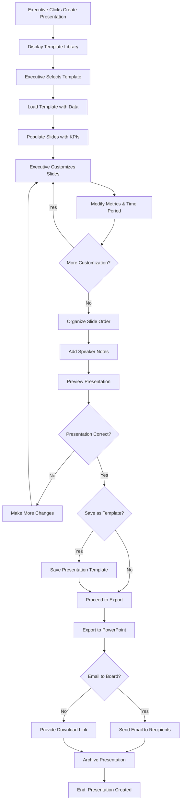

---

## Strategic Planning Workflows

### WF-EX-010: Monitor Real-Time Alerts

**Workflow ID**: WF-EX-010
**Name**: Monitor Real-Time Alerts
**Priority**: High
**Related User Stories**: US-EX-003

#### Trigger
- Critical fleet event occurs (accident, compliance violation, budget overrun)
- System detects condition matching executive alert threshold
- Alert pushed to executive via multiple channels

#### Actors
- Executive (alert recipient, primary)
- Alert detection system (rules engine)
- Notification service (email, SMS, push notifications)
- Telematics/operational system (event source)

#### Steps

1. **Alert Condition Detected**
   - System monitors operational and financial data continuously
   - Detects events matching alert thresholds:
     - Major accidents (severity >Level 2)
     - Regulatory violations (DOT, HOS, safety)
     - Critical equipment failures
     - Budget overruns >20% in any category
     - Safety score drops >5 points
   - System classifies alert by severity (Critical, High, Medium)

2. **Route Alert to Executive**
   - System determines if alert requires executive attention
   - Severity rule: Critical and High alerts routed to executive
   - Medium alerts go to Fleet Manager only
   - System identifies appropriate recipient based on incident location/type
   - Concurrent notifications:
     - Push notification (if enabled)
     - Email notification
     - SMS for critical alerts only
     - In-app notification on next dashboard access

3. **Alert Notification Delivery**
   - **Push Notification**: Immediate alert via mobile/desktop app (if enabled)
     - Short message: "CRITICAL: Vehicle #247 accident at I-95, Mile 47"
     - Alert action: Tap to view details

   - **Email Notification**: Summary email with:
     - Alert severity and type
     - Key incident details
     - Actions taken by system
     - Link to full incident details

   - **SMS Alert**: Text message for critical incidents only
     - Brief summary with incident code and reference number
     - Link to web application

   - **In-App Alert**: Banner displayed on dashboard
     - Prominent alert box at top of page
     - Alert summary with dismiss option
     - Link to full incident details

4. **Executive Views Alert Details**
   - Executive clicks alert link (from notification or dashboard)
   - System displays detailed alert view:
     - Incident type and classification
     - Timestamp and location
     - Vehicle and driver information (if applicable)
     - Incident summary and description
     - Actions already taken by system/operations team
     - Recommended next steps
     - Related incidents (if pattern detected)
   - Data displayed in read-only format

5. **Alert Acknowledgment**
   - Executive can acknowledge alert (mark as "Acknowledged")
   - System timestamps acknowledgment
   - Acknowledgment logged to audit trail
   - Executive cannot resolve alert (operational teams only)
   - Executive can add note to alert if needed

6. **Alert History and Filtering**
   - Executive can access alert history dashboard
   - Filter alerts by:
     - Severity level (Critical, High, Medium)
     - Type (accident, compliance, budget, safety)
     - Date range
     - Location or vehicle
   - Status filtering (new, acknowledged, resolved)

7. **Alert Configuration**
   - Executive can configure personal alert preferences:
     - Which alert types to receive
     - Notification channels (push, email, SMS)
     - Quiet hours (no alerts during specific times)
     - Threshold customization (if allowed by policy)

#### Decision Points

| Decision | Condition | Path |
|----------|-----------|------|
| **Alert to Executive?** | Severity Critical or High? | YES: Route to executive; NO: Route to Fleet Manager |
| **Multiple Channels?** | Severity Critical? | YES: Push + Email + SMS; NO: Push + Email only |
| **SMS Required?** | Alert type = major accident or compliance violation? | YES: Send SMS; NO: Email and push only |
| **Related Alerts?** | Similar incidents in past 7 days? | YES: Flag as pattern; NO: Isolated incident |
| **Escalation Needed?** | Multiple critical alerts in short timeframe? | YES: Route to CFO/board; NO: Executive only |

#### System Actions

- **Event Detection**: Continuously monitor operational and financial metrics
- **Threshold Evaluation**: Compare events against alert rules
- **Severity Classification**: Assign severity level based on incident type
- **Routing Logic**: Determine appropriate recipients based on incident characteristics
- **Notification Dispatch**: Send notifications via all enabled channels
- **Incident Logging**: Record alert details in incident management system
- **Audit Trail**: Log all alert activities (creation, notification, acknowledgment)
- **Pattern Detection**: Identify if similar incidents occurring frequently
- **Escalation**: Auto-escalate if multiple critical alerts in short period
- **Archival**: Store alert history for compliance and analysis

#### Notifications

- **On Alert Generation**: Immediate notification via all configured channels
- **On Acknowledgment**: Confirmation message to executive
- **On Related Alert**: Notification if additional related incident detected
- **On Escalation**: Alert escalated to CFO/board if pattern detected
- **On Resolution**: Notification when incident marked as resolved by operations

#### Related Workflows
- WF-EX-001: View Executive Dashboard
- WF-EX-011: Analyze Fleet Forecasting

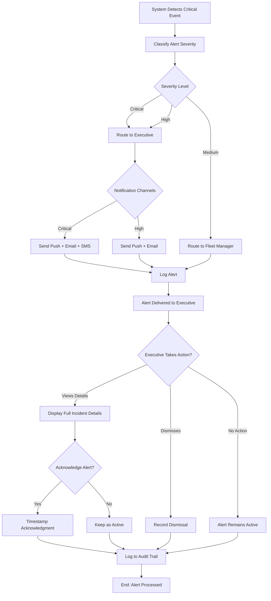

---

### WF-EX-011: Analyze Fleet Forecasting

**Workflow ID**: WF-EX-011
**Name**: Analyze Fleet Forecasting
**Priority**: Medium
**Related User Stories**: US-EX-005

#### Trigger
- Executive opens "Fleet Forecast" dashboard
- System auto-generates quarterly forecast update
- Executive adjusts forecast assumptions for scenario analysis

#### Actors
- Executive (analyst, primary)
- Forecasting engine (time-series model, scenario modeling)
- Historical data repository
- Analytics visualization service

#### Steps

1. **Access Forecasting Dashboard**
   - Executive navigates to "Fleet Forecast" section
   - System loads 3-5 year forecast dashboard
   - Default scenario: "Base Case" (moderate growth assumptions)

2. **Display Forecast Overview**
   - System displays key forecast metrics:
     - **Fleet Costs**: Projected total annual costs 3-5 years out
     - **Fleet Size**: Projected number of vehicles at future dates
     - **Fleet Composition**: Projected vehicle type mix (ICE vs EV, truck vs van)
     - **Capital Requirements**: Projected capital spending by category
     - **Emissions**: Projected CO2 and other emissions by vehicle type
   - All metrics include confidence intervals (80%, 95%)

3. **Review Forecast Assumptions**
   - System displays key assumptions underlying forecast:
     - **Growth Rate**: 2% annual growth (adjustable)
     - **Inflation**: 3.5% annual inflation (adjustable)
     - **Fuel Prices**: $3.20/gallon (adjustable by type)
     - **EV Transition**: 20% fleet EV by 2030 (adjustable)
     - **Maintenance Costs**: Based on historical trends + inflation
     - **Driver Costs**: Salary/benefit growth aligned with inflation
     - **Regulatory Changes**: Known future regulations incorporated

4. **Select Forecast Scenario**
   - Executive selects scenario to analyze:
     - **Base Case**: Moderate growth, current trends continue
     - **Conservative**: 1% growth, higher cost assumptions
     - **Aggressive**: 4% growth, EV transition faster
     - **Custom**: User adjusts assumptions for specific scenario
   - System recalculates forecast with selected assumptions

5. **Adjust Forecast Assumptions**
   - Executive can modify key assumptions (only for custom scenario):
     - Growth rate (slider: 0.5% to 5%)
     - Inflation rate (slider: 1.5% to 5%)
     - Fuel prices (by fuel type: gasoline, diesel, EV)
     - EV adoption target (slider: 0% to 100%)
     - Capital expenditure priorities
     - Driver retention rates
   - Real-time recalculation as assumptions change
   - Visual impact on all forecast metrics

6. **Analyze Forecast Components**
   - Executive can drill into any forecast component:
     - **Cost Breakdown**: Fuel, maintenance, capital, labor, other
     - **Fleet Composition**: By vehicle type and age
     - **Location Breakdown**: By region or business unit
     - **Initiative Impact**: Quantifies impact of planned initiatives (EV, safety program, automation)

7. **Compare Scenarios**
   - Executive can view side-by-side comparison of scenarios
   - Scenario comparison shows:
     - 5-year total cost for each scenario
     - Year-by-year differences
     - Key metric differences (e.g., EV adoption percentage)
     - Financial impact of each scenario
     - Risk assessment (downside vs. upside potential)

8. **Export Forecast**
   - Executive exports forecast for strategic planning:
     - Excel spreadsheet with detailed numbers and assumptions
     - PDF presentation with charts and executive summary
     - PowerPoint deck for board presentation
     - JSON export for integration with other systems

9. **Save Custom Scenario**
   - Executive can save custom scenario for future reference
   - Assign scenario name and description
   - System tracks who created scenario and when
   - Scenario available for team collaboration

#### Decision Points

| Decision | Condition | Path |
|----------|-----------|------|
| **Sufficient Historical Data?** | Minimum 24 months of data available? | YES: Generate forecast; NO: Show data warning |
| **Assumptions Reasonable?** | Assumptions within policy bounds? | YES: Accept; NO: Show validation error |
| **Scenario Valid?** | Scenario parameters make business sense? | YES: Calculate; NO: Flag and ask user to confirm |
| **Uncertainty High?** | Confidence interval >30%? | YES: Flag as high uncertainty; NO: Normal forecast |
| **Export Format?** | User selected export format? | YES: Generate; NO: Default to PDF |

#### System Actions

- **Data Aggregation**: Compile 24+ months of historical data
- **Forecasting Model**: Run time-series model (ARIMA, Prophet, or ML-based)
- **Assumption Application**: Apply user assumptions to modify baseline forecast
- **Sensitivity Analysis**: Calculate impact of ±10% changes to key assumptions
- **Scenario Calculation**: Recalculate forecast for selected/custom scenario (real-time)
- **Visualization Generation**: Create charts showing forecast trends
- **Drill-Down Preparation**: Prepare data for component-level analysis
- **Comparison Analysis**: Calculate differences between scenarios
- **Export Generation**: Create Excel, PDF, PowerPoint, and JSON exports
- **Scenario Storage**: Save custom scenarios with metadata
- **Versioning**: Track forecast versions with date and creator
- **Audit Trail**: Log all forecast access and modifications

#### Notifications

- **On Forecast Updated**: Quarterly notification when new actual data incorporated
- **On Assumption Change**: Visual confirmation of recalculation as assumptions adjust
- **On High Uncertainty**: Flag if confidence interval exceeds 30%
- **On Export Complete**: Download link provided, option to email

#### Related Workflows
- WF-EX-001: View Executive Dashboard
- WF-EX-008: Generate Monthly Executive Summary Report
- WF-EX-010: Monitor Real-Time Alerts

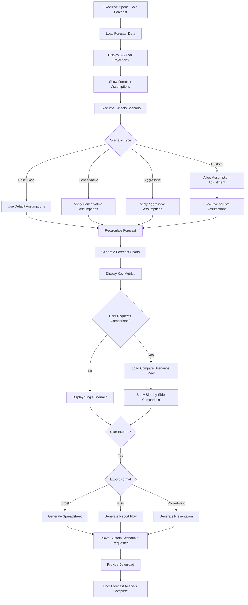

---

### WF-EX-012: Track Strategic Initiatives ROI

**Workflow ID**: WF-EX-012
**Name**: Track Strategic Initiatives ROI
**Priority**: Medium
**Related User Stories**: US-EX-004

#### Trigger
- Executive opens "Strategic Initiatives" dashboard
- Executive reviews ROI analysis for major investments
- System generates quarterly ROI update

#### Actors
- Executive (analyst, primary)
- Finance system (cost data, savings tracking)
- Analytics engine (ROI calculations)
- Initiative tracking system

#### Steps

1. **Access Strategic Initiatives Dashboard**
   - Executive navigates to "Strategic Initiatives" section
   - System loads list of active and completed initiatives
   - Default view: Active initiatives with progress tracking

2. **Display Initiative Portfolio**
   - System shows portfolio of initiatives:
     - **Status**: Planning, In-Progress, On-Hold, Completed, Cancelled
     - **Category**: Vehicle acquisition, EV transition, safety program, automation, efficiency
     - **Timeline**: Planned start/end dates, actual start/end dates
     - **Investment**: Total planned investment and actual spend to date
     - **Progress**: % complete based on milestones achieved

3. **View Initiative Details**
   - For each initiative, display:
     - Detailed description and business justification
     - Strategic alignment (which goals does it support)
     - Planned budget and actual spend to date
     - Timeline: Planned vs. actual schedule
     - Key milestones and status
     - Risk assessment and mitigation status
     - Team members responsible

4. **Review ROI Analysis**
   - System provides ROI analysis for each initiative:
     - **Projected Savings**: Estimated annual cost savings when fully implemented
     - **Total Investment**: Capital and implementation costs
     - **Payback Period**: Months to recover investment (projected)
     - **Net Present Value (NPV)**: 5-year NPV using company discount rate
     - **Internal Rate of Return (IRR)**: Effective return rate
     - **Actual Savings to Date**: For completed initiatives, track actual savings realized

5. **Compare Projected vs. Actual**
   - For completed initiatives:
     - Compare projected ROI vs. actual realized ROI
     - Flag if actual ROI significantly different from projection
     - Analyze reasons for variance
     - Update projection model for future initiatives

   - For in-progress initiatives:
     - Project trajectory to completion
     - Forecast ROI based on current progress
     - Flag if forecast shows project may miss ROI targets

6. **Analyze Initiative Drivers**
   - System provides breakdown of cost savings by driver:
     - Fuel savings (from efficiency improvements or EV transition)
     - Maintenance savings (from newer vehicles, predictive maintenance)
     - Labor savings (from automation or process improvements)
     - Insurance/compliance savings (from safety improvements)
     - Revenue impact (from improved delivery performance)

7. **Scenario Analysis**
   - Executive can run scenario analysis:
     - "What if EV transition accelerated to 30% by 2027?"
     - "What if fuel prices drop 20%? Impact on ROI?"
     - "What if safety program results in 15% fewer incidents?"
   - System recalculates ROI impact of scenario changes

8. **Track Initiative Progress**
   - Dashboard shows progress toward completion:
     - Milestone tracking (completed vs. remaining)
     - Budget tracking (planned vs. actual spend)
     - Schedule tracking (planned vs. actual timeline)
     - Risk status (risks mitigated, new risks identified)

9. **Export ROI Reports**
   - Executive exports ROI analysis:
     - PDF report for board presentations
     - Excel spreadsheet with detailed calculations
     - PowerPoint with charts and analysis
   - Reports include methodology and assumption transparency

#### Decision Points

| Decision | Condition | Path |
|----------|-----------|------|
| **Initiative Status?** | Active, Completed, or On-Hold? | YES: Show appropriate view; NO: Exclude from list |
| **ROI Calculation Valid?** | Sufficient historical data for projection? | YES: Display ROI; NO: Show provisional estimate |
| **Actual ROI Achievable?** | Trajectory shows project will meet targets? | YES: Display green status; NO: Flag yellow/red |
| **Risk Escalation?** | Schedule or budget at risk? | YES: Escalate to executive; NO: Monitor normally |
| **Scenario Reasonable?** | Assumptions make business sense? | YES: Calculate; NO: Show validation error |

#### System Actions

- **Initiative Loading**: Retrieve all strategic initiatives from project management system
- **Status Tracking**: Calculate status based on milestone completion
- **Budget Tracking**: Monitor actual spend vs. planned budget
- **ROI Calculation**: Calculate projected NPV, IRR, payback period
- **Savings Tracking**: Track actual cost savings for completed initiatives
- **Variance Analysis**: Compare projected vs. actual ROI
- **Scenario Modeling**: Recalculate ROI with user-modified assumptions
- **Report Generation**: Create PDF and Excel exports with full analysis
- **Audit Trail**: Log all ROI analysis and scenario runs
- **Archival**: Store ROI reports for historical comparison

#### Notifications

- **On Initiative Completion**: Notification when initiative moved to completed status
- **On ROI Target Miss**: Alert if project trajectory shows will miss ROI targets
- **On Budget Overrun**: Alert if actual spend exceeds budget by >10%
- **On Schedule Slip**: Alert if project behind schedule by >2 weeks
- **On Export Complete**: Confirmation that report generated and available for download

#### Related Workflows
- WF-EX-001: View Executive Dashboard
- WF-EX-011: Analyze Fleet Forecasting
- WF-EX-008: Generate Monthly Executive Summary Report

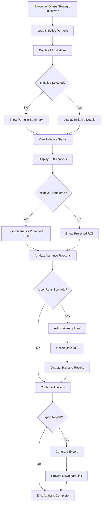

---

## Workflow Index Summary

### Quick Reference Table

| ID | Name | Priority | Trigger | Related Epic |
|---|---|---|---|---|
| **WF-EX-001** | View Executive Dashboard | High | App open, periodic refresh | KPI Monitoring |
| **WF-EX-002** | Drill-Down into Specific Metrics | High | Executive clicks metric | KPI Monitoring |
| **WF-EX-003** | Export Dashboard as PDF | Medium | Executive clicks export | KPI Monitoring |
| **WF-EX-004** | Compare Multi-Location Performance | High | View location comparison | KPI Monitoring |
| **WF-EX-005** | Review Budget Variance | High | Open budget dashboard | Budget Approval |
| **WF-EX-006** | Approve Budget Reallocation Request | High | Fleet Manager submits request | Budget Approval |
| **WF-EX-007** | Approve Capital Expenditure Request | High | Request >$50K submitted | Budget Approval |
| **WF-EX-008** | Generate Monthly Executive Summary Report | High | 1st of month or manual trigger | Report Generation |
| **WF-EX-009** | Create Board Presentation | Medium | Executive clicks create | Report Generation |
| **WF-EX-010** | Monitor Real-Time Alerts | High | Critical event detected | Monitoring |
| **WF-EX-011** | Analyze Fleet Forecasting | Medium | Open forecast dashboard | Strategic Planning |
| **WF-EX-012** | Track Strategic Initiatives ROI | Medium | Open initiatives dashboard | Strategic Planning |

### Workflow Complexity Matrix

| Complexity | Workflows | Characteristics |
|---|---|---|
| **Simple** | WF-EX-001, WF-EX-002, WF-EX-003, WF-EX-010 | Read-only, <5 key decision points, <2 minutes typical time |
| **Moderate** | WF-EX-004, WF-EX-005, WF-EX-008, WF-EX-009, WF-EX-011, WF-EX-012 | May involve customization, 5-8 decision points, 5-15 minutes typical time |
| **Complex** | WF-EX-006, WF-EX-007 | Multi-step approvals, 8+ decision points, cross-system integration, >15 minutes typical time |

### Workflow Integration Map

```
KPI Monitoring Workflows:
├── WF-EX-001: View Dashboard (primary)
├── WF-EX-002: Drill-Down (dependent on 001)
├── WF-EX-003: Export PDF (dependent on 001)
└── WF-EX-004: Location Comparison (dependent on 001)

Budget & Approval Workflows:
├── WF-EX-005: Review Variance (monitoring)
├── WF-EX-006: Budget Reallocation (dependent on 005)
└── WF-EX-007: Capital Approval (dependent on 005)

Report Generation Workflows:
├── WF-EX-008: Monthly Report (data aggregation)
├── WF-EX-009: Board Presentation (uses 008 data)
└── WF-EX-003: Export Dashboard (related to 008)

Strategic Planning Workflows:
├── WF-EX-010: Real-Time Alerts (monitoring)
├── WF-EX-011: Fleet Forecasting (analysis)
└── WF-EX-012: Initiative ROI (tracking)

Cross-Workflow Dependencies:
└── All workflows dependent on: Authentication (MFA), Role-Based Access Control (RBAC)
```

---

## Key Workflow Characteristics

### Access Control
- **Read-Only**: WF-EX-001, WF-EX-002, WF-EX-003, WF-EX-004, WF-EX-005, WF-EX-008, WF-EX-010, WF-EX-011, WF-EX-012
- **Approval Actions**: WF-EX-006, WF-EX-007
- **MFA Required**: All workflows
- **Session Timeout**: 4 hours (all workflows)

### Performance Requirements
- **Dashboard Load**: <2 seconds (WF-EX-001)
- **Drill-Down**: <5 seconds (WF-EX-002)
- **Report Generation**: <60 seconds (WF-EX-008)
- **Comparison Analysis**: <5 seconds for 20 locations (WF-EX-004)
- **Real-Time Alerts**: Instant delivery (WF-EX-010)

### Data Freshness
- **KPI Metrics**: 15-minute cache refresh
- **Financial Data**: Daily overnight batch
- **Real-Time Alerts**: Immediate (no caching)
- **Location Comparisons**: Hourly aggregation

### Notification Channels
- **Email**: Standard for all notifications
- **SMS**: Critical alerts only (WF-EX-010)
- **Push**: High and critical severity (WF-EX-010)
- **In-App**: All workflows except WF-EX-010 (push/email only)

### Audit & Compliance
- **Logged Actions**: All user actions and approvals
- **Retention**: Minimum 12 months (3 years for approvals)
- **SOC 2**: All executive workflows SOC 2 Type II compliant
- **GDPR**: No PII exposure (driver names/personal info redacted)

---

## Related Documentation

- **User Stories**: `user-stories/08_EXECUTIVE_USER_STORIES.md`
- **Use Cases**: `use-cases/08_EXECUTIVE_USE_CASES.md`
- **Test Cases**: `test-cases/08_EXECUTIVE_TEST_CASES.md`
- **User Roles**: `USER_ROLES_OVERVIEW.md`
- **API Endpoints**: `api/EXECUTIVE_API_ENDPOINTS.md`

---

*Document Version*: 1.0
*Last Updated*: November 10, 2025
*Next Review*: December 10, 2025

*Next: System Administrator Workflows (if required)*
*Previous: Accountant/Finance Manager Workflows*
