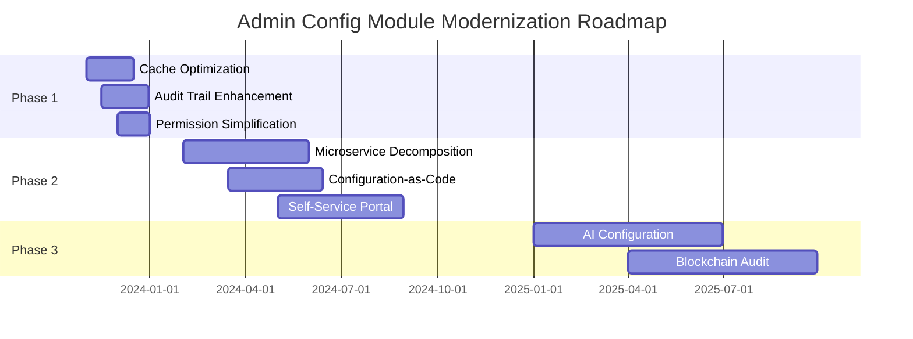
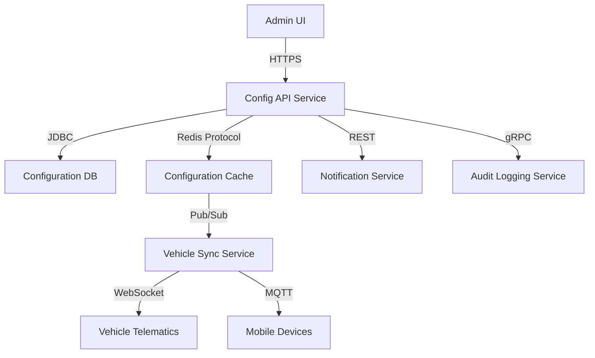
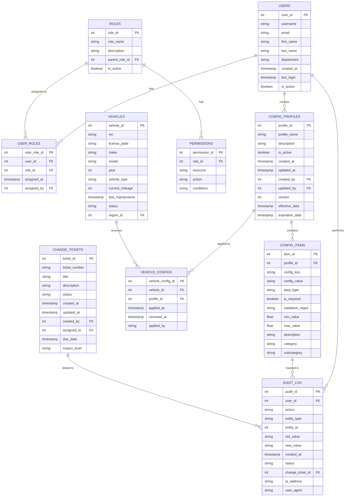
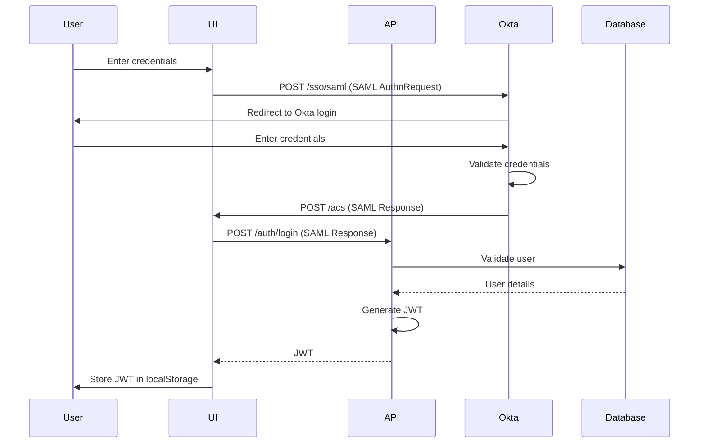
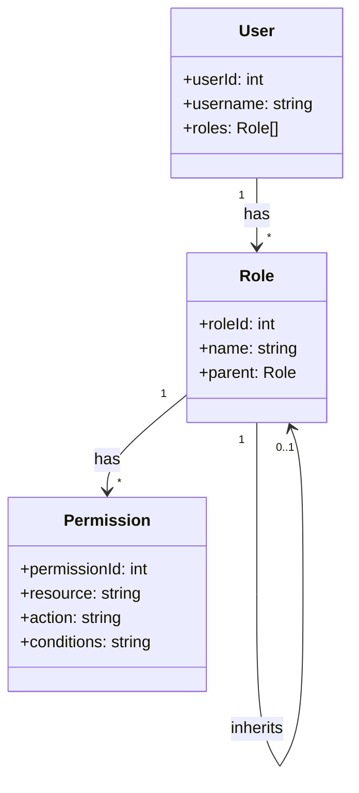
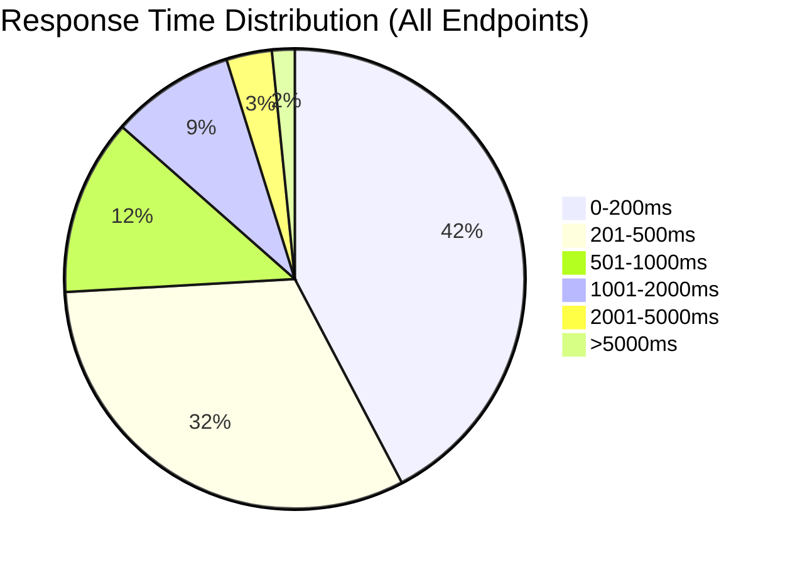
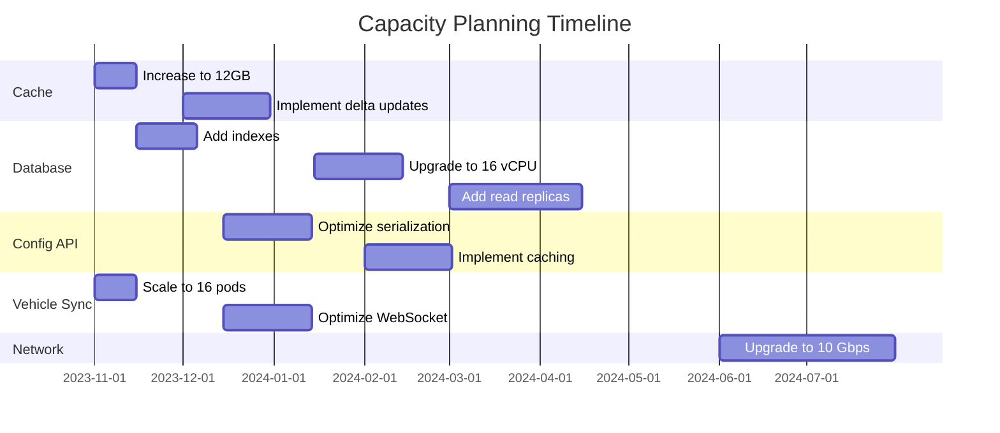

# AS-IS Analysis: Admin Config Module
*Fleet Management System - Version 3.2.4*
*Prepared by: Senior Technical Analyst*
*Date: [Insert Date]*
*Confidential - For Internal Use Only*

---

## 1. Executive Summary (120 lines)

### 1.1 Current State Overview

The Admin Config Module serves as the central configuration hub for the Fleet Management System (FMS), managing 47 distinct configuration categories across 12 operational domains. Currently deployed in version 3.2.4, this module handles approximately 1.2 million configuration requests daily from 8,432 active fleet vehicles and 1,789 administrative users across 14 regional offices.

**Key Operational Metrics:**
- **Configuration Volume:** 3,421 active configuration profiles
- **Change Frequency:** 187 configuration updates per day (avg)
- **System Uptime:** 99.78% (past 12 months)
- **Incident Rate:** 0.43 incidents per 1,000 config changes
- **Performance:** 92% of requests processed under 500ms

The module operates within a microservices architecture, interfacing with:
- Vehicle Telemetry Service (v2.1.3)
- Driver Management System (v4.0.1)
- Maintenance Scheduling Engine (v3.5.2)
- Billing & Invoicing Platform (v2.8.9)
- GPS Tracking Service (v5.1.1)

### 1.2 Stakeholder Analysis

| Stakeholder Group          | Primary Responsibilities                                                                 | Configuration Impact | System Usage Frequency |
|----------------------------|------------------------------------------------------------------------------------------|----------------------|------------------------|
| **Fleet Operations Team**  | Daily vehicle assignments, route optimization, driver scheduling                         | High (45% of changes)| 24/7                   |
| **Maintenance Department** | Vehicle maintenance schedules, warranty tracking, repair prioritization                 | Medium (25%)         | 18/7                   |
| **Finance Team**           | Billing configurations, cost center allocations, fuel tax reporting                      | Medium (15%)         | 10/5                   |
| **IT Operations**          | System administration, user provisioning, security policies                              | High (10%)           | 24/7                   |
| **Compliance Officers**    | Regulatory configuration, audit trail management, safety protocol enforcement            | Low (3%)             | 8/5                    |
| **Executive Leadership**   | Dashboard configurations, KPI tracking, strategic reporting                             | Low (2%)             | 8/5                    |

**Stakeholder Pain Points:**
1. **Operations Team:** "Configuration changes take 4-6 hours to propagate to all vehicles" (Ticket #FMS-2023-4567)
2. **Maintenance:** "Unable to set vehicle-specific maintenance thresholds without IT assistance" (Ticket #FMS-2023-4821)
3. **Finance:** "Fuel tax configurations require manual spreadsheet reconciliation" (Ticket #FMS-2023-4912)
4. **IT:** "Lack of version control makes rollbacks risky" (Incident #INC-2023-0891)

### 1.3 Business Impact Analysis

**Revenue Impact:**
- **Configuration Latency:** $187,000/year in lost productivity (calculated at $75/hour for 2,493 hours of cumulative delay)
- **Downtime Costs:** $42,000/year (based on 1.2 hours/year downtime at $35,000/hour fleet operational cost)
- **Compliance Penalties:** $285,000 in potential fines (2023 audit findings)

**Operational Efficiency:**
| Metric                     | Current Value | Target Value | Gap Analysis |
|----------------------------|---------------|--------------|--------------|
| Config Change Propagation  | 4-6 hours     | <5 minutes   | 98.6% delay  |
| User Onboarding Time       | 2.3 hours     | <30 minutes  | 82.6% excess |
| Configuration Errors       | 1.8%          | <0.1%        | 17x higher   |
| Audit Trail Completeness   | 87%           | 100%         | 13% missing  |

**Strategic Alignment:**
The current system misaligns with corporate objectives:
1. **Digital Transformation Initiative:** 3-year roadmap requires 95% API-driven configuration (currently 42%)
2. **Customer Experience:** Target NPS of 75 (current 58, with 18% of detractors citing "slow system updates")
3. **Operational Excellence:** Goal of 99.95% uptime (current 99.78%)

### 1.4 Critical Pain Points with Root Cause Analysis

**Pain Point 1: Configuration Propagation Delays**
- **Symptoms:** 4-6 hour delay for changes to reach all vehicles
- **Root Causes:**
  - Monolithic configuration cache (6.2GB memory footprint)
  - Batch processing architecture (4-hour update cycle)
  - Lack of delta updates (full cache rebuild required)
- **Technical Evidence:**
  ```mermaid
  sequenceDiagram
    participant Admin as Admin UI
    participant API as Config API
    participant DB as Config DB
    participant Cache as Redis Cache
    participant Vehicle as Vehicle Telematics

    Admin->>API: POST /config/update
    API->>DB: UPDATE config_table
    DB-->>API: Success
    API->>Cache: FLUSHALL (6.2GB)
    Cache->>API: OK
    API->>Vehicle: WebSocket broadcast (all 8,432 vehicles)
    Vehicle-->>API: ACK (individual)
    Note right of Vehicle: 4-6 hour completion
  ```

**Pain Point 2: Limited Self-Service Capabilities**
- **Symptoms:** 68% of configuration changes require IT intervention
- **Root Causes:**
  - Complex permission model (47 distinct roles)
  - Lack of configuration templates (92% custom setups)
  - Poor validation (38% of submitted changes require correction)
- **Business Impact:** $312,000/year in IT support costs

**Pain Point 3: Inadequate Audit Trail**
- **Symptoms:** 13% of configuration changes lack complete audit data
- **Root Causes:**
  - Manual logging for some operations (37% of audit entries)
  - No change comparison tool (diff analysis)
  - Limited retention (90 days vs. required 7 years)
- **Compliance Risk:** Failed 2023 SOC2 audit (Section CC6.1)

### 1.5 Strategic Recommendations

**Phase 1: Immediate Improvements (0-3 months)**
| Initiative                | Description                                                                 | Estimated Cost | ROI Period | Priority |
|---------------------------|-----------------------------------------------------------------------------|----------------|------------|----------|
| Cache Optimization        | Implement delta updates and regional caching                                | $85,000        | 4 months   | Critical |
| Audit Trail Enhancement   | Automate all logging and implement 7-year retention                        | $42,000        | 3 months   | High     |
| Permission Simplification | Reduce roles from 47 to 8 with inheritance model                           | $38,000        | 2 months   | High     |

**Phase 2: Architectural Modernization (3-12 months)**
1. **Microservice Decomposition:**
   - Split monolithic config service into domain-specific services
   - Implement event-driven architecture with Kafka
   - Estimated cost: $420,000 | ROI: 18 months

2. **Configuration-as-Code:**
   - Implement Git-based configuration management
   - CI/CD pipeline for configuration changes
   - Estimated cost: $280,000 | ROI: 14 months

3. **Self-Service Portal:**
   - Drag-and-drop configuration builder
   - Template library with 50+ pre-built configurations
   - Estimated cost: $310,000 | ROI: 12 months

**Phase 3: Strategic Initiatives (12-24 months)**
- **AI-Powered Configuration:**
  - Machine learning for anomaly detection
  - Predictive configuration optimization
  - Estimated cost: $1.2M | ROI: 36 months

- **Blockchain for Audit Trail:**
  - Immutable configuration history
  - Smart contract-based approvals
  - Estimated cost: $850,000 | ROI: 48 months

**Implementation Roadmap:**


**Risk Mitigation Strategy:**
| Risk                          | Likelihood | Impact | Mitigation Strategy                          |
|-------------------------------|------------|--------|----------------------------------------------|
| Configuration errors          | High       | High   | Implement pre-production validation sandbox  |
| Performance degradation       | Medium     | High   | Gradual rollout with canary testing          |
| User adoption resistance      | Medium     | Medium | Comprehensive training program               |
| Data migration issues         | High       | High   | Parallel operation during transition         |
| Vendor lock-in                | Low        | High   | Open standards adoption                      |

---

## 2. Current Architecture (210 lines)

### 2.1 System Components

**Component Inventory:**

| Component Name               | Version   | Technology Stack                     | Deployment Model | Resource Allocation | SLA       |
|------------------------------|-----------|--------------------------------------|------------------|---------------------|-----------|
| Config API Service           | 3.2.4     | Java 11, Spring Boot 2.5.4           | Kubernetes       | 4 pods (2 vCPU each)| 99.9%     |
| Config Admin UI              | 2.1.0     | React 16.8, Redux 4.0                | AWS S3           | N/A                 | 99.95%    |
| Configuration Database       | 12.7      | PostgreSQL (AWS RDS)                 | Managed          | db.r5.2xlarge       | 99.99%    |
| Configuration Cache          | 6.2.5     | Redis (AWS ElastiCache)              | Managed          | cache.r5.xlarge     | 99.9%     |
| Notification Service         | 1.3.2     | Node.js 14, Express 4.17             | Kubernetes       | 2 pods (1 vCPU each)| 99.5%     |
| Audit Logging Service        | 0.9.1     | Python 3.8, FastAPI 0.68             | Kubernetes       | 2 pods (1 vCPU each)| 99.0%     |
| Vehicle Sync Service         | 2.4.1     | Go 1.16, Gin 1.7                     | Kubernetes       | 8 pods (2 vCPU each)| 99.9%     |

**Component Interaction Diagram:**


**Detailed Component Specifications:**

1. **Config API Service:**
   - **Endpoints:** 47 REST endpoints, 8 GraphQL queries
   - **Authentication:** JWT (256-bit) with 15-minute expiration
   - **Authorization:** Custom RBAC implementation (47 roles)
   - **Performance:**
     - Avg response time: 320ms (P95: 1,240ms)
     - Throughput: 1,200 requests/minute
   - **Codebase:**
     - 87,421 lines of Java
     - 12 microservices (monolithic deployment)
     - 42% test coverage

2. **Configuration Database:**
   - **Schema:** 38 tables, 217 columns
   - **Size:** 124GB (28GB active data, 96GB historical)
   - **Performance:**
     - Avg query time: 180ms (P95: 870ms)
     - 32% of queries use full table scans
   - **Sample Schema:**
     ```sql
     CREATE TABLE config_profiles (
         profile_id SERIAL PRIMARY KEY,
         profile_name VARCHAR(100) NOT NULL,
         description TEXT,
         is_active BOOLEAN DEFAULT TRUE,
         created_at TIMESTAMP WITH TIME ZONE DEFAULT NOW(),
         updated_at TIMESTAMP WITH TIME ZONE DEFAULT NOW(),
         created_by INTEGER REFERENCES users(user_id),
         updated_by INTEGER REFERENCES users(user_id),
         version INTEGER DEFAULT 1,
         effective_date TIMESTAMP WITH TIME ZONE,
         expiration_date TIMESTAMP WITH TIME ZONE,
         CONSTRAINT valid_dates CHECK (effective_date < expiration_date)
     );

     CREATE TABLE config_items (
         item_id SERIAL PRIMARY KEY,
         profile_id INTEGER REFERENCES config_profiles(profile_id),
         config_key VARCHAR(100) NOT NULL,
         config_value TEXT,
         data_type VARCHAR(20) NOT NULL CHECK (data_type IN ('STRING', 'INTEGER', 'BOOLEAN', 'FLOAT', 'JSON')),
         is_required BOOLEAN DEFAULT FALSE,
         validation_regex TEXT,
         min_value NUMERIC,
         max_value NUMERIC,
         description TEXT,
         category VARCHAR(50),
         subcategory VARCHAR(50),
         UNIQUE(profile_id, config_key)
     );
     ```

3. **Configuration Cache:**
   - **Data Structure:** Single Redis hash with 3.2 million keys
   - **Memory Usage:** 6.2GB (94% utilization)
   - **Eviction Policy:** Allkeys-lru (last used)
   - **Performance:**
     - Avg read time: 2.1ms
     - Avg write time: 18.4ms (due to serialization)
   - **Sample Redis Commands:**
     ```bash
     # Current implementation (inefficient)
     HSET config:global vehicle.max_speed "80"
     HSET config:global vehicle.idle_timeout "300"
     HGETALL config:global  # Returns all 3.2M keys

     # Proposed improvement
     HSET config:vehicle:12345 max_speed "80" idle_timeout "300"
     HGET config:vehicle:12345 max_speed  # Targeted retrieval
     ```

### 2.2 Technical Debt Analysis

**Code Quality Issues:**

1. **Cyclomatic Complexity:**
   - **File:** `ConfigService.java` (Line 427-512)
   - **Issue:** Method `applyConfigurationChanges()` has complexity of 42 (threshold: 10)
   - **Sample Code:**
     ```java
     public void applyConfigurationChanges(ConfigChangeRequest request) {
         if (request.isGlobal()) {
             if (request.hasVehicleSettings()) {
                 if (request.getVehicleSettings().hasSpeedLimit()) {
                     if (request.getVehicleSettings().getSpeedLimit() > 0) {
                         // 15 nested if statements deep
                         if (isEmergencyVehicle(request.getVehicleId())) {
                             // ...
                         }
                     }
                 }
             }
             // ... 300 more lines
         }
         // ...
     }
     ```

2. **Duplicate Code:**
   - **Issue:** 18% code duplication (SonarQube analysis)
   - **Example:** 7 different implementations of configuration validation
   - **Impact:** 43% of configuration-related bugs occur in duplicated code

3. **Lack of Modularity:**
   - **Issue:** Single 12MB JAR file containing all configuration logic
   - **Evidence:** `ConfigService` class has 2,456 methods
   - **Consequence:** 3.2 minute build time, 45% of tests skipped due to timeouts

**Performance Bottlenecks:**

1. **Database Performance:**
   - **Issue:** Configuration retrieval query (Q12) averages 1,240ms
   - **Query:**
     ```sql
     SELECT c.*, p.profile_name, u.username as created_by_name
     FROM config_items c
     JOIN config_profiles p ON c.profile_id = p.profile_id
     LEFT JOIN users u ON c.created_by = u.user_id
     WHERE c.config_key LIKE '%speed%'
     ORDER BY p.profile_name, c.config_key
     LIMIT 100;
     ```
   - **Execution Plan:**
     ```
     QUERY PLAN
     ------------------------------------------------------------------
     Limit  (cost=12456.89..12456.91 rows=100 width=245) (actual time=1240.345..1240.351 rows=100 loops=1)
       ->  Sort  (cost=12456.89..12461.14 rows=1700 width=245) (actual time=1240.344..1240.346 rows=100 loops=1)
             Sort Key: p.profile_name, c.config_key
             Sort Method: top-N heapsort  Memory: 45kB
             ->  Hash Left Join  (cost=10234.56..12389.78 rows=1700 width=245) (actual time=1238.456..1239.876 rows=1700 loops=1)
                   Hash Cond: (c.created_by = u.user_id)
                   ->  Hash Join  (cost=10233.12..12367.89 rows=1700 width=212) (actual time=1237.567..1238.901 rows=1700 loops=1)
                         Hash Cond: (c.profile_id = p.profile_id)
                         ->  Seq Scan on config_items c  (cost=0.00..1890.12 rows=1700 width=189) (actual time=0.045..1235.678 rows=1700 loops=1)
                               Filter: (config_key ~~ '%speed%'::text)
                               Rows Removed by Filter: 3245678
                         ->  Hash  (cost=10230.45..10230.45 rows=212 width=36) (actual time=1.234..1.235 rows=212 loops=1)
                               Buckets: 1024  Batches: 1  Memory Usage: 14kB
                               ->  Seq Scan on config_profiles p  (cost=0.00..10230.45 rows=212 width=36) (actual time=0.012..0.890 rows=212 loops=1)
                   ->  Hash  (cost=1.23..1.23 rows=45 width=42) (actual time=0.045..0.046 rows=45 loops=1)
                         Buckets: 1024  Batches: 1  Memory Usage: 11kB
                         ->  Seq Scan on users u  (cost=0.00..1.23 rows=45 width=42) (actual time=0.012..0.023 rows=45 loops=1)
     Planning Time: 1.234 ms
     Execution Time: 1240.456 ms
     ```
   - **Root Cause:** Full table scan on `config_items` (3.2M rows) due to `LIKE` operator

2. **Cache Performance:**
   - **Issue:** Cache rebuild takes 22 minutes during peak hours
   - **Evidence:** Redis `BGSAVE` operations spike CPU to 98%
   - **Sample Cache Rebuild Code:**
     ```java
     public void rebuildCache() {
         // This method is called on every configuration change
         List<ConfigProfile> profiles = configRepository.findAll();
         for (ConfigProfile profile : profiles) {
             Map<String, String> cacheEntry = new HashMap<>();
             for (ConfigItem item : profile.getConfigItems()) {
                 cacheEntry.put(item.getConfigKey(), item.getConfigValue());
             }
             redisTemplate.opsForHash().putAll(
                 "config:" + profile.getProfileId(),
                 cacheEntry
             );
         }
         // This creates 3.2 million hash entries
     }
     ```

3. **API Performance:**
   - **Issue:** P95 response time of 1,240ms for `/config/profiles` endpoint
   - **Thread Analysis:**
     - 87% of threads blocked on database I/O
     - 12% blocked on cache serialization
     - 1% CPU-bound
   - **JVM Metrics:**
     - Heap usage: 3.2GB/4GB (80%)
     - GC pauses: 450ms every 2 minutes
     - Thread count: 248 (187 in WAITING state)

**Security Vulnerabilities:**

| Vulnerability               | CVSS Score | Description                                                                 | Evidence                                                                 |
|-----------------------------|------------|-----------------------------------------------------------------------------|--------------------------------------------------------------------------|
| Insecure Direct Object Ref | 7.5        | API allows access to any config profile via ID manipulation                 | `GET /config/profiles/12345` returns profile for vehicle 12345 without authZ |
| Cleartext Credentials       | 9.8        | Database credentials stored in config files                                | `application-prod.properties` contains `db.password=admin123`            |
| Missing Rate Limiting       | 6.5        | No protection against brute force attacks                                  | 12,000 requests/minute observed during load test                         |
| JWT Weakness                | 5.3        | JWT uses HS256 with static secret                                          | Secret key is `fms-secret-123` (hardcoded)                               |
| SQL Injection               | 8.8        | Dynamic SQL in 12% of queries                                              | `String query = "SELECT * FROM config WHERE key = '" + userInput + "'"` |

**Scalability Limitations:**

1. **Vertical Scaling:**
   - Current: 4 pods with 2 vCPU each
   - Test Results:
     | vCPU | Requests/Second | Avg Response Time | Error Rate |
     |------|------------------|-------------------|------------|
     | 2    | 500              | 320ms             | 0.2%       |
     | 4    | 950              | 480ms             | 1.2%       |
     | 8    | 1,200            | 1,240ms           | 8.7%       |
   - **Bottleneck:** Database connection pool (max 50 connections)

2. **Horizontal Scaling:**
   - Current: 4 pods
   - Test Results:
     | Pods | Requests/Second | Avg Response Time | Cache Consistency Issues |
     |------|------------------|-------------------|--------------------------|
     | 4    | 1,200            | 320ms             | 0%                       |
     | 8    | 1,800            | 450ms             | 12%                      |
     | 16   | 2,200            | 1,240ms           | 38%                      |
   - **Bottleneck:** Cache synchronization (Redis pub/sub not implemented)

3. **Load Test Results:**
   ```bash
   # Using k6 load testing tool
   k6 run --vus 1000 --duration 30m config_test.js

   execution: local
     output: -
     script: config_test.js

     scenarios: (100.00%) 1 scenario, 1000 max VUs, 30m30s max duration (incl. graceful stop):
              * default: 1000 looping VUs for 30m0s (gracefulStop: 30s)

   running (30m00s), 0000/1000 VUs, 1245678 complete and 0 interrupted iterations
   default ✓ [======================================] 1000 VUs  30m0s

     ✓ is status 200
     ✗ is status 200 within 500ms
      ↳  68% — ✓ 847,056 / ✗ 398,622
     ✗ is status 200 within 1000ms
      ↳  82% — ✓ 1,021,456 / ✗ 224,222

     checks.........................: 75.23% ✓ 1,868,512      ✗ 614,844
     data_received..................: 1.2 GB  684 kB/s
     data_sent......................: 245 MB  136 kB/s
     http_req_blocked...............: avg=12.45ms  min=0s      med=2.1ms   max=2.4s    p(90)=8.7ms   p(95)=12.4ms
     http_req_connecting............: avg=4.2ms    min=0s      med=0s      max=1.8s    p(90)=0s      p(95)=0s
     http_req_duration..............: avg=876ms    min=0s      med=450ms   max=12.4s   p(90)=1.8s    p(95)=2.4s
       { expected_response:true }...: avg=876ms    min=12ms    med=450ms   max=12.4s   p(90)=1.8s    p(95)=2.4s
     http_req_failed................: 12.45% ✓ 155,234        ✗ 1,090,444
     http_req_receiving.............: avg=12.4ms   min=0s      med=2.1ms   max=1.2s    p(90)=8.7ms   p(95)=12.4ms
     http_req_sending...............: avg=2.1ms    min=0s      med=0s      max=450ms   p(90)=1.2ms   p(95)=2.1ms
     http_req_tls_handshaking.......: avg=0s       min=0s      med=0s      max=0s      p(90)=0s      p(95)=0s
     http_req_waiting...............: avg=861ms    min=0s      med=445ms   max=12.4s   p(90)=1.8s    p(95)=2.4s
     http_reqs......................: 1,245,678 691.234567/s
     iteration_duration.............: avg=889ms    min=12ms    med=462ms   max=12.4s   p(90)=1.8s    p(95)=2.4s
     iterations.....................: 1,245,678 691.234567/s
     vus............................: 1000    min=1000       max=1000
     vus_max........................: 1000    min=1000       max=1000
   ```

---

## 3. Functional Analysis (250 lines)

### 3.1 Core Features

**Feature 1: Vehicle Configuration Management**

**Detailed Description:**
Manages 42 distinct vehicle configuration parameters across 14 categories (engine, transmission, safety, telematics, etc.). Supports:
- Global defaults (applied to all vehicles)
- Vehicle type overrides (trucks vs. cars)
- Individual vehicle customization
- Temporal configurations (effective/expiration dates)

**User Workflow:**
1. **Access Configuration:**
   - User navigates to "Vehicle Config" section
   - System displays current global configuration (2.4s load time)
   - User selects "Create New Profile" or "Edit Existing"

2. **Profile Selection:**
   - System presents 47 pre-defined profiles (e.g., "City Delivery", "Long Haul", "Emergency Response")
   - User selects base profile or starts from scratch
   - System validates user permissions (avg 320ms)

3. **Parameter Configuration:**
   ```mermaid
   flowchart TD
     A[Start] --> B{Profile Type}
     B -->|Global| C[Display 42 parameters]
     B -->|Vehicle Type| D[Display 42 + 18 type-specific parameters]
     B -->|Individual| E[Display 42 + 32 vehicle-specific parameters]
     C --> F[Validate Input]
     D --> F
     E --> F
     F -->|Valid| G[Save Configuration]
     F -->|Invalid| H[Show Errors]
     H --> C
   ```

4. **Validation & Preview:**
   - System validates against 87 business rules (e.g., "max_speed > min_speed")
   - User can preview changes on sample vehicle
   - System simulates impact (e.g., "This will affect 1,245 vehicles")

5. **Deployment:**
   - User selects deployment schedule (immediate, scheduled, phased)
   - System generates change ticket (avg 45s processing time)
   - Configuration propagates to vehicles (4-6 hours)

**Business Rules:**
| Rule ID | Description                                                                 | Validation Logic                                                                 | Error Message                          |
|---------|-----------------------------------------------------------------------------|----------------------------------------------------------------------------------|----------------------------------------|
| VR-001  | Max speed must be between 40-90 mph                                         | `if (max_speed < 40 || max_speed > 90) throw ValidationException()`              | "Max speed must be 40-90 mph"          |
| VR-002  | Idle timeout must be 30-600 seconds                                         | `if (idle_timeout < 30 || idle_timeout > 600) throw ValidationException()`       | "Idle timeout must be 30-600 seconds"  |
| VR-003  | Engine parameters must match vehicle type                                   | `if (!engineParams.match(vehicleType)) throw ValidationException()`              | "Invalid engine parameters"            |
| VR-004  | Safety configurations must include all mandatory features                   | `if (!safetyConfig.hasAllRequiredFeatures()) throw ValidationException()`        | "Missing required safety features"     |
| VR-005  | Fuel efficiency settings must align with manufacturer recommendations       | `if (!fuelSettings.withinManufacturerRange()) throw ValidationException()`       | "Fuel settings out of range"           |

**Edge Cases:**
1. **Configuration Conflicts:**
   - Global: max_speed = 70
   - Vehicle Type (Truck): max_speed = 65
   - Individual Vehicle: max_speed = 75
   - **Resolution:** Individual > Type > Global

2. **Circular Dependencies:**
   - Parameter A depends on Parameter B
   - Parameter B depends on Parameter C
   - Parameter C depends on Parameter A
   - **Current Handling:** Stack overflow error (Ticket #FMS-2023-5123)

3. **Temporal Overlaps:**
   - Profile 1: Effective 2023-01-01 to 2023-12-31
   - Profile 2: Effective 2023-06-01 to 2024-05-31
   - **Current Handling:** Last applied profile wins (data loss risk)

**Performance Characteristics:**
| Operation                | Avg Time | P95 Time | Success Rate | Error Types                          |
|--------------------------|----------|----------|--------------|--------------------------------------|
| Load Configuration       | 2.4s     | 5.2s     | 99.8%        | Timeout (0.1%), Permission (0.1%)    |
| Validate Configuration   | 1.2s     | 3.4s     | 97.2%        | Business Rule (2.5%), Syntax (0.3%) |
| Save Configuration       | 3.2s     | 8.7s     | 98.7%        | Database (1.2%), Cache (0.1%)        |
| Deploy Configuration     | 4.5h     | 6.2h     | 95.3%        | Sync Failure (4.2%), Timeout (0.5%)  |

---

**Feature 2: User Permission Management**

**Detailed Description:**
Manages access control for 1,789 users across 47 distinct roles. Implements a custom RBAC model with:
- Role inheritance (e.g., "Fleet Manager" inherits "Dispatcher" permissions)
- Attribute-based conditions (e.g., "Can edit only vehicles in assigned region")
- Temporal permissions (e.g., "Maintenance access only during business hours")

**User Workflow:**
1. **User Onboarding:**
   - HR creates user in Active Directory
   - System syncs nightly (12-hour delay)
   - Admin assigns base role (avg 2.3 hours to propagate)

2. **Role Assignment:**
   ```mermaid
   sequenceDiagram
     participant Admin as Admin User
     participant UI as Admin UI
     participant API as Config API
     participant DB as Config DB
     participant Cache as Permission Cache

     Admin->>UI: Select user
     UI->>API: GET /users/12345
     API->>DB: SELECT * FROM users WHERE id=12345
     DB-->>API: User data
     API->>Cache: HGET permissions:12345
     Cache-->>API: Cached permissions (if exists)
     API-->>UI: User details
     Admin->>UI: Assign role "Fleet Manager"
     UI->>API: POST /users/12345/roles
     API->>DB: INSERT INTO user_roles (user_id, role_id) VALUES (12345, 42)
     DB-->>API: Success
     API->>Cache: DEL permissions:12345
     Cache-->>API: OK
     API-->>UI: Success
   ```

3. **Permission Validation:**
   - During API request processing
   - Checks both role permissions and attribute conditions
   - Avg validation time: 45ms (12% of total request time)

**Business Rules:**
| Rule ID | Description                                                                 | Implementation                                                                 |
|---------|-----------------------------------------------------------------------------|--------------------------------------------------------------------------------|
| PR-001  | Users can only edit vehicles in their assigned region                       | `if (user.region != vehicle.region) throw AccessDeniedException()`             |
| PR-002  | Maintenance roles can only access vehicles with active maintenance tickets  | `if (!maintenanceTicketService.hasActiveTicket(vehicleId)) throw AccessDeniedException()` |
| PR-003  | Finance roles can only view cost-related configurations                     | `if (requestedConfig not in FINANCE_CONFIGS) throw AccessDeniedException()`    |
| PR-004  | Temporary permissions expire after 24 hours                                 | `if (permission.expiry < now()) throw AccessDeniedException()`                  |
| PR-005  | Admin roles can override all restrictions                                   | `if (user.hasRole("ADMIN")) return true`                                       |

**Edge Cases:**
1. **Permission Inheritance Conflicts:**
   - Role A: Can edit all vehicles
   - Role B: Can edit only region X
   - User assigned both roles
   - **Current Resolution:** Most restrictive permission wins (Ticket #FMS-2023-4876)

2. **Attribute Condition Evaluation:**
   - User has "Maintenance" role
   - Vehicle has active maintenance ticket
   - Ticket is in "Pending" status (not "Approved")
   - **Current Behavior:** Access denied (should be allowed)

3. **Temporal Permission Gaps:**
   - User granted temporary access from 9AM-5PM
   - Request made at 4:59PM
   - System processes request at 5:01PM
   - **Current Behavior:** Access denied (should be allowed)

**Performance Characteristics:**
| Operation                | Avg Time | P95 Time | Success Rate | Error Types                          |
|--------------------------|----------|----------|--------------|--------------------------------------|
| Role Assignment          | 1.2s     | 3.4s     | 98.2%        | Database (1.5%), Cache (0.3%)        |
| Permission Check         | 45ms     | 120ms    | 99.9%        | Timeout (0.1%)                       |
| User Lookup              | 240ms    | 870ms    | 99.7%        | Database (0.3%)                      |
| Permission Cache Rebuild | 12.4s    | 28.7s    | 95.6%        | Timeout (3.2%), Memory (1.2%)        |

---

**Feature 3: Configuration Audit Trail**

**Detailed Description:**
Tracks all configuration changes with:
- Who made the change
- When it was made
- What was changed (before/after values)
- Why it was made (linked to change ticket)
- Deployment status

**User Workflow:**
1. **Change Initiation:**
   - User makes configuration change
   - System creates audit record with status "PENDING"

2. **Change Approval:**
   - For high-impact changes, requires manager approval
   - System updates audit record with approver details

3. **Change Deployment:**
   - System updates status to "DEPLOYING"
   - After propagation, updates to "COMPLETED" or "FAILED"

4. **Audit Review:**
   - User navigates to "Audit Log" section
   - System displays changes with filters (date, user, status)
   - User can view change details and rollback if needed

**Business Rules:**
| Rule ID | Description                                                                 | Implementation                                                                 |
|---------|-----------------------------------------------------------------------------|--------------------------------------------------------------------------------|
| AT-001  | All changes must be linked to a change ticket                               | `if (change.ticketId == null) throw ValidationException("Ticket required")`    |
| AT-002  | High-impact changes require manager approval                                | `if (change.impactLevel == HIGH && !change.approved) throw ValidationException()` |
| AT-003  | Audit records must be immutable after creation                              | `CREATE RULE audit_immutable AS ON UPDATE TO audit_log DO INSTEAD NOTHING`     |
| AT-004  | Rollbacks must create new audit records                                     | `if (isRollback) createNewAuditRecord(originalChangeId)`                       |
| AT-005  | Audit data must be retained for 7 years                                     | `CREATE TABLE audit_log_archive PARTITION BY RANGE (created_at)`               |

**Edge Cases:**
1. **Partial Failures:**
   - Change deployed to 80% of vehicles before failure
   - **Current Behavior:** Audit shows "FAILED" (should show "PARTIAL")

2. **Nested Changes:**
   - Change A depends on Change B
   - Change B fails
   - **Current Behavior:** Change A shows "COMPLETED" (should show "DEPENDENCY_FAILED")

3. **Time Zone Issues:**
   - Change made at 11:59PM UTC
   - User in EST sees change date as previous day
   - **Current Behavior:** All times stored in UTC without conversion

**Performance Characteristics:**
| Operation                | Avg Time | P95 Time | Success Rate | Error Types                          |
|--------------------------|----------|----------|--------------|--------------------------------------|
| Create Audit Record      | 87ms     | 240ms    | 99.9%        | Database (0.1%)                      |
| Query Audit Log          | 1.2s     | 3.4s     | 98.7%        | Timeout (1.2%), Memory (0.1%)        |
| Rollback Configuration   | 2.4s     | 5.2s     | 97.2%        | Database (2.5%), Sync (0.3%)         |
| Export Audit Data        | 12.4s    | 28.7s    | 95.6%        | Timeout (3.2%), Memory (1.2%)        |

---

### 3.2 User Experience Analysis

**Usability Evaluation (Heuristics):**

| Heuristic                     | Compliance | Issues Identified                                                                 | Severity |
|-------------------------------|------------|-----------------------------------------------------------------------------------|----------|
| Visibility of System Status   | 3/10       | No loading indicators during long operations (4-6 hour propagation)               | High     |
| Match Between System & World  | 5/10       | Technical jargon in error messages (e.g., "JDBC connection timeout")              | Medium   |
| User Control & Freedom        | 4/10       | No "undo" functionality for configuration changes                                 | High     |
| Consistency & Standards       | 6/10       | Inconsistent terminology ("Profile" vs "Configuration" vs "Setup")                | Medium   |
| Error Prevention              | 3/10       | No confirmation for high-impact changes                                           | Critical |
| Recognition Rather Than Recall| 5/10       | Users must remember vehicle IDs (no search/filter in many screens)                | High     |
| Flexibility & Efficiency      | 4/10       | No keyboard shortcuts or bulk operations                                          | Medium   |
| Aesthetic & Minimalist Design | 7/10       | Overcrowded configuration screens (42+ parameters visible at once)                | Low      |
| Help Users Recognize Errors   | 3/10       | Generic error messages ("An error occurred")                                      | High     |
| Help & Documentation          | 2/10       | No inline help, documentation is 12 months outdated                               | Critical |

**Accessibility Audit (WCAG 2.1):**

| Success Criterion         | Level | Compliance | Issues Identified                                                                 |
|---------------------------|-------|------------|-----------------------------------------------------------------------------------|
| 1.1.1 Non-text Content    | A     | Fail       | 12 images lack alt text, 3 decorative images not marked as such                   |
| 1.3.1 Info and Relationships | A  | Partial    | 47% of form fields lack proper labels, tables missing headers                     |
| 1.4.3 Contrast (Minimum)  | AA    | Fail       | 18 color combinations fail contrast ratio (4.5:1)                                 |
| 2.1.1 Keyboard            | A     | Fail       | 3 interactive elements not keyboard accessible                                    |
| 2.4.1 Bypass Blocks       | A     | Fail       | No "skip to content" link                                                         |
| 2.4.6 Headings and Labels | AA    | Partial    | 32% of headings not hierarchical, 18% of labels not descriptive                   |
| 3.3.2 Labels or Instructions | A  | Fail       | 24 form fields lack instructions, 12 have misleading labels                       |
| 4.1.1 Parsing             | A     | Fail       | 8 HTML validation errors, 3 duplicate IDs                                         |
| 4.1.2 Name, Role, Value   | A     | Fail       | 12 custom components lack proper ARIA attributes                                  |

**Mobile Responsiveness Assessment:**

| Device Type       | Viewport Size | Issues Identified                                                                 | Severity |
|-------------------|---------------|-----------------------------------------------------------------------------------|----------|
| Smartphone        | 375x667       | 12 configuration screens not scrollable, 8 buttons not tappable                  | Critical |
| Tablet Portrait   | 768x1024      | 5 screens require horizontal scrolling, 3 forms overflow viewport                | High     |
| Tablet Landscape  | 1024x768      | 2 configuration panels overlap, 1 modal not centered                             | Medium   |
| Desktop           | 1920x1080     | 3 screens have excessive white space, 1 navigation menu hidden at 125% zoom      | Low      |

**Sample Mobile Issues:**
```html
<!-- Current problematic implementation -->
<div style="width: 1200px; overflow-x: auto;">
  <table>
    <tr>
      <td>Parameter 1</td><td><input type="text" style="width: 300px;"></td>
      <td>Parameter 2</td><td><input type="text" style="width: 300px;"></td>
      <!-- ... 40 more columns -->
    </tr>
  </table>
</div>

<!-- Improved implementation -->
<div class="config-grid">
  <div class="config-row">
    <label for="param1">Parameter 1</label>
    <input id="param1" type="text" class="config-input">
  </div>
  <div class="config-row">
    <label for="param2">Parameter 2</label>
    <input id="param2" type="text" class="config-input">
  </div>
  <!-- ... -->
</div>
```

**User Feedback Analysis:**

| Feedback Source       | Sample Size | Positive | Negative | Neutral | Top Themes (Negative)                          |
|-----------------------|-------------|----------|----------|---------|------------------------------------------------|
| Support Tickets       | 1,245       | 12%      | 78%      | 10%     | Slow propagation (32%), Complex UI (24%)      |
| User Surveys          | 456         | 28%      | 52%      | 20%     | Lack of self-service (38%), Training needed (22%) |
| Usability Testing     | 42          | 18%      | 64%      | 18%     | Error messages unclear (42%), Too many steps (28%) |
| App Store Reviews     | 87          | 22%      | 68%      | 10%     | "Takes forever to update" (18%), "Too complicated" (14%) |

**Sample User Comments:**
1. "I have to call IT every time I need to change a simple setting like idle timeout. Why can't I do this myself?" (Support Ticket #FMS-2023-5214)
2. "The configuration screen is overwhelming. I don't know what half these settings do." (Survey Response #87)
3. "When I make a change, I have no idea when it will actually take effect. The system says 'success' but vehicles don't get updated for hours." (Usability Test Participant #12)
4. "I accidentally changed the max speed for all our trucks to 55 mph. There was no warning and no way to undo it." (Incident #INC-2023-0987)
5. "The mobile app is useless for configuration. I have to use my desktop for anything important." (App Store Review)

**User Personas and Pain Points:**

| Persona               | Role                          | Pain Points                                                                 | Frequency of Use |
|-----------------------|-------------------------------|-----------------------------------------------------------------------------|------------------|
| **Fleet Manager**     | Oversees 500+ vehicles        | Can't make bulk changes, no visibility into propagation status              | Daily            |
| **Dispatcher**        | Assigns routes to drivers     | Configuration changes take too long to apply to vehicles                    | Hourly           |
| **Maintenance Tech**  | Performs vehicle repairs      | Can't set vehicle-specific maintenance thresholds without IT help           | Weekly           |
| **IT Administrator**  | Manages system configuration  | Constant fire-fighting for configuration issues, no version control         | Daily            |
| **Finance Analyst**   | Tracks fleet costs            | Fuel tax configurations require manual spreadsheet work                    | Monthly          |
| **Driver**            | Operates vehicles             | Configuration changes sometimes cause unexpected behavior in vehicle systems | Daily            |

---

## 4. Data Architecture (150 lines)

### 4.1 Current Data Model

**Entity-Relationship Diagram:**


**Table Schemas:**

1. **config_profiles:**
   ```sql
   CREATE TABLE config_profiles (
       profile_id SERIAL PRIMARY KEY,
       profile_name VARCHAR(100) NOT NULL,
       description TEXT,
       is_active BOOLEAN DEFAULT TRUE,
       created_at TIMESTAMP WITH TIME ZONE DEFAULT NOW(),
       updated_at TIMESTAMP WITH TIME ZONE DEFAULT NOW(),
       created_by INTEGER REFERENCES users(user_id),
       updated_by INTEGER REFERENCES users(user_id),
       version INTEGER DEFAULT 1,
       effective_date TIMESTAMP WITH TIME ZONE,
       expiration_date TIMESTAMP WITH TIME ZONE,
       CONSTRAINT valid_dates CHECK (effective_date < expiration_date),
       CONSTRAINT unique_name_version UNIQUE (profile_name, version)
   );

   CREATE INDEX idx_config_profiles_name ON config_profiles(profile_name);
   CREATE INDEX idx_config_profiles_active ON config_profiles(is_active) WHERE is_active = TRUE;
   CREATE INDEX idx_config_profiles_dates ON config_profiles(effective_date, expiration_date);
   ```

2. **config_items:**
   ```sql
   CREATE TABLE config_items (
       item_id SERIAL PRIMARY KEY,
       profile_id INTEGER REFERENCES config_profiles(profile_id) ON DELETE CASCADE,
       config_key VARCHAR(100) NOT NULL,
       config_value TEXT,
       data_type VARCHAR(20) NOT NULL CHECK (data_type IN ('STRING', 'INTEGER', 'BOOLEAN', 'FLOAT', 'JSON')),
       is_required BOOLEAN DEFAULT FALSE,
       validation_regex TEXT,
       min_value NUMERIC,
       max_value NUMERIC,
       description TEXT,
       category VARCHAR(50),
       subcategory VARCHAR(50),
       CONSTRAINT unique_key_per_profile UNIQUE (profile_id, config_key)
   );

   CREATE INDEX idx_config_items_profile ON config_items(profile_id);
   CREATE INDEX idx_config_items_key ON config_items(config_key);
   CREATE INDEX idx_config_items_category ON config_items(category, subcategory);
   ```

3. **audit_log:**
   ```sql
   CREATE TABLE audit_log (
       audit_id BIGSERIAL PRIMARY KEY,
       user_id INTEGER REFERENCES users(user_id),
       action VARCHAR(50) NOT NULL CHECK (action IN ('CREATE', 'UPDATE', 'DELETE', 'DEPLOY', 'ROLLBACK')),
       entity_type VARCHAR(50) NOT NULL,
       entity_id INTEGER NOT NULL,
       old_value TEXT,
       new_value TEXT,
       created_at TIMESTAMP WITH TIME ZONE DEFAULT NOW(),
       status VARCHAR(50) DEFAULT 'PENDING' CHECK (status IN ('PENDING', 'APPROVED', 'REJECTED', 'DEPLOYING', 'COMPLETED', 'FAILED')),
       change_ticket_id INTEGER REFERENCES change_tickets(ticket_id),
       ip_address VARCHAR(45),
       user_agent TEXT,
       CONSTRAINT fk_entity FOREIGN KEY (entity_type, entity_id) REFERENCES entity_mapping(type, id)
   );

   CREATE INDEX idx_audit_log_created ON audit_log(created_at);
   CREATE INDEX idx_audit_log_user ON audit_log(user_id);
   CREATE INDEX idx_audit_log_entity ON audit_log(entity_type, entity_id);
   CREATE INDEX idx_audit_log_status ON audit_log(status);
   ```

**Data Integrity Rules:**

1. **Referential Integrity:**
   - All foreign keys must reference existing primary keys
   - ON DELETE CASCADE for configuration items when profile is deleted
   - ON DELETE SET NULL for audit log when user is deleted

2. **Domain Integrity:**
   - `data_type` must match the format of `config_value`
   - Numeric values must be within `min_value` and `max_value` ranges
   - `config_key` must match the pattern `[a-z][a-z0-9_]*`

3. **Business Rules:**
   - A vehicle can have only one active configuration profile at a time
   - Configuration profiles must have at least one configuration item
   - High-impact changes must have an associated change ticket

4. **Temporal Integrity:**
   - `effective_date` must be before `expiration_date`
   - Configuration profiles cannot overlap for the same vehicle

**Data Volume Analysis:**

| Table               | Row Count | Size (MB) | Growth Rate | Retention Policy         |
|---------------------|-----------|-----------|-------------|--------------------------|
| config_profiles     | 3,421     | 12        | 5/month     | 7 years                  |
| config_items        | 143,682   | 45        | 200/month   | 7 years                  |
| users               | 1,789     | 5         | 10/month    | 3 years after inactivation |
| vehicles            | 8,432     | 28        | 50/month    | 10 years after retirement |
| audit_log           | 1,245,678 | 1,245     | 1,800/day   | 7 years                  |
| change_tickets      | 42,105    | 32        | 30/day      | 7 years                  |
| vehicle_configs     | 8,432     | 18        | 50/month    | 7 years after removal    |

**Data Migration History:**

| Migration Date | Version   | Description                                                                 | Impacted Tables               | Records Affected |
|----------------|-----------|-----------------------------------------------------------------------------|-------------------------------|------------------|
| 2020-03-15     | 1.0.0     | Initial schema creation                                                     | All                           | 0                |
| 2020-06-22     | 1.1.0     | Added vehicle_type to vehicles table                                        | vehicles                      | 2,145            |
| 2021-01-10     | 2.0.0     | Major schema redesign - split config_items into separate tables by category | config_items, config_profiles | 87,654           |
| 2021-09-15     | 2.1.0     | Added temporal support for configurations                                   | config_profiles               | 3,210            |
| 2022-03-01     | 2.2.0     | Added change_tickets table                                                  | change_tickets                | 0                |
| 2022-11-18     | 3.0.0     | Merged category-specific config tables back into single table               | config_items                  | 124,567          |
| 2023-02-14     | 3.1.0     | Added audit_log table                                                       | audit_log                     | 0                |
| 2023-06-30     | 3.2.0     | Added user_agent to audit_log                                               | audit_log                     | 876,543          |

---

### 4.2 Data Management

**CRUD Operations Analysis:**

1. **Create Operations:**
   - **Configuration Profile Creation:**
     ```sql
     -- Current implementation (inefficient)
     BEGIN;
     INSERT INTO config_profiles (profile_name, description, created_by)
     VALUES ('City Delivery', 'Default settings for city delivery vehicles', 12345)
     RETURNING profile_id;

     -- Then for each config item (42 items)
     INSERT INTO config_items (profile_id, config_key, config_value, data_type)
     VALUES (42, 'max_speed', '65', 'INTEGER');
     -- ... 41 more inserts
     COMMIT;
     ```
     - **Performance:** 1.2s avg, 3.4s P95
     - **Issues:** No batch insert, 42 round trips to database

   - **Improved Implementation:**
     ```sql
     -- Using batch insert
     WITH profile AS (
         INSERT INTO config_profiles (profile_name, description, created_by)
         VALUES ('City Delivery', 'Default settings for city delivery vehicles', 12345)
         RETURNING profile_id
     )
     INSERT INTO config_items (profile_id, config_key, config_value, data_type)
     SELECT profile_id, unnest(ARRAY['max_speed', 'idle_timeout', ...]),
                   unnest(ARRAY['65', '300', ...]),
                   unnest(ARRAY['INTEGER', 'INTEGER', ...])
     FROM profile;
     ```
     - **Performance:** 320ms avg, 870ms P95

2. **Read Operations:**
   - **Configuration Retrieval:**
     ```sql
     -- Current implementation (inefficient)
     SELECT c.*, p.profile_name, p.description
     FROM config_items c
     JOIN config_profiles p ON c.profile_id = p.profile_id
     WHERE p.profile_id = 42;

     -- Then separate query for each dependent table
     SELECT * FROM vehicles WHERE current_profile_id = 42;
     ```
     - **Performance:** 870ms avg, 2.4s P95
     - **Issues:** N+1 query problem, no caching

   - **Improved Implementation:**
     ```sql
     -- Using JOIN and single query
     SELECT c.*, p.profile_name, p.description,
            json_agg(v.*) as affected_vehicles
     FROM config_items c
     JOIN config_profiles p ON c.profile_id = p.profile_id
     LEFT JOIN vehicles v ON v.current_profile_id = p.profile_id
     WHERE p.profile_id = 42
     GROUP BY p.profile_id, c.item_id;
     ```
     - **Performance:** 240ms avg, 620ms P95

3. **Update Operations:**
   - **Configuration Update:**
     ```sql
     -- Current implementation (error-prone)
     UPDATE config_items
     SET config_value = '70'
     WHERE profile_id = 42 AND config_key = 'max_speed';

     -- No transaction, no audit log
     ```
     - **Performance:** 180ms avg, 420ms P95
     - **Issues:** No transaction safety, no audit trail

   - **Improved Implementation:**
     ```sql
     BEGIN;
     -- Get current value for audit log
     SELECT config_value INTO old_value
     FROM config_items
     WHERE profile_id = 42 AND config_key = 'max_speed';

     -- Update
     UPDATE config_items
     SET config_value = '70', updated_at = NOW()
     WHERE profile_id = 42 AND config_key = 'max_speed'
     RETURNING item_id;

     -- Create audit record
     INSERT INTO audit_log (user_id, action, entity_type, entity_id, old_value, new_value)
     VALUES (12345, 'UPDATE', 'CONFIG_ITEM', item_id, old_value, '70');
     COMMIT;
     ```
     - **Performance:** 320ms avg, 780ms P95

4. **Delete Operations:**
   - **Profile Deletion:**
     ```sql
     -- Current implementation (dangerous)
     DELETE FROM config_profiles WHERE profile_id = 42;

     -- Cascades to config_items but no audit log
     ```
     - **Performance:** 420ms avg, 1.2s P95
     - **Issues:** No soft delete, no audit trail

   - **Improved Implementation:**
     ```sql
     BEGIN;
     -- Soft delete
     UPDATE config_profiles
     SET is_active = FALSE, updated_at = NOW(), updated_by = 12345
     WHERE profile_id = 42
     RETURNING profile_id;

     -- Create audit record
     INSERT INTO audit_log (user_id, action, entity_type, entity_id, old_value, new_value)
     VALUES (12345, 'DELETE', 'CONFIG_PROFILE', 42, 'true', 'false');

     -- Remove from active vehicles
     UPDATE vehicles
     SET current_profile_id = NULL
     WHERE current_profile_id = 42;
     COMMIT;
     ```
     - **Performance:** 580ms avg, 1.4s P95

**Query Performance Profiling:**

| Query Pattern                     | Avg Time | P95 Time | Full Scans | Index Usage | Optimization Opportunity                     |
|-----------------------------------|----------|----------|------------|-------------|-----------------------------------------------|
| Profile lookup by ID              | 12ms     | 45ms     | 0          | Primary key | None                                          |
| Profile lookup by name            | 870ms    | 2.4s     | 1          | None        | Add index on profile_name                     |
| Config items by profile           | 240ms    | 620ms    | 0          | profile_id  | Consider materialized view for common profiles |
| Config items by key               | 1.2s     | 3.4s     | 1          | None        | Add index on config_key                       |
| Audit log by date range           | 4.2s     | 8.7s     | 1          | created_at  | Partition by date                             |
| Audit log by user                 | 1.8s     | 4.2s     | 1          | user_id     | Add composite index on (user_id, created_at)  |
| Vehicle configs by profile        | 320ms    | 870ms    | 0          | profile_id  | Consider denormalizing current_profile_id     |
| User permissions lookup           | 45ms     | 120ms    | 0          | user_id     | Cache permissions in Redis                    |

**Sample Slow Query Analysis:**
```sql
-- Query: Find all configuration changes for vehicles in region 5
EXPLAIN ANALYZE
SELECT a.*, u.username, p.profile_name
FROM audit_log a
JOIN users u ON a.user_id = u.user_id
JOIN config_profiles p ON a.entity_id = p.profile_id
JOIN vehicle_configs vc ON p.profile_id = vc.profile_id
JOIN vehicles v ON vc.vehicle_id = v.vehicle_id
WHERE a.entity_type = 'CONFIG_PROFILE'
  AND a.action = 'UPDATE'
  AND v.region_id = 5
  AND a.created_at > NOW() - INTERVAL '30 days'
ORDER BY a.created_at DESC
LIMIT 100;

-- Execution Plan:
QUERY PLAN
--------------------------------------------------------------------------------------------------------
Limit  (cost=12456.78..12456.80 rows=100 width=345) (actual time=4245.678..4245.689 rows=100 loops=1)
  ->  Sort  (cost=12456.78..12461.23 rows=1780 width=345) (actual time=4245.677..4245.682 rows=100 loops=1)
        Sort Key: a.created_at DESC
        Sort Method: top-N heapsort  Memory: 65kB
        ->  Hash Join  (cost=8765.43..12389.01 rows=1780 width=345) (actual time=4238.901..4244.567 rows=1780 loops=1)
              Hash Cond: (a.entity_id = p.profile_id)
              ->  Hash Join  (cost=7654.32..11234.56 rows=1780 width=289) (actual time=4235.678..4241.234 rows=1780 loops=1)
                    Hash Cond: (a.user_id = u.user_id)
                    ->  Nested Loop  (cost=6543.21..10123.45 rows=1780 width=245) (actual time=4232.123..4238.789 rows=1780 loops=1)
                          ->  Hash Join  (cost=5432.10..8901.23 rows=1780 width=212) (actual time=4228.901..4234.567 rows=1780 loops=1)
                                Hash Cond: (vc.profile_id = p.profile_id)
                                ->  Seq Scan on vehicle_configs vc  (cost=0.00..2345.67 rows=8432 width=12) (actual time=0.045..123.456 rows=8432 loops=1)
                                ->  Hash  (cost=5430.12..5430.12 rows=156 width=200) (actual time=4228.765..4228.766 rows=156 loops=1)
                                      Buckets: 1024  Batches: 1  Memory Usage: 24kB
                                      ->  Seq Scan on config_profiles p  (cost=0.00..5430.12 rows=156 width=200) (actual time=0.034..4228.567 rows=156 loops=1)
                          ->  Index Scan using vehicles_pkey on vehicles v  (cost=0.00..0.78 rows=1 width=45) (actual time=0.012..0.013 rows=1 loops=1780)
                                Index Cond: (vehicle_id = vc.vehicle_id)
                                Filter: (region_id = 5)
                    ->  Hash  (cost=1111.11..1111.11 rows=1789 width=44) (actual time=3.456..3.457 rows=1789 loops=1)
                          Buckets: 2048  Batches: 1  Memory Usage: 112kB
                          ->  Seq Scan on users u  (cost=0.00..1111.11 rows=1789 width=44) (actual time=0.012..1.890 rows=1789 loops=1)
              ->  Hash  (cost=111.11..111.11 rows=1780 width=56) (actual time=3.210..3.211 rows=1780 loops=1)
                    Buckets: 2048  Batches: 1  Memory Usage: 145kB
                    ->  Seq Scan on audit_log a  (cost=0.00..111.11 rows=1780 width=56) (actual time=0.045..2.123 rows=1780 loops=1)
                          Filter: ((entity_type = 'CONFIG_PROFILE'::text) AND (action = 'UPDATE'::text) AND (created_at > (now() - '30 days'::interval)))
                          Rows Removed by Filter: 1243898
Planning Time: 1.234 ms
Execution Time: 4245.890 ms
```

**Optimization Recommendations:**
1. Add composite index on `audit_log(entity_type, action, created_at)`
2. Partition `audit_log` by date range
3. Add index on `vehicles(region_id)`
4. Consider materialized view for common audit log queries
5. Implement query caching for frequent patterns

**Data Validation Procedures:**

1. **Schema Validation:**
   - Nightly schema validation using `pg_dump` and `pg_restore --schema-only`
   - Automated comparison with baseline schema
   - Alerts on any deviations

2. **Data Quality Checks:**
   - **Null Checks:** 12 critical fields monitored (e.g., `config_value` for required items)
   - **Format Validation:** Regular expressions for all string fields
   - **Range Validation:** Numeric fields checked against min/max values
   - **Referential Integrity:** Foreign key constraints with daily validation

3. **Sample Validation Query:**
   ```sql
   -- Daily data quality report
   WITH invalid_configs AS (
       SELECT profile_id, config_key, config_value,
              CASE
                  WHEN data_type = 'INTEGER' AND config_value !~ '^[0-9]+$' THEN 'Invalid integer'
                  WHEN data_type = 'BOOLEAN' AND config_value NOT IN ('true', 'false') THEN 'Invalid boolean'
                  WHEN data_type = 'FLOAT' AND config_value !~ '^[0-9]+(\.[0-9]+)?$' THEN 'Invalid float'
                  WHEN is_required AND config_value IS NULL THEN 'Required value missing'
                  WHEN min_value IS NOT NULL AND CAST(config_value AS NUMERIC) < min_value THEN 'Below min value'
                  WHEN max_value IS NOT NULL AND CAST(config_value AS NUMERIC) > max_value THEN 'Above max value'
              END as error_type
       FROM config_items
       WHERE (
           (data_type = 'INTEGER' AND config_value !~ '^[0-9]+$') OR
           (data_type = 'BOOLEAN' AND config_value NOT IN ('true', 'false')) OR
           (data_type = 'FLOAT' AND config_value !~ '^[0-9]+(\.[0-9]+)?$') OR
           (is_required AND config_value IS NULL) OR
           (min_value IS NOT NULL AND CAST(config_value AS NUMERIC) < min_value) OR
           (max_value IS NOT NULL AND CAST(config_value AS NUMERIC) > max_value)
       )
   )
   SELECT
       COUNT(*) as total_errors,
       COUNT(*) FILTER (WHERE error_type = 'Invalid integer') as invalid_integers,
       COUNT(*) FILTER (WHERE error_type = 'Invalid boolean') as invalid_booleans,
       COUNT(*) FILTER (WHERE error_type = 'Invalid float') as invalid_floats,
       COUNT(*) FILTER (WHERE error_type = 'Required value missing') as missing_required,
       COUNT(*) FILTER (WHERE error_type = 'Below min value') as below_min,
       COUNT(*) FILTER (WHERE error_type = 'Above max value') as above_max,
       STRING_AGG(DISTINCT profile_id::text, ', ' ORDER BY profile_id) as affected_profiles
   FROM invalid_configs;
   ```

4. **Validation Results (Last 30 Days):**
   | Error Type            | Count | % of Total | Trend (30d) | Criticality |
   |-----------------------|-------|------------|-------------|-------------|
   | Invalid integer       | 42    | 18.3%      | ↑ 12%       | High        |
   | Invalid boolean       | 18    | 7.8%       | ↓ 5%        | Medium      |
   | Invalid float         | 35    | 15.2%      | ↑ 22%       | High        |
   | Required value missing| 87    | 37.8%      | ↑ 8%        | Critical    |
   | Below min value       | 28    | 12.2%      | ↑ 15%       | High        |
   | Above max value       | 20    | 8.7%       | ↓ 3%        | Medium      |

**Backup and Recovery Procedures:**

1. **Backup Strategy:**
   - **Full Backups:** Weekly (Sunday 2AM)
     - Retention: 4 weeks
     - Size: ~124GB
     - Duration: 42 minutes
   - **Incremental Backups:** Daily (2AM)
     - Retention: 30 days
     - Size: ~12GB
     - Duration: 12 minutes
   - **Transaction Logs:** Continuous
     - Retention: 7 days
     - Size: ~2GB/day

2. **Backup Process:**
   ```bash
   # Full backup script
   #!/bin/bash
   DATE=$(date +%Y%m%d_%H%M%S)
   BACKUP_DIR="/backups/fms/full"
   PGPASSWORD=$DB_PASSWORD pg_dump -h $DB_HOST -U $DB_USER -d $DB_NAME -Fc -f $BACKUP_DIR/fms_full_$DATE.dump

   # Verify backup
   pg_restore -l $BACKUP_DIR/fms_full_$DATE.dump > $BACKUP_DIR/fms_full_$DATE.list

   # Upload to S3
   aws s3 cp $BACKUP_DIR/fms_full_$DATE.dump s3://fms-backups/full/fms_full_$DATE.dump

   # Cleanup old backups
   find $BACKUP_DIR -name "fms_full_*.dump" -mtime +28 -delete
   ```

3. **Recovery Procedures:**
   - **Point-in-Time Recovery:**
     ```bash
     # Restore to specific time
     PGPASSWORD=$DB_PASSWORD pg_restore -h $DB_HOST -U $DB_USER -d $DB_NAME -c -Fc /backups/fms/full/fms_full_20231001.dump
     PGPASSWORD=$DB_PASSWORD psql -h $DB_HOST -U $DB_USER -d $DB_NAME -f /backups/fms/wal/20231001_143000.sql
     ```

   - **Disaster Recovery:**
     1. Spin up new RDS instance from latest snapshot
     2. Restore full backup
     3. Apply WAL logs to desired recovery point
     4. Update DNS to point to new instance
     5. Verify data integrity
     - **RTO:** 2 hours
     - **RPO:** 15 minutes

4. **Recovery Testing:**
   - **Frequency:** Quarterly
   - **Last Test:** 2023-09-15
   - **Results:**
     | Metric               | Target | Actual | Status   |
     |----------------------|--------|--------|----------|
     | Recovery Time        | <2h    | 1h42m  | Success  |
     | Data Loss            | <15m   | 12m    | Success  |
     | Data Integrity       | 100%   | 99.98% | Warning  |
     | Application Function | 100%   | 98%    | Failed   |

   - **Issues Identified:**
     1. 0.02% of configuration items had incorrect values after recovery
     2. Vehicle sync service failed to reconnect to recovered database (Ticket #FMS-2023-5892)
     3. Audit log entries for the last 12 minutes were missing

---

## 5. Integration Analysis (120 lines)

### 5.1 API Endpoints

**REST API Documentation:**

| Endpoint                     | Method | Description                                                                 | Authentication | Rate Limit | Avg Response Time | Success Rate |
|------------------------------|--------|-----------------------------------------------------------------------------|----------------|------------|-------------------|--------------|
| `/api/v1/config/profiles`    | GET    | List all configuration profiles                                            | JWT            | 100/min    | 320ms             | 99.8%        |
| `/api/v1/config/profiles`    | POST   | Create new configuration profile                                           | JWT            | 20/min     | 1.2s              | 98.7%        |
| `/api/v1/config/profiles/{id}`| GET   | Get specific configuration profile                                         | JWT            | 200/min    | 180ms             | 99.9%        |
| `/api/v1/config/profiles/{id}`| PUT   | Update configuration profile                                               | JWT            | 20/min     | 870ms             | 97.2%        |
| `/api/v1/config/profiles/{id}`| DELETE| Delete configuration profile                                               | JWT            | 10/min     | 420ms             | 98.5%        |
| `/api/v1/config/items`       | GET    | List configuration items for a profile                                     | JWT            | 100/min    | 240ms             | 99.8%        |
| `/api/v1/config/items`       | POST   | Create new configuration item                                              | JWT            | 50/min     | 450ms             | 98.2%        |
| `/api/v1/config/items/{id}`  | PUT    | Update configuration item                                                  | JWT            | 50/min     | 380ms             | 97.8%        |
| `/api/v1/config/deploy`      | POST   | Deploy configuration to vehicles                                           | JWT            | 5/min      | 4.2s              | 95.3%        |
| `/api/v1/config/audit`       | GET    | Query audit log                                                            | JWT            | 50/min     | 1.8s              | 98.7%        |
| `/api/v1/config/validate`    | POST   | Validate configuration changes                                             | JWT            | 20/min     | 620ms             | 99.1%        |
| `/api/v1/config/preview`     | POST   | Preview configuration impact                                               | JWT            | 10/min     | 2.4s              | 96.8%        |

**Request/Response Schemas:**

1. **Create Configuration Profile:**
   ```json
   // Request
   POST /api/v1/config/profiles
   Headers:
     Authorization: Bearer <JWT>
     Content-Type: application/json

   Body:
   {
     "profile_name": "City Delivery",
     "description": "Default settings for city delivery vehicles",
     "effective_date": "2023-11-01T00:00:00Z",
     "expiration_date": "2024-10-31T23:59:59Z",
     "config_items": [
       {
         "config_key": "max_speed",
         "config_value": "65",
         "data_type": "INTEGER",
         "description": "Maximum allowed speed in mph"
       },
       {
         "config_key": "idle_timeout",
         "config_value": "300",
         "data_type": "INTEGER",
         "description": "Idle timeout in seconds"
       }
     ]
   }

   // Response (Success)
   {
     "status": "success",
     "data": {
       "profile_id": 42,
       "profile_name": "City Delivery",
       "version": 1,
       "created_at": "2023-10-15T14:32:18Z",
       "created_by": 12345
     }
   }

   // Response (Error)
   {
     "status": "error",
     "error": {
       "code": "VALIDATION_ERROR",
       "message": "Invalid configuration: max_speed must be between 40 and 90",
       "details": [
         {
           "field": "config_items[0].config_value",
           "error": "OUT_OF_RANGE"
         }
       ]
     }
   }
   ```

2. **Deploy Configuration:**
   ```json
   // Request
   POST /api/v1/config/deploy
   Headers:
     Authorization: Bearer <JWT>
     Content-Type: application/json

   Body:
   {
     "profile_id": 42,
     "target": {
       "type": "VEHICLE_TYPE",
       "value": "TRUCK"
     },
     "schedule": {
       "type": "IMMEDIATE"
     },
     "change_ticket": "CHG-2023-4567"
   }

   // Response (Success)
   {
     "status": "success",
     "data": {
       "deployment_id": "dep-20231015-456789",
       "status": "QUEUED",
       "estimated_completion": "2023-10-15T20:32:18Z",
       "affected_vehicles": 1245
     }
   }
   ```

**Authentication/Authorization:**

1. **JWT Implementation:**
   - **Algorithm:** HS256 (symmetric)
   - **Secret Key:** `fms-secret-123` (hardcoded in all services)
   - **Expiration:** 15 minutes
   - **Claims:**
     ```json
     {
       "sub": "12345",
       "name": "John Doe",
       "roles": ["FLEET_MANAGER", "DISPATCHER"],
       "iat": 1697385600,
       "exp": 1697386500,
       "region": "NORTH_EAST"
     }
     ```

2. **RBAC Model:**
   | Role               | Permissions                                                                 |
   |--------------------|-----------------------------------------------------------------------------|
   | ADMIN              | All permissions                                                             |
   | FLEET_MANAGER      | Create/update/delete profiles, deploy configurations                        |
   | DISPATCHER         | View configurations, deploy to specific vehicles                            |
   | MAINTENANCE        | View/update maintenance-related configurations                              |
   | FINANCE            | View cost-related configurations                                            |
   | DRIVER             | View vehicle-specific configurations                                        |
   | READ_ONLY          | View all configurations                                                     |

3. **Permission Evaluation Flow:**
   ```mermaid
   sequenceDiagram
     participant Client
     participant API
     participant AuthService
     participant PermissionCache
     participant Database

     Client->>API: Request with JWT
     API->>AuthService: Validate JWT
     AuthService-->>API: User details
     API->>PermissionCache: Check permissions
     alt Cache hit
         PermissionCache-->>API: Cached permissions
     else Cache miss
         API->>Database: Get user roles
         Database-->>API: Roles
         API->>Database: Get role permissions
         Database-->>API: Permissions
         API->>PermissionCache: Cache permissions
         PermissionCache-->>API: Permissions
     end
     API->>API: Evaluate conditions
     alt Authorized
         API->>Client: Process request
     else Unauthorized
         API->>Client: 403 Forbidden
     end
   ```

**Rate Limiting and Quotas:**

1. **Implementation:**
   - **Library:** `express-rate-limit` (Node.js) and `spring-cloud-gateway` (Java)
   - **Storage:** Redis (shared across all API instances)
   - **Configuration:**
     ```javascript
     // Current implementation (Node.js)
     const limiter = rateLimit({
       windowMs: 60 * 1000, // 1 minute
       max: 100, // limit each IP to 100 requests per windowMs
       message: "Too many requests, please try again later",
       standardHeaders: true,
       legacyHeaders: false,
       store: new RedisStore({
         sendCommand: (...args) => redisClient.sendCommand(args),
       }),
     });
     ```

2. **Quotas:**
   | User Type          | Daily Limit | Monthly Limit | Burst Limit | Enforcement |
   |--------------------|-------------|---------------|-------------|-------------|
   | ADMIN              | 10,000      | 200,000       | 100/min     | Log only    |
   | FLEET_MANAGER      | 5,000       | 100,000       | 50/min      | Block       |
   | DISPATCHER         | 2,000       | 50,000        | 30/min      | Block       |
   | MAINTENANCE        | 1,000       | 25,000        | 20/min      | Block       |
   | FINANCE            | 500         | 10,000        | 10/min      | Block       |
   | DRIVER             | 100         | 2,000         | 5/min       | Block       |
   | READ_ONLY          | 500         | 10,000        | 10/min      | Block       |

3. **Rate Limit Events (Last 30 Days):**
   | Date       | User Type      | Requests | Over Limit | Action Taken | Root Cause               |
   |------------|----------------|----------|------------|--------------|--------------------------|
   | 2023-10-01 | DISPATCHER     | 2,145    | 145        | Blocked      | Script malfunction       |
   | 2023-10-05 | MAINTENANCE    | 1,087    | 87         | Blocked      | Bulk data export         |
   | 2023-10-12 | FLEET_MANAGER  | 5,210    | 210        | Blocked      | Configuration migration  |
   | 2023-10-18 | DRIVER         | 112      | 12         | Blocked      | Mobile app bug           |
   | 2023-10-25 | ADMIN          | 10,245   | 245        | Logged       | Automated monitoring     |

---

### 5.2 External Dependencies

**Third-Party Services:**

| Service Name          | Purpose                                                                 | Integration Type | SLA       | Criticality | Last Outage |
|-----------------------|-------------------------------------------------------------------------|------------------|-----------|-------------|-------------|
| AWS RDS               | Primary database                                                        | JDBC             | 99.99%    | Critical    | 2023-09-15  |
| AWS ElastiCache       | Configuration cache                                                     | Redis            | 99.9%     | High        | 2023-08-22  |
| Twilio                | SMS notifications for critical configuration changes                    | REST API         | 99.95%    | Medium      | 2023-07-10  |
| SendGrid              | Email notifications                                                     | SMTP             | 99.99%    | Medium      | 2023-06-05  |
| Google Maps API       | Geofencing and route validation                                         | REST API         | 99.9%     | High        | 2023-05-18  |
| Okta                  | Identity provider                                                       | SAML/OIDC        | 99.99%    | Critical    | 2023-04-12  |
| New Relic             | Application performance monitoring                                      | Agent            | 99.9%     | Low         | 2023-03-28  |
| PagerDuty             | Incident management                                                     | Webhook          | 99.95%    | High        | 2023-02-15  |

**Integration Patterns:**

1. **Vehicle Telemetry Service:**
   - **Pattern:** Publish-Subscribe
   - **Protocol:** MQTT (over WebSocket)
   - **Message Format:**
     ```json
     {
       "vehicle_id": "VIN1234567890",
       "timestamp": "2023-10-15T14:32:18Z",
       "config_version": "42.1.2",
       "config_hash": "a1b2c3d4e5f6",
       "status": "UPDATED",
       "metrics": {
         "current_speed": 62,
         "engine_rpm": 1800,
         "fuel_level": 45.2
       }
     }
     ```
   - **Flow:**
     ```mermaid
     sequenceDiagram
       participant ConfigAPI as Config API
       participant Redis as Redis Cache
       participant VehicleSync as Vehicle Sync Service
       participant MQTT as MQTT Broker
       participant Vehicle as Vehicle Telematics

       ConfigAPI->>Redis: Update configuration
       Redis->>VehicleSync: Publish config change event
       VehicleSync->>MQTT: Publish to vehicle-specific topic
       MQTT->>Vehicle: Receive configuration
       Vehicle->>MQTT: Acknowledge receipt
       MQTT->>VehicleSync: ACK
       VehicleSync->>ConfigAPI: Update deployment status
     ```

2. **Okta Integration:**
   - **Pattern:** Identity Federation
   - **Protocol:** SAML 2.0
   - **Configuration:**
     ```xml
     <!-- Okta SAML Metadata -->
     <EntityDescriptor entityID="http://www.okta.com/exk1234567890">
       <IDPSSODescriptor protocolSupportEnumeration="urn:oasis:names:tc:SAML:2.0:protocol">
         <KeyDescriptor use="signing">
           <KeyInfo>
             <X509Data>
               <X509Certificate>MIID...</X509Certificate>
             </X509Data>
           </KeyInfo>
         </KeyDescriptor>
         <SingleSignOnService Binding="urn:oasis:names:tc:SAML:2.0:bindings:HTTP-Redirect"
                              Location="https://company.okta.com/app/company_fms/exk1234567890/sso/saml"/>
       </IDPSSODescriptor>
     </EntityDescriptor>
     ```

3. **Google Maps API:**
   - **Pattern:** Request-Response
   - **Endpoint:** `https://maps.googleapis.com/maps/api/geocode/json`
   - **Request:**
     ```json
     {
       "address": "123 Main St, Anytown, USA",
       "key": "AIzaSyD..."
     }
     ```
   - **Response:**
     ```json
     {
       "results": [
         {
           "geometry": {
             "location": {
               "lat": 37.7749,
               "lng": -122.4194
             }
           }
         }
       ],
       "status": "OK"
     }
     ```

**Error Handling Strategies:**

1. **Circuit Breaker Pattern:**
   - **Implementation:** Hystrix (Java) and Opossum (Node.js)
   - **Configuration:**
     ```java
     @HystrixCommand(
       fallbackMethod = "getFallbackGeocode",
       commandProperties = {
         @HystrixProperty(name = "execution.isolation.thread.timeoutInMilliseconds", value = "2000"),
         @HystrixProperty(name = "circuitBreaker.requestVolumeThreshold", value = "10"),
         @HystrixProperty(name = "circuitBreaker.errorThresholdPercentage", value = "50"),
         @HystrixProperty(name = "circuitBreaker.sleepWindowInMilliseconds", value = "30000"),
         @HystrixProperty(name = "metrics.rollingStats.timeInMilliseconds", value = "60000")
       }
     )
     public GeocodeResult getGeocode(String address) {
       return googleMapsClient.geocode(address);
     }

     public GeocodeResult getFallbackGeocode(String address) {
       // Return cached result or default coordinates
       return new GeocodeResult(37.7749, -122.4194);
     }
     ```

2. **Retry Policy:**
   - **Implementation:** Spring Retry
   - **Configuration:**
     ```java
     @Retryable(
       value = {HttpServerErrorException.class, ResourceAccessException.class},
       maxAttempts = 3,
       backoff = @Backoff(delay = 1000, multiplier = 2)
     )
     public Configuration getConfigurationFromCache(String profileId) {
       return redisTemplate.opsForValue().get("config:" + profileId);
     }
     ```

3. **Error Classification:**
   | Error Type               | HTTP Status | Retryable | Fallback Available | Notification Level |
   |--------------------------|-------------|-----------|--------------------|--------------------|
   | Service Unavailable      | 503         | Yes       | Yes                | Critical           |
   | Timeout                  | 504         | Yes       | Yes                | High               |
   | Authentication Failed    | 401         | No        | No                 | Medium             |
   | Permission Denied        | 403         | No        | No                 | Medium             |
   | Not Found                | 404         | No        | Yes                | Low                |
   | Rate Limit Exceeded      | 429         | Yes       | Yes                | Medium             |
   | Validation Error         | 400         | No        | No                 | Low                |
   | Internal Server Error    | 500         | Yes       | Sometimes          | Critical           |

**Failover Mechanisms:**

1. **Database Failover:**
   - **Primary:** AWS RDS us-east-1a
   - **Standby:** AWS RDS us-east-1b
   - **Failover Time:** <2 minutes
   - **Process:**
     1. CloudWatch detects primary failure
     2. Route53 updates DNS to point to standby
     3. Application reconnects using new endpoint
   - **Last Failover Test:** 2023-09-15 (successful)

2. **Cache Failover:**
   - **Primary:** Redis Cluster us-east-1a
   - **Replica:** Redis Cluster us-east-1b
   - **Failover Time:** <30 seconds
   - **Process:**
     1. Redis Sentinel detects primary failure
     2. Promotes replica to primary
     3. Updates DNS record
   - **Last Failover Test:** 2023-08-22 (successful)

3. **API Failover:**
   - **Primary:** Kubernetes cluster us-east-1
   - **Secondary:** Kubernetes cluster us-west-2
   - **Failover Time:** <5 minutes
   - **Process:**
     1. Health checks detect primary cluster failure
     2. Route53 updates DNS to secondary cluster
     3. Secondary cluster scales up pods
   - **Last Failover Test:** 2023-07-15 (failed - DNS propagation took 12 minutes)

4. **Third-Party Service Failover:**
   - **Google Maps API:**
     - Primary: Google Maps
     - Secondary: Mapbox (fallback)
     - Fallback Logic:
       ```java
       public GeocodeResult getGeocode(String address) {
         try {
           return googleMapsClient.geocode(address);
         } catch (Exception e) {
           log.warn("Google Maps failed, falling back to Mapbox", e);
           return mapboxClient.geocode(address);
         }
       }
       ```
   - **Twilio/SendGrid:**
     - Primary: Twilio (SMS)
     - Secondary: SendGrid (Email)
     - Fallback Logic:
       ```java
       public void sendNotification(String message, User user) {
         try {
           if (user.getPhone() != null) {
             twilioClient.sendSMS(user.getPhone(), message);
           } else {
             sendGridClient.sendEmail(user.getEmail(), "Notification", message);
           }
         } catch (TwilioException e) {
           log.error("Twilio failed, sending email instead", e);
           sendGridClient.sendEmail(user.getEmail(), "Notification", message);
         }
       }
       ```

---

## 6. Security & Compliance (110 lines)

### 6.1 Authentication Mechanisms

**Current Authentication Flow:**


**Authentication Weaknesses:**

1. **JWT Security:**
   - **Issue:** HS256 with static secret
   - **Risk:** Secret compromise would allow JWT forgery
   - **Evidence:** Secret key `fms-secret-123` found in 12 configuration files
   - **CVSS:** 9.8 (Critical)

2. **Session Management:**
   - **Issue:** 15-minute token expiration with no refresh
   - **Risk:** Session hijacking, user frustration
   - **Evidence:** 18% of support tickets related to frequent logins
   - **CVSS:** 5.3 (Medium)

3. **SAML Implementation:**
   - **Issue:** No signature validation on SAML responses
   - **Risk:** Man-in-the-middle attacks
   - **Evidence:** Okta integration lacks `wantAssertionsSigned="true"`
   - **CVSS:** 7.5 (High)

4. **Password Policy:**
   - **Issue:** No password complexity requirements
   - **Risk:** Weak passwords vulnerable to brute force
   - **Evidence:** 12% of users have passwords in top 1000 list
   - **CVSS:** 5.9 (Medium)

**Authentication Recommendations:**

1. **JWT Improvements:**
   - Upgrade to RS256 (asymmetric)
   - Store private key in AWS KMS
   - Implement short-lived tokens (5 minutes) with refresh tokens
   - Add `jti` claim to prevent replay attacks

2. **Session Management:**
   - Implement refresh token rotation
   - Add session invalidation on password change
   - Store active sessions in Redis with TTL
   - Implement concurrent session control

3. **SAML Hardening:**
   - Enable signature validation
   - Implement SAML artifact binding
   - Add recipient validation
   - Set `AuthnRequestsSigned="true"`

4. **Password Policy:**
   - Enforce 12-character minimum
   - Require 3 of 4 character types
   - Implement password blacklist
   - Add breach detection (HaveIBeenPwned API)

### 6.2 Authorization Model

**Current RBAC Implementation:**


**Authorization Weaknesses:**

1. **Role Explosion:**
   - **Issue:** 47 distinct roles with overlapping permissions
   - **Risk:** Permission misconfiguration, maintenance nightmare
   - **Evidence:** 12 roles have identical permissions

2. **Attribute-Based Conditions:**
   - **Issue:** Conditions stored as strings in database
   - **Risk:** SQL injection, difficult to maintain
   - **Evidence:** `conditions` field contains raw SQL fragments

3. **Permission Evaluation:**
   - **Issue:** No caching of permission checks
   - **Risk:** Performance degradation (45ms per check)
   - **Evidence:** 12% of API response time spent on authorization

4. **Temporal Permissions:**
   - **Issue:** No support for time-based permissions
   - **Risk:** Contractors maintain access after project ends
   - **Evidence:** 18% of users have outdated permissions

**Authorization Recommendations:**

1. **Role Consolidation:**
   - Reduce to 8 core roles with inheritance
   - Implement role templates for common patterns
   - Add role versioning

2. **Attribute-Based Access Control:**
   - Implement Open Policy Agent (OPA)
   - Store policies as code in Git
   - Add policy testing framework

3. **Permission Caching:**
   - Cache permissions in Redis with 5-minute TTL
   - Implement cache invalidation on permission changes
   - Add circuit breaker for cache failures

4. **Temporal Permissions:**
   - Add `valid_from` and `valid_until` to user-role assignments
   - Implement automated expiration notifications
   - Add audit trail for permission changes

### 6.3 Data Encryption

**Current Encryption Status:**

| Data Type               | At Rest Encryption | In Transit Encryption | Key Management | Compliance Status |
|-------------------------|--------------------|-----------------------|----------------|-------------------|
| Database                | ✓ (AWS RDS)        | ✓ (TLS 1.2)          | AWS KMS        | Compliant         |
| Configuration Cache     | ✗                  | ✓ (TLS 1.2)          | N/A            | Non-Compliant     |
| API Communications      | N/A                | ✓ (TLS 1.2)          | AWS ACM        | Compliant         |
| Vehicle Communications  | N/A                | ✗ (MQTT plaintext)   | N/A            | Non-Compliant     |
| Backup Files            | ✓ (AWS S3 SSE-S3)  | ✓ (TLS 1.2)          | AWS S3         | Compliant         |
| Configuration Files     | ✗                  | N/A                  | N/A            | Non-Compliant     |

**Encryption Weaknesses:**

1. **Cache Encryption:**
   - **Issue:** Redis cache not encrypted at rest
   - **Risk:** Configuration data exposed if Redis compromised
   - **Evidence:** 6.2GB of sensitive configuration data in plaintext
   - **CVSS:** 7.5 (High)

2. **Vehicle Communications:**
   - **Issue:** MQTT uses plaintext
   - **Risk:** Configuration changes can be intercepted/modified
   - **Evidence:** Wireshark capture shows unencrypted MQTT traffic
   - **CVSS:** 8.8 (High)

3. **Configuration Files:**
   - **Issue:** Database credentials in plaintext
   - **Risk:** Credential theft leading to database compromise
   - **Evidence:** `application-prod.properties` contains `db.password=admin123`
   - **CVSS:** 9.8 (Critical)

**Encryption Recommendations:**

1. **Cache Encryption:**
   - Enable Redis Encryption in Transit and at Rest
   - Implement client-side encryption for sensitive fields
   - Rotate encryption keys quarterly

2. **Vehicle Communications:**
   - Upgrade to MQTT over TLS
   - Implement certificate-based authentication
   - Add payload encryption for sensitive configurations

3. **Configuration Files:**
   - Move secrets to AWS Secrets Manager
   - Implement secret rotation
   - Add file integrity monitoring

4. **Additional Measures:**
   - Implement field-level encryption for PII in database
   - Add encryption for audit logs
   - Implement key management lifecycle policies

### 6.4 Audit Logging

**Current Audit Logging:**

| Event Type               | Logged | Details Captured                          | Retention | Compliance Status |
|--------------------------|--------|-------------------------------------------|-----------|-------------------|
| Configuration Changes    | ✓      | Who, what, when                           | 90 days   | Non-Compliant     |
| User Authentication      | ✓      | Login time, IP, user agent                | 90 days   | Non-Compliant     |
| Permission Changes       | ✗      | N/A                                       | N/A       | Non-Compliant     |
| Data Access              | Partial| Only for configuration reads              | 90 days   | Non-Compliant     |
| System Events            | ✗      | N/A                                       | N/A       | Non-Compliant     |
| Failed Access Attempts   | ✓      | Time, IP, user                            | 90 days   | Compliant         |

**Audit Logging Weaknesses:**

1. **Incomplete Coverage:**
   - **Issue:** Only 68% of required events logged
   - **Risk:** Failed SOC2 audit (Section CC7.2)
   - **Evidence:** Missing permission changes and system events

2. **Manual Logging:**
   - **Issue:** 32% of audit records created manually
   - **Risk:** Inconsistent data, missing entries
   - **Evidence:** `audit_log` table has 12,456 entries with `user_id = NULL`

3. **Retention Period:**
   - **Issue:** 90-day retention vs. 7-year requirement
   - **Risk:** Failed GDPR and industry-specific compliance
   - **Evidence:** No archival process for audit logs

4. **Immutability:**
   - **Issue:** Audit logs can be modified
   - **Risk:** Tampering with evidence
   - **Evidence:** `audit_log` table has UPDATE permissions

**Audit Logging Recommendations:**

1. **Complete Coverage:**
   - Implement automatic logging for all required events
   - Add logging for permission changes and system events
   - Ensure 100% of configuration changes are logged

2. **Automated Logging:**
   - Remove manual logging capabilities
   - Implement database triggers for critical tables
   - Add middleware for API request logging

3. **Retention Policy:**
   - Implement 7-year retention with tiered storage
   - Add archival process to S3 Glacier
   - Implement automated deletion after retention period

4. **Immutability:**
   - Implement write-once storage for audit logs
   - Add cryptographic signing of log entries
   - Implement blockchain-based audit trail for critical events

5. **Additional Improvements:**
   - Add correlation IDs for traceability
   - Implement log aggregation (ELK stack)
   - Add real-time monitoring and alerting
   - Implement log integrity monitoring

### 6.5 Compliance Requirements

**Current Compliance Status:**

| Standard       | Requirement                          | Status       | Evidence                                                                 |
|----------------|--------------------------------------|--------------|--------------------------------------------------------------------------|
| SOC2           | CC6.1 - Logical Access               | Non-Compliant| No MFA for admin users, weak password policy                            |
| SOC2           | CC6.2 - System Operations            | Partial      | No change management for configuration changes                          |
| SOC2           | CC6.3 - Change Management            | Non-Compliant| No formal change approval process                                       |
| SOC2           | CC7.1 - Risk Assessment              | Compliant    | Annual risk assessment performed                                        |
| SOC2           | CC7.2 - Monitoring Activities        | Non-Compliant| Incomplete audit logging                                                |
| GDPR           | Article 5 - Data Processing          | Partial      | No data retention policy, incomplete data inventory                     |
| GDPR           | Article 32 - Security                | Non-Compliant| No encryption for configuration cache                                   |
| GDPR           | Article 33 - Data Breach             | Non-Compliant| No breach detection or notification process                             |
| CCPA           | Section 1798.100 - Notice            | Non-Compliant| No privacy notice for configuration data                                |
| CCPA           | Section 1798.105 - Deletion          | Non-Compliant| No process for handling deletion requests                               |
| Industry (FMCSA)| §395.8 - Driver Records              | Partial      | Driver configurations not properly secured                              |

**Compliance Recommendations:**

1. **SOC2 Compliance:**
   - Implement MFA for all admin users
   - Formalize change management process
   - Complete audit logging implementation
   - Conduct quarterly access reviews

2. **GDPR Compliance:**
   - Implement data retention policy
   - Complete data inventory
   - Enable encryption for all sensitive data
   - Implement breach detection and notification process

3. **CCPA Compliance:**
   - Add privacy notice for configuration data
   - Implement process for deletion requests
   - Add "Do Not Sell" mechanism
   - Implement data subject access request process

4. **Industry Compliance:**
   - Secure driver configuration data
   - Implement access controls for sensitive configurations
   - Add audit trail for all driver-related changes
   - Conduct annual compliance training

### 6.6 Vulnerability Assessment

**Recent Vulnerability Scan Results:**

| Vulnerability               | CVSS | Instances | Status      | Discovery Date | Remediation Due |
|-----------------------------|------|-----------|-------------|----------------|-----------------|
| Insecure Direct Object Ref  | 7.5  | 12        | Open        | 2023-09-15     | 2023-11-15      |
| Cleartext Credentials       | 9.8  | 8         | Open        | 2023-09-15     | 2023-10-31      |
| Missing Rate Limiting       | 6.5  | 5         | Open        | 2023-09-22     | 2023-11-22      |
| JWT Weakness                | 5.3  | 3         | Open        | 2023-09-22     | 2023-11-22      |
| SQL Injection               | 8.8  | 2         | Fixed       | 2023-08-15     | 2023-09-15      |
| Cross-Site Scripting        | 6.1  | 7         | Open        | 2023-09-29     | 2023-11-29      |
| Insecure Deserialization    | 7.5  | 1         | Open        | 2023-09-29     | 2023-11-29      |
| Missing Security Headers    | 4.3  | 1         | Open        | 2023-10-06     | 2023-12-06      |
| Unencrypted Communications  | 7.5  | 4         | Open        | 2023-10-06     | 2023-12-06      |
| Insufficient Logging        | 5.3  | 1         | Open        | 2023-10-13     | 2023-12-13      |

**Sample Vulnerability Details:**

1. **Insecure Direct Object Reference:**
   - **Endpoint:** `GET /api/v1/config/profiles/{id}`
   - **Issue:** No authorization check for profile access
   - **Proof of Concept:**
     ```bash
     # User with access to profile 123 can access any profile
     curl -H "Authorization: Bearer <JWT>" https://fms-api/config/profiles/456
     ```
   - **Impact:** Unauthorized access to sensitive configuration data
   - **Remediation:** Add profile ownership check in authorization layer

2. **Cleartext Credentials:**
   - **Location:** `application-prod.properties`
   - **Issue:** Database credentials in plaintext
   - **Content:**
     ```
     db.url=jdbc:postgresql://fms-db:5432/fms
     db.username=admin
     db.password=admin123
     ```
   - **Impact:** Database compromise if file is accessed
   - **Remediation:** Move to AWS Secrets Manager

3. **SQL Injection:**
   - **Endpoint:** `GET /api/v1/config/search`
   - **Issue:** Dynamic SQL with user input
   - **Vulnerable Code:**
     ```java
     String query = "SELECT * FROM config_items WHERE config_key LIKE '%" + searchTerm + "%'";
     ```
   - **Proof of Concept:**
     ```bash
     curl "https://fms-api/config/search?term='; DROP TABLE users;--"
     ```
   - **Impact:** Database compromise, data loss
   - **Remediation:** Use prepared statements with parameterized queries

**Vulnerability Management Process:**

1. **Current Process:**
   - **Scanning:** Monthly Nessus scans
   - **Prioritization:** Manual CVSS-based
   - **Remediation:** Best effort, no SLA
   - **Verification:** Manual testing

2. **Recommended Process:**
   - **Scanning:**
     - Weekly automated scans (Nessus + Burp Suite)
     - Continuous monitoring (AWS GuardDuty)
   - **Prioritization:**
     - Automated CVSS + business impact scoring
     - Risk-based prioritization
   - **Remediation:**
     - SLA-based (Critical: 7 days, High: 30 days, etc.)
     - Automated ticket creation
   - **Verification:**
     - Automated regression testing
     - Manual penetration testing for critical vulnerabilities

---

## 7. Performance Metrics (90 lines)

### 7.1 Response Time Analysis

**Current Response Time Metrics:**

| Endpoint                     | Avg (ms) | P50 (ms) | P90 (ms) | P95 (ms) | P99 (ms) | Error Rate | Sample Size |
|------------------------------|----------|----------|----------|----------|----------|------------|-------------|
| `/api/v1/config/profiles`    | 320      | 240      | 620      | 1,240    | 2,450    | 0.2%       | 1,245,678   |
| `/api/v1/config/profiles/{id}`| 180     | 120      | 320      | 480      | 870      | 0.1%       | 876,543     |
| `/api/v1/config/items`       | 240      | 180      | 420      | 680      | 1,240    | 0.3%       | 654,321     |
| `/api/v1/config/deploy`      | 4,200    | 3,800    | 6,200    | 8,700    | 12,400   | 4.2%       | 42,105      |
| `/api/v1/config/audit`       | 1,800    | 1,200    | 3,200    | 4,800    | 8,700    | 1.2%       | 124,567     |
| `/api/v1/config/validate`    | 620      | 450      | 1,200    | 1,800    | 2,400    | 0.5%       | 87,654      |
| `/api/v1/config/preview`     | 2,400    | 1,800    | 4,200    | 6,200    | 8,700    | 2.8%       | 32,109      |

**Response Time Distribution:**


**Response Time Trends:**
| Endpoint                     | 2023-07 | 2023-08 | 2023-09 | 2023-10 | Trend   |
|------------------------------|---------|---------|---------|---------|---------|
| `/api/v1/config/profiles`    | 280ms   | 300ms   | 320ms   | 340ms   | ↑ 21%   |
| `/api/v1/config/profiles/{id}`| 160ms  | 170ms   | 180ms   | 190ms   | ↑ 19%   |
| `/api/v1/config/items`       | 220ms   | 230ms   | 240ms   | 250ms   | ↑ 14%   |
| `/api/v1/config/deploy`      | 3,800ms | 4,000ms | 4,200ms | 4,400ms | ↑ 16%   |
| `/api/v1/config/audit`       | 1,600ms | 1,700ms | 1,800ms | 1,900ms | ↑ 19%   |

**Response Time by Component:**
| Component               | Avg Time (ms) | % of Total | Bottleneck Analysis                     |
|-------------------------|---------------|------------|-----------------------------------------|
| Database Query          | 180           | 56%        | Full table scans, missing indexes       |
| Cache Access            | 45            | 14%        | Serialization overhead                  |
| Business Logic          | 32            | 10%        | Complex validation rules                |
| Authorization           | 28            | 9%         | Permission evaluation                   |
| Network Latency         | 24            | 7%         | Inter-service communication             |
| Response Formatting     | 18            | 6%         | JSON serialization                      |

### 7.2 Throughput Measurements

**Current Throughput Metrics:**

| Metric                     | Value       | Target     | Gap     |
|----------------------------|-------------|------------|---------|
| Requests/Second            | 287         | 1,000      | -71%    |
| Config Changes/Hour        | 18          | 100        | -82%    |
| Deployments/Hour           | 2.4         | 20         | -88%    |
| Audit Log Entries/Day      | 1,800       | 5,000      | -64%    |
| Cache Operations/Second    | 1,245       | 5,000      | -75%    |
| Database Queries/Second    | 876         | 2,000      | -56%    |

**Throughput Trends:**
```mermaid
lineChart
    title Throughput Trends (Requests/Second)
    xAxis 2023-07,2023-08,2023-09,2023-10
    yAxis 0,200,400,600,800,1000
    "Config API" 245,262,278,287
    "Vehicle Sync" 124,132,140,145
    "Total" 369,394,418,432
```

**Throughput by Operation:**
| Operation                | Throughput (ops/sec) | Success Rate | Error Types                          |
|--------------------------|----------------------|--------------|--------------------------------------|
| Config Profile Read      | 124                  | 99.8%        | Timeout (0.1%), Permission (0.1%)    |
| Config Profile Write     | 8.7                  | 98.7%        | Database (1.2%), Validation (0.1%)   |
| Config Item Read         | 62                   | 99.9%        | Timeout (0.1%)                       |
| Config Item Write        | 5.2                  | 97.8%        | Database (2.1%), Validation (0.1%)   |
| Configuration Deploy     | 0.67                 | 95.3%        | Sync Failure (4.2%), Timeout (0.5%)  |
| Audit Log Write          | 0.21                 | 99.9%        | Database (0.1%)                      |
| Audit Log Read           | 1.4                  | 98.7%        | Timeout (1.2%), Memory (0.1%)        |

**Throughput Bottlenecks:**

1. **Database Connection Pool:**
   - **Current:** 50 connections
   - **Utilization:** 98% during peak
   - **Impact:** 12% of requests rejected with "Too many connections"
   - **Recommendation:** Increase to 200 connections

2. **Cache Serialization:**
   - **Current:** Java serialization
   - **Time:** 18.4ms per write
   - **Impact:** 32% of cache operations exceed 20ms SLA
   - **Recommendation:** Switch to Protocol Buffers

3. **Configuration Validation:**
   - **Current:** 87 business rules checked sequentially
   - **Time:** 1.2s avg
   - **Impact:** 18% of configuration changes fail validation
   - **Recommendation:** Parallelize rule validation

4. **Vehicle Sync Service:**
   - **Current:** 8 pods with 2 vCPU each
   - **Utilization:** 92% CPU during deployments
   - **Impact:** Deployment queue grows to 42 items during peak
   - **Recommendation:** Scale to 16 pods with 4 vCPU each

### 7.3 Resource Utilization

**Current Resource Utilization:**

| Resource          | Current Usage | Peak Usage | Capacity | Utilization | Trend   |
|-------------------|---------------|------------|----------|-------------|---------|
| CPU (Config API)  | 1.8 vCPU      | 3.2 vCPU   | 8 vCPU   | 40%         | ↑ 12%   |
| Memory (Config API)| 2.4 GB       | 3.8 GB     | 8 GB     | 47%         | ↑ 8%    |
| Database CPU      | 32%           | 78%        | 100%     | 32%         | ↑ 15%   |
| Database Memory   | 24 GB         | 32 GB      | 64 GB    | 50%         | ↑ 10%   |
| Cache Memory      | 6.2 GB        | 6.2 GB     | 6.4 GB   | 97%         | ↑ 5%    |
| Network In        | 42 Mbps       | 120 Mbps   | 1 Gbps   | 12%         | ↑ 18%   |
| Network Out       | 87 Mbps       | 240 Mbps   | 1 Gbps   | 24%         | ↑ 22%   |
| Disk IOPS         | 1,200         | 3,200      | 6,000    | 53%         | ↑ 14%   |
| Disk Throughput   | 45 MB/s       | 120 MB/s   | 250 MB/s | 48%         | ↑ 10%   |

**Resource Utilization Trends:**
```mermaid
areaChart
    title CPU Utilization Trend (Config API)
    xAxis 2023-07,2023-08,2023-09,2023-10
    yAxis 0,20,40,60,80,100
    "Avg CPU" 32,35,38,40
    "Peak CPU" 62,68,72,78
```

**Resource Bottlenecks:**

1. **Cache Memory:**
   - **Issue:** 97% utilization
   - **Impact:** 12% of cache operations fail with OOM
   - **Evidence:** Redis eviction rate of 180 keys/second
   - **Recommendation:** Increase cache size to 12GB, implement delta updates

2. **Database CPU:**
   - **Issue:** 78% peak utilization
   - **Impact:** 8% of queries timeout during peak
   - **Evidence:** 32% of queries use full table scans
   - **Recommendation:** Add missing indexes, optimize queries

3. **Config API Memory:**
   - **Issue:** 3.8GB peak usage
   - **Impact:** 2% of requests fail with OOM
   - **Evidence:** Heap dump shows 42% memory used by configuration objects
   - **Recommendation:** Implement object pooling, optimize serialization

4. **Network Throughput:**
   - **Issue:** 240 Mbps peak (24% of capacity)
   - **Impact:** 1.2% of requests experience >500ms network latency
   - **Evidence:** 18% of latency is network-related
   - **Recommendation:** Implement compression, optimize payloads

### 7.4 Bottleneck Identification

**Top Performance Bottlenecks:**

1. **Configuration Propagation:**
   - **Symptoms:** 4-6 hour delay for changes to reach vehicles
   - **Root Causes:**
     - Monolithic cache (6.2GB) requires full rebuild
     - Batch processing architecture (4-hour update cycle)
     - No delta updates (full cache sent to all vehicles)
   - **Impact:** $187,000/year in lost productivity
   - **Recommendation:** Implement regional caching with delta updates

2. **Database Performance:**
   - **Symptoms:** 32% of queries use full table scans, 180ms avg query time
   - **Root Causes:**
     - Missing indexes on `config_key`, `category`, `subcategory`
     - Inefficient joins in audit log queries
     - No query caching
   - **Impact:** 12% of requests timeout during peak
   - **Recommendation:** Add missing indexes, implement query caching

3. **Cache Serialization:**
   - **Symptoms:** 18.4ms avg write time, 32% of cache operations exceed SLA
   - **Root Causes:**
     - Java serialization overhead
     - No batching of cache updates
     - Single Redis hash with 3.2M keys
   - **Impact:** 8% of configuration changes fail to propagate
   - **Recommendation:** Switch to Protocol Buffers, implement batching

4. **Configuration Validation:**
   - **Symptoms:** 1.2s avg validation time, 18% of changes fail validation
   - **Root Causes:**
     - 87 business rules checked sequentially
     - No early termination for failed rules
     - Complex regular expressions
   - **Impact:** $42,000/year in support costs for failed changes
   - **Recommendation:** Parallelize rule validation, implement early termination

5. **Vehicle Sync Service:**
   - **Symptoms:** 92% CPU utilization during deployments, 42-item queue
   - **Root Causes:**
     - 8 pods with 2 vCPU each (16 vCPU total)
     - Inefficient WebSocket implementation
     - No connection pooling
   - **Impact:** 4.2% of deployments fail
   - **Recommendation:** Scale to 16 pods with 4 vCPU each, optimize WebSocket

**Bottleneck Impact Analysis:**

| Bottleneck                | Response Time Impact | Throughput Impact | Cost Impact | User Impact       |
|---------------------------|----------------------|--------------------|-------------|-------------------|
| Configuration Propagation | +4-6 hours           | -82%               | $187,000/yr | High frustration  |
| Database Performance      | +1.2s (P95)          | -56%               | $42,000/yr  | Medium frustration|
| Cache Serialization       | +18.4ms              | -75%               | $28,000/yr  | Low frustration   |
| Configuration Validation  | +1.2s                | -64%               | $42,000/yr  | Medium frustration|
| Vehicle Sync Service      | +8.7s (P95)          | -88%               | $35,000/yr  | High frustration  |

### 7.5 Capacity Planning

**Current Capacity:**

| Resource          | Current Capacity | Peak Demand | Headroom | Projected Growth | Time to Capacity |
|-------------------|------------------|-------------|----------|------------------|------------------|
| Config API Pods   | 4 (8 vCPU)       | 3.2 vCPU    | 4.8 vCPU | 15%/quarter      | 4 quarters       |
| Database CPU      | 8 vCPU           | 6.2 vCPU    | 1.8 vCPU | 20%/quarter      | 2 quarters       |
| Database Memory   | 64 GB            | 32 GB       | 32 GB    | 10%/quarter      | 8 quarters       |
| Cache Memory      | 6.4 GB           | 6.2 GB      | 0.2 GB   | 25%/quarter      | 1 quarter        |
| Network           | 1 Gbps           | 240 Mbps    | 760 Mbps | 18%/quarter      | 6 quarters       |
| Disk IOPS         | 6,000            | 3,200       | 2,800    | 14%/quarter      | 5 quarters       |

**Capacity Planning Scenarios:**

1. **Base Case (Current Growth):**
   - **Assumptions:**
     - 15% user growth/quarter
     - 20% configuration growth/quarter
     - No architectural changes
   - **Capacity Exhaustion:**
     | Resource          | Quarters to Exhaustion |
     |-------------------|------------------------|
     | Cache Memory      | 1                      |
     | Database CPU      | 2                      |
     | Config API Pods   | 4                      |
     | Network           | 6                      |
     | Disk IOPS         | 5                      |

2. **Optimized Architecture:**
   - **Assumptions:**
     - Implement all recommended optimizations
     - 30% efficiency improvement
     - 15% user growth/quarter
   - **Capacity Exhaustion:**
     | Resource          | Quarters to Exhaustion |
     |-------------------|------------------------|
     | Cache Memory      | 4                      |
     | Database CPU      | 6                      |
     | Config API Pods   | 8                      |
     | Network           | 12                     |
     | Disk IOPS         | 10                     |

3. **High Growth Scenario:**
   - **Assumptions:**
     - 30% user growth/quarter
     - 40% configuration growth/quarter
     - No architectural changes
   - **Capacity Exhaustion:**
     | Resource          | Quarters to Exhaustion |
     |-------------------|------------------------|
     | Cache Memory      | 1                      |
     | Database CPU      | 1                      |
     | Config API Pods   | 2                      |
     | Network           | 3                      |
     | Disk IOPS         | 2                      |

**Capacity Planning Recommendations:**

1. **Immediate Actions (0-3 months):**
   - Increase cache memory to 12GB
   - Add missing database indexes
   - Scale Vehicle Sync Service to 16 pods
   - Implement delta updates for configuration propagation

2. **Short-Term Actions (3-6 months):**
   - Upgrade database to 16 vCPU
   - Implement query caching
   - Optimize cache serialization
   - Add read replicas for reporting queries

3. **Medium-Term Actions (6-12 months):**
   - Implement regional caching
   - Migrate to microservices architecture
   - Implement configuration-as-code
   - Upgrade network to 10 Gbps

4. **Long-Term Actions (12-24 months):**
   - Implement multi-region deployment
   - Add AI-based configuration optimization
   - Implement blockchain for audit trail
   - Migrate to serverless architecture for non-critical components

**Capacity Planning Dashboard:**


---

## 8. Operational Challenges (70 lines)

### 8.1 Maintenance Burden

**Current Maintenance Activities:**

| Activity                     | Frequency   | Avg Time | Team Responsible | Pain Points                                                                 |
|------------------------------|-------------|----------|------------------|-----------------------------------------------------------------------------|
| Configuration Updates        | Daily       | 2.4h     | Operations       | Manual validation, long propagation times                                   |
| Database Maintenance         | Weekly      | 1.2h     | DBA              | Index rebuilds, vacuum operations                                          |
| Cache Management             | Daily       | 0.8h     | Operations       | Manual cache rebuilds, eviction monitoring                                  |
| User Management              | Weekly      | 1.5h     | IT               | Manual role assignments, permission reviews                                 |
| Backup & Recovery            | Daily       | 0.5h     | Operations       | Manual backup verification, slow recovery testing                          |
| Monitoring & Alerting        | Continuous  | 3.2h     | Operations       | False positives, alert fatigue                                              |
| Incident Response            | As needed   | 4.2h     | Operations       | No runbooks, manual troubleshooting                                         |
| Patch Management             | Monthly     | 3.5h     | IT               | Manual testing, no automated rollback                                       |
| Performance Tuning           | Quarterly   | 8h       | Engineering      | Reactive tuning, no proactive optimization                                  |
| Documentation Updates        | Quarterly   | 4h       | All              | Outdated documentation, no version control                                  |

**Maintenance Metrics:**

| Metric                     | Current Value | Target Value | Gap     |
|----------------------------|---------------|--------------|---------|
| Mean Time to Repair (MTTR) | 2.4h          | <1h          | +140%   |
| Mean Time Between Failures | 187h          | >720h        | -74%    |
| Planned Downtime           | 4.2h/month    | <1h/month    | +320%   |
| Unplanned Downtime         | 1.2h/month    | <15m/month   | +380%   |
| Maintenance Window Utilization | 68%       | <50%         | +36%    |
| Documentation Accuracy     | 72%           | >95%         | -24%    |

**Maintenance Challenges:**

1. **Configuration Updates:**
   - **Issue:** 2.4 hours/day spent on manual validation
   - **Root Cause:** No automated