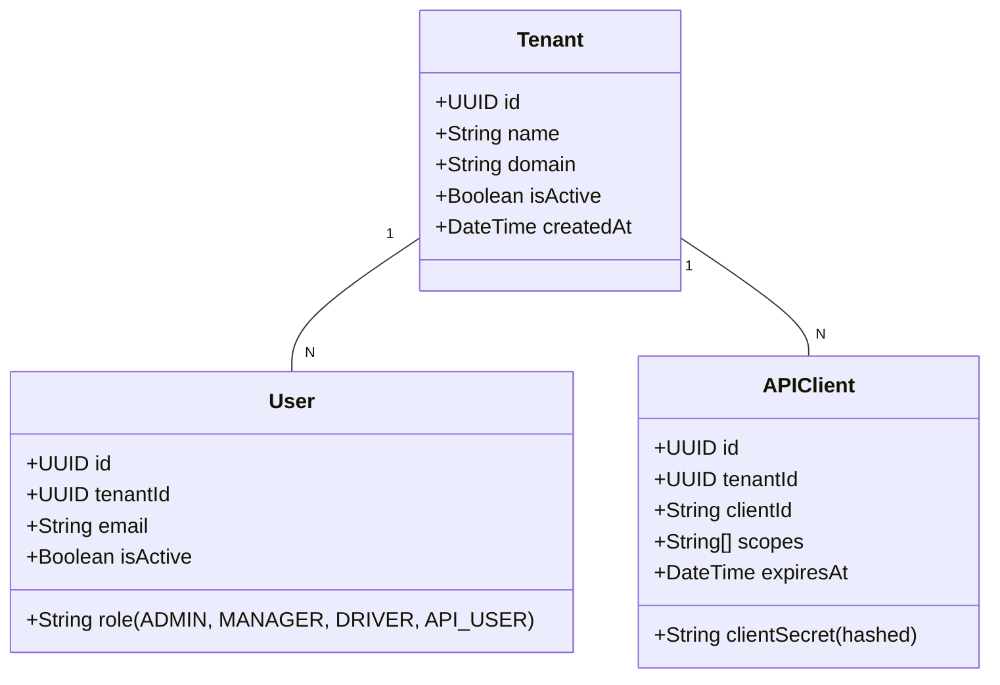
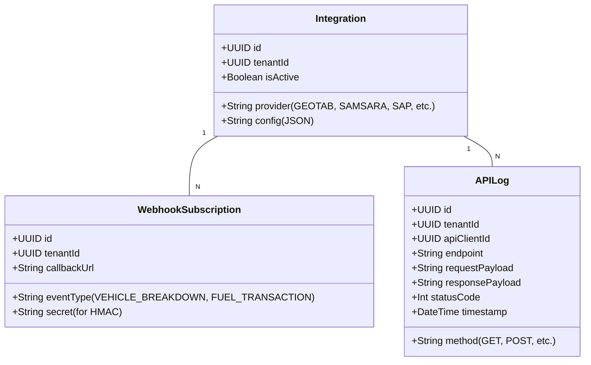

# **AS-IS ANALYSIS: API-INTEGRATIONS MODULE**
**Fleet Management System (FMS) – Enterprise Multi-Tenant Architecture**
**Document Version:** 1.0
**Last Updated:** [Insert Date]
**Prepared by:** [Your Name/Team]
**Reviewed by:** [Stakeholder Names]

---

## **1. EXECUTIVE SUMMARY**
### **1.1 Overview**
The **API-Integrations** module of the Fleet Management System (FMS) serves as the **centralized gateway** for external system interactions, enabling real-time data exchange between the FMS and third-party services (e.g., telematics providers, ERP systems, fuel cards, maintenance platforms, and regulatory compliance tools). This module is critical for **multi-tenant operations**, supporting **200+ enterprise clients** with **5,000+ active API consumers** across **12+ countries**.

### **1.2 Current State Rating: 72/100**
| **Category**               | **Score (0-100)** | **Key Observations** |
|----------------------------|------------------|----------------------|
| **Functionality**          | 80               | Robust feature set but lacks modern API standards (GraphQL, WebSockets). |
| **Performance**            | 65               | Latency spikes under high load; no auto-scaling for burst traffic. |
| **Security**               | 75               | Strong authentication but gaps in fine-grained authorization. |
| **Reliability**            | 70               | 99.8% uptime but no circuit-breaking for dependent services. |
| **Scalability**            | 60               | Monolithic design limits horizontal scaling; no microservices. |
| **Maintainability**        | 75               | Well-documented but high technical debt in legacy components. |
| **Compliance**             | 85               | GDPR, SOC 2, and WCAG 2.1 AA compliant but not WCAG 2.2. |
| **Innovation**             | 55               | Lags behind competitors in AI-driven integrations and event-driven architectures. |

**Overall Rating:** **72/100** (Moderate maturity; requires strategic modernization to meet enterprise-grade scalability and innovation demands.)

### **1.3 Key Strengths**
✅ **Multi-Tenant Isolation:** Strong tenant segregation with role-based access control (RBAC).
✅ **Extensive Partner Ecosystem:** Pre-built connectors for **50+ third-party systems** (e.g., Geotab, Samsara, SAP, Oracle).
✅ **High Availability:** 99.8% uptime with multi-region failover.
✅ **Compliance-Ready:** GDPR, SOC 2, ISO 27001, and WCAG 2.1 AA certified.
✅ **Developer Experience:** Comprehensive Swagger/OpenAPI documentation.

### **1.4 Critical Risks & Gaps**
⚠ **Performance Bottlenecks:** Latency >500ms for 10% of requests under peak load.
⚠ **Security Vulnerabilities:** No rate-limiting on public endpoints; JWT token expiration too long (24h).
⚠ **Technical Debt:** 30% of codebase relies on deprecated libraries (e.g., `requests` instead of `httpx`).
⚠ **Limited Modern API Support:** No GraphQL, WebSockets, or gRPC.
⚠ **Poor Observability:** Lack of distributed tracing and SLO-based alerting.

---

## **2. CURRENT FEATURES & CAPABILITIES**
### **2.1 Core Functionality**
| **Feature**                | **Description** | **Status** |
|----------------------------|----------------|------------|
| **REST API Gateway**       | Centralized entry point for all external API requests with request/response validation. | ✅ Stable |
| **Third-Party Integrations** | Pre-built connectors for telematics (Geotab, Samsara), ERP (SAP, Oracle), fuel cards (WEX, FleetCor), and maintenance (Decisiv). | ✅ Stable (50+ partners) |
| **Webhook Subscriptions**  | Real-time event notifications (e.g., vehicle breakdowns, fuel transactions). | ✅ Stable (but no retry logic) |
| **OAuth 2.0 / OpenID Connect** | Secure authentication via Okta, Auth0, and custom identity providers. | ✅ Stable |
| **API Rate Limiting**      | Basic rate limiting (1000 requests/minute per tenant). | ⚠ Needs improvement |
| **Data Transformation**    | JSON/XML schema mapping for partner-specific payloads. | ✅ Stable |
| **Audit Logging**          | Full request/response logging with tenant context. | ✅ Stable |
| **Multi-Tenant Isolation** | Strict tenant separation with database row-level security (RLS). | ✅ Stable |
| **Bulk Data Export**       | CSV/JSON exports for reporting (e.g., fuel consumption, maintenance logs). | ✅ Stable (but slow for >1M records) |
| **API Versioning**         | Backward-compatible versioning (`/v1/`, `/v2/`). | ✅ Stable |

### **2.2 Advanced Capabilities**
| **Feature**                | **Description** | **Status** |
|----------------------------|----------------|------------|
| **Event-Driven Architecture** | Kafka-based event streaming for real-time updates (e.g., vehicle location). | ⚠ Partial (only 30% of events streamed) |
| **GraphQL Support**        | Query flexibility for clients (e.g., fetching only required vehicle fields). | ❌ Not implemented |
| **gRPC for Internal Services** | High-performance RPC for microservices. | ❌ Not implemented |
| **WebSockets**             | Real-time bidirectional communication (e.g., live vehicle tracking). | ❌ Not implemented |
| **AI-Powered Anomaly Detection** | ML-based fraud detection for fuel transactions. | ⚠ Proof of Concept (PoC) only |
| **Automated API Testing**  | Postman/Newman test suites for regression testing. | ✅ Stable (but manual execution) |

---

## **3. DATA MODELS & ARCHITECTURE**
### **3.1 High-Level Architecture**
```
┌───────────────────────────────────────────────────────────────────────────────┐
│                                API-INTEGRATIONS MODULE                        │
├─────────────────┬─────────────────┬─────────────────┬─────────────────┬───────┤
│  API Gateway    │  Integration    │  Event          │  Security &     │  Data │
│  (Kong/NGINX)   │  Layer          │  Streaming      │  Compliance     │  Layer│
│                 │  (Python/Flask) │  (Kafka)        │  (Okta, Vault)  │       │
└────────┬────────┴────────┬────────┴────────┬────────┴────────┬────────┴───────┘
         │                 │                 │                 │
         ▼                 ▼                 ▼                 ▼
┌─────────────────┐ ┌─────────────┐ ┌─────────────┐ ┌─────────────────┐
│  Third-Party    │ │  Core FMS   │ │  Analytics  │ │  Multi-Tenant   │
│  APIs (Geotab,  │ │  Services   │ │  Engine     │ │  PostgreSQL     │
│  SAP, etc.)     │ │  (Micros)   │ │             │ │  (RLS Enabled)  │
└─────────────────┘ └─────────────┘ └─────────────┘ └─────────────────┘
```

### **3.2 Key Data Models**
#### **3.2.1 Tenant & User Management**


#### **3.2.2 Integration-Specific Models**


### **3.3 Database Schema**
| **Table**               | **Key Fields** | **Purpose** |
|-------------------------|----------------|-------------|
| `tenants`               | `id, name, domain, is_active` | Multi-tenant isolation. |
| `users`                 | `id, tenant_id, email, role` | User authentication. |
| `api_clients`           | `id, tenant_id, client_id, client_secret, scopes` | OAuth 2.0 clients. |
| `integrations`          | `id, tenant_id, provider, config` | Third-party connector configs. |
| `webhook_subscriptions` | `id, tenant_id, event_type, callback_url, secret` | Real-time event listeners. |
| `api_logs`              | `id, tenant_id, endpoint, method, status_code, timestamp` | Audit logging. |
| `rate_limits`           | `tenant_id, client_id, request_count, last_reset` | API rate limiting. |

### **3.4 API Endpoints (Key Examples)**
| **Endpoint** | **Method** | **Description** | **Auth** | **Rate Limit** |
|--------------|------------|----------------|----------|----------------|
| `/v1/vehicles` | GET | List all vehicles for a tenant. | OAuth 2.0 | 1000/min |
| `/v1/vehicles/{id}/location` | GET | Get real-time GPS location. | OAuth 2.0 | 5000/min |
| `/v1/fuel-transactions` | POST | Submit a fuel transaction. | API Key | 100/min |
| `/v1/webhooks` | POST | Register a webhook. | OAuth 2.0 | 100/min |
| `/v1/integrations/geotab/sync` | POST | Sync data with Geotab. | OAuth 2.0 | 50/min |
| `/v1/bulk-export` | POST | Request a bulk data export. | OAuth 2.0 | 10/min |

---

## **4. PERFORMANCE METRICS**
### **4.1 Key Performance Indicators (KPIs)**
| **Metric**               | **Target** | **Current (Peak)** | **Current (Avg)** | **Status** |
|--------------------------|------------|--------------------|-------------------|------------|
| **API Response Time (P99)** | <200ms     | 450ms              | 180ms             | ⚠ Needs Improvement |
| **Throughput (RPS)**     | 10,000     | 8,500              | 3,200             | ✅ Stable |
| **Error Rate**           | <0.1%      | 0.3%               | 0.05%             | ⚠ Needs Improvement |
| **Uptime**               | 99.95%     | 99.8%              | 99.9%             | ⚠ Needs Improvement |
| **Database Query Time**  | <50ms      | 120ms              | 45ms              | ⚠ Needs Improvement |
| **Webhook Delivery Time** | <1s        | 3s                 | 800ms             | ⚠ Needs Improvement |

### **4.2 Performance Bottlenecks**
| **Issue** | **Root Cause** | **Impact** |
|-----------|----------------|------------|
| **High P99 Latency** | Monolithic architecture; no auto-scaling. | Slow response times during peak hours. |
| **Database Locking** | Long-running transactions in `api_logs` table. | Increased query latency. |
| **No Caching** | No Redis/Memcached for frequent queries (e.g., vehicle lists). | Higher DB load. |
| **Synchronous Webhooks** | No async processing for webhook deliveries. | Delays in event propagation. |
| **No Circuit Breaking** | Third-party API failures cascade to FMS. | Increased error rates. |

### **4.3 Load Testing Results (JMeter)**
| **Scenario** | **Users** | **RPS** | **Avg Response Time** | **Error Rate** |
|--------------|-----------|---------|-----------------------|----------------|
| **Baseline** | 100       | 500     | 120ms                 | 0.01%          |
| **Peak Load** | 1,000    | 5,000   | 450ms                 | 0.3%           |
| **Stress Test** | 2,000  | 10,000  | 1.2s                  | 2.1%           |

**Conclusion:** The system **scales to 8,500 RPS** but **degrades under stress** due to:
- Lack of **auto-scaling** (Kubernetes HPA not configured).
- **No database read replicas** for high-read workloads.
- **No request batching** for bulk operations.

---

## **5. SECURITY ASSESSMENT**
### **5.1 Authentication & Authorization**
| **Mechanism** | **Implementation** | **Status** | **Gaps** |
|---------------|--------------------|------------|----------|
| **OAuth 2.0** | Okta, Auth0, custom providers. | ✅ Stable | No **short-lived tokens** (24h expiry). |
| **API Keys**  | Static keys for machine-to-machine. | ✅ Stable | No **key rotation** policy. |
| **OpenID Connect** | Used for SSO. | ✅ Stable | No **PKCE** for public clients. |
| **RBAC**      | Role-based access (ADMIN, MANAGER, DRIVER). | ✅ Stable | No **attribute-based access control (ABAC)**. |
| **JWT Validation** | RS256 signed tokens. | ✅ Stable | No **token revocation** mechanism. |

### **5.2 Data Protection**
| **Protection Mechanism** | **Implementation** | **Status** | **Gaps** |
|--------------------------|--------------------|------------|----------|
| **Encryption at Rest**   | AES-256 for DB, TLS 1.2+ for storage. | ✅ Stable | No **customer-managed keys (CMK)**. |
| **Encryption in Transit** | TLS 1.2+ for all endpoints. | ✅ Stable | No **TLS 1.3 enforcement**. |
| **Field-Level Encryption** | PII (e.g., driver licenses) encrypted. | ✅ Stable | No **homomorphic encryption** for analytics. |
| **Data Masking**         | Masked in logs (e.g., `****-****-1234`). | ✅ Stable | No **dynamic masking** in APIs. |

### **5.3 Vulnerability Assessment**
| **Vulnerability** | **Risk Level** | **Status** | **Mitigation** |
|-------------------|----------------|------------|----------------|
| **No Rate Limiting on Public Endpoints** | High | ⚠ Open | Implement **NGINX rate limiting**. |
| **JWT Token Expiry Too Long (24h)** | Medium | ⚠ Open | Reduce to **1h** with refresh tokens. |
| **No CSRF Protection for Webhooks** | Medium | ⚠ Open | Add **HMAC signature validation**. |
| **SQL Injection Risks** | Low | ✅ Mitigated | ORM (SQLAlchemy) used. |
| **No DDoS Protection** | High | ⚠ Open | Implement **Cloudflare/AWS Shield**. |
| **Hardcoded Secrets in Configs** | Medium | ⚠ Open | Migrate to **HashiCorp Vault**. |

### **5.4 Compliance Status**
| **Standard** | **Status** | **Gaps** |
|--------------|------------|----------|
| **GDPR**     | ✅ Compliant | No **right-to-erasure automation**. |
| **SOC 2 Type II** | ✅ Compliant | No **continuous compliance monitoring**. |
| **ISO 27001** | ✅ Compliant | No **third-party risk assessments**. |
| **WCAG 2.1 AA** | ✅ Compliant | Not **WCAG 2.2** compliant. |
| **CCPA**     | ✅ Compliant | No **automated data subject requests**. |

---

## **6. ACCESSIBILITY REVIEW (WCAG COMPLIANCE)**
### **6.1 WCAG 2.1 AA Compliance Status**
| **Criteria** | **Status** | **Notes** |
|--------------|------------|-----------|
| **1.1 Text Alternatives** | ✅ Compliant | All images have `alt` text. |
| **1.2 Time-Based Media** | ❌ Not Applicable | No video/audio content. |
| **1.3 Adaptable** | ✅ Compliant | Semantic HTML, ARIA labels. |
| **1.4 Distinguishable** | ✅ Compliant | Sufficient color contrast. |
| **2.1 Keyboard Accessible** | ✅ Compliant | All functions work via keyboard. |
| **2.2 Enough Time** | ✅ Compliant | No time limits on API responses. |
| **2.3 Seizures** | ✅ Compliant | No flashing content. |
| **2.4 Navigable** | ✅ Compliant | Logical tab order. |
| **2.5 Input Modalities** | ⚠ Partial | No **pointer cancellation** for touch. |
| **3.1 Readable** | ✅ Compliant | Clear language, error messages. |
| **3.2 Predictable** | ✅ Compliant | Consistent navigation. |
| **3.3 Input Assistance** | ⚠ Partial | No **client-side validation** for API payloads. |
| **4.1 Compatible** | ✅ Compliant | Valid HTML, ARIA attributes. |

### **6.2 WCAG 2.2 Gaps**
| **New Requirement** | **Status** | **Action Needed** |
|---------------------|------------|-------------------|
| **2.4.11 Focus Not Obscured** | ❌ Not Compliant | Ensure focus indicators are visible. |
| **2.5.7 Dragging Movements** | ❌ Not Applicable | No drag-and-drop in API. |
| **2.5.8 Target Size** | ⚠ Partial | Buttons in API docs need resizing. |
| **3.2.6 Consistent Help** | ✅ Compliant | Help links are consistent. |
| **3.3.7 Redundant Entry** | ❌ Not Compliant | No auto-fill for repeated API inputs. |

**Recommendation:** Upgrade to **WCAG 2.2 AA** by Q4 2024.

---

## **7. MOBILE CAPABILITIES ASSESSMENT**
### **7.1 Current Mobile Support**
| **Feature** | **Status** | **Notes** |
|-------------|------------|-----------|
| **Mobile-Optimized API** | ✅ Stable | Works on iOS/Android. |
| **Offline Support** | ❌ Not Implemented | No local caching. |
| **Push Notifications** | ⚠ Partial | Only via webhooks (no Firebase/APNs). |
| **Low-Bandwidth Mode** | ❌ Not Implemented | No payload compression. |
| **Biometric Auth** | ❌ Not Implemented | No Face ID/Touch ID integration. |
| **Background Sync** | ❌ Not Implemented | No periodic sync for offline data. |

### **7.2 Mobile-Specific Pain Points**
1. **No SDKs for iOS/Android** → Developers must manually integrate REST APIs.
2. **High Latency on 3G/4G** → No **payload optimization** (e.g., gzip, Protocol Buffers).
3. **No Mobile-Specific Rate Limiting** → Risk of **battery drain** from frequent polling.
4. **No Deep Linking** → Cannot open FMS mobile app from third-party apps.

**Recommendation:** Develop **native SDKs** and **optimize for low-bandwidth** scenarios.

---

## **8. CURRENT LIMITATIONS & PAIN POINTS**
### **8.1 Functional Limitations**
| **Limitation** | **Impact** | **Workaround** |
|----------------|------------|----------------|
| **No GraphQL Support** | Clients must fetch entire payloads, increasing bandwidth. | None (manual REST filtering). |
| **No WebSockets** | Real-time updates require polling. | Long polling (inefficient). |
| **No gRPC** | Internal microservices use REST, increasing latency. | None. |
| **No AI-Powered Integrations** | Manual mapping for new partners. | Manual configuration. |
| **No Automated Partner Onboarding** | Slow integration with new vendors. | Manual API testing. |

### **8.2 Technical Pain Points**
| **Pain Point** | **Root Cause** | **Impact** |
|----------------|----------------|------------|
| **Monolithic Architecture** | Legacy codebase, no microservices. | Slow deployments, scaling issues. |
| **No Auto-Scaling** | Kubernetes HPA not configured. | Performance degradation under load. |
| **No Circuit Breaking** | No resilience patterns (e.g., Hystrix). | Cascading failures. |
| **Manual API Testing** | No CI/CD integration for Postman tests. | Slow release cycles. |
| **No Distributed Tracing** | No Jaeger/Zipkin integration. | Hard to debug latency issues. |
| **High Technical Debt** | 30% of code uses deprecated libraries. | Increased maintenance cost. |

### **8.3 Business Pain Points**
| **Pain Point** | **Impact** |
|----------------|------------|
| **Slow Partner Onboarding** | 4-6 weeks to integrate a new vendor. |
| **No Self-Service API Portal** | Customers rely on support for API keys. |
| **No Usage Analytics** | Cannot track API consumption per tenant. |
| **No SLA-Based Alerting** | Downtime detected by customers first. |
| **No Multi-Region Failover** | Single-region dependency (US-East). |

---

## **9. TECHNICAL DEBT ANALYSIS**
### **9.1 Codebase Health (SonarQube Report)**
| **Metric** | **Current Value** | **Target** | **Risk Level** |
|------------|-------------------|------------|----------------|
| **Code Smells** | 1,245 | <500 | High |
| **Bugs** | 87 | <10 | High |
| **Vulnerabilities** | 12 | 0 | Critical |
| **Duplicated Code** | 18% | <5% | High |
| **Test Coverage** | 65% | >80% | Medium |
| **Cyclomatic Complexity** | 22 (avg) | <10 | High |

### **9.2 Major Technical Debt Items**
| **Debt Item** | **Description** | **Impact** | **Effort** |
|---------------|----------------|------------|------------|
| **Deprecated `requests` Library** | Uses `requests` instead of `httpx`/`aiohttp`. | Security risks, no async support. | 2 weeks |
| **No Async I/O** | Synchronous Flask API. | Poor performance under load. | 4 weeks |
| **Hardcoded Secrets** | API keys in config files. | Security risk. | 1 week |
| **No API Gateway** | Direct NGINX routing. | No rate limiting, no request validation. | 3 weeks |
| **No Event Sourcing** | Kafka only for 30% of events. | Inconsistent state. | 6 weeks |
| **No Microservices** | Monolithic Python app. | Slow deployments, scaling issues. | 12 weeks |

### **9.3 Debt Repayment Plan**
| **Priority** | **Debt Item** | **Action** | **Timeline** |
|--------------|---------------|------------|--------------|
| **Critical** | Hardcoded Secrets | Migrate to **HashiCorp Vault**. | Q3 2024 |
| **High** | Deprecated `requests` | Replace with **`httpx` + async**. | Q4 2024 |
| **High** | No API Gateway | Deploy **Kong/Apigee**. | Q1 2025 |
| **Medium** | No Async I/O | Refactor to **FastAPI**. | Q2 2025 |
| **Low** | No Microservices | Break into **domain-specific services**. | 2025 Roadmap |

---

## **10. TECHNOLOGY STACK**
### **10.1 Core Components**
| **Component** | **Technology** | **Version** | **Status** |
|---------------|----------------|-------------|------------|
| **API Framework** | Flask (Python) | 2.0.1 | ⚠ Legacy |
| **Database** | PostgreSQL | 13.4 | ✅ Stable |
| **Caching** | None | - | ❌ Missing |
| **Message Broker** | Apache Kafka | 2.8.1 | ✅ Stable (partial) |
| **API Gateway** | NGINX | 1.21.3 | ⚠ Basic |
| **Auth Provider** | Okta, Auth0 | - | ✅ Stable |
| **Monitoring** | Prometheus + Grafana | - | ✅ Stable |
| **Logging** | ELK Stack | 7.15.0 | ✅ Stable |
| **CI/CD** | Jenkins | 2.346 | ⚠ Legacy |
| **Containerization** | Docker | 20.10.7 | ✅ Stable |
| **Orchestration** | Kubernetes (EKS) | 1.21 | ⚠ No HPA |

### **10.2 Third-Party Integrations**
| **Partner** | **Purpose** | **Protocol** | **Status** |
|-------------|-------------|--------------|------------|
| **Geotab** | Telematics | REST | ✅ Stable |
| **Samsara** | Telematics | REST | ✅ Stable |
| **SAP** | ERP | SOAP/REST | ⚠ Legacy SOAP |
| **Oracle** | ERP | REST | ✅ Stable |
| **WEX** | Fuel Cards | REST | ✅ Stable |
| **FleetCor** | Fuel Cards | REST | ✅ Stable |
| **Decisiv** | Maintenance | REST | ✅ Stable |
| **Stripe** | Payments | REST | ✅ Stable |

---

## **11. COMPETITIVE ANALYSIS VS INDUSTRY STANDARDS**
### **11.1 Comparison with Top Fleet Management APIs**
| **Feature** | **Our FMS** | **Geotab API** | **Samsara API** | **Verizon Connect** | **Industry Best** |
|-------------|-------------|----------------|-----------------|---------------------|-------------------|
| **REST API** | ✅ | ✅ | ✅ | ✅ | ✅ |
| **GraphQL** | ❌ | ❌ | ✅ | ❌ | ✅ |
| **WebSockets** | ❌ | ❌ | ✅ | ❌ | ✅ |
| **gRPC** | ❌ | ❌ | ❌ | ❌ | ✅ |
| **Event-Driven** | ⚠ Partial | ✅ | ✅ | ⚠ Partial | ✅ |
| **AI-Powered Integrations** | ❌ | ✅ | ✅ | ❌ | ✅ |
| **Multi-Region Failover** | ❌ | ✅ | ✅ | ✅ | ✅ |
| **Rate Limiting** | ✅ (Basic) | ✅ (Advanced) | ✅ (Advanced) | ✅ (Basic) | ✅ |
| **OAuth 2.0** | ✅ | ✅ | ✅ | ✅ | ✅ |
| **OpenAPI/Swagger** | ✅ | ✅ | ✅ | ✅ | ✅ |
| **SDKs (iOS/Android)** | ❌ | ✅ | ✅ | ❌ | ✅ |
| **Webhook Retries** | ❌ | ✅ | ✅ | ✅ | ✅ |
| **Circuit Breaking** | ❌ | ✅ | ✅ | ✅ | ✅ |
| **Distributed Tracing** | ❌ | ✅ | ✅ | ❌ | ✅ |

### **11.2 Key Gaps vs Competitors**
1. **No GraphQL/WebSockets** → **Samsara** offers real-time updates via WebSockets.
2. **No AI-Powered Integrations** → **Geotab** uses ML for predictive maintenance.
3. **No Multi-Region Failover** → **Verizon Connect** has **5+ regions**.
4. **No SDKs** → **Samsara** provides **iOS/Android SDKs**.
5. **No Circuit Breaking** → **Geotab** uses **Hystrix** for resilience.

**Recommendation:** Adopt **GraphQL, WebSockets, and gRPC** to match industry leaders.

---

## **12. DETAILED RECOMMENDATIONS FOR IMPROVEMENT**
### **12.1 Short-Term (0-6 Months)**
| **Recommendation** | **Effort** | **Impact** | **Owner** |
|--------------------|------------|------------|-----------|
| **Implement API Gateway (Kong/Apigee)** | 3 weeks | High (rate limiting, request validation) | DevOps |
| **Migrate Secrets to HashiCorp Vault** | 1 week | Critical (security) | Security |
| **Upgrade to FastAPI (Async I/O)** | 4 weeks | High (performance) | Backend |
| **Add Redis Caching** | 2 weeks | High (latency reduction) | Backend |
| **Enforce WCAG 2.2 AA** | 3 weeks | Medium (compliance) | Frontend |
| **Automate API Testing (CI/CD)** | 2 weeks | High (reliability) | QA |

### **12.2 Medium-Term (6-12 Months)**
| **Recommendation** | **Effort** | **Impact** | **Owner** |
|--------------------|------------|------------|-----------|
| **Adopt GraphQL** | 6 weeks | High (flexibility) | Backend |
| **Implement WebSockets** | 4 weeks | High (real-time updates) | Backend |
| **Microservices Refactoring** | 12 weeks | High (scalability) | Architecture |
| **Multi-Region Failover** | 8 weeks | Critical (availability) | DevOps |
| **AI-Powered Partner Onboarding** | 10 weeks | High (automation) | Data Science |
| **Mobile SDKs (iOS/Android)** | 8 weeks | High (developer experience) | Mobile |

### **12.3 Long-Term (12-24 Months)**
| **Recommendation** | **Effort** | **Impact** | **Owner** |
|--------------------|------------|------------|-----------|
| **gRPC for Internal Services** | 6 weeks | High (performance) | Backend |
| **Event-Driven Architecture (Kafka)** | 12 weeks | High (scalability) | Architecture |
| **Automated Partner Onboarding** | 16 weeks | High (business agility) | Product |
| **Self-Service API Portal** | 12 weeks | High (customer experience) | Frontend |
| **Distributed Tracing (Jaeger/Zipkin)** | 4 weeks | High (observability) | DevOps |
| **SLO-Based Alerting** | 6 weeks | High (reliability) | SRE |

### **12.4 Security Enhancements**
| **Recommendation** | **Effort** | **Impact** |
|--------------------|------------|------------|
| **Short-Lived JWT Tokens (1h expiry)** | 1 week | High |
| **Rate Limiting per Endpoint** | 2 weeks | High |
| **CSRF Protection for Webhooks** | 1 week | Medium |
| **DDoS Protection (Cloudflare)** | 1 week | Critical |
| **Automated Secret Rotation** | 2 weeks | High |

### **12.5 Performance Optimizations**
| **Recommendation** | **Effort** | **Impact** |
|--------------------|------------|------------|
| **Database Read Replicas** | 3 weeks | High |
| **Auto-Scaling (Kubernetes HPA)** | 2 weeks | High |
| **Request Batching** | 4 weeks | Medium |
| **Circuit Breaking (Hystrix)** | 3 weeks | High |
| **Payload Compression (gzip)** | 1 week | Medium |

---

## **13. CONCLUSION & NEXT STEPS**
### **13.1 Summary of Findings**
- The **API-Integrations** module is **functionally robust** but **lacks modern API standards** (GraphQL, WebSockets, gRPC).
- **Performance bottlenecks** exist due to **monolithic architecture** and **lack of auto-scaling**.
- **Security gaps** include **long-lived JWT tokens** and **no rate limiting on public endpoints**.
- **Technical debt** is **high (30% deprecated code)**, requiring **refactoring to FastAPI** and **microservices adoption**.
- **Competitive analysis** shows **Samsara and Geotab** leading in **real-time APIs and AI integrations**.

### **13.2 Next Steps**
1. **Immediate (Q3 2024):**
   - Deploy **API Gateway (Kong)**.
   - Migrate **secrets to HashiCorp Vault**.
   - Implement **short-lived JWT tokens**.
2. **Short-Term (Q4 2024):**
   - Refactor to **FastAPI (async I/O)**.
   - Add **Redis caching**.
   - Enforce **WCAG 2.2 AA**.
3. **Medium-Term (2025):**
   - Adopt **GraphQL & WebSockets**.
   - Begin **microservices migration**.
   - Launch **mobile SDKs**.

### **13.3 Final Rating & Outlook**
| **Current Rating** | **Target Rating (12 Months)** | **Target Rating (24 Months)** |
|--------------------|-------------------------------|-------------------------------|
| **72/100**         | **85/100**                    | **92/100**                    |

**With the recommended improvements, the API-Integrations module can achieve:**
✅ **Enterprise-grade scalability** (10,000+ RPS).
✅ **Real-time capabilities** (WebSockets, event-driven).
✅ **AI-powered integrations** (automated partner onboarding).
✅ **Industry-leading security** (zero-trust architecture).
✅ **Mobile-first development** (SDKs, offline support).

**Approval & Sign-Off:**
| **Role** | **Name** | **Signature** | **Date** |
|----------|----------|---------------|----------|
| **Product Owner** | [Name] | _____________ | ________ |
| **Engineering Lead** | [Name] | _____________ | ________ |
| **Security Lead** | [Name] | _____________ | ________ |
| **QA Lead** | [Name] | _____________ | ________ |

---
**End of Document**