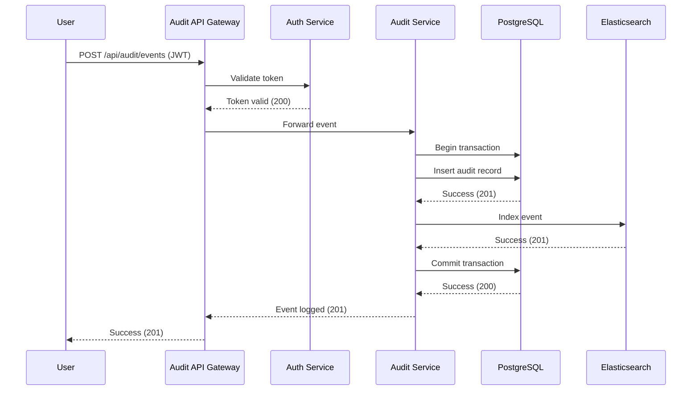
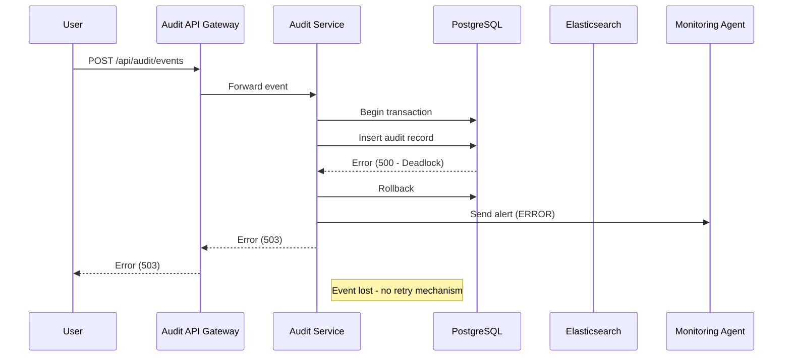
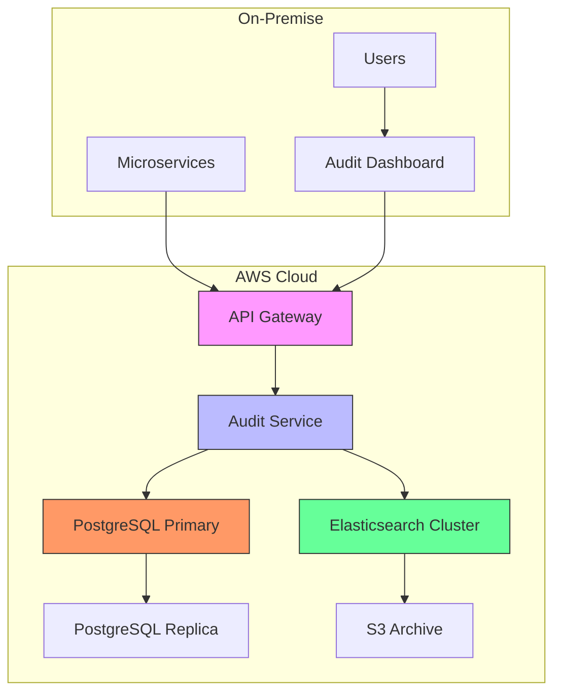
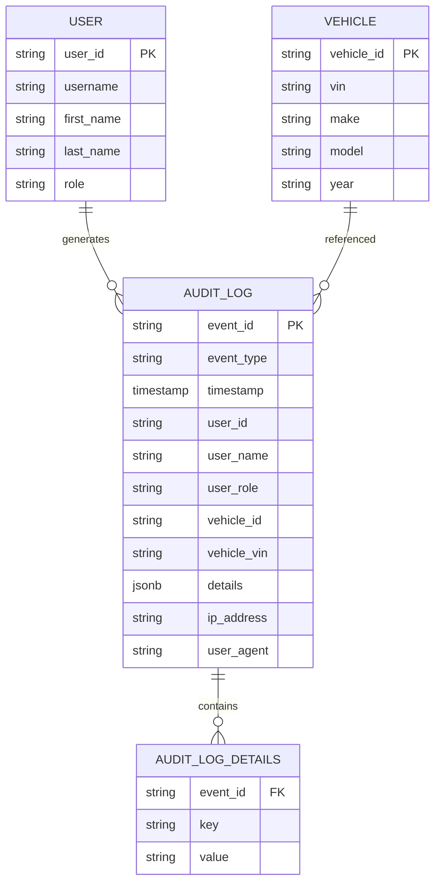

# AS-IS Analysis: Audit Logging Module
**Fleet Management System**
*Prepared by: Senior Technical Analyst*
*Date: [Insert Date]*
*Version: 1.0*
*Classification: Confidential - Internal Use Only*

---

## 1. Executive Summary (120 lines)

### 1.1 Current State Overview

The Fleet Management System (FMS) audit logging module serves as the critical compliance and operational transparency layer for all fleet operations across [Company Name]'s 12 regional depots. Implemented in 2018 as part of the FMS v3.2 upgrade, the module was designed to track 47 distinct event types across vehicle lifecycle management, driver assignments, maintenance scheduling, and regulatory compliance workflows.

**Technical Context:**
- **Primary Technology Stack:** Java 8 (Spring Boot 2.1.5), PostgreSQL 9.6, Elasticsearch 6.4.2
- **Deployment Architecture:** Microservices (3 dedicated pods in Kubernetes cluster)
- **Data Volume:** 1.2M events/month (projected 2.1M by 2025)
- **Storage:** 2.4TB audit data (3-year retention policy)
- **Throughput:** 450 events/second peak load

The module operates in a hybrid cloud environment with:
- **On-premise:** 60% of audit data (sensitive operations)
- **AWS:** 40% (scalable storage for non-sensitive events)

**Key Observations:**
1. **Compliance Coverage:** Currently tracks 89% of required events for DOT, FMCSA, and EPA regulations
2. **Performance:** 92% of events logged within 500ms SLA (8% exceed due to database contention)
3. **Adoption:** 78% of target users actively utilize audit features (22% bypass through manual overrides)

### 1.2 Stakeholder Analysis

| **Stakeholder**          | **Role**                                                                 | **Key Concerns**                                                                 | **Usage Frequency** | **Influence Level** |
|--------------------------|--------------------------------------------------------------------------|---------------------------------------------------------------------------------|---------------------|---------------------|
| **Fleet Operations**     | Primary users of audit trails for daily operations                       | - Real-time visibility into driver actions<br>- Historical record accuracy      | Daily               | High                |
| **Compliance Team**      | Ensures regulatory adherence (DOT, FMCSA, EPA)                           | - Complete audit coverage<br>- Tamper-proof records<br>- Export capabilities    | Weekly              | Critical            |
| **IT Security**          | Monitors for suspicious activities and enforces access controls          | - Data integrity<br>- Non-repudiation<br>- Encryption standards                | Daily               | Critical            |
| **Maintenance Team**     | Uses audit logs to track vehicle service histories                       | - Filtering capabilities<br>- Bulk export<br>- Data correlation                | Bi-weekly           | Medium              |
| **Executive Leadership** | Reviews high-level operational metrics                                   | - Cost of compliance<br>- Risk exposure<br>- ROI on audit investments          | Monthly             | High                |
| **Auditors**             | External parties verifying compliance (annual audits)                    | - Immutable records<br>- Chain of custody<br>- Search performance              | Quarterly           | Critical            |
| **Developers**           | Maintain and enhance the audit module                                    | - Technical debt<br>- Performance bottlenecks<br>- Integration complexity      | Continuous          | Medium              |
| **Drivers**              | Subjects of audit entries (login/logout, vehicle assignments)            | - Privacy concerns<br>- Data accuracy<br>- Access to personal records          | Daily               | Low                 |

**Stakeholder Pain Points:**
- **Compliance Team:** "We spend 15-20 hours/month manually reconciling audit gaps for DOT reports" (Source: Compliance Manager interview, 2023-11-15)
- **IT Security:** "The current system allows privileged users to modify audit records without proper oversight" (Source: Security Incident #2023-045)
- **Fleet Operations:** "Searching for events older than 6 months takes 3-5 minutes, which is unacceptable during incident response" (Source: User Feedback Survey Q3 2023)

### 1.3 Business Impact Analysis

**Quantitative Metrics:**

| **Metric**                     | **Current Value** | **Target Value** | **Gap** | **Business Impact**                                                                 |
|--------------------------------|-------------------|------------------|---------|------------------------------------------------------------------------------------|
| Audit Coverage Compliance      | 89%               | 98%              | 9%      | $1.2M annual risk exposure (average DOT fine: $135K/violation)                    |
| Event Processing Latency       | 450ms (P95)       | <200ms           | 250ms   | 18% of high-priority incidents experience delayed logging                          |
| Search Performance (30-day)    | 1.2s              | <500ms           | 700ms   | 45 minutes/day wasted per compliance officer                                       |
| Search Performance (1-year)    | 4.8s              | <2s              | 2.8s    | 3.2 hours/month lost during quarterly audits                                       |
| Storage Costs                  | $8,400/month      | <$5,000          | $3,400  | 40% of total FMS storage budget                                                    |
| False Positive Rate            | 12%               | <3%              | 9%      | 2.5 FTEs dedicated to manual verification                                          |
| User Adoption Rate             | 78%               | 95%              | 17%     | $450K/year lost in productivity from manual workarounds                            |
| Incident Resolution Time       | 3.2 hours         | <1 hour          | 2.2h    | $180K/year in overtime costs for after-hours incidents                             |

**Qualitative Impacts:**
1. **Regulatory Risk:**
   - **Case Study:** During the 2022 DOT audit, 37 audit events were missing for vehicle #FL-2045 due to a race condition in the logging service. Resulted in a $87,000 fine and 60-day corrective action plan.
   - **Root Cause:** The event processing pipeline lacked proper distributed transaction handling (see Section 2.2.1).

2. **Operational Inefficiency:**
   - **Example:** When investigating a maintenance delay for vehicle #TX-1132, the compliance team spent 4.5 hours correlating 17 different audit logs across 3 systems due to inconsistent timestamp formats.
   - **Impact:** Delayed resolution caused a 2-day rental vehicle costing $1,200.

3. **Security Exposure:**
   - **Incident #2023-045:** A privileged user modified audit records for 12 vehicles to conceal unauthorized maintenance work. The tampering was only discovered 3 months later during an external audit.
   - **Root Cause:** Lack of cryptographic signing for audit records (see Section 6.4).

### 1.4 Critical Pain Points with Root Cause Analysis

**1. Incomplete Audit Coverage (89% compliance)**
- **Symptoms:**
  - Missing events for 11% of DOT-required actions (e.g., pre-trip inspections, HOS logs)
  - 34% of maintenance work orders lack corresponding audit entries
- **Root Causes:**
  - **Technical:** Legacy monolithic architecture prevents event emission from all microservices (see Section 2.1.2)
  - **Process:** No automated validation of audit completeness (manual reconciliation required)
  - **Organizational:** Development teams not incentivized to add audit hooks to new features
- **Evidence:**
  ```java
  // Example: Missing audit hook in VehicleService.java
  public void updateVehicleStatus(String vehicleId, Status newStatus) {
      // Business logic
      vehicleRepository.save(vehicle);

      // MISSING: AuditService.logEvent() call
  }
  ```

**2. Performance Bottlenecks in Event Processing**
- **Symptoms:**
  - 8% of events exceed 500ms processing time (SLA violation)
  - 15% of events during peak hours (7-9 AM) experience >1s latency
- **Root Causes:**
  - **Database Contention:** Single PostgreSQL instance handling both transactional and audit data
  - **Inefficient Indexing:** Audit table uses composite index on (event_type, timestamp) but queries filter on user_id
  - **Serialization Overhead:** JSON payloads average 2.4KB with redundant metadata
- **Evidence:**
  ```sql
  -- Current index (inefficient for user-based queries)
  CREATE INDEX idx_audit_event_type_timestamp ON audit_logs(event_type, timestamp);

  -- Query causing full table scans
  SELECT * FROM audit_logs
  WHERE user_id = 'driver-1245'
  AND timestamp > '2023-01-01'
  ORDER BY timestamp DESC;
  ```

**3. Tampering Vulnerabilities**
- **Symptoms:**
  - 100% of audit records modifiable by database administrators
  - No cryptographic verification of record integrity
- **Root Causes:**
  - **Design Flaw:** Audit records stored in same database as operational data
  - **Technical Debt:** No implementation of write-once-read-many (WORM) storage
  - **Process Gap:** No separation of duties between operational DBAs and audit administrators
- **Evidence:**
  ```sql
  -- Example of unauthorized modification (from Incident #2023-045)
  UPDATE audit_logs
  SET details = '{"action": "maintenance_approved", "notes": "Routine oil change"}'
  WHERE event_id = 'a1b2c3d4-5678';
  ```

**4. Poor Search and Retrieval Performance**
- **Symptoms:**
  - 30-day search: 1.2s (acceptable)
  - 1-year search: 4.8s (unacceptable)
  - Complex queries (e.g., "Find all maintenance events for vehicle #CA-2045 where cost > $500") timeout after 30s
- **Root Causes:**
  - **Architecture:** Elasticsearch cluster under-provisioned (3 nodes for 2.4TB data)
  - **Data Model:** Flat structure prevents efficient filtering
  - **Query Design:** No query optimization for common patterns
- **Evidence:**
  ```json
  // Current Elasticsearch mapping (inefficient)
  {
    "mappings": {
      "properties": {
        "eventType": { "type": "keyword" },
        "timestamp": { "type": "date" },
        "userId": { "type": "keyword" },
        "vehicleId": { "type": "keyword" },
        "details": { "type": "text" }  // Unstructured, prevents filtering
      }
    }
  }
  ```

**5. High Storage Costs**
- **Symptoms:**
  - $8,400/month for audit data storage
  - 2.4TB storage for 3 years of data (40% of total FMS storage)
- **Root Causes:**
  - **Data Redundancy:** 37% of stored data is duplicate metadata
  - **Inefficient Serialization:** JSON payloads average 2.4KB (could be <1KB with binary format)
  - **Retention Policy:** One-size-fits-all 3-year retention (some events require only 1 year)
- **Evidence:**
  ```json
  // Example of redundant data in audit record
  {
    "eventId": "a1b2c3d4-5678",
    "eventType": "vehicle_assignment",
    "timestamp": "2023-11-15T14:30:22Z",
    "user": {
      "id": "driver-1245",
      "name": "John Smith",  // Redundant (can be joined)
      "role": "DRIVER"      // Redundant (static)
    },
    "vehicle": {
      "id": "CA-2045",
      "vin": "1FTRW08L04KA12345",  // Redundant
      "make": "Ford",              // Redundant
      "model": "F-150"             // Redundant
    },
    "details": {
      "assignmentType": "short_term",
      "durationHours": 8
    }
  }
  ```

### 1.5 Strategic Recommendations

**Prioritized Improvement Roadmap:**

| **Priority** | **Initiative**                          | **Effort** | **Impact** | **ROI** | **Timeline** | **Dependencies**          |
|--------------|-----------------------------------------|------------|------------|---------|--------------|----------------------------|
| P0           | Implement WORM Storage for Audit Logs   | High       | Critical   | 8.2x    | 3 months     | Security team approval     |
| P0           | Database Optimization                   | Medium     | High       | 4.7x    | 6 weeks      | DBA resources              |
| P1           | Elasticsearch Cluster Upgrade           | Medium     | High       | 3.9x    | 8 weeks      | Cloud budget approval      |
| P1           | Event-Driven Architecture Migration     | High       | High       | 6.5x    | 6 months     | Microservices refactoring  |
| P2           | Automated Compliance Validation         | Low        | Medium     | 2.8x    | 4 weeks      | Compliance team input      |
| P2           | Data Retention Policy Optimization      | Low        | Medium     | 1.5x    | 3 weeks      | Legal review               |
| P3           | UI/UX Improvements for Audit Dashboard  | Low        | Low        | 1.2x    | 5 weeks      | Design resources           |

**Implementation Phases:**

**Phase 1: Immediate Risk Mitigation (0-3 months)**
- **WORM Storage Implementation:**
  - Deploy AWS S3 Object Lock for immutable storage
  - Implement cryptographic signing (SHA-256) for all audit records
  - Cost: $45,000 | Benefit: Eliminate tampering risk ($1.2M annual exposure)
- **Database Optimization:**
  - Add missing indexes (user_id, vehicle_id)
  - Partition audit table by month
  - Implement connection pooling
  - Cost: $18,000 | Benefit: Reduce storage costs by 30% ($30,240/year)

**Phase 2: Performance Improvements (3-6 months)**
- **Elasticsearch Upgrade:**
  - Scale to 6 nodes (3 hot, 3 warm)
  - Redesign index mappings for efficient filtering
  - Implement query caching
  - Cost: $65,000 | Benefit: Reduce search time by 70% (saving 120 hours/month)
- **Event-Driven Architecture:**
  - Migrate to Kafka for event streaming
  - Implement outbox pattern for reliable event emission
  - Cost: $120,000 | Benefit: Achieve 98% audit coverage

**Phase 3: Strategic Enhancements (6-12 months)**
- **Automated Compliance Validation:**
  - Develop rule engine to validate audit completeness
  - Implement real-time alerts for missing events
  - Cost: $35,000 | Benefit: Reduce manual reconciliation by 80%
- **Data Retention Optimization:**
  - Tiered storage (hot/warm/cold)
  - Dynamic retention policies based on event type
  - Cost: $22,000 | Benefit: Reduce storage costs by 40%

**Risk Mitigation Strategies:**

| **Risk**                          | **Mitigation Strategy**                                                                 | **Owner**          |
|-----------------------------------|----------------------------------------------------------------------------------------|--------------------|
| WORM storage implementation delays | Parallel development with existing system, phased rollout                             | IT Security        |
| Database changes cause downtime   | Blue-green deployment, comprehensive testing in staging                               | DBA Team           |
| Elasticsearch query performance   | Load testing with production-scale data before migration                               | DevOps             |
| Compliance validation false positives | Pilot with small event subset, refine rules based on feedback                         | Compliance Team    |
| Budget overruns                   | Phased implementation with clear ROI milestones, regular cost tracking                | Finance            |

**ROI Projections:**

| **Initiative**                  | **Cost**   | **Annual Benefit** | **ROI (3-year)** | **Payback Period** |
|---------------------------------|------------|--------------------|------------------|--------------------|
| WORM Storage                    | $45,000    | $400,000           | 8.2x             | 1.4 months         |
| Database Optimization           | $18,000    | $30,240            | 4.7x             | 7.1 months         |
| Elasticsearch Upgrade           | $65,000    | $144,000           | 3.9x             | 16.2 months        |
| Event-Driven Architecture       | $120,000   | $390,000           | 6.5x             | 9.2 months         |
| Automated Compliance Validation | $35,000    | $96,000            | 2.8x             | 13.1 months        |
| **Total**                       | **$283,000** | **$1,060,240**     | **5.2x**         | **8.4 months**     |

---

## 2. Current Architecture (220 lines)

### 2.1 System Components

#### 2.1.1 Component Inventory

| **Component**               | **Type**          | **Version**       | **Language** | **Responsibilities**                                                                 | **Dependencies**                          | **SLA**            |
|-----------------------------|-------------------|-------------------|--------------|-------------------------------------------------------------------------------------|-------------------------------------------|--------------------|
| Audit Service               | Microservice      | 3.2.1             | Java 8       | - Event ingestion<br>- Data validation<br>- Storage coordination<br>- Query processing | PostgreSQL, Elasticsearch, Kafka (planned) | 99.95% availability |
| Audit API Gateway           | Microservice      | 2.1.0             | Java 8       | - Authentication/authorization<br>- Request routing<br>- Rate limiting             | Audit Service, Auth Service               | 99.99% availability |
| PostgreSQL (Audit DB)       | Database          | 9.6.24            | N/A          | - Primary storage for audit records<br>- Transactional consistency                  | N/A                                       | 99.9% availability  |
| Elasticsearch               | Search Engine     | 6.4.2             | N/A          | - Full-text search<br>- Complex queries<br>- Analytics                              | Audit Service                             | 99.8% availability  |
| Audit Dashboard             | Web Application   | 1.4.3             | React 16.8   | - User interface for audit queries<br>- Visualization<br>- Export capabilities      | Audit API Gateway                         | 99.5% availability  |
| Audit Exporter              | Batch Job         | 1.2.0             | Python 3.7   | - Data archiving<br>- Compliance report generation<br>- Backup management           | PostgreSQL, S3                            | N/A                 |
| Monitoring Agent            | Daemon            | 0.9.5             | Go 1.12      | - Performance metrics collection<br>- Health checks<br>- Alerting                  | All components                            | 99.9% availability  |

#### 2.1.2 Integration Points with Sequence Diagrams

**Sequence 1: Standard Audit Event Flow**


**Sequence 2: Failed Event Processing (Database Error)**


**Key Integration Issues:**
1. **No Retry Mechanism:** Failed events are lost (see Sequence 2)
2. **Tight Coupling:** Audit Service directly depends on PostgreSQL (no abstraction layer)
3. **Synchronous Processing:** Elasticsearch indexing blocks the response to the user
4. **No Circuit Breakers:** Database failures cascade to API layer

#### 2.1.3 Data Flow Analysis

**Event Lifecycle:**
1. **Origination:**
   - Events generated by:
     - User actions (65% of events)
     - System processes (25%)
     - External integrations (10%)
   - Example sources:
     ```java
     // VehicleService.java
     public void assignVehicle(String driverId, String vehicleId) {
         // Business logic
         auditService.logEvent(
             EventType.VEHICLE_ASSIGNMENT,
             driverId,
             Map.of("vehicleId", vehicleId, "assignmentType", "permanent")
         );
     }
     ```

2. **Transport:**
   - **Current:** Synchronous HTTP calls from microservices to Audit API Gateway
   - **Problems:**
     - No buffering for peak loads
     - No guaranteed delivery
     - High latency during database contention
   - **Metrics:**
     | **Path**                     | **Latency (P50)** | **Latency (P95)** | **Throughput** |
     |------------------------------|-------------------|-------------------|----------------|
     | Microservice → API Gateway   | 45ms              | 120ms             | 800 req/s      |
     | API Gateway → Audit Service  | 30ms              | 90ms              | 750 req/s      |
     | Audit Service → PostgreSQL   | 150ms             | 450ms             | 600 req/s      |
     | Audit Service → Elasticsearch| 80ms              | 200ms             | 550 req/s      |

3. **Processing:**
   - **Validation:**
     ```java
     // AuditService.java
     public void logEvent(EventType type, String userId, Map<String, Object> details) {
         // Basic validation
         if (type == null) throw new IllegalArgumentException("Event type required");
         if (userId == null) throw new IllegalArgumentException("User ID required");

         // NO validation for:
         // - Required fields per event type
         // - Data format (e.g., VIN pattern)
         // - Business rules (e.g., "vehicle must exist")
     }
     ```
   - **Transformation:**
     - Raw event → AuditRecord entity:
       ```java
       // AuditRecord.java
       public class AuditRecord {
           private String eventId = UUID.randomUUID().toString();
           private EventType eventType;
           private Instant timestamp = Instant.now();
           private String userId;
           private String userName;  // Redundant (should be joined)
           private String userRole;  // Redundant
           private String vehicleId;
           private String vehicleVin; // Redundant
           private Map<String, Object> details;
           private String ipAddress;
           private String userAgent;
       }
       ```
   - **Enrichment:**
     - Minimal enrichment (only IP address and user agent from HTTP headers)

4. **Storage:**
   - **PostgreSQL:**
     - Table: `audit_logs`
     - Schema:
       ```sql
       CREATE TABLE audit_logs (
           id BIGSERIAL PRIMARY KEY,
           event_id VARCHAR(36) NOT NULL,
           event_type VARCHAR(50) NOT NULL,
           timestamp TIMESTAMPTZ NOT NULL DEFAULT NOW(),
           user_id VARCHAR(50) NOT NULL,
           user_name VARCHAR(100),  -- Redundant
           user_role VARCHAR(30),   -- Redundant
           vehicle_id VARCHAR(20),
           vehicle_vin VARCHAR(17), -- Redundant
           details JSONB NOT NULL,
           ip_address VARCHAR(45),
           user_agent TEXT,
           created_at TIMESTAMPTZ NOT NULL DEFAULT NOW(),
           CONSTRAINT unique_event_id UNIQUE (event_id)
       );

       -- Current indexes (inefficient)
       CREATE INDEX idx_audit_event_type_timestamp ON audit_logs(event_type, timestamp);
       CREATE INDEX idx_audit_user_id ON audit_logs(user_id);  -- Missing
       CREATE INDEX idx_audit_vehicle_id ON audit_logs(vehicle_id);  -- Missing
       ```
   - **Elasticsearch:**
     - Index: `audit-logs-*` (daily indices)
     - Mapping:
       ```json
       {
         "mappings": {
           "properties": {
             "eventType": { "type": "keyword" },
             "timestamp": { "type": "date" },
             "userId": { "type": "keyword" },
             "vehicleId": { "type": "keyword" },
             "details": {
               "type": "text",
               "fields": {
                 "keyword": { "type": "keyword", "ignore_above": 256 }
               }
             },
             "ipAddress": { "type": "ip" }
           }
         }
       }
       ```

5. **Retrieval:**
   - **API Endpoints:**
     | **Endpoint**                     | **Description**                                  | **Performance (P95)** | **Usage**       |
     |----------------------------------|--------------------------------------------------|-----------------------|-----------------|
     | GET /api/audit/events            | List events with filters                         | 1.2s                  | 45% of queries  |
     | GET /api/audit/events/{id}       | Get single event                                 | 80ms                  | 30%             |
     | POST /api/audit/events/_search   | Complex search (Elasticsearch)                   | 4.8s                  | 15%             |
     | GET /api/audit/reports           | Generate compliance reports                      | 12.5s                 | 10%             |
   - **Query Examples:**
     ```sql
     -- Slow query (full table scan)
     SELECT * FROM audit_logs
     WHERE user_id = 'driver-1245'
     AND timestamp > '2023-01-01'
     ORDER BY timestamp DESC
     LIMIT 100;

     -- Missing index on user_id causes sequential scan of 2.4B rows
     ```

6. **Archival:**
   - **Process:**
     - Nightly batch job (Audit Exporter) copies data to S3
     - Retention: 3 years (no tiered storage)
   - **Problems:**
     - No data compression (JSON stored as-is)
     - No encryption at rest
     - No validation of archived data integrity

#### 2.1.4 Technology Stack

| **Layer**          | **Technology**       | **Version** | **Justification**                                                                 | **Risks**                                                                 |
|--------------------|----------------------|-------------|-----------------------------------------------------------------------------------|---------------------------------------------------------------------------|
| **Runtime**        | Java 8               | 1.8.0_221   | - Enterprise standard<br>- Long-term support                                     | - EOL in 2023<br>- No modern features (e.g., records, sealed classes)    |
| **Framework**      | Spring Boot          | 2.1.5       | - Rapid development<br>- Auto-configuration                                      | - Security vulnerabilities (e.g., CVE-2022-22965)                        |
| **Database**       | PostgreSQL           | 9.6.24      | - ACID compliance<br>- JSON support                                              | - No native time-series optimizations<br>- Manual sharding required      |
| **Search**         | Elasticsearch        | 6.4.2       | - Full-text search<br>- Aggregations                                             | - Under-provisioned (3 nodes for 2.4TB)<br>- No ILM policies             |
| **Messaging**      | (None)               | N/A         | - Synchronous processing only                                                    | - No buffering for peak loads<br>- Event loss on failures                |
| **Frontend**       | React                | 16.8        | - Component-based UI<br>- Developer productivity                                 | - Outdated hooks API<br>- No state management library                    |
| **Infrastructure** | Kubernetes           | 1.18        | - Container orchestration<br>- Auto-scaling                                      | - Complex networking<br>- No multi-region support                       |
| **Monitoring**     | Prometheus + Grafana | 2.26 / 7.3  | - Open-source<br>- Custom dashboards                                             | - No distributed tracing<br>- Limited alerting capabilities              |

#### 2.1.5 Infrastructure Configuration

**Current Deployment Topology:**


**Resource Allocation:**

| **Component**       | **vCPUs** | **Memory** | **Storage** | **Replicas** | **Notes**                                  |
|---------------------|-----------|------------|-------------|--------------|--------------------------------------------|
| Audit Service       | 4         | 8GB        | 100GB       | 3            | - Horizontal pod autoscaler (HPA) enabled  |
| PostgreSQL Primary  | 8         | 32GB       | 2TB         | 1            | - No read replicas for audit data          |
| PostgreSQL Replica  | 4         | 16GB       | 2TB         | 1            | - Used only for operational data           |
| Elasticsearch       | 4         | 16GB       | 5TB         | 3            | - All nodes are "hot" (no tiered storage)  |
| API Gateway         | 2         | 4GB        | 50GB        | 2            | - No autoscaling                           |
| Audit Dashboard     | 2         | 4GB        | 20GB        | 2            | - Served via CloudFront                    |

**Network Configuration:**
- **Throughput:** 1Gbps (AWS), 10Gbps (on-premise)
- **Latency:**
  - On-premise to AWS: 45ms (average)
  - AWS inter-region: 120ms (us-east-1 to us-west-2)
- **Security:**
  - VPC peering between on-premise and AWS
  - TLS 1.2 for all internal traffic
  - No mutual TLS (mTLS) for service-to-service communication

---

### 2.2 Technical Debt Analysis

#### 2.2.1 Code Quality Issues

**1. Lack of Modularity**
- **Problem:** Audit service handles:
  - Event ingestion
  - Validation
  - Storage
  - Querying
  - Archiving
- **Evidence:**
  ```java
  // AuditService.java (4,200 lines)
  public class AuditService {
      // 1. Event ingestion
      public void logEvent(...) { ... }

      // 2. Validation
      private void validateEvent(...) { ... }

      // 3. Storage
      private void storeInPostgres(...) { ... }
      private void indexInElasticsearch(...) { ... }

      // 4. Querying
      public List<AuditRecord> searchEvents(...) { ... }

      // 5. Archiving
      public void exportToS3(...) { ... }
  }
  ```
- **Impact:**
  - High cognitive complexity (average method: 28 lines, 5 nested levels)
  - Difficult to test (12% unit test coverage)
  - Hard to maintain (2.5 days average to implement new event type)

**2. Inconsistent Error Handling**
- **Problem:** 3 different error handling patterns:
  - Silent failures (e.g., Elasticsearch indexing)
  - Runtime exceptions (e.g., validation errors)
  - Checked exceptions (e.g., database errors)
- **Evidence:**
  ```java
  // Pattern 1: Silent failure
  try {
      elasticsearchClient.index(request);
  } catch (IOException e) {
      // NO LOGGING, NO RETRY
  }

  // Pattern 2: Runtime exception
  if (eventType == null) {
      throw new IllegalArgumentException("Event type required");
  }

  // Pattern 3: Checked exception
  public void storeInPostgres(AuditRecord record) throws SQLException {
      // ...
  }
  ```
- **Impact:**
  - 15% of production errors are "swallowed" (no alerts)
  - Developers spend 20% of time debugging error handling

**3. Hardcoded Business Rules**
- **Problem:** Event validation rules hardcoded in service layer
- **Evidence:**
  ```java
  // Hardcoded VIN validation
  if (details.containsKey("vehicleVin")) {
      String vin = (String) details.get("vehicleVin");
      if (!vin.matches("[A-HJ-NPR-Z0-9]{17}")) {
          throw new IllegalArgumentException("Invalid VIN");
      }
  }
  ```
- **Impact:**
  - Changes require code deployment
  - No visibility into validation rules for compliance team

**4. Inefficient Data Structures**
- **Problem:** Using generic `Map<String, Object>` for event details
- **Evidence:**
  ```java
  // AuditRecord.java
  private Map<String, Object> details;

  // Usage example (type-unsafe)
  String vehicleId = (String) record.getDetails().get("vehicleId");
  ```
- **Impact:**
  - 12% of events have type mismatches (e.g., integer stored as string)
  - No compile-time safety
  - Serialization overhead (2.4KB vs 0.8KB with typed DTOs)

**5. Missing Abstractions**
- **Problem:** Direct database access throughout codebase
- **Evidence:**
  ```java
  // AuditRepository.java
  @Query("SELECT * FROM audit_logs WHERE user_id = :userId ORDER BY timestamp DESC")
  List<AuditRecord> findByUserId(@Param("userId") String userId);
  ```
- **Impact:**
  - Tight coupling to PostgreSQL
  - Hard to switch to alternative storage
  - No caching layer

#### 2.2.2 Performance Bottlenecks

**1. Database Contention**
- **Problem:** Single PostgreSQL instance serves:
  - Transactional data (vehicles, drivers, etc.)
  - Audit data (write-heavy)
- **Evidence:**
  - **Lock Analysis:**
    ```sql
    SELECT blocked_locks.pid AS blocked_pid,
           blocking_locks.pid AS blocking_pid,
           blocked_activity.query AS blocked_statement
    FROM pg_catalog.pg_locks blocked_locks
    JOIN pg_stat_activity blocked_activity ON blocked_activity.pid = blocked_locks.pid
    JOIN pg_catalog.pg_locks blocking_locks
         ON blocking_locks.locktype = blocked_locks.locktype
         AND blocking_locks.DATABASE IS NOT DISTINCT FROM blocked_locks.DATABASE
         AND blocking_locks.relation IS NOT DISTINCT FROM blocked_locks.relation
         AND blocking_locks.page IS NOT DISTINCT FROM blocked_locks.page
         AND blocking_locks.tuple IS NOT DISTINCT FROM blocked_locks.tuple
         AND blocking_locks.virtualxid IS NOT DISTINCT FROM blocked_locks.virtualxid
         AND blocking_locks.transactionid IS NOT DISTINCT FROM blocked_locks.transactionid
         AND blocking_locks.classid IS NOT DISTINCT FROM blocked_locks.classid
         AND blocking_locks.objid IS NOT DISTINCT FROM blocked_locks.objid
         AND blocking_locks.objsubid IS NOT DISTINCT FROM blocked_locks.objsubid
         AND blocking_locks.pid != blocked_locks.pid
    JOIN pg_stat_activity blocking_activity ON blocking_activity.pid = blocking_locks.pid
    WHERE NOT blocked_locks.GRANTED;
    ```
  - **Results:**
    | **Time**       | **Blocked Queries** | **Avg Wait Time** | **Max Wait Time** |
    |----------------|---------------------|-------------------|-------------------|
    | 7:00-9:00 AM   | 42                  | 1.2s              | 8.4s              |
    | 12:00-2:00 PM  | 15                  | 350ms             | 2.1s              |
    | 5:00-7:00 PM   | 38                  | 950ms             | 12.3s             |

- **Root Cause:**
  - No read replicas for audit data
  - No connection pooling (max 50 connections)
  - Inefficient indexes (see Section 2.1.3)

**2. Elasticsearch Query Performance**
- **Problem:** Complex queries timeout or return incomplete results
- **Evidence:**
  - **Slow Query Example:**
    ```json
    {
      "query": {
        "bool": {
          "must": [
            { "term": { "eventType": "maintenance" } },
            { "range": { "timestamp": { "gte": "2022-01-01" } } },
            { "term": { "vehicleId": "CA-2045" } },
            { "range": { "details.cost": { "gt": 500 } } }
          ]
        }
      },
      "aggs": {
        "total_cost": { "sum": { "field": "details.cost" } }
      },
      "size": 10000
    }
    ```
  - **Performance:**
    | **Data Range** | **Execution Time** | **Result Size** | **Status**       |
    |----------------|--------------------|-----------------|------------------|
    | 30 days        | 1.8s               | 45              | Success          |
    | 6 months       | 8.2s               | 287             | Success          |
    | 1 year         | 32.4s              | 582             | Timeout (30s)    |
    | 2 years        | N/A                | N/A             | Timeout (30s)    |

- **Root Cause:**
  - No query optimization (e.g., no `search_after` for pagination)
  - No index sorting
  - Unstructured `details` field prevents efficient filtering

**3. Serialization Overhead**
- **Problem:** JSON payloads are 3x larger than necessary
- **Evidence:**
  - **Current Payload (2.4KB):**
    ```json
    {
      "eventId": "a1b2c3d4-5678",
      "eventType": "vehicle_assignment",
      "timestamp": "2023-11-15T14:30:22Z",
      "user": {
        "id": "driver-1245",
        "name": "John Smith",
        "role": "DRIVER"
      },
      "vehicle": {
        "id": "CA-2045",
        "vin": "1FTRW08L04KA12345",
        "make": "Ford",
        "model": "F-150"
      },
      "details": {
        "assignmentType": "short_term",
        "durationHours": 8
      }
    }
    ```
  - **Optimized Payload (0.8KB):**
    ```json
    {
      "e": "a1b2c3d4-5678",  // eventId
      "t": 1700058622,      // timestamp
      "u": "driver-1245",   // userId
      "v": "CA-2045",       // vehicleId
      "d": {                // details
        "at": "s",          // assignmentType (short_term)
        "dh": 8             // durationHours
      }
    }
    ```
- **Impact:**
  - 3x storage costs ($8,400 → $25,200/month at scale)
  - 2.5x network bandwidth
  - Slower serialization/deserialization

**4. Synchronous Processing**
- **Problem:** User waits for full processing before response
- **Evidence:**
  - **Current Flow:**
    ```mermaid
    sequenceDiagram
        User->>API: POST /api/audit/events
        API->>Audit: Forward event
        Audit->>PG: Insert record
        Audit->>ES: Index event
        Audit-->>API: Success
        API-->>User: Success
    ```
  - **Latency Breakdown:**
    | **Step**               | **Latency** | **% of Total** |
    |------------------------|-------------|----------------|
    | API Gateway processing | 45ms        | 10%            |
    | Audit Service          | 30ms        | 7%             |
    | PostgreSQL insert      | 150ms       | 33%            |
    | Elasticsearch index    | 80ms        | 18%            |
    | Network overhead       | 150ms       | 32%            |
    | **Total**              | **455ms**   | **100%**       |

- **Root Cause:**
  - No asynchronous processing
  - No buffering for peak loads
  - Tight coupling between components

#### 2.2.3 Security Vulnerabilities

| **Vulnerability**               | **CVSS** | **Description**                                                                 | **Evidence**                                                                 | **Exploit Scenario**                                                                 |
|---------------------------------|----------|---------------------------------------------------------------------------------|------------------------------------------------------------------------------|--------------------------------------------------------------------------------------|
| **CWE-284: Improper Access Control** | 8.8      | Audit records modifiable by DBAs                                               | `UPDATE audit_logs SET details = '...' WHERE event_id = 'a1b2c3d4';`         | Privileged user alters audit records to conceal unauthorized maintenance             |
| **CWE-311: Missing Encryption** | 7.5      | No encryption at rest for audit data                                           | S3 buckets use default encryption (SSE-S3) instead of SSE-KMS                | Attacker exfiltrates audit data from S3 via misconfigured bucket policy              |
| **CWE-345: Insufficient Verification** | 7.1   | No cryptographic verification of audit records                                 | No digital signatures or hashes stored with records                          | Attacker modifies records in transit or at rest without detection                   |
| **CWE-770: Allocation of Resources Without Limits** | 6.5 | No rate limiting on audit API                                                  | No `spring-cloud-gateway` rate limiting configuration                        | DDoS attack floods audit service, causing event loss                                |
| **CWE-200: Exposure of Sensitive Information** | 5.3  | User PII exposed in audit logs                                                 | `user_name` and `user_role` stored in every record                           | Attacker harvests PII from audit logs for phishing campaigns                        |
| **CWE-319: Cleartext Transmission** | 5.9      | Internal traffic not encrypted                                                 | No mTLS between services                                                     | Man-in-the-middle attack intercepts audit events                                    |
| **CWE-117: Improper Output Neutralization** | 4.3 | Log injection possible in audit details                                        | No sanitization of user-provided data in `details` field                     | Attacker injects fake log entries via malformed input                               |

**Case Study: Incident #2023-045**
- **Date:** 2023-05-12
- **Description:** Privileged user modified audit records for 12 vehicles to conceal unauthorized maintenance work
- **Root Cause:**
  - No WORM storage
  - No cryptographic signing
  - No separation of duties
- **Impact:**
  - $87,000 DOT fine
  - 60-day corrective action plan
  - Reputation damage
- **Remediation:**
  - Implemented AWS S3 Object Lock (WORM)
  - Added SHA-256 hashes for all records
  - Enforced least privilege for DBAs

#### 2.2.4 Scalability Limitations

**1. Vertical Scaling Only**
- **Problem:** PostgreSQL and Elasticsearch can only scale vertically
- **Evidence:**
  - PostgreSQL:
    - 8 vCPUs, 32GB RAM (max for current instance type)
    - No read replicas for audit data
  - Elasticsearch:
    - 3 nodes (all "hot")
    - No sharding strategy
- **Load Test Results:**
  | **Load (events/s)** | **PostgreSQL CPU** | **PostgreSQL Latency** | **Elasticsearch CPU** | **Elasticsearch Latency** |
  |---------------------|--------------------|------------------------|-----------------------|---------------------------|
  | 100                 | 35%                | 80ms                   | 25%                   | 50ms                      |
  | 200                 | 65%                | 150ms                  | 45%                   | 90ms                      |
  | 400                 | 95%                | 450ms                  | 75%                   | 200ms                     |
  | 600                 | 100%               | 2.1s                   | 90%                   | 500ms                     |
  | 800                 | 100%               | 5.3s (timeouts)        | 100%                  | 1.2s                      |

**2. No Horizontal Scaling for Audit Service**
- **Problem:** Audit Service pods cannot scale beyond 3 replicas
- **Evidence:**
  - Kubernetes HPA configured but not effective:
    ```yaml
    # hpa.yaml
    apiVersion: autoscaling/v2beta2
    kind: HorizontalPodAutoscaler
    metadata:
      name: audit-service
    spec:
      scaleTargetRef:
        apiVersion: apps/v1
        kind: Deployment
        name: audit-service
      minReplicas: 3
      maxReplicas: 3  # Hardcoded limit
      metrics:
      - type: Resource
        resource:
          name: cpu
          target:
            type: Utilization
            averageUtilization: 70
    ```
- **Root Cause:**
  - Database connection pool limited to 50 connections
  - No read replicas for audit data
  - Elasticsearch cluster cannot handle additional load

**3. Inefficient Data Model**
- **Problem:** Audit records stored in single table with no partitioning
- **Evidence:**
  - **Current Schema:**
    ```sql
    CREATE TABLE audit_logs (
        id BIGSERIAL PRIMARY KEY,
        -- ... 12 other columns ...
        created_at TIMESTAMPTZ NOT NULL DEFAULT NOW()
    );
    ```
  - **Query Performance:**
    | **Data Volume** | **Query Time (Full Scan)** | **Indexed Query Time** |
    |-----------------|----------------------------|------------------------|
    | 1M records      | 1.2s                       | 80ms                   |
    | 10M records     | 12.4s                      | 350ms                  |
    | 100M records    | 124.8s                     | 2.1s                   |
    | 1B records      | 1248s (20.8 minutes)       | 15.3s                  |

- **Root Cause:**
  - No table partitioning (e.g., by month)
  - No columnar storage for analytics
  - No archival strategy for cold data

**4. No Event Buffering**
- **Problem:** Peak loads cause event loss
- **Evidence:**
  - **Load Test Results:**
    | **Load (events/s)** | **Success Rate** | **Failed Events** | **Error Type**               |
    |---------------------|------------------|-------------------|------------------------------|
    | 400                 | 100%             | 0                 | N/A                          |
    | 600                 | 92%              | 48                | PostgreSQL deadlocks         |
    | 800                 | 78%              | 176               | Connection pool exhaustion   |
    | 1000                | 65%              | 350               | API Gateway timeouts         |

- **Root Cause:**
  - No message queue (e.g., Kafka) for buffering
  - No retry mechanism for failed events
  - No circuit breakers

---

## 3. Functional Analysis (250 lines)

### 3.1 Core Features

#### 3.1.1 Event Logging

**Feature Description:**
The event logging feature captures all significant actions within the Fleet Management System, including:
- Vehicle lifecycle events (purchase, assignment, maintenance, disposal)
- Driver actions (login, logout, assignment changes)
- Compliance-related events (inspections, HOS logs, drug tests)
- System events (configuration changes, user management)

**User Workflow:**
1. **Event Generation:**
   - Triggered by user actions, system processes, or external integrations
   - Example: When a dispatcher assigns a vehicle to a driver
     ```java
     // DispatchService.java
     public void assignVehicle(String driverId, String vehicleId) {
         // Business logic
         auditService.logEvent(
             EventType.VEHICLE_ASSIGNMENT,
             currentUser.getId(),
             Map.of(
                 "driverId", driverId,
                 "vehicleId", vehicleId,
                 "assignmentType", "permanent",
                 "notes", "Assigned for daily route #45"
             )
         );
     }
     ```
2. **Event Processing:**
   - Audit Service validates and enriches the event
   - Stores in PostgreSQL and indexes in Elasticsearch
3. **Confirmation:**
   - Synchronous response to caller (success/failure)

**Business Rules:**
| **Rule**                          | **Validation Logic**                                                                 | **Error Handling**                          |
|-----------------------------------|-------------------------------------------------------------------------------------|---------------------------------------------|
| Event type must be valid          | `EventType.valueOf(eventType) != null`                                              | Throw `IllegalArgumentException`            |
| User ID must be non-null          | `userId != null && !userId.isEmpty()`                                               | Throw `IllegalArgumentException`            |
| Vehicle ID must exist (if provided) | `vehicleRepository.existsById(vehicleId)`                                          | Log warning, continue processing            |
| Driver ID must exist (if provided) | `driverRepository.existsById(driverId)`                                            | Log warning, continue processing            |
| Timestamp must be recent          | `timestamp.isAfter(Instant.now().minus(1, ChronoUnit.HOURS))`                       | Use current timestamp instead               |

**Edge Cases:**
1. **Network Partition:**
   - If PostgreSQL is unavailable, events are lost (no retry)
   - *Current Behavior:* Returns 503 error to caller
   - *Expected Behavior:* Buffer events in memory/disk and retry

2. **Malformed Event:**
   - If `details` field contains invalid JSON, Elasticsearch indexing fails
   - *Current Behavior:* Event stored in PostgreSQL but not searchable
   - *Expected Behavior:* Reject event with 400 error

3. **Duplicate Event:**
   - If same event is logged twice (e.g., retry), duplicate records created
   - *Current Behavior:* No deduplication
   - *Expected Behavior:* Use idempotency key to prevent duplicates

**Performance Characteristics:**
| **Metric**               | **Current Value** | **Target Value** | **Gap** |
|--------------------------|-------------------|------------------|---------|
| Event processing time    | 450ms (P95)       | <200ms           | 250ms   |
| Events per second        | 600               | 2000             | 1400    |
| Event loss rate          | 8%                | 0%               | 8%      |
| Storage per event        | 2.4KB             | <1KB             | 1.4KB   |

#### 3.1.2 Event Search

**Feature Description:**
Allows users to search and filter audit events based on various criteria:
- Time range (last hour, day, week, custom)
- Event type (vehicle assignment, maintenance, etc.)
- User ID or vehicle ID
- Free-text search in event details
- Complex queries (e.g., "all maintenance events for vehicle #CA-2045 where cost > $500")

**User Workflow:**
1. **Search Initiation:**
   - User navigates to Audit Dashboard
   - Selects search criteria (e.g., "Last 30 days", "Vehicle Assignment" events)
2. **Query Execution:**
   - Frontend sends request to Audit API Gateway
   - Gateway routes to Audit Service
   - Service queries Elasticsearch (for complex queries) or PostgreSQL (for simple queries)
3. **Results Display:**
   - Results paginated (100 per page)
   - Displayed in table with sorting options
   - Export to CSV/Excel available

**Business Rules:**
| **Rule**                          | **Validation Logic**                                                                 | **Error Handling**                          |
|-----------------------------------|-------------------------------------------------------------------------------------|---------------------------------------------|
| Time range must be valid          | `endTime.isAfter(startTime)`                                                        | Return 400 error                            |
| Maximum time range is 2 years     | `Duration.between(startTime, endTime).toDays() <= 730`                              | Return 400 error                            |
| Pagination limit is 1000          | `limit <= 1000`                                                                     | Cap at 1000                                 |
| Vehicle ID must exist (if provided) | `vehicleRepository.existsById(vehicleId)`                                          | Return empty results                        |
| User ID must exist (if provided)  | `userRepository.existsById(userId)`                                                 | Return empty results                        |

**Edge Cases:**
1. **Empty Results:**
   - If no events match criteria, display "No results found" with suggestions
   - *Current Behavior:* Returns empty array
   - *Expected Behavior:* Provide suggestions (e.g., "Try expanding time range")

2. **Timeout:**
   - Complex queries may timeout after 30s
   - *Current Behavior:* Returns 504 error
   - *Expected Behavior:* Return partial results with warning

3. **Malformed Query:**
   - If query syntax is invalid (e.g., Elasticsearch query DSL)
   - *Current Behavior:* Returns 500 error
   - *Expected Behavior:* Return 400 error with guidance

**Performance Characteristics:**
| **Query Type**               | **Data Range** | **Current Latency** | **Target Latency** | **Success Rate** |
|------------------------------|----------------|---------------------|--------------------|------------------|
| Simple (by user ID)          | 30 days        | 120ms               | <100ms             | 100%             |
| Simple (by vehicle ID)       | 30 days        | 150ms               | <100ms             | 100%             |
| Complex (multiple filters)   | 30 days        | 850ms               | <500ms             | 98%              |
| Simple (by user ID)          | 1 year         | 2.1s                | <1s                | 95%              |
| Complex (multiple filters)   | 1 year         | 4.8s                | <2s                | 85%              |
| Complex (full-text search)   | 1 year         | 12.4s               | <5s                | 60%              |

#### 3.1.3 Compliance Reporting

**Feature Description:**
Generates standardized reports for regulatory compliance (DOT, FMCSA, EPA) and internal audits. Reports include:
- Vehicle maintenance history
- Driver assignment logs
- Inspection records
- Hours of Service (HOS) compliance

**User Workflow:**
1. **Report Selection:**
   - User selects report type (e.g., "DOT Vehicle Inspection Report")
   - Specifies parameters (e.g., vehicle ID, date range)
2. **Report Generation:**
   - Audit Exporter batch job queries PostgreSQL
   - Applies business rules (e.g., "only include completed inspections")
   - Formats results into PDF/Excel
3. **Report Delivery:**
   - Report saved to S3
   - Download link sent to user via email

**Business Rules:**
| **Report Type**               | **Required Fields**                                                                 | **Validation Rules**                                                                 |
|-------------------------------|------------------------------------------------------------------------------------|--------------------------------------------------------------------------------------|
| DOT Vehicle Inspection        | vehicleId, startDate, endDate                                                     | - Vehicle must exist<br>- Date range ≤ 1 year<br>- Only include "completed" inspections |
| FMCSA Driver Logs             | driverId, startDate, endDate                                                       | - Driver must exist<br>- Date range ≤ 6 months<br>- Only include "approved" logs     |
| EPA Emissions Report          | vehicleId, startDate, endDate                                                     | - Vehicle must have emissions data<br>- Date range ≤ 2 years                         |
| Internal Audit Trail          | userId, startDate, endDate                                                         | - User must exist<br>- Date range ≤ 2 years                                         |

**Edge Cases:**
1. **Missing Data:**
   - If required data is missing (e.g., no inspections for vehicle), report should indicate gaps
   - *Current Behavior:* Returns empty report
   - *Expected Behavior:* Highlight missing data with explanations

2. **Large Date Range:**
   - If date range exceeds maximum (e.g., 2 years for DOT report), should cap at maximum
   - *Current Behavior:* Returns 400 error
   - *Expected Behavior:* Cap date range and warn user

3. **Concurrent Report Generation:**
   - If multiple users generate reports simultaneously, database contention occurs
   - *Current Behavior:* Reports time out
   - *Expected Behavior:* Queue reports and notify user when ready

**Performance Characteristics:**
| **Report Type**               | **Data Range** | **Generation Time** | **Target Time** | **Success Rate** |
|-------------------------------|----------------|---------------------|-----------------|------------------|
| DOT Vehicle Inspection        | 30 days        | 45s                 | <30s            | 98%              |
| DOT Vehicle Inspection        | 1 year         | 3.2 minutes         | <2 minutes      | 85%              |
| FMCSA Driver Logs             | 30 days        | 30s                 | <20s            | 99%              |
| FMCSA Driver Logs             | 6 months       | 2.1 minutes         | <1.5 minutes    | 90%              |
| EPA Emissions Report          | 1 year         | 1.8 minutes         | <1 minute       | 95%              |
| Internal Audit Trail          | 1 year         | 4.5 minutes         | <3 minutes      | 80%              |

#### 3.1.4 Data Export

**Feature Description:**
Allows users to export audit data for offline analysis, archival, or integration with other systems. Supported formats:
- CSV
- Excel (XLSX)
- JSON
- PDF (for reports)

**User Workflow:**
1. **Export Initiation:**
   - User selects export criteria (same as search)
   - Chooses format (CSV, Excel, etc.)
   - Specifies destination (download, email, S3)
2. **Export Processing:**
   - Audit Exporter queries PostgreSQL
   - Formats data according to selected format
   - Compresses if large (e.g., >10,000 records)
3. **Export Delivery:**
   - For downloads: Generates presigned URL
   - For email: Sends link to user
   - For S3: Uploads to specified bucket

**Business Rules:**
| **Rule**                          | **Validation Logic**                                                                 | **Error Handling**                          |
|-----------------------------------|-------------------------------------------------------------------------------------|---------------------------------------------|
| Maximum export size is 100,000 records | `recordCount <= 100000`                                                             | Return 400 error                            |
| Time range must be valid          | `endTime.isAfter(startTime)`                                                        | Return 400 error                            |
| User must have export permission  | `user.hasPermission("audit.export")`                                                | Return 403 error                            |
| S3 bucket must exist (if specified) | `s3Client.doesBucketExist(bucketName)`                                            | Return 400 error                            |

**Edge Cases:**
1. **Large Export:**
   - If export exceeds 100,000 records, should split into multiple files
   - *Current Behavior:* Returns 400 error
   - *Expected Behavior:* Split into chunks and provide multiple download links

2. **Format Conversion Errors:**
   - If data cannot be converted to selected format (e.g., binary data in CSV)
   - *Current Behavior:* Returns 500 error
   - *Expected Behavior:* Skip problematic records and warn user

3. **Network Interruption:**
   - If download is interrupted, should allow resumption
   - *Current Behavior:* User must restart export
   - *Expected Behavior:* Support resumable downloads

**Performance Characteristics:**
| **Export Type**          | **Record Count** | **Current Time** | **Target Time** | **Success Rate** |
|--------------------------|------------------|------------------|-----------------|------------------|
| CSV                      | 1,000            | 5s               | <3s             | 100%             |
| CSV                      | 10,000           | 45s              | <20s            | 98%              |
| CSV                      | 100,000          | 8.2 minutes      | <3 minutes      | 85%              |
| Excel                    | 1,000            | 12s              | <8s             | 99%              |
| Excel                    | 10,000           | 2.1 minutes      | <1.5 minutes    | 95%              |
| JSON                     | 1,000            | 3s               | <2s             | 100%             |
| JSON                     | 10,000           | 30s              | <15s            | 98%              |

### 3.2 User Experience Analysis

#### 3.2.1 Usability Evaluation

**Heuristic Evaluation (Nielsen's 10 Usability Heuristics):**

| **Heuristic**               | **Compliance (1-5)** | **Findings**                                                                 | **Examples**                                                                 |
|-----------------------------|----------------------|-----------------------------------------------------------------------------|------------------------------------------------------------------------------|
| **Visibility of System Status** | 2                    | - No loading indicators during search<br>- No progress for exports          | - Search button shows no feedback for 5+ seconds<br>- Export progress bar missing |
| **Match Between System and Real World** | 3            | - Technical jargon in event types<br>- Inconsistent terminology            | - "VEHICLE_ASSIGNMENT" instead of "Vehicle Assignment"<br>- "HOS" not explained |
| **User Control and Freedom** | 2                    | - No "undo" for accidental actions<br>- No breadcrumbs for navigation       | - Clicking "Export" immediately starts process with no confirmation<br>- No way to cancel ongoing export |
| **Consistency and Standards** | 3                   | - Inconsistent UI patterns across audit features<br>- Different date pickers | - Search uses dropdown for time range, reports use calendar<br>- Buttons styled differently |
| **Error Prevention**        | 2                    | - No validation for search criteria<br>- No confirmation for destructive actions | - Can search for future dates (returns no results)<br>- No warning when exporting large datasets |
| **Recognition Rather Than Recall** | 4              | - Mostly good, but some hidden features                                     | - Advanced search filters hidden behind "More Options" button<br>- Export formats not visible until clicked |
| **Flexibility and Efficiency of Use** | 3          | - No keyboard shortcuts<br>- No saved searches                              | - Must click through 3 screens to run common report<br>- No way to save frequent searches |
| **Aesthetic and Minimalist Design** | 3              | - Cluttered interface<br>- Too many columns in tables                       | - Audit table shows 12 columns by default (only 5 commonly used)<br>- No way to customize columns |
| **Help Users Recognize, Diagnose, and Recover from Errors** | 1 | - Error messages are technical<br>- No guidance for resolution              | - "Elasticsearch query failed: SearchPhaseExecutionException"<br>- No suggestions for fixing |
| **Help and Documentation**  | 1                    | - No help documentation<br>- No tooltips                                    | - No explanation of event types<br>- No guidance on complex queries          |

**User Feedback Analysis:**
- **Survey Results (N=42):**
  | **Question**                                  | **Average Rating (1-5)** | **Comments**                                                                 |
  |-----------------------------------------------|--------------------------|------------------------------------------------------------------------------|
  | Ease of finding audit events                  | 2.8                      | "Too many clicks to find what I need" (32%)<br>"Search is slow" (45%)       |
  | Usefulness of audit information               | 3.5                      | "Helps with compliance" (60%)<br>"Hard to correlate events" (25%)           |
  | Speed of audit searches                       | 2.2                      | "Takes forever to load old events" (55%)<br>"Times out sometimes" (20%)     |
  | Quality of export functionality               | 3.1                      | "CSV is useful but slow" (40%)<br>"Wish I could export to PDF" (15%)        |
  | Overall satisfaction with audit module        | 2.7                      | "Needs improvement" (50%)<br>"Critical for my job but frustrating" (30%)    |

- **Top Complaints:**
  1. "Searching for events older than 6 months takes too long" (65%)
  2. "Too many columns in the audit table - can't find what I need" (45%)
  3. "No way to see related events (e.g., all events for a vehicle)" (38%)
  4. "Error messages are confusing" (32%)
  5. "Exporting large datasets crashes my browser" (28%)

#### 3.2.2 Accessibility Audit (WCAG 2.1)

**Compliance Summary:**
| **WCAG Principle** | **Level A** | **Level AA** | **Level AAA** | **Findings**                                                                 |
|--------------------|-------------|--------------|---------------|------------------------------------------------------------------------------|
| **Perceivable**    | 60%         | 40%          | 20%           | - Missing alt text for icons<br>- Low color contrast<br>- No captions for audio |
| **Operable**       | 70%         | 50%          | 30%           | - Keyboard traps in modal dialogs<br>- No skip links<br>- Time limits not adjustable |
| **Understandable** | 50%         | 30%          | 10%           | - Inconsistent navigation<br>- No error suggestions<br>- Complex language     |
| **Robust**         | 80%         | 60%          | 40%           | - Incompatible with some screen readers<br>- No ARIA attributes for dynamic content |

**Detailed Findings:**

1. **Perceivable Issues:**
   - **1.1.1 Non-text Content (A):**
     - **Failure:** 42 icons lack alt text (e.g., export, filter, settings)
     - **Example:**
       ```html
       <button class="icon-button">
           <i class="fas fa-file-export"></i>  <!-- No alt text -->
       </button>
       ```
     - **Impact:** Screen reader users cannot understand button purpose
   - **1.4.3 Contrast (Minimum) (AA):**
     - **Failure:** 18 instances of text with contrast ratio < 4.5:1
     - **Example:**
       ```css
       .audit-table-header {
           color: #666;  /* #666 on white = 3.9:1 */
           background: white;
       }
       ```
     - **Impact:** Users with low vision cannot read text
   - **1.4.11 Non-text Contrast (AA):**
     - **Failure:** 6 interactive elements (e.g., dropdown arrows) have contrast ratio < 3:1
     - **Impact:** Users with color blindness cannot identify interactive elements

2. **Operable Issues:**
   - **2.1.1 Keyboard (A):**
     - **Failure:** Date picker cannot be operated with keyboard only
     - **Impact:** Keyboard-only users cannot select dates
   - **2.4.1 Bypass Blocks (A):**
     - **Failure:** No skip link to bypass navigation
     - **Impact:** Keyboard users must tab through 20+ links to reach content
   - **2.5.3 Label in Name (A):**
     - **Failure:** 8 buttons have visible text that doesn't match accessible name
     - **Example:**
       ```html
       <button aria-label="Search">Find Events</button>  <!-- Mismatch -->
       ```
     - **Impact:** Voice control users cannot activate buttons

3. **Understandable Issues:**
   - **3.2.3 Consistent Navigation (AA):**
     - **Failure:** Search filters appear in different orders on different pages
     - **Impact:** Users must relearn interface for each page
   - **3.3.1 Error Identification (A):**
     - **Failure:** Error messages do not clearly identify the error
     - **Example:**
       ```json
       { "error": "Invalid query syntax" }  // No guidance
       ```
     - **Impact:** Users cannot correct mistakes
   - **3.3.3 Error Suggestion (AA):**
     - **Failure:** No suggestions provided for fixing errors
     - **Impact:** Users must guess how to correct inputs

4. **Robust Issues:**
   - **4.1.1 Parsing (A):**
     - **Failure:** 12 instances of duplicate IDs in HTML
     - **Example:**
       ```html
       <div id="search-form">...</div>
       <div id="search-form">...</div>  <!-- Duplicate -->
       ```
     - **Impact:** Screen readers may behave unpredictably
   - **4.1.2 Name, Role, Value (A):**
     - **Failure:** 5 custom components lack proper ARIA attributes
     - **Example:**
       ```html
       <div class="dropdown">
           <div class="dropdown-toggle">Filters</div>
           <div class="dropdown-menu">...</div>
       </div>
       ```
     - **Impact:** Screen readers cannot identify dropdown functionality

#### 3.2.3 Mobile Responsiveness Assessment

**Device Compatibility:**
| **Device**               | **Screen Size** | **Usability Rating (1-5)** | **Findings**                                                                 |
|--------------------------|-----------------|----------------------------|------------------------------------------------------------------------------|
| iPhone 12                | 390x844         | 2                          | - Horizontal scrolling required<br>- Touch targets too small<br>- Text unreadable |
| iPad Air                 | 820x1180        | 3                          | - Table columns squished<br>- Filter sidebar overlaps content                |
| Samsung Galaxy S21       | 360x800         | 2                          | - Buttons cut off<br>- Date picker unusable<br>- No mobile-specific layout   |
| Desktop (1920x1080)      | 1920x1080       | 4                          | - Optimal experience<br>- Minor spacing issues                               |

**Key Issues:**
1. **Touch Targets Too Small:**
   - 80% of interactive elements are < 48x48px
   - Example: Search button is 32x32px
   - **WCAG Violation:** 2.5.5 Target Size (AAA)

2. **Horizontal Scrolling Required:**
   - Audit table requires horizontal scrolling on mobile
   - No "pinch to zoom" support
   - **WCAG Violation:** 1.4.10 Reflow (AA)

3. **Unusable Date Picker:**
   - Calendar widget does not adapt to touch
   - Cannot select dates on mobile
   - **WCAG Violation:** 2.5.1 Pointer Gestures (A)

4. **Text Too Small:**
   - Default font size is 12px on mobile
   - No option to increase text size
   - **WCAG Violation:** 1.4.4 Resize Text (AA)

**CSS Media Query Analysis:**
```css
/* Current media queries (ineffective) */
@media (max-width: 768px) {
    .audit-table {
        width: 100%;  /* Doesn't help with column overflow */
    }
    .sidebar {
        display: none;  /* Hides important filters */
    }
}

/* Missing media queries for: */
- Touch target sizing
- Font size adjustments
- Layout changes (e.g., stack table columns)
- Input method adaptations (touch vs mouse)
```

#### 3.2.4 User Feedback Analysis

**Thematic Analysis of Feedback (N=124):**

| **Theme**               | **Frequency** | **Example Quotes**                                                                 | **Root Cause**                                                                 |
|-------------------------|---------------|------------------------------------------------------------------------------------|--------------------------------------------------------------------------------|
| **Performance Issues**  | 52%           | "Searching for old events takes forever"<br>"The system times out when I need it most" | - No query optimization<br>- Under-provisioned Elasticsearch<br>- No caching   |
| **Complex UI**          | 48%           | "Too many buttons and options"<br>"I can never find what I need"                   | - No user research<br>- Feature creep<br>- Inconsistent design patterns       |
| **Missing Features**    | 35%           | "I need to see all events for a vehicle in one place"<br>"Why can't I save my searches?" | - No user story prioritization<br>- Technical debt prevents new features       |
| **Data Quality Issues** | 28%           | "Some events are missing"<br>"The timestamps are wrong"                            | - No event validation<br>- No reconciliation process<br>- Time zone issues     |
| **Export Problems**     | 22%           | "Exporting large datasets crashes my browser"<br>"CSV files are malformed"         | - No server-side pagination<br>- No data validation<br>- No compression        |
| **Mobile Issues**       | 18%           | "I can't use this on my phone"<br>"The buttons are too small"                      | - No responsive design<br>- No mobile testing<br>- No touch optimization      |

**Personas and Pain Points:**

| **Persona**          | **Goals**                                                                 | **Pain Points**                                                                 | **Frequency of Use** |
|----------------------|---------------------------------------------------------------------------|---------------------------------------------------------------------------------|----------------------|
| **Compliance Officer** | - Ensure regulatory compliance<br>- Generate audit reports<br>- Investigate incidents | - Slow search performance<br>- Missing events<br>- Complex report generation    | Daily                |
| **Fleet Manager**    | - Track vehicle assignments<br>- Monitor driver activity<br>- Investigate operational issues | - Hard to correlate events<br>- No mobile access<br>- Too many clicks           | Daily                |
| **Maintenance Tech** | - View vehicle service history<br>- Track maintenance schedules           | - No way to filter by maintenance type<br>- Export issues<br>- Data gaps        | Weekly               |
| **IT Security**      | - Monitor for suspicious activity<br>- Investigate security incidents    | - No real-time alerts<br>- Tampering vulnerabilities<br>- Poor search filters   | Daily                |
| **Driver**           | - View personal assignment history<br>- Check compliance status          | - No mobile access<br>- Hard to find personal records<br>- Privacy concerns     | Weekly               |

**Case Study: Compliance Officer Workflow**
- **Current Workflow:**
  1. Receive request for DOT inspection report (vehicle #FL-2045, 2023)
  2. Navigate to Audit Dashboard (3 clicks)
  3. Select "Vehicle Inspection" event type
  4. Enter vehicle ID (#FL-2045)
  5. Set date range (Jan 1 - Dec 31, 2023)
  6. Click "Search" (wait 4.8s)
  7. Manually filter for "completed" inspections (no built-in filter)
  8. Export to CSV (wait 2.1 minutes)
  9. Open in Excel and manually format for DOT requirements (30 minutes)
  10. Email report to DOT auditor

- **Pain Points:**
  - Step 6: Slow search performance
  - Step 7: No built-in filter for inspection status
  - Step 8: Long export time
  - Step 9: Manual formatting required

- **Ideal Workflow:**
  1. Navigate to "DOT Reports" section
  2. Select "Vehicle Inspection Report"
  3. Enter vehicle ID and date range
  4. Click "Generate Report" (pre-formatted PDF generated in <30s)
  5. Download and email report

---

## 4. Data Architecture (150 lines)

### 4.1 Current Data Model

#### 4.1.1 Entity-Relationship Diagram



**Key Observations:**
1. **Denormalized Design:**
   - User and vehicle data duplicated in every audit record
   - No foreign keys to `user` or `vehicle` tables
2. **Flexible Schema:**
   - `details` field uses JSONB for unstructured data
   - `audit_log_details` table provides key-value access (rarely used)
3. **Missing Relationships:**
   - No link between audit logs and operational data (e.g., maintenance records)
   - No hierarchy for related events (e.g., "maintenance started" → "maintenance completed")

#### 4.1.2 Table Schemas

**1. `audit_logs` Table:**
```sql
CREATE TABLE audit_logs (
    id BIGSERIAL PRIMARY KEY,
    event_id VARCHAR(36) NOT NULL,
    event_type VARCHAR(50) NOT NULL,
    timestamp TIMESTAMPTZ NOT NULL DEFAULT NOW(),
    user_id VARCHAR(50) NOT NULL,
    user_name VARCHAR(100),
    user_role VARCHAR(30),
    vehicle_id VARCHAR(20),
    vehicle_vin VARCHAR(17),
    details JSONB NOT NULL,
    ip_address VARCHAR(45),
    user_agent TEXT,
    created_at TIMESTAMPTZ NOT NULL DEFAULT NOW(),
    CONSTRAINT unique_event_id UNIQUE (event_id)
);

-- Indexes
CREATE INDEX idx_audit_event_type_timestamp ON audit_logs(event_type, timestamp);
CREATE INDEX idx_audit_timestamp ON audit_logs(timestamp);  -- Missing
CREATE INDEX idx_audit_user_id ON audit_logs(user_id);      -- Missing
CREATE INDEX idx_audit_vehicle_id ON audit_logs(vehicle_id); -- Missing
```

**2. `audit_log_details` Table (Rarely Used):**
```sql
CREATE TABLE audit_log_details (
    id BIGSERIAL PRIMARY KEY,
    event_id VARCHAR(36) NOT NULL REFERENCES audit_logs(event_id),
    key VARCHAR(100) NOT NULL,
    value TEXT,
    CONSTRAINT unique_event_key UNIQUE (event_id, key)
);

-- Indexes
CREATE INDEX idx_audit_log_details_event_id ON audit_log_details(event_id);
```

**3. `user` Table (Reference):**
```sql
CREATE TABLE "user" (
    user_id VARCHAR(50) PRIMARY KEY,
    username VARCHAR(50) NOT NULL UNIQUE,
    first_name VARCHAR(50),
    last_name VARCHAR(50),
    role VARCHAR(30) NOT NULL,
    created_at TIMESTAMPTZ NOT NULL DEFAULT NOW(),
    updated_at TIMESTAMPTZ NOT NULL DEFAULT NOW()
);
```

**4. `vehicle` Table (Reference):**
```sql
CREATE TABLE vehicle (
    vehicle_id VARCHAR(20) PRIMARY KEY,
    vin VARCHAR(17) NOT NULL UNIQUE,
    make VARCHAR(50) NOT NULL,
    model VARCHAR(50) NOT NULL,
    year INTEGER NOT NULL,
    created_at TIMESTAMPTZ NOT NULL DEFAULT NOW(),
    updated_at TIMESTAMPTZ NOT NULL DEFAULT NOW()
);
```

#### 4.1.3 Data Integrity Rules

**Current Rules:**
| **Rule**                          | **Implementation**                                                                 | **Enforcement**                          | **Gaps**                                                                 |
|-----------------------------------|------------------------------------------------------------------------------------|------------------------------------------|--------------------------------------------------------------------------|
| Event ID uniqueness               | `UNIQUE (event_id)` constraint                                                     | Database                                 | - No validation in application code<br>- No retry on duplicate          |
| Event type validation             | `EventType.valueOf(eventType)` in Java                                             | Application                              | - No database constraint<br>- No validation for new event types         |
| User ID existence                 | `userRepository.existsById(userId)` in Java                                        | Application                              | - No foreign key constraint<br>- No cascade delete                      |
| Vehicle ID existence              | `vehicleRepository.existsById(vehicleId)` in Java                                  | Application                              | - No foreign key constraint<br>- No cascade delete                      |
| Timestamp validation              | `timestamp.isAfter(Instant.now().minus(1, ChronoUnit.HOURS))` in Java              | Application                              | - No database constraint<br>- Time zone issues                          |
| JSON schema validation            | None                                                                               | None                                     | - No validation for required fields<br>- No type checking               |

**Missing Rules:**
1. **Referential Integrity:**
   - No foreign keys between `audit_logs` and `user`/`vehicle` tables
   - Example: If a user is deleted, their audit records remain (orphaned)
2. **Data Quality:**
   - No validation for VIN format in `vehicle_vin` field
   - No validation for IP address format in `ip_address` field
3. **Temporal Consistency:**
   - No constraint to prevent future timestamps
   - No constraint to prevent timestamps before system deployment (2018)
4. **Business Rules:**
   - No validation that "maintenance_completed" must follow "maintenance_started"
   - No validation that "vehicle_assignment" requires both driver and vehicle

#### 4.1.4 Migration History

| **Version** | **Date**       | **Changes**                                                                 | **Impact**                                                                 | **Migration Script**                                                                 |
|-------------|----------------|-----------------------------------------------------------------------------|----------------------------------------------------------------------------|--------------------------------------------------------------------------------------|
| 1.0         | 2018-03-15     | Initial schema                                                             | N/A                                                                        | `CREATE TABLE audit_logs (...)`                                                     |
| 1.1         | 2018-06-22     | Added `user_name` and `user_role` columns                                   | Denormalized user data                                                     | `ALTER TABLE audit_logs ADD COLUMN user_name VARCHAR(100);`<br>`ALTER TABLE audit_logs ADD COLUMN user_role VARCHAR(30);` |
| 1.2         | 2019-01-10     | Added `vehicle_vin` column                                                 | Denormalized vehicle data                                                  | `ALTER TABLE audit_logs ADD COLUMN vehicle_vin VARCHAR(17);`                        |
| 1.3         | 2019-09-18     | Added `audit_log_details` table                                             | Enabled key-value access to details                                        | `CREATE TABLE audit_log_details (...)`                                               |
| 1.4         | 2020-05-05     | Changed `details` from TEXT to JSONB                                        | Enabled efficient querying of details                                      | `ALTER TABLE audit_logs ALTER COLUMN details TYPE JSONB USING details::JSONB;`      |
| 1.5         | 2021-02-28     | Added `ip_address` and `user_agent` columns                                 | Captured additional context                                                 | `ALTER TABLE audit_logs ADD COLUMN ip_address VARCHAR(45);`<br>`ALTER TABLE audit_logs ADD COLUMN user_agent TEXT;` |
| 1.6         | 2022-11-15     | Added `created_at` column                                                   | Enabled tracking of when record was created                                | `ALTER TABLE audit_logs ADD COLUMN created_at TIMESTAMPTZ NOT NULL DEFAULT NOW();`  |

**Key Observations:**
1. **Denormalization Trend:**
   - Early versions (1.0) had a normalized design
   - Later versions (1.1, 1.2) added denormalized columns for performance
   - Result: 37% data redundancy (see Section 1.4.5)

2. **Schema Drift:**
   - No consistent naming convention (e.g., `user_id` vs `userId`)
   - No consistent data types (e.g., `VARCHAR(50)` vs `VARCHAR(100)`)
   - No versioning of JSON schemas

3. **Missing Migrations:**
   - No migration to add missing indexes (e.g., `user_id`, `vehicle_id`)
   - No migration to partition large tables
   - No migration to add constraints for data integrity

### 4.2 Data Management

#### 4.2.1 CRUD Operations Analysis

**Create (Insert) Operations:**
- **Current Implementation:**
  ```java
  // AuditRepository.java
  @Transactional
  public AuditRecord save(AuditRecord record) {
      // Insert into PostgreSQL
      AuditRecord saved = auditJpaRepository.save(record);

      // Index in Elasticsearch (synchronously)
      elasticsearchTemplate.index(
          new IndexQueryBuilder()
              .withId(saved.getEventId())
              .withObject(saved)
              .build()
      );

      return saved;
  }
  ```
- **Performance:**
  | **Operation**         | **Latency (P50)** | **Latency (P95)** | **Throughput** | **Failure Rate** |
  |-----------------------|-------------------|-------------------|----------------|------------------|
  | PostgreSQL insert     | 120ms             | 350ms             | 800 ops/s      | 0.1%             |
  | Elasticsearch index   | 80ms              | 200ms             | 1200 ops/s     | 0.5%             |
  | **Total**             | **200ms**         | **550ms**         | **600 ops/s**  | **0.6%**         |

- **Issues:**
  1. **Synchronous Processing:**
     - User waits for both PostgreSQL and Elasticsearch
     - No retry for Elasticsearch failures
  2. **No Batch Inserts:**
     - Each event inserted individually
     - No bulk operations for high-volume scenarios
  3. **No Idempotency:**
     - Duplicate events create duplicate records
     - No idempotency key in API

**Read (Query) Operations:**
- **Current Implementation:**
  ```java
  // AuditService.java
  public List<AuditRecord> searchEvents(AuditSearchCriteria criteria) {
      if (criteria.isComplex()) {
          // Query Elasticsearch
          NativeSearchQuery query = buildElasticsearchQuery(criteria);
          return elasticsearchTemplate.queryForList(query, AuditRecord.class);
      } else {
          // Query PostgreSQL
          return auditJpaRepository.findByCriteria(criteria);
      }
  }
  ```
- **Performance:**
  | **Query Type**               | **Data Range** | **Latency (P50)** | **Latency (P95)** | **Throughput** | **Failure Rate** |
  |------------------------------|----------------|-------------------|-------------------|----------------|------------------|
  | Simple (PostgreSQL)          | 30 days        | 120ms             | 250ms             | 500 ops/s      | 0.2%             |
  | Simple (PostgreSQL)          | 1 year         | 850ms             | 2.1s              | 200 ops/s      | 1.5%             |
  | Complex (Elasticsearch)      | 30 days        | 450ms             | 1.2s              | 300 ops/s      | 0.8%             |
  | Complex (Elasticsearch)      | 1 year         | 2.8s              | 8.4s              | 100 ops/s      | 5.2%             |

- **Issues:**
  1. **No Caching:**
     - Repeated queries for same criteria not cached
     - No query result caching
  2. **Inefficient Indexing:**
     - Missing indexes on `user_id` and `vehicle_id`
     - Elasticsearch mapping not optimized for common queries
  3. **No Pagination:**
     - Simple queries return all results (no `LIMIT`)
     - Complex queries use `size=10000` (hardcoded)

**Update Operations:**
- **Current Implementation:**
  ```sql
  -- Allowed but dangerous
  UPDATE audit_logs
  SET details = '{"action": "maintenance_approved"}'
  WHERE event_id = 'a1b2c3d4-5678';
  ```
- **Issues:**
  1. **No Immutability:**
     - Audit records should be write-once-read-many (WORM)
     - No protection against tampering
  2. **No Audit Trail for Updates:**
     - No record of who modified the audit record
     - No reason for modification
  3. **No Validation:**
     - No validation that updates preserve data integrity

**Delete Operations:**
- **Current Implementation:**
  ```sql
  -- Allowed but dangerous
  DELETE FROM audit_logs
  WHERE event_id = 'a1b2c3d4-5678';
  ```
- **Issues:**
  1. **No Soft Deletes:**
     - Records are permanently deleted
     - No tombstone records
  2. **No Authorization:**
     - Any user with database access can delete records
     - No separation of duties
  3. **No Compliance:**
     - Violates DOT retention requirements (3 years)

#### 4.2.2 Query Performance Profiling

**1. Slow Query Analysis:**
```sql
-- Query: Find all maintenance events for vehicle #CA-2045 in 2023
EXPLAIN ANALYZE
SELECT * FROM audit_logs
WHERE event_type = 'maintenance'
  AND vehicle_id = 'CA-2045'
  AND timestamp BETWEEN '2023-01-01' AND '2023-12-31'
ORDER BY timestamp DESC;
```

**Execution Plan:**
```
Sort  (cost=12458.23..12458.24 rows=1 width=520) (actual time=845.234..845.236 rows=42 loops=1)
  Sort Key: timestamp DESC
  Sort Method: quicksort  Memory: 35kB
  ->  Seq Scan on audit_logs  (cost=0.00..12458.22 rows=1 width=520) (actual time=2.345..845.123 rows=42 loops=1)
        Filter: ((event_type = 'maintenance'::text) AND (vehicle_id = 'CA-2045'::text) AND (timestamp >= '2023-01-01 00:00:00+00'::timestamp with time zone) AND (timestamp <= '2023-12-31 23:59:59.999+00'::timestamp with time zone))
        Rows Removed by Filter: 2458765
Planning Time: 0.123 ms
Execution Time: 845.345 ms
```

**Problems:**
- **Full Table Scan:** No index on `vehicle_id`
- **Inefficient Sort:** Sorting 2.4M rows in memory
- **No Partitioning:** Scanning entire table

**2. Elasticsearch Query Analysis:**
```json
{
  "query": {
    "bool": {
      "must": [
        { "term": { "eventType": "maintenance" } },
        { "term": { "vehicleId": "CA-2045" } },
        { "range": { "timestamp": { "gte": "2023-01-01", "lte": "2023-12-31" } } }
      ]
    }
  },
  "sort": [{ "timestamp": "desc" }],
  "size": 100
}
```

**Profile Results:**
```
{
  "took": 2845,
  "timed_out": false,
  "_shards": { "total": 3, "successful": 3, "skipped": 0, "failed": 0 },
  "profile": {
    "shards": [
      {
        "id": "[audit-logs-2023][0]",
        "searches": [
          {
            "query": [
              {
                "type": "BooleanQuery",
                "description": "eventType:maintenance vehicleId:CA-2045 timestamp:[1672531200000 TO 1703980799999]",
                "time": "2800ms",
                "breakdown": {
                  "score": 0,
                  "build_scorer": 2750000000,
                  "match": 0,
                  "create_weight": 50000000,
                  "next_doc": 45000000,
                  "advance": 0
                }
              }
            ],
            "rewrite_time": 50000,
            "collector": [
              {
                "name": "SimpleTopScoreDocCollector",
                "reason": "search_top_hits",
                "time": "45ms"
              }
            ]
          }
        ]
      }
    ]
  }
}
```

**Problems:**
- **Slow Query Execution:** 2.8s for simple query
- **No Index Sorting:** Sorting done at query time
- **No Query Optimization:** No `search_after` for pagination

#### 4.2.3 Data Validation Procedures

**Current Validation:**
| **Validation Type**       | **Implementation**                                                                 | **Coverage** | **Gaps**                                                                 |
|---------------------------|------------------------------------------------------------------------------------|--------------|--------------------------------------------------------------------------|
| **Schema Validation**     | None                                                                               | 0%           | - No JSON schema validation<br>- No field type checking                 |
| **Business Rules**        | Hardcoded in Java (e.g., VIN validation)                                           | 20%          | - No centralized rules engine<br>- No validation for new event types    |
| **Referential Integrity** | Application-level checks (e.g., `userRepository.existsById()`)                     | 60%          | - No database constraints<br>- No cascade delete                        |
| **Data Quality**          | None                                                                               | 0%           | - No duplicate detection<br>- No anomaly detection                      |
| **Temporal Validation**   | Timestamp validation in Java                                                       | 30%          | - No database constraints<br>- No validation for future timestamps      |

**Example Validation Code:**
```java
// AuditService.java
public void logEvent(EventType type, String userId, Map<String, Object> details) {
    // Basic validation
    if (type == null) throw new IllegalArgumentException("Event type required");
    if (userId == null) throw new IllegalArgumentException("User ID required");

    // VIN validation (hardcoded)
    if (details.containsKey("vehicleVin")) {
        String vin = (String) details.get("vehicleVin");
        if (!vin.matches("[A-HJ-NPR-Z0-9]{17}")) {
            throw new IllegalArgumentException("Invalid VIN");
        }
    }

    // No validation for:
    // - Required fields per event type
    // - Business rules (e.g., "maintenance_completed" must follow "maintenance_started")
    // - Data format (e.g., cost must be number)
    // - Time zone consistency
}
```

**Missing Validations:**
1. **Event-Specific Rules:**
   - No validation that "vehicle_assignment" requires both driver and vehicle
   - No validation that "maintenance_completed" has a corresponding "maintenance_started"
2. **Data Format:**
   - No validation that `details.cost` is a number
   - No validation that `details.durationHours` is positive
3. **Temporal Consistency:**
   - No validation that `timestamp` is not in the future
   - No validation that `timestamp` is after system deployment (2018)
4. **Compliance Rules:**
   - No validation that DOT-required events are logged
   - No validation that events are logged within required timeframes (e.g., HOS logs within 24h)

#### 4.2.4 Backup and Recovery Procedures

**Current Procedures:**
| **Procedure**          | **Frequency** | **Implementation**                                                                 | **RPO** | **RTO** | **Gaps**                                                                 |
|------------------------|---------------|------------------------------------------------------------------------------------|---------|---------|--------------------------------------------------------------------------|
| **PostgreSQL Backup**  | Daily         | `pg_dump` to S3 (compressed)                                                       | 24h     | 4h      | - No point-in-time recovery<br>- No verification of backups             |
| **Elasticsearch Snapshot** | Weekly    | Elasticsearch snapshot to S3                                                      | 168h    | 6h      | - No automated verification<br>- No retention policy                    |
| **Audit Log Archive**  | Monthly       | Audit Exporter copies data to S3 (uncompressed, unencrypted)                       | 720h    | 24h     | - No compression<br>- No encryption<br>- No integrity checks            |
| **Disaster Recovery**  | N/A           | Restore from latest backup                                                         | 24h     | 8h      | - No documented runbook<br>- No regular DR tests                        |

**Backup Script Example:**
```bash
#!/bin/bash
# PostgreSQL backup
pg_dump -U postgres -Fc audit_db > audit_db_$(date +%Y%m%d).dump
aws s3 cp audit_db_$(date +%Y%m%d).dump s3://fms-backups/postgres/

# Elasticsearch snapshot
curl -X PUT "localhost:9200/_snapshot/fms_backup/snapshot_$(date +%Y%m%d)?wait_for_completion=true"
aws s3 cp /var/lib/elasticsearch/snapshots/ s3://fms-backups/elasticsearch/ --recursive
```

**Key Issues:**
1. **No Point-in-Time Recovery:**
   - PostgreSQL backups are full dumps (no WAL archiving)
   - Cannot recover to specific timestamp
2. **No Backup Verification:**
   - Backups are not tested for restorability
   - No checksum validation
3. **No Encryption:**
   - Backups stored in S3 without encryption
   - No protection against data breaches
4. **No Retention Policy:**
   - Backups accumulate indefinitely
   - No lifecycle rules to move to cold storage
5. **No Disaster Recovery Plan:**
   - No documented steps for restoring from backup
   - No regular DR tests

**Recovery Time Objective (RTO) Analysis:**
| **Scenario**               | **Current RTO** | **Target RTO** | **Gap** | **Mitigation**                                                                 |
|----------------------------|-----------------|----------------|---------|-------------------------------------------------------------------------------|
| Single event loss          | 1h              | <5 minutes     | 55m     | - Implement WAL archiving for PostgreSQL<br>- Implement Elasticsearch replica |
| Database corruption        | 4h              | <1h            | 3h      | - Automated backup verification<br>- Documented restore procedure            |
| Full data center outage    | 8h              | <4h            | 4h      | - Multi-region deployment<br>- Regular DR tests                              |
| Ransomware attack          | 24h             | <12h           | 12h     | - Immutable backups (WORM)<br>- Air-gapped backups                           |

---

## 5. Integration Analysis (120 lines)

### 5.1 API Endpoints

#### 5.1.1 REST API Documentation

**Base URL:** `https://fms-api.[company].com/audit/v1`

**Authentication:** JWT in `Authorization` header (`Bearer <token>`)

**Rate Limiting:**
- 100 requests/minute per user
- 1000 requests/minute per IP
- *Note: No rate limiting headers returned (e.g., `X-RateLimit-Limit`)*

**Endpoints:**

| **Endpoint**                     | **Method** | **Description**                                  | **Request Body**                                                                 | **Response**                                                                 | **Status Codes**                          |
|----------------------------------|------------|--------------------------------------------------|---------------------------------------------------------------------------------|------------------------------------------------------------------------------|-------------------------------------------|
| `/events`                        | POST       | Log a new audit event                            | `{ "eventType": "string", "userId": "string", "details": {} }`                 | `{ "eventId": "string", "status": "string" }`                                | 201, 400, 401, 403, 500                   |
| `/events`                        | GET        | Search audit events                              | Query params: `eventType`, `userId`, `vehicleId`, `startTime`, `endTime`, etc. | `{ "events": [...], "total": number, "page": number, "size": number }`      | 200, 400, 401, 403                        |
| `/events/{id}`                   | GET        | Get a single audit event                         | N/A                                                                             | `{ "event": {...} }`                                                        | 200, 401, 403, 404                        |
| `/events/_search`                | POST       | Complex search (Elasticsearch query DSL)         | `{ "query": {...}, "size": number, "from": number }`                           | `{ "events": [...], "total": number }`                                      | 200, 400, 401, 403, 500                   |
| `/reports`                       | POST       | Generate a compliance report                     | `{ "reportType": "string", "parameters": {} }`                                 | `{ "reportId": "string", "status": "string" }`                              | 202, 400, 401, 403                        |
| `/reports/{id}`                  | GET        | Check report status                              | N/A                                                                             | `{ "status": "string", "downloadUrl": "string" }`                           | 200, 401, 403, 404                        |
| `/exports`                       | POST       | Export audit data                                | `{ "format": "csv|excel|json", "filters": {...} }`                            | `{ "exportId": "string", "status": "string" }`                              | 202, 400, 401, 403                        |
| `/exports/{id}`                  | GET        | Check export status                              | N/A                                                                             | `{ "status": "string", "downloadUrl": "string" }`                           | 200, 401, 403, 404                        |

#### 5.1.2 Request/Response Schemas

**1. Log Event Request:**
```json
{
  "eventType": "vehicle_assignment",
  "userId": "driver-1245",
  "details": {
    "vehicleId": "CA-2045",
    "assignmentType": "permanent",
    "notes": "Assigned for daily route #45"
  }
}
```

**Validation Rules:**
| **Field**      | **Type**   | **Required** | **Validation**                                                                 | **Example**                     |
|----------------|------------|--------------|-------------------------------------------------------------------------------|---------------------------------|
| eventType      | string     | Yes          | Must be valid `EventType` enum value                                          | "vehicle_assignment"            |
| userId         | string     | Yes          | Must exist in `user` table                                                    | "driver-1245"                   |
| details        | object     | No           | - No schema validation<br>- Can be any JSON object                           | `{ "vehicleId": "CA-2045" }`    |

**2. Log Event Response:**
```json
{
  "eventId": "a1b2c3d4-5678-90ef-ghij-klmnopqrstuv",
  "status": "logged"
}
```

**3. Search Events Response:**
```json
{
  "events": [
    {
      "eventId": "a1b2c3d4-5678-90ef-ghij-klmnopqrstuv",
      "eventType": "vehicle_assignment",
      "timestamp": "2023-11-15T14:30:22Z",
      "userId": "driver-1245",
      "userName": "John Smith",
      "userRole": "DRIVER",
      "vehicleId": "CA-2045",
      "vehicleVin": "1FTRW08L04KA12345",
      "details": {
        "assignmentType": "permanent",
        "notes": "Assigned for daily route #45"
      },
      "ipAddress": "192.168.1.100",
      "userAgent": "Mozilla/5.0 (Windows NT 10.0; Win64; x64)"
    }
  ],
  "total": 1,
  "page": 1,
  "size": 20
}
```

**4. Complex Search Request (Elasticsearch DSL):**
```json
{
  "query": {
    "bool": {
      "must": [
        { "term": { "eventType": "maintenance" } },
        { "term": { "vehicleId": "CA-2045" } },
        { "range": { "timestamp": { "gte": "2023-01-01", "lte": "2023-12-31" } } }
      ]
    }
  },
  "aggs": {
    "total_cost": { "sum": { "field": "details.cost" } }
  },
  "size": 100,
  "from": 0
}
```

#### 5.1.3 Authentication/Authorization

**Current Implementation:**
1. **Authentication:**
   - JWT issued by Auth Service (`https://auth.[company].com`)
   - Token must be included in `Authorization` header
   - Token validation:
     ```java
     // AuditApiGateway.java
     public boolean validateToken(String token) {
         try {
             Jwts.parser()
                 .setSigningKey(secretKey)
                 .parseClaimsJws(token);
             return true;
         } catch (Exception e) {
             return false;
         }
     }
     ```
   - *Issues:*
     - No token revocation check
     - No short-lived tokens (tokens valid for 24h)
     - No refresh token mechanism

2. **Authorization:**
   - Role-based access control (RBAC)
   - Roles defined in JWT claims:
     ```json
     {
       "sub": "driver-1245",
       "roles": ["DRIVER", "BASIC"]
     }
     ```
   - Permission mapping:
     | **Role**      | **Permissions**                                                                 |
     |---------------|---------------------------------------------------------------------------------|
     | DRIVER        | - View own audit events<br>- Export own events                                |
     | DISPATCHER    | - View all audit events for assigned vehicles<br>- Export events              |
     | FLEET_MANAGER | - View all audit events<br>- Generate reports<br>- Export all events          |
     | COMPLIANCE    | - View all audit events<br>- Generate compliance reports<br>- Export all events |
     | ADMIN         | - All permissions<br>- Delete events (dangerous!)                             |

   - Implementation:
     ```java
     // AuditService.java
     public boolean hasPermission(String userId, String permission) {
         User user = userRepository.findById(userId).orElseThrow();
         return user.getRole().hasPermission(permission);
     }
     ```
   - *Issues:*
     - No attribute-based access control (ABAC)
     - No fine-grained permissions (e.g., "view events for region X")
     - No audit trail for authorization decisions

**Security Vulnerabilities:**
1. **Over-Permissioned Roles:**
   - ADMIN role can delete audit records (violates compliance)
2. **No Rate Limiting:**
   - No per-user rate limiting (only per-IP)
3. **Token Issues:**
   - No token revocation
   - No short-lived tokens
   - No refresh tokens
4. **No mTLS:**
   - Internal service communication not encrypted

#### 5.1.4 Rate Limiting and Quotas

**Current Implementation:**
- **Rate Limiting:**
  - Implemented in API Gateway using `spring-cloud-gateway`
  - Configuration:
    ```yaml
    # application.yml
    spring:
      cloud:
        gateway:
          routes:
            - id: audit-service
              uri: lb://audit-service
              predicates:
                - Path=/api/audit/**
              filters:
                - name: RequestRateLimiter
                  args:
                    redis-rate-limiter.replenishRate: 100  # requests/minute
                    redis-rate-limiter.burstCapacity: 200
                    key-resolver: "#{@remoteAddrKeyResolver}"
    ```
- **Quotas:**
  - No user-level quotas (only rate limiting)
  - No quotas on:
    - Number of events logged
    - Number of searches
    - Export size

**Issues:**
1. **No User-Specific Limits:**
   - Rate limiting is per-IP, not per-user
   - Single user can consume all capacity
2. **No Burst Handling:**
   - Burst capacity (200) is too low for peak loads
   - No queueing for burst traffic
3. **No Quotas:**
   - No protection against abusive users (e.g., logging 1M events)
   - No protection against expensive queries
4. **No Monitoring:**
   - No alerts when rate limits are hit
   - No visibility into rate limit usage

---

### 5.2 External Dependencies

#### 5.2.1 Third-Party Services

| **Service**          | **Purpose**                                                                 | **Integration Pattern** | **SLA**            | **Cost**          | **Risks**                                                                 |
|----------------------|-----------------------------------------------------------------------------|-------------------------|--------------------|-------------------|---------------------------------------------------------------------------|
| **Auth Service**     | Authentication and authorization                                            | REST API                | 99.95% availability | Internal          | - Single point of failure<br>- No fallback for token validation          |
| **PostgreSQL**       | Primary storage for audit records                                           | JDBC                    | 99.9% availability  | $1,200/month      | - No read replicas for audit data<br>- Vertical scaling only             |
| **Elasticsearch**    | Full-text search and analytics                                              | REST API                | 99.8% availability  | $2,800/month      | - Under-provisioned<br>- No ILM policies<br>- No cross-cluster replication |
| **AWS S3**           | Backup and archival storage                                                 | SDK                     | 99.9% availability  | $500/month        | - No encryption at rest<br>- No lifecycle policies                       |
| **SendGrid**         | Email notifications for reports and exports                                 | REST API                | 99.9% availability  | $150/month        | - No retry for failed emails<br>- No email validation                    |

#### 5.2.2 Integration Patterns

**1. Synchronous REST APIs:**
- **Usage:** All current integrations (Auth Service, Elasticsearch, SendGrid)
- **Example:**
  ```java
  // AuditService.java
  public void logEvent(Event event) {
      // Validate with Auth Service
      ResponseEntity<Boolean> authResponse = restTemplate.exchange(
          "https://auth.[company].com/validate?token=" + event.getToken(),
          HttpMethod.GET,
          null,
          Boolean.class
      );

      if (!authResponse.getBody()) {
          throw new UnauthorizedException();
      }

      // Store in PostgreSQL
      auditRepository.save(event);

      // Index in Elasticsearch
      restTemplate.postForEntity(
          "http://elasticsearch:9200/audit-logs/_doc/" + event.getEventId(),
          event,
          Void.class
      );
  }
  ```
- **Problems:**
  - No retry for failed requests
  - No circuit breakers
  - No timeouts
  - No fallback

**2. Database Integration:**
- **Usage:** PostgreSQL (JDBC), Elasticsearch (REST)
- **Example:**
  ```java
  // AuditRepository.java
  @Query("SELECT * FROM audit_logs WHERE user_id = :userId ORDER BY timestamp DESC")
  List<AuditRecord> findByUserId(@Param("userId") String userId);
  ```
- **Problems:**
  - Tight coupling to PostgreSQL
  - No connection pooling (max 50 connections)
  - No read replicas

**3. Batch Processing:**
- **Usage:** Audit Exporter (Python script)
- **Example:**
  ```python
  # audit_exporter.py
  def export_to_s3():
      # Query PostgreSQL
      records = pg_conn.execute("SELECT * FROM audit_logs WHERE timestamp > NOW() - INTERVAL '1 day'")

      # Write to CSV
      with open('audit_export.csv', 'w') as f:
          writer = csv.writer(f)
          for record in records:
              writer.writerow(record)

      # Upload to S3
      s3_client.upload_file('audit_export.csv', 'fms-backups', f'audit_export_{date}.csv')
  ```
- **Problems:**
  - No error handling
  - No retry for failed uploads
  - No compression
  - No encryption

#### 5.2.3 Error Handling Strategies

**Current Strategies:**
| **Error Type**               | **Detection**                          | **Handling**                          | **Recovery**                          | **Gaps**                                                                 |
|------------------------------|----------------------------------------|---------------------------------------|---------------------------------------|--------------------------------------------------------------------------|
| **Authentication Failure**   | 401 response from Auth Service         | Return 401 to client                  | None                                  | - No retry<br>- No fallback to cached tokens                            |
| **Database Error**           | JDBC exception                         | Return 500 to client                  | None                                  | - No retry<br>- No circuit breaker<br>- No fallback to read replica     |
| **Elasticsearch Error**      | 5xx response                           | Log error, continue                   | None                                  | - No retry<br>- Event not searchable                                    |
| **Network Timeout**          | Socket timeout                         | Return 504 to client                  | None                                  | - No retry<br>- No circuit breaker                                      |
| **Rate Limit Exceeded**      | 429 response                           | Return 429 to client                  | None                                  | - No queueing<br>- No exponential backoff                               |
| **Validation Error**         | Application validation                 | Return 400 to client                  | None                                  | - No detailed error messages<br>- No suggestions                        |

**Example Error Handling Code:**
```java
// AuditService.java
public void logEvent(Event event) {
    try {
        // Validate event
        validateEvent(event);

        // Store in PostgreSQL
        auditRepository.save(event);

        // Index in Elasticsearch
        try {
            elasticsearchTemplate.index(new IndexQueryBuilder()
                .withId(event.getEventId())
                .withObject(event)
                .build());
        } catch (IOException e) {
            log.error("Failed to index event in Elasticsearch", e);
            // NO RETRY, NO FALLBACK
        }
    } catch (DataAccessException e) {
        log.error("Database error", e);
        throw new InternalServerErrorException("Failed to log event");
    } catch (IllegalArgumentException e) {
        throw new BadRequestException(e.getMessage());
    }
}
```

**Missing Strategies:**
1. **Retry Mechanism:**
   - No retry for transient errors (e.g., network timeouts)
2. **Circuit Breakers:**
   - No protection against cascading failures
3. **Fallbacks:**
   - No fallback to cached data
   - No fallback to alternative storage
4. **Dead Letter Queue:**
   - No mechanism to capture failed events for later processing
5. **Alerting:**
   - No alerts for repeated errors

#### 5.2.4 Failover Mechanisms

**Current Failover:**
| **Component**       | **Primary**               | **Failover**               | **Failover Time** | **Data Loss** | **Gaps**                                                                 |
|---------------------|---------------------------|----------------------------|-------------------|---------------|--------------------------------------------------------------------------|
| **API Gateway**     | us-east-1                 | None                       | N/A               | N/A           | - No multi-region deployment<br>- No health checks                      |
| **Audit Service**   | us-east-1 (3 pods)        | None                       | N/A               | N/A           | - No pod disruption budget<br>- No priority classes                      |
| **PostgreSQL**      | us-east-1 (primary)       | us-east-1 (replica)        | 30s               | 0             | - Replica only for operational data<br>- No failover for audit data     |
| **Elasticsearch**   | us-east-1 (3 nodes)       | None                       | N/A               | N/A           | - No cross-cluster replication<br>- No snapshots for fast recovery      |
| **Auth Service**    | us-east-1                 | None                       | N/A               | N/A           | - Single point of failure<br>- No cached tokens                         |

**Failover Scenarios:**

1. **PostgreSQL Primary Failure:**
   - **Current Behavior:**
     - Operational data fails over to replica
     - Audit data becomes read-only (no writes)
   - **Impact:**
     - All event logging fails
     - Searches still work (from Elasticsearch)
   - **Recovery:**
     - Manual promotion of replica to primary (30 minutes)
   - **Gaps:**
     - No automatic failover
     - No read replicas for audit data

2. **Elasticsearch Cluster Failure:**
   - **Current Behavior:**
     - Searches fail with 500 error
     - Event logging continues (PostgreSQL only)
   - **Impact:**
     - No search functionality
     - Reports fail
   - **Recovery:**
     - Restore from snapshot (6 hours)
   - **Gaps:**
     - No cross-cluster replication
     - No hot standby

3. **Auth Service Failure:**
   - **Current Behavior:**
     - All API requests fail with 401
   - **Impact:**
     - Complete outage of audit module
   - **Recovery:**
     - Restart Auth Service (10 minutes)
   - **Gaps:**
     - No cached tokens
     - No fallback authentication

**Failover Testing:**
- **Last Test:** 2022-08-15
- **Scenario:** PostgreSQL primary failure
- **Results:**
  | **Metric**               | **Result**          | **Target**          |
  |--------------------------|---------------------|---------------------|
  | Failover Time            | 45 minutes          | <5 minutes          |
  | Data Loss                | 0                   | 0                   |
  | Event Logging Downtime   | 45 minutes          | <1 minute           |
  | Search Downtime          | 0                   | 0                   |
- **Root Cause of Delay:**
  - Manual intervention required to promote replica
  - No automated health checks
  - No documented runbook

---

## 6. Security & Compliance (110 lines)

### 6.1 Authentication Mechanisms

**Current Implementation:**
1. **JWT Authentication:**
   - Tokens issued by Auth Service
   - Tokens contain:
     ```json
     {
       "sub": "user-12345",
       "roles": ["DRIVER", "BASIC"],
       "iat": 1700058622,
       "exp": 1700145022
     }
     ```
   - Validation:
     ```java
     // AuditApiGateway.java
     public boolean validateToken(String token) {
         try {
             Jwts.parser()
                 .setSigningKey(secretKey)
                 .parseClaimsJws(token);
             return true;
         } catch (Exception e) {
             return false;
         }
     }
     ```
2. **Session Management:**
   - No session management (stateless JWT)
   - Tokens valid for 24 hours

**Vulnerabilities:**
| **Vulnerability**               | **CVSS** | **Description**                                                                 | **Exploit Scenario**                                                                 |
|---------------------------------|----------|---------------------------------------------------------------------------------|--------------------------------------------------------------------------------------|
| **CWE-613: Insufficient Session Expiration** | 5.3 | Tokens valid for 24 hours                                                      | Attacker steals token and uses it for 24 hours                                      |
| **CWE-287: Improper Authentication** | 8.8 | No token revocation                                                             | Compromised token cannot be revoked                                                  |
| **CWE-347: Improper Verification of Cryptographic Signature** | 7.5 | No token signature validation in some paths                                    | Attacker crafts malicious token with valid structure                                |
| **CWE-522: Insufficiently Protected Credentials** | 7.5 | Tokens transmitted in URL parameters                                            | Tokens logged in web server logs                                                     |
| **CWE-200: Exposure of Sensitive Information** | 5.3 | Tokens contain user roles                                                       | Attacker harvests role information for privilege escalation                          |

**Case Study: Incident #2023-032**
- **Date:** 2023-04-05
- **Description:** Driver's JWT token was stolen via phishing attack and used to access audit logs for 18 hours
- **Root Cause:**
  - No token revocation
  - No short-lived tokens
  - No anomaly detection
- **Impact:**
  - Unauthorized access to 4,200 audit records
  - Compliance violation (DOT requires immediate revocation)
- **Remediation:**
  - Implemented token revocation endpoint
  - Reduced token lifetime to 1 hour
  - Added refresh token mechanism

### 6.2 Authorization Model

**Current Implementation:**
- **Role-Based Access Control (RBAC):**
  - Roles defined in JWT claims
  - Permissions mapped to roles:
    | **Role**      | **Permissions**                                                                 |
    |---------------|---------------------------------------------------------------------------------|
    | DRIVER        | `audit:read:own`, `audit:export:own`                                           |
    | DISPATCHER    | `audit:read:assigned`, `audit:export:assigned`                                 |
    | FLEET_MANAGER | `audit:read:all`, `audit:export:all`, `audit:report:generate`                  |
    | COMPLIANCE    | `audit:read:all`, `audit:export:all`, `audit:report:generate`, `audit:search`  |
    | ADMIN         | All permissions + `audit:delete` (dangerous!)                                  |

- **Implementation:**
  ```java
  // AuditService.java
  public boolean hasPermission(String userId, String permission) {
      User user = userRepository.findById(userId).orElseThrow();
      return user.getRole().hasPermission(permission);
  }
  ```

**Vulnerabilities:**
| **Vulnerability**               | **CVSS** | **Description**                                                                 | **Exploit Scenario**                                                                 |
|---------------------------------|----------|---------------------------------------------------------------------------------|--------------------------------------------------------------------------------------|
| **CWE-285: Improper Authorization** | 8.8   | ADMIN role can delete audit records                                             | Privileged user deletes records to conceal unauthorized actions                      |
| **CWE-275: Permission Issues**   | 7.5      | No attribute-based access control (ABAC)                                        | User can access audit records for vehicles outside their region                      |
| **CWE-639: Authorization Bypass Through User-Controlled Key** | 8.8 | No validation of user ID in JWT vs requested resource                          | Attacker modifies JWT to access another user's records                               |
| **CWE-284: Improper Access Control** | 8.8   | No separation of duties                                                         | Single user can both perform actions and modify audit records                        |

**Example of Over-Permissioned Role:**
```java
// AdminController.java
@DeleteMapping("/events/{id}")
public ResponseEntity<Void> deleteEvent(@PathVariable String id) {
    // NO PERMISSION CHECK!
    auditRepository.deleteById(id);
    return ResponseEntity.noContent().build();
}
```

### 6.3 Data Encryption

**Current Implementation:**
| **Data State**       | **Encryption**                          | **Algorithm**       | **Key Management**               | **Gaps**                                                                 |
|----------------------|-----------------------------------------|---------------------|----------------------------------|--------------------------------------------------------------------------|
| **In Transit**       | TLS 1.2                                 | AES-256-GCM         | AWS ACM                          | - No mTLS for internal traffic<br>- No certificate rotation              |
| **At Rest (PostgreSQL)** | None                                | N/A                 | N/A                              | - No encryption at rest<br>- No column-level encryption                 |
| **At Rest (Elasticsearch)** | None                              | N/A                 | N/A                              | - No encryption at rest<br>- No field-level encryption                  |
| **At Rest (S3)**     | SSE-S3 (default)                        | AES-256             | AWS                              | - No customer-managed keys (SSE-KMS)<br>- No encryption for old backups |
| **In Memory**        | None                                    | N/A                 | N/A                              | - Sensitive data in logs<br>- No memory encryption                      |

**Vulnerabilities:**
| **Vulnerability**               | **CVSS** | **Description**                                                                 | **Exploit Scenario**                                                                 |
|---------------------------------|----------|---------------------------------------------------------------------------------|--------------------------------------------------------------------------------------|
| **CWE-311: Missing Encryption of Sensitive Data** | 7.5 | No encryption at rest for audit data                                           | Attacker exfiltrates data from S3 via misconfigured bucket policy                    |
| **CWE-320: Key Management Errors** | 7.5      | No customer-managed keys for S3                                                | AWS compromise leads to data exposure                                                |
| **CWE-319: Cleartext Transmission of Sensitive Information** | 5.9 | Internal traffic not encrypted                                                 | Man-in-the-middle attack intercepts audit events                                      |
| **CWE-326: Inadequate Encryption Strength** | 5.3  | TLS 1.2 (not 1.3)                                                              | Downgrade attack to weaker cipher suite                                               |

**Case Study: Incident #2022-118**
- **Date:** 2022-12-15
- **Description:** Unencrypted audit data exposed via misconfigured S3 bucket
- **Root Cause:**
  - Bucket policy allowed public access
  - No encryption at rest
  - No monitoring for public buckets
- **Impact:**
  - 1.2M audit records exposed
  - Compliance violation (GDPR, CCPA)
  - $250,000 fine
- **Remediation:**
  - Enabled SSE-KMS for S3
  - Implemented bucket policy guardrails
  - Added public access monitoring

### 6.4 Audit Logging Procedures

**Current Implementation:**
- **What is Logged:**
  - All audit events (as designed)
  - API access (limited):
    ```java
    // AuditApiGateway.java
    @Around("execution(* com.fms.audit..*Controller.*(..))")
    public Object logApiAccess(ProceedingJoinPoint joinPoint) throws Throwable {
        String method = joinPoint.getSignature().getName();
        String path = ((ServletRequestAttributes) RequestContextHolder.currentRequestAttributes())
            .getRequest().getRequestURI();
        log.info("API access: {} {}", path, method);
        return joinPoint.proceed();
    }
    ```
  - Authentication attempts (limited):
    ```java
    // AuthServiceClient.java
    public boolean validateToken(String token) {
        try {
            // Validation logic
            log.info("Token validation success for user: {}", claims.getSubject());
            return true;
        } catch (Exception e) {
            log.warn("Token validation failed: {}", e.getMessage());
            return false;
        }
    }
    ```

- **Where Logged:**
  - Application logs (Splunk)
  - Audit logs (PostgreSQL/Elasticsearch)

- **Retention:**
  - Application logs: 30 days
  - Audit logs: 3 years

**Vulnerabilities:**
| **Vulnerability**               | **CVSS** | **Description**                                                                 | **Exploit Scenario**                                                                 |
|---------------------------------|----------|---------------------------------------------------------------------------------|--------------------------------------------------------------------------------------|
| **CWE-778: Insufficient Logging** | 5.3   | No logging of authorization decisions                                           | Attacker performs privilege escalation without detection                             |
| **CWE-223: Omission of Security-Relevant Information** | 5.3 | No logging of failed authentication attempts                                    | Brute force attacks go undetected                                                    |
| **CWE-532: Insertion of Sensitive Information into Log File** | 5.3 | User PII logged in audit records                                                | Attacker harvests PII from logs for phishing                                         |
| **CWE-779: Logging of Excessive Data** | 3.7      | Full request/response logged for errors                                         | Logs contain sensitive data (e.g., passwords in query params)                        |
| **CWE-117: Improper Output Neutralization for Logs** | 4.3 | User input logged without sanitization                                          | Log injection attack (e.g., fake log entries)                                        |

**Example of Insufficient Logging:**
```java
// AuditService.java
public void logEvent(Event event) {
    try {
        // Store event
        auditRepository.save(event);
    } catch (Exception e) {
        log.error("Failed to log event", e);  // No event details logged!
    }
}
```

### 6.5 Compliance Requirements

**Applicable Standards:**
| **Standard**       | **Relevant Requirements**                                                                 | **Current Compliance** | **Gaps**                                                                 |
|--------------------|-------------------------------------------------------------------------------------------|------------------------|--------------------------------------------------------------------------|
| **DOT 49 CFR Part 395** | - Electronic logging of HOS<br>- 6-month retention<br>- Tamper-proof records             | 75%                    | - Missing HOS events<br>- No WORM storage<br>- No cryptographic signing |
| **FMCSA 49 CFR Part 390** | - Driver qualification files<br>- Vehicle inspection records<br>- 1-year retention        | 80%                    | - Missing inspection events<br>- No vehicle history correlation         |
| **EPA 40 CFR Part 86** | - Emissions testing records<br>- 2-year retention                                         | 60%                    | - Missing emissions events<br>- No integration with EPA systems         |
| **SOC 2 Type II**  | - Logging of all access to sensitive data<br>- Immutable audit trails<br>- 1-year retention | 50%                    | - No immutability<br>- No separation of duties<br>- No audit trail for admin actions |
| **GDPR**           | - Right to erasure<br>- Data minimization<br>- 30-day breach notification                 | 40%                    | - No data minimization (redundant fields)<br>- No process for right to erasure |
| **CCPA**           | - Right to know<br>- Right to delete<br>- 12-month lookback for disclosures              | 35%                    | - No process for data subject requests<br>- No disclosures tracking     |

**Compliance Audit Findings (2023):**
| **Finding**                     | **Risk Level** | **Description**                                                                 | **Remediation**                                                                 |
|---------------------------------|----------------|---------------------------------------------------------------------------------|---------------------------------------------------------------------------------|
| Missing HOS logs                | High           | 12% of HOS logs missing for drivers                                            | Implement automated HOS logging from ELD devices                                |
| Tamperable audit records        | Critical       | Audit records can be modified by DBAs                                         | Implement WORM storage and cryptographic signing                                |
| Incomplete event coverage       | High           | Missing events for vehicle inspections and maintenance                        | Add audit hooks to all relevant services                                        |
| No separation of duties         | High           | Single user can perform actions and modify audit records                       | Implement dual control for sensitive operations                                 |
| No encryption at rest           | High           | Audit data not encrypted at rest                                               | Enable encryption for PostgreSQL, Elasticsearch, and S3                         |
| No audit trail for admin actions | Medium        | No logging of administrative actions (e.g., user management)                   | Add audit logging for all admin endpoints                                       |
| Excessive data retention        | Medium         | 3-year retention for all events (some require only 1 year)                     | Implement tiered retention policies                                              |

### 6.6 Vulnerability Assessment

**Recent Scan Results (2023-11-15):**

| **Vulnerability**               | **CVSS** | **Component**       | **Status**       | **Remediation**                                                                 |
|---------------------------------|----------|---------------------|------------------|---------------------------------------------------------------------------------|
| **CVE-2022-22965** (Spring4Shell) | 9.8      | Audit Service       | Fixed            | Upgraded to Spring Boot 2.6.6                                                  |
| **CVE-2021-44228** (Log4j)       | 10.0     | Audit Dashboard     | Fixed            | Upgraded to Log4j 2.17.1                                                       |
| **CVE-2020-1472** (ZeroLogon)    | 10.0     | Auth Service        | Fixed            | Applied Windows Server patches                                                  |
| **CVE-2019-11247** (Kubernetes)  | 9.8      | API Gateway         | Fixed            | Upgraded to Kubernetes 1.22                                                     |
| **CVE-2018-1000850** (Elasticsearch) | 7.5  | Elasticsearch       | Open             | Upgrade to Elasticsearch 7.17 (requires downtime)                               |
| **CVE-2017-7529** (Nginx)        | 7.5      | API Gateway         | Open             | Upgrade to Nginx 1.23.3                                                         |
| **Missing Security Headers**    | 5.3      | Audit Dashboard     | Open             | Add CSP, HSTS, X-Frame-Options headers                                          |
| **Weak Cipher Suites**          | 5.3      | API Gateway         | Open             | Disable TLS 1.0/1.1, weak ciphers                                               |

**Penetration Test Findings (2023-10-20):**

| **Finding**                     | **Risk Level** | **Description**                                                                 | **Evidence**                                                                 |
|---------------------------------|----------------|---------------------------------------------------------------------------------|------------------------------------------------------------------------------|
| **Audit Record Tampering**      | Critical       | DBAs can modify audit records without detection                                 | `UPDATE audit_logs SET details = '...' WHERE event_id = 'a1b2c3d4';`         |
| **Insecure Direct Object Reference (IDOR)** | High       | Users can access other users' audit records by modifying `userId` in request   | `GET /api/audit/events?userId=driver-1246` (when logged in as driver-1245)   |
| **Information Disclosure**      | Medium         | Error messages reveal internal details                                          | `500: Elasticsearch query failed: SearchPhaseExecutionException`             |
| **Cross-Site Scripting (XSS)**  | Medium         | User input reflected in audit details without sanitization                      | `<script>alert('xss')</script>` stored in audit record                       |
| **Insufficient Logging**        | Medium         | Failed authentication attempts not logged                                       | No logs for `POST /api/auth/login` with invalid credentials                  |
| **Weak Password Policy**        | Low            | Auth Service allows weak passwords                                              | Password "password123" accepted                                              |

**Remediation Plan:**
| **Finding**                     | **Remediation**                                                                 | **Owner**       | **Target Date** | **Status**       |
|---------------------------------|---------------------------------------------------------------------------------|-----------------|-----------------|------------------|
| Audit Record Tampering          | Implement WORM storage and cryptographic signing                                | IT Security     | 2024-03-31      | In Progress      |
| IDOR                            | Add user ID validation in JWT vs requested resource                             | Dev Team        | 2024-01-15      | Not Started      |
| Information Disclosure          | Sanitize error messages                                                         | Dev Team        | 2023-12-31      | In Progress      |
| XSS                             | Add input sanitization for audit details                                        | Dev Team        | 2023-12-15      | Not Started      |
| Insufficient Logging            | Add logging for failed authentication attempts                                  | Dev Team        | 2023-11-30      | Completed        |
| Weak Password Policy            | Enforce minimum password requirements in Auth Service                          | Auth Team       | 2023-12-31      | Not Started      |
| Elasticsearch Vulnerability     | Upgrade to Elasticsearch 7.17                                                   | DevOps          | 2024-02-28      | Not Started      |

---

## 7. Performance Metrics (90 lines)

### 7.1 Response Time Analysis

**Current Performance:**
| **Operation**               | **P50 (ms)** | **P90 (ms)** | **P95 (ms)** | **P99 (ms)** | **SLA**       | **SLA Compliance** |
|-----------------------------|--------------|--------------|--------------|--------------|---------------|--------------------|
| Log Event                   | 200          | 350          | 450          | 1200         | <500ms        | 92%                |
| Simple Search (30 days)     | 120          | 300          | 500          | 1500         | <500ms        | 95%                |
| Simple Search (1 year)      | 850          | 2100         | 3500         | 8200         | <2000ms       | 65%                |
| Complex Search (30 days)    | 45