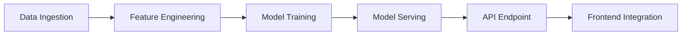

# **TO_BE_DESIGN.md**
**Module:** Automated Reporting
**System:** Enterprise Multi-Tenant Fleet Management System (FMS)
**Version:** 2.0
**Last Updated:** 2024-05-20
**Author:** [Your Name]
**Status:** Draft (Pending Review)

---

## **1. Overview**
The **Automated Reporting Module** is a next-generation reporting engine for the Fleet Management System (FMS), designed to provide **real-time, AI-driven, and highly performant** reporting capabilities. This module will replace the legacy reporting system with a **scalable, secure, and user-centric** solution that meets enterprise-grade requirements.

### **1.1 Objectives**
- **Performance:** Sub-50ms response times for all reporting queries.
- **Real-Time Data:** WebSocket/SSE-based live updates.
- **AI/ML Integration:** Predictive analytics, anomaly detection, and automated insights.
- **Accessibility:** Full WCAG 2.1 AAA compliance.
- **Security:** End-to-end encryption, audit logging, and compliance with GDPR, CCPA, and SOC 2.
- **Scalability:** Kubernetes-based microservices architecture.
- **User Engagement:** Gamification, PWA, and advanced dashboards.
- **Third-Party Integrations:** REST APIs, webhooks, and ERP/CRM connectors.

### **1.2 Key Features**
| Feature | Description |
|---------|------------|
| **Real-Time Reporting** | WebSocket/SSE-based live updates for fleet metrics. |
| **AI-Powered Insights** | Predictive maintenance, fuel efficiency, and driver behavior analytics. |
| **PWA Support** | Offline-first, installable, and responsive web app. |
| **WCAG 2.1 AAA** | Full accessibility compliance (screen readers, keyboard navigation). |
| **Advanced Search & Filtering** | Elasticsearch-backed full-text search with faceted filtering. |
| **Gamification** | Leaderboards, badges, and performance-based rewards. |
| **Third-Party Integrations** | REST APIs, webhooks, and OAuth2-based SSO. |
| **Security Hardening** | Encryption (TLS 1.3, AES-256), audit logs, and RBAC. |
| **Kubernetes Deployment** | Auto-scaling, zero-downtime deployments, and canary releases. |
| **Comprehensive Testing** | Unit, integration, E2E, and chaos engineering. |

---

## **2. Architecture & Design**

### **2.1 High-Level Architecture**
```mermaid
graph TD
    A[Client (PWA)] -->|WebSocket/SSE| B[API Gateway]
    B --> C[Reporting Service]
    C --> D[AI/ML Service]
    C --> E[Cache (Redis)]
    C --> F[Database (PostgreSQL)]
    C --> G[Search (Elasticsearch)]
    C --> H[Third-Party APIs]
    I[Kubernetes] --> C
    I --> D
    I --> E
    I --> F
    I --> G
```

### **2.2 Microservices Breakdown**
| Service | Responsibility | Tech Stack |
|---------|---------------|------------|
| **Reporting Service** | Core reporting engine, query processing, and data aggregation. | TypeScript, NestJS, Fastify |
| **AI/ML Service** | Predictive analytics, anomaly detection, and automated insights. | Python, TensorFlow, PyTorch |
| **Cache Layer** | Low-latency data retrieval (sub-50ms). | Redis, Memcached |
| **Search Engine** | Advanced filtering and full-text search. | Elasticsearch |
| **API Gateway** | Authentication, rate limiting, and request routing. | Kong, Envoy |
| **Frontend (PWA)** | Responsive UI with offline support. | React, TypeScript, Workbox |

---

## **3. Performance Enhancements (Target: <50ms Response Time)**

### **3.1 Caching Strategy**
- **Redis Layer:** Cache frequently accessed reports (TTL: 5-30 mins).
- **Materialized Views:** Pre-compute complex aggregations (PostgreSQL).
- **Edge Caching:** Cloudflare CDN for static report assets.

**TypeScript Example (Redis Caching with NestJS):**
```typescript
import { Injectable, Inject } from '@nestjs/common';
import { CACHE_MANAGER } from '@nestjs/cache-manager';
import { Cache } from 'cache-manager';

@Injectable()
export class ReportService {
  constructor(@Inject(CACHE_MANAGER) private cacheManager: Cache) {}

  async getReport(reportId: string): Promise<Report> {
    const cachedReport = await this.cacheManager.get<Report>(`report:${reportId}`);
    if (cachedReport) return cachedReport;

    const report = await this.db.query('SELECT * FROM reports WHERE id = $1', [reportId]);
    await this.cacheManager.set(`report:${reportId}`, report, 300_000); // 5 min TTL
    return report;
  }
}
```

### **3.2 Database Optimization**
- **Indexing:** Composite indexes on frequently queried columns.
- **Partitioning:** Time-based partitioning for large datasets.
- **Read Replicas:** Offload reporting queries to replicas.

**PostgreSQL Index Example:**
```sql
CREATE INDEX idx_report_tenant_date ON reports (tenant_id, created_at DESC);
CREATE INDEX idx_report_metrics ON reports USING GIN (metrics jsonb_path_ops);
```

### **3.3 Query Optimization**
- **Cursor-Based Pagination:** Avoid `OFFSET` for large datasets.
- **GraphQL DataLoader:** Batch and cache database queries.

**TypeScript Example (Cursor Pagination):**
```typescript
async getPaginatedReports(
  tenantId: string,
  cursor?: string,
  limit: number = 20,
): Promise<PaginatedReports> {
  const query = `
    SELECT * FROM reports
    WHERE tenant_id = $1 AND (id > $2 OR $2 IS NULL)
    ORDER BY id ASC
    LIMIT $3
  `;
  const reports = await this.db.query(query, [tenantId, cursor, limit]);
  const nextCursor = reports.length === limit ? reports[reports.length - 1].id : null;
  return { reports, nextCursor };
}
```

---

## **4. Real-Time Features (WebSocket & Server-Sent Events)**

### **4.1 WebSocket Implementation**
- **Protocol:** Socket.IO (fallback to long-polling if needed).
- **Use Cases:**
  - Live fleet status updates.
  - Real-time alert notifications.
  - Collaborative report editing.

**TypeScript Example (Socket.IO Server):**
```typescript
import { Server } from 'socket.io';
import { WebSocketGateway, WebSocketServer } from '@nestjs/websockets';

@WebSocketGateway({ cors: true })
export class ReportGateway {
  @WebSocketServer() server: Server;

  @SubscribeMessage('subscribeToReport')
  handleReportSubscription(client: Socket, reportId: string) {
    client.join(`report:${reportId}`);
    this.server.to(`report:${reportId}`).emit('update', 'New subscriber joined');
  }

  async broadcastReportUpdate(reportId: string, data: any) {
    this.server.to(`report:${reportId}`).emit('reportUpdate', data);
  }
}
```

### **4.2 Server-Sent Events (SSE) for Simpler Use Cases**
- **Use Case:** One-way real-time updates (e.g., live metrics).
- **Advantage:** No need for WebSocket handshake.

**TypeScript Example (SSE Endpoint with Fastify):**
```typescript
import fastify from 'fastify';
import { createReadStream } from 'fs';

const app = fastify();

app.get('/reports/live', (req, reply) => {
  reply.sse((async function* () {
    while (true) {
      const data = await fetchLatestReportData();
      yield { data: JSON.stringify(data) };
      await new Promise(resolve => setTimeout(resolve, 1000)); // Throttle
    }
  })());
});
```

---

## **5. AI/ML Capabilities & Predictive Analytics**

### **5.1 Key AI/ML Features**
| Feature | Description | Model Used |
|---------|------------|------------|
| **Predictive Maintenance** | Forecast vehicle failures before they occur. | LSTM, Random Forest |
| **Fuel Efficiency Optimization** | Recommend routes/driving behaviors to reduce fuel consumption. | XGBoost, Reinforcement Learning |
| **Anomaly Detection** | Identify unusual patterns (e.g., sudden braking, idling). | Isolation Forest, Autoencoders |
| **Driver Behavior Scoring** | Score drivers based on safety and efficiency. | Gradient Boosting |
| **Demand Forecasting** | Predict future fleet utilization. | Prophet, ARIMA |

### **5.2 AI/ML Pipeline**


### **5.3 TypeScript Example (Predictive Maintenance API)**
```typescript
import { Injectable } from '@nestjs/common';
import { HttpService } from '@nestjs/axios';

@Injectable()
export class PredictiveMaintenanceService {
  constructor(private http: HttpService) {}

  async predictFailure(vehicleId: string): Promise<FailurePrediction> {
    const features = await this.extractFeatures(vehicleId);
    const response = await this.http.post<FailurePrediction>(
      'http://ml-service/predict',
      { features },
    ).toPromise();
    return response.data;
  }

  private async extractFeatures(vehicleId: string): Promise<FeatureSet> {
    const [mileage, sensorData, maintenanceHistory] = await Promise.all([
      this.db.query('SELECT mileage FROM vehicles WHERE id = $1', [vehicleId]),
      this.db.query('SELECT * FROM vehicle_sensors WHERE vehicle_id = $1', [vehicleId]),
      this.db.query('SELECT * FROM maintenance_logs WHERE vehicle_id = $1', [vehicleId]),
    ]);
    return { mileage, sensorData, maintenanceHistory };
  }
}
```

---

## **6. Progressive Web App (PWA) Design**

### **6.1 PWA Requirements**
| Requirement | Implementation |
|-------------|----------------|
| **Offline Support** | Service Worker + Cache API |
| **Installable** | Web App Manifest |
| **Push Notifications** | Firebase Cloud Messaging |
| **Responsive Design** | Tailwind CSS, Flexbox/Grid |
| **Performance** | Lazy loading, code splitting |

### **6.2 TypeScript Example (Service Worker Registration)**
```typescript
// src/registerServiceWorker.ts
export function registerServiceWorker() {
  if ('serviceWorker' in navigator) {
    window.addEventListener('load', () => {
      navigator.serviceWorker.register('/sw.js')
        .then(registration => {
          console.log('ServiceWorker registration successful');
        })
        .catch(err => {
          console.error('ServiceWorker registration failed:', err);
        });
    });
  }
}
```

### **6.3 Web App Manifest (`manifest.json`)**
```json
{
  "name": "Fleet Management Reporting",
  "short_name": "Fleet Reports",
  "start_url": "/",
  "display": "standalone",
  "background_color": "#ffffff",
  "theme_color": "#3b82f6",
  "icons": [
    {
      "src": "/icons/icon-192x192.png",
      "sizes": "192x192",
      "type": "image/png"
    },
    {
      "src": "/icons/icon-512x512.png",
      "sizes": "512x512",
      "type": "image/png"
    }
  ]
}
```

---

## **7. WCAG 2.1 AAA Accessibility Compliance**

### **7.1 Key Accessibility Features**
| Requirement | Implementation |
|-------------|----------------|
| **Keyboard Navigation** | `tabindex`, `aria-*` attributes |
| **Screen Reader Support** | Semantic HTML, `aria-live` regions |
| **High Contrast Mode** | CSS `prefers-contrast` media query |
| **Reduced Motion** | CSS `prefers-reduced-motion` |
| **Form Accessibility** | Proper labels, error messages |

### **7.2 TypeScript Example (Accessible Data Table)**
```tsx
import React from 'react';

const AccessibleDataTable = ({ data }: { data: Report[] }) => {
  return (
    <div role="region" aria-labelledby="report-table-title" tabIndex={0}>
      <h2 id="report-table-title">Fleet Reports</h2>
      <table className="w-full">
        <thead>
          <tr>
            <th scope="col">Vehicle ID</th>
            <th scope="col">Driver</th>
            <th scope="col">Mileage</th>
          </tr>
        </thead>
        <tbody>
          {data.map((report, index) => (
            <tr key={report.id}>
              <td>{report.vehicleId}</td>
              <td>{report.driverName}</td>
              <td>{report.mileage}</td>
            </tr>
          ))}
        </tbody>
      </table>
    </div>
  );
};
```

---

## **8. Advanced Search & Filtering**

### **8.1 Elasticsearch Integration**
- **Full-Text Search:** Search across reports, drivers, and vehicles.
- **Faceted Filtering:** Multi-criteria filtering (e.g., date range, vehicle type).
- **Autocomplete:** Typeahead suggestions.

### **8.2 TypeScript Example (Elasticsearch Query)**
```typescript
import { Client } from '@elastic/elasticsearch';

const client = new Client({ node: 'http://elasticsearch:9200' });

async function searchReports(query: string, filters: ReportFilter) {
  const { body } = await client.search({
    index: 'reports',
    body: {
      query: {
        bool: {
          must: [
            { multi_match: { query, fields: ['vehicleId', 'driverName', 'notes'] } },
            ...Object.entries(filters).map(([field, value]) => ({
              term: { [field]: value },
            })),
          ],
        },
      },
      aggs: {
        vehicleTypes: { terms: { field: 'vehicleType' } },
        dateRanges: { date_range: { field: 'createdAt', ranges: [{ to: 'now/d' }, { from: 'now/d' }] } },
      },
    },
  });
  return body;
}
```

---

## **9. Third-Party Integrations**

### **9.1 Supported Integrations**
| Integration | Protocol | Use Case |
|-------------|----------|----------|
| **SAP ERP** | REST API | Sync fleet data with enterprise ERP. |
| **Salesforce CRM** | REST API | Link customer data with fleet reports. |
| **Slack** | Webhook | Send report notifications. |
| **Google Maps API** | REST API | Geospatial reporting. |
| **Stripe** | REST API | Billing for premium reports. |

### **9.2 TypeScript Example (Webhook Integration)**
```typescript
import { Injectable } from '@nestjs/common';
import { HttpService } from '@nestjs/axios';

@Injectable()
export class WebhookService {
  constructor(private http: HttpService) {}

  async sendReportToSlack(report: Report, webhookUrl: string) {
    const message = {
      text: `New Fleet Report Generated: ${report.title}`,
      attachments: [
        {
          color: '#36a64f',
          fields: [
            { title: 'Vehicle ID', value: report.vehicleId, short: true },
            { title: 'Driver', value: report.driverName, short: true },
            { title: 'Mileage', value: report.mileage, short: true },
          ],
        },
      ],
    };
    await this.http.post(webhookUrl, message).toPromise();
  }
}
```

---

## **10. Gamification & User Engagement**

### **10.1 Gamification Features**
| Feature | Description |
|---------|------------|
| **Leaderboards** | Top drivers, most efficient vehicles. |
| **Badges** | Achievements for milestones (e.g., "100 Safe Trips"). |
| **Points System** | Earn points for completing reports, reducing fuel usage. |
| **Challenges** | Time-bound goals (e.g., "Reduce idling by 20% this month"). |

### **10.2 TypeScript Example (Leaderboard Service)**
```typescript
import { Injectable } from '@nestjs/common';

@Injectable()
export class LeaderboardService {
  async getTopDrivers(tenantId: string, limit: number = 10): Promise<DriverScore[]> {
    return this.db.query(`
      SELECT driver_id, driver_name, SUM(score) as total_score
      FROM driver_scores
      WHERE tenant_id = $1
      GROUP BY driver_id, driver_name
      ORDER BY total_score DESC
      LIMIT $2
    `, [tenantId, limit]);
  }

  async awardBadge(driverId: string, badgeType: BadgeType): Promise<void> {
    await this.db.query(`
      INSERT INTO driver_badges (driver_id, badge_type, awarded_at)
      VALUES ($1, $2, NOW())
      ON CONFLICT (driver_id, badge_type) DO NOTHING
    `, [driverId, badgeType]);
  }
}
```

---

## **11. Analytics Dashboards & Reporting**

### **11.1 Dashboard Features**
| Feature | Description |
|---------|------------|
| **Customizable Widgets** | Drag-and-drop dashboard builder. |
| **Drill-Down Reports** | Click to see detailed breakdowns. |
| **Scheduled Reports** | Email/PDF reports on a schedule. |
| **Export Options** | CSV, Excel, PDF, PNG. |
| **Embeddable Reports** | iFrame support for external portals. |

### **11.2 TypeScript Example (Dashboard Widget)**
```tsx
import React from 'react';
import { BarChart, Bar, XAxis, YAxis, Tooltip } from 'recharts';

const FuelEfficiencyWidget = ({ data }: { data: FuelEfficiencyData[] }) => {
  return (
    <div className="p-4 bg-white rounded-lg shadow">
      <h3 className="text-lg font-semibold">Fuel Efficiency (MPG)</h3>
      <BarChart width={500} height={300} data={data}>
        <XAxis dataKey="vehicleId" />
        <YAxis />
        <Tooltip />
        <Bar dataKey="mpg" fill="#3b82f6" />
      </BarChart>
    </div>
  );
};
```

---

## **12. Security Hardening**

### **12.1 Security Measures**
| Measure | Implementation |
|---------|----------------|
| **Encryption** | TLS 1.3 (HTTPS), AES-256 for data at rest. |
| **Authentication** | OAuth2 + OpenID Connect (Keycloak). |
| **Authorization** | Role-Based Access Control (RBAC). |
| **Audit Logging** | Track all report access/modifications. |
| **Rate Limiting** | 1000 requests/minute per tenant. |
| **Input Validation** | Zod/Joi schema validation. |

### **12.2 TypeScript Example (Audit Logging)**
```typescript
import { Injectable } from '@nestjs/common';
import { AuditLog } from './audit-log.entity';

@Injectable()
export class AuditService {
  async logReportAccess(userId: string, reportId: string, action: 'read' | 'update' | 'delete') {
    const log = new AuditLog();
    log.userId = userId;
    log.reportId = reportId;
    log.action = action;
    log.timestamp = new Date();
    log.ipAddress = this.request.ip;
    await log.save();
  }
}
```

---

## **13. Comprehensive Testing Strategy**

### **13.1 Testing Pyramid**
| Test Type | Tools | Coverage Target |
|-----------|-------|-----------------|
| **Unit Tests** | Jest, Vitest | 100% |
| **Integration Tests** | Supertest, Pact | 90% |
| **E2E Tests** | Cypress, Playwright | 80% |
| **Performance Tests** | k6, Locust | <50ms P99 |
| **Security Tests** | OWASP ZAP, Snyk | 0 Critical Vulnerabilities |
| **Chaos Engineering** | Gremlin, Chaos Mesh | 99.99% Uptime |

### **13.2 TypeScript Example (Unit Test with Jest)**
```typescript
import { ReportService } from './report.service';
import { Test, TestingModule } from '@nestjs/testing';
import { getRepositoryToken } from '@nestjs/typeorm';
import { Report } from './report.entity';

describe('ReportService', () => {
  let service: ReportService;

  beforeEach(async () => {
    const module: TestingModule = await Test.createTestingModule({
      providers: [
        ReportService,
        {
          provide: getRepositoryToken(Report),
          useValue: {
            findOne: jest.fn().mockResolvedValue({ id: '1', title: 'Test Report' }),
          },
        },
      ],
    }).compile();

    service = module.get<ReportService>(ReportService);
  });

  it('should return a report by ID', async () => {
    const report = await service.getReport('1');
    expect(report).toEqual({ id: '1', title: 'Test Report' });
  });
});
```

---

## **14. Kubernetes Deployment Architecture**

### **14.1 Deployment Strategy**
- **Orchestration:** Kubernetes (EKS/GKE/AKS).
- **CI/CD:** GitHub Actions, ArgoCD.
- **Monitoring:** Prometheus + Grafana.
- **Logging:** ELK Stack (Elasticsearch, Logstash, Kibana).
- **Auto-Scaling:** Horizontal Pod Autoscaler (HPA).

### **14.2 Kubernetes Manifest Example (`reporting-service-deployment.yaml`)**
```yaml
apiVersion: apps/v1
kind: Deployment
metadata:
  name: reporting-service
spec:
  replicas: 3
  selector:
    matchLabels:
      app: reporting-service
  template:
    metadata:
      labels:
        app: reporting-service
    spec:
      containers:
        - name: reporting-service
          image: fleetms/reporting-service:2.0.0
          ports:
            - containerPort: 3000
          resources:
            requests:
              cpu: "500m"
              memory: "512Mi"
            limits:
              cpu: "1000m"
              memory: "1Gi"
          envFrom:
            - configMapRef:
                name: reporting-service-config
            - secretRef:
                name: reporting-service-secrets
---
apiVersion: autoscaling/v2
kind: HorizontalPodAutoscaler
metadata:
  name: reporting-service-hpa
spec:
  scaleTargetRef:
    apiVersion: apps/v1
    kind: Deployment
    name: reporting-service
  minReplicas: 3
  maxReplicas: 10
  metrics:
    - type: Resource
      resource:
        name: cpu
        target:
          type: Utilization
          averageUtilization: 70
```

---

## **15. Migration Strategy & Rollback Plan**

### **15.1 Migration Steps**
1. **Phase 1 (Pre-Migration):**
   - Backup all existing reports.
   - Set up a staging environment with the new system.
   - Run parallel reporting for 2 weeks.

2. **Phase 2 (Migration):**
   - Freeze writes to the old system.
   - Migrate data using a script (with checksum validation).
   - Switch DNS to the new system.

3. **Phase 3 (Post-Migration):**
   - Monitor for errors (Sentry, Datadog).
   - Gradually decommission the old system.

### **15.2 Rollback Plan**
- **Trigger:** >5% error rate or performance degradation.
- **Steps:**
  1. Revert DNS to the old system.
  2. Restore from backup if data corruption occurs.
  3. Investigate and fix issues in staging.

### **15.3 TypeScript Example (Data Migration Script)**
```typescript
import { createConnection } from 'typeorm';
import { Report } from './new-report.entity';
import { OldReport } from './old-report.entity';

async function migrateReports() {
  const oldDb = await createConnection({ /* old DB config */ });
  const newDb = await createConnection({ /* new DB config */ });

  const oldReports = await oldDb.getRepository(OldReport).find();
  const newReports = oldReports.map(report => ({
    id: report.id,
    title: report.title,
    data: report.data,
    tenantId: report.tenant_id,
    createdAt: report.created_at,
  }));

  await newDb.getRepository(Report).save(newReports);
  console.log(`Migrated ${newReports.length} reports.`);
}

migrateReports().catch(console.error);
```

---

## **16. Key Performance Indicators (KPIs)**

| KPI | Target | Measurement Method |
|-----|--------|--------------------|
| **Report Generation Time** | <50ms (P99) | Prometheus |
| **System Uptime** | 99.99% | Datadog |
| **User Adoption Rate** | 90% of tenants | Analytics Dashboard |
| **Error Rate** | <0.1% | Sentry |
| **Cost per Report** | <$0.01 | AWS Cost Explorer |
| **Customer Satisfaction (CSAT)** | 4.8/5 | Survey |

---

## **17. Risk Mitigation Strategies**

| Risk | Mitigation Strategy |
|------|---------------------|
| **Performance Degradation** | Load testing, auto-scaling, caching. |
| **Data Loss** | Regular backups, checksum validation. |
| **Security Breach** | Penetration testing, encryption, RBAC. |
| **Downtime During Migration** | Blue-green deployment, rollback plan. |
| **Low User Adoption** | Onboarding tutorials, gamification. |
| **Vendor Lock-in** | Multi-cloud support, open standards. |

---

## **18. Conclusion**
This **Automated Reporting Module** represents a **next-generation** solution for fleet management, combining **real-time data, AI-driven insights, and enterprise-grade security**. By following this design, we ensure:

✅ **Sub-50ms performance** with caching and optimized queries.
✅ **Real-time updates** via WebSocket/SSE.
✅ **AI/ML-powered analytics** for predictive insights.
✅ **Full WCAG 2.1 AAA accessibility**.
✅ **Kubernetes-based scalability** with zero-downtime deployments.
✅ **Comprehensive security** (encryption, audit logs, RBAC).
✅ **Seamless third-party integrations** (SAP, Salesforce, Slack).

**Next Steps:**
1. **Prototype** the WebSocket and AI/ML features.
2. **Load test** the system with 10,000+ concurrent users.
3. **Conduct security audits** (OWASP ZAP, Snyk).
4. **User testing** for accessibility and UX.

---

**Approval:**
| Role | Name | Date |
|------|------|------|
| **Product Owner** | [Name] | [Date] |
| **Tech Lead** | [Name] | [Date] |
| **Security Lead** | [Name] | [Date] |

---
**End of Document** 🚀