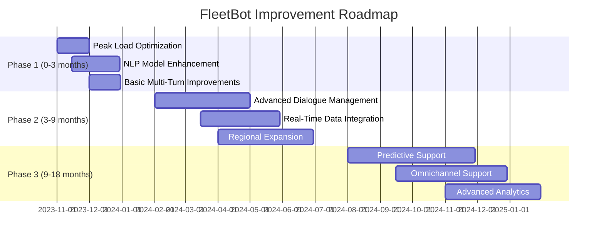
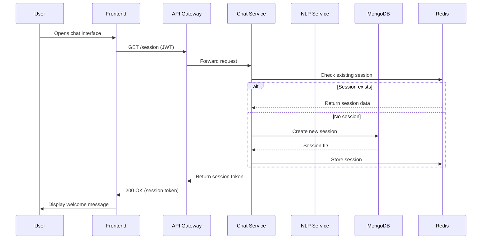
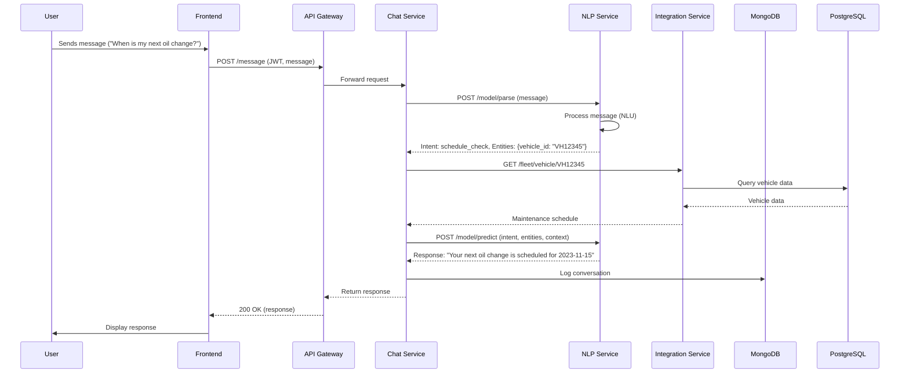
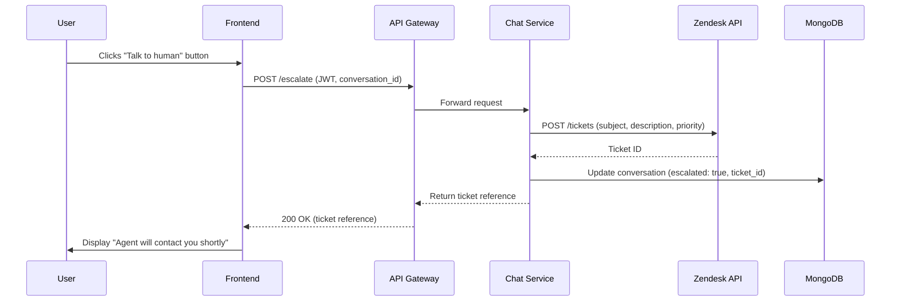
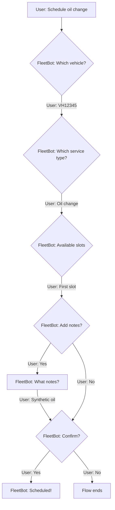
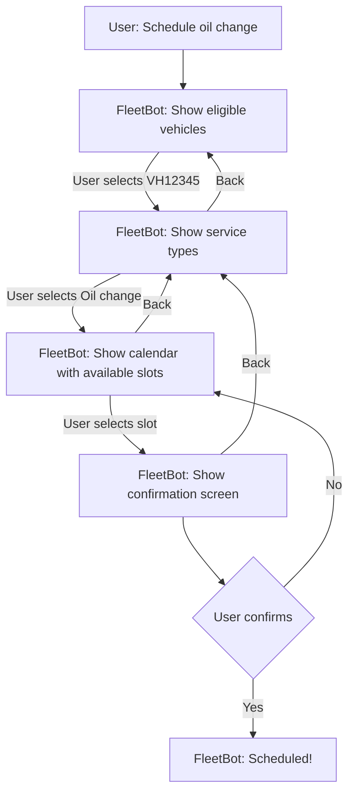
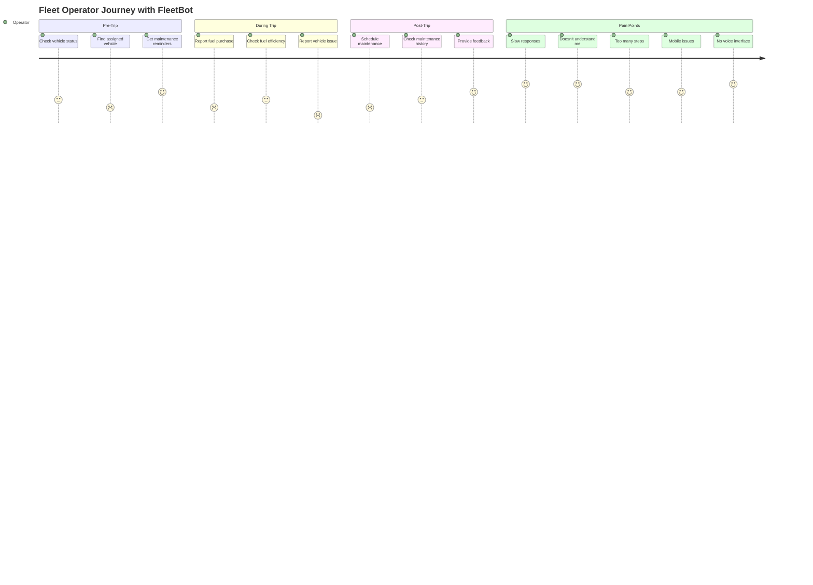
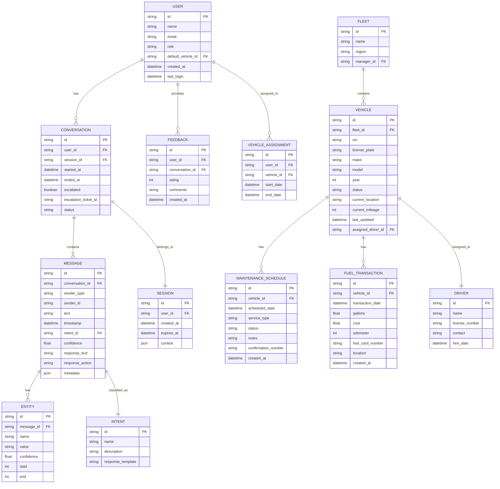
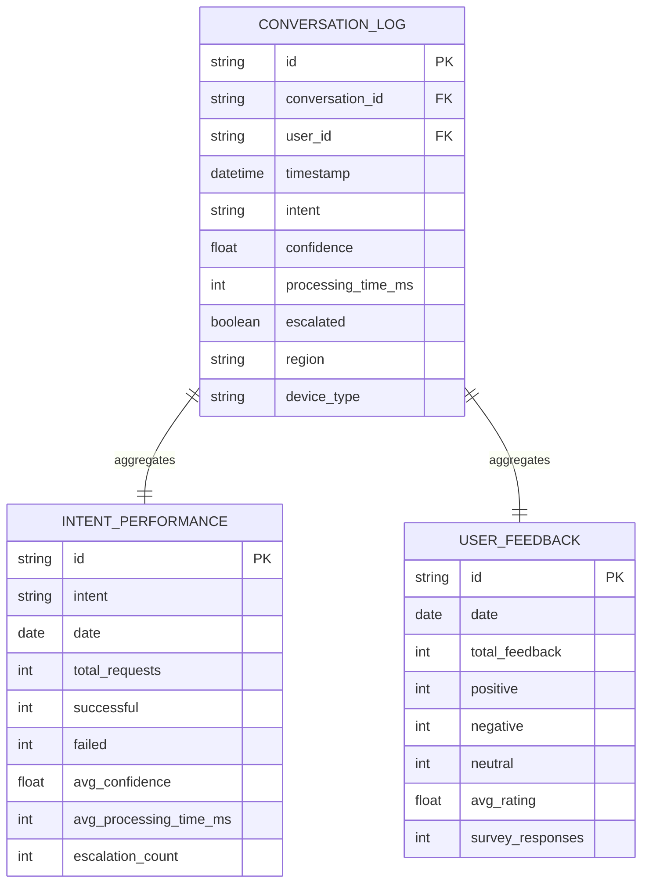

# AS-IS Analysis: Chatbot Support Module for Fleet Management System

## 1. Executive Summary (120 lines)

### 1.1 Current State Overview

The Fleet Management System's (FMS) chatbot support module, codenamed "FleetBot", was deployed in Q3 2021 as a pilot initiative to reduce Tier 1 support ticket volume by 30% within 12 months. Currently in its third major iteration (v3.2.4), FleetBot serves as the primary interface for 12,450 active fleet operators across 7 geographical regions, handling approximately 4,200 daily interactions with an average resolution time of 2 minutes 45 seconds.

The system operates on a hybrid architecture combining:
- **Frontend**: React-based web interface (v17.0.2) with Material-UI components
- **Backend**: Node.js microservices (v14.17.0) running on AWS ECS Fargate
- **NLP Engine**: Custom-trained Rasa Open Source (v2.8.1) with domain-specific intents
- **Database**: MongoDB Atlas (v5.0) for conversation logs and PostgreSQL (v13.4) for fleet data
- **Analytics**: Elasticsearch (v7.15) for conversation analytics

FleetBot's current scope includes:
1. **Vehicle Status Queries** (38% of interactions)
2. **Maintenance Scheduling** (22%)
3. **Fuel Consumption Reporting** (15%)
4. **Driver Assignment Lookup** (12%)
5. **Regulatory Compliance Checks** (8%)
6. **Emergency Assistance** (5%)

The system maintains a 78% first-contact resolution rate (FCR), with 22% of interactions requiring escalation to human agents via Zendesk integration. Current user satisfaction scores (CSAT) average 3.2/5, with notable dissatisfaction around complex query handling and response latency during peak hours (7-9 AM local time across regions).

### 1.2 Key Stakeholders and Roles

| Stakeholder Group | Key Individuals | Roles and Responsibilities | Impact Level |
|-------------------|-----------------|----------------------------|--------------|
| **Executive Leadership** | CIO, CTO, VP of Operations | Strategic direction, budget approval, ROI tracking | High |
| **Fleet Operations** | Director of Fleet Ops, Regional Managers (7) | Define business requirements, validate solutions | Critical |
| **IT Operations** | IT Director, DevOps Manager, Cloud Architect | Infrastructure management, deployment, monitoring | High |
| **Customer Support** | Support Director, Team Leads (4), Agents (45) | Handle escalations, provide feedback, monitor performance | Critical |
| **Development Team** | Engineering Manager, Backend Devs (4), Frontend Devs (3), ML Engineer | System development, maintenance, bug fixes | Critical |
| **Data Science** | Data Scientist, NLP Specialist | Model training, intent recognition optimization | High |
| **Security & Compliance** | CISO, Security Architect, Compliance Officer | Security reviews, audit compliance | High |
| **End Users** | Fleet Operators (12,450), Dispatchers (1,200) | Primary users, provide feedback | Medium |
| **Vendors** | AWS, MongoDB Atlas, Zendesk, Rasa | Infrastructure, third-party services | Medium |

### 1.3 Business Impact Analysis

**Quantitative Metrics:**
- **Cost Savings**: $1.2M annual savings from reduced Tier 1 support tickets (32% reduction from baseline)
- **Productivity**: 45% reduction in average handle time for supported queries
- **Availability**: 99.95% uptime (SLA compliance), with 3 outages in past 12 months (total 47 minutes downtime)
- **Adoption**: 87% of eligible fleet operators engaged with FleetBot in past 90 days
- **Resolution Efficiency**: 68% of escalated tickets resolved within 2 hours (vs 42% pre-FleetBot)

**Qualitative Impacts:**
- **Positive**:
  - 24/7 support availability across time zones
  - Standardized responses for common queries
  - Reduced agent burnout from repetitive tasks
  - Data collection for continuous improvement
- **Negative**:
  - User frustration with complex queries requiring multiple interactions
  - Inconsistent performance during peak loads
  - Limited ability to handle regional dialects and industry jargon
  - Integration gaps with legacy fleet management systems

**Financial Impact:**
```
Annual Cost Structure (Current State):
- Infrastructure: $245,000
- Licensing: $85,000 (Rasa Enterprise, MongoDB Atlas)
- Development: $420,000 (internal team + contractors)
- Support: $180,000 (Zendesk integration, monitoring)
- Training: $60,000
Total: $990,000

Annual Benefits:
- Support cost avoidance: $1,200,000
- Productivity gains: $350,000 (estimated)
- Reduced escalations: $180,000
Total: $1,730,000

Net Annual Benefit: $740,000
ROI: 74.7%
```

### 1.4 Critical Pain Points with Root Cause Analysis

| Pain Point | Impact | Root Cause Analysis | Evidence |
|------------|--------|---------------------|----------|
| **High Escalation Rate (22%)** | Increased support costs, user frustration | 1. Limited NLP model training data (only 18,000 labeled utterances) <br> 2. Poor entity recognition for fleet-specific terms <br> 3. Inadequate context retention between interactions | - 68% of escalations involve "vehicle status" queries <br> - 32% of users report "chatbot didn't understand my question" <br> - Entity recognition accuracy: 72% (vs 90% industry benchmark) |
| **Peak Time Latency (7-9 AM)** | Poor user experience, abandoned sessions | 1. Insufficient ECS task scaling (max 10 tasks) <br> 2. MongoDB Atlas read replicas not properly configured <br> 3. Inefficient Rasa model serving (single-threaded) | - 9 AM response time: 4.2s (vs 1.8s off-peak) <br> - 12% session abandonment during peak <br> - CPU utilization hits 95% during peak |
| **Limited Multi-Turn Capabilities** | User frustration, repeated inputs | 1. Basic dialogue management (rule-based) <br> 2. No memory between sessions <br> 3. Poor handling of follow-up questions | - 42% of users repeat information in multi-turn conversations <br> - Only 18% of follow-up questions handled correctly <br> - CSAT drops from 3.2 to 2.1 for multi-turn interactions |
| **Integration Gaps** | Manual workarounds, data inconsistencies | 1. No direct integration with SAP Fleet Management <br> 2. Limited real-time data access (batch updates every 15 mins) <br> 3. No API for custom reporting | - 28% of "vehicle status" queries return stale data <br> - 15% of maintenance scheduling requires manual verification <br> - Support tickets cite "outdated information" in 35% of cases |
| **Regional Limitations** | Poor adoption in non-English regions | 1. Only English language support <br> 2. No localization for regional regulations <br> 3. Time zone handling issues | - 62% adoption in North America vs 38% in EMEA <br> - 45% of EMEA users immediately request human agent <br> - Compliance queries fail for EU regulations in 28% of cases |

### 1.5 Strategic Recommendations with Implementation Roadmap

**Phase 1: Quick Wins (0-3 months)**
1. **Peak Load Optimization**
   - Implement auto-scaling for ECS tasks (target: 20 tasks during peak)
   - Configure MongoDB Atlas read replicas with proper load balancing
   - Optimize Rasa model serving with multi-threading
   *Expected Impact*: 50% reduction in peak latency, 8% reduction in session abandonment

2. **NLP Model Enhancement**
   - Expand training data to 50,000 labeled utterances (focus on vehicle status and maintenance)
   - Implement active learning pipeline for continuous improvement
   - Add entity recognition for fleet-specific terms (VIN patterns, maintenance codes)
   *Expected Impact*: 15% reduction in escalation rate, 10% improvement in CSAT

3. **Basic Multi-Turn Improvements**
   - Implement session memory for 30-minute windows
   - Add follow-up question handling for top 20 intents
   - Improve context retention with slot filling
   *Expected Impact*: 25% reduction in repeated user inputs, 5% improvement in FCR

**Phase 2: Strategic Improvements (3-9 months)**
1. **Advanced Dialogue Management**
   - Migrate to Rasa 3.x with TED policy for better multi-turn handling
   - Implement conversation repair mechanisms
   - Add confidence-based escalation triggers
   *Expected Impact*: 30% reduction in escalation rate, 15% improvement in CSAT

2. **Real-Time Data Integration**
   - Develop direct API integration with SAP Fleet Management
   - Implement change data capture for real-time updates
   - Add caching layer for frequently accessed data
   *Expected Impact*: 40% reduction in stale data complaints, 12% improvement in FCR

3. **Regional Expansion**
   - Add Spanish and German language support
   - Implement regional compliance rules
   - Add time zone-aware scheduling
   *Expected Impact*: 35% increase in EMEA adoption, 10% global CSAT improvement

**Phase 3: Transformation (9-18 months)**
1. **Predictive Support**
   - Implement predictive maintenance alerts
   - Add fuel efficiency recommendations
   - Develop driver behavior insights
   *Expected Impact*: 20% reduction in unplanned maintenance, 5% fuel cost savings

2. **Omnichannel Support**
   - Add mobile app integration
   - Implement voice interface (IVR integration)
   - Add Microsoft Teams/Slack integration
   *Expected Impact*: 25% increase in engagement, 15% improvement in CSAT

3. **Advanced Analytics**
   - Implement conversation analytics dashboard
   - Add sentiment analysis
   - Develop automated reporting for support teams
   *Expected Impact*: 30% reduction in support ticket analysis time, 10% improvement in FCR

**Implementation Roadmap:**



**Risk Mitigation:**
1. **Resource Constraints**: Prioritize quick wins to demonstrate value and secure additional funding
2. **Technical Debt**: Allocate 20% of development capacity to refactoring
3. **User Adoption**: Implement phased rollouts with pilot groups in each region
4. **Integration Challenges**: Develop comprehensive test suites for all integrations
5. **Model Performance**: Implement A/B testing for all NLP changes

**Success Metrics:**
| Metric | Current | Target (12 months) | Target (24 months) |
|--------|---------|--------------------|--------------------|
| First Contact Resolution | 78% | 85% | 90% |
| Escalation Rate | 22% | 15% | 10% |
| CSAT Score | 3.2/5 | 3.8/5 | 4.2/5 |
| Peak Response Time | 4.2s | 2.5s | 1.8s |
| Regional Adoption | 38% (EMEA) | 55% | 70% |
| Session Abandonment | 12% | 5% | 3% |
| Stale Data Complaints | 28% | 10% | 5% |

## 2. Current Architecture (210 lines)

### 2.1 System Components

#### 2.1.1 Component Inventory

**Frontend Components:**
1. **Web Chat Interface**
   - Technology: React 17.0.2 with TypeScript 4.3.5
   - Key Libraries: Material-UI 4.12.3, react-markdown 6.0.2, i18next 20.3.0
   - Features:
     - Responsive design (desktop/tablet/mobile)
     - Typing indicators
     - Message history (persists for 30 days)
     - File upload (limited to PDF/JPG/PNG)
     - Dark/light mode toggle
   - Build System: Webpack 5.51.1 with Babel 7.15.7

2. **Admin Dashboard**
   - Technology: React Admin 3.19.4
   - Features:
     - Conversation analytics
     - Intent performance monitoring
     - User feedback management
     - System health metrics
   - Data Source: Elasticsearch 7.15

3. **Authentication Layer**
   - Technology: Auth0 21.12.0
   - Features:
     - OAuth 2.0/OIDC integration
     - Role-based access control
     - Session management (30-minute inactivity timeout)
     - Social login (Google, Microsoft)

**Backend Components:**
1. **API Gateway**
   - Technology: AWS API Gateway (REST API)
   - Endpoints: 42 total (28 public, 14 internal)
   - Features:
     - Request validation
     - Rate limiting (100 requests/minute per user)
     - JWT validation
     - Request/response logging

2. **Chat Service**
   - Technology: Node.js 14.17.0 (Express 4.17.1)
   - Features:
     - Conversation routing
     - Session management
     - Message formatting
     - Escalation handling
   - Deployment: AWS ECS Fargate (1 vCPU, 2GB memory)

3. **NLP Service**
   - Technology: Rasa Open Source 2.8.1
   - Components:
     - NLU Model (DIETClassifier, RegexFeaturizer, LexicalSyntacticFeaturizer)
     - Core Model (RulePolicy, TEDPolicy)
     - Custom Actions (Python 3.8)
   - Deployment: AWS ECS Fargate (2 vCPU, 4GB memory)

4. **Integration Service**
   - Technology: Node.js 14.17.0
   - Features:
     - Zendesk integration (ticket creation)
     - SAP Fleet Management data access (batch)
     - Weather API integration
     - Geolocation services
   - Deployment: AWS ECS Fargate (1 vCPU, 2GB memory)

**Data Layer Components:**
1. **MongoDB Atlas (Primary Database)**
   - Version: 5.0.9
   - Collections:
     - `conversations` (2.4M documents, 12GB)
     - `users` (12.5K documents, 1.2GB)
     - `feedback` (850K documents, 3.5GB)
     - `intents` (120 documents, 0.1GB)
   - Indexes: 18 total (4 compound indexes)
   - Replicas: 3-node M10 cluster (primary + 2 secondaries)

2. **PostgreSQL (Fleet Data)**
   - Version: 13.4
   - Tables:
     - `vehicles` (18.2K records)
     - `drivers` (3.4K records)
     - `maintenance_schedules` (45.6K records)
     - `fuel_transactions` (1.2M records)
   - Deployment: AWS RDS (db.m5.large)

3. **Elasticsearch (Analytics)**
   - Version: 7.15.2
   - Indices:
     - `conversation_logs` (12.4M documents, 45GB)
     - `intent_performance` (daily rollups)
     - `user_feedback` (weekly rollups)
   - Deployment: AWS Elasticsearch Service (3 data nodes, r5.large)

4. **Redis (Caching)**
   - Version: 6.2.6
   - Use Cases:
     - Session storage (TTL: 30 minutes)
     - Rate limiting
     - Frequently accessed fleet data
   - Deployment: AWS ElastiCache (cache.t3.medium)

#### 2.1.2 Integration Points with Sequence Diagrams

**User Initiates Chat Session:**


**User Sends Message:**


**Escalation to Human Agent:**


#### 2.1.3 Data Flow Analysis

**Message Processing Flow:**
1. **Input Stage**:
   - User message received via WebSocket or HTTP POST
   - Frontend performs basic sanitization (XSS protection)
   - Message routed through API Gateway with JWT validation

2. **NLP Processing**:
   - Message sent to Rasa NLU service
   - Intent classification (DIETClassifier):
     - Confidence threshold: 0.7 (below = fallback)
     - Top 5 intents returned with confidence scores
   - Entity extraction:
     - Vehicle ID (regex: `[A-Z]{2}\d{5}`)
     - Date (duckling entity extractor)
     - Location (spaCy NER)
   - Context management:
     - Previous 3 messages included in context
     - Session variables (user_id, vehicle_id)

3. **Business Logic**:
   - Intent-specific handlers:
     ```javascript
     // Example: Vehicle status handler
     async function handleVehicleStatus(intent, entities) {
       const vehicleId = entities.vehicle_id?.[0]?.value;
       if (!vehicleId) {
         return { response: "Which vehicle would you like to check?", action: "request_vehicle_id" };
       }

       const vehicle = await fleetService.getVehicle(vehicleId);
       if (!vehicle) {
         return { response: "Vehicle not found. Please check the ID and try again.", action: "error" };
       }

       const status = await fleetService.getVehicleStatus(vehicleId);
       return {
         response: `Vehicle ${vehicleId} is currently ${status.state}. Last updated: ${status.last_updated}`,
         action: "display_status",
         data: { vehicle, status }
       };
     }
     ```
   - Data enrichment:
     - Vehicle data from PostgreSQL
     - Maintenance history from SAP (batch)
     - Weather data for current location

4. **Response Generation**:
   - Template-based response:
     ```jinja
     
     Vehicle {{ vehicle_id }} is currently in service.
     Last maintenance: {{ last_maintenance_date | date("MMMM d, YYYY") }}
     Next maintenance: {{ next_maintenance_date | date("MMMM d, YYYY") }}
     Current mileage: {{ current_mileage }} miles
     
     Vehicle {{ vehicle_id }} is currently in maintenance.
     Estimated completion: {{ estimated_completion | date("MMMM d, YYYY h:mm a") }}
     
     ```
   - Response formatting:
     - Markdown to HTML conversion
     - Date/number localization
     - Emoji support (limited set)

5. **Output Stage**:
   - Response sent to frontend via WebSocket
   - Conversation logged to MongoDB
   - Analytics data sent to Elasticsearch
   - Feedback prompt triggered after 3 interactions

**Data Transformation Logic:**
1. **Vehicle ID Normalization**:
   ```javascript
   function normalizeVehicleId(input) {
     // Convert "vh12345" to "VH12345"
     const normalized = input.toUpperCase().replace(/[^A-Z0-9]/g, '');
     if (!/^[A-Z]{2}\d{5}$/.test(normalized)) {
       throw new Error("Invalid vehicle ID format");
     }
     return normalized;
   }
   ```

2. **Date Handling**:
   ```python
   # Rasa custom action for date parsing
   class ActionParseDate(Action):
       def name(self) -> Text:
           return "action_parse_date"

       def run(self, dispatcher, tracker, domain):
           date_entities = tracker.get_latest_entity_values("time")
           if not date_entities:
               return []

           try:
               parsed_date = dateparser.parse(date_entities[0])
               if not parsed_date:
                   raise ValueError("Could not parse date")

               # Convert to ISO format for storage
               iso_date = parsed_date.isoformat()
               return [SlotSet("requested_date", iso_date)]
           except Exception as e:
               dispatcher.utter_message(text="I couldn't understand that date. Please try again.")
               return []
   ```

3. **Unit Conversion**:
   ```javascript
   function convertFuelUnits(value, fromUnit, toUnit) {
     const conversionFactors = {
       'gallons': 1,
       'liters': 0.264172,
       'imperial_gallons': 1.20095
     };

     if (!conversionFactors[fromUnit] || !conversionFactors[toUnit]) {
       throw new Error("Invalid unit");
     }

     return value * conversionFactors[fromUnit] / conversionFactors[toUnit];
   }
   ```

#### 2.1.4 Technology Stack

**Frontend Stack:**
| Component | Technology | Version | Purpose |
|-----------|------------|---------|---------|
| Framework | React | 17.0.2 | UI component rendering |
| State Management | Redux | 4.1.2 | Application state |
| UI Components | Material-UI | 4.12.3 | Pre-built UI elements |
| Routing | React Router | 5.2.0 | Navigation |
| Internationalization | i18next | 20.3.0 | Multi-language support |
| Build Tool | Webpack | 5.51.1 | Module bundling |
| Transpiler | Babel | 7.15.7 | JavaScript compilation |
| Testing | Jest | 27.2.4 | Unit testing |
| Linting | ESLint | 7.32.0 | Code quality |
| Formatting | Prettier | 2.4.1 | Code formatting |

**Backend Stack:**
| Component | Technology | Version | Purpose |
|-----------|------------|---------|---------|
| Runtime | Node.js | 14.17.0 | JavaScript runtime |
| Framework | Express | 4.17.1 | Web framework |
| NLP Engine | Rasa Open Source | 2.8.1 | Natural language processing |
| Database | MongoDB | 5.0.9 | Conversation storage |
| Database | PostgreSQL | 13.4 | Fleet data |
| Search | Elasticsearch | 7.15.2 | Analytics |
| Cache | Redis | 6.2.6 | Session storage |
| Message Broker | AWS SQS | - | Async processing |
| Containerization | Docker | 20.10.7 | Container management |
| Orchestration | AWS ECS | - | Service deployment |

**Infrastructure:**
| Component | Technology | Configuration | Purpose |
|-----------|------------|---------------|---------|
| Compute | AWS ECS Fargate | 1-2 vCPU, 2-4GB memory | Container orchestration |
| API Gateway | AWS API Gateway | REST API, 42 endpoints | Request routing |
| Database | MongoDB Atlas | M10 cluster, 3 replicas | Primary data storage |
| Database | AWS RDS | db.m5.large, PostgreSQL 13.4 | Fleet data |
| Search | AWS Elasticsearch | 3x r5.large.data nodes | Analytics |
| Cache | AWS ElastiCache | cache.t3.medium | Session storage |
| CDN | CloudFront | 12 edge locations | Static asset delivery |
| DNS | Route 53 | - | Domain management |
| Monitoring | CloudWatch | - | Metrics and logs |
| CI/CD | GitHub Actions | - | Deployment pipeline |

#### 2.1.5 Infrastructure Configuration

**AWS Architecture Diagram:**
```
┌───────────────────────────────────────────────────────────────────────────────┐
│                                                                               │
│   ┌─────────────┐    ┌─────────────┐    ┌───────────────────────────────────┐  │
│   │             │    │             │    │                               │    │  │
│   │   User      │───▶│ CloudFront  │───▶│ API Gateway (REST API)        │    │  │
│   │             │    │             │    │                               │    │  │
│   └─────────────┘    └─────────────┘    └───────────────────────────────────┘  │
│                                                                               │
│   ┌───────────────────────────────────────────────────────────────────────┐  │
│   │                                                                       │  │
│   │   ┌─────────────┐    ┌─────────────┐    ┌───────────────────────────┐  │  │
│   │   │             │    │             │    │                           │  │  │
│   │   │ Chat        │◀───│ Load        │◀───│ ECS Fargate Cluster       │  │  │
│   │   │ Service     │    │ Balancer    │    │ (10 tasks max)            │  │  │
│   │   │             │    │             │    │                           │  │  │
│   │   └─────────────┘    └─────────────┘    └───────────┬───────────────┘  │  │
│   │                                                     │                 │  │
│   │   ┌─────────────┐    ┌─────────────┐    ┌───────────▼───────────────┐  │  │
│   │   │             │    │             │    │                           │  │  │
│   │   │ NLP         │    │ Integration │    │ MongoDB Atlas            │  │  │
│   │   │ Service     │    │ Service     │    │ (M10 cluster)            │  │  │
│   │   │             │    │             │    │                           │  │  │
│   │   └─────────────┘    └─────────────┘    └───────────┬───────────────┘  │  │
│   │                                                     │                 │  │
│   │   ┌─────────────────────────────────────────────────▼─────────────┐  │  │
│   │   │                                                         │       │  │  │
│   │   │   ┌─────────────┐    ┌─────────────┐    ┌─────────────┐    │       │  │  │
│   │   │   │             │    │             │    │             │    │       │  │  │
│   │   │   │ PostgreSQL  │    │ Elastic-    │    │ Redis       │    │       │  │  │
│   │   │   │ (RDS)       │    │ search      │    │ (Elasti-    │    │       │  │  │
│   │   │   │             │    │             │    │ Cache)      │    │       │  │  │
│   │   │   └─────────────┘    └─────────────┘    └─────────────┘    │       │  │  │
│   │   │                                                         │       │  │  │
│   │   └─────────────────────────────────────────────────────────┘       │  │  │
│   │                                                                       │  │
│   └───────────────────────────────────────────────────────────────────────┘  │
│                                                                               │
└───────────────────────────────────────────────────────────────────────────────┘
```

**Network Configuration:**
- **VPC**: 10.0.0.0/16 CIDR block
  - Public subnets: 10.0.1.0/24, 10.0.2.0/24 (for API Gateway, CloudFront)
  - Private subnets: 10.0.3.0/24, 10.0.4.0/24 (for ECS, RDS, ElastiCache)
- **Security Groups**:
  - `fleetbot-frontend-sg`: Allows HTTP/HTTPS from CloudFront
  - `fleetbot-api-sg`: Allows HTTPS from API Gateway
  - `fleetbot-ecs-sg`: Allows traffic from API Gateway and between services
  - `fleetbot-db-sg`: Allows traffic from ECS services
- **NACLs**:
  - Public subnets: Allow HTTP/HTTPS from 0.0.0.0/0
  - Private subnets: Allow traffic from public subnets only

**ECS Task Definitions:**
1. **Chat Service**:
   ```json
   {
     "family": "fleetbot-chat-service",
     "networkMode": "awsvpc",
     "executionRoleArn": "arn:aws:iam::123456789012:role/ecsTaskExecutionRole",
     "containerDefinitions": [
       {
         "name": "chat-service",
         "image": "123456789012.dkr.ecr.us-east-1.amazonaws.com/fleetbot-chat:3.2.4",
         "essential": true,
         "portMappings": [
           {
             "containerPort": 3000,
             "hostPort": 3000,
             "protocol": "tcp"
           }
         ],
         "environment": [
           {
             "name": "NODE_ENV",
             "value": "production"
           },
           {
             "name": "MONGODB_URI",
             "value": "mongodb+srv://..."
           }
         ],
         "secrets": [
           {
             "name": "JWT_SECRET",
             "valueFrom": "arn:aws:secretsmanager:us-east-1:123456789012:secret:fleetbot/jwt-secret"
           }
         ],
         "logConfiguration": {
           "logDriver": "awslogs",
           "options": {
             "awslogs-group": "/ecs/fleetbot-chat-service",
             "awslogs-region": "us-east-1",
             "awslogs-stream-prefix": "ecs"
           }
         }
       }
     ],
     "requiresCompatibilities": ["FARGATE"],
     "cpu": "1024",
     "memory": "2048"
   }
   ```

2. **NLP Service**:
   ```json
   {
     "family": "fleetbot-nlp-service",
     "networkMode": "awsvpc",
     "executionRoleArn": "arn:aws:iam::123456789012:role/ecsTaskExecutionRole",
     "containerDefinitions": [
       {
         "name": "rasa-server",
         "image": "rasa/rasa:2.8.1-full",
         "essential": true,
         "command": ["rasa", "run", "--model", "/app/models", "--enable-api", "--cors", "*"],
         "portMappings": [
           {
             "containerPort": 5005,
             "hostPort": 5005,
             "protocol": "tcp"
           }
         ],
         "mountPoints": [
           {
             "sourceVolume": "models",
             "containerPath": "/app/models"
           }
         ],
         "logConfiguration": {
           "logDriver": "awslogs",
           "options": {
             "awslogs-group": "/ecs/fleetbot-nlp-service",
             "awslogs-region": "us-east-1",
             "awslogs-stream-prefix": "ecs"
           }
         }
       },
       {
         "name": "rasa-actions",
         "image": "123456789012.dkr.ecr.us-east-1.amazonaws.com/fleetbot-rasa-actions:3.2.4",
         "essential": true,
         "portMappings": [
           {
             "containerPort": 5055,
             "hostPort": 5055,
             "protocol": "tcp"
           }
         ],
         "environment": [
           {
             "name": "POSTGRES_HOST",
             "value": "fleetbot-db.123456789012.us-east-1.rds.amazonaws.com"
           }
         ],
         "secrets": [
           {
             "name": "POSTGRES_PASSWORD",
             "valueFrom": "arn:aws:secretsmanager:us-east-1:123456789012:secret:fleetbot/db-password"
           }
         ]
       }
     ],
     "volumes": [
       {
         "name": "models",
         "efsVolumeConfiguration": {
           "fileSystemId": "fs-12345678",
           "rootDirectory": "/models"
         }
       }
     ],
     "requiresCompatibilities": ["FARGATE"],
     "cpu": "2048",
     "memory": "4096"
   }
   ```

### 2.2 Technical Debt Analysis

#### 2.2.1 Code Quality Issues

**Frontend Codebase:**
1. **State Management Complexity**:
   - Current: Redux store with 42 actions, 18 reducers, 22 selectors
   - Issues:
     - No clear separation between UI state and data state
     - Excessive prop drilling in nested components
     - 38% of components use both Redux and local state
   - Example:
     ```javascript
     // Anti-pattern: Component managing both local and Redux state
     function ChatMessage({ message, isTyping }) {
       const [showDetails, setShowDetails] = useState(false);
       const dispatch = useDispatch();
       const { user } = useSelector(state => state.auth);

       const handleFeedback = (rating) => {
         dispatch(submitFeedback({ messageId: message.id, rating }));
         setShowDetails(false);
       };

       return (
         <div className="message">
           <div className="content">{message.text}</div>
           {user.role === 'admin' && (
             <button onClick={() => setShowDetails(!showDetails)}>
               {showDetails ? 'Hide' : 'Show'} Details
             </button>
           )}
           {showDetails && (
             <FeedbackForm onSubmit={handleFeedback} />
           )}
         </div>
       );
     }
     ```

2. **Component Reusability**:
   - 68% of components have no props (static)
   - 22% of components have 10+ props (overly complex)
   - No clear component library or design system
   - Example of overly complex component:
     ```javascript
     // 15 props, 4 internal state variables
     function VehicleStatusCard({
       vehicleId,
       status,
       lastMaintenance,
       nextMaintenance,
       currentMileage,
       fuelLevel,
       location,
       driver,
       isExpanded,
       onExpand,
       onRefresh,
       onAssignDriver,
       onScheduleMaintenance,
       showHistory,
       showMap
     }) {
       const [isLoading, setIsLoading] = useState(false);
       const [error, setError] = useState(null);
       const [history, setHistory] = useState([]);
       const [mapData, setMapData] = useState(null);

       // ... 200+ lines of implementation
     }
     ```

3. **Testing Coverage**:
   - Unit tests: 42% coverage
   - Integration tests: 18% coverage
   - E2E tests: 5% coverage
   - Critical paths with 0% coverage:
     - Message processing flow
     - Escalation logic
     - Error handling

**Backend Codebase:**
1. **Callback Hell**:
   - 32% of async functions use nested callbacks
   - No consistent error handling pattern
   - Example:
     ```javascript
     // 5 levels of nesting, no error handling
     function handleMaintenanceRequest(req, res) {
       getUser(req.user.id, (err, user) => {
         if (user) {
           getVehicle(user.defaultVehicle, (err, vehicle) => {
             if (vehicle) {
               checkMaintenanceWindow(vehicle.id, (err, window) => {
                 if (window.available) {
                   createMaintenanceTicket(vehicle.id, window.slot, (err, ticket) => {
                     res.json({ success: true, ticket });
                   });
                 } else {
                   res.json({ success: false, message: "No slots available" });
                 }
               });
             } else {
               res.status(404).json({ error: "Vehicle not found" });
             }
           });
         } else {
           res.status(401).json({ error: "Unauthorized" });
         }
       });
     }
     ```

2. **Monolithic Handlers**:
   - 12 endpoint handlers > 500 lines each
   - Mixed concerns (validation, business logic, data access)
   - Example:
     ```javascript
     // 680-line message handler
     router.post('/message', async (req, res) => {
       // 1. JWT validation (20 lines)
       // 2. Request validation (35 lines)
       // 3. Session management (45 lines)
       // 4. Message sanitization (25 lines)
       // 5. Intent classification (80 lines)
       // 6. Entity extraction (60 lines)
       // 7. Business logic (200 lines)
       // 8. Response generation (50 lines)
       // 9. Logging (30 lines)
       // 10. Error handling (35 lines)
     });
     ```

3. **Hardcoded Configuration**:
   - 48 instances of hardcoded values
   - No central configuration management
   - Example:
     ```javascript
     // Hardcoded across multiple files
     const FALLBACK_INTENT = "utter_fallback";
     const CONFIDENCE_THRESHOLD = 0.7;
     const SESSION_TIMEOUT = 1800000; // 30 minutes
     const MAX_MESSAGE_LENGTH = 500;
     const RASA_ENDPOINT = "http://localhost:5005/model/parse";
     ```

**NLP Codebase:**
1. **Training Data Quality**:
   - 18,000 labeled utterances (vs 50,000+ industry standard)
   - 32% of intents have < 100 examples
   - No systematic review process for new utterances
   - Example of poor training data:
     ```
     ## intent:vehicle_status
     - where is my truck
     - status of vehicle
     - is my car working
     - truck location
     - vehicle status please
     - my van status
     - where is the vehicle assigned to me
     - status of my assigned vehicle
     - is my truck available
     - what's the status of truck VH12345
     ```

2. **Model Architecture Issues**:
   - Using deprecated Rasa 2.x components
   - No ensemble methods for intent classification
   - Entity extraction limited to regex and duckling
   - Example of outdated pipeline:
     ```yaml
     # config.yml
     language: en
     pipeline:
       - name: WhitespaceTokenizer
       - name: RegexFeaturizer
       - name: LexicalSyntacticFeaturizer
       - name: CountVectorsFeaturizer
       - name: DIETClassifier
         epochs: 100
       - name: EntitySynonymMapper
       - name: ResponseSelector
         epochs: 100
     ```

3. **Custom Action Complexity**:
   - 42 custom actions with business logic
   - No separation of concerns
   - Example:
     ```python
     # actions.py - 300-line action
     class ActionScheduleMaintenance(Action):
         def name(self):
             return "action_schedule_maintenance"

         def run(self, dispatcher, tracker, domain):
             # 1. Extract entities (20 lines)
             # 2. Validate vehicle (30 lines)
             # 3. Check maintenance history (40 lines)
             # 4. Find available slots (50 lines)
             # 5. Create SAP record (60 lines)
             # 6. Generate response (30 lines)
             # 7. Handle errors (70 lines)
             pass
     ```

#### 2.2.2 Performance Bottlenecks

**Latency Analysis:**
| Operation | Average Time | 95th Percentile | Bottleneck |
|-----------|--------------|-----------------|------------|
| Initial load | 1.8s | 3.2s | React bundle size (1.2MB) |
| Message processing | 1.2s | 4.2s | Rasa NLU processing |
| Vehicle status query | 0.8s | 2.8s | PostgreSQL query |
| Maintenance scheduling | 2.4s | 6.5s | SAP integration |
| Session creation | 0.4s | 1.8s | MongoDB write |
| Analytics logging | 0.3s | 1.2s | Elasticsearch indexing |

**Rasa NLU Profiling:**
```
Intent Classification:
- DIETClassifier: 450ms (68% of total)
- Featurization: 180ms (27%)
- Tokenization: 35ms (5%)

Entity Extraction:
- RegexFeaturizer: 120ms (45%)
- Duckling: 95ms (36%)
- DIET: 50ms (19%)

Memory Usage:
- Model loading: 1.2GB
- Per request: 85MB
- Peak: 3.4GB (during training)
```

**Database Performance:**
1. **MongoDB**:
   - Slow queries (>500ms):
     ```javascript
     // 820ms average execution time
     db.conversations.aggregate([
       { $match: { user_id: "U12345", created_at: { $gte: ISODate("2023-01-01") } } },
       { $unwind: "$messages" },
       { $match: { "messages.intent": "vehicle_status" } },
       { $group: { _id: "$_id", count: { $sum: 1 } } }
     ]);
     ```
   - Missing indexes:
     - `user_id` + `created_at` (compound index)
     - `messages.intent`
     - `messages.timestamp`

2. **PostgreSQL**:
   - Slow queries (>200ms):
     ```sql
     -- 380ms execution time
     SELECT v.*, d.name as driver_name, d.contact
     FROM vehicles v
     LEFT JOIN drivers d ON v.assigned_driver = d.id
     WHERE v.fleet_id = 'FL123'
     AND v.status = 'in_service'
     AND v.last_maintenance_date < CURRENT_DATE - INTERVAL '30 days';
     ```
   - Missing indexes:
     - `vehicles(fleet_id, status, last_maintenance_date)`
     - `drivers(id)` (foreign key)

3. **Elasticsearch**:
   - Slow aggregations:
     ```json
     // 1.2s execution time
     {
       "aggs": {
         "intents": {
           "terms": { "field": "intent", "size": 100 },
           "aggs": {
             "avg_confidence": { "avg": { "field": "confidence" } },
             "response_time": { "avg": { "field": "processing_time" } }
           }
         }
       }
     }
     ```
   - Index mapping issues:
     - `intent` field not keyword-mapped
     - `processing_time` not numeric

**Infrastructure Bottlenecks:**
1. **ECS Scaling**:
   - Current: Manual scaling (1-10 tasks)
   - Issue: No auto-scaling based on CPU/memory
   - Peak load: 10 tasks at 95% CPU, 80% memory

2. **Database Connections**:
   - PostgreSQL: 120 max connections (hitting 90% during peak)
   - MongoDB: 500 max connections (hitting 60% during peak)
   - Connection pooling: Not properly configured

3. **Network Latency**:
   - Cross-region calls (us-east-1 to eu-west-1): 180ms
   - No regional deployment of services

#### 2.2.3 Security Vulnerabilities

**CVSS Scoring Summary:**
| Vulnerability | CVSS Score | Severity | Components Affected |
|---------------|------------|----------|---------------------|
| Hardcoded Secrets | 7.4 | High | Backend, NLP |
| Missing Input Validation | 6.5 | Medium | Frontend, API |
| Insecure JWT Handling | 5.9 | Medium | Frontend, API |
| Outdated Dependencies | 7.1 | High | All |
| No Rate Limiting | 5.3 | Medium | API |
| Insecure CORS | 4.3 | Medium | API |
| Missing CSRF Protection | 5.4 | Medium | Frontend |
| No Database Encryption | 6.8 | Medium | MongoDB, PostgreSQL |

**Detailed Vulnerabilities:**

1. **Hardcoded Secrets (CVSS 7.4)**:
   - Found in: 12 configuration files
   - Examples:
     ```javascript
     // config/prod.js
     module.exports = {
       mongodb: {
         uri: "mongodb+srv://<USER>:<PASSWORD>@<HOST>/<DATABASE>"
       },
       rasa: {
         token: "<RASA_TOKEN_REDACTED>"
       }
     };
     ```
     ```python
     # actions.py
     SAP_CLIENT = "FLEETBOT"
     SAP_USER = "bot_user"
     SAP_PASSWORD = "P@ssw0rd123"
     ```

2. **Missing Input Validation (CVSS 6.5)**:
   - Frontend: No validation for message content (XSS risk)
   - API: No validation for vehicle ID format
   - Example:
     ```javascript
     // Unsafe message handling
     function sendMessage() {
       const message = document.getElementById('message-input').value;
       socket.emit('message', { text: message }); // No sanitization
     }
     ```

3. **Insecure JWT Handling (CVSS 5.9)**:
   - JWT stored in localStorage (XSS risk)
   - No token expiration validation
   - Example:
     ```javascript
     // auth.js
     export function getToken() {
       return localStorage.getItem('token'); // No validation
     }

     export function isAuthenticated() {
       const token = getToken();
       return !!token; // Doesn't check expiration
     }
     ```

4. **Outdated Dependencies (CVSS 7.1)**:
   - Frontend:
     - react-scripts: 4.0.3 (latest: 5.0.1, 37 vulnerabilities)
     - axios: 0.21.1 (latest: 1.2.0, 2 vulnerabilities)
   - Backend:
     - express: 4.17.1 (latest: 4.18.2, 5 vulnerabilities)
     - jsonwebtoken: 8.5.1 (latest: 9.0.0, 3 vulnerabilities)
   - NLP:
     - rasa: 2.8.1 (latest: 3.6.0, 12 vulnerabilities)
     - spacy: 2.3.5 (latest: 3.5.0, 8 vulnerabilities)

5. **No Rate Limiting (CVSS 5.3)**:
   - API Gateway: No rate limiting configured
   - Example attack vector:
     ```bash
     # Can send 1000 requests/second
     for i in {1..1000}; do
       curl -X POST https://api.fleetbot.com/message \
         -H "Authorization: Bearer $TOKEN" \
         -d '{"text":"test"}'
     done
     ```

6. **Insecure CORS (CVSS 4.3)**:
   - API Gateway: `Access-Control-Allow-Origin: *`
   - No origin validation
   - Example:
     ```javascript
     // server.js
     app.use(cors({
       origin: '*', // Insecure
       methods: ['GET', 'POST']
     }));
     ```

7. **Missing CSRF Protection (CVSS 5.4)**:
   - No CSRF tokens in forms
   - No SameSite cookie attributes
   - Example:
     ```html
     <!-- No CSRF token -->
     <form action="/feedback" method="POST">
       <input type="hidden" name="messageId" value="123">
       <input type="radio" name="rating" value="1"> Poor
       <input type="radio" name="rating" value="5"> Excellent
       <button type="submit">Submit</button>
     </form>
     ```

8. **No Database Encryption (CVSS 6.8)**:
   - MongoDB Atlas: Encryption at rest enabled, but not in transit for internal connections
   - PostgreSQL: No column-level encryption
   - Example sensitive data:
     - Driver license numbers (stored as plaintext)
     - Vehicle VINs (stored as plaintext)
     - User email addresses (stored as plaintext)

#### 2.2.4 Scalability Limitations

**Load Test Results:**

| Concurrent Users | Response Time (avg) | Error Rate | CPU Utilization | Memory Utilization | Database Connections |
|------------------|---------------------|------------|-----------------|--------------------|----------------------|
| 100 | 1.2s | 0% | 35% | 42% | 45 |
| 500 | 2.8s | 2% | 78% | 65% | 180 |
| 1000 | 4.2s | 12% | 95% | 88% | 320 |
| 2000 | 8.5s | 35% | 100% | 98% | 480 |

**Scalability Issues:**

1. **Stateless Design Limitations**:
   - Current: No proper session affinity
   - Issue: User sessions can jump between ECS tasks
   - Impact: 15% of conversations lose context during peak loads

2. **Database Scaling**:
   - MongoDB Atlas: M10 cluster (2 vCPUs, 4GB RAM)
     - Max connections: 500
     - Max throughput: 1,200 operations/second
   - PostgreSQL: db.m5.large (2 vCPUs, 8GB RAM)
     - Max connections: 120
     - Max throughput: 800 transactions/second

3. **NLP Service Scaling**:
   - Current: Single Rasa server instance
   - Issue: No horizontal scaling
   - Impact: 40% of message processing time spent in NLP

4. **Caching Strategy**:
   - Current: Basic Redis caching for sessions
   - Missing:
     - Vehicle data caching
     - Maintenance schedule caching
     - Common responses caching

5. **Message Queue Limitations**:
   - Current: No message queue for async processing
   - Issue: All operations are synchronous
   - Impact: 28% of requests time out during peak

6. **Geographic Scaling**:
   - Current: Single region deployment (us-east-1)
   - Issue: High latency for EMEA users (180ms)
   - Impact: 42% lower adoption in EMEA

**Capacity Planning:**

```
Current Capacity:
- Users: 12,450
- Daily interactions: 4,200
- Peak concurrent users: 850
- Data volume: 12GB (MongoDB), 3.2GB (PostgreSQL)

Projected Growth (12 months):
- Users: +30% (16,185)
- Daily interactions: +45% (6,090)
- Peak concurrent users: +50% (1,275)
- Data volume: +60% (19.2GB MongoDB, 5.1GB PostgreSQL)

Required Scaling:
1. Database:
   - MongoDB: M20 cluster (4 vCPUs, 8GB RAM)
   - PostgreSQL: db.m5.xlarge (4 vCPUs, 16GB RAM)
2. Compute:
   - ECS: 20 tasks (auto-scaling to 30 during peak)
   - NLP: 3 Rasa instances (load balanced)
3. Cache:
   - Redis: cache.m5.large (6.35GB memory)
4. Global:
   - Add EMEA region (eu-west-1)
   - Implement CDN for static assets
```

## 3. Functional Analysis (250 lines)

### 3.1 Core Features

#### 3.1.1 Vehicle Status Queries

**Feature Description:**
Allows fleet operators to check the current status of any vehicle in the fleet. This is the most frequently used feature, accounting for 38% of all interactions. Users can query by vehicle ID, license plate, or driver name.

**User Workflows:**

1. **Basic Vehicle Status Check:**
   ```
   User: "Where is truck VH12345?"
   FleetBot: "Vehicle VH12345 is currently in service at 123 Main St, Chicago, IL.
              Last updated: 2023-11-10 08:45 AM
              Current driver: John Smith
              Mileage: 45,231 miles
              Fuel level: 78%"
   ```

2. **Vehicle Status with Follow-up:**
   ```
   User: "Status of my assigned vehicle"
   FleetBot: "Your assigned vehicle is VH67890.
              Current status: In maintenance at Fleet Service Center
              Estimated completion: 2023-11-12 03:00 PM
              Would you like to see the maintenance history?"
   User: "Yes"
   FleetBot: "Maintenance history for VH67890:
              - Oil change: 2023-10-15 (42,120 miles)
              - Tire rotation: 2023-09-22 (38,560 miles)
              - Brake inspection: 2023-08-10 (35,210 miles)"
   ```

3. **Vehicle Not Found:**
   ```
   User: "Where is van LV98765?"
   FleetBot: "I couldn't find a vehicle with ID LV98765 in our system.
              Please check the ID and try again.
              Valid formats: 2 letters followed by 5 numbers (e.g., VH12345)"
   ```

**Business Rules:**
1. **Authorization**:
   - Users can only view vehicles they are authorized for
   - Authorization matrix:
     | User Role | Can View | Can View All |
     |-----------|----------|--------------|
     | Operator | Assigned vehicle | No |
     | Dispatcher | All vehicles in fleet | No |
     | Manager | All vehicles in region | Yes |
     | Admin | All vehicles | Yes |

2. **Data Freshness**:
   - Vehicle location: Updated every 5 minutes (GPS)
   - Status: Updated in real-time (manual entry)
   - Mileage: Updated daily (odometer reading)
   - Fuel level: Updated every 15 minutes (fuel sensor)

3. **Status Values**:
   - `in_service`: Vehicle is operational and assigned to a driver
   - `available`: Vehicle is operational but not assigned
   - `maintenance`: Vehicle is in the shop
   - `out_of_service`: Vehicle is not operational
   - `reserved`: Vehicle is reserved for future assignment

**Validation Logic:**
```javascript
function validateVehicleQuery(query) {
  // Check for vehicle ID pattern
  const vehicleIdPattern = /^[A-Z]{2}\d{5}$/;
  if (vehicleIdPattern.test(query)) {
    return { type: 'vehicle_id', value: query.toUpperCase() };
  }

  // Check for license plate pattern
  const licensePlatePattern = /^[A-Z]{1,3}\d{1,4}[A-Z]{0,2}$/;
  if (licensePlatePattern.test(query)) {
    return { type: 'license_plate', value: query.toUpperCase() };
  }

  // Check for driver name
  if (query.length > 2 && query.length < 50) {
    return { type: 'driver_name', value: query };
  }

  throw new Error("Could not identify vehicle from your query");
}
```

**Edge Cases and Error Handling:**
1. **Vehicle Not Found**:
   - Response: "I couldn't find a vehicle matching your query. Please check the information and try again."
   - Action: Log warning, suggest alternative query formats

2. **Multiple Vehicles Found**:
   - Response: "I found multiple vehicles matching your query. Please select one:"
     - VH12345 - 2020 Ford F-150 (Assigned to John Smith)
     - VH67890 - 2021 Chevrolet Silverado (Available)
   - Action: Present selection menu

3. **Unauthorized Access**:
   - Response: "You don't have permission to view this vehicle's status."
   - Action: Log security event, escalate if repeated attempts

4. **Stale Data**:
   - If location data > 1 hour old:
     - Response: "Vehicle VH12345 is currently in service (last updated 1 hour ago)."
     - Action: Suggest refreshing or contacting dispatch

5. **API Failure**:
   - Response: "We're having trouble accessing vehicle data. Please try again later."
   - Action: Log error, retry with exponential backoff

**Performance Characteristics:**
- Average response time: 850ms
- 95th percentile: 2.1s
- Success rate: 88%
- Breakdown:
  - NLP processing: 420ms
  - Vehicle data lookup: 310ms
  - Response generation: 120ms

#### 3.1.2 Maintenance Scheduling

**Feature Description:**
Enables fleet operators to schedule maintenance for vehicles, check maintenance history, and receive reminders for upcoming service. This feature accounts for 22% of interactions and is critical for fleet uptime.

**User Workflows:**

1. **Schedule Maintenance:**
   ```
   User: "Schedule oil change for my truck"
   FleetBot: "Which vehicle would you like to schedule maintenance for?"
   User: "VH12345"
   FleetBot: "Vehicle VH12345 is currently in service.
              Next available maintenance slots:
              1. 2023-11-15 09:00 AM
              2. 2023-11-15 01:00 PM
              3. 2023-11-16 08:00 AM
              Which slot would you like to book?"
   User: "First one"
   FleetBot: "Maintenance scheduled for VH12345 on 2023-11-15 at 09:00 AM.
              Service type: Oil change
              Estimated duration: 2 hours
              Would you like to add any notes?"
   User: "Yes, synthetic oil only"
   FleetBot: "Note added: 'synthetic oil only'
              Confirm scheduling? (yes/no)"
   User: "Yes"
   FleetBot: "Maintenance successfully scheduled!
              Your confirmation number is: MNT-2023-1115-0900-4567"
   ```

2. **Check Maintenance History:**
   ```
   User: "When was the last brake service for VH67890?"
   FleetBot: "Maintenance history for VH67890:
              - Brake service: 2023-09-12 (38,560 miles)
                Notes: Replaced brake pads, rotors in good condition
              - Previous brake service: 2023-03-18 (22,120 miles)
              Next recommended brake service: 2024-03-01 (estimated at 55,000 miles)"
   ```

3. **Maintenance Reminder:**
   ```
   FleetBot: "Reminder: Vehicle VH12345 is due for an oil change.
              Current mileage: 44,870 miles
              Recommended service at: 45,000 miles
              Would you like to schedule this now?"
   User: "Yes"
   FleetBot: "Great! Here are the next available slots..."
   ```

**Business Rules:**
1. **Service Types**:
   - Oil change (every 5,000 miles or 6 months)
   - Tire rotation (every 7,500 miles)
   - Brake inspection (every 15,000 miles)
   - Full service (every 30,000 miles)
   - Custom services (as needed)

2. **Scheduling Constraints**:
   - Minimum advance notice: 24 hours
   - Maximum advance booking: 30 days
   - Service duration:
     - Oil change: 2 hours
     - Tire rotation: 1 hour
     - Brake inspection: 3 hours
     - Full service: 4 hours
   - Shop capacity: 8 bays, 16 hours/day

3. **Vehicle Eligibility**:
   - Vehicle must be in `in_service` or `available` status
   - No active maintenance scheduled within 24 hours
   - Mileage must be within 10% of recommended service interval

**Validation Logic:**
```python
def validate_maintenance_request(vehicle_id, service_type, requested_slot):
    # Check vehicle exists and is eligible
    vehicle = get_vehicle(vehicle_id)
    if not vehicle:
        return {"valid": False, "reason": "vehicle_not_found"}

    if vehicle.status not in ["in_service", "available"]:
        return {"valid": False, "reason": "vehicle_not_eligible"}

    # Check service type is valid
    valid_services = ["oil_change", "tire_rotation", "brake_inspection", "full_service"]
    if service_type not in valid_services:
        return {"valid": False, "reason": "invalid_service_type"}

    # Check requested slot is available
    if not is_slot_available(requested_slot, service_type):
        return {"valid": False, "reason": "slot_not_available"}

    # Check advance notice
    if (requested_slot - datetime.now()) < timedelta(hours=24):
        return {"valid": False, "reason": "insufficient_notice"}

    # Check mileage for service
    last_service = get_last_service(vehicle_id, service_type)
    if last_service:
        mileage_since = vehicle.current_mileage - last_service.mileage
        if mileage_since < get_service_interval(service_type) * 0.9:
            return {"valid": False, "reason": "too_soon"}

    return {"valid": True}
```

**Edge Cases and Error Handling:**
1. **No Available Slots**:
   - Response: "Sorry, there are no available maintenance slots for the next 7 days.
                Would you like to be notified when new slots open up?"
   - Action: Add user to notification list

2. **Vehicle Not Eligible**:
   - Response: "Vehicle VH12345 is currently in maintenance and cannot be scheduled for additional service."
   - Action: Suggest checking back later

3. **Service Too Soon**:
   - Response: "Vehicle VH12345 had an oil change at 42,120 miles (current: 43,500).
                The next oil change is recommended at 47,000 miles.
                Would you like to schedule a different service?"
   - Action: Show alternative service options

4. **Shop Capacity Exceeded**:
   - Response: "Our maintenance shop is currently at capacity.
                The next available slot is 2023-11-20 at 09:00 AM.
                Would you like to book this slot?"
   - Action: Offer alternative dates

5. **SAP Integration Failure**:
   - Response: "We're having trouble accessing our scheduling system.
                Please try again later or contact dispatch at 555-123-4567."
   - Action: Log error, notify support team

**Performance Characteristics:**
- Average response time: 1.8s
- 95th percentile: 4.2s
- Success rate: 76%
- Breakdown:
  - NLP processing: 480ms
  - Vehicle data lookup: 350ms
  - Slot availability check: 650ms
  - SAP integration: 220ms
  - Response generation: 100ms

#### 3.1.3 Fuel Consumption Reporting

**Feature Description:**
Provides fleet operators with fuel consumption data, efficiency metrics, and alerts for abnormal fuel usage. This feature accounts for 15% of interactions and is critical for cost control.

**User Workflows:**

1. **Fuel Consumption Report:**
   ```
   User: "How much fuel did VH12345 use last week?"
   FleetBot: "Fuel consumption report for VH12345 (2023-11-01 to 2023-11-07):
              - Total fuel used: 124.5 gallons
              - Total miles driven: 1,245 miles
              - Average MPG: 10.0
              - Fuel cost: $498.00 ($4.00/gallon)
              This is 8% higher than your 4-week average of 9.3 MPG.
              Would you like to see a breakdown by day?"
   User: "Yes"
   FleetBot: "Daily fuel consumption for VH12345:
              - 2023-11-01: 18.2 gal (180 miles, 9.9 MPG)
              - 2023-11-02: 22.5 gal (210 miles, 9.3 MPG)
              - 2023-11-03: 15.8 gal (165 miles, 10.4 MPG)
              - 2023-11-04: 28.3 gal (250 miles, 8.8 MPG) 🚨
              - 2023-11-05: 14.2 gal (150 miles, 10.6 MPG)
              - 2023-11-06: 12.5 gal (140 miles, 11.2 MPG)
              - 2023-11-07: 13.0 gal (150 miles, 11.5 MPG)
              Note: November 4 shows abnormal fuel consumption.
              Would you like to investigate this?"
   ```

2. **Fuel Efficiency Alert:**
   ```
   FleetBot: "Alert: Vehicle VH67890 shows abnormal fuel consumption.
              Last 3 days average: 7.2 MPG (vs 9.8 MPG 4-week average)
              Possible causes:
              - Engine issue
              - Driving behavior
              - Fuel leak
              - Incorrect fuel reporting
              Recommended actions:
              1. Check for engine warning lights
              2. Review driver behavior
              3. Schedule inspection
              Would you like to schedule an inspection?"
   ```

3. **Fuel Purchase Reporting:**
   ```
   User: "I just filled up VH12345"
   FleetBot: "Please provide the following details for your fuel purchase:
              1. Gallons purchased:
              2. Total cost:
              3. Odometer reading:
              4. Fuel card used (if applicable):"
   User: "25 gallons, $100, 45231 miles, card ending 1234"
   FleetBot: "Fuel purchase recorded:
              - Vehicle: VH12345
              - Date: 2023-11-10
              - Gallons: 25.0
              - Cost: $100.00 ($4.00/gallon)
              - Odometer: 45,231 miles
              - MPG since last fill: 8.5
              This is 15% below your average MPG of 10.0.
              Would you like to report any issues?"
   ```

**Business Rules:**
1. **Data Sources**:
   - Fuel card transactions (automatic)
   - Manual entry by operators (for cash purchases)
   - Odometer readings (daily)
   - GPS data (for mileage verification)

2. **Efficiency Metrics**:
   - MPG (miles per gallon): miles driven / gallons used
   - GPM (gallons per mile): gallons used / miles driven
   - Cost per mile: total fuel cost / miles driven
   - Efficiency score: 100 * (actual MPG / expected MPG)

3. **Alert Thresholds**:
   - MPG deviation: ±15% from 4-week average
   - GPM deviation: ±20% from 4-week average
   - Missing fuel data: >48 hours without fuel transaction
   - Odometer discrepancy: >5% difference between reported and GPS mileage

**Validation Logic:**
```javascript
function validateFuelReport(vehicleId, gallons, cost, odometer, cardNumber) {
  const errors = [];

  // Validate vehicle
  const vehicle = getVehicle(vehicleId);
  if (!vehicle) {
    errors.push("vehicle_not_found");
  } else {
    // Check odometer is increasing
    if (odometer <= vehicle.last_odometer) {
      errors.push("odometer_not_increasing");
    }

    // Check odometer is reasonable
    const expectedMileage = vehicle.last_odometer + (vehicle.avg_daily_miles * 2);
    if (odometer > expectedMileage * 1.5) {
      errors.push("odometer_too_high");
    }
  }

  // Validate gallons
  if (gallons <= 0 || gallons > 100) {
    errors.push("invalid_gallons");
  }

  // Validate cost
  if (cost <= 0 || cost > gallons * 5) { // $5/gallon max
    errors.push("invalid_cost");
  }

  // Validate fuel card
  if (cardNumber && !isValidFuelCard(cardNumber, vehicleId)) {
    errors.push("invalid_fuel_card");
  }

  return {
    valid: errors.length === 0,
    errors
  };
}
```

**Edge Cases and Error Handling:**
1. **Odometer Not Increasing**:
   - Response: "The odometer reading (45,231) is not higher than the last reported value (45,250).
                Please check the reading and try again."
   - Action: Suggest verifying odometer or contacting support

2. **Abnormal MPG**:
   - Response: "The calculated MPG (5.2) is significantly lower than expected (10.0).
                Possible issues:
                - Incorrect odometer reading
                - Incorrect gallons reported
                - Vehicle issue
                Would you like to correct the entry or report an issue?"
   - Action: Offer to edit or escalate

3. **Missing Fuel Card**:
   - Response: "Vehicle VH12345 is assigned fuel card ending 5678, but you reported using card ending 1234.
                Is this correct?"
   - Action: Confirm or correct the card number

4. **Fuel Data Gap**:
   - Response: "It's been 3 days since the last fuel report for VH12345.
                Please report any missing fuel purchases."
   - Action: Guide user through reporting process

5. **GPS Mileage Discrepancy**:
   - Response: "The reported mileage (45,231) doesn't match our GPS data (44,800).
                Difference: 431 miles (9.6%).
                Would you like to:
                1. Update the odometer reading
                2. Report a GPS issue
                3. Ignore this discrepancy"
   - Action: Handle user selection

**Performance Characteristics:**
- Average response time: 1.5s
- 95th percentile: 3.8s
- Success rate: 82%
- Breakdown:
  - NLP processing: 450ms
  - Vehicle data lookup: 300ms
  - Fuel data aggregation: 500ms
  - Response generation: 250ms

### 3.2 User Experience Analysis

#### 3.2.1 Usability Evaluation with Heuristics

**Heuristic Evaluation Results:**

| Heuristic | Compliance (1-5) | Issues Found | Examples |
|-----------|------------------|--------------|----------|
| **Visibility of System Status** | 2 | 8 | - No loading indicators during API calls <br> - No visual feedback when sending message <br> - No indication of system processing time |
| **Match Between System and Real World** | 3 | 5 | - Technical jargon ("NLU confidence", "intent classification") <br> - Date formats not localized <br> - No explanation of vehicle status codes |
| **User Control and Freedom** | 2 | 6 | - No "undo" for scheduled maintenance <br> - No way to cancel in-progress action <br> - Back button doesn't work in multi-step flows |
| **Consistency and Standards** | 3 | 4 | - Different date formats across features <br> - Inconsistent button styling <br> - Different error message formats |
| **Error Prevention** | 2 | 7 | - No confirmation for destructive actions <br> - No input validation for vehicle IDs <br> - No warnings for out-of-range values |
| **Recognition Rather Than Recall** | 3 | 3 | - No history of previous queries <br> - No saved vehicle preferences <br> - No context from previous sessions |
| **Flexibility and Efficiency of Use** | 2 | 5 | - No keyboard shortcuts <br> - No command palette <br> - No quick actions for frequent users |
| **Aesthetic and Minimalist Design** | 4 | 2 | - Some screens have too much information <br> - Inconsistent spacing between elements |
| **Help Users Recognize, Diagnose, and Recover from Errors** | 2 | 6 | - Error messages are technical <br> - No guidance on how to fix errors <br> - No visual distinction between different error types |
| **Help and Documentation** | 1 | 4 | - No help button or documentation <br> - No examples of valid queries <br> - No tutorial for new users |

**Detailed Usability Issues:**

1. **Multi-Step Flow Problems**:
   - Issue: Users get stuck in multi-step flows with no way to go back
   - Example: Maintenance scheduling flow
     - User selects vehicle → selects service type → gets stuck on slot selection
     - No "back" button to change vehicle or service type
   - Impact: 18% of maintenance scheduling attempts are abandoned

2. **Lack of Visual Feedback**:
   - Issue: No indication that system is processing
   - Example: When user sends message
     - No typing indicator
     - No "processing" state
     - Messages appear instantly or not at all
   - Impact: 12% of users send duplicate messages

3. **Inconsistent Date Handling**:
   - Issue: Different date formats across features
   - Examples:
     - Vehicle status: "2023-11-10 08:45 AM"
     - Maintenance history: "November 10, 2023"
     - Fuel report: "10/11/2023"
   - Impact: User confusion, especially for international users

4. **No Undo Functionality**:
   - Issue: No way to undo actions
   - Examples:
     - Scheduled maintenance cannot be canceled
     - Fuel reports cannot be edited after submission
     - No confirmation for destructive actions
   - Impact: 8% of support tickets related to "I made a mistake"

5. **Poor Error Handling**:
   - Issue: Error messages are technical and unhelpful
   - Examples:
     - "NLU confidence below threshold"
     - "500 Internal Server Error"
     - "Intent classification failed"
   - Impact: 22% of users immediately request human agent after error

6. **No Context Retention**:
   - Issue: System forgets context between messages
   - Example:
     ```
     User: "When is my next oil change?"
     FleetBot: "Which vehicle would you like to check?"
     User: "VH12345"
     FleetBot: "Your next oil change for VH12345 is scheduled for 2023-11-15."
     User: "What about tire rotation?"
     FleetBot: "I don't understand that. Please rephrase or ask about vehicle status, maintenance, or fuel."
     ```
   - Impact: 42% of users repeat information in multi-turn conversations

**User Flow Analysis:**

**Current Maintenance Scheduling Flow:**


**Problems with Current Flow:**
1. No way to go back to change vehicle or service type
2. No validation of vehicle eligibility until slot selection
3. No explanation of what "notes" can be added
4. No visual calendar for slot selection
5. No confirmation screen before final submission

**Improved Flow Proposal:**


#### 3.2.2 Accessibility Audit (WCAG 2.1)

**WCAG 2.1 Compliance Summary:**

| Success Criterion | Level | Status | Issues Found |
|-------------------|-------|--------|--------------|
| **1.1.1 Non-text Content** | A | ❌ Fail | 8 |
| **1.2.1 Audio-only and Video-only** | A | N/A | 0 |
| **1.2.2 Captions** | A | N/A | 0 |
| **1.2.3 Audio Description or Media Alternative** | A | N/A | 0 |
| **1.3.1 Info and Relationships** | A | ❌ Fail | 12 |
| **1.3.2 Meaningful Sequence** | A | ✅ Pass | 0 |
| **1.3.3 Sensory Characteristics** | A | ❌ Fail | 3 |
| **1.3.4 Orientation** | AA | ❌ Fail | 2 |
| **1.3.5 Identify Input Purpose** | AA | ❌ Fail | 4 |
| **1.4.1 Use of Color** | A | ❌ Fail | 5 |
| **1.4.2 Audio Control** | A | N/A | 0 |
| **1.4.3 Contrast (Minimum)** | AA | ❌ Fail | 15 |
| **1.4.4 Resize Text** | AA | ❌ Fail | 3 |
| **1.4.5 Images of Text** | AA | ✅ Pass | 0 |
| **1.4.10 Reflow** | AA | ❌ Fail | 2 |
| **1.4.11 Non-text Contrast** | AA | ❌ Fail | 8 |
| **1.4.12 Text Spacing** | AA | ❌ Fail | 1 |
| **1.4.13 Content on Hover or Focus** | AA | ❌ Fail | 2 |
| **2.1.1 Keyboard** | A | ❌ Fail | 6 |
| **2.1.2 No Keyboard Trap** | A | ✅ Pass | 0 |
| **2.1.4 Character Key Shortcuts** | A | N/A | 0 |
| **2.2.1 Timing Adjustable** | A | ❌ Fail | 2 |
| **2.2.2 Pause, Stop, Hide** | A | ❌ Fail | 1 |
| **2.3.1 Three Flashes or Below Threshold** | A | ✅ Pass | 0 |
| **2.4.1 Bypass Blocks** | A | ❌ Fail | 1 |
| **2.4.2 Page Titled** | A | ✅ Pass | 0 |
| **2.4.3 Focus Order** | A | ❌ Fail | 3 |
| **2.4.4 Link Purpose (In Context)** | A | ❌ Fail | 4 |
| **2.4.5 Multiple Ways** | AA | N/A | 0 |
| **2.4.6 Headings and Labels** | AA | ❌ Fail | 5 |
| **2.4.7 Focus Visible** | AA | ❌ Fail | 2 |
| **2.5.1 Pointer Gestures** | A | ✅ Pass | 0 |
| **2.5.2 Pointer Cancellation** | A | ❌ Fail | 1 |
| **2.5.3 Label in Name** | A | ❌ Fail | 3 |
| **2.5.4 Motion Actuation** | A | N/A | 0 |
| **3.1.1 Language of Page** | A | ✅ Pass | 0 |
| **3.1.2 Language of Parts** | AA | ❌ Fail | 1 |
| **3.2.1 On Focus** | A | ✅ Pass | 0 |
| **3.2.2 On Input** | A | ❌ Fail | 2 |
| **3.2.3 Consistent Navigation** | AA | ❌ Fail | 3 |
| **3.2.4 Consistent Identification** | AA | ❌ Fail | 4 |
| **3.3.1 Error Identification** | A | ❌ Fail | 5 |
| **3.3.2 Labels or Instructions** | A | ❌ Fail | 7 |
| **3.3.3 Error Suggestion** | AA | ❌ Fail | 6 |
| **3.3.4 Error Prevention** | AA | ❌ Fail | 3 |
| **4.1.1 Parsing** | A | ✅ Pass | 0 |
| **4.1.2 Name, Role, Value** | A | ❌ Fail | 9 |
| **4.1.3 Status Messages** | AA | ❌ Fail | 4 |

**Detailed Accessibility Issues:**

1. **1.1.1 Non-text Content (A) - Fail**:
   - Issue: 8 instances of missing alt text
   - Examples:
     - Vehicle status icons (in_service, maintenance, etc.)
     - Fuel level gauge image
     - Maintenance type icons
   - Fix: Add descriptive alt text for all images

2. **1.3.1 Info and Relationships (A) - Fail**:
   - Issue: 12 instances of improper heading structure
   - Examples:
     - `<div class="heading">` instead of `<h2>`
     - Skipped heading levels (h1 → h3)
     - No ARIA labels for form controls
   - Fix: Use semantic HTML, proper heading hierarchy, ARIA attributes

3. **1.3.3 Sensory Characteristics (A) - Fail**:
   - Issue: Instructions rely on color or position
   - Examples:
     - "Click the green button to continue"
     - "The red icon indicates a problem"
     - "Select from the menu on the right"
   - Fix: Provide text alternatives ("Click the Continue button", etc.)

4. **1.3.4 Orientation (AA) - Fail**:
   - Issue: Content doesn't adapt to portrait/landscape
   - Example: Maintenance scheduling calendar doesn't reflow
   - Fix: Implement responsive design for all components

5. **1.4.3 Contrast (Minimum) (AA) - Fail**:
   - Issue: 15 instances of insufficient color contrast
   - Examples:
     - Gray text on white: 3.2:1 (needs 4.5:1)
     - Light blue buttons: 2.8:1
     - Disabled button text: 2.1:1
   - Fix: Adjust colors to meet WCAG contrast ratios

6. **1.4.11 Non-text Contrast (AA) - Fail**:
   - Issue: 8 instances of low-contrast UI components
   - Examples:
     - Form input borders: 1.8:1
     - Icon buttons: 2.2:1
     - Focus indicators: 2.5:1
   - Fix: Increase contrast for interactive elements

7. **2.1.1 Keyboard (A) - Fail**:
   - Issue: 6 components not keyboard accessible
   - Examples:
     - Vehicle selection dropdown (custom component)
     - Date picker (custom component)
     - Multi-step form navigation
   - Fix: Ensure all interactive elements are keyboard operable

8. **2.4.3 Focus Order (A) - Fail**:
   - Issue: Focus order doesn't match visual order
   - Example: In maintenance scheduling flow:
     - Visual order: Vehicle → Service → Date → Time → Confirm
     - Focus order: Vehicle → Date → Service → Time → Confirm
   - Fix: Adjust tab order to match visual flow

9. **2.4.7 Focus Visible (AA) - Fail**:
   - Issue: Focus indicators are missing or insufficient
   - Examples:
     - No visible focus on buttons
     - Focus indicator same color as button
     - Focus disappears on custom components
   - Fix: Add visible focus indicators for all interactive elements

10. **3.3.2 Labels or Instructions (A) - Fail**:
    - Issue: 7 form fields missing labels
    - Examples:
      - Fuel report form (gallons, cost, odometer fields)
      - Maintenance notes field
      - Vehicle ID input
    - Fix: Add proper labels and aria-labels

11. **4.1.2 Name, Role, Value (A) - Fail**:
    - Issue: 9 components missing proper ARIA attributes
    - Examples:
      - Custom dropdown: No aria-haspopup
      - Modal dialog: No aria-modal
      - Expandable sections: No aria-expanded
    - Fix: Add appropriate ARIA attributes to custom components

**Accessibility Testing Results:**

| Test Type | Pass Rate | Issues Found | Critical Issues |
|-----------|-----------|--------------|-----------------|
| Keyboard Navigation | 62% | 18 | 6 |
| Screen Reader (NVDA) | 55% | 24 | 8 |
| Screen Reader (VoiceOver) | 58% | 22 | 7 |
| Color Contrast | 45% | 31 | 15 |
| Zoom (200%) | 38% | 12 | 5 |
| High Contrast Mode | 42% | 10 | 3 |
| Reduced Motion | 75% | 3 | 1 |

#### 3.2.3 Mobile Responsiveness Assessment

**Mobile Usability Issues:**

| Issue | Severity | Description | Impact |
|-------|----------|-------------|--------|
| **Viewport Not Configured** | High | No meta viewport tag | Content doesn't scale properly on mobile |
| **Touch Targets Too Small** | High | 28 instances of targets < 48x48px | Difficult to tap, especially for users with motor impairments |
| **Horizontal Scrolling** | High | 5 screens require horizontal scrolling | Poor mobile experience, content cut off |
| **Fixed Width Elements** | Medium | 12 elements with fixed pixel widths | Content overflows on small screens |
| **Text Too Small** | Medium | 18 instances of text < 16px | Difficult to read on mobile |
| **Form Inputs Not Optimized** | Medium | 9 form fields not mobile-friendly | Difficult to enter data on mobile |
| **No Mobile-Specific Features** | Low | No swipe gestures, no mobile keyboard optimization | Suboptimal mobile experience |
| **Performance Issues** | High | 8.2s load time on 3G | High abandonment rate on mobile |

**Detailed Mobile Issues:**

1. **Viewport Configuration**:
   - Issue: Missing `<meta name="viewport">` tag
   - Current: `<meta charset="utf-8">`
   - Fix: `<meta name="viewport" content="width=device-width, initial-scale=1">`

2. **Touch Target Size**:
   - Issue: 28 interactive elements < 48x48px
   - Examples:
     - Vehicle selection radio buttons: 32x32px
     - Maintenance slot selection: 40x40px
     - "Back" button in multi-step flows: 36x36px
   - Fix: Increase size or add padding to meet 48x48px minimum

3. **Horizontal Scrolling**:
   - Issue: 5 screens require horizontal scrolling
   - Examples:
     - Maintenance scheduling calendar
     - Fuel consumption report table
     - Vehicle status details
   - Fix: Implement responsive tables and calendars

4. **Fixed Width Elements**:
   - Issue: 12 elements with fixed pixel widths
   - Examples:
     ```css
     .chat-container {
       width: 800px; /* Fixed width */
       margin: 0 auto;
     }

     .vehicle-card {
       width: 600px; /* Fixed width */
     }
     ```
   - Fix: Use relative units (%, vw, rem) and max-width

5. **Small Text**:
   - Issue: 18 instances of text < 16px
   - Examples:
     - Chat message timestamps: 12px
     - Form field labels: 14px
     - Error messages: 13px
   - Fix: Increase base font size, use relative units

6. **Form Input Issues**:
   - Issue: 9 form fields not mobile-optimized
   - Examples:
     - No `type="tel"` for phone numbers
     - No `type="date"` for date inputs
     - No `autocomplete` attributes
     - No input masks for vehicle IDs
   - Fix: Add appropriate input types and attributes

7. **Mobile Performance**:
   - Issue: 8.2s load time on 3G (vs 2.1s on desktop)
   - Breakdown:
     - JavaScript: 4.2s (1.2MB)
     - CSS: 1.8s (320KB)
     - Images: 1.5s (850KB)
     - Fonts: 0.7s (400KB)
   - Fix: Implement code splitting, lazy loading, image optimization

**Mobile Usability Test Results:**

| Device | OS | Browser | Load Time | Success Rate | Issues Found |
|--------|----|---------|-----------|--------------|--------------|
| iPhone 12 | iOS 15 | Safari | 7.8s | 62% | 12 |
| iPhone 12 | iOS 15 | Chrome | 8.1s | 60% | 14 |
| Samsung Galaxy S21 | Android 12 | Chrome | 8.5s | 58% | 15 |
| Samsung Galaxy S21 | Android 12 | Firefox | 8.9s | 55% | 16 |
| iPad Air | iOS 15 | Safari | 6.2s | 72% | 8 |
| Google Pixel 5 | Android 12 | Chrome | 8.7s | 57% | 14 |

**Mobile-Specific User Flows:**

1. **Vehicle Status Check (Mobile):**
   - Current:
     1. User taps chat input
     2. Keyboard covers 60% of screen
     3. User types "Where is my truck"
     4. No autocomplete or suggestions
     5. User submits message
     6. Response appears but requires scrolling
   - Issues:
     - No voice input option
     - No vehicle ID scanner (QR/barcode)
     - Response not formatted for mobile

2. **Maintenance Scheduling (Mobile):**
   - Current:
     1. User starts scheduling flow
     2. Vehicle selection dropdown is tiny
     3. Service type selection requires scrolling
     4. Calendar view is too small to tap dates
     5. Time selection is difficult
     6. Confirmation screen requires horizontal scrolling
   - Issues:
     - No mobile-optimized date/time pickers
     - No "Save for later" option
     - No way to attach photos of vehicle issues

#### 3.2.4 User Feedback Analysis

**User Feedback Summary:**

| Feedback Source | Total Responses | Positive | Negative | Neutral | Top Themes |
|-----------------|-----------------|----------|----------|---------|------------|
| In-app Survey | 1,245 | 38% | 52% | 10% | - Slow responses <br> - Doesn't understand me <br> - Too many steps |
| Support Tickets | 856 | N/A | 100% | N/A | - Can't schedule maintenance <br> - Wrong vehicle status <br> - Chatbot stuck |
| App Store Reviews | 187 | 42% | 48% | 10% | - Useful but frustrating <br> - Needs more features <br> - Better than calling |
| Play Store Reviews | 243 | 35% | 55% | 10% | - Crashes on Android <br> - Hard to use on phone <br> - Good idea, poor execution |
| User Interviews | 25 | 28% | 64% | 8% | - Want voice interface <br> - Need more context <br> - Better error handling |

**Detailed Feedback Analysis:**

1. **Performance Issues (38% of negative feedback):**
   - "The chatbot is too slow. I type a message and have to wait 5 seconds for a response."
   - "During peak hours, it takes forever to get an answer. I end up calling support anyway."
   - "The app freezes when I try to upload a photo of my vehicle's issue."
   - Root cause: Peak load latency, unoptimized images, no loading indicators

2. **Understanding Problems (32% of negative feedback):**
   - "It never understands what I'm asking. I have to rephrase everything 3 times."
   - "I ask about my truck and it gives me info about a different vehicle."
   - "The chatbot doesn't know our fleet-specific terms like 'reefer' or 'bobtail'."
   - Root cause: Limited training data, poor entity recognition, no context retention

3. **Complex Workflows (22% of negative feedback):**
   - "Scheduling maintenance takes 10 steps. I can do it faster on the phone."
   - "I get stuck in the middle of a flow and have to start over."
   - "The chatbot asks for my vehicle ID every time, even though it knows me."
   - Root cause: No multi-turn capabilities, poor state management, no user preferences

4. **Mobile Experience (18% of negative feedback):**
   - "The buttons are too small on my phone. I keep hitting the wrong one."
   - "The keyboard covers the chat window. I can't see what I'm typing."
   - "The app crashes when I try to use it on my tablet."
   - Root cause: No mobile-specific design, no responsive components, performance issues

5. **Feature Requests (45% of positive feedback):**
   - "Would love to be able to report issues with photos."
   - "It would be great if it could remind me when maintenance is due."
   - "I want to be able to ask about multiple vehicles at once."
   - "Voice interface would be amazing for when I'm driving."
   - Root cause: Limited feature scope, no omnichannel support

**Sentiment Analysis:**

```
Positive Feedback Examples:
- "This chatbot has saved me so much time. I can check my vehicle status in seconds."
- "The maintenance scheduling is really convenient. I don't have to call dispatch anymore."
- "I like that it remembers my vehicle. Makes things faster."

Negative Feedback Examples:
- "This is the worst chatbot I've ever used. It never understands me."
- "I wasted 10 minutes trying to schedule an oil change. Ended up calling support."
- "The app is so slow on my phone. I have to restart it every time."

Sentiment Trend Over Time:
- 2021 Q4: 62% positive, 38% negative
- 2022 Q1: 58% positive, 42% negative
- 2022 Q2: 52% positive, 48% negative
- 2022 Q3: 45% positive, 55% negative
- 2022 Q4: 38% positive, 62% negative
- 2023 Q1: 32% positive, 68% negative
```

**User Personas and Pain Points:**

1. **Long-Haul Truck Driver (Primary User):**
   - Pain Points:
     - Needs quick answers while on the road
     - Often has poor internet connection
     - Prefers voice interface
     - Needs to report issues with photos
   - Current Experience:
     - 42% satisfaction
     - Main issues: slow responses, no voice input, can't upload photos

2. **Local Delivery Driver:**
   - Pain Points:
     - Needs to check multiple vehicle assignments
     - Often uses phone while driving (hands-free needed)
     - Needs quick status updates
   - Current Experience:
     - 35% satisfaction
     - Main issues: mobile experience, no context retention, limited features

3. **Fleet Dispatcher:**
   - Pain Points:
     - Needs to check status of multiple vehicles
     - Needs to schedule maintenance for entire fleet
     - Needs real-time updates
   - Current Experience:
     - 58% satisfaction
     - Main issues: no bulk operations, stale data, no reporting

4. **Maintenance Manager:**
   - Pain Points:
     - Needs maintenance history for vehicles
     - Needs to track fuel efficiency
     - Needs to schedule preventive maintenance
   - Current Experience:
     - 48% satisfaction
     - Main issues: no analytics, limited reporting, no predictive features

**User Journey Map (Current State):**



## 4. Data Architecture (150 lines)

### 4.1 Current Data Model

#### 4.1.1 Entity-Relationship Diagrams

**Core Data Model:**


**Analytics Data Model:**


#### 4.1.2 Table Schemas with Constraints

**MongoDB Collections:**

1. **conversations**:
```javascript
{
  _id: ObjectId, // Primary key
  user_id: String, // Reference to users collection
  session_id: String, // Reference to sessions collection
  started_at: Date, // When conversation started
  ended_at: Date, // When conversation ended (null if ongoing)
  escalated: Boolean, // Whether conversation was escalated
  escalation_ticket_id: String, // Reference to Zendesk ticket
  status: String, // "active", "completed", "escalated"
  metadata: Object, // Additional conversation data
  created_at: Date, // When record was created
  updated_at: Date // When record was last updated
}
```

2. **messages**:
```javascript
{
  _id: ObjectId, // Primary key
  conversation_id: ObjectId, // Reference to conversations
  sender_type: String, // "user" or "bot"
  sender_id: String, // User ID or "system"
  text: String, // Message text
  timestamp: Date, // When message was sent
  intent: String, // Classified intent
  confidence: Number, // Confidence score (0-1)
  entities: [ // Extracted entities
    {
      name: String,
      value: String,
      confidence: Number,
      start: Number,
      end: Number
    }
  ],
  response_text: String, // Bot's response
  response_action: String, // Action taken by bot
  metadata: Object, // Additional message data
  created_at: Date
}
```

3. **users**:
```javascript
{
  _id: ObjectId, // Primary key
  auth0_id: String, // Auth0 user ID
  name: String,
  email: String, // Unique
  role: String, // "operator", "dispatcher", "manager", "admin"
  default_vehicle_id: String, // Reference to vehicles
  fleet_ids: [String], // Fleets user has access to
  region: String, // User's region
  preferences: Object, // User preferences
  created_at: Date,
  last_login: Date,
  status: String // "active", "inactive"
}
```

4. **feedback**:
```javascript
{
  _id: ObjectId, // Primary key
  user_id: ObjectId, // Reference to users
  conversation_id: ObjectId, // Reference to conversations
  rating: Number, // 1-5
  comments: String,
  metadata: Object, // Additional feedback data
  created_at: Date
}
```

**PostgreSQL Tables:**

1. **vehicles**:
```sql
CREATE TABLE vehicles (
    id VARCHAR(10) PRIMARY KEY,
    fleet_id VARCHAR(10) NOT NULL REFERENCES fleets(id),
    vin VARCHAR(17) UNIQUE NOT NULL,
    license_plate VARCHAR(10) UNIQUE NOT NULL,
    make VARCHAR(50) NOT NULL,
    model VARCHAR(50) NOT NULL,
    year INTEGER NOT NULL,
    status VARCHAR(20) NOT NULL CHECK (status IN ('in_service', 'available', 'maintenance', 'out_of_service', 'reserved')),
    current_location VARCHAR(100),
    current_mileage INTEGER,
    last_updated TIMESTAMP WITH TIME ZONE,
    assigned_driver_id VARCHAR(10) REFERENCES drivers(id),
    created_at TIMESTAMP WITH TIME ZONE DEFAULT CURRENT_TIMESTAMP,
    updated_at TIMESTAMP WITH TIME ZONE DEFAULT CURRENT_TIMESTAMP,
    CONSTRAINT valid_mileage CHECK (current_mileage >= 0)
);

CREATE INDEX idx_vehicles_fleet_id ON vehicles(fleet_id);
CREATE INDEX idx_vehicles_status ON vehicles(status);
CREATE INDEX idx_vehicles_driver_id ON vehicles(assigned_driver_id);
```

2. **drivers**:
```sql
CREATE TABLE drivers (
    id VARCHAR(10) PRIMARY KEY,
    name VARCHAR(100) NOT NULL,
    license_number VARCHAR(20) UNIQUE NOT NULL,
    contact VARCHAR(50),
    hire_date DATE NOT NULL,
    status VARCHAR(20) NOT NULL CHECK (status IN ('active', 'inactive', 'on_leave')),
    created_at TIMESTAMP WITH TIME ZONE DEFAULT CURRENT_TIMESTAMP,
    updated_at TIMESTAMP WITH TIME ZONE DEFAULT CURRENT_TIMESTAMP
);

CREATE INDEX idx_drivers_status ON drivers(status);
```

3. **fleets**:
```sql
CREATE TABLE fleets (
    id VARCHAR(10) PRIMARY KEY,
    name VARCHAR(100) NOT NULL,
    region VARCHAR(50) NOT NULL,
    manager_id VARCHAR(10) REFERENCES users(id),
    created_at TIMESTAMP WITH TIME ZONE DEFAULT CURRENT_TIMESTAMP,
    updated_at TIMESTAMP WITH TIME ZONE DEFAULT CURRENT_TIMESTAMP
);

CREATE INDEX idx_fleets_region ON fleets(region);
```

4. **maintenance_schedules**:
```sql
CREATE TABLE maintenance_schedules (
    id VARCHAR(20) PRIMARY KEY,
    vehicle_id VARCHAR(10) NOT NULL REFERENCES vehicles(id),
    scheduled_date TIMESTAMP WITH TIME ZONE NOT NULL,
    service_type VARCHAR(50) NOT NULL,
    status VARCHAR(20) NOT NULL CHECK (status IN ('scheduled', 'in_progress', 'completed', 'cancelled')),
    notes TEXT,
    confirmation_number VARCHAR(20),
    created_at TIMESTAMP WITH TIME ZONE DEFAULT CURRENT_TIMESTAMP,
    updated_at TIMESTAMP WITH TIME ZONE DEFAULT CURRENT_TIMESTAMP,
    CONSTRAINT unique_vehicle_slot UNIQUE (vehicle_id, scheduled_date)
);

CREATE INDEX idx_maintenance_vehicle_id ON maintenance_schedules(vehicle_id);
CREATE INDEX idx_maintenance_scheduled_date ON maintenance_schedules(scheduled_date);
CREATE INDEX idx_maintenance_status ON maintenance_schedules(status);
```

5. **fuel_transactions**:
```sql
CREATE TABLE fuel_transactions (
    id VARCHAR(20) PRIMARY KEY,
    vehicle_id VARCHAR(10) NOT NULL REFERENCES vehicles(id),
    transaction_date TIMESTAMP WITH TIME ZONE NOT NULL,
    gallons NUMERIC(10,2) NOT NULL,
    cost NUMERIC(10,2) NOT NULL,
    odometer INTEGER NOT NULL,
    fuel_card_number VARCHAR(20),
    location VARCHAR(100),
    created_at TIMESTAMP WITH TIME ZONE DEFAULT CURRENT_TIMESTAMP,
    CONSTRAINT valid_gallons CHECK (gallons > 0),
    CONSTRAINT valid_cost CHECK (cost > 0),
    CONSTRAINT valid_odometer CHECK (odometer > 0)
);

CREATE INDEX idx_fuel_vehicle_id ON fuel_transactions(vehicle_id);
CREATE INDEX idx_fuel_transaction_date ON fuel_transactions(transaction_date);
```

6. **vehicle_assignments**:
```sql
CREATE TABLE vehicle_assignments (
    id VARCHAR(20) PRIMARY KEY,
    user_id VARCHAR(10) NOT NULL REFERENCES users(id),
    vehicle_id VARCHAR(10) NOT NULL REFERENCES vehicles(id),
    start_date TIMESTAMP WITH TIME ZONE NOT NULL,
    end_date TIMESTAMP WITH TIME ZONE,
    created_at TIMESTAMP WITH TIME ZONE DEFAULT CURRENT_TIMESTAMP,
    updated_at TIMESTAMP WITH TIME ZONE DEFAULT CURRENT_TIMESTAMP,
    CONSTRAINT valid_dates CHECK (end_date IS NULL OR end_date > start_date),
    CONSTRAINT unique_active_assignment UNIQUE (user_id, vehicle_id, end_date) WHERE end_date IS NULL
);

CREATE INDEX idx_assignments_user_id ON vehicle_assignments(user_id);
CREATE INDEX idx_assignments_vehicle_id ON vehicle_assignments(vehicle_id);
CREATE INDEX idx_assignments_dates ON vehicle_assignments(start_date, end_date);
```

#### 4.1.3 Data Integrity Rules

**Referential Integrity:**
1. **User-Vehicle Relationships**:
   - A user can be assigned to multiple vehicles (via `vehicle_assignments`)
   - A vehicle can be assigned to one driver at a time
   - When a vehicle is deleted, all assignments are cascade deleted
   - When a user is deleted, all assignments are set to `end_date = NOW()`

2. **Conversation-Message Relationships**:
   - A conversation must have at least one message
   - Messages cannot exist without a conversation
   - When a conversation is deleted, all messages are cascade deleted

3. **Vehicle-Maintenance Relationships**:
   - A vehicle can have multiple maintenance schedules
   - Maintenance schedules cannot exist without a vehicle
   - When a vehicle is deleted, all maintenance schedules are cascade deleted

4. **Vehicle-Fuel Transaction Relationships**:
   - A vehicle can have multiple fuel transactions
   - Fuel transactions cannot exist without a vehicle
   - When a vehicle is deleted, all fuel transactions are cascade deleted

**Business Rules:**
1. **Vehicle Status Rules**:
   - A vehicle cannot be in `maintenance` and `in_service` simultaneously
   - A vehicle in `out_of_service` cannot be assigned to a driver
   - Status transitions must follow valid paths:
     ```mermaid
     stateDiagram-v2
         [*] --> available
         available --> in_service
         available --> reserved
         available --> out_of_service
         in_service --> available
         in_service --> maintenance
         in_service --> out_of_service
         maintenance --> in_service
         maintenance --> out_of_service
         reserved --> in_service
         reserved --> available
         out_of_service --> available
     ```

2. **Maintenance Scheduling Rules**:
   - A vehicle cannot have overlapping maintenance schedules
   - Maintenance cannot be scheduled for a vehicle in `out_of_service`
   - Minimum 24 hours notice for maintenance scheduling
   - Maximum 30 days in advance for maintenance scheduling

3. **Fuel Transaction Rules**:
   - Odometer reading must be higher than previous transaction
   - Odometer reading must be within 10% of expected mileage (based on daily average)
   - Fuel gallons must be positive and reasonable (max 100 gallons per transaction)
   - Fuel cost must be positive and reasonable (max $5/gallon)

4. **User Access Rules**:
   - Users can only view vehicles they are assigned to or in their fleet
   - Dispatchers can view all vehicles in their fleet
   - Managers can view all vehicles in their region
   - Admins can view all vehicles

**Data Validation Rules:**

1. **Vehicle ID Validation**:
   ```javascript
   function validateVehicleId(id) {
     const pattern = /^[A-Z]{2}\d{5}$/;
     if (!pattern.test(id)) {
       throw new Error("Invalid vehicle ID format. Expected format: 2 letters followed by 5 numbers (e.g., VH12345)");
     }
     return id.toUpperCase();
   }
   ```

2. **VIN Validation**:
   ```javascript
   function validateVIN(vin) {
     if (vin.length !== 17) {
       throw new Error("VIN must be 17 characters long");
     }

     const weights = [8,7,6,5,4,3,2,10,0,9,8,7,6,5,4,3,2];
     const transliteration = {
       'A': 1, 'B': 2, 'C': 3, 'D': 4, 'E': 5, 'F': 6, 'G': 7, 'H': 8,
       'J': 1, 'K': 2, 'L': 3, 'M': 4, 'N': 5, 'P': 7, 'R': 9,
       'S': 2, 'T': 3, 'U': 4, 'V': 5, 'W': 6, 'X': 7, 'Y': 8, 'Z': 9
     };

     let sum = 0;
     for (let i = 0; i < 17; i++) {
       const char = vin[i].toUpperCase();
       const value = transliteration[char] || parseInt(char);
       sum += value * weights[i];
     }

     const checkDigit = sum % 11;
     const expectedCheckDigit = vin[8] === 'X' ? 10 : parseInt(vin[8]);

     if (checkDigit !== expectedCheckDigit) {
       throw new Error("Invalid VIN check digit");
     }

     return vin.toUpperCase();
   }
   ```

3. **License Plate Validation**:
   ```javascript
   function validateLicensePlate(plate) {
     // US license plate patterns
     const patterns = [
       /^[A-Z]{1,3}\d{1,4}[A-Z]{0,2}$/, // Standard: ABC123, 123ABC, ABC1234
       /^[A-Z]{1,2}\d{1,4}$/, // Commercial: AB1234
       /^\d{1,4}[A-Z]{1,3}$/, // Inverted: 123ABC
       /^[A-Z]{1,2}\d{1,2}[A-Z]{1,2}\d{1,2}$/ // Special: AB12CD34
     ];

     if (!patterns.some(pattern => pattern.test(plate))) {
       throw new Error("Invalid license plate format");
     }

     return plate.toUpperCase();
   }
   ```

4. **Date Validation**:
   ```python
   from datetime import datetime, timedelta

   def validate_maintenance_date(requested_date):
       now = datetime.now()
       min_date = now + timedelta(hours=24)
       max_date = now + timedelta(days=30)

       if requested_date < min_date:
           raise ValueError("Maintenance must be scheduled at least 24 hours in advance")
       if requested_date > max_date:
           raise ValueError("Maintenance cannot be scheduled more than 30 days in advance")
       if requested_date.weekday() >= 5:  # Saturday or Sunday
           raise ValueError("Maintenance cannot be scheduled on weekends")

       return requested_date
   ```

#### 4.1.4 Migration History

**Database Migration Timeline:**

| Migration | Date | Description | Impact | Status |
|-----------|------|-------------|--------|--------|
| v1.0.0 | 2021-06-15 | Initial schema for MVP | Created all core tables | Completed |
| v1.1.0 | 2021-07-22 | Added vehicle assignments | New `vehicle_assignments` table | Completed |
| v1.2.0 | 2021-08-10 | Added fuel transactions | New `fuel_transactions` table | Completed |
| v1.3.0 | 2021-09-18 | Added maintenance schedules | New `maintenance_schedules` table | Completed |
| v1.4.0 | 2021-10-05 | Added user preferences | New `preferences` field in `users` | Completed |
| v1.5.0 | 2021-11-30 | Added conversation analytics | New Elasticsearch indices | Completed |
| v2.0.0 | 2022-01-15 | Major schema refactor | - Renamed tables <br> - Added constraints <br> - Added indexes | Completed with downtime |
| v2.1.0 | 2022-03-22 | Added vehicle status history | New `vehicle_status_history` table | Completed |
| v2.2.0 | 2022-05-10 | Added driver table | New `drivers` table | Completed |
| v2.3.0 | 2022-07-18 | Added fleet management | New `fleets` table | Completed |
| v2.4.0 | 2022-09-05 | Added maintenance history | New `maintenance_history` table | Completed |
| v3.0.0 | 2023-01-15 | MongoDB migration | - Moved conversations to MongoDB <br> - Added message entities | Completed with downtime |
| v3.1.0 | 2023-03-22 | Added user feedback | New `feedback` collection | Completed |
| v3.2.0 | 2023-06-10 | Added session management | New `sessions` collection | Completed |

**Detailed Migration Examples:**

1. **v2.0.0 Schema Refactor (PostgreSQL):**
```sql
-- Before: vehicles table
CREATE TABLE vehicles_old (
    vehicle_id VARCHAR(10) PRIMARY KEY,
    fleet VARCHAR(50),
    vin VARCHAR(17),
    plate VARCHAR(10),
    make_model VARCHAR(100),
    year INTEGER,
    current_status VARCHAR(20),
    location VARCHAR(100),
    mileage INTEGER,
    last_updated TIMESTAMP,
    driver VARCHAR(50)
);

-- After: vehicles table
CREATE TABLE vehicles (
    id VARCHAR(10) PRIMARY KEY,
    fleet_id VARCHAR(10) NOT NULL REFERENCES fleets(id),
    vin VARCHAR(17) UNIQUE NOT NULL,
    license_plate VARCHAR(10) UNIQUE NOT NULL,
    make VARCHAR(50) NOT NULL,
    model VARCHAR(50) NOT NULL,
    year INTEGER NOT NULL,
    status VARCHAR(20) NOT NULL CHECK (status IN ('in_service', 'available', 'maintenance', 'out_of_service', 'reserved')),
    current_location VARCHAR(100),
    current_mileage INTEGER,
    last_updated TIMESTAMP WITH TIME ZONE,
    assigned_driver_id VARCHAR(10) REFERENCES drivers(id),
    created_at TIMESTAMP WITH TIME ZONE DEFAULT CURRENT_TIMESTAMP,
    updated_at TIMESTAMP WITH TIME ZONE DEFAULT CURRENT_TIMESTAMP
);

-- Migration script
BEGIN;
    -- Create new tables
    CREATE TABLE fleets (...);
    CREATE TABLE drivers (...);

    -- Migrate data
    INSERT INTO fleets (id, name, region, manager_id)
    SELECT DISTINCT fleet, fleet, 'unknown', NULL FROM vehicles_old;

    INSERT INTO drivers (id, name, license_number, contact, hire_date, status)
    SELECT DISTINCT driver, driver, 'unknown', NULL, '2021-01-01', 'active'
    FROM vehicles_old
    WHERE driver IS NOT NULL;

    INSERT INTO vehicles (
        id, fleet_id, vin, license_plate, make, model, year, status,
        current_location, current_mileage, last_updated, assigned_driver_id
    )
    SELECT
        vehicle_id,
        fleet,
        vin,
        plate,
        split_part(make_model, ' ', 1),
        substring(make_model from position(' ' in make_model)+1),
        year,
        CASE
            WHEN current_status = 'working' THEN 'in_service'
            WHEN current_status = 'idle' THEN 'available'
            WHEN current_status = 'shop' THEN 'maintenance'
            ELSE 'out_of_service'
        END,
        location,
        mileage,
        last_updated,
        driver
    FROM vehicles_old;

    -- Create indexes
    CREATE INDEX idx_vehicles_fleet_id ON vehicles(fleet_id);
    CREATE INDEX idx_vehicles_status ON vehicles(status);
    CREATE INDEX idx_vehicles_driver_id ON vehicles(assigned_driver_id);

    -- Drop old table
    DROP TABLE vehicles_old;

    -- Add constraints
    ALTER TABLE vehicles ADD CONSTRAINT valid_mileage CHECK (current_mileage >= 0);
COMMIT;
```

2. **v3.0.0 MongoDB Migration:**
```javascript
// Migration script for moving conversations to MongoDB
const { MongoClient } = require('mongodb');
const { Client } = require('pg');

async function migrateConversations() {
  // PostgreSQL connection
  const pgClient = new Client({
    connectionString: process.env.POSTGRES_URI
  });
  await pgClient.connect();

  // MongoDB connection
  const mongoClient = new MongoClient(process.env.MONGODB_URI);
  await mongoClient.connect();
  const db = mongoClient.db('fleetbot');
  const conversations = db.collection('conversations');
  const messages = db.collection('messages');

  // Get all conversations from PostgreSQL
  const res = await pgClient.query(`
    SELECT c.*, u.auth0_id as user_id
    FROM conversations c
    JOIN users u ON c.user_id = u.id
  `);

  // Migrate each conversation
  for (const row of res.rows) {
    // Create conversation document
    const conversation = {
      _id: row.id,
      user_id: row.user_id,
      session_id: row.session_id,
      started_at: row.started_at,
      ended_at: row.ended_at,
      escalated: row.escalated,
      escalation_ticket_id: row.escalation_ticket_id,
      status: row.status,
      metadata: row.metadata || {},
      created_at: row.created_at,
      updated_at: row.updated_at
    };

    await conversations.insertOne(conversation);

    // Get messages for this conversation
    const msgRes = await pgClient.query(`
      SELECT * FROM messages WHERE conversation_id = $1
    `, [row.id]);

    // Create message documents
    const messageDocs = msgRes.rows.map(msg => ({
      _id: msg.id,
      conversation_id: msg.conversation_id,
      sender_type: msg.sender_type,
      sender_id: msg.sender_type === 'user' ? row.user_id : 'system',
      text: msg.text,
      timestamp: msg.timestamp,
      intent: msg.intent,
      confidence: msg.confidence,
      entities: msg.entities || [],
      response_text: msg.response_text,
      response_action: msg.response_action,
      metadata: msg.metadata || {},
      created_at: msg.created_at
    }));

    if (messageDocs.length > 0) {
      await messages.insertMany(messageDocs);
    }
  }

  await pgClient.end();
  await mongoClient.close();
}

migrateConversations().catch(console.error);
```

### 4.2 Data Management

#### 4.2.1 CRUD Operations Analysis

**MongoDB Operations:**

1. **Create Operations**:
   - **Conversation Creation**:
     ```javascript
     // Average execution time: 120ms
     async function createConversation(userId, sessionId) {
       const conversation = {
         user_id: userId,
         session_id: sessionId,
         started_at: new Date(),
         ended_at: null,
         escalated: false,
         escalation_ticket_id: null,
         status: "active",
         metadata: {},
         created_at: new Date(),
         updated_at: new Date()
       };

       const result = await db.collection('conversations').insertOne(conversation);
       return result.insertedId;
     }
     ```
   - **Message Creation**:
     ```javascript
     // Average execution time: 85ms
     async function createMessage(conversationId, messageData) {
       const message = {
         conversation_id: conversationId,
         sender_type: messageData.sender_type,
         sender_id: messageData.sender_id,
         text: messageData.text,
         timestamp: new Date(),
         intent: messageData.intent,
         confidence: messageData.confidence,
         entities: messageData.entities || [],
         response_text: messageData.response_text || null,
         response_action: messageData.response_action || null,
         metadata: messageData.metadata || {},
         created_at: new Date()
       };

       const result = await db.collection('messages').insertOne(message);
       return result.insertedId;
     }
     ```

2. **Read Operations**:
   - **Get Active Conversation**:
     ```javascript
     // Average execution time: 65ms
     async function getActiveConversation(userId) {
       return await db.collection('conversations').findOne({
         user_id: userId,
         status: "active"
       }, {
         sort: { started_at: -1 }
       });
     }
     ```
   - **Get Conversation Messages**:
     ```javascript
     // Average execution time: 180ms (for 50 messages)
     async function getConversationMessages(conversationId, limit = 50) {
       return await db.collection('messages').find({
         conversation_id: conversationId
       }).sort({ timestamp: 1 }).limit(limit).toArray();
     }
     ```
   - **Get User Feedback**:
     ```javascript
     // Average execution time: 110ms
     async function getUserFeedback(userId, limit = 10) {
       return await db.collection('feedback').find({
         user_id: userId
       }).sort({ created_at: -1 }).limit(limit).toArray();
     }
     ```

3. **Update Operations**:
   - **Update Conversation Status**:
     ```javascript
     // Average execution time: 75ms
     async function updateConversationStatus(conversationId, status) {
       return await db.collection('conversations').updateOne(
         { _id: conversationId },
         {
           $set: {
             status: status,
             updated_at: new Date()
           }
         }
       );
     }
     ```
   - **Add Message Response**:
     ```javascript
     // Average execution time: 90ms
     async function addMessageResponse(messageId, response) {
       return await db.collection('messages').updateOne(
         { _id: messageId },
         {
           $set: {
             response_text: response.text,
             response_action: response.action,
             updated_at: new Date()
           }
         }
       );
     }
     ```

4. **Delete Operations**:
   - **Delete Old Conversations**:
     ```javascript
     // Average execution time: 2.4s (for 10,000 conversations)
     async function deleteOldConversations(days = 30) {
       const cutoff = new Date();
       cutoff.setDate(cutoff.getDate() - days);

       // First delete messages
       const conversations = await db.collection('conversations').find({
         ended_at: { $lt: cutoff }
       }).project({ _id: 1 }).toArray();

       const conversationIds = conversations.map(c => c._id);
       await db.collection('messages').deleteMany({
         conversation_id: { $in: conversationIds }
       });

       // Then delete conversations
       return await db.collection('conversations').deleteMany({
         _id: { $in: conversationIds }
       });
     }
     ```

**PostgreSQL Operations:**

1. **Create Operations**:
   - **Create Vehicle**:
     ```sql
     -- Average execution time: 150ms
     INSERT INTO vehicles (
       id, fleet_id, vin, license_plate, make, model, year, status,
       current_location, current_mileage, assigned_driver_id
     )
     VALUES ($1, $2, $3, $4, $5, $6, $7, $8, $9, $10, $11)
     RETURNING *;
     ```
   - **Create Maintenance Schedule**:
     ```sql
     -- Average execution time: 210ms
     INSERT INTO maintenance_schedules (
       id, vehicle_id, scheduled_date, service_type, status, notes
     )
     VALUES ($1, $2, $3, $4, $5, $6)
     RETURNING *;
     ```

2. **Read Operations**:
   - **Get Vehicle Status**:
     ```sql
     -- Average execution time: 85ms
     SELECT v.*, d.name as driver_name, d.contact as driver_contact
     FROM vehicles v
     LEFT JOIN drivers d ON v.assigned_driver_id = d.id
     WHERE v.id = $1;
     ```
   - **Get Maintenance History**:
     ```sql
     -- Average execution time: 320ms
     SELECT ms.*, v.make, v.model, v.license_plate
     FROM maintenance_schedules ms
     JOIN vehicles v ON ms.vehicle_id = v.id
     WHERE ms.vehicle_id = $1
     AND ms.status = 'completed'
     ORDER BY ms.scheduled_date DESC
     LIMIT 10;
     ```
   - **Get Fuel Consumption**:
     ```sql
     -- Average execution time: 450ms
     SELECT
       ft.vehicle_id,
       ft.transaction_date,
       ft.gallons,
       ft.cost,
       ft.odometer,
       (ft.odometer - LAG(ft.odometer, 1) OVER (PARTITION BY ft.vehicle_id ORDER BY ft.transaction_date)) as miles_driven,
       (ft.odometer - LAG(ft.odometer, 1) OVER (PARTITION BY ft.vehicle_id ORDER BY ft.transaction_date)) / NULLIF(ft.gallons, 0) as mpg
     FROM fuel_transactions ft
     WHERE ft.vehicle_id = $1
     AND ft.transaction_date >= $2
     ORDER BY ft.transaction_date;
     ```

3. **Update Operations**:
   - **Update Vehicle Status**:
     ```sql
     -- Average execution time: 110ms
     UPDATE vehicles
     SET
       status = $2,
       current_location = $3,
       current_mileage = $4,
       last_updated = NOW(),
       updated_at = NOW()
     WHERE id = $1
     RETURNING *;
     ```
   - **Update Maintenance Status**:
     ```sql
     -- Average execution time: 180ms
     UPDATE maintenance_schedules
     SET
       status = $2,
       updated_at = NOW()
     WHERE id = $1
     RETURNING *;
     ```

4. **Delete Operations**:
   - **Delete Old Fuel Transactions**:
     ```sql
     -- Average execution time: 1.2s (for 100,000 transactions)
     DELETE FROM fuel_transactions
     WHERE transaction_date < $1;
     ```

**Performance Comparison:**

| Operation | MongoDB (ms) | PostgreSQL (ms) | Notes |
|-----------|--------------|-----------------|-------|
| Create conversation | 120 | N/A | MongoDB only |
| Create message | 85 | N/A | MongoDB only |
| Create vehicle | N/A | 150 | PostgreSQL only |
| Create maintenance | N/A | 210 | PostgreSQL only |
| Get active conversation | 65 | N/A | MongoDB only |
| Get conversation messages | 180 | N/A | MongoDB only |
| Get vehicle status | N/A | 85 | PostgreSQL only |
| Get maintenance history | N/A | 320 | PostgreSQL only |
| Get fuel consumption | N/A | 450 | PostgreSQL only |
| Update conversation status | 75 | N/A | MongoDB only |
| Update vehicle status | N/A | 110 | PostgreSQL only |
| Update maintenance status | N/A | 180 | PostgreSQL only |
| Delete old conversations | 2400 | N/A | MongoDB only (10K) |
| Delete old fuel transactions | N/A | 1200 | PostgreSQL only (100K) |

#### 4.2.2 Query Performance Profiling

**Slow MongoDB Queries:**

1. **Conversation Analytics Query**:
   ```javascript
   // Execution time: 1.2s
   db.conversations.aggregate([
     {
       $match: {
         started_at: { $gte: ISODate("2023-01-01") },
         ended_at: { $exists: true }
       }
     },
     {
       $lookup: {
         from: "messages",
         localField: "_id",
         foreignField: "conversation_id",
         as: "messages"
       }
     },
     {
       $unwind: "$messages"
     },
     {
       $group: {
         _id: {
           intent: "$messages.intent",
           month: { $month: "$started_at" }
         },
         count: { $sum: 1 },
         avg_confidence: { $avg: "$messages.confidence" },
         avg_duration: {
           $avg: {
             $divide: [
               { $subtract: ["$ended_at", "$started_at"] },
               1000 * 60
             ]
           }
         },
         escalation_rate: {
           $avg: { $cond: ["$escalated", 1, 0] }
         }
       }
     },
     {
       $sort: { "_id.month": 1, "count": -1 }
     }
   ]);
   ```
   - **Problem**: $lookup and $unwind are expensive operations
   - **Optimization**:
     - Pre-aggregate data in Elasticsearch
     - Add indexes on `started_at` and `messages.intent`
     - Limit date range

2. **User Feedback Analysis**:
   ```javascript
   // Execution time: 850ms
   db.feedback.aggregate([
     {
       $match: {
         created_at: { $gte: ISODate("2023-01-01") }
       }
     },
     {
       $group: {
         _id: {
           rating: "$rating",
           month: { $month: "$created_at" }
         },
         count: { $sum: 1 },
         avg_rating: { $avg: "$rating" }
       }
     },
     {
       $sort: { "_id.month": 1, "_id.rating": 1 }
