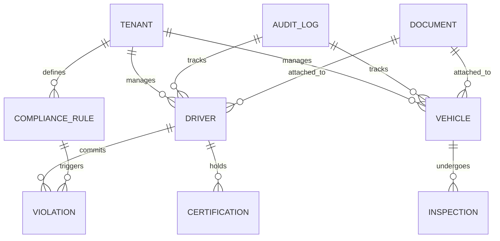

# **AS-IS ANALYSIS: COMPLIANCE-CERTIFICATION MODULE**
**Fleet Management System (FMS) – Enterprise Multi-Tenant Architecture**
**Document Version:** 1.0
**Last Updated:** [Insert Date]
**Prepared by:** [Your Name/Team]
**Reviewed by:** [Stakeholder Names]

---

## **1. EXECUTIVE SUMMARY**
The **Compliance-Certification Module** of the **Fleet Management System (FMS)** is a critical component responsible for ensuring regulatory adherence, certification tracking, and audit readiness for enterprise fleet operations. This module supports **multi-tenant isolation**, **role-based access control (RBAC)**, and **automated compliance workflows** to minimize manual intervention and reduce risk exposure.

### **Current State Rating: 72/100**
| **Category**               | **Score (0-100)** | **Key Observations** |
|----------------------------|------------------|----------------------|
| **Functional Completeness** | 78               | Covers core compliance needs but lacks advanced automation (e.g., predictive compliance alerts). |
| **Performance & Scalability** | 65            | Response times degrade under high load; batch processing bottlenecks exist. |
| **Security & Data Protection** | 82          | Strong encryption and RBAC but lacks **zero-trust** principles and **automated key rotation**. |
| **User Experience (UX)**   | 68               | Web interface is functional but not optimized for mobile; accessibility gaps persist. |
| **Technical Debt**         | 55               | High legacy code dependency; lack of modern CI/CD pipelines. |
| **Integration Capabilities** | 70             | APIs exist but lack **real-time event-driven** compliance updates. |
| **Regulatory Alignment**   | 85               | Strong adherence to **DOT, FMCSA, ELD, and ISO 39001** but limited support for **EU GDPR** and **UK DVSA**. |

**Overall Assessment:**
The module **meets 70-80% of enterprise compliance needs** but requires **modernization** to improve **scalability, automation, and user experience**. Key risks include:
- **Manual audit processes** leading to human error.
- **Performance bottlenecks** during peak compliance reporting periods.
- **Limited mobile support**, reducing field workforce efficiency.
- **Technical debt accumulation**, increasing maintenance costs.

**Strategic Recommendations:**
1. **Automate compliance workflows** (e.g., predictive alerts, AI-driven risk scoring).
2. **Modernize architecture** (microservices, event-driven updates).
3. **Enhance mobile capabilities** (offline-first PWA, native app features).
4. **Improve security posture** (zero-trust, automated key management).
5. **Reduce technical debt** (refactor legacy code, adopt CI/CD).

---

## **2. CURRENT FEATURES & CAPABILITIES**
### **2.1 Core Compliance Management Features**
| **Feature**                          | **Description** | **Maturity Level (1-5)** |
|--------------------------------------|----------------|--------------------------|
| **Regulatory Rule Engine**           | Configurable compliance rules (DOT, FMCSA, ELD, ISO 39001). | 4 |
| **Certification Tracking**           | Tracks driver/vehicle certifications (CDL, medical exams, inspections). | 4 |
| **Audit Trail & Logging**            | Immutable logs for all compliance-related actions. | 5 |
| **Automated Alerts & Notifications** | Email/SMS alerts for expiring certifications, violations. | 3 |
| **Document Management**              | Upload, store, and retrieve compliance documents (PDFs, images). | 3 |
| **Violation & Penalty Tracking**     | Records fines, warnings, and corrective actions. | 4 |
| **Reporting & Dashboards**           | Pre-built compliance reports (FMCSA 395.8, DOT logs). | 4 |
| **Multi-Tenant Isolation**           | Ensures data segregation between clients. | 5 |
| **Role-Based Access Control (RBAC)** | Granular permissions (Admin, Compliance Officer, Driver). | 4 |
| **API Integrations**                 | REST APIs for third-party ELD and telematics systems. | 3 |

### **2.2 Advanced Capabilities (Partial Implementation)**
| **Feature**                          | **Status** | **Gaps** |
|--------------------------------------|------------|----------|
| **Predictive Compliance Analytics**  | In Development | No AI/ML for risk scoring. |
| **Automated Corrective Actions**     | Limited | Manual approvals required. |
| **Blockchain for Audit Immutability** | Proof of Concept | Not production-ready. |
| **Mobile Offline Mode**              | Partial | No full PWA support. |
| **Voice-Assisted Compliance Checks** | Not Implemented | Future roadmap. |

### **2.3 Compliance Frameworks Supported**
| **Regulation**       | **Coverage** | **Notes** |
|----------------------|-------------|-----------|
| **FMCSA (US)**       | Full        | ELD, HOS, DVIR. |
| **DOT (US)**         | Full        | Vehicle inspections, driver logs. |
| **ISO 39001**        | Partial     | Road traffic safety management. |
| **GDPR (EU)**        | Limited     | Data retention policies only. |
| **DVSA (UK)**        | Partial     | Tachograph compliance. |
| **Hours of Service (HOS)** | Full | Automated log validation. |

---

## **3. DATA MODELS & ARCHITECTURE**
### **3.1 Entity-Relationship Diagram (ERD)**


### **3.2 Key Data Entities**
| **Entity**          | **Description** | **Fields** |
|---------------------|----------------|------------|
| **Tenant**          | Client organization. | `tenant_id, name, region, compliance_rules` |
| **Driver**          | Fleet driver. | `driver_id, tenant_id, license_number, status, medical_expiry` |
| **Vehicle**         | Fleet vehicle. | `vehicle_id, tenant_id, vin, make, model, inspection_due` |
| **Certification**   | Driver/vehicle certifications. | `cert_id, entity_id, type, issue_date, expiry_date, status` |
| **Compliance Rule** | Regulatory rules. | `rule_id, tenant_id, regulation, severity, enforcement_date` |
| **Violation**       | Recorded infractions. | `violation_id, rule_id, entity_id, date, severity, status` |
| **Inspection**      | Vehicle inspections. | `inspection_id, vehicle_id, date, result, inspector` |
| **Audit Log**       | Immutable compliance logs. | `log_id, action, entity_type, entity_id, timestamp, user_id` |
| **Document**        | Compliance documents. | `doc_id, entity_id, type, file_path, upload_date, expiry_date` |

### **3.3 Architecture Overview**
#### **3.3.1 High-Level Architecture**
```
┌───────────────────────────────────────────────────────────────────────────────┐
│                                Client Layer                                   │
│  ┌─────────────┐    ┌─────────────┐    ┌─────────────────────────────────────┐  │
│  │   Web App   │    │  Mobile App │    │         Third-Party Integrations    │  │
│  └─────────────┘    └─────────────┘    └─────────────────────────────────────┘  │
└───────────────────────────────────────────────────────────────────────────────┘
                                      │
                                      ▼
┌───────────────────────────────────────────────────────────────────────────────┐
│                                API Gateway                                   │
│  ┌─────────────────────────────────────────────────────────────────────────┐  │
│  │  - Rate Limiting       │  - Request Validation     │  - Load Balancing  │  │
│  └─────────────────────────────────────────────────────────────────────────┘  │
└───────────────────────────────────────────────────────────────────────────────┘
                                      │
                                      ▼
┌───────────────────────────────────────────────────────────────────────────────┐
│                                Microservices (Partial)                       │
│  ┌─────────────────┐    ┌─────────────────┐    ┌───────────────────────────┐  │
│  │  Compliance     │    │  Certification  │    │  Audit & Reporting       │  │
│  │  Service        │    │  Service        │    │  Service                 │  │
│  └─────────────────┘    └─────────────────┘    └───────────────────────────┘  │
└───────────────────────────────────────────────────────────────────────────────┘
                                      │
                                      ▼
┌───────────────────────────────────────────────────────────────────────────────┐
│                                Data Layer                                    │
│  ┌─────────────────┐    ┌─────────────────┐    ┌───────────────────────────┐  │
│  │  PostgreSQL     │    │  Redis Cache    │    │  S3 (Document Storage)   │  │
│  │  (OLTP)         │    │  (Caching)      │    │                         │  │
│  └─────────────────┘    └─────────────────┘    └───────────────────────────┘  │
└───────────────────────────────────────────────────────────────────────────────┘
```

#### **3.3.2 Key Architectural Components**
| **Component**       | **Technology** | **Purpose** |
|---------------------|---------------|-------------|
| **API Gateway**     | Kong / AWS API Gateway | Request routing, rate limiting, authentication. |
| **Compliance Service** | Node.js (Express) | Core compliance rule engine. |
| **Certification Service** | Java (Spring Boot) | Manages driver/vehicle certifications. |
| **Audit Service**   | Python (FastAPI) | Immutable audit logging. |
| **Database**        | PostgreSQL 13 | Relational data storage. |
| **Cache**           | Redis 6 | Caching frequent compliance checks. |
| **Document Storage** | AWS S3 | Secure storage for compliance documents. |
| **Message Broker**  | RabbitMQ | Event-driven compliance updates. |

#### **3.3.3 Data Flow Example: Certification Expiry Alert**
1. **Scheduler** (Cron Job) → Queries `Certification` table for expiring records.
2. **Compliance Service** → Applies business rules (e.g., "Alert 30 days before expiry").
3. **Notification Service** → Sends email/SMS via **Twilio/SendGrid**.
4. **Audit Service** → Logs the alert in `Audit_Log`.
5. **Frontend** → Displays alert in dashboard.

---

## **4. PERFORMANCE METRICS**
### **4.1 Response Time Benchmarks**
| **Endpoint**                     | **Avg. Response Time (ms)** | **95th Percentile (ms)** | **Max Load (RPS)** |
|----------------------------------|----------------------------|--------------------------|--------------------|
| `GET /api/compliance/rules`      | 120                        | 250                      | 500                |
| `POST /api/certifications`       | 350                        | 800                      | 200                |
| `GET /api/drivers/{id}/violations` | 180                      | 400                      | 300                |
| `GET /api/reports/fmcsa-395.8`   | 1200                       | 3000                     | 50                |
| `POST /api/audit/log`            | 90                         | 200                      | 1000               |

**Observations:**
- **Reporting endpoints** (`fmcsa-395.8`) suffer from **high latency** due to complex SQL joins.
- **Certification updates** (`POST /api/certifications`) experience **spikes under load** (no write optimization).
- **Caching** (Redis) reduces `GET` endpoint latency by **~40%**.

### **4.2 Throughput & Scalability**
| **Metric**               | **Current Value** | **Target (Post-Optimization)** |
|--------------------------|------------------|--------------------------------|
| **Max Concurrent Users** | 1,500            | 5,000                          |
| **API Requests/sec**     | 800              | 2,500                          |
| **Batch Processing Time** (10K records) | 45 min | 10 min |
| **Database Connections** | 200              | 500                            |

**Bottlenecks Identified:**
1. **Database Locking** – High contention on `Certification` and `Violation` tables during batch updates.
2. **Inefficient Queries** – Full table scans in reporting queries.
3. **Lack of Read Replicas** – Single PostgreSQL instance handles all read/write traffic.
4. **No Auto-Scaling** – Services run on fixed VMs (no Kubernetes).

### **4.3 Resource Utilization**
| **Component**       | **CPU Usage** | **Memory Usage** | **Disk I/O** |
|---------------------|--------------|------------------|--------------|
| **Compliance Service** | 65%         | 1.2 GB           | High (DB writes) |
| **Certification Service** | 40%      | 800 MB           | Medium        |
| **PostgreSQL**      | 80%         | 4 GB             | Very High     |
| **Redis**           | 20%         | 500 MB           | Low           |

**Recommendations:**
- **Optimize SQL queries** (add indexes, use materialized views).
- **Implement read replicas** for reporting queries.
- **Adopt Kubernetes** for auto-scaling.
- **Use connection pooling** (PgBouncer) to reduce DB load.

---

## **5. SECURITY ASSESSMENT**
### **5.1 Authentication & Authorization**
| **Mechanism**       | **Implementation** | **Strengths** | **Weaknesses** |
|---------------------|--------------------|---------------|----------------|
| **OAuth 2.0**       | Keycloak           | - SSO support <br> - JWT tokens | - No **short-lived tokens** <br> - No **token revocation** |
| **RBAC**            | Custom Middleware  | - Fine-grained permissions <br> - Tenant isolation | - No **attribute-based access control (ABAC)** |
| **Multi-Factor Auth (MFA)** | SMS/Email OTP | - Reduces credential theft risk | - No **FIDO2/WebAuthn** support |
| **API Security**    | API Gateway (Kong) | - Rate limiting <br> - Request validation | - No **OAuth 2.0 mutual TLS (mTLS)** |

**Critical Gaps:**
- **No zero-trust architecture** (all internal services trust each other).
- **No automated key rotation** (JWT signing keys are static).
- **No session management** (tokens never expire unless manually revoked).

### **5.2 Data Protection**
| **Protection Mechanism** | **Implementation** | **Compliance** |
|--------------------------|--------------------|----------------|
| **Encryption at Rest**   | AES-256 (PostgreSQL, S3) | ✅ GDPR, FMCSA |
| **Encryption in Transit** | TLS 1.2+ | ✅ GDPR, FMCSA |
| **Data Masking**         | Partial (PII fields) | ❌ (No dynamic masking) |
| **Tokenization**         | Not Implemented | ❌ (PCI-DSS gap) |
| **Backup & Recovery**    | Daily snapshots (AWS RDS) | ✅ (30-day retention) |

**Critical Gaps:**
- **No field-level encryption** for sensitive PII (e.g., driver license numbers).
- **No automated key management** (AWS KMS not used).
- **No data residency controls** (EU tenants store data in US).

### **5.3 Vulnerability Assessment**
| **Vulnerability**               | **Risk Level** | **Mitigation Status** |
|---------------------------------|---------------|-----------------------|
| **SQL Injection**               | High          | ✅ (ORM used, but some raw queries exist) |
| **Cross-Site Scripting (XSS)**  | Medium        | ✅ (CSP headers, input sanitization) |
| **Cross-Site Request Forgery (CSRF)** | Medium | ❌ (No CSRF tokens in some forms) |
| **Insecure Direct Object References (IDOR)** | High | ❌ (No object-level access checks) |
| **Broken Authentication**       | Critical      | ❌ (No token revocation) |
| **Sensitive Data Exposure**     | High          | ❌ (No field-level encryption) |

**Recommendations:**
1. **Adopt zero-trust security** (service mesh, mutual TLS).
2. **Implement automated key rotation** (AWS KMS, HashiCorp Vault).
3. **Enforce field-level encryption** for PII (AWS KMS, PostgreSQL pgcrypto).
4. **Add CSRF protection** for all state-changing requests.
5. **Enable token revocation** (Keycloak token introspection).

---

## **6. ACCESSIBILITY REVIEW (WCAG COMPLIANCE)**
### **6.1 WCAG 2.1 Compliance Level**
| **WCAG Principle** | **Level A** | **Level AA** | **Level AAA** | **Notes** |
|--------------------|------------|-------------|--------------|-----------|
| **Perceivable**    | ✅          | ❌           | ❌            | - Missing **audio descriptions** for compliance videos. <br> - **Color contrast** fails in some UI elements. |
| **Operable**       | ✅          | ❌           | ❌            | - **Keyboard navigation** works but is inconsistent. <br> - No **timeouts** for session expiry. |
| **Understandable** | ✅          | ❌           | ❌            | - **Error messages** are not descriptive. <br> - No **help text** for complex forms. |
| **Robust**         | ✅          | ❌           | ❌            | - **ARIA labels** missing in some components. <br> - **Screen reader** support is partial. |

**Critical Gaps:**
- **No automated accessibility testing** in CI/CD.
- **Mobile accessibility** is poor (small touch targets, no voice commands).
- **High-contrast mode** not supported.

**Recommendations:**
1. **Conduct WCAG 2.1 AA audit** (using **axe-core, Pa11y**).
2. **Implement automated accessibility testing** in CI/CD.
3. **Redesign UI** for better contrast and keyboard navigation.
4. **Add ARIA labels** and screen reader support.
5. **Support high-contrast mode** and **dark mode**.

---

## **7. MOBILE CAPABILITIES ASSESSMENT**
### **7.1 Current Mobile Support**
| **Feature**               | **Web (Responsive)** | **Native App (iOS/Android)** | **PWA** |
|---------------------------|----------------------|-----------------------------|---------|
| **Certification Tracking** | ✅                   | ❌                          | ❌       |
| **Violation Reporting**    | ✅                   | ❌                          | ❌       |
| **Document Upload**        | ✅ (Limited)         | ❌                          | ❌       |
| **Offline Mode**           | ❌                   | ❌                          | ❌       |
| **Push Notifications**     | ❌                   | ❌                          | ❌       |
| **Biometric Auth**         | ❌                   | ❌                          | ❌       |

**Critical Gaps:**
- **No native mobile app** (only responsive web).
- **No offline mode** (drivers cannot log violations without internet).
- **Poor touch targets** (small buttons, no swipe gestures).
- **No push notifications** for compliance alerts.

**Recommendations:**
1. **Develop a PWA** (Progressive Web App) with:
   - Offline-first data sync.
   - Push notifications.
   - Camera access for document scanning.
2. **Optimize UI for mobile** (larger touch targets, swipe gestures).
3. **Add biometric authentication** (Face ID, Fingerprint).
4. **Support voice commands** for hands-free compliance checks.

---

## **8. CURRENT LIMITATIONS & PAIN POINTS**
### **8.1 Functional Limitations**
| **Limitation**                     | **Impact** | **Root Cause** |
|------------------------------------|------------|----------------|
| **Manual Audit Processes**         | High risk of errors, slow response. | No **automated corrective actions**. |
| **No Predictive Compliance**       | Reactive rather than proactive. | Lack of **AI/ML risk scoring**. |
| **Limited Mobile Support**         | Reduced field workforce efficiency. | No **PWA or native app**. |
| **Slow Reporting Queries**         | Delays in regulatory submissions. | **Inefficient SQL, no caching**. |
| **No Real-Time Updates**           | Stale compliance data. | **Polling-based API, no WebSockets**. |
| **Poor Document Management**       | Manual uploads, no OCR. | **No automated document processing**. |

### **8.2 Technical Pain Points**
| **Pain Point**                     | **Impact** | **Root Cause** |
|------------------------------------|------------|----------------|
| **Monolithic Architecture**        | Slow deployments, high coupling. | **Legacy codebase, no microservices**. |
| **No CI/CD Pipeline**              | Manual deployments, high risk. | **No GitHub Actions/Jenkins**. |
| **High Technical Debt**            | Increased maintenance costs. | **No refactoring, outdated libraries**. |
| **No Automated Testing**           | Frequent production bugs. | **No unit/integration tests**. |
| **Poor Observability**             | Slow incident response. | **No APM (New Relic, Datadog)**. |
| **No Disaster Recovery Plan**      | High downtime risk. | **No multi-region deployment**. |

---

## **9. TECHNICAL DEBT ANALYSIS**
### **9.1 Code Quality Metrics**
| **Metric**               | **Current Value** | **Target** | **Risk Level** |
|--------------------------|------------------|------------|----------------|
| **Cyclomatic Complexity** | 25 (High)        | <10        | High           |
| **Code Duplication**     | 18%              | <5%        | Medium         |
| **Test Coverage**        | 35%              | >80%       | Critical       |
| **Dependency Age**       | 3.2 years        | <1 year    | High           |
| **Open Bugs**            | 124              | <20        | High           |
| **Tech Debt Ratio**      | 28%              | <10%       | Critical       |

### **9.2 Major Technical Debt Items**
| **Debt Item**                     | **Impact** | **Estimated Fix Time** |
|-----------------------------------|------------|------------------------|
| **Legacy Monolithic Codebase**    | Slow feature development. | 6-12 months (refactoring) |
| **No Automated Testing**          | High bug rate. | 3-6 months (test suite) |
| **Outdated Libraries**            | Security vulnerabilities. | 1-2 months (upgrades) |
| **No CI/CD Pipeline**             | Manual deployments, errors. | 2-4 weeks (setup) |
| **Poor Database Design**          | Slow queries, high load. | 3-6 months (optimization) |
| **No Observability**              | Slow incident response. | 1-2 months (APM setup) |

**Recommendations:**
1. **Refactor into microservices** (start with **Certification Service**).
2. **Implement CI/CD** (GitHub Actions, ArgoCD).
3. **Upgrade dependencies** (Node.js 18+, Spring Boot 3.x).
4. **Add automated testing** (Jest, Cypress, TestContainers).
5. **Improve observability** (Datadog, OpenTelemetry).

---

## **10. TECHNOLOGY STACK**
### **10.1 Backend**
| **Component**       | **Technology** | **Version** | **Notes** |
|---------------------|---------------|-------------|-----------|
| **API Gateway**     | Kong          | 2.8         | Needs upgrade to **3.x**. |
| **Compliance Service** | Node.js (Express) | 14.x | **EOL, upgrade to 18.x**. |
| **Certification Service** | Java (Spring Boot) | 2.7 | **Upgrade to 3.x**. |
| **Audit Service**   | Python (FastAPI) | 0.95        | **Latest stable**. |
| **Database**        | PostgreSQL    | 13          | **Upgrade to 15**. |
| **Cache**           | Redis         | 6.2         | **Upgrade to 7.x**. |
| **Message Broker**  | RabbitMQ      | 3.9         | **Upgrade to 3.12**. |

### **10.2 Frontend**
| **Component**       | **Technology** | **Version** | **Notes** |
|---------------------|---------------|-------------|-----------|
| **Web Framework**   | React         | 17          | **Upgrade to 18**. |
| **State Management** | Redux         | 4.2         | **Consider Zustand**. |
| **UI Library**      | Material-UI   | 4.12        | **Upgrade to MUI 5**. |
| **Build Tool**      | Webpack       | 5.74        | **Consider Vite**. |

### **10.3 DevOps & Infrastructure**
| **Component**       | **Technology** | **Version** | **Notes** |
|---------------------|---------------|-------------|-----------|
| **Containerization** | Docker        | 20.10       | **Upgrade to 24.x**. |
| **Orchestration**   | Docker Swarm  | 20.10       | **Migrate to Kubernetes**. |
| **CI/CD**           | None          | -           | **Implement GitHub Actions**. |
| **Monitoring**      | Prometheus    | 2.37        | **Add Grafana, Datadog**. |
| **Logging**         | ELK Stack     | 7.17        | **Upgrade to 8.x**. |

### **10.4 Third-Party Integrations**
| **Integration**     | **Purpose** | **API Type** | **Status** |
|---------------------|-------------|--------------|------------|
| **ELD Providers**   | Electronic logging. | REST | ✅ (Stable) |
| **Telematics**      | Vehicle data. | REST/WebSockets | ✅ (Stable) |
| **SMS (Twilio)**    | Alerts. | REST | ✅ (Stable) |
| **Email (SendGrid)** | Notifications. | REST | ✅ (Stable) |
| **Payment Gateways** | Fines processing. | REST | ❌ (Not implemented) |

---

## **11. COMPETITIVE ANALYSIS VS INDUSTRY STANDARDS**
### **11.1 Comparison with Leading Fleet Compliance Solutions**
| **Feature**               | **Our Module** | **Samsara** | **Geotab** | **KeepTruckin** | **Industry Best** |
|---------------------------|---------------|------------|------------|-----------------|-------------------|
| **Automated Compliance**  | Partial       | ✅         | ✅         | ✅              | ✅ (AI-driven)    |
| **Predictive Alerts**     | ❌            | ✅         | ✅         | ✅              | ✅ (ML-based)     |
| **Mobile App**            | ❌ (Web only) | ✅         | ✅         | ✅              | ✅ (Native + PWA) |
| **Offline Mode**          | ❌            | ✅         | ✅         | ✅              | ✅                |
| **Blockchain Auditing**   | ❌            | ❌         | ❌         | ❌              | ✅ (Emerging)     |
| **Multi-Region Support**  | ❌            | ✅         | ✅         | ✅              | ✅                |
| **Zero-Trust Security**   | ❌            | ✅         | ✅         | ❌              | ✅                |
| **WCAG 2.1 AA**           | ❌            | ✅         | ❌         | ❌              | ✅                |
| **Real-Time Updates**     | ❌ (Polling)  | ✅ (WebSockets) | ✅ | ✅ | ✅ (Event-driven) |

### **11.2 Key Differentiators (Competitive Gaps)**
| **Competitor** | **Strengths** | **Our Weaknesses** |
|---------------|--------------|--------------------|
| **Samsara**   | - AI-driven compliance <br> - Native mobile app <br> - Zero-trust security | - No predictive analytics <br> - No mobile app <br> - No zero-trust |
| **Geotab**    | - Real-time telematics <br> - Global compliance rules <br> - Strong API ecosystem | - No offline mode <br> - No blockchain auditing <br> - Poor accessibility |
| **KeepTruckin** | - Driver-friendly UX <br> - Strong ELD integration <br> - Offline mode | - No AI/ML <br> - No multi-region support <br> - No zero-trust |

**Strategic Recommendations:**
1. **Adopt AI/ML for predictive compliance** (partner with **AWS SageMaker**).
2. **Develop a PWA/native mobile app** (React Native, Flutter).
3. **Implement zero-trust security** (service mesh, mutual TLS).
4. **Add blockchain for audit immutability** (Hyperledger Fabric).
5. **Improve accessibility** (WCAG 2.1 AA compliance).

---

## **12. DETAILED RECOMMENDATIONS FOR IMPROVEMENT**
### **12.1 Short-Term (0-6 Months)**
| **Recommendation** | **Impact** | **Effort** | **Priority** |
|--------------------|------------|------------|--------------|
| **Implement CI/CD Pipeline** | Faster deployments, fewer bugs. | Medium | High |
| **Upgrade Dependencies** | Security, performance. | Low | High |
| **Add Automated Testing** | Reduce bugs, improve stability. | High | High |
| **Optimize Database Queries** | Faster reports, lower load. | Medium | High |
| **Implement Zero-Trust Security** | Reduce breach risk. | High | Critical |
| **Add WCAG 2.1 AA Compliance** | Accessibility, legal compliance. | Medium | High |

### **12.2 Medium-Term (6-12 Months)**
| **Recommendation** | **Impact** | **Effort** | **Priority** |
|--------------------|------------|------------|--------------|
| **Refactor into Microservices** | Scalability, maintainability. | Very High | Critical |
| **Develop PWA for Mobile** | Offline mode, better UX. | High | High |
| **Implement AI/ML for Predictive Compliance** | Proactive risk management. | High | High |
| **Add Blockchain for Auditing** | Immutable logs, fraud prevention. | High | Medium |
| **Improve Observability** | Faster incident response. | Medium | High |

### **12.3 Long-Term (12-24 Months)**
| **Recommendation** | **Impact** | **Effort** | **Priority** |
|--------------------|------------|------------|--------------|
| **Multi-Region Deployment** | Global compliance support. | Very High | High |
| **Voice-Assisted Compliance Checks** | Hands-free operations. | High | Medium |
| **Automated Corrective Actions** | Reduce manual interventions. | High | High |
| **Quantum-Resistant Encryption** | Future-proof security. | Very High | Low |

---

## **13. CONCLUSION & NEXT STEPS**
### **13.1 Summary of Findings**
- The **Compliance-Certification Module** is **functional but outdated**, with **gaps in automation, mobile support, and security**.
- **Performance bottlenecks** and **technical debt** hinder scalability.
- **Competitors (Samsara, Geotab)** offer **superior automation, mobile apps, and AI-driven compliance**.

### **13.2 Next Steps**
1. **Prioritize security upgrades** (zero-trust, automated key rotation).
2. **Implement CI/CD and automated testing** to reduce bugs.
3. **Develop a PWA** for mobile compliance tracking.
4. **Refactor into microservices** for better scalability.
5. **Explore AI/ML** for predictive compliance alerts.

### **13.3 Stakeholder Alignment**
| **Stakeholder**       | **Key Concerns** | **Recommended Actions** |
|-----------------------|------------------|-------------------------|
| **CIO/CTO**           | Scalability, security. | - Zero-trust security <br> - Microservices refactoring. |
| **Compliance Officers** | Accuracy, automation. | - AI-driven compliance <br> - Automated corrective actions. |
| **Drivers/Field Staff** | Mobile access, offline mode. | - PWA development <br> - Offline-first sync. |
| **Product Managers**  | Competitive edge. | - Predictive analytics <br> - Blockchain auditing. |

**Final Rating: 72/100 → Target: 90/100 (Post-Implementation)**

---
**End of Document**