# AS-IS Analysis: Compliance Certification Module
*Prepared by: Senior Technical Analyst*
*Date: [Insert Date]*
*Version: 1.0*
*Confidentiality: Internal Use Only*

---

## 1. Executive Summary (102 lines)

### 1.1 Current State Overview
The Compliance Certification Module (CCM) is a critical subsystem of the Fleet Management System (FMS) responsible for ensuring regulatory adherence across vehicle operations, driver qualifications, and maintenance protocols. Currently deployed in production since Q3 2020, the module serves 12,456 active fleet vehicles across 7 regulatory jurisdictions (Federal DOT, State DMVs, EPA, OSHA, FMCSA, IFTA, and local municipalities).

**Key Operational Metrics (Last 12 Months):**
- **Certification Volume:** 48,723 compliance documents processed
- **Audit Pass Rate:** 89.3% (below target 95%)
- **SLA Compliance:** 92.1% for 24-hour processing (target 98%)
- **System Uptime:** 99.78% (excluding scheduled maintenance)
- **User Base:** 1,243 active compliance officers across 47 fleet depots

The module operates as a microservice within the FMS ecosystem, interfacing with:
- **Vehicle Management System** (VMS) for asset data
- **Driver Qualification System** (DQS) for personnel records
- **Maintenance Tracking System** (MTS) for service history
- **Regulatory Agency Portals** (direct API integrations with 14 state DMVs)
- **Document Management System** (DMS) for storage

**Technical Context:**
- **Architecture:** Monolithic core with microservice extensions
- **Language:** Java 8 (Spring Boot 2.3.12) with Angular 9 frontend
- **Database:** Oracle 12c (2.5TB compliance data)
- **Infrastructure:** On-premise VMware cluster (12 nodes) with AWS S3 for document storage

### 1.2 Stakeholder Analysis
| **Stakeholder**               | **Role**                                                                 | **Key Concerns**                                                                 | **Influence Level** |
|-------------------------------|--------------------------------------------------------------------------|---------------------------------------------------------------------------------|---------------------|
| **Fleet Compliance Officers** | Primary users; submit and track certifications                          | System responsiveness, error rates, mobile access                              | High                |
| **Regulatory Agencies**       | External auditors; validate compliance data                             | Data accuracy, audit trails, response times                                    | Critical            |
| **Fleet Managers**            | Oversee compliance status across depots                                  | Dashboard visibility, reporting, alerting                                      | High                |
| **IT Operations**             | Maintain system availability and performance                             | Uptime, incident response, technical debt                                      | High                |
| **Legal/Compliance Team**     | Ensure adherence to regulatory requirements                              | Data integrity, retention policies, audit readiness                            | Critical            |
| **Finance Department**        | Track compliance-related costs and fines                                 | Cost of non-compliance, system TCO                                             | Medium              |
| **Drivers**                   | Indirect users; affected by certification status                         | Timeliness of renewals, mobile notifications                                   | Low                 |
| **Third-Party Auditors**      | External entities conducting compliance audits                           | Data export capabilities, evidence packaging                                   | Medium              |

### 1.3 Business Impact Analysis
**Financial Impact:**
- **Annual Compliance Fines:** $1.2M (2023) due to late/missing certifications
  - Breakdown:
    - DOT Violations: $450K (37.5%)
    - IFTA Penalties: $320K (26.7%)
    - State DMV Fines: $280K (23.3%)
    - EPA Non-Compliance: $150K (12.5%)
- **Operational Costs:**
  - Manual Workarounds: 4,200 labor hours/year ($315K)
  - Data Correction: 1,800 hours/year ($135K)
  - System Downtime: 43 hours/year ($92K in lost productivity)

**Operational Impact:**
- **Vehicle Downtime:** 187 instances in 2023 where vehicles were grounded due to expired certifications (avg. 3.2 days/vehicle)
- **Driver Productivity:** 12% of drivers experienced certification-related delays affecting dispatch
- **Audit Findings:** 47 critical findings in 2023 audits (up from 32 in 2022)

**Reputational Impact:**
- **Customer Trust:** 3 major clients (12% of revenue) cited compliance issues in contract renewals
- **Regulatory Scrutiny:** Increased audit frequency from quarterly to monthly for 3 high-risk depots
- **Industry Standing:** Dropped from #3 to #7 in industry compliance benchmarking

### 1.4 Critical Pain Points with Root Cause Analysis
**1. Certification Processing Delays (SLA Misses)**
- **Symptom:** 7.9% of certifications processed beyond 24-hour SLA
- **Root Causes:**
  - **Technical:**
    - Database contention during peak hours (14:00-16:00 daily)
    - Inefficient SQL queries (avg. 4.2s execution time for compliance status checks)
    - Lack of asynchronous processing for document validation
  - **Process:**
    - Manual review required for 32% of submissions (due to data quality issues)
    - No automated escalation for pending certifications
  - **Organizational:**
    - Inconsistent training on submission requirements across depots
    - 18% of submissions missing required documentation

**2. Data Integrity Issues**
- **Symptom:** 11.4% of records contain discrepancies requiring manual correction
- **Root Causes:**
  - **Technical:**
    - No referential integrity constraints in 47% of compliance tables
    - Weak validation rules (e.g., VIN format not enforced in 30% of records)
    - Race conditions during concurrent updates (12 documented incidents in 2023)
  - **Integration:**
    - VMS data sync failures (1.8% error rate in vehicle attribute updates)
    - DQS latency causing stale driver qualification data (avg. 45-minute delay)
  - **User Error:**
    - 23% of submissions contain typos in critical fields (VIN, license numbers)
    - No inline validation for 17% of required fields

**3. Audit Readiness Gaps**
- **Symptom:** 47 critical findings in 2023 audits (32% increase YoY)
- **Root Causes:**
  - **Technical:**
    - Incomplete audit trails (12% of actions not logged)
    - No immutable logs for regulatory-sensitive changes
    - Document retention policies not enforced (28% of expired documents not archived)
  - **Process:**
    - No automated evidence packaging for audits
    - Manual preparation time: avg. 18 hours/audit
  - **Compliance:**
    - 8 regulatory changes in 2023 not incorporated into business rules
    - No automated rule versioning or change tracking

**4. User Experience Challenges**
- **Symptom:** System Usability Score (SUS) of 58/100 (below industry average of 68)
- **Root Causes:**
  - **Technical:**
    - Angular 9 frontend with 47% code duplication
    - Mobile responsiveness issues (32% of users access via mobile)
    - No offline mode for field operations
  - **Design:**
    - Inconsistent UI patterns across 14 compliance workflows
    - No contextual help for 62% of form fields
    - Poor error messaging (78% of errors lack actionable guidance)
  - **Accessibility:**
    - WCAG 2.1 AA compliance failures (18 critical, 42 major violations)

**5. Integration Complexity**
- **Symptom:** 2.4 integration-related incidents/month (28% of total incidents)
- **Root Causes:**
  - **Technical:**
    - Point-to-point integrations with 14 state DMVs (no abstraction layer)
    - No circuit breakers for external API calls (12 outages in 2023 due to DMV API failures)
    - Inconsistent error handling across integrations (47% of errors not retried)
  - **Data:**
    - Schema mismatches between FMS and DMV systems (avg. 3.2 fields/integration)
    - No data transformation layer (hardcoded mappings in 68% of integrations)
  - **Operational:**
    - No integration monitoring dashboard
    - Manual intervention required for 82% of integration failures

### 1.5 Strategic Recommendations
**Short-Term (0-6 Months - Quick Wins):**
| **Recommendation**                          | **Expected Impact**                                                                 | **Effort** | **ROI** |
|---------------------------------------------|-------------------------------------------------------------------------------------|------------|---------|
| Implement automated document validation     | Reduce manual review by 40% (1,680 hours/year saved)                                | Medium     | High    |
| Add referential integrity constraints       | Reduce data discrepancies by 60% (from 11.4% to 4.6%)                               | Low        | High    |
| Deploy mobile-responsive frontend           | Improve SUS score to 70+; reduce mobile-related support tickets by 75%              | Medium     | High    |
| Add circuit breakers for DMV integrations   | Reduce integration outages by 80% (from 12 to 2/year)                               | Low        | High    |
| Implement automated evidence packaging      | Reduce audit preparation time by 70% (from 18 to 5.4 hours/audit)                   | Medium     | High    |

**Medium-Term (6-18 Months - Strategic Initiatives):**
1. **Modernize Architecture:**
   - Migrate to event-driven microservices (Kafka, Spring Cloud)
   - Implement API gateway for DMV integrations
   - Containerize services (Docker, Kubernetes)
   - *Expected Outcome:* 95% SLA compliance, 40% reduction in incident resolution time

2. **Enhance Data Management:**
   - Implement data quality framework (Great Expectations)
   - Add immutable audit logs (Blockchain-based for regulatory-sensitive data)
   - Automate data retention policies
   - *Expected Outcome:* 99% data integrity, 100% audit trail completeness

3. **Improve User Experience:**
   - Redesign UI with UX research (target SUS 80+)
   - Implement offline-first mobile app (React Native)
   - Add contextual help and guided workflows
   - *Expected Outcome:* 30% reduction in training time, 25% increase in user satisfaction

**Long-Term (18-36 Months - Transformational):**
1. **Regulatory Intelligence Platform:**
   - Implement AI-driven rule engine for automatic regulatory updates
   - Add predictive compliance analytics
   - *Expected Outcome:* 100% compliance with new regulations, 50% reduction in audit findings

2. **Compliance-as-a-Service:**
   - Offer CCM as a standalone SaaS product
   - *Expected Outcome:* New revenue stream ($2.4M ARR by Year 3)

**Implementation Roadmap:**


**Risk Mitigation:**
| **Risk**                              | **Mitigation Strategy**                                                                 | **Owner**          |
|---------------------------------------|-----------------------------------------------------------------------------------------|--------------------|
| Scope creep                           | Time-boxed sprints with fixed backlog; bi-weekly stakeholder reviews                    | Product Owner      |
| Integration failures                  | Comprehensive test suite (contract testing, chaos engineering)                          | QA Lead            |
| Data migration issues                 | Phased migration with dual-write; automated validation scripts                          | Data Architect     |
| User resistance to change             | Change management program (training, champions, feedback loops)                         | HR/Compliance Lead |
| Regulatory non-compliance during migration | Parallel operation of old/new systems; regulatory sandboxes for testing              | Legal Team         |

---

## 2. Current Architecture (187 lines)

### 2.1 System Components

#### 2.1.1 Component Inventory
| **Component**               | **Type**          | **Technology**               | **Version**   | **Lines of Code** | **Dependencies**                                                                 | **SLA**  |
|-----------------------------|-------------------|------------------------------|---------------|-------------------|---------------------------------------------------------------------------------|----------|
| Compliance Core Service     | Backend (Monolith)| Java/Spring Boot             | 2.3.12        | 187,423           | Oracle JDBC, Apache POI, Spring Security, Jackson                               | 99.9%    |
| Certification Engine        | Backend Module    | Java                         | (Embedded)    | 42,876            | Drools (Business Rules), Apache PDFBox                                          | 99.9%    |
| Document Processor          | Backend Module    | Java                         | (Embedded)    | 28,432            | Tesseract OCR, Apache Tika, AWS S3 SDK                                          | 99.5%    |
| API Gateway                 | Backend           | Spring Cloud Gateway         | 2.2.5         | 8,765             | Netflix Zuul, Spring Security OAuth2                                            | 99.9%    |
| Frontend Application        | Frontend          | Angular                      | 9.1.13        | 112,345           | Angular Material, RxJS, NgRx                                                    | 99.7%    |
| Integration Layer           | Backend           | Java/Spring Integration      | 5.3.2         | 34,567            | Apache Camel, REST Assured, SOAP UI                                             | 99.8%    |
| Reporting Engine            | Backend           | Java                         | (Embedded)    | 19,876            | JasperReports, Apache POI                                                       | 99.5%    |
| Notification Service        | Backend           | Java/Spring Boot             | 2.3.12        | 12,432            | Twilio API, SendGrid, Firebase Cloud Messaging                                  | 99.9%    |
| Database                    | Database          | Oracle                       | 12c (12.2.0.1)| N/A               | Oracle JDBC, Flyway                                                             | 99.95%   |
| Document Storage            | Storage           | AWS S3                       | N/A           | N/A               | AWS SDK for Java                                                                | 99.9%    |

#### 2.1.2 Integration Points with Sequence Diagrams

**1. Certification Submission Flow:**


**2. DMV Integration Flow (State-Specific):**


#### 2.1.3 Data Flow Analysis

**1. Certification Data Flow:**
1. **Input Sources:**
   - User-submitted forms (Angular frontend)
   - Vehicle data (VMS API)
   - Driver data (DQS API)
   - Document uploads (AWS S3)
   - DMV validation responses

2. **Transformation Logic:**
   - **Data Normalization:**
     ```java
     // Example: VIN normalization
     public String normalizeVin(String vin) {
         if (vin == null) return null;
         String normalized = vin.trim().toUpperCase();
         // Remove common non-alphanumeric characters
         normalized = normalized.replaceAll("[^A-Z0-9]", "");
         // Validate length (17 chars for modern vehicles)
         if (normalized.length() != 17) {
             throw new InvalidVinException("VIN must be 17 characters");
         }
         return normalized;
     }
     ```
   - **Business Rule Application:**
     ```java
     // Example: IFTA compliance rule
     @DroolsRule(name = "IFTA_Mileage_Validation")
     public boolean validateIftaMileage(Certification cert) {
         if (cert.getJurisdiction() == Jurisdiction.IFTA) {
             double reportedMiles = cert.getReportedMiles();
             double odometerMiles = cert.getVehicle().getOdometerReading();
             double variance = Math.abs(reportedMiles - odometerMiles);
             return variance <= (odometerMiles * 0.05); // 5% tolerance
         }
         return true;
     }
     ```
   - **Document Processing:**
     ```java
     // Example: PDF text extraction
     public String extractTextFromPdf(InputStream pdfStream) throws IOException {
         try (PDDocument document = PDDocument.load(pdfStream)) {
             PDFTextStripper stripper = new PDFTextStripper();
             String text = stripper.getText(document);
             // Clean extracted text
             return text.replaceAll("\\s+", " ").trim();
         }
     }
     ```

3. **Output Destinations:**
   - Oracle database (compliance records)
   - AWS S3 (documents)
   - DMV systems (state-specific submissions)
   - Reporting engine (JasperReports)
   - Notification service (alerts)

#### 2.1.4 Technology Stack Details

**Backend Technologies:**
| **Component**       | **Technology**       | **Version** | **Justification**                                                                 | **Risks**                                                                 |
|---------------------|----------------------|-------------|---------------------------------------------------------------------------------|---------------------------------------------------------------------------|
| Core Framework      | Spring Boot          | 2.3.12      | Mature, widely adopted; strong ecosystem for enterprise applications            | End-of-life (EOL) in 11/2023; security vulnerabilities (CVE-2023-20862)   |
| Business Rules      | Drools               | 7.48.0      | Declarative rule engine; good for compliance logic                              | Steep learning curve; performance issues with complex rules               |
| PDF Processing      | Apache PDFBox        | 2.0.24      | Open-source; good text extraction capabilities                                  | Limited support for complex PDF forms                                     |
| OCR                 | Tesseract            | 4.1.1       | Open-source; supports multiple languages                                        | Accuracy issues with low-quality scans (avg. 82% accuracy)                |
| API Gateway         | Spring Cloud Gateway | 2.2.5       | Lightweight; integrates well with Spring ecosystem                              | Limited rate limiting features                                            |
| Integration         | Apache Camel         | 3.7.0       | Flexible integration framework; supports multiple protocols                     | Complex configuration; steep learning curve                               |

**Frontend Technologies:**
| **Component**       | **Technology**       | **Version** | **Justification**                                                                 | **Risks**                                                                 |
|---------------------|----------------------|-------------|---------------------------------------------------------------------------------|---------------------------------------------------------------------------|
| Framework           | Angular              | 9.1.13      | Component-based architecture; good for enterprise apps                          | Outdated (current LTS is Angular 16); performance issues with large forms |
| State Management    | NgRx                 | 9.1.0       | Centralized state management; good for complex workflows                        | Overkill for simple forms; steep learning curve                           |
| UI Components       | Angular Material     | 9.2.4       | Pre-built accessible components; consistent look and feel                       | Limited customization options                                             |
| Build Tool          | Angular CLI          | 9.1.15      | Standardized build process; good for large applications                         | Slow build times (avg. 4.2 minutes)                                       |

**Database Technologies:**
| **Component**       | **Technology**       | **Version** | **Justification**                                                                 | **Risks**                                                                 |
|---------------------|----------------------|-------------|---------------------------------------------------------------------------------|---------------------------------------------------------------------------|
| RDBMS               | Oracle               | 12.2.0.1    | Enterprise-grade; strong security features                                      | Expensive licensing; complex administration                               |
| ORM                 | Hibernate            | 5.4.32      | Mature ORM; good for complex object-relational mapping                          | Performance issues with complex queries                                   |
| Migrations          | Flyway               | 7.7.0       | Version-controlled database migrations; good for CI/CD                          | Limited rollback capabilities                                             |
| Caching             | Redis                | 6.0.16      | High-performance in-memory cache; good for DMV responses                        | Additional infrastructure cost                                            |

**Infrastructure:**
| **Component**       | **Technology**       | **Configuration**                                                                 | **Capacity**                     | **Limitations**                                |
|---------------------|----------------------|----------------------------------------------------------------------------------|----------------------------------|------------------------------------------------|
| Application Servers | VMware ESXi          | 12 nodes (4 vCPUs, 16GB RAM each)                                               | 48 vCPUs, 192GB RAM              | No auto-scaling; manual capacity planning      |
| Database            | Oracle RAC           | 2 nodes (8 vCPUs, 32GB RAM each)                                                | 16 vCPUs, 64GB RAM               | High licensing costs; complex failover         |
| Load Balancer       | F5 BIG-IP            | 2x F5-2000 (active/passive)                                                     | 10Gbps throughput                | No application-aware routing                   |
| Storage             | NetApp FAS           | 2x FAS2750 (RAID-DP, 48TB usable)                                               | 96TB raw                         | No object storage; limited scalability         |
| Document Storage    | AWS S3               | Standard class; versioning enabled                                              | 12TB (current usage)             | Additional egress costs                        |
| CI/CD               | Jenkins              | 2x master nodes; 4x agent nodes                                                 | 12 concurrent builds             | No pipeline visualization; manual scaling      |

### 2.2 Technical Debt Analysis

#### 2.2.1 Code Quality Issues

**1. Static Analysis Findings (SonarQube):**
| **Metric**                  | **Current Value** | **Threshold** | **Issues** | **Examples**                                                                 |
|-----------------------------|-------------------|---------------|------------|------------------------------------------------------------------------------|
| Code Smells                 | 2,456             | <500          | 1,956      | - Duplicate code (24% of codebase)                                           |
|                             |                   |               |            | - Long methods (avg. 47 lines; max 214 lines)                                |
|                             |                   |               |            | - God classes (32 classes > 1,000 lines)                                     |
| Bugs                        | 187               | <50           | 137        | - Null pointer exceptions (42 instances)                                     |
|                             |                   |               |            | - Resource leaks (28 instances)                                              |
|                             |                   |               |            | - Incorrect synchronization (12 instances)                                   |
| Vulnerabilities             | 42                | <10           | 32         | - Hardcoded credentials (8 instances)                                        |
|                             |                   |               |            | - SQL injection risks (14 instances)                                         |
|                             |                   |               |            | - Cross-site scripting (5 instances)                                         |
| Security Hotspots           | 89                | <20           | 69         | - Weak cryptographic algorithms (12 instances)                               |
|                             |                   |               |            | - Insecure random number generation (5 instances)                            |
|                             |                   |               |            | - Missing CSRF protection (3 instances)                                      |
| Coverage                    | 42%               | >80%          | N/A        | - 12 critical modules <20% coverage                                          |
|                             |                   |               |            | - No tests for 38% of business rules                                         |
| Duplications                | 24.3%             | <5%           | N/A        | - 47% of frontend components duplicated                                      |
|                             |                   |               |            | - 32% of backend service classes duplicated                                  |

**Code Smell Example (Duplicate Code):**
```java
// File: CertificationService.java (Line 452)
public void processIftaCertification(Certification cert) {
    // 47 lines of IFTA-specific logic
    // Duplicated in 3 other service classes
    if (cert.getJurisdiction() == Jurisdiction.IFTA) {
        double reportedMiles = cert.getReportedMiles();
        double odometerMiles = cert.getVehicle().getOdometerReading();
        if (Math.abs(reportedMiles - odometerMiles) > (odometerMiles * 0.05)) {
            cert.setStatus(CertificationStatus.REJECTED);
            cert.setRejectionReason("Mileage variance exceeds 5%");
        } else {
            cert.setStatus(CertificationStatus.APPROVED);
        }
    }
}

// File: StateCertificationService.java (Line 328)
public void validateIftaCompliance(Certification cert) {
    // Exact same logic as above
    if (cert.getJurisdiction() == Jurisdiction.IFTA) {
        double reportedMiles = cert.getReportedMiles();
        double odometerMiles = cert.getVehicle().getOdometerReading();
        if (Math.abs(reportedMiles - odometerMiles) > (odometerMiles * 0.05)) {
            cert.setStatus(CertificationStatus.REJECTED);
            cert.setRejectionReason("Mileage variance exceeds 5%");
        } else {
            cert.setStatus(CertificationStatus.APPROVED);
        }
    }
}
```

**2. Anti-Patterns:**
| **Anti-Pattern**            | **Instances** | **Impact**                                                                 | **Example**                                                                 |
|-----------------------------|---------------|----------------------------------------------------------------------------|-----------------------------------------------------------------------------|
| God Class                   | 32            | Poor maintainability; high change failure rate                             | `ComplianceService.java` (2,143 lines)                                     |
| Spaghetti Code              | 18            | Difficult to debug; high cyclomatic complexity                             | `CertificationWorkflow.java` (CCN: 42)                                     |
| Copy-Paste Programming      | 47            | Increased maintenance burden; inconsistent behavior                        | 12 identical DMV integration methods across 4 services                      |
| Magic Numbers               | 142           | Hard to maintain; error-prone                                              | `if (status == 3) { ... }` instead of `if (status == CertificationStatus.APPROVED)` |
| Callback Hell               | 8             | Unreadable code; difficult to debug                                        | 7 nested callbacks in `DocumentProcessor.java`                             |
| Primitive Obsession         | 28            | Poor type safety; increased bugs                                           | Using `String` for VIN, license numbers, etc. instead of dedicated classes |

#### 2.2.2 Performance Bottlenecks

**1. Database Performance:**
| **Query**                                                                 | **Avg. Time** | **Calls/Day** | **Total Time/Day** | **Optimization Opportunity**                     |
|--------------------------------------------------------------------------|---------------|---------------|--------------------|--------------------------------------------------|
| `SELECT * FROM certifications WHERE status = ? AND created_date > ?`     | 4.2s          | 12,450        | 14.5 hours         | Add index on (status, created_date); pagination  |
| `SELECT v.*, d.* FROM vehicles v JOIN drivers d ON v.driver_id = d.id`   | 2.8s          | 8,760         | 6.8 hours          | Denormalize; use materialized views              |
| `SELECT * FROM compliance_rules WHERE jurisdiction = ?`                  | 1.5s          | 22,300        | 9.3 hours          | Cache rules; add index on jurisdiction           |
| `INSERT INTO audit_log (action, user_id, timestamp) VALUES (?, ?, ?)`    | 0.8s          | 45,600        | 10.1 hours         | Batch inserts; use async logging                 |
| `SELECT * FROM documents WHERE certification_id = ?`                     | 0.5s          | 32,400        | 4.5 hours          | Lazy loading; add index on certification_id      |

**2. API Performance:**
| **Endpoint**                          | **Avg. Response Time** | **95th Percentile** | **Error Rate** | **Bottleneck**                                                                 |
|---------------------------------------|------------------------|---------------------|----------------|--------------------------------------------------------------------------------|
| `POST /api/certifications`            | 3.2s                   | 8.7s                | 2.1%           | - Database contention (47% of time)                                            |
|                                       |                        |                     |                | - Document processing (32% of time)                                            |
|                                       |                        |                     |                | - DMV validation (21% of time)                                                 |
| `GET /api/certifications/{id}`        | 1.8s                   | 4.2s                | 0.8%           | - N+1 queries (avg. 12 queries/call)                                            |
|                                       |                        |                     |                | - No caching (100% cache miss rate)                                            |
| `GET /api/reports/compliance-status`  | 5.4s                   | 12.1s               | 3.4%           | - Complex joins (14 tables)                                                    |
|                                       |                        |                     |                | - No pagination (returns 5,000+ records)                                       |
|                                       |                        |                     |                | - JasperReports processing (45% of time)                                       |
| `POST /api/dmv/validate`              | 2.7s                   | 6.8s                | 4.2%           | - External API latency (avg. 1.8s)                                             |
|                                       |                        |                     |                | - No circuit breakers (failures cascade)                                       |
|                                       |                        |                     |                | - No retry logic (42% of failures recoverable)                                 |

**3. Frontend Performance:**
| **Metric**                  | **Current Value** | **Target** | **Issue**                                                                 |
|-----------------------------|-------------------|------------|---------------------------------------------------------------------------|
| Initial Load Time           | 4.2s              | <2s        | - 12MB JavaScript bundle (47% unused code)                                |
|                             |                   |            | - 18 blocking CSS files                                                  |
|                             |                   |            | - No code splitting                                                       |
| Time to Interactive         | 6.8s              | <3s        | - Long task: 420ms (certification form initialization)                    |
| Memory Usage                | 380MB             | <200MB     | - Memory leaks in NgRx store (47 instances)                               |
|                             |                   |            | - Unsubscribed observables (23 instances)                                 |
| DOM Nodes                   | 2,450             | <1,500     | - Excessive DOM nodes in compliance dashboard (1,200+ nodes)              |
| Lighthouse Score            | 48/100            | >80/100    | - Performance: 32/100                                                     |
|                             |                   |            | - Accessibility: 58/100                                                   |
|                             |                   |            | - Best Practices: 65/100                                                  |

#### 2.2.3 Security Vulnerabilities

**1. CVSS Scored Vulnerabilities:**
| **CVE**            | **Component**       | **Version** | **CVSS Score** | **Description**                                                                 | **Exploitability** | **Impact**               |
|--------------------|---------------------|-------------|----------------|---------------------------------------------------------------------------------|--------------------|--------------------------|
| CVE-2023-20862     | Spring Boot         | 2.3.12      | 9.8            | Remote code execution via Spring Expression Language (SpEL) injection          | High               | Confidentiality: High    |
|                    |                     |             |                |                                                                                 |                    | Integrity: High          |
|                    |                     |             |                |                                                                                 |                    | Availability: High       |
| CVE-2022-22965     | Spring Framework    | 5.2.20      | 9.8            | Remote code execution via data binding                                          | High               | Confidentiality: High    |
|                    |                     |             |                |                                                                                 |                    | Integrity: High          |
|                    |                     |             |                |                                                                                 |                    | Availability: High       |
| CVE-2021-44228     | Log4j               | 2.13.3      | 10.0           | Remote code execution via JNDI injection                                        | High               | Confidentiality: High    |
|                    |                     |             |                |                                                                                 |                    | Integrity: High          |
|                    |                     |             |                |                                                                                 |                    | Availability: High       |
| CVE-2020-5408      | Spring Cloud Config | 2.2.5       | 7.5            | Directory traversal vulnerability                                               | High               | Confidentiality: High    |
|                    |                     |             |                |                                                                                 |                    | Integrity: None          |
|                    |                     |             |                |                                                                                 |                    | Availability: None       |
| CVE-2019-17571     | Apache Log4j 1.2    | 1.2.17      | 9.8            | Socket server deserialization vulnerability                                     | High               | Confidentiality: High    |
|                    |                     |             |                |                                                                                 |                    | Integrity: High          |
|                    |                     |             |                |                                                                                 |                    | Availability: High       |

**2. Custom Security Findings:**
| **Finding**                          | **Risk Level** | **Description**                                                                 | **Evidence**                                                                 |
|--------------------------------------|----------------|---------------------------------------------------------------------------------|------------------------------------------------------------------------------|
| Hardcoded Credentials                | Critical       | 8 instances of hardcoded API keys in source code                                | `DMVIntegrationService.java` line 45: `String apiKey = "ak_1234567890"`     |
| SQL Injection                        | High           | 14 instances of concatenated SQL queries                                        | `CertificationRepository.java` line 128: `"SELECT * FROM certifications WHERE id = " + id` |
| Cross-Site Scripting (XSS)           | High           | 5 instances of unescaped user input in Angular templates                        | `certification-form.component.html` line 42: `{{ certification.notes }}`     |
| Insecure Direct Object Reference     | High           | 3 endpoints allow IDOR attacks                                                  | `GET /api/certifications/{id}` accessible to any authenticated user          |
| Missing CSRF Protection              | Medium         | 3 state-changing endpoints lack CSRF tokens                                     | `POST /api/certifications`                                                   |
| Weak Password Storage                | Medium         | User passwords stored with SHA-1 hashing (no salt)                             | `UserService.java` line 87: `DigestUtils.sha1Hex(password)`                  |
| Insecure File Upload                 | Medium         | No virus scanning for uploaded documents                                        | `DocumentController.java` line 65: `file.transferTo(uploadPath)`             |
| Missing HSTS Header                  | Low            | HTTP Strict Transport Security header not set                                   | Response headers lack `Strict-Transport-Security`                           |
| Information Disclosure               | Low            | Stack traces returned in error responses                                        | 404 responses include full stack trace                                       |

#### 2.2.4 Scalability Limitations

**1. Load Test Results:**
| **Test Scenario**               | **Users** | **Avg. Response Time** | **95th Percentile** | **Error Rate** | **Throughput** | **Bottleneck**                          |
|---------------------------------|-----------|------------------------|---------------------|----------------|----------------|-----------------------------------------|
| Certification Submission        | 100       | 1.2s                   | 2.1s                | 0.2%           | 85 req/s       | Database CPU (78% utilization)          |
|                                 | 500       | 4.7s                   | 12.3s               | 3.8%           | 102 req/s      | Database connections (maxed out at 200) |
|                                 | 1000      | 12.4s                  | 32.1s               | 18.4%          | 87 req/s       | Thread pool exhaustion (150 threads)    |
| Compliance Status Report        | 50        | 2.8s                   | 5.2s                | 0.5%           | 18 req/s       | JasperReports CPU (92% utilization)     |
|                                 | 200       | 12.1s                  | 28.7s               | 5.3%           | 14 req/s       | Memory pressure (GC pauses >1s)         |
| DMV Validation                  | 50        | 1.8s                   | 3.2s                | 1.2%           | 28 req/s       | External API latency                    |
|                                 | 200       | 4.5s                   | 12.8s               | 14.7%          | 32 req/s       | No circuit breakers (cascading failures)|

**2. Infrastructure Limits:**
| **Resource**            | **Current Capacity** | **Peak Usage** | **Limit** | **Scalability Issue**                          |
|-------------------------|----------------------|----------------|-----------|------------------------------------------------|
| Database Connections    | 200                  | 198            | 200       | Connection pool exhaustion                     |
| Application Threads     | 150                  | 147            | 150       | Thread starvation during peak loads            |
| CPU                     | 48 vCPUs             | 46.2 vCPUs     | 48        | No horizontal scaling                          |
| Memory                  | 192GB                | 187GB          | 192GB     | Memory leaks cause OOM errors                  |
| Network Bandwidth       | 10Gbps               | 8.2Gbps        | 10Gbps    | No CDN for static assets                       |
| Storage IOPS            | 10,000               | 9,870          | 10,000    | Database writes bottleneck                     |

**3. Code-Level Scalability Issues:**
| **Issue**                          | **Impact**                                                                 | **Example**                                                                 |
|------------------------------------|----------------------------------------------------------------------------|-----------------------------------------------------------------------------|
| Synchronous Processing             | Blocks threads during I/O operations                                       | `DMVIntegrationService.validate()` makes blocking HTTP call                 |
| No Caching                         | Repeated expensive operations                                              | `ComplianceRuleService.getRules()` queries DB on every call                 |
| Inefficient Algorithms             | O(n²) complexity in critical paths                                         | `CertificationService.findConflicts()` uses nested loops over 10K records  |
| No Connection Pooling              | High overhead for database connections                                     | `DataSource` configured with default settings (max 10 connections)         |
| Stateful Services                  | Limits horizontal scaling                                                  | `CertificationWorkflow` maintains in-memory state                           |
| No Asynchronous Processing         | Long-running tasks block request threads                                   | Document OCR runs in request thread                                         |
| Hardcoded Timeouts                 | Inflexible for varying network conditions                                  | `DMVIntegrationService` uses fixed 5s timeout                              |

---

## 3. Functional Analysis (234 lines)

### 3.1 Core Features

#### 3.1.1 Certification Submission

**Feature Description:**
Enables compliance officers to submit certification requests for vehicles and drivers, including required documentation and validation against business rules.

**User Workflow:**
1. **Initiation:**
   - User logs into FMS and navigates to "Compliance" > "New Certification"
   - System displays certification types based on user's jurisdiction and role:
     - Federal DOT (Annual Inspection)
     - State DMV (Registration Renewal)
     - IFTA (Fuel Tax Report)
     - EPA (Emissions Compliance)
     - OSHA (Driver Qualification File)
     - Custom (Depot-specific requirements)

2. **Form Population:**
   - System auto-populates vehicle/driver data from VMS/DQS:
     ```typescript
     // certification-form.component.ts
     populateVehicleData(vin: string) {
         this.vehicleService.getByVin(vin).subscribe(vehicle => {
             this.certificationForm.patchValue({
                 make: vehicle.make,
                 model: vehicle.model,
                 year: vehicle.year,
                 odometer: vehicle.odometerReading,
                 // ... 12 other fields
             });
         });
     }
     ```
   - User selects certification type and jurisdiction
   - System displays jurisdiction-specific form fields (dynamic form generation):
     ```json
     // Example: IFTA form configuration
     {
         "jurisdiction": "IFTA",
         "fields": [
             {
                 "name": "reportingQuarter",
                 "type": "select",
                 "options": ["Q1", "Q2", "Q3", "Q4"],
                 "required": true
             },
             {
                 "name": "totalMiles",
                 "type": "number",
                 "validation": {
                     "min": 0,
                     "max": 1000000,
                     "decimalPlaces": 2
                 }
             },
             // ... 18 other fields
         ]
     }
     ```

3. **Document Upload:**
   - User uploads required documents (drag-and-drop interface)
   - System performs client-side validation:
     - File type (PDF, JPG, PNG)
     - File size (<10MB)
     - Document naming convention (e.g., "IFTA_Q2_2023_VIN12345678901234.pdf")
   - Frontend displays upload progress and previews:
     ```html
     <file-upload
         [allowedTypes]="['application/pdf', 'image/jpeg', 'image/png']"
         [maxSize]="10485760"
         (onUpload)="handleDocumentUpload($event)"
         (onError)="showUploadError($event)">
     </file-upload>
     ```

4. **Validation:**
   - Client-side validation (immediate feedback):
     ```typescript
     validateForm(): boolean {
         if (this.certificationForm.invalid) {
             this.markAllAsTouched();
             return false;
         }
         // Jurisdiction-specific validation
         if (this.certificationForm.value.jurisdiction === 'IFTA') {
             const miles = this.certificationForm.value.totalMiles;
             const odometer = this.certificationForm.value.odometer;
             if (Math.abs(miles - odometer) > (odometer * 0.05)) {
                 this.certificationForm.get('totalMiles').setErrors({ mileageVariance: true });
                 return false;
             }
         }
         return true;
     }
     ```
   - Server-side validation (business rules):
     ```java
     // CertificationValidator.java
     public ValidationResult validate(Certification cert) {
         ValidationResult result = new ValidationResult();
         // 1. Check required fields
         if (cert.getVehicle() == null) {
             result.addError("vehicle", "Vehicle is required");
         }
         // 2. Jurisdiction-specific rules
         switch (cert.getJurisdiction()) {
             case IFTA:
                 validateIftaCertification(cert, result);
                 break;
             case DOT:
                 validateDotCertification(cert, result);
                 break;
             // ... 5 other jurisdictions
         }
         // 3. Document validation
         validateDocuments(cert, result);
         return result;
     }
     ```

5. **Submission:**
   - User clicks "Submit" (disabled during processing)
   - System shows loading spinner and submits data:
     ```typescript
     submitCertification() {
         if (!this.validateForm()) return;
         this.isSubmitting = true;
         this.certificationService.submit(this.certificationForm.value)
             .subscribe({
                 next: (response) => {
                     this.router.navigate(['/certifications', response.id]);
                 },
                 error: (err) => {
                     this.isSubmitting = false;
                     this.handleSubmissionError(err);
                 }
             });
     }
     ```
   - Backend processes submission:
     ```java
     // CertificationController.java
     @PostMapping
     public ResponseEntity<CertificationResponse> submitCertification(
             @RequestBody CertificationRequest request) {
         try {
             // 1. Validate
             ValidationResult validation = validator.validate(request);
             if (!validation.isValid()) {
                 return ResponseEntity.badRequest().body(
                     new CertificationResponse(validation.getErrors()));
             }
             // 2. Process
             Certification cert = certificationService.process(request);
             // 3. Store documents
             documentService.storeDocuments(cert.getId(), request.getDocuments());
             // 4. DMV integration (if required)
             if (cert.getJurisdiction().requiresDmvSubmission()) {
                 dmvIntegrationService.submit(cert);
             }
             return ResponseEntity.ok(new CertificationResponse(cert.getId()));
         } catch (Exception e) {
             log.error("Submission failed", e);
             return ResponseEntity.internalServerError().build();
         }
     }
     ```

**Business Rules:**
| **Rule**                          | **Jurisdiction** | **Validation Logic**                                                                 | **Error Message**                                  |
|-----------------------------------|------------------|-------------------------------------------------------------------------------------|----------------------------------------------------|
| Vehicle Inspection Due            | DOT              | `vehicle.lastInspectionDate < (currentDate - 365 days)`                             | "Vehicle inspection expired"                       |
| Driver License Valid              | DOT              | `driver.licenseExpirationDate > currentDate`                                        | "Driver license expired"                           |
| Mileage Variance                  | IFTA             | `abs(reportedMiles - odometerMiles) <= (odometerMiles * 0.05)`                      | "Mileage variance exceeds 5%"                      |
| Emissions Test Passed             | EPA              | `vehicle.emissionsTestResult == PASSED && vehicle.emissionsTestDate > (currentDate - 365 days)` | "Emissions test failed or expired"         |
| Drug Test Current                 | DOT              | `driver.lastDrugTestDate > (currentDate - 180 days)`                                | "Drug test expired (required every 6 months)"      |
| Medical Certificate Valid         | DOT              | `driver.medicalCertificateExpirationDate > currentDate`                             | "Medical certificate expired"                      |
| IFTA License Active               | IFTA             | `vehicle.iftaLicenseStatus == ACTIVE`                                               | "IFTA license inactive"                            |
| Vehicle Registration Current      | DMV              | `vehicle.registrationExpirationDate > currentDate`                                  | "Vehicle registration expired"                     |

**Edge Cases and Error Handling:**
| **Scenario**                      | **Current Behavior**                                                                 | **Expected Behavior**                                                                 |
|-----------------------------------|-------------------------------------------------------------------------------------|--------------------------------------------------------------------------------------|
| Network interruption during submission | Partial data saved; no rollback; user sees generic error                           | Transaction rollback; retry mechanism; user sees specific "retry" option             |
| Invalid VIN format                | Server-side validation fails; generic "Invalid data" error                         | Client-side validation with specific format guidance (e.g., "VIN must be 17 chars")  |
| Missing required document         | Submission fails with "Document required" error after processing                   | Pre-submission validation with document checklist                                    |
| DMV API unavailable               | Submission fails with "DMV service unavailable" error                              | Queue submission for later processing; notify user of delayed status                 |
| Concurrent submissions            | Race condition; last submission wins; potential data loss                          | Optimistic locking; show conflict resolution UI                                       |
| Large document upload (>10MB)     | Frontend hangs; no progress indicator                                               | Chunked upload; progress bar; server-side validation before processing               |
| Jurisdiction-specific rule change | System continues using old rules until next deployment                              | Dynamic rule loading; versioned rules; immediate update capability                   |

**Performance Characteristics:**
| **Metric**                  | **Current Value** | **Target** | **Analysis**                                                                 |
|-----------------------------|-------------------|------------|------------------------------------------------------------------------------|
| Submission Time (Avg)       | 4.2s              | <2s        | - 47% spent on database operations                                          |
|                             |                   |            | - 32% spent on document processing (OCR, validation)                         |
|                             |                   |            | - 21% spent on DMV validation                                                |
| Submission Success Rate     | 92.1%             | >98%       | - 4.2% failures due to validation errors                                     |
|                             |                   |            | - 2.1% failures due to system errors (timeouts, DB issues)                   |
| Document Processing Time    | 1.8s              | <0.5s      | - OCR processing is single-threaded                                          |
|                             |                   |            | - No document caching                                                        |
| DMV Validation Time         | 1.2s              | <0.8s      | - No circuit breakers; external API latency                                  |
|                             |                   |            | - No response caching                                                        |

#### 3.1.2 Certification Tracking

**Feature Description:**
Provides visibility into the status and history of certification submissions, including approvals, rejections, and pending actions.

**User Workflow:**
1. **Dashboard View:**
   - User navigates to "Compliance" > "Dashboard"
   - System displays:
     - **Compliance Status Summary:**
       ```typescript
       // compliance-dashboard.component.ts
       getComplianceStatus(): void {
           this.dashboardService.getStatusSummary().subscribe(summary => {
               this.summary = {
                   totalVehicles: summary.totalVehicles,
                   compliant: summary.compliantVehicles,
                   nonCompliant: summary.nonCompliantVehicles,
                   expiringSoon: summary.expiringSoonVehicles,
                   complianceRate: (summary.compliantVehicles / summary.totalVehicles) * 100
               };
           });
       }
       ```
       - Compliant: 8,245 vehicles (66.2%)
       - Non-Compliant: 3,124 vehicles (25.1%)
       - Expiring Soon (30 days): 1,087 vehicles (8.7%)
     - **Recent Activity:**
       - 12 new submissions
       - 8 approvals
       - 4 rejections
     - **Alerts:**
       - 18 vehicles with expired certifications
       - 7 pending submissions >24 hours
       - 3 failed DMV submissions

2. **Search and Filter:**
   - User can search by:
     - VIN
     - Driver name/ID
     - Certification type
     - Status (Pending, Approved, Rejected, Expired)
     - Date range
   - System supports advanced filtering:
     ```typescript
     // certification-list.component.ts
     applyFilters(): void {
         this.filteredCertifications = this.allCertifications.filter(cert => {
             return (this.filters.vin === '' || cert.vin.includes(this.filters.vin)) &&
                    (this.filters.status === '' || cert.status === this.filters.status) &&
                    (this.filters.type === '' || cert.type === this.filters.type) &&
                    (this.filters.fromDate === null || cert.submissionDate >= this.filters.fromDate) &&
                    (this.filters.toDate === null || cert.submissionDate <= this.filters.toDate);
         });
     }
     ```

3. **Certification Details:**
   - User clicks on a certification to view details
   - System displays:
     - **Header:**
       - Certification ID: CERT-2023-45678
       - Status: Approved
       - Type: DOT Annual Inspection
       - Jurisdiction: Federal DOT
       - Submission Date: 2023-10-15
       - Approval Date: 2023-10-16
     - **Vehicle Information:**
       - VIN: 1FTFW1E57MFA12345
       - Make/Model: Ford F-150
       - Year: 2021
       - Odometer: 45,678 miles
     - **Driver Information:**
       - Name: John Doe
       - License Number: D12345678
       - Medical Certificate Expiration: 2024-06-30
     - **Documents:**
       - Inspection Report (PDF) - View/Download
       - Vehicle Registration (PDF)
     - **Audit Trail:**
       | **Date**       | **User**      | **Action**               | **Details**                          |
       |----------------|---------------|--------------------------|--------------------------------------|
       | 2023-10-15     | jdoe          | Submission               | Initial submission                   |
       | 2023-10-15     | System        | Validation               | Passed all rules                     |
       | 2023-10-15     | System        | DMV Submission           | Submitted to Federal DOT             |
       | 2023-10-16     | System        | DMV Response             | Approved                             |
       | 2023-10-16     | System        | Status Update            | Approved                             |

4. **Status Transitions:**
   - System enforces state machine for certification status:
     ```mermaid
     stateDiagram-v2
         [*] --> Draft
         Draft --> Submitted: User submits
         Submitted --> Pending: System validates
         Pending --> Approved: All rules pass
         Pending --> Rejected: Rule violation
         Pending --> Pending_DMV: DMV submission required
         Pending_DMV --> Approved: DMV approves
         Pending_DMV --> Rejected: DMV rejects
         Approved --> Expired: Expiration date reached
         Rejected --> Resubmitted: User corrects and resubmits
     ```
   - Business rules for transitions:
     ```java
     // CertificationStateMachine.java
     public void transition(Certification cert, CertificationStatus newStatus) {
         switch (cert.getStatus()) {
             case DRAFT:
                 if (newStatus != CertificationStatus.SUBMITTED) {
                     throw new InvalidTransitionException("Draft can only transition to Submitted");
                 }
                 break;
             case SUBMITTED:
                 if (newStatus != CertificationStatus.PENDING) {
                     throw new InvalidTransitionException("Submitted can only transition to Pending");
                 }
                 break;
             case PENDING:
                 if (newStatus != CertificationStatus.APPROVED &&
                     newStatus != CertificationStatus.REJECTED &&
                     newStatus != CertificationStatus.PENDING_DMV) {
                     throw new InvalidTransitionException("Invalid transition from Pending");
                 }
                 break;
             // ... other states
         }
         cert.setStatus(newStatus);
         auditService.logTransition(cert, cert.getStatus(), newStatus);
     }
     ```

**Business Rules:**
| **Rule**                          | **Description**                                                                 | **Implementation**                                                                 |
|-----------------------------------|---------------------------------------------------------------------------------|------------------------------------------------------------------------------------|
| Status Visibility                 | Only show certifications relevant to user's jurisdiction and role               | `WHERE jurisdiction IN (:userJurisdictions) AND role = :userRole`                  |
| Expiration Alerts                 | Show alerts for certifications expiring within 30 days                          | `WHERE expirationDate BETWEEN CURRENT_DATE AND CURRENT_DATE + 30`                 |
| Pending Escalation                | Escalate certifications pending >24 hours                                       | `WHERE status = 'PENDING' AND submissionDate < CURRENT_DATE - 1`                  |
| DMV Submission Tracking           | Track DMV submission status and response                                        | `LEFT JOIN dmv_submissions ON cert.id = dmv_submissions.certification_id`          |
| Audit Trail Completeness          | All status changes must be logged with user/timestamp                           | `INSERT INTO audit_log (cert_id, old_status, new_status, user_id, timestamp)`      |

**Edge Cases and Error Handling:**
| **Scenario**                      | **Current Behavior**                                                                 | **Expected Behavior**                                                                 |
|-----------------------------------|-------------------------------------------------------------------------------------|--------------------------------------------------------------------------------------|
| Certification not found           | 404 error with no details                                                           | User-friendly message with search suggestions                                       |
| Concurrent status updates         | Last update wins; potential data loss                                               | Optimistic locking with version number                                               |
| Expired certification             | No automatic status update; requires manual intervention                            | Scheduled job to update status to "Expired" on expiration date                       |
| DMV submission lost               | No tracking of DMV submission status                                                | Implement DMV submission tracking with retry logic                                   |
| Audit trail corruption            | Missing audit entries; no recovery mechanism                                        | Immutable audit logs with checksum validation                                        |
| Large result sets                 | Slow performance; no pagination                                                     | Server-side pagination with default limit of 50 records                             |
| Timezone issues                   | Dates displayed in server timezone (UTC)                                            | Display dates in user's local timezone                                               |

**Performance Characteristics:**
| **Metric**                  | **Current Value** | **Target** | **Analysis**                                                                 |
|-----------------------------|-------------------|------------|------------------------------------------------------------------------------|
| Dashboard Load Time         | 3.8s              | <1.5s      | - 62% spent on database queries                                             |
|                             |                   |            | - 28% spent on rendering large datasets                                     |
| Search Response Time        | 2.4s              | <0.8s      | - No database indexes on search fields                                      |
|                             |                   |            | - Full table scans on large tables                                          |
| Detail View Load Time       | 1.2s              | <0.5s      | - N+1 queries for related data                                              |
|                             |                   |            | - No caching of certification details                                       |
| Audit Trail Load Time       | 1.8s              | <0.3s      | - Large audit log table (12M records)                                       |
|                             |                   |            | - No pagination for audit entries                                           |

#### 3.1.3 Compliance Reporting

**Feature Description:**
Generates standardized and ad-hoc reports for internal and regulatory compliance monitoring.

**User Workflow:**
1. **Report Selection:**
   - User navigates to "Compliance" > "Reports"
   - System displays available report templates:
     | **Report**                     | **Description**                                                                 | **Frequency**       | **Format**       |
     |--------------------------------|---------------------------------------------------------------------------------|---------------------|------------------|
     | Compliance Status Summary      | High-level compliance metrics by depot and jurisdiction                        | Daily               | PDF, Excel       |
     | Certification Aging            | Certifications by age (0-30, 31-60, 61-90, 90+ days)                            | Weekly              | PDF, Excel       |
     | Non-Compliance Report          | Vehicles/drivers with expired or missing certifications                         | Daily               | PDF, Excel       |
     | DMV Submission Audit           | Track DMV submissions and responses                                             | Monthly             | PDF              |
     | IFTA Fuel Tax Report           | Fuel tax data for IFTA jurisdictions                                            | Quarterly           | PDF (state form) |
     | DOT Annual Inspection Report   | Annual inspection compliance for DOT                                            | Annual              | PDF (DOT form)   |
     | Custom Report Builder          | Ad-hoc reporting with user-defined filters and columns                          | On-demand           | Excel, CSV       |

2. **Report Configuration:**
   - User selects report and configures parameters:
     ```typescript
     // report-configuration.component.ts
     configureReport(): void {
         const params = {
             reportType: this.selectedReport.type,
             dateRange: {
                 from: this.dateRange.from,
                 to: this.dateRange.to
             },
             depots: this.selectedDepots,
             jurisdictions: this.selectedJurisdictions,
             // ... other parameters
         };
         this.reportService.generate(params).subscribe(response => {
             this.reportUrl = response.url;
         });
     }
     ```
   - System validates parameters:
     ```java
     // ReportService.java
     public ValidationResult validateParameters(ReportParameters params) {
         ValidationResult result = new ValidationResult();
         if (params.getDateRange().getFrom().isAfter(params.getDateRange().getTo())) {
             result.addError("dateRange", "From date must be before To date");
         }
         if (params.getDepots().isEmpty()) {
             result.addError("depots", "At least one depot must be selected");
         }
         return result;
     }
     ```

3. **Report Generation:**
   - System generates report using JasperReports:
     ```java
     // JasperReportService.java
     public byte[] generateReport(ReportParameters params) throws JRException {
         // 1. Get data from database
         ReportData data = reportRepository.getData(params);
         // 2. Fill Jasper template
         JasperPrint jasperPrint = JasperFillManager.fillReport(
             getTemplate(params.getReportType()),
             params.toMap(),
             new JRBeanCollectionDataSource(data.getRows())
         );
         // 3. Export to desired format
         return JasperExportManager.exportReportToPdf(jasperPrint);
     }
     ```
   - Example SQL for Compliance Status Summary:
     ```sql
     SELECT
         d.depot_name,
         j.jurisdiction_name,
         COUNT(*) AS total_vehicles,
         SUM(CASE WHEN c.status = 'APPROVED' THEN 1 ELSE 0 END) AS compliant,
         SUM(CASE WHEN c.status = 'REJECTED' THEN 1 ELSE 0 END) AS non_compliant,
         SUM(CASE WHEN c.expiration_date BETWEEN CURRENT_DATE AND CURRENT_DATE + 30 THEN 1 ELSE 0 END) AS expiring_soon
     FROM vehicles v
     JOIN depots d ON v.depot_id = d.id
     JOIN jurisdictions j ON v.jurisdiction_id = j.id
     LEFT JOIN certifications c ON v.id = c.vehicle_id AND c.type = j.required_certification_type
     WHERE d.id IN (:depotIds)
     AND j.id IN (:jurisdictionIds)
     AND v.active = 1
     GROUP BY d.depot_name, j.jurisdiction_name
     ORDER BY d.depot_name, j.jurisdiction_name;
     ```

4. **Report Delivery:**
   - System provides download link or email delivery:
     ```typescript
     // report.service.ts
     generate(params: ReportParameters): Observable<ReportResponse> {
         return this.http.post<ReportResponse>('/api/reports/generate', params)
             .pipe(
                 tap(response => {
                     if (params.deliveryMethod === 'email') {
                         this.notificationService.info(
                             `Report will be emailed to ${params.email} when ready`);
                     }
                 })
             );
     }
     ```
   - Email delivery includes report as attachment:
     ```java
     // EmailService.java
     public void sendReportEmail(String email, byte[] report, String reportName) {
         MimeMessage message = mailSender.createMimeMessage();
         MimeMessageHelper helper = new MimeMessageHelper(message, true);
         helper.setTo(email);
         helper.setSubject("Compliance Report: " + reportName);
         helper.setText("Please find attached the requested compliance report.");
         helper.addAttachment(reportName + ".pdf", new ByteArrayResource(report));
         mailSender.send(message);
     }
     ```

**Business Rules:**
| **Rule**                          | **Description**                                                                 | **Implementation**                                                                 |
|-----------------------------------|---------------------------------------------------------------------------------|------------------------------------------------------------------------------------|
| Data Freshness                    | Reports must use data no older than 24 hours                                   | `WHERE last_updated >= CURRENT_DATE - 1`                                          |
| Jurisdiction Filtering            | Only show data for user's authorized jurisdictions                             | `WHERE jurisdiction_id IN (:userJurisdictionIds)`                                 |
| Sensitive Data Redaction          | Redact PII in reports for non-privileged users                                  | `CASE WHEN :userHasPiiAccess THEN driver_license ELSE 'REDACTED' END`             |
| Report Retention                  | Reports stored for 7 years to meet regulatory requirements                      | `DELETE FROM reports WHERE created_date < CURRENT_DATE - 2555` (7 years)          |
| Scheduled Report Delivery         | Automatically generate and deliver reports on schedule                          | Quartz scheduler with cron expressions                                             |

**Edge Cases and Error Handling:**
| **Scenario**                      | **Current Behavior**                                                                 | **Expected Behavior**                                                                 |
|-----------------------------------|-------------------------------------------------------------------------------------|--------------------------------------------------------------------------------------|
| Large report generation           | Times out after 30s; no progress indicator                                          | Asynchronous generation; progress tracking; email notification when complete          |
| Invalid report parameters         | Server error with stack trace                                                       | User-friendly validation messages; parameter suggestions                             |
| Missing data                      | Report fails with "no data" error                                                   | Generate report with available data; highlight missing data sections                 |
| Concurrent report generation      | Resource contention; slow performance                                               | Queue reports; limit concurrent generations                                         |
| Report template missing           | 500 error with no details                                                           | Fallback to default template; notify admin                                          |
| Email delivery failure            | No retry mechanism                                                                  | Retry with exponential backoff; notify user of failure                              |
| Timezone issues in reports        | Dates displayed in server timezone                                                  | Display dates in report's jurisdiction timezone                                     |

**Performance Characteristics:**
| **Metric**                  | **Current Value** | **Target** | **Analysis**                                                                 |
|-----------------------------|-------------------|------------|------------------------------------------------------------------------------|
| Report Generation Time      | 8.4s              | <3s        | - 65% spent on database queries                                             |
|                             |                   |            | - 25% spent on JasperReports processing                                     |
|                             |                   |            | - 10% spent on PDF generation                                               |
| Scheduled Report Failures   | 12.4%             | <2%        | - Timeouts during peak hours                                                |
|                             |                   |            | - Resource contention                                                       |
| Report Size                 | 12.8MB            | <5MB       | - Unoptimized images                                                        |
|                             |                   |            | - No data compression                                                       |
| Concurrent Report Limit     | 5                 | 20         | - Thread pool exhaustion                                                    |
|                             |                   |            | - No queue management                                                       |
| Data Query Time             | 5.2s              | <1s        | - Complex joins with no indexes                                             |
|                             |                   |            | - Full table scans                                                          |

### 3.2 User Experience Analysis

#### 3.2.1 Usability Evaluation (Heuristics)

**1. Nielsen's 10 Usability Heuristics Assessment:**
| **Heuristic**               | **Score (1-5)** | **Findings**                                                                 | **Examples**                                                                 |
|-----------------------------|-----------------|------------------------------------------------------------------------------|------------------------------------------------------------------------------|
| Visibility of System Status | 2               | - No loading indicators for long operations                                  | Certification submission shows blank screen for 4.2s                        |
|                             |                 | - No progress tracking for multi-step processes                              | DMV submission status not visible                                            |
|                             |                 | - Inconsistent status displays                                               | "Pending" vs "In Review" used interchangeably                               |
| Match Between System and Real World | 3       | - Technical jargon in error messages                                         | "NullPointerException at line 42" instead of "Vehicle data not found"       |
|                             |                 | - Inconsistent terminology                                                   | "Submission" vs "Request" vs "Certification"                                |
|                             |                 | - No metaphors for complex concepts                                          | No visual representation of certification workflow                          |
| User Control and Freedom    | 2               | - No undo functionality                                                      | Can't undo document uploads                                                 |
|                             |                 | - No breadcrumbs for navigation                                              | User gets lost in multi-step forms                                          |
|                             |                 | - No "Save for Later" option                                                 | Must complete submission in one session                                     |
| Consistency and Standards   | 3               | - Inconsistent button styles                                                 | Primary buttons are blue in some screens, green in others                   |
|                             |                 | - Different navigation patterns                                              | Some screens use tabs, others use accordions                                |
|                             |                 | - Inconsistent error handling                                                | Some errors show modals, others show inline messages                        |
| Error Prevention            | 2               | - No confirmation for destructive actions                                    | "Reject" button has no confirmation                                         |
|                             |                 | - No inline validation for forms                                             | Validation only happens on submission                                       |
|                             |                 | - No warnings for potential issues                                           | No warning when submitting certification with expiring documents            |
| Recognition Rather Than Recall | 3           | - No contextual help                                                         | No tooltips or explanations for form fields                                 |
|                             |                 | - No search functionality in dropdowns                                       | Must scroll through 100+ depots                                             |
|                             |                 | - No recent items list                                                       | No history of recent certifications                                         |
| Flexibility and Efficiency of Use | 2       | - No keyboard shortcuts                                                      | Must use mouse for all interactions                                         |
|                             |                 | - No customizable dashboards                                                 | All users see same dashboard layout                                         |
|                             |                 | - No bulk actions                                                            | Must process certifications one at a time                                   |
| Aesthetic and Minimalist Design | 3           | - Cluttered interfaces                                                       | Certification form has 47 fields                                            |
|                             |                 | - Inconsistent spacing                                                       | Some forms have 8px padding, others have 16px                              |
|                             |                 | - No visual hierarchy                                                        | All elements have equal prominence                                          |
| Help Users Recognize, Diagnose, and Recover from Errors | 1 | - Generic error messages                                                     | "An error occurred" with no details                                         |
|                             |                 | - No guidance for fixing errors                                              | No suggestions for invalid VIN format                                       |
|                             |                 | - No error logging for users                                                 | Users can't report errors                                                   |
| Help and Documentation      | 2               | - No help center                                                             | Only PDF manual available                                                   |
|                             |                 | - No contextual documentation                                                | No help for specific form fields                                            |
|                             |                 | - No searchable documentation                                                | Must scroll through 80-page manual                                          |

**2. Usability Test Findings (5 Users):**
| **Task**                          | **Success Rate** | **Avg. Time** | **Critical Issues**                                                                 |
|-----------------------------------|------------------|---------------|------------------------------------------------------------------------------------|
| Submit a new certification        | 60%              | 4m 22s        | - 3 users couldn't find document upload button                                     |
|                                   |                  |               | - 2 users missed required fields                                                   |
|                                   |                  |               | - 1 user didn't understand "Jurisdiction" dropdown                                 |
| Find an existing certification    | 80%              | 1m 45s        | - 1 user couldn't use search (expected natural language)                           |
|                                   |                  |               | - 1 user confused by status filters                                               |
| Generate a compliance report      | 40%              | 3m 12s        | - 3 users couldn't find report generation button                                  |
|                                   |                  |               | - 2 users selected wrong date range                                               |
|                                   |                  |               | - 1 user didn't understand report parameters                                       |
| Correct a rejected certification  | 20%              | 6m 34s        | - 4 users couldn't find rejection reason                                           |
|                                   |                  |               | - 3 users didn't know how to resubmit                                              |
|                                   |                  |               | - 2 users uploaded wrong documents                                                 |

#### 3.2.2 Accessibility Audit (WCAG 2.1)

**1. WCAG 2.1 AA Compliance Summary:**
| **Success Criteria**       | **Level** | **Pass/Fail** | **Issues** | **Examples**                                                                 |
|----------------------------|-----------|---------------|------------|------------------------------------------------------------------------------|
| 1.1.1 Non-text Content     | A         | Fail          | 12         | - 8 decorative images lack empty alt text                                   |
|                            |           |               |            | - 4 functional images (buttons) lack descriptive alt text                    |
| 1.2.2 Captions (Prerecorded)| A         | N/A           | 0          | No video content                                                             |
| 1.3.1 Info and Relationships | A       | Fail          | 18         | - 12 form fields lack proper labels                                         |
|                            |           |               |            | - 6 tables lack proper headers                                              |
| 1.3.2 Meaningful Sequence  | A         | Pass          | 0          |                                                                              |
| 1.3.3 Sensory Characteristics | A     | Fail          | 4          | - 4 instructions rely solely on color ("Click the red button")              |
| 1.3.4 Orientation          | AA        | Pass          | 0          |                                                                              |
| 1.3.5 Identify Input Purpose | AA      | Fail          | 8          | - 8 form fields lack autocomplete attributes                                |
| 1.4.1 Use of Color         | A         | Fail          | 6          | - 6 status indicators use only color (no patterns/text)                      |
| 1.4.2 Audio Control        | A         | N/A           | 0          | No audio content                                                             |
| 1.4.3 Contrast (Minimum)   | AA        | Fail          | 24         | - 12 text elements have contrast ratio < 4.5:1                              |
|                            |           |               |            | - 8 form fields have contrast ratio < 3:1                                   |
|                            |           |               |            | - 4 buttons have contrast ratio < 4.5:1                                     |
| 1.4.4 Resize Text          | AA        | Fail          | 2          | - 2 elements truncate when text is resized 200%                             |
| 1.4.5 Images of Text       | AA        | Pass          | 0          |                                                                              |
| 1.4.10 Reflow              | AA        | Fail          | 8          | - 8 elements require horizontal scrolling at 400% zoom                      |
| 1.4.11 Non-text Contrast   | AA        | Fail          | 12         | - 8 form controls have contrast ratio < 3:1                                 |
|                            |           |               |            | - 4 icons have contrast ratio < 3:1                                         |
| 1.4.12 Text Spacing        | AA        | Fail          | 4          | - 4 elements overlap when text spacing is increased                         |
| 1.4.13 Content on Hover or Focus | AA  | Fail          | 6          | - 6 tooltips disappear when mouse moves                                      |
| 2.1.1 Keyboard             | A         | Fail          | 14         | - 8 interactive elements not keyboard accessible                            |
|                            |           |               |            | - 6 custom dropdowns not keyboard navigable                                 |
| 2.1.2 No Keyboard Trap     | A         | Pass          | 0          |                                                                              |
| 2.1.4 Character Key Shortcuts | A     | N/A           | 0          | No character key shortcuts                                                   |
| 2.2.1 Timing Adjustable    | A         | Fail          | 2          | - 2 time-limited operations have no adjustment options                       |
| 2.2.2 Pause, Stop, Hide    | A         | Pass          | 0          |                                                                              |
| 2.3.1 Three Flashes or Below Threshold | A | Pass      | 0          |                                                                              |
| 2.4.1 Bypass Blocks        | A         | Fail          | 2          | - No "skip to content" link                                                  |
|                            |           |               |            | - No heading structure for screen readers                                    |
| 2.4.2 Page Titled          | A         | Fail          | 4          | - 4 pages have identical titles ("Compliance Module")                        |
| 2.4.3 Focus Order          | A         | Fail          | 6          | - 6 elements have illogical focus order                                      |
| 2.4.4 Link Purpose (In Context) | A    | Fail          | 8          | - 8 links have non-descriptive text ("Click here")                           |
| 2.4.5 Multiple Ways        | AA        | Fail          | 1          | - No search functionality                                                    |
| 2.4.6 Headings and Labels  | AA        | Fail          | 12         | - 8 headings not descriptive                                                 |
|                            |           |               |            | - 4 form fields lack labels                                                  |
| 2.4.7 Focus Visible        | AA        | Fail          | 6          | - 6 interactive elements have no visible focus indicator                     |
| 2.5.1 Pointer Gestures     | A         | N/A           | 0          | No complex pointer gestures                                                  |
| 2.5.2 Pointer Cancellation | A         | Fail          | 4          | - 4 buttons trigger action on mouse down (no cancellation)                   |
| 2.5.3 Label in Name        | A         | Fail          | 8          | - 8 buttons have visible text that doesn't match accessible name             |
| 2.5.4 Motion Actuation     | A         | N/A           | 0          | No motion-based functionality                                                |
| 3.1.1 Language of Page     | A         | Pass          | 0          |                                                                              |
| 3.1.2 Language of Parts    | AA        | Fail          | 2          | - 2 elements contain text in Spanish with no language attribute              |
| 3.2.1 On Focus             | A         | Fail          | 4          | - 4 elements trigger unexpected changes on focus                             |
| 3.2.2 On Input             | A         | Fail          | 6          | - 6 form fields trigger unexpected changes on input                          |
| 3.2.3 Consistent Navigation | AA      | Fail          | 4          | - 4 navigation elements inconsistent across pages                            |
| 3.2.4 Consistent Identification | AA   | Fail          | 8          | - 8 interactive elements have inconsistent labels                            |
| 3.3.1 Error Identification | A         | Fail          | 12         | - 12 form fields lack error identification                                   |
| 3.3.2 Labels or Instructions | A      | Fail          | 18         | - 12 form fields lack labels                                                 |
|                            |           |               |            | - 6 instructions unclear                                                    |
| 3.3.3 Error Suggestion     | AA        | Fail          | 14         | - 14 error messages lack suggestions for correction                          |
| 3.3.4 Error Prevention (Legal, Financial, Data) | AA | Fail | 6 | - 6 critical actions lack confirmation (e.g., "Reject")                     |
| 4.1.1 Parsing              | A         | Fail          | 4          | - 4 HTML validation errors                                                   |
| 4.1.2 Name, Role, Value    | A         | Fail          | 22         | - 18 form controls lack proper ARIA attributes                               |
|                            |           |               |            | - 4 custom components lack proper roles                                      |

**2. Critical Accessibility Issues:**
| **Issue**                          | **Impact**                                                                 | **WCAG Violation** | **Example**                                                                 |
|------------------------------------|----------------------------------------------------------------------------|--------------------|-----------------------------------------------------------------------------|
| Missing form labels                | Screen reader users can't identify form fields                            | 1.3.1, 3.3.2       | `<input type="text" id="vin">` with no label                                |
| Low contrast text                  | Users with low vision can't read text                                     | 1.4.3              | Gray text (#666) on white background (contrast ratio 2.94:1)                |
| Non-keyboard accessible elements   | Keyboard-only users can't interact with dropdowns                         | 2.1.1              | Custom dropdown that only works with mouse                                  |
| No visible focus indicators        | Keyboard users can't track focus                                          | 2.4.7              | `:focus` styles removed for "clean" look                                    |
| Missing alt text for images        | Screen reader users miss important information                            | 1.1.1              | `` with no alt text                                     |
| Illogical heading structure        | Screen reader users can't navigate content structure                      | 2.4.1              | `<h3>` followed by `<h1>`                                                   |
| Non-descriptive link text          | Screen reader users can't understand link purpose                         | 2.4.4              | `<a href="...">Click here</a>`                                              |
| Missing ARIA attributes            | Screen readers can't properly announce custom components                  | 4.1.2              | Custom modal lacks `role="dialog"` and `aria-labelledby`                    |
| Time-limited operations            | Users with cognitive disabilities can't complete tasks                    | 2.2.1              | Session timeout with no warning or extension option                         |
| No skip to content link            | Keyboard users must tab through navigation on every page                   | 2.4.1              | No "Skip to main content" link                                              |

#### 3.2.3 Mobile Responsiveness Assessment

**1. Mobile Usability Issues:**
| **Issue**                          | **Device**       | **Impact**                                                                 | **Example**                                                                 |
|------------------------------------|------------------|----------------------------------------------------------------------------|-----------------------------------------------------------------------------|
| Horizontal scrolling required      | iPhone 12        | Users must scroll horizontally to see all content                         | Certification form wider than viewport                                      |
| Touch targets too small            | All mobile       | Users accidentally tap wrong elements                                      | Buttons are 32x32px (should be 48x48px)                                    |
| Text too small                     | Android          | Users must zoom to read text                                               | Body text is 12px (should be 16px)                                         |
| Fixed positioning issues           | iOS              | Fixed headers overlap content                                             | Header covers top 100px of content                                         |
| No viewport meta tag               | All mobile       | Page renders at desktop width                                              | `<meta name="viewport">` missing                                           |
| Unresponsive tables                | All mobile       | Tables require horizontal scrolling                                        | Compliance dashboard table has 12 columns                                  |
| Form fields too close              | Android          | Users accidentally tap wrong fields                                        | Fields spaced 4px apart                                                    |
| No mobile-specific navigation      | All mobile       | Hamburger menu missing                                                     | Desktop navigation shown on mobile                                         |
| Input types not optimized          | iOS              | Wrong keyboard shown for inputs                                            | Text keyboard shown for numeric inputs                                     |
| Long forms                         | All mobile       | Users must scroll excessively                                              | Certification form has 47 fields                                           |

**2. Mobile-Specific Test Results:**
| **Device**       | **OS**       | **Browser** | **Viewport** | **Lighthouse Score** | **Critical Issues**                                                                 |
|------------------|--------------|-------------|--------------|----------------------|------------------------------------------------------------------------------------|
| iPhone 12        | iOS 16       | Safari      | 390x844      | 38/100               | - Horizontal scrolling required                                                    |
|                  |              |             |              |                      | - Touch targets too small                                                          |
|                  |              |             |              |                      | - Text too small                                                                   |
| iPhone SE        | iOS 16       | Safari      | 375x667      | 32/100               | - Fixed header overlaps content                                                    |
|                  |              |             |              |                      | - No mobile navigation                                                             |
|                  |              |             |              |                      | - Long forms require excessive scrolling                                           |
| Samsung Galaxy S22 | Android 13 | Chrome      | 360x800      | 42/100               | - Unresponsive tables                                                              |
|                  |              |             |              |                      | - Form fields too close                                                            |
|                  |              |             |              |                      | - Input types not optimized                                                        |
| iPad Air         | iOS 16       | Safari      | 820x1180     | 58/100               | - Desktop layout shown on tablet                                                   |
|                  |              |             |              |                      | - No responsive breakpoints for tablet                                             |

**3. Mobile-Specific Code Issues:**
```html
<!-- Example: Non-responsive form -->
<div class="certification-form">
    <div class="form-row">
        <!-- 6 form fields in a single row (desktop layout) -->
        <input type="text" class="form-control" placeholder="VIN">
        <input type="text" class="form-control" placeholder="Make">
        <input type="text" class="form-control" placeholder="Model">
        <input type="text" class="form-control" placeholder="Year">
        <input type="text" class="form-control" placeholder="Odometer">
        <input type="text" class="form-control" placeholder="License Plate">
    </div>
    <!-- More rows with same issue -->
</div>

<!-- Example: Fixed positioning issue -->
<header class="fixed-header">
    <!-- Header content -->
</header>
<main>
    <!-- Content hidden behind header -->
</main>

<!-- Example: Small touch targets -->
<button class="btn btn-primary" style="width: 32px; height: 32px;">
    <i class="fa fa-search"></i>
</button>
```

#### 3.2.4 User Feedback Analysis

**1. User Feedback Summary (Last 12 Months):**
| **Source**               | **Feedback Items** | **Positive** | **Negative** | **Neutral** | **Top Themes**                                                                 |
|--------------------------|--------------------|--------------|--------------|-------------|--------------------------------------------------------------------------------|
| Support Tickets          | 1,243              | 187 (15%)    | 987 (79%)    | 69 (6%)     | - Slow performance (28%)                                                      |
|                          |                    |              |              |             | - Confusing UI (22%)                                                           |
|                          |                    |              |              |             | - Missing features (18%)                                                       |
| User Surveys             | 456                | 112 (25%)    | 289 (63%)    | 55 (12%)    | - Mobile access difficult (32%)                                                |
|                          |                    |              |              |             | - Too many steps to submit (28%)                                                |
|                          |                    |              |              |             | - Error messages unhelpful (22%)                                                |
| Usability Tests          | 5                  | 8 (16%)      | 37 (74%)     | 5 (10%)     | - Can't find features (42%)                                                     |
|                          |                    |              |              |             | - Forms too complex (36%)                                                       |
|                          |                    |              |              |             | - No undo functionality (22%)                                                   |
| App Store Reviews        | 87                 | 12 (14%)     | 68 (78%)     | 7 (8%)      | - Crashes frequently (38%)                                                      |
|                          |                    |              |              |             | - Hard to use (29%)                                                             |
|                          |                    |              |              |             | - Login issues (18%)                                                            |

**2. Sentiment Analysis:**
```python
# Sample sentiment analysis code (Python)
from textblob import TextBlob

feedback = [
    "This system is so slow, it takes forever to submit a certification",
    "The mobile app is unusable on my phone, I have to use desktop",
    "I love how I can see all my certifications in one place",
    "Why do I have to fill out 47 fields just to submit one certification?",
    "The error messages are completely useless, I have no idea what I did wrong"
]

for item in feedback:
    analysis = TextBlob(item)
    print(f"Feedback: {item}")
    print(f"Sentiment: {analysis.sentiment.polarity:.2f} (Negative)" if analysis.sentiment.polarity < 0
          else f"Sentiment: {analysis.sentiment.polarity:.2f} (Positive)" if analysis.sentiment.polarity > 0
          else f"Sentiment: {analysis.sentiment.polarity:.2f} (Neutral)")
    print("---")
```

**Output:**
```
Feedback: This system is so slow, it takes forever to submit a certification
Sentiment: -0.80 (Negative)
---
Feedback: The mobile app is unusable on my phone, I have to use desktop
Sentiment: -0.60 (Negative)
---
Feedback: I love how I can see all my certifications in one place
Sentiment: 0.50 (Positive)
---
Feedback: Why do I have to fill out 47 fields just to submit one certification?
Sentiment: -0.30 (Negative)
---
Feedback: The error messages are completely useless, I have no idea what I did wrong
Sentiment: -0.70 (Negative)
---
```

**3. Top User Pain Points:**
1. **Performance Issues (32% of negative feedback):**
   - "The system is painfully slow during peak hours"
   - "I click submit and wait 30 seconds for a response"
   - "The dashboard takes forever to load"

2. **Complex Forms (28% of negative feedback):**
   - "Why do I need to fill out 47 fields for a simple certification?"
   - "The form is overwhelming with too many required fields"
   - "I keep getting errors but don't know how to fix them"

3. **Mobile Experience (22% of negative feedback):**
   - "The mobile app is unusable - I have to zoom in to tap anything"
   - "The buttons are too small on my phone"
   - "I can't submit certifications from the field"

4. **Error Handling (18% of negative feedback):**
   - "The error messages are completely useless"
   - "I get 'An error occurred' with no explanation"
   - "I don't know what I did wrong or how to fix it"

5. **Navigation Issues (14% of negative feedback):**
   - "I can never find what I'm looking for"
   - "The menu is confusing with too many options"
   - "I get lost in the multi-step forms"

6. **Missing Features (12% of negative feedback):**
   - "There's no way to save my progress and come back later"
   - "I can't bulk upload documents"
   - "There's no search functionality"

---

## 4. Data Architecture (138 lines)

### 4.1 Current Data Model

#### 4.1.1 Entity-Relationship Diagram

```mermaid
erDiagram
    CERTIFICATION ||--o{ DOCUMENT : contains
    CERTIFICATION ||--|| VEHICLE : "for"
    CERTIFICATION ||--|| DRIVER : "for"
    CERTIFICATION ||--|| JURISDICTION : "under"
    CERTIFICATION ||--o{ AUDIT_LOG : tracks
    CERTIFICATION ||--o{ CERTIFICATION_RULE : "validated by"
    VEHICLE ||--|| DEPOT : "assigned to"
    VEHICLE ||--|| JURISDICTION : "registered in"
    DRIVER ||--|| DEPOT : "assigned to"
    DRIVER ||--|| DRIVER_QUALIFICATION : has
    JURISDICTION ||--o{ COMPLIANCE_RULE : defines
    USER ||--o{ CERTIFICATION : submits
    USER ||--|| DEPOT : "belongs to"

    CERTIFICATION {
        string id PK
        string vehicle_id FK
        string driver_id FK
        string jurisdiction_id FK
        string type
        string status
        date submission_date
        date approval_date
        date expiration_date
        string rejection_reason
        json metadata
    }

    DOCUMENT {
        string id PK
        string certification_id FK
        string name
        string type
        string s3_key
        string content_type
        int size
        string status
        date upload_date
    }

    VEHICLE {
        string id PK
        string vin UK
        string make
        string model
        int year
        string license_plate
        string depot_id FK
        string jurisdiction_id FK
        int odometer_reading
        date last_inspection_date
        string ifta_license_status
        boolean active
    }

    DRIVER {
        string id PK
        string license_number UK
        string first_name
        string last_name
        string depot_id FK
        date license_expiration_date
        date medical_certificate_expiration_date
        date last_drug_test_date
        boolean active
    }

    DRIVER_QUALIFICATION {
        string id PK
        string driver_id FK
        string qualification_type
        date expiration_date
        string document_id FK
    }

    JURISDICTION {
        string id PK
        string name
        string type
        string required_certification_type
    }

    COMPLIANCE_RULE {
        string id PK
        string jurisdiction_id FK
        string rule_type
        string rule_definition
        date effective_date
        date expiration_date
    }

    AUDIT_LOG {
        string id PK
        string certification_id FK
        string user_id FK
        string action
        string old_value
        string new_value
        date timestamp
    }

    USER {
        string id PK
        string username UK
        string first_name
        string last_name
        string email
        string depot_id FK
        string role
    }

    DEPOT {
        string id PK
        string name
        string address
    }

    CERTIFICATION_RULE {
        string certification_id PK, FK
        string rule_id PK, FK
        boolean passed
        string details
    }
```


#### 4.1.2 Table Schemas with Constraints

**1. CERTIFICATION Table:**
```sql
CREATE TABLE certifications (
    id VARCHAR2(36) PRIMARY KEY,
    vehicle_id VARCHAR2(36) NOT NULL,
    driver_id VARCHAR2(36),
    jurisdiction_id VARCHAR2(36) NOT NULL,
    type VARCHAR2(50) NOT NULL,
    status VARCHAR2(20) NOT NULL
        CHECK (status IN ('DRAFT', 'SUBMITTED', 'PENDING', 'APPROVED', 'REJECTED', 'PENDING_DMV', 'EXPIRED')),
    submission_date TIMESTAMP NOT NULL,
    approval_date TIMESTAMP,
    expiration_date TIMESTAMP,
    rejection_reason VARCHAR2(500),
    metadata CLOB,
    created_at TIMESTAMP DEFAULT SYSTIMESTAMP NOT NULL,
    updated_at TIMESTAMP DEFAULT SYSTIMESTAMP NOT NULL,
    CONSTRAINT fk_vehicle FOREIGN KEY (vehicle_id) REFERENCES vehicles(id),
    CONSTRAINT fk_driver FOREIGN KEY (driver_id) REFERENCES drivers(id),
    CONSTRAINT fk_jurisdiction FOREIGN KEY (jurisdiction_id) REFERENCES jurisdictions(id),
    CONSTRAINT chk_driver_required CHECK (
        (type = 'DOT_ANNUAL_INSPECTION' AND driver_id IS NULL) OR
        (type != 'DOT_ANNUAL_INSPECTION' AND driver_id IS NOT NULL)
    )
);

CREATE INDEX idx_certification_status ON certifications(status);
CREATE INDEX idx_certification_submission_date ON certifications(submission_date);
CREATE INDEX idx_certification_expiration_date ON certifications(expiration_date);
CREATE INDEX idx_certification_vehicle ON certifications(vehicle_id);
CREATE INDEX idx_certification_driver ON certifications(driver_id);
```

**2. VEHICLE Table:**
```sql
CREATE TABLE vehicles (
    id VARCHAR2(36) PRIMARY KEY,
    vin VARCHAR2(17) NOT NULL UNIQUE,
    make VARCHAR2(50) NOT NULL,
    model VARCHAR2(50) NOT NULL,
    year NUMBER(4) NOT NULL
        CHECK (year BETWEEN 1900 AND 2100),
    license_plate VARCHAR2(20) NOT NULL,
    depot_id VARCHAR2(36) NOT NULL,
    jurisdiction_id VARCHAR2(36) NOT NULL,
    odometer_reading NUMBER(10) DEFAULT 0 NOT NULL,
    last_inspection_date DATE,
    ifta_license_status VARCHAR2(20) DEFAULT 'INACTIVE' NOT NULL
        CHECK (ifta_license_status IN ('ACTIVE', 'INACTIVE', 'SUSPENDED')),
    active NUMBER(1) DEFAULT 1 NOT NULL,
    created_at TIMESTAMP DEFAULT SYSTIMESTAMP NOT NULL,
    updated_at TIMESTAMP DEFAULT SYSTIMESTAMP NOT NULL,
    CONSTRAINT fk_depot FOREIGN KEY (depot_id) REFERENCES depots(id),
    CONSTRAINT fk_jurisdiction FOREIGN KEY (jurisdiction_id) REFERENCES jurisdictions(id)
);

CREATE INDEX idx_vehicle_vin ON vehicles(vin);
CREATE INDEX idx_vehicle_depot ON vehicles(depot_id);
CREATE INDEX idx_vehicle_jurisdiction ON vehicles(jurisdiction_id);
CREATE INDEX idx_vehicle_active ON vehicles(active);
```

**3. DOCUMENT Table:**
```sql
CREATE TABLE documents (
    id VARCHAR2(36) PRIMARY KEY,
    certification_id VARCHAR2(36) NOT NULL,
    name VARCHAR2(255) NOT NULL,
    type VARCHAR2(50) NOT NULL,
    s3_key VARCHAR2(500) NOT NULL UNIQUE,
    content_type VARCHAR2(100) NOT NULL,
    size NUMBER(10) NOT NULL,
    status VARCHAR2(20) NOT NULL
        CHECK (status IN ('UPLOADED', 'PROCESSING', 'VALID', 'INVALID', 'REJECTED')),
    upload_date TIMESTAMP NOT NULL,
    created_at TIMESTAMP DEFAULT SYSTIMESTAMP NOT NULL,
    updated_at TIMESTAMP DEFAULT SYSTIMESTAMP NOT NULL,
    CONSTRAINT fk_certification FOREIGN KEY (certification_id) REFERENCES certifications(id) ON DELETE CASCADE
);

CREATE INDEX idx_document_certification ON documents(certification_id);
CREATE INDEX idx_document_status ON documents(status);
CREATE INDEX idx_document_upload_date ON documents(upload_date);
```

**4. AUDIT_LOG Table:**
```sql
CREATE TABLE audit_log (
    id VARCHAR2(36) PRIMARY KEY,
    certification_id VARCHAR2(36),
    user_id VARCHAR2(36),
    action VARCHAR2(50) NOT NULL,
    old_value CLOB,
    new_value CLOB,
    timestamp TIMESTAMP NOT NULL,
    CONSTRAINT fk_certification_audit FOREIGN KEY (certification_id) REFERENCES certifications(id) ON DELETE CASCADE,
    CONSTRAINT fk_user_audit FOREIGN KEY (user_id) REFERENCES users(id)
);

CREATE INDEX idx_audit_certification ON audit_log(certification_id);
CREATE INDEX idx_audit_timestamp ON audit_log(timestamp);
```

#### 4.1.3 Data Integrity Rules

**1. Referential Integrity:**
| **Relationship**               | **Constraint**                                                                 | **Current Issues**                                                                 |
|--------------------------------|-------------------------------------------------------------------------------|------------------------------------------------------------------------------------|
| Certification → Vehicle        | `FOREIGN KEY (vehicle_id) REFERENCES vehicles(id)`                           | 12 orphaned certifications (vehicle deleted but certification remains)             |
| Certification → Driver         | `FOREIGN KEY (driver_id) REFERENCES drivers(id)`                             | 8 orphaned certifications (driver deleted but certification remains)               |
| Certification → Jurisdiction   | `FOREIGN KEY (jurisdiction_id) REFERENCES jurisdictions(id)`                 | 3 certifications with invalid jurisdiction IDs                                    |
| Document → Certification       | `FOREIGN KEY (certification_id) REFERENCES certifications(id) ON DELETE CASCADE` | 18 documents with invalid certification IDs (constraint not enforced)             |
| Vehicle → Depot                | `FOREIGN KEY (depot_id) REFERENCES depots(id)`                               | 5 vehicles with invalid depot IDs                                                  |
| Driver → Depot                 | `FOREIGN KEY (depot_id) REFERENCES depots(id)`                               | 7 drivers with invalid depot IDs                                                   |
| Certification → Certification_Rule | Composite PK/FK to certifications and compliance_rules                  | No constraint; 42 certification_rule records with invalid certification IDs       |

**2. Business Rules:**
| **Rule**                          | **Implementation**                                                                 | **Current Issues**                                                                 |
|-----------------------------------|------------------------------------------------------------------------------------|------------------------------------------------------------------------------------|
| VIN Format                        | `CHECK (REGEXP_LIKE(vin, '^[A-HJ-NPR-Z0-9]{17}$'))`                                | 142 records with invalid VIN format (constraint not enforced)                      |
| License Number Format             | `CHECK (REGEXP_LIKE(license_number, '^[A-Z0-9]{8,20}$'))`                          | 87 records with invalid license numbers                                            |
| Certification Status Transitions  | Application-level state machine                                                    | 12 invalid status transitions (e.g., REJECTED → APPROVED)                         |
| Document Size Limit               | `CHECK (size <= 10485760)` (10MB)                                                  | 34 documents exceed size limit (constraint not enforced)                           |
| IFTA License Status               | `CHECK (ifta_license_status IN ('ACTIVE', 'INACTIVE', 'SUSPENDED'))`               | 5 vehicles with invalid status values                                              |
| Certification Expiration          | Application-level validation                                                       | 28 certifications with expiration_date < submission_date                           |
| Driver Qualification Expiration   | Application-level validation                                                       | 45 drivers with expired medical certificates (no constraint)                       |
| Odometer Reading                  | `CHECK (odometer_reading >= 0)`                                                     | 3 vehicles with negative odometer readings                                         |

**3. Data Quality Rules:**
| **Rule**                          | **Current Compliance** | **Issues**                                                                 |
|-----------------------------------|------------------------|----------------------------------------------------------------------------|
| No duplicate VINs                 | 98.7%                  | 18 duplicate VINs (different vehicles with same VIN)                       |
| No duplicate license numbers      | 99.2%                  | 12 duplicate license numbers                                               |
| Certification has required docs   | 88.4%                  | 5,678 certifications missing required documents                            |
| Vehicle has active certification  | 78.2%                  | 2,712 vehicles missing active certifications                               |
| Driver has valid license          | 89.3%                  | 1,345 drivers with expired licenses                                        |
| Driver has valid medical cert     | 82.1%                  | 2,234 drivers with expired medical certificates                            |
| Odometer readings increasing      | 95.6%                  | 543 vehicles with odometer readings less than previous value               |
| No future dates                   | 99.8%                  | 24 records with future dates (submission_date > current_date)              |

#### 4.1.4 Migration History

**1. Database Migration Log:**
| **Version** | **Date**       | **Description**                                                                 | **Author**      | **Status** | **Issues**                                                                 |
|-------------|----------------|---------------------------------------------------------------------------------|-----------------|------------|----------------------------------------------------------------------------|
| 1.0.0       | 2020-06-15     | Initial schema creation                                                         | jsmith          | Applied    | - Missing indexes on foreign keys                                         |
|             |                |                                                                                 |                 |            | - No referential integrity constraints                                     |
| 1.1.0       | 2020-08-22     | Added audit_log table                                                           | mrodriguez      | Applied    | - No foreign key to certifications (orphaned records)                     |
| 1.2.0       | 2020-10-10     | Added driver_qualification table                                                | jsmith          | Applied    | - Missing foreign key to documents                                        |
| 1.3.0       | 2021-01-15     | Added compliance_rule table                                                     | achen           | Applied    | - No versioning for rule changes                                          |
| 1.4.0       | 2021-03-22     | Added certification_rule junction table                                         | achen           | Applied    | - No composite primary key                                                |
| 1.5.0       | 2021-06-30     | Added metadata column to certifications                                         | mrodriguez      | Applied    | - No schema validation for JSON                                           |
| 1.6.0       | 2021-09-15     | Added status check constraints to certifications                                | jsmith          | Applied    | - Constraint too restrictive (blocks valid transitions)                   |
| 1.7.0       | 2022-01-10     | Added ifta_license_status to vehicles                                           | achen           | Applied    | - No migration for existing data                                          |
| 1.8.0       | 2022-04-05     | Added active flag to vehicles and drivers                                       | mrodriguez      | Applied    | - No data migration (all records set to active=1)                         |
| 1.9.0       | 2022-07-18     | Added created_at/updated_at to all tables                                       | jsmith          | Applied    | - No backfill for existing records                                        |
| 2.0.0       | 2022-10-30     | Major schema refactor (added jurisdictions, normalized data)                   | achen           | Failed     | - Migration script too large (timeout)                                    |
| 2.0.1       | 2022-11-05     | Split 2.0.0 into smaller migrations                                             | achen           | Applied    | - Data loss during migration (127 records)                                |
| 2.1.0       | 2023-01-22     | Added document.content_type column                                              | mrodriguez      | Applied    | - No data migration (existing records have NULL content_type)             |

**2. Migration Script Example (Failed 2.0.0):**
```sql
-- Migration 2.0.0 (Failed)
BEGIN
    -- Create new jurisdictions table
    CREATE TABLE jurisdictions (
        id VARCHAR2(36) PRIMARY KEY,
        name VARCHAR2(100) NOT NULL,
        type VARCHAR2(50) NOT NULL,
        required_certification_type VARCHAR2(50) NOT NULL
    );

    -- Populate jurisdictions
    INSERT INTO jurisdictions VALUES ('DOT', 'Federal DOT', 'FEDERAL', 'DOT_ANNUAL_INSPECTION');
    INSERT INTO jurisdictions VALUES ('IFTA', 'IFTA', 'MULTISTATE', 'IFTA_FUEL_TAX');
    -- ... 12 other jurisdictions

    -- Add jurisdiction_id to vehicles
    ALTER TABLE vehicles ADD jurisdiction_id VARCHAR2(36);
    UPDATE vehicles SET jurisdiction_id = 'DOT' WHERE state = 'CA'; -- Simplified
    -- ... complex update logic for all states

    -- Add jurisdiction_id to certifications
    ALTER TABLE certifications ADD jurisdiction_id VARCHAR2(36);
    UPDATE certifications c SET jurisdiction_id = (
        SELECT v.jurisdiction_id FROM vehicles v WHERE v.id = c.vehicle_id
    );

    -- Add foreign keys
    ALTER TABLE vehicles ADD CONSTRAINT fk_vehicle_jurisdiction
        FOREIGN KEY (jurisdiction_id) REFERENCES jurisdictions(id);
    ALTER TABLE certifications ADD CONSTRAINT fk_cert_jurisdiction
        FOREIGN KEY (jurisdiction_id) REFERENCES jurisdictions(id);

    -- Remove old state column
    ALTER TABLE vehicles DROP COLUMN state;

    COMMIT;
EXCEPTION
    WHEN OTHERS THEN
        ROLLBACK;
        RAISE;
END;
/
```

### 4.2 Data Management

#### 4.2.1 CRUD Operations Analysis

**1. Create Operations:**
| **Entity**       | **Operation**               | **SQL**                                                                 | **Performance** | **Issues**                                                                 |
|------------------|-----------------------------|-------------------------------------------------------------------------|-----------------|----------------------------------------------------------------------------|
| Certification    | Create new certification    | `INSERT INTO certifications (...) VALUES (...)`                         | 420ms           | - No transaction management                                                |
|                  |                             |                                                                         |                 | - No optimistic locking                                                   |
|                  |                             |                                                                         |                 | - No audit log for creation                                               |
| Document         | Upload document             | `INSERT INTO documents (...) VALUES (...)`                              | 180ms           | - No file size validation before DB insert                                |
|                  |                             |                                                                         |                 | - No transaction with certification creation                              |
| Audit Log        | Log status change           | `INSERT INTO audit_log (...) VALUES (...)`                              | 120ms           | - No batching for multiple changes                                        |
|                  |                             |                                                                         |                 | - No transaction with certification update                                |
| Compliance Rule  | Add new rule                | `INSERT INTO compliance_rules (...) VALUES (...)`                       | 85ms            | - No versioning for rule changes                                          |
|                  |                             |                                                                         |                 | - No effective date tracking                                              |

**2. Read Operations:**
| **Entity**       | **Operation**               | **SQL**                                                                 | **Performance** | **Issues**                                                                 |
|------------------|-----------------------------|-------------------------------------------------------------------------|-----------------|----------------------------------------------------------------------------|
| Certification    | Get by ID                   | `SELECT * FROM certifications WHERE id = ?`                             | 45ms            | - No caching                                                               |
|                  |                             |                                                                         |                 | - N+1 queries for related data                                             |
|                  | List by status              | `SELECT * FROM certifications WHERE status = ? ORDER BY submission_date` | 2.4s            | - No pagination                                                            |
|                  |                             |                                                                         |                 | - No index on status + submission_date                                    |
| Vehicle          | Get by VIN                  | `SELECT * FROM vehicles WHERE vin = ?`                                  | 38ms            | - No caching                                                               |
|                  |                             |                                                                         |                 | - Case-sensitive comparison                                               |
| Document         | Get by certification        | `SELECT * FROM documents WHERE certification_id = ?`                    | 120ms           | - No lazy loading                                                          |
|                  |                             |                                                                         |                 | - No pagination for multiple documents                                    |
| Audit Log        | Get by certification        | `SELECT * FROM audit_log WHERE certification_id = ? ORDER BY timestamp` | 1.8s            | - No pagination                                                            |
|                  |                             |                                                                         |                 | - No filtering                                                             |

**3. Update Operations:**
| **Entity**       | **Operation**               | **SQL**                                                                 | **Performance** | **Issues**                                                                 |
|------------------|-----------------------------|-------------------------------------------------------------------------|-----------------|----------------------------------------------------------------------------|
| Certification    | Update status               | `UPDATE certifications SET status = ? WHERE id = ?`                    | 180ms           | - No optimistic locking                                                   |
|                  |                             |                                                                         |                 | - No audit log for status change                                          |
| Vehicle          | Update odometer             | `UPDATE vehicles SET odometer_reading = ? WHERE id = ?`                | 120ms           | - No validation for decreasing odometer                                   |
|                  |                             |                                                                         |                 | - No audit log                                                            |
| Document         | Update status               | `UPDATE documents SET status = ? WHERE id = ?`                         | 95ms            | - No transaction with certification update                                |
|                  |                             |                                                                         |                 | - No validation for status transitions                                    |

**4. Delete Operations:**
| **Entity**       | **Operation**               | **SQL**                                                                 | **Performance** | **Issues**                                                                 |
|------------------|-----------------------------|-------------------------------------------------------------------------|-----------------|----------------------------------------------------------------------------|
| Certification    | Delete certification        | `DELETE FROM certifications WHERE id = ?`                              | 220ms           | - No soft delete                                                           |
|                  |                             |                                                                         |                 | - No audit log for deletion                                               |
|                  |                             |                                                                         |                 | - Orphaned documents (cascade not working)                                |
| Document         | Delete document             | `DELETE FROM documents WHERE id = ?`                                   | 150ms           | - No transaction with S3 delete                                            |
|                  |                             |                                                                         |                 | - No audit log                                                            |
| Vehicle          | Delete vehicle              | `DELETE FROM vehicles WHERE id = ?`                                    | 180ms           | - No soft delete                                                           |
|                  |                             |                                                                         |                 | - Orphaned certifications                                                 |

#### 4.2.2 Query Performance Profiling

**1. Slow Queries (Top 5):**
| **Query**                                                                 | **Avg. Time** | **Executions/Day** | **Total Time/Day** | **Optimization**                                                                 |
|--------------------------------------------------------------------------|---------------|--------------------|--------------------|---------------------------------------------------------------------------------|
| `SELECT * FROM certifications c LEFT JOIN vehicles v ON c.vehicle_id = v.id LEFT JOIN drivers d ON c.driver_id = d.id WHERE c.status = ? ORDER BY c.submission_date DESC` | 4.2s          | 8,450              | 9.87 hours         | - Add composite index on (status, submission_date)                              |
|                                                                          |               |                    |                    | - Paginate results                                                              |
|                                                                          |               |                    |                    | - Select only needed columns                                                    |
| `SELECT c.*, v.*, d.*, j.name as jurisdiction_name FROM certifications c JOIN vehicles v ON c.vehicle_id = v.id JOIN drivers d ON c.driver_id = d.id JOIN jurisdictions j ON c.jurisdiction_id = j.id WHERE c.status IN (?, ?, ?) AND c.submission_date BETWEEN ? AND ? AND v.depot_id IN (?, ?, ?)` | 3.8s          | 2,340              | 2.48 hours         | - Add composite index on (status, submission_date, vehicle_id)                 |
|                                                                          |               |                    |                    | - Denormalize jurisdiction_name                                                 |
|                                                                          |               |                    |                    | - Use materialized view for common queries                                      |
| `SELECT * FROM audit_log WHERE certification_id = ? ORDER BY timestamp DESC` | 1.8s          | 12,450             | 6.23 hours         | - Add index on certification_id + timestamp                                     |
|                                                                          |               |                    |                    | - Paginate results                                                              |
|                                                                          |               |                    |                    | - Store only diffs in old_value/new_value                                       |
| `SELECT * FROM documents WHERE certification_id = ? AND status = ? ORDER BY upload_date DESC` | 1.2s          | 8,760              | 2.92 hours         | - Add composite index on (certification_id, status, upload_date)               |
|                                                                          |               |                    |                    | - Lazy load documents                                                           |
| `SELECT v.*, d.name as depot_name, j.name as jurisdiction_name FROM vehicles v JOIN depots d ON v.depot_id = d.id JOIN jurisdictions j ON v.jurisdiction_id = j.id WHERE v.active = 1 AND v.depot_id IN (?, ?, ?) AND v.jurisdiction_id IN (?, ?) ORDER BY v.vin` | 2.4s          | 5,670              | 3.78 hours         | - Add composite index on (active, depot_id, jurisdiction_id)                   |
|                                                                          |               |                    |                    | - Denormalize depot_name and jurisdiction_name                                  |

**2. Query Execution Plans:**
```sql
-- Example: Slow certification list query
EXPLAIN PLAN FOR
SELECT c.*, v.*, d.*
FROM certifications c
LEFT JOIN vehicles v ON c.vehicle_id = v.id
LEFT JOIN drivers d ON c.driver_id = d.id
WHERE c.status = 'PENDING'
ORDER BY c.submission_date DESC;

SELECT * FROM TABLE(DBMS_XPLAN.DISPLAY);

-- Output:
--------------------------------------------------------------------------------
| Id  | Operation            | Name          | Rows  | Bytes |TempSpc| Cost (%CPU)| Time     |
--------------------------------------------------------------------------------
|   0 | SELECT STATEMENT     |               |  4567 |  1427K|       |  1245   (5)| 00:00:01 |
|   1 |  SORT ORDER BY        |               |  4567 |  1427K|  1848K|  1245   (5)| 00:00:01 |
|*  2 |   HASH JOIN OUTER     |               |  4567 |  1427K|       |   876   (4)| 00:00:01 |
|*  3 |    HASH JOIN OUTER    |               |  4567 |  1123K|       |   654   (3)| 00:00:01 |
|*  4 |     TABLE ACCESS FULL | CERTIFICATIONS|  4567 |  567K |       |   432   (2)| 00:00:01 |
|   5 |     TABLE ACCESS FULL | VEHICLES      | 12456 |  1427K|       |   221   (1)| 00:00:01 |
|   6 |    TABLE ACCESS FULL  | DRIVERS       |  3456 |  287K |       |   221   (1)| 00:00:01 |
--------------------------------------------------------------------------------

Predicate Information (identified by operation id):
---------------------------------------------------
   2 - access("C"."DRIVER_ID"="D"."ID"(+))
   3 - access("C"."VEHICLE_ID"="V"."ID"(+))
   4 - filter("C"."STATUS"='PENDING')
```

**Optimized Query:**
```sql
-- Add index
CREATE INDEX idx_certification_status_submission ON certifications(status, submission_date);

-- Rewrite query
SELECT c.id, c.status, c.submission_date,
       v.id as vehicle_id, v.vin, v.make, v.model,
       d.id as driver_id, d.first_name, d.last_name
FROM certifications c
LEFT JOIN vehicles v ON c.vehicle_id = v.id
LEFT JOIN drivers d ON c.driver_id = d.id
WHERE c.status = 'PENDING'
ORDER BY c.submission_date DESC
FETCH FIRST 50 ROWS ONLY;

-- New execution plan:
--------------------------------------------------------------------------------
| Id  | Operation                     | Name                          | Rows  | Bytes | Cost (%CPU)| Time     |
--------------------------------------------------------------------------------
|   0 | SELECT STATEMENT              |                               |    50 |  4500 |    12   (0)| 00:00:01 |
|*  1 |  VIEW                         |                               |    50 |  4500 |    12   (0)| 00:00:01 |
|*  2 |   WINDOW NOSORT STOPKEY       |                               |  4567 |   112K|    12   (0)| 00:00:01 |
|   3 |    NESTED LOOPS OUTER         |                               |  4567 |   112K|    12   (0)| 00:00:01 |
|   4 |     NESTED LOOPS OUTER        |                               |  4567 | 95907 |    12   (0)| 00:00:01 |
|   5 |      TABLE ACCESS BY INDEX ROWID| CERTIFICATIONS              |  4567 | 59371 |    12   (0)| 00:00:01 |
|*  6 |       INDEX RANGE SCAN        | IDX_CERTIFICATION_STATUS_SUBMISSION |  4567 |       |     4   (0)| 00:00:01 |
|   7 |      INDEX UNIQUE SCAN        | PK_VEHICLES                   |     1 |     8 |     0   (0)| 00:00:01 |
|   8 |     INDEX UNIQUE SCAN         | PK_DRIVERS                    |     1 |     8 |     0   (0)| 00:00:01 |
--------------------------------------------------------------------------------
```

#### 4.2.3 Data Validation Procedures

**1. Current Validation Approaches:**
| **Validation Type**       | **Implementation**                                                                 | **Coverage** | **Issues**                                                                 |
|---------------------------|------------------------------------------------------------------------------------|--------------|----------------------------------------------------------------------------|
| Database Constraints      | CHECK, NOT NULL, UNIQUE, FOREIGN KEY constraints                                   | 32%          | - Many constraints missing                                                 |
|                           |                                                                                    |              | - No complex business rules                                               |
|                           |                                                                                    |              | - Constraints not enforced (some disabled for performance)                |
| Application Validation    | Java/Spring validation annotations (@NotNull, @Size, @Pattern)                     | 45%          | - Validation scattered across layers                                      |
|                           |                                                                                    |              | - Inconsistent validation rules                                            |
|                           |                                                                                    |              | - No centralized validation service                                       |
| Business Rule Validation  | Drools rules engine                                                                | 23%          | - Rules not versioned                                                     |
|                           |                                                                                    |              | - No rule testing framework                                                |
|                           |                                                                                    |              | - Performance issues with complex rules                                   |
| Manual Review             | Compliance officers review submissions                                            | 100%         | - Time-consuming (32% of submissions require manual review)               |
|                           |                                                                                    |              | - Inconsistent application of rules                                        |
|                           |                                                                                    |              | - No feedback loop to improve automated validation                        |

**2. Validation Examples:**
```java
// Example: Certification validation (Java)
public class CertificationValidator {
    @Autowired
    private ComplianceRuleRepository ruleRepository;

    public ValidationResult validate(Certification certification) {
        ValidationResult result = new ValidationResult();

        // 1. Basic validation
        validateRequiredFields(certification, result);

        // 2. Jurisdiction-specific validation
        validateJurisdictionRules(certification, result);

        // 3. Document validation
        validateDocuments(certification, result);

        return result;
    }

    private void validateRequiredFields(Certification cert, ValidationResult result) {
        if (cert.getVehicle() == null) {
            result.addError("vehicle", "Vehicle is required");
        }
        if (cert.getType() == null) {
            result.addError("type", "Certification type is required");
        }
        if (cert.getJurisdiction() == null) {
            result.addError("jurisdiction", "Jurisdiction is required");
        }
        if (cert.getSubmissionDate() == null) {
            result.addError("submissionDate", "Submission date is required");
        }
    }

    private void validateJurisdictionRules(Certification cert, ValidationResult result) {
        List<ComplianceRule> rules = ruleRepository.findByJurisdiction(cert.getJurisdiction());
        for (ComplianceRule rule : rules) {
            try {
                if (!rule.evaluate(cert)) {
                    result.addError("rule." + rule.getId(), rule.getErrorMessage());
                }
            } catch (Exception e) {
                result.addError("rule." + rule.getId(), "Error evaluating rule: " + e.getMessage());
            }
        }
    }
}
```

```java
// Example: Drools rule (IFTA mileage validation)
package com.fleet.compliance.rules

import com.fleet.compliance.model.Certification
import com.fleet.compliance.model.Jurisdiction

rule "IFTA_Mileage_Validation"
    when
        $cert : Certification(jurisdiction == Jurisdiction.IFTA,
                             status != CertificationStatus.REJECTED)
        eval(Math.abs($cert.getReportedMiles() - $cert.getVehicle().getOdometerReading()) >
             ($cert.getVehicle().getOdometerReading() * 0.05))
    then
        $cert.setStatus(CertificationStatus.REJECTED);
        $cert.setRejectionReason("Mileage variance exceeds 5% tolerance");
        update($cert);
end
```

**3. Data Quality Checks:**
| **Check**                          | **Implementation**                                                                 | **Frequency** | **Issues Found (Last Run)** |
|------------------------------------|------------------------------------------------------------------------------------|---------------|-----------------------------|
| Duplicate VINs                     | `SELECT vin, COUNT(*) FROM vehicles GROUP BY vin HAVING COUNT(*) > 1`             | Daily         | 18                          |
| Duplicate License Numbers          | `SELECT license_number, COUNT(*) FROM drivers GROUP BY license_number HAVING COUNT(*) > 1` | Daily         | 12                          |
| Orphaned Certifications            | `SELECT c.id FROM certifications c LEFT JOIN vehicles v ON c.vehicle_id = v.id WHERE v.id IS NULL` | Daily         | 12                          |
| Missing Required Documents         | `SELECT c.id FROM certifications c WHERE NOT EXISTS (SELECT 1 FROM documents d WHERE d.certification_id = c.id AND d.type IN ('INSPECTION_REPORT', 'REGISTRATION'))` | Daily         | 5,678                       |
| Expired Certifications             | `SELECT id FROM certifications WHERE expiration_date < CURRENT_DATE AND status != 'EXPIRED'` | Daily         | 1,245                       |
| Expired Driver Licenses            | `SELECT id FROM drivers WHERE license_expiration_date < CURRENT_DATE`              | Daily         | 1,345                       |
| Expired Medical Certificates       | `SELECT id FROM drivers WHERE medical_certificate_expiration_date < CURRENT_DATE`  | Daily         | 2,234                       |
| Negative Odometer Readings         | `SELECT id FROM vehicles WHERE odometer_reading < 0`                               | Daily         | 3                           |
| Future Dates                       | `SELECT id FROM certifications WHERE submission_date > CURRENT_DATE`               | Daily         | 24                          |
| Invalid VIN Format                 | `SELECT id FROM vehicles WHERE NOT REGEXP_LIKE(vin, '^[A-HJ-NPR-Z0-9]{17}$')`      | Daily         | 142                         |

#### 4.2.4 Backup and Recovery Procedures

**1. Current Backup Strategy:**
| **Component**       | **Backup Type**       | **Frequency** | **Retention** | **Storage**       | **Issues**                                                                 |
|---------------------|-----------------------|---------------|---------------|-------------------|----------------------------------------------------------------------------|
| Oracle Database     | Full RMAN backup      | Daily         | 30 days       | Local disk        | - No offsite backups                                                      |
|                     |                       |               |               |                   | - No point-in-time recovery testing                                        |
|                     |                       |               |               |                   | - Backups not encrypted                                                   |
|                     | Incremental RMAN      | Hourly        | 7 days        | Local disk        | - Incremental backups not tested                                           |
|                     |                       |               |               |                   | - No validation of backup integrity                                        |
| AWS S3 Documents    | Versioning            | Continuous    | 7 years       | AWS S3            | - No lifecycle policy (old versions not archived)                         |
|                     |                       |               |               |                   | - No cross-region replication                                              |
| Application Code    | Git repository        | Continuous    | Forever       | GitHub            | - No backup of GitHub (single point of failure)                           |
|                     |                       |               |               |                   | - No tagging of production releases                                        |
| Configuration       | Manual copies         | Ad-hoc        | N/A           | Local files       | - No version control                                                      |
|                     |                       |               |               |                   | - No backup of environment-specific configs                                |

**2. Recovery Procedures:**
| **Scenario**               | **Current Procedure**                                                                 | **RTO** | **RPO** | **Issues**                                                                 |
|----------------------------|--------------------------------------------------------------------------------------|---------|---------|----------------------------------------------------------------------------|
| Database corruption        | Restore from last full backup + apply incremental backups                           | 4h      | 1h      | - No documented recovery procedure                                        |
|                            |                                                                                      |         |         | - No testing of recovery process                                          |
|                            |                                                                                      |         |         | - No validation of restored data                                           |
| Data center outage         | Failover to DR site (manual process)                                                 | 8h      | 24h     | - DR site not properly configured                                         |
|                            |                                                                                      |         |         | - No automated failover                                                    |
|                            |                                                                                      |         |         | - No regular DR testing                                                    |
| Accidental data deletion   | Restore from backup                                                                  | 2h      | 1h      | - No point-in-time recovery for Oracle                                     |
|                            |                                                                                      |         |         | - No soft delete implementation                                            |
| Ransomware attack          | Restore from offline backups                                                         | 12h     | 24h     | - Backups not offline                                                     |
|                            |                                                                                      |         |         | - No immutable backups                                                     |
|                            |                                                                                      |         |         | - No ransomware detection                                                  |
| Document corruption        | Restore from S3 versioning                                                           | 1h      | 0       | - No validation of restored documents                                      |
|                            |                                                                                      |         |         | - No testing of versioning recovery                                        |

**3. Backup Script Example:**
```bash
#!/bin/bash
# Oracle RMAN backup script

# Environment variables
export ORACLE_HOME=/u01/app/oracle/product/12.2.0/dbhome_1
export ORACLE_SID=FLEETDB
export BACKUP_DIR=/backup/oracle
export DATE=$(date +%Y%m%d_%H%M%S)
export LOG_FILE=$BACKUP_DIR/rman_backup_$DATE.log

# Create backup directory
mkdir -p $BACKUP_DIR

# Run RMAN backup
$ORACLE_HOME/bin/rman target / <<EOF > $LOG_FILE
RUN {
    ALLOCATE CHANNEL ch1 TYPE DISK;
    ALLOCATE CHANNEL ch2 TYPE DISK;

    BACKUP AS COMPRESSED BACKUPSET DATABASE
        TAG 'FULL_BACKUP_$DATE'
        FORMAT '$BACKUP_DIR/full_%d_%T_%s_%p';

    BACKUP CURRENT CONTROLFILE
        TAG 'CONTROLFILE_$DATE'
        FORMAT '$BACKUP_DIR/ctl_%d_%T_%s_%p';

    BACKUP SPFILE
        TAG 'SPFILE_$DATE'
        FORMAT '$BACKUP_DIR/spfile_%d_%T_%s_%p';

    DELETE NOPROMPT OBSOLETE;
}
EXIT;
EOF

# Check backup success
if grep -q "RMAN-00571" $LOG_FILE; then
    echo "Backup failed. Check $LOG_FILE for details."
    exit 1
else
    echo "Backup completed successfully."
    # Copy backup to secondary storage (not implemented)
    # rsync -avz $BACKUP_DIR secondary-server:/backup/oracle
fi
```

---

## 5. Integration Analysis (112 lines)

### 5.1 API Endpoints

#### 5.1.1 REST API Documentation

**1. API Overview:**
| **Base URL**               | **Authentication** | **Rate Limit** | **Versioning** | **Documentation**       |
|----------------------------|--------------------|----------------|----------------|-------------------------|
| `https://fms.example.com/api/compliance` | OAuth 2.0          | 1000/hour      | `/v1/`         | Swagger (incomplete)    |

**2. Endpoint Inventory:**
| **Endpoint**                          | **Method** | **Description**                                                                 | **Authentication** | **Response Time (Avg)** | **Error Rate** |
|---------------------------------------|------------|---------------------------------------------------------------------------------|--------------------|-------------------------|----------------|
| `/certifications`                     | GET        | List certifications with filtering                                             | User               | 1.8s                    | 1.2%           |
| `/certifications`                     | POST       | Submit new certification                                                        | User               | 3.2s                    | 2.1%           |
| `/certifications/{id}`                | GET        | Get certification details                                                      | User               | 450ms                   | 0.8%           |
| `/certifications/{id}`                | PUT        | Update certification                                                           | User               | 620ms                   | 1.5%           |
| `/certifications/{id}/documents`      | POST       | Upload document for certification                                              | User               | 1.2s                    | 3.4%           |
| `/certifications/{id}/status`         | PATCH      | Update certification status                                                     | System             | 380ms                   | 0.5%           |
| `/certifications/{id}/audit`          | GET        | Get certification audit trail                                                   | Admin              | 1.8s                    | 1.1%           |
| `/vehicles/{vin}`                     | GET        | Get vehicle details                                                             | User               | 280ms                   | 0.3%           |
| `/drivers/{license}`                  | GET        | Get driver details                                                              | User               | 320ms                   | 0.4%           |
| `/reports`                            | GET        | List available reports                                                          | User               | 220ms                   | 0.2%           |
| `/reports/generate`                   | POST       | Generate report                                                                 | User               | 5.4s                    | 3.4%           |
| `/dmv/validate`                       | POST       | Validate certification with DMV                                                 | System             | 2.7s                    | 4.2%           |
| `/notifications`                      | GET        | List user notifications                                                         | User               | 420ms                   | 0.6%           |

**3. Request/Response Schemas:**

**Certification Submission (`POST /certifications`):**
```json
// Request
{
    "vehicle": {
        "vin": "1FTFW1E57MFA12345",
        "make": "Ford",
        "model": "F-150",
        "year": 2021,
        "odometer": 45678
    },
    "driver": {
        "licenseNumber": "D12345678",
        "firstName": "John",
        "lastName": "Doe"
    },
    "type": "DOT_ANNUAL_INSPECTION",
    "jurisdiction": "DOT",
    "submissionDate": "2023-10-15",
    "expirationDate": "2024-10-15",
    "documents": [
        {
            "name": "Inspection_Report.pdf",
            "type": "INSPECTION_REPORT",
            "content": "base64-encoded-content"
        }
    ],
    "metadata": {
        "inspectionType": "ANNUAL",
        "inspectorId": "INSP-456"
    }
}

// Response (Success)
{
    "id": "cert-2023-45678",
    "status": "PENDING",
    "submissionDate": "2023-10-15T14:32:18Z"
}

// Response (Error)
{
    "error": {
        "code": "VALIDATION_ERROR",
        "message": "Validation failed",
        "details": [
            {
                "field": "vehicle.vin",
                "message": "Invalid VIN format"
            },
            {
                "field": "documents[0].type",
                "message": "Document type not allowed for this certification"
            }
        ]
    }
}
```

**DMV Validation (`POST /dmv/validate`):**
```json
// Request (State-specific)
{
    "certificationId": "cert-2023-45678",
    "jurisdiction": "CA_DMV",
    "data": {
        "vehicle": {
            "vin": "1FTFW1E57MFA12345",
            "licensePlate": "ABC123",
            "make": "Ford",
            "model": "F-150",
            "year": 2021
        },
        "owner": {
            "name": "Fleet Management Inc.",
            "address": "123 Main St, Anytown, CA 90210"
        },
        "registration": {
            "expirationDate": "2024-06-30"
        }
    }
}

// Response (Success)
{
    "certificationId": "cert-2023-45678",
    "status": "VALID",
    "validationDate": "2023-10-15T14:35:22Z",
    "details": {
        "registrationStatus": "ACTIVE",
        "lastInspectionDate": "2023-05-15"
    }
}

// Response (Error)
{
    "error": {
        "code": "DMV_VALIDATION_FAILED",
        "message": "Vehicle registration expired",
        "details": {
            "registrationStatus": "EXPIRED",
            "expirationDate": "2023-06-30"
        }
    }
}
```

#### 5.1.2 Authentication/Authorization

**1. Current Implementation:**
| **Component**       | **Technology**       | **Configuration**                                                                 | **Issues**                                                                 |
|---------------------|----------------------|----------------------------------------------------------------------------------|----------------------------------------------------------------------------|
| OAuth 2.0 Server    | Spring Security OAuth| - Token endpoint: `/oauth/token`                                                | - No token revocation                                                      |
|                     |                      | - Grant types: password, refresh_token                                          | - No token introspection                                                   |
|                     |                      | - Token expiration: 1 hour                                                      | - No JWT validation                                                        |
|                     |                      | - Refresh token expiration: 30 days                                             | - No rate limiting on token endpoint                                       |
| Resource Server     | Spring Security      | - `@EnableResourceServer`                                                       | - No scope validation                                                      |
|                     |                      | - `@PreAuthorize("hasRole('USER')")`                                            | - No attribute-based access control                                        |
|                     |                      | - Permit all for `/public/**`                                                   | - No path-based authorization                                              |
| User Store          | Custom UserDetails   | - `UserDetailsService` implementation                                           | - No password complexity requirements                                      |
|                     |                      | - Password storage: SHA-1 (