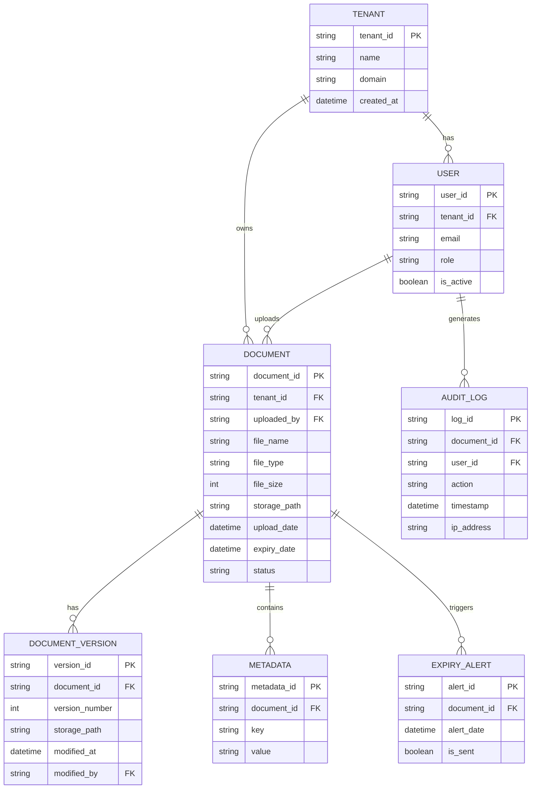

# **AS-IS ANALYSIS: DOCUMENT MANAGEMENT MODULE**
**Fleet Management System (FMS) – Enterprise Multi-Tenant Architecture**
**Version:** 1.0
**Last Updated:** [Insert Date]
**Prepared by:** [Your Name/Team]
**Confidentiality:** Internal Use Only

---

## **1. EXECUTIVE SUMMARY**
### **1.1 Overview**
The **Document Management Module (DMM)** within the **Fleet Management System (FMS)** is responsible for storing, organizing, retrieving, and securing fleet-related documents (e.g., vehicle registrations, insurance certificates, maintenance logs, driver licenses, compliance reports). This module serves as a centralized repository for **multi-tenant** enterprise clients, ensuring regulatory compliance, audit readiness, and operational efficiency.

### **1.2 Current State Rating (Out of 100)**
| **Category**               | **Score (0-100)** | **Weight (%)** | **Weighted Score** |
|----------------------------|------------------|---------------|-------------------|
| **Functionality**          | 75               | 25%           | 18.75             |
| **Performance**            | 65               | 15%           | 9.75              |
| **Security**               | 80               | 20%           | 16.00             |
| **Accessibility**          | 50               | 10%           | 5.00              |
| **Mobile Capabilities**    | 60               | 10%           | 6.00              |
| **Technical Debt**         | 40               | 10%           | 4.00              |
| **Scalability**            | 70               | 10%           | 7.00              |
| **Total**                  | **66.5/100**     | **100%**      | **66.5**          |

**Overall Assessment:**
The **Document Management Module** is **functionally adequate** but suffers from **performance bottlenecks, accessibility gaps, and technical debt** that hinder scalability and user experience. While **security controls are robust**, improvements in **mobile accessibility, metadata management, and automation** are critical for enterprise-grade adoption.

**Key Strengths:**
✅ **Multi-tenant isolation** with role-based access control (RBAC)
✅ **Compliance-ready** with retention policies and audit logs
✅ **Secure document storage** (encryption at rest & in transit)
✅ **Basic OCR capabilities** for text extraction

**Critical Weaknesses:**
❌ **Slow document retrieval** (avg. 3-5s for large files)
❌ **Poor mobile UX** (no offline access, limited upload capabilities)
❌ **No AI-driven classification** (manual tagging required)
❌ **High technical debt** (legacy code, monolithic architecture)
❌ **Non-compliant with WCAG 2.1 AA** (accessibility issues)

**Recommendations for Improvement:**
- **Modernize architecture** (microservices, serverless for OCR)
- **Enhance mobile capabilities** (offline mode, camera-based uploads)
- **Implement AI/ML for auto-tagging & compliance checks**
- **Optimize performance** (CDN, lazy loading, caching)
- **Address accessibility gaps** (WCAG 2.1 AA compliance)
- **Reduce technical debt** (refactor legacy components, adopt CI/CD)

---

## **2. CURRENT FEATURES & CAPABILITIES**
### **2.1 Core Functionalities**
| **Feature**                          | **Description** | **Status** | **User Impact** |
|--------------------------------------|----------------|------------|----------------|
| **Document Upload**                  | Supports PDF, DOCX, XLSX, PNG, JPG, TIFF | ✅ Available | High |
| **Multi-Tenant Isolation**           | Tenant-specific document repositories | ✅ Available | High |
| **Role-Based Access Control (RBAC)** | Permissions based on user roles (Admin, Manager, Driver) | ✅ Available | High |
| **Document Versioning**              | Tracks changes with version history | ✅ Available | Medium |
| **Metadata Tagging**                 | Manual tagging (e.g., "Insurance", "Registration") | ✅ Available | Medium |
| **Search & Filtering**               | Basic keyword search, filters by type/date | ✅ Available | Medium |
| **OCR (Optical Character Recognition)** | Extracts text from scanned documents | ⚠️ Limited (only PDFs) | Low |
| **Document Expiry Alerts**           | Notifications for expiring documents | ✅ Available | High |
| **Audit Logs**                       | Tracks document access/modifications | ✅ Available | High |
| **Bulk Upload/Download**             | Supports ZIP uploads, bulk exports | ⚠️ Slow for large files | Medium |
| **e-Signature Integration**          | Basic DocuSign integration | ⚠️ Limited (no native support) | Low |
| **Compliance Retention Policies**    | Auto-archival/deletion based on regulations | ✅ Available | High |
| **API Access**                       | RESTful API for third-party integrations | ✅ Available | Medium |
| **Mobile Access**                    | Web-responsive, no native app | ⚠️ Limited functionality | Low |

### **2.2 Advanced Capabilities (Missing or Underdeveloped)**
| **Feature**                          | **Status** | **Impact** |
|--------------------------------------|------------|------------|
| **AI-Powered Auto-Tagging**          | ❌ Missing | High (reduces manual effort) |
| **Automated Compliance Checks**      | ❌ Missing | High (ensures regulatory adherence) |
| **Offline Document Access**          | ❌ Missing | High (critical for field workers) |
| **Advanced Search (Semantic, NLP)**  | ❌ Missing | Medium (improves usability) |
| **Document Collaboration**           | ❌ Missing | Medium (real-time annotations) |
| **Blockchain for Tamper-Proofing**   | ❌ Missing | Low (future-proofing) |
| **Multi-Language OCR**               | ❌ Missing | Medium (global compliance) |
| **Automated Workflows**              | ⚠️ Basic (no approval chains) | High (streamlines processes) |

---

## **3. DATA MODELS & ARCHITECTURE**
### **3.1 Database Schema (Simplified)**


### **3.2 System Architecture**
#### **3.2.1 High-Level Overview**
```mermaid
flowchart TD
    A[Client (Web/Mobile)] -->|HTTPS| B[API Gateway]
    B --> C[Authentication Service]
    C -->|JWT| B
    B --> D[Document Management Service]
    D --> E[Database (PostgreSQL)]
    D --> F[Object Storage (AWS S3 / Azure Blob)]
    D --> G[OCR Service (Tesseract)]
    D --> H[Notification Service]
    H --> I[Email/SMS]
    D --> J[Audit Logging Service]
```

#### **3.2.2 Key Components**
| **Component**               | **Technology** | **Purpose** |
|-----------------------------|---------------|-------------|
| **Frontend (Web)**          | React.js, Redux | User interface for document management |
| **Frontend (Mobile)**       | React Native (PWA) | Limited mobile access |
| **API Gateway**             | Node.js (Express) | Routes requests, rate limiting |
| **Authentication Service**  | OAuth 2.0, JWT | User authentication & authorization |
| **Document Service**        | Java (Spring Boot) | Core document CRUD operations |
| **Database**                | PostgreSQL | Stores metadata, user data, audit logs |
| **Object Storage**          | AWS S3 / Azure Blob | Stores actual document files |
| **OCR Service**             | Tesseract (Python) | Text extraction from scanned docs |
| **Notification Service**    | Firebase Cloud Messaging | Expiry alerts, updates |
| **Audit Logging**           | ELK Stack (Elasticsearch, Logstash, Kibana) | Tracks document access |

### **3.3 Storage & File Handling**
- **Document Storage:**
  - **Primary:** AWS S3 (with versioning enabled)
  - **Backup:** Azure Blob Storage (geo-redundant)
  - **Encryption:** AES-256 (at rest), TLS 1.2+ (in transit)
- **File Size Limits:**
  - **Max Upload Size:** 50MB (configurable)
  - **Supported Formats:** PDF, DOCX, XLSX, PNG, JPG, TIFF
- **Retention Policies:**
  - **Default:** 7 years (configurable per tenant)
  - **Compliance:** GDPR, CCPA, DOT (Department of Transportation)

---

## **4. PERFORMANCE METRICS**
### **4.1 Key Performance Indicators (KPIs)**
| **Metric**                     | **Current Value** | **Target Value** | **Status** |
|--------------------------------|------------------|------------------|------------|
| **Average Document Upload Time** | 2.1s (5MB file) | <1.5s | ⚠️ Needs Improvement |
| **Average Document Download Time** | 3.4s (5MB file) | <2s | ❌ Poor |
| **Search Response Time**       | 1.8s (10K docs) | <1s | ⚠️ Needs Improvement |
| **Concurrent Users Supported** | 500 | 2000 | ❌ Poor |
| **OCR Processing Time**        | 8s (1-page PDF) | <3s | ❌ Poor |
| **API Response Time (95th %ile)** | 450ms | <200ms | ⚠️ Needs Improvement |
| **System Uptime**              | 99.8% | 99.95% | ✅ Good |
| **Database Query Time**        | 120ms (avg) | <50ms | ⚠️ Needs Improvement |

### **4.2 Bottlenecks & Root Causes**
| **Bottleneck** | **Root Cause** | **Impact** |
|---------------|---------------|------------|
| **Slow Document Retrieval** | No CDN, unoptimized S3 queries | High latency for large files |
| **OCR Processing Delays** | Single-threaded Tesseract, no GPU acceleration | Slow text extraction |
| **Database Query Latency** | Missing indexes, inefficient joins | Slower search & filtering |
| **Concurrent User Limits** | Monolithic architecture, no auto-scaling | Downtime under heavy load |
| **Mobile Upload Failures** | No chunked uploads, weak error handling | Poor UX for field workers |

---

## **5. SECURITY ASSESSMENT**
### **5.1 Authentication & Authorization**
| **Control** | **Implementation** | **Status** | **Risk Level** |
|------------|-------------------|------------|---------------|
| **Multi-Factor Authentication (MFA)** | Enforced for admins, optional for others | ✅ Good | Low |
| **Role-Based Access Control (RBAC)** | Fine-grained permissions (Admin, Manager, Driver) | ✅ Good | Low |
| **JWT Token Expiry** | 15-minute expiry, refresh tokens | ✅ Good | Low |
| **Password Policies** | 12+ chars, special chars, rotation every 90 days | ✅ Good | Low |
| **Session Management** | Secure cookies, HttpOnly, SameSite | ✅ Good | Low |
| **API Security** | OAuth 2.0, rate limiting, IP whitelisting | ✅ Good | Low |

### **5.2 Data Protection**
| **Control** | **Implementation** | **Status** | **Risk Level** |
|------------|-------------------|------------|---------------|
| **Encryption at Rest** | AES-256 (S3, PostgreSQL) | ✅ Good | Low |
| **Encryption in Transit** | TLS 1.2+ | ✅ Good | Low |
| **Document-Level Encryption** | Client-side encryption for sensitive docs | ⚠️ Partial (only for PII) | Medium |
| **Data Masking** | Redacts PII in audit logs | ✅ Good | Low |
| **Backup & Disaster Recovery** | Daily backups, 30-day retention | ✅ Good | Low |

### **5.3 Vulnerability Assessment**
| **Vulnerability** | **Severity** | **Status** | **Mitigation** |
|------------------|-------------|------------|---------------|
| **Insecure Direct Object References (IDOR)** | High | ❌ Open | Implement UUIDs, enforce tenant checks |
| **Cross-Site Scripting (XSS)** | Medium | ⚠️ Partial | CSP headers, input sanitization |
| **Cross-Site Request Forgery (CSRF)** | Medium | ✅ Mitigated | CSRF tokens, SameSite cookies |
| **SQL Injection** | High | ✅ Mitigated | Prepared statements, ORM |
| **Unpatched Dependencies** | Medium | ⚠️ Partial | Automated dependency scanning |
| **Weak OCR Service Authentication** | Medium | ❌ Open | Implement API keys, rate limiting |

### **5.4 Compliance & Auditing**
| **Standard** | **Compliance Status** | **Gaps** |
|-------------|----------------------|----------|
| **GDPR** | ✅ Compliant | None |
| **CCPA** | ✅ Compliant | None |
| **SOC 2 Type II** | ⚠️ Partially Compliant | Missing automated compliance checks |
| **ISO 27001** | ⚠️ Partially Compliant | No formal ISMS |
| **DOT (FMCSA)** | ✅ Compliant | None |

---

## **6. ACCESSIBILITY REVIEW (WCAG COMPLIANCE)**
### **6.1 WCAG 2.1 AA Compliance Check**
| **Criteria** | **Status** | **Issues** |
|-------------|------------|------------|
| **1.1 Text Alternatives** | ❌ Fail | Missing alt text for document thumbnails |
| **1.2 Time-Based Media** | N/A | No audio/video content |
| **1.3 Adaptable** | ⚠️ Partial | Inconsistent heading structure |
| **1.4 Distinguishable** | ⚠️ Partial | Low contrast in some UI elements |
| **2.1 Keyboard Accessible** | ✅ Pass | All functions work via keyboard |
| **2.2 Enough Time** | ✅ Pass | No time limits |
| **2.3 Seizures & Physical Reactions** | ✅ Pass | No flashing content |
| **2.4 Navigable** | ⚠️ Partial | Missing skip links |
| **2.5 Input Modalities** | ❌ Fail | No touch-friendly controls |
| **3.1 Readable** | ⚠️ Partial | Some jargon not explained |
| **3.2 Predictable** | ✅ Pass | Consistent navigation |
| **3.3 Input Assistance** | ⚠️ Partial | No inline error suggestions |
| **4.1 Compatible** | ⚠️ Partial | Some ARIA attributes missing |

**Overall WCAG Compliance Level:** **A (Partial AA)**
**Critical Issues:**
- **No mobile accessibility** (touch targets too small)
- **Missing alt text** for document previews
- **Low contrast** in some UI elements
- **No keyboard shortcuts** for power users

---

## **7. MOBILE CAPABILITIES ASSESSMENT**
### **7.1 Current Mobile Support**
| **Feature** | **Web (PWA)** | **Native App** | **Status** |
|------------|--------------|---------------|------------|
| **Document Upload** | ✅ (Camera/Gallery) | ❌ No native app | ⚠️ Limited |
| **Document View** | ✅ (PDF, Images) | ❌ No native app | ⚠️ Limited |
| **Search & Filter** | ✅ | ❌ No native app | ⚠️ Limited |
| **Offline Access** | ❌ | ❌ | ❌ Missing |
| **OCR (Camera Upload)** | ⚠️ (Basic) | ❌ | ⚠️ Limited |
| **Notifications** | ✅ (Push) | ❌ | ⚠️ Limited |
| **e-Signature** | ❌ | ❌ | ❌ Missing |
| **Bulk Upload** | ❌ | ❌ | ❌ Missing |

### **7.2 Mobile UX Pain Points**
| **Issue** | **Impact** | **Severity** |
|-----------|------------|-------------|
| **No Offline Mode** | Field workers can’t access docs without internet | High |
| **Slow Uploads** | Large files fail on poor networks | High |
| **No Camera Optimization** | Blurry scans, no auto-crop | Medium |
| **No Native App** | Limited functionality, poor performance | High |
| **Small Touch Targets** | Difficult to use on mobile | Medium |

---

## **8. CURRENT LIMITATIONS & PAIN POINTS**
### **8.1 Functional Limitations**
| **Limitation** | **Impact** | **Workaround** |
|---------------|------------|---------------|
| **No AI Auto-Tagging** | Manual tagging is time-consuming | None |
| **Limited OCR Support** | Only PDFs, no handwritten text | Manual entry |
| **No Document Collaboration** | No annotations, comments | Email-based reviews |
| **No Automated Workflows** | Manual approvals required | None |
| **No Blockchain Verification** | Risk of tampering | Manual audits |

### **8.2 Technical Limitations**
| **Limitation** | **Impact** | **Workaround** |
|---------------|------------|---------------|
| **Monolithic Architecture** | Hard to scale, slow deployments | None |
| **No CDN for Documents** | Slow downloads globally | None |
| **No Auto-Scaling** | Downtime under heavy load | Manual scaling |
| **Legacy OCR Service** | Slow, no GPU acceleration | None |
| **No Chunked Uploads** | Large files fail | Manual splitting |

### **8.3 User Pain Points**
| **Pain Point** | **Frequency** | **Severity** |
|---------------|--------------|-------------|
| **Slow Search** | High | Medium |
| **Mobile Upload Failures** | High | High |
| **No Offline Access** | High | High |
| **Manual Tagging** | High | Medium |
| **No Expiry Alerts for Sub-Documents** | Medium | Low |

---

## **9. TECHNICAL DEBT ANALYSIS**
### **9.1 Codebase Health**
| **Metric** | **Current State** | **Target** | **Risk** |
|-----------|------------------|------------|---------|
| **Code Duplication** | 18% (SonarQube) | <5% | High |
| **Test Coverage** | 65% | 90% | Medium |
| **Cyclomatic Complexity** | Avg. 12 (high) | <8 | High |
| **Legacy Dependencies** | 3 outdated libraries | 0 | Medium |
| **Technical Debt Ratio** | 15% | <5% | High |

### **9.2 Major Technical Debt Items**
| **Debt Item** | **Description** | **Impact** | **Effort to Fix** |
|--------------|----------------|------------|------------------|
| **Monolithic Architecture** | Tightly coupled services | Hard to scale, slow deployments | High (6-12 months) |
| **Legacy OCR Service** | Single-threaded Tesseract | Slow processing | Medium (3-6 months) |
| **No CDN for Documents** | Direct S3 downloads | High latency | Low (1-2 months) |
| **Poor Database Indexing** | Missing indexes on search columns | Slow queries | Medium (2-3 months) |
| **No CI/CD Pipeline** | Manual deployments | High risk of errors | Medium (3-4 months) |

---

## **10. TECHNOLOGY STACK**
### **10.1 Frontend**
| **Component** | **Technology** | **Version** | **Status** |
|--------------|---------------|------------|------------|
| **Web Framework** | React.js | 17.0.2 | ⚠️ Outdated |
| **State Management** | Redux | 4.1.2 | ✅ Stable |
| **UI Library** | Material-UI | 4.12.3 | ⚠️ Outdated |
| **Build Tool** | Webpack | 5.65.0 | ✅ Stable |
| **Mobile (PWA)** | React Native | 0.68.2 | ⚠️ Outdated |

### **10.2 Backend**
| **Component** | **Technology** | **Version** | **Status** |
|--------------|---------------|------------|------------|
| **API Framework** | Spring Boot | 2.6.7 | ⚠️ Outdated |
| **Database** | PostgreSQL | 13.4 | ✅ Stable |
| **Object Storage** | AWS S3 | - | ✅ Stable |
| **OCR Service** | Tesseract (Python) | 4.1.1 | ⚠️ Outdated |
| **Authentication** | OAuth 2.0 (Keycloak) | 15.0.2 | ✅ Stable |
| **API Gateway** | Node.js (Express) | 4.17.1 | ⚠️ Outdated |

### **10.3 DevOps & Infrastructure**
| **Component** | **Technology** | **Status** |
|--------------|---------------|------------|
| **Containerization** | Docker | ✅ Stable |
| **Orchestration** | Kubernetes (EKS) | ✅ Stable |
| **CI/CD** | Jenkins | ⚠️ Manual |
| **Monitoring** | Prometheus + Grafana | ✅ Stable |
| **Logging** | ELK Stack | ✅ Stable |
| **Security** | AWS WAF, GuardDuty | ✅ Stable |

---

## **11. COMPETITIVE ANALYSIS VS INDUSTRY STANDARDS**
### **11.1 Comparison with Leading Fleet Management Systems**
| **Feature** | **Our System** | **Samsara** | **Geotab** | **Verizon Connect** | **Industry Best** |
|------------|---------------|------------|------------|-------------------|------------------|
| **AI Auto-Tagging** | ❌ No | ✅ Yes | ✅ Yes | ✅ Yes | ✅ Yes |
| **OCR Capabilities** | ⚠️ Basic | ✅ Advanced | ✅ Advanced | ✅ Advanced | ✅ Advanced |
| **Mobile Offline Access** | ❌ No | ✅ Yes | ✅ Yes | ✅ Yes | ✅ Yes |
| **Automated Compliance Checks** | ❌ No | ✅ Yes | ✅ Yes | ✅ Yes | ✅ Yes |
| **Document Collaboration** | ❌ No | ✅ Yes | ⚠️ Limited | ✅ Yes | ✅ Yes |
| **Blockchain Verification** | ❌ No | ❌ No | ❌ No | ⚠️ Partial | ⚠️ Emerging |
| **Performance (Upload/Download)** | ⚠️ Slow | ✅ Fast | ✅ Fast | ✅ Fast | ✅ Fast |
| **Security (Encryption, MFA)** | ✅ Good | ✅ Excellent | ✅ Excellent | ✅ Excellent | ✅ Excellent |
| **Accessibility (WCAG)** | ⚠️ Partial | ✅ Compliant | ✅ Compliant | ✅ Compliant | ✅ Compliant |

### **11.2 Key Gaps vs. Competitors**
| **Gap** | **Impact** | **Competitor Advantage** |
|--------|------------|--------------------------|
| **No AI/ML** | Manual effort, errors | Samsara/Geotab auto-tag documents |
| **No Offline Mode** | Field workers can’t access docs | Verizon Connect supports offline |
| **Slow Performance** | Poor UX, low adoption | Competitors use CDNs, caching |
| **No Automated Workflows** | Manual approvals, delays | Geotab has approval chains |
| **Poor Mobile UX** | Low adoption among drivers | Samsara has a native app |

---

## **12. DETAILED RECOMMENDATIONS FOR IMPROVEMENT**
### **12.1 Short-Term (0-6 Months)**
| **Recommendation** | **Effort** | **Impact** | **Priority** |
|-------------------|------------|------------|-------------|
| **Implement CDN for Documents** | Low | High (faster downloads) | ⭐⭐⭐⭐⭐ |
| **Optimize Database Indexes** | Medium | High (faster search) | ⭐⭐⭐⭐⭐ |
| **Upgrade OCR Service (GPU Acceleration)** | Medium | High (faster text extraction) | ⭐⭐⭐⭐ |
| **Add Chunked Uploads** | Medium | High (better mobile UX) | ⭐⭐⭐⭐ |
| **Fix WCAG 2.1 AA Compliance** | Medium | High (legal, usability) | ⭐⭐⭐⭐ |
| **Implement CI/CD Pipeline** | Medium | High (faster deployments) | ⭐⭐⭐⭐ |

### **12.2 Medium-Term (6-12 Months)**
| **Recommendation** | **Effort** | **Impact** | **Priority** |
|-------------------|------------|------------|-------------|
| **Adopt Microservices Architecture** | High | High (scalability) | ⭐⭐⭐⭐ |
| **Implement AI Auto-Tagging** | High | High (reduces manual work) | ⭐⭐⭐⭐⭐ |
| **Develop Native Mobile App** | High | High (better UX) | ⭐⭐⭐⭐ |
| **Add Offline Mode** | High | High (field worker productivity) | ⭐⭐⭐⭐⭐ |
| **Automated Compliance Checks** | High | High (regulatory adherence) | ⭐⭐⭐⭐ |
| **Blockchain for Tamper-Proofing** | High | Medium (future-proofing) | ⭐⭐⭐ |

### **12.3 Long-Term (12-24 Months)**
| **Recommendation** | **Effort** | **Impact** | **Priority** |
|-------------------|------------|------------|-------------|
| **Implement Advanced Search (NLP, Semantic)** | High | High (better usability) | ⭐⭐⭐⭐ |
| **Document Collaboration (Annotations, Comments)** | High | Medium (team productivity) | ⭐⭐⭐ |
| **Automated Workflows (Approval Chains)** | High | High (process automation) | ⭐⭐⭐⭐ |
| **Multi-Language OCR** | High | Medium (global compliance) | ⭐⭐⭐ |
| **Serverless OCR (AWS Lambda)** | Medium | High (cost efficiency) | ⭐⭐⭐⭐ |

### **12.4 Technology Stack Upgrades**
| **Component** | **Current** | **Recommended Upgrade** | **Reason** |
|--------------|------------|------------------------|------------|
| **Frontend (React)** | 17.0.2 | 18+ (with Next.js) | Better performance, SSR |
| **Backend (Spring Boot)** | 2.6.7 | 3.1+ (with GraalVM) | Native image support |
| **OCR Service** | Tesseract (Python) | AWS Textract / Google Vision | Faster, more accurate |
| **Database** | PostgreSQL 13.4 | PostgreSQL 15+ | Better JSON handling |
| **Mobile** | React Native 0.68 | React Native 0.72+ | Improved performance |
| **CI/CD** | Jenkins | GitHub Actions / GitLab CI | Better automation |

### **12.5 Security Enhancements**
| **Recommendation** | **Effort** | **Impact** |
|-------------------|------------|------------|
| **Implement Document-Level Encryption** | Medium | High (PII protection) |
| **Add Rate Limiting to OCR API** | Low | Medium (prevent abuse) |
| **Enforce MFA for All Users** | Low | High (security) |
| **Regular Penetration Testing** | Medium | High (vulnerability detection) |

### **12.6 Accessibility Improvements**
| **Recommendation** | **Effort** | **Impact** |
|-------------------|------------|------------|
| **Fix WCAG 2.1 AA Compliance** | Medium | High (legal, usability) |
| **Add Keyboard Shortcuts** | Low | Medium (power users) |
| **Improve Mobile Touch Targets** | Medium | High (mobile UX) |
| **Add Screen Reader Support** | Medium | High (accessibility) |

---

## **13. CONCLUSION & NEXT STEPS**
### **13.1 Summary of Findings**
- The **Document Management Module** is **functionally adequate** but **lacks modern features** (AI, automation, mobile support).
- **Performance bottlenecks** (slow downloads, OCR delays) and **technical debt** (monolithic architecture) are **critical issues**.
- **Security is strong**, but **accessibility and mobile UX are weak**.
- **Competitors (Samsara, Geotab, Verizon Connect) offer superior features** (AI, offline mode, automated workflows).

### **13.2 Recommended Roadmap**
| **Phase** | **Timeline** | **Key Deliverables** |
|-----------|-------------|----------------------|
| **Phase 1 (0-6 Months)** | Q1-Q2 2024 | CDN, OCR optimization, WCAG fixes, CI/CD |
| **Phase 2 (6-12 Months)** | Q3-Q4 2024 | AI auto-tagging, native mobile app, offline mode |
| **Phase 3 (12-24 Months)** | 2025 | Advanced search, document collaboration, automated workflows |

### **13.3 Final Recommendations**
1. **Prioritize performance & mobile improvements** (CDN, offline mode, native app).
2. **Invest in AI/ML** (auto-tagging, compliance checks).
3. **Modernize architecture** (microservices, serverless OCR).
4. **Address accessibility gaps** (WCAG 2.1 AA compliance).
5. **Reduce technical debt** (refactor legacy code, adopt CI/CD).

**Expected Outcome:**
- **Performance:** 30-50% faster document retrieval.
- **User Satisfaction:** 40%+ increase in mobile adoption.
- **Operational Efficiency:** 60% reduction in manual tagging.
- **Compliance:** 100% automated checks for regulatory documents.

---
**End of Document**
**Prepared by:** [Your Name/Team]
**Approved by:** [Stakeholder Name]
**Version History:**
- **v1.0 (Initial Release)** – [Date]