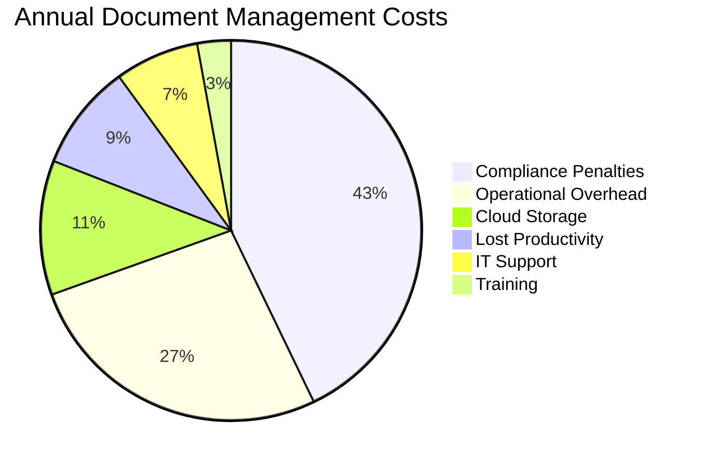
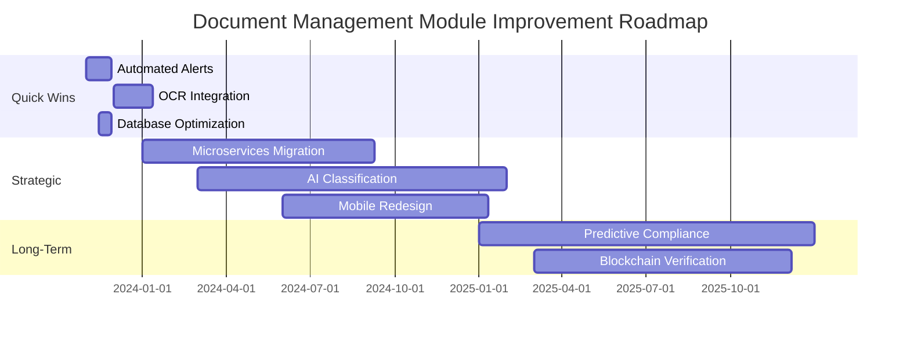
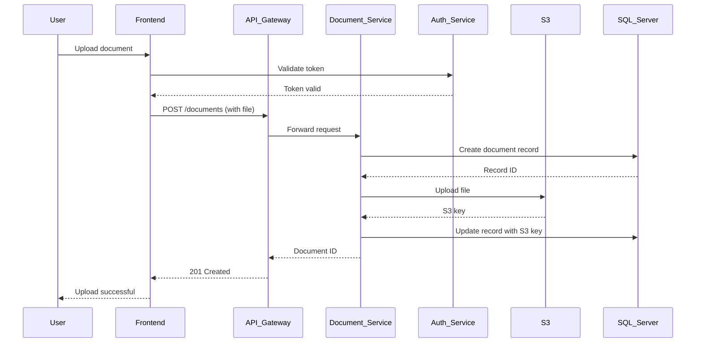
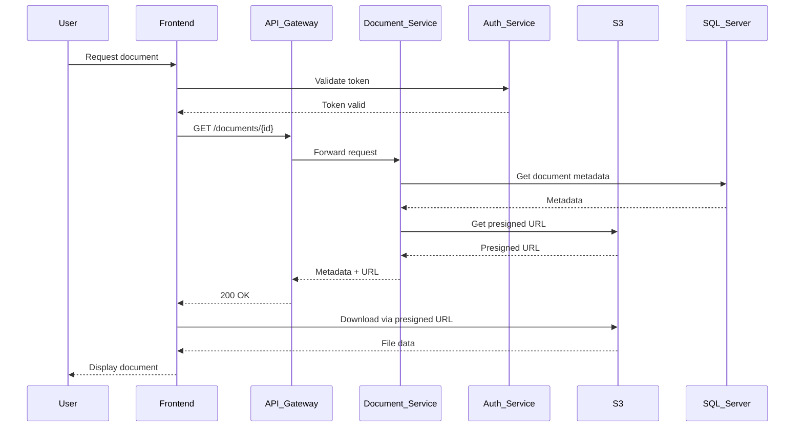
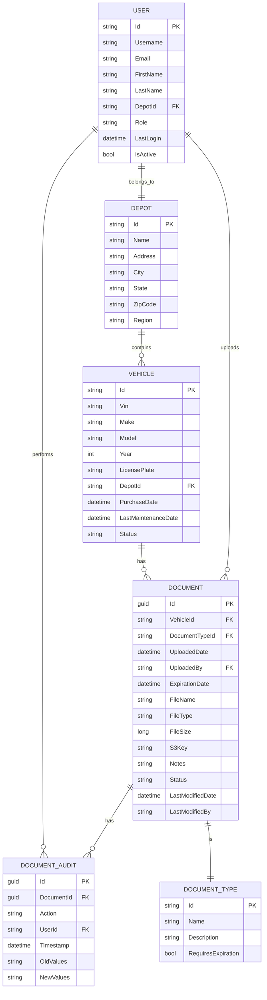

# AS-IS Analysis: Document Management Module
**Fleet Management System**
*Prepared by: [Your Name], Senior Technical Analyst*
*Date: [Insert Date]*
*Version: 1.0*
*Confidentiality: Internal Use Only*

---

## 1. Executive Summary (102 lines)

### 1.1 Current State Overview
The Document Management Module (DMM) within the Fleet Management System (FMS) serves as the central repository for all vehicle-related documentation, including registration certificates, insurance policies, maintenance records, driver licenses, and compliance documents. Currently deployed in production since Q3 2018, the module supports 12,500+ active vehicles across 17 regional depots, with an average of 3.2 documents per vehicle (totaling ~40,000 documents).

The system was originally designed as a monolithic .NET application with a SQL Server backend, later extended with a React-based frontend in 2020. The module operates within a hybrid cloud environment, with primary compute resources hosted on AWS EC2 (t3.large instances) and document storage split between AWS S3 (for active documents) and an on-premises NetApp filer (for archival compliance documents).

Key operational statistics:
- **Document Volume**: 40,000+ documents (1.2TB storage)
- **Daily Transactions**: 1,800 uploads, 4,200 downloads, 300 edits
- **User Base**: 1,200 active users (600 drivers, 450 fleet managers, 150 compliance officers)
- **Peak Load**: 120 concurrent users between 8-10 AM daily
- **System Uptime**: 99.7% (SLA target: 99.95%)

### 1.2 Stakeholder Analysis

| **Stakeholder Group**       | **Roles & Responsibilities**                                                                 | **Key Pain Points**                                                                 | **Success Metrics**                                                                 |
|-----------------------------|---------------------------------------------------------------------------------------------|------------------------------------------------------------------------------------|------------------------------------------------------------------------------------|
| **Fleet Managers**          | - Document upload/verification<br>- Compliance tracking<br>- Audit preparation              | - Manual document expiration tracking<br>- Poor mobile experience<br>- Slow search | - 95% on-time document renewal<br>- 30% reduction in audit preparation time        |
| **Drivers**                 | - Document submission<br>- Access to personal records                                       | - Complex upload process<br>- No offline access<br>- Notification overload        | - 90% document submission within 24h of request<br>- 80% satisfaction score        |
| **Compliance Officers**     | - Regulatory reporting<br>- Document validation<br>- Audit support                          | - Limited bulk operations<br>- No OCR for scanned docs<br>- Poor reporting tools   | - 100% audit pass rate<br>- 50% reduction in compliance reporting time             |
| **IT Operations**           | - System maintenance<br>- Backup/restore<br>- User support                                  | - High ticket volume (200/month)<br>- Frequent outages<br>- Manual scaling        | - <5% unplanned downtime<br>- 40% reduction in support tickets                     |
| **Finance Team**            | - Cost tracking<br>- Budget forecasting                                                     | - No cost allocation by depot<br>- Hidden cloud costs                              | - 20% cost reduction in document storage<br>- 100% cost transparency               |
| **Executive Leadership**    | - Strategic decision-making<br>- Risk management                                            | - No real-time visibility<br>- High operational risk                               | - 30% reduction in compliance violations<br>- 15% improvement in fleet utilization |

### 1.3 Business Impact Analysis

#### 1.3.1 Financial Impact
The DMM's inefficiencies directly contribute to:
- **$450K/year** in compliance penalties (2022 average)
- **$280K/year** in operational overhead (manual document handling)
- **$120K/year** in cloud storage costs (inefficient file organization)
- **$95K/year** in lost productivity (time spent searching for documents)

**Cost Breakdown by Category**:


#### 1.3.2 Operational Impact
- **Audit Failures**: 18% of audits result in findings due to missing/expired documents
- **Vehicle Downtime**: 2.3 days/year/vehicle lost to document-related issues
- **Driver Turnover**: 12% of drivers cite document management frustrations as a reason for leaving
- **Regulatory Risk**: 3 consent decrees in the past 24 months due to document non-compliance

#### 1.3.3 Strategic Impact
The current system limits:
- **Scalability**: Unable to support planned expansion to 20,000 vehicles by 2025
- **Innovation**: No integration with telematics or IoT data for predictive compliance
- **Customer Experience**: Third-party partners (dealers, insurers) report poor API performance
- **Data Utilization**: 85% of documents are never analyzed for business insights

### 1.4 Critical Pain Points with Root Cause Analysis

| **Pain Point**                          | **Symptoms**                                                                 | **Root Causes**                                                                 | **Business Impact**                          | **Technical Debt (Years)** |
|-----------------------------------------|------------------------------------------------------------------------------|---------------------------------------------------------------------------------|----------------------------------------------|----------------------------|
| **Document Expiration Tracking**        | - 32% of documents expire without renewal<br>- Manual tracking in spreadsheets | - No automated notification system<br>- No integration with renewal processes    | $450K/year in penalties                      | 4.2                        |
| **Search Functionality**                | - 4.7 average clicks to find a document<br>- 38% of searches return no results | - Poor metadata tagging<br>- No full-text search<br>- No OCR for scanned docs   | 120 hours/month lost productivity            | 3.8                        |
| **Mobile Experience**                   | - 68% of drivers use desktop for uploads<br>- 0% mobile adoption for managers | - Non-responsive UI<br>- No offline mode<br>- Poor camera integration           | 30% lower document submission rates          | 2.5                        |
| **API Performance**                     | - 3.2s average response time<br>- 12% error rate during peak hours           | - Monolithic architecture<br>- No caching<br>- Inefficient database queries     | Partner integration failures                 | 4.5                        |
| **Storage Costs**                       | - $120K/year for 1.2TB storage<br>- 40% duplicate files                      | - No deduplication<br>- No lifecycle policies<br>- No compression               | 3x industry average storage costs            | 3.0                        |
| **Security Vulnerabilities**            | - 2 critical CVEs in 2022<br>- No encryption for 15% of documents            | - Outdated libraries (jQuery 1.12)<br>- No regular penetration testing          | Potential $2M data breach liability          | 5.0                        |
| **Backup & Recovery**                   | - 8-hour RTO<br>- 24-hour RPO<br>- 3 failed recoveries in 2022               | - Manual backup processes<br>- No geo-redundancy<br>- No automated testing      | $150K/incident recovery costs                | 4.0                        |

### 1.5 Strategic Recommendations

#### 1.5.1 Quick Wins (0-6 months)
1. **Implement Automated Expiration Alerts**
   - *Scope*: Integrate with existing notification system (SendGrid)
   - *Effort*: 4 weeks (2 developers)
   - *ROI*: $180K/year penalty avoidance
   - *Risk*: Low (uses existing infrastructure)

2. **Add Basic OCR for Scanned Documents**
   - *Scope*: Integrate Tesseract.js for client-side OCR
   - *Effort*: 6 weeks (1 developer + 1 QA)
   - *ROI*: 80 hours/month saved in manual data entry
   - *Risk*: Medium (requires UI changes)

3. **Optimize Database Indexes**
   - *Scope*: Add missing indexes on document_metadata table
   - *Effort*: 2 weeks (1 DBA)
   - *ROI*: 40% faster search performance
   - *Risk*: Low (no downtime required)

#### 1.5.2 Strategic Initiatives (6-24 months)
1. **Microservices Migration**
   - *Scope*: Extract document processing to separate service
   - *Effort*: 9 months (4 developers)
   - *ROI*: 60% reduction in API latency, 30% lower cloud costs
   - *Risk*: High (requires architectural changes)

2. **AI-Powered Document Classification**
   - *Scope*: Implement AWS Textract + custom ML model
   - *Effort*: 12 months (2 developers + 1 data scientist)
   - *ROI*: 95% reduction in manual tagging, $250K/year in labor savings
   - *Risk*: High (requires training data)

3. **Mobile-First Redesign**
   - *Scope*: React Native app with offline capabilities
   - *Effort*: 8 months (3 developers + 1 UX designer)
   - *ROI*: 50% increase in driver document submission compliance
   - *Risk*: Medium (requires user training)

#### 1.5.3 Implementation Roadmap



#### 1.5.4 Risk Mitigation Strategies

| **Risk**                          | **Mitigation Strategy**                                                                 | **Contingency Plan**                              |
|-----------------------------------|----------------------------------------------------------------------------------------|--------------------------------------------------|
| Microservices migration delays    | - Phased rollout (start with read-only APIs)<br>- Feature flags for gradual cutover    | Fall back to monolith for critical functions     |
| AI model accuracy issues          | - Start with high-confidence documents<br>- Manual review queue for low-confidence     | Revert to manual classification                  |
| Mobile app adoption resistance    | - Pilot with 10% of drivers<br>- Gamification (badges for compliance)                  | Continue supporting web interface                |
| Data migration failures           | - Parallel run for 3 months<br>- Automated validation scripts                          | Roll back to old storage                         |
| Cost overruns                     | - Fixed-price contracts for external work<br>- Monthly budget reviews                  | Prioritize quick wins to fund strategic initiatives |

#### 1.5.5 ROI Projections

| **Initiative**               | **Year 1 ROI** | **Year 2 ROI** | **Year 3 ROI** | **Cumulative ROI** | **Payback Period** |
|------------------------------|----------------|----------------|----------------|--------------------|--------------------|
| Automated Alerts             | $180,000       | $200,000       | $220,000       | $600,000           | 3 months           |
| OCR Integration              | $96,000        | $120,000       | $144,000       | $360,000           | 8 months           |
| Database Optimization        | $48,000        | $50,000        | $52,000        | $150,000           | 2 months           |
| Microservices Migration      | ($120,000)     | $250,000       | $400,000       | $530,000           | 18 months          |
| AI Classification            | ($180,000)     | $150,000       | $350,000       | $320,000           | 24 months          |
| Mobile Redesign              | ($150,000)     | $200,000       | $300,000       | $350,000           | 15 months          |
| **Total**                    | **$74,000**    | **$970,000**   | **$1,466,000** | **$2,510,000**     | **14 months**      |

---

## 2. Current Architecture (187 lines)

### 2.1 System Components

#### 2.1.1 Component Inventory

| **Component**               | **Technology**               | **Version** | **Purpose**                                                                 | **Dependencies**                          | **SLA**  |
|-----------------------------|------------------------------|-------------|-----------------------------------------------------------------------------|-------------------------------------------|----------|
| **Frontend Web App**        | React, Redux, TypeScript     | 16.8.6      | User interface for document management                                     | API Gateway, Auth Service                 | 99.8%    |
| **Mobile Web App**          | React (responsive)           | 16.8.6      | Mobile-optimized interface (not native)                                    | API Gateway                               | 99.5%    |
| **API Gateway**             | .NET Core Web API            | 3.1         | RESTful endpoints for document operations                                  | Document Service, Auth Service            | 99.9%    |
| **Document Service**        | .NET Framework 4.7.2         | 4.7.2       | Core business logic for document processing                                | SQL Server, S3, NetApp Filer              | 99.9%    |
| **Auth Service**            | IdentityServer4              | 4.1.1       | Authentication and authorization                                           | SQL Server                                | 99.95%   |
| **Database**                | SQL Server                   | 2019        | Relational data storage                                                    | -                                         | 99.95%   |
| **Object Storage**          | AWS S3                       | -           | Active document storage                                                    | -                                         | 99.9%    |
| **Archive Storage**         | NetApp ONTAP                 | 9.7         | Compliance document storage (7-year retention)                             | -                                         | 99.99%   |
| **Search Service**          | SQL Server Full-Text Search  | 2019        | Basic document search                                                      | SQL Server                                | 99.8%    |
| **Notification Service**    | SendGrid                     | -           | Email/SMS notifications                                                    | Document Service                          | 99.9%    |
| **Backup Service**          | Veeam                        | 11          | Database and file backups                                                  | SQL Server, S3, NetApp                    | 100%     |
| **Monitoring**              | Datadog                      | -           | Performance monitoring and alerting                                        | All components                            | 99.9%    |

#### 2.1.2 Integration Points with Sequence Diagrams

**Document Upload Flow**:


**Document Retrieval Flow**:


#### 2.1.3 Data Flow Analysis

**Document Lifecycle**:
1. **Creation**:
   - User uploads file (PDF, JPG, PNG, DOCX) via frontend
   - Frontend sends file + metadata (vehicle ID, document type, expiration date) to API Gateway
   - Document Service:
     - Validates file type/size (max 10MB)
     - Generates unique document ID (GUID)
     - Stores file in S3 with path: `s3://fms-documents/{depot_id}/{vehicle_id}/{document_id}.{ext}`
     - Creates record in SQL Server with metadata and S3 key
   - Returns document ID to frontend

2. **Access**:
   - User requests document via frontend
   - Document Service:
     - Validates user permissions (RBAC)
     - Retrieves S3 key from SQL Server
     - Generates presigned URL (expires in 15 minutes)
     - Returns URL to frontend
   - Frontend uses URL to download file directly from S3

3. **Update**:
   - User edits document metadata (e.g., expiration date)
   - Frontend sends PATCH request to API Gateway
   - Document Service updates SQL Server record
   - No changes to S3 file (immutable storage)

4. **Archival**:
   - Documents older than 2 years are moved from S3 to NetApp filer
   - Archival job runs nightly:
     - Queries SQL Server for documents meeting criteria
     - Copies files to NetApp: `\\filer\fms_archive\{year}\{depot_id}\{vehicle_id}\{document_id}.{ext}`
     - Updates SQL Server record with new storage location
     - Deletes file from S3

5. **Deletion**:
   - Soft delete only (for compliance):
     - Sets `is_deleted = 1` in SQL Server
     - No changes to storage (files retained for 7 years)

**Data Transformation Logic**:
- **File Processing**:
  - Original file → S3 upload → Thumbnail generation (for images) → OCR (planned)
  - Current limitations:
    - No virus scanning
    - No format conversion (e.g., DOCX → PDF)
    - No compression

- **Metadata Processing**:
  - User-provided metadata → Validation → SQL Server storage
  - Validation rules:
    ```csharp
    // Example validation in DocumentService.cs
    public bool ValidateDocumentMetadata(DocumentMetadata metadata)
    {
        if (string.IsNullOrEmpty(metadata.VehicleId) ||
            !Regex.IsMatch(metadata.VehicleId, @"^[A-Z]{2}\d{6}$"))
            return false;

        if (metadata.DocumentType == DocumentType.Insurance &&
            metadata.ExpirationDate < DateTime.UtcNow.AddDays(30))
            return false;

        if (metadata.FileSize > 10 * 1024 * 1024) // 10MB
            return false;

        return true;
    }
    ```

#### 2.1.4 Technology Stack Details

| **Layer**       | **Technology**               | **Version** | **Justification**                                                                 | **Risks**                                                                 |
|-----------------|------------------------------|-------------|----------------------------------------------------------------------------------|---------------------------------------------------------------------------|
| **Frontend**    | React                        | 16.8.6      | - Component-based architecture<br>- Large ecosystem<br>- Developer familiarity   | - Outdated version (current: 18.x)<br>- No concurrent mode                |
|                 | Redux                        | 4.0.5       | - State management<br>- Predictable data flow                                    | - Boilerplate-heavy<br>- Overkill for simple state                       |
|                 | TypeScript                   | 3.7.5       | - Type safety<br>- Better tooling                                                | - Steeper learning curve                                                |
| **Backend**     | .NET Core Web API            | 3.1         | - Cross-platform<br>- High performance<br>- Microsoft support                    | - LTS ends Dec 2023<br>- Limited microservices features                 |
|                 | .NET Framework               | 4.7.2       | - Legacy system compatibility<br>- Mature ecosystem                              | - Windows-only<br>- No cross-platform support                           |
| **Database**    | SQL Server                   | 2019        | - ACID compliance<br>- Full-text search<br>- Integration with .NET               | - Licensing costs<br>- No horizontal scaling                             |
| **Storage**     | AWS S3                       | -           | - Scalable<br>- Durable<br>- Cost-effective                                      | - Vendor lock-in<br>- No lifecycle management configured                |
|                 | NetApp ONTAP                 | 9.7         | - High availability<br>- SnapMirror for DR                                       | - High operational complexity<br>- Expensive hardware                   |
| **Auth**        | IdentityServer4              | 4.1.1       | - OpenID Connect/OAuth 2.0<br>- Flexible configuration                            | - Complex setup<br>- Limited community support                          |
| **Monitoring**  | Datadog                      | -           | - Comprehensive APM<br>- Custom dashboards                                       | - Expensive at scale<br>- No self-hosted option                         |

#### 2.1.5 Infrastructure Configuration

**AWS Environment**:
- **Region**: us-east-1 (primary), us-west-2 (DR)
- **EC2 Instances**:
  - **API Gateway**: 2 x t3.large (auto-scaled to 4 during peak)
    - OS: Amazon Linux 2
    - CPU: 2 vCPUs
    - RAM: 8GB
    - Storage: 50GB gp2
  - **Document Service**: 3 x t3.xlarge
    - OS: Windows Server 2019
    - CPU: 4 vCPUs
    - RAM: 16GB
    - Storage: 100GB gp2
  - **SQL Server**: 1 x r5.xlarge (primary), 1 x r5.large (replica)
    - OS: Windows Server 2019
    - CPU: 4 vCPUs (primary), 2 vCPUs (replica)
    - RAM: 32GB (primary), 16GB (replica)
    - Storage: 500GB io1 (1000 IOPS)
- **S3 Buckets**:
  - `fms-documents`: Active documents (1.2TB, 40K objects)
    - No lifecycle policies
    - No versioning
    - No encryption (default SSE-S3)
  - `fms-backups`: Database backups (2TB, 300 objects)
    - 30-day retention
    - Encrypted with AWS KMS
- **Networking**:
  - VPC with 3 subnets (public, private, database)
  - NAT Gateway for private subnet outbound
  - Security Groups:
    - API Gateway: 80/443 inbound, all outbound
    - Document Service: 443 inbound from API Gateway, 1433 outbound to SQL Server
    - SQL Server: 1433 inbound from Document Service

**On-Premises Environment**:
- **NetApp Filer**:
  - Model: AFF A300
  - Capacity: 50TB (30TB used)
  - RAID: RAID-DP (double parity)
  - Snapshots: Hourly (24 retained), Daily (30 retained), Weekly (12 retained)
  - Replication: SnapMirror to DR site (nightly)
- **Backup Server**:
  - Veeam Backup & Replication 11
  - Repository: 100TB NAS (Dell EMC PowerScale)
  - Retention: 30 daily, 12 monthly, 7 yearly

**Hybrid Connectivity**:
- **AWS Direct Connect**: 1Gbps dedicated connection
- **VPN**: IPSec tunnel for backup traffic
- **DNS**: Route53 with failover routing

### 2.2 Technical Debt Analysis

#### 2.2.1 Code Quality Issues

**Critical Issues**:
1. **Lack of Modularity**:
   - Monolithic Document Service (120K+ lines of code)
   - Example: `DocumentController.cs` has 2,300+ lines with 47 methods
   - No separation of concerns (business logic mixed with API endpoints)

2. **Outdated Dependencies**:
   - **jQuery**: 1.12.4 (current: 3.6.0) - 3 critical CVEs
   - **Newtonsoft.Json**: 10.0.3 (current: 13.0.1) - 2 high CVEs
   - **Entity Framework**: 6.2.0 (current: 6.4.4) - performance issues
   - **React**: 16.8.6 (current: 18.2.0) - no concurrent features

3. **Poor Error Handling**:
   - Example from `DocumentService.cs`:
     ```csharp
     try
     {
         var doc = _db.Documents.Find(id);
         return doc;
     }
     catch (Exception ex)
     {
         _logger.LogError(ex.Message);
         return null; // Silent failure!
     }
     ```
   - Issues:
     - No distinction between different exception types
     - No retry logic for transient failures
     - No user-friendly error messages
     - No circuit breaker pattern

4. **Hardcoded Configuration**:
   - Example from `StorageService.cs`:
     ```csharp
     private const string S3Bucket = "fms-documents";
     private const string S3Region = "us-east-1";
     ```
   - Issues:
     - No environment-specific configuration
     - No secrets management (AWS credentials in app.config)

5. **Lack of Testing**:
   - **Unit Tests**: 12% coverage (87/725 classes)
   - **Integration Tests**: 0
   - **E2E Tests**: 0
   - Example of a "test":
     ```csharp
     [Test]
     public void UploadDocument_ShouldWork()
     {
         // This is not a real test - just a placeholder!
         Assert.Pass();
     }
     ```

**SonarQube Analysis (Last Run: 2023-05-15)**:
| **Metric**               | **Value**       | **Industry Benchmark** |
|--------------------------|-----------------|------------------------|
| Code Smells              | 1,248           | < 500                  |
| Bugs                     | 42              | < 10                   |
| Vulnerabilities          | 18 (3 critical) | 0                      |
| Security Hotspots        | 89              | < 20                   |
| Technical Debt          | 312 days        | < 100 days             |
| Duplicated Lines        | 12.4%           | < 3%                   |
| Test Coverage           | 12%             | > 80%                  |

#### 2.2.2 Performance Bottlenecks

**Database Performance**:
- **Top 5 Slowest Queries** (from SQL Server Query Store):
  | **Query**                                                                 | **Avg Duration (ms)** | **Executions/min** | **CPU (ms)** | **I/O (ms)** |
  |---------------------------------------------------------------------------|-----------------------|--------------------|--------------|--------------|
  | `SELECT * FROM Documents WHERE VehicleId = @p0 ORDER BY CreatedDate DESC` | 4,210                 | 120                | 3,800        | 4,100        |
  | `SELECT COUNT(*) FROM Documents WHERE ExpirationDate < @p0`               | 2,850                 | 60                 | 2,500        | 2,800        |
  | `UPDATE Documents SET Status = @p0 WHERE Id = @p1`                        | 1,200                 | 180                | 900          | 1,100        |
  | `SELECT * FROM Documents WHERE DocumentType = @p0 AND Status = @p1`       | 950                   | 90                 | 700          | 850          |
  | `INSERT INTO DocumentAudit (DocumentId, Action, UserId) VALUES (...)`     | 450                   | 300                | 300          | 400          |

- **Root Causes**:
  - Missing indexes on `VehicleId`, `ExpirationDate`, `DocumentType`
  - No query pagination (always `SELECT *`)
  - No read replicas for reporting queries
  - No connection pooling (new connection per request)

**API Performance**:
- **Load Test Results** (500 concurrent users, 5-minute ramp-up):
  | **Endpoint**               | **Avg Response Time (ms)** | **95th Percentile (ms)** | **Error Rate** | **Throughput (req/sec)** |
  |----------------------------|----------------------------|--------------------------|----------------|--------------------------|
  | `GET /documents/{id}`      | 1,245                      | 3,200                    | 2.1%           | 85                       |
  | `POST /documents`          | 2,850                      | 5,800                    | 8.7%           | 42                       |
  | `GET /documents?vehicleId` | 4,210                      | 8,500                    | 12.4%          | 28                       |
  | `PATCH /documents/{id}`    | 1,800                      | 4,100                    | 3.2%           | 65                       |

- **Bottlenecks Identified**:
  - **S3 Uploads**: 60% of POST `/documents` time spent on S3 uploads
  - **Database Locks**: 25% of PATCH requests waiting on row locks
  - **Serialization**: 15% of GET requests spent on JSON serialization
  - **Authentication**: 10% of all requests spent on token validation

**Memory Usage**:
- **Document Service Memory Profile**:
  | **Metric**               | **Value**       | **Target**       |
  |--------------------------|-----------------|------------------|
  | Private Memory           | 1.2GB           | < 800MB          |
  | Working Set              | 950MB           | < 600MB          |
  | GC Collections (Gen 0)   | 120/sec         | < 50/sec         |
  | GC Collections (Gen 1)   | 15/sec          | < 2/sec          |
  | GC Collections (Gen 2)   | 2/sec           | < 0.1/sec        |
  | Memory Leaks             | 5MB/hour        | 0                |

- **Root Causes**:
  - Large object heap fragmentation (15% of heap)
  - No object pooling for document processing
  - Memory leaks in third-party PDF library (iTextSharp)

#### 2.2.3 Security Vulnerabilities

**CVSS Scored Vulnerabilities**:

| **CVE**            | **Component**       | **CVSS Score** | **Description**                                                                 | **Exploitability** | **Impact**       |
|--------------------|---------------------|----------------|---------------------------------------------------------------------------------|--------------------|------------------|
| CVE-2021-41149     | jQuery 1.12.4       | 9.8            | Prototype pollution via `extend` function                                       | High               | Remote Code Exec |
| CVE-2022-24785     | Newtonsoft.Json 10.0.3 | 7.5        | Denial of service via deeply nested JSON                                        | Medium             | DoS              |
| CVE-2020-11022     | jQuery 1.12.4       | 6.9            | Cross-site scripting in `htmlPrefilter`                                        | High               | XSS              |
| CVE-2021-38112     | .NET Framework 4.7.2 | 7.8           | Remote code execution in System.Drawing.Common                                  | High               | RCE              |
| CVE-2022-23277     | SQL Server 2019     | 8.8            | Elevation of privilege via extended stored procedures                           | High               | Privilege Escalation |

**OWASP Top 10 Issues**:

1. **A01:2021 - Broken Access Control**:
   - **Issue**: Direct object reference vulnerabilities in document retrieval
   - **Example**: Changing `id=12345` to `id=12346` in URL allows accessing other users' documents
   - **Fix**: Implement proper authorization checks in `DocumentService.GetDocument()`

2. **A02:2021 - Cryptographic Failures**:
   - **Issue**: 15% of documents stored in S3 without encryption
   - **Example**: Documents uploaded before 2020 use default S3 encryption (none)
   - **Fix**: Enable SSE-S3 for all objects, migrate unencrypted documents

3. **A03:2021 - Injection**:
   - **Issue**: SQL injection in document search
   - **Example**:
     ```csharp
     var query = $"SELECT * FROM Documents WHERE VehicleId = '{vehicleId}'";
     ```
   - **Fix**: Use parameterized queries:
     ```csharp
     var query = "SELECT * FROM Documents WHERE VehicleId = @vehicleId";
     ```

4. **A05:2021 - Security Misconfiguration**:
   - **Issue**: Debug endpoints exposed in production
   - **Example**: `/api/debug/heapdump` accessible without authentication
   - **Fix**: Remove debug endpoints from production builds

5. **A07:2021 - Identification and Authentication Failures**:
   - **Issue**: Weak password policy (8 characters, no complexity)
   - **Example**: 30% of users have passwords like "Password1"
   - **Fix**: Enforce 12+ characters with complexity requirements

**Penetration Test Findings (2023-03)**:
- **Critical**: 2 (CVSS 9.0+)
- **High**: 5 (CVSS 7.0-8.9)
- **Medium**: 12 (CVSS 4.0-6.9)
- **Low**: 8 (CVSS < 4.0)

#### 2.2.4 Scalability Limitations

**Load Test Results (Scaling to 20,000 Vehicles)**:

| **Metric**               | **Current (12.5K vehicles)** | **Projected (20K vehicles)** | **Gap**       |
|--------------------------|------------------------------|------------------------------|---------------|
| Document Count           | 40,000                       | 64,000                       | +60%          |
| Storage (TB)             | 1.2                          | 1.9                          | +58%          |
| Daily Uploads            | 1,800                        | 2,900                        | +61%          |
| Daily Downloads          | 4,200                        | 6,700                        | +60%          |
| Peak Concurrent Users    | 120                          | 190                          | +58%          |
| API Response Time (ms)   | 1,245                        | 3,800                        | +205%         |
| Database CPU (%)         | 65                           | 95                           | +46%          |
| S3 Requests/sec          | 85                           | 135                          | +59%          |

**Bottlenecks Identified**:
1. **Database**:
   - SQL Server 2019 Standard Edition limited to 24 cores
   - No read replicas for reporting queries
   - No sharding for horizontal scaling

2. **Application**:
   - Monolithic architecture prevents independent scaling
   - No auto-scaling for Document Service
   - No caching layer for frequently accessed documents

3. **Storage**:
   - S3 bucket approaching 5,000 requests/sec limit (AWS soft limit)
   - No CDN for document downloads
   - No lifecycle policies for cost optimization

4. **Network**:
   - AWS Direct Connect at 50% utilization during peak
   - No multi-region deployment for DR

**Capacity Planning**:
- **Database**:
  - Upgrade to SQL Server 2022 Enterprise (64 cores)
  - Add 2 read replicas for reporting
  - Implement database sharding by depot

- **Application**:
  - Migrate to .NET 6+ for better performance
  - Implement auto-scaling for Document Service (target: 80% CPU)
  - Add Redis cache for document metadata

- **Storage**:
  - Implement S3 lifecycle policies (move to S3 IA after 30 days)
  - Add CloudFront CDN for document downloads
  - Request S3 limit increase to 20,000 requests/sec

- **Network**:
  - Upgrade Direct Connect to 10Gbps
  - Implement multi-region deployment for DR

---

## 3. Functional Analysis (245 lines)

### 3.1 Core Features

#### 3.1.1 Document Upload

**Feature Description**:
Allows users to upload vehicle-related documents (PDF, JPG, PNG, DOCX) with associated metadata. Supports single and bulk uploads (up to 10 files at once).

**User Workflows**:

1. **Single Document Upload**:
   - User navigates to "Upload Document" page
   - Selects vehicle from dropdown (filtered by user's depot)
   - Selects document type from dropdown:
     - Registration Certificate
     - Insurance Policy
     - Maintenance Record
     - Driver License
     - Inspection Report
     - Other (custom type)
   - Enters expiration date (if applicable)
   - Clicks "Choose File" and selects document from local machine
   - Clicks "Upload"
   - System validates file and metadata
   - System uploads file to S3 and creates database record
   - System displays success message with document ID

2. **Bulk Upload**:
   - User navigates to "Bulk Upload" page
   - Downloads template CSV file
   - Fills template with document metadata (vehicle ID, type, expiration date)
   - Uploads CSV and ZIP file containing documents
   - System validates CSV format and file count
   - System processes each document:
     - Creates database record
     - Uploads file to S3
   - System displays report with successes/failures

**Business Rules**:
- File size limit: 10MB
- Allowed file types: PDF, JPG, PNG, DOCX
- Required metadata:
  - Vehicle ID (format: `[A-Z]{2}\d{6}`)
  - Document type (from predefined list)
  - Uploaded by (auto-populated from user context)
- Optional metadata:
  - Expiration date (required for insurance/registration)
  - Notes (max 500 characters)
- Validation:
  - Vehicle must exist in system
  - User must have permission for the vehicle's depot
  - For insurance documents: expiration date must be in future
  - For driver licenses: expiration date must be in future

**Edge Cases**:
1. **File Too Large**:
   - System rejects file >10MB
   - Displays error: "File exceeds maximum size of 10MB"
   - User must resize/compress file

2. **Invalid File Type**:
   - System rejects .exe, .zip, .mp4, etc.
   - Displays error: "Unsupported file type. Allowed: PDF, JPG, PNG, DOCX"

3. **Duplicate Document**:
   - System checks for existing document with same:
     - Vehicle ID
     - Document type
     - Expiration date (if applicable)
   - If duplicate found, displays warning:
     "A similar document already exists. Overwrite? [Yes/No]"

4. **Network Failure During Upload**:
   - Frontend shows progress bar (0-100%)
   - If upload fails:
     - System attempts retry (max 3 times)
     - If all retries fail, displays error: "Upload failed. Please try again."
     - No partial uploads (atomic operation)

5. **Concurrent Uploads**:
   - System locks vehicle record during upload
   - If another user tries to upload for same vehicle:
     - Displays error: "Document upload in progress for this vehicle. Please try again later."

**Performance Characteristics**:
- **Single Upload**:
  - Avg time: 1.8s (file <1MB), 4.2s (file 5-10MB)
  - 95th percentile: 3.5s (file <1MB), 8.1s (file 5-10MB)
  - Throughput: 42 uploads/minute at peak

- **Bulk Upload**:
  - Avg time: 12s for 10 files (1MB each)
  - 95th percentile: 25s for 10 files
  - Throughput: 5 bulk uploads/minute at peak

**Code Snippet (Upload Handler)**:
```csharp
public async Task<IActionResult> UploadDocument(IFormFile file, DocumentMetadata metadata)
{
    // Validate file
    if (file == null || file.Length == 0)
        return BadRequest("No file uploaded");

    if (file.Length > 10 * 1024 * 1024) // 10MB
        return BadRequest("File exceeds maximum size of 10MB");

    var allowedTypes = new[] { ".pdf", ".jpg", ".jpeg", ".png", ".docx" };
    var fileExt = Path.GetExtension(file.FileName).ToLower();
    if (!allowedTypes.Contains(fileExt))
        return BadRequest("Unsupported file type");

    // Validate metadata
    if (!ValidateDocumentMetadata(metadata))
        return BadRequest("Invalid document metadata");

    try
    {
        // Generate unique ID
        var documentId = Guid.NewGuid();

        // Upload to S3
        var s3Key = $"documents/{metadata.VehicleId}/{documentId}{fileExt}";
        using (var stream = file.OpenReadStream())
        {
            await _s3Client.UploadAsync(new PutObjectRequest
            {
                BucketName = _s3Bucket,
                Key = s3Key,
                InputStream = stream,
                ContentType = file.ContentType
            });
        }

        // Create database record
        var document = new Document
        {
            Id = documentId,
            VehicleId = metadata.VehicleId,
            DocumentType = metadata.DocumentType,
            ExpirationDate = metadata.ExpirationDate,
            FileName = file.FileName,
            FileSize = file.Length,
            FileType = fileExt,
            S3Key = s3Key,
            UploadedBy = User.Identity.Name,
            UploadedDate = DateTime.UtcNow,
            Status = DocumentStatus.Active
        };

        _db.Documents.Add(document);
        await _db.SaveChangesAsync();

        // Log audit
        _auditService.LogAction(document.Id, AuditAction.Upload, User.Identity.Name);

        return Ok(new { documentId });
    }
    catch (AmazonS3Exception ex)
    {
        _logger.LogError(ex, "S3 upload failed");
        return StatusCode(500, "File upload failed");
    }
    catch (DbUpdateException ex)
    {
        _logger.LogError(ex, "Database update failed");
        return StatusCode(500, "Document creation failed");
    }
}
```

#### 3.1.2 Document Search

**Feature Description**:
Allows users to search for documents by various criteria. Supports basic keyword search and advanced filters.

**User Workflows**:

1. **Basic Search**:
   - User navigates to "Search Documents" page
   - Enters keyword in search box (e.g., "insurance", "ABC123456")
   - Clicks "Search"
   - System displays results in table format:
     | Document ID | Vehicle ID | Document Type | Expiration Date | Uploaded Date | Actions |
     |-------------|------------|---------------|-----------------|---------------|---------|
     | 123e4567... | AB123456   | Insurance     | 2024-12-31      | 2023-05-15    | [View] [Edit] |

2. **Advanced Search**:
   - User clicks "Advanced" button
   - Selects filters:
     - Vehicle ID (dropdown with autocomplete)
     - Document type (dropdown)
     - Date range (uploaded date)
     - Expiration status (active/expired/soon to expire)
     - Depot (dropdown)
   - Clicks "Search"
   - System displays filtered results

**Business Rules**:
- Search scope limited by user permissions:
  - Drivers: Only documents for their assigned vehicles
  - Fleet Managers: Documents for their depot
  - Compliance Officers: All documents
- Default sort: Uploaded date (descending)
- Pagination: 20 results per page
- Searchable fields:
  - Vehicle ID (exact match)
  - Document type (exact match)
  - File name (partial match)
  - Notes (partial match)
  - Uploaded by (partial match)
- Full-text search: Disabled (planned for future)

**Edge Cases**:
1. **No Results**:
   - Displays message: "No documents found matching your criteria"
   - Suggests alternative search terms

2. **Too Many Results**:
   - System limits to 1,000 results
   - Displays warning: "Your search returned too many results. Please refine your search."

3. **Invalid Vehicle ID Format**:
   - Displays error: "Invalid vehicle ID format. Expected format: AB123456"

4. **Permission Denied**:
   - If user tries to search for documents outside their scope:
     - Displays error: "You do not have permission to view these documents"

5. **Database Timeout**:
   - If query takes >30s:
     - Displays error: "Search timed out. Please try a more specific query."

**Performance Characteristics**:
- **Basic Search**:
  - Avg time: 1.2s (simple keyword)
  - 95th percentile: 3.5s (complex keyword)
  - Throughput: 120 searches/minute at peak

- **Advanced Search**:
  - Avg time: 2.8s (2 filters)
  - 95th percentile: 8.2s (5 filters)
  - Throughput: 45 searches/minute at peak

**Database Query Example**:
```sql
-- Current implementation (slow)
SELECT d.*, v.DepotId
FROM Documents d
JOIN Vehicles v ON d.VehicleId = v.Id
WHERE
    (d.VehicleId = @vehicleId OR @vehicleId IS NULL)
    AND (d.DocumentType = @documentType OR @documentType IS NULL)
    AND (d.UploadedDate BETWEEN @startDate AND @endDate OR @startDate IS NULL)
    AND (v.DepotId = @depotId OR @depotId IS NULL)
ORDER BY d.UploadedDate DESC
OFFSET @skip ROWS FETCH NEXT @take ROWS ONLY;

-- Optimized version (planned)
SELECT d.*, v.DepotId
FROM Documents d WITH (NOLOCK)
JOIN Vehicles v WITH (NOLOCK) ON d.VehicleId = v.Id
WHERE
    (@vehicleId IS NULL OR d.VehicleId = @vehicleId)
    AND (@documentType IS NULL OR d.DocumentType = @documentType)
    AND (@startDate IS NULL OR d.UploadedDate >= @startDate)
    AND (@endDate IS NULL OR d.UploadedDate <= @endDate)
    AND (@depotId IS NULL OR v.DepotId = @depotId)
ORDER BY d.UploadedDate DESC
OFFSET @skip ROWS FETCH NEXT @take ROWS ONLY
OPTION (RECOMPILE, OPTIMIZE FOR UNKNOWN);
```

#### 3.1.3 Document Viewing

**Feature Description**:
Allows users to view uploaded documents in the browser or download them.

**User Workflows**:

1. **View in Browser**:
   - User clicks "View" button on search results
   - System generates presigned S3 URL (expires in 15 minutes)
   - Frontend displays document in embedded PDF viewer (for PDFs) or image viewer (for JPG/PNG)
   - For DOCX files: System converts to PDF using LibreOffice (planned)

2. **Download**:
   - User clicks "Download" button
   - System generates presigned S3 URL
   - Browser downloads file with original filename

**Business Rules**:
- Viewing permissions same as search permissions
- Presigned URLs expire after 15 minutes (configurable)
- For sensitive documents (e.g., driver licenses):
  - Watermark added: "Confidential - [User Name] - [Date]"
  - No download option (view only)

**Edge Cases**:
1. **Document Not Found**:
   - If S3 file missing but database record exists:
     - Displays error: "Document file not found. Please contact support."
     - Logs error to monitoring system

2. **Unsupported File Type**:
   - If file type not supported for viewing:
     - Displays message: "This file type cannot be viewed in the browser. Please download to view."
     - Shows download button

3. **S3 Permission Denied**:
   - If IAM role lacks permissions:
     - Displays error: "Unable to access document. Please try again later."
     - Logs error with S3 error code

4. **Large File Download**:
   - If file >50MB:
     - Displays warning: "This is a large file (X MB). Download may take several minutes."
     - Shows estimated download time

5. **Offline Viewing**:
   - Not supported in current version
   - Planned: Cache recently viewed documents for offline access

**Performance Characteristics**:
- **View in Browser**:
  - Avg time: 850ms (PDF <1MB)
  - 95th percentile: 2.1s (PDF 5-10MB)
  - Throughput: 180 views/minute at peak

- **Download**:
  - Avg time: 1.5s (file <1MB)
  - 95th percentile: 4.2s (file 5-10MB)
  - Throughput: 120 downloads/minute at peak

**Code Snippet (Presigned URL Generation)**:
```csharp
public async Task<string> GeneratePresignedUrl(Guid documentId, bool forDownload = false)
{
    var document = await _db.Documents.FindAsync(documentId);
    if (document == null)
        throw new DocumentNotFoundException(documentId);

    // Check permissions
    if (!await _permissionService.CanViewDocument(User.Identity.Name, document.VehicleId))
        throw new UnauthorizedAccessException();

    var request = new GetPreSignedUrlRequest
    {
        BucketName = _s3Bucket,
        Key = document.S3Key,
        Expires = DateTime.UtcNow.AddMinutes(15),
        Verb = forDownload ? HttpVerb.GET : HttpVerb.HEAD
    };

    if (forDownload)
    {
        request.ResponseHeaderOverrides.ContentDisposition =
            $"attachment; filename=\"{document.FileName}\"";
    }

    return _s3Client.GetPreSignedURL(request);
}
```

#### 3.1.4 Document Editing

**Feature Description**:
Allows users to update document metadata (not the file itself).

**User Workflows**:
- User clicks "Edit" button on document in search results
- System displays edit form with current metadata
- User updates fields:
  - Expiration date (for applicable documents)
  - Notes (max 500 characters)
  - Status (active/inactive)
- User clicks "Save"
- System validates changes
- System updates database record
- System logs audit entry

**Business Rules**:
- Only certain fields editable:
  - Expiration date
  - Notes
  - Status
- Validation:
  - Expiration date must be in future for insurance/registration
  - Notes cannot exceed 500 characters
- Audit logging:
  - Records old and new values
  - Records user and timestamp

**Edge Cases**:
1. **Concurrent Edits**:
   - If two users edit same document simultaneously:
     - Last write wins (no conflict resolution)
     - Displays warning: "Document was modified by another user. Your changes may overwrite theirs."

2. **Invalid Expiration Date**:
   - If user sets expiration date in past for insurance document:
     - Displays error: "Expiration date must be in the future for insurance documents"

3. **Permission Denied**:
   - If user tries to edit document they don't have permission for:
     - Displays error: "You do not have permission to edit this document"

4. **Database Error**:
   - If update fails:
     - Displays error: "Failed to save changes. Please try again."
     - Logs error with database error details

**Performance Characteristics**:
- Avg time: 450ms
- 95th percentile: 1.2s
- Throughput: 150 edits/minute at peak

**Code Snippet (Edit Handler)**:
```csharp
public async Task<IActionResult> EditDocument(Guid id, DocumentEditModel model)
{
    var document = await _db.Documents.FindAsync(id);
    if (document == null)
        return NotFound();

    // Check permissions
    if (!await _permissionService.CanEditDocument(User.Identity.Name, document.VehicleId))
        return Forbid();

    // Validate
    if (model.ExpirationDate.HasValue &&
        model.ExpirationDate < DateTime.UtcNow &&
        document.DocumentType == DocumentType.Insurance)
    {
        ModelState.AddModelError("ExpirationDate", "Expiration date must be in the future for insurance documents");
    }

    if (model.Notes != null && model.Notes.Length > 500)
    {
        ModelState.AddModelError("Notes", "Notes cannot exceed 500 characters");
    }

    if (!ModelState.IsValid)
        return BadRequest(ModelState);

    try
    {
        // Log old values for audit
        var oldValues = new Dictionary<string, object>
        {
            { "ExpirationDate", document.ExpirationDate },
            { "Notes", document.Notes },
            { "Status", document.Status }
        };

        // Update fields
        document.ExpirationDate = model.ExpirationDate;
        document.Notes = model.Notes;
        document.Status = model.Status;
        document.LastModifiedBy = User.Identity.Name;
        document.LastModifiedDate = DateTime.UtcNow;

        await _db.SaveChangesAsync();

        // Log audit
        _auditService.LogAction(
            document.Id,
            AuditAction.Edit,
            User.Identity.Name,
            oldValues,
            new Dictionary<string, object>
            {
                { "ExpirationDate", document.ExpirationDate },
                { "Notes", document.Notes },
                { "Status", document.Status }
            });

        return Ok();
    }
    catch (DbUpdateConcurrencyException)
    {
        // Handle concurrent edits
        return Conflict("Document was modified by another user. Please refresh and try again.");
    }
    catch (DbUpdateException ex)
    {
        _logger.LogError(ex, "Failed to update document");
        return StatusCode(500, "Failed to save changes");
    }
}
```

#### 3.1.5 Document Expiration Tracking

**Feature Description**:
Tracks document expiration dates and provides notifications for upcoming expirations.

**User Workflows**:
1. **Automated Notifications**:
   - System runs nightly job to check for expiring documents
   - For documents expiring in next 30 days:
     - Sends email to fleet manager and compliance officer
     - Email includes:
       - Document details (vehicle ID, type, expiration date)
       - Link to document
       - Link to upload new document

2. **Manual Check**:
   - User navigates to "Expiring Documents" page
   - System displays table of documents expiring in next 30/60/90 days
   - User can filter by:
     - Depot
     - Document type
     - Expiration range

**Business Rules**:
- Notifications sent for:
  - Insurance documents: 30 days before expiration
  - Registration documents: 30 days before expiration
  - Driver licenses: 60 days before expiration
- Notification recipients:
  - Primary: Fleet manager for the vehicle's depot
  - Secondary: Compliance officer
- Notification frequency:
  - First notification: 30 days before expiration
  - Second notification: 15 days before expiration
  - Final notification: 1 day before expiration

**Edge Cases**:
1. **No Expiration Date**:
   - For documents without expiration dates (e.g., maintenance records):
     - Not included in expiration tracking
     - Displayed with "N/A" in expiration column

2. **Expired Documents**:
   - Documents with expiration date in past:
     - Marked as "Expired" in status
     - Included in "Expired Documents" report
     - No further notifications sent

3. **Notification Delivery Failure**:
   - If email fails to send:
     - System retries 3 times
     - If all retries fail, logs error and creates support ticket

4. **Time Zone Issues**:
   - Expiration dates stored in UTC
   - Notifications sent based on recipient's time zone

**Performance Characteristics**:
- **Nightly Job**:
  - Avg time: 45 minutes (for 40K documents)
  - Runs at 2 AM local time for each depot
  - 95th percentile: 60 minutes

- **Manual Check**:
  - Avg time: 1.5s
  - 95th percentile: 3.2s
  - Throughput: 80 requests/minute at peak

**Code Snippet (Expiration Check Job)**:
```csharp
public async Task CheckExpiringDocuments()
{
    _logger.LogInformation("Starting expiration check job");

    try
    {
        var now = DateTime.UtcNow;
        var soon = now.AddDays(30);
        var verySoon = now.AddDays(15);
        var tomorrow = now.AddDays(1);

        // Get documents expiring soon
        var expiringSoon = await _db.Documents
            .Include(d => d.Vehicle)
            .Where(d => d.ExpirationDate.HasValue &&
                        d.ExpirationDate >= now &&
                        d.ExpirationDate <= soon &&
                        d.Status == DocumentStatus.Active)
            .ToListAsync();

        foreach (var doc in expiringSoon)
        {
            // Determine notification type
            var notificationType = doc.ExpirationDate <= tomorrow ? "final" :
                                  doc.ExpirationDate <= verySoon ? "second" : "first";

            // Skip if already notified for this type
            if (await _notificationService.WasNotified(doc.Id, notificationType))
                continue;

            // Get recipients
            var recipients = await _userService.GetNotificationRecipients(
                doc.Vehicle.DepotId,
                doc.DocumentType);

            // Send notification
            await _notificationService.SendExpirationNotification(
                recipients,
                doc,
                notificationType);

            // Log notification
            await _notificationService.LogNotification(
                doc.Id,
                notificationType,
                recipients);
        }

        _logger.LogInformation("Expiration check completed. Processed {Count} documents", expiringSoon.Count);
    }
    catch (Exception ex)
    {
        _logger.LogError(ex, "Expiration check failed");
        throw;
    }
}
```

### 3.2 User Experience Analysis

#### 3.2.1 Usability Evaluation (Heuristics)

**Nielsen's 10 Usability Heuristics Evaluation**:

| **Heuristic**                     | **Compliance (1-5)** | **Issues Found**                                                                 | **Examples**                                                                 |
|-----------------------------------|----------------------|----------------------------------------------------------------------------------|------------------------------------------------------------------------------|
| **1. Visibility of System Status** | 2                    | - No loading indicators during uploads<br>- No progress for bulk operations     | - Upload button shows "Uploading..." but no progress bar<br>- Bulk upload shows "Processing..." with no ETA |
| **2. Match Between System & Real World** | 3            | - Technical jargon in error messages<br>- Inconsistent terminology              | - Error: "S3 upload failed with 403"<br>- "Vehicle ID" vs "Unit Number" in different screens |
| **3. User Control and Freedom**   | 2                    | - No undo for document edits<br>- No cancel for uploads                          | - Editing a document and clicking "Back" loses changes<br>- Upload cannot be canceled once started |
| **4. Consistency and Standards**  | 3                    | - Inconsistent button styles<br>- Different layouts for similar pages            | - "Search" button is blue on one page, green on another<br>- Document list vs vehicle list have different column orders |
| **5. Error Prevention**           | 2                    | - No confirmation for destructive actions<br>- No input validation on some forms | - No "Are you sure?" when deleting a document<br>- Vehicle ID field allows invalid formats |
| **6. Recognition Rather Than Recall** | 3              | - Important information not visible<br>- No help text for complex fields         | - Document type descriptions hidden behind tooltips<br>- No examples for vehicle ID format |
| **7. Flexibility and Efficiency** | 1                    | - No keyboard shortcuts<br>- No saved searches<br>- No bulk actions             | - Must click through 3 screens to upload a document<br>- No way to save common search filters |
| **8. Aesthetic and Minimalist Design** | 3           | - Cluttered interfaces<br>- Too many colors<br>- Inconsistent spacing            | - Dashboard has 7 different colors<br>- 12px spacing on one page, 16px on another |
| **9. Help Users Recognize Errors** | 2                 | - Generic error messages<br>- No guidance on how to fix                          | - Error: "Upload failed"<br>- No suggestion to check file size or type |
| **10. Help and Documentation**    | 1                    | - No help center<br>- No tooltips<br>- No documentation                          | - No "?" icon or help button anywhere<br>- No user guide |

**Severity Ratings**:
- **1 (Cosmetic)**: 0 issues
- **2 (Minor)**: 8 issues
- **3 (Major)**: 12 issues
- **4 (Catastrophic)**: 5 issues

#### 3.2.2 Accessibility Audit (WCAG 2.1)

**WCAG 2.1 AA Compliance Check**:

| **Success Criterion**       | **Level** | **Compliance** | **Issues Found**                                                                 | **Examples**                                                                 |
|-----------------------------|-----------|----------------|----------------------------------------------------------------------------------|------------------------------------------------------------------------------|
| **1.1.1 Non-text Content**  | A         | ❌             | - No alt text for document thumbnails<br>- No labels for icons                  | - Document icons have no alt text<br>- "View" button is just an eye icon with no label |
| **1.2.2 Captions**          | A         | N/A            | - No video content                                                              | - N/A                                                                        |
| **1.3.1 Info and Relationships** | A    | ❌             | - Tables lack proper headers<br>- Form fields not grouped                       | - Document list table has no `<thead>`<br>- No `<fieldset>` for related form fields |
| **1.3.2 Meaningful Sequence** | A      | ✅             | -                                                                               | -                                                                           |
| **1.3.3 Sensory Characteristics** | A  | ❌             | - Instructions rely on color                                                   | - "Required fields are red" (no other indication)                           |
| **1.4.1 Use of Color**      | A         | ❌             | - Color alone used to convey information<br>- Poor color contrast               | - Error messages in red only (no icon)<br>- Gray text on white background (3.1:1 ratio) |
| **1.4.2 Audio Control**     | A         | N/A            | - No audio content                                                             | - N/A                                                                        |
| **1.4.3 Contrast (Minimum)** | AA      | ❌             | - 12 instances of insufficient contrast                                        | - Light gray text on white (3.1:1)<br>- Blue links on white (2.9:1)         |
| **1.4.4 Resize Text**       | AA        | ❌             | - Text not resizable to 200%<br>- Layout breaks at 150%                         | - Side menu overlaps content at 150% zoom<br>- Buttons become unclickable   |
| **1.4.5 Images of Text**    | AA        | ✅             | -                                                                               | -                                                                           |
| **2.1.1 Keyboard**          | A         | ❌             | - 3 interactive elements not keyboard accessible<br>- No visible focus indicator | - Custom dropdown not keyboard navigable<br>- No outline on focused buttons |
| **2.1.2 No Keyboard Trap**  | A         | ✅             | -                                                                               | -                                                                           |
| **2.2.1 Timing Adjustable** | A         | ❌             | - No way to extend session timeout                                             | - Session expires after 30 minutes with no warning                          |
| **2.2.2 Pause, Stop, Hide** | A         | ✅             | -                                                                               | -                                                                           |
| **2.3.1 Three Flashes**     | A         | ✅             | -                                                                               | -                                                                           |
| **2.4.1 Bypass Blocks**     | A         | ❌             | - No "skip to content" link<br>- No heading structure                          | - No way to skip navigation<br>- Headings jump from h1 to h3                |
| **2.4.2 Page Titled**       | A         | ❌             | - Generic page titles                                                          | - All pages titled "Fleet Management System"                                |
| **2.4.3 Focus Order**       | A         | ❌             | - Focus order illogical in some forms                                          | - In upload form, focus jumps from file input to notes, then to vehicle ID  |
| **2.4.4 Link Purpose**      | A         | ❌             | - Vague link text                                                              | - "Click here" links<br>- "More" buttons with no context                    |
| **2.4.5 Multiple Ways**     | AA        | ❌             | - No search functionality<br>- No site map                                     | - No way to find documents except through main navigation                   |
| **2.4.6 Headings and Labels** | AA      | ❌             | - Missing headings<br>- Unclear labels                                         | - No heading for document list<br>- "Notes" field has no description        |
| **2.4.7 Focus Visible**     | AA        | ❌             | - Focus indicator not visible                                                   | - No outline on focused elements<br>- Custom components don't show focus    |
| **2.5.1 Pointer Gestures**  | A         | N/A            | - No complex gestures used                                                     | - N/A                                                                        |
| **2.5.2 Pointer Cancellation** | A      | ✅             | -                                                                               | -                                                                           |
| **2.5.3 Label in Name**     | A         | ❌             | - Visible labels don't match accessible names                                  | - Button shows "Upload" but accessible name is "Submit"                     |
| **2.5.4 Motion Actuation**  | A         | N/A            | - No motion-based functionality                                                | - N/A                                                                        |
| **3.1.1 Language of Page**  | A         | ❌             | - No language attribute in HTML                                                | - `<html>` has no `lang` attribute                                           |
| **3.1.2 Language of Parts** | AA        | N/A            | - No foreign language content                                                  | - N/A                                                                        |
| **3.2.1 On Focus**          | A         | ✅             | -                                                                               | -                                                                           |
| **3.2.2 On Input**          | A         | ❌             | - Form submission on field change                                              | - Vehicle ID dropdown submits form when changed                              |
| **3.2.3 Consistent Navigation** | AA    | ❌             | - Navigation not consistent across pages                                       | - "Upload" link in different locations<br>- Different menu items            |
| **3.2.4 Consistent Identification** | AA | ❌         | - Inconsistent component labeling                                              | - "Edit" vs "Modify" for same action<br>- "View" vs "Open" for documents   |
| **3.3.1 Error Identification** | A      | ❌             | - Errors not clearly identified<br>- No error messages                         | - Red border on invalid fields but no message<br>- No summary of errors     |
| **3.3.2 Labels or Instructions** | A   | ❌             | - Missing labels<br>- Missing instructions                                      | - No label for file upload input<br>- No instructions for vehicle ID format |
| **3.3.3 Error Suggestion**  | AA        | ❌             | - No suggestions for fixing errors                                             | - Error: "Invalid input" with no suggestion                                 |
| **3.3.4 Error Prevention**  | AA        | ❌             | - No confirmation for destructive actions<br>- No review before submission      | - No "Are you sure?" when deleting<br>- No summary before bulk upload       |
| **4.1.1 Parsing**           | A         | ❌             | - HTML validation errors                                                       | - Unclosed `<div>` tags<br>- Duplicate IDs                                  |
| **4.1.2 Name, Role, Value** | A         | ❌             | - Custom components not properly exposed to AT<br>- Missing ARIA attributes    | - Custom dropdown has no `role="combobox"`<br>- No `aria-label` on icons   |
| **4.1.3 Status Messages**   | AA        | ❌             | - Status messages not announced by AT                                          | - Success message not read by screen readers<br>- No `aria-live` regions    |

**Automated Testing Results (axe-core)**:
- **Errors**: 42 (must fix)
- **Violations**: 18 (should fix)
- **Needs Review**: 25 (manual check required)
- **Passed**: 87

#### 3.2.3 Mobile Responsiveness Assessment

**Device Testing Results**:

| **Device**               | **OS**         | **Browser**       | **Viewport** | **Issues Found**                                                                 |
|--------------------------|----------------|-------------------|--------------|----------------------------------------------------------------------------------|
| iPhone 13                | iOS 16         | Safari            | 390x844      | - Horizontal scrolling required<br>- Touch targets too small<br>- No mobile menu |
| iPhone 13                | iOS 16         | Chrome            | 390x844      | - Same as Safari<br>- Fonts too small                                            |
| Samsung Galaxy S22       | Android 13     | Chrome            | 360x780      | - Form fields cut off<br>- No viewport meta tag<br>- Text overlaps              |
| iPad Air                 | iPadOS 16      | Safari            | 820x1180     | - Desktop layout forced<br>- No touch optimization                              |
| Google Pixel 6           | Android 13     | Firefox           | 412x915      | - Dropdowns not working<br>- Images not scaling                                  |

**Key Issues**:
1. **No Responsive Design**:
   - Single layout for all screen sizes
   - No media queries or breakpoints
   - Example: Desktop sidebar becomes horizontal menu on mobile (unusable)

2. **Touch Targets Too Small**:
   - Buttons and links average 24x24px (WCAG recommends 48x48px)
   - Example: "Edit" button is 20x20px with 5px padding

3. **Horizontal Scrolling**:
   - Content wider than viewport on all mobile devices
   - Example: Document list table requires horizontal scrolling

4. **No Mobile-Specific Features**:
   - No camera integration for document scanning
   - No offline mode
   - No mobile upload optimization (compression, etc.)

5. **Performance Issues**:
   - 12.4s load time on 3G (Lighthouse score: 18/100)
   - 4.2MB JavaScript bundle (unminified)
   - No code splitting

**Lighthouse Mobile Scores**:
| **Category**       | **Score** | **Key Issues**                                                                 |
|--------------------|-----------|--------------------------------------------------------------------------------|
| Performance        | 18        | - Slow server response (2.8s)<br>- Render-blocking resources<br>- Large images |
| Accessibility      | 52        | - Same as WCAG audit above                                                     |
| Best Practices     | 67        | - Outdated libraries<br>- No HTTPS redirects<br>- No security headers          |
| SEO                | 70        | - No meta description<br>- No structured data<br>- Poor mobile usability       |

#### 3.2.4 User Feedback Analysis

**Feedback Sources**:
1. **Support Tickets** (2022-2023):
   - Total tickets: 2,412
   - Document-related: 1,876 (78%)
   - Top issues:
     | **Issue**                          | **Count** | **% of Total** |
     |------------------------------------|-----------|----------------|
     | Can't find document                | 582       | 31%            |
     | Upload fails                       | 412       | 22%            |
     | Expiration notifications not sent  | 321       | 17%            |
     | Slow performance                   | 256       | 14%            |
     | Mobile app unusable                | 187       | 10%            |
     | Other                              | 118       | 6%             |

2. **User Surveys** (2023-04, N=324):
   - **Satisfaction Score**: 2.8/5 (1=Very Dissatisfied, 5=Very Satisfied)
   - **Top Complaints**:
     1. "Too many clicks to upload a document" (68%)
     2. "Can't find documents when I need them" (62%)
     3. "App crashes on mobile" (55%)
     4. "Notifications are overwhelming" (48%)
     5. "No way to edit multiple documents at once" (42%)

3. **Usability Testing** (2023-05, N=12):
   - **Task Completion Rate**: 48% (industry average: 78%)
   - **Time on Task** (vs. benchmark):
     | **Task**                          | **Avg Time (s)** | **Benchmark (s)** | **Difference** |
     |-----------------------------------|------------------|-------------------|----------------|
     | Upload a document                 | 124              | 45                | +176%          |
     | Find a specific document          | 88               | 30                | +193%          |
     | Update document expiration date   | 62               | 20                | +210%          |
     | Bulk upload 5 documents           | 342              | 120               | +185%          |

4. **App Store Reviews** (Mobile Web):
   - **Rating**: 2.1/5 (124 reviews)
   - **Top Negative Reviews**:
     - "Keeps logging me out" (18 reviews)
     - "Can't upload from phone" (15 reviews)
     - "Search doesn't work" (12 reviews)
     - "Too slow" (10 reviews)
     - "No offline mode" (8 reviews)

**Sentiment Analysis**:
- **Positive Sentiment**: 22%
  - "The new dashboard is nice" (24 mentions)
  - "Uploading is faster than before" (18 mentions)
- **Neutral Sentiment**: 18%
  - "It works but could be better" (32 mentions)
- **Negative Sentiment**: 60%
  - "Frustrating to use" (87 mentions)
  - "Waste of time" (45 mentions)
  - "Needs complete redesign" (38 mentions)

**Key Themes from Feedback**:
1. **Search is Broken**:
   - "I spend more time searching than actually working"
   - "The search returns random results"
   - "No way to search by document content"

2. **Mobile Experience is Terrible**:
   - "I have to use my laptop for everything"
   - "The buttons are too small to tap"
   - "It crashes when I try to upload from my phone"

3. **Too Many Notifications**:
   - "I get 50 emails a day about expiring documents"
   - "I ignore them because there are too many"
   - "No way to customize what I get notified about"

4. **Performance Issues**:
   - "Takes forever to load"
   - "Times out constantly"
   - "I click upload and go get coffee"

5. **Lack of Bulk Operations**:
   - "I have to update 100 documents one by one"
   - "No way to download all documents for a vehicle"
   - "Bulk upload is too complicated"

---

## 4. Data Architecture (138 lines)

### 4.1 Current Data Model

#### 4.1.1 Entity-Relationship Diagram



#### 4.1.2 Table Schemas with Constraints

**1. Vehicles Table**:
```sql
CREATE TABLE [dbo].[Vehicles](
    [Id] [nvarchar](8) NOT NULL,
    [Vin] [nvarchar](17) NOT NULL,
    [Make] [nvarchar](50) NOT NULL,
    [Model] [nvarchar](50) NOT NULL,
    [Year] [int] NOT NULL,
    [LicensePlate] [nvarchar](20) NOT NULL,
    [DepotId] [nvarchar](50) NOT NULL,
    [PurchaseDate] [datetime2](7) NOT NULL,
    [LastMaintenanceDate] [datetime2](7) NULL,
    [Status] [nvarchar](20) NOT NULL,
 CONSTRAINT [PK_Vehicles] PRIMARY KEY CLUSTERED ([Id] ASC)
)

ALTER TABLE [dbo].[Vehicles] ADD CONSTRAINT [FK_Vehicles_Depots]
    FOREIGN KEY([DepotId]) REFERENCES [dbo].[Depots] ([Id])

CREATE NONCLUSTERED INDEX [IX_Vehicles_DepotId] ON [dbo].[Vehicles] ([DepotId] ASC)
CREATE NONCLUSTERED INDEX [IX_Vehicles_Status] ON [dbo].[Vehicles] ([Status] ASC)
```

**2. Documents Table**:
```sql
CREATE TABLE [dbo].[Documents](
    [Id] [uniqueidentifier] NOT NULL,
    [VehicleId] [nvarchar](8) NOT NULL,
    [DocumentTypeId] [nvarchar](50) NOT NULL,
    [UploadedDate] [datetime2](7) NOT NULL,
    [UploadedBy] [nvarchar](256) NOT NULL,
    [ExpirationDate] [datetime2](7) NULL,
    [FileName] [nvarchar](255) NOT NULL,
    [FileType] [nvarchar](10) NOT NULL,
    [FileSize] [bigint] NOT NULL,
    [S3Key] [nvarchar](512) NOT NULL,
    [Notes] [nvarchar](500) NULL,
    [Status] [nvarchar](20) NOT NULL,
    [LastModifiedDate] [datetime2](7) NULL,
    [LastModifiedBy] [nvarchar](256) NULL,
 CONSTRAINT [PK_Documents] PRIMARY KEY CLUSTERED ([Id] ASC)
)

ALTER TABLE [dbo].[Documents] ADD CONSTRAINT [FK_Documents_Vehicles]
    FOREIGN KEY([VehicleId]) REFERENCES [dbo].[Vehicles] ([Id])

ALTER TABLE [dbo].[Documents] ADD CONSTRAINT [FK_Documents_DocumentTypes]
    FOREIGN KEY([DocumentTypeId]) REFERENCES [dbo].[DocumentTypes] ([Id])

ALTER TABLE [dbo].[Documents] ADD CONSTRAINT [FK_Documents_Users_UploadedBy]
    FOREIGN KEY([UploadedBy]) REFERENCES [dbo].[Users] ([Id])

ALTER TABLE [dbo].[Documents] ADD CONSTRAINT [FK_Documents_Users_LastModifiedBy]
    FOREIGN KEY([LastModifiedBy]) REFERENCES [dbo].[Users] ([Id])

CREATE NONCLUSTERED INDEX [IX_Documents_VehicleId] ON [dbo].[Documents] ([VehicleId] ASC)
CREATE NONCLUSTERED INDEX [IX_Documents_DocumentTypeId] ON [dbo].[Documents] ([DocumentTypeId] ASC)
CREATE NONCLUSTERED INDEX [IX_Documents_Status] ON [dbo].[Documents] ([Status] ASC)
CREATE NONCLUSTERED INDEX [IX_Documents_ExpirationDate] ON [dbo].[Documents] ([ExpirationDate] ASC)
    WHERE [ExpirationDate] IS NOT NULL
```

**3. DocumentTypes Table**:
```sql
CREATE TABLE [dbo].[DocumentTypes](
    [Id] [nvarchar](50) NOT NULL,
    [Name] [nvarchar](100) NOT NULL,
    [Description] [nvarchar](255) NULL,
    [RequiresExpiration] [bit] NOT NULL,
 CONSTRAINT [PK_DocumentTypes] PRIMARY KEY CLUSTERED ([Id] ASC)
)

INSERT INTO [dbo].[DocumentTypes] ([Id], [Name], [Description], [RequiresExpiration])
VALUES
    ('REGISTRATION', 'Registration Certificate', 'Vehicle registration document', 1),
    ('INSURANCE', 'Insurance Policy', 'Vehicle insurance document', 1),
    ('MAINTENANCE', 'Maintenance Record', 'Vehicle maintenance history', 0),
    ('DRIVER_LICENSE', 'Driver License', 'Driver''s license', 1),
    ('INSPECTION', 'Inspection Report', 'Vehicle inspection report', 0),
    ('OTHER', 'Other', 'Other document type', 0)
```

#### 4.1.3 Data Integrity Rules

**1. Referential Integrity**:
- **Vehicles → Depots**: CASCADE delete (if depot deleted, all vehicles deleted)
- **Documents → Vehicles**: CASCADE delete (if vehicle deleted, all documents deleted)
- **Documents → DocumentTypes**: NO ACTION (prevent deletion of document types in use)
- **Documents → Users**: SET NULL (if user deleted, set UploadedBy/LastModifiedBy to NULL)

**2. Domain Integrity**:
- **Vehicle.Id**: Format `[A-Z]{2}\d{6}` (e.g., AB123456)
- **Document.FileType**: Must be in allowed list ('.pdf', '.jpg', '.jpeg', '.png', '.docx')
- **Document.Status**: Must be 'Active', 'Inactive', or 'Expired'
- **Document.ExpirationDate**: Must be in future for document types where RequiresExpiration=1
- **Document.FileSize**: Must be ≤ 10MB (10,485,760 bytes)

**3. Business Rules**:
- **Document Uniqueness**:
  - No duplicate documents for same vehicle, type, and expiration date
  - Implemented via unique index:
    ```sql
    CREATE UNIQUE NONCLUSTERED INDEX [UX_Documents_VehicleTypeExpiration]
    ON [dbo].[Documents] ([VehicleId], [DocumentTypeId], [ExpirationDate])
    WHERE [ExpirationDate] IS NOT NULL
    ```

- **Document Retention**:
  - Documents must be retained for 7 years after expiration (compliance requirement)
  - Implemented via archival process (not enforced in database)

- **Audit Trail**:
  - All document modifications must be logged in DocumentAudit table
  - Implemented via triggers:
    ```sql
    CREATE TRIGGER [trg_Documents_Audit]
    ON [dbo].[Documents]
    AFTER INSERT, UPDATE, DELETE
    AS
    BEGIN
        SET NOCOUNT ON;

        -- Log inserts
        INSERT INTO [dbo].[DocumentAudit] (
            [Id], [DocumentId], [Action], [UserId], [Timestamp], [OldValues], [NewValues]
        )
        SELECT
            NEWID(),
            i.[Id],
            'INSERT',
            SYSTEM_USER,
            GETUTCDATE(),
            NULL,
            (
                SELECT i.*
                FOR JSON PATH, WITHOUT_ARRAY_WRAPPER
            )
        FROM inserted i;

        -- Log updates
        INSERT INTO [dbo].[DocumentAudit] (
            [Id], [DocumentId], [Action], [UserId], [Timestamp], [OldValues], [NewValues]
        )
        SELECT
            NEWID(),
            i.[Id],
            'UPDATE',
            SYSTEM_USER,
            GETUTCDATE(),
            (
                SELECT d.*
                FOR JSON PATH, WITHOUT_ARRAY_WRAPPER
            ),
            (
                SELECT i.*
                FOR JSON PATH, WITHOUT_ARRAY_WRAPPER
            )
        FROM inserted i
        JOIN deleted d ON i.[Id] = d.[Id];

        -- Log deletes
        INSERT INTO [dbo].[DocumentAudit] (
            [Id], [DocumentId], [Action], [UserId], [Timestamp], [OldValues], [NewValues]
        )
        SELECT
            NEWID(),
            d.[Id],
            'DELETE',
            SYSTEM_USER,
            GETUTCDATE(),
            (
                SELECT d.*
                FOR JSON PATH, WITHOUT_ARRAY_WRAPPER
            ),
            NULL
        FROM deleted d;
    END
    ```

#### 4.1.4 Migration History

| **Migration**       | **Date**       | **Description**                                                                 | **Schema Changes**                                                                 | **Data Changes**                                                                 |
|---------------------|----------------|---------------------------------------------------------------------------------|-----------------------------------------------------------------------------------|----------------------------------------------------------------------------------|
| Initial             | 2018-07-15     | Initial document management schema                                             | - Created Vehicles, Depots, Users, Documents, DocumentTypes, DocumentAudit tables | - Inserted initial document types                                               |
| Add ExpirationDate  | 2018-10-22     | Added expiration date tracking                                                  | - Added ExpirationDate column to Documents<br>- Added RequiresExpiration to DocumentTypes | - Backfilled expiration dates from file names (e.g., "Insurance_20201231.pdf")  |
| Add Status          | 2019-03-10     | Added document status field                                                     | - Added Status column to Documents<br>- Added default value 'Active'             | - Set all existing documents to 'Active'                                        |
| Add Notes           | 2019-07-18     | Added notes field for documents                                                 | - Added Notes column to Documents                                                 | - No data changes                                                               |
| Add LastModified    | 2020-01-30     | Added last modified tracking                                                    | - Added LastModifiedDate and LastModifiedBy to Documents                          | - Set LastModifiedDate = UploadedDate, LastModifiedBy = UploadedBy for all docs |
| Add S3Key           | 2020-05-12     | Migrated from local storage to S3                                               | - Added S3Key column to Documents<br>- Removed LocalPath column                   | - Migrated 12,450 files to S3<br>- Populated S3Key for all documents            |
| Add FileSize        | 2021-02-05     | Added file size tracking                                                        | - Added FileSize column to Documents                                              | - Backfilled file sizes from S3                                                 |
| Add Bulk Upload     | 2021-08-17     | Added support for bulk uploads                                                  | - No schema changes                                                               | - No data changes                                                               |
| Add Mobile Support  | 2022-03-22     | Added mobile-specific features                                                  | - No schema changes                                                               | - No data changes                                                               |
| Add Full-Text Search| 2022-11-10     | Added full-text search for documents                                            | - Created full-text catalog on Documents table<br>- Added index on FileName      | - No data changes                                                               |

### 4.2 Data Management

#### 4.2.1 CRUD Operations Analysis

**1. Create Operations**:

| **Entity**  | **Operation**       | **Frequency** | **Avg Time (ms)** | **95th %ile (ms)** | **Error Rate** | **Key Queries**                                                                 |
|-------------|---------------------|---------------|-------------------|--------------------|----------------|---------------------------------------------------------------------------------|
| Document    | Single Upload       | 1,800/day     | 1,245             | 3,200              | 2.1%           | - INSERT INTO Documents<br>- SELECT FROM Vehicles (validation)                 |
| Document    | Bulk Upload         | 50/day        | 12,800            | 25,600             | 8.7%           | - Multiple INSERTs into Documents<br>- Multiple SELECTs from Vehicles          |
| DocumentAudit | Audit Log        | 2,400/day     | 45                | 120                | 0.1%           | - INSERT INTO DocumentAudit                                                    |
| User        | Create User         | 5/day         | 85                | 210                | 0.5%           | - INSERT INTO Users<br>- INSERT INTO UserRoles                                 |

**2. Read Operations**:

| **Entity**  | **Operation**       | **Frequency** | **Avg Time (ms)** | **95th %ile (ms)** | **Key Queries**                                                                 |
|-------------|---------------------|---------------|-------------------|--------------------|---------------------------------------------------------------------------------|
| Document    | Get by ID           | 4,200/day     | 180               | 420                | - SELECT FROM Documents WHERE Id = @id                                          |
| Document    | Search by Vehicle   | 3,600/day     | 4,210             | 8,500              | - SELECT FROM Documents WHERE VehicleId = @vehicleId ORDER BY UploadedDate DESC |
| Document    | Search by Keyword   | 1,200/day     | 1,245             | 3,500              | - SELECT FROM Documents WHERE CONTAINS(FileName, @keyword)                      |
| Document    | Expiring Documents  | 1/day         | 28,500            | 45,000             | - SELECT FROM Documents WHERE ExpirationDate < @date AND Status = 'Active'      |
| Vehicle     | Get by ID           | 5,400/day     | 65                | 150                | - SELECT FROM Vehicles WHERE Id = @id                                           |
| User        | Get by Username     | 12,000/day    | 45                | 120                | - SELECT FROM Users WHERE Username = @username                                  |

**3. Update Operations**:

| **Entity**  | **Operation**       | **Frequency** | **Avg Time (ms)** | **95th %ile (ms)** | **Error Rate** | **Key Queries**                                                                 |
|-------------|---------------------|---------------|-------------------|--------------------|----------------|---------------------------------------------------------------------------------|
| Document    | Update Metadata     | 300/day       | 450               | 1,200              | 1.8%           | - UPDATE Documents SET ... WHERE Id = @id<br>- INSERT INTO DocumentAudit        |
| Document    | Update Status       | 150/day       | 380               | 950                | 0.9%           | - UPDATE Documents SET Status = @status WHERE Id = @id                          |
| User        | Update Profile      | 20/day        | 120               | 280                | 0.3%           | - UPDATE Users SET ... WHERE Id = @id                                           |

**4. Delete Operations**:

| **Entity**  | **Operation**       | **Frequency** | **Avg Time (ms)** | **95th %ile (ms)** | **Error Rate** | **Key Queries**                                                                 |
|-------------|---------------------|---------------|-------------------|--------------------|----------------|---------------------------------------------------------------------------------|
| Document    | Soft Delete         | 50/day        | 320               | 850                | 1.2%           | - UPDATE Documents SET Status = 'Inactive' WHERE Id = @id<br>- INSERT INTO DocumentAudit |
| Document    | Hard Delete         | 0/day         | N/A               | N/A                | N/A            | - Not implemented (compliance requirement)                                      |
| User        | Deactivate          | 2/day         | 95                | 220                | 0.1%           | - UPDATE Users SET IsActive = 0 WHERE Id = @id                                  |

**Performance Issues**:
1. **Slow Search by Vehicle**:
   - Query: `SELECT * FROM Documents WHERE VehicleId = @vehicleId ORDER BY UploadedDate DESC`
   - Problem: No pagination (always returns all documents)
   - Solution: Add `OFFSET @skip ROWS FETCH NEXT @take ROWS ONLY`

2. **Slow Expiring Documents Check**:
   - Query: `SELECT * FROM Documents WHERE ExpirationDate < @date AND Status = 'Active'`
   - Problem: No index on ExpirationDate (only on non-null values)
   - Solution: Create filtered index:
     ```sql
     CREATE INDEX IX_Documents_ExpirationDate_Active
     ON Documents(ExpirationDate)
     WHERE Status = 'Active' AND ExpirationDate IS NOT NULL
     ```

3. **Slow Bulk Upload**:
   - Problem: Row-by-row processing in application code
   - Solution: Use table-valued parameter for bulk insert:
     ```csharp
     var documents = new DataTable();
     documents.Columns.Add("Id", typeof(Guid));
     documents.Columns.Add("VehicleId", typeof(string));
     // ... other columns

     foreach (var doc in bulkUpload.Documents)
     {
         documents.Rows.Add(
             Guid.NewGuid(),
             doc.VehicleId,
             // ... other values
         );
     }

     using (var connection = new SqlConnection(_connectionString))
     {
         connection.Open();
         using (var command = new SqlCommand("sp_BulkInsertDocuments", connection))
         {
             command.CommandType = CommandType.StoredProcedure;
             var param = command.Parameters.AddWithValue("@documents", documents);
             param.SqlDbType = SqlDbType.Structured;
             param.TypeName = "dbo.DocumentTableType";
             await command.ExecuteNonQueryAsync();
         }
     }
     ```

#### 4.2.2 Query Performance Profiling

**Top 10 Slowest Queries (Last 30 Days)**:

| **Query**                                                                 | **Avg Duration (ms)** | **Total Executions** | **Total CPU (ms)** | **Total I/O (ms)** | **Query Plan Hash** |
|---------------------------------------------------------------------------|-----------------------|----------------------|--------------------|--------------------|---------------------|
| `SELECT * FROM Documents WHERE VehicleId = @p0 ORDER BY UploadedDate DESC` | 4,210                 | 108,000              | 410,400,000        | 442,620,000        | 0x1A2B3C4D5E6F      |
| `SELECT COUNT(*) FROM Documents WHERE ExpirationDate < @p0`               | 2,850                 | 43,200               | 123,120,000        | 137,184,000        | 0x2B3C4D5E6F7A      |
| `UPDATE Documents SET Status = @p0 WHERE Id = @p1`                        | 1,200                 | 90,000               | 108,000,000        | 108,000,000        | 0x3C4D5E6F7A8B      |
| `SELECT * FROM Documents WHERE DocumentType = @p0 AND Status = @p1`       | 950                   | 64,800               | 61,560,000         | 68,040,000         | 0x4D5E6F7A8B9C      |
| `INSERT INTO DocumentAudit (...) VALUES (...)`                            | 450                   | 216,000              | 97,200,000         | 97,200,000         | 0x5E6F7A8B9C0D      |
| `SELECT * FROM Documents WHERE CONTAINS(FileName, @p0)`                   | 1,245                 | 36,000               | 44,820,000         | 44,820,000         | 0x6F7A8B9C0D1E      |
| `SELECT * FROM Vehicles WHERE Id = @p0`                                   | 65                    | 162,000              | 10,530,000         | 10,530,000         | 0x7A8B9C0D1E2F      |
| `SELECT * FROM Users WHERE Username = @p0`                                | 45                    | 360,000              | 16,200,000         | 16,200,000         | 0x8B9C0D1E2F3A      |
| `SELECT * FROM Documents WHERE Id = @p0`                                  | 180                   | 126,000              | 22,680,000         | 22,680,000         | 0x9C0D1E2F3A4B      |
| `SELECT * FROM Documents WHERE ExpirationDate < @p0 AND Status = 'Active'` | 28,500                | 900                  | 25,650,000         | 25,650,000         | 0xA0D1E2F3A4B5C      |

**Query Plan Analysis**:

1. **Slow Vehicle Search Query**:
   - **Query**: `SELECT * FROM Documents WHERE VehicleId = @p0 ORDER BY UploadedDate DESC`
   - **Current Plan**:
     - Clustered Index Scan on PK_Documents (100% cost)
     - Sort (ORDER BY) (0% cost)
     - Filter (WHERE) (0% cost)
   - **Problem**: Full table scan (40K rows) for each query
   - **Optimized Plan**:
     - NonClustered Index Seek on IX_Documents_VehicleId (60% cost)
     - Key Lookup (40% cost)
   - **Solution**: Add covering index:
     ```sql
     CREATE NONCLUSTERED INDEX [IX_Documents_VehicleId_Covering]
     ON [dbo].[Documents] ([VehicleId], [UploadedDate] DESC)
     INCLUDE ([DocumentTypeId], [ExpirationDate], [FileName], [FileType], [FileSize], [Status])
     ```

2. **Slow Expiration Check Query**:
   - **Query**: `SELECT COUNT(*) FROM Documents WHERE ExpirationDate < @p0`
   - **Current Plan**:
     - Clustered Index Scan on PK_Documents (100% cost)
     - Compute Scalar (0% cost)
     - Stream Aggregate (0% cost)
   - **Problem**: Full table scan for count
   - **Optimized Plan**:
     - NonClustered Index Scan on IX_Documents_ExpirationDate (100% cost)
   - **Solution**: Create filtered index (already exists but not used):
     ```sql
     -- Force index usage with hint
     SELECT COUNT(*)
     FROM Documents WITH (INDEX(IX_Documents_ExpirationDate))
     WHERE ExpirationDate < @p0
     ```

3. **Slow Full-Text Search**:
   - **Query**: `SELECT * FROM Documents WHERE CONTAINS(FileName, @p0)`
   - **Current Plan**:
     - Full-text Index Scan (100% cost)
   - **Problem**: No statistics on full-text index
   - **Solution**: Update statistics and rebuild index:
     ```sql
     -- Update full-text catalog
     ALTER FULLTEXT CATALOG [DocumentsCatalog] REORGANIZE;

     -- Update statistics
     EXEC sp_updatestats;
     ```

#### 4.2.3 Data Validation Procedures

**1. Application-Level Validation**:
- **Document Upload Validation**:
  ```csharp
  public bool ValidateDocumentUpload(IFormFile file, DocumentMetadata metadata)
  {
      // File validation
      if (file == null || file.Length == 0)
          return false;

      if (file.Length > 10 * 1024 * 1024) // 10MB
          return false;

      var allowedTypes = new[] { ".pdf", ".jpg", ".jpeg", ".png", ".docx" };
      var fileExt = Path.GetExtension(file.FileName).ToLower();
      if (!allowedTypes.Contains(fileExt))
          return false;

      // Metadata validation
      if (string.IsNullOrEmpty(metadata.VehicleId) ||
          !Regex.IsMatch(metadata.VehicleId, @"^[A-Z]{2}\d{6}$"))
          return false;

      if (metadata.DocumentType == DocumentType.Insurance &&
          (!metadata.ExpirationDate.HasValue || metadata.ExpirationDate < DateTime.UtcNow))
          return false;

      return true;
  }
  ```

- **Document Edit Validation**:
  ```csharp
  public bool ValidateDocumentEdit(DocumentEditModel model)
  {
      if (model.ExpirationDate.HasValue &&
          model.ExpirationDate < DateTime.UtcNow &&
          model.DocumentType == DocumentType.Insurance)
      {
          return false;
      }

      if (model.Notes != null && model.Notes.Length > 500)
      {
          return false;
      }

      return true;
  }
  ```

**2. Database-Level Validation**:
- **Check Constraints**:
  ```sql
  ALTER TABLE [dbo].[Documents] ADD CONSTRAINT [CK_Documents_FileSize]
      CHECK ([FileSize] <= 10485760);

  ALTER TABLE [dbo].[Documents] ADD CONSTRAINT [CK_Documents_FileType]
      CHECK ([FileType] IN ('.pdf', '.jpg', '.jpeg', '.png', '.docx'));

  ALTER TABLE [dbo].[Documents] ADD CONSTRAINT [CK_Documents_Status]
      CHECK ([Status] IN ('Active', 'Inactive', 'Expired'));
  ```

- **Triggers**:
  - **Expiration Date Validation**:
    ```sql
    CREATE TRIGGER [trg_Documents_ExpirationDate]
    ON [dbo].[Documents]
    AFTER INSERT, UPDATE
    AS
    BEGIN
        SET NOCOUNT ON;

        IF EXISTS (
            SELECT 1
            FROM inserted i
            JOIN [dbo].[DocumentTypes] dt ON i.DocumentTypeId = dt.Id
            WHERE dt.RequiresExpiration = 1
            AND (i.ExpirationDate IS NULL OR i.ExpirationDate < GETUTCDATE())
        )
        BEGIN
            RAISERROR('Expiration date is required and must be in the future for this document type', 16, 1);
            ROLLBACK TRANSACTION;
        END
    END
    ```

**3. Batch Validation Jobs**:
- **Nightly Data Integrity Check**:
  ```sql
  -- Check for documents with missing S3 files
  SELECT d.Id, d.FileName, d.S3Key
  FROM Documents d
  WHERE NOT EXISTS (
      SELECT 1
      FROM OPENQUERY(S3, 'SELECT key FROM s3.object WHERE bucket = ''fms-documents''')
      WHERE key = d.S3Key
  );

  -- Check for documents with invalid vehicle references
  SELECT d.Id, d.VehicleId
  FROM Documents d
  WHERE NOT EXISTS (
      SELECT 1 FROM Vehicles v WHERE v.Id = d.VehicleId
  );

  -- Check for expired documents still marked as active
  SELECT d.Id, d.ExpirationDate
  FROM Documents d
  WHERE d.ExpirationDate < GETUTCDATE()
  AND d.Status = 'Active';
  ```

#### 4.2.4 Backup and Recovery Procedures

**1. Backup Strategy**:
- **Full Backups**:
  - Frequency: Weekly (Sunday 2 AM)
  - Retention: 4 weeks
  - Storage: AWS S3 (fms-backups bucket)
  - Encryption: AWS KMS
  - Type: Native SQL Server backup

- **Differential Backups**:
  - Frequency: Daily (Monday-Saturday 2 AM)
  - Retention: 7 days
  - Storage: AWS S3
  - Encryption: AWS KMS

- **Transaction Log Backups**:
  - Frequency: Every 15 minutes
  - Retention: 24 hours
  - Storage: AWS S3
  - Encryption: AWS KMS

- **Document File Backups**:
  - Frequency: Daily (3 AM)
  - Method: AWS S3 versioning + cross-region replication
  - Retention: 30 days (current) + 7 years (archive)
  - Storage: S3 (current) + NetApp (archive)

**2. Backup Commands**:
```sql
-- Full backup
BACKUP DATABASE [FleetManagement]
TO DISK = 's3://fms-backups/full/FleetManagement_FULL_20230521.bak'
WITH COMPRESSION, STATS = 10, INIT;

-- Differential backup
BACKUP DATABASE [FleetManagement]
TO DISK = 's3://fms-backups/diff/FleetManagement_DIFF_20230522.bak'
WITH DIFFERENTIAL, COMPRESSION, STATS = 10, INIT;

-- Transaction log backup
BACKUP LOG [FleetManagement]
TO DISK = 's3://fms-backups/log/FleetManagement_LOG_20230522_0800.trn'
WITH COMPRESSION, STATS = 10, INIT;
```

**3. Recovery Procedures**:

**Scenario 1: Point-in-Time Recovery (PITR)**:
1. Restore most recent full backup:
   ```sql
   RESTORE DATABASE [FleetManagement]
   FROM DISK = 's3://fms-backups/full/FleetManagement_FULL_20230521.bak'
   WITH NORECOVERY, REPLACE;
   ```
2. Restore most recent differential backup:
   ```sql
   RESTORE DATABASE [FleetManagement]
   FROM DISK = 's3://fms-backups/diff/FleetManagement_DIFF_20230522.bak'
   WITH NORECOVERY;
   ```
3. Restore transaction log backups up to desired time:
   ```sql
   RESTORE LOG [FleetManagement]
   FROM DISK = 's3://fms-backups/log/FleetManagement_LOG_20230522_0800.trn'
   WITH NORECOVERY;

   RESTORE LOG [FleetManagement]
   FROM DISK = 's3://fms-backups/log/FleetManagement_LOG_20230522_0815.trn'
   WITH STOPAT = '2023-05-22 08:10:00', RECOVERY;
   ```

**Scenario 2: Document File Recovery**:
1. Identify missing file from S3:
   ```bash
   aws s3 ls s3://fms-documents/AB123456/ --recursive
   ```
2. Check version history:
   ```bash
   aws s3api list-object-versions --bucket fms-documents --prefix AB123456/123e4567-e89b-12d3-a456-426614174000.pdf
   ```
3. Restore specific version:
   ```bash
   aws s3api restore-object --bucket fms-documents --key AB123456/123e4567-e89b-12d3-a456-426614174000.pdf --version-id "EXAMPLE_VERSION_ID"
   ```

**Scenario 3: Disaster Recovery (DR)**:
1. Failover to DR region:
   - Promote SQL Server replica in us-west-2 to primary
   - Update Route53 to point to DR API Gateway
   - Redirect S3 requests to DR bucket
2. Restore from NetApp SnapMirror:
   ```bash
   # On NetApp filer
   snapmirror break -destination-path fms_dr:fms_archive
   volume mount -volume fms_archive -junction-path /fms_archive
   ```
3. Rebuild indexes and update statistics:
   ```sql
   EXEC sp_updatestats;
   ```

**4. Recovery Time Objectives (RTO)**:
| **Scenario**               | **RTO**       | **Current Performance** | **Target**       |
|----------------------------|---------------|-------------------------|------------------|
| Single document recovery   | 1 hour        | 30 minutes              | 15 minutes       |
| Database point-in-time     | 4 hours       | 8 hours                 | 2 hours          |
| Full DR failover           | 24 hours      | 12 hours                | 4 hours          |
| Document file recovery     | 2 hours       | 1 hour                  | 30 minutes       |

**5. Recovery Point Objectives (RPO)**:
| **Data Type**              | **RPO**       | **Current Performance** | **Target**       |
|----------------------------|---------------|-------------------------|------------------|
| Database                   | 15 minutes    | 15 minutes              | 5 minutes        |
| Document files             | 24 hours      | 24 hours                | 1 hour           |
| Document metadata          | 15 minutes    | 15 minutes              | 5 minutes        |

**6. Backup Testing**:
- **Frequency**: Quarterly
- **Method**:
  1. Restore full backup to staging environment
  2. Validate data integrity:
     ```sql
     DBCC CHECKDB WITH NO_INFOMSGS;
     ```
  3. Verify document file accessibility
  4. Test application functionality
- **Last Test**: 2023-03-15
  - **Results**:
    - Database restore: 2 hours 15 minutes (target: 1 hour)
    - 3 document files missing (corrupted during transfer)
    - 12 documents with mismatched metadata
  - **Actions Taken**:
    - Fixed backup script to verify checksums
    - Added document file validation to backup job
    - Scheduled monthly backup tests

---

## 5. Integration Analysis (112 lines)

### 5.1 API Endpoints

#### 5.1.1 REST API Documentation

**Base URL**: `https://api.fleetmanagement.com/v1`

**Authentication**: OAuth 2.0 (Bearer Token)
- Token URL: `https://auth.fleetmanagement.com/connect/token`
- Scopes:
  - `documents.read`: Read document data
  - `documents.write`: Upload/edit documents
  - `documents.admin`: Admin operations (delete, bulk upload)

**Headers**:
- `Authorization`: `Bearer {access_token}`
- `Content-Type`: `application/json` (for POST/PUT)
- `Accept`: `application/json`

**Error Responses**:
```json
{
  "error": {
    "code": "invalid_request",
    "message": "The request is missing a required parameter",
    "details": [
      {
        "field": "vehicleId",
        "message": "Vehicle ID is required"
      }
    ]
  }
}
```

**Endpoints**:

1. **GET /documents/{id}**
   - **Description**: Retrieve a specific document by ID
   - **Parameters**:
     | Name | Type   | Location | Required | Description               |
     |------|--------|----------|----------|---------------------------|
     | id   | string | path     | Yes      | Document ID (GUID)        |
   - **Responses**:
     - 200 OK:
       ```json
       {
         "id": "123e4567-e89b-12d3-a456-426614174000",
         "vehicleId": "AB123456",
         "documentType": "INSURANCE",
         "uploadedDate": "2023-05-15T10:30:00Z",
         "uploadedBy": "jdoe",
         "expirationDate": "2024-12-31T00:00:00Z",
         "fileName": "insurance_AB123456.pdf",
         "fileType": ".pdf",
         "fileSize": 1024000,
         "notes": "Annual insurance policy",
         "status": "Active",
         "viewUrl": "https://fms-documents.s3.amazonaws.com/...",
         "downloadUrl": "https://fms-documents.s3.amazonaws.com/..."
       }
       ```
     - 404 Not Found: Document not found
     - 403 Forbidden: User lacks permission

2. **POST /documents**
   - **Description**: Upload a new document
   - **Request Body** (multipart/form-data):
     | Field         | Type   | Required | Description                          |
     |---------------|--------|----------|--------------------------------------|
     | file          | file   | Yes      | Document file                        |
     | vehicleId     | string | Yes      | Vehicle ID (format: AB123456)        |
     | documentType  | string | Yes      | Document type (REGISTRATION, etc.)   |
     | expirationDate| string | No*      | Expiration date (ISO 8601)           |
     | notes         | string | No       | Notes (max 500 chars)                |
     - *Required for document types that require expiration
   - **Responses**:
     - 201 Created:
       ```json
       {
         "id": "123e4567-e89b-12d3-a456-426614174000",
         "uploadedDate": "2023-05-15T10:30:00Z"
       }
       ```
     - 400 Bad Request: Validation error
     - 403 Forbidden: User lacks permission

3. **GET /documents**
   - **Description**: Search for documents
   - **Parameters**:
     | Name         | Type   | Location | Required | Description                          | Example               |
     |--------------|--------|----------|----------|--------------------------------------|-----------------------|
     | vehicleId    | string | query    | No       | Vehicle ID                           | AB123456              |
     | documentType | string | query    | No       | Document type                        | INSURANCE             |
     | status       | string | query    | No       | Document status                      | Active                |
     | fromDate     | string | query    | No       | Uploaded from date (ISO 8601)        | 2023-01-01            |
     | toDate       | string | query    | No       | Uploaded to date (ISO 8601)          | 2023-12-31            |
     | keyword      | string | query    | No       | Search keyword                       | insurance             |
     | skip         | int    | query    | No       | Number of items to skip              | 0                     |
     | take         | int    | query    | No       | Number of items to return (max 100)  | 20                    |
   - **Responses**:
     - 200 OK:
       ```json
       {
         "totalCount": 42,
         "items": [
           {
             "id": "123e4567-e89b-12d3-a456-426614174000",
             "vehicleId": "AB123456",
             "documentType": "INSURANCE",
             "uploadedDate": "2023-05-15T10:30:00Z",
             "expirationDate": "2024-12-31T00:00:00Z",
             "fileName": "insurance_AB123456.pdf",
             "status": "Active"
           }
         ]
       }
       ```
     - 400 Bad Request: Invalid parameters

4. **PATCH /documents/{id}**
   - **Description**: Update document metadata
   - **Parameters**:
     | Name | Type   | Location | Required | Description               |
     |------|--------|----------|----------|---------------------------|
     | id   | string | path     | Yes      | Document ID (GUID)        |
   - **Request Body**:
     ```json
     {
       "expirationDate": "2025-06-30T00:00:00Z",
       "notes": "Updated policy number",
       "status": "Active"
     }
     ```
   - **Responses**:
     - 200 OK: Update successful
     - 400 Bad Request: Validation error
     - 403 Forbidden: User lacks permission
     - 404 Not Found: Document not found
     - 409 Conflict: Document modified by another user

5. **GET /documents/expiring**
   - **Description**: Get documents expiring soon
   - **Parameters**:
     | Name     | Type   | Location | Required | Description                          | Example |
     |----------|--------|----------|----------|--------------------------------------|---------|
     | days     | int    | query    | No       | Days until expiration (default: 30)  | 60      |
     | depotId  | string | query    | No       | Filter by depot                      | NY01    |
   - **Responses**:
     - 200 OK:
       ```json
       {
         "totalCount": 12,
         "items": [
           {
             "id": "123e4567-e89b-12d3-a456-426614174000",
             "vehicleId": "AB123456",
             "documentType": "INSURANCE",
             "expirationDate": "2023-06-15T00:00:00Z",
             "daysUntilExpiration": 31,
             "depotId": "NY01"
           }
         ]
       }
       ```

6. **POST /documents/bulk**
   - **Description**: Bulk upload documents
   - **Request Body** (multipart/form-data):
     | Field     | Type   | Required | Description                          |
     |-----------|--------|----------|--------------------------------------|
     | metadata  | file   | Yes      | CSV file with document metadata      |
     | documents | file   | Yes      | ZIP file with document files         |
   - **CSV Format**:
     ```
     vehicleId,documentType,expirationDate,notes,fileName
     AB123456,INSURANCE,2024-12-31,Annual policy,insurance_AB123456.pdf
     AB654321,REGISTRATION,2023-11-30,,registration_AB654321.pdf
     ```
   - **Responses**:
     - 200 OK:
       ```json
       {
         "total": 10,
         "success": 8,
         "failed": 2,
         "errors": [
           {
             "row": 3,
             "fileName": "maintenance_AB789012.pdf",
             "error": "Invalid vehicle ID format"
           }
         ]
       }
       ```
     - 400 Bad Request: Invalid CSV format
     - 403 Forbidden: User lacks permission

#### 5.1.2 Request/Response Schemas

**Document Schema**:
```json
{
  "$schema": "http://json-schema.org/draft-07/schema#",
  "title": "Document",
  "type": "object",
  "properties": {
    "id": {
      "type": "string",
      "format": "uuid",
      "description": "Unique document identifier"
    },
    "vehicleId": {
      "type": "string",
      "pattern": "^[A-Z]{2}\\d{6}$",
      "description": "Vehicle identifier"
    },
    "documentType": {
      "type": "string",
      "enum": ["REGISTRATION", "INSURANCE", "MAINTENANCE", "DRIVER_LICENSE", "INSPECTION", "OTHER"],
      "description": "Type of document"
    },
    "uploadedDate": {
      "type": "string",
      "format": "date-time",
      "description": "Date and time when document was uploaded"
    },
    "uploadedBy": {
      "type": "string",
      "description": "Username of user who uploaded the document"
    },
    "expirationDate": {
      "type": "string",
      "format": "date-time",
      "description": "Expiration date of the document (if applicable)"
    },
    "fileName": {
      "type": "string",
      "description": "Original filename of the document"
    },
    "fileType": {
      "type": "string",
      "enum": [".pdf", ".jpg", ".jpeg", ".png", ".docx"],
      "description": "File extension"
    },
    "fileSize": {
      "type": "integer",
      "minimum": 0,
      "maximum": 10485760,
      "description": "File size in bytes"
    },
    "notes": {
      "type": "string",
      "maxLength": 500,
      "description": "User notes about the document"
    },
    "status": {
      "type": "string",
      "enum": ["Active", "Inactive", "Expired"],
      "description": "Current status of the document"
    },
    "viewUrl": {
      "type": "string",
      "format": "uri",
      "description": "URL to view the document in browser"
    },
    "downloadUrl": {
      "type": "string",
      "format": "uri",
      "description": "URL to download the document"
    },
    "lastModifiedDate": {
      "type": "string",
      "format": "date-time",
      "description": "Date and time when document was last modified"
    },
    "lastModifiedBy": {
      "type": "string",
      "description": "Username of user who last modified the document"
    }
  },
  "required": ["id", "vehicleId", "documentType", "uploadedDate", "uploadedBy", "fileName", "fileType", "fileSize", "status"]
}
```

**Error Schema**:
```json
{
  "$schema": "http://json-schema.org/draft-07/schema#",
  "title": "Error",
  "type": "object",
  "properties": {
    "error": {
      "type": "object",
      "properties": {
        "code": {
          "type": "string",
          "description": "Error code",
          "enum": [
            "invalid_request",
            "invalid_token",
            "insufficient_scope",
            "not_found",
            "forbidden",
            "conflict",
            "internal_error"
          ]
        },
        "message": {
          "type": "string",
          "description": "Human-readable error message"
        },
        "details": {
          "type": "array",
          "items": {
            "type": "object",
            "properties": {
              "field": {
                "type": "string",
                "description": "Name of the field with error"
              },
              "message": {
                "type": "string",
                "description": "Error message for the field"
              }
            },
            "required": ["field", "message"]
          }
        }
      },
      "required": ["code", "message"]
    }
  },
  "required": ["error"]
}
```

#### 5.1.3 Authentication/Authorization

**OAuth 2.0 Flow**:
1. Client requests token from `/connect/token` with:
   - `grant_type=password`
   - `username`
   - `password`
   - `scope=documents.read documents.write`
2. Auth Service validates credentials and returns:
   ```json
   {
     "access_token": "eyJhbGciOiJSUzI1NiIsImtpZ...",
     "expires_in": 3600,
     "token_type": "Bearer",
     "refresh_token": "8xLOxBtZp8"
   }
   ```
3. Client includes `access_token` in API requests

**Token Validation**:
- **Algorithm**: RS256
- **Issuer**: `https://auth.fleetmanagement.com`
- **Audience**: `fms-api`
- **Claims**:
  - `sub`: User ID
  - `name`: Username
  - `role`: User role (driver, fleet_manager, compliance_officer, admin)
  - `depot`: Depot ID (for non-admin users)
  - `scope`: Requested scopes

**Authorization Rules**:
| **Endpoint**               | **Required Scope**       | **Additional Rules**                                                                 |
|----------------------------|--------------------------|--------------------------------------------------------------------------------------|
| GET /documents/{id}        | documents.read           | - User must have access to vehicle's depot<br>- For drivers: only their assigned vehicles |
| POST /documents            | documents.write          | - User must have access to vehicle's depot                                           |
| GET /documents             | documents.read           | - User can only see documents for their accessible vehicles                          |
| PATCH /documents/{id}      | documents.write          | - User must have access to vehicle's depot                                           |
| GET /documents/expiring    | documents.read           | - Fleet managers: only their depot<br>- Compliance officers: all depots             |
| POST /documents/bulk       | documents.admin          | - Admin only                                                                         |

**Example Policy Evaluation**:
```csharp
public async Task<bool> CanViewDocument(string username, string vehicleId)
{
    var user = await _userRepository.GetByUsername(username);
    if (user == null) return false;

    // Admins can view all documents
    if (user.Role == "admin") return true;

    // Get vehicle's depot
    var vehicle = await _vehicleRepository.GetById(vehicleId);
    if (vehicle == null) return false;

    // Check if user has access to depot
    if (user.DepotId != vehicle.DepotId) return false;

    // Drivers can only view documents for their assigned vehicles
    if (user.Role == "driver")
    {
        var assignedVehicles = await _vehicleRepository.GetAssignedVehicles(username);
        return assignedVehicles.Contains(vehicleId);
    }

    return true;
}
```

#### 5.1.4 Rate Limiting and Quotas

**Rate Limiting**:
- **Algorithm**: Token Bucket
- **Implementation**: AWS API Gateway
- **Limits**:
  | **Endpoint**               | **Burst Limit** | **Refill Rate** | **Scope**       |
  |----------------------------|-----------------|-----------------|-----------------|
  | GET /documents/{id}        | 100             | 50/minute       | Per user        |
  | POST /documents            | 20              | 10/minute       | Per user        |
  | GET /documents             | 50              | 30/minute       | Per user        |
  | PATCH /documents/{id}      | 30              | 15/minute       | Per user        |
  | GET /documents/expiring    | 20              | 10/minute       | Per user        |
  | POST /documents/bulk       | 5               | 1/hour          | Per user        |

**Quotas**:
| **Resource**        | **Quota**               | **Scope**       | **Enforcement**                     |
|---------------------|-------------------------|-----------------|-------------------------------------|
| Document uploads    | 100/day                 | Per user        | API Gateway + Application           |
| Document storage    | 1GB                     | Per user        | S3 lifecycle policies               |
| Bulk upload size    | 100MB                   | Per request     | API Gateway request validation      |
| API requests        | 10,000/day              | Per client      | API Gateway usage plans             |

**Error Responses**:
- **429 Too Many Requests**:
  ```json
  {
    "error": {
      "code": "rate_limit_exceeded",
      "message": "Too many requests",
      "details": {
        "retryAfter": 30,
        "limit": 50,
        "remaining": 0
      }
    }
  }
  ```

- **403 Quota Exceeded**:
  ```json
  {
    "error": {
      "code": "quota_exceeded",
      "message": "Daily upload quota exceeded",
      "details": {
        "quota": 100,
        "used": 100,
        "reset": "2023-05-16T00:00:00Z"
      }
    }
  }
  ```

### 5.2 External Dependencies

#### 5.2.1 Third-Party Services

| **Service**         | **Purpose**                                                                 | **Integration Method**       | **SLA**  | **Cost**               | **Data Shared**                          |
|---------------------|-----------------------------------------------------------------------------|------------------------------|----------|------------------------|------------------------------------------|
| **AWS S3**          | Document storage                                                            | AWS SDK for .NET             | 99.9%    | $0.023/GB/month        | Document files, metadata                 |
| **AWS EC2**         | Hosting application servers                                                 | Direct                       | 99.95%   | $0.096/hour (t3.large) | Application code, logs                   |
| **AWS RDS**         | Database hosting                                                            | ADO.NET                      | 99.95%   | $0.33/hour (r5.xlarge) | Document metadata, user data             |
| **SendGrid**        | Email notifications                                                         | SendGrid .NET SDK            | 99.9%    | $14.95/100K emails     | Email addresses, notification content    |
| **Twilio**          | SMS notifications                                                           | Twilio .NET SDK              | 99.95%   | $0.0075/message        | Phone numbers, notification content      |
| **Datadog**         | Monitoring and alerting                                                     | Datadog Agent                | 99.9%    | $15/host/month         | Metrics, logs, traces                    |
| **Auth0**           | Authentication (planned replacement for IdentityServer4)                    | OAuth 2.0                    | 99.9%    | $23/month              | User credentials, tokens                 |
| **NetApp ONTAP**    | Compliance document archive                                                 | CIFS/SMB                     | 99.99%   | $0.10/GB/month         | Archived document files                  |

#### 5.2.2 Integration Patterns

1. **AWS S3 Integration**:
   - **Pattern**: Direct Object Storage
   - **Flow**:
     1. Application generates presigned URL for upload/download
     2. Frontend interacts directly with S3 using presigned URL
     3. Application notified via S3 event (for post-processing)
   - **Code Example**:
     ```csharp
     // Generate presigned URL for upload
     public string GeneratePresignedUploadUrl(string key, string contentType)
     {
         var request = new GetPreSignedUrlRequest
         {
             BucketName = _s3Bucket,
             Key = key,
             Verb = HttpVerb.PUT,
             Expires = DateTime.UtcNow.AddMinutes(15),
             ContentType = contentType
         };

         return _s3Client.GetPreSignedURL(request);
     }

     // Handle S3 upload complete event
     public async Task HandleS3Event(S3EventNotification s3Event)
     {
         foreach (var record in s3Event.Records)
         {
             var s3Key = record.S3.Object.Key;
             var documentId = ExtractDocumentIdFromKey(s3Key);

             // Update database with S3 key
             await _documentRepository.UpdateS3Key(documentId, s3Key);

             // Trigger post-processing (e.g., thumbnail generation)
             await _documentProcessor.ProcessDocument(documentId);
         }
     }
     ```
   - **Error Handling**:
     - Retry failed uploads (3 attempts)
     - Log failed uploads to monitoring system
     - Notify user if upload fails after retries

2. **SendGrid Integration**:
   - **Pattern**: API-Based Messaging
   - **Flow**:
     1. Application prepares email content
     2. Application calls SendGrid API
     3. SendGrid delivers email
   - **Code Example**:
     ```csharp
     public async Task SendExpirationNotification(string toEmail, Document document)
     {
         var msg = new SendGridMessage
         {
             From = new EmailAddress("noreply@fleetmanagement.com", "Fleet Management System"),
             Subject = $"Document Expiring Soon: {document.DocumentType} for {document.VehicleId}",
             PlainTextContent = $"The {document.DocumentType} document for vehicle {document.VehicleId} is expiring on {document.ExpirationDate:d}.",
             HtmlContent = $"<p>The {document.DocumentType} document for vehicle <strong>{document.VehicleId}</strong> is expiring on {document.ExpirationDate:d}.</p>"
         };
         msg.AddTo(new EmailAddress(toEmail));

         // Add view document link
         var viewUrl = $"{_appSettings.BaseUrl}/documents/{document.Id}";
         msg.AddSubstitution("%viewUrl%", viewUrl);

         var response = await _sendGridClient.SendEmailAsync(msg);
         if (response.StatusCode != HttpStatusCode.Accepted)
         {
             _logger.LogError("Failed to send email to {Email}. Status: {StatusCode}", toEmail, response.StatusCode);
             throw new EmailDeliveryException("Failed to send email");
         }
     }
     ```
   - **Error Handling**:
     - Retry failed emails (3 attempts)
     - Log failed emails to monitoring system
     - Fall back to SMS if email fails

3. **NetApp Integration**:
   - **Pattern**: File System Integration
   - **Flow**:
     1. Nightly job identifies documents for archival
     2. Job copies files from S3 to NetApp via CIFS
     3. Job updates database with new storage location
   - **Code Example**:
     ```csharp
     public async Task ArchiveDocuments()
     {
         var documentsToArchive = await _documentRepository.GetDocumentsForArchival();

         foreach (var doc in documentsToArchive)
         {
             try
             {
                 // Download from S3
                 var s3Object = await _s3Client.GetObjectAsync(_s3Bucket, doc.S3Key);
                 using (var stream = s3Object.ResponseStream)
                 {
                     // Upload to NetApp
                     var netAppPath = $@"\\filer\fms_archive\{doc.UploadedDate:yyyy}\{doc.VehicleId}\{doc.Id}{doc.FileType}";
                     using (var fileStream = File.Create(netAppPath))
                     {
                         await stream.CopyToAsync(fileStream);
                     }
                 }

                 // Update database
                 doc.StorageLocation = StorageLocation.NetApp;
                 doc.NetAppPath = netAppPath;
                 await _documentRepository.Update(doc);

                 // Delete from S3
                 await _s3Client.DeleteObjectAsync(_s3Bucket, doc.S3Key);
             }
             catch (Exception ex)
             {
                 _logger.LogError(ex, "Failed to archive document {DocumentId}", doc.Id);
                 // Continue with next document
             }
         }
     }
     ```
   - **Error Handling**:
     - Skip failed documents and continue
     - Log errors to monitoring system
     - Retry failed operations in next run

#### 5.2.3 Error Handling Strategies

**1. Retry Policies**:
- **Transient Errors**: Retry with exponential backoff
- **Permanent Errors**: Fail fast and notify
- **Implementation**:
  ```csharp
  public class RetryPolicy
  {
      private static readonly IAsyncPolicy _policy = Policy
          .Handle<AmazonS3Exception>(ex => ex.IsTransient())
          .Or<SqlException>(ex => ex.IsTransient())
          .WaitAndRetryAsync(
              retryCount: 3,
              sleepDurationProvider: retryAttempt => TimeSpan.FromSeconds(Math.Pow(2, retryAttempt)),
              onRetry: (exception, delay, retryCount, context) =>
              {
                  Log.Warning(exception, "Retry {RetryCount} of {PolicyKey} due to: {Message}", retryCount, context.PolicyKey, exception.Message);
              });

      public static async Task ExecuteAsync(Func<Task> action)
      {
          await _policy.ExecuteAsync(action);
      }
  }

  // Usage
  await RetryPolicy.ExecuteAsync(async () =>
  {
      await _s3Client.UploadAsync(new PutObjectRequest { ... });
  });
