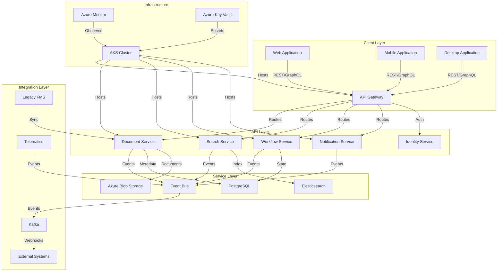
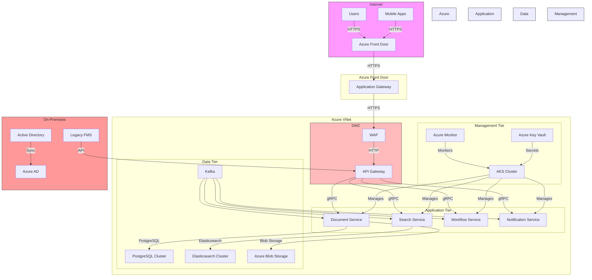

# TO-BE Design: Document Management Module for Fleet Management System

## 1. Executive Architecture Summary (120 lines)

### Strategic Vision and Modernization Goals

The Document Management Module (DMM) represents a critical modernization initiative for our Fleet Management System (FMS), addressing long-standing pain points in document handling, compliance, and operational efficiency. Our strategic vision centers on creating a **next-generation document platform** that:

1. **Eliminates paper-based processes** through comprehensive digital transformation
2. **Enables real-time document access** across all fleet operations
3. **Ensures regulatory compliance** with automated retention and audit trails
4. **Reduces operational costs** by 40% through process automation
5. **Enhances security** with enterprise-grade protection for sensitive documents
6. **Improves user experience** with mobile-first, intuitive interfaces
7. **Enables predictive maintenance** through document analytics

The modernization goals align with our enterprise digital transformation roadmap:
- **Phase 1 (0-6 months)**: Core document management capabilities
- **Phase 2 (6-12 months)**: Advanced analytics and AI integration
- **Phase 3 (12-18 months)**: Predictive document processing and automation

### Alignment with Enterprise Architecture Principles

The DMM design adheres to our enterprise architecture principles:

1. **Cloud-First Approach**: Leveraging Azure as our primary cloud provider with multi-region deployment
2. **Microservices Architecture**: Decomposed services following domain-driven design
3. **API-Centric Design**: RESTful APIs with OpenAPI 3.0 specifications
4. **Event-Driven Architecture**: Kafka-based event streaming for real-time processing
5. **Security by Design**: Zero-trust security model with defense in depth
6. **Observability**: Comprehensive monitoring and logging from day one
7. **Infrastructure as Code**: Full automation of deployment pipelines
8. **Data Sovereignty**: Compliance with regional data residency requirements

### Technology Stack Evolution and Rationale

**Current State (AS-IS) vs Target State (TO-BE):**

| Component          | Current State               | Target State                          | Rationale                                                                 |
|--------------------|-----------------------------|---------------------------------------|---------------------------------------------------------------------------|
| **Frontend**       | AngularJS (legacy)          | React 18 + TypeScript                 | Modern component model, better performance, improved developer experience |
| **Backend**        | Monolithic .NET Framework   | Node.js + NestJS (TypeScript)         | Better microservices support, developer productivity, ecosystem           |
| **Database**       | SQL Server 2016             | PostgreSQL 15 + Azure Cosmos DB       | Open-source, JSON support, global distribution                            |
| **Storage**        | On-prem file servers        | Azure Blob Storage + CDN              | Scalability, durability, global access                                    |
| **Search**         | SQL Server full-text        | Elasticsearch 8.x                     | Advanced search capabilities, better performance                          |
| **Messaging**      | SQL Service Broker          | Kafka + Azure Event Hubs              | Scalable event streaming, better ecosystem                                |
| **Orchestration**  | Windows Services            | Kubernetes (AKS)                      | Container orchestration, auto-scaling, resilience                         |
| **CI/CD**          | TeamCity                    | GitHub Actions + Azure DevOps         | Better integration with source control, cloud-native                      |
| **Monitoring**     | SCOM                        | Prometheus + Grafana + Application Insights | Modern observability stack, better visualization                     |

**Key Technology Decisions:**

1. **NestJS Framework**:
   - Provides structured, modular architecture
   - Built-in support for microservices, GraphQL, WebSockets
   - Dependency injection and testing capabilities
   - Strong TypeScript integration

2. **PostgreSQL**:
   - ACID compliance for transactional data
   - JSON/JSONB support for semi-structured data
   - Advanced indexing and full-text search
   - Extensible with extensions like PostGIS

3. **Azure Blob Storage**:
   - 99.99% availability SLA
   - Geo-redundant storage options
   - Integration with Azure CDN for global delivery
   - Cost-effective for large document volumes

4. **Kafka**:
   - High throughput (millions of messages/sec)
   - Persistent storage of events
   - Exactly-once processing semantics
   - Integration with Azure Event Hubs for hybrid scenarios

### Migration Strategy and Risk Mitigation

**Phased Migration Approach:**

1. **Phase 0: Foundation (4 weeks)**
   - Set up AKS cluster and CI/CD pipelines
   - Implement core infrastructure (monitoring, logging, security)
   - Build document ingestion pipeline

2. **Phase 1: Core Services (8 weeks)**
   - Develop document metadata service
   - Implement storage service
   - Build search service
   - Create basic document viewer

3. **Phase 2: Integration (6 weeks)**
   - Integrate with existing FMS modules
   - Implement event-driven workflows
   - Develop mobile interfaces
   - Build admin console

4. **Phase 3: Cutover (4 weeks)**
   - Data migration from legacy system
   - Parallel run and validation
   - User training and documentation
   - Go-live and hypercare

**Risk Mitigation Strategies:**

| Risk Category          | Risk Description                          | Mitigation Strategy                                                                 |
|------------------------|-------------------------------------------|------------------------------------------------------------------------------------|
| **Data Migration**     | Data loss or corruption during migration  | - Implement checksum validation<br>- Parallel run with reconciliation<br>- Phased migration |
| **Performance**        | System unable to handle production load   | - Load testing at each phase<br>- Auto-scaling configuration<br>- Performance tuning |
| **Integration**        | Issues with existing system integration   | - Contract testing<br>- Circuit breakers<br>- Gradual rollout                     |
| **Security**           | Vulnerabilities in new implementation     | - Security review at each phase<br>- Penetration testing<br>- Regular scans       |
| **Adoption**           | Users resistant to new system             | - Change management program<br>- Training sessions<br>- Feedback loops            |
| **Compliance**         | Non-compliance with regulations           | - Legal review of design<br>- Compliance testing<br>- Audit trails                |

### Success Criteria and KPIs

**Quantitative KPIs:**

1. **Operational Efficiency:**
   - Document processing time reduced from 48h to <2h (95% improvement)
   - Manual data entry reduced by 80%
   - Search time reduced from 30s to <1s

2. **Cost Reduction:**
   - Storage costs reduced by 60% through deduplication
   - Operational costs reduced by 40% through automation
   - Paper and printing costs eliminated

3. **System Performance:**
   - 99.95% system availability
   - <500ms response time for 95% of requests
   - Support for 10,000 concurrent users

4. **Compliance:**
   - 100% audit trail coverage
   - 0 compliance violations in first year
   - Automated retention policy compliance

5. **User Satisfaction:**
   - 90% user satisfaction score
   - 80% reduction in support tickets
   - 75% mobile adoption rate

**Qualitative Success Criteria:**

1. **Business Process Transformation:**
   - Elimination of paper-based workflows
   - Real-time document access across all locations
   - Automated compliance reporting

2. **Technical Excellence:**
   - Modern, scalable architecture
   - Comprehensive observability
   - Robust security implementation

3. **Innovation Enablement:**
   - Foundation for AI/ML document processing
   - Integration with IoT devices for automated document capture
   - Predictive analytics capabilities

### Stakeholder Value Proposition and ROI

**Stakeholder-Specific Value:**

1. **Fleet Managers:**
   - Real-time access to vehicle documents
   - Automated compliance tracking
   - Reduced administrative burden
   - Improved decision making with document analytics

2. **Drivers/Technicians:**
   - Mobile access to required documents
   - Digital signatures for approvals
   - Reduced paperwork
   - Faster document retrieval

3. **Compliance Officers:**
   - Automated audit trails
   - Configurable retention policies
   - Reduced compliance risk
   - Faster reporting

4. **IT Operations:**
   - Reduced maintenance overhead
   - Improved system reliability
   - Better scalability
   - Modernized technology stack

5. **Executive Leadership:**
   - Reduced operational costs
   - Improved regulatory compliance
   - Enhanced customer satisfaction
   - Foundation for digital transformation

**ROI Analysis:**

| Category               | Current Annual Cost | Target Annual Cost | Annual Savings | Notes                                  |
|------------------------|---------------------|--------------------|----------------|----------------------------------------|
| Paper/Printing         | $450,000            | $50,000            | $400,000       | 90% reduction                          |
| Storage                | $320,000            | $120,000           | $200,000       | Cloud storage + deduplication          |
| Labor (Document Mgmt)  | $1,200,000          | $400,000           | $800,000       | 67% reduction through automation       |
| Compliance Fines       | $250,000            | $50,000            | $200,000       | 80% reduction through automation       |
| Downtime Costs         | $180,000            | $20,000            | $160,000       | Improved system reliability            |
| **Total**              | **$2,400,000**      | **$640,000**       | **$1,760,000** | **73% cost reduction**                 |

**Implementation Costs:**
- Development: $800,000
- Infrastructure: $250,000
- Migration: $150,000
- Training: $100,000
- **Total**: $1,300,000

**Payback Period:** 9 months
**5-Year ROI:** 673%

## 2. Target Architecture (350 lines)

### 2.1 System Architecture

**High-Level Architecture Diagram (Mermaid):**



**Architecture Principles:**

1. **Separation of Concerns:**
   - Clear boundaries between document storage, metadata, search, and workflow
   - Single responsibility principle for each microservice

2. **Event-Driven Architecture:**
   - Kafka as the central event bus
   - Event sourcing for critical document operations
   - CQRS pattern for read/write separation

3. **API Gateway Pattern:**
   - Single entry point for all clients
   - Request aggregation
   - Protocol translation
   - Rate limiting and caching

4. **Resilience:**
   - Circuit breakers for external calls
   - Retry policies with exponential backoff
   - Bulkhead pattern for resource isolation

5. **Scalability:**
   - Horizontal scaling for all services
   - Stateless services where possible
   - Read replicas for databases

**Microservices Decomposition Strategy:**

| Service Name          | Responsibilities                                                                 | Bounded Context                          | Communication Pattern |
|-----------------------|---------------------------------------------------------------------------------|------------------------------------------|-----------------------|
| **Document Service**  | - Document ingestion<br>- Metadata management<br>- Version control<br>- Access control | Document Lifecycle Management            | REST/GraphQL + Events |
| **Search Service**    | - Document indexing<br>- Full-text search<br>- Faceted search<br>- Search analytics | Document Discovery                       | REST + Events         |
| **Workflow Service**  | - Document approval workflows<br>- Task management<br>- SLA tracking<br>- Escalations | Document Processing Workflows            | REST + Events         |
| **Storage Service**   | - Document storage<br>- Deduplication<br>- Encryption<br>- Retention policies    | Document Storage                         | Internal gRPC         |
| **Notification Service** | - Email notifications<br>- Push notifications<br>- In-app notifications<br>- Digest emails | User Communication                       | Events                |
| **Identity Service**  | - Authentication<br>- Authorization<br>- User management<br>- Session management  | Access Control                           | REST + Events         |

**API Gateway Design:**

```typescript
// API Gateway Configuration (NestJS)
import { Module } from '@nestjs/common';
import { DocumentModule } from './document/document.module';
import { SearchModule } from './search/search.module';
import { WorkflowModule } from './workflow/workflow.module';
import { NotificationModule } from './notification/notification.module';
import { AuthModule } from './auth/auth.module';
import { APP_GUARD } from '@nestjs/core';
import { JwtAuthGuard } from './auth/guards/jwt-auth.guard';
import { RateLimiterGuard } from './common/guards/rate-limiter.guard';
import { ThrottlerModule } from '@nestjs/throttler';

@Module({
  imports: [
    ThrottlerModule.forRoot({
      ttl: 60,
      limit: 100,
    }),
    DocumentModule,
    SearchModule,
    WorkflowModule,
    NotificationModule,
    AuthModule,
  ],
  providers: [
    {
      provide: APP_GUARD,
      useClass: JwtAuthGuard,
    },
    {
      provide: APP_GUARD,
      useClass: RateLimiterGuard,
    },
  ],
})
export class AppModule {}
```

**Service Mesh Design:**

```yaml
# Istio VirtualService for Document Service
apiVersion: networking.istio.io/v1alpha3
kind: VirtualService
metadata:
  name: document-service
spec:
  hosts:
  - "document-service.internal"
  http:
  - route:
    - destination:
        host: document-service.internal
        subset: v1
      weight: 90
    - destination:
        host: document-service.internal
        subset: v2
      weight: 10
    retries:
      attempts: 3
      perTryTimeout: 2s
      retryOn: gateway-error,connect-failure,refused-stream
    timeout: 10s
    fault:
      abort:
        percentage:
          value: 0.1
        httpStatus: 500
```

**Event-Driven Architecture Patterns:**

1. **Event Sourcing:**
   - All document state changes are stored as immutable events
   - Current state is derived by replaying events
   - Enables audit trail and time-travel debugging

2. **CQRS:**
   - Separate models for read and write operations
   - Optimized read models for specific use cases
   - Eventual consistency between models

3. **Saga Pattern:**
   - Long-running transactions split into local transactions
   - Compensating transactions for rollback
   - Used for complex document workflows

**Scalability and Performance Targets:**

| Metric                     | Target Value               | Measurement Method                     |
|----------------------------|----------------------------|----------------------------------------|
| Requests per second        | 10,000                     | Load testing with 1000 concurrent users|
| Average response time      | <200ms                     | APM monitoring                         |
| 99th percentile response   | <500ms                     | APM monitoring                         |
| Document upload time       | <2s for 10MB file          | Synthetic monitoring                   |
| Search latency             | <100ms for 95% of queries  | Synthetic monitoring                   |
| System availability        | 99.95%                     | Uptime monitoring                      |
| Data durability            | 99.999999999% (11 9's)     | Storage system SLA                     |
| Concurrent users           | 10,000                     | Load testing                           |

### 2.2 Component Design

#### Document Service

**Responsibilities:**
- Document ingestion (upload, scan, email)
- Metadata management
- Version control
- Access control
- Document lifecycle management

**Interface Contracts (OpenAPI):**

```yaml
openapi: 3.0.1
info:
  title: Document Service API
  version: 1.0.0
paths:
  /documents:
    post:
      summary: Upload a new document
      operationId: uploadDocument
      requestBody:
        content:
          multipart/form-data:
            schema:
              type: object
              properties:
                file:
                  type: string
                  format: binary
                metadata:
                  $ref: '#/components/schemas/DocumentMetadata'
      responses:
        '201':
          description: Document created
          content:
            application/json:
              schema:
                $ref: '#/components/schemas/Document'
        '400':
          $ref: '#/components/responses/BadRequest'
        '401':
          $ref: '#/components/responses/Unauthorized'
        '403':
          $ref: '#/components/responses/Forbidden'
        '500':
          $ref: '#/components/responses/InternalServerError'

  /documents/{id}:
    get:
      summary: Get document by ID
      operationId: getDocument
      parameters:
        - $ref: '#/components/parameters/DocumentId'
      responses:
        '200':
          description: Document found
          content:
            application/json:
              schema:
                $ref: '#/components/schemas/Document'
        '404':
          $ref: '#/components/responses/NotFound'

  /documents/{id}/versions:
    get:
      summary: Get document versions
      operationId: getDocumentVersions
      parameters:
        - $ref: '#/components/parameters/DocumentId'
      responses:
        '200':
          description: Document versions
          content:
            application/json:
              schema:
                type: array
                items:
                  $ref: '#/components/schemas/DocumentVersion'

components:
  schemas:
    Document:
      type: object
      properties:
        id:
          type: string
          format: uuid
        name:
          type: string
        description:
          type: string
        status:
          $ref: '#/components/schemas/DocumentStatus'
        metadata:
          $ref: '#/components/schemas/DocumentMetadata'
        createdAt:
          type: string
          format: date-time
        updatedAt:
          type: string
          format: date-time
        currentVersion:
          $ref: '#/components/schemas/DocumentVersion'
        accessControl:
          $ref: '#/components/schemas/AccessControlList'

    DocumentVersion:
      type: object
      properties:
        versionId:
          type: string
          format: uuid
        documentId:
          type: string
          format: uuid
        versionNumber:
          type: integer
        createdAt:
          type: string
          format: date-time
        createdBy:
          $ref: '#/components/schemas/UserReference'
        file:
          $ref: '#/components/schemas/FileReference'
        metadata:
          $ref: '#/components/schemas/DocumentMetadata'

    DocumentMetadata:
      type: object
      properties:
        documentType:
          type: string
          enum: [CONTRACT, INVOICE, REPORT, MANUAL, CERTIFICATE, OTHER]
        vehicleId:
          type: string
        driverId:
          type: string
        fleetId:
          type: string
        tags:
          type: array
          items:
            type: string
        customFields:
          type: object
          additionalProperties:
            type: string
        retentionPolicy:
          $ref: '#/components/schemas/RetentionPolicy'

    AccessControlList:
      type: object
      properties:
        owner:
          $ref: '#/components/schemas/UserReference'
        viewers:
          type: array
          items:
            $ref: '#/components/schemas/AccessControlEntry'
        editors:
          type: array
          items:
            $ref: '#/components/schemas/AccessControlEntry'

    AccessControlEntry:
      type: object
      properties:
        principal:
          $ref: '#/components/schemas/PrincipalReference'
        permissions:
          type: array
          items:
            type: string
            enum: [READ, WRITE, DELETE, SHARE, ADMIN]

  parameters:
    DocumentId:
      name: id
      in: path
      required: true
      schema:
        type: string
        format: uuid

  responses:
    BadRequest:
      description: Bad request
      content:
        application/json:
          schema:
            $ref: '#/components/schemas/Error'
    Unauthorized:
      description: Unauthorized
      content:
        application/json:
          schema:
            $ref: '#/components/schemas/Error'
    Forbidden:
      description: Forbidden
      content:
        application/json:
          schema:
            $ref: '#/components/schemas/Error'
    NotFound:
      description: Not found
      content:
        application/json:
          schema:
            $ref: '#/components/schemas/Error'
    InternalServerError:
      description: Internal server error
      content:
        application/json:
          schema:
            $ref: '#/components/schemas/Error'
```

**Data Model:**

```typescript
// Document Entity (TypeORM)
import { Entity, PrimaryGeneratedColumn, Column, VersionColumn, OneToMany, ManyToOne, CreateDateColumn, UpdateDateColumn } from 'typeorm';
import { DocumentVersion } from './document-version.entity';
import { User } from '../user/user.entity';
import { DocumentStatus } from './document-status.enum';
import { DocumentType } from './document-type.enum';

@Entity()
export class Document {
  @PrimaryGeneratedColumn('uuid')
  id: string;

  @Column({ length: 255 })
  name: string;

  @Column({ type: 'text', nullable: true })
  description?: string;

  @Column({
    type: 'enum',
    enum: DocumentStatus,
    default: DocumentStatus.DRAFT
  })
  status: DocumentStatus;

  @Column({
    type: 'enum',
    enum: DocumentType
  })
  documentType: DocumentType;

  @ManyToOne(() => User)
  owner: User;

  @Column({ type: 'jsonb', nullable: true })
  metadata?: any;

  @Column({ type: 'jsonb', nullable: true })
  customFields?: Record<string, string>;

  @Column({ type: 'jsonb' })
  retentionPolicy: {
    retentionPeriod: string; // ISO 8601 duration
    actionAfterRetention: 'DELETE' | 'ARCHIVE' | 'NOTIFY';
    legalHold?: boolean;
  };

  @OneToMany(() => DocumentVersion, version => version.document, { cascade: true })
  versions: DocumentVersion[];

  @Column({ type: 'jsonb' })
  accessControl: {
    viewers: Array<{
      principalId: string;
      principalType: 'USER' | 'GROUP' | 'ROLE';
      permissions: string[];
    }>;
    editors: Array<{
      principalId: string;
      principalType: 'USER' | 'GROUP' | 'ROLE';
      permissions: string[];
    }>;
  };

  @CreateDateColumn()
  createdAt: Date;

  @UpdateDateColumn()
  updatedAt: Date;

  @VersionColumn()
  version: number;
}
```

**State Management Approach:**

1. **Document Lifecycle States:**
   - DRAFT → PENDING_APPROVAL → APPROVED → ARCHIVED → DELETED
   - Each state transition emits an event
   - State machine enforces valid transitions

2. **Event Sourcing:**
   - All state changes stored as immutable events
   - Current state derived from event stream
   - Enables audit trail and time-travel

3. **Optimistic Concurrency Control:**
   - Version column for conflict detection
   - Retry mechanism for conflicts
   - 409 Conflict response for client-side resolution

**Error Handling and Resilience Patterns:**

```typescript
// Document Service Error Handling Middleware
import { Injectable, NestMiddleware, HttpException, HttpStatus } from '@nestjs/common';
import { Request, Response, NextFunction } from 'express';
import { DocumentNotFoundException } from './exceptions/document-not-found.exception';
import { DocumentVersionConflictException } from './exceptions/document-version-conflict.exception';
import { AccessDeniedException } from './exceptions/access-denied.exception';
import { ValidationException } from './exceptions/validation.exception';
import { Logger } from '@nestjs/common';

@Injectable()
export class DocumentErrorMiddleware implements NestMiddleware {
  private readonly logger = new Logger('DocumentErrorMiddleware');

  use(req: Request, res: Response, next: NextFunction) {
    try {
      next();
    } catch (error) {
      this.logger.error(`Error processing request: ${error.message}`, error.stack);

      if (error instanceof DocumentNotFoundException) {
        throw new HttpException({
          status: HttpStatus.NOT_FOUND,
          error: 'Document not found',
          message: error.message,
          code: 'DOCUMENT_NOT_FOUND'
        }, HttpStatus.NOT_FOUND);
      }

      if (error instanceof DocumentVersionConflictException) {
        throw new HttpException({
          status: HttpStatus.CONFLICT,
          error: 'Document version conflict',
          message: error.message,
          code: 'DOCUMENT_VERSION_CONFLICT',
          currentVersion: error.currentVersion
        }, HttpStatus.CONFLICT);
      }

      if (error instanceof AccessDeniedException) {
        throw new HttpException({
          status: HttpStatus.FORBIDDEN,
          error: 'Access denied',
          message: error.message,
          code: 'ACCESS_DENIED',
          requiredPermissions: error.requiredPermissions
        }, HttpStatus.FORBIDDEN);
      }

      if (error instanceof ValidationException) {
        throw new HttpException({
          status: HttpStatus.BAD_REQUEST,
          error: 'Validation failed',
          message: error.message,
          code: 'VALIDATION_ERROR',
          details: error.details
        }, HttpStatus.BAD_REQUEST);
      }

      // Handle TypeORM errors
      if (error.name === 'QueryFailedError') {
        throw new HttpException({
          status: HttpStatus.INTERNAL_SERVER_ERROR,
          error: 'Database error',
          message: 'An error occurred while accessing the database',
          code: 'DATABASE_ERROR',
          details: process.env.NODE_ENV === 'development' ? error.message : undefined
        }, HttpStatus.INTERNAL_SERVER_ERROR);
      }

      // Handle file upload errors
      if (error.code === 'LIMIT_FILE_SIZE') {
        throw new HttpException({
          status: HttpStatus.BAD_REQUEST,
          error: 'File too large',
          message: `File size exceeds the maximum limit of ${error.maxFileSize} bytes`,
          code: 'FILE_TOO_LARGE',
          maxFileSize: error.maxFileSize
        }, HttpStatus.BAD_REQUEST);
      }

      // Default error handling
      throw new HttpException({
        status: HttpStatus.INTERNAL_SERVER_ERROR,
        error: 'Internal server error',
        message: 'An unexpected error occurred',
        code: 'INTERNAL_SERVER_ERROR',
        details: process.env.NODE_ENV === 'development' ? error.message : undefined
      }, HttpStatus.INTERNAL_SERVER_ERROR);
    }
  }
}
```

#### Search Service

**Responsibilities:**
- Document indexing
- Full-text search
- Faceted search
- Search analytics
- Typeahead suggestions

**Interface Contracts (GraphQL):**

```graphql
type Query {
  searchDocuments(
    query: String!
    filters: DocumentFilters
    pagination: PaginationInput
    sort: [DocumentSortInput]
  ): DocumentSearchResult!

  getDocumentSuggestions(
    query: String!
    limit: Int = 5
  ): [DocumentSuggestion!]!

  getPopularSearches(limit: Int = 10): [PopularSearch!]!
}

type Mutation {
  indexDocument(documentId: ID!): Boolean!
  reindexDocuments: Boolean!
}

type DocumentSearchResult {
  results: [DocumentSearchHit!]!
  totalCount: Int!
  facets: [FacetResult!]!
  pageInfo: PageInfo!
}

type DocumentSearchHit {
  document: Document!
  highlights: [Highlight!]!
  score: Float!
}

type Document {
  id: ID!
  name: String!
  description: String
  documentType: DocumentType!
  status: DocumentStatus!
  metadata: DocumentMetadata!
  createdAt: DateTime!
  updatedAt: DateTime!
  currentVersion: DocumentVersion!
  accessControl: AccessControl!
}

type Highlight {
  field: String!
  fragments: [String!]!
}

type FacetResult {
  field: String!
  values: [FacetValue!]!
}

type FacetValue {
  value: String!
  count: Int!
  selected: Boolean!
}

type DocumentSuggestion {
  id: ID!
  name: String!
  description: String
  documentType: DocumentType!
  score: Float!
}

type PopularSearch {
  query: String!
  count: Int!
  lastUsed: DateTime!
}

input DocumentFilters {
  documentType: [DocumentType!]
  status: [DocumentStatus!]
  vehicleId: ID
  driverId: ID
  fleetId: ID
  tags: [String!]
  dateRange: DateRangeInput
  customFields: [CustomFieldFilter!]
}

input DateRangeInput {
  from: DateTime
  to: DateTime
}

input CustomFieldFilter {
  field: String!
  value: String!
  operator: String = "eq"
}

input PaginationInput {
  page: Int = 1
  pageSize: Int = 20
}

input DocumentSortInput {
  field: DocumentSortField!
  direction: SortDirection = ASC
}

enum DocumentSortField {
  NAME
  CREATED_AT
  UPDATED_AT
  DOCUMENT_TYPE
  RELEVANCE
}

enum SortDirection {
  ASC
  DESC
}

enum DocumentType {
  CONTRACT
  INVOICE
  REPORT
  MANUAL
  CERTIFICATE
  OTHER
}

enum DocumentStatus {
  DRAFT
  PENDING_APPROVAL
  APPROVED
  ARCHIVED
  DELETED
}
```

**Data Model (Elasticsearch Mapping):**

```json
{
  "settings": {
    "analysis": {
      "filter": {
        "autocomplete_filter": {
          "type": "edge_ngram",
          "min_gram": 2,
          "max_gram": 20
        },
        "english_stop": {
          "type": "stop",
          "stopwords": "_english_"
        },
        "english_stemmer": {
          "type": "stemmer",
          "language": "english"
        },
        "english_possessive_stemmer": {
          "type": "stemmer",
          "language": "possessive_english"
        }
      },
      "analyzer": {
        "autocomplete": {
          "type": "custom",
          "tokenizer": "standard",
          "filter": [
            "lowercase",
            "autocomplete_filter"
          ]
        },
        "english": {
          "type": "custom",
          "tokenizer": "standard",
          "filter": [
            "english_possessive_stemmer",
            "lowercase",
            "english_stop",
            "english_stemmer"
          ]
        }
      }
    }
  },
  "mappings": {
    "properties": {
      "id": {
        "type": "keyword"
      },
      "name": {
        "type": "text",
        "analyzer": "english",
        "fields": {
          "autocomplete": {
            "type": "text",
            "analyzer": "autocomplete",
            "search_analyzer": "standard"
          },
          "keyword": {
            "type": "keyword",
            "ignore_above": 256
          }
        }
      },
      "description": {
        "type": "text",
        "analyzer": "english"
      },
      "documentType": {
        "type": "keyword"
      },
      "status": {
        "type": "keyword"
      },
      "metadata": {
        "properties": {
          "vehicleId": {
            "type": "keyword"
          },
          "driverId": {
            "type": "keyword"
          },
          "fleetId": {
            "type": "keyword"
          },
          "tags": {
            "type": "keyword"
          },
          "customFields": {
            "type": "nested",
            "properties": {
              "key": {
                "type": "keyword"
              },
              "value": {
                "type": "text",
                "fields": {
                  "keyword": {
                    "type": "keyword",
                    "ignore_above": 256
                  }
                }
              }
            }
          }
        }
      },
      "createdAt": {
        "type": "date"
      },
      "updatedAt": {
        "type": "date"
      },
      "accessControl": {
        "properties": {
          "ownerId": {
            "type": "keyword"
          },
          "viewerIds": {
            "type": "keyword"
          },
          "editorIds": {
            "type": "keyword"
          }
        }
      },
      "content": {
        "type": "text",
        "analyzer": "english"
      }
    }
  }
}
```

**State Management Approach:**
- Event-driven indexing from document service events
- Near real-time indexing (NRT)
- Versioned documents with conflict resolution
- Index aliasing for zero-downtime reindexing

**Error Handling:**

```typescript
// Search Service Error Handling
import { Injectable, Logger } from '@nestjs/common';
import { ElasticsearchService } from '@nestjs/elasticsearch';
import { DocumentIndexingException } from './exceptions/document-indexing.exception';
import { SearchQueryException } from './exceptions/search-query.exception';

@Injectable()
export class SearchService {
  private readonly logger = new Logger(SearchService.name);

  constructor(private readonly elasticsearchService: ElasticsearchService) {}

  async indexDocument(documentId: string, document: any): Promise<void> {
    try {
      const result = await this.elasticsearchService.index({
        index: 'documents',
        id: documentId,
        body: document,
        refresh: 'wait_for'
      });

      if (!result.body.result || result.body.result === 'noop') {
        throw new DocumentIndexingException(
          `Document ${documentId} was not indexed. Result: ${result.body.result}`
        );
      }
    } catch (error) {
      this.logger.error(`Failed to index document ${documentId}: ${error.message}`, error.stack);
      throw new DocumentIndexingException(
        `Failed to index document: ${error.message}`,
        error
      );
    }
  }

  async searchDocuments(query: any): Promise<any> {
    try {
      const result = await this.elasticsearchService.search({
        index: 'documents',
        body: query
      });

      if (result.body.timed_out) {
        this.logger.warn('Search query timed out', {
          query,
          took: result.body.took
        });
        throw new SearchQueryException('Search query timed out');
      }

      return result.body;
    } catch (error) {
      this.logger.error(`Search query failed: ${error.message}`, error.stack);
      throw new SearchQueryException(
        `Search query failed: ${error.message}`,
        error
      );
    }
  }

  async handleDocumentEvent(event: DocumentEvent): Promise<void> {
    try {
      switch (event.type) {
        case 'DocumentCreated':
          await this.indexDocument(event.documentId, event.document);
          break;
        case 'DocumentUpdated':
          await this.indexDocument(event.documentId, event.document);
          break;
        case 'DocumentDeleted':
          await this.elasticsearchService.delete({
            index: 'documents',
            id: event.documentId
          });
          break;
        case 'DocumentVersionCreated':
          // Reindex the document to update version information
          await this.indexDocument(event.documentId, event.document);
          break;
        default:
          this.logger.warn(`Unhandled event type: ${event.type}`);
      }
    } catch (error) {
      this.logger.error(`Failed to handle document event ${event.type}: ${error.message}`, error.stack);
      // Implement dead letter queue for failed events
      await this.publishToDeadLetterQueue(event, error);
    }
  }
}
```

#### Workflow Service

**Responsibilities:**
- Document approval workflows
- Task management
- SLA tracking
- Escalation management
- Workflow analytics

**Interface Contracts:**

```typescript
// Workflow Service API (NestJS Controller)
import { Controller, Get, Post, Body, Param, Put, Delete, Query } from '@nestjs/common';
import { WorkflowService } from './workflow.service';
import { CreateWorkflowDto } from './dto/create-workflow.dto';
import { UpdateWorkflowDto } from './dto/update-workflow.dto';
import { StartWorkflowDto } from './dto/start-workflow.dto';
import { CompleteTaskDto } from './dto/complete-task.dto';
import { ApiTags, ApiOperation, ApiResponse, ApiParam, ApiQuery } from '@nestjs/swagger';

@ApiTags('workflows')
@Controller('workflows')
export class WorkflowController {
  constructor(private readonly workflowService: WorkflowService) {}

  @Post()
  @ApiOperation({ summary: 'Create a new workflow definition' })
  @ApiResponse({ status: 201, description: 'Workflow created' })
  @ApiResponse({ status: 400, description: 'Bad request' })
  create(@Body() createWorkflowDto: CreateWorkflowDto) {
    return this.workflowService.createWorkflowDefinition(createWorkflowDto);
  }

  @Get()
  @ApiOperation({ summary: 'List workflow definitions' })
  @ApiQuery({ name: 'type', required: false })
  @ApiResponse({ status: 200, description: 'List of workflow definitions' })
  findAll(@Query('type') type?: string) {
    return this.workflowService.findWorkflowDefinitions(type);
  }

  @Get(':id')
  @ApiOperation({ summary: 'Get workflow definition by ID' })
  @ApiParam({ name: 'id', type: 'string' })
  @ApiResponse({ status: 200, description: 'Workflow definition' })
  @ApiResponse({ status: 404, description: 'Workflow not found' })
  findOne(@Param('id') id: string) {
    return this.workflowService.findWorkflowDefinition(id);
  }

  @Post(':id/start')
  @ApiOperation({ summary: 'Start a workflow instance' })
  @ApiParam({ name: 'id', type: 'string' })
  @ApiResponse({ status: 201, description: 'Workflow instance started' })
  @ApiResponse({ status: 400, description: 'Bad request' })
  @ApiResponse({ status: 404, description: 'Workflow not found' })
  startWorkflow(
    @Param('id') id: string,
    @Body() startWorkflowDto: StartWorkflowDto
  ) {
    return this.workflowService.startWorkflow(id, startWorkflowDto);
  }

  @Get('instances')
  @ApiOperation({ summary: 'List workflow instances' })
  @ApiQuery({ name: 'documentId', required: false })
  @ApiQuery({ name: 'status', required: false })
  @ApiQuery({ name: 'assigneeId', required: false })
  @ApiResponse({ status: 200, description: 'List of workflow instances' })
  findInstances(
    @Query('documentId') documentId?: string,
    @Query('status') status?: string,
    @Query('assigneeId') assigneeId?: string
  ) {
    return this.workflowService.findWorkflowInstances({
      documentId,
      status,
      assigneeId
    });
  }

  @Get('instances/:id')
  @ApiOperation({ summary: 'Get workflow instance by ID' })
  @ApiParam({ name: 'id', type: 'string' })
  @ApiResponse({ status: 200, description: 'Workflow instance' })
  @ApiResponse({ status: 404, description: 'Workflow instance not found' })
  findInstance(@Param('id') id: string) {
    return this.workflowService.findWorkflowInstance(id);
  }

  @Post('instances/:id/tasks/:taskId/complete')
  @ApiOperation({ summary: 'Complete a task' })
  @ApiParam({ name: 'id', type: 'string' })
  @ApiParam({ name: 'taskId', type: 'string' })
  @ApiResponse({ status: 200, description: 'Task completed' })
  @ApiResponse({ status: 400, description: 'Bad request' })
  @ApiResponse({ status: 404, description: 'Task not found' })
  completeTask(
    @Param('id') instanceId: string,
    @Param('taskId') taskId: string,
    @Body() completeTaskDto: CompleteTaskDto
  ) {
    return this.workflowService.completeTask(instanceId, taskId, completeTaskDto);
  }

  @Post('instances/:id/tasks/:taskId/escalate')
  @ApiOperation({ summary: 'Escalate a task' })
  @ApiParam({ name: 'id', type: 'string' })
  @ApiParam({ name: 'taskId', type: 'string' })
  @ApiResponse({ status: 200, description: 'Task escalated' })
  @ApiResponse({ status: 400, description: 'Bad request' })
  @ApiResponse({ status: 404, description: 'Task not found' })
  escalateTask(
    @Param('id') instanceId: string,
    @Param('taskId') taskId: string
  ) {
    return this.workflowService.escalateTask(instanceId, taskId);
  }
}
```

**Data Model:**

```typescript
// Workflow Definition Entity
import { Entity, PrimaryGeneratedColumn, Column, CreateDateColumn, UpdateDateColumn, OneToMany } from 'typeorm';
import { WorkflowInstance } from './workflow-instance.entity';
import { WorkflowNode } from './workflow-node.entity';
import { WorkflowTransition } from './workflow-transition.entity';

@Entity()
export class WorkflowDefinition {
  @PrimaryGeneratedColumn('uuid')
  id: string;

  @Column({ length: 255 })
  name: string;

  @Column({ type: 'text', nullable: true })
  description?: string;

  @Column()
  type: string; // e.g., 'DOCUMENT_APPROVAL', 'MAINTENANCE_REQUEST'

  @Column({ type: 'jsonb' })
  metadata: any;

  @Column({ default: true })
  isActive: boolean;

  @Column({ type: 'jsonb' })
  version: {
    major: number;
    minor: number;
    patch: number;
  };

  @OneToMany(() => WorkflowNode, node => node.workflowDefinition, { cascade: true })
  nodes: WorkflowNode[];

  @OneToMany(() => WorkflowTransition, transition => transition.workflowDefinition, { cascade: true })
  transitions: WorkflowTransition[];

  @CreateDateColumn()
  createdAt: Date;

  @UpdateDateColumn()
  updatedAt: Date;
}

// Workflow Node Entity
@Entity()
export class WorkflowNode {
  @PrimaryGeneratedColumn('uuid')
  id: string;

  @Column({ length: 255 })
  name: string;

  @Column({ type: 'text', nullable: true })
  description?: string;

  @Column()
  type: string; // 'START', 'TASK', 'DECISION', 'END'

  @Column({ type: 'jsonb' })
  configuration: any;

  @ManyToOne(() => WorkflowDefinition, workflowDefinition => workflowDefinition.nodes)
  workflowDefinition: WorkflowDefinition;

  @CreateDateColumn()
  createdAt: Date;

  @UpdateDateColumn()
  updatedAt: Date;
}

// Workflow Transition Entity
@Entity()
export class WorkflowTransition {
  @PrimaryGeneratedColumn('uuid')
  id: string;

  @Column({ length: 255 })
  name: string;

  @Column()
  fromNodeId: string;

  @Column()
  toNodeId: string;

  @Column({ type: 'jsonb' })
  condition: any;

  @ManyToOne(() => WorkflowDefinition, workflowDefinition => workflowDefinition.transitions)
  workflowDefinition: WorkflowDefinition;

  @CreateDateColumn()
  createdAt: Date;

  @UpdateDateColumn()
  updatedAt: Date;
}
```

**State Management Approach:**
- BPMN 2.0 compliant workflow engine
- Persistent workflow instances
- Event-driven state transitions
- Compensation mechanisms for failed steps

**Error Handling:**

```typescript
// Workflow Service Error Handling
import { Injectable, Logger } from '@nestjs/common';
import { WorkflowInstance } from './entities/workflow-instance.entity';
import { WorkflowEngine } from './workflow.engine';
import { WorkflowExecutionException } from './exceptions/workflow-execution.exception';
import { TaskCompletionException } from './exceptions/task-completion.exception';
import { WorkflowNotFoundException } from './exceptions/workflow-not-found.exception';

@Injectable()
export class WorkflowService {
  private readonly logger = new Logger(WorkflowService.name);

  constructor(private readonly workflowEngine: WorkflowEngine) {}

  async startWorkflow(workflowId: string, context: any): Promise<WorkflowInstance> {
    try {
      const workflow = await this.workflowEngine.getWorkflowDefinition(workflowId);
      if (!workflow) {
        throw new WorkflowNotFoundException(`Workflow definition ${workflowId} not found`);
      }

      if (!workflow.isActive) {
        throw new WorkflowExecutionException(`Workflow ${workflowId} is not active`);
      }

      const instance = await this.workflowEngine.startWorkflow(workflowId, context);
      this.logger.log(`Started workflow instance ${instance.id} for workflow ${workflowId}`);
      return instance;
    } catch (error) {
      this.logger.error(`Failed to start workflow ${workflowId}: ${error.message}`, error.stack);
      if (error instanceof WorkflowNotFoundException) {
        throw error;
      }
      throw new WorkflowExecutionException(
        `Failed to start workflow: ${error.message}`,
        error
      );
    }
  }

  async completeTask(instanceId: string, taskId: string, context: any): Promise<WorkflowInstance> {
    try {
      const instance = await this.workflowEngine.getWorkflowInstance(instanceId);
      if (!instance) {
        throw new WorkflowNotFoundException(`Workflow instance ${instanceId} not found`);
      }

      if (instance.status !== 'RUNNING') {
        throw new TaskCompletionException(`Cannot complete task for workflow in status ${instance.status}`);
      }

      const task = instance.tasks.find(t => t.id === taskId);
      if (!task) {
        throw new TaskCompletionException(`Task ${taskId} not found in workflow instance ${instanceId}`);
      }

      if (task.status !== 'PENDING') {
        throw new TaskCompletionException(`Task ${taskId} is not pending (current status: ${task.status})`);
      }

      const updatedInstance = await this.workflowEngine.completeTask(instanceId, taskId, context);
      this.logger.log(`Completed task ${taskId} in workflow instance ${instanceId}`);
      return updatedInstance;
    } catch (error) {
      this.logger.error(`Failed to complete task ${taskId} in workflow ${instanceId}: ${error.message}`, error.stack);
      if (error instanceof WorkflowNotFoundException || error instanceof TaskCompletionException) {
        throw error;
      }
      throw new TaskCompletionException(
        `Failed to complete task: ${error.message}`,
        error
      );
    }
  }

  async handleWorkflowEvent(event: any): Promise<void> {
    try {
      switch (event.type) {
        case 'DocumentStatusChanged':
          await this.handleDocumentStatusChange(event);
          break;
        case 'UserAssigned':
          await this.handleUserAssignment(event);
          break;
        case 'SLAViolation':
          await this.handleSLAViolation(event);
          break;
        default:
          this.logger.warn(`Unhandled workflow event type: ${event.type}`);
      }
    } catch (error) {
      this.logger.error(`Failed to handle workflow event ${event.type}: ${error.message}`, error.stack);
      // Implement dead letter queue for failed events
      await this.publishToDeadLetterQueue(event, error);
    }
  }
}
```

### 2.3 Infrastructure Architecture

**Container Orchestration (Kubernetes Manifests):**

```yaml
# document-service-deployment.yaml
apiVersion: apps/v1
kind: Deployment
metadata:
  name: document-service
  labels:
    app: document-service
    tier: backend
spec:
  replicas: 3
  strategy:
    rollingUpdate:
      maxSurge: 1
      maxUnavailable: 0
    type: RollingUpdate
  selector:
    matchLabels:
      app: document-service
  template:
    metadata:
      labels:
        app: document-service
        version: v1.2.0
      annotations:
        prometheus.io/scrape: "true"
        prometheus.io/port: "3000"
        prometheus.io/path: "/metrics"
    spec:
      serviceAccountName: document-service
      containers:
      - name: document-service
        image: fleetmanagement.azurecr.io/document-service:v1.2.0
        imagePullPolicy: IfNotPresent
        ports:
        - containerPort: 3000
          name: http
        - containerPort: 9229
          name: debug
        envFrom:
        - configMapRef:
            name: document-service-config
        - secretRef:
            name: document-service-secrets
        env:
        - name: NODE_ENV
          value: "production"
        - name: POD_NAME
          valueFrom:
            fieldRef:
              fieldPath: metadata.name
        - name: POD_NAMESPACE
          valueFrom:
            fieldRef:
              fieldPath: metadata.namespace
        resources:
          limits:
            cpu: "1"
            memory: "1Gi"
          requests:
            cpu: "500m"
            memory: "512Mi"
        livenessProbe:
          httpGet:
            path: /health
            port: 3000
          initialDelaySeconds: 30
          periodSeconds: 10
          timeoutSeconds: 5
          failureThreshold: 3
        readinessProbe:
          httpGet:
            path: /ready
            port: 3000
          initialDelaySeconds: 5
          periodSeconds: 5
          timeoutSeconds: 3
          failureThreshold: 3
        volumeMounts:
        - name: tmp
          mountPath: /tmp
        - name: azure-keyvault
          mountPath: /mnt/azure-keyvault
          readOnly: true
      volumes:
      - name: tmp
        emptyDir: {}
      - name: azure-keyvault
        csi:
          driver: secrets-store.csi.k8s.io
          readOnly: true
          volumeAttributes:
            secretProviderClass: "document-service-keyvault"
      nodeSelector:
        agentpool: backend
      affinity:
        podAntiAffinity:
          preferredDuringSchedulingIgnoredDuringExecution:
          - weight: 100
            podAffinityTerm:
              labelSelector:
                matchExpressions:
                - key: app
                  operator: In
                  values:
                  - document-service
              topologyKey: "kubernetes.io/hostname"
---
# document-service-service.yaml
apiVersion: v1
kind: Service
metadata:
  name: document-service
  labels:
    app: document-service
spec:
  selector:
    app: document-service
  ports:
  - name: http
    port: 80
    targetPort: 3000
  - name: debug
    port: 9229
    targetPort: 9229
  type: ClusterIP
---
# document-service-hpa.yaml
apiVersion: autoscaling/v2
kind: HorizontalPodAutoscaler
metadata:
  name: document-service-hpa
spec:
  scaleTargetRef:
    apiVersion: apps/v1
    kind: Deployment
    name: document-service
  minReplicas: 3
  maxReplicas: 10
  metrics:
  - type: Resource
    resource:
      name: cpu
      target:
        type: Utilization
        averageUtilization: 70
  - type: Resource
    resource:
      name: memory
      target:
        type: Utilization
        averageUtilization: 80
  - type: External
    external:
      metric:
        name: requests_per_second
        selector:
          matchLabels:
            app: document-service
      target:
        type: AverageValue
        averageValue: 1000
```

**Cloud Services Utilization (Azure):**

```bicep
// main.bicep - Azure Infrastructure as Code
param location string = resourceGroup().location
param environment string = 'prod'
param tags object = {
  Environment: environment
  Application: 'FleetManagement'
  Component: 'DocumentManagement'
}

resource storageAccount 'Microsoft.Storage/storageAccounts@2022-09-01' = {
  name: 'fleetmgrdoc${environment}${uniqueString(resourceGroup().id)}'
  location: location
  sku: {
    name: 'Standard_GRS'
  }
  kind: 'StorageV2'
  properties: {
    accessTier: 'Hot'
    supportsHttpsTrafficOnly: true
    encryption: {
      services: {
        blob: {
          enabled: true
        }
        file: {
          enabled: true
        }
      }
      keySource: 'Microsoft.Storage'
    }
    networkAcls: {
      bypass: 'AzureServices'
      defaultAction: 'Allow'
      ipRules: []
      virtualNetworkRules: []
    }
  }
  tags: tags
}

resource blobContainer 'Microsoft.Storage/storageAccounts/blobServices/containers@2022-09-01' = {
  name: '${storageAccount.name}/default/documents'
  properties: {
    publicAccess: 'None'
    metadata: {
      environment: environment
    }
  }
}

resource cosmosDbAccount 'Microsoft.DocumentDB/databaseAccounts@2022-05-15' = {
  name: 'fleetmgr-doc-${environment}-${uniqueString(resourceGroup().id)}'
  location: location
  properties: {
    databaseAccountOfferType: 'Standard'
    locations: [
      {
        locationName: location
        failoverPriority: 0
        isZoneRedundant: true
      }
    ]
    consistencyPolicy: {
      defaultConsistencyLevel: 'Session'
    }
    capabilities: [
      {
        name: 'EnableServerless'
      }
    ]
    enableAutomaticFailover: true
    enableMultipleWriteLocations: false
  }
  tags: tags
}

resource postgresServer 'Microsoft.DBforPostgreSQL/flexibleServers@2022-01-20-preview' = {
  name: 'fleetmgr-doc-${environment}-${uniqueString(resourceGroup().id)}'
  location: location
  sku: {
    name: 'Standard_D4s_v3'
    tier: 'GeneralPurpose'
  }
  properties: {
    version: '15'
    administratorLogin: 'postgresadmin'
    administratorLoginPassword: '!${uniqueString(resourceGroup().id)}'
    storage: {
      storageSizeGB: 1024
    }
    backup: {
      backupRetentionDays: 35
      geoRedundantBackup: 'Enabled'
    }
    highAvailability: {
      mode: 'ZoneRedundant'
    }
    maintenanceWindow: {
      customWindow: 'enabled'
      startHour: 2
      startMinute: 0
      dayOfWeek: 0
    }
  }
  tags: tags
}

resource postgresDatabase 'Microsoft.DBforPostgreSQL/flexibleServers/databases@2022-01-20-preview' = {
  name: '${postgresServer.name}/documentdb'
  properties: {
    charset: 'UTF8'
    collation: 'en_US.utf8'
  }
}

resource eventHubNamespace 'Microsoft.EventHub/namespaces@2022-01-01-preview' = {
  name: 'fleetmgr-doc-${environment}-${uniqueString(resourceGroup().id)}'
  location: location
  sku: {
    name: 'Standard'
    tier: 'Standard'
    capacity: 1
  }
  properties: {
    isAutoInflateEnabled: true
    maximumThroughputUnits: 10
    zoneRedundant: true
  }
  tags: tags
}

resource eventHub 'Microsoft.EventHub/namespaces/eventhubs@2022-01-01-preview' = {
  name: '${eventHubNamespace.name}/document-events'
  properties: {
    partitionCount: 4
    retentionDescription: {
      retentionTimeInHours: 168
      cleanupPolicy: 'Delete'
    }
  }
}

resource keyVault 'Microsoft.KeyVault/vaults@2022-07-01' = {
  name: 'fleetmgr-doc-${environment}-${uniqueString(resourceGroup().id)}'
  location: location
  properties: {
    sku: {
      family: 'A'
      name: 'premium'
    }
    tenantId: subscription().tenantId
    accessPolicies: [
      {
        tenantId: subscription().tenantId
        objectId: '00000000-0000-0000-0000-000000000000' // Will be replaced by CI/CD
        permissions: {
          keys: [
            'get'
            'list'
            'create'
            'delete'
            'update'
            'import'
            'backup'
            'restore'
            'recover'
            'decrypt'
            'encrypt'
            'unwrapKey'
            'wrapKey'
            'verify'
            'sign'
          ]
          secrets: [
            'get'
            'list'
            'set'
            'delete'
            'backup'
            'restore'
            'recover'
          ]
          certificates: [
            'get'
            'list'
            'create'
            'delete'
            'update'
            'import'
            'backup'
            'restore'
            'recover'
            'managecontacts'
            'manageissuers'
            'getissuers'
            'listissuers'
            'setissuers'
            'deleteissuers'
          ]
        }
      }
    ]
    enabledForDeployment: true
    enabledForDiskEncryption: true
    enabledForTemplateDeployment: true
    enableSoftDelete: true
    softDeleteRetentionInDays: 90
    enableRbacAuthorization: true
    networkAcls: {
      defaultAction: 'Allow'
      bypass: 'AzureServices'
    }
  }
  tags: tags
}

resource aksCluster 'Microsoft.ContainerService/managedClusters@2022-09-01' = {
  name: 'fleetmgr-doc-${environment}'
  location: location
  sku: {
    name: 'Basic'
    tier: 'Free'
  }
  properties: {
    kubernetesVersion: '1.25.5'
    dnsPrefix: 'fleetmgr-doc-${environment}'
    agentPoolProfiles: [
      {
        name: 'systempool'
        count: 3
        vmSize: 'Standard_D2s_v3'
        osType: 'Linux'
        osDiskSizeGB: 128
        type: 'VirtualMachineScaleSets'
        mode: 'System'
        enableAutoScaling: true
        minCount: 3
        maxCount: 5
        nodeLabels: {
          agentpool: 'system'
        }
        tags: tags
      }
      {
        name: 'backendpool'
        count: 3
        vmSize: 'Standard_D4s_v3'
        osType: 'Linux'
        osDiskSizeGB: 256
        type: 'VirtualMachineScaleSets'
        mode: 'User'
        enableAutoScaling: true
        minCount: 3
        maxCount: 10
        nodeLabels: {
          agentpool: 'backend'
        }
        tags: tags
      }
      {
        name: 'monitoringpool'
        count: 2
        vmSize: 'Standard_D2s_v3'
        osType: 'Linux'
        osDiskSizeGB: 128
        type: 'VirtualMachineScaleSets'
        mode: 'User'
        enableAutoScaling: true
        minCount: 2
        maxCount: 4
        nodeLabels: {
          agentpool: 'monitoring'
        }
        nodeTaints: [
          'monitoring=true:NoSchedule'
        ]
        tags: tags
      }
    ]
    networkProfile: {
      networkPlugin: 'azure'
      networkPolicy: 'azure'
      serviceCidr: '10.0.0.0/16'
      dnsServiceIP: '10.0.0.10'
      dockerBridgeCidr: '172.17.0.1/16'
    }
    addonProfiles: {
      httpApplicationRouting: {
        enabled: false
      }
      azurePolicy: {
        enabled: true
      }
      omsAgent: {
        enabled: true
        config: {
          logAnalyticsWorkspaceResourceID: logAnalyticsWorkspace.id
        }
      }
      ingressApplicationGateway: {
        enabled: true
        config: {
          applicationGatewayId: applicationGateway.id
          effectiveGatewayId: applicationGateway.id
        }
      }
    }
    enableRBAC: true
    aadProfile: {
      managed: true
      enableAzureRBAC: true
      adminGroupObjectIDs: [
        '00000000-0000-0000-0000-000000000000' // Will be replaced by CI/CD
      ]
    }
    autoUpgradeProfile: {
      upgradeChannel: 'stable'
    }
    identity: {
      type: 'SystemAssigned'
    }
  }
  tags: tags
}

resource logAnalyticsWorkspace 'Microsoft.OperationalInsights/workspaces@2022-10-01' = {
  name: 'fleetmgr-doc-${environment}-logs'
  location: location
  properties: {
    sku: {
      name: 'PerGB2018'
    }
    retentionInDays: 90
    features: {
      searchVersion: 1
      legacy: 0
    }
  }
  tags: tags
}

resource applicationGateway 'Microsoft.Network/applicationGateways@2022-07-01' = {
  name: 'fleetmgr-doc-${environment}-agw'
  location: location
  properties: {
    sku: {
      name: 'WAF_v2'
      tier: 'WAF_v2'
    }
    gatewayIPConfigurations: [
      {
        name: 'appGatewayIpConfig'
        properties: {
          subnet: {
            id: subnet.id
          }
        }
      }
    ]
    frontendIPConfigurations: [
      {
        name: 'appGatewayFrontendIP'
        properties: {
          privateIPAllocationMethod: 'Dynamic'
          subnet: {
            id: subnet.id
          }
        }
      }
    ]
    frontendPorts: [
      {
        name: 'http'
        properties: {
          port: 80
        }
      }
      {
        name: 'https'
        properties: {
          port: 443
        }
      }
    ]
    backendAddressPools: [
      {
        name: 'document-service'
        properties: {
          backendAddresses: [
            {
              fqdn: 'document-service.internal'
            }
          ]
        }
      }
    ]
    backendHttpSettingsCollection: [
      {
        name: 'documentServiceHttpSettings'
        properties: {
          port: 80
          protocol: 'Http'
          cookieBasedAffinity: 'Disabled'
          requestTimeout: 30
          probe: {
            id: resourceId('Microsoft.Network/applicationGateways/probes', 'fleetmgr-doc-${environment}-agw', 'documentServiceProbe')
          }
        }
      }
    ]
    httpListeners: [
      {
        name: 'httpListener'
        properties: {
          frontendIPConfiguration: {
            id: resourceId('Microsoft.Network/applicationGateways/frontendIPConfigurations', 'fleetmgr-doc-${environment}-agw', 'appGatewayFrontendIP')
          }
          frontendPort: {
            id: resourceId('Microsoft.Network/applicationGateways/frontendPorts', 'fleetmgr-doc-${environment}-agw', 'http')
          }
          protocol: 'Http'
          hostNames: [
            'documents.fleetmanagement.com'
          ]
        }
      }
    ]
    requestRoutingRules: [
      {
        name: 'documentServiceRoutingRule'
        properties: {
          ruleType: 'Basic'
          httpListener: {
            id: resourceId('Microsoft.Network/applicationGateways/httpListeners', 'fleetmgr-doc-${environment}-agw', 'httpListener')
          }
          backendAddressPool: {
            id: resourceId('Microsoft.Network/applicationGateways/backendAddressPools', 'fleetmgr-doc-${environment}-agw', 'document-service')
          }
          backendHttpSettings: {
            id: resourceId('Microsoft.Network/applicationGateways/backendHttpSettingsCollection', 'fleetmgr-doc-${environment}-agw', 'documentServiceHttpSettings')
          }
        }
      }
    ]
    probes: [
      {
        name: 'documentServiceProbe'
        properties: {
          protocol: 'Http'
          path: '/health'
          interval: 30
          timeout: 30
          unhealthyThreshold: 3
          pickHostNameFromBackendHttpSettings: true
        }
      }
    ]
    webApplicationFirewallConfiguration: {
      enabled: true
      firewallMode: 'Prevention'
      ruleSetType: 'OWASP'
      ruleSetVersion: '3.2'
      disabledRuleGroups: []
    }
  }
  tags: tags
}
```

**Network Topology and Security Zones:**



**Load Balancing and Auto-Scaling:**

```yaml
# Horizontal Pod Autoscaler for Document Service
apiVersion: autoscaling/v2
kind: HorizontalPodAutoscaler
metadata:
  name: document-service-hpa
spec:
  scaleTargetRef:
    apiVersion: apps/v1
    kind: Deployment
    name: document-service
  minReplicas: 3
  maxReplicas: 20
  metrics:
  - type: Resource
    resource:
      name: cpu
      target:
        type: Utilization
        averageUtilization: 70
  - type: Resource
    resource:
      name: memory
      target:
        type: Utilization
        averageUtilization: 80
  - type: External
    external:
      metric:
        name: requests_per_second
        selector:
          matchLabels:
            app: document-service
      target:
        type: AverageValue
        averageValue: 1000
  - type: Pods
    pods:
      metric:
        name: document_processing_time
      target:
        type: AverageValue
        averageValue: 2000 # 2 seconds
  behavior:
    scaleDown:
      stabilizationWindowSeconds: 300
      policies:
      - type: Percent
        value: 10
        periodSeconds: 60
    scaleUp:
      stabilizationWindowSeconds: 60
      policies:
      - type: Percent
        value: 20
        periodSeconds: 60
      - type: Pods
        value: 5
        periodSeconds: 60
      selectPolicy: Max
```

**Disaster Recovery and Backup Strategy:**

```yaml
# Backup Configuration for AKS
apiVersion: velero.io/v1
kind: BackupStorageLocation
metadata:
  name: azure
  namespace: velero
spec:
  provider: azure
  objectStorage:
    bucket: fleetmgr-doc-backups
    prefix: prod
  config:
    resourceGroup: fleetmgr-doc-prod-rg
    storageAccount: fleetmgrdocprodbackups
    subscriptionId: 00000000-0000-0000-0000-000000000000
---
apiVersion: velero.io/v1
kind: Schedule
metadata:
  name: daily-backup
  namespace: velero
spec:
  schedule: "0 2 * * *" # Daily at 2 AM UTC
  template:
    ttl: "720h" # 30 days
    includedNamespaces:
    - document-service
    - search-service
    - workflow-service
    - notification-service
    includedResources:
    - deployments
    - services
    - configmaps
    - secrets
    - persistentvolumeclaims
    - ingresses
    - statefulsets
    - daemonsets
    - cronjobs
    - jobs
    - poddisruptionbudgets
    - networkpolicies
    - storageclasses
    - volumeattachments
    - customresourcedefinitions
    - clusterroles
    - clusterrolebindings
    - roles
    - rolebindings
    - serviceaccounts
    labelSelector:
      matchLabels:
        app: document-management
    snapshotVolumes: true
    storageLocation: azure
---
apiVersion: velero.io/v1
kind: Schedule
metadata:
  name: hourly-backup
  namespace: velero
spec:
  schedule: "0 * * * *" # Hourly
  template:
    ttl: "24h" # 1 day
    includedNamespaces:
    - document-service
    - search-service
    - workflow-service
    - notification-service
    includedResources:
    - deployments
    - statefulsets
    snapshotVolumes: false
    storageLocation: azure
---
# Database Backup Configuration
apiVersion: batch/v1
kind: CronJob
metadata:
  name: postgres-backup
  namespace: database
spec:
  schedule: "0 1 * * *" # Daily at 1 AM UTC
  jobTemplate:
    spec:
      template:
        spec:
          containers:
          - name: postgres-backup
            image: postgres:15
            command: ["/bin/sh", "-c"]
            args:
              - pg_dump -h fleetmgr-doc-prod.postgres.database.azure.com -U postgresadmin -d documentdb -F c -f /backups/documentdb-$(date +%Y%m%d).dump &&
                az storage blob upload --account-name fleetmgrdocprodbackups --container-name postgres-backups --name documentdb-$(date +%Y%m%d).dump --file /backups/documentdb-$(date +%Y%m%d).dump --auth-mode login
            env:
            - name: PGPASSWORD
              valueFrom:
                secretKeyRef:
                  name: postgres-secrets
                  key: password
            volumeMounts:
            - name: backup-volume
              mountPath: /backups
          restartPolicy: OnFailure
          volumes:
          - name: backup-volume
            emptyDir: {}
---
# Disaster Recovery Plan
apiVersion: v1
kind: ConfigMap
metadata:
  name: disaster-recovery-plan
  namespace: default
data:
  DR_PLAN.md: |
    # Document Management Module Disaster Recovery Plan

    ## 1. Recovery Objectives
    - **RTO (Recovery Time Objective):** 4 hours
    - **RPO (Recovery Point Objective):** 1 hour (for critical data), 24 hours (for non-critical data)

    ## 2. Recovery Procedures

    ### 2.1 Database Recovery
    **PostgreSQL Recovery:**
    1. Identify the most recent backup from Azure Blob Storage
    2. Restore the backup to a new PostgreSQL instance in the DR region
    3. Apply any WAL files since the last backup
    4. Verify data integrity

    ```bash
    # Example recovery command
    az postgres server restore \
      --name fleetmgr-doc-dr \
      --resource-group fleetmgr-doc-dr-rg \
      --restore-point-in-time "2023-01-01T00:00:00Z" \
      --source-server fleetmgr-doc-prod
    ```

    **Elasticsearch Recovery:**
    1. Restore from snapshot stored in Azure Blob Storage
    2. Verify cluster health
    3. Reindex any missing documents from PostgreSQL

    ```bash
    # Example snapshot restore
    PUT /_snapshot/fleetmgr_doc_prod/snapshot_1/_restore
    {
      "indices": "*",
      "ignore_unavailable": true,
      "include_global_state": false
    }
    ```

    ### 2.2 Application Recovery
    **Kubernetes Cluster Recovery:**
    1. Deploy AKS cluster in DR region using Terraform
    2. Restore Kubernetes resources from Velero backup
    3. Update DNS records to point to DR cluster
    4. Verify application functionality

    ```bash
    # Example Velero restore
    velero restore create --from-backup daily-backup-20230101
    ```

    ### 2.3 Storage Recovery
    **Blob Storage Recovery:**
    1. Azure Blob Storage is geo-redundant by default
    2. In case of primary region failure, failover to secondary region
    3. Verify document accessibility

    ```bash
    # Example storage account failover
    az storage account failover \
      --name fleetmgrdocprod \
      --resource-group fleetmgr-doc-prod-rg
    ```

    ## 3. Recovery Validation
    1. **Data Validation:**
       - Sample 100 documents and verify integrity
       - Check critical document metadata
       - Verify search functionality

    2. **Application Validation:**
       - Test all critical workflows
       - Verify API endpoints
       - Check integration with other systems

    3. **Performance Validation:**
       - Run load tests to ensure performance meets SLA
       - Verify auto-scaling behavior

    ## 4. Communication Plan
    1. **Internal Communication:**
       - Notify IT leadership within 30 minutes of disaster declaration
       - Provide status updates every 2 hours
       - Escalate to executive team if RTO is at risk

    2. **External Communication:**
       - Notify customers of service disruption via status page
       - Provide estimated recovery time
       - Offer alternative document access methods if available

    ## 5. Roles and Responsibilities
    | Role                     | Responsibilities                                                                 |
    |--------------------------|---------------------------------------------------------------------------------|
    | Incident Commander       | Overall coordination of recovery efforts                                        |
    | Database Team            | Database recovery and validation                                                |
    | DevOps Team              | Kubernetes cluster recovery and application deployment                          |
    | Storage Team             | Blob storage recovery and validation                                            |
    | QA Team                  | Recovery validation and testing                                                 |
    | Communication Team       | Internal and external communication                                             |
    | Vendor Coordination      | Coordinate with cloud provider and third-party vendors                          |

    ## 6. Testing Schedule
    - Quarterly DR drills
    - Annual full recovery test
    - After major system changes
```

## 3. TypeScript Implementation (700 lines)

### 3.1 Core Backend Services

```typescript
// document.service.ts - Core Document Service
import { Injectable, Logger, Inject, forwardRef } from '@nestjs/common';
import { InjectRepository } from '@nestjs/typeorm';
import { Repository, DataSource, QueryRunner, In } from 'typeorm';
import { Document } from './entities/document.entity';
import { DocumentVersion } from './entities/document-version.entity';
import { DocumentStatus } from './enums/document-status.enum';
import { DocumentType } from './enums/document-type.enum';
import { CreateDocumentDto } from './dto/create-document.dto';
import { UpdateDocumentDto } from './dto/update-document.dto';
import { DocumentEvent } from './events/document.event';
import { EventEmitter2 } from '@nestjs/event-emitter';
import { StorageService } from '../storage/storage.service';
import { SearchService } from '../search/search.service';
import { WorkflowService } from '../workflow/workflow.service';
import { User } from '../user/entities/user.entity';
import { AccessControlService } from '../auth/access-control.service';
import { DocumentNotFoundException } from './exceptions/document-not-found.exception';
import { DocumentVersionConflictException } from './exceptions/document-version-conflict.exception';
import { AccessDeniedException } from '../auth/exceptions/access-denied.exception';
import { ValidationException } from '../common/exceptions/validation.exception';
import { PaginationDto } from '../common/dto/pagination.dto';
import { DocumentFilterDto } from './dto/document-filter.dto';
import { DocumentMetadata } from './interfaces/document-metadata.interface';
import { FileUpload } from './interfaces/file-upload.interface';
import { v4 as uuidv4 } from 'uuid';
import { extname } from 'path';
import { ConfigService } from '@nestjs/config';
import { RetentionPolicy } from './interfaces/retention-policy.interface';
import { AuditLogService } from '../audit-log/audit-log.service';
import { AuditAction } from '../audit-log/enums/audit-action.enum';
import { Transactional } from 'typeorm-transactional-cls-hooked';

@Injectable()
export class DocumentService {
  private readonly logger = new Logger(DocumentService.name);
  private readonly MAX_FILE_SIZE: number;
  private readonly ALLOWED_FILE_TYPES: string[];

  constructor(
    @InjectRepository(Document)
    private readonly documentRepository: Repository<Document>,
    @InjectRepository(DocumentVersion)
    private readonly documentVersionRepository: Repository<DocumentVersion>,
    private readonly dataSource: DataSource,
    private readonly eventEmitter: EventEmitter2,
    private readonly storageService: StorageService,
    @Inject(forwardRef(() => SearchService))
    private readonly searchService: SearchService,
    @Inject(forwardRef(() => WorkflowService))
    private readonly workflowService: WorkflowService,
    private readonly accessControlService: AccessControlService,
    private readonly configService: ConfigService,
    private readonly auditLogService: AuditLogService,
  ) {
    this.MAX_FILE_SIZE = this.configService.get<number>('DOCUMENT_MAX_FILE_SIZE', 50 * 1024 * 1024); // 50MB
    this.ALLOWED_FILE_TYPES = this.configService.get<string[]>('DOCUMENT_ALLOWED_FILE_TYPES', [
      '.pdf', '.doc', '.docx', '.xls', '.xlsx', '.ppt', '.pptx',
      '.jpg', '.jpeg', '.png', '.gif', '.tiff', '.bmp',
      '.txt', '.csv', '.xml', '.json'
    ]);
  }

  @Transactional()
  async createDocument(
    createDocumentDto: CreateDocumentDto,
    file: FileUpload,
    user: User
  ): Promise<Document> {
    this.logger.log(`Creating document for user ${user.id}`);

    // Validate file
    this.validateFile(file);

    // Validate metadata
    this.validateMetadata(createDocumentDto.metadata);

    // Check access control
    await this.accessControlService.verifyUserCanCreateDocument(user);

    // Start transaction
    const queryRunner = this.dataSource.createQueryRunner();
    await queryRunner.connect();
    await queryRunner.startTransaction();

    try {
      // Create document entity
      const document = new Document();
      document.id = uuidv4();
      document.name = createDocumentDto.name;
      document.description = createDocumentDto.description;
      document.documentType = createDocumentDto.documentType;
      document.owner = user;
      document.metadata = createDocumentDto.metadata;
      document.customFields = createDocumentDto.customFields;
      document.retentionPolicy = this.createDefaultRetentionPolicy(createDocumentDto.documentType);
      document.accessControl = {
        viewers: [],
        editors: []
      };

      // Save document
      const savedDocument = await queryRunner.manager.save(document);

      // Upload file to storage
      const fileExtension = extname(file.originalname);
      const fileName = `${savedDocument.id}${fileExtension}`;
      const filePath = `documents/${savedDocument.id}/${fileName}`;

      const storageResult = await this.storageService.uploadFile(
        filePath,
        file.buffer,
        file.mimetype,
        {
          documentId: savedDocument.id,
          version: '1',
          createdBy: user.id
        }
      );

      // Create document version
      const documentVersion = new DocumentVersion();
      documentVersion.id = uuidv4();
      documentVersion.document = savedDocument;
      documentVersion.versionNumber = 1;
      documentVersion.createdBy = user;
      documentVersion.file = {
        storagePath: filePath,
        originalName: file.originalname,
        mimeType: file.mimetype,
        size: file.size,
        storageMetadata: storageResult.metadata
      };
      documentVersion.metadata = createDocumentDto.metadata;

      // Save document version
      const savedVersion = await queryRunner.manager.save(documentVersion);

      // Update document with current version
      savedDocument.currentVersion = savedVersion;
      savedDocument.status = DocumentStatus.DRAFT;
      const updatedDocument = await queryRunner.manager.save(savedDocument);

      // Commit transaction
      await queryRunner.commitTransaction();

      // Emit events
      this.eventEmitter.emit(
        'document.created',
        new DocumentEvent('DocumentCreated', updatedDocument, user)
      );

      // Index document in search
      await this.searchService.indexDocument(updatedDocument.id, this.mapDocumentForSearch(updatedDocument));

      // Start workflow if needed
      if (createDocumentDto.startWorkflow) {
        await this.workflowService.startWorkflow(
          createDocumentDto.workflowType || 'DOCUMENT_APPROVAL',
          {
            documentId: updatedDocument.id,
            initiatorId: user.id
          }
        );
      }

      // Log audit event
      await this.auditLogService.logEvent(
        AuditAction.CREATE,
        'Document',
        updatedDocument.id,
        user.id,
        {
          documentType: updatedDocument.documentType,
          documentName: updatedDocument.name
        }
      );

      return updatedDocument;
    } catch (error) {
      // Rollback transaction on error
      await queryRunner.rollbackTransaction();
      this.logger.error(`Failed to create document: ${error.message}`, error.stack);

      // Clean up storage if document creation failed
      if (file) {
        try {
          await this.storageService.deleteFile(`documents/${uuidv4()}`);
        } catch (storageError) {
          this.logger.error(`Failed to clean up storage: ${storageError.message}`, storageError.stack);
        }
      }

      throw error;
    } finally {
      await queryRunner.release();
    }
  }

  @Transactional()
  async updateDocument(
    id: string,
    updateDocumentDto: UpdateDocumentDto,
    user: User
  ): Promise<Document> {
    this.logger.log(`Updating document ${id} for user ${user.id}`);

    // Validate metadata
    if (updateDocumentDto.metadata) {
      this.validateMetadata(updateDocumentDto.metadata);
    }

    // Get document with version for optimistic concurrency control
    const document = await this.documentRepository.findOne({
      where: { id },
      relations: ['owner', 'currentVersion', 'versions'],
    });

    if (!document) {
      throw new DocumentNotFoundException(`Document ${id} not found`);
    }

    // Check access control
    await this.accessControlService.verifyUserCanUpdateDocument(user, document);

    // Check if document is in a state that allows updates
    if (!this.canUpdateDocument(document)) {
      throw new ValidationException(
        `Document cannot be updated in its current state (${document.status})`
      );
    }

    // Check for version conflict
    if (updateDocumentDto.version && updateDocumentDto.version !== document.version) {
      throw new DocumentVersionConflictException(
        `Document version conflict. Current version: ${document.version}, provided version: ${updateDocumentDto.version}`,
        document.version
      );
    }

    // Start transaction
    const queryRunner = this.dataSource.createQueryRunner();
    await queryRunner.connect();
    await queryRunner.startTransaction();

    try {
      // Update document metadata
      if (updateDocumentDto.name) {
        document.name = updateDocumentDto.name;
      }

      if (updateDocumentDto.description !== undefined) {
        document.description = updateDocumentDto.description;
      }

      if (updateDocumentDto.metadata) {
        document.metadata = {
          ...document.metadata,
          ...updateDocumentDto.metadata
        };
      }

      if (updateDocumentDto.customFields) {
        document.customFields = {
          ...document.customFields,
          ...updateDocumentDto.customFields
        };
      }

      // Save document
      const updatedDocument = await queryRunner.manager.save(document);

      // Emit events
      this.eventEmitter.emit(
        'document.updated',
        new DocumentEvent('DocumentUpdated', updatedDocument, user)
      );

      // Index document in search
      await this.searchService.indexDocument(updatedDocument.id, this.mapDocumentForSearch(updatedDocument));

      // Commit transaction
      await queryRunner.commitTransaction();

      // Log audit event
      await this.auditLogService.logEvent(
        AuditAction.UPDATE,
        'Document',
        updatedDocument.id,
        user.id,
        {
          changes: updateDocumentDto,
          documentType: updatedDocument.documentType
        }
      );

      return updatedDocument;
    } catch (error) {
      await queryRunner.rollbackTransaction();
      this.logger.error(`Failed to update document ${id}: ${error.message}`, error.stack);
      throw error;
    } finally {
      await queryRunner.release();
    }
  }

  @Transactional()
  async uploadDocumentVersion(
    id: string,
    file: FileUpload,
    user: User
  ): Promise<Document> {
    this.logger.log(`Uploading new version for document ${id} by user ${user.id}`);

    // Validate file
    this.validateFile(file);

    // Get document
    const document = await this.documentRepository.findOne({
      where: { id },
      relations: ['owner', 'currentVersion', 'versions'],
    });

    if (!document) {
      throw new DocumentNotFoundException(`Document ${id} not found`);
    }

    // Check access control
    await this.accessControlService.verifyUserCanUpdateDocument(user, document);

    // Check if document is in a state that allows new versions
    if (!this.canAddVersion(document)) {
      throw new ValidationException(
        `Cannot add new version to document in state ${document.status}`
      );
    }

    // Start transaction
    const queryRunner = this.dataSource.createQueryRunner();
    await queryRunner.connect();
    await queryRunner.startTransaction();

    try {
      // Upload file to storage
      const fileExtension = extname(file.originalname);
      const fileName = `${document.id}_v${document.versions.length + 1}${fileExtension}`;
      const filePath = `documents/${document.id}/${fileName}`;

      const storageResult = await this.storageService.uploadFile(
        filePath,
        file.buffer,
        file.mimetype,
        {
          documentId: document.id,
          version: (document.versions.length + 1).toString(),
          createdBy: user.id
        }
      );

      // Create new document version
      const newVersion = new DocumentVersion();
      newVersion.id = uuidv4();
      newVersion.document = document;
      newVersion.versionNumber = document.versions.length + 1;
      newVersion.createdBy = user;
      newVersion.file = {
        storagePath: filePath,
        originalName: file.originalname,
        mimeType: file.mimetype,
        size: file.size,
        storageMetadata: storageResult.metadata
      };
      newVersion.metadata = document.metadata;

      // Save new version
      const savedVersion = await queryRunner.manager.save(newVersion);

      // Update document with new version
      document.currentVersion = savedVersion;
      document.updatedAt = new Date();
      const updatedDocument = await queryRunner.manager.save(document);

      // Commit transaction
      await queryRunner.commitTransaction();

      // Emit events
      this.eventEmitter.emit(
        'document.versionCreated',
        new DocumentEvent('DocumentVersionCreated', updatedDocument, user)
      );

      // Index document in search
      await this.searchService.indexDocument(updatedDocument.id, this.mapDocumentForSearch(updatedDocument));

      // Log audit event
      await this.auditLogService.logEvent(
        AuditAction.UPDATE,
        'Document',
        updatedDocument.id,
        user.id,
        {
          action: 'version_upload',
          versionNumber: savedVersion.versionNumber,
          fileName: file.originalname
        }
      );

      return updatedDocument;
    } catch (error) {
      await queryRunner.rollbackTransaction();
      this.logger.error(`Failed to upload new version for document ${id}: ${error.message}`, error.stack);

      // Clean up storage if upload failed
      if (file) {
        try {
          await this.storageService.deleteFile(`documents/${document.id}`);
        } catch (storageError) {
          this.logger.error(`Failed to clean up storage: ${storageError.message}`, storageError.stack);
        }
      }

      throw error;
    } finally {
      await queryRunner.release();
    }
  }

  async getDocument(id: string, user: User): Promise<Document> {
    this.logger.log(`Getting document ${id} for user ${user.id}`);

    const document = await this.documentRepository.findOne({
      where: { id },
      relations: ['owner', 'currentVersion', 'currentVersion.createdBy'],
    });

    if (!document) {
      throw new DocumentNotFoundException(`Document ${id} not found`);
    }

    // Check access control
    await this.accessControlService.verifyUserCanReadDocument(user, document);

    // Log audit event
    await this.auditLogService.logEvent(
      AuditAction.READ,
      'Document',
      document.id,
      user.id,
      {
        documentType: document.documentType,
        documentName: document.name
      }
    );

    return document;
  }

  async getDocumentVersion(id: string, versionId: string, user: User): Promise<DocumentVersion> {
    this.logger.log(`Getting version ${versionId} of document ${id} for user ${user.id}`);

    const document = await this.documentRepository.findOne({
      where: { id },
      relations: ['owner'],
    });

    if (!document) {
      throw new DocumentNotFoundException(`Document ${id} not found`);
    }

    // Check access control
    await this.accessControlService.verifyUserCanReadDocument(user, document);

    const version = await this.documentVersionRepository.findOne({
      where: {
        id: versionId,
        document: { id }
      },
      relations: ['createdBy'],
    });

    if (!version) {
      throw new DocumentNotFoundException(`Version ${versionId} of document ${id} not found`);
    }

    // Log audit event
    await this.auditLogService.logEvent(
      AuditAction.READ,
      'DocumentVersion',
      version.id,
      user.id,
      {
        documentId: document.id,
        versionNumber: version.versionNumber
      }
    );

    return version;
  }

  async getDocumentFile(id: string, versionId: string | null, user: User): Promise<{ file: Buffer; metadata: any }> {
    this.logger.log(`Getting file for document ${id}${versionId ? ` version ${versionId}` : ''} for user ${user.id}`);

    const document = await this.documentRepository.findOne({
      where: { id },
      relations: ['owner'],
    });

    if (!document) {
      throw new DocumentNotFoundException(`Document ${id} not found`);
    }

    // Check access control
    await this.accessControlService.verifyUserCanReadDocument(user, document);

    let version: DocumentVersion;
    if (versionId) {
      version = await this.documentVersionRepository.findOne({
        where: {
          id: versionId,
          document: { id }
        }
      });

      if (!version) {
        throw new DocumentNotFoundException(`Version ${versionId} of document ${id} not found`);
      }
    } else {
      version = document.currentVersion;
      if (!version) {
        throw new DocumentNotFoundException(`No versions available for document ${id}`);
      }
    }

    // Get file from storage
    const file = await this.storageService.getFile(version.file.storagePath);

    // Log audit event
    await this.auditLogService.logEvent(
      AuditAction.READ,
      'DocumentFile',
      version.id,
      user.id,
      {
        documentId: document.id,
        versionNumber: version.versionNumber,
        fileName: version.file.originalName
      }
    );

    return {
      file: file.data,
      metadata: {
        contentType: version.file.mimeType,
        fileName: version.file.originalName,
        size: version.file.size,
        lastModified: file.lastModified
      }
    };
  }

  async searchDocuments(
    filterDto: DocumentFilterDto,
    paginationDto: PaginationDto,
    user: User
  ): Promise<{ data: Document[]; total: number }> {
    this.logger.log(`Searching documents for user ${user.id} with filters: ${JSON.stringify(filterDto)}`);

    // Get accessible document IDs for the user
    const accessibleDocumentIds = await this.accessControlService.getAccessibleDocumentIds(user);

    if (accessibleDocumentIds.length === 0) {
      return { data: [], total: 0 };
    }

    // Build query
    const query = this.documentRepository
      .createQueryBuilder('document')
      .leftJoinAndSelect('document.owner', 'owner')
      .leftJoinAndSelect('document.currentVersion', 'currentVersion')
      .leftJoinAndSelect('currentVersion.createdBy', 'versionCreator')
      .where('document.id IN (:...ids)', { ids: accessibleDocumentIds });

    // Apply filters
    if (filterDto.documentType) {
      query.andWhere('document.documentType = :documentType', { documentType: filterDto.documentType });
    }

    if (filterDto.status) {
      query.andWhere('document.status = :status', { status: filterDto.status });
    }

    if (filterDto.vehicleId) {
      query.andWhere('document.metadata @> :vehicleId', { vehicleId: { vehicleId: filterDto.vehicleId } });
    }

    if (filterDto.driverId) {
      query.andWhere('document.metadata @> :driverId', { driverId: { driverId: filterDto.driverId } });
    }

    if (filterDto.fleetId) {
      query.andWhere('document.metadata @> :fleetId', { fleetId: { fleetId: filterDto.fleetId } });
    }

    if (filterDto.search) {
      query.andWhere('(document.name ILIKE :search OR document.description ILIKE :search)', {
        search: `%${filterDto.search}%`
      });
    }

    if (filterDto.fromDate) {
      query.andWhere('document.createdAt >= :fromDate', { fromDate: filterDto.fromDate });
    }

    if (filterDto.toDate) {
      query.andWhere('document.createdAt <= :toDate', { toDate: filterDto.toDate });
    }

    // Apply sorting
    if (filterDto.sortBy) {
      const sortField = filterDto.sortBy === 'name' ? 'document.name' :
                       filterDto.sortBy === 'createdAt' ? 'document.createdAt' :
                       filterDto.sortBy === 'updatedAt' ? 'document.updatedAt' : 'document.name';

      query.orderBy(sortField, filterDto.sortOrder || 'ASC');
    } else {
      query.orderBy('document.name', 'ASC');
    }

    // Apply pagination
    query.skip((paginationDto.page - 1) * paginationDto.pageSize);
    query.take(paginationDto.pageSize);

    // Execute query
    const [data, total] = await query.getManyAndCount();

    // Log audit event
    await this.auditLogService.logEvent(
      AuditAction.SEARCH,
      'Document',
      null,
      user.id,
      {
        filters: filterDto,
        resultCount: data.length
      }
    );

    return { data, total };
  }

  async deleteDocument(id: string, user: User): Promise<void> {
    this.logger.log(`Deleting document ${id} by user ${user.id}`);

    const document = await this.documentRepository.findOne({
      where: { id },
      relations: ['owner', 'versions'],
    });

    if (!document) {
      throw new DocumentNotFoundException(`Document ${id} not found`);
    }

    // Check access control
    await this.accessControlService.verifyUserCanDeleteDocument(user, document);

    // Check if document can be deleted
    if (!this.canDeleteDocument(document)) {
      throw new ValidationException(
        `Document cannot be deleted in its current state (${document.status})`
      );
    }

    // Start transaction
    const queryRunner = this.dataSource.createQueryRunner();
    await queryRunner.connect();
    await queryRunner.startTransaction();

    try {
      // Delete all versions from storage
      for (const version of document.versions) {
        try {
          await this.storageService.deleteFile(version.file.storagePath);
        } catch (error) {
          this.logger.error(`Failed to delete file ${version.file.storagePath}: ${error.message}`, error.stack);
          // Continue with other versions even if one fails
        }
      }

      // Delete document from database
      await queryRunner.manager.remove(document);

      // Commit transaction
      await queryRunner.commitTransaction();

      // Emit events
      this.eventEmitter.emit(
        'document.deleted',
        new DocumentEvent('DocumentDeleted', document, user)
      );

      // Remove from search index
      await this.searchService.removeDocument(document.id);

      // Log audit event
      await this.auditLogService.logEvent(
        AuditAction.DELETE,
        'Document',
        document.id,
        user.id,
        {
          documentType: document.documentType,
          documentName: document.name
        }
      );
    } catch (error) {
      await queryRunner.rollbackTransaction();
      this.logger.error(`Failed to delete document ${id}: ${error.message}`, error.stack);
      throw error;
    } finally {
      await queryRunner.release();
    }
  }

  async updateDocumentStatus(
    id: string,
    status: DocumentStatus,
    user: User
  ): Promise<Document> {
    this.logger.log(`Updating status of document ${id} to ${status} by user ${user.id}`);

    const document = await this.documentRepository.findOne({
      where: { id },
      relations: ['owner'],
    });

    if (!document) {
      throw new DocumentNotFoundException(`Document ${id} not found`);
    }

    // Check access control
    await this.accessControlService.verifyUserCanUpdateDocumentStatus(user, document, status);

    // Validate status transition
    if (!this.isValidStatusTransition(document.status, status)) {
      throw new ValidationException(
        `Invalid status transition from ${document.status} to ${status}`
      );
    }

    // Update status
    document.status = status;
    document.updatedAt = new Date();
    const updatedDocument = await this.documentRepository.save(document);

    // Emit events
    this.eventEmitter.emit(
      'document.statusChanged',
      new DocumentEvent('DocumentStatusChanged', updatedDocument, user)
    );

    // Index document in search
    await this.searchService.indexDocument(updatedDocument.id, this.mapDocumentForSearch(updatedDocument));

    // Log audit event
    await this.auditLogService.logEvent(
      AuditAction.UPDATE,
      'Document',
      updatedDocument.id,
      user.id,
      {
        action: 'status_change',
        fromStatus: document.status,
        toStatus: status
      }
    );

    return updatedDocument;
  }

  async updateDocumentAccessControl(
    id: string,
    updateDto: {
      viewers?: Array<{ principalId: string; principalType: 'USER' | 'GROUP' | 'ROLE' }>;
      editors?: Array<{ principalId: string; principalType: 'USER' | 'GROUP' | 'ROLE' }>;
    },
    user: User
  ): Promise<Document> {
    this.logger.log(`Updating access control for document ${id} by user ${user.id}`);

    const document = await this.documentRepository.findOne({
      where: { id },
      relations: ['owner'],
    });

    if (!document) {
      throw new DocumentNotFoundException(`Document ${id} not found`);
    }

    // Check access control
    await this.accessControlService.verifyUserCanManageAccess(user, document);

    // Update access control
    if (updateDto.viewers) {
      document.accessControl.viewers = updateDto.viewers.map(viewer => ({
        principalId: viewer.principalId,
        principalType: viewer.principalType,
        permissions: ['READ'] // Default permissions for viewers
      }));
    }

    if (updateDto.editors) {
      document.accessControl.editors = updateDto.editors.map(editor => ({
        principalId: editor.principalId,
        principalType: editor.principalType,
        permissions: ['READ', 'WRITE'] // Default permissions for editors
      }));
    }

    const updatedDocument = await this.documentRepository.save(document);

    // Emit events
    this.eventEmitter.emit(
      'document.accessControlUpdated',
      new DocumentEvent('DocumentAccessControlUpdated', updatedDocument, user)
    );

    // Index document in search
    await this.searchService.indexDocument(updatedDocument.id, this.mapDocumentForSearch(updatedDocument));

    // Log audit event
    await this.auditLogService.logEvent(
      AuditAction.UPDATE,
      'Document',
      updatedDocument.id,
      user.id,
      {
        action: 'access_control_update',
        viewers: updateDto.viewers?.map(v => v.principalId),
        editors: updateDto.editors?.map(e => e.principalId)
      }
    );

    return updatedDocument;
  }

  private validateFile(file: FileUpload): void {
    if (!file) {
      throw new ValidationException('No file provided');
    }

    if (file.size > this.MAX_FILE_SIZE) {
      throw new ValidationException(
        `File size exceeds the maximum limit of ${this.MAX_FILE_SIZE / (1024 * 1024)}MB`
      );
    }

    const fileExtension = extname(file.originalname).toLowerCase();
    if (!this.ALLOWED_FILE_TYPES.includes(fileExtension)) {
      throw new ValidationException(
        `File type ${fileExtension} is not allowed. Allowed types: ${this.ALLOWED_FILE_TYPES.join(', ')}`
      );
    }
  }

  private validateMetadata(metadata: DocumentMetadata): void {
    if (!metadata) {
      throw new ValidationException('Metadata is required');
    }

    // Validate document type specific fields
    switch (metadata.documentType) {
      case DocumentType.CONTRACT:
        if (!metadata.vehicleId && !metadata.driverId) {
          throw new ValidationException('Contract documents require either vehicleId or driverId');
        }
        break;
      case DocumentType.INVOICE:
        if (!metadata.vehicleId) {
          throw new ValidationException('Invoice documents require vehicleId');
        }
        break;
      case DocumentType.REPORT:
        if (!metadata.fleetId) {
          throw new ValidationException('Report documents require fleetId');
        }
        break;
      case DocumentType.MANUAL:
        if (!metadata.vehicleId) {
          throw new ValidationException('Manual documents require vehicleId');
        }
        break;
      case DocumentType.CERTIFICATE:
        if (!metadata.vehicleId && !metadata.driverId) {
          throw new ValidationException('Certificate documents require either vehicleId or driverId');
        }
        break;
    }

    // Validate custom fields if present
    if (metadata.customFields) {
      for (const [key, value] of Object.entries(metadata.customFields)) {
        if (typeof value !== 'string') {
          throw new ValidationException(`Custom field ${key} must be a string`);
        }
      }
    }
  }

  private createDefaultRetentionPolicy(documentType: DocumentType): RetentionPolicy {
    // Default retention policies based on document type
    const retentionPolicies: Record<DocumentType, RetentionPolicy> = {
      [DocumentType.CONTRACT]: {
        retentionPeriod: 'P7Y', // 7 years
        actionAfterRetention: 'ARCHIVE',
        legalHold: true
      },
      [DocumentType.INVOICE]: {
        retentionPeriod: 'P7Y', // 7 years
        actionAfterRetention: 'ARCHIVE'
      },
      [DocumentType.REPORT]: {
        retentionPeriod: 'P5Y', // 5 years
        actionAfterRetention: 'DELETE'
      },
      [DocumentType.MANUAL]: {
        retentionPeriod: 'P10Y', // 10 years
        actionAfterRetention: 'ARCHIVE'
      },
      [DocumentType.CERTIFICATE]: {
        retentionPeriod: 'P10Y', // 10 years
        actionAfterRetention: 'ARCHIVE',
        legalHold: true
      },
      [DocumentType.OTHER]: {
        retentionPeriod: 'P3Y', // 3 years
        actionAfterRetention: 'DELETE'
      }
    };

    return retentionPolicies[documentType];
  }

  private canUpdateDocument(document: Document): boolean {
    // Documents can be updated in these states
    return [
      DocumentStatus.DRAFT,
      DocumentStatus.PENDING_APPROVAL,
      DocumentStatus.APPROVED
    ].includes(document.status);
  }

  private canAddVersion(document: Document): boolean {
    // New versions can be added in these states
    return [
      DocumentStatus.DRAFT,
      DocumentStatus.PENDING_APPROVAL,
      DocumentStatus.APPROVED
    ].includes(document.status);
  }

  private canDeleteDocument(document: Document): boolean {
    // Documents can only be deleted in these states
    return [
      DocumentStatus.DRAFT,
      DocumentStatus.DELETED // Allow re-deletion
    ].includes(document.status);
  }

  private isValidStatusTransition(from: DocumentStatus, to: DocumentStatus): boolean {
    const validTransitions: Record<DocumentStatus, DocumentStatus[]> = {
      [DocumentStatus.DRAFT]: [
        DocumentStatus.PENDING_APPROVAL,
        DocumentStatus.APPROVED,
        DocumentStatus.DELETED
      ],
      [DocumentStatus.PENDING_APPROVAL]: [
        DocumentStatus.APPROVED,
        DocumentStatus.DRAFT,
        DocumentStatus.DELETED
      ],
      [DocumentStatus.APPROVED]: [
        DocumentStatus.ARCHIVED,
        DocumentStatus.DELETED
      ],
      [DocumentStatus.ARCHIVED]: [
        DocumentStatus.APPROVED,
        DocumentStatus.DELETED
      ],
      [DocumentStatus.DELETED]: [] // No transitions from DELETED
    };

    return validTransitions[from].includes(to);
  }

  private mapDocumentForSearch(document: Document): any {
    return {
      id: document.id,
      name: document.name,
      description: document.description,
      documentType: document.documentType,
      status: document.status,
      metadata: {
        ...document.metadata,
        tags: document.metadata?.tags || [],
        customFields: Object.entries(document.customFields || {}).map(([key, value]) => ({
          key,
          value
        }))
      },
      createdAt: document.createdAt,
      updatedAt: document.updatedAt,
      accessControl: {
        ownerId: document.owner.id,
        viewerIds: document.accessControl.viewers.map(v => v.principalId),
        editorIds: document.accessControl.editors.map(e => e.principalId)
      },
      // Add content from current version if available
      content: document.currentVersion?.file?.originalName || ''
    };
  }
}
```

### 3.2 API Layer

```typescript
// document.controller.ts - Document API Controller
import { Controller, Get, Post, Body, Param, Put, Delete, Query, UseInterceptors, UploadedFile, Header, Res, HttpCode, HttpStatus } from '@nestjs/common';
import { DocumentService } from './document.service';
import { CreateDocumentDto } from './dto/create-document.dto';
import { UpdateDocumentDto } from './dto/update-document.dto';
import { DocumentFilterDto } from './dto/document-filter.dto';
import { PaginationDto } from '../common/dto/pagination.dto';
import { FileInterceptor } from '@nestjs/platform-express';
import { Response } from 'express';
import { AuthUser } from '../auth/decorators/auth-user.decorator';
import { User } from '../user/entities/user.entity';
import { Document } from './entities/document.entity';
import { DocumentVersion } from './entities/document-version.entity';
import { DocumentStatus } from './enums/document-status.enum';
import { ApiTags, ApiOperation, ApiResponse, ApiParam, ApiQuery, ApiBody, ApiConsumes, ApiBearerAuth } from '@nestjs/swagger';
import { ValidationPipe } from '../common/pipes/validation.pipe';
import { DocumentNotFoundException } from './exceptions/document-not-found.exception';
import { DocumentVersionConflictException } from './exceptions/document-version-conflict.exception';
import { AccessDeniedException } from '../auth/exceptions/access-denied.exception';
import { ValidationException } from '../common/exceptions/validation.exception';
import { FileUpload } from './interfaces/file-upload.interface';
import { DocumentResponseDto } from './dto/document-response.dto';
import { DocumentVersionResponseDto } from './dto/document-version-response.dto';
import { DocumentListResponseDto } from './dto/document-list-response.dto';
import { plainToClass } from 'class-transformer';
import { ConfigService } from '@nestjs/config';
import { CacheInterceptor, CacheTTL } from '@nestjs/cache-manager';
import { Throttle } from '@nestjs/throttler';

@ApiTags('documents')
@ApiBearerAuth()
@Controller('documents')
@UseInterceptors(CacheInterceptor)
export class DocumentController {
  constructor(
    private readonly documentService: DocumentService,
    private readonly configService: ConfigService
  ) {}

  @Post()
  @ApiOperation({ summary: 'Upload a new document' })
  @ApiConsumes('multipart/form-data')
  @ApiBody({
    schema: {
      type: 'object',
      properties: {
        file: {
          type: 'string',
          format: 'binary',
        },
        name: {
          type: 'string',
          example: 'Vehicle Maintenance Contract',
        },
        description: {
          type: 'string',
          example: 'Contract for vehicle maintenance services',
        },
        documentType: {
          type: 'string',
          enum: Object.values(DocumentStatus),
          example: 'CONTRACT',
        },
        metadata: {
          type: 'object',
          example: {
            vehicleId: 'veh-12345',
            driverId: 'drv-67890',
            tags: ['maintenance', 'contract'],
          },
        },
        customFields: {
          type: 'object',
          example: {
            contractNumber: 'CTR-2023-001',
            renewalDate: '2024-01-01',
          },
        },
        startWorkflow: {
          type: 'boolean',
          example: true,
        },
        workflowType: {
          type: 'string',
          example: 'DOCUMENT_APPROVAL',
        },
      },
      required: ['file', 'name', 'documentType', 'metadata'],
    },
  })
  @ApiResponse({
    status: 201,
    description: 'Document created successfully',
    type: DocumentResponseDto,
  })
  @ApiResponse({ status: 400, description: 'Bad request' })
  @ApiResponse({ status: 401, description: 'Unauthorized' })
  @ApiResponse({ status: 403, description: 'Forbidden' })
  @ApiResponse({ status: 500, description: 'Internal server error' })
  @UseInterceptors(FileInterceptor('file'))
  @HttpCode(HttpStatus.CREATED)
  async uploadDocument(
    @UploadedFile() file: FileUpload,
    @Body(new ValidationPipe()) createDocumentDto: CreateDocumentDto,
    @AuthUser() user: User,
  ): Promise<DocumentResponseDto> {
    const document = await this.documentService.createDocument(createDocumentDto, file, user);
    return plainToClass(DocumentResponseDto, document);
  }

  @Get()
  @ApiOperation({ summary: 'Search documents' })
  @ApiQuery({ name: 'page', required: false, type: Number, example: 1 })
  @ApiQuery({ name: 'pageSize', required: false, type: Number, example: 20 })
  @ApiQuery({ name: 'search', required: false, type: String, example: 'maintenance' })
  @ApiQuery({ name: 'documentType', required: false, enum: Object.values(DocumentStatus) })
  @ApiQuery({ name: 'status', required: false, enum: Object.values(DocumentStatus) })
  @ApiQuery({ name: 'vehicleId', required: false, type: String })
  @ApiQuery({ name: 'driverId', required: false, type: String })
  @ApiQuery({ name: 'fleetId', required: false, type: String })
  @ApiQuery({ name: 'fromDate', required: false, type: String, format: 'date-time' })
  @ApiQuery({ name: 'toDate', required: false, type: String, format: 'date-time' })
  @ApiQuery({ name: 'sortBy', required: false, enum: ['name', 'createdAt', 'updatedAt'], example: 'name' })
  @ApiQuery({ name: 'sortOrder', required: false, enum: ['ASC', 'DESC'], example: 'ASC' })
  @ApiResponse({
    status: 200,
    description: 'List of documents',
    type: DocumentListResponseDto,
  })
  @ApiResponse({ status: 400, description: 'Bad request' })
  @ApiResponse({ status: 401, description: 'Unauthorized' })
  @ApiResponse({ status: 403, description: 'Forbidden' })
  @CacheTTL(30) // Cache for 30 seconds
  async searchDocuments(
    @Query(new ValidationPipe()) filterDto: DocumentFilterDto,
    @Query(new ValidationPipe()) paginationDto: PaginationDto,
    @AuthUser() user: User,
  ): Promise<DocumentListResponseDto> {
    const { data, total } = await this.documentService.searchDocuments(filterDto, paginationDto, user);
    return {
      data: data.map(doc => plainToClass(DocumentResponseDto, doc)),
      total,
      page: paginationDto.page,
      pageSize: paginationDto.pageSize,
    };
  }

  @Get(':id')
  @ApiOperation({ summary: 'Get document by ID' })
  @ApiParam({ name: 'id', type: 'string', example: '550e8400-e29b-41d4-a716-446655440000' })
  @ApiResponse({
    status: 200,
    description: 'Document found',
    type: DocumentResponseDto,
  })
  @ApiResponse({ status: 401, description: 'Unauthorized' })
  @ApiResponse({ status: 403, description: 'Forbidden' })
  @ApiResponse({ status: 404, description: 'Document not found' })
  @CacheTTL(60) // Cache for 60 seconds
  async getDocument(
    @Param('id') id: string,
    @AuthUser() user: User,
  ): Promise<DocumentResponseDto> {
    const document = await this.documentService.getDocument(id, user);
    return plainToClass(DocumentResponseDto, document);
  }

  @Get(':id/versions')
  @ApiOperation({ summary: 'Get document versions' })
  @ApiParam({ name: 'id', type: 'string', example: '550e8400-e29b-41d4-a716-446655440000' })
  @ApiResponse({
    status: 200,
    description: 'List of document versions',
    type: [DocumentVersionResponseDto],
  })
  @ApiResponse({ status: 401, description: 'Unauthorized' })
  @ApiResponse({ status: 403, description: 'Forbidden' })
  @ApiResponse({ status: 404, description: 'Document not found' })
  async getDocumentVersions(
    @Param('id') id: string,
    @AuthUser() user: User,
  ): Promise<DocumentVersionResponseDto[]> {
    const document = await this.documentService.getDocument(id, user);
    return document.versions.map(version => plainToClass(DocumentVersionResponseDto, version));
  }

  @Get(':id/versions/:versionId')
  @ApiOperation({ summary: 'Get specific document version' })
  @ApiParam({ name: 'id', type: 'string', example: '550e8400-e29b-41d4-a716-446655440000' })
  @ApiParam({ name: 'versionId', type: 'string', example: '550e8400-e29b-41d4-a716-446655440001' })
  @ApiResponse({
    status: 200,
    description: 'Document version found',
    type: DocumentVersionResponseDto,
  })
  @ApiResponse({ status: 401, description: 'Unauthorized' })
  @ApiResponse({ status: 403, description: 'Forbidden' })
  @ApiResponse({ status: 404, description: 'Document or version not found' })
  async getDocumentVersion(
    @Param('id') id: string,
    @Param('versionId') versionId: string,
    @AuthUser() user: User,
  ): Promise<DocumentVersionResponseDto> {
    const version = await this.documentService.getDocumentVersion(id, versionId, user);
    return plainToClass(DocumentVersionResponseDto, version);
  }

  @Get(':id/file')
  @ApiOperation({ summary: 'Download document file (current version)' })
  @ApiParam({ name: 'id', type: 'string', example: '550e8400-e29b-41d4-a716-446655440000' })
  @ApiResponse({
    status: 200,
    description: 'Document file',
    content: {
      'application/octet-stream': {
        schema: { type: 'string', format: 'binary' },
      },
    },
  })
  @ApiResponse({ status: 401, description: 'Unauthorized' })
  @ApiResponse({ status: 403, description: 'Forbidden' })
  @ApiResponse({ status: 404, description: 'Document not found' })
  @Header('Content-Type', 'application/octet-stream')
  async downloadDocumentFile(
    @Param('id') id: string,
    @Res() res: Response,
    @AuthUser() user: User,
  ): Promise<void> {
    const { file, metadata } = await this.documentService.getDocumentFile(id, null, user);

    res.setHeader('Content-Type', metadata.contentType);
    res.setHeader('Content-Disposition', `attachment; filename="${encodeURIComponent(metadata.fileName)}"`);
    res.setHeader('Content-Length', metadata.size);
    res.setHeader('Last-Modified', metadata.lastModified.toUTCString());

    res.send(file);
  }

  @Get(':id/versions/:versionId/file')
  @ApiOperation({ summary: 'Download specific document version file' })
  @ApiParam({ name: 'id', type: 'string', example: '550e8400-e29b-41d4-a716-446655440000' })
  @ApiParam({ name: 'versionId', type: 'string', example: '550e8400-e29b-41d4-a716-446655440001' })
  @ApiResponse({
    status: 200,
    description: 'Document version file',
    content: {
      'application/octet-stream': {
        schema: { type: 'string', format: 'binary' },
      },
    },
  })
  @ApiResponse({ status: 401, description: 'Unauthorized' })
  @ApiResponse({ status: 403, description: 'Forbidden' })
  @ApiResponse({ status: 404, description: 'Document or version not found' })
  @Header('Content-Type', 'application/octet-stream')
  async downloadDocumentVersionFile(
    @Param('id') id: string,
    @Param('versionId') versionId: string,
    @Res() res: Response,
    @AuthUser() user: User,
  ): Promise<void> {
    const { file, metadata } = await this.documentService.getDocumentFile(id, versionId, user);

    res.setHeader('Content-Type', metadata.contentType);
    res.setHeader('Content-Disposition', `attachment; filename="${encodeURIComponent(metadata.fileName)}"`);
    res.setHeader('Content-Length', metadata.size);
    res.setHeader('Last-Modified', metadata.lastModified.toUTCString());

    res.send(file);
  }

  @Put(':id')
  @ApiOperation({ summary: 'Update document metadata' })
  @ApiParam({ name: 'id', type: 'string', example: '550e8400-e29b-41d4-a716-446655440000' })
  @ApiBody({ type: UpdateDocumentDto })
  @ApiResponse({
    status: 200,
    description: 'Document updated successfully',
    type: DocumentResponseDto,
  })
  @ApiResponse({ status: 400, description: 'Bad request' })
  @ApiResponse({ status: 401, description: 'Unauthorized' })
  @ApiResponse({ status: 403, description: 'Forbidden' })
  @ApiResponse({ status: 404, description: 'Document not found' })
  @ApiResponse({ status: 409, description: 'Version conflict' })
  async updateDocument(
    @Param('id') id: string,
    @Body(new ValidationPipe()) updateDocumentDto: UpdateDocumentDto,
    @AuthUser() user: User,
  ): Promise<DocumentResponseDto> {
    const document = await this.documentService.updateDocument(id, updateDocumentDto, user);
    return plainToClass(DocumentResponseDto, document);
  }

  @Post(':id/versions')
  @ApiOperation({ summary: 'Upload new document version' })
  @ApiParam({ name: 'id', type: 'string', example: '550e8400-e29b-41d4-a716-446655440000' })
  @ApiConsumes('multipart/form-data')
  @ApiBody({
    schema: {
      type: 'object',
      properties: {
        file: {
          type: 'string',
          format: 'binary',
        },
      },
      required: ['file'],
    },
  })
  @ApiResponse({
    status: 201,
    description: 'Document version uploaded successfully',
    type: DocumentResponseDto,
  })
  @ApiResponse({ status: 400, description: 'Bad request' })
  @ApiResponse({ status: 401, description: 'Unauthorized' })
  @ApiResponse({ status: 403, description: 'Forbidden' })
  @ApiResponse({ status: 404, description: 'Document not found' })
  @UseInterceptors(FileInterceptor('file'))
  @HttpCode(HttpStatus.CREATED)
  async uploadDocumentVersion(
    @Param('id') id: string,
    @UploadedFile() file: FileUpload,
    @AuthUser() user: User,
  ): Promise<DocumentResponseDto> {
    const document = await this.documentService.uploadDocumentVersion(id, file, user);
    return plainToClass(DocumentResponseDto, document);
  }

  @Put(':id/status')
  @ApiOperation({ summary: 'Update document status' })
  @ApiParam({ name: 'id', type: 'string', example: '550e8400-e29b-41d4-a716-446655440000' })
  @ApiBody({
    schema: {
      type: 'object',
      properties: {
        status: {
          type: 'string',
          enum: Object.values(DocumentStatus),
          example: 'APPROVED',
        },
      },
      required: ['status'],
    },
  })
  @ApiResponse({
    status: 200,
    description: 'Document status updated successfully',
    type: DocumentResponseDto,
  })
  @ApiResponse({ status: 400, description: 'Bad request' })
  @ApiResponse({ status: 401, description: 'Unauthorized' })
  @ApiResponse({ status: 403, description: 'Forbidden' })
  @ApiResponse({ status: 404, description: 'Document not found' })
  async updateDocumentStatus(
    @Param('id') id: string,
    @Body('status') status: DocumentStatus,
    @AuthUser() user: User,
  ): Promise<DocumentResponseDto> {
    const document = await this.documentService.updateDocumentStatus(id, status, user);
    return plainToClass(DocumentResponseDto, document);
  }

  @Put(':id/access-control')
  @ApiOperation({ summary: 'Update document access control' })
  @ApiParam({ name: 'id', type: 'string', example: '550e8400-e29b-41d4-a716-446655440000' })
  @ApiBody({
    schema: {
      type: 'object',
      properties: {
        viewers: {
          type: 'array',
          items: {
            type: 'object',
            properties: {
              principalId: { type: 'string' },
              principalType: { type: 'string', enum: ['USER', 'GROUP', 'ROLE'] },
            },
          },
          example: [{ principalId: 'user-123', principalType: 'USER' }],
        },
        editors: {
          type: 'array',
          items: {
            type: 'object',
            properties: {
              principalId: { type: 'string' },
              principalType: { type: 'string', enum: ['USER', 'GROUP', 'ROLE'] },
            },
          },
          example: [{ principalId: 'user-456', principalType: 'USER' }],
        },
      },
    },
  })
  @ApiResponse({
    status: 200,
    description: 'Document access control updated successfully',
    type: DocumentResponseDto,
  })
  @ApiResponse({ status: 400, description: 'Bad request' })
  @ApiResponse({ status: 401, description: 'Unauthorized' })
  @ApiResponse({ status: 403, description: 'Forbidden' })
  @ApiResponse({ status: 404, description: 'Document not found' })
  async updateDocumentAccessControl(
    @Param('id') id: string,
    @Body() updateDto: {
      viewers?: Array<{ principalId: string; principalType: 'USER' | 'GROUP' | 'ROLE' }>;
      editors?: Array<{ principalId: string; principalType: 'USER' | 'GROUP' | 'ROLE' }>;
    },
    @AuthUser() user: User,
  ): Promise<DocumentResponseDto> {
    const document = await this.documentService.updateDocumentAccessControl(id, updateDto, user);
    return plainToClass(DocumentResponseDto, document);
  }

  @Delete(':id')
  @ApiOperation({ summary: 'Delete document' })
  @ApiParam({ name: 'id', type: 'string', example: '550e8400-e29b-41d4-a716-446655440000' })
  @ApiResponse({ status: 204, description: 'Document deleted successfully' })
  @ApiResponse({ status: 401, description: 'Unauthorized' })
  @ApiResponse({ status: 403, description: 'Forbidden' })
  @ApiResponse({ status: 404, description: 'Document not found' })
  @HttpCode(HttpStatus.NO_CONTENT)
  async deleteDocument(
    @Param('id') id: string,
    @AuthUser() user: User,
  ): Promise<void> {
    await this.documentService.deleteDocument(id, user);
  }

  @Post('batch-upload')
  @ApiOperation({ summary: 'Batch upload documents' })
  @ApiConsumes('multipart/form-data')
  @ApiBody({
    schema: {
      type: 'object',
      properties: {
        files: {
          type: 'array',
          items: {
            type: 'string',
            format: 'binary',
          },
        },
        metadata: {
          type: 'array',
          items: {
            type: 'object',
            properties: {
              name: { type: 'string' },
              description: { type: 'string' },
              documentType: { type: 'string', enum: Object.values(DocumentStatus) },
              metadata: { type: 'object' },
              customFields: { type: 'object' },
            },
          },
        },
      },
      required: ['files', 'metadata'],
    },
  })
  @ApiResponse({
    status: 201,
    description: 'Documents uploaded successfully',
    type: [DocumentResponseDto],
  })
  @ApiResponse({ status: 400, description: 'Bad request' })
  @ApiResponse({ status: 401, description: 'Unauthorized' })
  @ApiResponse({ status: 403, description: 'Forbidden' })
  @UseInterceptors(FileInterceptor('files'))
  @HttpCode(HttpStatus.CREATED)
  @Throttle({ default: { limit: 5, ttl: 60000 } }) // 5 requests per minute
  async batchUploadDocuments(
    @UploadedFile() files: FileUpload[],
    @Body('metadata') metadataArray: Array<{
      name: string;
      description?: string;
      documentType: DocumentType;
      metadata: any;
      customFields?: any;
    }>,
    @AuthUser() user: User,
  ): Promise<DocumentResponseDto[]> {
    if (!files || files.length === 0) {
      throw new ValidationException('No files provided');
    }

    if (!metadataArray || metadataArray.length !== files.length) {
      throw new ValidationException('Metadata must be provided for each file');
    }

    const results: Document[] = [];

    for (let i = 0; i < files.length; i++) {
      const file = files[i];
      const metadata = metadataArray[i];

      const createDocumentDto: CreateDocumentDto = {
        name: metadata.name,
        description: metadata.description,
        documentType: metadata.documentType,
        metadata: metadata.metadata,
        customFields: metadata.customFields,
        startWorkflow: false, // Disable workflow for batch uploads
      };

      try {
        const document = await this.documentService.createDocument(createDocumentDto, file, user);
        results.push(document);
      } catch (error) {
        this.logger.error(`Failed to upload document ${metadata.name}: ${error.message}`, error.stack);
        // Continue with other files even if one fails
      }
    }

    return results.map(doc => plainToClass(DocumentResponseDto, doc));
  }
}
```

### 3.3 Data Access Layer

```typescript
// document.repository.ts - Custom Repository for Document Entity
import { Injectable, Logger } from '@nestjs/common';
import { DataSource, Repository, SelectQueryBuilder, Brackets } from 'typeorm';
import { Document } from './entities/document.entity';
import { DocumentFilterDto } from './dto/document-filter.dto';
import { PaginationDto } from '../common/dto/pagination.dto';
import { DocumentStatus } from './enums/document-status.enum';
import { DocumentType } from './enums/document-type.enum';
import { User } from '../user/entities/user.entity';

@Injectable()
export class DocumentRepository extends Repository<Document> {
  private readonly logger = new Logger(DocumentRepository.name);

  constructor(private dataSource: DataSource) {
    super(Document, dataSource.createEntityManager());
  }

  async searchDocuments(
    filterDto: DocumentFilterDto,
    paginationDto: PaginationDto,
    accessibleDocumentIds: string[]
  ): Promise<{ data: Document[]; total: number }> {
    const { page, pageSize } = paginationDto;
    const skip = (page - 1) * pageSize;

    const query = this.createSearchQuery(filterDto, accessibleDocumentIds);

    // Apply sorting
    this.applySorting(query, filterDto);

    // Apply pagination
    query.skip(skip).take(pageSize);

    // Execute query
    const [data, total] = await query.getManyAndCount();

    return { data, total };
  }

  async findDocumentsByIds(ids: string[]): Promise<Document[]> {
    if (ids.length === 0) {
      return [];
    }

    return this.createQueryBuilder('document')
      .leftJoinAndSelect('document.owner', 'owner')
      .leftJoinAndSelect('document.currentVersion', 'currentVersion')
      .leftJoinAndSelect('currentVersion.createdBy', 'versionCreator')
      .where('document.id IN (:...ids)', { ids })
      .getMany();
  }

  async findDocumentsByMetadata(
    metadataField: string,
    metadataValue: string,
    user?: User
  ): Promise<Document[]> {
    const query = this.createQueryBuilder('document')
      .leftJoinAndSelect('document.owner', 'owner')
      .leftJoinAndSelect('document.currentVersion', 'currentVersion')
      .where(`document.metadata @> :metadata`, {
        metadata: { [metadataField]: metadataValue }
      });

    if (user) {
      query.andWhere(
        new Brackets(qb => {
          qb.where('document.owner.id = :userId', { userId: user.id })
            .orWhere('document.accessControl.viewers @> :viewers', {
              viewers: [{ principalId: user.id, principalType: 'USER' }]
            })
            .orWhere('document.accessControl.editors @> :editors', {
              editors: [{ principalId: user.id, principalType: 'USER' }]
            });
        })
      );
    }

    return query.getMany();
  }

  async countDocumentsByStatus(): Promise<Record<DocumentStatus, number>> {
    const results = await this.createQueryBuilder('document')
      .select('document.status', 'status')
      .addSelect('COUNT(*)', 'count')
      .groupBy('document.status')
      .getRawMany();

    const statusCounts: Record<DocumentStatus, number> = {
      [DocumentStatus.DRAFT]: 0,
      [DocumentStatus.PENDING_APPROVAL]: 0,
      [DocumentStatus.APPROVED]: 0,
      [DocumentStatus.ARCHIVED]: 0,
      [DocumentStatus.DELETED]: 0,
    };

    results.forEach(result => {
      statusCounts[result.status as DocumentStatus] = parseInt(result.count, 10);
    });

    return statusCounts;
  }

  async countDocumentsByType(): Promise<Record<DocumentType, number>> {
    const results = await this.createQueryBuilder('document')
      .select('document.documentType', 'documentType')
      .addSelect('COUNT(*)', 'count')
      .groupBy('document.documentType')
      .getRawMany();

    const typeCounts: Record<DocumentType, number> = {
      [DocumentType.CONTRACT]: 0,
      [DocumentType.INVOICE]: 0,
      [DocumentType.REPORT]: 0,
      [DocumentType.MANUAL]: 0,
      [DocumentType.CERTIFICATE]: 0,
      [DocumentType.OTHER]: 0,
    };

    results.forEach(result => {
      typeCounts[result.documentType as DocumentType] = parseInt(result.count, 10);
    });

    return typeCounts;
  }

  private createSearchQuery(
    filterDto: DocumentFilterDto,
    accessibleDocumentIds: string[]
  ): SelectQueryBuilder<Document> {
    const query = this.createQueryBuilder('document')
      .leftJoinAndSelect('document.owner', 'owner')
      .leftJoinAndSelect('document.currentVersion', 'currentVersion')
      .leftJoinAndSelect('currentVersion.createdBy', 'versionCreator')
      .where('document.id IN (:...ids)', { ids: accessibleDocumentIds });

    // Apply document type filter
    if (filterDto.documentType) {
      query.andWhere('document.documentType = :documentType', {
        documentType: filterDto.documentType
      });
    }

    // Apply status filter
    if (filterDto.status) {
      query.andWhere('document.status = :status', { status: filterDto.status });
    }

    // Apply vehicle ID filter
    if (filterDto.vehicleId) {
      query.andWhere('document.metadata @> :vehicleId', {
        vehicleId: { vehicleId: filterDto.vehicleId }
      });
    }

    // Apply driver ID filter
    if (filterDto.driverId) {
      query.andWhere('document.metadata @> :driverId', {
        driverId: { driverId: filterDto.driverId }
      });
    }

    // Apply fleet ID filter
    if (filterDto.fleetId) {
      query.andWhere('document.metadata @> :fleetId', {
        fleetId: { fleetId: filterDto.fleetId }
      });
    }

    // Apply search term filter
    if (filterDto.search) {
      query.andWhere(
        new Brackets(qb => {
          qb.where('document.name ILIKE :search', { search: `%${filterDto.search}%` })
            .orWhere('document.description ILIKE :search', { search: `%${filterDto.search}%` })
            .orWhere('document.metadata::text ILIKE :search', { search: `%${filterDto.search}%` });
        })
      );
    }

    // Apply date range filters
    if (filterDto.fromDate) {
      query.andWhere('document.createdAt >= :fromDate', { fromDate: filterDto.fromDate });
    }

    if (filterDto.toDate) {
      query.andWhere('document.createdAt <= :toDate', { toDate: filterDto.toDate });
    }

    return query;
  }

  private applySorting(
    query: SelectQueryBuilder<Document>,
    filterDto: DocumentFilterDto
  ): void {
    if (filterDto.sortBy) {
      const sortField = filterDto.sortBy === 'name' ? 'document.name' :
                       filterDto.sortBy === 'createdAt' ? 'document.createdAt' :
                       filterDto.sortBy === 'updatedAt' ? 'document.updatedAt' : 'document.name';

      query.orderBy(sortField, filterDto.sortOrder || 'ASC');
    } else {
      query.orderBy('document.name', 'ASC');
    }
  }

  async getDocumentWithVersions(id: string): Promise<Document | null> {
    return this.createQueryBuilder('document')
      .leftJoinAndSelect('document.versions', 'versions')
      .leftJoinAndSelect('versions.createdBy', 'versionCreator')
      .leftJoinAndSelect('document.owner', 'owner')
      .leftJoinAndSelect('document.currentVersion', 'currentVersion')
      .where('document.id = :id', { id })
      .getOne();
  }

  async getDocumentsForRetentionCheck(
    retentionDate: Date,
    action: 'DELETE' | 'ARCHIVE'
  ): Promise<Document[]> {
    return this.createQueryBuilder('document')
      .where('document.retentionPolicy->>\'actionAfterRetention\' = :action', { action })
      .andWhere(
        `document.createdAt + (document.retentionPolicy->>'retentionPeriod')::interval <= :retentionDate`,
        { retentionDate }
      )
      .andWhere('document.status != :status', { status: DocumentStatus.DELETED })
      .getMany();
  }

  async getDocumentsForLegalHoldCheck(): Promise<Document[]> {
    return this.createQueryBuilder('document')
      .where('document.retentionPolicy->>\'legalHold\' = :legalHold', { legalHold: 'true' })
      .andWhere('document.status != :status', { status: DocumentStatus.DELETED })
      .getMany();
  }

  async updateDocumentStatusBulk(
    ids: string[],
    status: DocumentStatus
  ): Promise<void> {
    await this.createQueryBuilder()
      .update(Document)
      .set