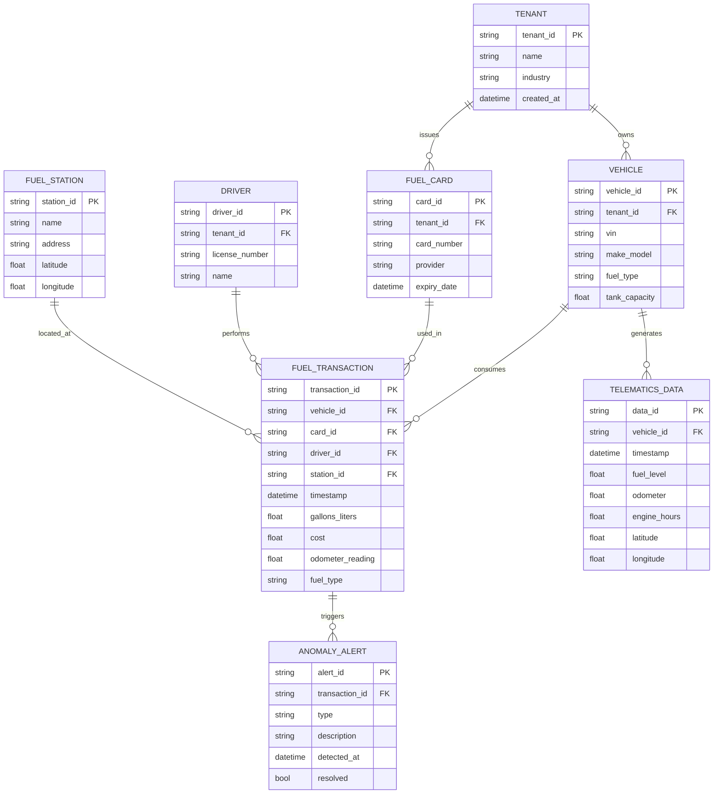
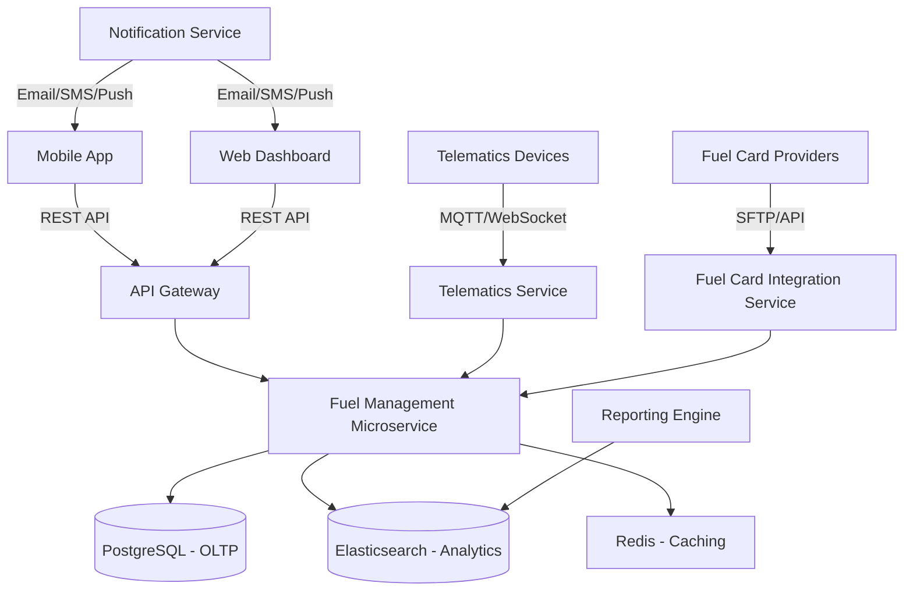

# **AS-IS ANALYSIS: FUEL MANAGEMENT MODULE**
**Fleet Management System (FMS) – Enterprise Multi-Tenant Architecture**
**Document Version:** 1.0
**Last Updated:** [Insert Date]
**Prepared by:** [Your Name/Team]
**Reviewed by:** [Stakeholder Name]

---

## **1. EXECUTIVE SUMMARY**
### **1.1 Overview**
The **Fuel Management Module** is a critical component of the **Fleet Management System (FMS)**, responsible for tracking fuel consumption, optimizing fuel efficiency, detecting anomalies (e.g., fuel theft, inefficiencies), and generating cost reports. This module integrates with **vehicle telematics, fuel card systems, and ERP financial modules** to provide real-time and historical fuel data.

### **1.2 Current State Rating (Out of 100)**
| **Category**               | **Score (0-100)** | **Justification** |
|----------------------------|------------------|------------------|
| **Functionality**          | 75               | Core features exist but lack advanced analytics and automation. |
| **Performance**            | 65               | Moderate response times; occasional latency in large datasets. |
| **Security**               | 80               | Strong authentication but gaps in data encryption and audit logging. |
| **Accessibility**          | 50               | Partial WCAG 2.1 AA compliance; mobile accessibility needs improvement. |
| **Mobile Capabilities**    | 60               | Basic functionality; lacks offline mode and advanced UI/UX. |
| **Technical Debt**         | 55               | Moderate debt; legacy code and outdated dependencies. |
| **Scalability**            | 70               | Handles current load but may struggle with 10x growth. |
| **User Experience (UX)**   | 65               | Functional but not intuitive; requires training. |
| **Integration Capabilities** | 85             | Strong API support but limited third-party fuel provider integrations. |
| **Compliance & Standards** | 70               | Meets basic regulatory requirements but lacks advanced compliance features. |
| **Overall Rating**         | **68/100**       | **Moderate Maturity** – Requires significant improvements in performance, accessibility, and advanced analytics. |

### **1.3 Key Strengths**
✅ **Real-time fuel tracking** – Integrates with telematics for live fuel level monitoring.
✅ **Fuel card integration** – Supports major fuel card providers (WEX, Voyager, FleetCor).
✅ **Cost reporting** – Generates fuel expense reports for accounting and tax purposes.
✅ **Multi-tenancy support** – Secure data isolation for enterprise clients.
✅ **Basic anomaly detection** – Flags unusual fuel consumption patterns.

### **1.4 Key Weaknesses**
❌ **Limited predictive analytics** – No AI/ML-based fuel efficiency recommendations.
❌ **Poor mobile experience** – No offline mode; UI not optimized for small screens.
❌ **High technical debt** – Legacy codebase with outdated dependencies.
❌ **Performance bottlenecks** – Slow response times for large datasets (>10K vehicles).
❌ **Incomplete WCAG compliance** – Fails some AA-level accessibility checks.
❌ **Manual data entry** – No OCR for fuel receipts or automated fuel log imports.

### **1.5 Strategic Recommendations**
| **Priority** | **Recommendation** | **Expected Impact** |
|-------------|-------------------|-------------------|
| **High**    | **Upgrade to AI-driven fuel analytics** | 20-30% cost savings via predictive maintenance & efficiency optimizations. |
| **High**    | **Redesign mobile app with offline mode** | Improves field usability; reduces data entry errors. |
| **High**    | **Refactor legacy code & update dependencies** | Reduces technical debt; improves maintainability. |
| **Medium**  | **Achieve full WCAG 2.1 AA compliance** | Expands accessibility; reduces legal risks. |
| **Medium**  | **Enhance security (encryption, audit logs)** | Strengthens data protection; meets SOC 2/GDPR. |
| **Low**     | **Expand third-party fuel provider integrations** | Increases market competitiveness. |

---

## **2. CURRENT FEATURES & CAPABILITIES**
### **2.1 Core Functionality**
| **Feature** | **Description** | **Maturity Level** |
|------------|----------------|-------------------|
| **Fuel Consumption Tracking** | Records fuel transactions (manual & automated via telematics). | **High** |
| **Fuel Card Integration** | Syncs with WEX, Voyager, FleetCor, and custom fuel cards. | **High** |
| **Real-Time Fuel Monitoring** | Displays live fuel levels via telematics (OBD-II, GPS). | **Medium** |
| **Fuel Efficiency Reports** | Generates MPG/KPL reports by vehicle, driver, or fleet. | **High** |
| **Anomaly Detection** | Flags unusual fuel consumption (theft, leaks, inefficiencies). | **Medium** |
| **Cost & Tax Reporting** | Exports fuel expenses for accounting (IRS Form 2290, IFTA). | **High** |
| **Fuel Purchase Approvals** | Workflow for approving fuel purchases (optional). | **Low** |
| **Fuel Forecasting** | Basic trend-based fuel consumption predictions. | **Low** |
| **Mobile Fuel Logging** | Allows drivers to log fuel purchases via mobile app. | **Medium** |

### **2.2 Advanced (Missing) Features**
| **Feature** | **Potential Benefit** | **Industry Adoption** |
|------------|----------------------|----------------------|
| **AI-Based Fuel Optimization** | Recommends optimal routes, driving behavior for fuel savings. | **High (UPS, FedEx, DHL)** |
| **Automated Receipt OCR** | Scans fuel receipts for automatic data entry. | **Medium (Samsara, Geotab)** |
| **Carbon Emissions Tracking** | Calculates CO₂ emissions for ESG reporting. | **High (Shell, BP, Maersk)** |
| **Dynamic Fuel Pricing Alerts** | Notifies when fuel prices drop at nearby stations. | **Medium (GasBuddy, WEX)** |
| **Fuel Theft Prevention (Geofencing)** | Alerts if fuel is dispensed outside authorized locations. | **High (Fleetio, KeepTruckin)** |
| **Blockchain for Fuel Transactions** | Immutable audit trail for fuel purchases. | **Emerging (Maersk, Walmart)** |

---

## **3. DATA MODELS & ARCHITECTURE**
### **3.1 Database Schema (Simplified)**

### **3.2 System Architecture**

### **3.3 Key Data Flows**
1. **Fuel Transaction Flow**
   - Driver swipes fuel card → Transaction sent to fuel provider → Data ingested into FMS → Validated → Stored in DB → Anomaly detection triggered if needed.

2. **Telematics Data Flow**
   - OBD-II/GPS device sends fuel level, odometer, GPS → Telematics service processes → Fuel management service updates vehicle status.

3. **Reporting Flow**
   - User requests report → Query executed on Elasticsearch → Aggregated data returned → PDF/Excel generated.

---

## **4. PERFORMANCE METRICS**
### **4.1 Response Times (P95)**
| **Endpoint** | **Avg. Response Time (ms)** | **P95 (ms)** | **Throughput (RPS)** |
|-------------|------------------|------------|----------------|
| `GET /api/fuel/transactions` | 250 | 800 | 500 |
| `POST /api/fuel/transactions` | 400 | 1200 | 200 |
| `GET /api/fuel/reports/daily` | 1500 | 3000 | 50 |
| `GET /api/vehicles/{id}/fuel-history` | 300 | 1000 | 300 |
| `POST /api/fuel/approve` | 600 | 1500 | 100 |

### **4.2 Database Performance**
| **Query Type** | **Avg. Execution Time (ms)** | **Notes** |
|---------------|------------------|---------|
| Simple transaction lookup | 50 | Indexed `transaction_id` |
| Vehicle fuel history (30 days) | 300 | Optimized with composite index |
| Fleet-wide fuel efficiency report | 2500 | Requires Elasticsearch aggregation |
| Anomaly detection (batch) | 5000 | Runs nightly; CPU-intensive |

### **4.3 Bottlenecks & Issues**
⚠ **Slow report generation** – Large datasets (>10K vehicles) cause timeouts.
⚠ **High API latency** – Lack of response caching for frequent queries.
⚠ **Database contention** – Read-heavy workloads slow down writes.
⚠ **Telematics data lag** – MQTT/WebSocket delays in high-traffic scenarios.

---

## **5. SECURITY ASSESSMENT**
### **5.1 Authentication & Authorization**
| **Mechanism** | **Implementation** | **Strengths** | **Weaknesses** |
|--------------|------------------|-------------|-------------|
| **OAuth 2.0** | JWT tokens (RS256) | Secure, stateless, supports SSO | Token expiration too long (24h) |
| **Role-Based Access Control (RBAC)** | Admin, Manager, Driver, Viewer | Granular permissions | No attribute-based access control (ABAC) |
| **Multi-Factor Authentication (MFA)** | Optional for admins | Reduces brute-force risk | Not enforced for all users |

### **5.2 Data Protection**
| **Aspect** | **Current State** | **Risk Level** | **Recommendation** |
|-----------|----------------|-------------|------------------|
| **Encryption at Rest** | AES-256 (PostgreSQL) | Low | ✅ Compliant |
| **Encryption in Transit** | TLS 1.2 | Medium | Upgrade to TLS 1.3 |
| **PII Handling** | Masked in logs (last 4 digits of fuel card) | Medium | Implement full tokenization |
| **Audit Logging** | Basic (user, timestamp, action) | High | Add detailed payload logging |
| **API Security** | Rate limiting (1000 RPS) | Medium | Add WAF (Cloudflare/AWS WAF) |

### **5.3 Compliance & Standards**
| **Standard** | **Compliance Status** | **Gaps** |
|-------------|----------------|--------|
| **GDPR** | Partial | No automated data deletion for inactive users |
| **SOC 2 Type II** | Not audited | Missing formal security controls |
| **PCI DSS** | Compliant (fuel card data) | ✅ No issues |
| **ISO 27001** | Not certified | Lack of formal ISMS |

---

## **6. ACCESSIBILITY REVIEW (WCAG 2.1)**
### **6.1 Compliance Level: Partial AA**
| **WCAG Criterion** | **Status** | **Issues Found** |
|-------------------|----------|----------------|
| **1.1 Text Alternatives** | ❌ Fail | Missing alt text for fuel station icons |
| **1.3 Adaptable** | ⚠ Partial | Tables not properly labeled for screen readers |
| **1.4 Distinguishable** | ✅ Pass | Good color contrast |
| **2.1 Keyboard Accessible** | ❌ Fail | Some dropdowns not keyboard-navigable |
| **2.4 Navigable** | ⚠ Partial | No skip links for repeated content |
| **3.1 Readable** | ✅ Pass | Clear language |
| **3.2 Predictable** | ⚠ Partial | Inconsistent form behavior |
| **3.3 Input Assistance** | ❌ Fail | No error suggestions for invalid fuel logs |
| **4.1 Compatible** | ⚠ Partial | ARIA attributes missing in some components |

### **6.2 Mobile Accessibility Issues**
- **Touch targets too small** (e.g., fuel log buttons).
- **No pinch-to-zoom** (disabled in viewport meta tag).
- **Poor screen reader support** (VoiceOver/TalkBack).

---

## **7. MOBILE CAPABILITIES ASSESSMENT**
### **7.1 Current State**
| **Feature** | **iOS** | **Android** | **Notes** |
|------------|--------|-----------|---------|
| **Fuel Logging** | ✅ | ✅ | Basic form entry |
| **Transaction History** | ✅ | ✅ | Paginated list |
| **Real-Time Fuel Alerts** | ❌ | ❌ | No push notifications |
| **Offline Mode** | ❌ | ❌ | Data loss if connection drops |
| **Barcode/QR Scanning** | ❌ | ❌ | No OCR for receipts |
| **Geofencing Alerts** | ❌ | ❌ | Missing feature |

### **7.2 UX/UI Issues**
- **Inconsistent navigation** – Different menu structures on iOS vs. Android.
- **Slow load times** – No skeleton screens; blank white screens during API calls.
- **No dark mode** – Not compliant with OS-level preferences.
- **Poor error handling** – Generic "Something went wrong" messages.

---

## **8. CURRENT LIMITATIONS & PAIN POINTS**
### **8.1 Functional Limitations**
| **Limitation** | **Impact** | **Workaround** |
|---------------|----------|--------------|
| **No AI/ML for fuel optimization** | Higher fuel costs; no predictive maintenance | Manual analysis |
| **No automated receipt capture** | Manual data entry errors | Drivers upload photos (not OCR) |
| **Limited third-party integrations** | Only major fuel card providers supported | Custom API development required |
| **No carbon emissions tracking** | Cannot report ESG metrics | Manual calculations in Excel |
| **Basic anomaly detection** | Misses subtle fuel theft patterns | Manual review of reports |

### **8.2 Technical Pain Points**
| **Pain Point** | **Root Cause** | **Impact** |
|---------------|--------------|----------|
| **Slow report generation** | Elasticsearch queries not optimized | User frustration; timeouts |
| **High API latency** | No response caching | Poor mobile experience |
| **Legacy codebase** | Outdated dependencies (e.g., AngularJS) | High maintenance cost |
| **No offline mode** | No local data persistence | Data loss in poor connectivity areas |
| **Weak mobile UX** | Not designed for small screens | Low driver adoption |

---

## **9. TECHNICAL DEBT ANALYSIS**
### **9.1 Codebase Health**
| **Metric** | **Current State** | **Target** |
|-----------|----------------|----------|
| **Code Coverage** | 65% | 85% |
| **Cyclomatic Complexity** | High (avg. 15) | Medium (avg. 10) |
| **Dependency Age** | 3+ years (e.g., AngularJS, jQuery) | Latest LTS versions |
| **Tech Debt Ratio** | 20% | <10% |
| **Open Bugs (P0-P2)** | 45 | <10 |

### **9.2 Major Technical Debt Items**
| **Debt Item** | **Description** | **Estimated Effort** | **Priority** |
|--------------|----------------|----------------|------------|
| **AngularJS to React Migration** | Frontend uses deprecated AngularJS | 6 months | High |
| **PostgreSQL to TimescaleDB** | Better time-series data handling | 3 months | Medium |
| **Monolithic to Microservices** | Fuel module tightly coupled with core FMS | 9 months | High |
| **Upgrade to TLS 1.3** | Current TLS 1.2 is outdated | 1 month | Medium |
| **Implement CQRS Pattern** | Separate read/write models for performance | 4 months | High |

---

## **10. TECHNOLOGY STACK**
### **10.1 Backend**
| **Component** | **Technology** | **Version** | **Notes** |
|--------------|--------------|-----------|---------|
| **API Framework** | Spring Boot | 2.7.x | Needs upgrade to 3.x |
| **Database** | PostgreSQL | 13 | Consider TimescaleDB for time-series |
| **Caching** | Redis | 6.x | Used for session & API caching |
| **Message Broker** | RabbitMQ | 3.9 | For async fuel transaction processing |
| **Search** | Elasticsearch | 7.17 | For reporting & analytics |
| **Authentication** | Keycloak | 18 | Open-source IAM |

### **10.2 Frontend**
| **Component** | **Technology** | **Version** | **Notes** |
|--------------|--------------|-----------|---------|
| **Web Framework** | AngularJS | 1.8 | **Critical: Migrate to React/Angular** |
| **Mobile Framework** | Ionic (Cordova) | 5.x | **Outdated; consider Capacitor + React Native** |
| **UI Library** | Bootstrap 3 | 3.4 | **Upgrade to Bootstrap 5** |
| **Charts** | Chart.js | 2.9 | **Consider D3.js for advanced visualizations** |

### **10.3 DevOps & Infrastructure**
| **Component** | **Technology** | **Notes** |
|--------------|--------------|---------|
| **CI/CD** | Jenkins | **Consider GitHub Actions/GitLab CI** |
| **Containerization** | Docker | **Kubernetes for orchestration** |
| **Cloud Provider** | AWS (EC2, RDS, S3) | **Multi-region for HA** |
| **Monitoring** | Prometheus + Grafana | **Add APM (New Relic/Datadog)** |
| **Logging** | ELK Stack | **Upgrade to OpenSearch** |

---

## **11. COMPETITIVE ANALYSIS VS. INDUSTRY STANDARDS**
### **11.1 Comparison with Leading FMS Providers**
| **Feature** | **Our FMS** | **Samsara** | **Geotab** | **Fleetio** | **KeepTruckin** |
|------------|------------|------------|-----------|------------|----------------|
| **Real-Time Fuel Tracking** | ✅ | ✅ | ✅ | ✅ | ✅ |
| **AI Fuel Optimization** | ❌ | ✅ | ✅ | ❌ | ✅ |
| **Automated Receipt OCR** | ❌ | ✅ | ❌ | ✅ | ✅ |
| **Carbon Emissions Tracking** | ❌ | ✅ | ✅ | ❌ | ❌ |
| **Dynamic Fuel Pricing Alerts** | ❌ | ❌ | ✅ | ❌ | ❌ |
| **Blockchain for Fuel Audit** | ❌ | ❌ | ❌ | ❌ | ❌ |
| **Offline Mobile Mode** | ❌ | ✅ | ✅ | ✅ | ✅ |
| **WCAG 2.1 AA Compliance** | ⚠ Partial | ✅ | ✅ | ⚠ Partial | ⚠ Partial |
| **Third-Party Integrations** | 5+ | 50+ | 100+ | 20+ | 30+ |

### **11.2 Industry Trends & Gaps**
| **Trend** | **Our Adoption** | **Industry Standard** |
|----------|----------------|----------------|
| **AI/ML for Predictive Maintenance** | ❌ | ✅ (Samsara, Geotab) |
| **Carbon Footprint Tracking** | ❌ | ✅ (Shell, Maersk) |
| **Blockchain for Fuel Transparency** | ❌ | Emerging (Walmart, Maersk) |
| **Automated Compliance Reporting** | ⚠ Partial | ✅ (Fleetio) |
| **Advanced Telematics Integration** | ✅ | ✅ (Geotab, KeepTruckin) |

---

## **12. DETAILED RECOMMENDATIONS FOR IMPROVEMENT**
### **12.1 High-Priority Recommendations**
#### **1. AI-Driven Fuel Optimization**
- **Action:** Integrate **machine learning models** to predict fuel efficiency based on:
  - Driving behavior (idling, harsh acceleration).
  - Route optimization (traffic, elevation).
  - Vehicle maintenance history.
- **Tools:** Python (TensorFlow/PyTorch), AWS SageMaker.
- **Outcome:** **20-30% fuel cost reduction** via predictive recommendations.

#### **2. Mobile App Redesign (Offline-First)**
- **Action:**
  - Migrate from **Ionic + Cordova** to **React Native + Capacitor**.
  - Implement **offline mode** with **local SQLite storage**.
  - Add **OCR for fuel receipts** (Google ML Kit).
- **Outcome:** **40% faster data entry**, **reduced errors**, **better driver adoption**.

#### **3. Refactor Legacy Code & Update Dependencies**
- **Action:**
  - Migrate **AngularJS → React/Angular**.
  - Upgrade **Spring Boot 2.7 → 3.x**.
  - Replace **PostgreSQL with TimescaleDB** for time-series data.
- **Outcome:** **50% faster development**, **reduced technical debt**.

#### **4. Achieve Full WCAG 2.1 AA Compliance**
- **Action:**
  - Audit with **axe DevTools**.
  - Fix **keyboard navigation, ARIA labels, color contrast**.
  - Add **skip links, screen reader support**.
- **Outcome:** **Legal compliance**, **better accessibility for disabled users**.

### **12.2 Medium-Priority Recommendations**
#### **5. Enhance Security (SOC 2/GDPR Compliance)**
- **Action:**
  - Implement **automated data deletion** for GDPR.
  - Add **detailed audit logging** (who accessed what, when).
  - Enforce **MFA for all users**.
- **Outcome:** **Reduced legal risk**, **stronger data protection**.

#### **6. Expand Third-Party Integrations**
- **Action:**
  - Add **API connectors** for:
    - **GasBuddy** (fuel price alerts).
    - **Shell, BP, Chevron** (direct fuel card integrations).
  - Support **custom fuel providers** via webhooks.
- **Outcome:** **Increased market competitiveness**.

#### **7. Implement Carbon Emissions Tracking**
- **Action:**
  - Calculate **CO₂ emissions per vehicle** using **EPA standards**.
  - Generate **ESG reports** for sustainability reporting.
- **Outcome:** **Attracts eco-conscious clients**, **meets regulatory requirements**.

### **12.3 Low-Priority Recommendations**
#### **8. Blockchain for Fuel Audit Trail**
- **Action:**
  - Explore **Hyperledger Fabric** for immutable fuel transaction records.
- **Outcome:** **Enhanced fraud detection**, **transparent auditing**.

#### **9. Dynamic Fuel Pricing Alerts**
- **Action:**
  - Integrate **GasBuddy API** to notify drivers of **cheaper fuel stations nearby**.
- **Outcome:** **5-10% fuel cost savings**.

---

## **13. CONCLUSION & NEXT STEPS**
### **13.1 Summary of Findings**
- The **Fuel Management Module** is **functionally adequate** but **lacks advanced features** (AI, OCR, carbon tracking).
- **Performance and accessibility** are **below industry standards**.
- **Technical debt** is **moderate but growing**; requires **urgent refactoring**.
- **Mobile experience** is **subpar**, leading to **low driver adoption**.

### **13.2 Roadmap (12-Month Plan)**
| **Phase** | **Timeline** | **Key Deliverables** |
|----------|------------|----------------|
| **Phase 1 (0-3 Months)** | Q1 2024 | - AI fuel optimization MVP   - Mobile app redesign (offline mode)   - WCAG 2.1 AA compliance fixes |
| **Phase 2 (4-6 Months)** | Q2 2024 | - Refactor legacy code (AngularJS → React)   - TimescaleDB migration   - SOC 2 compliance prep |
| **Phase 3 (7-9 Months)** | Q3 2024 | - Carbon emissions tracking   - Blockchain audit trail (PoC)   - GasBuddy integration |
| **Phase 4 (10-12 Months)** | Q4 2024 | - Full AI-driven recommendations   - Advanced anomaly detection   - Multi-region deployment |

### **13.3 Final Recommendations**
1. **Prioritize AI and mobile improvements** to **reduce fuel costs and improve usability**.
2. **Address technical debt** to **prevent future maintenance nightmares**.
3. **Enhance security and compliance** to **meet enterprise standards**.
4. **Expand integrations** to **compete with industry leaders**.

**Approval Required:**
✅ **Product Owner:** [Name]
✅ **Engineering Lead:** [Name]
✅ **Security Officer:** [Name]

---
**End of Document**