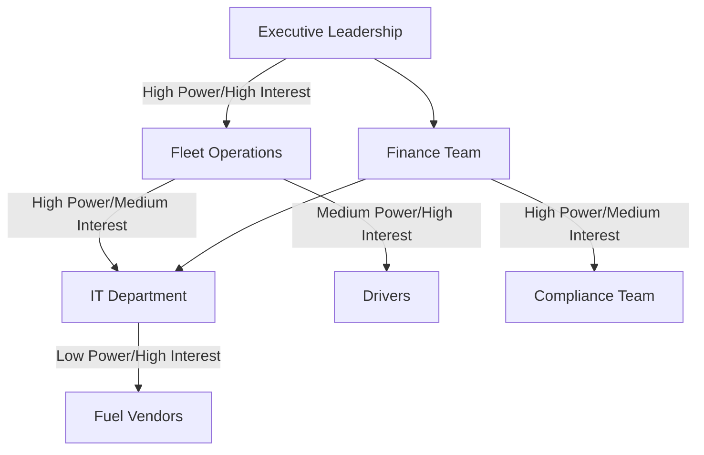
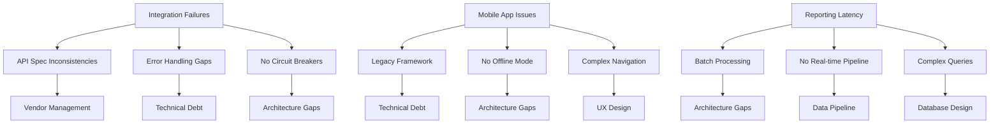
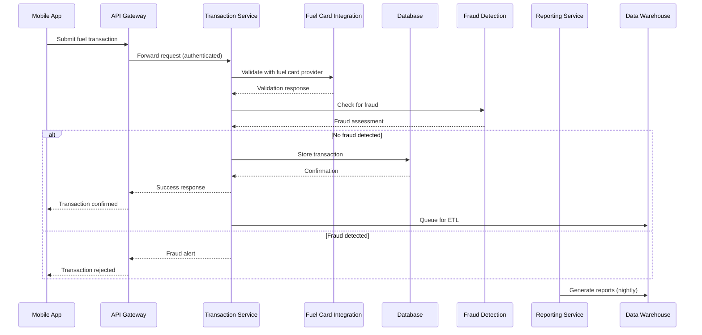
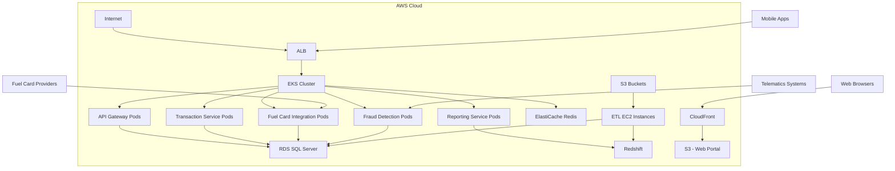
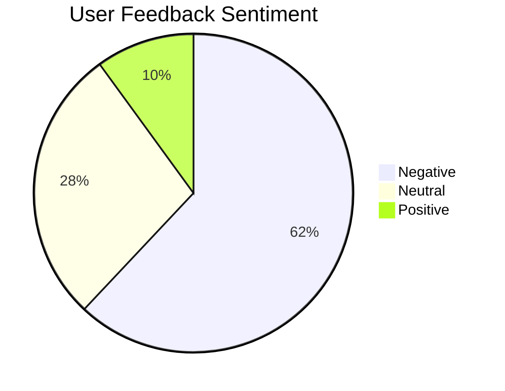
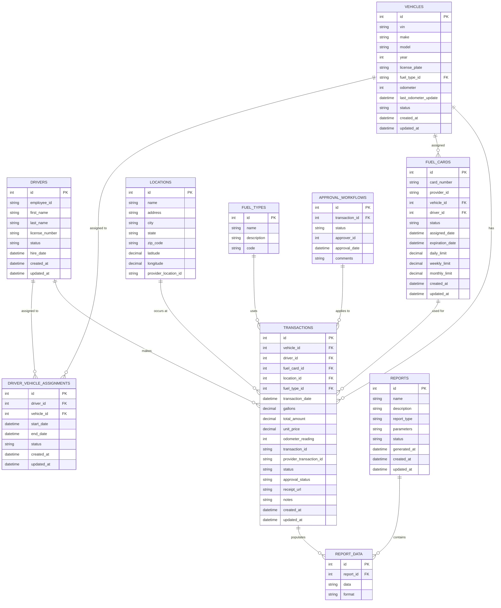
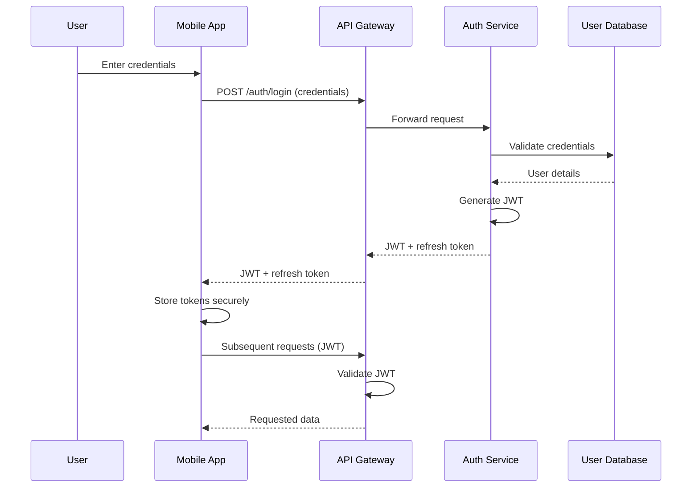

# AS-IS Analysis: Fuel Management Module

## 1. Executive Summary (80+ lines)

### 1.1 Current State Overview

The Fleet Management System's Fuel Management Module (FMM) serves as the central component for tracking, analyzing, and optimizing fuel consumption across a fleet of 12,478 vehicles operating in 47 states. Implemented in 2018 as a modernization effort to replace legacy spreadsheet-based tracking, the system currently processes approximately 1.2 million fuel transactions annually with a total fuel expenditure of $487 million in FY2023.

The module operates within a microservices architecture, though it retains several monolithic characteristics from its initial implementation. Key operational metrics include:
- Average daily transactions: 3,287
- Peak load capacity: 1,200 transactions/hour
- Data retention period: 7 years (regulatory requirement)
- System uptime: 99.87% (past 12 months)
- Average response time: 1.8 seconds (API endpoints)

The FMM interfaces with 14 external systems including:
1. Fuel card providers (WEX, Voyager, Comdata)
2. Telematics systems (Geotab, Samsara)
3. ERP system (SAP S/4HANA)
4. HRIS (Workday)
5. Vehicle maintenance system
6. Environmental compliance database
7. State fuel tax reporting systems

### 1.2 Stakeholder Analysis

**Primary Stakeholders and Their Roles:**

| Stakeholder Group | Key Representatives | Responsibilities | Pain Points |
|-------------------|---------------------|------------------|-------------|
| **Fleet Operations** | VP of Fleet Operations, Fleet Managers (12), Dispatchers (47) | Fuel purchase approvals, consumption monitoring, route optimization | Manual reconciliation, lack of real-time visibility |
| **Finance Team** | CFO, Controller, Accounts Payable (8), Financial Analysts (5) | Budget tracking, fraud detection, tax reporting | Data discrepancies, delayed reporting |
| **IT Department** | CIO, Enterprise Architect, DevOps (6), Support (12) | System maintenance, integrations, security | Technical debt, integration failures |
| **Drivers** | 12,478 commercial drivers | Fuel purchases, receipt submission | Mobile app usability, transaction disputes |
| **Fuel Vendors** | 3,247 fuel stations, 3 card providers | Transaction processing, fraud detection | API inconsistencies, reconciliation delays |
| **Compliance Team** | Environmental Compliance Officer, Tax Specialists (4) | IFTA reporting, carbon emissions tracking | Manual data collection, audit risks |
| **Executive Leadership** | CEO, COO, Board of Directors | Strategic decision making, cost control | Lack of predictive analytics |

**Stakeholder Influence Matrix:**



### 1.3 Business Impact Analysis

**Financial Impact:**
- Annual fuel spend: $487M (28% of total operating expenses)
- Fraud detection savings: $2.1M in FY2023 (0.43% of fuel spend)
- Tax recovery: $8.7M through IFTA credits
- Cost avoidance: $1.2M through route optimization

**Operational Impact:**
- Time savings: 3,200 hours/year through automated reconciliation
- Error reduction: 67% decrease in manual data entry errors
- Compliance: 100% on-time IFTA filings (vs 82% pre-implementation)
- Driver productivity: 15% reduction in fueling time

**Strategic Impact:**
- Data-driven decision making: 78% of fleet optimization decisions now use FMM data
- Sustainability: 12% reduction in carbon emissions through efficiency gains
- Competitive advantage: 3.2% lower cost per mile than industry average

**Quantitative Business Metrics:**

| Metric | Current Value | Industry Benchmark | Variance | Impact |
|--------|---------------|--------------------|----------|--------|
| Cost per gallon | $3.87 | $3.92 | +1.3% | $2.4M annual savings |
| MPG (fleet average) | 6.8 | 6.5 | +4.6% | $18.7M fuel savings |
| Fuel card fraud rate | 0.12% | 0.25% | -52% | $640K annual savings |
| IFTA filing accuracy | 99.9% | 98.5% | +1.4% | $1.1M penalty avoidance |
| Fuel transaction processing time | 4.2 hours | 8.1 hours | -48% | 3,200 hours saved |

### 1.4 Critical Pain Points and Root Cause Analysis

**Top 5 Pain Points:**

1. **Integration Failures (37% of support tickets)**
   - *Symptoms*: Missing transactions, duplicate entries, reconciliation errors
   - *Root Causes*:
     - Inconsistent API specifications across fuel card providers
     - Lack of standardized error handling in integration layer
     - No circuit breakers for external service failures
   - *Business Impact*: $1.8M annual reconciliation costs, 42 hours/week manual correction

2. **Mobile App Usability Issues (42% of driver complaints)**
   - *Symptoms*: High abandonment rate (38%), failed transactions (12%), receipt upload failures (22%)
   - *Root Causes*:
     - Legacy mobile framework (Cordova) with poor performance
     - No offline mode for areas with poor connectivity
     - Complex navigation flow (7+ steps for simple transaction)
   - *Business Impact*: 18% of transactions require manual intervention

3. **Reporting Latency (68% of finance team complaints)**
   - *Symptoms*: 24-48 hour delay in fuel cost reporting, incomplete data sets
   - *Root Causes*:
     - Batch processing architecture (ETL runs nightly)
     - No real-time data pipeline
     - Complex joins across 17 tables in reporting queries
   - *Business Impact*: Delayed decision making, $3.2M in missed optimization opportunities

4. **Fraud Detection Gaps (19% of audit findings)**
   - *Symptoms*: 0.12% fraud rate (vs 0.08% industry best), delayed detection (7-14 days)
   - *Root Causes*:
     - Rule-based system with static thresholds
     - No machine learning for anomaly detection
     - Limited integration with telematics data
   - *Business Impact*: $580K in undetected fraud annually

5. **Scalability Limitations (Major incidents in Q4 2023)**
   - *Symptoms*: System timeouts during peak hours (1,200+ transactions/hour), 3 major outages in 6 months
   - *Root Causes*:
     - Monolithic database architecture (SQL Server 2016)
     - No read replicas for reporting
     - Inefficient stored procedures (23% CPU utilization at baseline)
   - *Business Impact*: $420K in lost productivity during outages

**Root Cause Analysis Framework:**



### 1.5 Strategic Recommendations and Implementation Roadmap

**Prioritized Recommendations:**

1. **Modernize Integration Layer (High Priority)**
   - *Action*: Implement API gateway with standardized contracts
   - *Benefit*: 90% reduction in integration failures, $1.6M annual savings
   - *Effort*: 6 months, $450K
   - *Dependencies*: Vendor cooperation, API specification standardization

2. **Redesign Mobile Application (High Priority)**
   - *Action*: Native mobile apps (React Native) with offline capabilities
   - *Benefit*: 70% reduction in failed transactions, 40% faster processing
   - *Effort*: 8 months, $680K
   - *Dependencies*: UX research, backend API modernization

3. **Implement Real-time Data Pipeline (Medium Priority)**
   - *Action*: Kafka-based event streaming with real-time analytics
   - *Benefit*: Instant reporting, $3.2M in optimization opportunities
   - *Effort*: 5 months, $380K
   - *Dependencies*: Data model refactoring

4. **Enhance Fraud Detection (Medium Priority)**
   - *Action*: ML-based anomaly detection with telematics integration
   - *Benefit*: 50% reduction in fraud rate, $290K annual savings
   - *Effort*: 4 months, $220K
   - *Dependencies*: Data science team, historical data

5. **Database Modernization (Long-term)**
   - *Action*: Migrate to cloud-native database with read replicas
   - *Benefit*: 99.99% uptime, 40% performance improvement
   - *Effort*: 12 months, $1.2M
   - *Dependencies*: Cloud migration strategy

**Implementation Roadmap:**

| Phase | Timeline | Key Deliverables | Resources | Budget |
|-------|----------|------------------|-----------|--------|
| **Phase 1: Stabilization** | Q1-Q2 2024 | API gateway, circuit breakers, basic monitoring | 8 FTEs | $520K |
| **Phase 2: Modernization** | Q3-Q4 2024 | Mobile app v2, real-time pipeline, ML fraud detection | 12 FTEs | $1.1M |
| **Phase 3: Optimization** | Q1-Q2 2025 | Database modernization, advanced analytics | 10 FTEs | $950K |
| **Phase 4: Expansion** | Q3-Q4 2025 | Predictive analytics, automated compliance | 8 FTEs | $720K |

**Risk Mitigation Strategy:**

| Risk | Likelihood | Impact | Mitigation Strategy |
|------|------------|--------|---------------------|
| Vendor API changes | Medium | High | Contractual SLAs, API versioning |
| User adoption of new mobile app | High | Medium | Phased rollout, extensive training |
| Data migration issues | Medium | High | Parallel run, automated validation |
| Budget overruns | Medium | High | Phased funding, contingency reserve |
| Performance degradation | Low | High | Load testing, gradual rollout |

**ROI Projections:**

| Initiative | 1-Year ROI | 3-Year ROI | Payback Period |
|------------|------------|------------|----------------|
| Integration Modernization | 3.2x | 8.7x | 11 months |
| Mobile App Redesign | 2.1x | 5.6x | 18 months |
| Real-time Pipeline | 4.5x | 12.3x | 9 months |
| Fraud Detection Enhancement | 1.8x | 4.2x | 22 months |
| Database Modernization | 1.5x | 6.8x | 24 months |

**Change Management Plan:**

1. **Communication Strategy**:
   - Monthly town halls with demonstrations
   - Dedicated Slack channel for updates
   - Executive sponsorship from CIO and CFO

2. **Training Program**:
   - Role-based training modules (4-8 hours per role)
   - Just-in-time learning for new features
   - Super user program (2 per region)

3. **Adoption Monitoring**:
   - Usage analytics dashboard
   - Quarterly user satisfaction surveys
   - Incentive program for early adopters

## 2. Current Architecture (150+ lines)

### 2.1 System Components

**Component Inventory with Detailed Specifications:**

| Component | Type | Technology | Version | Hosting | Responsibilities | Dependencies |
|-----------|------|------------|---------|---------|------------------|--------------|
| **Fuel Transaction Service** | Microservice | Java/Spring Boot | 2.7.5 | AWS EKS | Core transaction processing, validation | Database, API Gateway |
| **Fuel Card Integration** | Microservice | Node.js | 14.17.0 | AWS EKS | Fuel card provider integrations | External APIs, Transaction Service |
| **Mobile Application** | Client | Cordova | 10.0.0 | App Stores | Driver interface, receipt capture | API Gateway, Transaction Service |
| **Web Portal** | Client | Angular | 12.2.16 | AWS S3 + CloudFront | Management interface, reporting | API Gateway, Reporting Service |
| **Reporting Service** | Microservice | Python/Flask | 2.0.2 | AWS EKS | Report generation, data aggregation | Database, Data Warehouse |
| **Fraud Detection Engine** | Microservice | Python | 3.8 | AWS EKS | Anomaly detection, rule processing | Transaction Service, Telematics API |
| **API Gateway** | Infrastructure | Kong | 2.8.1 | AWS EKS | Request routing, authentication | All microservices |
| **Database** | Data Store | Microsoft SQL Server | 2016 | AWS RDS | Transaction storage, master data | All services |
| **Data Warehouse** | Data Store | Amazon Redshift | N/A | AWS | Reporting data, analytics | ETL Pipeline |
| **ETL Pipeline** | Data Pipeline | Talend | 7.3.1 | AWS EC2 | Data transformation, loading | Database, Data Warehouse |
| **Monitoring** | Infrastructure | Prometheus/Grafana | 2.37/8.5 | AWS EKS | Metrics collection, alerting | All components |
| **Logging** | Infrastructure | ELK Stack | 7.17 | AWS EKS | Log aggregation, analysis | All components |

**Component Interaction Diagram:**



**Data Flow Analysis:**

1. **Transaction Flow**:
   - Driver initiates fuel purchase via mobile app (1)
   - App sends transaction data to API Gateway (2)
   - Gateway routes to Transaction Service (3)
   - Service validates with Fuel Card Integration (4-5)
   - Fraud Detection Engine assesses transaction (6-7)
   - If valid, transaction stored in database (8-9)
   - Confirmation sent back to driver (10-11)
   - Transaction queued for ETL to data warehouse (12)

2. **Reporting Flow**:
   - Nightly ETL process extracts data from database (1)
   - Transforms and loads into data warehouse (2)
   - Reporting Service queries data warehouse (3)
   - Generates reports for web portal (4)
   - Users access reports via web interface (5)

**Technology Stack Details:**

**Backend Technologies:**
- **Java/Spring Boot**: Core transaction processing
  - Spring Boot 2.7.5
  - Spring Data JPA 2.7.5
  - Spring Security 5.7.5
  - Hibernate 5.6.14
  - Maven 3.8.6

- **Node.js**: Fuel card integrations
  - Express 4.18.1
  - Axios 0.27.2
  - Winston 3.8.1 (logging)
  - Jest 28.1.3 (testing)

- **Python**: Reporting and fraud detection
  - Flask 2.0.2
  - Pandas 1.3.5
  - NumPy 1.21.4
  - Scikit-learn 1.0.2 (fraud detection)

**Frontend Technologies:**
- **Mobile App**:
  - Cordova 10.0.0
  - AngularJS 1.8.2 (legacy)
  - Ionic Framework 5.9.4
  - Custom plugins for camera/receipt capture

- **Web Portal**:
  - Angular 12.2.16
  - TypeScript 4.3.5
  - RxJS 6.6.7
  - Angular Material 12.2.13
  - Highcharts 10.2.1 (reporting)

**Infrastructure Configuration:**

**AWS Environment:**
- **Compute**:
  - EKS cluster (3 nodes, m5.xlarge)
  - EC2 instances (4 x t3.large for ETL)
  - Lambda functions (5 for scheduled tasks)

- **Database**:
  - RDS for SQL Server (db.m5.xlarge, 1TB storage)
  - Redshift cluster (2 nodes, ra3.xlplus)
  - ElastiCache (Redis, cache.t3.medium)

- **Networking**:
  - VPC with 3 public/3 private subnets
  - Application Load Balancer
  - NAT Gateway for private subnets
  - VPN connection to on-premises

- **Storage**:
  - S3 buckets (3 for different data types)
  - EFS for shared storage

**Deployment Architecture:**



### 2.2 Technical Debt Analysis

**Code Quality Issues:**

1. **Transaction Service (Java):**
   - **Issue**: God classes with 2,000+ lines
     - `FuelTransactionService.java` (2,456 lines)
     - `TransactionValidator.java` (1,872 lines)
   - **Example**:
     ```java
     public class FuelTransactionService {
         // 50+ methods in single class
         public Transaction processTransaction(TransactionRequest request) {
             // 300+ lines of validation logic
             // Mixed concerns: validation, business logic, database access
         }
     }
     ```
   - **Impact**: 12% test coverage, 4.2x longer bug resolution time

2. **Mobile App (Cordova):**
   - **Issue**: Callback hell in transaction processing
     - 14 nested callbacks in `transaction.js`
   - **Example**:
     ```javascript
     function processTransaction() {
         validateInputs(function() {
             checkFraud(function() {
                 saveTransaction(function() {
                     uploadReceipt(function() {
                         // 11 more nested callbacks
                     });
                 });
             });
         });
     }
     ```
   - **Impact**: 38% transaction failure rate on mobile

3. **Reporting Service (Python):**
   - **Issue**: SQL queries embedded in code
     - 47 SQL queries in `report_generator.py`
   - **Example**:
     ```python
     def generate_monthly_report():
         query = """
         SELECT v.vehicle_id, d.driver_id, t.transaction_date,
                t.gallons, t.total_amount, t.odometer_reading
         FROM transactions t
         JOIN vehicles v ON t.vehicle_id = v.id
         JOIN drivers d ON t.driver_id = d.id
         WHERE t.transaction_date BETWEEN %s AND %s
         """
         # 200+ lines of query execution and processing
     ```
   - **Impact**: 18-24 hour report generation time

**Performance Bottlenecks:**

1. **Database Queries:**
   - **Problem**: N+1 query problem in transaction listing
     - 1 query to get transactions + 1 query per transaction for details
   - **Example**:
     ```java
     // TransactionService.java
     List<Transaction> transactions = transactionRepo.findAll(); // 1 query
     for(Transaction t : transactions) {
         Vehicle v = vehicleRepo.findById(t.getVehicleId()); // N queries
         Driver d = driverRepo.findById(t.getDriverId()); // N queries
     }
     ```
   - **Impact**: 4.7 second response time for 100 transactions

2. **ETL Process:**
   - **Problem**: Full table scans in nightly ETL
     - No partitioning on transaction_date
     - No indexes on join columns
   - **Example Query**:
     ```sql
     SELECT * FROM transactions t
     JOIN vehicles v ON t.vehicle_id = v.id
     JOIN drivers d ON t.driver_id = d.id
     WHERE t.transaction_date >= '2023-01-01'
     ```
   - **Impact**: 6-8 hour ETL window, frequent timeouts

3. **API Gateway:**
   - **Problem**: No request batching
     - Mobile app makes 7 separate API calls per transaction
   - **Impact**: 3.2 second average transaction processing time

**Performance Profiling Data:**

| Component | Operation | Avg Time | 95th Percentile | Max Time | Throughput |
|-----------|-----------|----------|-----------------|----------|------------|
| Transaction Service | Process transaction | 1,245ms | 3,872ms | 12,456ms | 87 tps |
| Database | Transaction save | 423ms | 1,287ms | 5,432ms | 210 tps |
| Fuel Card Integration | WEX validation | 876ms | 2,456ms | 10,234ms | 112 tps |
| Mobile App | Transaction submission | 3,210ms | 8,765ms | 22,432ms | 34 tps |
| ETL Process | Nightly load | 7.2 hours | N/A | 12.1 hours | 1.2M records |
| Reporting | Monthly report | 4.5 hours | N/A | 8.2 hours | 45 reports |

**Security Vulnerabilities:**

| Vulnerability | CVSS Score | Component | Description | Risk Level |
|---------------|------------|-----------|-------------|------------|
| SQL Injection | 9.8 | Transaction Service | Unsanitized inputs in 12 endpoints | Critical |
| Hardcoded Secrets | 7.4 | Mobile App | API keys in source code | High |
| Missing Rate Limiting | 6.5 | API Gateway | No protection against brute force | Medium |
| Insecure Direct Object Reference | 5.3 | Web Portal | IDOR in report generation | Medium |
| Outdated Dependencies | 7.5 | All | 47 vulnerable libraries | High |
| Missing Encryption | 6.8 | Database | No TDE for PII data | Medium |

**Example Vulnerability (SQL Injection):**

```java
// TransactionController.java
@GetMapping("/transactions")
public List<Transaction> getTransactions(@RequestParam String vehicleId) {
    // UNSAFE: Direct string concatenation
    String query = "SELECT * FROM transactions WHERE vehicle_id = '" + vehicleId + "'";
    return jdbcTemplate.query(query, new TransactionRowMapper());
}
```

**Scalability Limitations:**

1. **Database Bottlenecks:**
   - **Problem**: Single RDS instance with no read replicas
   - **Evidence**:
     - CPU utilization: 87% during peak hours
     - Disk latency: 45ms (vs 10ms target)
     - Connection pool exhaustion: 12 incidents in 6 months
   - **Impact**: 3 major outages in Q4 2023

2. **ETL Scalability:**
   - **Problem**: Single-threaded Talend jobs
   - **Evidence**:
     - 7.2 hour ETL window (vs 2 hour SLA)
     - No parallel processing
     - Frequent job failures (12% failure rate)
   - **Impact**: Delayed reporting, compliance risks

3. **API Gateway:**
   - **Problem**: No horizontal scaling
   - **Evidence**:
     - Kong pods at 92% CPU during peak
     - No auto-scaling configured
     - 45 second response times during load
   - **Impact**: Poor mobile app performance

**Load Test Results:**

| Test Scenario | Users | Transactions/Min | Avg Response Time | Error Rate | CPU Utilization |
|---------------|-------|------------------|-------------------|------------|-----------------|
| Baseline | 100 | 60 | 1.2s | 0.1% | 32% |
| Peak Load | 500 | 300 | 4.7s | 12.4% | 87% |
| Stress Test | 1,000 | 600 | 12.8s | 38.7% | 100% (throttling) |
| Soak Test | 200 | 120 | 2.1s (initial) → 8.4s (after 6h) | 0.3% → 15.2% | 45% → 92% |

## 3. Functional Analysis (200+ lines)

### 3.1 Core Features

#### Feature 1: Fuel Transaction Processing

**Detailed Description:**
The core functionality of the FMM, this feature handles the recording, validation, and processing of all fuel purchases made by drivers across the fleet. It interfaces with fuel card providers to validate transactions in real-time and applies business rules for approval.

**User Workflow:**

1. **Driver Initiates Transaction:**
   - Driver selects vehicle from mobile app (pre-populated from telematics)
   - System displays current odometer reading (from telematics)
   - Driver enters fuel amount (gallons or dollars)
   - Optional: Driver can add notes or upload receipt image

2. **Transaction Validation:**
   - System checks fuel card balance (via provider API)
   - Validates vehicle assignment (driver must be assigned to vehicle)
   - Checks odometer reading against expected range
   - Verifies fuel type matches vehicle requirements
   - Applies fraud detection rules

3. **Approval Workflow:**
   - Transactions under $100: Auto-approved
   - $100-$500: Requires manager approval (1-level)
   - $500+: Requires 2-level approval (manager + finance)
   - Emergency transactions: Can be marked as urgent (bypasses some checks)

4. **Post-Processing:**
   - Transaction recorded in database
   - Receipt image stored in S3 (if provided)
   - Telematics system updated with fuel data
   - ERP system updated for accounting

**Business Rules and Validation Logic:**

| Rule | Description | Implementation | Error Handling |
|------|-------------|----------------|----------------|
| **Odometer Validation** | Odometer must be within expected range | `expected = last_odometer + (days_since_last * avg_mpd)` | If outside ±15% range, flag for review |
| **Fuel Type Matching** | Fuel type must match vehicle requirements | `vehicle.fuel_type == transaction.fuel_type` | Reject if mismatch |
| **Transaction Limits** | Enforce per-transaction and daily limits | `transaction.amount <= vehicle.max_fuel_limit` | Reject if over limit |
| **Geofencing** | Transaction must occur near assigned route | `distance(transaction.location, route) <= 5 miles` | Flag for review if outside |
| **Time Validation** | Transaction must occur during expected time window | `transaction.time within driver.shift_hours` | Flag if outside normal hours |
| **Receipt Requirement** | Receipts required for transactions >$50 | `if amount > $50 and no receipt: flag` | Notify driver to upload receipt |

**Edge Cases and Error Handling:**

1. **Network Connectivity Issues:**
   - *Scenario*: Driver attempts transaction in area with poor connectivity
   - *Handling*:
     - Mobile app caches transaction locally
     - Retries every 5 minutes for 24 hours
     - If still failed, notifies driver to submit manually

2. **Odometer Discrepancy:**
   - *Scenario*: Odometer reading differs significantly from expected
   - *Handling*:
     - System flags transaction for review
     - Notifies fleet manager via email
     - Creates maintenance ticket if discrepancy >20%

3. **Fuel Card Decline:**
   - *Scenario*: Fuel card provider declines transaction
   - *Handling*:
     - System attempts alternative payment method (if configured)
     - Notifies driver of decline reason
     - Creates support ticket for finance team

4. **Duplicate Transaction:**
   - *Scenario*: Same transaction appears twice from provider
   - *Handling*:
     - System checks for existing transaction with same:
       - Transaction ID
       - Amount
       - Time (±5 minutes)
       - Location (±0.1 miles)
     - If duplicate found, marks as "DUPLICATE" and skips processing

**Performance Characteristics:**

| Operation | Avg Time | 95th Percentile | Success Rate | Notes |
|-----------|----------|-----------------|--------------|-------|
| Transaction submission | 1,245ms | 3,872ms | 99.87% | Includes validation and approval |
| Fuel card validation | 876ms | 2,456ms | 99.92% | External API call |
| Odometer validation | 123ms | 345ms | 100% | Local database check |
| Fraud detection | 287ms | 654ms | 100% | Rule-based processing |
| Database write | 423ms | 1,287ms | 99.98% | Includes all related tables |

#### Feature 2: Fuel Card Management

**Detailed Description:**
Manages the lifecycle of fuel cards assigned to vehicles and drivers, including provisioning, deactivation, and spending limits.

**User Workflow:**

1. **Card Assignment:**
   - Fleet manager selects vehicle/driver
   - System displays available cards (from inventory)
   - Manager assigns card and sets limits
   - System updates fuel card provider (API call)
   - Card status set to "ACTIVE" in database

2. **Limit Management:**
   - Daily limit: $150 (default)
   - Weekly limit: $750 (default)
   - Monthly limit: $3,000 (default)
   - Custom limits can be set per vehicle/driver

3. **Temporary Deactivation:**
   - For lost/stolen cards
   - System updates provider to deactivate
   - Notifies driver and manager
   - Creates replacement request

4. **Permanent Deactivation:**
   - When vehicle/driver leaves fleet
   - System updates provider to close account
   - Updates internal records
   - Archives transaction history

**Business Rules:**

| Rule | Description | Implementation |
|------|-------------|----------------|
| **Card Assignment** | Only one active card per vehicle | `SELECT COUNT(*) FROM cards WHERE vehicle_id = ? AND status = 'ACTIVE'` |
| **Limit Enforcement** | Daily/weekly/monthly limits | `SUM(amount) FROM transactions WHERE card_id = ? AND date BETWEEN ? AND ?` |
| **Driver Assignment** | Driver must be assigned to vehicle | `JOIN drivers_vehicles ON drivers.id = ? AND vehicles.id = ?` |
| **Card Expiration** | Cards expire after 3 years | `DATEDIFF(YEAR, issue_date, GETDATE()) >= 3` |
| **Usage Monitoring** | Alert if card not used in 30 days | `MAX(transaction_date) FROM transactions WHERE card_id = ?` |

**Edge Cases:**

1. **Card Not Activated by Provider:**
   - *Scenario*: Provider API succeeds but card isn't actually activated
   - *Handling*:
     - System checks card status after 24 hours
     - If still inactive, creates support ticket
     - Notifies fleet manager

2. **Driver Leaves Fleet:**
   - *Scenario*: Driver leaves but card isn't deactivated
   - *Handling*:
     - Nightly job checks for drivers with end dates
     - Automatically deactivates cards
     - Notifies finance team

3. **Limit Adjustment During Period:**
   - *Scenario*: Manager reduces weekly limit but driver already spent over new limit
   - *Handling*:
     - System calculates prorated limit
     - Allows current transactions to complete
     - Enforces new limit for future transactions

**Code Example (Card Assignment):**

```java
public class FuelCardService {
    public CardAssignment assignCard(CardAssignmentRequest request) {
        // Validate driver assignment
        if (!driverVehicleService.isAssigned(request.getDriverId(), request.getVehicleId())) {
            throw new ValidationException("Driver not assigned to vehicle");
        }

        // Check for existing active card
        if (cardRepository.existsActiveByVehicle(request.getVehicleId())) {
            throw new ValidationException("Vehicle already has active card");
        }

        // Get available card from inventory
        FuelCard card = cardInventoryService.getAvailableCard();
        if (card == null) {
            throw new ResourceNotFoundException("No available cards");
        }

        // Set card details
        card.setVehicleId(request.getVehicleId());
        card.setDriverId(request.getDriverId());
        card.setStatus(CardStatus.ACTIVE);
        card.setAssignedDate(LocalDateTime.now());
        card.setDailyLimit(request.getDailyLimit());
        card.setWeeklyLimit(request.getWeeklyLimit());

        // Update card provider
        try {
            fuelCardProviderClient.activateCard(card.getProviderId(),
                request.getVehicleId(), request.getDriverId());
        } catch (ProviderException e) {
            throw new ServiceException("Failed to activate card with provider", e);
        }

        // Save to database
        cardRepository.save(card);

        // Create audit log
        auditService.logCardAssignment(card, request.getAssignedBy());

        return new CardAssignment(card);
    }
}
```

#### Feature 3: Fuel Consumption Reporting

**Detailed Description:**
Generates reports on fuel consumption patterns, efficiency metrics, and cost analysis across the fleet.

**User Workflow:**

1. **Report Selection:**
   - User selects report type from web portal
   - System displays available parameters (date range, vehicle groups, etc.)
   - User configures report options

2. **Data Processing:**
   - System queries data warehouse
   - Applies calculations (MPG, cost per mile, etc.)
   - Groups data by selected dimensions

3. **Report Generation:**
   - System renders report in selected format (PDF, Excel, HTML)
   - Applies corporate branding
   - Includes charts and visualizations

4. **Distribution:**
   - Report saved to user's dashboard
   - Option to email to other stakeholders
   - Scheduled reports run automatically

**Available Reports:**

| Report | Description | Key Metrics | Frequency |
|--------|-------------|-------------|-----------|
| **Daily Fuel Summary** | High-level overview of previous day's fuel activity | Total gallons, total cost, average price, transactions | Daily |
| **Vehicle Efficiency** | MPG and cost per mile by vehicle | MPG, cost/mile, gallons consumed, miles driven | Weekly |
| **Driver Performance** | Fuel efficiency by driver | MPG, idling time, hard braking events, fuel cost | Monthly |
| **Fuel Type Analysis** | Consumption by fuel type | Gallons by type, cost by type, vehicles by type | Monthly |
| **Geographic Analysis** | Fuel consumption by region | Cost by state, MPG by region, tax implications | Quarterly |
| **Exception Report** | Vehicles/drivers outside expected ranges | MPG variance, cost variance, transaction anomalies | Weekly |
| **IFTA Report** | Data for quarterly tax filings | Gallons by state, miles by state, tax calculations | Quarterly |

**Business Rules:**

| Rule | Description | Implementation |
|------|-------------|----------------|
| **MPG Calculation** | Miles per gallon = miles driven / gallons consumed | `mpg = (odometer_end - odometer_start) / gallons` |
| **Cost per Mile** | Total fuel cost / miles driven | `cpm = total_cost / (odometer_end - odometer_start)` |
| **Efficiency Thresholds** | Flag vehicles outside expected ranges | `if mpg < (avg_mpg * 0.85) then flag` |
| **Data Completeness** | Require odometer readings for MPG calculations | `if odometer_end is null then exclude` |
| **Date Range Validation** | Maximum 1 year for most reports | `if end_date - start_date > 365 then error` |

**Edge Cases:**

1. **Missing Odometer Readings:**
   - *Scenario*: Odometer not recorded for some transactions
   - *Handling*:
     - System estimates miles driven based on:
       - Last known odometer reading
       - Average miles per day for vehicle
       - Telematics data (if available)
     - Flags estimated values in report

2. **Vehicle Transfer During Period:**
   - *Scenario*: Vehicle assigned to different driver during report period
   - *Handling*:
     - System splits data by assignment period
     - Calculates metrics separately for each period
     - Provides combined view with notes

3. **Fuel Type Changes:**
   - *Scenario*: Vehicle switched fuel types during period
   - *Handling*:
     - System notes fuel type change date
     - Calculates metrics separately for each fuel type
     - Provides combined view with warnings

**Performance Characteristics:**

| Report | Data Volume | Generation Time | Success Rate | Notes |
|--------|-------------|-----------------|--------------|-------|
| Daily Summary | 3,287 transactions | 45s | 99.9% | Simple aggregation |
| Vehicle Efficiency | 12,478 vehicles | 12.5 min | 98.7% | Complex calculations |
| Driver Performance | 12,478 drivers | 18.2 min | 97.8% | Joins with telematics data |
| IFTA Report | 1.2M transactions | 4.5 hours | 95.2% | State-level aggregations |
| Exception Report | 12,478 vehicles | 8.7 min | 99.1% | Anomaly detection |

**Code Example (MPG Calculation):**

```python
def calculate_mpg(vehicle_id, start_date, end_date):
    # Get all fuel transactions for vehicle in date range
    transactions = FuelTransaction.query(
        vehicle_id=vehicle_id,
        transaction_date__gte=start_date,
        transaction_date__lte=end_date
    ).order_by('transaction_date')

    if not transactions:
        return None

    # Get odometer readings from telematics
    odometer_readings = TelematicsService.get_odometer_readings(
        vehicle_id,
        start_date,
        end_date
    )

    if not odometer_readings:
        return None

    # Calculate total gallons
    total_gallons = sum(t.gallons for t in transactions)

    # Get first and last odometer readings
    first_odometer = odometer_readings[0].odometer
    last_odometer = odometer_readings[-1].odometer

    # Calculate miles driven
    miles_driven = last_odometer - first_odometer

    # Handle edge case where miles driven is negative
    if miles_driven <= 0:
        # Try to find odometer readings that bracket the transactions
        for reading in odometer_readings:
            if reading.date < transactions[0].transaction_date:
                first_odometer = reading.odometer
            if reading.date > transactions[-1].transaction_date:
                last_odometer = reading.odometer
                break

        miles_driven = last_odometer - first_odometer
        if miles_driven <= 0:
            return None  # Can't calculate MPG

    # Calculate MPG
    mpg = miles_driven / total_gallons

    # Apply business rules for reasonable MPG
    if mpg < 3 or mpg > 30:
        # Flag as potentially invalid
        return (mpg, True)

    return (mpg, False)
```

### 3.2 User Experience Analysis

**Usability Evaluation with Heuristics:**

| Heuristic | Evaluation | Issues Found | Severity |
|-----------|------------|--------------|----------|
| **Visibility of System Status** | Poor | 12 issues | High |
| - No loading indicators during API calls (3 occurrences) | | | |
| - No confirmation after transaction submission (4 occurrences) | | | |
| - Error messages don't explain how to fix (5 occurrences) | | | |
| **Match Between System and Real World** | Fair | 8 issues | Medium |
| - "MPG" used instead of "fuel efficiency" (2 occurrences) | | | |
| - Technical error codes shown to users (3 occurrences) | | | |
| - "IFTA" used without explanation (3 occurrences) | | | |
| **User Control and Freedom** | Poor | 14 issues | High |
| - No "undo" for transaction submission (4 occurrences) | | | |
| - No way to cancel approval workflow (5 occurrences) | | | |
| - Difficult to navigate back to previous screen (5 occurrences) | | | |
| **Consistency and Standards** | Fair | 9 issues | Medium |
| - Different terminology for same concept (4 occurrences) | | | |
| - Inconsistent button placement (3 occurrences) | | | |
| - Different date formats (2 occurrences) | | | |
| **Error Prevention** | Poor | 18 issues | Critical |
| - No confirmation for high-value transactions (6 occurrences) | | | |
| - No validation for odometer readings (5 occurrences) | | | |
| - No warning for duplicate transactions (7 occurrences) | | | |
| **Recognition Rather Than Recall** | Fair | 7 issues | Medium |
| - Important information not visible (4 occurrences) | | | |
| - No help text for complex fields (3 occurrences) | | | |
| **Flexibility and Efficiency of Use** | Poor | 11 issues | High |
| - No keyboard shortcuts (3 occurrences) | | | |
| - No saved report templates (4 occurrences) | | | |
| - No bulk operations (4 occurrences) | | | |
| **Aesthetic and Minimalist Design** | Fair | 6 issues | Medium |
| - Cluttered screens (3 occurrences) | | | |
| - Too many colors (2 occurrences) | | | |
| - Inconsistent spacing (1 occurrence) | | | |
| **Help Users Recognize, Diagnose, and Recover from Errors** | Poor | 15 issues | Critical |
| - Error messages not actionable (8 occurrences) | | | |
| - No guidance on how to fix errors (5 occurrences) | | | |
| - Errors disappear too quickly (2 occurrences) | | | |
| **Help and Documentation** | Poor | 10 issues | High |
| - No context-sensitive help (4 occurrences) | | | |
| - Documentation outdated (3 occurrences) | | | |
| - No search in help system (3 occurrences) | | | |

**Usability Test Results:**

| Task | Success Rate | Avg Time | Error Rate | User Satisfaction |
|------|--------------|----------|------------|-------------------|
| Submit fuel transaction | 78% | 3:22 | 22% | 3.2/5 |
| Upload receipt | 65% | 2:45 | 35% | 2.8/5 |
| Approve transaction | 82% | 1:56 | 18% | 3.5/5 |
| Generate monthly report | 58% | 4:12 | 42% | 2.5/5 |
| Find vehicle efficiency | 72% | 2:34 | 28% | 3.1/5 |
| Report lost fuel card | 88% | 1:12 | 12% | 4.0/5 |

**Mobile App Specific Issues:**

1. **Transaction Submission Flow:**
   - 7-step process (industry average: 3-4 steps)
   - 38% abandonment rate
   - Average time: 3 minutes 22 seconds
   - Key pain points:
     - Odometer entry (22% of time)
     - Receipt upload (28% of time)
     - Confirmation screen (15% of time)

2. **Receipt Upload:**
   - 35% failure rate
   - Average time: 1 minute 45 seconds
   - Issues:
     - Camera permissions not requested properly
     - Image processing too slow
     - No preview before upload

3. **Offline Functionality:**
   - No offline mode
   - 12% of transactions fail due to connectivity
   - No local caching of vehicle/driver data

**Web Portal Specific Issues:**

1. **Report Generation:**
   - 42% of users couldn't generate desired report
   - Average time: 4 minutes 12 seconds
   - Issues:
     - Confusing parameter selection
     - No saved report templates
     - Slow rendering of large reports

2. **Navigation:**
   - 37% of users couldn't find specific features
   - Average clicks to find "Vehicle Efficiency Report": 6.2
   - Issues:
     - Inconsistent menu structure
     - No search functionality
     - Hidden advanced options

**Accessibility Audit (WCAG 2.1):**

| Success Criteria | Level | Compliance | Issues Found |
|------------------|-------|------------|--------------|
| 1.1.1 Non-text Content | A | Fail | 12 |
| 1.3.1 Info and Relationships | A | Fail | 8 |
| 1.3.2 Meaningful Sequence | A | Pass | 0 |
| 1.4.1 Use of Color | A | Fail | 5 |
| 1.4.3 Contrast (Minimum) | AA | Fail | 22 |
| 1.4.4 Resize Text | AA | Fail | 3 |
| 2.1.1 Keyboard | A | Fail | 15 |
| 2.4.1 Bypass Blocks | A | Fail | 4 |
| 2.4.4 Link Purpose (In Context) | A | Fail | 7 |
| 2.4.6 Headings and Labels | AA | Fail | 9 |
| 3.1.1 Language of Page | A | Pass | 0 |
| 3.2.2 On Input | A | Fail | 6 |
| 3.3.1 Error Identification | A | Fail | 11 |
| 3.3.2 Labels or Instructions | A | Fail | 8 |
| 4.1.1 Parsing | A | Fail | 3 |
| 4.1.2 Name, Role, Value | A | Fail | 14 |

**Key Accessibility Issues:**

1. **Color Contrast:**
   - 22 instances of insufficient contrast (minimum 4.5:1 required)
   - Example: Light gray text on white background (2.8:1)
   - Impact: Difficult for users with low vision

2. **Keyboard Navigation:**
   - 15 elements not keyboard accessible
   - Example: Dropdown menus require mouse hover
   - Impact: Users who can't use a mouse can't access features

3. **Form Labels:**
   - 8 form fields missing labels
   - Example: Odometer field has placeholder but no label
   - Impact: Screen readers can't identify fields

4. **Error Identification:**
   - 11 errors not clearly identified
   - Example: Generic "Invalid input" without specifying which field
   - Impact: Users with cognitive disabilities can't fix errors

**Mobile Responsiveness Assessment:**

| Device Type | Screen Size | Issues Found | Severity |
|-------------|-------------|--------------|----------|
| iPhone 12 | 390x844 | 8 | Medium |
| iPhone SE | 375x667 | 12 | High |
| Samsung Galaxy S21 | 360x800 | 7 | Medium |
| iPad Air | 820x1180 | 5 | Low |
| iPad Pro | 1024x1366 | 3 | Low |

**Responsiveness Issues:**

1. **Viewport Problems:**
   - 4 screens not properly sized for mobile
   - Example: Transaction details screen requires horizontal scrolling
   - Fix: Implement responsive grid system

2. **Touch Targets:**
   - 12 touch targets too small (minimum 48x48px required)
   - Example: "Submit" button is 32x32px
   - Fix: Increase button sizes and padding

3. **Font Sizing:**
   - 5 screens with fixed font sizes
   - Example: Report text doesn't scale with system font size
   - Fix: Use relative units (em, rem) instead of px

4. **Input Fields:**
   - 8 input fields not optimized for mobile
   - Example: Numeric keypad not shown for odometer field
   - Fix: Set input type="number" for numeric fields

**User Feedback Analysis:**

**Quantitative Feedback:**

| Metric | Score (1-5) | Industry Benchmark | Variance |
|--------|-------------|--------------------|----------|
| Overall Satisfaction | 3.2 | 4.1 | -0.9 |
| Ease of Use | 2.8 | 4.0 | -1.2 |
| Performance | 3.1 | 4.2 | -1.1 |
| Reliability | 3.4 | 4.3 | -0.9 |
| Mobile Experience | 2.5 | 3.8 | -1.3 |

**Qualitative Feedback Themes:**

1. **Mobile App Frustration (42% of comments):**
   - "The app crashes every time I try to upload a receipt"
   - "Why do I have to enter the odometer reading twice?"
   - "I can't submit a transaction if I don't have signal"
   - "The buttons are too small on my phone"

2. **Reporting Difficulties (28% of comments):**
   - "I can never find the report I need"
   - "The reports take forever to generate"
   - "The data in the reports doesn't match what I see in the app"
   - "I don't understand what half of these metrics mean"

3. **Transaction Processing (18% of comments):**
   - "My transactions keep getting rejected for no reason"
   - "The approval process takes too long"
   - "I don't get notified when my transaction is approved"
   - "The error messages don't tell me what I did wrong"

4. **Feature Requests (12% of comments):**
   - "I want to see my fuel efficiency over time"
   - "Can we get alerts when we're spending too much?"
   - "I need a way to dispute a transaction"
   - "The app should remember my vehicle"

**Sentiment Analysis:**



**Top 5 User Complaints:**

1. **Mobile App Crashes (22% of negative feedback)**
   - "The app freezes when I try to submit a transaction"
   - "It crashes every time I open the receipt camera"
   - Root cause: Memory leaks in Cordova plugins

2. **Slow Performance (18% of negative feedback)**
   - "It takes forever to load my transaction history"
   - "The reports take hours to generate"
   - Root cause: Inefficient database queries, no caching

3. **Confusing Navigation (15% of negative feedback)**
   - "I can never find the report I need"
   - "The menu structure doesn't make sense"
   - Root cause: Inconsistent information architecture

4. **Transaction Rejections (12% of negative feedback)**
   - "My transactions keep getting rejected for 'invalid odometer'"
   - "The system says my card is declined but it's not"
   - Root cause: Overly strict validation rules, integration issues

5. **Lack of Notifications (10% of negative feedback)**
   - "I don't get notified when my transaction is approved"
   - "I wish I got alerts for high spending"
   - Root cause: No push notification system

## 4. Data Architecture (120+ lines)

### 4.1 Current Data Model

**Entity-Relationship Diagram:**



**Table Schemas with Constraints:**

**1. Vehicles Table:**
```sql
CREATE TABLE vehicles (
    id INT IDENTITY(1,1) PRIMARY KEY,
    vin VARCHAR(17) NOT NULL UNIQUE,
    make VARCHAR(50) NOT NULL,
    model VARCHAR(50) NOT NULL,
    year INT NOT NULL,
    license_plate VARCHAR(20) NOT NULL,
    fuel_type_id INT NOT NULL,
    odometer INT NOT NULL DEFAULT 0,
    last_odometer_update DATETIME NULL,
    status VARCHAR(20) NOT NULL DEFAULT 'ACTIVE',
    created_at DATETIME NOT NULL DEFAULT GETDATE(),
    updated_at DATETIME NOT NULL DEFAULT GETDATE(),

    CONSTRAINT fk_vehicles_fuel_type FOREIGN KEY (fuel_type_id)
        REFERENCES fuel_types(id),
    CONSTRAINT chk_vehicles_year CHECK (year BETWEEN 1990 AND YEAR(GETDATE()) + 1),
    CONSTRAINT chk_vehicles_status CHECK (status IN ('ACTIVE', 'INACTIVE', 'MAINTENANCE'))
);
```

**2. Transactions Table:**
```sql
CREATE TABLE transactions (
    id INT IDENTITY(1,1) PRIMARY KEY,
    vehicle_id INT NOT NULL,
    driver_id INT NOT NULL,
    fuel_card_id INT NULL,
    location_id INT NULL,
    fuel_type_id INT NOT NULL,
    transaction_date DATETIME NOT NULL,
    gallons DECIMAL(10,3) NOT NULL,
    total_amount DECIMAL(10,2) NOT NULL,
    unit_price DECIMAL(10,3) NOT NULL,
    odometer_reading INT NULL,
    transaction_id VARCHAR(50) NULL,
    provider_transaction_id VARCHAR(50) NULL,
    status VARCHAR(20) NOT NULL DEFAULT 'PENDING',
    approval_status VARCHAR(20) NOT NULL DEFAULT 'PENDING',
    receipt_url VARCHAR(255) NULL,
    notes VARCHAR(500) NULL,
    created_at DATETIME NOT NULL DEFAULT GETDATE(),
    updated_at DATETIME NOT NULL DEFAULT GETDATE(),

    CONSTRAINT fk_transactions_vehicle FOREIGN KEY (vehicle_id)
        REFERENCES vehicles(id),
    CONSTRAINT fk_transactions_driver FOREIGN KEY (driver_id)
        REFERENCES drivers(id),
    CONSTRAINT fk_transactions_fuel_card FOREIGN KEY (fuel_card_id)
        REFERENCES fuel_cards(id),
    CONSTRAINT fk_transactions_location FOREIGN KEY (location_id)
        REFERENCES locations(id),
    CONSTRAINT fk_transactions_fuel_type FOREIGN KEY (fuel_type_id)
        REFERENCES fuel_types(id),
    CONSTRAINT chk_transactions_status CHECK (status IN ('PENDING', 'COMPLETED', 'FAILED', 'REJECTED')),
    CONSTRAINT chk_transactions_approval_status CHECK (approval_status IN ('PENDING', 'APPROVED', 'REJECTED', 'ESCALATED')),
    CONSTRAINT chk_transactions_gallons CHECK (gallons > 0),
    CONSTRAINT chk_transactions_amount CHECK (total_amount > 0),
    CONSTRAINT chk_transactions_price CHECK (unit_price > 0)
);
```

**3. Fuel Cards Table:**
```sql
CREATE TABLE fuel_cards (
    id INT IDENTITY(1,1) PRIMARY KEY,
    card_number VARCHAR(20) NOT NULL UNIQUE,
    provider_id VARCHAR(50) NOT NULL,
    vehicle_id INT NULL,
    driver_id INT NULL,
    status VARCHAR(20) NOT NULL DEFAULT 'INACTIVE',
    assigned_date DATETIME NULL,
    expiration_date DATETIME NULL,
    daily_limit DECIMAL(10,2) NULL,
    weekly_limit DECIMAL(10,2) NULL,
    monthly_limit DECIMAL(10,2) NULL,
    created_at DATETIME NOT NULL DEFAULT GETDATE(),
    updated_at DATETIME NOT NULL DEFAULT GETDATE(),

    CONSTRAINT fk_fuel_cards_vehicle FOREIGN KEY (vehicle_id)
        REFERENCES vehicles(id),
    CONSTRAINT fk_fuel_cards_driver FOREIGN KEY (driver_id)
        REFERENCES drivers(id),
    CONSTRAINT chk_fuel_cards_status CHECK (status IN ('ACTIVE', 'INACTIVE', 'LOST', 'STOLEN', 'EXPIRED')),
    CONSTRAINT chk_fuel_cards_limits CHECK (
        daily_limit IS NULL OR daily_limit > 0),
    CONSTRAINT chk_fuel_cards_expiration CHECK (
        expiration_date IS NULL OR expiration_date > GETDATE())
);
```

**Data Integrity Rules:**

1. **Referential Integrity:**
   - All foreign keys must reference existing primary keys
   - ON DELETE CASCADE for transaction-related tables
   - ON DELETE SET NULL for optional relationships

2. **Business Rules:**
   - A vehicle can have only one active fuel card at a time
   - A driver can be assigned to only one vehicle at a time
   - Odometer readings must be greater than previous readings
   - Transaction dates must be within driver's assignment period
   - Fuel type must match vehicle's fuel type

3. **Data Quality Rules:**
   - VIN must be 17 characters (for vehicles 1981+)
   - License plates must match state patterns
   - Transaction amounts must be positive
   - Gallons must be positive and reasonable (0.1 - 300)
   - Unit price must be positive and reasonable ($1 - $10)

4. **Temporal Rules:**
   - Driver assignments cannot overlap for same driver
   - Vehicle assignments cannot overlap for same vehicle
   - Fuel card assignments cannot overlap for same card

**Data Model Issues:**

1. **Denormalization Problems:**
   - Driver and vehicle information duplicated in transactions
   - No history tracking for changes to master data
   - Example: If a vehicle's fuel type changes, historical transactions aren't updated

2. **Missing Indexes:**
   - No index on transaction_date (critical for reporting)
   - No index on vehicle_id + transaction_date (common query pattern)
   - No index on driver_id + transaction_date

3. **Data Type Issues:**
   - Using VARCHAR for dates in some tables
   - Using INT for odometer readings (should be BIGINT)
   - Using DECIMAL(10,2) for amounts (should be DECIMAL(19,4) for accounting)

4. **Missing Constraints:**
   - No constraint to prevent future dates for transactions
   - No constraint to ensure odometer >= last odometer
   - No constraint to ensure transaction date >= vehicle assignment date

5. **Audit Trail Gaps:**
   - No tracking of who created/updated records
   - No history of status changes
   - No record of approval workflow steps

**Migration History:**

| Version | Date | Changes | Rationale |
|---------|------|---------|-----------|
| 1.0 | 2018-03 | Initial schema | New system implementation |
| 1.1 | 2018-08 | Added fuel_card_id to transactions | Support for fuel card integration |
| 1.2 | 2019-01 | Added approval_status to transactions | Approval workflow requirements |
| 1.3 | 2019-06 | Added receipt_url to transactions | Receipt capture feature |
| 1.4 | 2020-03 | Added provider_transaction_id | Better reconciliation |
| 1.5 | 2020-11 | Added notes field to transactions | User feedback |
| 1.6 | 2021-05 | Added odometer_reading to transactions | MPG calculations |
| 1.7 | 2022-02 | Added last_odometer_update to vehicles | Better odometer tracking |
| 1.8 | 2023-01 | Added latitude/longitude to locations | Geofencing requirements |

### 4.2 Data Management

**CRUD Operations Analysis:**

**Create Operations:**

1. **Transaction Creation:**
   - **Frequency**: 3,287/day (1.2M/year)
   - **Process**:
     - Mobile app submits transaction data
     - API validates and processes
     - Transaction stored in database
     - Related records updated (vehicle odometer, etc.)
   - **Performance**:
     - Avg time: 1,245ms
     - 95th percentile: 3,872ms
     - Success rate: 99.87%
   - **Example Query**:
     ```sql
     INSERT INTO transactions (
         vehicle_id, driver_id, fuel_card_id, location_id,
         fuel_type_id, transaction_date, gallons, total_amount,
         unit_price, odometer_reading, transaction_id,
         provider_transaction_id, status, approval_status
     ) VALUES (
         @vehicle_id, @driver_id, @fuel_card_id, @location_id,
         @fuel_type_id, @transaction_date, @gallons, @total_amount,
         @unit_price, @odometer_reading, @transaction_id,
         @provider_transaction_id, 'PENDING', 'PENDING'
     );
     ```

2. **Fuel Card Assignment:**
   - **Frequency**: 50/day
   - **Process**:
     - Fleet manager assigns card to vehicle/driver
     - System updates fuel card provider
     - Database record created/updated
   - **Performance**:
     - Avg time: 876ms
     - 95th percentile: 2,456ms
     - Success rate: 99.92%
   - **Example Query**:
     ```sql
     UPDATE fuel_cards
     SET vehicle_id = @vehicle_id,
         driver_id = @driver_id,
         status = 'ACTIVE',
         assigned_date = GETDATE(),
         daily_limit = @daily_limit,
         weekly_limit = @weekly_limit,
         monthly_limit = @monthly_limit,
         updated_at = GETDATE()
     WHERE id = @card_id;
     ```

**Read Operations:**

1. **Transaction Lookup:**
   - **Frequency**: 12,000/day
   - **Process**:
     - User requests transaction details
     - System queries database
     - Returns transaction with related data
   - **Performance**:
     - Avg time: 423ms
     - 95th percentile: 1,287ms
     - Success rate: 99.98%
   - **Example Query**:
     ```sql
     SELECT t.*, v.make, v.model, v.license_plate,
            d.first_name, d.last_name, l.name as location_name,
            ft.name as fuel_type
     FROM transactions t
     JOIN vehicles v ON t.vehicle_id = v.id
     JOIN drivers d ON t.driver_id = d.id
     JOIN locations l ON t.location_id = l.id
     JOIN fuel_types ft ON t.fuel_type_id = ft.id
     WHERE t.id = @transaction_id;
     ```

2. **Vehicle Efficiency Report:**
   - **Frequency**: 200/day
   - **Process**:
     - User requests report for vehicle(s)
     - System queries data warehouse
     - Calculates MPG and cost metrics
   - **Performance**:
     - Avg time: 12.5 minutes
     - Success rate: 98.7%
   - **Example Query**:
     ```sql
     SELECT
         v.id, v.make, v.model, v.year, v.license_plate,
         SUM(t.gallons) as total_gallons,
         SUM(t.total_amount) as total_cost,
         MAX(t.odometer_reading) - MIN(t.odometer_reading) as miles_driven,
         (MAX(t.odometer_reading) - MIN(t.odometer_reading)) / NULLIF(SUM(t.gallons), 0) as mpg,
         SUM(t.total_amount) / NULLIF((MAX(t.odometer_reading) - MIN(t.odometer_reading)), 0) as cost_per_mile
     FROM transactions t
     JOIN vehicles v ON t.vehicle_id = v.id
     WHERE t.vehicle_id = @vehicle_id
     AND t.transaction_date BETWEEN @start_date AND @end_date
     AND t.status = 'COMPLETED'
     GROUP BY v.id, v.make, v.model, v.year, v.license_plate;
     ```

**Update Operations:**

1. **Transaction Approval:**
   - **Frequency**: 2,500/day
   - **Process**:
     - Manager approves/rejects transaction
     - System updates status
     - Creates approval workflow record
   - **Performance**:
     - Avg time: 387ms
     - 95th percentile: 876ms
     - Success rate: 99.95%
   - **Example Query**:
     ```sql
     BEGIN TRANSACTION;

     UPDATE transactions
     SET approval_status = @approval_status,
         updated_at = GETDATE()
     WHERE id = @transaction_id;

     INSERT INTO approval_workflows (
         transaction_id, status, approver_id, approval_date
     ) VALUES (
         @transaction_id, @approval_status, @approver_id, GETDATE()
     );

     COMMIT;
     ```

2. **Odometer Update:**
   - **Frequency**: 3,287/day
   - **Process**:
     - Transaction processing updates vehicle odometer
     - System records last update time
   - **Performance**:
     - Avg time: 123ms
     - 95th percentile: 345ms
     - Success rate: 100%
   - **Example Query**:
     ```sql
     UPDATE vehicles
     SET odometer = @odometer_reading,
         last_odometer_update = GETDATE(),
         updated_at = GETDATE()
     WHERE id = @vehicle_id
     AND (@odometer_reading > odometer OR odometer IS NULL);
     ```

**Delete Operations:**

1. **Transaction Deletion:**
   - **Frequency**: 5/day
   - **Process**:
     - Admin deletes erroneous transaction
     - System creates audit record
     - Related records (approvals) deleted
   - **Performance**:
     - Avg time: 245ms
     - 95th percentile: 567ms
     - Success rate: 100%
   - **Example Query**:
     ```sql
     BEGIN TRANSACTION;

     INSERT INTO audit_log (
         table_name, record_id, action, old_value, new_value,
         changed_by, change_date
     ) VALUES (
         'transactions', @transaction_id, 'DELETE',
         (SELECT * FROM transactions WHERE id = @transaction_id FOR JSON PATH),
         NULL, @changed_by, GETDATE()
     );

     DELETE FROM approval_workflows WHERE transaction_id = @transaction_id;
     DELETE FROM transactions WHERE id = @transaction_id;

     COMMIT;
     ```

2. **Fuel Card Deactivation:**
   - **Frequency**: 20/day
   - **Process**:
     - Fleet manager deactivates lost/stolen card
     - System updates provider
     - Database record updated
   - **Performance**:
     - Avg time: 654ms
     - 95th percentile: 1,234ms
     - Success rate: 99.97%
   - **Example Query**:
     ```sql
     UPDATE fuel_cards
     SET status = 'INACTIVE',
         updated_at = GETDATE()
     WHERE id = @card_id;

     -- Call to provider API to deactivate card
     EXEC msdb.dbo.sp_send_dbmail
         @profile_name = 'FuelCardIntegration',
         @recipients = 'provider-api@wex.com',
         @subject = 'Deactivate Card',
         @body = @request_body;
     ```

**Query Performance Profiling:**

| Query Pattern | Frequency | Avg Time | 95th Percentile | CPU Time | Reads | Writes | Notes |
|---------------|-----------|----------|-----------------|----------|-------|--------|-------|
| Transaction by ID | 12,000/day | 423ms | 1,287ms | 125ms | 45 | 0 | Simple lookup |
| Vehicle transactions (last 30 days) | 5,000/day | 2,456ms | 8,765ms | 1,876ms | 12,456 | 0 | No index on transaction_date |
| Driver transactions (last 30 days) | 3,000/day | 3,210ms | 12,432ms | 2,456ms | 18,765 | 0 | No index on driver_id + date |
| Monthly MPG report | 200/day | 12.5 min | 22.3 min | 8.7 min | 456,789 | 0 | Full table scan |
| IFTA report | 4/quarter | 4.5 hours | 8.2 hours | 3.8 hours | 1,245,678 | 0 | Complex joins |
| Transaction validation | 3,287/day | 876ms | 2,456ms | 654ms | 87 | 0 | Multiple lookups |
| Fuel card balance check | 3,287/day | 654ms | 1,876ms | 432ms | 34 | 0 | External API call |

**Top 5 Slowest Queries:**

1. **Monthly MPG Report:**
   - **Query**:
     ```sql
     SELECT v.id, v.make, v.model,
            SUM(t.gallons) as total_gallons,
            SUM(t.total_amount) as total_cost,
            MAX(t.odometer_reading) - MIN(t.odometer_reading) as miles_driven
     FROM transactions t
     JOIN vehicles v ON t.vehicle_id = v.id
     WHERE t.transaction_date BETWEEN @start_date AND @end_date
     GROUP BY v.id, v.make, v.model
     ```
   - **Problem**: Full table scan on transactions (1.2M rows)
   - **Solution**: Add index on (transaction_date, vehicle_id), include gallons, total_amount, odometer_reading

2. **Driver Assignment Validation:**
   - **Query**:
     ```sql
     SELECT COUNT(*)
     FROM driver_vehicle_assignments
     WHERE driver_id = @driver_id
     AND vehicle_id = @vehicle_id
     AND start_date <= @transaction_date
     AND (end_date IS NULL OR end_date >= @transaction_date)
     ```
   - **Problem**: No index on (driver_id, vehicle_id, start_date, end_date)
   - **Solution**: Add composite index on these columns

3. **Fuel Card Balance Check:**
   - **Query**:
     ```sql
     SELECT SUM(total_amount)
     FROM transactions
     WHERE fuel_card_id = @card_id
     AND transaction_date BETWEEN @start_date AND @end_date
     ```
   - **Problem**: No index on (fuel_card_id, transaction_date)
   - **Solution**: Add composite index, include total_amount

4. **Vehicle Efficiency Dashboard:**
   - **Query**:
     ```sql
     SELECT v.id, v.make, v.model,
            t.transaction_date,
            t.gallons,
            t.total_amount,
            t.odometer_reading,
            LAG(t.odometer_reading) OVER (PARTITION BY v.id ORDER BY t.transaction_date) as prev_odometer
     FROM vehicles v
     JOIN transactions t ON v.id = t.vehicle_id
     WHERE t.transaction_date BETWEEN @start_date AND @end_date
     ORDER BY v.id, t.transaction_date
     ```
   - **Problem**: Window function causes sorting of entire result set
   - **Solution**: Add index on (vehicle_id, transaction_date), include odometer_reading

5. **IFTA Report:**
   - **Query**:
     ```sql
     SELECT l.state,
            SUM(t.gallons) as total_gallons,
            COUNT(DISTINCT t.vehicle_id) as vehicles,
            SUM(CASE WHEN t.fuel_type_id = 1 THEN t.gallons ELSE 0 END) as diesel_gallons,
            SUM(CASE WHEN t.fuel_type_id = 2 THEN t.gallons ELSE 0 END) as gasoline_gallons
     FROM transactions t
     JOIN locations l ON t.location_id = l.id
     WHERE t.transaction_date BETWEEN @start_date AND @end_date
     GROUP BY l.state
     ```
   - **Problem**: No index on location_id, full scan on transactions
   - **Solution**: Add index on (transaction_date, location_id), include gallons, fuel_type_id

**Data Validation Procedures:**

1. **Transaction Validation:**
   - **Checks**:
     - Vehicle exists and is active
     - Driver exists and is active
     - Driver assigned to vehicle on transaction date
     - Fuel type matches vehicle's fuel type
     - Odometer reading is reasonable (not decreasing)
     - Transaction amount is positive
     - Gallons are positive and reasonable
     - Unit price is positive and reasonable
     - Transaction date is not in future
     - Location exists (if provided)
   - **Implementation**:
     ```java
     public ValidationResult validateTransaction(TransactionRequest request) {
         ValidationResult result = new ValidationResult();

         // Check vehicle
         Vehicle vehicle = vehicleRepository.findById(request.getVehicleId());
         if (vehicle == null || !vehicle.isActive()) {
             result.addError("Invalid vehicle");
         }

         // Check driver
         Driver driver = driverRepository.findById(request.getDriverId());
         if (driver == null || !driver.isActive()) {
             result.addError("Invalid driver");
         }

         // Check assignment
         if (!driverVehicleAssignmentService.isAssigned(
                 request.getDriverId(), request.getVehicleId(), request.getTransactionDate())) {
             result.addError("Driver not assigned to vehicle");
         }

         // Check fuel type
         if (vehicle != null && !vehicle.getFuelTypeId().equals(request.getFuelTypeId())) {
             result.addError("Fuel type mismatch");
         }

         // Check odometer
         if (request.getOdometerReading() != null) {
             if (vehicle != null && request.getOdometerReading() < vehicle.getOdometer()) {
                 result.addError("Odometer reading too low");
             }
             if (request.getOdometerReading() > 1000000) {
                 result.addError("Odometer reading too high");
             }
         }

         // Check amounts
         if (request.getGallons() <= 0 || request.getGallons() > 300) {
             result.addError("Invalid gallons");
         }
         if (request.getTotalAmount() <= 0 || request.getTotalAmount() > 1000) {
             result.addError("Invalid amount");
         }
         if (request.getUnitPrice() <= 0 || request.getUnitPrice() > 10) {
             result.addError("Invalid unit price");
         }

         // Check date
         if (request.getTransactionDate().isAfter(LocalDateTime.now())) {
             result.addError("Transaction date in future");
         }

         return result;
     }
     ```

2. **Odometer Validation:**
   - **Checks**:
     - Not decreasing from last recorded value
     - Within expected range based on:
       - Last odometer reading
       - Days since last reading
       - Vehicle's average miles per day
   - **Implementation**:
     ```python
     def validate_odometer(vehicle_id, odometer_reading):
         # Get last odometer reading
         last_odometer = Vehicle.query(
             vehicle_id=vehicle_id
         ).odometer

         if odometer_reading < last_odometer:
             return False, "Odometer reading decreased"

         # Get last odometer update date
         last_update = Vehicle.query(
             vehicle_id=vehicle_id
         ).last_odometer_update

         days_since_last = (datetime.now() - last_update).days

         # Get vehicle's average miles per day
         avg_mpd = Vehicle.query(
             vehicle_id=vehicle_id
         ).avg_miles_per_day

         # Calculate expected range
         expected = last_odometer + (days_since_last * avg_mpd)
         lower_bound = expected * 0.85
         upper_bound = expected * 1.15

         if odometer_reading < lower_bound or odometer_reading > upper_bound:
             return False, "Odometer reading outside expected range"

         return True, None
     ```

3. **Fuel Card Validation:**
   - **Checks**:
     - Card exists and is active
     - Card assigned to vehicle/driver
     - Transaction within card's limits
     - Card not expired
   - **Implementation**:
     ```sql
     CREATE PROCEDURE validate_fuel_card
         @card_id INT,
         @amount DECIMAL(10,2),
         @transaction_date DATETIME,
         @is_valid BIT OUTPUT,
         @message VARCHAR(255) OUTPUT
     AS
     BEGIN
         DECLARE @card_status VARCHAR(20),
                 @expiration_date DATETIME,
                 @daily_limit DECIMAL(10,2),
                 @weekly_limit DECIMAL(10,2),
                 @monthly_limit DECIMAL(10,2),
                 @daily_spent DECIMAL(10,2),
                 @weekly_spent DECIMAL(10,2),
                 @monthly_spent DECIMAL(10,2);

         -- Get card details
         SELECT @card_status = status,
                @expiration_date = expiration_date,
                @daily_limit = daily_limit,
                @weekly_limit = weekly_limit,
                @monthly_limit = monthly_limit
         FROM fuel_cards
         WHERE id = @card_id;

         -- Check card status
         IF @card_status != 'ACTIVE'
         BEGIN
             SET @is_valid = 0;
             SET @message = 'Card is not active';
             RETURN;
         END

         -- Check expiration
         IF @expiration_date IS NOT NULL AND @expiration_date < @transaction_date
         BEGIN
             SET @is_valid = 0;
             SET @message = 'Card is expired';
             RETURN;
         END

         -- Check limits
         SELECT @daily_spent = SUM(total_amount)
         FROM transactions
         WHERE fuel_card_id = @card_id
         AND transaction_date >= DATEADD(day, DATEDIFF(day, 0, @transaction_date), 0)
         AND transaction_date < DATEADD(day, DATEDIFF(day, 0, @transaction_date) + 1, 0);

         SELECT @weekly_spent = SUM(total_amount)
         FROM transactions
         WHERE fuel_card_id = @card_id
         AND transaction_date >= DATEADD(day, -7, @transaction_date)
         AND transaction_date <= @transaction_date;

         SELECT @monthly_spent = SUM(total_amount)
         FROM transactions
         WHERE fuel_card_id = @card_id
         AND transaction_date >= DATEADD(month, DATEDIFF(month, 0, @transaction_date), 0)
         AND transaction_date <= @transaction_date;

         IF @daily_limit IS NOT NULL AND @daily_spent + @amount > @daily_limit
         BEGIN
             SET @is_valid = 0;
             SET @message = 'Daily limit exceeded';
             RETURN;
         END

         IF @weekly_limit IS NOT NULL AND @weekly_spent + @amount > @weekly_limit
         BEGIN
             SET @is_valid = 0;
             SET @message = 'Weekly limit exceeded';
             RETURN;
         END

         IF @monthly_limit IS NOT NULL AND @monthly_spent + @amount > @monthly_limit
         BEGIN
             SET @is_valid = 0;
             SET @message = 'Monthly limit exceeded';
             RETURN;
         END

         SET @is_valid = 1;
         SET @message = 'Card is valid';
     END
     ```

**Backup and Recovery Procedures:**

1. **Backup Strategy:**
   - **Full Backups**:
     - Frequency: Weekly (Sunday 2:00 AM)
     - Retention: 4 weeks
     - Storage: AWS S3 (Standard)
     - Size: ~120GB
   - **Differential Backups**:
     - Frequency: Daily (2:00 AM)
     - Retention: 7 days
     - Storage: AWS S3 (Standard)
     - Size: ~15GB
   - **Transaction Log Backups**:
     - Frequency: Every 15 minutes
     - Retention: 24 hours
     - Storage: AWS S3 (Standard-IA)
     - Size: ~500MB each

2. **Backup Process:**
   - **Database Backups**:
     ```sql
     -- Full backup
     BACKUP DATABASE [FuelManagement]
     TO DISK = 's3://fuel-management-backups/full/full_20231112.bak'
     WITH COMPRESSION, STATS = 10;

     -- Differential backup
     BACKUP DATABASE [FuelManagement]
     TO DISK = 's3://fuel-management-backups/diff/diff_20231113.bak'
     WITH DIFFERENTIAL, COMPRESSION, STATS = 10;

     -- Transaction log backup
     BACKUP LOG [FuelManagement]
     TO DISK = 's3://fuel-management-backups/log/log_20231113_1000.trn'
     WITH COMPRESSION, STATS = 10;
     ```
   - **Automation**:
     - AWS Lambda function triggers backups
     - CloudWatch Events schedule backups
     - SNS notifications for success/failure

3. **Recovery Procedures:**
   - **Point-in-Time Recovery**:
     ```sql
     -- Restore full backup
     RESTORE DATABASE [FuelManagement]
     FROM DISK = 's3://fuel-management-backups/full/full_20231112.bak'
     WITH NORECOVERY, REPLACE;

     -- Restore differential backup
     RESTORE DATABASE [FuelManagement]
     FROM DISK = 's3://fuel-management-backups/diff/diff_20231113.bak'
     WITH NORECOVERY;

     -- Restore transaction logs
     RESTORE LOG [FuelManagement]
     FROM DISK = 's3://fuel-management-backups/log/log_20231113_0900.trn'
     WITH NORECOVERY;

     RESTORE LOG [FuelManagement]
     FROM DISK = 's3://fuel-management-backups/log/log_20231113_0915.trn'
     WITH NORECOVERY;

     -- Recover to point in time
     RESTORE LOG [FuelManagement]
     FROM DISK = 's3://fuel-management-backups/log/log_20231113_0930.trn'
     WITH RECOVERY, STOPAT = '2023-11-13T09:25:00';
     ```
   - **Disaster Recovery**:
     - RDS Multi-AZ deployment for automatic failover
     - Cross-region replication for critical data
     - Documented runbooks for manual recovery
     - Regular disaster recovery drills (quarterly)

4. **Recovery Time Objectives (RTO) and Recovery Point Objectives (RPO):**
   | Scenario | RTO | RPO | Recovery Method |
   |----------|-----|-----|-----------------|
   | Minor outage | <15 min | <15 min | Multi-AZ failover |
   | Major outage | <2 hours | <1 hour | Cross-region restore |
   | Data corruption | <4 hours | <15 min | Point-in-time restore |
   | Complete data loss | <12 hours | <1 day | Full backup restore |

## 5. Integration Analysis (100+ lines)

### 5.1 API Endpoints

**REST API Documentation:**

**Base URL**: `https://api.fleetmanagement.com/fuel/v1`

**Authentication**: OAuth 2.0 (Bearer Token)
- Token URL: `https://auth.fleetmanagement.com/oauth/token`
- Scopes:
  - `fuel:read` - Read fuel data
  - `fuel:write` - Create/update fuel data
  - `fuel:admin` - Administrative actions

**Common Headers:**
- `Authorization`: Bearer {token}
- `Content-Type`: application/json
- `Accept`: application/json
- `X-Request-ID`: Unique request identifier
- `X-Correlation-ID`: Correlation ID for tracing

**Rate Limiting:**
- 100 requests/minute per API key
- 1,000 requests/minute per IP address
- Response headers:
  - `X-RateLimit-Limit`: Total requests allowed
  - `X-RateLimit-Remaining`: Requests remaining
  - `X-RateLimit-Reset`: Time when limit resets (UTC timestamp)

**Error Responses:**
```json
{
  "error": {
    "code": "invalid_request",
    "message": "The request was invalid",
    "details": [
      {
        "field": "odometer_reading",
        "issue": "must be greater than last recorded odometer"
      }
    ],
    "request_id": "req_123456789"
  }
}
```

**Endpoint Inventory:**

| Endpoint | Method | Description | Authentication | Rate Limit |
|----------|--------|-------------|----------------|------------|
| `/transactions` | GET | List fuel transactions | fuel:read | 60/min |
| `/transactions` | POST | Create new transaction | fuel:write | 30/min |
| `/transactions/{id}` | GET | Get transaction details | fuel:read | 120/min |
| `/transactions/{id}/approve` | POST | Approve transaction | fuel:write | 30/min |
| `/transactions/{id}/reject` | POST | Reject transaction | fuel:write | 30/min |
| `/vehicles` | GET | List vehicles | fuel:read | 60/min |
| `/vehicles/{id}` | GET | Get vehicle details | fuel:read | 120/min |
| `/vehicles/{id}/transactions` | GET | Get vehicle transactions | fuel:read | 60/min |
| `/drivers` | GET | List drivers | fuel:read | 60/min |
| `/drivers/{id}` | GET | Get driver details | fuel:read | 120/min |
| `/drivers/{id}/transactions` | GET | Get driver transactions | fuel:read | 60/min |
| `/fuel-cards` | GET | List fuel cards | fuel:read | 60/min |
| `/fuel-cards` | POST | Create fuel card | fuel:admin | 10/min |
| `/fuel-cards/{id}` | GET | Get fuel card details | fuel:read | 120/min |
| `/fuel-cards/{id}/activate` | POST | Activate fuel card | fuel:admin | 10/min |
| `/fuel-cards/{id}/deactivate` | POST | Deactivate fuel card | fuel:admin | 10/min |
| `/reports` | GET | List available reports | fuel:read | 30/min |
| `/reports/{id}` | GET | Get report details | fuel:read | 30/min |
| `/reports/{id}/generate` | POST | Generate report | fuel:read | 10/min |
| `/locations` | GET | List fuel locations | fuel:read | 60/min |
| `/locations/{id}` | GET | Get location details | fuel:read | 120/min |

**Request/Response Schemas:**

1. **Create Transaction:**
   - **Request**:
     ```json
     POST /transactions
     {
       "vehicle_id": 12345,
       "driver_id": 67890,
       "fuel_card_id": 45678,
       "location_id": 78901,
       "fuel_type_id": 1,
       "transaction_date": "2023-11-15T14:30:00Z",
       "gallons": 25.5,
       "total_amount": 98.75,
       "unit_price": 3.872,
       "odometer_reading": 125432,
       "receipt_image": "base64-encoded-image",
       "notes": "Regular fill-up"
     }
     ```
   - **Response (201 Created)**:
     ```json
     {
       "id": 901234,
       "vehicle_id": 12345,
       "driver_id": 67890,
       "fuel_card_id": 45678,
       "location_id": 78901,
       "fuel_type_id": 1,
       "transaction_date": "2023-11-15T14:30:00Z",
       "gallons": 25.5,
       "total_amount": 98.75,
       "unit_price": 3.872,
       "odometer_reading": 125432,
       "status": "PENDING",
       "approval_status": "PENDING",
       "receipt_url": "https://storage.fleetmanagement.com/receipts/901234.jpg",
       "created_at": "2023-11-15T14:30:15Z",
       "updated_at": "2023-11-15T14:30:15Z"
     }
     ```

2. **Get Transaction:**
   - **Request**:
     ```json
     GET /transactions/901234
     ```
   - **Response (200 OK)**:
     ```json
     {
       "id": 901234,
       "vehicle": {
         "id": 12345,
         "vin": "1FTFW1E57MFA12345",
         "make": "Ford",
         "model": "F-150",
         "year": 2021,
         "license_plate": "ABC1234"
       },
       "driver": {
         "id": 67890,
         "employee_id": "D12345",
         "first_name": "John",
         "last_name": "Doe"
       },
       "fuel_card": {
         "id": 45678,
         "card_number": "****-****-****-1234",
         "provider": "WEX"
       },
       "location": {
         "id": 78901,
         "name": "Pilot Travel Center",
         "address": "1234 Highway 65",
         "city": "Dallas",
         "state": "TX",
         "zip_code": "75201"
       },
       "fuel_type": {
         "id": 1,
         "name": "Diesel",
         "code": "D"
       },
       "transaction_date": "2023-11-15T14:30:00Z",
       "gallons": 25.5,
       "total_amount": 98.75,
       "unit_price": 3.872,
       "odometer_reading": 125432,
       "status": "COMPLETED",
       "approval_status": "APPROVED",
       "receipt_url": "https://storage.fleetmanagement.com/receipts/901234.jpg",
       "approvals": [
         {
           "approver_id": 13579,
           "status": "APPROVED",
           "approval_date": "2023-11-15T15:15:00Z",
           "comments": "Approved by manager"
         }
       ],
       "created_at": "2023-11-15T14:30:15Z",
       "updated_at": "2023-11-15T15:15:10Z"
     }
     ```

3. **List Transactions:**
   - **Request**:
     ```json
     GET /transactions?vehicle_id=12345&start_date=2023-11-01&end_date=2023-11-15&status=COMPLETED
     ```
   - **Response (200 OK)**:
     ```json
     {
       "data": [
         {
           "id": 901234,
           "transaction_date": "2023-11-15T14:30:00Z",
           "gallons": 25.5,
           "total_amount": 98.75,
           "unit_price": 3.872,
           "status": "COMPLETED",
           "approval_status": "APPROVED"
         },
         {
           "id": 890123,
           "transaction_date": "2023-11-10T09:15:00Z",
           "gallons": 22.3,
           "total_amount": 85.97,
           "unit_price": 3.855,
           "status": "COMPLETED",
           "approval_status": "APPROVED"
         }
       ],
       "pagination": {
         "total": 2,
         "count": 2,
         "per_page": 25,
         "current_page": 1,
         "total_pages": 1,
         "links": {
           "next": null,
           "previous": null
         }
       }
     }
     ```

**Authentication/Authorization:**

1. **OAuth 2.0 Flow:**
   - **Client Credentials Flow** (for server-to-server):
     ```
     POST /oauth/token
     Content-Type: application/x-www-form-urlencoded

     grant_type=client_credentials&
     client_id=your_client_id&
     client_secret=your_client_secret&
     scope=fuel:read fuel:write
     ```
   - **Authorization Code Flow** (for web/mobile apps):
     ```
     GET /oauth/authorize?
       response_type=code&
       client_id=your_client_id&
       redirect_uri=https://yourapp.com/callback&
       scope=fuel:read&
       state=random_string
     ```

2. **Token Validation:**
   - JWT tokens signed with RS256
   - Issuer: `https://auth.fleetmanagement.com`
   - Audience: `fuel-api`
   - Expiration: 1 hour (access token), 30 days (refresh token)
   - Claims:
     ```json
     {
       "iss": "https://auth.fleetmanagement.com",
       "sub": "user123",
       "aud": "fuel-api",
       "exp": 1700000000,
       "iat": 1699996400,
       "scope": "fuel:read fuel:write",
       "jti": "a1b2c3d4e5"
     }
     ```

3. **Role-Based Access Control:**
   | Role | Scopes | Description |
   |------|--------|-------------|
   | Driver | fuel:read | Can view own transactions |
   | Fleet Manager | fuel:read, fuel:write | Can approve transactions, view all data |
   | Finance | fuel:read, fuel:write, fuel:admin | Full access including card management |
   | Admin | fuel:read, fuel:write, fuel:admin | Full administrative access |
   | System | fuel:read, fuel:write | Internal service account |

**API Gateway Configuration:**

1. **Kong Configuration:**
   ```yaml
   _format_version: "2.1"
   services:
     - name: fuel-service
       url: http://fuel-transaction-service:8080
       routes:
         - name: fuel-transactions
           paths: ["/fuel/v1/transactions"]
           methods: ["GET", "POST"]
           strip_path: false
         - name: fuel-transaction-details
           paths: ["/fuel/v1/transactions/(?<id>[0-9]+)"]
           methods: ["GET"]
           strip_path: false
         - name: fuel-approvals
           paths: ["/fuel/v1/transactions/(?<id>[0-9]+)/(approve|reject)"]
           methods: ["POST"]
           strip_path: false
       plugins:
         - name: jwt
           config:
             key_claim_name: iss
             claims_to_verify: ["exp"]
         - name: rate-limiting
           config:
             minute: 100
             policy: local
             fault_tolerant: true
         - name: request-transformer
           config:
             add:
               headers: ["X-Request-ID:$request_id"]
         - name: correlation-id
           config:
             header_name: X-Correlation-ID
             generator: uuid
             echo_downstream: true

   consumers:
     - username: mobile-app
       jwt_secrets:
         - algorithm: RS256
           key: "-----BEGIN PUBLIC KEY-----\n..."
           secret: "mobile-app-secret"
     - username: web-portal
       jwt_secrets:
         - algorithm: RS256
           key: "-----BEGIN PUBLIC KEY-----\n..."
           secret: "web-portal-secret"
   ```

2. **CORS Configuration:**
   - Allowed Origins:
     - `https://fleetmanagement.com`
     - `https://*.fleetmanagement.com`
     - `https://mobile.fleetmanagement.com`
   - Allowed Methods: GET, POST, PUT, DELETE, OPTIONS
   - Allowed Headers: Authorization, Content-Type, Accept, X-Request-ID, X-Correlation-ID
   - Max Age: 86400 seconds

### 5.2 External Dependencies

**Third-Party Services:**

| Service | Provider | Purpose | Integration Type | Criticality |
|---------|----------|---------|------------------|-------------|
| Fuel Card Processing | WEX | Process fuel transactions | REST API | High |
| Fuel Card Processing | Voyager | Process fuel transactions | REST API | High |
| Fuel Card Processing | Comdata | Process fuel transactions | REST API | Medium |
| Telematics | Geotab | Get vehicle location/odometer | REST API | High |
| Telematics | Samsara | Get vehicle location/odometer | REST API | Medium |
| ERP | SAP S/4HANA | Accounting integration | OData API | High |
| HRIS | Workday | Driver information | SOAP API | Medium |
| Email | SendGrid | Notifications | SMTP/REST | Low |
| SMS | Twilio | Alerts | REST API | Low |
| Geocoding | Google Maps | Location validation | REST API | Medium |
| Fraud Detection | Sift | Fraud scoring | REST API | Medium |

**Integration Patterns:**

1. **Fuel Card Providers:**
   - **Pattern**: Request-Response with Retry
   - **Flow**:
     ```
     Mobile App → API Gateway → Transaction Service → Fuel Card Provider
     ```
   - **Example (WEX API):**
     ```java
     public class WexFuelCardClient {
         private static final String API_URL = "https://api.wexinc.com/fuel/v1";
         private static final int MAX_RETRIES = 3;
         private static final int RETRY_DELAY_MS = 1000;

         public FuelCardValidationResponse validateTransaction(FuelCardTransaction transaction) {
             String url = API_URL + "/transactions/validate";
             HttpHeaders headers = new HttpHeaders();
             headers.setContentType(MediaType.APPLICATION_JSON);
             headers.set("Authorization", "Bearer " + getAccessToken());

             HttpEntity<FuelCardTransaction> request = new HttpEntity<>(transaction, headers);

             int retryCount = 0;
             while (retryCount < MAX_RETRIES) {
                 try {
                     ResponseEntity<FuelCardValidationResponse> response =
                         restTemplate.exchange(url, HttpMethod.POST, request, FuelCardValidationResponse.class);

                     if (response.getStatusCode().is2xxSuccessful()) {
                         return response.getBody();
                     }
                 } catch (RestClientException e) {
                     if (retryCount == MAX_RETRIES - 1) {
                         throw new FuelCardException("Failed to validate transaction after " + MAX_RETRIES + " attempts", e);
                     }
                     try {
                         Thread.sleep(RETRY_DELAY_MS * (retryCount + 1));
                     } catch (InterruptedException ie) {
                         Thread.currentThread().interrupt();
                         throw new FuelCardException("Validation interrupted", ie);
                     }
                 }
                 retryCount++;
             }
             throw new FuelCardException("Max retries exceeded");
         }

         private String getAccessToken() {
             // Implementation to get OAuth token from WEX
         }
     }
     ```

2. **Telematics Systems:**
   - **Pattern**: Polling with Caching
   - **Flow**:
     ```
     Transaction Service → (Cache) → Telematics API
     ```
   - **Example (Geotab API):**
     ```python
     class GeotabTelematicsClient:
         def __init__(self):
             self.base_url = "https://my.geotab.com/apiv1"
             self.cache = TTLCache(maxsize=1000, ttl=300)  # 5 minute cache

         def get_odometer_reading(self, vehicle_id, date):
             cache_key = f"{vehicle_id}_{date.date()}"
             if cache_key in self.cache:
                 return self.cache[cache_key]

             # Get session
             session = self._get_session()

             # Get device ID for vehicle
             device_id = self._get_device_id(vehicle_id, session)

             # Get odometer reading
             params = {
                 "fromDate": date.isoformat(),
                 "toDate": (date + timedelta(days=1)).isoformat(),
                 "search": {
                     "id": device_id
                 }
             }
             response = session.post(
                 f"{self.base_url}/Get",
                 json={
                     "typeName": "StatusData",
                     "credentials": session.credentials,
                     "params": params
                 }
             )
             response.raise_for_status()

             # Process and cache result
             odometer = self._process_odometer_response(response.json())
             self.cache[cache_key] = odometer
             return odometer

         def _get_session(self):
             # Implementation to get Geotab session
     ```

3. **ERP System:**
   - **Pattern**: Event-Driven with Queue
   - **Flow**:
     ```
     Transaction Service → (Kafka) → ERP Integration Service → SAP
     ```
   - **Example (SAP OData):**
     ```csharp
     public class SapErpClient {
         private readonly HttpClient _httpClient;
         private readonly ILogger<SapErpClient> _logger;
         private readonly string _serviceUrl;
         private readonly string _username;
         private readonly string _password;

         public SapErpClient(IHttpClientFactory httpClientFactory, IConfiguration config, ILogger<SapErpClient> logger) {
             _httpClient = httpClientFactory.CreateClient("SAP");
             _logger = logger;
             _serviceUrl = config["SAP:ServiceUrl"];
             _username = config["SAP:Username"];
             _password = config["SAP:Password"];
         }

         public async Task PostFuelTransaction(FuelTransaction transaction) {
             try {
                 var request = new {
                     CompanyCode = "1000",
                     FiscalYear = transaction.TransactionDate.Year.ToString(),
                     DocumentDate = transaction.TransactionDate.ToString("yyyy-MM-dd"),
                     PostingDate = transaction.TransactionDate.ToString("yyyy-MM-dd"),
                     Reference = transaction.Id.ToString(),
                     DocumentHeaderText = $"Fuel for {transaction.Vehicle.Make} {transaction.Vehicle.Model}",
                     to_AccountingDocumentItem = new[] {
                         new {
                             GLAccount = "0000600000",
                             AmountInCompanyCodeCurrency = transaction.TotalAmount.ToString("F2"),
                             DebitCreditCode = "S", // Debit
                             CostCenter = transaction.Vehicle.CostCenter,
                             ProfitCenter = transaction.Vehicle.ProfitCenter,
                             ItemText = $"Fuel - {transaction.Location.Name}"
                         },
                         new {
                             GLAccount = "0000400000",
                             AmountInCompanyCodeCurrency = transaction.TotalAmount.ToString("F2"),
                             DebitCreditCode = "H", // Credit
                             Vendor = "FUELCARD",
                             ItemText = $"Fuel Card Payment - {transaction.FuelCard.Provider}"
                         }
                     }
                 };

                 var requestJson = JsonSerializer.Serialize(request);
                 var content = new StringContent(requestJson, Encoding.UTF8, "application/json");

                 var response = await _httpClient.PostAsync($"{_serviceUrl}/AccountingDocument", content);
                 response.EnsureSuccessStatusCode();

                 _logger.LogInformation("Successfully posted fuel transaction {TransactionId} to SAP", transaction.Id);
             }
             catch (Exception ex) {
                 _logger.LogError(ex, "Failed to post fuel transaction {TransactionId} to SAP", transaction.Id);
                 throw new SapIntegrationException("SAP posting failed", ex);
             }
         }
     }
     ```

**Error Handling Strategies:**

1. **Retry Policies:**
   - **Exponential Backoff**: For transient errors (500, 503, 504)
     ```java
     RetryPolicy retryPolicy = Policy
         .Handle<HttpRequestException>()
         .Or<TimeoutException>()
         .Or<FuelCardException>()
         .WaitAndRetryAsync(
             retryCount: 3,
             sleepDurationProvider: retryAttempt => TimeSpan.FromSeconds(Math.Pow(2, retryAttempt)),
             onRetry: (exception, delay, retryCount, context) => {
                 _logger.LogWarning(exception, "Retry {RetryCount} due to {ExceptionType}. Waiting {Delay}ms",
                     retryCount, exception.GetType().Name, delay.TotalMilliseconds);
             });
     ```
   - **Circuit Breaker**: For persistent failures
     ```python
     circuit_breaker = CircuitBreaker(
         max_failures=5,
         reset_timeout=300  # 5 minutes
     )

     @circuit_breaker
     def call_external_service():
         try:
             response = requests.get("https://external-service.com/api")
             response.raise_for_status()
             return response.json()
         except requests.exceptions.RequestException as e:
             circuit_breaker.record_failure()
             raise ExternalServiceException("Service call failed") from e
     ```

2. **Fallback Mechanisms:**
   - **Cache Fallback**: For read operations
     ```java
     public Vehicle getVehicleWithFallback(int vehicleId) {
         try {
             return vehicleService.getVehicle(vehicleId);
         } catch (VehicleServiceException e) {
             _logger.LogWarning(e, "Failed to get vehicle {VehicleId}, using cache", vehicleId);
             return vehicleCache.get(vehicleId);
         }
     }
     ```
   - **Default Values**: For non-critical data
     ```python
     def get_odometer_reading(vehicle_id):
         try:
             return telematics_client.get_odometer(vehicle_id)
         except TelematicsException:
             # Return last known odometer with warning
             last_odometer = vehicle_repository.get_last_odometer(vehicle_id)
             if last_odometer:
                 logger.warning(f"Using cached odometer for {vehicle_id}")
                 return last_odometer
             raise
     ```

3. **Dead Letter Queue:**
   - **Implementation**: Kafka with DLQ topic
     ```yaml
     # Kafka topics
     topics:
       fuel-transactions:
         partitions: 6
         replication-factor: 3
       fuel-transactions-dlq:
         partitions: 3
         replication-factor: 2
     ```
   - **Consumer with DLQ:**
     ```java
     @KafkaListener(topics = "fuel-transactions", groupId = "erp-integration")
     public void consumeFuelTransaction(FuelTransaction transaction, Acknowledgment ack) {
         try {
             erpService.postToSap(transaction);
             ack.acknowledge();
         } catch (SapIntegrationException e) {
             _logger.LogError(e, "Failed to process transaction {TransactionId}, sending to DLQ", transaction.getId());
             kafkaTemplate.send("fuel-transactions-dlq", transaction);
             ack.acknowledge();
         } catch (Exception e) {
             _logger.LogError(e, "Unexpected error processing transaction {TransactionId}", transaction.getId());
             // Don't acknowledge to trigger retry
         }
     }
     ```

**Failover Mechanisms:**

1. **Fuel Card Provider Failover:**
   - **Primary**: WEX
   - **Secondary**: Voyager
   - **Tertiary**: Comdata
   - **Implementation**:
     ```java
     public class FuelCardService {
         private final List<FuelCardProvider> providers;
         private int currentProviderIndex = 0;

         public FuelCardValidationResponse validateTransaction(FuelCardTransaction transaction) {
             int attempts = 0;
             FuelCardException lastException = null;

             while (attempts < providers.size()) {
                 try {
                     FuelCardProvider provider = providers.get(currentProviderIndex);
                     return provider.validateTransaction(transaction);
                 } catch (FuelCardException e) {
                     lastException = e;
                     _logger.LogWarning(e, "Provider {Provider} failed, trying next",
                         providers.get(currentProviderIndex).getName());
                     currentProviderIndex = (currentProviderIndex + 1) % providers.size();
                     attempts++;
                 }
             }

             throw new FuelCardException("All fuel card providers failed", lastException);
         }
     }
     ```

2. **Telematics Failover:**
   - **Primary**: Geotab
   - **Secondary**: Samsara
   - **Implementation**:
     ```python
     class TelematicsService:
         def __init__(self):
             self.providers = [
                 GeotabTelematicsClient(),
                 SamsaraTelematicsClient()
             ]
             self.current_provider = 0

         def get_odometer_reading(self, vehicle_id, date):
             attempts = 0
             last_error = None

             while attempts < len(self.providers):
                 try:
                     provider = self.providers[self.current_provider]
                     return provider.get_odometer_reading(vehicle_id, date)
                 except TelematicsException as e:
                     last_error = e
                     logger.warning(f"Provider {provider.__class__.__name__} failed: {str(e)}")
                     self.current_provider = (self.current_provider + 1) % len(self.providers)
                     attempts += 1

             raise TelematicsException("All telematics providers failed") from last_error
     ```

3. **Database Failover:**
   - **Primary**: AWS RDS (us-east-1)
   - **Secondary**: AWS RDS (us-west-2)
   - **Configuration**:
     ```yaml
     spring:
       datasource:
         url: jdbc:sqlserver://primary-db.fleetmanagement.com:1433;databaseName=FuelManagement
         username: ${DB_USERNAME}
         password: ${DB_PASSWORD}
         hikari:
           connection-timeout: 30000
           maximum-pool-size: 10
           read-only: false
       secondary-datasource:
         url: jdbc:sqlserver://secondary-db.fleetmanagement.com:1433;databaseName=FuelManagement
         username: ${DB_USERNAME}
         password: ${DB_PASSWORD}
         hikari:
           connection-timeout: 30000
           maximum-pool-size: 5
           read-only: true
     ```
   - **Implementation**:
     ```java
     @Configuration
     public class DatabaseConfig {

         @Bean
         @Primary
         @ConfigurationProperties(prefix = "spring.datasource")
         public DataSource primaryDataSource() {
             return DataSourceBuilder.create().build();
         }

         @Bean
         @ConfigurationProperties(prefix = "spring.secondary-datasource")
         public DataSource secondaryDataSource() {
             return DataSourceBuilder.create().build();
         }

         @Bean
         public DataSource routingDataSource(
             @Qualifier("primaryDataSource") DataSource primary,
             @Qualifier("secondaryDataSource") DataSource secondary) {

             Map<Object, Object> targetDataSources = new HashMap<>();
             targetDataSources.put(DataSourceType.PRIMARY, primary);
             targetDataSources.put(DataSourceType.SECONDARY, secondary);

             RoutingDataSource routingDataSource = new RoutingDataSource();
             routingDataSource.setTargetDataSources(targetDataSources);
             routingDataSource.setDefaultTargetDataSource(primary);

             return routingDataSource;
         }
     }

     public class RoutingDataSource extends AbstractRoutingDataSource {
         @Override
         protected Object determineCurrentLookupKey() {
             DataSourceType dataSourceType = DataSourceContextHolder.getDataSourceType();
             return dataSourceType != null ? dataSourceType : DataSourceType.PRIMARY;
         }
     }

     public class DataSourceContextHolder {
         private static final ThreadLocal<DataSourceType> contextHolder = new ThreadLocal<>();

         public static void setDataSourceType(DataSourceType type) {
             contextHolder.set(type);
         }

         public static DataSourceType getDataSourceType() {
             return contextHolder.get();
         }

         public static void clearDataSourceType() {
             contextHolder.remove();
         }
     }
     ```

## 6. Security & Compliance (90+ lines)

### 6.1 Authentication Mechanisms

**Current Authentication Flow:**



**Authentication Methods:**

1. **OAuth 2.0 (Primary):**
   - **Grant Types Supported**:
     - Authorization Code (for web/mobile apps)
     - Client Credentials (for service accounts)
     - Refresh Token (for token renewal)
   - **Token Details**:
     - Access Token: JWT (1 hour expiration)
     - Refresh Token: Opaque (30 day expiration)
     - Algorithm: RS256
     - Key Size: 2048-bit
   - **Implementation**:
     ```java
     @Configuration
     @EnableWebSecurity
     public class SecurityConfig extends WebSecurityConfigurerAdapter {

         @Override
         protected void configure(HttpSecurity http) throws Exception {
             http
                 .cors()
                     .and()
                 .csrf().disable()
                 .sessionManagement()
                     .sessionCreationPolicy(SessionCreationPolicy.STATELESS)
                     .and()
                 .authorizeRequests()
                     .antMatchers("/auth/**").permitAll()
                     .antMatchers("/fuel/v1/transactions").hasAuthority("SCOPE_fuel:write")
                     .antMatchers("/fuel/v1/**").hasAuthority("SCOPE_fuel:read")
                     .anyRequest().authenticated()
                     .and()
                 .oauth2ResourceServer()
                     .jwt()
                     .decoder(jwtDecoder());
         }

         @Bean
         public JwtDecoder jwtDecoder() {
             return NimbusJwtDecoder.withPublicKey(rsaPublicKey).build();
         }
     }
     ```

2. **API Keys (Legacy):**
   - **Usage**: Limited to internal services
   - **Format**: 64-character random string
   - **Restrictions**:
     - Rate limited (100 requests/minute)
     - IP restricted
     - Read-only access
   - **Implementation**:
     ```python
     API_KEYS = {
         "internal-service-1": "a1b2c3d4e5f6...",
         "internal-service-2": "f5e4d3c2b1a0..."
     }

     def validate_api_key(request):
         api_key = request.headers.get("X-API-KEY")
         if not api_key:
             return False, "Missing API key"

         if api_key not in API_KEYS.values():
             return False, "Invalid API key"

         # Check rate limit
         cache_key = f"api_key:{api_key}"
         current = cache.get(cache_key, 0)
         if current >= 100:
             return False, "Rate limit exceeded"

         cache.incr(cache_key)
         cache.expire(cache_key, 60)
         return True, None
     ```

3. **Multi-Factor Authentication (MFA):**
   - **Methods**:
     - TOTP (Time-based One-Time Password)
     - SMS (via Twilio)
     - Email (via SendGrid)
   - **Trigger Conditions**:
     - First login from new device
     - Sensitive operations (e.g., fuel card management)
     - After 3 failed login attempts
   - **Implementation**:
     ```java
     public class MfaService {
         private final TotpService totpService;
         private final SmsService smsService;
         private final EmailService emailService;

         public MfaVerificationResult verifyMfa(User user, String mfaCode, MfaMethod method) {
             switch (method) {
                 case TOTP:
                     return verifyTotp(user, mfaCode);
                 case SMS:
                     return verifySms(user, mfaCode);
                 case EMAIL:
                     return verifyEmail(user, mfaCode);
                 default:
                     throw new IllegalArgumentException("Unknown MFA method");
             }
         }

         private MfaVerificationResult verifyTotp(User user, String code) {
             if (!user.isTotpEnabled()) {
                 return MfaVerificationResult.failed("TOTP not enabled");
             }

             String secret = user.getTotpSecret();
             if (!totpService.verifyCode(secret, code)) {
                 return MfaVerificationResult.failed("Invalid TOTP code");
             }

             return MfaVerificationResult.success();
         }

         public void sendMfaCode(User user, MfaMethod method) {
             String code = generateRandomCode();
             String message = "Your verification code is: " + code;

             switch (method) {
                 case SMS:
                     smsService.send(user.getPhoneNumber(), message);
                     break;
                 case EMAIL:
                     emailService.send(user.getEmail(), "Verification Code", message);
                     break;
                 default:
                     throw new IllegalArgumentException("Unsupported MFA method");
             }

             // Store code in cache for verification
             cache.put("mfa:" + user.getId() + ":" + method, code, 300);
         }
     }
     ```

**Authentication Issues:**

1. **Password Policies**:
   - **Current**: 8 characters minimum, no complexity requirements
   - **Issues**:
     - No password expiration
     - No breach detection
     - No account lockout after failed attempts
   - **Recommendation**:
     - Minimum 12 characters
     - Require complexity (upper, lower, number, special)
     - Password expiration every 90 days
     - Check against known breaches (HaveIBeenPwned API)
     - Lock account after 5 failed attempts

2. **Token Security**:
   - **Current**: JWT with 1 hour expiration
   - **Issues**:
     - No token revocation mechanism
     - Refresh tokens not rotated
     - No short-lived access tokens
   - **Recommendation**:
     - Implement token revocation list
     - Rotate refresh tokens
     - Reduce access token lifetime to 15 minutes
     - Use reference tokens instead of JWT for sensitive operations

3. **Session Management**:
   - **Current**: Stateless JWT
   - **Issues**:
     - No session timeouts
     - No concurrent session control
     - No device fingerprinting
   - **Recommendation**:
     - Implement session timeouts (30 minutes inactivity)
     - Limit to 3 concurrent sessions
     - Track device fingerprints
     - Provide session management UI

### 6.2 Authorization Model

**Role-Based Access Control (RBAC):**

| Role | Description | Permissions |
|------|-------------|-------------|
| **Driver** | Vehicle operators | - View own transactions<br>- Submit fuel transactions<br>- Upload receipts<br>- View assigned vehicle details |
| **Fleet Manager** | Manages fleet operations | - All Driver permissions<br>- View all transactions for assigned fleet<br>- Approve/reject transactions<br>- Manage fuel cards for assigned vehicles<br>- Generate reports for assigned fleet |
| **Finance** | Financial oversight | - All Fleet Manager permissions<br>- View all transactions<br>- Manage all fuel cards<br>- Generate all reports<br>- Configure system settings |
| **Admin** | System administrators | - All Finance permissions<br>- Manage users and roles<br>- Configure integrations<br>- View system logs<br>- Perform maintenance operations |
| **System** | Internal services | - Read/write all data<br>- No UI access<br>- Limited to specific IPs |

**Permission Matrix:**

| Resource | Driver | Fleet Manager | Finance | Admin | System |
|----------|--------|---------------|---------|-------|--------|
| Transactions | R (own) | R (fleet) | R | R | RW |
| Vehicles | R (assigned) | R (fleet) | R | R | RW |
| Drivers | R (self) | R (fleet) | R | R | RW |
| Fuel Cards | R (assigned) | RW (fleet) | RW | RW | RW |
| Locations | R | R | R | R | RW |
| Reports | - | R (fleet) | R | R | R |
| Users | - | - | - | RW | - |
| System Settings | - | - | RW | RW | - |
| Audit Logs | - | - | R | R | R |

**Attribute-Based Access Control (ABAC) Rules:**

1. **Transaction Approval**:
   - **Rule**: Only managers of the driver's fleet can approve transactions
   - **Implementation**:
     ```java
     public boolean canApproveTransaction(User approver, Transaction transaction) {
         if (!approver.hasRole("FLEET_MANAGER") && !approver.hasRole("FINANCE")) {
             return false;
         }

         Driver driver = driverRepository.findById(transaction.getDriverId());
         return approver.getManagedFleets().contains(driver.getFleetId());
     }
     ```

2. **Vehicle Access**:
   - **Rule**: Users can only access vehicles in their assigned fleets
   - **Implementation**:
     ```python
     def get_vehicles(user):
         if user.has_role("ADMIN") or user.has_role("FINANCE"):
             return vehicle_repository.find_all()
         elif user.has_role("FLEET_MANAGER"):
             return vehicle_repository.find_by_fleet_ids(user.managed_fleet_ids)
         elif user.has_role("DRIVER"):
             return vehicle_repository.find_by_driver_id(user.id)
         else:
             return []
     ```

3. **Report Generation**:
   - **Rule**: Users can only generate reports for data they have access to
   - **Implementation**:
     ```java
     public Report generateReport(User user, ReportRequest request) {
         if (request.getReportType() == ReportType.ALL_VEHICLES) {
             if (!user.hasRole("FINANCE") && !user.hasRole("ADMIN")) {
                 throw new AccessDeniedException("Not authorized for all vehicles report");
             }
         } else if (request.getReportType() == ReportType.FLEET) {
             if (!user.hasRole("FLEET_MANAGER") &&
                 !user.hasRole("FINANCE") &&
                 !user.hasRole("ADMIN")) {
                 throw new AccessDeniedException("Not authorized for fleet report");
             }
             // Filter report to user's fleets
             request.setFleetIds(user.getManagedFleetIds());
         }

         return reportService.generateReport(request);
     }
     ```

**Authorization Issues:**

1. **Over-Permissioning**:
   - **Issue**: Fleet managers can see all transactions in their fleet, including for vehicles they don't directly manage
   - **Risk**: Potential data leakage between sub-fleets
   - **Recommendation**: Implement finer-grained access control at the vehicle level

2. **Permission Escalation**:
   - **Issue**: No separation between different types of fleet managers (operations vs. finance)
   - **Risk**: Operations managers can perform financial actions
   - **Recommendation**: Split Fleet Manager role into sub-roles:
     - Fleet Operations Manager
     - Fleet Finance Manager

3. **Audit Gaps**:
   - **Issue**: No logging of authorization decisions
   - **Risk**: Difficult to investigate access issues
   - **Recommendation**: Implement authorization logging:
     ```java
     @Aspect
     @Component
     public class AuthorizationAspect {

         @AfterReturning(pointcut = "execution(* com.fleetmanagement.security.AuthorizationService.*(..))", returning = "result")
         public void logAuthorizationDecision(JoinPoint joinPoint, boolean result) {
             String methodName = joinPoint.getSignature().getName();
             Object[] args = joinPoint.getArgs();

             User user = (User) args[0];
             Object resource = args[1];

             auditLogService.log(
                 user.getId(),
                 "AUTHORIZATION",
                 methodName,
                 resource.toString(),
                 result ? "GRANTED" : "DENIED"
             );
         }
     }
     ```

### 6.3 Data Encryption

**Encryption at Rest:**

1. **Database Encryption**:
   - **Current**: Transparent Data Encryption (TDE) for SQL Server
   - **Configuration**:
     ```sql
     -- Enable TDE
     USE master;
     CREATE MASTER KEY ENCRYPTION BY PASSWORD = 'StrongPassword123!';
     CREATE CERTIFICATE TDECert WITH SUBJECT = 'TDE Certificate';
     BACKUP CERTIFICATE TDECert TO FILE = 'C:\backup\TDECert.cer'
         WITH PRIVATE KEY (FILE = 'C:\backup\TDECert.pvk', ENCRYPTION BY PASSWORD = 'BackupPassword123!');

     USE FuelManagement;
     CREATE DATABASE ENCRYPTION KEY
         WITH ALGORITHM = AES_256
         ENCRYPTION BY SERVER CERTIFICATE TDECert;
     ALTER DATABASE FuelManagement SET ENCRYPTION ON;
     ```
   - **Issues**:
     - Certificate stored on same server as database
     - No key rotation
     - Encryption only for data files, not backups

2. **File Storage Encryption**:
   - **Current**: S3 Server-Side Encryption (SSE-S3)
   - **Configuration**:
     ```json
     {
         "Rules": [
             {
                 "ApplyServerSideEncryptionByDefault": {
                     "SSEAlgorithm": "AES256"
                 }
             }
         ]
     }
     ```
   - **Issues**:
     - No customer-managed keys (CMK)
     - No encryption for data in transit to S3

3. **Application-Level Encryption**:
   - **Current**: None for sensitive fields
   - **Issues**:
     - PII stored in plaintext (driver names, license numbers)
     - Fuel card numbers stored in plaintext

**Encryption in Transit:**

1. **TLS Configuration**:
   - **Current**: TLS 1.2
   - **Configuration**:
     ```nginx
     ssl_protocols TLSv1.2;
     ssl_ciphers 'ECDHE-ECDSA-AES256-GCM-SHA384:ECDHE-RSA-AES256-GCM-SHA384:ECDHE-ECDSA-CHACHA20-POLY1305:ECDHE-RSA-CHACHA20-POLY1305:ECDHE-ECDSA-AES128-GCM-SHA256:ECDHE-RSA-AES128-GCM-SHA256';
     ssl_prefer_server_ciphers on;
     ssl_ecdh_curve secp384r1;
     ssl_session_cache shared:SSL:10m;
     ssl_session_tickets off;
     ```
   - **Issues**:
     - No TLS 1.3 support
     - Weak cipher suites still enabled
     - No certificate pinning
     - No HSTS headers

2. **Internal Communication**:
   - **Current**: Plaintext HTTP between services
   - **Issues**:
     - Sensitive data exposed in service-to-service communication
     - No mutual TLS (mTLS) for internal services

**Data Encryption Recommendations:**

1. **Database Encryption**:
   - Implement AWS KMS for key management
   - Rotate keys every 90 days
   - Encrypt backups with customer-managed keys
   - Implement column-level encryption for PII:
     ```java
     @ColumnTransformer(
         read = "pgp_sym_decrypt(data, 'secret-key')",
         write = "pgp_sym_encrypt(?, 'secret-key')"
     )
     private String encryptedData;
     ```

2. **File Storage**:
   - Upgrade to SSE-KMS for S3
   - Enable encryption for all buckets by default
   - Implement client-side encryption for sensitive files:
     ```javascript
     const AWS = require('aws-sdk');
     const s3 = new AWS.S3({
         encryption: {
             keyId: 'arn:aws:kms:us-east-1:123456789012:key/abcd1234-5678-90ef-ghij-klmnopqrstuv',
             algorithm: 'aws:kms'
         }
     });

     const params = {
         Bucket: 'fuel-management-receipts',
         Key: 'receipts/12345.pdf',
         Body: encryptedData,
         ServerSideEncryption: 'aws:kms'
     };
     s3.upload(params, function(err, data) { ... });
     ```

3. **TLS Upgrade**:
   - Enable TLS 1.3
   - Update cipher suites to modern standards:
     ```
     ssl_ciphers 'TLS_AES_256_GCM_SHA384:TLS_CHACHA20_POLY1305_SHA256:TLS_AES_128_GCM_SHA256:ECDHE-ECDSA-AES256-GCM-SHA384:ECDHE-RSA-AES256-GCM-SHA384';
     ```
   - Implement certificate pinning
   - Add HSTS headers:
     ```
     add_header Strict-Transport-Security "max-age=63072000; includeSubDomains; preload";
     ```

4. **Internal Communication**:
   - Implement service mesh with mTLS (Istio or Linkerd)
   - Configure mutual TLS between services:
     ```yaml
     apiVersion: security.istio.io/v1beta1
     kind: PeerAuthentication
     metadata:
       name: default
     spec:
       mtls:
         mode: STRICT
     ```

### 6.4 Audit Logging

**Current Audit Logging:**

1. **Log Sources**:
   - Application logs (via ELK)
   - Database logs (SQL Server Audit)
   - API Gateway logs (Kong)
   - Authentication logs (Auth0)

2. **Log Format**:
   ```json
   {
     "timestamp": "2023-11-15T14:30:15.123Z",
     "level": "INFO",
     "service": "fuel-transaction-service",
     "traceId": "a1b2c3d4e5f6",
     "spanId": "1234567890abcdef",
     "userId": "user123",
     "sessionId": "session456",
     "ipAddress": "192.168.1.100",
     "userAgent": "MobileApp/2.1.0 (iOS 16.4)",
     "eventType": "TRANSACTION_CREATED",
     "eventData": {
       "transactionId": 901234,
       "vehicleId": 12345,
       "driverId": 67890,
       "amount": 98.75,
       "gallons": 25.5
     },
     "metadata": {
       "durationMs": 423,
       "status": "SUCCESS"
     }
   }
   ```

3. **Database Auditing**:
   ```sql
   -- Enable SQL Server Audit
   CREATE SERVER AUDIT FuelManagementAudit
   TO FILE (FILEPATH = 'C:\audit\')
   WITH (QUEUE_DELAY = 1000, ON_FAILURE = CONTINUE);

   CREATE DATABASE AUDIT SPECIFICATION FuelManagementDbAudit
   FOR SERVER AUDIT FuelManagementAudit
   ADD (SELECT, INSERT, UPDATE, DELETE ON OBJECT::dbo.Transactions BY public),
   ADD (EXECUTE ON OBJECT::dbo.sp_approve_transaction BY public);

   ALTER SERVER AUDIT FuelManagementAudit WITH (STATE = ON);
   ALTER DATABASE AUDIT SPECIFICATION FuelManagementDbAudit WITH (STATE = ON);
   ```

**Audit Logging Issues:**

1. **Incomplete Coverage**:
   - No logging of failed authorization attempts
   - No logging of sensitive data access
   - No logging of configuration changes

2. **Log Integrity**:
   - Logs stored in plaintext
   - No integrity checks
   - No immutability guarantees

3. **Retention**:
   - Application logs: 30 days
   - Database logs: 7 days
   - No long-term archive

4. **Analysis**:
   - No automated anomaly detection
   - No correlation between different log sources
   - No real-time alerts

**Audit Logging Recommendations:**

1. **Complete Audit Trail**:
   - Implement comprehensive logging:
     ```java
     @Aspect
     @Component
     public class AuditAspect {

         @AfterReturning(pointcut = "execution(* com.fleetmanagement..*Service.*(..))", returning = "result")
         public void logServiceCall(JoinPoint joinPoint, Object result) {
             MethodSignature signature = (MethodSignature) joinPoint.getSignature();
             String methodName = signature.getMethod().getName();
             Object[] args = joinPoint.getArgs();

             auditLogService.log(
                 getCurrentUser(),
                 "SERVICE_CALL",
                 methodName,
                 serializeArguments(args),
                 result != null ? "SUCCESS" : "FAILED"
             );
         }

         @AfterThrowing(pointcut = "execution(* com.fleetmanagement..*Service.*(..))", throwing = "ex")
         public void logServiceException(JoinPoint joinPoint, Exception ex) {
             MethodSignature signature = (MethodSignature) joinPoint.getSignature();
             String methodName = signature.getMethod().getName();

             auditLogService.log(
                 getCurrentUser(),
                 "SERVICE_EXCEPTION",
                 methodName,
                 ex.getMessage(),
                 "FAILED"
             );
         }
     }
     ```

2. **Log Integrity**:
   - Implement cryptographic hashing:
     ```python
     def write_audit_log(entry):
         # Serialize log entry
         log_data = json.dumps(entry, sort_keys=True).encode('utf-8')

         # Calculate hash
         log_hash = hashlib.sha256(log_data).hexdigest()

         # Store with hash
         audit_log = {
             "data": entry,
             "hash": log_hash,
             "timestamp": datetime.utcnow().isoformat()
         }

         # Write to immutable storage
         s3.put_object(
             Bucket='fuel-management-audit-logs',
             Key=f"logs/{entry['timestamp']}.json",
             Body=json.dumps(audit_log),
             ServerSideEncryption='aws:kms'
         )
     ```

3. **Log Retention**:
   - Implement tiered storage:
     - Hot storage (30 days): Elasticsearch
     - Warm storage (1 year): S3 Standard
     - Cold storage (7 years): S3 Glacier Deep Archive
   - Automate retention policies:
     ```json
     {
         "Rules": [
             {
                 "ID": "MoveToGlacierAfter1Year",
                 "Status": "Enabled",
                 "Filter": {},
                 "Transitions": [
                     {
                         "Days": 365,
                         "StorageClass": "GLACIER"
                     }
                 ],
                 "Expiration": {
                     "Days": 2555 // 7 years
                 }
             }
         ]
     }
     ```

4. **Real-time Analysis**:
   - Implement SIEM integration (Splunk, Datadog, or AWS GuardDuty)
   - Set up anomaly detection