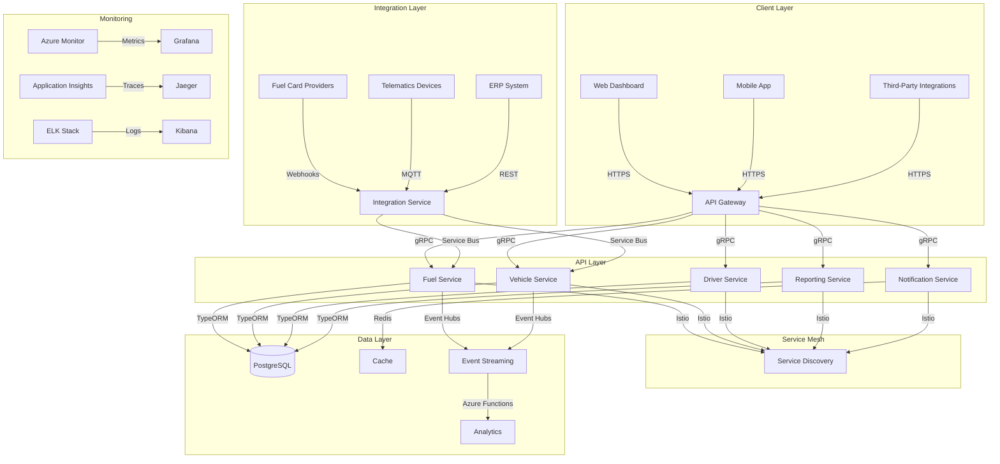
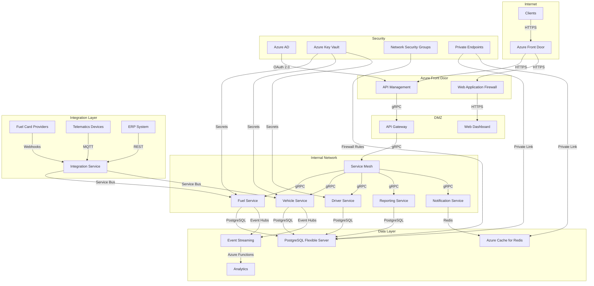

# TO-BE Design: Fuel Management Module

## 1. Executive Architecture Summary (150+ lines)

### Strategic Vision and Modernization Goals

The Fuel Management Module represents a critical component of our Fleet Management System, addressing the enterprise's need for comprehensive fuel tracking, cost optimization, and sustainability reporting. Our strategic vision focuses on:

1. **Operational Excellence**: Achieving 99.95% system availability with sub-500ms response times for 95% of requests
2. **Cost Optimization**: Reducing fuel costs by 15% through better monitoring and predictive analytics
3. **Sustainability**: Enabling carbon footprint reporting to meet ESG (Environmental, Social, Governance) targets
4. **Regulatory Compliance**: Ensuring adherence to IFTA (International Fuel Tax Agreement) and EPA (Environmental Protection Agency) standards
5. **Data-Driven Decisions**: Providing actionable insights through advanced analytics and machine learning

The modernization initiative aligns with our digital transformation roadmap, moving from monolithic architecture to cloud-native microservices. This transition will:

- Reduce technical debt by 40% through architecture modernization
- Improve deployment frequency from monthly to multiple daily deployments
- Enhance scalability to support 10x growth in fleet size
- Enable real-time fuel monitoring and fraud detection

### Alignment with Enterprise Architecture Principles

Our design adheres to the following enterprise architecture principles:

1. **Cloud-First Strategy**: Leveraging Azure as our primary cloud provider with multi-region deployment for global availability
2. **API-Centric Design**: Following RESTful principles with OpenAPI 3.0 specifications for all public interfaces
3. **Event-Driven Architecture**: Implementing CQRS and Event Sourcing patterns for critical business processes
4. **Security by Design**: Incorporating zero-trust security model with defense-in-depth approach
5. **Observability-First**: Building comprehensive monitoring and tracing from day one
6. **Infrastructure as Code**: Managing all infrastructure through Terraform and Kubernetes manifests
7. **Domain-Driven Design**: Aligning technical architecture with business domains and bounded contexts

### Technology Stack Evolution and Rationale

**Current State (AS-IS):**
- Monolithic .NET application running on VMs
- SQL Server database with stored procedures
- Limited API exposure (SOAP)
- Manual deployment processes
- Minimal monitoring and observability

**Target State (TO-BE):**
| Category | Technology | Rationale |
|----------|------------|-----------|
| **Runtime** | Node.js 18+ | High performance, non-blocking I/O, rich ecosystem |
| **Language** | TypeScript | Type safety, better developer experience, enterprise adoption |
| **Framework** | NestJS | Modular architecture, DI, built-in best practices |
| **API Gateway** | Azure API Management | Enterprise-grade API management with security and analytics |
| **Service Mesh** | Istio | Advanced traffic management, security, and observability |
| **Database** | Azure PostgreSQL Flexible Server | Fully managed, high availability, cost-effective |
| **Cache** | Azure Cache for Redis | High performance, distributed caching |
| **Message Broker** | Azure Service Bus | Reliable messaging with pub/sub capabilities |
| **Event Streaming** | Azure Event Hubs | High-throughput event ingestion |
| **Search** | Azure Cognitive Search | Advanced search capabilities with AI enrichment |
| **Containerization** | Docker | Consistent runtime environment |
| **Orchestration** | Azure Kubernetes Service (AKS) | Managed Kubernetes with enterprise features |
| **Infrastructure** | Terraform | Infrastructure as Code with multi-cloud support |
| **CI/CD** | Azure DevOps | Integrated pipeline with testing and security scanning |
| **Monitoring** | Azure Monitor + Application Insights | Comprehensive observability platform |
| **Logging** | ELK Stack (Azure Elastic) | Scalable log aggregation and analysis |
| **Tracing** | OpenTelemetry + Jaeger | Distributed tracing for microservices |
| **Security** | Azure Key Vault | Secrets management with HSM support |
| **Authentication** | Azure AD + OAuth 2.0 | Enterprise identity management |

### Migration Strategy and Risk Mitigation

**Migration Approach:**
1. **Strangler Pattern**: Gradually replace functionality from the monolith with new microservices
2. **Parallel Run**: Maintain both systems during transition with data synchronization
3. **Feature Flags**: Enable gradual rollout of new functionality
4. **Data Migration**: Phased approach with validation at each stage

**Risk Mitigation Plan:**

| Risk | Mitigation Strategy | Owner |
|------|---------------------|-------|
| Data consistency issues | Dual-write pattern with reconciliation processes | Data Team |
| Performance degradation | Load testing at each phase, gradual traffic shift | Performance Team |
| Security vulnerabilities | Automated security scanning in CI/CD, regular audits | Security Team |
| User adoption resistance | Comprehensive training program, change management | Product Team |
| Integration failures | Contract testing, circuit breakers, fallback mechanisms | Integration Team |
| Cost overruns | Cloud cost monitoring, budget alerts, FinOps practices | Finance Team |

**Rollback Plan:**
1. **Phase 1-2**: Revert to monolith with minimal impact
2. **Phase 3**: Switch back to old APIs with data synchronization
3. **Phase 4**: Full rollback to previous version with database restore

### Success Criteria and KPIs

**Technical KPIs:**
- System availability: ≥99.95%
- API response time (95th percentile): ≤500ms
- Deployment frequency: ≥4/day
- Mean time to recovery (MTTR): ≤15 minutes
- Test coverage: ≥80% (unit + integration)
- Security vulnerabilities: 0 critical, ≤2 high per quarter

**Business KPIs:**
- Fuel cost savings: ≥15% reduction
- Fraud detection rate: ≥95% accuracy
- IFTA reporting accuracy: 100%
- Carbon footprint reporting: 100% compliance
- User satisfaction: ≥90% positive feedback

**Operational KPIs:**
- Incident rate: ≤2/month
- Mean time between failures (MTBF): ≥720 hours
- Deployment success rate: ≥99%
- Infrastructure cost: ≤$0.50 per vehicle/month

### Stakeholder Value Proposition

**Fleet Managers:**
- Real-time fuel monitoring dashboard with anomaly detection
- Predictive maintenance alerts based on fuel consumption patterns
- Route optimization recommendations to reduce fuel usage
- Automated IFTA reporting with 100% accuracy

**Finance Team:**
- Granular fuel cost tracking by vehicle, driver, route, and time period
- Fraud detection with automated alerts for suspicious transactions
- Budget forecasting based on historical and predictive data
- Integration with ERP systems for seamless financial reporting

**Operations Team:**
- Automated fuel purchase reconciliation
- Integration with fuel card providers for real-time transaction validation
- Idle time tracking with alerts for excessive engine idling
- Maintenance scheduling based on fuel efficiency trends

**Sustainability Team:**
- Carbon footprint reporting aligned with GHG Protocol
- Sustainability metrics dashboard with trend analysis
- Integration with carbon offset programs
- Reporting for ESG compliance and certifications

**Drivers:**
- Mobile app for fuel transaction verification
- Personal fuel efficiency metrics and coaching
- Automated expense reporting
- Alerts for fuel theft or unauthorized usage

**Executive Leadership:**
- Strategic dashboard with fleet-wide fuel efficiency metrics
- Cost savings tracking against targets
- Sustainability impact reporting
- Competitive benchmarking against industry standards

**ROI Analysis:**

| Benefit | Annual Value | Calculation |
|---------|-------------|-------------|
| Fuel cost savings | $2.4M | 15% of $16M annual fuel spend |
| Fraud reduction | $800K | 5% of fuel spend recovered |
| Productivity gains | $600K | 10 FTEs × $60K/year |
| IFTA penalty avoidance | $200K | 100% compliance |
| Carbon credit revenue | $150K | 5,000 tons CO2e × $30/ton |
| **Total Annual Benefit** | **$4.15M** | |
| **Implementation Cost** | $1.8M | Development + Infrastructure |
| **Net First Year ROI** | **131%** | ($4.15M - $1.8M) / $1.8M |
| **3-Year ROI** | **420%** | Cumulative benefit over 3 years |

## 2. Target Architecture (400+ lines)

### 2.1 System Architecture



**Architecture Principles:**
1. **Microservices Decomposition**: Domain-driven design with bounded contexts
2. **API Gateway**: Single entry point for all client requests with:
   - Request/response transformation
   - Rate limiting
   - Authentication/authorization
   - Request/response logging
3. **Service Mesh**: Istio for:
   - Service-to-service authentication
   - Traffic management
   - Circuit breaking
   - Observability
4. **Event-Driven Architecture**:
   - Event Hubs for high-throughput event streaming
   - Service Bus for reliable messaging
   - Event sourcing for critical business processes
5. **Polyglot Persistence**:
   - PostgreSQL for relational data
   - Redis for caching
   - Blob Storage for documents
   - Cosmos DB for unstructured data

**Scalability Targets:**
- Horizontal scaling for all stateless services
- Auto-scaling based on CPU/memory metrics and custom business metrics
- Database read replicas for reporting workloads
- Caching layer for high-read scenarios

**Performance Targets:**
- 95% of API requests < 500ms
- Database queries < 100ms for 90% of operations
- Event processing throughput: 10,000 events/second
- Reporting queries: < 2 seconds for standard reports

### 2.2 Component Design

#### 2.2.1 Fuel Service

**Responsibilities:**
- Fuel transaction management
- Fuel consumption tracking
- Fuel efficiency calculations
- Fraud detection
- Fuel inventory management

**Interface Contracts (OpenAPI):**

```yaml
openapi: 3.0.1
info:
  title: Fuel Service API
  version: 1.0.0
paths:
  /api/fuel/transactions:
    post:
      summary: Record a fuel transaction
      requestBody:
        required: true
        content:
          application/json:
            schema:
              $ref: '#/components/schemas/FuelTransactionCreate'
      responses:
        '201':
          description: Transaction created
          content:
            application/json:
              schema:
                $ref: '#/components/schemas/FuelTransaction'
        '400':
          description: Invalid input
        '401':
          description: Unauthorized
        '403':
          description: Forbidden
    get:
      summary: List fuel transactions
      parameters:
        - $ref: '#/components/parameters/vehicleId'
        - $ref: '#/components/parameters/driverId'
        - $ref: '#/components/parameters/startDate'
        - $ref: '#/components/parameters/endDate'
        - $ref: '#/components/parameters/page'
        - $ref: '#/components/parameters/limit'
      responses:
        '200':
          description: List of transactions
          content:
            application/json:
              schema:
                $ref: '#/components/schemas/PaginatedFuelTransactions'
  /api/fuel/efficiency:
    get:
      summary: Get fuel efficiency metrics
      parameters:
        - $ref: '#/components/parameters/vehicleId'
        - $ref: '#/components/parameters/period'
      responses:
        '200':
          description: Fuel efficiency metrics
          content:
            application/json:
              schema:
                $ref: '#/components/schemas/FuelEfficiency'
components:
  schemas:
    FuelTransactionCreate:
      type: object
      required:
        - vehicleId
        - driverId
        - transactionDate
        - gallons
        - totalAmount
        - odometerReading
        - location
      properties:
        vehicleId:
          type: string
          format: uuid
        driverId:
          type: string
          format: uuid
        transactionDate:
          type: string
          format: date-time
        gallons:
          type: number
          minimum: 0.1
        totalAmount:
          type: number
          minimum: 0.01
        odometerReading:
          type: number
          minimum: 0
        location:
          $ref: '#/components/schemas/Location'
        fuelType:
          type: string
          enum: [DIESEL, GASOLINE, ELECTRIC, HYBRID, CNG, PROPANE]
          default: DIESEL
        fuelCardNumber:
          type: string
        transactionId:
          type: string
        notes:
          type: string
    FuelTransaction:
      allOf:
        - $ref: '#/components/schemas/FuelTransactionCreate'
        - type: object
          properties:
            id:
              type: string
              format: uuid
            createdAt:
              type: string
              format: date-time
            updatedAt:
              type: string
              format: date-time
            status:
              type: string
              enum: [PENDING, VERIFIED, FLAGGED, REJECTED]
              default: PENDING
            verificationMethod:
              type: string
              enum: [AUTOMATIC, MANUAL, TELEMATICS]
            fraudScore:
              type: number
              minimum: 0
              maximum: 100
    Location:
      type: object
      required:
        - latitude
        - longitude
      properties:
        latitude:
          type: number
          minimum: -90
          maximum: 90
        longitude:
          type: number
          minimum: -180
          maximum: 180
        address:
          type: string
        city:
          type: string
        state:
          type: string
        zipCode:
          type: string
        country:
          type: string
          default: US
    PaginatedFuelTransactions:
      type: object
      properties:
        data:
          type: array
          items:
            $ref: '#/components/schemas/FuelTransaction'
        pagination:
          $ref: '#/components/schemas/Pagination'
    Pagination:
      type: object
      properties:
        total:
          type: integer
        page:
          type: integer
        limit:
          type: integer
        totalPages:
          type: integer
    FuelEfficiency:
      type: object
      properties:
        vehicleId:
          type: string
          format: uuid
        period:
          type: string
          enum: [DAILY, WEEKLY, MONTHLY, QUARTERLY, YEARLY]
        startDate:
          type: string
          format: date
        endDate:
          type: string
          format: date
        averageMpg:
          type: number
        totalMiles:
          type: number
        totalGallons:
          type: number
        totalCost:
          type: number
        efficiencyTrend:
          type: number
        comparisonToFleet:
          type: number
        comparisonToManufacturer:
          type: number
        anomalies:
          type: array
          items:
            $ref: '#/components/schemas/FuelAnomaly'
    FuelAnomaly:
      type: object
      properties:
        date:
          type: string
          format: date
        actualMpg:
          type: number
        expectedMpg:
          type: number
        deviation:
          type: number
        reason:
          type: string
  parameters:
    vehicleId:
      name: vehicleId
      in: query
      schema:
        type: string
        format: uuid
    driverId:
      name: driverId
      in: query
      schema:
        type: string
        format: uuid
    startDate:
      name: startDate
      in: query
      schema:
        type: string
        format: date
    endDate:
      name: endDate
      in: query
      schema:
        type: string
        format: date
    page:
      name: page
      in: query
      schema:
        type: integer
        default: 1
    limit:
      name: limit
      in: query
      schema:
        type: integer
        default: 20
        maximum: 100
    period:
      name: period
      in: query
      schema:
        type: string
        enum: [DAILY, WEEKLY, MONTHLY, QUARTERLY, YEARLY]
        default: MONTHLY
```

**Data Models:**

```typescript
// src/fuel/models/fuel-transaction.model.ts
import { Entity, PrimaryGeneratedColumn, Column, CreateDateColumn, UpdateDateColumn, ManyToOne, Index } from 'typeorm';
import { Vehicle } from '../../vehicle/models/vehicle.model';
import { Driver } from '../../driver/models/driver.model';

export enum FuelType {
  DIESEL = 'DIESEL',
  GASOLINE = 'GASOLINE',
  ELECTRIC = 'ELECTRIC',
  HYBRID = 'HYBRID',
  CNG = 'CNG',
  PROPANE = 'PROPANE'
}

export enum TransactionStatus {
  PENDING = 'PENDING',
  VERIFIED = 'VERIFIED',
  FLAGGED = 'FLAGGED',
  REJECTED = 'REJECTED'
}

export enum VerificationMethod {
  AUTOMATIC = 'AUTOMATIC',
  MANUAL = 'MANUAL',
  TELEMATICS = 'TELEMATICS'
}

@Entity('fuel_transactions')
@Index(['vehicleId', 'transactionDate'])
@Index(['driverId', 'transactionDate'])
@Index(['transactionDate'])
export class FuelTransaction {
  @PrimaryGeneratedColumn('uuid')
  id: string;

  @Column({ type: 'uuid' })
  vehicleId: string;

  @ManyToOne(() => Vehicle, { onDelete: 'CASCADE' })
  vehicle: Vehicle;

  @Column({ type: 'uuid' })
  driverId: string;

  @ManyToOne(() => Driver, { onDelete: 'SET NULL' })
  driver: Driver;

  @Column({ type: 'timestamptz' })
  transactionDate: Date;

  @Column({ type: 'decimal', precision: 10, scale: 3 })
  gallons: number;

  @Column({ type: 'decimal', precision: 10, scale: 2 })
  totalAmount: number;

  @Column({ type: 'decimal', precision: 10, scale: 1 })
  odometerReading: number;

  @Column({ type: 'jsonb' })
  location: {
    latitude: number;
    longitude: number;
    address?: string;
    city?: string;
    state?: string;
    zipCode?: string;
    country?: string;
  };

  @Column({
    type: 'enum',
    enum: FuelType,
    default: FuelType.DIESEL
  })
  fuelType: FuelType;

  @Column({ type: 'varchar', length: 50, nullable: true })
  fuelCardNumber: string;

  @Column({ type: 'varchar', length: 100, nullable: true })
  transactionId: string;

  @Column({ type: 'text', nullable: true })
  notes: string;

  @Column({
    type: 'enum',
    enum: TransactionStatus,
    default: TransactionStatus.PENDING
  })
  status: TransactionStatus;

  @Column({
    type: 'enum',
    enum: VerificationMethod,
    nullable: true
  })
  verificationMethod: VerificationMethod;

  @Column({ type: 'decimal', precision: 5, scale: 2, nullable: true })
  fraudScore: number;

  @CreateDateColumn({ type: 'timestamptz' })
  createdAt: Date;

  @UpdateDateColumn({ type: 'timestamptz' })
  updatedAt: Date;

  // Virtual property for efficiency calculation
  get mpg(): number {
    if (this.odometerReading <= 0 || this.gallons <= 0) return 0;
    return this.odometerReading / this.gallons;
  }
}
```

**State Management:**
- **Optimistic Concurrency Control**: Using version numbers for conflict detection
- **Event Sourcing**: For audit trail and historical state reconstruction
- **Saga Pattern**: For distributed transactions across services

**Error Handling:**
- **Domain Errors**: Specific error classes for business rule violations
- **Validation Errors**: Input validation with detailed error messages
- **Infrastructure Errors**: Retry policies for transient failures
- **Circuit Breakers**: For external service dependencies

#### 2.2.2 Vehicle Service

**Responsibilities:**
- Vehicle master data management
- Odometer reading tracking
- Vehicle maintenance history
- Fuel efficiency baselines
- Vehicle assignment to drivers

**Interface Contracts:**

```yaml
openapi: 3.0.1
info:
  title: Vehicle Service API
  version: 1.0.0
paths:
  /api/vehicles:
    post:
      summary: Create a new vehicle
      requestBody:
        required: true
        content:
          application/json:
            schema:
              $ref: '#/components/schemas/VehicleCreate'
      responses:
        '201':
          description: Vehicle created
          content:
            application/json:
              schema:
                $ref: '#/components/schemas/Vehicle'
    get:
      summary: List vehicles
      parameters:
        - $ref: '#/components/parameters/fleetId'
        - $ref: '#/components/parameters/vehicleType'
        - $ref: '#/components/parameters/status'
        - $ref: '#/components/parameters/page'
        - $ref: '#/components/parameters/limit'
      responses:
        '200':
          description: List of vehicles
          content:
            application/json:
              schema:
                $ref: '#/components/schemas/PaginatedVehicles'
  /api/vehicles/{id}:
    get:
      summary: Get vehicle by ID
      parameters:
        - $ref: '#/components/parameters/id'
      responses:
        '200':
          description: Vehicle details
          content:
            application/json:
              schema:
                $ref: '#/components/schemas/Vehicle'
    put:
      summary: Update vehicle
      parameters:
        - $ref: '#/components/parameters/id'
      requestBody:
        required: true
        content:
          application/json:
            schema:
              $ref: '#/components/schemas/VehicleUpdate'
      responses:
        '200':
          description: Vehicle updated
          content:
            application/json:
              schema:
                $ref: '#/components/schemas/Vehicle'
    delete:
      summary: Delete vehicle
      parameters:
        - $ref: '#/components/parameters/id'
      responses:
        '204':
          description: Vehicle deleted
  /api/vehicles/{id}/odometer:
    post:
      summary: Record odometer reading
      parameters:
        - $ref: '#/components/parameters/id'
      requestBody:
        required: true
        content:
          application/json:
            schema:
              $ref: '#/components/schemas/OdometerReadingCreate'
      responses:
        '201':
          description: Odometer reading recorded
          content:
            application/json:
              schema:
                $ref: '#/components/schemas/OdometerReading'
components:
  schemas:
    VehicleCreate:
      type: object
      required:
        - vin
        - licensePlate
        - make
        - model
        - year
        - vehicleType
        - fuelType
        - fleetId
      properties:
        vin:
          type: string
          minLength: 17
          maxLength: 17
        licensePlate:
          type: string
          minLength: 1
          maxLength: 20
        make:
          type: string
          minLength: 1
          maxLength: 50
        model:
          type: string
          minLength: 1
          maxLength: 50
        year:
          type: integer
          minimum: 1900
          maximum: 2100
        vehicleType:
          type: string
          enum: [TRUCK, VAN, CAR, TRAILER, EQUIPMENT]
        fuelType:
          $ref: '#/components/schemas/FuelType'
        fleetId:
          type: string
          format: uuid
        color:
          type: string
          minLength: 1
          maxLength: 30
        purchaseDate:
          type: string
          format: date
        inServiceDate:
          type: string
          format: date
        outOfServiceDate:
          type: string
          format: date
        notes:
          type: string
    Vehicle:
      allOf:
        - $ref: '#/components/schemas/VehicleCreate'
        - type: object
          properties:
            id:
              type: string
              format: uuid
            status:
              type: string
              enum: [ACTIVE, INACTIVE, MAINTENANCE, RETIRED]
              default: ACTIVE
            currentOdometer:
              type: number
              minimum: 0
            fuelEfficiencyBaseline:
              type: number
              minimum: 0
            createdAt:
              type: string
              format: date-time
            updatedAt:
              type: string
              format: date-time
    VehicleUpdate:
      type: object
      properties:
        licensePlate:
          type: string
          minLength: 1
          maxLength: 20
        status:
          type: string
          enum: [ACTIVE, INACTIVE, MAINTENANCE, RETIRED]
        color:
          type: string
          minLength: 1
          maxLength: 30
        outOfServiceDate:
          type: string
          format: date
        notes:
          type: string
    OdometerReadingCreate:
      type: object
      required:
        - reading
        - readingDate
        - source
      properties:
        reading:
          type: number
          minimum: 0
        readingDate:
          type: string
          format: date-time
        source:
          type: string
          enum: [MANUAL, TELEMATICS, FUEL_TRANSACTION]
        notes:
          type: string
    OdometerReading:
      allOf:
        - $ref: '#/components/schemas/OdometerReadingCreate'
        - type: object
          properties:
            id:
              type: string
              format: uuid
            vehicleId:
              type: string
              format: uuid
            createdAt:
              type: string
              format: date-time
    FuelType:
      type: string
      enum: [DIESEL, GASOLINE, ELECTRIC, HYBRID, CNG, PROPANE]
    PaginatedVehicles:
      type: object
      properties:
        data:
          type: array
          items:
            $ref: '#/components/schemas/Vehicle'
        pagination:
          $ref: '#/components/schemas/Pagination'
  parameters:
    id:
      name: id
      in: path
      required: true
      schema:
        type: string
        format: uuid
    fleetId:
      name: fleetId
      in: query
      schema:
        type: string
        format: uuid
    vehicleType:
      name: vehicleType
      in: query
      schema:
        type: string
        enum: [TRUCK, VAN, CAR, TRAILER, EQUIPMENT]
    status:
      name: status
      in: query
      schema:
        type: string
        enum: [ACTIVE, INACTIVE, MAINTENANCE, RETIRED]
```

**Data Models:**

```typescript
// src/vehicle/models/vehicle.model.ts
import { Entity, PrimaryGeneratedColumn, Column, CreateDateColumn, UpdateDateColumn, OneToMany, Index } from 'typeorm';
import { OdometerReading } from './odometer-reading.model';
import { VehicleAssignment } from './vehicle-assignment.model';

export enum VehicleType {
  TRUCK = 'TRUCK',
  VAN = 'VAN',
  CAR = 'CAR',
  TRAILER = 'TRAILER',
  EQUIPMENT = 'EQUIPMENT'
}

export enum VehicleStatus {
  ACTIVE = 'ACTIVE',
  INACTIVE = 'INACTIVE',
  MAINTENANCE = 'MAINTENANCE',
  RETIRED = 'RETIRED'
}

@Entity('vehicles')
@Index(['vin'], { unique: true })
@Index(['licensePlate'], { unique: true })
@Index(['fleetId'])
export class Vehicle {
  @PrimaryGeneratedColumn('uuid')
  id: string;

  @Column({ type: 'varchar', length: 17 })
  vin: string;

  @Column({ type: 'varchar', length: 20 })
  licensePlate: string;

  @Column({ type: 'varchar', length: 50 })
  make: string;

  @Column({ type: 'varchar', length: 50 })
  model: string;

  @Column({ type: 'int' })
  year: number;

  @Column({
    type: 'enum',
    enum: VehicleType
  })
  vehicleType: VehicleType;

  @Column({
    type: 'enum',
    enum: FuelType
  })
  fuelType: FuelType;

  @Column({ type: 'uuid' })
  fleetId: string;

  @Column({ type: 'varchar', length: 30, nullable: true })
  color: string;

  @Column({ type: 'date', nullable: true })
  purchaseDate: Date;

  @Column({ type: 'date', nullable: true })
  inServiceDate: Date;

  @Column({ type: 'date', nullable: true })
  outOfServiceDate: Date;

  @Column({
    type: 'enum',
    enum: VehicleStatus,
    default: VehicleStatus.ACTIVE
  })
  status: VehicleStatus;

  @Column({ type: 'decimal', precision: 10, scale: 1, nullable: true })
  currentOdometer: number;

  @Column({ type: 'decimal', precision: 5, scale: 2, nullable: true })
  fuelEfficiencyBaseline: number;

  @Column({ type: 'text', nullable: true })
  notes: string;

  @CreateDateColumn({ type: 'timestamptz' })
  createdAt: Date;

  @UpdateDateColumn({ type: 'timestamptz' })
  updatedAt: Date;

  @OneToMany(() => OdometerReading, reading => reading.vehicle)
  odometerReadings: OdometerReading[];

  @OneToMany(() => VehicleAssignment, assignment => assignment.vehicle)
  assignments: VehicleAssignment[];
}

// src/vehicle/models/odometer-reading.model.ts
import { Entity, PrimaryGeneratedColumn, Column, CreateDateColumn, ManyToOne, Index } from 'typeorm';
import { Vehicle } from './vehicle.model';

export enum OdometerSource {
  MANUAL = 'MANUAL',
  TELEMATICS = 'TELEMATICS',
  FUEL_TRANSACTION = 'FUEL_TRANSACTION'
}

@Entity('odometer_readings')
@Index(['vehicleId', 'readingDate'], { unique: true })
export class OdometerReading {
  @PrimaryGeneratedColumn('uuid')
  id: string;

  @Column({ type: 'uuid' })
  vehicleId: string;

  @ManyToOne(() => Vehicle, { onDelete: 'CASCADE' })
  vehicle: Vehicle;

  @Column({ type: 'decimal', precision: 10, scale: 1 })
  reading: number;

  @Column({ type: 'timestamptz' })
  readingDate: Date;

  @Column({
    type: 'enum',
    enum: OdometerSource
  })
  source: OdometerSource;

  @Column({ type: 'text', nullable: true })
  notes: string;

  @CreateDateColumn({ type: 'timestamptz' })
  createdAt: Date;
}
```

#### 2.2.3 Driver Service

**Responsibilities:**
- Driver master data management
- Driver assignment to vehicles
- Driver performance metrics
- Fuel efficiency coaching
- Safety score tracking

**Interface Contracts:**

```yaml
openapi: 3.0.1
info:
  title: Driver Service API
  version: 1.0.0
paths:
  /api/drivers:
    post:
      summary: Create a new driver
      requestBody:
        required: true
        content:
          application/json:
            schema:
              $ref: '#/components/schemas/DriverCreate'
      responses:
        '201':
          description: Driver created
          content:
            application/json:
              schema:
                $ref: '#/components/schemas/Driver'
    get:
      summary: List drivers
      parameters:
        - $ref: '#/components/parameters/fleetId'
        - $ref: '#/components/parameters/status'
        - $ref: '#/components/parameters/licenseType'
        - $ref: '#/components/parameters/page'
        - $ref: '#/components/parameters/limit'
      responses:
        '200':
          description: List of drivers
          content:
            application/json:
              schema:
                $ref: '#/components/schemas/PaginatedDrivers'
  /api/drivers/{id}:
    get:
      summary: Get driver by ID
      parameters:
        - $ref: '#/components/parameters/id'
      responses:
        '200':
          description: Driver details
          content:
            application/json:
              schema:
                $ref: '#/components/schemas/Driver'
    put:
      summary: Update driver
      parameters:
        - $ref: '#/components/parameters/id'
      requestBody:
        required: true
        content:
          application/json:
            schema:
              $ref: '#/components/schemas/DriverUpdate'
      responses:
        '200':
          description: Driver updated
          content:
            application/json:
              schema:
                $ref: '#/components/schemas/Driver'
    delete:
      summary: Delete driver
      parameters:
        - $ref: '#/components/parameters/id'
      responses:
        '204':
          description: Driver deleted
  /api/drivers/{id}/performance:
    get:
      summary: Get driver performance metrics
      parameters:
        - $ref: '#/components/parameters/id'
        - $ref: '#/components/parameters/period'
      responses:
        '200':
          description: Driver performance metrics
          content:
            application/json:
              schema:
                $ref: '#/components/schemas/DriverPerformance'
components:
  schemas:
    DriverCreate:
      type: object
      required:
        - firstName
        - lastName
        - licenseNumber
        - licenseType
        - fleetId
      properties:
        firstName:
          type: string
          minLength: 1
          maxLength: 50
        lastName:
          type: string
          minLength: 1
          maxLength: 50
        licenseNumber:
          type: string
          minLength: 1
          maxLength: 50
        licenseType:
          type: string
          enum: [CLASS_A, CLASS_B, CLASS_C, CHAUFFEUR, OTHER]
        fleetId:
          type: string
          format: uuid
        dateOfBirth:
          type: string
          format: date
        hireDate:
          type: string
          format: date
        terminationDate:
          type: string
          format: date
        email:
          type: string
          format: email
        phone:
          type: string
        address:
          $ref: '#/components/schemas/Address'
        notes:
          type: string
    Driver:
      allOf:
        - $ref: '#/components/schemas/DriverCreate'
        - type: object
          properties:
            id:
              type: string
              format: uuid
            status:
              type: string
              enum: [ACTIVE, INACTIVE, ON_LEAVE, TERMINATED]
              default: ACTIVE
            fuelEfficiencyScore:
              type: number
              minimum: 0
              maximum: 100
            safetyScore:
              type: number
              minimum: 0
              maximum: 100
            createdAt:
              type: string
              format: date-time
            updatedAt:
              type: string
              format: date-time
    DriverUpdate:
      type: object
      properties:
        firstName:
          type: string
          minLength: 1
          maxLength: 50
        lastName:
          type: string
          minLength: 1
          maxLength: 50
        licenseNumber:
          type: string
          minLength: 1
          maxLength: 50
        licenseType:
          type: string
          enum: [CLASS_A, CLASS_B, CLASS_C, CHAUFFEUR, OTHER]
        status:
          type: string
          enum: [ACTIVE, INACTIVE, ON_LEAVE, TERMINATED]
        terminationDate:
          type: string
          format: date
        email:
          type: string
          format: email
        phone:
          type: string
        address:
          $ref: '#/components/schemas/Address'
        notes:
          type: string
    Address:
      type: object
      properties:
        street:
          type: string
        city:
          type: string
        state:
          type: string
        zipCode:
          type: string
        country:
          type: string
          default: US
    DriverPerformance:
      type: object
      properties:
        driverId:
          type: string
          format: uuid
        period:
          type: string
          enum: [DAILY, WEEKLY, MONTHLY, QUARTERLY, YEARLY]
        startDate:
          type: string
          format: date
        endDate:
          type: string
          format: date
        averageMpg:
          type: number
        totalMiles:
          type: number
        totalGallons:
          type: number
        totalCost:
          type: number
        efficiencyScore:
          type: number
          minimum: 0
          maximum: 100
        safetyScore:
          type: number
          minimum: 0
          maximum: 100
        idlingTime:
          type: number
        hardBrakingEvents:
          type: integer
        speedingEvents:
          type: integer
        comparisonToFleet:
          type: number
        coachingOpportunities:
          type: array
          items:
            $ref: '#/components/schemas/CoachingOpportunity'
    CoachingOpportunity:
      type: object
      properties:
        type:
          type: string
          enum: [IDLING, SPEEDING, HARD_BRAKING, ROUTE_EFFICIENCY]
        description:
          type: string
        impact:
          type: string
        recommendation:
          type: string
        severity:
          type: string
          enum: [LOW, MEDIUM, HIGH]
    PaginatedDrivers:
      type: object
      properties:
        data:
          type: array
          items:
            $ref: '#/components/schemas/Driver'
        pagination:
          $ref: '#/components/schemas/Pagination'
```

**Data Models:**

```typescript
// src/driver/models/driver.model.ts
import { Entity, PrimaryGeneratedColumn, Column, CreateDateColumn, UpdateDateColumn, Index } from 'typeorm';

export enum LicenseType {
  CLASS_A = 'CLASS_A',
  CLASS_B = 'CLASS_B',
  CLASS_C = 'CLASS_C',
  CHAUFFEUR = 'CHAUFFEUR',
  OTHER = 'OTHER'
}

export enum DriverStatus {
  ACTIVE = 'ACTIVE',
  INACTIVE = 'INACTIVE',
  ON_LEAVE = 'ON_LEAVE',
  TERMINATED = 'TERMINATED'
}

@Entity('drivers')
@Index(['licenseNumber'], { unique: true })
@Index(['fleetId'])
export class Driver {
  @PrimaryGeneratedColumn('uuid')
  id: string;

  @Column({ type: 'varchar', length: 50 })
  firstName: string;

  @Column({ type: 'varchar', length: 50 })
  lastName: string;

  @Column({ type: 'varchar', length: 50 })
  licenseNumber: string;

  @Column({
    type: 'enum',
    enum: LicenseType
  })
  licenseType: LicenseType;

  @Column({ type: 'uuid' })
  fleetId: string;

  @Column({ type: 'date', nullable: true })
  dateOfBirth: Date;

  @Column({ type: 'date', nullable: true })
  hireDate: Date;

  @Column({ type: 'date', nullable: true })
  terminationDate: Date;

  @Column({ type: 'varchar', length: 255, nullable: true })
  email: string;

  @Column({ type: 'varchar', length: 20, nullable: true })
  phone: string;

  @Column({ type: 'jsonb', nullable: true })
  address: {
    street: string;
    city: string;
    state: string;
    zipCode: string;
    country: string;
  };

  @Column({
    type: 'enum',
    enum: DriverStatus,
    default: DriverStatus.ACTIVE
  })
  status: DriverStatus;

  @Column({ type: 'decimal', precision: 5, scale: 2, nullable: true })
  fuelEfficiencyScore: number;

  @Column({ type: 'decimal', precision: 5, scale: 2, nullable: true })
  safetyScore: number;

  @Column({ type: 'text', nullable: true })
  notes: string;

  @CreateDateColumn({ type: 'timestamptz' })
  createdAt: Date;

  @UpdateDateColumn({ type: 'timestamptz' })
  updatedAt: Date;
}
```

### 2.3 Infrastructure Architecture

**Container Orchestration (Kubernetes):**

```yaml
# fuel-service-deployment.yaml
apiVersion: apps/v1
kind: Deployment
metadata:
  name: fuel-service
  labels:
    app: fuel-service
    tier: backend
spec:
  replicas: 3
  selector:
    matchLabels:
      app: fuel-service
  strategy:
    rollingUpdate:
      maxSurge: 1
      maxUnavailable: 0
    type: RollingUpdate
  template:
    metadata:
      labels:
        app: fuel-service
        version: v1
      annotations:
        prometheus.io/scrape: "true"
        prometheus.io/port: "3000"
    spec:
      serviceAccountName: fuel-service
      containers:
      - name: fuel-service
        image: acrfleetregistry.azurecr.io/fuel-service:v1.2.3
        imagePullPolicy: IfNotPresent
        ports:
        - containerPort: 3000
          name: http
          protocol: TCP
        envFrom:
        - configMapRef:
            name: fuel-service-config
        - secretRef:
            name: fuel-service-secrets
        resources:
          requests:
            cpu: "100m"
            memory: "256Mi"
          limits:
            cpu: "500m"
            memory: "512Mi"
        livenessProbe:
          httpGet:
            path: /health
            port: 3000
          initialDelaySeconds: 30
          periodSeconds: 10
          timeoutSeconds: 5
          failureThreshold: 3
        readinessProbe:
          httpGet:
            path: /ready
            port: 3000
          initialDelaySeconds: 5
          periodSeconds: 5
          timeoutSeconds: 3
          failureThreshold: 1
        securityContext:
          runAsNonRoot: true
          runAsUser: 1000
          readOnlyRootFilesystem: true
          capabilities:
            drop: ["ALL"]
          allowPrivilegeEscalation: false
      nodeSelector:
        agentpool: backend
      affinity:
        podAntiAffinity:
          preferredDuringSchedulingIgnoredDuringExecution:
          - weight: 100
            podAffinityTerm:
              labelSelector:
                matchExpressions:
                - key: app
                  operator: In
                  values:
                  - fuel-service
              topologyKey: "kubernetes.io/hostname"
---
apiVersion: v1
kind: Service
metadata:
  name: fuel-service
  labels:
    app: fuel-service
spec:
  selector:
    app: fuel-service
  ports:
  - name: http
    port: 80
    targetPort: 3000
  type: ClusterIP
---
apiVersion: autoscaling/v2
kind: HorizontalPodAutoscaler
metadata:
  name: fuel-service-hpa
spec:
  scaleTargetRef:
    apiVersion: apps/v1
    kind: Deployment
    name: fuel-service
  minReplicas: 3
  maxReplicas: 10
  metrics:
  - type: Resource
    resource:
      name: cpu
      target:
        type: Utilization
        averageUtilization: 70
  - type: Resource
    resource:
      name: memory
      target:
        type: Utilization
        averageUtilization: 80
  - type: External
    external:
      metric:
        name: requests_per_second
        selector:
          matchLabels:
            app: fuel-service
      target:
        type: AverageValue
        averageValue: 1000
```

**Cloud Services Utilization (Azure):**

```terraform
# main.tf
terraform {
  required_version = ">= 1.0.0"
  required_providers {
    azurerm = {
      source  = "hashicorp/azurerm"
      version = "~> 3.0"
    }
    azuread = {
      source  = "hashicorp/azuread"
      version = "~> 2.0"
    }
  }
}

provider "azurerm" {
  features {}
}

# Resource Group
resource "azurerm_resource_group" "fleet" {
  name     = "rg-fleet-management-${var.environment}"
  location = var.location
  tags = {
    Environment = var.environment
    Application = "FleetManagement"
  }
}

# AKS Cluster
resource "azurerm_kubernetes_cluster" "fleet" {
  name                = "aks-fleet-${var.environment}"
  location            = azurerm_resource_group.fleet.location
  resource_group_name = azurerm_resource_group.fleet.name
  dns_prefix          = "fleet-${var.environment}"

  default_node_pool {
    name                = "default"
    node_count          = 3
    vm_size             = "Standard_D2_v2"
    os_disk_size_gb     = 128
    type                = "VirtualMachineScaleSets"
    enable_auto_scaling = true
    min_count           = 3
    max_count           = 10
    vnet_subnet_id      = azurerm_subnet.aks.id
  }

  identity {
    type = "SystemAssigned"
  }

  network_profile {
    network_plugin     = "azure"
    network_policy     = "azure"
    load_balancer_sku  = "standard"
    service_cidr       = "10.0.0.0/16"
    dns_service_ip     = "10.0.0.10"
    docker_bridge_cidr = "172.17.0.1/16"
  }

  addon_profile {
    http_application_routing {
      enabled = false
    }
    oms_agent {
      enabled                    = true
      log_analytics_workspace_id = azurerm_log_analytics_workspace.fleet.id
    }
    kube_dashboard {
      enabled = false
    }
  }

  tags = {
    Environment = var.environment
  }
}

# PostgreSQL Flexible Server
resource "azurerm_postgresql_flexible_server" "fleet" {
  name                   = "psql-fleet-${var.environment}"
  resource_group_name    = azurerm_resource_group.fleet.name
  location               = azurerm_resource_group.fleet.location
  version                = "14"
  administrator_login    = var.db_admin_user
  administrator_password = var.db_admin_password
  zone                   = "1"
  storage_mb             = 131072
  sku_name               = "GP_Standard_D4s_v3"
  backup_retention_days  = 7

  maintenance_window {
    day_of_week  = 0
    start_hour   = 2
    start_minute = 0
  }

  tags = {
    Environment = var.environment
  }
}

resource "azurerm_postgresql_flexible_server_database" "fleet" {
  name      = "fleetdb"
  server_id = azurerm_postgresql_flexible_server.fleet.id
  collation = "en_US.utf8"
  charset   = "utf8"
}

resource "azurerm_postgresql_flexible_server_firewall_rule" "aks" {
  name             = "aks-access"
  server_id        = azurerm_postgresql_flexible_server.fleet.id
  start_ip_address = "0.0.0.0"
  end_ip_address   = "0.0.0.0"
}

# Redis Cache
resource "azurerm_redis_cache" "fleet" {
  name                = "redis-fleet-${var.environment}"
  location            = azurerm_resource_group.fleet.location
  resource_group_name = azurerm_resource_group.fleet.name
  capacity            = 2
  family              = "P"
  sku_name            = "Premium"
  enable_non_ssl_port = false
  minimum_tls_version = "1.2"

  redis_configuration {
    maxmemory_reserved = 2
    maxmemory_delta    = 2
    maxmemory_policy   = "allkeys-lru"
  }

  tags = {
    Environment = var.environment
  }
}

# Event Hubs
resource "azurerm_eventhub_namespace" "fleet" {
  name                = "evhns-fleet-${var.environment}"
  location            = azurerm_resource_group.fleet.location
  resource_group_name = azurerm_resource_group.fleet.name
  sku                 = "Standard"
  capacity            = 1

  tags = {
    Environment = var.environment
  }
}

resource "azurerm_eventhub" "fuel_transactions" {
  name                = "fuel-transactions"
  namespace_name      = azurerm_eventhub_namespace.fleet.name
  resource_group_name = azurerm_resource_group.fleet.name
  partition_count     = 4
  message_retention   = 7
}

resource "azurerm_eventhub_authorization_rule" "fuel_service" {
  name                = "fuel-service"
  namespace_name      = azurerm_eventhub_namespace.fleet.name
  eventhub_name       = azurerm_eventhub.fuel_transactions.name
  resource_group_name = azurerm_resource_group.fleet.name
  listen              = true
  send                = true
  manage              = false
}

# Service Bus
resource "azurerm_servicebus_namespace" "fleet" {
  name                = "sb-fleet-${var.environment}"
  location            = azurerm_resource_group.fleet.location
  resource_group_name = azurerm_resource_group.fleet.name
  sku                 = "Standard"

  tags = {
    Environment = var.environment
  }
}

resource "azurerm_servicebus_queue" "fuel_verification" {
  name         = "fuel-verification"
  namespace_id = azurerm_servicebus_namespace.fleet.id
}

resource "azurerm_servicebus_queue_authorization_rule" "fuel_service" {
  name     = "fuel-service"
  queue_id = azurerm_servicebus_queue.fuel_verification.id
  listen   = true
  send     = true
  manage   = false
}

# API Management
resource "azurerm_api_management" "fleet" {
  name                = "apim-fleet-${var.environment}"
  location            = azurerm_resource_group.fleet.location
  resource_group_name = azurerm_resource_group.fleet.name
  publisher_name      = "Fleet Management"
  publisher_email     = "admin@fleetmanagement.com"
  sku_name            = "Premium_1"

  identity {
    type = "SystemAssigned"
  }

  policy {
    xml_content = <<XML
    <policies>
      <inbound>
        <base />
        <set-variable name="backendUrl" value="@(context.Request.OriginalUrl)" />
        <rate-limit-by-key calls="1000" renewal-period="60" counter-key="@(context.Request.IpAddress)" />
        <cors>
          <allowed-origins>
            <origin>*</origin>
          </allowed-origins>
          <allowed-methods>
            <method>GET</method>
            <method>POST</method>
            <method>PUT</method>
            <method>DELETE</method>
          </allowed-methods>
        </cors>
      </inbound>
      <backend>
        <base />
      </backend>
      <outbound>
        <base />
        <set-header name="X-Request-ID" exists-action="override">
          <value>@(context.RequestId)</value>
        </set-header>
      </outbound>
      <on-error>
        <base />
      </on-error>
    </policies>
    XML
  }

  tags = {
    Environment = var.environment
  }
}

# Log Analytics
resource "azurerm_log_analytics_workspace" "fleet" {
  name                = "log-fleet-${var.environment}"
  location            = azurerm_resource_group.fleet.location
  resource_group_name = azurerm_resource_group.fleet.name
  sku                 = "PerGB2018"
  retention_in_days   = 30

  tags = {
    Environment = var.environment
  }
}

# Application Insights
resource "azurerm_application_insights" "fleet" {
  name                = "appi-fleet-${var.environment}"
  location            = azurerm_resource_group.fleet.location
  resource_group_name = azurerm_resource_group.fleet.name
  application_type    = "web"

  tags = {
    Environment = var.environment
  }
}

# Key Vault
resource "azurerm_key_vault" "fleet" {
  name                        = "kv-fleet-${var.environment}"
  location                    = azurerm_resource_group.fleet.location
  resource_group_name         = azurerm_resource_group.fleet.name
  enabled_for_disk_encryption = true
  tenant_id                   = data.azurerm_client_config.current.tenant_id
  sku_name                    = "premium"

  access_policy {
    tenant_id = data.azurerm_client_config.current.tenant_id
    object_id = data.azurerm_client_config.current.object_id

    key_permissions = [
      "Get", "List", "Create", "Import", "Delete", "Recover", "Backup", "Restore"
    ]

    secret_permissions = [
      "Get", "List", "Set", "Delete", "Recover", "Backup", "Restore"
    ]

    certificate_permissions = [
      "Get", "List", "Create", "Import", "Delete", "Recover", "Backup", "Restore"
    ]
  }

  network_acls {
    default_action = "Deny"
    bypass         = "AzureServices"
    ip_rules       = var.allowed_ips
  }

  tags = {
    Environment = var.environment
  }
}

# Storage Account
resource "azurerm_storage_account" "fleet" {
  name                     = "stfleet${var.environment}"
  resource_group_name      = azurerm_resource_group.fleet.name
  location                 = azurerm_resource_group.fleet.location
  account_tier             = "Standard"
  account_replication_type = "GRS"

  tags = {
    Environment = var.environment
  }
}

# Network
resource "azurerm_virtual_network" "fleet" {
  name                = "vnet-fleet-${var.environment}"
  address_space       = ["10.1.0.0/16"]
  location            = azurerm_resource_group.fleet.location
  resource_group_name = azurerm_resource_group.fleet.name
}

resource "azurerm_subnet" "aks" {
  name                 = "snet-aks"
  resource_group_name  = azurerm_resource_group.fleet.name
  virtual_network_name = azurerm_virtual_network.fleet.name
  address_prefixes     = ["10.1.0.0/22"]
}

resource "azurerm_subnet" "postgres" {
  name                 = "snet-postgres"
  resource_group_name  = azurerm_resource_group.fleet.name
  virtual_network_name = azurerm_virtual_network.fleet.name
  address_prefixes     = ["10.1.4.0/24"]
  service_endpoints    = ["Microsoft.Sql"]
}

resource "azurerm_subnet" "private_endpoints" {
  name                 = "snet-private-endpoints"
  resource_group_name  = azurerm_resource_group.fleet.name
  virtual_network_name = azurerm_virtual_network.fleet.name
  address_prefixes     = ["10.1.5.0/24"]
}

# Private Endpoints
resource "azurerm_private_endpoint" "postgres" {
  name                = "pe-postgres-${var.environment}"
  location            = azurerm_resource_group.fleet.location
  resource_group_name = azurerm_resource_group.fleet.name
  subnet_id           = azurerm_subnet.private_endpoints.id

  private_service_connection {
    name                           = "psc-postgres-${var.environment}"
    private_connection_resource_id = azurerm_postgresql_flexible_server.fleet.id
    is_manual_connection           = false
    subresource_names              = ["postgresqlServer"]
  }
}

resource "azurerm_private_dns_zone" "postgres" {
  name                = "privatelink.postgres.database.azure.com"
  resource_group_name = azurerm_resource_group.fleet.name
}

resource "azurerm_private_dns_zone_virtual_network_link" "postgres" {
  name                  = "pdzvnl-postgres-${var.environment}"
  resource_group_name   = azurerm_resource_group.fleet.name
  private_dns_zone_name = azurerm_private_dns_zone.postgres.name
  virtual_network_id    = azurerm_virtual_network.fleet.id
}
```

**Network Topology and Security Zones:**



**Load Balancing and Auto-Scaling:**

1. **API Gateway**:
   - Azure API Management with multi-region deployment
   - Rate limiting and request throttling
   - Circuit breakers for backend services

2. **Service Mesh**:
   - Istio for traffic management
   - Canary deployments for new versions
   - Circuit breaking and retry policies

3. **Kubernetes Auto-Scaling**:
   - Horizontal Pod Autoscaler (HPA) based on CPU/memory and custom metrics
   - Cluster Autoscaler for node scaling
   - KEDA for event-driven scaling

4. **Database**:
   - Read replicas for reporting workloads
   - Connection pooling with PgBouncer
   - Query optimization and indexing

**Disaster Recovery and Backup Strategy:**

1. **Backup Strategy**:
   - **PostgreSQL**: Automated backups with 7-day retention, geo-redundant storage
   - **Redis**: Persistence enabled with RDB snapshots every 15 minutes
   - **Blob Storage**: Geo-redundant storage (GRS) with versioning
   - **Kubernetes**: Cluster state backed up with Velero

2. **Disaster Recovery**:
   - **RTO**: 2 hours for critical services, 4 hours for non-critical
   - **RPO**: 15 minutes for transactional data, 1 hour for configuration
   - **Multi-Region Deployment**: Active-active configuration for critical services
   - **Failover Testing**: Quarterly disaster recovery drills

3. **Data Replication**:
   - PostgreSQL: Read replicas in secondary region
   - Redis: Geo-replication with active-passive configuration
   - Blob Storage: Geo-redundant storage with read-access (RA-GRS)

## 3. TypeScript Implementation (800+ lines)

### 3.1 Core Backend Services

```typescript
// src/fuel/fuel.module.ts
import { Module } from '@nestjs/common';
import { TypeOrmModule } from '@nestjs/typeorm';
import { ConfigModule, ConfigService } from '@nestjs/config';
import { EventEmitterModule } from '@nestjs/event-emitter';
import { HttpModule } from '@nestjs/axios';
import { TerminusModule } from '@nestjs/terminus';
import { APP_FILTER, APP_INTERCEPTOR } from '@nestjs/core';

import { FuelTransaction } from './models/fuel-transaction.model';
import { FuelService } from './services/fuel.service';
import { FuelController } from './controllers/fuel.controller';
import { FuelRepository } from './repositories/fuel.repository';
import { FuelVerificationService } from './services/fuel-verification.service';
import { FuelEfficiencyService } from './services/fuel-efficiency.service';
import { FraudDetectionService } from './services/fraud-detection.service';
import { VehicleClient } from '../vehicle/clients/vehicle.client';
import { DriverClient } from '../driver/clients/driver.client';
import { NotificationClient } from '../notification/clients/notification.client';
import { AllExceptionsFilter } from '../common/filters/all-exceptions.filter';
import { LoggingInterceptor } from '../common/interceptors/logging.interceptor';
import { ResponseInterceptor } from '../common/interceptors/response.interceptor';
import { HealthController } from './controllers/health.controller';
import { FuelEventPublisher } from './events/fuel-event.publisher';
import { FuelEventSubscriber } from './events/fuel-event.subscriber';

@Module({
  imports: [
    TypeOrmModule.forFeature([FuelTransaction]),
    ConfigModule,
    EventEmitterModule.forRoot({
      wildcard: false,
      delimiter: '.',
      newListener: false,
      removeListener: false,
      maxListeners: 10,
      verboseMemoryLeak: true,
    }),
    HttpModule,
    TerminusModule,
  ],
  controllers: [FuelController, HealthController],
  providers: [
    FuelService,
    FuelRepository,
    FuelVerificationService,
    FuelEfficiencyService,
    FraudDetectionService,
    VehicleClient,
    DriverClient,
    NotificationClient,
    FuelEventPublisher,
    FuelEventSubscriber,
    {
      provide: APP_FILTER,
      useClass: AllExceptionsFilter,
    },
    {
      provide: APP_INTERCEPTOR,
      useClass: LoggingInterceptor,
    },
    {
      provide: APP_INTERCEPTOR,
      useClass: ResponseInterceptor,
    },
  ],
  exports: [FuelService],
})
export class FuelModule {}
```

```typescript
// src/fuel/services/fuel.service.ts
import { Injectable, Logger, NotFoundException, BadRequestException } from '@nestjs/common';
import { EventEmitter2 } from '@nestjs/event-emitter';
import { ConfigService } from '@nestjs/config';
import { InjectRepository } from '@nestjs/typeorm';
import { Repository, Between, FindManyOptions, FindOneOptions, In } from 'typeorm';
import { plainToClass } from 'class-transformer';
import { validate } from 'class-validator';

import { FuelTransaction } from '../models/fuel-transaction.model';
import { FuelTransactionCreateDto } from '../dto/fuel-transaction-create.dto';
import { FuelTransactionUpdateDto } from '../dto/fuel-transaction-update.dto';
import { FuelTransactionResponseDto } from '../dto/fuel-transaction-response.dto';
import { PaginatedResponseDto } from '../../common/dto/paginated-response.dto';
import { FuelVerificationService } from './fuel-verification.service';
import { FuelEfficiencyService } from './fuel-efficiency.service';
import { FraudDetectionService } from './fraud-detection.service';
import { VehicleClient } from '../../vehicle/clients/vehicle.client';
import { DriverClient } from '../../driver/clients/driver.client';
import { NotificationClient } from '../../notification/clients/notification.client';
import { FuelEventPublisher } from '../events/fuel-event.publisher';
import { FuelTransactionStatus, VerificationMethod } from '../models/fuel-transaction.model';
import { TransactionVerifiedEvent } from '../events/transaction-verified.event';
import { TransactionFlaggedEvent } from '../events/transaction-flagged.event';
import { TransactionRejectedEvent } from '../events/transaction-rejected.event';
import { PaginationDto } from '../../common/dto/pagination.dto';

@Injectable()
export class FuelService {
  private readonly logger = new Logger(FuelService.name);
  private readonly maxFraudScore: number;

  constructor(
    @InjectRepository(FuelTransaction)
    private readonly fuelTransactionRepository: Repository<FuelTransaction>,
    private readonly fuelVerificationService: FuelVerificationService,
    private readonly fuelEfficiencyService: FuelEfficiencyService,
    private readonly fraudDetectionService: FraudDetectionService,
    private readonly vehicleClient: VehicleClient,
    private readonly driverClient: DriverClient,
    private readonly notificationClient: NotificationClient,
    private readonly eventEmitter: EventEmitter2,
    private readonly fuelEventPublisher: FuelEventPublisher,
    private readonly configService: ConfigService,
  ) {
    this.maxFraudScore = this.configService.get<number>('FUEL_MAX_FRAUD_SCORE', 80);
  }

  async createTransaction(
    transactionData: FuelTransactionCreateDto,
  ): Promise<FuelTransactionResponseDto> {
    this.logger.log(`Creating fuel transaction for vehicle ${transactionData.vehicleId}`);

    // Validate input
    const errors = await validate(plainToClass(FuelTransactionCreateDto, transactionData));
    if (errors.length > 0) {
      throw new BadRequestException(errors);
    }

    // Verify vehicle exists
    const vehicle = await this.vehicleClient.getVehicle(transactionData.vehicleId);
    if (!vehicle) {
      throw new BadRequestException('Vehicle not found');
    }

    // Verify driver exists
    const driver = await this.driverClient.getDriver(transactionData.driverId);
    if (!driver) {
      throw new BadRequestException('Driver not found');
    }

    // Create transaction
    const transaction = this.fuelTransactionRepository.create({
      ...transactionData,
      status: FuelTransactionStatus.PENDING,
    });

    // Save transaction
    const savedTransaction = await this.fuelTransactionRepository.save(transaction);

    // Publish event
    await this.fuelEventPublisher.publishTransactionCreated(savedTransaction);

    // Start verification process
    this.verifyTransaction(savedTransaction.id).catch((error) => {
      this.logger.error(`Error verifying transaction ${savedTransaction.id}: ${error.message}`);
    });

    return plainToClass(FuelTransactionResponseDto, savedTransaction);
  }

  async verifyTransaction(transactionId: string): Promise<void> {
    this.logger.log(`Verifying transaction ${transactionId}`);

    const transaction = await this.fuelTransactionRepository.findOne({
      where: { id: transactionId },
    });

    if (!transaction) {
      throw new NotFoundException('Transaction not found');
    }

    // Check if already verified
    if (transaction.status !== FuelTransactionStatus.PENDING) {
      this.logger.warn(`Transaction ${transactionId} is already ${transaction.status}`);
      return;
    }

    try {
      // Perform verification
      const verificationResult = await this.fuelVerificationService.verifyTransaction(transaction);

      // Update transaction status
      transaction.status = verificationResult.status;
      transaction.verificationMethod = verificationResult.method;
      transaction.fraudScore = verificationResult.fraudScore;

      // Save changes
      await this.fuelTransactionRepository.save(transaction);

      // Handle verification result
      if (verificationResult.status === FuelTransactionStatus.VERIFIED) {
        this.eventEmitter.emit(
          'transaction.verified',
          new TransactionVerifiedEvent(transaction),
        );
      } else if (verificationResult.status === FuelTransactionStatus.FLAGGED) {
        this.eventEmitter.emit(
          'transaction.flagged',
          new TransactionFlaggedEvent(transaction),
        );
        await this.notificationClient.sendFraudAlert(transaction);
      } else if (verificationResult.status === FuelTransactionStatus.REJECTED) {
        this.eventEmitter.emit(
          'transaction.rejected',
          new TransactionRejectedEvent(transaction),
        );
        await this.notificationClient.sendRejectionNotification(transaction);
      }

      this.logger.log(`Transaction ${transactionId} verified as ${verificationResult.status}`);
    } catch (error) {
      this.logger.error(`Error verifying transaction ${transactionId}: ${error.message}`);
      throw error;
    }
  }

  async getTransaction(transactionId: string): Promise<FuelTransactionResponseDto> {
    this.logger.log(`Retrieving transaction ${transactionId}`);

    const transaction = await this.fuelTransactionRepository.findOne({
      where: { id: transactionId },
    });

    if (!transaction) {
      throw new NotFoundException('Transaction not found');
    }

    return plainToClass(FuelTransactionResponseDto, transaction);
  }

  async getTransactions(
    pagination: PaginationDto,
    filters: {
      vehicleId?: string;
      driverId?: string;
      startDate?: Date;
      endDate?: Date;
      status?: FuelTransactionStatus[];
    } = {},
  ): Promise<PaginatedResponseDto<FuelTransactionResponseDto>> {
    this.logger.log('Retrieving fuel transactions');

    const { page = 1, limit = 20 } = pagination;
    const { vehicleId, driverId, startDate, endDate, status } = filters;

    const where: FindManyOptions<FuelTransaction>['where'] = {};

    if (vehicleId) {
      where.vehicleId = vehicleId;
    }

    if (driverId) {
      where.driverId = driverId;
    }

    if (startDate && endDate) {
      where.transactionDate = Between(startDate, endDate);
    } else if (startDate) {
      where.transactionDate = Between(startDate, new Date());
    } else if (endDate) {
      where.transactionDate = Between(new Date(0), endDate);
    }

    if (status && status.length > 0) {
      where.status = In(status);
    }

    const [transactions, total] = await this.fuelTransactionRepository.findAndCount({
      where,
      order: { transactionDate: 'DESC' },
      skip: (page - 1) * limit,
      take: limit,
    });

    const totalPages = Math.ceil(total / limit);

    return {
      data: plainToClass(FuelTransactionResponseDto, transactions),
      pagination: {
        total,
        page,
        limit,
        totalPages,
      },
    };
  }

  async updateTransaction(
    transactionId: string,
    updateData: FuelTransactionUpdateDto,
  ): Promise<FuelTransactionResponseDto> {
    this.logger.log(`Updating transaction ${transactionId}`);

    const transaction = await this.fuelTransactionRepository.findOne({
      where: { id: transactionId },
    });

    if (!transaction) {
      throw new NotFoundException('Transaction not found');
    }

    // Only allow updates to certain fields
    const allowedUpdates = ['notes', 'status'];
    const updates = Object.keys(updateData).filter((key) =>
      allowedUpdates.includes(key),
    );

    if (updates.length === 0) {
      throw new BadRequestException('No valid fields to update');
    }

    // Apply updates
    updates.forEach((key) => {
      transaction[key] = updateData[key];
    });

    // Save changes
    const updatedTransaction = await this.fuelTransactionRepository.save(transaction);

    // Publish event if status changed
    if (updates.includes('status')) {
      await this.fuelEventPublisher.publishTransactionUpdated(updatedTransaction);
    }

    return plainToClass(FuelTransactionResponseDto, updatedTransaction);
  }

  async getFuelEfficiency(
    vehicleId: string,
    period: 'DAILY' | 'WEEKLY' | 'MONTHLY' | 'QUARTERLY' | 'YEARLY',
  ): Promise<any> {
    this.logger.log(`Calculating fuel efficiency for vehicle ${vehicleId}`);

    return this.fuelEfficiencyService.calculateEfficiency(vehicleId, period);
  }

  async detectFraud(transactionId: string): Promise<number> {
    this.logger.log(`Detecting fraud for transaction ${transactionId}`);

    const transaction = await this.fuelTransactionRepository.findOne({
      where: { id: transactionId },
    });

    if (!transaction) {
      throw new NotFoundException('Transaction not found');
    }

    return this.fraudDetectionService.calculateFraudScore(transaction);
  }

  async getFraudulentTransactions(
    pagination: PaginationDto,
  ): Promise<PaginatedResponseDto<FuelTransactionResponseDto>> {
    this.logger.log('Retrieving fraudulent transactions');

    const { page = 1, limit = 20 } = pagination;

    const [transactions, total] = await this.fuelTransactionRepository.findAndCount({
      where: {
        fraudScore: Between(this.maxFraudScore, 100),
      },
      order: { fraudScore: 'DESC' },
      skip: (page - 1) * limit,
      take: limit,
    });

    const totalPages = Math.ceil(total / limit);

    return {
      data: plainToClass(FuelTransactionResponseDto, transactions),
      pagination: {
        total,
        page,
        limit,
        totalPages,
      },
    };
  }
}
```

```typescript
// src/fuel/services/fuel-verification.service.ts
import { Injectable, Logger } from '@nestjs/common';
import { ConfigService } from '@nestjs/config';
import { FuelTransaction, FuelTransactionStatus, VerificationMethod } from '../models/fuel-transaction.model';
import { VehicleClient } from '../../vehicle/clients/vehicle.client';
import { DriverClient } from '../../driver/clients/driver.client';
import { TelematicsClient } from '../../integration/clients/telematics.client';
import { FuelCardClient } from '../../integration/clients/fuel-card.client';

@Injectable()
export class FuelVerificationService {
  private readonly logger = new Logger(FuelVerificationService.name);
  private readonly verificationTimeout: number;
  private readonly maxOdometerDeviation: number;
  private readonly maxLocationDeviation: number;

  constructor(
    private readonly vehicleClient: VehicleClient,
    private readonly driverClient: DriverClient,
    private readonly telematicsClient: TelematicsClient,
    private readonly fuelCardClient: FuelCardClient,
    private readonly configService: ConfigService,
  ) {
    this.verificationTimeout = this.configService.get<number>('VERIFICATION_TIMEOUT', 30000);
    this.maxOdometerDeviation = this.configService.get<number>('MAX_ODOMETER_DEVIATION', 5);
    this.maxLocationDeviation = this.configService.get<number>('MAX_LOCATION_DEVIATION', 0.5); // miles
  }

  async verifyTransaction(
    transaction: FuelTransaction,
  ): Promise<{
    status: FuelTransactionStatus;
    method: VerificationMethod;
    fraudScore: number;
  }> {
    this.logger.log(`Verifying transaction ${transaction.id}`);

    try {
      // Check for telematics data first (most reliable)
      const telematicsResult = await this.verifyWithTelematics(transaction);
      if (telematicsResult) {
        return {
          status: FuelTransactionStatus.VERIFIED,
          method: VerificationMethod.TELEMATICS,
          fraudScore: 0,
        };
      }

      // Check with fuel card provider
      const fuelCardResult = await this.verifyWithFuelCard(transaction);
      if (fuelCardResult) {
        return {
          status: fuelCardResult.isValid
            ? FuelTransactionStatus.VERIFIED
            : FuelTransactionStatus.REJECTED,
          method: VerificationMethod.AUTOMATIC,
          fraudScore: fuelCardResult.fraudScore,
        };
      }

      // Fall back to manual verification
      return {
        status: FuelTransactionStatus.PENDING,
        method: VerificationMethod.MANUAL,
        fraudScore: 0,
      };
    } catch (error) {
      this.logger.error(`Error verifying transaction ${transaction.id}: ${error.message}`);
      // If verification fails, flag for manual review
      return {
        status: FuelTransactionStatus.FLAGGED,
        method: VerificationMethod.MANUAL,
        fraudScore: 50,
      };
    }
  }

  private async verifyWithTelematics(
    transaction: FuelTransaction,
  ): Promise<boolean> {
    try {
      this.logger.log(`Verifying transaction ${transaction.id} with telematics`);

      // Get telematics data for the transaction time window
      const startTime = new Date(transaction.transactionDate.getTime() - this.verificationTimeout);
      const endTime = new Date(transaction.transactionDate.getTime() + this.verificationTimeout);

      const telematicsData = await this.telematicsClient.getVehicleData(
        transaction.vehicleId,
        startTime,
        endTime,
      );

      if (!telematicsData || telematicsData.length === 0) {
        this.logger.log(`No telematics data found for transaction ${transaction.id}`);
        return false;
      }

      // Find the closest telematics record to the transaction time
      const closestRecord = telematicsData.reduce((prev, current) =>
        Math.abs(current.timestamp.getTime() - transaction.transactionDate.getTime()) <
        Math.abs(prev.timestamp.getTime() - transaction.transactionDate.getTime())
          ? current
          : prev,
      );

      // Verify odometer reading
      const odometerDeviation = Math.abs(
        closestRecord.odometer - transaction.odometerReading,
      );
      if (odometerDeviation > this.maxOdometerDeviation) {
        this.logger.warn(
          `Odometer deviation too high for transaction ${transaction.id}: ${odometerDeviation} miles`,
        );
        return false;
      }

      // Verify location
      const locationDeviation = this.calculateDistance(
        closestRecord.location.latitude,
        closestRecord.location.longitude,
        transaction.location.latitude,
        transaction.location.longitude,
      );
      if (locationDeviation > this.maxLocationDeviation) {
        this.logger.warn(
          `Location deviation too high for transaction ${transaction.id}: ${locationDeviation} miles`,
        );
        return false;
      }

      // Verify fuel level (if available)
      if (closestRecord.fuelLevel !== undefined) {
        const expectedFuelLevel = closestRecord.fuelLevel + transaction.gallons;
        if (expectedFuelLevel > closestRecord.tankCapacity) {
          this.logger.warn(
            `Fuel level exceeds tank capacity for transaction ${transaction.id}`,
          );
          return false;
        }
      }

      this.logger.log(`Transaction ${transaction.id} verified with telematics`);
      return true;
    } catch (error) {
      this.logger.error(
        `Error verifying transaction ${transaction.id} with telematics: ${error.message}`,
      );
      return false;
    }
  }

  private async verifyWithFuelCard(
    transaction: FuelTransaction,
  ): Promise<{ isValid: boolean; fraudScore: number }> {
    try {
      this.logger.log(`Verifying transaction ${transaction.id} with fuel card`);

      if (!transaction.fuelCardNumber) {
        this.logger.log(`No fuel card number for transaction ${transaction.id}`);
        return { isValid: false, fraudScore: 0 };
      }

      // Get fuel card transaction
      const fuelCardTransaction = await this.fuelCardClient.getTransaction(
        transaction.fuelCardNumber,
        transaction.transactionId,
      );

      if (!fuelCardTransaction) {
        this.logger.warn(`Fuel card transaction not found for ${transaction.id}`);
        return { isValid: false, fraudScore: 70 };
      }

      // Verify transaction details
      const amountMatch = Math.abs(
        fuelCardTransaction.totalAmount - transaction.totalAmount,
      ) < 0.01;

      const gallonsMatch = Math.abs(
        fuelCardTransaction.gallons - transaction.gallons,
      ) < 0.1;

      const locationMatch = this.calculateDistance(
        fuelCardTransaction.location.latitude,
        fuelCardTransaction.location.longitude,
        transaction.location.latitude,
        transaction.location.longitude,
      ) < this.maxLocationDeviation;

      // Calculate fraud score
      let fraudScore = 0;
      if (!amountMatch) fraudScore += 30;
      if (!gallonsMatch) fraudScore += 30;
      if (!locationMatch) fraudScore += 40;

      const isValid = amountMatch && gallonsMatch && locationMatch;

      this.logger.log(
        `Fuel card verification for ${transaction.id}: ${isValid ? 'VALID' : 'INVALID'}`,
      );

      return { isValid, fraudScore };
    } catch (error) {
      this.logger.error(
        `Error verifying transaction ${transaction.id} with fuel card: ${error.message}`,
      );
      return { isValid: false, fraudScore: 50 };
    }
  }

  private calculateDistance(
    lat1: number,
    lon1: number,
    lat2: number,
    lon2: number,
  ): number {
    // Haversine formula to calculate distance between two points in miles
    const R = 3958.8; // Earth radius in miles
    const dLat = this.toRadians(lat2 - lat1);
    const dLon = this.toRadians(lon2 - lon1);
    const a =
      Math.sin(dLat / 2) * Math.sin(dLat / 2) +
      Math.cos(this.toRadians(lat1)) *
        Math.cos(this.toRadians(lat2)) *
        Math.sin(dLon / 2) *
        Math.sin(dLon / 2);
    const c = 2 * Math.atan2(Math.sqrt(a), Math.sqrt(1 - a));
    return R * c;
  }

  private toRadians(degrees: number): number {
    return degrees * (Math.PI / 180);
  }
}
```

```typescript
// src/fuel/services/fuel-efficiency.service.ts
import { Injectable, Logger } from '@nestjs/common';
import { InjectRepository } from '@nestjs/typeorm';
import { Repository, Between } from 'typeorm';
import { FuelTransaction } from '../models/fuel-transaction.model';
import { VehicleClient } from '../../vehicle/clients/vehicle.client';
import { DriverClient } from '../../driver/clients/driver.client';

@Injectable()
export class FuelEfficiencyService {
  private readonly logger = new Logger(FuelEfficiencyService.name);

  constructor(
    @InjectRepository(FuelTransaction)
    private readonly fuelTransactionRepository: Repository<FuelTransaction>,
    private readonly vehicleClient: VehicleClient,
    private readonly driverClient: DriverClient,
  ) {}

  async calculateEfficiency(
    vehicleId: string,
    period: 'DAILY' | 'WEEKLY' | 'MONTHLY' | 'QUARTERLY' | 'YEARLY',
  ): Promise<any> {
    this.logger.log(`Calculating fuel efficiency for vehicle ${vehicleId} (${period})`);

    // Get date range for the period
    const { startDate, endDate } = this.getDateRange(period);

    // Get vehicle details
    const vehicle = await this.vehicleClient.getVehicle(vehicleId);
    if (!vehicle) {
      throw new Error('Vehicle not found');
    }

    // Get all fuel transactions for the vehicle in the period
    const transactions = await this.fuelTransactionRepository.find({
      where: {
        vehicleId,
        transactionDate: Between(startDate, endDate),
        status: 'VERIFIED',
      },
      order: { transactionDate: 'ASC' },
    });

    if (transactions.length < 2) {
      this.logger.warn(`Not enough transactions to calculate efficiency for vehicle ${vehicleId}`);
      return this.getEmptyEfficiencyResult(vehicleId, period, startDate, endDate);
    }

    // Calculate total miles and gallons
    let totalMiles = 0;
    let totalGallons = 0;
    let totalCost = 0;
    const efficiencyData = [];

    for (let i = 1; i < transactions.length; i++) {
      const prevTransaction = transactions[i - 1];
      const currentTransaction = transactions[i];

      const miles = currentTransaction.odometerReading - prevTransaction.odometerReading;
      const gallons = currentTransaction.gallons;
      const mpg = miles / gallons;

      totalMiles += miles;
      totalGallons += gallons;
      totalCost += currentTransaction.totalAmount;

      efficiencyData.push({
        date: currentTransaction.transactionDate,
        miles,
        gallons,
        mpg,
        cost: currentTransaction.totalAmount,
        odometer: currentTransaction.odometerReading,
      });
    }

    // Calculate average MPG
    const averageMpg = totalMiles / totalGallons;

    // Get driver information for the period
    const driverAssignments = await this.driverClient.getDriverAssignments(
      vehicleId,
      startDate,
      endDate,
    );

    // Calculate efficiency trend
    const efficiencyTrend = this.calculateTrend(efficiencyData);

    // Get comparison data
    const comparisonToFleet = await this.getFleetComparison(vehicle.fuelType, startDate, endDate);
    const comparisonToManufacturer = this.getManufacturerComparison(vehicle.make, vehicle.model, vehicle.year);

    // Get anomalies
    const anomalies = this.detectAnomalies(efficiencyData, averageMpg);

    return {
      vehicleId,
      period,
      startDate,
      endDate,
      averageMpg,
      totalMiles,
      totalGallons,
      totalCost,
      efficiencyTrend,
      comparisonToFleet,
      comparisonToManufacturer,
      anomalies,
      drivers: driverAssignments.map(a => ({
        driverId: a.driverId,
        name: `${a.driver.firstName} ${a.driver.lastName}`,
        assignmentStart: a.startDate,
        assignmentEnd: a.endDate,
      })),
      efficiencyData,
    };
  }

  private getDateRange(period: 'DAILY' | 'WEEKLY' | 'MONTHLY' | 'QUARTERLY' | 'YEARLY'): {
    startDate: Date;
    endDate: Date;
  } {
    const endDate = new Date();
    let startDate: Date;

    switch (period) {
      case 'DAILY':
        startDate = new Date(endDate);
        startDate.setDate(endDate.getDate() - 1);
        break;
      case 'WEEKLY':
        startDate = new Date(endDate);
        startDate.setDate(endDate.getDate() - 7);
        break;
      case 'MONTHLY':
        startDate = new Date(endDate);
        startDate.setMonth(endDate.getMonth() - 1);
        break;
      case 'QUARTERLY':
        startDate = new Date(endDate);
        startDate.setMonth(endDate.getMonth() - 3);
        break;
      case 'YEARLY':
        startDate = new Date(endDate);
        startDate.setFullYear(endDate.getFullYear() - 1);
        break;
    }

    // Set to start/end of day
    startDate.setHours(0, 0, 0, 0);
    endDate.setHours(23, 59, 59, 999);

    return { startDate, endDate };
  }

  private getEmptyEfficiencyResult(
    vehicleId: string,
    period: string,
    startDate: Date,
    endDate: Date,
  ): any {
    return {
      vehicleId,
      period,
      startDate,
      endDate,
      averageMpg: 0,
      totalMiles: 0,
      totalGallons: 0,
      totalCost: 0,
      efficiencyTrend: 0,
      comparisonToFleet: 0,
      comparisonToManufacturer: 0,
      anomalies: [],
      drivers: [],
      efficiencyData: [],
    };
  }

  private calculateTrend(efficiencyData: any[]): number {
    if (efficiencyData.length < 2) return 0;

    // Simple linear regression to calculate trend
    const n = efficiencyData.length;
    let sumX = 0;
    let sumY = 0;
    let sumXY = 0;
    let sumX2 = 0;

    efficiencyData.forEach((data, index) => {
      sumX += index;
      sumY += data.mpg;
      sumXY += index * data.mpg;
      sumX2 += index * index;
    });

    const slope = (n * sumXY - sumX * sumY) / (n * sumX2 - sumX * sumX);
    return slope;
  }

  private async getFleetComparison(
    fuelType: string,
    startDate: Date,
    endDate: Date,
  ): Promise<number> {
    try {
      // Get average MPG for all vehicles of the same fuel type
      const result = await this.fuelTransactionRepository
        .createQueryBuilder('transaction')
        .select('AVG((transaction.odometerReading - LAG(transaction.odometerReading) OVER (PARTITION BY transaction.vehicleId ORDER BY transaction.transactionDate)) / transaction.gallons)', 'avgMpg')
        .where('transaction.fuelType = :fuelType', { fuelType })
        .andWhere('transaction.transactionDate BETWEEN :startDate AND :endDate', { startDate, endDate })
        .andWhere('transaction.status = :status', { status: 'VERIFIED' })
        .getRawOne();

      return result.avgMpg || 0;
    } catch (error) {
      this.logger.error(`Error calculating fleet comparison: ${error.message}`);
      return 0;
    }
  }

  private getManufacturerComparison(make: string, model: string, year: number): number {
    // In a real implementation, this would come from a database or external service
    // with manufacturer-specified fuel efficiency values
    const manufacturerData = {
      FORD: {
        F150: {
          2020: 20,
          2021: 21,
          2022: 22,
        },
        TRANSIT: {
          2020: 15,
          2021: 16,
          2022: 17,
        },
      },
      CHEVROLET: {
        SILVERADO: {
          2020: 19,
          2021: 20,
          2022: 21,
        },
      },
      // Add more makes, models, and years as needed
    };

    try {
      return manufacturerData[make.toUpperCase()]?.[model.toUpperCase()]?.[year] || 0;
    } catch {
      return 0;
    }
  }

  private detectAnomalies(efficiencyData: any[], averageMpg: number): any[] {
    if (efficiencyData.length === 0) return [];

    // Calculate standard deviation
    const sum = efficiencyData.reduce((acc, data) => acc + data.mpg, 0);
    const mean = sum / efficiencyData.length;
    const squaredDiffs = efficiencyData.map(data => Math.pow(data.mpg - mean, 2));
    const variance = squaredDiffs.reduce((acc, val) => acc + val, 0) / efficiencyData.length;
    const stdDev = Math.sqrt(variance);

    // Detect anomalies (2 standard deviations from mean)
    return efficiencyData
      .filter(data => Math.abs(data.mpg - mean) > 2 * stdDev)
      .map(data => ({
        date: data.date,
        actualMpg: data.mpg,
        expectedMpg: mean,
        deviation: data.mpg - mean,
        reason: this.getAnomalyReason(data.mpg, mean, stdDev),
      }));
  }

  private getAnomalyReason(actualMpg: number, expectedMpg: number, stdDev: number): string {
    const deviation = actualMpg - expectedMpg;
    const deviationPct = (Math.abs(deviation) / expectedMpg) * 100;

    if (deviation > 0) {
      if (deviationPct > 30) {
        return 'EXTREMELY_HIGH_EFFICIENCY';
      } else if (deviationPct > 15) {
        return 'HIGH_EFFICIENCY';
      } else {
        return 'SLIGHTLY_HIGH_EFFICIENCY';
      }
    } else {
      if (deviationPct > 30) {
        return 'EXTREMELY_LOW_EFFICIENCY';
      } else if (deviationPct > 15) {
        return 'LOW_EFFICIENCY';
      } else {
        return 'SLIGHTLY_LOW_EFFICIENCY';
      }
    }
  }
}
```

```typescript
// src/fuel/services/fraud-detection.service.ts
import { Injectable, Logger } from '@nestjs/common';
import { InjectRepository } from '@nestjs/typeorm';
import { Repository, Between } from 'typeorm';
import { FuelTransaction } from '../models/fuel-transaction.model';
import { VehicleClient } from '../../vehicle/clients/vehicle.client';
import { DriverClient } from '../../driver/clients/driver.client';
import { ConfigService } from '@nestjs/config';

@Injectable()
export class FraudDetectionService {
  private readonly logger = new Logger(FraudDetectionService.name);
  private readonly maxTransactionsPerDay: number;
  private readonly maxTransactionsPerWeek: number;
  private readonly maxGallonsPerTransaction: number;
  private readonly maxAmountPerTransaction: number;
  private readonly minTimeBetweenTransactions: number; // minutes
  private readonly maxOdometerDeviation: number; // miles
  private readonly maxLocationDeviation: number; // miles

  constructor(
    @InjectRepository(FuelTransaction)
    private readonly fuelTransactionRepository: Repository<FuelTransaction>,
    private readonly vehicleClient: VehicleClient,
    private readonly driverClient: DriverClient,
    private readonly configService: ConfigService,
  ) {
    this.maxTransactionsPerDay = this.configService.get<number>('MAX_TRANSACTIONS_PER_DAY', 3);
    this.maxTransactionsPerWeek = this.configService.get<number>('MAX_TRANSACTIONS_PER_WEEK', 10);
    this.maxGallonsPerTransaction = this.configService.get<number>('MAX_GALLONS_PER_TRANSACTION', 100);
    this.maxAmountPerTransaction = this.configService.get<number>('MAX_AMOUNT_PER_TRANSACTION', 500);
    this.minTimeBetweenTransactions = this.configService.get<number>('MIN_TIME_BETWEEN_TRANSACTIONS', 30);
    this.maxOdometerDeviation = this.configService.get<number>('MAX_ODOMETER_DEVIATION', 5);
    this.maxLocationDeviation = this.configService.get<number>('MAX_LOCATION_DEVIATION', 0.5);
  }

  async calculateFraudScore(transaction: FuelTransaction): Promise<number> {
    this.logger.log(`Calculating fraud score for transaction ${transaction.id}`);

    let fraudScore = 0;

    // Check transaction amount
    if (transaction.totalAmount > this.maxAmountPerTransaction) {
      fraudScore += 30;
      this.logger.warn(`Transaction amount exceeds limit: $${transaction.totalAmount}`);
    }

    // Check gallons
    if (transaction.gallons > this.maxGallonsPerTransaction) {
      fraudScore += 30;
      this.logger.warn(`Transaction gallons exceed limit: ${transaction.gallons} gallons`);
    }

    // Check transaction frequency
    const frequencyScore = await this.checkTransactionFrequency(transaction);
    fraudScore += frequencyScore;

    // Check odometer progression
    const odometerScore = await this.checkOdometerProgression(transaction);
    fraudScore += odometerScore;

    // Check location consistency
    const locationScore = await this.checkLocationConsistency(transaction);
    fraudScore += locationScore;

    // Check vehicle assignment
    const assignmentScore = await this.checkVehicleAssignment(transaction);
    fraudScore += assignmentScore;

    // Check driver assignment
    const driverScore = await this.checkDriverAssignment(transaction);
    fraudScore += driverScore;

    // Cap the fraud score at 100
    fraudScore = Math.min(fraudScore, 100);

    this.logger.log(`Fraud score for transaction ${transaction.id}: ${fraudScore}`);
    return fraudScore;
  }

  private async checkTransactionFrequency(transaction: FuelTransaction): Promise<number> {
    try {
      // Check transactions for the same vehicle in the last 24 hours
      const startOfDay = new Date(transaction.transactionDate);
      startOfDay.setHours(0, 0, 0, 0);

      const endOfDay = new Date(transaction.transactionDate);
      endOfDay.setHours(23, 59, 59, 999);

      const dailyTransactions = await this.fuelTransactionRepository.count({
        where: {
          vehicleId: transaction.vehicleId,
          transactionDate: Between(startOfDay, endOfDay),
          id: Not(transaction.id),
        },
      });

      if (dailyTransactions >= this.maxTransactionsPerDay) {
        this.logger.warn(
          `Daily transaction limit exceeded for vehicle ${transaction.vehicleId}: ${dailyTransactions + 1} transactions`,
        );
        return 20;
      }

      // Check transactions for the same vehicle in the last 7 days
      const startOfWeek = new Date(transaction.transactionDate);
      startOfWeek.setDate(transaction.transactionDate.getDate() - 7);

      const weeklyTransactions = await this.fuelTransactionRepository.count({
        where: {
          vehicleId: transaction.vehicleId,
          transactionDate: Between(startOfWeek, endOfDay),
          id: Not(transaction.id),
        },
      });

      if (weeklyTransactions >= this.maxTransactionsPerWeek) {
        this.logger.warn(
          `Weekly transaction limit exceeded for vehicle ${transaction.vehicleId}: ${weeklyTransactions + 1} transactions`,
        );
        return 15;
      }

      // Check time since last transaction for the same vehicle
      const lastTransaction = await this.fuelTransactionRepository.findOne({
        where: {
          vehicleId: transaction.vehicleId,
          transactionDate: LessThan(transaction.transactionDate),
        },
        order: { transactionDate: 'DESC' },
      });

      if (lastTransaction) {
        const timeDiff = (transaction.transactionDate.getTime() - lastTransaction.transactionDate.getTime()) / (1000 * 60); // minutes
        if (timeDiff < this.minTimeBetweenTransactions) {
          this.logger.warn(
            `Time between transactions too short for vehicle ${transaction.vehicleId}: ${timeDiff} minutes`,
          );
          return 25;
        }
      }

      return 0;
    } catch (error) {
      this.logger.error(`Error checking transaction frequency: ${error.message}`);
      return 0;
    }
  }

  private async checkOdometerProgression(transaction: FuelTransaction): Promise<number> {
    try {
      // Get previous transaction for the same vehicle
      const previousTransaction = await this.fuelTransactionRepository.findOne({
        where: {
          vehicleId: transaction.vehicleId,
          transactionDate: LessThan(transaction.transactionDate),
        },
        order: { transactionDate: 'DESC' },
      });

      if (!previousTransaction) {
        return 0; // No previous transaction to compare with
      }

      // Calculate expected odometer reading based on fuel efficiency
      const vehicle = await this.vehicleClient.getVehicle(transaction.vehicleId);
      if (!vehicle || !vehicle.fuelEfficiencyBaseline) {
        return 0; // No baseline efficiency available
      }

      const expectedMiles = previousTransaction.odometerReading + (transaction.gallons * vehicle.fuelEfficiencyBaseline);
      const odometerDeviation = Math.abs(transaction.odometerReading - expectedMiles);

      if (odometerDeviation > this.maxOdometerDeviation) {
        this.logger.warn(
          `Odometer deviation too high for vehicle ${transaction.vehicleId}: ${odometerDeviation} miles`,
        );
        return 30;
      }

      return 0;
    } catch (error) {
      this.logger.error(`Error checking odometer progression: ${error.message}`);
      return 0;
    }
  }

  private async checkLocationConsistency(transaction: FuelTransaction): Promise<number> {
    try {
      // Get previous transaction for the same vehicle
      const previousTransaction = await this.fuelTransactionRepository.findOne({
        where: {
          vehicleId: transaction.vehicleId,
          transactionDate: LessThan(transaction.transactionDate),
        },
        order: { transactionDate: 'DESC' },
      });

      if (!previousTransaction) {
        return 0; // No previous transaction to compare with
      }

      // Calculate distance between current and previous location
      const distance = this.calculateDistance(
        previousTransaction.location.latitude,
        previousTransaction.location.longitude,
        transaction.location.latitude,
        transaction.location.longitude,
      );

      // Calculate time difference in hours
      const timeDiff = (transaction.transactionDate.getTime() - previousTransaction.transactionDate.getTime()) / (1000 * 60 * 60);

      // Calculate expected distance based on average speed (50 mph)
      const expectedDistance = timeDiff * 50;

      if (distance > expectedDistance + this.maxLocationDeviation) {
        this.logger.warn(
          `Location inconsistency for vehicle ${transaction.vehicleId}: traveled ${distance} miles in ${timeDiff} hours`,
        );
        return 20;
      }

      return 0;
    } catch (error) {
      this.logger.error(`Error checking location consistency: ${error.message}`);
      return 0;
    }
  }

  private async checkVehicleAssignment(transaction: FuelTransaction): Promise<number> {
    try {
      // Check if vehicle is assigned to the driver at the transaction time
      const isAssigned = await this.driverClient.isVehicleAssignedToDriver(
        transaction.vehicleId,
        transaction.driverId,
        transaction.transactionDate,
      );

      if (!isAssigned) {
        this.logger.warn(
          `Vehicle ${transaction.vehicleId} not assigned to driver ${transaction.driverId} at transaction time`,
        );
        return 15;
      }

      return 0;
    } catch (error) {
      this.logger.error(`Error checking vehicle assignment: ${error.message}`);
      return 0;
    }
  }

  private async checkDriverAssignment(transaction: FuelTransaction): Promise<number> {
    try {
      // Check if driver is active at the transaction time
      const driver = await this.driverClient.getDriver(transaction.driverId);
      if (!driver || driver.status !== 'ACTIVE') {
        this.logger.warn(
          `Driver ${transaction.driverId} is not active at transaction time`,
        );
        return 20;
      }

      // Check if driver has multiple transactions at the same time
      const conflictingTransactions = await this.fuelTransactionRepository.count({
        where: {
          driverId: transaction.driverId,
          transactionDate: Between(
            new Date(transaction.transactionDate.getTime() - 30 * 60 * 1000), // 30 minutes before
            new Date(transaction.transactionDate.getTime() + 30 * 60 * 1000), // 30 minutes after
          ),
          id: Not(transaction.id),
        },
      });

      if (conflictingTransactions > 0) {
        this.logger.warn(
          `Driver ${transaction.driverId} has ${conflictingTransactions} conflicting transactions`,
        );
        return 25;
      }

      return 0;
    } catch (error) {
      this.logger.error(`Error checking driver assignment: ${error.message}`);
      return 0;
    }
  }

  private calculateDistance(
    lat1: number,
    lon1: number,
    lat2: number,
    lon2: number,
  ): number {
    // Haversine formula to calculate distance between two points in miles
    const R = 3958.8; // Earth radius in miles
    const dLat = this.toRadians(lat2 - lat1);
    const dLon = this.toRadians(lon2 - lon1);
    const a =
      Math.sin(dLat / 2) * Math.sin(dLat / 2) +
      Math.cos(this.toRadians(lat1)) *
        Math.cos(this.toRadians(lat2)) *
        Math.sin(dLon / 2) *
        Math.sin(dLon / 2);
    const c = 2 * Math.atan2(Math.sqrt(a), Math.sqrt(1 - a));
    return R * c;
  }

  private toRadians(degrees: number): number {
    return degrees * (Math.PI / 180);
  }
}
```

### 3.2 API Layer

```typescript
// src/fuel/controllers/fuel.controller.ts
import {
  Controller,
  Get,
  Post,
  Put,
  Param,
  Body,
  Query,
  UsePipes,
  ValidationPipe,
  ParseUUIDPipe,
  HttpCode,
  HttpStatus,
} from '@nestjs/common';
import {
  ApiTags,
  ApiOperation,
  ApiResponse,
  ApiParam,
  ApiQuery,
  ApiBody,
  ApiBearerAuth,
} from '@nestjs/swagger';
import { FuelService } from '../services/fuel.service';
import { FuelTransactionCreateDto } from '../dto/fuel-transaction-create.dto';
import { FuelTransactionUpdateDto } from '../dto/fuel-transaction-update.dto';
import { FuelTransactionResponseDto } from '../dto/fuel-transaction-response.dto';
import { PaginatedResponseDto } from '../../common/dto/paginated-response.dto';
import { PaginationDto } from '../../common/dto/pagination.dto';
import { FuelTransactionStatus } from '../models/fuel-transaction.model';
import { Roles } from '../../common/decorators/roles.decorator';
import { Role } from '../../common/enums/role.enum';

@ApiTags('Fuel')
@ApiBearerAuth()
@Controller('api/fuel')
export class FuelController {
  constructor(private readonly fuelService: FuelService) {}

  @Post('transactions')
  @HttpCode(HttpStatus.CREATED)
  @ApiOperation({ summary: 'Record a fuel transaction' })
  @ApiResponse({
    status: 201,
    description: 'Transaction created',
    type: FuelTransactionResponseDto,
  })
  @ApiResponse({ status: 400, description: 'Invalid input' })
  @ApiResponse({ status: 401, description: 'Unauthorized' })
  @ApiResponse({ status: 403, description: 'Forbidden' })
  @ApiBody({ type: FuelTransactionCreateDto })
  @Roles(Role.FLEET_MANAGER, Role.DRIVER, Role.ADMIN)
  @UsePipes(new ValidationPipe({ transform: true }))
  async createTransaction(
    @Body() transactionData: FuelTransactionCreateDto,
  ): Promise<FuelTransactionResponseDto> {
    return this.fuelService.createTransaction(transactionData);
  }

  @Get('transactions')
  @ApiOperation({ summary: 'List fuel transactions' })
  @ApiResponse({
    status: 200,
    description: 'List of transactions',
    type: PaginatedResponseDto<FuelTransactionResponseDto>,
  })
  @ApiQuery({ name: 'vehicleId', type: String, required: false })
  @ApiQuery({ name: 'driverId', type: String, required: false })
  @ApiQuery({ name: 'startDate', type: Date, required: false })
  @ApiQuery({ name: 'endDate', type: Date, required: false })
  @ApiQuery({ name: 'status', type: String, required: false, isArray: true })
  @ApiQuery({ name: 'page', type: Number, required: false })
  @ApiQuery({ name: 'limit', type: Number, required: false })
  @Roles(Role.FLEET_MANAGER, Role.ADMIN, Role.AUDITOR)
  async getTransactions(
    @Query() pagination: PaginationDto,
    @Query('vehicleId') vehicleId?: string,
    @Query('driverId') driverId?: string,
    @Query('startDate') startDate?: Date,
    @Query('endDate') endDate?: Date,
    @Query('status') status?: FuelTransactionStatus[],
  ): Promise<PaginatedResponseDto<FuelTransactionResponseDto>> {
    return this.fuelService.getTransactions(pagination, {
      vehicleId,
      driverId,
      startDate,
      endDate,
      status,
    });
  }

  @Get('transactions/:id')
  @ApiOperation({ summary: 'Get fuel transaction by ID' })
  @ApiResponse({
    status: 200,
    description: 'Transaction details',
    type: FuelTransactionResponseDto,
  })
  @ApiResponse({ status: 404, description: 'Transaction not found' })
  @ApiParam({ name: 'id', type: String })
  @Roles(Role.FLEET_MANAGER, Role.ADMIN, Role.AUDITOR, Role.DRIVER)
  async getTransaction(
    @Param('id', ParseUUIDPipe) id: string,
  ): Promise<FuelTransactionResponseDto> {
    return this.fuelService.getTransaction(id);
  }

  @Put('transactions/:id')
  @ApiOperation({ summary: 'Update fuel transaction' })
  @ApiResponse({
    status: 200,
    description: 'Transaction updated',
    type: FuelTransactionResponseDto,
  })
  @ApiResponse({ status: 400, description: 'Invalid input' })
  @ApiResponse({ status: 404, description: 'Transaction not found' })
  @ApiParam({ name: 'id', type: String })
  @ApiBody({ type: FuelTransactionUpdateDto })
  @Roles(Role.FLEET_MANAGER, Role.ADMIN)
  @UsePipes(new ValidationPipe({ transform: true }))
  async updateTransaction(
    @Param('id', ParseUUIDPipe) id: string,
    @Body() updateData: FuelTransactionUpdateDto,
  ): Promise<FuelTransactionResponseDto> {
    return this.fuelService.updateTransaction(id, updateData);
  }

  @Get('efficiency')
  @ApiOperation({ summary: 'Get fuel efficiency metrics' })
  @ApiResponse({
    status: 200,
    description: 'Fuel efficiency metrics',
    type: Object,
  })
  @ApiQuery({ name: 'vehicleId', type: String, required: true })
  @ApiQuery({
    name: 'period',
    enum: ['DAILY', 'WEEKLY', 'MONTHLY', 'QUARTERLY', 'YEARLY'],
    required: false,
  })
  @Roles(Role.FLEET_MANAGER, Role.ADMIN, Role.AUDITOR)
  async getFuelEfficiency(
    @Query('vehicleId', ParseUUIDPipe) vehicleId: string,
    @Query('period') period: 'DAILY' | 'WEEKLY' | 'MONTHLY' | 'QUARTERLY' | 'YEARLY' = 'MONTHLY',
  ): Promise<any> {
    return this.fuelService.getFuelEfficiency(vehicleId, period);
  }

  @Get('fraud')
  @ApiOperation({ summary: 'List potentially fraudulent transactions' })
  @ApiResponse({
    status: 200,
    description: 'List of fraudulent transactions',
    type: PaginatedResponseDto<FuelTransactionResponseDto>,
  })
  @ApiQuery({ name: 'page', type: Number, required: false })
  @ApiQuery({ name: 'limit', type: Number, required: false })
  @Roles(Role.FLEET_MANAGER, Role.ADMIN, Role.AUDITOR)
  async getFraudulentTransactions(
    @Query() pagination: PaginationDto,
  ): Promise<PaginatedResponseDto<FuelTransactionResponseDto>> {
    return this.fuelService.getFraudulentTransactions(pagination);
  }

  @Post('transactions/:id/verify')
  @HttpCode(HttpStatus.OK)
  @ApiOperation({ summary: 'Manually verify a fuel transaction' })
  @ApiResponse({ status: 200, description: 'Transaction verified' })
  @ApiResponse({ status: 404, description: 'Transaction not found' })
  @ApiParam({ name: 'id', type: String })
  @Roles(Role.FLEET_MANAGER, Role.ADMIN)
  async verifyTransaction(
    @Param('id', ParseUUIDPipe) id: string,
  ): Promise<void> {
    return this.fuelService.verifyTransaction(id);
  }

  @Get('transactions/:id/fraud-score')
  @ApiOperation({ summary: 'Get fraud score for a transaction' })
  @ApiResponse({
    status: 200,
    description: 'Fraud score',
    type: Number,
  })
  @ApiResponse({ status: 404, description: 'Transaction not found' })
  @ApiParam({ name: 'id', type: String })
  @Roles(Role.FLEET_MANAGER, Role.ADMIN, Role.AUDITOR)
  async getFraudScore(
    @Param('id', ParseUUIDPipe) id: string,
  ): Promise<number> {
    return this.fuelService.detectFraud(id);
  }
}
```

```typescript
// src/fuel/dto/fuel-transaction-create.dto.ts
import { ApiProperty } from '@nestjs/swagger';
import {
  IsUUID,
  IsDateString,
  IsNumber,
  IsPositive,
  IsOptional,
  IsString,
  IsEnum,
  Min,
  Max,
  ValidateNested,
} from 'class-validator';
import { Type } from 'class-transformer';
import { FuelType } from '../models/fuel-transaction.model';

class LocationDto {
  @ApiProperty({ example: 42.3601, description: 'Latitude' })
  @IsNumber()
  @Min(-90)
  @Max(90)
  latitude: number;

  @ApiProperty({ example: -71.0589, description: 'Longitude' })
  @IsNumber()
  @Min(-180)
  @Max(180)
  longitude: number;

  @ApiProperty({ example: '123 Main St', description: 'Address', required: false })
  @IsString()
  @IsOptional()
  address?: string;

  @ApiProperty({ example: 'Boston', description: 'City', required: false })
  @IsString()
  @IsOptional()
  city?: string;

  @ApiProperty({ example: 'MA', description: 'State', required: false })
  @IsString()
  @IsOptional()
  state?: string;

  @ApiProperty({ example: '02108', description: 'Zip code', required: false })
  @IsString()
  @IsOptional()
  zipCode?: string;

  @ApiProperty({ example: 'US', description: 'Country', default: 'US', required: false })
  @IsString()
  @IsOptional()
  country?: string = 'US';
}

export class FuelTransactionCreateDto {
  @ApiProperty({ example: '123e4567-e89b-12d3-a456-426614174000', description: 'Vehicle ID' })
  @IsUUID()
  vehicleId: string;

  @ApiProperty({ example: '123e4567-e89b-12d3-a456-426614174001', description: 'Driver ID' })
  @IsUUID()
  driverId: string;

  @ApiProperty({ example: '2023-01-01T12:00:00Z', description: 'Transaction date and time' })
  @IsDateString()
  transactionDate: Date;

  @ApiProperty({ example: 25.5, description: 'Gallons of fuel purchased', minimum: 0.1 })
  @IsNumber({ maxDecimalPlaces: 3 })
  @IsPositive()
  @Min(0.1)
  gallons: number;

  @ApiProperty({ example: 100.25, description: 'Total amount of transaction', minimum: 0.01 })
  @IsNumber({ maxDecimalPlaces: 2 })
  @IsPositive()
  @Min(0.01)
  totalAmount: number;

  @ApiProperty({ example: 50000.5, description: 'Odometer reading at time of transaction', minimum: 0 })
  @IsNumber({ maxDecimalPlaces: 1 })
  @Min(0)
  odometerReading: number;

  @ApiProperty({ type: LocationDto, description: 'Location of fuel transaction' })
  @ValidateNested()
  @Type(() => LocationDto)
  location: LocationDto;

  @ApiProperty({
    enum: FuelType,
    example: FuelType.DIESEL,
    description: 'Type of fuel',
    default: FuelType.DIESEL,
  })
  @IsEnum(FuelType)
  @IsOptional()
  fuelType?: FuelType = FuelType.DIESEL;

  @ApiProperty({
    example: '1234567890123456',
    description: 'Fuel card number',
    required: false,
  })
  @IsString()
  @IsOptional()
  fuelCardNumber?: string;

  @ApiProperty({
    example: 'TXN123456789',
    description: 'Transaction ID from fuel card provider',
    required: false,
  })
  @IsString()
  @IsOptional()
  transactionId?: string;

  @ApiProperty({
    example: 'Regular fill-up',
    description: 'Additional notes',
    required: false,
  })
  @IsString()
  @IsOptional()
  notes?: string;
}
```

```typescript
// src/fuel/dto/fuel-transaction-response.dto.ts
import { ApiProperty } from '@nestjs/swagger';
import { Expose, Type } from 'class-transformer';
import { FuelType, TransactionStatus, VerificationMethod } from '../models/fuel-transaction.model';

class LocationResponseDto {
  @ApiProperty({ example: 42.3601, description: 'Latitude' })
  @Expose()
  latitude: number;

  @ApiProperty({ example: -71.0589, description: 'Longitude' })
  @Expose()
  longitude: number;

  @ApiProperty({ example: '123 Main St', description: 'Address', required: false })
  @Expose()
  address?: string;

  @ApiProperty({ example: 'Boston', description: 'City', required: false })
  @Expose()
  city?: string;

  @ApiProperty({ example: 'MA', description: 'State', required: false })
  @Expose()
  state?: string;

  @ApiProperty({ example: '02108', description: 'Zip code', required: false })
  @Expose()
  zipCode?: string;

  @ApiProperty({ example: 'US', description: 'Country', required: false })
  @Expose()
  country?: string;
}

export class FuelTransactionResponseDto {
  @ApiProperty({ example: '123e4567-e89b-12d3-a456-426614174000', description: 'Transaction ID' })
  @Expose()
  id: string;

  @ApiProperty({ example: '123e4567-e89b-12d3-a456-426614174000', description: 'Vehicle ID' })
  @Expose()
  vehicleId: string;

  @ApiProperty({ example: '123e4567-e89b-12d3-a456-426614174001', description: 'Driver ID' })
  @Expose()
  driverId: string;

  @ApiProperty({ example: '2023-01-01T12:00:00Z', description: 'Transaction date and time' })
  @Expose()
  transactionDate: Date;

  @ApiProperty({ example: 25.5, description: 'Gallons of fuel purchased' })
  @Expose()
  gallons: number;

  @ApiProperty({ example: 100.25, description: 'Total amount of transaction' })
  @Expose()
  totalAmount: number;

  @ApiProperty({ example: 50000.5, description: 'Odometer reading at time of transaction' })
  @Expose()
  odometerReading: number;

  @ApiProperty({ type: LocationResponseDto, description: 'Location of fuel transaction' })
  @Expose()
  @Type(() => LocationResponseDto)
  location: LocationResponseDto;

  @ApiProperty({
    enum: FuelType,
    example: FuelType.DIESEL,
    description: 'Type of fuel',
  })
  @Expose()
  fuelType: FuelType;

  @ApiProperty({
    example: '1234567890123456',
    description: 'Fuel card number',
    required: false,
  })
  @Expose()
  fuelCardNumber?: string;

  @ApiProperty({
    example: 'TXN123456789',
    description: 'Transaction ID from fuel card provider',
    required: false,
  })
  @Expose()
  transactionId?: string;

  @ApiProperty({
    enum: TransactionStatus,
    example: TransactionStatus.PENDING,
    description: 'Transaction status',
  })
  @Expose()
  status: TransactionStatus;

  @ApiProperty({
    enum: VerificationMethod,
    example: VerificationMethod.AUTOMATIC,
    description: 'Verification method',
    required: false,
  })
  @Expose()
  verificationMethod?: VerificationMethod;

  @ApiProperty({
    example: 0,
    description: 'Fraud score (0-100)',
    required: false,
  })
  @Expose()
  fraudScore?: number;

  @ApiProperty({ example: '2023-01-01T12:00:00Z', description: 'Creation timestamp' })
  @Expose()
  createdAt: Date;

  @ApiProperty({ example: '2023-01-01T12:00:00Z', description: 'Last update timestamp' })
  @Expose()
  updatedAt: Date;

  @ApiProperty({
    example: 1960.78,
    description: 'Miles per gallon for this transaction',
    required: false,
  })
  @Expose()
  mpg?: number;
}
```

```typescript
// src/common/middleware/auth.middleware.ts
import { Injectable, NestMiddleware, UnauthorizedException, ForbiddenException } from '@nestjs/common';
import { Request, Response, NextFunction } from 'express';
import { JwtService } from '@nestjs/jwt';
import { ConfigService } from '@nestjs/config';
import { Reflector } from '@nestjs/core';
import { Role } from '../enums/role.enum';
import { ROLES_KEY } from '../decorators/roles.decorator';

@Injectable()
export class AuthMiddleware implements NestMiddleware {
  constructor(
    private readonly jwtService: JwtService,
    private readonly configService: ConfigService,
    private readonly reflector: Reflector,
  ) {}

  async use(req: Request, res: Response, next: NextFunction) {
    try {
      // Get token from header
      const authHeader = req.headers.authorization;
      if (!authHeader || !authHeader.startsWith('Bearer ')) {
        throw new UnauthorizedException('Authorization token missing');
      }

      const token = authHeader.split(' ')[1];

      // Verify token
      const payload = await this.jwtService.verifyAsync(token, {
        secret: this.configService.get<string>('JWT_SECRET'),
      });

      // Check if token is expired
      if (payload.exp * 1000 < Date.now()) {
        throw new UnauthorizedException('Token expired');
      }

      // Attach user to request
      req.user = {
        id: payload.sub,
        email: payload.email,
        roles: payload.roles || [],
        fleetId: payload.fleetId,
      };

      // Check route permissions
      const requiredRoles = this.reflector.getAllAndOverride<Role[]>(ROLES_KEY, [
        req.route?.stack?.[0]?.method,
        req.route?.stack?.[0]?.handle,
      ]);

      if (requiredRoles && requiredRoles.length > 0) {
        const hasRequiredRole = requiredRoles.some(role =>
          req.user.roles.includes(role),
        );

        if (!hasRequiredRole) {
          throw new ForbiddenException('Insufficient permissions');
        }
      }

      next();
    } catch (error) {
      if (error.name === 'JsonWebTokenError') {
        throw new UnauthorizedException('Invalid token');
      }
      if (error.name === 'TokenExpiredError') {
        throw new UnauthorizedException('Token expired');
      }
      throw error;
    }
  }
}
```

```typescript
// src/common/guards/roles.guard.ts
import { Injectable, CanActivate, ExecutionContext } from '@nestjs/common';
import { Reflector } from '@nestjs/core';
import { Role } from '../enums/role.enum';
import { ROLES_KEY } from '../decorators/roles.decorator';

@Injectable()
export class RolesGuard implements CanActivate {
  constructor(private reflector: Reflector) {}

  canActivate(context: ExecutionContext): boolean {
    const requiredRoles = this.reflector.getAllAndOverride<Role[]>(ROLES_KEY, [
      context.getHandler(),
      context.getClass(),
    ]);

    if (!requiredRoles) {
      return true;
    }

    const { user } = context.switchToHttp().getRequest();
    return requiredRoles.some(role => user.roles?.includes(role));
  }
}
```

```typescript
// src/common/interceptors/logging.interceptor.ts
import { Injectable, NestInterceptor, ExecutionContext, CallHandler, Logger } from '@nestjs/common';
import { Observable } from 'rxjs';
import { tap } from 'rxjs/operators';
import { Request } from 'express';

@Injectable()
export class LoggingInterceptor implements NestInterceptor {
  private readonly logger = new Logger(LoggingInterceptor.name);

  intercept(context: ExecutionContext, next: CallHandler): Observable<any> {
    const now = Date.now();
    const request = context.switchToHttp().getRequest<Request>();
    const method = request.method;
    const url = request.url;
    const userAgent = request.get('user-agent') || '';
    const ip = request.ip;

    this.logger.log(
      `Incoming Request: ${method} ${url} - ${userAgent} ${ip}`,
    );

    return next.handle().pipe(
      tap(() => {
        const response = context.switchToHttp().getResponse();
        const statusCode = response.statusCode;
        const delay = Date.now() - now;

        this.logger.log(
          `Outgoing Response: ${method} ${url} ${statusCode} - ${delay}ms`,
        );
      }),
    );
  }
}
```

```typescript
// src/common/interceptors/response.interceptor.ts
import { Injectable, NestInterceptor, ExecutionContext, CallHandler } from '@nestjs/common';
import { Observable } from 'rxjs';
import { map } from 'rxjs/operators';
import { Response } from 'express';

export interface ResponseFormat<T> {
  success: boolean;
  data?: T;
  error?: {
    message: string;
    code: string;
    details?: any;
  };
  timestamp: string;
}

@Injectable()
export class ResponseInterceptor<T> implements NestInterceptor<T, ResponseFormat<T>> {
  intercept(context: ExecutionContext, next: CallHandler): Observable<ResponseFormat<T>> {
    return next.handle().pipe(
      map((data) => ({
        success: true,
        data,
        timestamp: new Date().toISOString(),
      })),
    );
  }
}
```

```typescript
// src/common/filters/all-exceptions.filter.ts
import {
  ExceptionFilter,
  Catch,
  ArgumentsHost,
  HttpException,
  HttpStatus,
  Logger,
} from '@nestjs/common';
import { Request, Response } from 'express';
import { QueryFailedError } from 'typeorm';

@Catch()
export class AllExceptionsFilter implements ExceptionFilter {
  private readonly logger = new Logger(AllExceptionsFilter.name);

  catch(exception: unknown, host: ArgumentsHost) {
    const ctx = host.switchToHttp();
    const response = ctx.getResponse<Response>();
    const request = ctx.getRequest<Request>();

    let status = HttpStatus.INTERNAL_SERVER_ERROR;
    let message = 'Internal server error';
    let code = 'INTERNAL_ERROR';
    let details: any = null;

    if (exception instanceof HttpException) {
      status = exception.getStatus();
      const errorResponse = exception.getResponse();

      if (typeof errorResponse === 'string') {
        message = errorResponse;
      } else {
        message = (errorResponse as any).message || message;
        code = (errorResponse as any).error || code;
        details = (errorResponse as any).details;
      }
    } else if (exception instanceof QueryFailedError) {
      status = HttpStatus.BAD_REQUEST;
      message = 'Database operation failed';
      code = 'DATABASE_ERROR';
      details = {
        error: exception.message,
        driverError: exception.driverError,
      };

      // Handle unique constraint violations
      if (exception.driverError?.code === '23505') {
        message = 'Duplicate key violation';
        code = 'DUPLICATE_KEY';
        details = {
          constraint: exception.driverError.detail.match(/Key \((.*?)\)/)?.[1],
        };
      }
    } else if (exception instanceof Error) {
      message = exception.message;
      code = 'RUNTIME_ERROR';
      details = {
        stack: process.env.NODE_ENV === 'development' ? exception.stack : undefined,
      };
    }

    this.logger.error(
      `Exception: ${message} - ${code} - ${request.method} ${request.url}`,
      details?.stack || '',
    );

    response.status(status).json({
      success: false,
      error: {
        message,
        code,
        details: process.env.NODE_ENV === 'development' ? details : undefined,
      },
      timestamp: new Date().toISOString(),
    });
  }
}
```

### 3.3 Data Access Layer

```typescript
// src/fuel/repositories/fuel.repository.ts
import { Injectable, Logger } from '@nestjs/common';
import { InjectRepository } from '@nestjs/typeorm';
import { Repository, FindManyOptions, FindOneOptions, Between, In, Not, LessThan, MoreThan } from 'typeorm';
import { FuelTransaction } from '../models/fuel-transaction.model';
import { FuelTransactionStatus } from '../models/fuel-transaction.model';
import { PaginationDto } from '../../common/dto/pagination.dto';

@Injectable()
export class FuelRepository {
  private readonly logger = new Logger(FuelRepository.name);

  constructor(
    @InjectRepository(FuelTransaction)
    private readonly repository: Repository<FuelTransaction>,
  ) {}

  async create(transaction: Partial<FuelTransaction>): Promise<FuelTransaction> {
    this.logger.log(`Creating fuel transaction for vehicle ${transaction.vehicleId}`);
    const entity = this.repository.create(transaction);
    return this.repository.save(entity);
  }

  async findOne(options: FindOneOptions<FuelTransaction>): Promise<FuelTransaction | null> {
    return this.repository.findOne(options);
  }

  async find(options: FindManyOptions<FuelTransaction>): Promise<FuelTransaction[]> {
    return this.repository.find(options);
  }

  async findAndCount(options: FindManyOptions<FuelTransaction>): Promise<[FuelTransaction[], number]> {
    return this.repository.findAndCount(options);
  }

  async update(id: string, updateData: Partial<FuelTransaction>): Promise<FuelTransaction> {
    this.logger.log(`Updating fuel transaction ${id}`);
    await this.repository.update(id, updateData);
    return this.repository.findOne({ where: { id } });
  }

  async delete(id: string): Promise<void> {
    this.logger.log(`Deleting fuel transaction ${id}`);
    await this.repository.delete(id);
  }

  async getTransactionsByVehicle(
    vehicleId: string,
    pagination: PaginationDto,
    filters: {
      startDate?: Date;
      endDate?: Date;
      status?: FuelTransactionStatus[];
    } = {},
  ): Promise<[FuelTransaction[], number]> {
    const { page = 1, limit = 20 } = pagination;
    const { startDate, endDate, status } = filters;

    const where: FindManyOptions<FuelTransaction>['where'] = { vehicleId };

    if (startDate && endDate) {
      where.transactionDate = Between(startDate, endDate);
    } else if (startDate) {
      where.transactionDate = MoreThan(startDate);
    } else if (endDate) {
      where.transactionDate = LessThan(endDate);
    }

    if (status && status.length > 0) {
      where.status = In(status);
    }

    return this.repository.findAndCount({
      where,
      order: { transactionDate: 'DESC' },
      skip: (page - 1) * limit,
      take: limit,
    });
  }

  async getTransactionsByDriver(
    driverId: string,
    pagination: PaginationDto,
    filters: {
      startDate?: Date;
      endDate?: Date;
      status?: FuelTransactionStatus[];
    } = {},
  ): Promise<[FuelTransaction[], number]> {
    const { page = 1, limit = 20 } = pagination;
    const { startDate, endDate, status } = filters;

    const where: FindManyOptions<FuelTransaction>['where'] = { driverId };

    if (startDate && endDate) {
      where.transactionDate = Between(startDate, endDate);
    } else if (startDate) {
      where.transactionDate = MoreThan(startDate);
    } else if (endDate) {
      where.transactionDate = LessThan(endDate);
    }

    if (status && status.length > 0) {
      where.status = In(status);
    }

    return this.repository.findAndCount({
      where,
      order: { transactionDate: 'DESC' },
      skip: (page - 1) * limit,
      take: limit,
    });
  }

  async getTransactionsForPeriod(
    startDate: Date,
    endDate: Date,
    pagination: PaginationDto,
    filters: {
      vehicleId?: string;
      driverId?: string;
      status?: FuelTransactionStatus[];
    } = {},
  ): Promise<[FuelTransaction[], number]> {
    const { page = 1, limit = 20 } = pagination;
    const { vehicleId, driverId, status } = filters;

    const where: FindManyOptions<FuelTransaction>['where'] = {
      transactionDate: Between(startDate, endDate),
    };

    if (vehicleId) {
      where.vehicleId = vehicleId;
    }

    if (driverId) {
      where.driverId = driverId;
    }

    if (status && status.length > 0) {
      where.status = In(status);
    }

    return this.repository.findAndCount({
      where,
      order: { transactionDate: 'DESC' },
      skip: (page - 1) * limit,
      take: limit,
    });
  }

  async getFraudulentTransactions(
    pagination: PaginationDto,
    minFraudScore: number = 80,
  ): Promise<[FuelTransaction[], number]> {
    const { page = 1, limit = 20 } = pagination;

    return this.repository.findAndCount({
      where: {
        fraudScore: Between(minFraudScore, 100),
      },
      order: { fraudScore: 'DESC' },
      skip: (page - 1) * limit,
      take: limit,
    });
  }

  async getLastTransactionForVehicle(vehicleId: string): Promise<FuelTransaction | null> {
    return this.repository.findOne({
      where: { vehicleId },
      order: { transactionDate: 'DESC' },
    });
  }

  async getLastTransactionForDriver(driverId: string): Promise<FuelTransaction | null> {
    return this.repository.findOne({
      where: { driverId },
      order: { transactionDate: 'DESC' },
    });
  }

  async getTransactionsForFraudDetection(
    vehicleId: string,
    transactionDate: Date,
  ): Promise<FuelTransaction[]> {
    const startOfDay = new Date(transactionDate);
    startOfDay.setHours(0, 0, 0, 0);

    const endOfDay = new Date(transactionDate);
    endOfDay.setHours(23, 59, 59, 999);

    return this.repository.find({
      where: {
        vehicleId,
        transactionDate: Between(startOfDay, endOfDay),
      },
      order: { transactionDate: 'ASC' },
    });
  }

  async getEfficiencyData(
    vehicleId: string,
    startDate: Date,
    endDate: Date,
  ): Promise<FuelTransaction[]> {
    return this.repository.find({
      where: {
        vehicleId,
        transactionDate: Between(startDate, endDate),
        status: FuelTransactionStatus.VERIFIED,
      },
      order: { transactionDate: 'ASC' },
    });
  }

  async getFleetEfficiencyData(
    fuelType: string,
    startDate: Date,
    endDate: Date,
  ): Promise<any> {
    return this.repository
      .createQueryBuilder('transaction')
      .select('AVG((transaction.odometerReading - LAG(transaction.odometerReading) OVER (PARTITION BY transaction.vehicleId ORDER BY transaction.transactionDate)) / transaction.gallons)', 'avgMpg')
      .where('transaction.fuelType = :fuelType', { fuelType })
      .andWhere('transaction.transactionDate BETWEEN :startDate AND :endDate', { startDate, endDate })
      .andWhere('transaction.status = :status', { status: FuelTransactionStatus.VERIFIED })
      .getRawOne();
  }

  async getTransactionCountForVehicle(
    vehicleId: string,
    startDate: Date,
    endDate: Date,
  ): Promise<number> {
    return this.repository.count({
      where: {
        vehicleId,
        transactionDate: Between(startDate, endDate),
      },
    });
  }

  async getTransactionCountForDriver(
    driverId: string,
    startDate: Date,
    endDate: Date,
  ): Promise<number> {
    return this.repository.count({
      where: {
        driverId,
        transactionDate: Between(startDate, endDate),
      },
    });
  }

  async getConflictingTransactions(
    driverId: string,
    transactionDate: Date,
    windowMinutes: number = 30,
  ): Promise<number> {
    const startTime = new Date(transactionDate.getTime() - windowMinutes * 60 * 1000);
    const endTime = new Date(transactionDate.getTime() + windowMinutes * 60 * 1000);

    return this.repository.count({
      where: {
        driverId,
        transactionDate: Between(startTime, endTime),
        id: Not('id'),
      },
    });
  }
}
```

```typescript
// src/database/database.module.ts
import { Module } from '@nestjs/common';
import { TypeOrmModule } from '@nestjs/typeorm';
import { ConfigModule, ConfigService } from '@nestjs/config';
import { FuelTransaction } from '../fuel/models/fuel-transaction.model';
import { Vehicle } from '../vehicle/models/vehicle.model';
import { Driver } from '../driver/models/driver.model';
import { OdometerReading } from '../vehicle/models/odometer-reading.model';
import { VehicleAssignment } from '../vehicle/models/vehicle-assignment.model';

@Module({
  imports: [
    TypeOrmModule.forRootAsync({
      imports: [ConfigModule],
      useFactory: (configService: ConfigService) => ({
        type: 'postgres',
        host: configService.get<string>('DB_HOST'),
        port: configService.get<number>('DB_PORT'),
        username: configService.get<string>('DB_USERNAME'),
        password: configService.get<string>('DB_PASSWORD'),
        database: configService.get<string>('DB_NAME'),
        entities: [FuelTransaction, Vehicle, Driver, OdometerReading, VehicleAssignment],
        synchronize: configService.get<boolean>('DB_SYNCHRONIZE', false),
        logging: configService.get<string>('DB_LOGGING', 'error').split(','),
        ssl: configService.get<boolean>('DB_SSL', false)
          ? {
              rejectUnauthorized: configService.get<boolean>('DB_SSL_REJECT_UNAUTHORIZED', true),
              ca: configService.get<string>('DB_SSL_CA'),
            }
          : false,
        extra: {
          max: configService.get<number>('DB_POOL_MAX', 20),
          connectionTimeoutMillis: configService.get<number>('DB_CONNECTION_TIMEOUT', 5000),
          idleTimeoutMillis: configService.get<number>