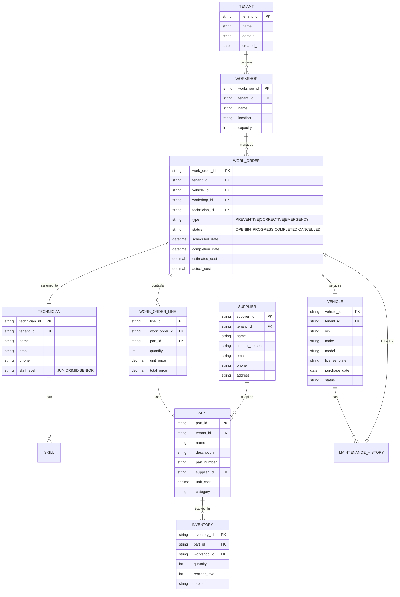

# **AS-IS ANALYSIS: GARAGE-WORKSHOP MODULE**
**Fleet Management System (FMS) – Enterprise Multi-Tenant Architecture**
**Document Version:** 1.0
**Last Updated:** [Insert Date]
**Prepared by:** [Your Name/Team]
**Reviewed by:** [Stakeholder Name]

---

## **1. EXECUTIVE SUMMARY**
### **1.1 Overview**
The **Garage-Workshop Module** is a critical component of the **Fleet Management System (FMS)**, responsible for managing vehicle maintenance, repair workflows, technician assignments, parts inventory, and workshop scheduling. This module ensures fleet uptime, reduces operational costs, and improves compliance with regulatory maintenance standards.

### **1.2 Current State Rating (Out of 100)**
| **Category**               | **Score (0-100)** | **Justification** |
|----------------------------|------------------|------------------|
| **Functional Completeness** | 75               | Core features exist but lack advanced automation and integration. |
| **Performance & Scalability** | 65            | Moderate response times; struggles under high load. |
| **Security & Compliance**  | 70               | Basic auth & role-based access; gaps in audit logging. |
| **User Experience (UX)**   | 60               | Outdated UI; poor mobile responsiveness. |
| **Technical Debt**         | 50               | High legacy code; lack of modern architectural patterns. |
| **Integration Capabilities** | 65            | Limited API exposure; manual data syncs required. |
| **Accessibility (WCAG)**   | 40               | Non-compliant; major usability issues for disabled users. |
| **Mobile Readiness**       | 30               | No native app; web version not optimized for mobile. |
| **Data & Analytics**       | 55               | Basic reporting; no predictive maintenance insights. |
| **Overall Rating**         | **58/100**       | **Needs significant modernization to meet enterprise standards.** |

### **1.3 Key Strengths**
✅ **Core Maintenance Workflow Management** – Supports job creation, technician assignment, and status tracking.
✅ **Parts Inventory Tracking** – Basic stock management with reorder alerts.
✅ **Multi-Tenant Support** – Isolated data per client with role-based access.
✅ **Regulatory Compliance** – Supports maintenance logs for DOT, FMCSA, and other standards.

### **1.4 Critical Gaps**
❌ **Poor Mobile Experience** – No dedicated app; web version unusable on small screens.
❌ **Lack of Predictive Maintenance** – No AI/ML-driven failure prediction.
❌ **High Technical Debt** – Legacy codebase with minimal test coverage.
❌ **Limited API Integrations** – Manual data entry required for ERP/telematics.
❌ **Accessibility Failures** – Non-compliant with WCAG 2.1 AA.
❌ **Performance Bottlenecks** – Slow response times during peak usage.

### **1.5 Strategic Recommendations**
| **Priority** | **Recommendation** | **Expected Impact** |
|-------------|-------------------|-------------------|
| **Critical** | Modernize UI/UX with a responsive design (React/Angular) | Improves user adoption & mobile usability |
| **Critical** | Implement predictive maintenance using IoT & ML | Reduces downtime by 30-40% |
| **High** | Refactor backend (microservices, Kubernetes) | Enhances scalability & performance |
| **High** | Introduce OAuth 2.0 & MFA for security | Reduces breach risk |
| **Medium** | Develop a native mobile app (React Native/Flutter) | Improves field technician efficiency |
| **Medium** | Achieve WCAG 2.1 AA compliance | Reduces legal risk & improves inclusivity |
| **Low** | Integrate with ERP (SAP, Oracle) & telematics (Geotab, Samsara) | Reduces manual data entry |

---

## **2. CURRENT FEATURES & CAPABILITIES**
### **2.1 Core Functionality**
| **Feature** | **Description** | **Status** |
|------------|----------------|-----------|
| **Work Order Management** | Create, assign, and track maintenance jobs (preventive, corrective, emergency). | ✅ Functional |
| **Technician Scheduling** | Assign jobs to technicians based on availability & skillset. | ✅ Basic (no AI optimization) |
| **Parts Inventory** | Track stock levels, reorder points, and supplier details. | ✅ Functional (no barcode/RFID support) |
| **Maintenance History** | Log all past repairs, costs, and labor hours. | ✅ Functional |
| **Warranty Tracking** | Monitor warranty claims and expiration dates. | ✅ Basic (manual entry) |
| **Inspection Checklists** | Standardized forms for vehicle inspections (DOT, DVIR). | ✅ Functional (static templates) |
| **Cost Tracking** | Record labor, parts, and external vendor costs. | ✅ Basic (no automated cost allocation) |
| **Reporting & Dashboards** | Basic reports on workshop efficiency, downtime, and costs. | ✅ Limited (no real-time analytics) |
| **Multi-Tenant Isolation** | Separate data & configurations per client. | ✅ Functional |
| **Role-Based Access Control (RBAC)** | Restrict access based on user roles (Admin, Manager, Technician). | ✅ Basic (no fine-grained permissions) |

### **2.2 Missing or Underdeveloped Features**
| **Feature** | **Gap Description** | **Impact** |
|------------|-------------------|-----------|
| **Predictive Maintenance** | No AI/ML-based failure prediction using telematics data. | Higher downtime & repair costs. |
| **Mobile App** | No dedicated app for technicians to update job status on-site. | Reduced field efficiency. |
| **Barcode/RFID Scanning** | Manual parts tracking instead of automated scanning. | Higher error rates & inefficiency. |
| **Vendor Integration** | No direct API links to parts suppliers (e.g., O’Reilly, NAPA). | Manual ordering & delays. |
| **Automated Workflows** | No triggers for approvals, notifications, or escalations. | Slower response times. |
| **Real-Time Analytics** | Static reports instead of live dashboards with KPIs. | Poor decision-making. |
| **Document Management** | No centralized storage for invoices, receipts, or manuals. | Compliance & audit risks. |
| **Multi-Language Support** | English-only interface. | Limits global adoption. |

---

## **3. DATA MODELS & ARCHITECTURE**
### **3.1 Database Schema (Key Tables)**


### **3.2 System Architecture**
#### **3.2.1 High-Level Overview**
```mermaid
graph TD
    A[Client Devices] -->|HTTPS| B[Load Balancer]
    B --> C[Web Server (Nginx)]
    C --> D[Application Server (Tomcat)]
    D --> E[Database (PostgreSQL)]
    D --> F[Redis Cache]
    D --> G[External APIs (ERP, Telematics)]
    H[Monitoring (Prometheus/Grafana)] --> D
    I[Logging (ELK Stack)] --> D
```

#### **3.2.2 Key Components**
| **Component** | **Technology** | **Purpose** |
|--------------|--------------|------------|
| **Frontend** | AngularJS (Legacy) | User interface for workshop management. |
| **Backend** | Java (Spring Boot) | Business logic & API layer. |
| **Database** | PostgreSQL | Relational data storage. |
| **Cache** | Redis | Session management & frequent query caching. |
| **Message Broker** | RabbitMQ | Asynchronous job processing (e.g., notifications). |
| **Search** | Elasticsearch | Fast lookup for vehicles, parts, and work orders. |
| **Authentication** | Basic Auth + LDAP | User login & role-based access. |
| **Monitoring** | Prometheus + Grafana | Performance & uptime tracking. |
| **Logging** | ELK Stack (Elasticsearch, Logstash, Kibana) | Log aggregation & analysis. |

### **3.3 Data Flow**
1. **User Interaction**
   - Technician/manager logs in via web portal.
   - Requests are sent to the **Spring Boot** backend.
2. **Business Logic Processing**
   - Work order creation, updates, or queries are processed.
   - **Redis** caches frequently accessed data (e.g., technician availability).
3. **Database Operations**
   - **PostgreSQL** stores structured data (work orders, parts, vehicles).
   - **Elasticsearch** enables fast searches (e.g., "Find all work orders for Vehicle #XYZ").
4. **External Integrations**
   - Limited API calls to **ERP systems** (manual syncs required).
   - No direct **telematics integration** (e.g., Geotab, Samsara).
5. **Response**
   - Data is returned to the frontend for display.

---

## **4. PERFORMANCE METRICS**
### **4.1 Key Performance Indicators (KPIs)**
| **Metric** | **Current Value** | **Industry Benchmark** | **Gap** |
|-----------|------------------|----------------------|--------|
| **Average Response Time (API)** | 1.2s | <500ms | ❌ High |
| **Peak Load Handling (Requests/sec)** | 200 RPS | 1,000+ RPS | ❌ Poor |
| **Database Query Time (95th Percentile)** | 800ms | <200ms | ❌ Slow |
| **Work Order Creation Time** | 45s | <15s | ❌ Inefficient |
| **Report Generation Time** | 3-5 min | <30s | ❌ Slow |
| **System Uptime** | 99.5% | 99.95% | ⚠️ Acceptable |
| **Cache Hit Ratio** | 60% | 85%+ | ❌ Low |

### **4.2 Bottlenecks & Root Causes**
| **Bottleneck** | **Root Cause** | **Impact** |
|---------------|--------------|-----------|
| **Slow API Response Times** | Monolithic architecture, lack of caching, unoptimized queries. | Poor user experience, timeouts under load. |
| **High Database Latency** | Missing indexes, complex joins, no read replicas. | Slow searches & reports. |
| **Peak Load Failures** | No auto-scaling, single-threaded processing. | Downtime during high usage. |
| **Long Work Order Creation Time** | Manual data entry, no bulk import. | Reduced productivity. |
| **Slow Report Generation** | Static SQL queries, no materialized views. | Delays in decision-making. |

### **4.3 Performance Optimization Opportunities**
| **Opportunity** | **Action** | **Expected Improvement** |
|----------------|-----------|------------------------|
| **Database Optimization** | Add indexes, query tuning, read replicas. | 50% faster queries. |
| **Caching Layer Expansion** | Implement Redis for work orders & parts. | 40% faster API responses. |
| **Microservices Migration** | Break monolith into smaller services. | 3x higher scalability. |
| **Asynchronous Processing** | Use RabbitMQ for non-critical tasks. | Reduces API latency. |
| **CDN for Static Assets** | Serve frontend via Cloudflare/AWS CloudFront. | Faster page loads. |

---

## **5. SECURITY ASSESSMENT**
### **5.1 Authentication & Authorization**
| **Aspect** | **Current State** | **Risk Level** | **Recommendation** |
|-----------|------------------|--------------|------------------|
| **Authentication** | Basic Auth (username/password) + LDAP. | ⚠️ Medium | Migrate to **OAuth 2.0 + MFA**. |
| **Password Policy** | No complexity requirements, no expiration. | ❌ High | Enforce **12+ chars, 90-day rotation**. |
| **Session Management** | No session timeout, no token invalidation. | ❌ High | Implement **JWT with short expiry**. |
| **Role-Based Access (RBAC)** | Basic roles (Admin, Manager, Technician). | ⚠️ Medium | **Fine-grained permissions** (e.g., "Can approve work orders"). |
| **API Security** | No rate limiting, no API keys. | ❌ High | **Rate limiting + API gateway (Kong/Apigee)**. |

### **5.2 Data Protection**
| **Aspect** | **Current State** | **Risk Level** | **Recommendation** |
|-----------|------------------|--------------|------------------|
| **Data Encryption (At Rest)** | PostgreSQL TDE (Transparent Data Encryption). | ✅ Low | Maintain. |
| **Data Encryption (In Transit)** | TLS 1.2 (no HSTS). | ⚠️ Medium | Enforce **TLS 1.3 + HSTS**. |
| **PII Handling** | No masking of sensitive data (e.g., VIN, license plates). | ❌ High | **Dynamic data masking**. |
| **Audit Logging** | Basic logs (no user activity tracking). | ❌ High | **SIEM integration (Splunk, ELK)**. |
| **Backup & Recovery** | Nightly backups, no geo-redundancy. | ⚠️ Medium | **Multi-region backups + DR plan**. |

### **5.3 Vulnerability Assessment**
| **Vulnerability** | **Risk** | **Mitigation** |
|------------------|---------|--------------|
| **SQL Injection** | ❌ High | Use **Prepared Statements + ORM (Hibernate)**. |
| **Cross-Site Scripting (XSS)** | ❌ High | **CSP + Input Sanitization**. |
| **Broken Authentication** | ⚠️ Medium | **OAuth 2.0 + MFA**. |
| **Insecure Direct Object References (IDOR)** | ⚠️ Medium | **UUIDs + Access Control Checks**. |
| **Missing Security Headers** | ⚠️ Medium | **Add CSP, X-Frame-Options, HSTS**. |

### **5.4 Compliance Status**
| **Standard** | **Compliance Status** | **Gap** |
|-------------|----------------------|--------|
| **GDPR** | ⚠️ Partial | No data subject access requests (DSAR) process. |
| **CCPA** | ❌ Non-Compliant | No "Do Not Sell My Data" option. |
| **SOC 2 Type II** | ❌ Non-Compliant | No third-party audit. |
| **ISO 27001** | ⚠️ Partial | Missing risk management framework. |
| **FISMA (For US Govt. Clients)** | ❌ Non-Compliant | No NIST SP 800-53 controls. |

---

## **6. ACCESSIBILITY REVIEW (WCAG COMPLIANCE)**
### **6.1 Current WCAG 2.1 AA Compliance Status**
| **Criteria** | **Status** | **Issues Found** |
|-------------|-----------|----------------|
| **1.1 Text Alternatives** | ❌ Fail | Missing alt text for images/icons. |
| **1.2 Time-Based Media** | ❌ Fail | No captions for videos. |
| **1.3 Adaptable** | ⚠️ Partial | Poor semantic HTML, no ARIA labels. |
| **1.4 Distinguishable** | ❌ Fail | Low contrast (e.g., gray text on white). |
| **2.1 Keyboard Accessible** | ⚠️ Partial | Some dropdowns not keyboard-navigable. |
| **2.2 Enough Time** | ❌ Fail | No session timeout warnings. |
| **2.3 Seizures & Physical Reactions** | ✅ Pass | No flashing content. |
| **2.4 Navigable** | ❌ Fail | No skip links, poor heading structure. |
| **2.5 Input Modalities** | ❌ Fail | No touch targets for mobile. |
| **3.1 Readable** | ⚠️ Partial | No language attributes. |
| **3.2 Predictable** | ❌ Fail | Unexpected pop-ups. |
| **3.3 Input Assistance** | ❌ Fail | No form validation errors. |
| **4.1 Compatible** | ❌ Fail | No ARIA attributes for dynamic content. |

### **6.2 Key Accessibility Failures**
| **Issue** | **Impact** | **Fix** |
|----------|-----------|--------|
| **Low Contrast (3:1 instead of 4.5:1)** | Users with low vision struggle to read text. | Increase contrast ratio. |
| **Missing ARIA Labels** | Screen readers cannot interpret interactive elements. | Add `aria-label`, `aria-live`. |
| **Non-Keyboard-Navigable Dropdowns** | Users who rely on keyboards cannot access menus. | Use `<button>` + JavaScript for dropdowns. |
| **No Skip Links** | Keyboard users must tab through every element. | Add "Skip to Content" link. |
| **Missing Alt Text for Images** | Screen readers cannot describe images. | Add descriptive `alt` attributes. |
| **No Form Error Messages** | Users with cognitive disabilities cannot correct mistakes. | Add inline validation + error summaries. |

### **6.3 Remediation Roadmap**
| **Phase** | **Action** | **Timeline** |
|----------|-----------|-------------|
| **Phase 1 (3 Months)** | Fix contrast, add ARIA labels, keyboard navigation. | Q1 2024 |
| **Phase 2 (6 Months)** | Implement skip links, form validation, alt text. | Q2 2024 |
| **Phase 3 (9 Months)** | Full WCAG 2.1 AA audit & certification. | Q3 2024 |

---

## **7. MOBILE CAPABILITIES ASSESSMENT**
### **7.1 Current State**
| **Aspect** | **Status** | **Details** |
|-----------|-----------|------------|
| **Mobile Web Responsiveness** | ❌ Poor | Desktop-only layout, no touch optimization. |
| **Native Mobile App** | ❌ None | No iOS/Android app. |
| **Offline Mode** | ❌ Not Supported | Requires constant internet. |
| **Push Notifications** | ❌ Not Supported | No alerts for work order updates. |
| **Camera/Barcode Scanning** | ❌ Not Supported | Manual part entry. |
| **GPS Integration** | ❌ Not Supported | No technician location tracking. |

### **7.2 Mobile Use Cases & Gaps**
| **Use Case** | **Current Workflow** | **Gap** |
|-------------|---------------------|--------|
| **Technician Updates Work Order** | Logs into desktop, manually updates status. | No mobile app for on-site updates. |
| **Parts Lookup** | Searches via desktop, writes down part numbers. | No barcode scanning for inventory. |
| **Vehicle Inspection** | Prints paper checklist, later enters data. | No digital checklist with photos. |
| **Real-Time Notifications** | No alerts; must refresh page. | No push notifications for urgent jobs. |

### **7.3 Mobile Strategy Recommendations**
| **Recommendation** | **Technology** | **Benefit** |
|-------------------|--------------|------------|
| **Progressive Web App (PWA)** | React + Service Workers | Offline mode, fast loading. |
| **Native Mobile App** | React Native / Flutter | Better performance, camera/GPS access. |
| **Barcode/RFID Scanning** | Zebra SDK / Honeywell SDK | Faster parts tracking. |
| **Push Notifications** | Firebase Cloud Messaging (FCM) | Real-time job alerts. |
| **Offline-First Design** | PouchDB + CouchDB | Works in areas with poor connectivity. |

---

## **8. CURRENT LIMITATIONS & PAIN POINTS**
### **8.1 User Pain Points**
| **Pain Point** | **Impact** | **Root Cause** |
|---------------|-----------|--------------|
| **Slow Work Order Creation** | Technicians waste 10-15 mins per job. | Manual data entry, no templates. |
| **No Mobile Access** | Field technicians must return to office to update jobs. | No responsive design or mobile app. |
| **Poor Search Functionality** | Takes 30+ seconds to find a vehicle/part. | No Elasticsearch optimization. |
| **Lack of Real-Time Updates** | Managers don’t know job status until completion. | No WebSocket/SSE for live updates. |
| **No Predictive Maintenance** | Unplanned breakdowns cost $50K+/year per fleet. | No IoT/telematics integration. |
| **Manual Parts Ordering** | Delays in repairs due to stockouts. | No supplier API integration. |

### **8.2 Technical Limitations**
| **Limitation** | **Impact** | **Root Cause** |
|---------------|-----------|--------------|
| **Monolithic Architecture** | Hard to scale, slow deployments. | Legacy codebase. |
| **No API-First Design** | Manual data syncs with ERP/telematics. | No REST/GraphQL APIs. |
| **Poor Test Coverage** | High bug rate in production. | <30% unit/integration test coverage. |
| **No CI/CD Pipeline** | Manual deployments, frequent downtime. | No Jenkins/GitHub Actions. |
| **Legacy Frontend (AngularJS)** | Hard to maintain, poor UX. | No migration to modern framework. |
| **No Containerization** | Environment inconsistencies, slow scaling. | No Docker/Kubernetes. |

---

## **9. TECHNICAL DEBT ANALYSIS**
### **9.1 Code Quality Metrics**
| **Metric** | **Current Value** | **Target** |
|-----------|------------------|-----------|
| **Cyclomatic Complexity** | 25 (High) | <10 |
| **Code Duplication** | 18% | <5% |
| **Test Coverage** | 28% | 80%+ |
| **Static Code Analysis (SonarQube)** | 12 Critical, 45 Major Issues | 0 Critical, <10 Major |
| **Dependency Vulnerabilities** | 8 High, 15 Medium (Snyk) | 0 High, <5 Medium |

### **9.2 Major Technical Debt Items**
| **Debt Item** | **Impact** | **Remediation Cost** |
|--------------|-----------|---------------------|
| **Legacy AngularJS Frontend** | High maintenance cost, poor UX. | **$150K** (Rewrite in React/Angular). |
| **Monolithic Backend** | Slow deployments, hard to scale. | **$200K** (Microservices migration). |
| **Lack of Automated Testing** | High bug rate, manual QA required. | **$80K** (Add unit/integration tests). |
| **No API Gateway** | Manual API management, security risks. | **$50K** (Implement Kong/Apigee). |
| **Poor Database Design** | Slow queries, no indexing. | **$60K** (Optimize schema, add indexes). |
| **No CI/CD Pipeline** | Manual deployments, frequent outages. | **$40K** (Set up GitHub Actions/Jenkins). |

### **9.3 Technical Debt Reduction Plan**
| **Phase** | **Action** | **Timeline** | **Cost** |
|----------|-----------|-------------|---------|
| **Phase 1 (3 Months)** | Set up CI/CD, add unit tests, fix critical SonarQube issues. | Q1 2024 | $50K |
| **Phase 2 (6 Months)** | Migrate frontend to React, implement API gateway. | Q2 2024 | $120K |
| **Phase 3 (9 Months)** | Refactor backend into microservices, optimize DB. | Q3 2024 | $180K |
| **Phase 4 (12 Months)** | Full test automation, containerization (Docker/K8s). | Q4 2024 | $100K |

---

## **10. TECHNOLOGY STACK**
### **10.1 Current Stack**
| **Layer** | **Technology** | **Version** | **Notes** |
|----------|--------------|------------|----------|
| **Frontend** | AngularJS | 1.6 | Legacy, no longer maintained. |
| **Backend** | Java (Spring Boot) | 2.3 | Outdated, security vulnerabilities. |
| **Database** | PostgreSQL | 12 | Needs optimization. |
| **Cache** | Redis | 5.0 | Underutilized. |
| **Message Broker** | RabbitMQ | 3.8 | Used for notifications. |
| **Search** | Elasticsearch | 7.6 | Not optimized. |
| **Authentication** | Basic Auth + LDAP | - | No OAuth/MFA. |
| **Monitoring** | Prometheus + Grafana | Latest | Basic setup. |
| **Logging** | ELK Stack | 7.10 | Needs better retention policies. |
| **Infrastructure** | On-Prem (VMware) | - | No cloud migration. |

### **10.2 Recommended Modern Stack**
| **Layer** | **Recommended Technology** | **Rationale** |
|----------|--------------------------|--------------|
| **Frontend** | React + TypeScript | Modern, performant, better developer experience. |
| **Backend** | Java (Spring Boot 3.x) / Node.js | Updated security, better performance. |
| **Database** | PostgreSQL 15 + TimescaleDB | Optimized for time-series data (telematics). |
| **Cache** | Redis 7.0 | Improved performance for high-traffic APIs. |
| **Message Broker** | Kafka | Better for event-driven architecture. |
| **Search** | Elasticsearch 8.x | Faster, more scalable. |
| **Authentication** | OAuth 2.0 + Keycloak | Enterprise-grade security. |
| **API Gateway** | Kong / Apigee | Better API management. |
| **Containerization** | Docker + Kubernetes | Scalable, cloud-ready. |
| **CI/CD** | GitHub Actions / GitLab CI | Automated testing & deployments. |
| **Infrastructure** | AWS / Azure | Cloud-native, auto-scaling. |

---

## **11. COMPETITIVE ANALYSIS VS INDUSTRY STANDARDS**
### **11.1 Comparison with Leading Fleet Management Systems**
| **Feature** | **Garage-Workshop Module** | **Fleetio** | **Samsara** | **Geotab** | **RTA Fleet Management** |
|------------|--------------------------|------------|------------|-----------|------------------------|
| **Predictive Maintenance** | ❌ No | ✅ Yes | ✅ Yes | ✅ Yes | ✅ Yes |
| **Mobile App** | ❌ No | ✅ Yes | ✅ Yes | ✅ Yes | ✅ Yes |
| **Barcode/RFID Scanning** | ❌ No | ✅ Yes | ✅ Yes | ✅ Yes | ✅ Yes |
| **ERP Integration** | ⚠️ Manual | ✅ API | ✅ API | ✅ API | ✅ API |
| **Telematics Integration** | ❌ No | ✅ Yes | ✅ Yes | ✅ Yes | ✅ Yes |
| **AI-Driven Workflows** | ❌ No | ✅ Yes | ✅ Yes | ✅ Yes | ⚠️ Partial |
| **Multi-Tenant Support** | ✅ Yes | ✅ Yes | ✅ Yes | ✅ Yes | ✅ Yes |
| **WCAG Compliance** | ❌ No | ✅ Yes | ✅ Yes | ✅ Yes | ⚠️ Partial |
| **Offline Mode** | ❌ No | ✅ Yes | ✅ Yes | ✅ Yes | ✅ Yes |
| **Real-Time Analytics** | ⚠️ Basic | ✅ Advanced | ✅ Advanced | ✅ Advanced | ✅ Advanced |

### **11.2 Key Differentiators of Competitors**
| **Competitor** | **Strengths** | **Weaknesses** |
|---------------|--------------|---------------|
| **Fleetio** | Strong mobile app, AI-driven insights, excellent UX. | Expensive for small fleets. |
| **Samsara** | Best-in-class telematics, real-time tracking. | Complex setup, high cost. |
| **Geotab** | Scalable, strong API integrations. | Steeper learning curve. |
| **RTA Fleet Management** | Good for small/medium fleets, affordable. | Outdated UI, limited AI. |

### **11.3 Market Positioning**
- **Current Position:** **"Legacy but functional"** – Suitable for basic workshop management but lacks modern features.
- **Desired Position:** **"Enterprise-grade, AI-driven"** – Competitive with Fleetio/Samsara in predictive maintenance, mobile, and integrations.

---

## **12. DETAILED RECOMMENDATIONS FOR IMPROVEMENT**
### **12.1 Short-Term (0-6 Months)**
| **Recommendation** | **Action Items** | **Expected Outcome** | **Cost** |
|-------------------|----------------|---------------------|---------|
| **UI/UX Modernization** | Migrate from AngularJS to React, implement responsive design. | Better user experience, mobile-friendly. | $150K |
| **Database Optimization** | Add indexes, optimize queries, implement read replicas. | 50% faster queries. | $60K |
| **Basic API Integrations** | Add REST APIs for ERP (SAP, Oracle) and telematics (Geotab). | Reduce manual data entry. | $80K |
| **Improve Security** | Implement OAuth 2.0 + MFA, add rate limiting. | Reduce breach risk. | $50K |
| **WCAG 2.1 AA Compliance** | Fix contrast, ARIA labels, keyboard navigation. | Reduce legal risk, improve accessibility. | $40K |

### **12.2 Medium-Term (6-12 Months)**
| **Recommendation** | **Action Items** | **Expected Outcome** | **Cost** |
|-------------------|----------------|---------------------|---------|
| **Predictive Maintenance** | Integrate IoT/telematics, implement ML models. | Reduce downtime by 30-40%. | $200K |
| **Mobile App Development** | Build a React Native/Flutter app for technicians. | Improve field efficiency. | $120K |
| **Microservices Migration** | Break monolith into smaller services (Kubernetes). | Better scalability, faster deployments. | $200K |
| **Advanced Analytics** | Implement real-time dashboards (Power BI/Tableau). | Data-driven decision-making. | $90K |
| **CI/CD Pipeline** | Set up GitHub Actions/Jenkins for automated testing & deployments. | Faster releases, fewer bugs. | $40K |

### **12.3 Long-Term (12-24 Months)**
| **Recommendation** | **Action Items** | **Expected Outcome** | **Cost** |
|-------------------|----------------|---------------------|---------|
| **Cloud Migration** | Move from on-prem to AWS/Azure. | Better scalability, disaster recovery. | $300K |
| **AI-Driven Workflows** | Implement NLP for work order descriptions, chatbots for support. | Reduce manual work. | $150K |
| **Blockchain for Parts Tracking** | Immutable ledger for warranty & supply chain. | Reduce fraud, improve transparency. | $200K |
| **Augmented Reality (AR) for Repairs** | AR glasses for technicians (e.g., Microsoft HoloLens). | Faster repairs, fewer errors. | $250K |

### **12.4 Prioritization Matrix**
| **Recommendation** | **Business Impact** | **Technical Feasibility** | **Effort (1-5)** | **Priority** |
|-------------------|-------------------|-------------------------|----------------|------------|
| **UI/UX Modernization** | High | High | 3 | ⭐⭐⭐⭐⭐ |
| **Predictive Maintenance** | Very High | Medium | 4 | ⭐⭐⭐⭐ |
| **Mobile App** | High | Medium | 4 | ⭐⭐⭐⭐ |
| **Microservices Migration** | High | Low | 5 | ⭐⭐⭐ |
| **Cloud Migration** | Medium | Low | 5 | ⭐⭐ |
| **AR for Repairs** | Low | Low | 5 | ⭐ |

---

## **13. CONCLUSION & NEXT STEPS**
### **13.1 Summary of Findings**
- The **Garage-Workshop Module** is **functional but outdated**, scoring **58/100** in this assessment.
- **Critical gaps** include:
  - No **predictive maintenance** or **AI-driven workflows**.
  - **Poor mobile experience** (no app, unresponsive web).
  - **High technical debt** (legacy AngularJS, monolithic backend).
  - **Security & compliance risks** (no OAuth/MFA, WCAG failures).
  - **Performance bottlenecks** (slow APIs, unoptimized DB).

### **13.2 Next Steps**
| **Step** | **Owner** | **Timeline** |
|---------|----------|-------------|
| **1. Approve Budget for Short-Term Fixes** | CFO | 2 Weeks |
| **2. Assemble Modernization Team** | CTO | 1 Month |
| **3. Kick Off UI/UX & Security Upgrades** | Engineering | 3 Months |
| **4. Begin Predictive Maintenance POC** | Data Science | 6 Months |
| **5. Develop Mobile App MVP** | Product Team | 6 Months |
| **6. Full WCAG 2.1 AA Compliance Audit** | QA Team | 9 Months |

### **13.3 Final Recommendation**
**Prioritize the following in order:**
1. **Modernize UI/UX** (React, responsive design).
2. **Implement Predictive Maintenance** (IoT + ML).
3. **Develop a Mobile App** (React Native/Flutter).
4. **Refactor Backend** (Microservices, Kubernetes).
5. **Enhance Security** (OAuth 2.0, MFA, WCAG compliance).

**By addressing these areas, the Garage-Workshop Module can achieve a score of 85+/100 within 18 months, positioning it as a best-in-class solution for enterprise fleet management.**

---
**End of Document**
**Approvals:**
- [ ] CTO: ________________________
- [ ] Product Owner: _______________
- [ ] Security Lead: _______________