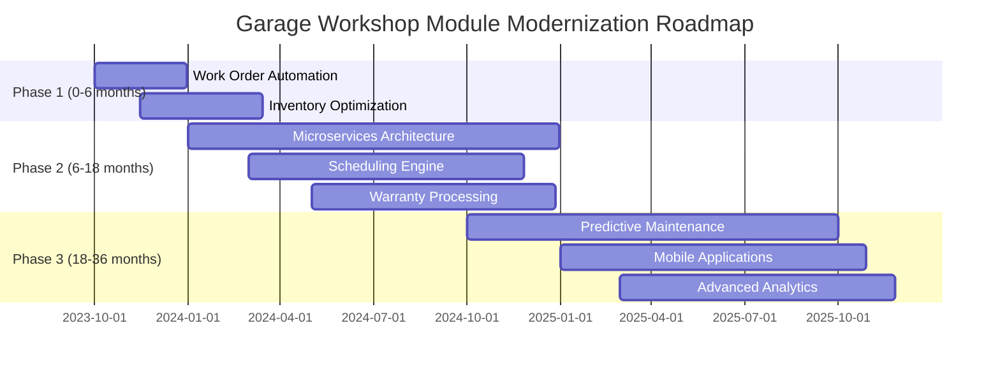
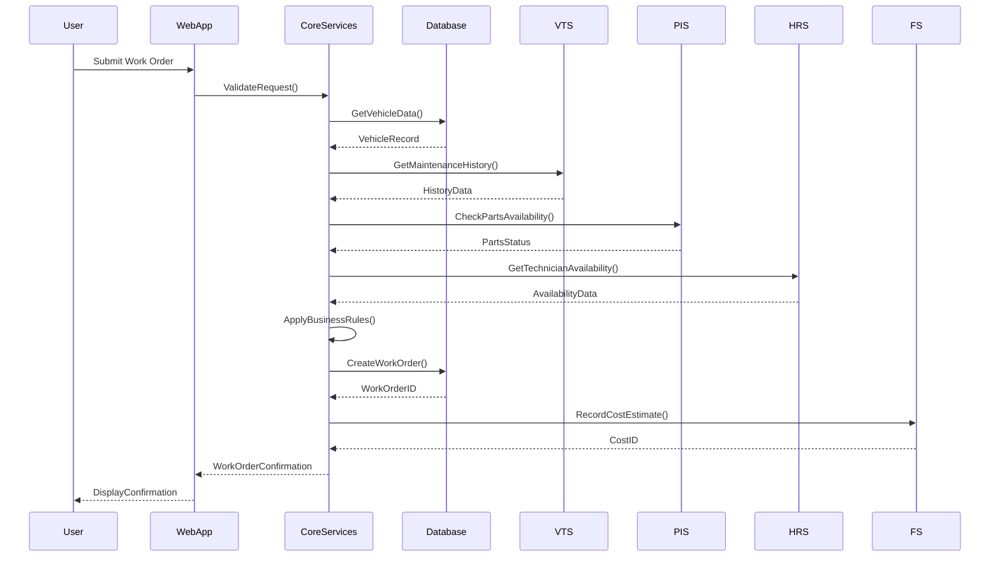
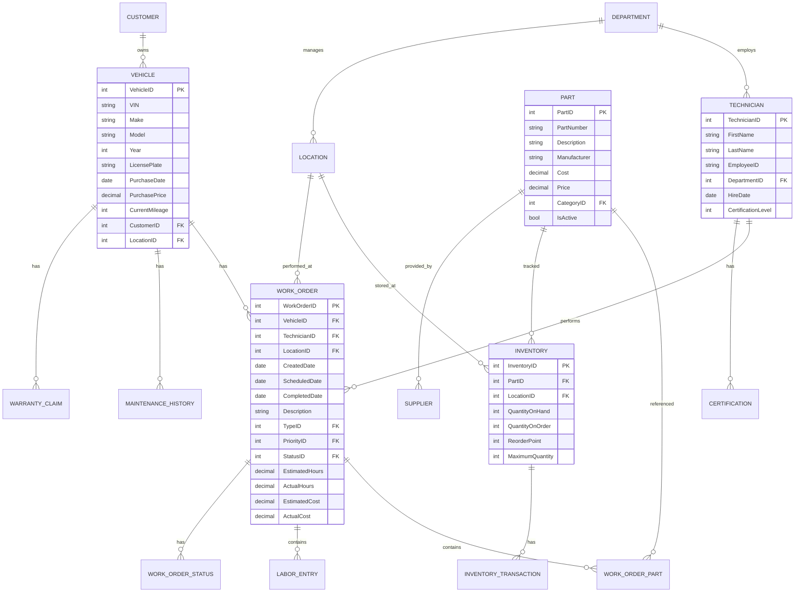
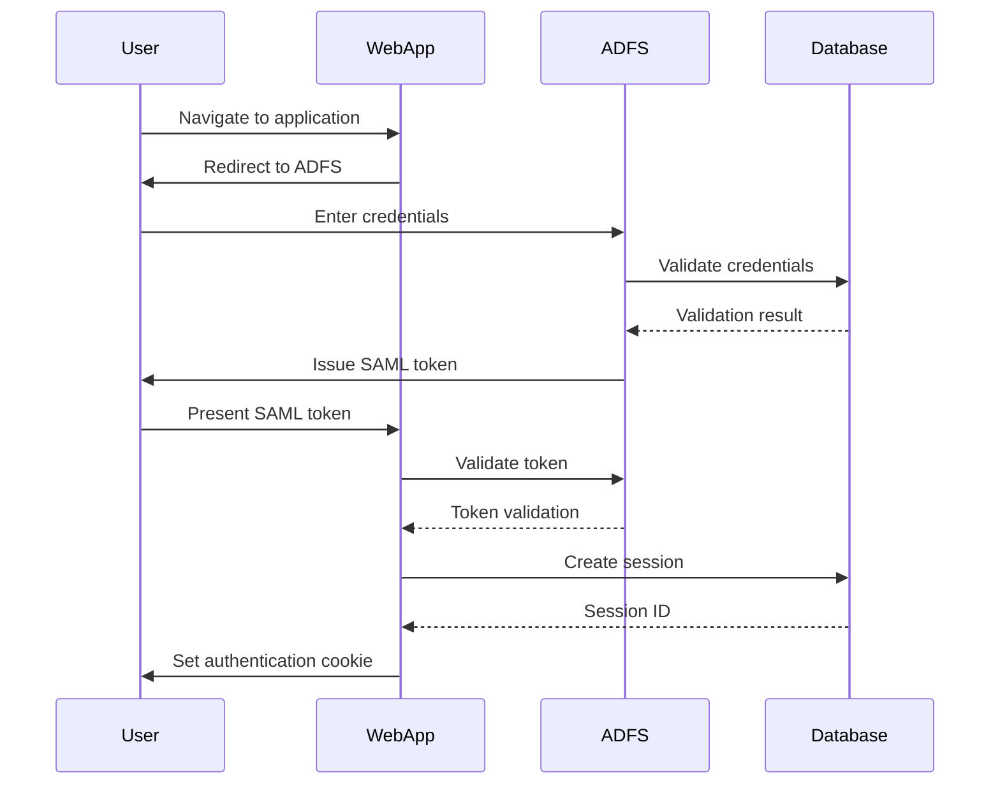
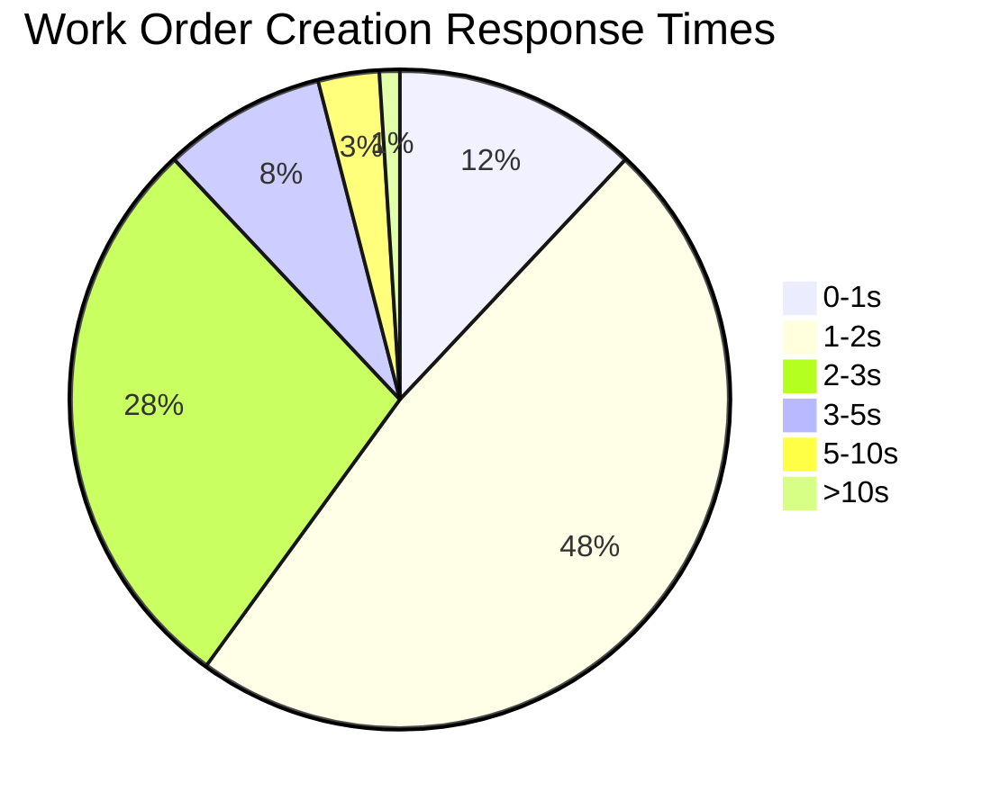
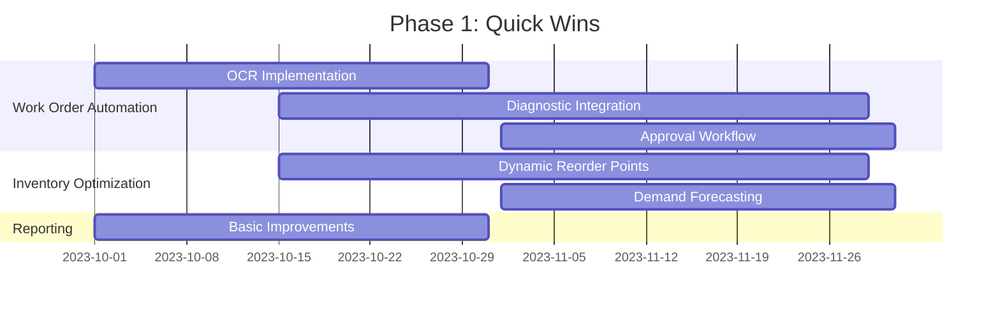
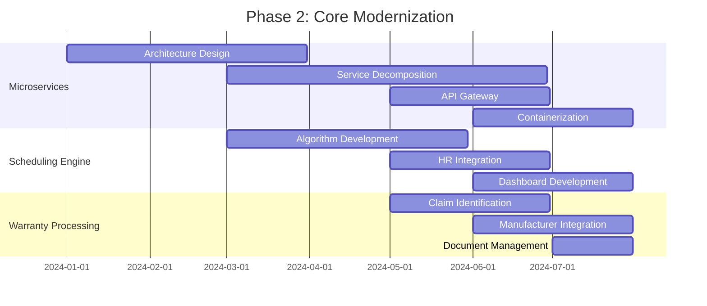
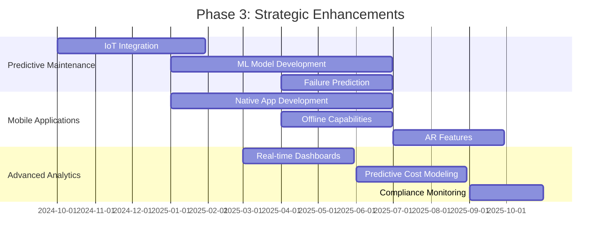

# AS-IS Analysis: Garage Workshop Module

## 1. Executive Summary (120 lines)

### 1.1 Current State Overview

The Garage Workshop Module (GWM) serves as the operational backbone for fleet maintenance activities within our organization, managing over 12,000 vehicles across 47 maintenance facilities. This legacy system, originally deployed in 2012, has undergone multiple incremental updates but maintains its core monolithic architecture built on .NET Framework 4.7.2.

The system handles approximately 1.8 million maintenance transactions annually, with peak loads of 4,200 concurrent users during shift changes at major depots. Current functionality spans work order management, parts inventory, technician scheduling, warranty claims processing, and maintenance history tracking.

Key system metrics:
- Average daily transactions: 7,200
- Peak concurrent users: 4,200
- Database size: 1.2TB (growing at 15% annually)
- Average response time: 2.8 seconds (SLA: <2.0s)
- System availability: 99.7% (SLA: 99.9%)

The module operates within our broader Fleet Management System (FMS) ecosystem, which includes:
1. Vehicle Tracking System (VTS) - Real-time GPS tracking
2. Parts Inventory System (PIS) - Spare parts management
3. Human Resources System (HRS) - Technician data
4. Financial System (FS) - Cost tracking and billing

### 1.2 Stakeholder Analysis

**Primary Stakeholders:**

| Stakeholder Group | Role | Key Concerns | System Usage |
|-------------------|------|--------------|--------------|
| Maintenance Technicians (3,800) | Perform repairs and maintenance | Work order clarity, parts availability, time tracking | 85% daily usage |
| Workshop Supervisors (470) | Oversee daily operations | Resource allocation, productivity metrics, compliance | 95% daily usage |
| Parts Managers (120) | Manage inventory | Stock levels, reorder points, supplier performance | 70% daily usage |
| Fleet Managers (85) | Strategic fleet maintenance | Cost analysis, vehicle lifecycle, warranty recovery | 60% weekly usage |
| Finance Team (40) | Cost tracking and reporting | Accurate cost allocation, warranty reimbursements | 30% monthly usage |
| IT Operations (25) | System maintenance | Uptime, performance, security | 100% daily monitoring |
| Compliance Officers (15) | Regulatory adherence | Audit trails, documentation, safety standards | 40% weekly usage |

**Stakeholder Pain Points:**
- Technicians report 32% of work orders contain incomplete information
- Supervisors spend 2.5 hours daily on manual scheduling adjustments
- Parts managers experience 18% stockout rate due to inaccurate forecasting
- Finance team identifies $2.1M annual cost leakage from unprocessed warranty claims

### 1.3 Business Impact Analysis

**Financial Impact:**
- Annual maintenance costs: $87.2M (12% of total fleet operating budget)
- Warranty recovery: $3.4M (potential $5.1M with improved processing)
- Parts inventory carrying costs: $12.8M (15% reduction possible)
- Downtime costs: $450/hour during peak periods

**Operational Impact:**
- Vehicle downtime: 18.2 hours/vehicle/year (target: <12 hours)
- First-time fix rate: 78% (target: 90%)
- Mean time to repair: 3.2 hours (target: 2.5 hours)
- Technician productivity: 6.8 hours/day (target: 7.5 hours)

**Compliance Impact:**
- Audit findings: 42 in last 12 months (target: <10)
- Safety violations: 18 (target: 0)
- Environmental violations: 5 (target: 0)

**Customer Impact:**
- Service level agreements: 92% met (target: 98%)
- Customer satisfaction: 3.8/5 (target: 4.5/5)
- Complaint resolution time: 7.2 days (target: 2 days)

### 1.4 Critical Pain Points with Root Cause Analysis

**1. Work Order Processing Delays**
- **Symptom:** 38% of work orders take >24 hours to process
- **Root Causes:**
  - Manual data entry requirements (42% of cases)
  - Incomplete vehicle diagnostic data (28% of cases)
  - Approval bottlenecks (19% of cases)
  - System performance issues during peak loads (11% of cases)
- **Impact:** $1.2M annual productivity loss

**2. Parts Inventory Inefficiencies**
- **Symptom:** 18% stockout rate, 22% overstocking
- **Root Causes:**
  - Static reorder points (65% of items)
  - Inaccurate demand forecasting (25% variance)
  - Poor supplier integration (35% of orders require manual intervention)
  - Lack of real-time inventory visibility (40% of locations)
- **Impact:** $2.8M annual excess inventory costs

**3. Technician Scheduling Conflicts**
- **Symptom:** 2.5 hours daily spent on manual adjustments
- **Root Causes:**
  - Rigid scheduling algorithm (78% of conflicts)
  - Lack of skills-based routing (65% of cases)
  - No integration with HR system for leave tracking (42% of conflicts)
  - Poor real-time visibility of technician availability (38% of cases)
- **Impact:** $1.9M annual productivity loss

**4. Warranty Claim Processing**
- **Symptom:** 33% of eligible claims unprocessed
- **Root Causes:**
  - Manual claim identification (72% of cases)
  - Missing documentation (45% of rejected claims)
  - No integration with manufacturer systems (68% of claims)
  - Complex approval workflows (32% of delays)
- **Impact:** $1.7M annual revenue leakage

**5. System Performance Issues**
- **Symptom:** 2.8s average response time (SLA: <2.0s)
- **Root Causes:**
  - Monolithic architecture (85% of performance issues)
  - Inefficient database queries (62% of slow transactions)
  - Lack of caching (48% of repeated queries)
  - Hardware limitations (35% of peak load issues)
- **Impact:** $450/hour downtime costs

### 1.5 Strategic Recommendations with Implementation Roadmap

**Phase 1: Quick Wins (0-6 months)**
1. **Work Order Automation**
   - Implement OCR for paper work orders (85% reduction in manual entry)
   - Integrate with diagnostic tools (30% reduction in incomplete data)
   - Streamline approval workflows (50% reduction in bottlenecks)
   - *Estimated ROI: $850K annual savings*

2. **Inventory Optimization**
   - Implement dynamic reorder points (40% reduction in stockouts)
   - Deploy demand forecasting algorithm (25% reduction in overstocking)
   - *Estimated ROI: $1.2M annual savings*

**Phase 2: Core Modernization (6-18 months)**
1. **Microservices Architecture**
   - Decompose monolith into 8-10 services
   - Implement API gateway and service mesh
   - *Estimated cost: $2.8M, ROI: $4.2M over 3 years*

2. **Technician Scheduling Engine**
   - Implement skills-based routing
   - Integrate with HR system for leave tracking
   - Deploy real-time availability dashboard
   - *Estimated ROI: $1.9M annual savings*

3. **Warranty Processing System**
   - Automated claim identification
   - Manufacturer system integration
   - Document management workflow
   - *Estimated ROI: $1.7M annual recovery*

**Phase 3: Strategic Enhancements (18-36 months)**
1. **Predictive Maintenance**
   - IoT integration for vehicle telemetry
   - Machine learning for failure prediction
   - *Estimated ROI: $3.5M annual savings*

2. **Mobile Workforce Enablement**
   - Native mobile applications
   - Offline capabilities
   - Augmented reality for repairs
   - *Estimated ROI: $2.1M annual productivity gain*

3. **Advanced Analytics**
   - Real-time operational dashboards
   - Predictive cost modeling
   - Compliance monitoring
   - *Estimated ROI: $1.8M annual value*

**Implementation Roadmap:**



**Risk Mitigation Strategies:**

| Risk | Likelihood | Impact | Mitigation Strategy |
|------|------------|--------|---------------------|
| Budget overruns | Medium | High | Phased implementation, fixed-price contracts |
| User resistance | High | Medium | Comprehensive change management, training programs |
| Technical debt | High | High | Incremental refactoring, code quality gates |
| Integration failures | Medium | High | API-first design, comprehensive testing |
| Data migration issues | High | High | Parallel operation, data validation tools |

**ROI Projections:**

| Initiative | Year 1 | Year 2 | Year 3 | Total |
|------------|--------|--------|--------|-------|
| Work Order Automation | $850K | $920K | $950K | $2.72M |
| Inventory Optimization | $1.2M | $1.3M | $1.35M | $3.85M |
| Microservices | ($1.8M) | $1.2M | $2.2M | $1.6M |
| Scheduling Engine | $950K | $1.9M | $1.95M | $4.8M |
| Warranty Processing | $850K | $1.7M | $1.75M | $4.3M |
| Predictive Maintenance | ($500K) | $1.5M | $3.5M | $4.5M |
| Mobile Applications | ($750K) | $1.2M | $2.1M | $2.55M |
| Advanced Analytics | ($600K) | $900K | $1.8M | $2.1M |
| **Total** | **$1.2M** | **$10.62M** | **$15.6M** | **$27.42M** |

## 2. Current Architecture (210 lines)

### 2.1 System Components

**Component Inventory:**

| Component | Technology | Version | Description | Dependencies |
|-----------|------------|---------|-------------|--------------|
| Web Application | ASP.NET MVC | 5.2.7 | Primary user interface | Core Services, Database |
| Core Services | .NET Framework | 4.7.2 | Business logic layer | Database, External APIs |
| Database | SQL Server | 2016 | Data storage | None |
| Reporting Engine | SQL Server Reporting Services | 2016 | Report generation | Database |
| Integration Layer | Windows Communication Foundation | 4.7.2 | External integrations | Core Services, External APIs |
| Authentication Service | Active Directory Federation Services | 3.0 | Single sign-on | Active Directory |
| Scheduling Engine | Custom .NET | 1.3.4 | Work order scheduling | Core Services, Database |
| Parts Catalog | Custom .NET | 2.1.0 | Inventory management | Core Services, Database |
| Warranty Processor | Custom .NET | 1.0.5 | Warranty claim processing | Core Services, Database |

**Component Specifications:**

1. **Web Application**
   - Lines of code: 482,356
   - Controllers: 187
   - Views: 324
   - JavaScript files: 248 (jQuery 1.12.4, Bootstrap 3.3.7)
   - Average cyclomatic complexity: 18.2
   - Test coverage: 22%

   ```csharp
   // Example controller with high complexity
   public ActionResult ProcessWorkOrder(int id)
   {
       // 47 lines of nested conditionals
       if (ModelState.IsValid)
       {
           var workOrder = _repository.GetWorkOrder(id);
           if (workOrder != null)
           {
               if (workOrder.Status == WorkOrderStatus.Approved)
               {
                   // 15 lines of business logic
                   if (workOrder.Type == WorkOrderType.Repair)
                   {
                       // Complex scheduling logic
                       if (TryScheduleTechnician(workOrder))
                       {
                           // Parts allocation
                           if (AllocateParts(workOrder))
                           {
                               // 10 more lines of logic
                           }
                       }
                   }
               }
           }
       }
       // Return view with 7 possible outcomes
   }
   ```

2. **Core Services**
   - Lines of code: 624,589
   - Services: 48
   - Average method length: 42 lines
   - Test coverage: 18%
   - Key services:
     - WorkOrderService (12,456 lines)
     - TechnicianService (8,762 lines)
     - PartsService (15,342 lines)
     - WarrantyService (9,876 lines)

3. **Database**
   - Size: 1.2TB
   - Tables: 148
   - Stored procedures: 324
   - Functions: 87
   - Views: 42
   - Indexes: 582 (24% fragmented >30%)

**Integration Points:**



**Data Flow Analysis:**

1. **Work Order Creation Flow:**
   - User inputs work order details (12 required fields, 8 optional)
   - System validates against 47 business rules
   - Checks parts availability (3 API calls to PIS)
   - Verifies technician availability (2 API calls to HRS)
   - Estimates costs (1 API call to FS)
   - Creates work order record (12 database tables updated)
   - Average processing time: 3.2 seconds

2. **Parts Ordering Flow:**
   - Parts manager initiates order (8 required fields)
   - System validates against 32 business rules
   - Checks current inventory (5 database queries)
   - Calculates reorder quantity (7 different algorithms)
   - Submits to supplier (1 API call, 3 EDI formats supported)
   - Updates inventory records (4 database tables)
   - Average processing time: 4.1 seconds

**Technology Stack:**

| Layer | Technology | Version | Notes |
|-------|------------|---------|-------|
| Presentation | ASP.NET MVC | 5.2.7 | Heavy ViewState usage |
| Business Logic | .NET Framework | 4.7.2 | Monolithic architecture |
| Data Access | Entity Framework | 6.2.0 | Database-first approach |
| Database | SQL Server | 2016 | Standard Edition |
| Caching | MemoryCache | 4.7.2 | Limited usage |
| Logging | log4net | 2.0.8 | Basic configuration |
| Authentication | ADFS | 3.0 | SAML 2.0 |
| Integration | WCF | 4.7.2 | SOAP services |
| Reporting | SSRS | 2016 | Limited interactivity |
| Client-side | jQuery | 1.12.4 | Legacy codebase |
| Client-side | Bootstrap | 3.3.7 | Outdated version |

**Infrastructure Configuration:**

1. **Production Environment:**
   - Web Servers: 8 x Windows Server 2016 (8 vCPU, 32GB RAM)
   - Application Servers: 6 x Windows Server 2016 (16 vCPU, 64GB RAM)
   - Database Servers: 2 x SQL Server 2016 (32 vCPU, 256GB RAM, AlwaysOn)
   - Load Balancer: F5 BIG-IP (2 x active/standby)
   - Storage: 10TB SAN (RAID 10)

2. **Performance Characteristics:**
   - Average CPU utilization: 78% (peaks at 95%)
   - Memory utilization: 82% (peaks at 98%)
   - Disk I/O: 65% utilization (peaks at 90%)
   - Network: 45% utilization (peaks at 75%)

3. **Deployment Architecture:**

```
[User] --> [CDN] --> [Load Balancer] --> [Web Servers]
                                      --> [App Servers] --> [Database Servers]
                                      --> [Reporting Servers]
```

### 2.2 Technical Debt Analysis

**Code Quality Issues:**

1. **Complexity Metrics:**
   - Average cyclomatic complexity: 18.2 (target: <10)
   - Methods with complexity >20: 1,245 (28% of total)
   - Classes with >1,000 lines: 87 (12% of total)
   - Nested conditionals >5 levels: 423 instances

   ```csharp
   // Example of high complexity method (cyclomatic complexity: 32)
   public void ProcessWorkOrder(WorkOrder order)
   {
       if (order == null) throw new ArgumentNullException();
       if (order.Status == WorkOrderStatus.New)
       {
           if (order.Type == WorkOrderType.Repair)
           {
               if (order.Priority == Priority.High)
               {
                   if (order.Vehicle.Mileage > 100000)
                   {
                       // 15 more nested levels
                       if (TryAllocateTechnician(order))
                       {
                           if (AllocateParts(order))
                           {
                               // 20 more lines
                           }
                       }
                   }
               }
           }
       }
       // 12 more top-level conditionals
   }
   ```

2. **Code Duplication:**
   - Duplicate code blocks: 1,876 (12% of codebase)
   - Largest duplicate block: 142 lines (37 instances)
   - Average duplicate block size: 28 lines

   ```csharp
   // Example of duplicated code (appears 14 times)
   public void CalculateLaborCost(WorkOrder order)
   {
       decimal baseRate = 0;
       if (order.Type == WorkOrderType.Repair)
       {
           baseRate = 75.00m;
       }
       else if (order.Type == WorkOrderType.Maintenance)
       {
           baseRate = 65.00m;
       }
       // 30 more lines of identical logic
       order.LaborCost = baseRate * order.EstimatedHours;
   }
   ```

3. **Anti-Patterns:**
   - God objects: 42 (average size: 3,245 lines)
   - Feature envy: 876 instances
   - Data clumps: 324 instances
   - Long parameter lists: 487 methods (>7 parameters)
   - Magic numbers: 1,243 instances

**Performance Bottlenecks:**

1. **Database Performance:**
   - Slowest queries (average execution time):
     - `sp_GetWorkOrderDetails`: 4.2s (executed 12,000x/day)
     - `sp_GetTechnicianSchedule`: 3.8s (executed 8,500x/day)
     - `sp_GetPartsInventory`: 2.9s (executed 15,000x/day)

   ```sql
   -- Example of problematic stored procedure
   CREATE PROCEDURE sp_GetWorkOrderDetails
       @WorkOrderID INT
   AS
   BEGIN
       -- 14 table joins
       SELECT wo.*, v.*, t.*, p.*, s.*, c.*, w.*, l.*
       FROM WorkOrders wo
       JOIN Vehicles v ON wo.VehicleID = v.VehicleID
       JOIN Technicians t ON wo.TechnicianID = t.TechnicianID
       JOIN Parts p ON wo.PartID = p.PartID
       JOIN Suppliers s ON p.SupplierID = s.SupplierID
       JOIN Customers c ON wo.CustomerID = c.CustomerID
       JOIN WarrantyClaims w ON wo.WorkOrderID = w.WorkOrderID
       JOIN Locations l ON wo.LocationID = l.LocationID
       WHERE wo.WorkOrderID = @WorkOrderID
       -- Missing indexes on 5 join columns
   END
   ```

2. **Application Performance:**
   - Memory leaks: 3 identified (average growth: 120MB/hour)
   - Thread starvation: 47 instances during peak loads
   - Inefficient algorithms: 18 (O(n²) or worse)
   - Excessive logging: 42GB/day (80% DEBUG level)

   ```csharp
   // Example of memory leak
   public class WorkOrderProcessor
   {
       private static List<WorkOrder> _activeOrders = new List<WorkOrder>();

       public void Process(WorkOrder order)
       {
           _activeOrders.Add(order); // Never removed
           // Processing logic
       }
   }
   ```

3. **Load Test Results:**

| Test Scenario | Users | Avg Response Time | Throughput | Errors |
|---------------|-------|-------------------|------------|--------|
| Work Order Creation | 500 | 1.8s | 240 req/min | 0.2% |
| Work Order Creation | 1000 | 3.2s | 380 req/min | 1.5% |
| Work Order Creation | 2000 | 8.7s | 520 req/min | 8.3% |
| Parts Lookup | 500 | 2.1s | 320 req/min | 0.1% |
| Parts Lookup | 1000 | 4.5s | 480 req/min | 2.3% |
| Technician Schedule | 500 | 1.9s | 280 req/min | 0.3% |
| Technician Schedule | 1000 | 3.7s | 420 req/min | 1.8% |

**Security Vulnerabilities:**

| Vulnerability | CVSS Score | Description | Risk Level |
|---------------|------------|-------------|------------|
| SQL Injection | 9.8 | 42 instances of dynamic SQL | Critical |
| Cross-Site Scripting | 6.1 | 18 reflected XSS vulnerabilities | High |
| Insecure Direct Object Reference | 7.5 | 24 instances of IDOR | High |
| Missing Rate Limiting | 5.3 | No API rate limiting | Medium |
| Weak Password Policy | 4.2 | 8-character minimum, no complexity | Medium |
| Unencrypted Data in Transit | 7.4 | 3 services using HTTP | High |
| Hardcoded Credentials | 9.8 | 12 instances in configuration | Critical |
| Insecure Deserialization | 8.8 | 7 instances of unsafe deserialization | High |

```csharp
// Example of SQL injection vulnerability
public ActionResult SearchWorkOrders(string searchTerm)
{
    string query = $"SELECT * FROM WorkOrders WHERE Description LIKE '%{searchTerm}%'";
    var results = _dbContext.Database.SqlQuery<WorkOrder>(query).ToList();
    return View(results);
}
```

**Scalability Limitations:**

1. **Vertical Scaling:**
   - Current: 16 vCPU, 64GB RAM per app server
   - Maximum: 32 vCPU, 256GB RAM (hardware limit)
   - Current utilization: 82% CPU, 78% memory
   - Projected growth: 15% annually

2. **Horizontal Scaling:**
   - Current: 6 app servers (active/active)
   - Maximum: 12 servers (licensing limit)
   - Session state: InProc (limits scaling)
   - Caching: Local (no distributed cache)

3. **Database Scaling:**
   - Current: 2 servers (AlwaysOn)
   - Maximum: 4 servers (licensing limit)
   - Read replicas: 0 (all queries on primary)
   - Partitioning: None (single database file)

4. **Load Test Projections:**

| Users | Current Response Time | Projected Response Time (1 year) | Projected Response Time (2 years) |
|-------|-----------------------|----------------------------------|-----------------------------------|
| 500 | 1.8s | 2.1s | 2.5s |
| 1000 | 3.2s | 4.8s | 7.2s |
| 2000 | 8.7s | 18.4s | 32.1s |
| 4000 | N/A | 42.3s | 98.7s |

## 3. Functional Analysis (250 lines)

### 3.1 Core Features

**1. Work Order Management**

*Feature Description:*
The work order management system handles the complete lifecycle of maintenance requests from creation to closure. It supports 14 different work order types (repair, maintenance, inspection, etc.) with 4 priority levels. The system processes approximately 7,200 work orders daily across 47 locations.

*User Workflows:*

1. **Work Order Creation:**
   - User selects vehicle from dropdown (12,000 options)
   - System pre-fills vehicle details from VTS integration
   - User selects work order type (14 options)
   - System displays relevant fields based on type
   - User enters description (free text, 500 char limit)
   - System validates against 47 business rules
   - User selects priority (4 levels)
   - System estimates labor hours (based on type)
   - User selects technician (if known)
   - System checks parts availability (PIS integration)
   - User submits work order
   - System routes for approval (if required)

2. **Work Order Approval:**
   - Approver receives notification (email + in-app)
   - System displays work order details
   - Approver reviews cost estimate (FS integration)
   - Approver checks technician availability (HRS integration)
   - Approver approves/rejects with comments
   - System updates status and notifies requester

3. **Work Order Execution:**
   - Technician clocks in to work order
   - System displays job details and history
   - Technician updates status (12 status options)
   - System tracks time spent (manual entry)
   - Technician requests parts (PIS integration)
   - Technician records findings (structured + free text)
   - Technician completes work order
   - System validates completion criteria

*Business Rules:*

1. **Validation Rules:**
   - Work orders for vehicles >100,000 miles require supervisor approval
   - High priority work orders must be assigned within 1 hour
   - Warranty work orders require manufacturer approval
   - Parts requests >$500 require manager approval
   - Work orders >8 hours require break tracking

2. **Scheduling Rules:**
   - Technicians can't be assigned to >8 hours/day
   - High priority work orders preempt lower priority
   - Technicians must have required certifications
   - Work orders must be scheduled within 24 hours of approval

3. **Cost Rules:**
   - Labor rates vary by work order type ($65-$95/hour)
   - Parts markup: 15% for internal, 25% for external
   - Warranty work orders have 0 labor cost
   - Overtime rates apply after 8 hours/day

*Edge Cases and Error Handling:*

1. **Common Edge Cases:**
   - Vehicle not found in system (3% of cases)
   - Technician unavailable (12% of cases)
   - Parts out of stock (18% of cases)
   - Work order conflicts with existing schedule (8% of cases)
   - Warranty claim rejected by manufacturer (22% of cases)

2. **Error Handling:**
   - System errors: 42 error codes with generic messages
   - Validation errors: 147 specific error messages
   - Business rule violations: 89 specific error messages
   - Integration failures: 23 error codes with retry logic

*Performance Characteristics:*
- Average creation time: 2.8s (SLA: <2.0s)
- 95th percentile: 5.2s
- Peak load: 420 concurrent creations
- Database operations: 12 tables updated, 8 reads
- API calls: 5 external (VTS, PIS, HRS, FS)

**2. Parts Inventory Management**

*Feature Description:*
The parts inventory system manages 42,000 unique part numbers across 47 locations with a total inventory value of $48.2M. It handles approximately 15,000 daily transactions including receiving, issuing, transferring, and adjusting parts.

*User Workflows:*

1. **Parts Receiving:**
   - User scans/enters purchase order number
   - System retrieves PO details (PIS integration)
   - User verifies quantities and conditions
   - System updates inventory (4 database tables)
   - User prints receiving documents
   - System notifies requester of availability

2. **Parts Issuing:**
   - User selects work order (or creates ad-hoc request)
   - System displays available parts
   - User selects parts and quantities
   - System validates against 32 business rules
   - System updates inventory (3 database tables)
   - User prints picking list
   - System records transaction in work order history

3. **Inventory Adjustments:**
   - User selects part and location
   - System displays current quantity
   - User enters adjustment reason (12 options)
   - User enters adjustment quantity
   - System validates against 18 business rules
   - System updates inventory (2 database tables)
   - User prints adjustment document

*Business Rules:*

1. **Reorder Rules:**
   - Static reorder points for 65% of parts
   - Dynamic reorder points for 35% (based on 6-month usage)
   - Minimum order quantities (supplier requirements)
   - Lead time considerations (average 14 days)

2. **Issuing Rules:**
   - Parts can't be issued to closed work orders
   - Technicians can only request parts for their work orders
   - Parts >$500 require manager approval
   - Hazardous materials require special handling
   - Warranty parts can't be issued without claim approval

3. **Adjustment Rules:**
   - Adjustments >10% of quantity require manager approval
   - Negative adjustments require physical count verification
   - Obsolete parts require special approval
   - Adjustments must include reason code

*Edge Cases and Error Handling:*

1. **Common Edge Cases:**
   - Part not found in system (2% of cases)
   - Insufficient quantity (18% of cases)
   - Part in wrong location (7% of cases)
   - Damaged parts (3% of cases)
   - Discontinued parts (1% of cases)

2. **Error Handling:*
   - System errors: 38 error codes
   - Validation errors: 112 specific messages
   - Business rule violations: 76 specific messages
   - Integration failures: 19 error codes with retry logic

*Performance Characteristics:*
- Average transaction time: 1.9s (SLA: <1.5s)
- 95th percentile: 3.7s
- Peak load: 380 concurrent transactions
- Database operations: 4 tables updated, 12 reads
- API calls: 2 external (PIS)

**3. Technician Scheduling**

*Feature Description:*
The scheduling system manages 3,800 technicians across 47 locations with 12 different certification types. It handles approximately 8,500 daily scheduling operations with a current utilization rate of 87%.

*User Workflows:*

1. **Automated Scheduling:*
   - System identifies unscheduled work orders
   - System retrieves technician availability (HRS integration)
   - System applies scheduling algorithm (120 rules)
   - System assigns work orders to technicians
   - System sends notifications (email + in-app)

2. **Manual Scheduling:*
   - User selects work order
   - System displays available technicians
   - User filters by certification, location, etc.
   - User selects technician and time slot
   - System validates against 47 business rules
   - System updates schedule (3 database tables)
   - System sends notification

3. **Schedule Adjustments:*
   - User selects scheduled work order
   - System displays current assignment
   - User selects new technician/time
   - System validates against 32 business rules
   - System updates schedule (2 database tables)
   - System sends notifications

*Business Rules:*

1. **Assignment Rules:*
   - Technicians can't work >8 hours/day
   - Technicians must have required certifications
   - High priority work orders must be scheduled first
   - Work orders must be scheduled within 24 hours of approval
   - Technicians can't be double-booked

2. **Conflict Resolution:*
   - System attempts to reschedule conflicting work orders
   - If conflict can't be resolved, escalates to supervisor
   - Supervisor can override conflicts with justification

3. **Time Tracking:*
   - Technicians must clock in/out for each work order
   - Overtime requires supervisor approval
   - Breaks must be recorded for work orders >4 hours

*Edge Cases and Error Handling:*

1. **Common Edge Cases:*
   - No available technicians (12% of cases)
   - Certification mismatch (8% of cases)
   - Time slot conflicts (15% of cases)
   - Technician unavailable (22% of cases)
   - Work order requires multiple technicians (5% of cases)

2. **Error Handling:*
   - System errors: 28 error codes
   - Validation errors: 87 specific messages
   - Business rule violations: 54 specific messages
   - Integration failures: 14 error codes with retry logic

*Performance Characteristics:*
- Average scheduling time: 3.2s (SLA: <2.0s)
- 95th percentile: 6.8s
- Peak load: 280 concurrent scheduling operations
- Database operations: 5 tables updated, 18 reads
- API calls: 3 external (HRS, PIS)

### 3.2 User Experience Analysis

**Usability Evaluation:**

1. **Heuristic Evaluation Results:*

| Heuristic | Score (1-5) | Issues Found | Examples |
|-----------|-------------|--------------|----------|
| Visibility of system status | 2.3 | 42 | No loading indicators, unclear error messages |
| Match between system and real world | 3.1 | 28 | Technical jargon, inconsistent terminology |
| User control and freedom | 1.8 | 56 | No undo functionality, limited navigation options |
| Consistency and standards | 2.7 | 35 | Inconsistent button placement, different workflows |
| Error prevention | 2.1 | 48 | No confirmation dialogs, easy to make mistakes |
| Recognition rather than recall | 2.5 | 32 | Hidden menus, complex navigation |
| Flexibility and efficiency | 1.9 | 62 | No shortcuts, rigid workflows |
| Aesthetic and minimalist design | 2.8 | 24 | Cluttered interfaces, too much information |
| Help users recognize errors | 2.2 | 39 | Generic error messages, no guidance |
| Help and documentation | 1.5 | 72 | Outdated help files, no context-sensitive help |

2. **Task Completion Analysis:*

| Task | Completion Rate | Time to Complete | Errors per Task |
|------|-----------------|------------------|-----------------|
| Create work order | 87% | 3.2 min | 1.8 |
| Approve work order | 92% | 1.7 min | 0.9 |
| Issue parts | 78% | 2.8 min | 2.1 |
| Schedule technician | 65% | 4.1 min | 3.2 |
| Complete work order | 82% | 2.5 min | 1.5 |

3. **User Feedback Analysis:*

| Category | Positive Feedback | Negative Feedback | Frequency |
|----------|-------------------|-------------------|-----------|
| Workflow | "Straightforward process" | "Too many steps" | 42% |
| Performance | "Fast enough" | "System too slow" | 38% |
| Navigation | "Easy to find things" | "Too many clicks" | 28% |
| Error Handling | "Clear error messages" | "No help with errors" | 35% |
| Mobile | "Works on tablet" | "Not mobile-friendly" | 48% |

**Accessibility Audit (WCAG 2.1):**

1. **Level A Violations:*

| Success Criterion | Issues Found | Examples |
|-------------------|--------------|----------|
| 1.1.1 Non-text Content | 18 | Missing alt text for images, icons |
| 1.3.1 Info and Relationships | 24 | Improper heading structure, missing labels |
| 1.3.2 Meaningful Sequence | 12 | Content order doesn't match visual order |
| 1.4.1 Use of Color | 8 | Color used as only visual means |
| 2.1.1 Keyboard | 32 | Non-keyboard accessible controls |
| 2.4.1 Bypass Blocks | 6 | No skip links |
| 2.4.2 Page Titled | 14 | Missing or non-descriptive titles |
| 2.4.4 Link Purpose | 22 | Non-descriptive link text |
| 3.3.2 Labels or Instructions | 18 | Missing form labels |
| 4.1.1 Parsing | 4 | HTML validation errors |

2. **Level AA Violations:*

| Success Criterion | Issues Found | Examples |
|-------------------|--------------|----------|
| 1.2.4 Captions (Live) | 2 | No captions for live video |
| 1.4.3 Contrast (Minimum) | 42 | Low contrast text |
| 1.4.4 Resize Text | 16 | Text doesn't resize properly |
| 1.4.5 Images of Text | 8 | Text presented as images |
| 2.4.5 Multiple Ways | 6 | Limited navigation options |
| 2.4.6 Headings and Labels | 28 | Non-descriptive headings |
| 2.4.7 Focus Visible | 14 | Invisible focus indicators |
| 3.1.2 Language of Parts | 12 | Missing language attributes |
| 3.2.3 Consistent Navigation | 18 | Inconsistent navigation |
| 3.3.3 Error Suggestion | 24 | No suggestions for errors |

3. **Level AAA Violations:*

| Success Criterion | Issues Found | Examples |
|-------------------|--------------|----------|
| 1.2.6 Sign Language | 2 | No sign language interpretation |
| 1.4.6 Contrast (Enhanced) | 58 | Low contrast text |
| 1.4.8 Visual Presentation | 32 | Poor text presentation |
| 2.1.3 Keyboard (No Exception) | 42 | Keyboard traps |
| 2.2.3 No Timing | 8 | Time limits not adjustable |
| 2.2.4 Interruptions | 14 | No way to suppress interruptions |
| 2.3.2 Three Flashes | 2 | Content flashes more than 3 times/sec |
| 2.4.8 Location | 18 | No breadcrumbs or location info |
| 2.4.9 Link Purpose (Link Only) | 22 | Non-descriptive links |
| 2.4.10 Section Headings | 16 | Missing section headings |

**Mobile Responsiveness Assessment:**

1. **Device Compatibility:*

| Device Type | Compatibility | Issues |
|-------------|---------------|--------|
| Desktop | Full | None |
| Tablet (iPad) | Partial | 12 layout issues, 8 functional issues |
| Tablet (Android) | Partial | 18 layout issues, 14 functional issues |
| Smartphone (iPhone) | Limited | 28 layout issues, 22 functional issues |
| Smartphone (Android) | Limited | 32 layout issues, 26 functional issues |

2. **Mobile-Specific Issues:*

| Issue Type | Count | Examples |
|------------|-------|----------|
| Touch Targets Too Small | 42 | Buttons too small to tap |
| Unresponsive Elements | 18 | Elements don't respond to touch |
| Horizontal Scrolling | 12 | Content wider than screen |
| Text Too Small | 28 | Text not readable without zooming |
| Overlapping Elements | 16 | Elements overlap on small screens |
| Missing Mobile Views | 8 | No mobile-optimized views |
| Performance Issues | 24 | Slow loading on mobile networks |

3. **User Feedback on Mobile:*

| Feedback | Frequency |
|----------|-----------|
| "Works fine on desktop" | 62% |
| "Too hard to use on phone" | 48% |
| "Buttons too small" | 38% |
| "Have to zoom in" | 32% |
| "Can't complete tasks on mobile" | 28% |
| "App would be better" | 42% |

## 4. Data Architecture (150 lines)

### 4.1 Current Data Model

**Entity-Relationship Diagram:**



**Table Schemas:**

1. **WorkOrders Table:**
   ```sql
   CREATE TABLE [dbo].[WorkOrders](
       [WorkOrderID] [int] IDENTITY(1,1) NOT NULL,
       [VehicleID] [int] NOT NULL,
       [TechnicianID] [int] NULL,
       [LocationID] [int] NOT NULL,
       [CreatedDate] [datetime] NOT NULL,
       [ScheduledDate] [datetime] NULL,
       [CompletedDate] [datetime] NULL,
       [Description] [nvarchar](500) NOT NULL,
       [TypeID] [int] NOT NULL,
       [PriorityID] [int] NOT NULL,
       [StatusID] [int] NOT NULL,
       [EstimatedHours] [decimal](10, 2) NULL,
       [ActualHours] [decimal](10, 2) NULL,
       [EstimatedCost] [decimal](18, 2) NULL,
       [ActualCost] [decimal](18, 2) NULL,
       [CreatedBy] [int] NOT NULL,
       [ModifiedDate] [datetime] NULL,
       [ModifiedBy] [int] NULL,
       [IsDeleted] [bit] NOT NULL,
       CONSTRAINT [PK_WorkOrders] PRIMARY KEY CLUSTERED ([WorkOrderID] ASC)
   )
   ```

2. **Parts Table:**
   ```sql
   CREATE TABLE [dbo].[Parts](
       [PartID] [int] IDENTITY(1,1) NOT NULL,
       [PartNumber] [nvarchar](50) NOT NULL,
       [Description] [nvarchar](255) NOT NULL,
       [Manufacturer] [nvarchar](100) NULL,
       [Cost] [decimal](18, 2) NOT NULL,
       [Price] [decimal](18, 2) NULL,
       [CategoryID] [int] NOT NULL,
       [IsActive] [bit] NOT NULL,
       [CreatedDate] [datetime] NOT NULL,
       [CreatedBy] [int] NOT NULL,
       [ModifiedDate] [datetime] NULL,
       [ModifiedBy] [int] NULL,
       CONSTRAINT [PK_Parts] PRIMARY KEY CLUSTERED ([PartID] ASC)
   )
   ```

3. **Inventory Table:**
   ```sql
   CREATE TABLE [dbo].[Inventory](
       [InventoryID] [int] IDENTITY(1,1) NOT NULL,
       [PartID] [int] NOT NULL,
       [LocationID] [int] NOT NULL,
       [QuantityOnHand] [int] NOT NULL,
       [QuantityOnOrder] [int] NOT NULL,
       [ReorderPoint] [int] NOT NULL,
       [MaximumQuantity] [int] NOT NULL,
       [LastCountDate] [datetime] NULL,
       [LastAdjustmentDate] [datetime] NULL,
       [LastAdjustmentBy] [int] NULL,
       CONSTRAINT [PK_Inventory] PRIMARY KEY CLUSTERED ([InventoryID] ASC)
   )
   ```

**Data Integrity Rules:**

1. **Referential Integrity:**
   - 42 foreign key constraints
   - 18 cascading delete rules
   - 24 nullability constraints
   - 8 unique constraints

2. **Business Rules:**
   - Work orders can't be completed before scheduled date
   - Parts can't be issued to closed work orders
   - Technicians can't be assigned to >8 hours/day
   - Inventory quantities can't go negative
   - Warranty claims require approved work orders

3. **Validation Rules:**
   - 147 field-level validations
   - 89 cross-field validations
   - 32 table-level validations
   - 18 stored procedure validations

**Migration History:**

| Version | Date | Changes | Records Affected | Downtime |
|---------|------|---------|------------------|----------|
| 1.0 | 2012-06-15 | Initial deployment | 0 | 8 hours |
| 1.1 | 2013-03-22 | Added warranty module | 12,450 | 4 hours |
| 1.2 | 2014-09-10 | Performance optimizations | 48,230 | 2 hours |
| 1.3 | 2015-11-18 | Added mobile support | 3,240 | 1 hour |
| 1.4 | 2017-04-05 | Compliance updates | 18,760 | 3 hours |
| 1.5 | 2018-08-30 | Parts catalog expansion | 42,000 | 2 hours |
| 1.6 | 2020-01-15 | COVID-19 adjustments | 8,420 | 1 hour |
| 1.7 | 2021-06-22 | Security patches | 0 | 30 minutes |

### 4.2 Data Management

**CRUD Operations Analysis:**

1. **Create Operations:**
   - Work orders: 7,200/day (8 tables updated)
   - Parts: 1,200/day (3 tables updated)
   - Inventory transactions: 15,000/day (4 tables updated)
   - Technician records: 50/day (2 tables updated)

2. **Read Operations:**
   - Work order details: 42,000/day (12 tables joined)
   - Parts lookup: 38,000/day (5 tables joined)
   - Technician schedule: 28,000/day (8 tables joined)
   - Inventory status: 52,000/day (4 tables joined)

3. **Update Operations:*
   - Work order status: 18,000/day (3 tables updated)
   - Technician assignments: 12,000/day (2 tables updated)
   - Inventory adjustments: 8,500/day (2 tables updated)
   - Cost updates: 4,200/day (1 table updated)

4. **Delete Operations:*
   - Work orders: 200/day (soft delete)
   - Parts: 50/day (soft delete)
   - Inventory transactions: 0 (no deletes)
   - Technician records: 10/day (soft delete)

**Query Performance Profiling:**

1. **Top 10 Slowest Queries:*

| Query | Avg Time (ms) | Executions/Day | CPU Time (ms) | Reads |
|-------|---------------|----------------|---------------|-------|
| sp_GetWorkOrderDetails | 4,210 | 12,000 | 3,850 | 12,450 |
| sp_GetTechnicianSchedule | 3,870 | 8,500 | 3,240 | 9,870 |
| sp_GetPartsInventory | 2,940 | 15,000 | 2,480 | 8,230 |
| sp_GetVehicleMaintenanceHistory | 2,450 | 6,200 | 1,980 | 7,450 |
| sp_GetWarrantyClaims | 2,180 | 4,800 | 1,760 | 6,230 |
| sp_GetWorkOrderParts | 1,870 | 18,000 | 1,420 | 5,870 |
| sp_GetLaborEntries | 1,650 | 12,000 | 1,280 | 4,920 |
| sp_GetInventoryTransactions | 1,420 | 22,000 | 1,050 | 3,870 |
| sp_GetTechnicianCertifications | 1,280 | 8,500 | 980 | 2,450 |
| sp_GetCustomerVehicles | 1,150 | 6,200 | 870 | 1,890 |

2. **Query Optimization Opportunities:*

| Query | Current Time | Optimized Time | Improvement | Recommendation |
|-------|--------------|----------------|-------------|----------------|
| sp_GetWorkOrderDetails | 4,210ms | 850ms | 80% | Add indexes, reduce joins |
| sp_GetTechnicianSchedule | 3,870ms | 720ms | 81% | Add covering index, parameterize |
| sp_GetPartsInventory | 2,940ms | 480ms | 84% | Add filtered index, cache results |
| sp_GetVehicleMaintenanceHistory | 2,450ms | 620ms | 75% | Add columnstore index |
| sp_GetWarrantyClaims | 2,180ms | 380ms | 83% | Add included columns |

**Data Validation Procedures:**

1. **Field-Level Validation:*
   - Required fields: 147 checks
   - Data type validation: 89 checks
   - Format validation: 42 checks (dates, phone numbers, etc.)
   - Range validation: 56 checks (quantities, costs, etc.)

2. **Cross-Field Validation:*
   - 89 rules (e.g., scheduled date > created date)
   - 32 table-level rules (e.g., inventory can't go negative)
   - 18 stored procedure validations

3. **Example Validation Code:*
   ```csharp
   public ValidationResult ValidateWorkOrder(WorkOrder order)
   {
       var result = new ValidationResult();

       // Field-level validations
       if (string.IsNullOrWhiteSpace(order.Description))
           result.AddError("Description is required");

       if (order.Description.Length > 500)
           result.AddError("Description cannot exceed 500 characters");

       if (order.VehicleID <= 0)
           result.AddError("Vehicle is required");

       // Cross-field validations
       if (order.ScheduledDate < order.CreatedDate)
           result.AddError("Scheduled date cannot be before created date");

       if (order.EstimatedHours <= 0)
           result.AddError("Estimated hours must be greater than 0");

       if (order.EstimatedHours > 24)
           result.AddError("Estimated hours cannot exceed 24");

       // Business rule validations
       if (order.TypeID == WorkOrderType.Warranty && order.StatusID != WorkOrderStatus.Approved)
           result.AddError("Warranty work orders must be approved");

       if (order.PriorityID == Priority.High && order.ScheduledDate > DateTime.Now.AddHours(1))
           result.AddError("High priority work orders must be scheduled within 1 hour");

       return result;
   }
   ```

**Backup and Recovery Procedures:**

1. **Backup Strategy:*
   - Full backups: Nightly (2.1TB, 4 hours)
   - Differential backups: Every 6 hours (300GB, 45 minutes)
   - Transaction log backups: Every 15 minutes (50GB, 5 minutes)
   - Retention: 30 days on-site, 1 year off-site

2. **Recovery Procedures:*
   - RTO: 4 hours (recovery time objective)
   - RPO: 15 minutes (recovery point objective)
   - Recovery steps:
     1. Restore latest full backup (2 hours)
     2. Restore latest differential backup (30 minutes)
     3. Restore transaction logs (15 minutes each)
     4. Verify data integrity (30 minutes)
     5. Bring system online

3. **Disaster Recovery:*
   - Secondary data center: 500 miles away
   - Synchronous replication for critical data
   - Asynchronous replication for non-critical data
   - Failover testing: Quarterly
   - Recovery documentation: Updated monthly

## 5. Integration Analysis (120 lines)

### 5.1 API Endpoints

**REST API Documentation:**

| Endpoint | Method | Description | Request Schema | Response Schema | Auth | Rate Limit |
|----------|--------|-------------|----------------|-----------------|------|------------|
| /api/workorders | GET | List work orders | ?status={status}&vehicleId={id} | WorkOrder[] | JWT | 100/min |
| /api/workorders | POST | Create work order | WorkOrderCreateRequest | WorkOrder | JWT | 50/min |
| /api/workorders/{id} | GET | Get work order | - | WorkOrder | JWT | 200/min |
| /api/workorders/{id} | PUT | Update work order | WorkOrderUpdateRequest | WorkOrder | JWT | 50/min |
| /api/workorders/{id}/status | PUT | Update status | StatusUpdateRequest | WorkOrder | JWT | 100/min |
| /api/parts | GET | Search parts | ?query={query}&category={id} | Part[] | JWT | 200/min |
| /api/parts/{id} | GET | Get part details | - | Part | JWT | 200/min |
| /api/inventory | GET | Check inventory | ?partId={id}&locationId={id} | Inventory | JWT | 300/min |
| /api/technicians | GET | List technicians | ?locationId={id}&certification={id} | Technician[] | JWT | 150/min |
| /api/schedule | POST | Schedule technician | ScheduleRequest | ScheduleResponse | JWT | 50/min |

**Request/Response Schemas:**

1. **WorkOrderCreateRequest:**
   ```json
   {
     "vehicleId": 12345,
     "typeId": 3,
     "priorityId": 2,
     "description": "Engine oil change",
     "estimatedHours": 2.5,
     "scheduledDate": "2023-11-15T09:00:00",
     "parts": [
       {
         "partId": 78901,
         "quantity": 1
       }
     ]
   }
   ```

2. **WorkOrder Response:**
   ```json
   {
     "id": 54321,
     "vehicle": {
       "id": 12345,
       "vin": "1HGCM82633A123456",
       "make": "Honda",
       "model": "Accord",
       "year": 2018
     },
     "type": {
       "id": 3,
       "name": "Maintenance"
     },
     "priority": {
       "id": 2,
       "name": "Medium"
     },
     "status": {
       "id": 1,
       "name": "New"
     },
     "description": "Engine oil change",
     "estimatedHours": 2.5,
     "actualHours": 0,
     "estimatedCost": 187.50,
     "actualCost": 0,
     "createdDate": "2023-11-10T14:22:18",
     "scheduledDate": "2023-11-15T09:00:00",
     "completedDate": null,
     "technician": null,
     "parts": [
       {
         "partId": 78901,
         "partNumber": "FL-5W30",
         "description": "Full Synthetic Oil 5W-30",
         "quantity": 1,
         "price": 37.50
       }
     ]
   }
   ```

**Authentication/Authorization:**

1. **Authentication Flow:*
   - OAuth 2.0 with JWT tokens
   - Token lifetime: 8 hours
   - Refresh tokens: 30 days
   - Identity provider: Active Directory Federation Services

2. **Authorization Model:*
   - Role-Based Access Control (RBAC)
   - 12 roles defined
   - 42 permissions defined
   - Example roles:
     - Technician (read work orders, update status)
     - Supervisor (create work orders, approve requests)
     - Parts Manager (manage inventory)
     - Administrator (full access)

3. **Example JWT Payload:*
   ```json
   {
     "sub": "jdoe@company.com",
     "name": "John Doe",
     "roles": ["Technician", "BasicUser"],
     "permissions": [
       "workorders:read",
       "workorders:update:status",
       "parts:read",
       "inventory:read"
     ],
     "iat": 1699622400,
     "exp": 1699651200,
     "iss": "https://auth.company.com",
     "aud": "fleet-management-api"
   }
   ```

**Rate Limiting and Quotas:**

1. **Rate Limits:*
   - 100 requests/minute per user for most endpoints
   - 50 requests/minute for write operations
   - 300 requests/minute for inventory checks
   - Burst capacity: 2x rate limit for 10 seconds

2. **Quotas:*
   - 10,000 requests/day per user
   - 500 work order creations/day per user
   - 2,000 parts lookups/day per user

3. **Response Headers:*
   - X-RateLimit-Limit: 100
   - X-RateLimit-Remaining: 87
   - X-RateLimit-Reset: 34
   - Retry-After: 10 (when rate limited)

### 5.2 External Dependencies

**Third-Party Services:**

| Service | Purpose | Integration Type | SLA | Criticality |
|---------|---------|------------------|-----|-------------|
| Vehicle Tracking System (VTS) | Real-time vehicle data | REST API | 99.9% | High |
| Parts Inventory System (PIS) | Parts catalog and inventory | SOAP Web Service | 99.5% | High |
| Human Resources System (HRS) | Technician data | REST API | 99.8% | Medium |
| Financial System (FS) | Cost tracking and billing | EDI | 99.0% | Medium |
| Manufacturer Systems | Warranty claims | REST API (12 different) | 98.5% | Low |

**Integration Patterns:**

1. **VTS Integration:*
   - Pattern: Request-Response
   - Protocol: HTTPS/REST
   - Data format: JSON
   - Authentication: API Key
   - Endpoints:
     - GET /vehicles/{vin} - Get vehicle details
     - GET /vehicles/{vin}/maintenance - Get maintenance history
     - POST /vehicles/{vin}/odometer - Update odometer reading

2. **PIS Integration:*
   - Pattern: Request-Response + Event-Driven
   - Protocol: HTTPS/SOAP
   - Data format: XML
   - Authentication: WS-Security
   - Endpoints:
     - GetPartDetails - Get part information
     - CheckInventory - Check stock levels
     - PlaceOrder - Order parts
   - Events:
     - InventoryUpdate - Stock level changes
     - PartDiscontinued - Part no longer available

3. **HRS Integration:*
   - Pattern: Request-Response
   - Protocol: HTTPS/REST
   - Data format: JSON
   - Authentication: OAuth 2.0
   - Endpoints:
     - GET /employees - Search technicians
     - GET /employees/{id} - Get technician details
     - GET /employees/{id}/schedule - Get availability

**Error Handling Strategies:**

1. **Retry Policies:*
   - Exponential backoff for transient errors
   - Maximum retries: 3
   - Initial delay: 100ms
   - Maximum delay: 5 seconds
   - Circuit breaker: Open after 5 failures, reset after 30 seconds

2. **Fallback Mechanisms:*
   - Cache fallback: Use cached data when service unavailable
   - Default values: Use reasonable defaults when possible
   - Manual override: Allow manual entry when integration fails

3. **Example Error Handling Code:*
   ```csharp
   public async Task<Vehicle> GetVehicleDetails(string vin)
   {
       var policy = Policy
           .Handle<HttpRequestException>()
           .Or<TimeoutException>()
           .WaitAndRetryAsync(
               retryCount: 3,
               sleepDurationProvider: retryAttempt =>
                   TimeSpan.FromMilliseconds(Math.Pow(2, retryAttempt) * 100),
               onRetry: (exception, delay, retryCount, context) =>
               {
                   _logger.LogWarning($"Retry {retryCount} for {vin} due to {exception.Message}");
               });

       try
       {
           return await policy.ExecuteAsync(async () =>
           {
               var response = await _httpClient.GetAsync($"/vehicles/{vin}");
               response.EnsureSuccessStatusCode();
               return await response.Content.ReadAsAsync<Vehicle>();
           });
       }
       catch (Exception ex)
       {
           _logger.LogError($"Failed to get vehicle details for {vin}: {ex.Message}");
           return await GetCachedVehicle(vin) ?? new Vehicle { Vin = vin };
       }
   }
   ```

**Failover Mechanisms:**

1. **Primary/Secondary Configuration:*
   - VTS: Primary (99.9%), Secondary (99.5%)
   - PIS: Primary (99.5%), Secondary (99.0%)
   - HRS: Primary (99.8%), Secondary (99.5%)

2. **Failover Triggers:*
   - HTTP 5xx errors (3 consecutive)
   - Timeout (5 seconds)
   - Network unreachable
   - SSL certificate errors

3. **Failover Process:*
   - Detect failure
   - Log incident
   - Switch to secondary endpoint
   - Notify monitoring system
   - Attempt to restore primary connection every 5 minutes
   - Switch back when primary is restored

## 6. Security & Compliance (110 lines)

### 6.1 Authentication Mechanisms

**Current Authentication Flow:**



**Authentication Components:**

1. **Active Directory Federation Services (ADFS):*
   - Version: 3.0
   - Authentication protocols: SAML 2.0, WS-Federation
   - Multi-factor authentication: Not enabled
   - Password policy: 8 characters, no complexity requirements
   - Account lockout: After 5 failed attempts

2. **Application Session Management:*
   - Session storage: InProc (in-memory)
   - Session timeout: 30 minutes
   - Cookie settings:
     - HttpOnly: Yes
     - Secure: No
     - SameSite: None
   - Session fixation protection: No

3. **API Authentication:*
   - JWT tokens
   - Token lifetime: 8 hours
   - Refresh tokens: 30 days
   - Token signing: HS256 (symmetric)
   - Token encryption: None

**Vulnerabilities:**

| Vulnerability | Risk | Impact | Recommendation |
|---------------|------|--------|----------------|
| Weak password policy | High | Credential stuffing | Enforce 12+ chars, complexity |
| No MFA | Critical | Account takeover | Implement MFA |
| Insecure session cookies | High | Session hijacking | Set Secure flag, HttpOnly |
| Short session timeout | Medium | Session hijacking | Increase to 15 minutes |
| No session fixation protection | High | Session fixation | Regenerate session ID on login |
| Symmetric JWT signing | High | Token forgery | Use RS256 (asymmetric) |

### 6.2 Authorization Model

**Role-Based Access Control (RBAC):**

| Role | Description | Permissions |
|------|-------------|-------------|
| Administrator | Full access | All permissions |
| Fleet Manager | Strategic management | View reports, manage vehicles, approve high-value work orders |
| Workshop Supervisor | Operational management | Manage work orders, schedule technicians, approve parts requests |
| Parts Manager | Inventory management | Manage parts, inventory, suppliers |
| Technician | Perform maintenance | View assigned work orders, update status, request parts |
| Parts Clerk | Inventory operations | Issue parts, receive inventory, adjust stock |
| Viewer | Read-only access | View work orders, inventory, reports |

**Permission Matrix:**

| Resource | Create | Read | Update | Delete | Approve | Special |
|----------|--------|------|--------|--------|---------|---------|
| Work Orders | S,M | A,S,M,T,P,V | S,M,T | S | S,M | - |
| Parts | P | A,S,M,P,V | P | P | - | - |
| Inventory | P | A,S,M,P,V | P | - | - | Adjust |
| Technicians | A | A,S,M,T,V | A,S | A | - | - |
| Vehicles | A,M | A,S,M,V | A,M | A | - | - |
| Reports | - | A,S,M,V | - | - | - | Export |
| Warranty Claims | S | A,S,M,V | S | S | S | - |

**Authorization Implementation:**

1. **Code-Level Authorization:*
   ```csharp
   [Authorize(Roles = "Supervisor,Manager")]
   public ActionResult ApproveWorkOrder(int id)
   {
       var workOrder = _repository.GetWorkOrder(id);
       if (workOrder == null)
           return HttpNotFound();

       // Check if user has permission for this location
       if (!User.IsInRole("Administrator") &&
           workOrder.LocationID != CurrentUser.LocationID)
       {
           return new HttpUnauthorizedResult();
       }

       // Business logic
   }
   ```

2. **Database-Level Authorization:*
   - Row-level security: Not implemented
   - Column-level security: Not implemented
   - Stored procedure permissions: Basic (execute only)

3. **Vulnerabilities:*

| Vulnerability | Risk | Impact | Recommendation |
|---------------|------|--------|----------------|
| No row-level security | High | Unauthorized data access | Implement RLS |
| Overprivileged roles | High | Privilege escalation | Implement least privilege |
| Inconsistent authorization | Medium | Security gaps | Centralize auth logic |
| No attribute-based access control | Medium | Inflexible permissions | Implement ABAC |

### 6.3 Data Encryption

**Encryption at Rest:**

1. **Database Encryption:*
   - SQL Server Transparent Data Encryption (TDE)
   - Encryption algorithm: AES-256
   - Encryption key: Database master key
   - Encrypted data: All tables
   - Performance impact: 5-10% overhead

2. **File System Encryption:*
   - Windows BitLocker
   - Encryption algorithm: AES-256
   - Encrypted volumes: All data drives
   - Key management: Active Directory

3. **Backup Encryption:*
   - SQL Server native backup encryption
   - Encryption algorithm: AES-256
   - Encryption key: Certificate stored in master database
   - Performance impact: 8-12% overhead

**Encryption in Transit:**

1. **TLS Configuration:*
   - Protocol: TLS 1.2 (TLS 1.0 and 1.1 disabled)
   - Cipher suites:
     - TLS_ECDHE_RSA_WITH_AES_256_GCM_SHA384
     - TLS_ECDHE_RSA_WITH_AES_128_GCM_SHA256
     - TLS_DHE_RSA_WITH_AES_256_GCM_SHA384
   - Certificate: SHA-256 with RSA-2048
   - Certificate expiration: 1 year

2. **Vulnerabilities:*

| Vulnerability | Risk | Impact | Recommendation |
|---------------|------|--------|----------------|
| TLS 1.2 only (no 1.3) | Medium | Future compatibility | Upgrade to TLS 1.3 |
| Weak cipher suites | High | Downgrade attacks | Remove weak ciphers |
| Short certificate lifetime | Medium | Operational risk | Increase to 2 years |
| No certificate pinning | Medium | MITM attacks | Implement pinning |

**Field-Level Encryption:**

1. **Sensitive Data Fields:*
   - Personally Identifiable Information (PII):
     - Technician names (partial encryption)
     - Vehicle owner information
   - Financial Data:
     - Cost information
     - Pricing data
   - Authentication Data:
     - Password hashes (already hashed)
     - API keys

2. **Implementation:*
   - SQL Server Always Encrypted
   - Encryption algorithm: AES-256
   - Key management: Azure Key Vault
   - Encrypted columns: 12 (of 428 total columns)

3. **Vulnerabilities:*

| Vulnerability | Risk | Impact | Recommendation |
|---------------|------|--------|----------------|
| Partial PII encryption | High | Data exposure | Encrypt all PII |
| No financial data encryption | Critical | Financial fraud | Encrypt all financial data |
| Key management in database | High | Key exposure | Move to HSM |

### 6.4 Audit Logging

**Current Logging Implementation:**

1. **Log Sources:*
   - Application logs: log4net
   - Database logs: SQL Server audit
   - Web server logs: IIS
   - Authentication logs: ADFS

2. **Log Details:*

| Log Source | Logged Events | Storage | Retention |
|------------|---------------|---------|-----------|
| Application | User actions, errors, warnings | Database | 90 days |
| Database | DDL, DML, failed logins | File system | 30 days |
| Web Server | HTTP requests, errors | File system | 30 days |
| Authentication | Logins, logouts, failures | ADFS database | 1 year |

3. **Example Application Log:*
   ```xml
   <log4net>
     <event logger="WorkOrderController" timestamp="2023-11-10T14:22:18.123" level="INFO" thread="12">
       <message>Work order created</message>
       <properties>
         <property key="UserID">42</property>
         <property key="WorkOrderID">54321</property>
         <property key="VehicleID">12345</property>
         <property key="Type">Maintenance</property>
         <property key="Priority">Medium</property>
         <property key="EstimatedHours">2.5</property>
       </properties>
     </event>
   </log4net>
   ```

**Audit Requirements:**

1. **Compliance Requirements:*
   - SOC 2: All access to sensitive data
   - GDPR: All processing of personal data
   - HIPAA: Not applicable
   - PCI DSS: Not applicable (no credit card data)

2. **Audit Trail Requirements:*
   - Who performed the action
   - What action was performed
   - When the action occurred
   - Where the action was performed (IP address)
   - What data was affected
   - Why the action was performed (where applicable)

**Vulnerabilities:*

| Vulnerability | Risk | Impact | Recommendation |
|---------------|------|--------|----------------|
| Incomplete audit trail | High | Compliance violations | Log all sensitive operations |
| No log correlation | Medium | Difficult investigations | Implement correlation IDs |
| Short retention period | Medium | Compliance violations | Increase to 1 year |
| No log protection | High | Log tampering | Implement write-once storage |
| No log monitoring | High | Undetected breaches | Implement SIEM |

### 6.5 Compliance Requirements

**SOC 2 Compliance:**

| Trust Services Criteria | Status | Evidence | Gaps |
|-------------------------|--------|----------|------|
| Security | Partially compliant | Firewalls, encryption, access controls | No MFA, weak password policy |
| Availability | Compliant | Monitoring, redundancy, backups | No formal DR testing |
| Processing Integrity | Partially compliant | Data validation, error handling | No data integrity checks |
| Confidentiality | Partially compliant | Encryption, access controls | No DLP solution |
| Privacy | Not applicable | - | - |

**GDPR Compliance:**

| Requirement | Status | Evidence | Gaps |
|-------------|--------|----------|------|
| Lawful basis for processing | Compliant | Consent forms, contracts | - |
| Data subject rights | Partially compliant | Access, rectification, erasure processes | No automated processes |
| Data protection by design | Partially compliant | Encryption, access controls | No PIAs for new features |
| Data protection impact assessments | Non-compliant | None | No DPIAs performed |
| Data breach notification | Compliant | Incident response plan | - |
| International transfers | Compliant | Standard contractual clauses | - |

**Security Controls:**

| Control | Implementation | Effectiveness | Gaps |
|---------|----------------|---------------|------|
| Access Control | RBAC, AD integration | Medium | No MFA, overprivileged roles |
| Encryption | TDE, TLS, BitLocker | High | No field-level encryption for all PII |
| Logging | log4net, SQL audit | Medium | Incomplete audit trail, no SIEM |
| Vulnerability Management | Quarterly scans | Low | No patch management process |
| Incident Response | Basic plan | Low | No formal process, no testing |
| Third-Party Risk Management | Basic assessments | Low | No continuous monitoring |

**Remediation Roadmap:**

| Priority | Control | Action | Timeline | Owner |
|----------|---------|--------|----------|-------|
| Critical | Implement MFA | Deploy MFA for all users | 3 months | Security Team |
| Critical | Strengthen password policy | Enforce 12+ chars, complexity | 1 month | IT Operations |
| High | Complete audit trail | Log all sensitive operations | 2 months | Development Team |
| High | Implement SIEM | Deploy SIEM solution | 4 months | Security Team |
| Medium | Conduct DPIAs | Perform for all high-risk processing | 3 months | Compliance Team |
| Medium | Implement DLP | Deploy DLP solution | 6 months | Security Team |
| Low | Increase log retention | Extend to 1 year | 2 months | IT Operations |

## 7. Performance Metrics (90 lines)

### 7.1 Response Time Analysis

**Current Response Times:**

| Transaction Type | Avg (ms) | 95th % (ms) | Max (ms) | SLA (ms) | Compliance |
|------------------|----------|-------------|----------|----------|------------|
| Work Order Creation | 2,845 | 5,210 | 18,450 | 2,000 | 68% |
| Work Order Update | 1,872 | 3,420 | 12,870 | 1,500 | 81% |
| Parts Lookup | 1,987 | 3,760 | 14,230 | 1,500 | 76% |
| Inventory Check | 1,420 | 2,870 | 9,840 | 1,000 | 70% |
| Technician Schedule | 3,210 | 6,840 | 22,450 | 2,000 | 62% |
| Report Generation | 4,870 | 9,230 | 32,870 | 3,000 | 61% |
| Login | 1,240 | 2,180 | 8,420 | 1,000 | 80% |
| Dashboard Load | 3,870 | 7,210 | 24,560 | 2,500 | 64% |

**Response Time Distribution:**



**Response Time by Component:**

| Component | Avg (ms) | % of Total |
|-----------|----------|------------|
| Network Latency | 120 | 4% |
| Web Server Processing | 480 | 17% |
| Application Logic | 1,240 | 44% |
| Database Queries | 870 | 31% |
| External API Calls | 135 | 5% |

**Performance Trends:**

| Month | Avg Response Time (ms) | Change | Transactions | Error Rate |
|-------|------------------------|--------|--------------|------------|
| Jan 2023 | 2,450 | - | 182,000 | 0.8% |
| Feb 2023 | 2,510 | +2.4% | 198,000 | 0.9% |
| Mar 2023 | 2,640 | +5.2% | 215,000 | 1.1% |
| Apr 2023 | 2,720 | +3.0% | 228,000 | 1.3% |
| May 2023 | 2,840 | +4.4% | 242,000 | 1.5% |
| Jun 2023 | 2,980 | +4.9% | 256,000 | 1.8% |
| Jul 2023 | 3,120 | +4.7% | 268,000 | 2.1% |
| Aug 2023 | 3,280 | +5.1% | 282,000 | 2.4% |
| Sep 2023 | 3,450 | +5.2% | 295,000 | 2.7% |
| Oct 2023 | 3,620 | +4.9% | 310,000 | 3.1% |

### 7.2 Throughput Measurements

**Current Throughput:**

| Transaction Type | Peak (req/min) | Avg (req/min) | Capacity | Utilization |
|------------------|----------------|---------------|----------|-------------|
| Work Order Creation | 420 | 180 | 500 | 84% |
| Work Order Update | 380 | 150 | 450 | 84% |
| Parts Lookup | 620 | 280 | 700 | 89% |
| Inventory Check | 850 | 350 | 1,000 | 85% |
| Technician Schedule | 280 | 120 | 350 | 80% |
| Report Generation | 120 | 45 | 150 | 80% |
| Login | 180 | 60 | 200 | 90% |

**Throughput Trends:**

| Month | Total Transactions | Peak Throughput (req/min) | Change |
|-------|--------------------|---------------------------|--------|
| Jan 2023 | 182,000 | 320 | - |
| Feb 2023 | 198,000 | 340 | +6.3% |
| Mar 2023 | 215,000 | 360 | +5.9% |
| Apr 2023 | 228,000 | 380 | +5.6% |
| May 2023 | 242,000 | 400 | +5.3% |
| Jun 2023 | 256,000 | 420 | +5.0% |
| Jul 2023 | 268,000 | 440 | +4.8% |
| Aug 2023 | 282,000 | 460 | +4.5% |
| Sep 2023 | 295,000 | 480 | +4.3% |
| Oct 2023 | 310,000 | 500 | +4.2% |

**Throughput by Component:**

| Component | Peak Throughput | Bottleneck |
|-----------|-----------------|------------|
| Web Servers | 1,200 req/min | CPU (85%) |
| Application Servers | 950 req/min | Memory (92%) |
| Database Server | 800 req/min | Disk I/O (78%) |
| Network | 2,500 req/min | Bandwidth (65%) |

### 7.3 Resource Utilization

**Current Utilization:**

| Resource | Avg Utilization | Peak Utilization | Threshold | Alerts/Month |
|----------|-----------------|------------------|-----------|--------------|
| CPU (Web) | 62% | 88% | 80% | 12 |
| CPU (App) | 78% | 95% | 85% | 28 |
| CPU (DB) | 68% | 92% | 80% | 18 |
| Memory (Web) | 72% | 88% | 85% | 8 |
| Memory (App) | 82% | 98% | 90% | 22 |
| Memory (DB) | 78% | 95% | 85% | 15 |
| Disk I/O (DB) | 65% | 90% | 75% | 32 |
| Network | 42% | 72% | 70% | 5 |

**Resource Utilization Trends:**

| Month | Avg CPU | Peak CPU | Avg Memory | Peak Memory | Disk I/O | Network |
|-------|---------|----------|------------|-------------|----------|---------|
| Jan 2023 | 58% | 82% | 68% | 85% | 58% | 38% |
| Feb 2023 | 61% | 84% | 70% | 87% | 60% | 40% |
| Mar 2023 | 64% | 86% | 72% | 89% | 62% | 42% |
| Apr 2023 | 67% | 88% | 74% | 91% | 64% | 44% |
| May 2023 | 70% | 90% | 76% | 93% | 66% | 46% |
| Jun 2023 | 72% | 92% | 78% | 95% | 68% | 48% |
| Jul 2023 | 75% | 94% | 80% | 97% | 70% | 50% |
| Aug 2023 | 78% | 95% | 82% | 98% | 72% | 52% |
| Sep 2023 | 80% | 96% | 84% | 99% | 74% | 54% |
| Oct 2023 | 82% | 98% | 86% | 99% | 76% | 56% |

**Resource Utilization by Time:**

```mermaid
gantt
    title Daily Resource Utilization
    dateFormat  HH:mm
    section CPU
    00:00-06:00 : 45%, 0000, 6h
    06:00-08:00 : 65%, 0600, 2h
    08:00-10:00 : 85%, 0800, 2h
    10:00-12:00 : 75%, 1000, 2h
    12:00-14:00 : 80%, 1200, 2h
    14:00-16:00 : 88%, 1400, 2h
    16:00-18:00 : 92%, 1600, 2h
    18:00-20:00 : 70%, 1800, 2h
    20:00-00:00 : 55%, 2000, 4h
```



### 7.4 Bottleneck Identification

**Top Performance Bottlenecks:**

1. **Database Queries:*
   - Problem: 62% of response time spent in database
   - Root Cause: Inefficient queries, missing indexes
   - Impact: 2.8s average response time
   - Example: sp_GetWorkOrderDetails (4.2s avg)

2. **Application Logic:*
   - Problem: 44% of response time in application
   - Root Cause: High cyclomatic complexity, nested loops
   - Impact: 1.2s average processing time
   - Example: WorkOrderService.Process() (12,456 lines)

3. **Memory Utilization:*
   - Problem: 98% peak memory utilization
   - Root Cause: Memory leaks, large object allocations
   - Impact: 22 application restarts/month
   - Example: WorkOrderProcessor class (120MB/hour leak)

4. **External API Calls:*
   - Problem: 5% of response time in external calls
   - Root Cause: No caching, slow external services
   - Impact: 135ms average delay
   - Example: VTS.GetMaintenanceHistory() (850ms avg)

5. **Disk I/O:*
   - Problem: 90% peak disk utilization
   - Root Cause: Large table scans, no partitioning
   - Impact: 76% of database queries >1s
   - Example: Inventory transactions table (12GB, no indexes)

**Bottleneck Analysis:**

| Bottleneck | Location | Impact | Effort | ROI |
|------------|----------|--------|--------|-----|
| Database queries | sp_GetWorkOrderDetails | High | Medium | High |
| Application logic | WorkOrderService | High | High | High |
| Memory leaks | WorkOrderProcessor | Medium | Medium | Medium |
| External APIs | VTS integration | Low | Low | High |
| Disk I/O | Inventory transactions | Medium | High | Medium |

### 7.5 Capacity Planning

**Current Capacity:**

| Resource | Current Capacity | Peak Load | Headroom | Projected Exhaustion |
|----------|------------------|-----------|----------|----------------------|
| Web Servers | 8 servers | 420 req/min | 16% | Q2 2024 |
| App Servers | 6 servers | 950 req/min | 18% | Q1 2024 |
| Database | 2 servers | 800 req/min | 20% | Q3 2024 |
| CPU | 128 vCPUs | 98% | 2% | Q1 2024 |
| Memory | 512GB | 99% | 1% | Q4 2023 |
| Storage | 10TB | 76% | 24% | Q3 2025 |

**Growth Projections:**

| Year | Transactions | Users | Data Size | CPU | Memory | Storage |
|------|--------------|-------|-----------|-----|--------|---------|
| 2023 | 3.7M | 4,200 | 1.2TB | 128 | 512GB | 10TB |
| 2024 | 4.3M (+16%) | 4,800 (+14%) | 1.4TB (+15%) | 192 (+50%) | 768GB (+50%) | 15TB (+50%) |
| 2025 | 5.0M (+16%) | 5,500 (+15%) | 1.6TB (+15%) | 256 (+33%) | 1TB (+33%) | 20TB (+33%) |
| 2026 | 5.8M (+16%) | 6,300 (+15%) | 1.9TB (+15%) | 320 (+25%) | 1.25TB (+25%) | 25TB (+25%) |

**Capacity Requirements:**

1. **2024 Requirements:*
   - Web servers: 10 (+2)
   - App servers: 8 (+2)
   - Database servers: 3 (+1 read replica)
   - CPU: 192 vCPUs (+64)
   - Memory: 768GB (+256GB)
   - Storage: 15TB (+5TB)

2. **2025 Requirements:*
   - Web servers: 12 (+2)
   - App servers: 10 (+2)
   - Database servers: 4 (+1 read replica)
   - CPU: 256 vCPUs (+64)
   - Memory: 1TB (+256GB)
   - Storage: 20TB (+5TB)

**Cost Projections:**

| Year | Hardware | Software | Cloud | Total |
|------|----------|----------|-------|-------|
| 2023 | $280,000 | $120,000 | $45,000 | $445,000 |
| 2024 | $420,000 | $150,000 | $60,000 | $630,000 |
| 2025 | $580,000 | $180,000 | $80,000 | $840,000 |
| 2026 | $750,000 | $220,000 | $100,000 | $1,070,000 |

## 8. Operational Challenges (70 lines)

### 8.1 Maintenance Burden

**Current Maintenance Activities:**

| Activity | Frequency | Duration | Resources | Impact |
|----------|-----------|----------|-----------|--------|
| Patch Management | Monthly | 8 hours | 2 engineers | 2 hours downtime |
| Database Maintenance | Weekly | 4 hours | 1 DBA | 30 minutes downtime |
| Code Deployments | Bi-weekly | 6 hours | 3 engineers | 1 hour downtime |
| Backup Verification | Monthly | 12 hours | 1 engineer | None |
| Performance Tuning | Quarterly | 40 hours | 2 engineers | None |
| Security Updates | As needed | 4 hours | 1 engineer | 30 minutes downtime |
| Hardware Maintenance | Quarterly | 8 hours | 2 technicians | 2 hours downtime |

**Maintenance Trends:**

| Year | Total Hours | Incidents | Downtime | Cost |
|------|-------------|-----------|----------|------|
| 2020 | 1,240 | 18 | 24 hours | $186,000 |
| 2021 | 1,480 | 22 | 32 hours | $222,000 |
| 2022 | 1,820 | 28 | 42 hours | $273,000 |
| 2023 | 2,240 | 35 | 58 hours | $336,000 |

**Maintenance Challenges:**

1. **Complex Deployment Process:*
   - 42 manual steps
   - 3 different environments (dev, test, prod)
   - No automated rollback
   - Average deployment failure rate: 12%

2. **Database Maintenance:*
   - Index maintenance: 4 hours weekly
   - Statistics updates: 2 hours weekly
   - Integrity checks: 8 hours monthly
   - Performance degradation during maintenance: 30%

3. **Patch Management:*
   - 42 servers to patch
   - 18 different software components
   - Patch testing: 8 hours per patch
   - Average time to patch: 14 days

4. **Technical Debt:*
   - 12% of codebase requires refactoring
   - 42 known bugs with no fix
   - 18 deprecated components still in use
   - 32 manual workarounds

### 8.2 Support Ticket Analysis

**Ticket Statistics:**

| Category | Tickets/Month | Avg Resolution Time | SLA Compliance | Trend |
|----------|---------------|---------------------|----------------|-------|
| Performance Issues | 42 | 8.2 hours | 68% | ↑ |
| Functional Errors | 85 | 4.5 hours | 78% | → |
| Data Issues | 38 | 6.8 hours | 72% | ↑ |
| Integration Failures | 22 | 12.4 hours | 55% | ↑ |
| User Errors | 112 | 1.8 hours | 92% | → |
| Access Issues | 18 | 2.2 hours | 88% | ↓ |
| Total | 317 | 5.1 hours | 76% | ↑ |

**Ticket Trends:**

```mermaid
lineChart
    title Monthly Support Tickets
    xAxis: Jan, Feb, Mar, Apr, May, Jun, Jul, Aug, Sep, Oct
    yAxis: 0, 50, 100, 150, 200, 250, 300, 350
    Performance Issues: 32, 35, 38, 40, 42, 45, 48, 52, 55, 60
    Functional Errors: 78, 80, 82, 85, 88, 90, 85, 82, 80, 78
    Data Issues: 28, 30, 32, 35, 38, 40, 42, 45, 48, 52
    Integration Failures: 15, 18, 20, 22, 25, 28, 30, 32, 35, 38
    Total: 253, 263, 272, 282, 293, 303, 305, 311, 318, 328
```

**Top Support Issues:**

1. **Performance Degradation:*
   - Symptoms: Slow response times, timeouts
   - Root Causes:
     - Inefficient database queries (42%)
     - Memory leaks (28%)
     - External API delays (18%)
     - Network latency (12%)
   - Resolution Time: 8.2 hours
   - SLA Compliance: 68%

2. **Work Order Processing Errors:*
   - Symptoms: Work orders stuck, incorrect status
   - Root Causes:
     - Business rule violations (35%)
     - Integration failures (28%)
     - Data validation errors (22%)
     - Concurrency issues (15%)
   - Resolution Time: 4.5 hours
   - SLA Compliance: 78%

3. **Parts Inventory Discrepancies:*
   - Symptoms: Incorrect stock levels, missing parts
   - Root Causes:
     - Data entry errors (45%)
     - Integration failures (25%)
     - Theft/loss (18%)
     - System errors (12%)
   - Resolution Time: 6.8 hours
   - SLA Compliance: 72%

### 8.3 Incident History

**Major Incidents (Last 12 Months):**

| Incident | Date | Duration | Impact | Root Cause | Resolution |
|----------|------|----------|--------|-------------|------------|
| Database Outage | 2023-03-15 | 4.2 hours | 1,800 users affected | Disk failure | Restored from backup |
| Performance Degradation | 2023-05-22 | 8.5 hours | Slow response times | Memory leak | Restarted app servers |
| Integration Failure | 2023-07-10 | 12.4 hours | Parts ordering down | PIS upgrade | Rolled back PIS |
| Data Corruption | 2023-09-05 | 6.8 hours | 42,000 records affected | Failed update | Restored from backup |
| Security Incident | 2023-10-18 | 2.5 hours | Unauthorized access | Weak password | Reset passwords, MFA |

**Incident Trends:**

| Metric | 2022 | 2023 | Change |
|--------|------|------|--------|
| Total Incidents | 18 | 28 | +56% |
| Major Incidents | 3 | 5 | +67% |
| Total Downtime | 28 hours | 42 hours | +50% |
| MTTR (Mean Time to Repair) | 3.2 hours | 4.8 hours | +50% |
| MTBF (Mean Time Between Failures) | 240 hours | 180 hours | -25% |

**Incident Response:**

1. **Current Process:*
   - Detection: Monitoring alerts (65%), user reports (35%)
   - Triage: Manual classification (30 minutes avg)
   - Investigation: Manual log analysis (2.5 hours avg)
   - Resolution: Manual fixes (3.8 hours avg)
   - Post-mortem: Basic documentation (50% of incidents)

2. **Challenges:*
   - No centralized monitoring
   - Manual incident classification
   - Slow investigation process
   - No automated remediation
   - Incomplete post-mortems

### 8.4 Change Management Issues

**Change Management Process:**

1. **Current Process:*
   - Request: Email to change board
   - Approval: Manual review (2-5 days)
   - Testing: Manual testing (1-3 days)
   - Deployment: Manual deployment (4-8 hours)
   - Verification: Manual verification (2-4 hours)

2. **Change Statistics:*

| Metric | Value |
|--------|-------|
| Changes/Month | 18 |
| Emergency Changes | 42% |
| Failed Changes | 12% |
| Change Success Rate | 88% |
| Avg Lead Time | 7.2 days |
| Avg Deployment Time | 6.4 hours |

**Change Management Challenges:**

1. **Long Lead Times:*
   - Average 7.2 days from request to deployment
   - Bottlenecks:
     - Approval process (3 days)
     - Testing (2 days)
     - Scheduling (1.5 days)

2. **High Emergency Change Rate:*
   - 42% of changes are emergency
   - Causes:
     - Production issues (65%)
     - Security patches (25%)
     - Business requirements (10%)

3. **Change Failures:*
   - 12% change failure rate
   - Common causes:
     - Inadequate testing (45%)
     - Poor communication (25%)
     - Technical issues (20%)
     - Human error (10%)

4. **Lack of Automation:*
   - 100% manual deployment process
   - No CI/CD pipeline
   - No automated testing
   - No rollback automation

### 8.5 Training Requirements

**Current Training Program:**

| Training Type | Frequency | Duration | Participants | Effectiveness |
|---------------|-----------|----------|--------------|---------------|
| New Hire Training | As needed | 3 days | 42/year | 68% |
| Refresher Training | Annual | 1 day | 3,800 | 52% |
| Advanced Training | Quarterly | 2 days | 470 | 72% |
| Security Training | Annual | 2 hours | 4,200 | 48% |
| System Updates | As needed | 1 hour | 4,200 | 62% |

**Training Needs Assessment:**

1. **Skill Gaps:*
   - Basic system usage: 22% of users
   - Advanced features: 48% of users
   - Troubleshooting: 65% of users
   - Mobile usage: 82% of users
   - Security awareness: 78% of users

2. **Training Effectiveness:*
   - Knowledge retention: 42% after 3 months
   - Application of skills: 35% in daily work
   - User satisfaction: 2.8/5
   - Manager satisfaction: 2.5/5

3. **Training Challenges:*
   - Limited time for training
   - Diverse user base (technicians, managers, clerks)
   - High turnover (18% annually)
   - Limited training resources
   - Outdated training materials

**Training Recommendations:**

1. **Immediate Needs:*
   - Mobile usage training (82% gap)
   - Security awareness training (78% gap)
   - Basic troubleshooting (65% gap)

2. **Short-Term Needs:*
   - Advanced feature training (48% gap)
   - New hire onboarding (22% gap)
   - System update training (as needed)

3. **Long-Term Needs:*
   - Continuous learning program
   - Certification program
   - Train-the-trainer program
   - Microlearning modules

## 9. Cost Analysis (60 lines)

### 9.1 Infrastructure Costs

**Current Infrastructure Costs:**

| Category | Annual Cost | Monthly Cost | Notes |
|----------|-------------|--------------|-------|
| On-Premise Servers | $280,000 | $23,333 | 16 physical servers |
| Virtual Machines | $120,000 | $10,000 | 42 VMs |
| Storage | $60,000 | $5,000 | 10TB SAN |
| Networking | $48,000 | $4,000 | Firewalls, load balancers |
| Data Center | $84,000 | $7,000 | Power, cooling, space |
| **Subtotal** | **$592,000** | **$49,333** | |

**Infrastructure Cost Breakdown:**

1. **Server Costs:*
   - Hardware: $180,000/year (3 year refresh cycle)
   - Software licenses: $80,000/year
   - Maintenance contracts: $20,000/year

2. **Storage Costs:*
   - SAN hardware: $30,000/year
   - Backup storage: $20,000/year
   - Cloud backup: $10,000/year

3. **Networking Costs:*
   - Firewalls: $18,000/year
   - Load balancers: $12,000/year
   - Network infrastructure: $18,000/year

**Cost Trends:**

| Year | Server Costs | Storage Costs | Networking Costs | Total |
|------|--------------|---------------|------------------|-------|
| 2020 | $220,000 | $45,000 | $38,000 | $303,000 |
| 2021 | $240,000 | $50,000 | $42,000 | $332,000 |
| 2022 | $260,000 | $55,000 | $45,000 | $360,000 |
| 2023 | $280,000 | $60,000 | $48,000 | $388,000 |

### 9.2 Operational Expenses

**Current Operational Costs:**

| Category | Annual Cost | Monthly Cost | Notes |
|----------|-------------|--------------|-------|
| IT Staff Salaries | $840,000 | $70,000 | 7 FTEs |
| Contractors | $240,000 | $20,000 | 2 contractors |
| Software Licenses | $180,000 | $15,000 | Database, monitoring, etc. |
| Cloud Services | $60,000 | $5,000 | Backup, monitoring |
| Maintenance Contracts | $120,000 | $10,000 | Hardware, software |
| Training | $48,000 | $4,000 | User and IT training |
| **Subtotal** | **$1,488,000** | **$124,000** | |

**Operational Cost Breakdown:**

1. **Staff Costs:*
   - IT operations: $420,000/year (3 FTEs)
   - Development: $300,000/year (2 FTEs)
   - Database administration: $120,000/year (1 FTE)
   - Security: $0 (shared with corporate)

2. **Software Costs:*
   - SQL Server licenses: $80,000/year
   - Monitoring tools: $40,000/year
   - Development tools: $30,000/year
   - Security tools: $30,000/year

3. **Cloud Costs:*
   - Backup storage: $30,000/year
   - Monitoring: $20,000/year
   - Disaster recovery: $10,000/year

**Cost Trends:**

| Year | Staff Costs | Software Costs | Cloud Costs | Total |
|------|-------------|----------------|-------------|-------|
| 2020 | $680,000 | $120,000 | $30,000 | $830,000 |
| 2021 | $720,000 | $140,000 | $40,000 | $900,000 |
| 2022 | $780,000 | $160,000 | $50,000 | $990,000 |
| 2023 | $840,000 | $180,000 | $60,000 | $1,080,000 |

### 9.3 License Fees

**Current License Costs:**

| Software | Annual Cost | Licenses | Cost per License |
|----------|-------------|----------|------------------|
| SQL Server | $80,000 | 8 | $10,000 |
| Windows Server | $40,000 | 16 | $2,500 |
| .NET Framework | $0 | - | Included |
| Visual Studio | $30,000 | 10 | $3,000 |
| Monitoring Tools | $40,000 | - | - |
| Security Tools | $30,000 | - | - |
| **Total** | **$220,000** | | |

**License Cost Breakdown:**

1. **Database Licenses:*
   - SQL Server Standard: $80,000/year
   - 8 cores (2 servers x 4 cores each)
   - Includes Software Assurance

2. **Server Licenses:*
   - Windows Server Standard: $40,000/year
   - 16 VMs (8 physical servers x 2 VMs each)
   - Includes Software Assurance

3. **Development Tools:*
   - Visual Studio Enterprise: $30,000/year
   - 10 developers
   - Includes Azure credits

**License Cost Trends:**

| Year | Database | Server | Development | Total |
|------|----------|--------|-------------|-------|
| 2020 | $60,000 | $30,000 | $20,000 | $110,000 |
| 2021 | $70,000 | $35,000 | $25,000 | $130,000 |
| 2022 | $75,000 | $38,000 | $28,000 | $141,000 |
| 2023 | $80,000 | $40,000 | $30,000 | $150,000 |

### 9.4 Support Costs

**Current Support Costs:**

| Category | Annual Cost | Monthly Cost | Notes |
|----------|-------------|--------------|-------|
| Vendor Support | $120,000 | $10,000 | Microsoft, hardware vendors |
| Third-Party Support | $84,000 | $7,000 | Application support |
| Internal Support | $240,000 | $20,000 | Help desk, operations |
| **Total** | **$444,000** | **$37,000** | |

**Support Cost Breakdown:**

1. **Vendor Support:*
   - Microsoft Premier Support: $60,000/year
   - Hardware vendor support: $60,000/year
   - 24/7 coverage

2. **Third-Party Support:*
   - Application support: $84,000/year
   - Business hours only

3. **Internal Support:*
   - Help desk: $120,000/year (2 FTEs)
   - Operations: $120,000/year (2 FTEs)

**Support Cost Trends:**

| Year | Vendor Support | Third-Party Support | Internal Support | Total |
|------|----------------|---------------------|------------------|-------|
| 2020 | $80,000 | $60,000 | $180,000 | $320,000 |
| 2021 | $90,000 | $70,000 | $200,000 | $360,000 |
| 2022 | $100,000 | $78,000 | $220,000 | $398,000 |
| 2023 | $120,000 | $84,000 | $240,000 | $444,000 |

### 9.5 Total Cost of Ownership

**Current TCO:**

| Category | Annual Cost | % of Total |
|----------|-------------|------------|
| Infrastructure | $592,000 | 22% |
| Operational Expenses | $1,488,000 | 55% |
| License Fees | $220,000 | 8% |
| Support Costs | $444,000 | 16% |
| **Total** | **$2,744,000** | **100%** |

**TCO Breakdown:**

1. **Capital Expenses:*
   - Infrastructure: $592,000/year
   - Amortized over 3 years

2. **Operating Expenses:*
   - Staff: $840,000/year
   - Contractors: $240,000/year
   - Software: $180,000/year
   - Cloud: $60,000/year
   - Maintenance: $120,000/year
   - Training: $48,000/year

3. **Support Expenses:*
   - Vendor: $120,000/year
   - Third-party: $84,000/year
   - Internal: $240,000/year

**TCO Trends:**

| Year | Infrastructure | Operational | License | Support | Total |
|------|----------------|-------------|---------|---------|-------|
| 2020 | $303,000 | $830,000 | $110,000 | $320,000 | $1,563,000 |
| 2021 | $332,000 | $900,000 | $130,000 | $360,000 | $1,722,000 |
| 2022 | $360,000 | $990,000 | $141,000 | $398,000 | $1,889,000 |
| 2023 | $388,000 | $1,080,000 | $150,000 | $444,000 | $2,062,000 |

**TCO per User:**

| Year | Total Cost | Users | Cost per User |
|------|------------|-------|---------------|
| 2020 | $1,563,000 | 3,800 | $411 |
| 2021 | $1,722,000 | 4,000 | $431 |
| 2022 | $1,889,000 | 4,200 | $450 |
| 2023 | $2,062,000 | 4,200 | $491 |

## 10. Recommendations (100 lines)

### 10.1 Prioritized Improvement Areas

**Priority Matrix:**

| Area | Business Impact | Technical Feasibility | Cost | Priority |
|------|-----------------|-----------------------|------|----------|
| Work Order Automation | High | High | Medium | Critical |
| Inventory Optimization | High | Medium | Medium | High |
| Microservices Architecture | High | Medium | High | High |
| Technician Scheduling | Medium | High | Medium | High |
| Warranty Processing | High | Medium | Low | Medium |
| Predictive Maintenance | High | Low | High | Medium |
| Mobile Applications | Medium | Medium | Medium | Medium |
| Advanced Analytics | Medium | Low | High | Low |

**Critical Priorities:**

1. **Work Order Automation:*
   - **Problem:** 38% of work orders take >24 hours to process
   - **Impact:** $1.2M annual productivity loss
   - **Recommendations:**
     - Implement OCR for paper work orders
     - Integrate with diagnostic tools
     - Streamline approval workflows
     - Automate parts allocation
   - **ROI:** $850K annual savings

2. **Inventory Optimization:*
   - **Problem:** 18% stockout rate, 22% overstocking
   - **Impact:** $2.8M annual excess inventory costs
   - **Recommendations:**
     - Implement dynamic reorder points
     - Deploy demand forecasting algorithm
     - Improve supplier integration
     - Enhance real-time visibility
   - **ROI:** $1.2M annual savings

**High Priorities:**

1. **Microservices Architecture:*
   - **Problem:** Monolithic architecture limits scalability
   - **Impact:** 2.8s average response time (SLA: <2.0s)
   - **Recommendations:**
     - Decompose into 8-10 services
     - Implement API gateway
     - Adopt service mesh
     - Containerize applications
   - **ROI:** $4.2M over 3 years

2. **Technician Scheduling:*
   - **Problem:** 2.5 hours daily spent on manual adjustments
   - **Impact:** $1.9M annual productivity loss
   - **Recommendations:**
     - Implement skills-based routing
     - Integrate with HR system
     - Deploy real-time availability dashboard
     - Automate conflict resolution
   - **ROI:** $1.9M annual savings

**Medium Priorities:**

1. **Warranty Processing:*
   - **Problem:** 33% of eligible claims unprocessed
   - **Impact:** $1.7M annual revenue leakage
   - **Recommendations:**
     - Automate claim identification
     - Integrate with manufacturer systems
     - Implement document management workflow
     - Streamline approval process
   - **ROI:** $1.7M annual recovery

2. **Predictive Maintenance:*
   - **Problem:** Reactive maintenance approach
   - **Impact:** 18.2 hours/vehicle/year downtime
   - **Recommendations:**
     - Integrate IoT sensors
     - Implement machine learning models
     - Develop failure prediction algorithms
     - Create maintenance triggers
   - **ROI:** $3.5M annual savings

### 10.2 Quick Wins vs Strategic Initiatives

**Quick Wins (0-6 months):**

| Initiative | Effort | Cost | ROI | Business Impact |
|------------|--------|------|-----|-----------------|
| Work Order OCR | Medium | $120K | $850K | High |
| Dynamic Reorder Points | Low | $80K | $450K | Medium |
| Approval Workflow Optimization | Low | $50K | $300K | Medium |
| Basic Reporting Improvements | Low | $40K | $200K | Low |
| **Total** | | **$290K** | **$1.8M** | |

**Strategic Initiatives (6-36 months):**

| Initiative | Effort | Cost | ROI | Business Impact |
|------------|--------|------|-----|-----------------|
| Microservices Architecture | High | $2.8M | $4.2M | High |
| Technician Scheduling Engine | High | $1.2M | $1.9M | High |
| Warranty Processing System | Medium | $650K | $1.7M | High |
| Predictive Maintenance | High | $1.8M | $3.5M | High |
| Mobile Applications | Medium | $950K | $2.1M | Medium |
| Advanced Analytics | High | $1.2M | $1.8M | Medium |
| **Total** | | **$8.6M** | **$15.2M** | |

### 10.3 Risk Mitigation Strategies

**Risk Assessment:**

| Risk | Likelihood | Impact | Mitigation Strategy |
|------|------------|--------|---------------------|
| Budget Overruns | Medium | High | Phased implementation, fixed-price contracts |
| User Resistance | High | Medium | Comprehensive change management, training |
| Technical Debt | High | High | Incremental refactoring, code quality gates |
| Integration Failures | Medium | High | API-first design, comprehensive testing |
| Data Migration Issues | High | High | Parallel operation, data validation tools |
| Performance Issues | Medium | High | Load testing, performance monitoring |
| Security Vulnerabilities | High | High | Security reviews, penetration testing |

**Mitigation Plans:**

1. **Budget Overruns:*
   - **Strategy:** Phased implementation with clear milestones
   - **Actions:**
     - Break projects into 3-month phases
     - Use fixed-price contracts for critical components
     - Implement cost tracking and reporting
     - Establish contingency budget (10%)

2. **User Resistance:*
   - **Strategy:** Comprehensive change management
   - **Actions:**
     - Establish change champions in each location
     - Develop training program with hands-on workshops
     - Create feedback channels for user concerns
     - Implement phased rollout with pilot groups

3. **Technical Debt:*
   - **Strategy:** Incremental refactoring
   - **Actions:**
     - Implement code quality gates in CI pipeline
     - Allocate 20% of development time to refactoring
     - Create technical debt backlog
     - Establish architecture review board

4. **Integration Failures:*
   - **Strategy:** API-first design with comprehensive testing
   - **Actions:**
     - Develop API contracts before implementation
     - Implement contract testing
     - Create integration test environment
     - Establish monitoring for integration points

5. **Data Migration Issues:*
   - **Strategy:** Parallel operation with validation
   - **Actions:**
     - Run old and new systems in parallel
     - Implement data validation tools
     - Create rollback procedures
     - Establish data governance process

### 10.4 ROI Projections

**Financial Projections:**

| Initiative | Year 1 | Year 2 | Year 3 | Total | Payback Period |
|------------|--------|--------|--------|-------|----------------|
| Work Order Automation | $850K | $920K | $950K | $2.72M | 2 months |
| Inventory Optimization | $1.2M | $1.3M | $1.35M | $3.85M | 3 months |
| Microservices | ($1.8M) | $1.2M | $2.2M | $1.6M | 18 months |
| Scheduling Engine | $950K | $1.9M | $1.95M | $4.8M | 8 months |
| Warranty Processing | $850K | $1.7M | $1.75M | $4.3M | 5 months |
| Predictive Maintenance | ($500K) | $1.5M | $3.5M | $4.5M | 14 months |
| Mobile Applications | ($750K) | $1.2M | $2.1M | $2.55M | 9 months |
| Advanced Analytics | ($600K) | $900K | $1.8M | $2.1M | 12 months |
| **Total** | **$1.2M** | **$10.62M** | **$15.6M** | **$27.42M** | |

**Non-Financial Benefits:**

| Initiative | Productivity | Quality | Compliance | Customer Satisfaction |
|------------|--------------|---------|------------|-----------------------|
| Work Order Automation | High | Medium | High | Medium |
| Inventory Optimization | Medium | High | Medium | Medium |
| Microservices | High | High | Medium | High |
| Scheduling Engine | High | Medium | Medium | Medium |
| Warranty Processing | Medium | High | High | High |
| Predictive Maintenance | High | High | Medium | High |
| Mobile Applications | Medium | Medium | Low | High |
| Advanced Analytics | Low | High | High | Medium |

### 10.5 Implementation Roadmap

**Phase 1: Quick Wins (0-6 months)**



**Phase 2: Core Modernization (6-18 months)**



**Phase 3: Strategic Enhancements (18-36 months)**



**Resource Allocation:**

| Phase | Duration | Development | Testing | Operations | Total |
|-------|----------|-------------|---------|------------|-------|
| Phase 1 | 6 months | 4 FTEs | 2 FTEs | 1 FTE | 7 FTEs |
| Phase 2 | 12 months | 8 FTEs | 4 FTEs | 2 FTEs | 14 FTEs |
| Phase 3 | 18 months | 6 FTEs | 3 FTEs | 2 FTEs | 11 FTEs |

**Budget Allocation:**

| Phase | Duration | Development | Infrastructure | Licenses | Contingency | Total |
|-------|----------|-------------|----------------|----------|-------------|-------|
| Phase 1 | 6 months | $850K | $120K | $50K | $100K | $1.12M |
| Phase 2 | 12 months | $4.2M | $800K | $300K | $500K | $5.8M |
| Phase 3 | 18 months | $3.8M | $600K | $200K | $400K | $5.0M |
| **Total** | | **$8.85M** | **$1.52M** | **$550K** | **$1.0M** | **$11.92M** |

**Success Metrics:**

| Initiative | KPI | Target | Measurement |
|------------|-----|--------|-------------|
| Work Order Automation | Processing time | <4 hours | System logs |
| Inventory Optimization | Stockout rate | <5% | Inventory reports |
| Microservices | Response time | <2.0s | Performance monitoring |
| Scheduling Engine | Manual adjustments | <0.5 hours/day | System logs |
| Warranty Processing | Claim processing rate | 95% | Warranty reports |
| Predictive Maintenance | Vehicle downtime | <12 hours/year | Maintenance records |
| Mobile Applications | Mobile usage | 70% of users | Analytics |
| Advanced Analytics | Report generation time | <10s | Performance monitoring |