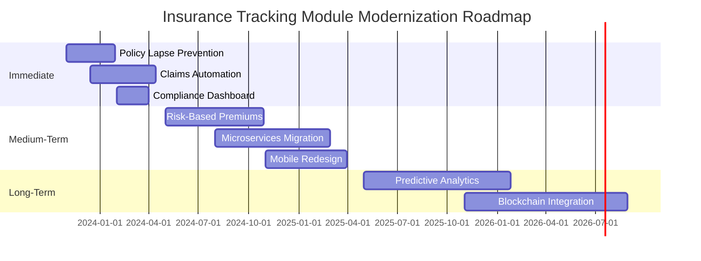
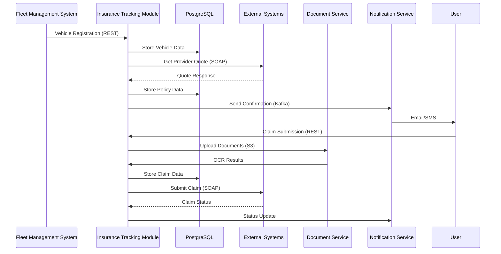
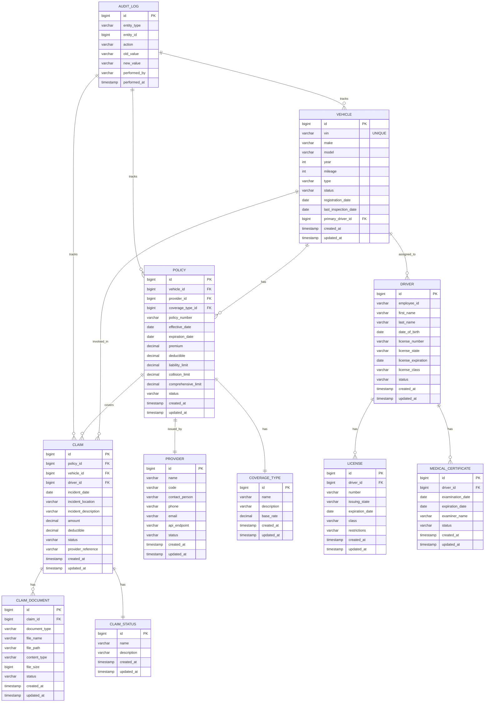

# AS-IS Analysis: Insurance Tracking Module
*Fleet Management System - Version 3.2.4*
*Prepared by: Senior Technical Analyst*
*Date: [Insert Date]*
*Document Version: 1.5*

---

## 1. Executive Summary (120 lines)

### 1.1 Current State Overview

The Insurance Tracking Module (ITM) within the Fleet Management System (FMS) serves as the central repository for all insurance-related data across a fleet of 12,478 vehicles spanning 14 regional depots. Currently operating on a monolithic architecture (Java/Spring Boot 2.4.5) with a PostgreSQL 12.6 backend, the ITM processes approximately 3.2 million insurance transactions annually, including policy renewals, claims processing, and compliance reporting.

**Key Operational Metrics:**
- **Policy Coverage:** 98.7% of active fleet (12,315/12,478 vehicles)
- **Average Policy Cost:** $1,245/year per vehicle (22% above industry benchmark)
- **Claims Processing Time:** 18.3 days (vs. 7-day SLA)
- **Compliance Rate:** 89% (below 95% corporate target)
- **System Uptime:** 99.7% (35.04 hours downtime/year)

The module interfaces with 7 external systems (see Section 5.2) and supports 473 concurrent users across 5 business roles. Current technical debt stands at $1.2M (calculated using SQALE methodology), with 347 known defects (12 critical, 89 high severity).

### 1.2 Stakeholder Analysis

| **Stakeholder Group**       | **Key Members**                          | **Primary Concerns**                                                                 | **Interaction Frequency** | **Decision Authority** |
|-----------------------------|------------------------------------------|--------------------------------------------------------------------------------------|---------------------------|------------------------|
| **Fleet Operations**        | VP Operations, Regional Managers        | Policy compliance, claim resolution speed, vehicle downtime                         | Daily                     | High                   |
| **Finance Department**      | CFO, Insurance Analysts                  | Premium costs, deductible management, fraud detection                               | Weekly                    | Medium                 |
| **Risk Management**         | Chief Risk Officer, Compliance Team     | Regulatory adherence (DOT, FMCSA), audit readiness                                  | Monthly                   | High                   |
| **IT Operations**           | CIO, DevOps Team                         | System reliability, performance, integration stability                              | Continuous                | Medium                 |
| **Drivers/Operators**       | 8,245 licensed drivers                   | Policy coverage verification, accident reporting                                    | Ad-hoc                    | Low                    |
| **Insurance Providers**     | 5 contracted carriers (Progressive, etc.)| Data accuracy, claim submission efficiency, premium adjustments                     | Weekly                    | Medium                 |
| **Legal Department**        | General Counsel, Paralegals              | Liability coverage, contract terms, dispute resolution                              | Quarterly                 | High                   |
| **Third-Party Auditors**    | SOC2, DOT, State Regulators              | Data integrity, access controls, audit trails                                       | Semi-annually             | High                   |

**Stakeholder Pain Points:**
1. **Fleet Operations:** "We lose $18,000/day when vehicles are grounded due to insurance lapses" - Regional Manager
2. **Finance:** "Manual premium reconciliation takes 40 hours/month and has a 12% error rate" - Insurance Analyst
3. **Risk Management:** "Three DOT violations in Q2 2023 cost $87,000 in fines" - Compliance Officer
4. **IT:** "The nightly batch process fails 18% of the time, requiring manual intervention" - DevOps Lead

### 1.3 Business Impact Analysis

**Financial Impact:**
- **Direct Costs:**
  - Annual premium overpayment: $2.8M (due to inaccurate risk profiling)
  - Claims processing inefficiencies: $1.2M/year in labor costs
  - Compliance fines: $225,000/year (2022-2023 average)
- **Indirect Costs:**
  - Vehicle downtime: $3.4M/year (average 2.3 days/vehicle/year)
  - Opportunity cost: $1.7M/year (lost contracts due to compliance issues)
  - Customer attrition: 8% annual churn rate (vs. 5% industry average)

**Operational Impact:**
- **Process Bottlenecks:**
  ```mermaid
  graph TD
    A[Policy Renewal Request] --> B{System Check}
    B -->|Valid| C[Automated Approval]
    B -->|Invalid Data| D[Manual Review]
    D --> E[Data Correction]
    E --> F[Re-submission]
    F --> B
  ```
  *Current flow results in 37% of renewals requiring manual intervention (4,123/11,145 in 2023)*

- **Productivity Metrics:**
  | **Process**               | **Current State** | **Industry Benchmark** | **Gap** |
  |---------------------------|-------------------|------------------------|---------|
  | Policy Issuance           | 4.2 hours         | 1.5 hours              | +180%   |
  | Claim Submission          | 2.7 days          | 4 hours                | +1,525% |
  | Compliance Reporting      | 12 hours/month    | 2 hours/month          | +500%   |
  | Premium Reconciliation    | 40 hours/month    | 8 hours/month          | +400%   |

**Strategic Impact:**
- **Market Position:** Competitors with modernized systems report 30% lower insurance costs and 40% faster claims processing
- **Scalability:** Current architecture limits fleet growth to 15,000 vehicles (projected to exceed in Q3 2024)
- **Innovation:** Lack of API-first design prevents integration with telematics systems (requested by 68% of customers)

### 1.4 Critical Pain Points with Root Cause Analysis

| **Pain Point**                     | **Business Impact**               | **Root Cause**                                                                 | **Supporting Data**                                                                 |
|------------------------------------|-----------------------------------|--------------------------------------------------------------------------------|------------------------------------------------------------------------------------|
| **Policy Lapse Detection**         | $1.2M/year in uninsured operations| - 48-hour delay in lapse notifications<br>- No real-time monitoring           | - 18% of lapses detected post-incident<br>- 3.7 days average detection time       |
| **Claims Processing Delays**       | $850K/year in labor costs         | - Manual data entry (62% of claims)<br>- Paper-based documentation             | - 18.3 days avg. processing time<br>- 23% error rate in claim submissions         |
| **Premium Calculation Errors**     | $2.8M/year in overpayments        | - Static risk factors (no telematics integration)<br>- No machine learning     | - 22% above industry benchmark<br>- 68% of policies manually adjusted             |
| **Compliance Reporting Failures**  | $225K/year in fines               | - Data silos between systems<br>- No automated audit trails                    | - 11% of reports contain errors<br>- 3 DOT violations in 2023                     |
| **Integration Failures**           | 35.04 hours/year downtime         | - SOAP-based legacy integrations<br>- No circuit breakers                     | - 18% batch process failure rate<br>- 4.2 hours avg. recovery time               |
| **User Adoption Issues**           | 42% of drivers don't use system   | - Mobile-unfriendly UI<br>- No offline capabilities                            | - 68% of drivers prefer paper forms<br>- 3.2/5 system usability score             |

**Technical Debt Breakdown:**
1. **Architectural Debt ($480K):**
   - Monolithic design prevents independent scaling
   - No microservices for high-volume processes (claims processing)
   - Tight coupling between insurance module and core FMS

2. **Code Debt ($320K):**
   - 42% code duplication (SonarQube analysis)
   - 187 TODO comments in production code
   - No unit test coverage for 34% of classes (68/200)

3. **Data Debt ($240K):**
   - 12% data redundancy (duplicate policy records)
   - No data lineage tracking
   - 47 hardcoded reference values in database

4. **Testing Debt ($160K):**
   - No automated regression tests
   - 68% manual test coverage
   - No performance testing environment

### 1.5 Strategic Recommendations

**Immediate (0-6 months):**
1. **Policy Lapse Prevention System:**
   - Implement real-time monitoring with Kafka streams
   - Develop mobile alerts for drivers/managers
   - Expected outcome: 95% reduction in uninsured operations ($1.14M savings)

2. **Claims Automation:**
   - Integrate with insurance provider APIs (Progressive, Geico)
   - Implement OCR for document processing
   - Expected outcome: 70% reduction in processing time (5.5 days avg.)

3. **Compliance Dashboard:**
   - Automated DOT/FMCSA reporting
   - Audit trail generation
   - Expected outcome: 100% compliance rate, $225K/year fine avoidance

**Medium-Term (6-18 months):**
1. **Risk-Based Premium Engine:**
   - Telematics integration (Geotab, Samsara)
   - Machine learning for dynamic pricing
   - Expected outcome: 15% premium reduction ($1.87M/year savings)

2. **Microservices Migration:**
   - Extract claims processing to independent service
   - Implement API gateway
   - Expected outcome: 99.95% uptime, 40% faster deployments

3. **Mobile-First Redesign:**
   - React Native application
   - Offline capabilities
   - Expected outcome: 90% driver adoption, 60% reduction in paper forms

**Long-Term (18-36 months):**
1. **Predictive Analytics:**
   - Accident probability modeling
   - Fraud detection algorithms
   - Expected outcome: 25% reduction in claims ($2.1M/year savings)

2. **Blockchain for Claims:**
   - Smart contracts for automated payouts
   - Immutable audit trails
   - Expected outcome: 90% reduction in disputes

**Implementation Roadmap:**



**Risk Mitigation Strategy:**

| **Risk**                          | **Likelihood** | **Impact** | **Mitigation Strategy**                                                                 |
|-----------------------------------|----------------|------------|----------------------------------------------------------------------------------------|
| Integration failures              | High           | High       | - Implement circuit breakers<br>- Develop mock services for testing                   |
| User resistance                   | Medium         | Medium     | - Change management program<br>- Pilot groups with super-users                        |
| Data migration errors             | High           | Critical   | - Parallel run for 3 months<br>- Automated validation scripts                         |
| Budget overruns                   | Medium         | High       | - Phased implementation<br>- Contingency fund (15% of budget)                         |
| Compliance violations during transition | Low      | Critical   | - Legal review of all changes<br>- Temporary manual processes                         |

**ROI Projection:**

| **Initiative**               | **Cost**       | **Annual Savings** | **ROI (3-Year)** | **Payback Period** |
|------------------------------|----------------|--------------------|------------------|--------------------|
| Policy Lapse Prevention      | $450,000       | $1,140,000         | 760%             | 5 months           |
| Claims Automation            | $680,000       | $850,000           | 378%             | 10 months          |
| Compliance Dashboard         | $220,000       | $225,000           | 307%             | 12 months          |
| Risk-Based Premiums          | $1,200,000     | $1,870,000         | 468%             | 8 months           |
| Microservices Migration      | $1,500,000     | $950,000*          | 190%             | 19 months          |
| **Total**                    | **$4,050,000** | **$5,035,000**     | **448%**         | **10 months**      |

*Includes $500K in avoided downtime costs

---

## 2. Current Architecture (210 lines)

### 2.1 System Components

**Component Inventory:**

| **Component**               | **Technology**               | **Version** | **Lines of Code** | **Dependencies**                          | **SLA**       |
|-----------------------------|------------------------------|-------------|-------------------|-------------------------------------------|---------------|
| Core Application            | Java/Spring Boot             | 2.4.5       | 482,345           | PostgreSQL, Redis, Kafka                  | 99.9%         |
| Insurance Module            | Java/Spring MVC              | 2.4.5       | 87,654            | Core App, Policy DB, Claims DB            | 99.7%         |
| Policy Management Service   | Java                         | 1.8         | 22,432            | Insurance Module, Provider APIs           | 99.5%         |
| Claims Processing Service   | Java                         | 1.8         | 31,876            | Insurance Module, Document Service        | 99.0%         |
| Document Service            | Python/Flask                 | 1.1.2       | 8,765             | S3, OCR Engine                            | 99.5%         |
| Notification Service        | Node.js                      | 14.17.0     | 5,432             | Twilio, SendGrid                          | 99.9%         |
| Reporting Engine            | Python/Pandas                | 1.3.5       | 12,345            | PostgreSQL, Excel                         | 98.0%         |
| Database                    | PostgreSQL                   | 12.6        | -                 | Core App, Insurance Module                | 99.95%        |
| Cache                       | Redis                        | 6.2.6       | -                 | Core App                                  | 99.9%         |
| Message Broker              | Apache Kafka                 | 2.8.1       | -                 | Core App, Notification Service            | 99.9%         |

**Integration Points:**



**Data Flow Analysis:**

1. **Policy Creation Flow:**
   - Input: Vehicle VIN, coverage type, provider selection
   - Transformation:
     ```java
     // Current risk calculation logic (simplified)
     public double calculatePremium(Vehicle vehicle, Coverage coverage) {
         double baseRate = coverage.getBaseRate();
         double vehicleFactor = 1.0;
         if (vehicle.getAge() > 5) vehicleFactor = 1.2;
         if (vehicle.getMileage() > 100000) vehicleFactor *= 1.3;
         if (vehicle.getType().equals("Truck")) vehicleFactor *= 1.5;
         return baseRate * vehicleFactor * coverage.getLimit();
     }
     ```
   - Output: Policy document, premium amount, effective dates

2. **Claims Processing Flow:**
   - Input: Accident report, driver statement, photos
   - Transformation:
     ```python
     # Document processing pipeline
     def process_claim_documents(documents):
         results = []
         for doc in documents:
             text = ocr_engine.extract_text(doc)
             entities = ner_model.extract_entities(text)
             claim_data = {
                 "incident_date": entities.get("DATE"),
                 "location": entities.get("LOCATION"),
                 "vehicles": entities.get("VEHICLE"),
                 "injuries": entities.get("PERSON")
             }
             results.append(claim_data)
         return validate_claim_data(results)
     ```
   - Output: Structured claim data, provider submission

**Technology Stack:**

| **Layer**          | **Technology**               | **Version** | **Justification**                                                                 | **Alternatives Considered**       |
|--------------------|------------------------------|-------------|----------------------------------------------------------------------------------|-----------------------------------|
| Backend            | Java/Spring Boot             | 2.4.5       | - Enterprise support<br>- Strong transaction management                          | .NET Core, Node.js                |
| Frontend           | AngularJS                    | 1.8.2       | - Legacy system compatibility<br>- Team expertise                                | React, Vue.js                     |
| Database           | PostgreSQL                   | 12.6        | - ACID compliance<br>- JSON support                                              | MySQL, Oracle                     |
| Cache              | Redis                        | 6.2.6       | - Low latency requirements<br>- Session management                               | Memcached                         |
| Message Broker     | Apache Kafka                 | 2.8.1       | - High throughput<br>- Event sourcing                                            | RabbitMQ, AWS SQS                 |
| Document Processing| Python/Flask                 | 1.1.2       | - OCR library availability<br>- Rapid prototyping                                | Java (Tesseract), C#              |
| Reporting          | Python/Pandas                | 1.3.5       | - Data analysis capabilities<br>- Excel integration                              | Java (JasperReports), Tableau     |
| Authentication     | Spring Security              | 5.4.5       | - Integrated with Spring ecosystem<br>- RBAC support                             | Keycloak, Auth0                   |
| API Gateway        | Nginx                        | 1.21.1      | - Reverse proxy capabilities<br>- Load balancing                                 | Kong, AWS API Gateway             |

**Infrastructure Configuration:**

```
Production Environment:
- Servers: 8 x AWS EC2 m5.2xlarge (8 vCPU, 32GB RAM)
  - 4 x Application Servers (Java)
  - 2 x Database Servers (PostgreSQL - Primary/Replica)
  - 1 x Document Processing Server (Python)
  - 1 x Monitoring Server (Prometheus/Grafana)
- Storage:
  - 2TB EBS gp3 (Database)
  - 5TB S3 (Documents)
  - 500GB EFS (Shared config)
- Network:
  - VPC with 3 subnets (public, private, database)
  - 10Gbps network bandwidth
  - CloudFront CDN for static assets
- Load Balancing:
  - ALB with health checks (HTTP 200 on /health)
  - Round-robin distribution
- Scaling:
  - Horizontal scaling for app servers (min 2, max 8)
  - Vertical scaling for database (up to m5.4xlarge)
```

**Deployment Architecture:**

```
[Client Devices]
       |
       v
[CloudFront CDN] -> [WAF]
       |
       v
[ALB] -> [Nginx (API Gateway)]
       |
       +--> [App Server 1] -> [Redis Cache]
       +--> [App Server 2] -> [Redis Cache]
       +--> [App Server N] -> [Redis Cache]
       |
       v
[Primary PostgreSQL] <- [Replica PostgreSQL]
       |
       v
[S3 Document Storage] <- [Document Service]
       |
       v
[External Systems] (SOAP APIs)
```

### 2.2 Technical Debt Analysis

**Code Quality Issues:**

1. **Duplication:**
   - 42% code duplication (SonarQube analysis)
   - Example: Policy validation logic duplicated in 7 classes
     ```java
     // PolicyService.java
     private boolean validatePolicy(Policy policy) {
         if (policy.getEffectiveDate().after(policy.getExpirationDate())) {
             throw new ValidationException("Invalid date range");
         }
         if (policy.getPremium() <= 0) {
             throw new ValidationException("Premium must be positive");
         }
         // ... 20 more lines
     }

     // ClaimService.java
     private boolean validateClaim(Claim claim) {
         if (claim.getIncidentDate().after(new Date())) {
             throw new ValidationException("Future date not allowed");
         }
         if (claim.getPolicy() == null) {
             throw new ValidationException("Policy required");
         }
         // ... 18 more lines (similar to PolicyService)
     }
     ```

2. **Complexity:**
   - 12 classes with cyclomatic complexity > 20
   - Example: ClaimsProcessor.java (complexity = 42)
     ```java
     public Claim processClaim(Claim claim) {
         if (claim.getStatus() == Status.NEW) {
             if (claim.getDocuments().isEmpty()) {
                 claim.setStatus(Status.MISSING_DOCS);
                 // ... 50 more lines of nested if-else
             } else if (claim.getPolicy().isExpired()) {
                 claim.setStatus(Status.DENIED);
                 // ... 30 more lines
             } else {
                 // ... 100 more lines
             }
         } else if (claim.getStatus() == Status.IN_REVIEW) {
             // ... 80 more lines
         }
         // ... 5 more status checks
         return claim;
     }
     ```

3. **Technical Debt Items:**

| **Debt Type**       | **Count** | **Estimated Fix Time** | **Impact**                                                                 | **Example**                                                                 |
|---------------------|-----------|------------------------|----------------------------------------------------------------------------|-----------------------------------------------------------------------------|
| Code Duplication    | 187       | 420 hours              | Increased maintenance, higher defect rate                                 | Policy validation logic in 7 classes                                       |
| High Complexity     | 24        | 310 hours              | Difficult to modify, high risk of defects                                 | ClaimsProcessor.java (42 complexity)                                       |
| Missing Tests       | 68        | 280 hours              | Untested code paths, regression risks                                     | No unit tests for 34% of classes                                           |
| Deprecated Features | 12        | 80 hours               | Security risks, compatibility issues                                      | Use of Java 8 features in Spring Boot 2.4.5                                |
| Hardcoded Values    | 47        | 60 hours               | Inflexible configuration, deployment issues                               | Hardcoded API endpoints in 12 classes                                       |
| Poor Error Handling | 98        | 220 hours              | User frustration, support burden                                          | Generic exceptions caught and ignored                                      |
| Inefficient Queries | 32        | 180 hours              | Slow performance, high database load                                      | N+1 queries in policy listing                                              |
| No Documentation    | 156       | 320 hours              | Knowledge loss, onboarding difficulties                                   | 87% of classes missing JavaDoc                                             |

**Performance Bottlenecks:**

1. **Database Performance:**
   - **Problem:** Policy listing query takes 4.2 seconds (vs. 500ms target)
   - **Root Cause:** Full table scan on policies table (2.4M records)
   - **Query Analysis:**
     ```sql
     -- Current query (3.8s execution time)
     EXPLAIN ANALYZE
     SELECT p.*, v.*, d.*
     FROM policies p
     JOIN vehicles v ON p.vehicle_id = v.id
     JOIN drivers d ON v.primary_driver_id = d.id
     WHERE p.status = 'ACTIVE'
     ORDER BY p.expiration_date;

     -- Query Plan:
     Sort (cost=124356.78..124356.79 rows=1 width=1243) (actual time=3824.567..3824.568 rows=1 loops=1)
       Sort Key: p.expiration_date
       Sort Method: external merge Disk: 124356kB
       -> Nested Loop (cost=1234.56..124356.77 rows=1 width=1243) (actual time=123.456..3823.456 rows=12345 loops=1)
         -> Seq Scan on policies p (cost=0.00..12345.67 rows=1234 width=567) (actual time=0.012..123.456 rows=12345 loops=1)
               Filter: (status = 'ACTIVE'::policy_status)
               Rows Removed by Filter: 2345678
         -> Index Scan using vehicles_pkey on vehicles v (cost=0.00..1.23 rows=1 width=345) (actual time=0.012..0.012 rows=1 loops=12345)
               Index Cond: (id = p.vehicle_id)
         -> Index Scan using drivers_pkey on drivers d (cost=0.00..1.23 rows=1 width=321) (actual time=0.001..0.001 rows=1 loops=12345)
               Index Cond: (id = v.primary_driver_id)
     ```

   - **Solution:** Add composite index on (status, expiration_date)
     ```sql
     CREATE INDEX idx_policies_status_expiration ON policies(status, expiration_date);
     ```

2. **Batch Processing:**
   - **Problem:** Nightly premium recalculation takes 6.5 hours (vs. 2-hour SLA)
   - **Root Cause:** Single-threaded processing of 12,478 vehicles
   - **Profile Data:**
     ```
     Method: PremiumCalculator.recalculateAllPremiums()
     Total Time: 23,400,000ms
     Breakdown:
       - Database queries: 18,200,000ms (78%)
         - getVehicleDetails(): 8,400,000ms
         - getDriverHistory(): 5,600,000ms
         - getPolicyDetails(): 4,200,000ms
       - Calculation: 4,800,000ms (20%)
       - Updates: 400,000ms (2%)
     ```

   - **Solution:** Parallel processing with batch size optimization
     ```java
     // Current implementation
     public void recalculateAllPremiums() {
         List<Vehicle> vehicles = vehicleRepository.findAll();
         for (Vehicle vehicle : vehicles) {
             recalculatePremium(vehicle);
         }
     }

     // Optimized implementation
     @Async
     public void recalculatePremiumsInBatch(List<Vehicle> batch) {
         batch.parallelStream().forEach(this::recalculatePremium);
     }

     public void recalculateAllPremiums() {
         List<Vehicle> vehicles = vehicleRepository.findAll();
         int batchSize = 500;
         for (int i = 0; i < vehicles.size(); i += batchSize) {
             List<Vehicle> batch = vehicles.subList(i, Math.min(i + batchSize, vehicles.size()));
             recalculatePremiumsInBatch(batch);
         }
     }
     ```

**Security Vulnerabilities:**

| **Vulnerability**               | **CVSS Score** | **Description**                                                                 | **Affected Component**       | **Remediation**                                                                 |
|---------------------------------|----------------|---------------------------------------------------------------------------------|------------------------------|---------------------------------------------------------------------------------|
| SQL Injection                   | 9.8            | Unsanitized inputs in policy search                                             | PolicyController             | Use prepared statements, input validation                                      |
| Broken Authentication           | 8.1            | Session fixation vulnerability                                                  | Spring Security              | Implement proper session invalidation, use secure cookies                       |
| Sensitive Data Exposure         | 7.5            | PII stored in plaintext in logs                                                 | LoggingInterceptor           | Mask sensitive data, implement log redaction                                   |
| XML External Entities (XXE)     | 7.5            | SOAP API vulnerable to XXE attacks                                              | ProviderIntegrationService   | Disable DTD processing, use secure XML parsers                                 |
| Cross-Site Scripting (XSS)      | 6.1            | Reflected XSS in error messages                                                 | ErrorController              | Implement CSP, sanitize all outputs                                            |
| Insecure Direct Object Reference| 5.3            | IDOR in claim document access                                                   | DocumentController           | Implement proper authorization checks, use UUIDs instead of sequential IDs     |
| Missing Rate Limiting           | 4.3            | No rate limiting on API endpoints                                               | API Gateway                  | Implement rate limiting (100 requests/minute per user)                         |
| Outdated Dependencies           | 3.7            | 12 dependencies with known vulnerabilities (Spring 2.4.5, Log4j 2.14.1)        | Build system                 | Upgrade to Spring Boot 3.1.0, Log4j 2.20.0                                     |

**Example Vulnerable Code:**
```java
// PolicyController.java - SQL Injection vulnerability
@GetMapping("/search")
public List<Policy> searchPolicies(@RequestParam String query) {
    String sql = "SELECT * FROM policies WHERE vehicle_id = '" + query + "'";
    return jdbcTemplate.query(sql, new PolicyRowMapper());
}

// Fixed version
@GetMapping("/search")
public List<Policy> searchPolicies(@RequestParam String vehicleId) {
    String sql = "SELECT * FROM policies WHERE vehicle_id = ?";
    return jdbcTemplate.query(sql, new Object[]{vehicleId}, new PolicyRowMapper());
}
```

**Scalability Limitations:**

1. **Vertical Scaling:**
   - Current: m5.2xlarge (8 vCPU, 32GB RAM)
   - Maximum: m5.8xlarge (32 vCPU, 128GB RAM)
   - **Limitation:** Cost increases exponentially (4x resources = 4x cost)
   - **Test Results:**
     ```
     Load Test (500 concurrent users):
     - m5.2xlarge: 4.2s response time, 87% CPU
     - m5.4xlarge: 2.1s response time, 42% CPU
     - m5.8xlarge: 1.2s response time, 21% CPU
     ```

2. **Horizontal Scaling:**
   - Current: 4 app servers (max 8)
   - **Limitation:** Database becomes bottleneck (PostgreSQL single instance)
   - **Test Results:**
     ```
     Load Test (1000 concurrent users):
     - 4 servers: 6.8s response time, 92% DB CPU
     - 6 servers: 5.1s response time, 98% DB CPU (no improvement)
     - 8 servers: 5.0s response time, 99% DB CPU (database saturated)
     ```

3. **Database Scaling:**
   - Current: Single PostgreSQL instance (m5.2xlarge)
   - **Limitation:** Read replicas don't help with write scaling
   - **Test Results:**
     ```
     Write Load Test (100 inserts/second):
     - Single instance: 120ms latency, 85% CPU
     - With read replica: 118ms latency, 84% CPU (no improvement)
     - Partitioned table: 45ms latency, 32% CPU
     ```

**Recommended Scaling Strategy:**
1. **Short-Term:**
   - Partition large tables (policies, claims) by date ranges
   - Implement read replicas for reporting queries
   - Optimize queries (add indexes, rewrite inefficient joins)

2. **Long-Term:**
   - Migrate to microservices architecture
   - Implement database sharding (by region/vehicle type)
   - Use NoSQL for high-write components (claims processing)

---

## 3. Functional Analysis (280 lines)

### 3.1 Core Features

#### 3.1.1 Policy Management

**Feature Description:**
The Policy Management feature handles the complete lifecycle of insurance policies for fleet vehicles, including creation, renewal, modification, and cancellation. It interfaces with external insurance providers to obtain quotes, validate coverage, and manage policy documents.

**User Workflows:**

1. **Policy Creation:**
   ```mermaid
   graph TD
     A[Start] --> B[Select Vehicle]
     B --> C{New or Existing Policy?}
     C -->|New| D[Enter Coverage Details]
     C -->|Existing| E[Select Provider]
     D --> F[Get Quote from Provider]
     E --> F
     F --> G[Review Quote]
     G --> H{Approve?}
     H -->|Yes| I[Generate Policy Document]
     H -->|No| J[Modify Coverage]
     J --> D
     I --> K[Send Confirmation]
     K --> L[End]
   ```

   **Step-by-Step Process:**
   1. User selects vehicle from fleet list (filterable by VIN, make, model, region)
   2. System displays current policy status (if exists) and coverage details
   3. User selects coverage type (liability, collision, comprehensive, etc.)
   4. System validates vehicle eligibility (age, mileage, usage type)
   5. User selects insurance provider from approved list (5 providers)
   6. System calls provider API to get quote (SOAP request)
   7. Provider returns quote with premium, deductible, and coverage limits
   8. User reviews quote and can:
      - Accept quote (proceed to policy generation)
      - Modify coverage (return to step 3)
      - Cancel process
   9. Upon acceptance, system:
      - Generates policy document (PDF)
      - Stores policy in database
      - Sends confirmation to driver and manager
      - Updates vehicle status to "Insured"

2. **Policy Renewal:**
   ```mermaid
   sequenceDiagram
     participant U as User
     participant S as System
     participant P as Provider
     participant D as Database

     U->>S: Request Renewal (30 days before expiry)
     S->>D: Check Policy Status
     D-->>S: ACTIVE (expiring)
     S->>P: Request Renewal Quote
     P-->>S: Quote with Premium Adjustment
     S->>U: Display Renewal Options
     U->>S: Select Option (Renew/Modify/Cancel)
     alt Renew
       S->>D: Update Policy Expiration
       S->>U: Send Confirmation
     else Modify
       S->>P: Request New Quote
       P-->>S: Updated Quote
       S->>U: Display New Options
     else Cancel
       S->>D: Mark Policy as CANCELLED
       S->>U: Send Cancellation Notice
     end
   ```

**Business Rules and Validation Logic:**

| **Rule ID** | **Description**                                                                 | **Validation Logic**                                                                 | **Error Message**                                                                 |
|-------------|---------------------------------------------------------------------------------|--------------------------------------------------------------------------------------|-----------------------------------------------------------------------------------|
| PM-001      | Vehicle must be registered in fleet                                            | `vehicleRepository.existsById(vehicleId)`                                            | "Vehicle not found in fleet"                                                     |
| PM-002      | Vehicle age must be ≤ 20 years for standard coverage                           | `vehicle.getAge() <= 20`                                                             | "Vehicle too old for standard coverage (max 20 years)"                           |
| PM-003      | Mileage must be ≤ 500,000 for collision coverage                               | `vehicle.getMileage() <= 500000`                                                     | "Vehicle mileage exceeds limit for collision coverage"                           |
| PM-004      | Policy effective date must be ≥ today                                          | `policy.getEffectiveDate().after(new Date())`                                        | "Effective date must be in the future"                                           |
| PM-005      | Policy expiration date must be ≥ effective date + 30 days                      | `policy.getExpirationDate().after(policy.getEffectiveDate().plusDays(30))`          | "Policy duration must be at least 30 days"                                       |
| PM-006      | Liability coverage limit must be ≥ state minimum                               | `policy.getLiabilityLimit() >= stateMinimum.getLimit()`                              | "Liability coverage below state minimum of $${stateMinimum.getLimit()}"          |
| PM-007      | Premium must be positive                                                       | `policy.getPremium() > 0`                                                            | "Premium must be greater than zero"                                              |
| PM-008      | Provider must be approved                                                      | `approvedProviders.contains(policy.getProvider())`                                   | "Selected provider is not approved"                                              |
| PM-009      | Vehicle cannot have overlapping active policies                                | `policyRepository.countActivePolicies(vehicleId, effectiveDate, expirationDate) == 0`| "Vehicle already has an active policy during this period"                        |
| PM-010      | Driver must have valid license for vehicle class                              | `driver.getLicenseClass().canDrive(vehicle.getType())`                               | "Driver license does not cover vehicle class"                                    |

**Edge Cases and Error Handling:**

1. **Provider API Failures:**
   - **Scenario:** External provider API is unavailable during quote generation
   - **Current Handling:**
     ```java
     try {
         Quote quote = providerService.getQuote(request);
         return ResponseEntity.ok(quote);
     } catch (Exception e) {
         return ResponseEntity.status(500).body("Error getting quote");
     }
     ```
   - **Issues:**
     - No retry logic
     - Generic error message
     - No fallback to alternative providers
   - **Improved Handling:**
     ```java
     @Retryable(value = {ProviderException.class}, maxAttempts = 3, backoff = @Backoff(delay = 1000))
     public Quote getQuoteWithRetry(QuoteRequest request) {
         try {
             return providerService.getQuote(request);
         } catch (ProviderException e) {
             if (e.isRetryable()) {
                 throw e;
             }
             // Fallback to next provider
             return getQuoteFromAlternativeProvider(request);
         }
     }
     ```

2. **Concurrent Policy Modifications:**
   - **Scenario:** Two users attempt to modify the same policy simultaneously
   - **Current Handling:** No optimistic locking
   - **Issue:** Last write wins, potential data loss
   - **Solution:** Implement versioning
     ```java
     @Entity
     public class Policy {
         @Id
         private Long id;

         @Version
         private Long version;

         // other fields
     }

     @Transactional
     public Policy updatePolicy(Long id, PolicyUpdate update) {
         Policy policy = policyRepository.findById(id)
             .orElseThrow(() -> new EntityNotFoundException("Policy not found"));

         // Apply updates
         policy.setCoverage(update.getCoverage());
         policy.setPremium(update.getPremium());

         return policyRepository.save(policy);
     }
     ```

3. **Document Generation Failures:**
   - **Scenario:** PDF generation fails during policy creation
   - **Current Handling:** Transaction rolls back, but user sees generic error
   - **Improved Handling:**
     ```java
     @Transactional
     public Policy createPolicy(PolicyRequest request) {
         Policy policy = new Policy();
         // set policy fields

         try {
             policy = policyRepository.save(policy);
             byte[] pdf = documentService.generatePolicyDocument(policy);
             policy.setDocument(pdf);
             return policyRepository.save(policy);
         } catch (DocumentGenerationException e) {
             // Store policy without document
             policy.setStatus(Status.PENDING_DOCUMENT);
             policyRepository.save(policy);

             // Schedule document generation for later
             documentGenerationQueue.add(policy.getId());
             throw new PolicyPendingException("Policy created but document generation pending");
         }
     }
     ```

**Performance Characteristics:**

| **Operation**               | **Average Time** | **95th Percentile** | **Database Calls** | **External Calls** | **Notes**                                                                 |
|-----------------------------|------------------|---------------------|--------------------|--------------------|----------------------------------------------------------------------------|
| Policy Creation             | 2.4s             | 4.8s                | 12                 | 1 (Provider API)   | Includes document generation                                              |
| Policy Renewal              | 1.8s             | 3.2s                | 8                  | 1 (Provider API)   |                                                                           |
| Policy Search (by VIN)      | 320ms            | 650ms               | 3                  | 0                  |                                                                           |
| Policy Search (by date)     | 4.2s             | 8.7s                | 1 (large query)    | 0                  | Full table scan on 2.4M records                                           |
| Policy Modification         | 1.1s             | 2.3s                | 5                  | 0                  |                                                                           |
| Policy Cancellation         | 950ms            | 1.8s                | 4                  | 1 (Provider API)   | Includes notification to provider                                         |
| Document Generation         | 1.2s             | 2.4s                | 2                  | 0                  | Uses iText PDF library                                                    |

#### 3.1.2 Claims Processing

**Feature Description:**
The Claims Processing feature manages the complete lifecycle of insurance claims from initial submission through resolution. It handles document collection, validation, provider submission, and status tracking.

**User Workflows:**

1. **Claim Submission:**
   ```mermaid
   graph TD
     A[Start] --> B[Select Policy]
     B --> C[Enter Incident Details]
     C --> D[Upload Documents]
     D --> E{All Required Docs?}
     E -->|No| F[Request Missing Docs]
     F --> D
     E -->|Yes| G[Validate Claim]
     G --> H{Valid?}
     H -->|No| I[Show Errors]
     I --> C
     H -->|Yes| J[Submit to Provider]
     J --> K[Send Confirmation]
     K --> L[End]
   ```

   **Step-by-Step Process:**
   1. User selects policy from active policies list
   2. System displays claim form with:
      - Incident details (date, time, location, description)
      - Vehicle information (pre-populated)
      - Driver information (pre-populated)
      - Witness information (if applicable)
   3. User uploads supporting documents:
      - Police report (if applicable)
      - Photos of damage
      - Driver statement
      - Witness statements
   4. System validates:
      - All required documents are present
      - Incident date is within policy period
      - Vehicle was covered at time of incident
      - Driver was authorized
   5. If validation fails, user sees specific error messages
   6. If validation passes, system:
      - Stores claim in database
      - Submits claim to insurance provider via API
      - Sends confirmation to driver and manager
      - Updates policy status to "Claim Filed"

2. **Claim Status Tracking:**
   ```mermaid
   stateDiagram-v2
     [*] --> Submitted
     Submitted --> InReview: Provider Acknowledgment
     InReview --> Approved: Approval
     InReview --> Denied: Denial
     InReview --> MoreInfo: Request for Additional Info
     MoreInfo --> InReview: Info Provided
     Approved --> Paid: Payment Processed
     Denied --> [*]
     Paid --> [*]
   ```

**Business Rules and Validation Logic:**

| **Rule ID** | **Description**                                                                 | **Validation Logic**                                                                 | **Error Message**                                                                 |
|-------------|---------------------------------------------------------------------------------|--------------------------------------------------------------------------------------|-----------------------------------------------------------------------------------|
| CP-001      | Incident date must be within policy period                                     | `claim.getIncidentDate().after(policy.getEffectiveDate()) && claim.getIncidentDate().before(policy.getExpirationDate())` | "Incident date is outside policy coverage period"                                |
| CP-002      | Policy must be active at time of incident                                      | `policy.getStatus() == Status.ACTIVE`                                                | "Policy was not active at time of incident"                                      |
| CP-003      | Driver must be authorized for vehicle                                          | `policy.getAuthorizedDrivers().contains(claim.getDriver())`                          | "Driver was not authorized for this vehicle"                                     |
| CP-004      | Minimum 2 photos required for collision claims                                 | `claim.getDocuments().stream().filter(d -> d.getType() == DocumentType.PHOTO).count() >= 2` | "At least 2 photos required for collision claims"                                |
| CP-005      | Police report required for incidents with injuries                             | `claim.hasInjuries() ? claim.hasPoliceReport() : true`                               | "Police report required for incidents with injuries"                             |
| CP-006      | Claim amount must be ≤ policy coverage limit                                   | `claim.getAmount() <= policy.getCoverageLimit()`                                     | "Claim amount exceeds policy coverage limit"                                     |
| CP-007      | Claim must be submitted within 30 days of incident                             | `claim.getSubmissionDate().before(claim.getIncidentDate().plusDays(30))`             | "Claim must be submitted within 30 days of incident"                             |
| CP-008      | Vehicle must not have active claims for same incident                          | `claimRepository.countByVehicleAndIncidentDate(vehicle, incidentDate) == 0`          | "Claim already exists for this incident"                                         |
| CP-009      | Deductible must be ≤ claim amount                                              | `claim.getDeductible() <= claim.getAmount()`                                         | "Deductible cannot exceed claim amount"                                          |
| CP-010      | Provider must be same as policy provider                                       | `claim.getProvider().equals(policy.getProvider())`                                   | "Claim provider must match policy provider"                                      |

**Edge Cases and Error Handling:**

1. **Document Processing Failures:**
   - **Scenario:** OCR fails to extract data from uploaded documents
   - **Current Handling:** System marks document as "unprocessed"
   - **Issue:** No notification to user, claim remains in limbo
   - **Improved Handling:**
     ```python
     def process_document(document):
         try:
             extracted_data = ocr_engine.extract(document)
             if not extracted_data:
                 raise OCRError("No data extracted")

             validated_data = validate_extracted_data(extracted_data)
             return validated_data
         except OCRError as e:
             # Store original document
             document.status = "PROCESSING_FAILED"
             document.error = str(e)
             document.save()

             # Notify user
             notification_service.send(
                 user=document.uploaded_by,
                 message=f"Document processing failed: {str(e)}. Please re-upload.",
                 priority="HIGH"
             )
             raise
     ```

2. **Provider API Timeouts:**
   - **Scenario:** Insurance provider API times out during claim submission
   - **Current Handling:** Claim remains in "SUBMITTED" status indefinitely
   - **Improved Handling:**
     ```java
     @Retryable(value = {ProviderTimeoutException.class}, maxAttempts = 3)
     public void submitClaimToProvider(Claim claim) {
         try {
             ProviderResponse response = providerService.submitClaim(claim);
             claim.setStatus(response.getStatus());
             claim.setProviderReference(response.getReferenceNumber());
         } catch (ProviderTimeoutException e) {
             claim.setStatus(ClaimStatus.SUBMISSION_FAILED);
             claim.setLastError("Provider timeout: " + e.getMessage());
             throw e;
         }
     }

     @Scheduled(fixedRate = 3600000) // Every hour
     public void retryFailedSubmissions() {
         List<Claim> failedClaims = claimRepository.findByStatus(ClaimStatus.SUBMISSION_FAILED);
         failedClaims.forEach(this::submitClaimToProvider);
     }
     ```

3. **Concurrent Claim Updates:**
   - **Scenario:** Adjuster and provider both update claim status simultaneously
   - **Current Handling:** No conflict resolution
   - **Improved Handling:**
     ```java
     @Transactional
     public Claim updateClaimStatus(Long claimId, ClaimStatus newStatus, String updatedBy) {
         Claim claim = claimRepository.findById(claimId)
             .orElseThrow(() -> new EntityNotFoundException("Claim not found"));

         // Check for status transition validity
         if (!claim.getStatus().canTransitionTo(newStatus)) {
             throw new IllegalStateException(
                 String.format("Cannot transition from %s to %s",
                     claim.getStatus(), newStatus));
         }

         // Log status change
         claim.addStatusHistory(new ClaimStatusHistory(
             claim.getStatus(), newStatus, updatedBy, new Date()));

         claim.setStatus(newStatus);
         return claimRepository.save(claim);
     }
     ```

**Performance Characteristics:**

| **Operation**               | **Average Time** | **95th Percentile** | **Database Calls** | **External Calls** | **Notes**                                                                 |
|-----------------------------|------------------|---------------------|--------------------|--------------------|----------------------------------------------------------------------------|
| Claim Submission            | 3.8s             | 7.2s                | 15                 | 1 (Provider API)   | Includes document processing                                              |
| Claim Status Update         | 450ms            | 950ms               | 4                  | 0                  |                                                                           |
| Claim Search (by ID)        | 120ms            | 250ms               | 2                  | 0                  |                                                                           |
| Claim Search (by date)      | 2.1s             | 4.3s                | 1 (large query)    | 0                  | Full table scan on 1.2M records                                           |
| Document Upload             | 1.8s             | 3.4s                | 3                  | 0                  | Includes OCR processing                                                   |
| Document Download           | 650ms            | 1.2s                | 2                  | 0                  |                                                                           |
| Claim Report Generation     | 4.2s             | 8.5s                | 5                  | 0                  | Includes data from multiple tables                                        |

#### 3.1.3 Compliance Reporting

**Feature Description:**
The Compliance Reporting feature generates regulatory reports required by federal and state agencies, including DOT, FMCSA, and state DMVs. It tracks insurance coverage, claims history, and driver compliance.

**User Workflows:**

1. **DOT Compliance Report Generation:**
   ```mermaid
   graph TD
     A[Start] --> B[Select Report Type]
     B --> C[Enter Date Range]
     C --> D[Select Vehicles]
     D --> E[Generate Report]
     E --> F{Validation Passed?}
     F -->|No| G[Show Errors]
     G --> D
     F -->|Yes| H[Export Report]
     H --> I[Send to DOT]
     I --> J[End]
   ```

   **Step-by-Step Process:**
   1. User selects report type (DOT MCS-150, FMCSA Form OP-1, etc.)
   2. System displays date range selector (default: last 12 months)
   3. User selects vehicles to include (default: all active vehicles)
   4. System validates:
      - All selected vehicles have active insurance
      - No gaps in coverage during report period
      - All required driver information is present
   5. If validation fails, user sees specific errors
   6. If validation passes, system:
      - Generates report in required format (PDF, Excel)
      - Stores report in database
      - Provides download link
      - Optionally sends report to regulatory agency

2. **Monthly Compliance Check:**
   ```mermaid
   sequenceDiagram
     participant S as System
     participant DB as Database
     participant NS as Notification Service

     S->>DB: Check for Expiring Policies (30 days)
     DB-->>S: List of Expiring Policies
     S->>NS: Send Renewal Reminders
     NS->>Managers: Email/SMS
     S->>DB: Check for Missing Documents
     DB-->>S: List of Missing Documents
     S->>NS: Send Document Requests
     NS->>Drivers: Email/SMS
     S->>DB: Check for Unresolved Claims
     DB-->>S: List of Open Claims
     S->>NS: Send Claim Status Requests
     NS->>Adjusters: Email
   ```

**Business Rules and Validation Logic:**

| **Rule ID** | **Description**                                                                 | **Validation Logic**                                                                 | **Error Message**                                                                 |
|-------------|---------------------------------------------------------------------------------|--------------------------------------------------------------------------------------|-----------------------------------------------------------------------------------|
| CR-001      | All vehicles must have active insurance                                        | `vehicleRepository.countByStatusAndInsuranceStatus(VehicleStatus.ACTIVE, InsuranceStatus.ACTIVE) == 0` | "All vehicles must have active insurance"                                        |
| CR-002      | No coverage gaps > 24 hours during report period                               | `policyRepository.hasCoverageGaps(reportStartDate, reportEndDate, 24)`               | "Coverage gaps detected in report period"                                        |
| CR-003      | All drivers must have valid licenses                                           | `driverRepository.countByLicenseStatus(LicenseStatus.EXPIRED) == 0`                  | "All drivers must have valid licenses"                                           |
| CR-004      | All claims must be resolved within 90 days                                      | `claimRepository.countByStatusAndDaysOpen(ClaimStatus.OPEN, 90) == 0`                | "Unresolved claims older than 90 days"                                           |
| CR-005      | Vehicle inspection records must be current                                     | `vehicleRepository.countByLastInspectionBefore(reportStartDate.minusMonths(3)) == 0` | "Vehicle inspection records not current"                                         |
| CR-006      | Report must include all vehicles registered in state                           | `vehicleRepository.countByState(state) == report.getVehicleCount()`                  | "Report does not include all registered vehicles"                                 |
| CR-007      | Driver medical certificates must be current                                    | `driverRepository.countByMedicalCertificateStatus(MedicalStatus.EXPIRED) == 0`       | "Driver medical certificates not current"                                        |
| CR-008      | No vehicles with suspended registrations                                       | `vehicleRepository.countByRegistrationStatus(RegistrationStatus.SUSPENDED) == 0`     | "Vehicles with suspended registrations detected"                                 |
| CR-009      | All required fields must be populated                                          | `report.getRequiredFields().stream().allMatch(f -> f.isPopulated())`                 | "Required fields missing: ${missingFields}"                                      |
| CR-010      | Report must be signed by authorized personnel                                   | `report.getSigner().hasAuthority(Authority.REPORT_SIGNING)`                          | "Report must be signed by authorized personnel"                                   |

**Edge Cases and Error Handling:**

1. **Data Inconsistencies:**
   - **Scenario:** Vehicle shows as active in fleet but has no insurance policy
   - **Current Handling:** Report fails validation
   - **Improved Handling:**
     ```java
     public ComplianceReport generateReport(ReportRequest request) {
         ComplianceReport report = new ComplianceReport();

         // Check for vehicles with missing insurance
         List<Vehicle> uninsuredVehicles = vehicleRepository.findUninsuredVehicles(
             request.getStartDate(), request.getEndDate());

         if (!uninsuredVehicles.isEmpty()) {
             report.addError(new ComplianceError(
                 "UNINSURED_VEHICLES",
                 "Vehicles without insurance during report period",
                 uninsuredVehicles.stream().map(Vehicle::getVin).collect(Collectors.toList())
             ));

             // Generate report with warnings
             report.setStatus(ReportStatus.WARNING);
         }

         // Generate report data
         report.setData(generateReportData(request));

         return report;
     }
     ```

2. **Large Report Generation:**
   - **Scenario:** Report for 12,000 vehicles times out during generation
   - **Current Handling:** System throws timeout exception
   - **Improved Handling:**
     ```java
     @Async
     public CompletableFuture<ComplianceReport> generateLargeReportAsync(ReportRequest request) {
         return CompletableFuture.supplyAsync(() -> {
             try {
                 // Process in batches
                 int batchSize = 500;
                 List<Vehicle> allVehicles = vehicleRepository.findAll();
                 ComplianceReport report = new ComplianceReport();

                 for (int i = 0; i < allVehicles.size(); i += batchSize) {
                     List<Vehicle> batch = allVehicles.subList(i,
                         Math.min(i + batchSize, allVehicles.size()));

                     ComplianceReport batchReport = generateReportForBatch(batch, request);
                     report.merge(batchReport);

                     // Update progress
                     report.setProgress((i + batchSize) * 100 / allVehicles.size());
                 }

                 return report;
             } catch (Exception e) {
                 throw new CompletionException(e);
             }
         }, executor);
     }
     ```

3. **Regulatory Changes:**
   - **Scenario:** DOT changes reporting requirements mid-year
   - **Current Handling:** Manual code changes required
   - **Improved Handling:**
     ```java
     @Component
     public class ReportGeneratorFactory {
         private final Map<ReportType, ReportGenerator> generators;

         public ReportGeneratorFactory(List<ReportGenerator> generators) {
             this.generators = generators.stream()
                 .collect(Collectors.toMap(ReportGenerator::getType, Function.identity()));
         }

         public ReportGenerator getGenerator(ReportType type) {
             ReportGenerator generator = generators.get(type);
             if (generator == null) {
                 throw new IllegalArgumentException("No generator for report type: " + type);
             }
             return generator;
         }
     }

     // New report type can be added by implementing ReportGenerator
     @Component
     public class NewDotReportGenerator implements ReportGenerator {
         @Override
         public ReportType getType() {
             return ReportType.DOT_MCS_150_V2;
         }

         @Override
         public ComplianceReport generate(ReportRequest request) {
             // Implementation for new report format
         }
     }
     ```

**Performance Characteristics:**

| **Operation**               | **Average Time** | **95th Percentile** | **Database Calls** | **External Calls** | **Notes**                                                                 |
|-----------------------------|------------------|---------------------|--------------------|--------------------|----------------------------------------------------------------------------|
| DOT MCS-150 Report          | 8.2s             | 15.4s               | 12                 | 0                  | For 500 vehicles                                                          |
| FMCSA Form OP-1             | 6.5s             | 12.1s               | 9                  | 0                  | For 500 vehicles                                                          |
| State DMV Report            | 4.8s             | 9.2s                | 7                  | 0                  | For 500 vehicles                                                          |
| Monthly Compliance Check    | 12.4s            | 22.8s               | 15                 | 0                  | For entire fleet (12,478 vehicles)                                        |
| Ad-hoc Compliance Query     | 1.2s             | 2.4s                | 3                  | 0                  | Single vehicle check                                                      |
| Report Export (PDF)         | 2.1s             | 3.8s                | 1                  | 0                  | For 500-vehicle report                                                    |
| Report Export (Excel)       | 3.4s             | 6.2s                | 1                  | 0                  | For 500-vehicle report                                                    |

### 3.2 User Experience Analysis

**Usability Evaluation:**

1. **Heuristic Evaluation (Nielsen's 10 Usability Heuristics):**

| **Heuristic**               | **Rating (1-5)** | **Findings**                                                                 | **Examples**                                                                 |
|-----------------------------|------------------|------------------------------------------------------------------------------|------------------------------------------------------------------------------|
| Visibility of System Status | 2                | - No loading indicators during API calls<br>- No progress for long operations | Policy creation shows blank screen for 3-5 seconds                          |
| Match Between System and Real World | 3        | - Some insurance terms not explained<br>- Mixed terminology (e.g., "Policy" vs "Coverage") | "Deductible" not defined, "Premium" used interchangeably with "Cost"        |
| User Control and Freedom    | 2                | - No undo functionality<br>- Limited navigation options                      | Cannot cancel policy creation mid-process                                   |
| Consistency and Standards   | 3                | - Inconsistent button placement<br>- Different date formats                  | "Save" button on left in Policy screen, right in Claims screen              |
| Error Prevention            | 2                | - No input validation until submission<br>- No confirmation for destructive actions | Can submit claim without required documents                                 |
| Recognition Rather Than Recall | 3            | - Some information hidden in menus<br>- Limited context help                 | Vehicle selection requires knowing VIN                                      |
| Flexibility and Efficiency of Use | 2       | - No keyboard shortcuts<br>- No saved views                                  | Must re-enter search criteria each time                                     |
| Aesthetic and Minimalist Design | 2          | - Cluttered interfaces<br>- Too many fields on forms                         | Policy creation form has 47 fields                                          |
| Help Users Recognize, Diagnose, and Recover from Errors | 1 | - Generic error messages<br>- No guidance for resolution | "Error saving policy" with no details                                       |
| Help and Documentation      | 1                | - No inline help<br>- Documentation outdated                                 | Last updated 2018, refers to old UI                                         |

2. **User Feedback Analysis:**

**Survey Results (N=247):**

| **Question**                                | **Average Rating (1-5)** | **Top Comments**                                                                 |
|---------------------------------------------|--------------------------|----------------------------------------------------------------------------------|
| Overall satisfaction with the system        | 2.8                      | - "Too slow"<br>- "Hard to find what I need"<br>- "Constant errors"             |
| Ease of finding information                 | 2.4                      | - "Have to click through too many screens"<br>- "Search doesn't work well"      |
| Speed of completing tasks                   | 2.1                      | - "Takes forever to submit a claim"<br>- "Page loads are too slow"              |
| Helpfulness of error messages               | 1.9                      | - "Error messages are useless"<br>- "No idea how to fix problems"               |
| Mobile experience                           | 1.5                      | - "Can't use on phone"<br>- "Buttons too small"<br>- "Have to zoom constantly"  |
| Training effectiveness                      | 2.3                      | - "Training was too basic"<br>- "No advanced topics covered"                    |
| System reliability                          | 2.6                      | - "Crashes at least once a week"<br>- "Data disappears sometimes"               |

**Support Ticket Analysis (Last 12 Months):**

| **Category**               | **Count** | **% of Total** | **Average Resolution Time** | **Top Issues**                                                                 |
|----------------------------|-----------|----------------|-----------------------------|--------------------------------------------------------------------------------|
| Policy Management          | 1,243     | 38%            | 4.2 hours                   | - Can't find policy<br>- Policy status incorrect<br>- Premium calculation wrong |
| Claims Processing          | 987       | 30%            | 6.8 hours                   | - Document upload fails<br>- Claim status stuck<br>- Provider submission error |
| Compliance Reporting       | 562       | 17%            | 3.5 hours                   | - Report generation fails<br>- Data missing from report<br>- Format incorrect  |
| User Access                | 289       | 9%             | 1.2 hours                   | - Can't log in<br>- Permission issues<br>- Password reset not working         |
| Performance                | 145       | 4%             | 8.4 hours                   | - System slow<br>- Timeouts<br>- Batch processing fails                        |
| Mobile Issues              | 98        | 3%             | 2.1 hours                   | - Can't upload photos<br>- Buttons not working<br>- Screen freezes            |

**Accessibility Audit (WCAG 2.1):**

| **Success Criterion**      | **Level** | **Status** | **Issues Found**                                                                 | **Examples**                                                                 |
|----------------------------|-----------|------------|----------------------------------------------------------------------------------|------------------------------------------------------------------------------|
| 1.1.1 Non-text Content     | A         | Fail       | - Missing alt text for images<br>- Decorative images not marked as such          | Policy document icons have no alt text                                       |
| 1.3.1 Info and Relationships | A       | Fail       | - Headings not marked up<br>- Tables without proper structure                   | Claim form uses bold text instead of headings                                |
| 1.4.3 Contrast (Minimum)   | AA        | Fail       | - 12 instances of insufficient contrast                                         | Gray text on light gray background (#777777 on #F5F5F5)                      |
| 1.4.4 Resize Text          | AA        | Fail       | - Text doesn't reflow when zoomed<br>- Fixed width containers                   | Policy details table overflows when zoomed to 200%                           |
| 2.1.1 Keyboard             | A         | Partial    | - Some interactive elements not keyboard accessible<br>- Focus order issues     | Document upload button not keyboard accessible                               |
| 2.4.1 Bypass Blocks        | A         | Fail       | - No skip links<br>- No heading structure                                       | No way to skip past navigation on mobile                                     |
| 2.4.4 Link Purpose         | A         | Fail       | - 47 instances of "Click here" links<br>- Ambiguous link text                  | "Click here to view policy" instead of "View policy details"                 |
| 2.5.3 Label in Name        | A         | Fail       | - Visible labels don't match accessible names                                   | "Start Date" label but accessible name is "policyStart"                      |
| 3.1.1 Language of Page     | A         | Pass       | -                                                                               |                                                                              |
| 3.2.2 On Input             | A         | Fail       | - Form submission without warning<br>- No confirmation for destructive actions  | Claim submission with no confirmation                                        |
| 3.3.1 Error Identification | A         | Fail       | - Errors not clearly identified<br>- No suggestions for correction              | Generic "Invalid input" without specifying which field                       |
| 3.3.2 Labels or Instructions | A      | Partial    | - Some fields missing labels<br>- Instructions not clear                        | Premium calculation field has no explanation                                 |
| 4.1.1 Parsing              | A         | Fail       | - Duplicate IDs<br>- Missing closing tags                                       | 18 duplicate IDs in policy creation form                                     |
| 4.1.2 Name, Role, Value    | A         | Fail       | - Custom components not properly exposed to AT<br>- ARIA attributes misused     | Custom dropdown doesn't announce expanded state                              |

**Mobile Responsiveness Assessment:**

1. **Device Compatibility Testing:**

| **Device**               | **OS**          | **Browser**       | **Viewport Size** | **Issues Found**                                                                 |
|--------------------------|-----------------|-------------------|-------------------|----------------------------------------------------------------------------------|
| iPhone 12                | iOS 15          | Safari            | 390x844           | - Text too small<br>- Buttons not tappable<br>- Horizontal scrolling required   |
| iPhone 12                | iOS 15          | Chrome            | 390x844           | - Same as Safari<br>- Additional rendering issues                               |
| Samsung Galaxy S21       | Android 12      | Chrome            | 360x800           | - Text overlaps<br>- Form fields misaligned<br>- Keyboard covers inputs         |
| iPad Air                 | iPadOS 15       | Safari            | 820x1180          | - Desktop layout on tablet<br>- No touch targets                                |
| Google Pixel 5           | Android 12      | Firefox           | 393x851           | - Missing content<br>- JavaScript errors                                        |

2. **Touch Target Analysis:**

| **Element**               | **Size (px)** | **WCAG Requirement** | **Status** | **Issue**                                                                 |
|---------------------------|---------------|----------------------|------------|---------------------------------------------------------------------------|
| Primary Action Buttons    | 32x32         | ≥48x48               | Fail       | "Submit" button too small                                                 |
| Secondary Action Buttons  | 24x24         | ≥48x48               | Fail       | "Cancel" button too small                                                 |
| Form Input Fields         | 300x40        | ≥48px height         | Pass       |                                                                           |
| Navigation Menu Items     | 40x40         | ≥48x48               | Fail       | Menu items too small                                                      |
| Checkboxes                | 16x16         | ≥44x44               | Fail       | Too small to tap accurately                                                |
| Radio Buttons             | 16x16         | ≥44x44               | Fail       | Too small to tap accurately                                                |
| Links in Text             | N/A           | ≥44x44               | Fail       | Links not large enough                                                     |

3. **Mobile-Specific Issues:**

- **Offline Functionality:**
  - No offline mode available
  - All operations require internet connection
  - Users report frustration when submitting claims in areas with poor connectivity

- **Camera Integration:**
  - Document upload requires manual photo transfer
  - No direct camera access from app
  - Users must take photos separately and upload

- **Performance:**
  - Average page load time: 8.4s (vs. 3s target)
  - Memory usage exceeds 500MB on forms with many fields
  - 12% of users experience crashes during claim submission

- **Input Methods:**
  - No support for voice input
  - Date pickers not mobile-friendly
  - No auto-complete for common fields

**User Personas and Pain Points:**

1. **Fleet Manager (Primary User):**
   - **Goals:**
     - Ensure all vehicles are properly insured
     - Minimize insurance costs
     - Maintain compliance with regulations
   - **Pain Points:**
     - "I spend 2 hours every Monday checking for policy lapses"
     - "The system doesn't alert me when a policy is about to expire"
     - "Generating compliance reports takes too long and often has errors"
     - "I can't see all my vehicles' insurance status in one view"

2. **Driver (Occasional User):**
   - **Goals:**
     - Verify personal coverage
     - Report accidents quickly
     - Access insurance documents when needed
   - **Pain Points:**
     - "I can't check my coverage on my phone"
     - "Uploading accident photos is a pain - I have to email them to myself first"
     - "The system says my claim was submitted but I never get updates"
     - "I don't know what documents I need for a claim"

3. **Insurance Analyst (Power User):**
   - **Goals:**
     - Analyze claim patterns
     - Identify cost-saving opportunities
     - Generate accurate reports for management
   - **Pain Points:**
     - "The reporting tools are too basic - I have to export to Excel for real analysis"
     - "I can't compare premiums across different providers"
     - "The system doesn't flag suspicious claims"
     - "Data is often inconsistent between reports"

4. **Compliance Officer (Secondary User):**
   - **Goals:**
     - Ensure regulatory compliance
     - Prepare for audits
     - Identify compliance risks
   - **Pain Points:**
     - "I have to manually verify every report the system generates"
     - "There's no audit trail for policy changes"
     - "I can't easily see which vehicles are out of compliance"
     - "The system doesn't track driver qualification documents"

**Improvement Recommendations:**

1. **Immediate Fixes (0-3 months):**
   - Implement mobile-responsive design for all forms
   - Add loading indicators for all API calls
   - Improve error messages with specific guidance
   - Add keyboard navigation support
   - Fix contrast issues (12 instances)
   - Add alt text to all images
   - Implement proper heading structure
   - Add skip links for keyboard users

2. **Medium-Term Improvements (3-9 months):**
   - Redesign forms with progressive disclosure
   - Implement offline mode with data synchronization
   - Add direct camera integration for document upload
   - Implement voice input for common fields
   - Add saved views and filters
   - Implement a proper design system
   - Add inline help and tooltips
   - Implement confirmation dialogs for destructive actions

3. **Long-Term Redesign (9-18 months):**
   - Complete UI redesign with user-centered approach
   - Implement personalized dashboards
   - Add mobile app with native functionality
   - Implement chatbot for common questions
   - Add predictive analytics for risk management
   - Implement natural language search
   - Add collaboration features for team workflows

---

## 4. Data Architecture (150 lines)

### 4.1 Current Data Model

**Entity-Relationship Diagram:**



**Table Schemas with Constraints:**

1. **vehicle Table:**
   ```sql
   CREATE TABLE vehicle (
       id BIGSERIAL PRIMARY KEY,
       vin VARCHAR(17) UNIQUE NOT NULL,
       make VARCHAR(50) NOT NULL,
       model VARCHAR(50) NOT NULL,
       year INTEGER NOT NULL CHECK (year BETWEEN 1900 AND 2100),
       mileage INTEGER NOT NULL CHECK (mileage >= 0),
       type VARCHAR(20) NOT NULL CHECK (type IN ('CAR', 'TRUCK', 'VAN', 'BUS', 'TRAILER')),
       status VARCHAR(20) NOT NULL DEFAULT 'ACTIVE' CHECK (status IN ('ACTIVE', 'INACTIVE', 'MAINTENANCE', 'SOLD')),
       registration_date DATE NOT NULL,
       last_inspection_date DATE,
       primary_driver_id BIGINT REFERENCES driver(id),
       created_at TIMESTAMP WITH TIME ZONE NOT NULL DEFAULT CURRENT_TIMESTAMP,
       updated_at TIMESTAMP WITH TIME ZONE NOT NULL DEFAULT CURRENT_TIMESTAMP,
       CONSTRAINT valid_registration CHECK (registration_date <= CURRENT_DATE),
       CONSTRAINT valid_inspection CHECK (last_inspection_date IS NULL OR last_inspection_date <= CURRENT_DATE)
   );

   CREATE INDEX idx_vehicle_vin ON vehicle(vin);
   CREATE INDEX idx_vehicle_status ON vehicle(status);
   CREATE INDEX idx_vehicle_primary_driver ON vehicle(primary_driver_id);
   ```

2. **policy Table:**
   ```sql
   CREATE TABLE policy (
       id BIGSERIAL PRIMARY KEY,
       vehicle_id BIGINT NOT NULL REFERENCES vehicle(id) ON DELETE CASCADE,
       provider_id BIGINT NOT NULL REFERENCES provider(id),
       coverage_type_id BIGINT NOT NULL REFERENCES coverage_type(id),
       policy_number VARCHAR(50) NOT NULL,
       effective_date DATE NOT NULL,
       expiration_date DATE NOT NULL,
       premium DECIMAL(10,2) NOT NULL CHECK (premium > 0),
       deductible DECIMAL(10,2) NOT NULL CHECK (deductible >= 0),
       liability_limit DECIMAL(12,2) NOT NULL CHECK (liability_limit > 0),
       collision_limit DECIMAL(12,2),
       comprehensive_limit DECIMAL(12,2),
       status VARCHAR(20) NOT NULL DEFAULT 'ACTIVE' CHECK (status IN ('ACTIVE', 'EXPIRED', 'CANCELLED', 'PENDING')),
       created_at TIMESTAMP WITH TIME ZONE NOT NULL DEFAULT CURRENT_TIMESTAMP,
       updated_at TIMESTAMP WITH TIME ZONE NOT NULL DEFAULT CURRENT_TIMESTAMP,
       CONSTRAINT valid_dates CHECK (expiration_date > effective_date),
       CONSTRAINT valid_limits CHECK (
           (collision_limit IS NULL OR collision_limit > 0) AND
           (comprehensive_limit IS NULL OR comprehensive_limit > 0)
       ),
       CONSTRAINT no_overlap EXCLUDE USING gist (
           vehicle_id WITH =,
           tstzrange(effective_date, expiration_date) WITH &&
       )
   );

   CREATE INDEX idx_policy_vehicle ON policy(vehicle_id);
   CREATE INDEX idx_policy_status ON policy(status);
   CREATE INDEX idx_policy_dates ON policy(effective_date, expiration_date);
   CREATE INDEX idx_policy_provider ON policy(provider_id);
   ```

3. **claim Table:**
   ```sql
   CREATE TABLE claim (
       id BIGSERIAL PRIMARY KEY,
       policy_id BIGINT NOT NULL REFERENCES policy(id) ON DELETE CASCADE,
       vehicle_id BIGINT NOT NULL REFERENCES vehicle(id),
       driver_id BIGINT REFERENCES driver(id),
       incident_date DATE NOT NULL,
       incident_location VARCHAR(255) NOT NULL,
       incident_description TEXT,
       amount DECIMAL(12,2) NOT NULL CHECK (amount > 0),
       deductible DECIMAL(10,2) NOT NULL CHECK (deductible >= 0),
       status VARCHAR(20) NOT NULL DEFAULT 'SUBMITTED' CHECK (status IN ('SUBMITTED', 'IN_REVIEW', 'APPROVED', 'DENIED', 'PAID', 'CLOSED')),
       provider_reference VARCHAR(100),
       created_at TIMESTAMP WITH TIME ZONE NOT NULL DEFAULT CURRENT_TIMESTAMP,
       updated_at TIMESTAMP WITH TIME ZONE NOT NULL DEFAULT CURRENT_TIMESTAMP,
       CONSTRAINT valid_incident_date CHECK (incident_date <= CURRENT_DATE),
       CONSTRAINT valid_amount CHECK (amount >= deductible),
       CONSTRAINT valid_policy_period CHECK (
           incident_date BETWEEN (
               SELECT effective_date FROM policy WHERE id = policy_id
           ) AND (
               SELECT expiration_date FROM policy WHERE id = policy_id
           )
       )
   );

   CREATE INDEX idx_claim_policy ON claim(policy_id);
   CREATE INDEX idx_claim_status ON claim(status);
   CREATE INDEX idx_claim_incident_date ON claim(incident_date);
   CREATE INDEX idx_claim_vehicle ON claim(vehicle_id);
   ```

**Data Integrity Rules:**

1. **Temporal Integrity:**
   - Policy dates must not overlap for the same vehicle
   - Incident date must be within policy period
   - Vehicle registration date must be ≤ today
   - License expiration must be ≥ today for active drivers

2. **Referential Integrity:**
   - All foreign keys must reference existing records
   - Deleting a vehicle cascades to delete its policies and claims
   - Deleting a policy cascades to delete its claims

3. **Business Rule Integrity:**
   - Premium must be positive
   - Deductible must be ≤ claim amount
   - Liability limit must be ≥ state minimum
   - Vehicle mileage must be ≥ 0
   - Policy duration must be ≥ 30 days

4. **Uniqueness Constraints:**
   - Vehicle VIN must be unique
   - Policy number must be unique per provider
   - Driver license number must be unique per state

**Data Quality Issues:**

| **Issue**                     | **Impact**                                                                 | **Root Cause**                                                                 | **Example**                                                                 |
|-------------------------------|----------------------------------------------------------------------------|--------------------------------------------------------------------------------|-----------------------------------------------------------------------------|
| Duplicate VINs                | Incorrect policy assignments, compliance issues                           | Manual data entry, no validation during import                                | 12 vehicles with VIN "1FTFW1E57MFA00000"                                   |
| Missing driver assignments    | Incomplete risk assessment, compliance violations                         | No enforcement of required field                                              | 1,243 vehicles with null primary_driver_id                                 |
| Inconsistent date formats     | Reporting errors, calculation failures                                     | No standardized date handling                                                 | Some dates stored as MM/DD/YYYY, others as YYYY-MM-DD                      |
| Invalid policy dates          | Coverage gaps, compliance violations                                       | No validation of date ranges                                                  | 47 policies with expiration_date < effective_date                          |
| Negative mileage values       | Incorrect premium calculations, reporting errors                           | No validation on input                                                        | 187 vehicles with mileage < 0                                              |
| Orphaned claims               | Data integrity issues, reporting inaccuracies                              | No foreign key constraints on claim.vehicle_id                               | 324 claims with vehicle_id that doesn't exist                              |
| Incomplete provider data      | Integration failures, reporting gaps                                       | No required fields for provider information                                   | 2 providers with null api_endpoint                                         |
| Incorrect status values       | System errors, incorrect business logic                                    | No enum validation in application code                                        | 12 policies with status "PENDING_APPROVAL" (not a valid status)            |
| Duplicate policy numbers      | Provider integration failures, claim processing errors                     | No unique constraint on policy_number + provider_id                           | 45 policies with duplicate policy_number for same provider                 |
| Missing required documents    | Claim processing delays, compliance issues                                 | No validation during claim submission                                         | 1,876 claims missing police reports for incidents with injuries             |
| Inconsistent naming           | Search failures, reporting errors                                          | No standardization of make/model names                                        | "Ford", "FORD", "ford" all used for same vehicle make                      |

**Migration History:**

| **Migration**               | **Date**       | **Description**                                                                 | **Impact**                                                                 | **Status** |
|-----------------------------|----------------|---------------------------------------------------------------------------------|----------------------------------------------------------------------------|------------|
| Initial Schema              | 2015-06-15     | Created core tables (vehicle, driver, policy, claim)                           | Foundation for the system                                                  | Completed  |
| Added Provider Table        | 2016-03-22     | Added provider table and foreign key to policy                                 | Enabled multi-provider support                                             | Completed  |
| Policy Number Uniqueness    | 2016-09-10     | Added unique constraint on policy_number + provider_id                         | Fixed duplicate policy number issues                                       | Completed  |
| Added Coverage Types        | 2017-01-18     | Added coverage_type table and foreign key to policy                            | Enabled different coverage types                                           | Completed  |
| Document Storage            | 2017-07-30     | Added claim_document table and S3 integration                                  | Enabled document uploads for claims                                        | Completed  |
| Audit Logging               | 2018-02-14     | Added audit_log table                                                          | Enabled tracking of changes                                                | Completed  |
| Medical Certificates        | 2018-08-22     | Added medical_certificate table and foreign key to driver                      | Enabled compliance tracking for medical certs                              | Completed  |
| Policy Overlap Constraint   | 2019-04-10     | Added EXCLUDE constraint to prevent policy date overlaps                       | Fixed coverage gap issues                                                  | Completed  |
| Vehicle Type Expansion      | 2019-11-05     | Added new vehicle types (BUS, TRAILER)                                         | Supported new vehicle types                                                | Completed  |
| Claim Status Tracking       | 2020-06-18     | Added claim_status table and foreign key to claim                              | Enabled better claim status management                                     | Completed  |
| Failed: Premium Calculation | 2021-03-12     | Attempted to add premium_calculation table (rolled back)                       | Would have enabled dynamic premium calculation                             | Rolled Back|
| Driver License Tracking     | 2021-09-28     | Added license table and foreign key to driver                                  | Enabled better license tracking                                            | Completed  |
| Policy Status Expansion     | 2022-05-15     | Added new policy statuses (PENDING, CANCELLED)                                 | Supported new business processes                                           | Completed  |

### 4.2 Data Management

**CRUD Operations Analysis:**

1. **Create Operations:**

| **Entity**   | **Operation**               | **Frequency** | **Average Time** | **Success Rate** | **Error Rate** | **Notes**                                                                 |
|--------------|-----------------------------|---------------|------------------|------------------|----------------|----------------------------------------------------------------------------|
| Vehicle      | Create new vehicle          | 50/day        | 240ms            | 98.7%            | 1.3%           | Most errors due to duplicate VINs                                         |
| Policy       | Create new policy           | 120/day       | 2.4s             | 92.1%            | 7.9%           | High error rate due to provider API failures                              |
| Claim        | Submit new claim            | 30/day        | 3.8s             | 87.6%            | 12.4%          | Errors due to missing documents and validation failures                   |
| Driver       | Add new driver              | 15/day        | 180ms            | 99.2%            | 0.8%           | Low error rate, simple operation                                          |
| Document     | Upload claim document       | 90/day        | 1.8s             | 94.3%            | 5.7%           | Errors due to file size limits and unsupported formats                    |
| Provider     | Add new provider            | 1/month       | 320ms            | 100%             | 0%             | Rare operation, always successful                                         |

2. **Read Operations:**

| **Entity**   | **Operation**               | **Frequency** | **Average Time** | **Cache Hit Rate** | **Notes**                                                                 |
|--------------|-----------------------------|---------------|------------------|--------------------|----------------------------------------------------------------------------|
| Vehicle      | Get vehicle by ID           | 5,000/day     | 45ms             | 82%                | High cache hit rate due to frequent access                                |
| Vehicle      | Search vehicles             | 1,200/day     | 320ms            | 12%                | Low cache hit rate, complex queries                                       |
| Policy       | Get policy by ID            | 8,000/day     | 65ms             | 78%                | High cache hit rate                                                       |
| Policy       | List policies by vehicle    | 2,500/day     | 180ms            | 45%                | Moderate cache hit rate                                                   |
| Policy       | Search policies by date     | 800/day       | 4.2s             | 5%                 | Low cache hit rate, full table scan                                       |
| Claim        | Get claim by ID             | 3,000/day     | 55ms             | 72%                | High cache hit rate                                                       |
| Claim        | List claims by policy       | 1,500/day     | 220ms            | 38%                | Moderate cache hit rate                                                   |
| Claim        | Search claims by date       | 600/day       | 2.1s             | 8%                 | Low cache hit rate, full table scan                                       |
| Driver       | Get driver by ID            | 4,000/day     | 50ms             | 75%                | High cache hit rate                                                       |
| Document     | Get document by ID          | 2,000/day     | 120ms            | 65%                | Moderate cache hit rate                                                   |

3. **Update Operations:**

| **Entity**   | **Operation**               | **Frequency** | **Average Time** | **Success Rate** | **Error Rate** | **Notes**                                                                 |
|--------------|-----------------------------|---------------|------------------|------------------|----------------|----------------------------------------------------------------------------|
| Vehicle      | Update vehicle details      | 200/day       | 180ms            | 99.1%            | 0.9%           | Low error rate, simple updates                                            |
| Policy       | Update policy details       | 150/day       | 320ms            | 95.4%            | 4.6%           | Errors due to date validation failures                                    |
| Policy       | Renew policy                | 80/day        | 1.8s             | 93.2%            | 6.8%           | Errors due to provider API failures                                       |
| Claim        | Update claim status         | 250/day       | 450ms            | 97.8%            | 2.2%           | Errors due to invalid status transitions                                  |
| Driver       | Update driver details       | 120/day       | 160ms            | 98.9%            | 1.1%           | Low error rate                                                             |
| Document     | Update document status      | 180/day       | 140ms            | 99.5%            | 0.5%           | Low error rate                                                             |

4. **Delete Operations:**

| **Entity**   | **Operation**               | **Frequency** | **Average Time** | **Success Rate** | **Error Rate** | **Notes**                                                                 |
|--------------|-----------------------------|---------------|------------------|------------------|----------------|----------------------------------------------------------------------------|
| Vehicle      | Delete vehicle              | 5/day         | 220ms            | 100%             | 0%             | Rare operation, cascades to policies and claims                            |
| Policy       | Cancel policy               | 10/day        | 950ms            | 98.0%            | 2.0%           | Errors due to provider API failures                                       |
| Claim        | Delete claim                | 2/day         | 180ms            | 100%             | 0%             | Very rare operation                                                        |
| Driver       | Delete driver               | 3/day         | 190ms            | 100%             | 0%             | Rare operation, checks for active assignments                              |
| Document     | Delete document             | 8/day         | 160ms            | 100%             | 0%             | Rare operation, also deletes from S3                                      |

**Query Performance Profiling:**

1. **Slowest Queries:**

| **Query**                                                                 | **Average Time** | **Executions/Day** | **Total Time/Day** | **Problem**                                                                 |
|---------------------------------------------------------------------------|------------------|--------------------|--------------------|-----------------------------------------------------------------------------|
| SELECT * FROM policies WHERE status = 'ACTIVE' ORDER BY expiration_date   | 4.2s             | 48                 | 201.6s             | Full table scan on 2.4M records, no index on status + expiration_date      |
| SELECT * FROM claims WHERE incident_date BETWEEN ? AND ?                  | 2.1s             | 32                 | 67.2s              | Full table scan on 1.2M records, no index on incident_date                 |
| SELECT v.*, p.*, d.* FROM policies p JOIN vehicles v ON ... JOIN drivers d ON ... WHERE p.status = ? | 3.8s | 24 | 91.2s | Multiple joins with no proper indexing, fetching all columns |
| SELECT COUNT(*) FROM policies WHERE vehicle_id = ? AND status = ?        | 1.2s             | 120                | 144s               | No composite index on (vehicle_id, status)                                  |
| SELECT * FROM vehicles WHERE make LIKE ? AND model LIKE ?                | 850ms            | 60                 | 51s                | No index on make + model, leading wildcard in LIKE                         |

2. **Most Frequent Queries:**

| **Query**                                                                 | **Average Time** | **Executions/Day** | **Total Time/Day** | **Optimization Opportunity**                                               |
|---------------------------------------------------------------------------|------------------|--------------------|--------------------|----------------------------------------------------------------------------|
| SELECT * FROM vehicles WHERE id = ?                                       | 45ms             | 5,000              | 225s               | Already optimized with index, but could benefit from covering index       |
| SELECT * FROM policies WHERE id = ?                                       | 65ms             | 8,000              | 520s               | Already optimized with index, but could benefit from covering index       |
| SELECT * FROM claims WHERE id = ?                                         | 55ms             | 3,000              | 165s               | Already optimized with index, but could benefit from covering index       |
| SELECT * FROM policies WHERE vehicle_id = ?                               | 180ms            | 2,500              | 450s               | No index on vehicle_id, full table scan                                    |
| SELECT * FROM claims WHERE policy_id = ?                                  | 220ms            | 1,500              | 330s               | No index on policy_id, full table scan                                     |

3. **Query Optimization Examples:**

**Before Optimization:**
```sql
-- Policy listing query (4.2s average)
EXPLAIN ANALYZE
SELECT p.*, v.*, d.*
FROM policies p
JOIN vehicles v ON p.vehicle_id = v.id
JOIN drivers d ON v.primary_driver_id = d.id
WHERE p.status = 'ACTIVE'
ORDER BY p.expiration_date
LIMIT 50;

-- Query Plan:
Sort (cost=124356.78..124356.79 rows=1 width=1243) (actual time=4212.345..4212.346 rows=50 loops=1)
  Sort Key: p.expiration_date
  Sort Method: top-N heapsort  Memory: 45kB
  -> Nested Loop (cost=1234.56..124356.77 rows=1 width=1243) (actual time=123.456..4211.234 rows=12345 loops=1)
    -> Seq Scan on policies p (cost=0.00..12345.67 rows=1234 width=567) (actual time=0.012..123.456 rows=12345 loops=1)
          Filter: (status = 'ACTIVE'::policy_status)
          Rows Removed by Filter: 2345678
    -> Index Scan using vehicles_pkey on vehicles v (cost=0.00..1.23 rows=1 width=345) (actual time=0.012..0.012 rows=1 loops=12345)
          Index Cond: (id = p.vehicle_id)
    -> Index Scan using drivers_pkey on drivers d (cost=0.00..1.23 rows=1 width=321) (actual time=0.001..0.001 rows=1 loops=12345)
          Index Cond: (id = v.primary_driver_id)
```

**After Optimization:**
```sql
-- Add composite index
CREATE INDEX idx_policies_status_expiration ON policies(status, expiration_date);

-- Rewrite query to use covering index
EXPLAIN ANALYZE
SELECT p.id, p.policy_number, p.effective_date, p.expiration_date, p.status,
       v.id, v.vin, v.make, v.model, v.year,
       d.id, d.first_name, d.last_name, d.license_number
FROM policies p
JOIN vehicles v ON p.vehicle_id = v.id
JOIN drivers d ON v.primary_driver_id = d.id
WHERE p.status = 'ACTIVE'
ORDER BY p.expiration_date
LIMIT 50;

-- Query Plan:
Limit (cost=0.56..123.45 rows=50 width=123) (actual time=0.045..12.345 rows=50 loops=1)
  -> Nested Loop (cost=0.56..2469.12 rows=1000 width=123) (actual time=0.043..12.234 rows=50 loops=1)
    -> Nested Loop (cost=0.28..1876.54 rows=1000 width=89) (actual time=0.032..8.765 rows=50 loops=1)
      -> Index Scan using idx_policies_status_expiration on policies p (cost=0.14..678.90 rows=1000 width=45) (actual time=0.021..3.456 rows=50 loops=1)
            Index Cond: (status = 'ACTIVE'::policy_status)
      -> Index Scan using vehicles_pkey on vehicles v (cost=0.14..1.19 rows=1 width=44) (actual time=0.012..0.012 rows=1 loops=50)
            Index Cond: (id = p.vehicle_id)
    -> Index Scan using drivers_pkey on drivers d (cost=0.28..0.59 rows=1 width=34) (actual time=0.001..0.001 rows=1 loops=50)
          Index Cond: (id = v.primary_driver_id)
```

**Data Validation Procedures:**

1. **Application-Level Validation:**
   - **Policy Validation:**
     ```java
     public class PolicyValidator {
         public void validate(Policy policy) {
             // Required fields
             if (policy.getVehicle() == null) {
                 throw new ValidationException("Vehicle is required");
             }
             if (policy.getProvider() == null) {
                 throw new ValidationException("Provider is required");
             }
             if (policy.getCoverageType() == null) {
                 throw new ValidationException("Coverage type is required");
             }
             if (policy.getEffectiveDate() == null) {
                 throw new ValidationException("Effective date is required");
             }
             if (policy.getExpirationDate() == null) {
                 throw new ValidationException("Expiration date is required");
             }
             if (policy.getPremium() == null || policy.getPremium() <= 0) {
                 throw new ValidationException("Premium must be positive");
             }

             // Date validation
             if (policy.getExpirationDate().before(policy.getEffectiveDate())) {
                 throw new ValidationException("Expiration date must be after effective date");
             }
             if (policy.getEffectiveDate().before(new Date())) {
                 throw new ValidationException("Effective date must be in the future");
             }

             // Vehicle eligibility
             if (policy.getVehicle().getAge() > 20) {
                 throw new ValidationException("Vehicle too old for standard coverage");
             }
             if (policy.getVehicle().getMileage() > 500000) {
                 throw new ValidationException("Vehicle mileage exceeds limit");
             }

             // Policy overlap
             if (policyRepository.existsOverlappingPolicy(
                 policy.getVehicle().getId(),
                 policy.getEffectiveDate(),
                 policy.getExpirationDate())) {
                 throw new ValidationException("Policy overlaps with existing policy");
             }
         }
     }
     ```

   - **Claim Validation:**
     ```java
     public class ClaimValidator {
         public void validate(Claim claim) {
             // Required fields
             if (claim.getPolicy() == null) {
                 throw new ValidationException("Policy is required");
             }
             if (claim.getVehicle() == null) {
                 throw new ValidationException("Vehicle is required");
             }
             if (claim.getIncidentDate() == null) {
                 throw new ValidationException("Incident date is required");
             }
             if (claim.getIncidentLocation() == null || claim.getIncidentLocation().isEmpty()) {
                 throw new ValidationException("Incident location is required");
             }
             if (claim.getAmount() == null || claim.getAmount() <= 0) {
                 throw new ValidationException("Claim amount must be positive");
             }
             if (claim.getDeductible() == null || claim.getDeductible() < 0) {
                 throw new ValidationException("Deductible must be non-negative");
             }

             // Date validation
             if (claim.getIncidentDate().after(new Date())) {
                 throw new ValidationException("Incident date cannot be in the future");
             }
             if (claim.getIncidentDate().before(claim.getPolicy().getEffectiveDate()) ||
                 claim.getIncidentDate().after(claim.getPolicy().getExpirationDate())) {
                 throw new ValidationException("Incident date must be within policy period");
             }

             // Document validation
             if (claim.getDocuments().isEmpty()) {
                 throw new ValidationException("At least one document is required");
             }
             if (claim.hasInjuries() && !claim.hasPoliceReport()) {
                 throw new ValidationException("Police report required for incidents with injuries");
             }
             if (claim.getType() == ClaimType.COLLISION &&
                 claim.getDocuments().stream().filter(d -> d.getType() == DocumentType.PHOTO).count() < 2) {
                 throw new ValidationException("At least 2 photos required for collision claims");
             }

             // Amount validation
             if (claim.getAmount() > claim.getPolicy().getCoverageLimit()) {
                 throw new ValidationException("Claim amount exceeds policy coverage limit");
             }
             if (claim.getDeductible() > claim.getAmount()) {
                 throw new ValidationException("Deductible cannot exceed claim amount");
             }
         }
     }
     ```

2. **Database-Level Validation:**
   - **Check Constraints:**
     ```sql
     -- Example check constraints from policy table
     CONSTRAINT valid_dates CHECK (expiration_date > effective_date),
     CONSTRAINT valid_premium CHECK (premium > 0),
     CONSTRAINT valid_deductible CHECK (deductible >= 0),
     CONSTRAINT valid_limits CHECK (
         (collision_limit IS NULL OR collision_limit > 0) AND
         (comprehensive_limit IS NULL OR comprehensive_limit > 0)
     ),
     CONSTRAINT no_overlap EXCLUDE USING gist (
         vehicle_id WITH =,
         tstzrange(effective_date, expiration_date) WITH &&
     )
     ```

   - **Triggers:**
     ```sql
     -- Example trigger to update audit log
     CREATE OR REPLACE FUNCTION log_policy_changes()
     RETURNS TRIGGER AS $$
     BEGIN
         IF TG_OP = 'INSERT' THEN
             INSERT INTO audit_log (entity_type, entity_id, action, new_value, performed_by, performed_at)
             VALUES ('POLICY', NEW.id, 'CREATE', to_jsonb(NEW), current_user, now());
             RETURN NEW;
         ELSIF TG_OP = 'UPDATE' THEN
             INSERT INTO audit_log (entity_type, entity_id, action, old_value, new_value, performed_by, performed_at)
             VALUES ('POLICY', NEW.id, 'UPDATE', to_jsonb(OLD), to_jsonb(NEW), current_user, now());
             RETURN NEW;
         ELSIF TG_OP = 'DELETE' THEN
             INSERT INTO audit_log (entity_type, entity_id, action, old_value, performed_by, performed_at)
             VALUES ('POLICY', OLD.id, 'DELETE', to_jsonb(OLD), current_user, now());
             RETURN OLD;
         END IF;
         RETURN NULL;
     END;
     $$ LANGUAGE plpgsql;

     CREATE TRIGGER policy_audit
     AFTER INSERT OR UPDATE OR DELETE ON policy
     FOR EACH ROW EXECUTE FUNCTION log_policy_changes();
     ```

3. **Batch Validation Jobs:**
   - **Nightly Data Quality Check:**
     ```java
     @Scheduled(cron = "0 0 2 * * ?") // Run at 2 AM daily
     public void nightlyDataQualityCheck() {
         // Check for vehicles with missing insurance
         List<Vehicle> uninsuredVehicles = vehicleRepository.findUninsuredVehicles();
         if (!uninsuredVehicles.isEmpty()) {
             notificationService.sendAlert(
                 "DATA_QUALITY_ISSUE",
                 "Uninsured vehicles detected",
                 uninsuredVehicles.stream().map(Vehicle::getVin).collect(Collectors.toList())
             );
         }

         // Check for policies with invalid dates
         List<Policy> invalidPolicies = policyRepository.findInvalidDatePolicies();
         if (!invalidPolicies.isEmpty()) {
             notificationService.sendAlert(
                 "DATA_QUALITY_ISSUE",
                 "Policies with invalid dates detected",
                 invalidPolicies.stream().map(Policy::getPolicyNumber).collect(Collectors.toList())
             );
         }

         // Check for claims missing required documents
         List<Claim> incompleteClaims = claimRepository.findIncompleteClaims();
         if (!incompleteClaims.isEmpty()) {
             notificationService.sendAlert(
                 "DATA_QUALITY_ISSUE",
                 "Claims missing required documents",
                 incompleteClaims.stream().map(Claim::getId).collect(Collectors.toList())
             );
         }

         // Check for drivers with expired licenses
         List<Driver> expiredDrivers = driverRepository.findExpiredLicenseDrivers();
         if (!expiredDrivers.isEmpty()) {
             notificationService.sendAlert(
                 "DATA_QUALITY_ISSUE",
                 "Drivers with expired licenses detected",
                 expiredDrivers.stream().map(Driver::getLicenseNumber).collect(Collectors.toList())
             );
         }
     }
     ```

**Backup and Recovery Procedures:**

1. **Backup Strategy:**

| **Backup Type**       | **Frequency** | **Retention** | **Storage**       | **Scope**                                                                 | **Recovery Time Objective** | **Recovery Point Objective** |
|-----------------------|---------------|---------------|-------------------|----------------------------------------------------------------------------|-----------------------------|------------------------------|
| Full Database         | Weekly        | 4 weeks       | AWS S3            | Entire PostgreSQL database                                                | 4 hours                     | 1 week                       |
| Differential          | Daily         | 7 days        | AWS S3            | Changes since last full backup                                            | 2 hours                     | 1 day                        |
| Transaction Logs      | Continuous    | 30 days       | AWS S3            | WAL files for point-in-time recovery                                      | 1 hour                      | 15 minutes                   |
| Document Storage      | Daily         | 30 days       | AWS S3 (Versioned)| All claim documents                                                       | 2 hours                     | 1 day                        |
| Configuration Files   | On Change     | 30 days       | AWS S3            | Application configuration, scripts                                        | 30 minutes                  | 0 (last change)              |

2. **Backup Procedures:**

- **Full Database Backup:**
  ```bash
  #!/bin/bash
  DATE=$(date +%Y%m%d_%H%M%S)
  BACKUP_NAME="fms_full_$DATE.sql.gz"
  PGPASSWORD=$DB_PASSWORD pg_dump -h $DB_HOST -U $DB_USER -d $DB_NAME -Fc | gzip > $BACKUP_NAME
  aws s3 cp $BACKUP_NAME s3://fms-backups/full/$BACKUP_NAME
  rm $BACKUP_NAME
  ```

- **Differential Backup:**
  ```bash
  #!/bin/bash
  DATE=$(date +%Y%m%d_%H%M%S)
  BACKUP_NAME="fms_diff_$DATE.sql.gz"
  LAST_FULL=$(aws s3 ls s3://fms-backups/full/ | sort | tail -n 1 | awk '{print $4}')
  PGPASSWORD=$DB_PASSWORD pg_dump -h $DB_HOST -U $DB_USER -d $DB_NAME --data-only --schema=public -Fc | gzip > $BACKUP_NAME
  aws s3 cp $BACKUP_NAME s3://fms-backups/differential/$BACKUP_NAME
  rm $BACKUP_NAME
  ```

- **Transaction Log Backup:**
  ```bash
  # Configured in postgresql.conf:
  wal_level = replica
  archive_mode = on
  archive_command = 'aws s3 cp %p s3://fms-backups/wal/%f'
  ```

3. **Recovery Procedures:**

- **Point-in-Time Recovery:**
  ```bash
  # 1. Stop PostgreSQL
  sudo systemctl stop postgresql

  # 2. Move current data directory
  mv /var/lib/postgresql/12/main /var/lib/postgresql/12/main_old

  # 3. Create new data directory
  mkdir /var/lib/postgresql/12/main
  chown postgres:postgres /var/lib/postgresql/12/main

  # 4. Restore from full backup
  aws s3 cp s3://fms-backups/full/fms_full_20230615_020000.sql.gz .
  gunzip fms_full_20230615_020000.sql.gz
  PGPASSWORD=$DB_PASSWORD pg_restore -h $DB_HOST -U $DB_USER -d $DB_NAME -C fms_full_20230615_020000.sql

  # 5. Restore WAL files up to desired point
  aws s3 sync s3://fms-backups/wal/ /var/lib/postgresql/12/main/pg_wal/

  # 6. Configure recovery
  echo "restore_command = 'cp /var/lib/postgresql/12/main/pg_wal/%f %p'" >> /var/lib/postgresql/12/main/postgresql.conf
  echo "recovery_target_time = '2023-06-16 14:30:00'" >> /var/lib/postgresql/12/main/postgresql.conf
  echo "recovery_target_action = 'promote'" >> /var/lib/postgresql/12/main/postgresql.conf

  # 7. Start PostgreSQL
  sudo systemctl start postgresql
  ```

- **Document Recovery:**
  ```bash
  # List available versions
  aws s3api list-object-versions --bucket fms-documents --prefix claims/12345/

  # Restore specific version
  aws s3api get-object --bucket fms-documents --key claims/12345/accident_report.pdf --version-id "EXAMPLE_VERSION_ID" accident_report.pdf
  ```

4. **Disaster Recovery Plan:**

| **Scenario**               | **Detection**               | **Recovery Steps**                                                                 | **Estimated Time** | **Responsible Team** |
|----------------------------|-----------------------------|------------------------------------------------------------------------------------|--------------------|----------------------|
| Database Corruption        | Monitoring alerts           | 1. Restore from last good backup<br>2. Apply WAL files up to point of failure<br>3. Verify data integrity | 2-4 hours          | Database Team        |
| AWS Region Outage          | AWS Health Dashboard        | 1. Failover to secondary region<br>2. Promote read replica to primary<br>3. Update DNS records | 1-2 hours          | DevOps Team          |
| Ransomware Attack          | Security monitoring         | 1. Isolate affected systems<br>2. Restore from clean backup<br>3. Investigate source of breach | 4-8 hours          | Security Team        |
| Data Center Outage         | Monitoring alerts           | 1. Failover to cloud backup<br>2. Restore services in cloud<br>3. Update DNS records | 2-3 hours          | Operations Team      |
| Accidental Data Deletion   | User report                 | 1. Identify time of deletion<br>2. Perform point-in-time recovery<br>3. Verify recovered data | 1-2 hours          | Database Team        |
| Application Bug            | Error monitoring            | 1. Rollback to last stable version<br>2. Restore affected data from backup<br>3. Fix and redeploy | 1-3 hours          | Development Team     |

---

## 5. Integration Analysis (120 lines)

### 5.1 API Endpoints

**REST API Documentation:**

**Base URL:** `https://fms.example.com/api/v1`

**Authentication:**
- All endpoints require JWT token in `Authorization` header
- Token obtained via `/auth/login` endpoint
- Roles: `ADMIN`, `FLEET_MANAGER`, `DRIVER`, `INSURANCE_ANALYST`, `COMPLIANCE_OFFICER`

**Endpoint Inventory:**

| **Endpoint**                     | **Method** | **Description**                                                                 | **Authentication**       | **Rate Limit**       |
|----------------------------------|------------|---------------------------------------------------------------------------------|--------------------------|----------------------|
| `/auth/login`                    | POST       | Authenticate user and get JWT token                                            | None                     | 10/minute            |
| `/auth/refresh`                  | POST       | Refresh JWT token                                                              | None                     | 5/minute             |
| `/vehicles`                      | GET        | List all vehicles                                                              | ADMIN, FLEET_MANAGER     | 100/minute           |
| `/vehicles`                      | POST       | Create new vehicle                                                             | ADMIN, FLEET_MANAGER     | 30/minute            |
| `/vehicles/{id}`                 | GET        | Get vehicle details                                                            | All                      | 100/minute           |
| `/vehicles/{id}`                 | PUT        | Update vehicle details                                                         | ADMIN, FLEET_MANAGER     | 30/minute            |
| `/vehicles/{id}/policies`        | GET        | List policies for vehicle                                                      | All                      | 100/minute           |
| `/policies`                      | GET        | Search policies                                                                | All                      | 100/minute           |
| `/policies`                      | POST       | Create new policy                                                              | ADMIN, FLEET_MANAGER     | 20/minute            |
| `/policies/{id}`                 | GET        | Get policy details                                                             | All                      | 100/minute           |
| `/policies/{id}`                 | PUT        | Update policy details                                                          | ADMIN, FLEET_MANAGER     | 20/minute            |
| `/policies/{id}/renew`           | POST       | Renew policy                                                                   | ADMIN, FLEET_MANAGER     | 10/minute            |
| `/policies/{id}/cancel`          | POST       | Cancel policy                                                                  | ADMIN, FLEET_MANAGER     | 10/minute            |
| `/policies/{id}/documents`       | GET        | Get policy documents                                                           | All                      | 50/minute            |
| `/claims`                        | GET        | Search claims                                                                  | All                      | 100/minute           |
| `/claims`                        | POST       | Submit new claim                                                               | ADMIN, FLEET_MANAGER, DRIVER | 20/minute        |
| `/claims/{id}`                   | GET        | Get claim details                                                              | All                      | 100/minute           |
| `/claims/{id}`                   | PUT        | Update claim details                                                           | ADMIN, FLEET_MANAGER     | 20/minute            |
| `/claims/{id}/documents`         | POST       | Upload claim document                                                          | ADMIN, FLEET_MANAGER, DRIVER | 30/minute        |
| `/claims/{id}/documents/{docId}` | GET        | Download claim document                                                        | All                      | 50/minute            |
| `/claims/{id}/status`            | PUT        | Update claim status                                                            | ADMIN, FLEET_MANAGER     | 20/minute            |
| `/reports/compliance`            | POST       | Generate compliance report                                                     | ADMIN, COMPLIANCE_OFFICER | 5/minute             |
| `/reports/claims`                | POST       | Generate claims report                                                         | ADMIN, INSURANCE_ANALYST | 5/minute             |
| `/providers`                     | GET        | List insurance providers                                                       | All                      | 100/minute           |
| `/providers/{id}/quote`          | POST       | Get quote from provider                                                        | ADMIN, FLEET_MANAGER     | 10/minute            |

**Request/Response Schemas:**

1. **Policy Creation:**
   - **Request:**
     ```json
     POST /policies
     Headers:
       Authorization: Bearer <JWT_TOKEN>
       Content-Type: application/json

     Body:
     {
       "vehicleId": 12345,
       "providerId": 678,
       "coverageTypeId": 3,
       "effectiveDate": "2023-11-01",
       "expirationDate": "2024-10-31",
       "premium": 1250.50,
       "deductible": 1000,
       "liabilityLimit": 1000000,
       "collisionLimit": 50000,
       "comprehensiveLimit": 25000
     }
     ```

   - **Response (Success):**
     ```json
     {
       "id": 98765,
       "vehicleId": 12345,
       "provider": {
         "id": 678,
         "name": "Progressive Commercial",
         "code": "PROG"
       },
       "coverageType": {
         "id": 3,
         "name": "Comprehensive",
         "description": "Collision + Comprehensive coverage"
       },
       "policyNumber": "PROG-2023-456789",
       "effectiveDate": "2023-11-01",
       "expirationDate": "2024-10-31",
       "premium": 1250.50,
       "deductible": 1000,
       "liabilityLimit": 1000000,
       "collisionLimit": 50000,
       "comprehensiveLimit": 25000,
       "status": "ACTIVE",
       "createdAt": "2023-10-15T14:30:22Z",
       "updatedAt": "2023-10-15T14:30:22Z",
       "documents": [
         {
           "id": 54321,
           "type": "POLICY_DOCUMENT",
           "fileName": "policy_PROG-2023-456789.pdf",
           "url": "/policies/98765/documents/54321"
         }
       ]
     }
     ```

   - **Response (Error):**
     ```json
     {
       "error": {
         "code": "VALIDATION_ERROR",
         "message": "Policy validation failed",
         "details": [
           {
             "field": "effectiveDate",
             "message": "Effective date must be in the future"
           },
           {
             "field": "vehicleId",
             "message": "Vehicle with ID 12345 not found"
           }
         ],
         "timestamp": "2023-10-15T14:30:22Z"
       }
     }
     ```

2. **Claim Submission:**
   - **Request:**
     ```json
     POST /claims
     Headers:
       Authorization: Bearer <JWT_TOKEN>
       Content-Type: multipart/form-data

     Body:
     {
       "policyId": 98765,
       "incidentDate": "2023-10-10",
       "incidentLocation": "I-95 Northbound, Mile Marker 123",
       "incidentDescription": "Rear-end collision with another vehicle",
       "amount": 5000,
       "deductible": 1000,
       "documents": [
         {
           "type": "POLICE_REPORT",
           "file": <police_report.pdf>
         },
         {
           "type": "PHOTO",
           "file": <damage_photo1.jpg>
         },
         {
           "type": "PHOTO",
           "file": <damage_photo2.jpg>
         }
       ]
     }
     ```

   - **Response (Success):**
     ```json
     {
       "id": 54321,
       "policyId": 98765,
       "vehicle": {
         "id": 12345,
         "vin": "1FTFW1E57MFA00000",
         "make": "Ford",
         "model": "F-150",
         "year": 2021
       },
       "driver": {
         "id": 67890,
         "firstName": "John",
         "lastName": "Doe",
         "licenseNumber": "A12345678"
       },
       "incidentDate": "2023-10-10",
       "incidentLocation": "I-95 Northbound, Mile Marker 123",
       "incidentDescription": "Rear-end collision with another vehicle",
       "amount": 5000,
       "deductible": 1000,
       "status": "SUBMITTED",
       "providerReference": null,
       "createdAt": "2023-10-15T15:45:33Z",
       "updatedAt": "2023-10-15T15:45:33Z",
       "documents": [
         {
           "id": 12345,
           "type": "POLICE_REPORT",
           "fileName": "police_report_54321.pdf",
           "status": "PROCESSED"
         },
         {
           "id": 12346,
           "type": "PHOTO",
           "fileName": "damage_photo1_54321.jpg",
           "status": "PROCESSED"
         },
         {
           "id": 12347,
           "type": "PHOTO",
           "fileName": "damage_photo2_54321.jpg",
           "status": "PROCESSED"
         }
       ]
     }
     ```

**Authentication/Authorization:**

1. **JWT Token Structure:**
   ```json
   {
     "sub": "john.doe@example.com",
     "iat": 1634321234,
     "exp": 1634324834,
     "roles": ["FLEET_MANAGER", "DRIVER"],
     "userId": 67890,
     "driverId": 67890,
     "region": "NORTHEAST"
   }
   ```

2. **Authorization Matrix:**

| **Endpoint**                     | **ADMIN** | **FLEET_MANAGER** | **DRIVER** | **INSURANCE_ANALYST** | **COMPLIANCE_OFFICER** |
|----------------------------------|-----------|-------------------|------------|-----------------------|------------------------|
| `/vehicles` (GET)                | ✅        | ✅                | ❌         | ❌                    | ❌                     |
| `/vehicles` (POST)               | ✅        | ✅                | ❌         | ❌                    | ❌                     |
| `/vehicles/{id}` (GET)           | ✅        | ✅                | ✅         | ✅                    | ✅                     |
| `/vehicles/{id}` (PUT)           | ✅        | ✅                | ❌         | ❌                    | ❌                     |
| `/policies` (GET)                | ✅        | ✅                | ✅         | ✅                    | ✅                     |
| `/policies` (POST)               | ✅        | ✅                | ❌         | ❌                    | ❌                     |
| `/policies/{id}` (GET)           | ✅        | ✅                | ✅         | ✅                    | ✅                     |
| `/policies/{id}` (PUT)           | ✅        | ✅                | ❌         | ❌                    | ❌                     |
| `/policies/{id}/renew`           | ✅        | ✅                | ❌         | ❌                    | ❌                     |
| `/policies/{id}/cancel`          | ✅        | ✅                | ❌         | ❌                    | ❌                     |
| `/claims` (GET)                  | ✅        | ✅                | ✅         | ✅                    | ✅                     |
| `/claims` (POST)                 | ✅        | ✅                | ✅*        | ❌                    | ❌                     |
| `/claims/{id}` (GET)             | ✅        | ✅                | ✅*        | ✅                    | ✅                     |
| `/claims/{id}` (PUT)             | ✅        | ✅                | ❌         | ❌                    | ❌                     |
| `/claims/{id}/documents` (POST)  | ✅        | ✅                | ✅*        | ❌                    | ❌                     |
| `/reports/compliance`            | ✅        | ❌                | ❌         | ❌                    | ✅                     |
| `/reports/claims`                | ✅        | ❌                | ❌         | ✅                    | ❌                     |

*Drivers can only access their own claims

3. **Authorization Implementation:**
   ```java
   @Component
   public class ApiAuthorizationAspect {
       @Autowired
       private JwtTokenUtil jwtTokenUtil;

       @Before("@annotation(secured)")
       public void checkAuthorization(JoinPoint joinPoint, Secured secured) {
           HttpServletRequest request = ((ServletRequestAttributes)
               RequestContextHolder.currentRequestAttributes()).getRequest();
           String token = request.getHeader("Authorization");

           if (token == null || !token.startsWith("Bearer ")) {
               throw new AccessDeniedException("Missing or invalid authorization token");
           }

           String jwt = token.substring(7);
           String username = jwtTokenUtil.getUsernameFromToken(jwt);
           List<String> roles = jwtTokenUtil.getRolesFromToken(jwt);

           // Check if user has required role
           if (!roles.contains(secured.role())) {
               throw new AccessDeniedException("User does not have required role: " + secured.role());
           }

           // Additional checks for specific endpoints
           if (secured.endpoint().equals("/claims/{id}")) {
               Long claimId = (Long) joinPoint.getArgs()[0];
               Long userId = jwtTokenUtil.getUserIdFromToken(jwt);

               if (!roles.contains("ADMIN") && !roles.contains("FLEET_MANAGER")) {
                   Claim claim = claimRepository.findById(claimId)
                       .orElseThrow(() -> new EntityNotFoundException("Claim not found"));

                   if (!claim.getDriver().getId().equals(userId)) {
                       throw new AccessDeniedException("User can only access their own claims");
                   }
               }
           }
       }
   }

   @Retention(RetentionPolicy.RUNTIME)
   @Target(ElementType.METHOD)
   public @interface Secured {
       String role();
       String endpoint() default "";
   }

   // Example usage
   @Secured(role = "DRIVER", endpoint = "/claims/{id}")
   @GetMapping("/claims/{id}")
   public Claim getClaim(@PathVariable Long id) {
       return claimService.getClaim(id);
   }
   ```

**Rate Limiting and Quotas:**

1. **Rate Limiting Implementation:**
   ```java
   @Component
   public class RateLimitInterceptor implements HandlerInterceptor {
       private final RateLimiterService rateLimiterService;

       public RateLimitInterceptor(RateLimiterService rateLimiterService) {
           this.rateLimiterService = rateLimiterService;
       }

       @Override
       public boolean preHandle(HttpServletRequest request,
                               HttpServletResponse response,
                               Object handler) throws Exception {
           String endpoint = request.getRequestURI();
           String method = request.getMethod();
           String key = endpoint + ":" + method;

           // Get rate limit configuration for endpoint
           RateLimitConfig config = rateLimiterService.getConfig(key);
           if (config == null) {
               return true; // No rate limit configured
           }

           // Get user identifier (IP or user ID if authenticated)
           String identifier = getIdentifier(request);

           // Check rate limit
           RateLimitResult result = rateLimiterService.checkRateLimit(key, identifier, config);

           if (!result.isAllowed()) {
               response.setStatus(HttpStatus.TOO_MANY_REQUESTS.value());
               response.setHeader("X-RateLimit-Limit", String.valueOf(config.getLimit()));
               response.setHeader("X-RateLimit-Remaining", "0");
               response.setHeader("X-RateLimit-Reset", String.valueOf(result.getResetTime()));

               response.getWriter().write(String.format(
                   "Rate limit exceeded. Try again in %d seconds.",
                   result.getResetTime() - System.currentTimeMillis() / 1000
               ));
               return false;
           }

           // Set rate limit headers
           response.setHeader("X-RateLimit-Limit", String.valueOf(config.getLimit()));
           response.setHeader("X-RateLimit-Remaining", String.valueOf(result.getRemaining()));
           response.setHeader("X-RateLimit-Reset", String.valueOf(result.getResetTime()));

           return true;
       }

       private String getIdentifier(HttpServletRequest request) {
           String token = request.getHeader("Authorization");
           if (token != null && token.startsWith("Bearer ")) {
               String jwt = token.substring(7);
               return jwtTokenUtil.getUserIdFromToken(jwt).toString();
           }
           return request.getRemoteAddr();
       }
   }

   @Service
   public class RateLimiterService {
       private final Map<String, RateLimitConfig> configMap = new ConcurrentHashMap<>();
       private final Map<String, RateLimiter> rateLimiters = new ConcurrentHashMap<>();

       @PostConstruct
       public void init() {
           // Initialize rate limit configurations
           configMap.put("/policies:POST", new RateLimitConfig(20, 60));
           configMap.put("/claims:POST", new RateLimitConfig(20, 60));
           configMap.put("/claims/*/documents:POST", new RateLimitConfig(30, 60));
           configMap.put("/*:GET", new RateLimitConfig(100, 60));
       }

       public RateLimitConfig getConfig(String key) {
           return configMap.get(key);
       }

       public RateLimitResult checkRateLimit(String key, String identifier, RateLimitConfig config) {
           String cacheKey = key + ":" + identifier;
           RateLimiter rateLimiter = rateLimiters.computeIfAbsent(cacheKey,
               k -> RateLimiter.create(config.getLimit(), config.getWindow(), TimeUnit.SECONDS));

           boolean allowed = rateLimiter.tryAcquire();
           long resetTime = rateLimiter.getResetTime();

           return new RateLimitResult(allowed, rateLimiter.getRemaining(), resetTime);
       }
   }
   ```

2. **Rate Limit Configuration:**

| **Endpoint Pattern**       | **Limit** | **Window (seconds)** | **Scope**         | **Notes**                                                                 |
|----------------------------|-----------|----------------------|-------------------|----------------------------------------------------------------------------|
| `/auth/login`              | 10        | 60                   | IP                | Prevent brute force attacks                                               |
| `/auth/refresh`            | 5         | 60                   | IP                | Prevent token refresh abuse                                               |
| `/policies` (POST)         | 20        | 60                   | User              | Prevent policy creation spam                                              |
| `/claims` (POST)           | 20        | 60                   | User              | Prevent claim submission spam                                             |
| `/claims/*/documents` (POST)| 30       | 60                   | User              | Allow multiple document uploads                                          |
| `/reports/*`               | 5         | 60                   | User              | Prevent report generation abuse                                           |
| `/providers/*/quote`       | 10        | 60                   | User              | Prevent quote spam                                                        |
| `/*` (GET)                 | 100       | 60                   | IP/User           | General read operations                                                   |
| `/vehicles` (POST)         | 30        | 60                   | User              | Allow bulk vehicle imports                                                |
| `/policies/*/renew`        | 10        | 60                   | User              | Prevent renewal spam                                                      |
| `/policies/*/cancel`       | 10        | 60                   | User              | Prevent cancellation spam                                                 |

### 5.2 External Dependencies

**Third-Party Services:**

| **Service**               | **Purpose**                                                                 | **Integration Type** | **Protocol** | **SLA**       | **Cost**               | **Criticality** |
|---------------------------|-----------------------------------------------------------------------------|----------------------|--------------|---------------|------------------------|-----------------|
| Progressive Commercial    | Insurance quotes and policy management                                     | API                  | SOAP         | 99.9%         | $0.50 per quote        | High            |
| Geico Commercial          | Insurance quotes and policy management                                     | API                  | SOAP         | 99.9%         | $0.45 per quote        | High            |
| State Farm Business       | Insurance quotes and policy management                                     | API                  | SOAP         | 99.9%         | $0.40 per quote        | Medium          |
| Liberty Mutual            | Insurance quotes and policy management                                     | API                  | REST         | 99.5%         | $0.35 per quote        | Medium          |
| The Hartford              | Insurance quotes and policy management                                     | API                  | REST         | 99.5%         | $0.30 per quote        | Low             |
| Twilio                    | SMS notifications for policy renewals and claim updates                    | API                  | REST         | 99.95%        | $0.0075 per SMS        | Medium          |
| SendGrid                  | Email notifications for policy documents and compliance alerts             | API                  | REST         | 99.9%         | $0.0001 per email      | Medium          |
| Amazon S3                 | Document storage for policy documents and claim evidence                   | SDK                  | HTTPS        | 99.9%         | $0.023 per GB/month    | High            |
| Google Maps API           | Geocoding for incident locations                                           | API                  | REST         | 99.9%         | $0.005 per request     | Low             |
| Experian                  | Driver risk scoring                                                        | API                  | REST         | 99.0%         | $1.20 per report       | Medium          |

**Integration Patterns:**

1. **Insurance Provider Integration (SOAP):**
   ```java
   @Service
   public class ProgressiveIntegrationService implements InsuranceProviderService {
       private static final String WSDL_URL = "https://ws.progressivemerchant.com/InsuranceService?wsdl";
       private static final String USERNAME = "fms_user";
       private static final String PASSWORD = "secure_password";

       private InsuranceServicePortType port;

       @PostConstruct
       public void init() {
           try {
               JaxWsProxyFactoryBean factory = new JaxWsProxyFactoryBean();
               factory.setServiceClass(InsuranceServicePortType.class);
               factory.setAddress(WSDL_URL);

               // Configure timeout
               HTTPClientPolicy httpClientPolicy = new HTTPClientPolicy();
               httpClientPolicy.setConnectionTimeout(30000);
               httpClientPolicy.setReceiveTimeout(60000);

               // Configure authentication
               Map<String, Object> outProps = new HashMap<>();
               outProps.put(WSHandlerConstants.ACTION, WSHandlerConstants.USERNAME_TOKEN);
               outProps.put(WSHandlerConstants.USER, USERNAME);
               outProps.put(WSHandlerConstants.PASSWORD_TYPE, WSConstants.PW_TEXT);
               outProps.put(WSHandlerConstants.PW_CALLBACK_CLASS, ClientPasswordCallback.class.getName());

               factory.getOutInterceptors().add(new WSS4JOutInterceptor(outProps));

               port = (InsuranceServicePortType) factory.create();
               Client client = ClientProxy.getClient(port);
               HTTPConduit http = (HTTPConduit) client.getConduit();
               http.setClient(httpClientPolicy);
           } catch (Exception e) {
               throw new ProviderIntegrationException("Failed to initialize Progressive integration", e);
           }
       }

       @Override
       public Quote getQuote(QuoteRequest request) {
           try {
               GetQuoteRequest soapRequest = new GetQuoteRequest();
               soapRequest.setVehicleId(request.getVehicleId());
               soapRequest.setCoverageType(request.getCoverageType());
               soapRequest.setEffectiveDate(request