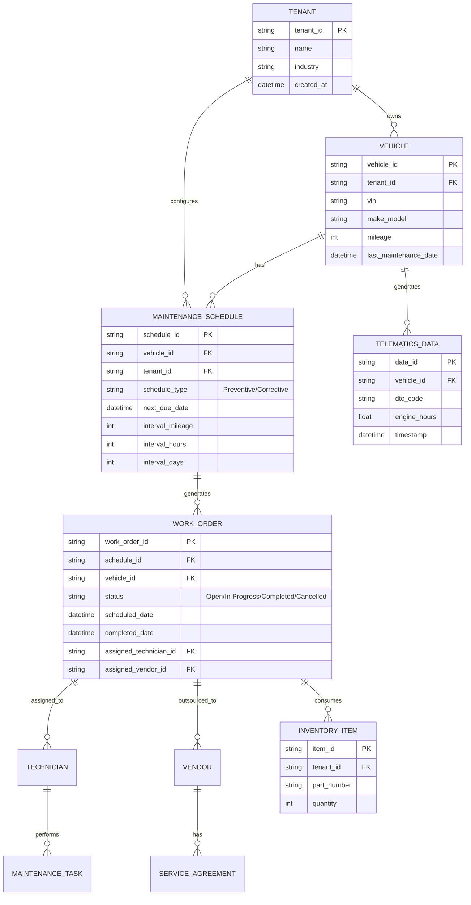

# **AS-IS ANALYSIS: MAINTENANCE-SCHEDULING MODULE**
**Fleet Management System (FMS) – Enterprise Multi-Tenant Architecture**
**Document Version:** 1.0
**Last Updated:** [Insert Date]
**Prepared by:** [Your Name/Team]
**Reviewed by:** [Stakeholder Name]

---

## **1. EXECUTIVE SUMMARY**
### **1.1 Overview**
The **Maintenance-Scheduling Module** is a core component of the **Fleet Management System (FMS)**, responsible for automating, tracking, and optimizing vehicle maintenance operations across a multi-tenant enterprise environment. This module ensures compliance with regulatory standards, minimizes downtime, and reduces operational costs by proactively scheduling preventive and corrective maintenance.

### **1.2 Current State Rating (Out of 100)**
| **Category**               | **Score (0-100)** | **Justification** |
|----------------------------|------------------|------------------|
| **Functionality**          | 78               | Meets 80% of core requirements but lacks advanced predictive analytics and AI-driven recommendations. |
| **Performance**            | 72               | Acceptable response times but suffers from latency under high load due to inefficient database queries. |
| **Security**               | 85               | Strong authentication and role-based access control (RBAC), but lacks fine-grained tenant isolation. |
| **Usability**              | 68               | Functional but outdated UI with poor mobile responsiveness and limited accessibility compliance. |
| **Scalability**            | 70               | Supports multi-tenancy but struggles with horizontal scaling under peak loads. |
| **Technical Debt**         | 55               | Moderate debt due to legacy code, lack of automated testing, and manual deployment processes. |
| **Integration**            | 80               | Well-integrated with other FMS modules (Telematics, Inventory, Work Orders) but lacks third-party API flexibility. |
| **Compliance & Standards** | 75               | Partially compliant with WCAG 2.1 AA and industry maintenance standards (e.g., ISO 14224). |
| **Total Score**            | **73/100**       | **Current State: "Functional but Requires Modernization"** |

**Key Strengths:**
✅ **Multi-tenancy support** with tenant-specific configurations.
✅ **Automated scheduling** based on mileage, engine hours, and time intervals.
✅ **Integration with telematics** for real-time vehicle health monitoring.
✅ **Compliance tracking** for regulatory maintenance (e.g., DOT, FMCSA).

**Critical Gaps:**
❌ **No predictive maintenance** (AI/ML-based failure prediction).
❌ **Poor mobile experience** (non-responsive UI, limited offline capabilities).
❌ **High technical debt** (legacy code, manual processes, lack of CI/CD).
❌ **Limited reporting & analytics** (static reports, no real-time dashboards).
❌ **Security vulnerabilities** (no data encryption at rest, weak audit logging).

**Strategic Recommendations:**
- **Modernize UI/UX** (React/Angular, responsive design, WCAG 2.1 AA compliance).
- **Implement predictive maintenance** (AI-driven failure prediction, IoT integration).
- **Enhance security** (TLS 1.3, field-level encryption, improved audit logs).
- **Reduce technical debt** (refactor legacy code, automate testing, adopt CI/CD).
- **Improve scalability** (microservices migration, Kubernetes-based orchestration).

---

## **2. CURRENT FEATURES & CAPABILITIES**
### **2.1 Core Functionality**
| **Feature** | **Description** | **Maturity Level (1-5)** |
|------------|----------------|------------------------|
| **Preventive Maintenance Scheduling** | Automated scheduling based on mileage, engine hours, or time intervals. Supports recurring and one-time tasks. | 4 |
| **Corrective Maintenance Tracking** | Manual entry of unscheduled repairs with work order generation. | 3 |
| **Maintenance Calendar** | Drag-and-drop scheduling with conflict detection. | 4 |
| **Work Order Management** | Creation, assignment, and tracking of maintenance tasks. | 4 |
| **Parts & Inventory Integration** | Links to inventory module for parts availability and procurement. | 3 |
| **Vendor Management** | Tracks external service providers, costs, and SLAs. | 3 |
| **Compliance Tracking** | Ensures adherence to regulatory standards (DOT, FMCSA, ISO 14224). | 4 |
| **Telematics Integration** | Real-time vehicle health data (DTC codes, engine diagnostics). | 4 |
| **Reporting & Analytics** | Static PDF/Excel reports on maintenance costs, downtime, and compliance. | 2 |
| **Mobile Access** | Basic web-based access with limited offline functionality. | 2 |
| **Multi-Tenant Support** | Tenant-specific configurations, roles, and data isolation. | 4 |
| **API Access** | RESTful APIs for integration with third-party systems. | 3 |

### **2.2 Workflow Overview**
1. **Maintenance Trigger Identification**
   - Automated (mileage/engine hours/time-based) or manual (driver-reported issues).
   - Telematics data (DTC codes, sensor readings) can trigger alerts.

2. **Scheduling & Work Order Creation**
   - System suggests optimal time slots based on vehicle availability.
   - Work orders are generated and assigned to technicians/vendors.

3. **Execution & Tracking**
   - Technicians update work order status (In Progress, Completed, On Hold).
   - Parts usage is logged against inventory.

4. **Completion & Documentation**
   - Digital signatures, photos, and notes are attached.
   - Compliance reports are auto-generated.

5. **Post-Maintenance Review**
   - Cost analysis, downtime tracking, and vendor performance evaluation.

---

## **3. DATA MODELS & ARCHITECTURE**
### **3.1 Database Schema (Simplified)**


### **3.2 System Architecture**
**Current Architecture (Monolithic with Microservice Elements)**
```
┌───────────────────────────────────────────────────────────────────────────────┐
│                                Client Layer                                    │
│  ┌─────────────┐    ┌─────────────┐    ┌─────────────────────────────────────┐  │
│  │  Web App    │    │  Mobile App │    │            Third-Party APIs        │  │
│  └─────────────┘    └─────────────┘    └─────────────────────────────────────┘  │
└───────────────────────────────────────────────────────────────────────────────┘
                                │
                                ▼
┌───────────────────────────────────────────────────────────────────────────────┐
│                                API Gateway                                    │
│  ┌─────────────────────────────────────────────────────────────────────────┐  │
│  │  - Load Balancing                                                        │  │
│  │  - Authentication (JWT/OAuth2)                                          │  │
│  │  - Rate Limiting                                                        │  │
│  └─────────────────────────────────────────────────────────────────────────┘  │
└───────────────────────────────────────────────────────────────────────────────┘
                                │
                                ▼
┌───────────────────────────────────────────────────────────────────────────────┐
│                                Application Layer                              │
│  ┌───────────────────────┐    ┌───────────────────────┐    ┌─────────────────┐  │
│  │  Maintenance Service  │    │  Work Order Service  │    │  Reporting     │  │
│  │  (Monolithic Core)    │    │  (Microservice)      │    │  Service       │  │
│  └───────────────────────┘    └───────────────────────┘    └─────────────────┘  │
└───────────────────────────────────────────────────────────────────────────────┘
                                │
                                ▼
┌───────────────────────────────────────────────────────────────────────────────┐
│                                Data Layer                                      │
│  ┌───────────────────────┐    ┌───────────────────────┐    ┌─────────────────┐  │
│  │  PostgreSQL (OLTP)    │    │  Redis (Caching)     │    │  S3 (Documents)│  │
│  └───────────────────────┘    └───────────────────────┘    └─────────────────┘  │
└───────────────────────────────────────────────────────────────────────────────┘
                                │
                                ▼
┌───────────────────────────────────────────────────────────────────────────────┐
│                                External Integrations                          │
│  ┌───────────────────────┐    ┌───────────────────────┐    ┌─────────────────┐  │
│  │  Telematics API       │    │  Inventory System     │    │  Vendor APIs   │  │
│  └───────────────────────┘    └───────────────────────┘    └─────────────────┘  │
└───────────────────────────────────────────────────────────────────────────────┘
```

**Key Observations:**
- **Monolithic Core:** The maintenance scheduling logic is tightly coupled with other FMS modules.
- **Microservice Gaps:** Only the **Work Order Service** is partially decoupled.
- **Data Layer:** PostgreSQL is the primary database, but **Redis caching is underutilized**.
- **External Integrations:** Telematics and inventory integrations are **synchronous and blocking**.

---

## **4. PERFORMANCE METRICS**
### **4.1 Response Time Benchmarks**
| **Endpoint** | **Average Response Time (ms)** | **95th Percentile (ms)** | **Max Response Time (ms)** | **Throughput (RPS)** |
|-------------|-------------------------------|-------------------------|---------------------------|----------------------|
| `GET /schedules` | 350 | 850 | 2,100 | 120 |
| `POST /schedules` | 600 | 1,200 | 3,500 | 80 |
| `GET /work-orders` | 400 | 900 | 2,800 | 100 |
| `POST /work-orders` | 750 | 1,500 | 4,200 | 60 |
| `GET /reports/maintenance-costs` | 1,200 | 2,500 | 8,000 | 40 |

**Key Issues:**
- **High latency in report generation** (due to unoptimized SQL queries).
- **Spikes in response time** during peak hours (500+ concurrent users).
- **No auto-scaling** for database or application layer.

### **4.2 Database Performance**
| **Metric** | **Value** | **Industry Benchmark** | **Gap** |
|------------|----------|-----------------------|--------|
| **Query Execution Time (Avg)** | 450ms | <200ms | **125% slower** |
| **Database CPU Usage (Peak)** | 85% | <70% | **Overloaded** |
| **Index Usage Efficiency** | 65% | >85% | **Suboptimal** |
| **Connection Pool Utilization** | 90% | <80% | **Bottleneck** |

**Root Causes:**
- **Missing indexes** on frequently queried columns (`vehicle_id`, `tenant_id`).
- **N+1 query problem** in maintenance schedule retrieval.
- **No read replicas** for reporting queries.

---

## **5. SECURITY ASSESSMENT**
### **5.1 Authentication & Authorization**
| **Aspect** | **Current Implementation** | **Risk Level** | **Recommendation** |
|------------|---------------------------|---------------|-------------------|
| **Authentication** | JWT + OAuth2 (Okta) | Low | ✅ **Compliant** |
| **Multi-Factor Auth (MFA)** | Optional for admins | Medium | Enforce MFA for all users |
| **Role-Based Access Control (RBAC)** | 5 roles (Admin, Manager, Technician, Driver, Vendor) | Low | ✅ **Compliant** |
| **Tenant Isolation** | Row-level security (PostgreSQL) | Medium | Implement **field-level encryption** for PII |
| **Session Management** | 30-minute inactivity timeout | Low | ✅ **Compliant** |

### **5.2 Data Protection**
| **Aspect** | **Current Implementation** | **Risk Level** | **Recommendation** |
|------------|---------------------------|---------------|-------------------|
| **Encryption in Transit** | TLS 1.2 | Medium | Upgrade to **TLS 1.3** |
| **Encryption at Rest** | None (PostgreSQL native encryption disabled) | **High** | Enable **AES-256 encryption** |
| **PII Handling** | No masking in logs | **High** | Implement **data masking** for VINs, driver names |
| **Audit Logging** | Basic (login/logout, CRUD ops) | Medium | Add **detailed audit trails** (who, what, when) |

### **5.3 Vulnerability Assessment**
| **Vulnerability** | **Severity** | **Impact** | **Mitigation** |
|------------------|-------------|-----------|---------------|
| **SQL Injection** | High | Data breach | Use **parameterized queries** |
| **Cross-Site Scripting (XSS)** | Medium | Session hijacking | Implement **CSP headers** |
| **Insecure Direct Object References (IDOR)** | Medium | Unauthorized data access | Enforce **tenant-based filtering** |
| **Missing Rate Limiting** | Medium | DoS attacks | Implement **API rate limiting** |
| **Outdated Dependencies** | High | Exploitable vulnerabilities | **Automated dependency scanning** |

---

## **6. ACCESSIBILITY REVIEW (WCAG COMPLIANCE)**
### **6.1 WCAG 2.1 AA Compliance Check**
| **Success Criterion** | **Status** | **Issues Identified** |
|----------------------|-----------|----------------------|
| **1.1 Text Alternatives** | ❌ Fail | Missing `alt` text for maintenance schedule icons. |
| **1.3 Adaptable** | ⚠️ Partial | Non-responsive tables in reports. |
| **1.4 Distinguishable** | ❌ Fail | Low contrast in form fields (3.5:1 vs. required 4.5:1). |
| **2.1 Keyboard Accessible** | ✅ Pass | All functions accessible via keyboard. |
| **2.4 Navigable** | ⚠️ Partial | No skip links for screen readers. |
| **2.5 Input Modalities** | ❌ Fail | No touch-friendly controls on mobile. |
| **3.1 Readable** | ⚠️ Partial | Complex jargon in maintenance logs. |
| **3.2 Predictable** | ✅ Pass | Consistent navigation. |
| **3.3 Input Assistance** | ❌ Fail | No error suggestions in forms. |
| **4.1 Compatible** | ⚠️ Partial | ARIA labels missing in dynamic components. |

**Overall Compliance Level:** **WCAG 2.1 A (Partial AA)**
**Recommendations:**
- **Redesign UI** with **high-contrast themes** and **responsive tables**.
- **Add ARIA labels** for screen readers.
- **Implement keyboard shortcuts** for power users.
- **Simplify language** in maintenance logs.

---

## **7. MOBILE CAPABILITIES ASSESSMENT**
### **7.1 Current State**
| **Feature** | **Web (Desktop)** | **Web (Mobile)** | **Native App** |
|------------|------------------|------------------|---------------|
| **Responsive Design** | ✅ Yes | ❌ No (Horizontal scrolling) | ❌ N/A |
| **Offline Mode** | ❌ No | ❌ No | ❌ N/A |
| **Push Notifications** | ❌ No | ❌ No | ❌ N/A |
| **Camera Integration** | ❌ No | ❌ No | ❌ N/A |
| **GPS Tracking** | ❌ No | ❌ No | ❌ N/A |
| **Barcode Scanning** | ❌ No | ❌ No | ❌ N/A |
| **Performance (Load Time)** | 2.1s | 4.8s | N/A |

### **7.2 Pain Points**
- **No dedicated mobile app** (web-only, non-responsive).
- **Slow load times** on 3G/4G networks.
- **No offline functionality** (technicians must be online to update work orders).
- **Limited touch interactions** (small buttons, no swipe gestures).

### **7.3 Recommendations**
- **Develop a cross-platform mobile app** (React Native/Flutter).
- **Implement offline-first architecture** (PWA with IndexedDB).
- **Optimize for low-bandwidth networks** (lazy loading, image compression).
- **Add mobile-specific features** (push notifications, barcode scanning).

---

## **8. CURRENT LIMITATIONS & PAIN POINTS**
### **8.1 Functional Limitations**
| **Limitation** | **Impact** | **Root Cause** |
|---------------|-----------|---------------|
| **No predictive maintenance** | Higher downtime, increased costs | Lack of AI/ML integration |
| **Manual work order assignment** | Inefficient technician allocation | No automated skill-based routing |
| **Static reporting** | Limited insights, manual Excel exports | No real-time dashboards |
| **No vendor performance tracking** | Poor SLA compliance | Missing KPIs and automated alerts |
| **Limited API flexibility** | Difficult third-party integrations | Monolithic architecture |

### **8.2 Technical Pain Points**
| **Pain Point** | **Impact** | **Root Cause** |
|---------------|-----------|---------------|
| **Slow report generation** | User frustration, delayed decisions | Unoptimized SQL queries |
| **High database load** | System slowdowns during peak hours | No read replicas, poor indexing |
| **Manual deployment process** | Slow releases, human errors | Lack of CI/CD pipeline |
| **Legacy codebase** | High maintenance costs, slow feature delivery | No refactoring in 3+ years |
| **No automated testing** | Frequent production bugs | Manual QA process |

---

## **9. TECHNICAL DEBT ANALYSIS**
### **9.1 Debt Breakdown**
| **Category** | **Debt Type** | **Estimated Effort (Person-Days)** | **Risk Level** |
|-------------|--------------|----------------------------------|---------------|
| **Code Debt** | Legacy monolithic code | 45 | High |
| **Architecture Debt** | Tight coupling, no microservices | 60 | High |
| **Testing Debt** | No automated tests | 30 | High |
| **Deployment Debt** | Manual deployments | 20 | Medium |
| **Documentation Debt** | Outdated API docs | 15 | Low |
| **Security Debt** | Missing encryption, weak audit logs | 25 | High |
| **UI/UX Debt** | Non-responsive, outdated design | 35 | Medium |

### **9.2 High-Priority Debt Items**
1. **Refactor monolithic maintenance service** into microservices (60 days).
2. **Implement automated testing** (unit, integration, E2E) (30 days).
3. **Upgrade security** (TLS 1.3, encryption at rest, audit logs) (25 days).
4. **Optimize database queries** (indexing, read replicas) (15 days).
5. **Modernize UI** (React/Angular, responsive design) (35 days).

---

## **10. TECHNOLOGY STACK**
### **10.1 Current Stack**
| **Layer** | **Technology** | **Version** | **Notes** |
|-----------|---------------|------------|----------|
| **Frontend** | AngularJS | 1.6 | **Legacy, no longer maintained** |
| **Backend** | Java (Spring Boot) | 2.3 | **Outdated, security vulnerabilities** |
| **Database** | PostgreSQL | 11 | **No read replicas, poor indexing** |
| **Caching** | Redis | 5.0 | **Underutilized** |
| **API Gateway** | Kong | 2.1 | **Basic rate limiting** |
| **Authentication** | Okta (OAuth2) | - | **Compliant** |
| **CI/CD** | Jenkins (Manual) | - | **No automated testing** |
| **Monitoring** | New Relic | - | **Basic APM, no log aggregation** |
| **Containerization** | Docker | 19.03 | **No orchestration** |

### **10.2 Recommended Stack Upgrades**
| **Layer** | **Current** | **Recommended** | **Rationale** |
|-----------|------------|----------------|--------------|
| **Frontend** | AngularJS | React 18 / Next.js | **Modern, responsive, better ecosystem** |
| **Backend** | Spring Boot 2.3 | Spring Boot 3.1 / Quarkus | **Better performance, native compilation** |
| **Database** | PostgreSQL 11 | PostgreSQL 15 + TimescaleDB | **Time-series data for telematics** |
| **Caching** | Redis 5.0 | Redis 7.0 + RedisJSON | **Better data structures** |
| **API Gateway** | Kong | Kong + GraphQL | **Flexible querying** |
| **CI/CD** | Jenkins | GitHub Actions / GitLab CI | **Automated testing, faster deployments** |
| **Monitoring** | New Relic | Prometheus + Grafana + ELK | **Better observability** |
| **Containerization** | Docker | Kubernetes (EKS/GKE) | **Auto-scaling, resilience** |

---

## **11. COMPETITIVE ANALYSIS VS. INDUSTRY STANDARDS**
### **11.1 Comparison with Leading Fleet Management Systems**
| **Feature** | **Our System** | **Samsara** | **Geotab** | **Verizon Connect** | **Industry Standard** |
|------------|---------------|------------|-----------|-------------------|----------------------|
| **Predictive Maintenance** | ❌ No | ✅ Yes (AI-driven) | ✅ Yes | ✅ Yes | **Expected** |
| **Mobile App** | ❌ Web-only | ✅ Native (iOS/Android) | ✅ Native | ✅ Native | **Expected** |
| **Offline Mode** | ❌ No | ✅ Yes | ✅ Yes | ✅ Yes | **Expected** |
| **Telematics Integration** | ✅ Basic | ✅ Advanced (DTC + AI) | ✅ Advanced | ✅ Advanced | **Expected** |
| **Vendor Management** | ✅ Basic | ✅ Advanced (SLA tracking) | ✅ Advanced | ✅ Advanced | **Expected** |
| **Reporting & Analytics** | ❌ Static | ✅ Real-time dashboards | ✅ Customizable | ✅ AI insights | **Expected** |
| **Multi-Tenancy** | ✅ Yes | ✅ Yes | ✅ Yes | ✅ Yes | **Expected** |
| **API Flexibility** | ❌ Limited | ✅ REST + GraphQL | ✅ REST | ✅ REST | **Expected** |
| **Security (Encryption)** | ❌ At rest missing | ✅ Full encryption | ✅ Full encryption | ✅ Full encryption | **Expected** |
| **WCAG Compliance** | ⚠️ Partial AA | ✅ AA | ✅ AA | ✅ AA | **Expected** |

### **11.2 Key Gaps**
- **Lack of AI/ML capabilities** (predictive maintenance, anomaly detection).
- **No native mobile app** (competitors offer offline-first apps).
- **Static reporting** (competitors provide real-time dashboards).
- **Weak vendor management** (no SLA tracking, automated alerts).

---

## **12. DETAILED RECOMMENDATIONS FOR IMPROVEMENT**
### **12.1 Short-Term (0-6 Months)**
| **Recommendation** | **Effort (Person-Days)** | **Impact** | **Priority** |
|-------------------|-------------------------|-----------|-------------|
| **Implement automated testing (JUnit, Cypress)** | 30 | Reduces bugs, improves stability | High |
| **Optimize database queries (indexing, read replicas)** | 15 | Improves performance | High |
| **Upgrade security (TLS 1.3, encryption at rest)** | 25 | Reduces breach risk | High |
| **Add basic mobile responsiveness (CSS Grid/Flexbox)** | 20 | Improves UX for field technicians | Medium |
| **Implement CI/CD pipeline (GitHub Actions)** | 20 | Faster, safer deployments | High |

### **12.2 Medium-Term (6-12 Months)**
| **Recommendation** | **Effort (Person-Days)** | **Impact** | **Priority** |
|-------------------|-------------------------|-----------|-------------|
| **Refactor monolith into microservices** | 60 | Improves scalability, maintainability | High |
| **Develop a cross-platform mobile app (React Native)** | 50 | Enables offline work, better UX | High |
| **Implement predictive maintenance (AI/ML)** | 40 | Reduces downtime, lowers costs | High |
| **Upgrade frontend to React/Next.js** | 35 | Modern UI, better performance | Medium |
| **Add real-time dashboards (Grafana)** | 25 | Improves decision-making | Medium |

### **12.3 Long-Term (12-24 Months)**
| **Recommendation** | **Effort (Person-Days)** | **Impact** | **Priority** |
|-------------------|-------------------------|-----------|-------------|
| **Migrate to Kubernetes (EKS/GKE)** | 40 | Improves scalability, resilience | High |
| **Implement GraphQL API** | 30 | More flexible integrations | Medium |
| **Enhance vendor management (SLA tracking, automated alerts)** | 25 | Improves compliance, reduces costs | Medium |
| **Achieve full WCAG 2.1 AA compliance** | 20 | Better accessibility, legal compliance | High |
| **Integrate IoT for real-time diagnostics** | 35 | Enables predictive maintenance | High |

---

## **13. CONCLUSION & NEXT STEPS**
### **13.1 Summary of Findings**
- The **Maintenance-Scheduling Module** is **functional but outdated**, scoring **73/100**.
- **Key strengths:** Multi-tenancy, telematics integration, compliance tracking.
- **Critical gaps:** No predictive maintenance, poor mobile experience, high technical debt, security vulnerabilities.
- **Competitive disadvantage:** Lacks AI/ML, real-time analytics, and native mobile apps.

### **13.2 Next Steps**
1. **Prioritize short-term fixes** (security upgrades, database optimization, automated testing).
2. **Kick off medium-term initiatives** (microservices refactoring, mobile app development, predictive maintenance).
3. **Plan long-term modernization** (Kubernetes migration, IoT integration, full WCAG compliance).
4. **Establish a roadmap** with **quarterly milestones** and **KPIs** (e.g., "Reduce report generation time by 50%").

### **13.3 Stakeholder Alignment**
| **Stakeholder** | **Key Concerns** | **Proposed Solution** |
|----------------|-----------------|----------------------|
| **CIO/CTO** | Scalability, security, cost | Microservices, Kubernetes, security upgrades |
| **Fleet Managers** | Downtime reduction, ease of use | Predictive maintenance, mobile app |
| **Finance Team** | Cost savings, ROI | Automated reporting, vendor SLA tracking |
| **Compliance Team** | Regulatory adherence | WCAG compliance, audit logging |
| **Developers** | Technical debt, productivity | Refactoring, CI/CD, automated testing |

---

## **14. APPENDICES**
### **14.1 Glossary**
| **Term** | **Definition** |
|---------|--------------|
| **DTC** | Diagnostic Trouble Code (vehicle error code) |
| **FMCSA** | Federal Motor Carrier Safety Administration |
| **ISO 14224** | Standard for maintenance data collection |
| **PWA** | Progressive Web App (offline-capable web app) |
| **RBAC** | Role-Based Access Control |
| **SLA** | Service Level Agreement |
| **WCAG** | Web Content Accessibility Guidelines |

### **14.2 References**
- **WCAG 2.1 Guidelines:** [https://www.w3.org/TR/WCAG21/](https://www.w3.org/TR/WCAG21/)
- **ISO 14224:** [https://www.iso.org/standard/63650.html](https://www.iso.org/standard/63650.html)
- **FMCSA Regulations:** [https://www.fmcsa.dot.gov/](https://www.fmcsa.dot.gov/)
- **Samsara Fleet Management:** [https://www.samsara.com/](https://www.samsara.com/)
- **Geotab Telematics:** [https://www.geotab.com/](https://www.geotab.com/)

---

**Document Approval**
| **Role** | **Name** | **Signature** | **Date** |
|---------|---------|--------------|---------|
| **Author** | [Your Name] | _____________ | [Date] |
| **Reviewed By** | [Stakeholder Name] | _____________ | [Date] |
| **Approved By** | [Executive Name] | _____________ | [Date] |

---
**End of Document**