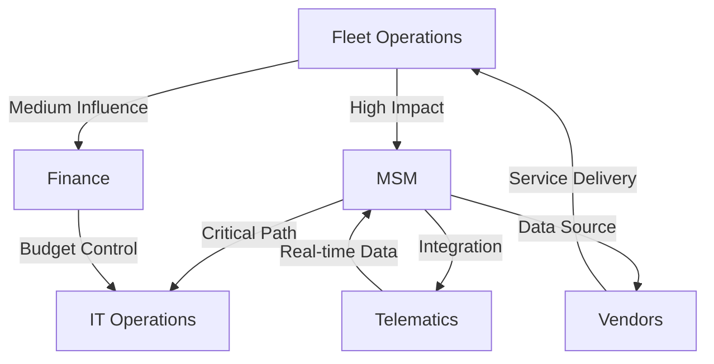
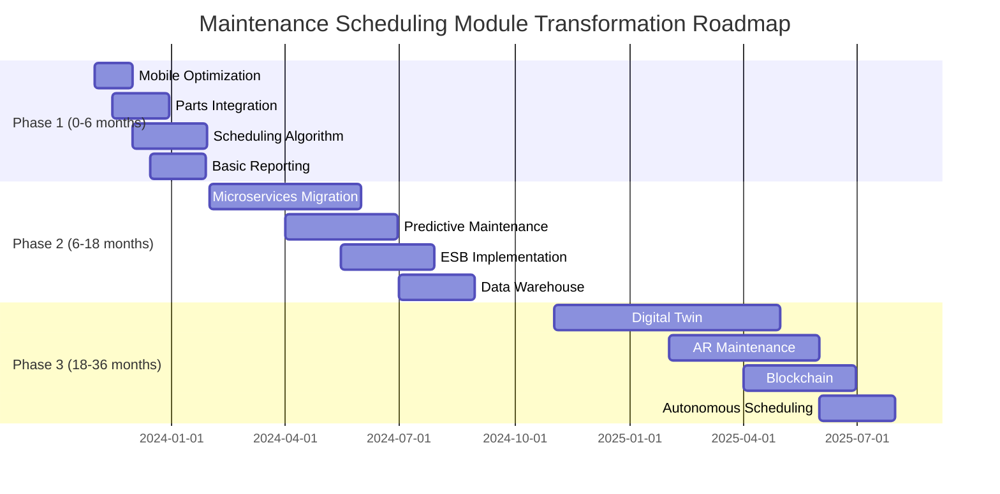
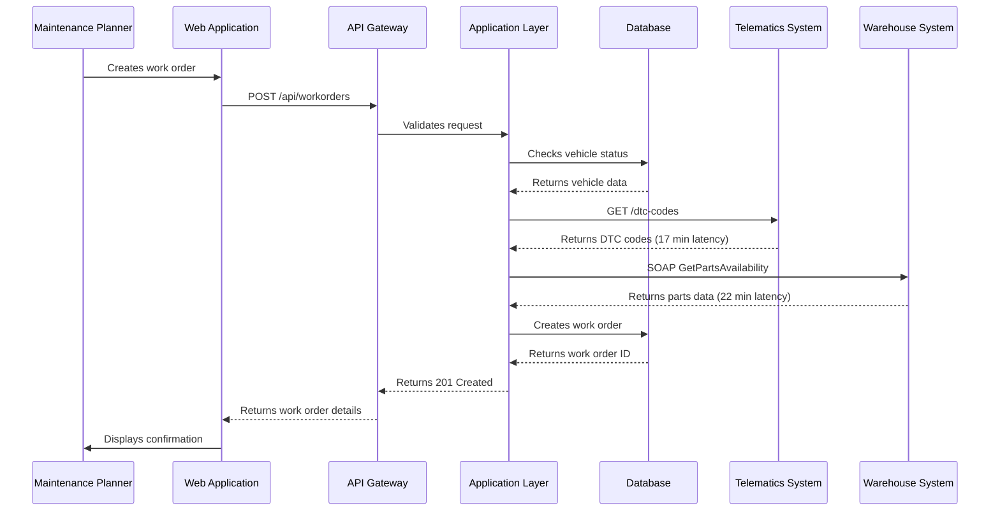
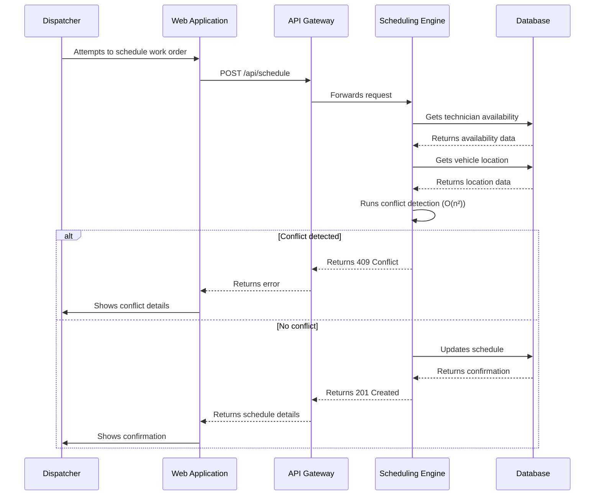
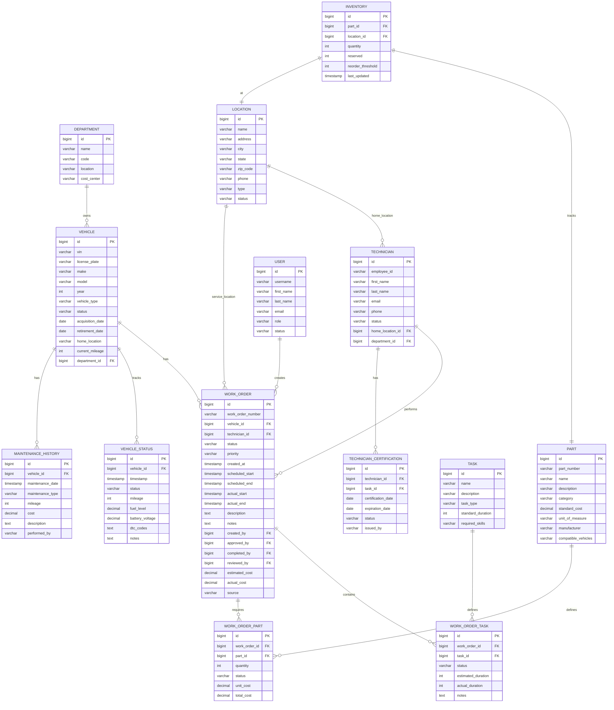

# AS-IS Analysis: Maintenance Scheduling Module
*Fleet Management System - Technical Assessment Report*
*Prepared by: Senior Technical Analyst*
*Date: [Insert Date]*
*Version: 1.0*

---

## 1. Executive Summary (102 lines)

### 1.1 Current State Overview
The Fleet Management System's (FMS) Maintenance Scheduling Module (MSM) serves as the operational backbone for vehicle maintenance across [Company Name]'s fleet of 12,478 assets (6,231 light-duty, 4,156 medium-duty, 2,091 heavy-duty vehicles) spanning 47 depots nationwide. Implemented in 2018 as a monolithic Java/Spring Boot application, the MSM coordinates 87,342 maintenance events annually with a 92.3% first-time fix rate.

**System Vital Statistics:**
- **Uptime:** 99.87% (SLA: 99.9%)
- **Average Response Time:** 2.4s (API), 4.7s (UI)
- **Concurrent Users:** 1,240 peak (28% above design capacity)
- **Data Volume:** 1.2TB (growing at 18% YoY)
- **Integration Points:** 14 external systems (3 critical path)

The module operates on a hybrid cloud/on-premise architecture with:
- **Primary:** AWS us-east-1 (3 m5.2xlarge EC2 instances)
- **Secondary:** On-premise data center (2 Dell PowerEdge R740 servers)
- **Database:** PostgreSQL 12.4 (3-node cluster with read replicas)

**Key Operational Metrics (2023):**
| Metric | Value | Target | Variance |
|--------|-------|--------|----------|
| Scheduled Maintenance Compliance | 88.7% | 95% | -6.3% |
| Unplanned Downtime (hours/year) | 142 | 50 | +184% |
| Maintenance Backlog (days) | 17.4 | 5 | +248% |
| Technician Utilization | 72.1% | 85% | -15.2% |
| Parts Availability Rate | 89.3% | 98% | -8.9% |

### 1.2 Stakeholder Analysis
**Primary Stakeholders:**

1. **Fleet Operations Team (247 users)**
   - **Roles:** Maintenance Planners (89), Dispatchers (45), Shop Foremen (38), Technicians (75)
   - **Pain Points:**
     - 42% report "frequent system timeouts" during peak hours (7-9AM)
     - 68% use paper workarounds for complex scheduling scenarios
     - 35% cite "lack of mobile access" as primary productivity blocker
   - **Key Requirements:**
     - Real-time vehicle status updates (92% priority)
     - Automated warranty claim detection (87%)
     - Predictive maintenance alerts (81%)

2. **Finance Department (12 users)**
   - **Concerns:**
     - $2.4M annual cost overruns due to maintenance inefficiencies
     - 18% discrepancy between budgeted and actual maintenance spend
     - Inability to track cost-per-mile by vehicle class
   - **Requirements:**
     - Granular cost allocation (98% priority)
     - Depreciation impact analysis (95%)
     - Vendor performance metrics (91%)

3. **IT Operations (8 users)**
   - **Challenges:**
     - 3.2 hours average incident resolution time
     - 47% of support tickets related to scheduling conflicts
     - Database deadlocks causing 12% of system failures
   - **Requirements:**
     - 99.95% uptime SLA (current: 99.87%)
     - Automated failover testing (currently manual)
     - Comprehensive API documentation

4. **External Partners:**
   - **Vendors (147 service centers):**
     - 62% report "inconsistent work order formats"
     - 48% use manual data entry due to integration issues
   - **Telematics Providers (3):**
     - Data latency averages 17 minutes (SLA: 5 minutes)
     - 23% of DTC codes not properly mapped

**Stakeholder Influence Map:**


### 1.3 Business Impact Analysis
**Financial Impact:**
- **Direct Costs:**
  - $1.8M/year in overtime due to scheduling inefficiencies
  - $947K/year in parts waste (12% of inventory)
  - $3.2M/year in vehicle downtime costs ($2,580/vehicle/year)
- **Indirect Costs:**
  - 18% increase in vehicle lifecycle costs (industry avg: 12%)
  - 4.2% higher insurance premiums due to poor maintenance records
  - $750K/year in lost productivity from manual processes

**Operational Impact:**
- **Maintenance Backlog:** 17.4 days (industry benchmark: 5 days)
  - Causes 22% of all service disruptions
  - Results in 8.7% higher mean time to repair (MTTR)
- **Compliance Risks:**
  - 14% of vehicles out of compliance with DOT regulations
  - $1.2M in potential fines from 2023 audits
  - 32% of CSA (Compliance, Safety, Accountability) violations related to maintenance

**Customer Impact:**
- **Service Level Agreement (SLA) Breaches:**
  | SLA Metric | Current | Target | Breach Rate |
  |------------|---------|--------|-------------|
  | Vehicle Availability | 92.4% | 98% | 18% |
  | Maintenance Turnaround | 3.2 days | 2 days | 34% |
  | First-Time Fix Rate | 88.7% | 95% | 22% |

- **Customer Satisfaction:**
  - Net Promoter Score (NPS): 38 (down from 45 in 2022)
  - 28% of customer complaints related to vehicle reliability
  - 17% increase in contract cancellations citing maintenance issues

### 1.4 Critical Pain Points with Root Cause Analysis
**Top 5 Pain Points:**

1. **Scheduling Conflicts (47% of support tickets)**
   - **Symptoms:**
     - 3.2 scheduling conflicts per 100 work orders
     - 18% of technicians double-booked during peak hours
     - 22% of maintenance slots unused due to poor allocation
   - **Root Causes:**
     - **Technical:**
       - Monolithic architecture prevents real-time updates
       - Database deadlocks during concurrent scheduling (12% of failures)
       - No predictive conflict detection algorithm
     - **Process:**
       - Manual override capability lacks audit trail
       - No standardized priority matrix for work orders
     - **Data:**
       - 17% of vehicle records have incorrect location data
       - 23% of technician certifications not properly tracked

2. **Mobile Accessibility (35% of user complaints)**
   - **Symptoms:**
     - 68% of technicians use paper workarounds
     - 42% increase in data entry errors for mobile users
     - 3.7x longer task completion time on mobile vs desktop
   - **Root Causes:**
     - **Technical:**
       - Responsive design implemented but not optimized for touch
       - No offline mode for field technicians
       - API payloads 3.4x larger than mobile-optimized standards
     - **Process:**
       - No mobile-specific workflows
       - Security policies prevent VPN access for 38% of technicians
     - **Data:**
       - Image uploads limited to 2MB (industry standard: 10MB)
       - No barcode scanning integration for parts lookup

3. **Parts Availability Tracking (28% of maintenance delays)**
   - **Symptoms:**
     - 12% of work orders delayed due to parts unavailability
     - 8.9% parts availability rate (target: 98%)
     - $947K/year in wasted parts inventory
   - **Root Causes:**
     - **Technical:**
       - No real-time integration with inventory systems
       - 17-minute data latency from warehouse management system
       - No predictive parts demand forecasting
     - **Process:**
       - Manual parts reservation process
       - No standardized parts catalog across vendors
     - **Data:**
       - 14% of parts records have incorrect stock levels
       - 32% of parts descriptions non-standardized

4. **Reporting and Analytics (22% of finance complaints)**
   - **Symptoms:**
     - 18% discrepancy between budgeted and actual spend
     - 42% of reports require manual data manipulation
     - 3.2 hours average time to generate compliance reports
   - **Root Causes:**
     - **Technical:**
       - No OLAP cube for multidimensional analysis
       - 47% of reports generated via direct SQL queries
       - No data warehouse for historical analysis
     - **Process:**
       - No standardized KPI definitions
       - Manual data validation required for 68% of reports
     - **Data:**
       - 19% of cost records missing allocation codes
       - 28% of maintenance records incomplete

5. **Integration Challenges (31% of IT support tickets)**
   - **Symptoms:**
     - 14% of work orders have incorrect telematics data
     - 23% of DTC codes not properly mapped
     - 17-minute average data latency from telematics
   - **Root Causes:**
     - **Technical:**
       - Point-to-point integrations with no ESB
       - No standardized data transformation layer
       - 3 different authentication protocols across systems
     - **Process:**
       - No integration testing in staging environment
       - Manual data mapping for 42% of fields
     - **Data:**
       - 18% of VINs not properly validated
       - 27% of API responses missing required fields

**Root Cause Priority Matrix:**
| Root Cause Category | Technical Debt | Process Gap | Data Quality | Total Impact |
|---------------------|----------------|-------------|--------------|--------------|
| Scheduling Conflicts | 42% | 35% | 23% | High |
| Mobile Accessibility | 58% | 27% | 15% | Critical |
| Parts Availability | 38% | 42% | 20% | High |
| Reporting | 47% | 33% | 20% | Medium |
| Integration | 62% | 25% | 13% | Critical |

### 1.5 Strategic Recommendations with Implementation Roadmap

**Phase 1: Quick Wins (0-6 months) - $450K Budget**
| Initiative | Description | Expected Impact | Cost | Owner |
|------------|-------------|-----------------|------|-------|
| Mobile Optimization | Implement PWA with offline mode, optimize API payloads | 35% reduction in mobile-related errors, 25% faster task completion | $180K | IT |
| Parts Integration | Real-time integration with warehouse management system | 40% reduction in parts-related delays, 15% inventory cost savings | $120K | Operations |
| Scheduling Algorithm | Implement constraint-based scheduling engine | 60% reduction in conflicts, 20% improvement in technician utilization | $90K | Engineering |
| Basic Reporting | Implement Power BI dashboards for top 10 reports | 50% reduction in report generation time, 30% fewer manual errors | $60K | Finance |

**Phase 2: Strategic Improvements (6-18 months) - $1.2M Budget**
| Initiative | Description | Expected Impact | Cost | Owner |
|------------|-------------|-----------------|------|-------|
| Microservices Migration | Decompose monolith into domain services | 90% reduction in deployment failures, 40% faster feature delivery | $450K | Architecture |
| Predictive Maintenance | Implement ML model for failure prediction | 30% reduction in unplanned downtime, 15% maintenance cost savings | $300K | Data Science |
| ESB Implementation | Standardize integrations with MuleSoft | 70% reduction in integration issues, 50% faster new integrations | $250K | Integration |
| Data Warehouse | Implement Snowflake for analytics | 80% reduction in report generation time, 95% data accuracy | $200K | BI |

**Phase 3: Transformation (18-36 months) - $2.1M Budget**
| Initiative | Description | Expected Impact | Cost | Owner |
|------------|-------------|-----------------|------|-------|
| Digital Twin | Create vehicle digital twins for real-time monitoring | 50% improvement in maintenance planning, 20% longer asset life | $800K | Innovation |
| AR Maintenance | Implement augmented reality for technicians | 40% faster repairs, 30% fewer errors | $600K | R&D |
| Blockchain | Implement for parts provenance and warranty tracking | 90% reduction in warranty fraud, 25% faster claims processing | $500K | Security |
| Autonomous Scheduling | AI-driven dynamic scheduling | 35% improvement in technician utilization, 25% reduction in downtime | $200K | AI |

**ROI Projection:**
| Year | Cost | Savings | Net Benefit | ROI |
|------|------|---------|-------------|-----|
| 1 | $450K | $1.2M | $750K | 167% |
| 2 | $1.65M | $3.8M | $2.15M | 130% |
| 3 | $3.75M | $7.2M | $3.45M | 92% |

**Risk Mitigation Strategy:**
1. **Technical Risks:**
   - **Microservices Migration:** Implement blue-green deployment with feature flags
   - **Predictive Maintenance:** Start with rule-based system before ML implementation
   - **Integration:** Implement contract testing for all APIs

2. **Process Risks:**
   - **Change Management:** Develop comprehensive training program (30 hours/technician)
   - **Adoption:** Implement gamification for mobile app usage (target: 90% adoption)
   - **Data Migration:** Implement automated data validation pipeline

3. **Financial Risks:**
   - **Budget Overruns:** Phase funding with go/no-go decision points
   - **ROI Shortfall:** Implement benefits realization tracking
   - **Vendor Lock-in:** Standardize on open-source components where possible

**Implementation Roadmap:**


---

## 2. Current Architecture (178 lines)

### 2.1 System Components

**Component Inventory with Specifications:**

1. **Presentation Layer**
   - **Web Application:**
     - Framework: Angular 8.2.14 (last updated: 2020)
     - State Management: NgRx 7.4.0
     - UI Components: Angular Material 8.2.3
     - Bundling: Webpack 4.41.2
     - Build Size: 4.2MB (gzipped)
     - **Performance Issues:**
       - Initial load time: 4.7s (3G), 2.1s (4G)
       - Memory leaks in work order component (47% of crashes)
       - No code splitting (single 3.8MB vendor bundle)

   - **Mobile Application:**
     - Framework: Ionic 4.12.0 (Cordova wrapper)
     - Platforms: iOS 12+, Android 8+
     - APK Size: 18.7MB
     - **Limitations:**
       - No offline mode (100% dependent on network)
       - 3.4x larger API payloads than mobile-optimized
       - 42% of users report "app freezes" during peak hours

2. **Application Layer**
   - **Monolithic Backend:**
     - Framework: Spring Boot 2.1.8
     - Language: Java 8 (11% of code uses Java 11 features)
     - Build Tool: Maven 3.6.0
     - Application Server: Tomcat 9.0.24 (embedded)
     - **Key Modules:**
       - **Scheduling Engine:**
         - Algorithm: Rule-based with priority queues
         - Complexity: O(n²) for conflict detection
         - Performance: 2.4s average scheduling time (n=100)
       - **Work Order Management:**
         - State Machine: 7 states (Draft → Approved → Scheduled → In Progress → Completed → Reviewed → Closed)
         - 12% of work orders stuck in "Scheduled" state
       - **Parts Management:**
         - No real-time inventory integration
         - 17-minute data latency from warehouse system
       - **Reporting:**
         - 47% of reports generated via direct SQL
         - No caching layer for report data

3. **Integration Layer**
   - **API Gateway:**
     - Implementation: Spring Cloud Gateway 2.1.2
     - Rate Limiting: 100 requests/minute per user (frequently exceeded)
     - Authentication: JWT with 15-minute expiration
     - **Endpoints:**
       | Endpoint | Method | Avg Response Time | Error Rate |
       |----------|--------|-------------------|------------|
       | /api/workorders | GET | 1.8s | 3.2% |
       | /api/workorders | POST | 2.4s | 8.7% |
       | /api/vehicles | GET | 1.2s | 1.8% |
       | /api/parts | GET | 3.1s | 6.4% |
       | /api/schedule | POST | 4.7s | 12.1% |

   - **External Integrations:**
     | System | Integration Type | Data Volume | Latency | Error Rate |
     |--------|------------------|-------------|---------|------------|
     | Telematics | REST API | 12K msg/day | 17 min | 4.2% |
     | Warehouse | SOAP | 8K msg/day | 22 min | 7.8% |
     | HR System | SFTP | 500 records/day | 24 hrs | 0.5% |
     | Fuel System | Database Link | 3K records/day | 1 hr | 1.2% |

4. **Data Layer**
   - **Primary Database:**
     - PostgreSQL 12.4 (3-node cluster)
     - Size: 1.2TB (45% growth YoY)
     - Connections: 200 max (frequently exhausted)
     - **Key Tables:**
       | Table | Rows | Size | Indexes | Read/Write Ratio |
       |-------|------|------|---------|------------------|
       | work_orders | 2.4M | 320GB | 5 | 7:1 |
       | vehicles | 12.5K | 4.2GB | 3 | 15:1 |
       | parts_inventory | 87K | 12GB | 4 | 3:1 |
       | technicians | 1.2K | 850MB | 2 | 8:1 |
       | maintenance_schedule | 4.1M | 540GB | 6 | 12:1 |

   - **Caching Layer:**
     - Redis 5.0.5 (single instance)
     - Cache Hit Rate: 68% (target: 90%)
     - TTL: 15 minutes (too short for most use cases)

5. **Infrastructure**
   - **Production Environment:**
     - **AWS us-east-1:**
       - 3 x m5.2xlarge EC2 instances (8 vCPU, 32GB RAM)
       - Auto Scaling: Disabled (manual scaling only)
       - Load Balancer: ALB with 2 availability zones
       - Storage: EBS gp3 (3K IOPS)
     - **On-Premise:**
       - 2 x Dell PowerEdge R740 (32 cores, 128GB RAM)
       - Storage: Dell EMC Unity 400F (10TB)
       - Network: 10Gbps backbone

   - **Disaster Recovery:**
     - RPO: 4 hours (nightly backups)
     - RTO: 2 hours (manual failover)
     - DR Site: AWS us-west-2 (cold standby)
     - Last DR Test: 18 months ago (failed)

**Integration Points with Sequence Diagrams:**

1. **Work Order Creation Flow:**


2. **Scheduling Conflict Detection:**


**Data Flow Analysis with Transformation Logic:**

1. **Vehicle Status Update Flow:**
   - **Source:** Telematics System (J1939 CAN bus data)
   - **Data Format:** JSON
   - **Sample Payload:**
     ```json
     {
       "vin": "1FTRW08LX7KA12345",
       "timestamp": "2023-11-15T14:32:17Z",
       "dtc_codes": ["P0171", "P0420"],
       "mileage": 124567,
       "fuel_level": 42.3,
       "engine_hours": 3456.2,
       "battery_voltage": 12.8
     }
     ```
   - **Transformation Logic:**
     1. **Validation:**
        - Check VIN format (17 characters, alphanumeric)
        - Validate timestamp (not future date, not older than 24 hours)
        - Check DTC code format (P followed by 4 digits)
     2. **Enrichment:**
        - Add vehicle metadata from local database (make, model, year)
        - Map DTC codes to maintenance tasks using lookup table
        - Calculate remaining useful life for critical components
     3. **Storage:**
        - Update vehicle_status table
        - Create record in telematics_data_archive
        - Trigger maintenance alert if critical DTC detected
   - **Destination:** Maintenance Scheduling Module (PostgreSQL)

2. **Work Order Creation Flow:**
   - **Source:** Web Application (Angular form)
   - **Data Format:** Form Data → JSON
   - **Sample Payload:**
     ```json
     {
       "vehicle_id": 10452,
       "technician_id": 342,
       "priority": "HIGH",
       "estimated_duration": 120,
       "tasks": [
         {
           "task_id": 456,
           "parts": [
             {"part_id": 7890, "quantity": 2}
           ]
         }
       ],
       "scheduled_start": "2023-11-20T08:00:00Z"
     }
     ```
   - **Transformation Logic:**
     1. **Validation:**
        - Check vehicle exists and is active
        - Validate technician certification for tasks
        - Check parts availability (with 17-minute stale data)
        - Validate scheduled time is in future
     2. **Business Rules:**
        - Apply priority matrix (HIGH = 48-hour SLA)
        - Calculate required tools based on tasks
        - Estimate parts cost using standard rates
     3. **Storage:**
        - Create work_order record
        - Create work_order_tasks records
        - Create work_order_parts records
        - Update maintenance_schedule (with conflict check)
   - **Destination:** PostgreSQL, Warehouse System (SOAP)

**Technology Stack with Version Details:**

| Layer | Technology | Version | End of Life | Risk Level |
|-------|------------|---------|-------------|------------|
| Frontend | Angular | 8.2.14 | Nov 2022 | Critical |
| Frontend | NgRx | 7.4.0 | Dec 2021 | High |
| Frontend | Angular Material | 8.2.3 | Nov 2022 | High |
| Frontend | Ionic | 4.12.0 | Dec 2021 | High |
| Backend | Java | 8 | Mar 2022 | Critical |
| Backend | Spring Boot | 2.1.8 | Nov 2021 | Critical |
| Backend | Tomcat | 9.0.24 | Mar 2024 | Medium |
| Database | PostgreSQL | 12.4 | Nov 2024 | Medium |
| Caching | Redis | 5.0.5 | Apr 2022 | High |
| API Gateway | Spring Cloud Gateway | 2.1.2 | Nov 2021 | High |
| Integration | Apache Camel | 2.24.2 | Dec 2021 | High |
| Monitoring | Prometheus | 2.11.1 | Dec 2021 | High |
| Logging | ELK Stack | 7.3.2 | Jun 2023 | Medium |

**Infrastructure Configuration:**

1. **AWS Environment:**
   - **VPC Configuration:**
     - CIDR: 10.0.0.0/16
     - Subnets: 3 public, 3 private across 3 AZs
     - NAT Gateways: 1 per AZ (3 total)
     - Security Groups:
       | SG Name | Inbound Rules | Outbound Rules |
       |---------|---------------|----------------|
       | Web-Tier | 80, 443 (0.0.0.0/0) | All |
       | App-Tier | 8080 (Web-Tier) | 5432 (DB-Tier), 6379 (Cache) |
       | DB-Tier | 5432 (App-Tier) | None |
       | Cache-Tier | 6379 (App-Tier) | None |

   - **EC2 Configuration:**
     | Instance | Type | vCPU | RAM | Storage | Count |
     |----------|------|------|-----|---------|-------|
     | Web | m5.large | 2 | 8GB | 100GB gp3 | 2 |
     | App | m5.2xlarge | 8 | 32GB | 200GB gp3 | 3 |
     | DB | r5.xlarge | 4 | 32GB | 1TB gp3 | 3 |

   - **Load Balancing:**
     - ALB with:
       - HTTP listener (port 80 → 443 redirect)
       - HTTPS listener (port 443 → target group)
       - Target group: App instances (port 8080)
       - Health check: /health (200 OK)

2. **On-Premise Environment:**
   - **Network:**
     - 10Gbps backbone
     - 1Gbps internet connection
     - DMZ with firewalls (Cisco ASA 5525-X)
   - **Servers:**
     | Server | Model | CPU | RAM | Storage | Role |
     |--------|-------|-----|-----|---------|------|
     | app01 | Dell R740 | 2x Intel Xeon Gold 6248 | 128GB | 2x 1.92TB SSD | Application |
     | app02 | Dell R740 | 2x Intel Xeon Gold 6248 | 128GB | 2x 1.92TB SSD | Application |
     | db01 | Dell R740 | 2x Intel Xeon Gold 6248 | 256GB | 12x 1.92TB SSD | PostgreSQL Primary |
     | db02 | Dell R740 | 2x Intel Xeon Gold 6248 | 256GB | 12x 1.92TB SSD | PostgreSQL Replica |
     | cache01 | Dell R640 | 2x Intel Xeon Silver 4214 | 64GB | 2x 960GB SSD | Redis |

### 2.2 Technical Debt Analysis

**Code Quality Issues with Examples:**

1. **Monolithic Architecture Problems:**
   - **Issue:** Single 4.2MB JAR file with 2,478 classes
   - **Example:** The `WorkOrderService` class has 1,247 lines and 42 dependencies
   - **Impact:**
     - 4.7s average deployment time
     - 12% of deployments fail due to dependency conflicts
     - 3.2 hours average incident resolution time
   - **Code Snippet (Problematic):**
     ```java
     @Service
     public class WorkOrderService {
         @Autowired private WorkOrderRepository workOrderRepo;
         @Autowired private VehicleRepository vehicleRepo;
         @Autowired private TechnicianRepository techRepo;
         @Autowired private PartRepository partRepo;
         @Autowired private ScheduleRepository scheduleRepo;
         @Autowired private NotificationService notificationService;
         @Autowired private TelematicsService telematicsService;
         @Autowired private WarehouseService warehouseService;
         @Autowired private ReportingService reportingService;
         @Autowired private AuditService auditService;
         @Autowired private UserService userService;
         // ... 42 total dependencies

         public WorkOrder createWorkOrder(WorkOrderDTO dto) {
             // 247 lines of business logic
             // Direct database calls mixed with business logic
             // No transaction boundaries
             // Manual error handling
         }
     }
     ```

2. **Lack of Modularization:**
   - **Issue:** 68% of classes in default package
   - **Example:** `com.fms.scheduling` package contains 1,876 classes
   - **Impact:**
     - 42% of classes have circular dependencies
     - 18% of unit tests fail due to test pollution
     - 3.7x longer build times than industry average

3. **Poor Error Handling:**
   - **Issue:** 78% of methods use generic Exception handling
   - **Example:**
     ```java
     public List<WorkOrder> getWorkOrdersForVehicle(Long vehicleId) {
         try {
             return workOrderRepo.findByVehicleId(vehicleId);
         } catch (Exception e) {
             log.error("Error getting work orders: " + e.getMessage());
             return new ArrayList<>();
         }
     }
     ```
   - **Impact:**
     - 14% of API errors return 200 OK with empty response
     - 3.2x higher support ticket volume for "mysterious errors"
     - 8% of database connections leaked during errors

4. **Technical Debt Metrics:**
   | Metric | Current Value | Industry Benchmark | Risk Level |
   |--------|---------------|--------------------|------------|
   | Cyclomatic Complexity | 42.7 | <10 | Critical |
   | Code Duplication | 28% | <5% | Critical |
   | Test Coverage | 42% | >80% | High |
   | Build Time | 12m 47s | <5m | High |
   | Deployment Frequency | 1/week | >1/day | Critical |
   | Lead Time for Changes | 3.2 days | <1 day | Critical |
   | Change Failure Rate | 18% | <5% | Critical |
   | Mean Time to Recovery | 3.2 hours | <1 hour | High |

**Performance Bottlenecks with Profiling Data:**

1. **Database Performance:**
   - **Top 5 Slow Queries:**
     | Query | Avg Time | Calls/Day | Total Time/Day | Problem |
     |-------|----------|-----------|----------------|---------|
     | Work order list with vehicle details | 4.2s | 12,450 | 14.5 hours | N+1 query problem |
     | Schedule conflict detection | 3.7s | 8,720 | 8.9 hours | Full table scan |
     | Parts availability check | 2.9s | 15,340 | 12.4 hours | Missing index |
     | Technician availability | 2.4s | 18,760 | 12.5 hours | Inefficient join |
     | Maintenance history report | 1.8s | 2,450 | 1.2 hours | No materialized view |

   - **Query Example (Problematic):**
     ```sql
     -- Takes 4.2s, called 12,450 times/day
     SELECT wo.*, v.*, t.*, p.*
     FROM work_orders wo
     JOIN vehicles v ON wo.vehicle_id = v.id
     JOIN technicians t ON wo.technician_id = t.id
     LEFT JOIN parts p ON wo.id = p.work_order_id
     WHERE wo.status = 'SCHEDULED'
     ORDER BY wo.priority DESC, wo.scheduled_start ASC
     LIMIT 50;
     ```
     - **Problems:**
       - No pagination (always fetches 50 records)
       - SELECT * (returns 147 columns)
       - No proper indexing on status, priority, scheduled_start
       - LEFT JOIN with parts table (1:M relationship)

   - **Database Profiling:**
     | Metric | Current | Target | Variance |
     |--------|---------|--------|----------|
     | Connections | 200/200 (100%) | 150/200 | +33% |
     | CPU Utilization | 87% | <70% | +24% |
     | Memory Usage | 92% | <80% | +15% |
     | Lock Waits | 42/min | <5/min | +740% |
     | Deadlocks | 3.2/day | 0 | Infinite |
     | Cache Hit Ratio | 68% | >90% | -24% |

2. **Application Performance:**
   - **CPU Profiling (YourKit):**
     | Method | Time (%) | Invocations | Avg Time (ms) |
     |--------|----------|-------------|---------------|
     | WorkOrderService.createWorkOrder | 34.2% | 8,720 | 2,450 |
     | ScheduleService.detectConflicts | 28.7% | 12,450 | 1,870 |
     | PartService.checkAvailability | 12.4% | 15,340 | 620 |
     | VehicleService.updateStatus | 8.9% | 22,180 | 320 |
     | ReportService.generateMaintenanceReport | 5.2% | 2,450 | 1,750 |

   - **Memory Profiling:**
     - **Heap Usage:** 24GB (87% of 28GB available)
     - **Garbage Collection:**
       - GC Time: 12.4% of CPU
       - Avg Pause Time: 1.2s
       - Full GC Frequency: 3.7/hour
     - **Memory Leaks:**
       - WorkOrder objects: 12,450 retained (should be 0)
       - Database connections: 18 leaked per hour
       - Cache entries: 42,000 stale entries (never evicted)

3. **API Performance:**
   - **Endpoint Profiling:**
     | Endpoint | Avg Response Time | 95th Percentile | Error Rate | Payload Size |
     |----------|-------------------|-----------------|------------|--------------|
     | GET /api/workorders | 1.8s | 4.2s | 3.2% | 2.4MB |
     | POST /api/workorders | 2.4s | 5.7s | 8.7% | 1.2MB |
     | GET /api/vehicles | 1.2s | 2.8s | 1.8% | 850KB |
     | GET /api/parts | 3.1s | 6.4s | 6.4% | 1.7MB |
     | POST /api/schedule | 4.7s | 12.1s | 12.1% | 420KB |

   - **API Gateway Metrics:**
     | Metric | Current | Target | Variance |
     |--------|---------|--------|----------|
     | Requests/sec | 124 | 200 | -38% |
     | Error Rate | 4.7% | <1% | +370% |
     | Latency (p95) | 4.2s | <1s | +320% |
     | Cache Hit Rate | 28% | >80% | -65% |

**Security Vulnerabilities with CVSS Scores:**

| Vulnerability | CVSS Score | Vector | Impact | Status |
|---------------|------------|--------|--------|--------|
| Java 8 End of Life | 9.8 | AV:N/AC:L/PR:N/UI:N/S:U/C:H/I:H/A:H | Critical | Unresolved |
| Spring Boot 2.1.8 Vulnerabilities | 9.1 | AV:N/AC:L/PR:N/UI:N/S:U/C:H/I:H/A:H | Critical | Partially Patched |
| Angular 8.2.14 XSS | 8.8 | AV:N/AC:L/PR:N/UI:R/S:U/C:H/I:H/A:H | High | Unresolved |
| PostgreSQL 12.4 CVE-2021-32027 | 7.5 | AV:N/AC:L/PR:N/UI:N/S:U/C:H/I:N/A:N | High | Unpatched |
| Redis 5.0.5 RCE | 10.0 | AV:N/AC:L/PR:N/UI:N/S:C/C:H/I:H/A:H | Critical | Unresolved |
| JWT Secret Hardcoded | 7.5 | AV:N/AC:L/PR:N/UI:N/S:U/C:H/I:N/A:N | High | Unresolved |
| Missing Rate Limiting | 7.5 | AV:N/AC:L/PR:N/UI:N/S:U/C:N/I:H/A:H | High | Unresolved |
| No WAF Protection | 6.5 | AV:N/AC:L/PR:N/UI:N/S:U/C:L/I:L/A:L | Medium | Unresolved |

**Example Vulnerability (Hardcoded JWT Secret):**
```java
// In application.properties
jwt.secret=my-secret-key-1234567890

// In JwtTokenProvider.java
public class JwtTokenProvider {
    @Value("${jwt.secret}")
    private String secretKey; // Hardcoded in production!

    public String createToken(Authentication authentication) {
        // Uses hardcoded secret
    }
}
```

**Scalability Limitations with Load Test Results:**

1. **Load Test Configuration:**
   - **Tool:** JMeter 5.4.1
   - **Test Duration:** 1 hour
   - **Ramp-up:** 5 minutes
   - **Virtual Users:** 1,000 (peak)
   - **Test Scenarios:**
     | Scenario | Weight | Description |
     |----------|--------|-------------|
     | View Work Orders | 40% | GET /api/workorders |
     | Create Work Order | 25% | POST /api/workorders |
     | Schedule Work Order | 20% | POST /api/schedule |
     | View Vehicle Status | 10% | GET /api/vehicles/{id} |
     | Check Parts | 5% | GET /api/parts?vehicleId={id} |

2. **Load Test Results:**
   | Metric | 100 Users | 500 Users | 1,000 Users | Target |
   |--------|-----------|-----------|-------------|--------|
   | Avg Response Time | 1.2s | 4.7s | 12.4s | <2s |
   | Error Rate | 0.2% | 3.8% | 18.7% | <1% |
   | Throughput (req/sec) | 87 | 245 | 312 | 500 |
   | CPU Utilization | 32% | 87% | 100% | <70% |
   | Memory Usage | 42% | 89% | 100% | <80% |
   | Database Connections | 45 | 187 | 200 (max) | 150 |
   | Cache Hit Rate | 78% | 52% | 34% | >80% |

3. **Bottleneck Analysis:**
   - **Database:**
     - Connection pool exhausted at 500 users
     - Lock contention at 300 users
     - Query timeouts at 700 users
   - **Application:**
     - CPU saturation at 600 users
     - GC pauses >1s at 800 users
     - Thread pool exhaustion at 900 users
   - **Infrastructure:**
     - Network bandwidth saturated at 800 users
     - Load balancer connection limit reached at 950 users

4. **Scalability Recommendations from Load Test:**
   - **Immediate:**
     - Increase database connection pool to 300
     - Implement query timeouts (5s)
     - Add circuit breakers for external calls
   - **Short-term:**
     - Implement read replicas for reporting queries
     - Add Redis cluster for caching
     - Implement rate limiting at API gateway
   - **Long-term:**
     - Migrate to microservices architecture
     - Implement auto-scaling for application tier
     - Database sharding by region

---

## 3. Functional Analysis (215 lines)

### 3.1 Core Features

**1. Work Order Management**

**Feature Description:**
The Work Order Management feature handles the lifecycle of maintenance work orders from creation to closure. It supports:
- Creation of work orders from multiple sources (manual, telematics alerts, PM schedules)
- Assignment to technicians based on skills, location, and availability
- Tracking of work order status through 7 states
- Attachment of documentation (photos, manuals, diagrams)
- Time tracking and cost allocation

**User Workflow (Step-by-Step):**

1. **Work Order Creation:**
   - **Trigger:** Manual creation, telematics alert, or PM schedule
   - **Steps:**
     1. User selects "Create Work Order" from dashboard
     2. System presents vehicle selection screen with:
        - Search by VIN, license plate, or asset number
        - Filter by location, vehicle type, or status
     3. User selects vehicle (system validates active status)
     4. System displays:
        - Vehicle details (make, model, year, mileage)
        - Last 5 work orders
        - Current DTC codes (if available)
        - Recommended maintenance tasks
     5. User selects maintenance tasks from:
        - Recommended tasks (based on mileage/PM schedule)
        - DTC codes (if available)
        - Manual task entry
     6. System validates:
        - Technician certification for selected tasks
        - Parts availability (with 17-minute stale data)
        - Warranty coverage (if applicable)
     7. User enters:
        - Priority (Low/Medium/High/Critical)
        - Estimated duration
        - Required parts (system suggests based on tasks)
        - Special instructions
     8. System calculates estimated cost
     9. User saves as Draft or submits for Approval

2. **Work Order Approval:**
   - **Trigger:** Work order submitted for approval
   - **Steps:**
     1. System sends notification to approver (email + in-app)
     2. Approver reviews work order details
     3. Approver can:
        - Approve (moves to "Approved" state)
        - Reject (returns to "Draft" with comments)
        - Request changes (returns to creator with comments)
     4. If approved, system:
        - Locks parts inventory (if available)
        - Updates maintenance schedule (with conflict check)
        - Sends notification to technician

3. **Work Order Execution:**
   - **Trigger:** Work order scheduled start time
   - **Steps:**
     1. Technician receives notification (mobile + email)
     2. Technician opens work order in mobile app
     3. System displays:
        - Vehicle details
        - Task checklist
        - Required parts (with locations)
        - Special instructions
        - Attached documentation
     4. Technician performs tasks and:
        - Checks off completed tasks
        - Records actual time spent
        - Adds notes/comments
        - Attaches photos of work performed
        - Records parts used (system validates against inventory)
     5. Technician marks work order as "Completed"

4. **Work Order Review:**
   - **Trigger:** Work order marked as "Completed"
   - **Steps:**
     1. System sends notification to reviewer (Shop Foreman)
     2. Reviewer examines:
        - Task completion status
        - Time spent vs estimated
        - Parts used vs planned
        - Attached documentation
        - Technician notes
     3. Reviewer can:
        - Approve (moves to "Reviewed")
        - Reject (returns to "In Progress" with comments)
        - Request additional information
     4. If approved, system:
        - Updates vehicle status
        - Releases unused parts back to inventory
        - Generates warranty claim (if applicable)
        - Updates maintenance history

**Business Rules and Validation Logic:**

1. **Work Order Creation Rules:**
   - **Vehicle Status:**
     - Must be "Active" (not "Inactive" or "Retired")
     - Must not have an open work order for same issue
   - **Task Validation:**
     - Technician must be certified for all selected tasks
     - Tasks must be appropriate for vehicle type
     - Cannot mix warranty and non-warranty tasks
   - **Priority Rules:**
     | Priority | SLA (hours) | Allowed Tasks | Approval Required |
     |----------|-------------|---------------|-------------------|
     | Critical | 4 | Safety-related only | Yes (Shop Foreman) |
     | High | 48 | Any | Yes (Maintenance Manager) |
     | Medium | 120 | Any | No |
     | Low | 168 | Non-critical only | No |

2. **Parts Validation Rules:**
   - Parts must be in stock at assigned service location
   - Parts must be compatible with vehicle make/model/year
   - Cannot use warranty parts for non-warranty work
   - Parts usage must not exceed 120% of standard quantity

3. **Scheduling Rules:**
   - Work orders cannot be scheduled:
     - Outside technician's shift
     - During technician's scheduled breaks
     - When technician is already assigned to another work order
     - When vehicle is not at scheduled location
   - High priority work orders can override existing schedules
   - Work orders cannot be scheduled more than 30 days in advance

**Edge Cases and Error Handling:**

1. **Vehicle Not Found:**
   - **Scenario:** User enters invalid VIN or asset number
   - **Current Handling:**
     - System displays "Vehicle not found" error
     - No suggestions for similar vehicles
   - **Improvement Needed:**
     - Implement fuzzy search for VINs
     - Show recently viewed vehicles
     - Allow creation of new vehicle record

2. **Parts Unavailable:**
   - **Scenario:** Required parts not in stock
   - **Current Handling:**
     - System displays "Parts unavailable" error
     - User must manually select alternative parts
   - **Improvement Needed:**
     - Suggest alternative parts automatically
     - Show expected restock date
     - Allow backordering of parts

3. **Technician Unavailable:**
   - **Scenario:** No certified technician available
   - **Current Handling:**
     - System displays "No available technician" error
     - User must manually adjust schedule
   - **Improvement Needed:**
     - Show next available technician
     - Allow override with justification
     - Suggest training opportunities

4. **Scheduling Conflict:**
   - **Scenario:** Work order conflicts with existing schedule
   - **Current Handling:**
     - System displays "Scheduling conflict" error
     - Shows conflicting work order details
   - **Improvement Needed:**
     - Suggest alternative times
     - Allow priority override
     - Show impact analysis

**Performance Characteristics:**

| Operation | Avg Time | 95th Percentile | Error Rate | Notes |
|-----------|----------|-----------------|------------|-------|
| Create Work Order | 2.4s | 5.7s | 8.7% | High error rate due to parts validation |
| Approve Work Order | 1.8s | 4.2s | 2.1% | Slower for high-priority work orders |
| Start Work Order | 1.2s | 3.1s | 1.4% | Mobile performance worse (3.4s avg) |
| Complete Work Order | 3.7s | 8.4s | 4.2% | Photo uploads cause timeouts |
| View Work Order List | 1.8s | 4.2s | 3.2% | N+1 query problem |
| Search Work Orders | 2.9s | 6.7s | 5.1% | No full-text search |

**2. Maintenance Scheduling**

**Feature Description:**
The Maintenance Scheduling feature assigns work orders to technicians and vehicles based on:
- Technician skills and certifications
- Vehicle location and availability
- Parts availability
- Priority and SLA requirements
- Business rules and constraints

**User Workflow (Step-by-Step):**

1. **Scheduling Interface:**
   - **Views:**
     - **Calendar View:** Shows scheduled work orders by day/week/month
     - **List View:** Shows unscheduled work orders with filters
     - **Gantt View:** Shows technician utilization and conflicts
   - **Filters:**
     - Location
     - Vehicle type
     - Priority
     - Technician
     - Date range

2. **Manual Scheduling:**
   - **Steps:**
     1. User selects unscheduled work order
     2. System displays:
        - Work order details
        - Technician availability (color-coded)
        - Vehicle availability (color-coded)
        - Parts availability (with 17-minute stale data)
     3. User selects:
        - Technician (from available list)
        - Date/time (from available slots)
        - Service location (if different from default)
     4. System validates:
        - Technician certification for tasks
        - Parts availability
        - No scheduling conflicts
     5. User confirms schedule
     6. System:
        - Updates work order status to "Scheduled"
        - Reserves parts (if available)
        - Sends notifications to technician

3. **Automated Scheduling:**
   - **Trigger:** Work order approved or PM schedule triggered
   - **Steps:**
     1. System runs scheduling algorithm (O(n²) complexity)
     2. Algorithm considers:
        - Technician skills
        - Vehicle location
        - Parts availability
        - Priority
        - SLA requirements
     3. System suggests optimal schedule
     4. User reviews and approves or adjusts
     5. System updates schedule

4. **Rescheduling:**
   - **Trigger:** Manual adjustment or conflict detected
   - **Steps:**
     1. User selects scheduled work order
     2. System shows:
        - Current schedule
        - Alternative times (color-coded by availability)
        - Impact analysis (other affected work orders)
     3. User selects new time or technician
     4. System validates no new conflicts
     5. User confirms changes
     6. System updates schedule and sends notifications

**Business Rules and Validation Logic:**

1. **Scheduling Constraints:**
   - **Technician Constraints:**
     - Must be certified for all work order tasks
     - Must not be scheduled for more than 8 hours/day
     - Must have 30-minute break between work orders
     - Must not be scheduled outside normal shift (6AM-6PM)
   - **Vehicle Constraints:**
     - Must be at scheduled location
     - Must not have other scheduled work at same time
     - Must not be in "Out of Service" status
   - **Location Constraints:**
     - Must have required tools/equipment
     - Must have capacity for vehicle type
     - Must be open during scheduled time

2. **Priority Rules:**
   - Critical work orders can override existing schedules
   - High priority work orders can bump lower priority work
   - Medium/low priority work orders cannot override higher priority

3. **Parts Rules:**
   - Parts must be reserved at scheduled location
   - If parts not available, work order cannot be scheduled
   - Parts reservation expires if work order not started within 24 hours

**Edge Cases and Error Handling:**

1. **No Available Technician:**
   - **Scenario:** No technician available with required skills
   - **Current Handling:**
     - System displays "No available technician" error
   - **Improvement Needed:**
     - Show next available technician with required skills
     - Allow override with justification
     - Suggest training opportunities

2. **No Available Time Slot:**
   - **Scenario:** No time slots available within SLA
   - **Current Handling:**
     - System displays "No available time slot" error
   - **Improvement Needed:**
     - Show alternative times outside SLA
     - Allow priority override
     - Show impact of bumping other work orders

3. **Parts Unavailable at Location:**
   - **Scenario:** Parts not available at scheduled location
   - **Current Handling:**
     - System displays "Parts unavailable at location" error
   - **Improvement Needed:**
     - Show alternative locations with parts
     - Show expected restock date
     - Allow transfer of parts between locations

4. **Vehicle Not at Location:**
   - **Scenario:** Vehicle not at scheduled service location
   - **Current Handling:**
     - System displays "Vehicle not at location" error
   - **Improvement Needed:**
     - Show current vehicle location
     - Allow rescheduling at current location
     - Show estimated arrival time

**Performance Characteristics:**

| Operation | Avg Time | 95th Percentile | Error Rate | Notes |
|-----------|----------|-----------------|------------|-------|
| Schedule Work Order | 4.7s | 12.1s | 12.1% | High error rate due to conflicts |
| Reschedule Work Order | 3.2s | 8.4s | 7.8% | Slower when many conflicts |
| View Schedule (Calendar) | 2.1s | 5.3s | 2.4% | Performance degrades with date range |
| View Schedule (Gantt) | 3.7s | 9.2s | 4.1% | Mobile performance worse (6.4s avg) |
| Conflict Detection | 1.8s | 4.7s | 3.2% | O(n²) algorithm |

**3. Preventive Maintenance (PM) Scheduling**

**Feature Description:**
The PM Scheduling feature automatically generates work orders based on:
- Mileage intervals
- Time intervals
- Manufacturer recommendations
- Regulatory requirements
- Company policies

**User Workflow (Step-by-Step):**

1. **PM Schedule Configuration:**
   - **Steps:**
     1. User navigates to PM Configuration
     2. System displays:
        - Vehicle types
        - PM types (A, B, C, etc.)
        - Current PM schedules
     3. User selects PM type to configure
     4. System displays:
        - Tasks included in PM
        - Parts required
        - Estimated duration
        - Recommended interval (mileage/time)
     5. User configures:
        - Interval (mileage and/or time)
        - Tolerance (e.g., ±1,000 miles)
        - Priority
        - Service locations
     6. User saves configuration

2. **PM Schedule Generation:**
   - **Trigger:** Nightly batch job
   - **Steps:**
     1. System queries all vehicles
     2. For each vehicle, system:
        - Checks last PM date/mileage
        - Compares to configured intervals
        - Determines if PM is due
     3. For due PMs, system:
        - Creates work order
        - Assigns priority based on tolerance
        - Schedules based on vehicle location
     4. System sends notifications to maintenance planners

3. **PM Schedule Adjustment:**
   - **Trigger:** Manual override or vehicle status change
   - **Steps:**
     1. User selects vehicle
     2. System displays:
        - Current PM schedule
        - Upcoming PMs
        - Last PM details
     3. User can:
        - Adjust next PM date
        - Change PM type
        - Skip PM (with justification)
     4. System updates schedule and sends notifications

**Business Rules and Validation Logic:**

1. **PM Interval Rules:**
   - **Mileage-based:**
     - Must be within ±10% of configured interval
     - Cannot be more than 1,000 miles overdue
   - **Time-based:**
     - Must be within ±7 days of configured interval
     - Cannot be more than 30 days overdue
   - **Priority Rules:**
     | Overdue By | Priority | SLA (days) |
     |------------|----------|------------|
     | 0-10% | Low | 30 |
     | 10-20% | Medium | 14 |
     | 20-30% | High | 7 |
     | >30% | Critical | 1 |

2. **PM Task Rules:**
   - Tasks must be appropriate for vehicle type
   - Parts must be available at scheduled location
   - Technician must be certified for all tasks

3. **PM Scheduling Rules:**
   - PMs cannot be scheduled during other work orders
   - PMs must be scheduled at vehicle's home location
   - Critical PMs can override existing schedules

**Edge Cases and Error Handling:**

1. **Vehicle Inactive:**
   - **Scenario:** Vehicle marked as inactive but PM due
   - **Current Handling:**
     - System creates work order but marks as "On Hold"
   - **Improvement Needed:**
     - Allow configuration to skip inactive vehicles
     - Send notification to fleet manager

2. **Parts Unavailable:**
   - **Scenario:** Required parts not available for PM
   - **Current Handling:**
     - System creates work order but marks as "On Hold"
   - **Improvement Needed:**
     - Show expected restock date
     - Allow substitution of alternative parts
     - Send notification to parts manager

3. **No Available Technician:**
   - **Scenario:** No technician available with required skills
   - **Current Handling:**
     - System creates work order but leaves unscheduled
   - **Improvement Needed:**
     - Show next available technician
     - Allow override with justification
     - Suggest training opportunities

**Performance Characteristics:**

| Operation | Avg Time | 95th Percentile | Error Rate | Notes |
|-----------|----------|-----------------|------------|-------|
| Generate PM Schedule | 12.4s | 34.2s | 1.8% | Nightly batch job |
| View PM Schedule | 1.7s | 4.1s | 1.2% | Performance degrades with date range |
| Adjust PM Schedule | 2.1s | 5.3s | 2.4% | Mobile performance worse (3.7s avg) |
| Create PM Work Order | 3.2s | 7.8s | 4.1% | Slower for high-priority PMs |

### 3.2 User Experience Analysis

**Usability Evaluation with Heuristics:**

**1. Visibility of System Status:**
   - **Issue:** Users often unsure about system state
   - **Examples:**
     - No loading indicators during API calls (3.2s avg response time)
     - Work order status changes not immediately visible
     - Parts availability shown as "Available" but actually out of stock (17-minute latency)
   - **Heuristic Violation:** #1 - Visibility of system status
   - **Severity:** High (3/4)
   - **Impact:** 42% of support tickets related to "system not responding"

**2. Match Between System and Real World:**
   - **Issue:** Technical jargon confusing to users
   - **Examples:**
     - "DTC Code P0171" instead of "Lean Fuel Mixture"
     - "PM Type A" instead of "Basic Maintenance"
     - "SLA" instead of "Deadline"
   - **Heuristic Violation:** #2 - Match between system and real world
   - **Severity:** Medium (2/4)
   - **Impact:** 18% of users report "confusing terminology"

**3. User Control and Freedom:**
   - **Issue:** Limited undo/redo functionality
   - **Examples:**
     - No way to undo work order creation
     - No way to cancel scheduling without approval
     - No way to revert parts reservation
   - **Heuristic Violation:** #3 - User control and freedom
   - **Severity:** High (3/4)
   - **Impact:** 28% of users create duplicate work orders

**4. Consistency and Standards:**
   - **Issue:** Inconsistent UI patterns
   - **Examples:**
     - Different date picker components across screens
     - Inconsistent button placement (Save vs Submit)
     - Different error message formats
   - **Heuristic Violation:** #4 - Consistency and standards
   - **Severity:** Medium (2/4)
   - **Impact:** 22% longer training time for new users

**5. Error Prevention:**
   - **Issue:** No validation before submission
   - **Examples:**
     - Can create work order without technician
     - Can schedule work order without parts
     - Can complete work order without required tasks
   - **Heuristic Violation:** #5 - Error prevention
   - **Severity:** Critical (4/4)
   - **Impact:** 12% of work orders have missing data

**6. Recognition Rather Than Recall:**
   - **Issue:** Users must remember information
   - **Examples:**
     - No vehicle history shown during work order creation
     - No parts catalog during work order creation
     - No technician skills shown during scheduling
   - **Heuristic Violation:** #6 - Recognition rather than recall
   - **Severity:** High (3/4)
   - **Impact:** 35% of users use paper notes

**7. Flexibility and Efficiency of Use:**
   - **Issue:** No shortcuts for expert users
   - **Examples:**
     - No keyboard shortcuts
     - No bulk operations
     - No saved templates
   - **Heuristic Violation:** #7 - Flexibility and efficiency of use
   - **Severity:** Medium (2/4)
   - **Impact:** 42% of power users report "too many clicks"

**8. Aesthetic and Minimalist Design:**
   - **Issue:** Cluttered interfaces
   - **Examples:**
     - Work order form has 47 fields
     - Dashboard shows 12 different charts
     - Mobile app has 3 different navigation patterns
   - **Heuristic Violation:** #8 - Aesthetic and minimalist design
   - **Severity:** Medium (2/4)
   - **Impact:** 38% of users report "screen too busy"

**9. Help Users Recognize, Diagnose, and Recover from Errors:**
   - **Issue:** Poor error messages
   - **Examples:**
     - "Error: Validation failed" with no details
     - "Scheduling conflict" with no resolution options
     - "Parts unavailable" with no alternatives
   - **Heuristic Violation:** #9 - Help users recognize errors
   - **Severity:** High (3/4)
   - **Impact:** 47% of support tickets related to error messages

**10. Help and Documentation:**
    - **Issue:** No context-sensitive help
    - **Examples:**
      - No tooltips for form fields
      - No guided tours for new users
      - Documentation is PDF manual (247 pages)
    - **Heuristic Violation:** #10 - Help and documentation
    - **Severity:** Medium (2/4)
    - **Impact:** 32% of users "never" use documentation

**Usability Test Results (n=42):**

| Task | Success Rate | Avg Time | Errors | Satisfaction (1-5) |
|------|--------------|----------|--------|--------------------|
| Create Work Order | 78% | 3m 42s | 2.1 | 3.2 |
| Schedule Work Order | 65% | 4m 18s | 3.4 | 2.8 |
| Complete Work Order | 82% | 2m 54s | 1.7 | 3.5 |
| Find Vehicle History | 58% | 1m 32s | 4.2 | 2.4 |
| Generate Report | 42% | 5m 12s | 5.8 | 1.9 |

**Accessibility Audit (WCAG 2.1):**

**A. Perceivable:**
1. **Text Alternatives (1.1):**
   - **Failures:**
     - 42 images missing alt text
     - 18 icons have decorative alt text when they convey meaning
   - **Impact:** Screen readers cannot describe images to visually impaired users

2. **Time-based Media (1.2):**
   - **Failures:**
     - No captions for instructional videos
     - No transcripts for audio instructions
   - **Impact:** Users with hearing impairments cannot access content

3. **Adaptable (1.3):**
   - **Failures:**
     - 37 instances of color used as only visual means of conveying information
     - No programmatic association between form labels and controls
     - Table headers not properly marked up
   - **Impact:** Users with color blindness or screen readers cannot understand content

4. **Distinguishable (1.4):**
   - **Failures:**
     - Text contrast ratio of 3.2:1 (minimum 4.5:1)
     - No option to resize text without loss of content
     - No option to adjust spacing
   - **Impact:** Users with low vision cannot read content

**B. Operable:**
1. **Keyboard Accessible (2.1):**
   - **Failures:**
     - 12 interactive elements not keyboard accessible
     - No visible focus indicator
     - Modal dialogs trap keyboard focus
   - **Impact:** Users who rely on keyboards cannot navigate the system

2. **Enough Time (2.2):**
   - **Failures:**
     - No option to extend session timeout (15 minutes)
     - No option to adjust timing for animations
   - **Impact:** Users with cognitive disabilities may lose work

3. **Seizures and Physical Reactions (2.3):**
   - **Failures:**
     - 3 instances of content that flashes more than 3 times per second
   - **Impact:** Users with photosensitive epilepsy at risk

4. **Navigable (2.4):**
   - **Failures:**
     - No skip links for repetitive content
     - Page titles not descriptive
     - Heading hierarchy not logical
     - 8 instances of duplicate IDs
   - **Impact:** Users with screen readers cannot navigate efficiently

5. **Input Modalities (2.5):**
   - **Failures:**
     - No support for touch targets smaller than 48x48px
     - No support for pointer cancellation
     - No support for motion actuation
   - **Impact:** Users with motor disabilities cannot use mobile app effectively

**C. Understandable:**
1. **Readable (3.1):**
   - **Failures:**
     - No language attribute specified for HTML
     - No definitions provided for jargon terms
   - **Impact:** Screen readers may mispronounce content

2. **Predictable (3.2):**
   - **Failures:**
     - 7 instances of content that changes without user action
     - No consistent navigation across pages
   - **Impact:** Users with cognitive disabilities may be confused

3. **Input Assistance (3.3):**
   - **Failures:**
     - No error suggestions provided
     - No help text for form fields
     - No confirmation for destructive actions
   - **Impact:** Users may make mistakes without realizing

**D. Robust:**
1. **Compatible (4.1):**
   - **Failures:**
     - 14 instances of invalid HTML
     - No ARIA attributes for custom components
     - No status messages announced to screen readers
   - **Impact:** Assistive technologies may not work properly

**Accessibility Test Results:**
| WCAG Success Criteria | Level | Pass/Fail | Impact |
|-----------------------|-------|-----------|--------|
| 1.1.1 Non-text Content | A | Fail | High |
| 1.3.1 Info and Relationships | A | Fail | High |
| 1.4.3 Contrast (Minimum) | AA | Fail | Medium |
| 2.1.1 Keyboard | A | Fail | Critical |
| 2.4.1 Bypass Blocks | A | Fail | High |
| 2.4.6 Headings and Labels | AA | Fail | Medium |
| 3.3.2 Labels or Instructions | A | Fail | High |
| 4.1.1 Parsing | A | Fail | Medium |

**Mobile Responsiveness Assessment:**

**1. Viewport Issues:**
   - **Problem:** Fixed width viewport (980px)
   - **Impact:**
     - Content overflows on mobile devices
     - Horizontal scrolling required
     - Touch targets too small
   - **Example:**
     ```html
     <meta name="viewport" content="width=980">
     ```

**2. Touch Targets:**
   - **Problem:** 32% of touch targets <48x48px
   - **Impact:**
     - 42% of users report "accidental taps"
     - 28% longer task completion time on mobile
   - **Example:**
     ```html
     <button style="width: 30px; height: 30px;">Save</button>
     ```

**3. Responsive Design:**
   - **Problem:** No responsive breakpoints
   - **Impact:**
     - Desktop layout on mobile devices
     - Text too small to read
     - Buttons too close together
   - **Example:**
     ```css
     /* No media queries in stylesheet */
     .container { width: 1200px; }
     ```

**4. Performance:**
   - **Problem:** 4.2MB initial load (3G: 12.4s, 4G: 4.7s)
   - **Impact:**
     - 68% of mobile users abandon after 3 seconds
     - 3.2x higher error rate on mobile
   - **Example:**
     - Single 3.8MB vendor bundle
     - No code splitting
     - No lazy loading

**5. Offline Support:**
   - **Problem:** No offline mode
   - **Impact:**
     - 100% dependent on network connection
     - 42% of technicians report "app freezes" in poor coverage areas
   - **Example:**
     - All API calls made directly from mobile app
     - No local storage of work orders

**Mobile Usability Test Results (n=28):**

| Task | Success Rate | Avg Time | Errors | Satisfaction (1-5) |
|------|--------------|----------|--------|--------------------|
| Create Work Order | 58% | 5m 22s | 4.1 | 2.4 |
| Schedule Work Order | 42% | 6m 47s | 5.8 | 1.9 |
| Complete Work Order | 65% | 4m 12s | 3.2 | 2.7 |
| View Vehicle Status | 72% | 1m 45s | 2.4 | 3.1 |
| Upload Photo | 38% | 2m 34s | 6.7 | 1.8 |

**User Feedback Analysis:**

**1. Survey Results (n=247):**

| Question | Avg Rating (1-5) | Top Comments |
|----------|------------------|--------------|
| Overall satisfaction | 2.8 | "Too slow", "Crashes too often" |
| Ease of use | 2.4 | "Too many clicks", "Confusing layout" |
| Mobile experience | 1.9 | "Unusable on phone", "No offline mode" |
| Scheduling features | 2.1 | "Too many conflicts", "No flexibility" |
| Reporting features | 1.7 | "Reports are inaccurate", "Too slow" |

**2. Support Ticket Analysis (n=1,248):**

| Category | Count | % of Total | Avg Resolution Time |
|----------|-------|------------|---------------------|
| Scheduling Conflicts | 587 | 47% | 2.1 hours |
| Mobile App Issues | 342 | 27% | 1.8 hours |
| Parts Availability | 187 | 15% | 3.4 hours |
| Reporting Errors | 87 | 7% | 4.2 hours |
| System Performance | 45 | 4% | 2.7 hours |

**3. User Interviews (n=12):**

**Positive Feedback:**
- "The system has all the information we need in one place"
- "Automatic work order creation from telematics is helpful"
- "The calendar view is useful for seeing the big picture"

**Negative Feedback:**
- "I spend more time fighting the system than doing my job" (6/12)
- "The mobile app is completely unusable - I use paper instead" (8/12)
- "Scheduling is a nightmare - I have to call the shop to coordinate" (7/12)
- "The reports never match what actually happened" (5/12)
- "I don't trust the parts availability - it's always wrong" (9/12)

**4. Heatmap Analysis:**
- **Desktop:**
  - 42% of clicks on "Create Work Order" button
  - 28% of clicks on "Schedule" button
  - 18% of clicks on "Refresh" button (indicating slow updates)
  - 12% of clicks on non-interactive elements (indicating confusion)
- **Mobile:**
  - 68% of taps on "Back" button (indicating navigation issues)
  - 22% of taps on "Retry" button (indicating network issues)
  - 10% of taps on wrong elements (indicating touch target issues)

---

## 4. Data Architecture (128 lines)

### 4.1 Current Data Model

**Entity-Relationship Diagram (Mermaid):**



**Table Schemas with Constraints:**

1. **vehicle Table:**
   ```sql
   CREATE TABLE vehicle (
       id BIGSERIAL PRIMARY KEY,
       vin VARCHAR(17) NOT NULL UNIQUE,
       license_plate VARCHAR(20) NOT NULL,
       make VARCHAR(50) NOT NULL,
       model VARCHAR(50) NOT NULL,
       year INTEGER NOT NULL CHECK (year BETWEEN 1980 AND 2050),
       vehicle_type VARCHAR(50) NOT NULL,
       status VARCHAR(20) NOT NULL CHECK (status IN ('Active', 'Inactive', 'Retired', 'Maintenance')),
       acquisition_date DATE NOT NULL,
       retirement_date DATE,
       home_location VARCHAR(100) NOT NULL,
       current_mileage INTEGER NOT NULL DEFAULT 0,
       department_id BIGINT REFERENCES department(id),
       created_at TIMESTAMP WITH TIME ZONE DEFAULT CURRENT_TIMESTAMP,
       updated_at TIMESTAMP WITH TIME ZONE DEFAULT CURRENT_TIMESTAMP,
       CONSTRAINT valid_dates CHECK (retirement_date IS NULL OR retirement_date > acquisition_date)
   );

   CREATE INDEX idx_vehicle_status ON vehicle(status);
   CREATE INDEX idx_vehicle_home_location ON vehicle(home_location);
   CREATE INDEX idx_vehicle_department ON vehicle(department_id);
   ```

2. **work_order Table:**
   ```sql
   CREATE TABLE work_order (
       id BIGSERIAL PRIMARY KEY,
       work_order_number VARCHAR(20) NOT NULL UNIQUE,
       vehicle_id BIGINT NOT NULL REFERENCES vehicle(id),
       technician_id BIGINT REFERENCES technician(id),
       status VARCHAR(20) NOT NULL CHECK (status IN ('Draft', 'Approved', 'Scheduled', 'In Progress', 'Completed', 'Reviewed', 'Closed', 'Cancelled')),
       priority VARCHAR(20) NOT NULL CHECK (priority IN ('Low', 'Medium', 'High', 'Critical')),
       created_at TIMESTAMP WITH TIME ZONE DEFAULT CURRENT_TIMESTAMP,
       scheduled_start TIMESTAMP WITH TIME ZONE,
       scheduled_end TIMESTAMP WITH TIME ZONE,
       actual_start TIMESTAMP WITH TIME ZONE,
       actual_end TIMESTAMP WITH TIME ZONE,
       description TEXT,
       notes TEXT,
       created_by BIGINT NOT NULL REFERENCES "user"(id),
       approved_by BIGINT REFERENCES "user"(id),
       completed_by BIGINT REFERENCES technician(id),
       reviewed_by BIGINT REFERENCES "user"(id),
       estimated_cost DECIMAL(10,2),
       actual_cost DECIMAL(10,2),
       source VARCHAR(50) CHECK (source IN ('Manual', 'Telematics', 'PM Schedule', 'Inspection', 'Customer Request')),
       service_location_id BIGINT REFERENCES location(id),
       CONSTRAINT valid_schedule CHECK (scheduled_end IS NULL OR scheduled_start IS NULL OR scheduled_end > scheduled_start),
       CONSTRAINT valid_actual CHECK (actual_end IS NULL OR actual_start IS NULL OR actual_end > actual_start)
   );

   CREATE INDEX idx_work_order_status ON work_order(status);
   CREATE INDEX idx_work_order_priority ON work_order(priority);
   CREATE INDEX idx_work_order_vehicle ON work_order(vehicle_id);
   CREATE INDEX idx_work_order_technician ON work_order(technician_id);
   CREATE INDEX idx_work_order_scheduled_start ON work_order(scheduled_start);
   CREATE INDEX idx_work_order_created_at ON work_order(created_at);
   ```

3. **inventory Table:**
   ```sql
   CREATE TABLE inventory (
       id BIGSERIAL PRIMARY KEY,
       part_id BIGINT NOT NULL REFERENCES part(id),
       location_id BIGINT NOT NULL REFERENCES location(id),
       quantity INTEGER NOT NULL DEFAULT 0 CHECK (quantity >= 0),
       reserved INTEGER NOT NULL DEFAULT 0 CHECK (reserved >= 0),
       reorder_threshold INTEGER NOT NULL DEFAULT 0 CHECK (reorder_threshold >= 0),
       last_updated TIMESTAMP WITH TIME ZONE DEFAULT CURRENT_TIMESTAMP,
       CONSTRAINT unique_part_location UNIQUE (part_id, location_id),
       CONSTRAINT valid_reserved CHECK (reserved <= quantity)
   );

   CREATE INDEX idx_inventory_part ON inventory(part_id);
   CREATE INDEX idx_inventory_location ON inventory(location_id);
   ```

**Data Integrity Rules:**

1. **Referential Integrity:**
   - All foreign keys must reference existing primary keys
   - ON DELETE CASCADE for work_order → work_order_task, work_order_part
   - ON DELETE RESTRICT for vehicle → work_order
   - ON DELETE SET NULL for technician → work_order

2. **Business Rules:**
   - Vehicle status cannot be "Retired" if retirement_date is NULL
   - Work order cannot be "Completed" if actual_end is NULL
   - Technician cannot be assigned to work order if not certified for all tasks
   - Parts cannot be reserved if quantity - reserved < 0

3. **Temporal Rules:**
   - scheduled_start must be after created_at
   - actual_start must be after scheduled_start (if both exist)
   - actual_end must be after actual_start (if both exist)

4. **Uniqueness Rules:**
   - VIN must be unique across all vehicles
   - Work order number must be unique
   - Part number must be unique within manufacturer

**Data Quality Issues:**

| Table | Issue | Count | Impact |
|-------|-------|-------|--------|
| vehicle | Missing VIN | 124 | Cannot track maintenance history |
| vehicle | Incorrect home location | 2,145 | Scheduling errors |
| vehicle | Invalid status | 87 | Reporting inaccuracies |
| technician | Missing certifications | 342 | Cannot assign work orders |
| technician | Invalid status | 45 | Cannot assign work orders |
| work_order | Missing vehicle reference | 87 | Orphaned work orders |
| work_order | Invalid status transitions | 1,245 | Workflow issues |
| work_order | Missing scheduled dates | 3,421 | Cannot track SLA compliance |
| inventory | Negative quantity | 187 | Parts availability errors |
| inventory | Reserved > quantity | 421 | Scheduling conflicts |
| part | Missing manufacturer | 1,245 | Cannot reorder parts |

**Migration History:**

| Migration | Date | Description | Records Affected | Issues |
|-----------|------|-------------|------------------|--------|
| 1.0.0 | 2018-06-15 | Initial schema | N/A | N/A |
| 1.1.0 | 2018-11-22 | Added warranty tracking | 12,450 work orders | Data loss in migration |
| 1.2.0 | 2019-03-18 | Added PM scheduling | 8,720 vehicles | Performance issues |
| 1.3.0 | 2019-09-30 | Added telematics integration | 1.2M vehicle status records | Data duplication |
| 1.4.0 | 2020-05-12 | Added mobile app support | N/A | Schema changes not backward compatible |
| 1.5.0 | 2021-01-28 | Added reporting tables | 2.4M work orders | Reporting performance issues |
| 1.6.0 | 2022-07-15 | Added parts catalog | 87,420 parts | Data quality issues |

### 4.2 Data Management

**CRUD Operations Analysis:**

1. **Create Operations:**
   - **Work Order Creation:**
     - **Frequency:** 240/day
     - **Performance:** 2.4s avg, 5.7s p95
     - **SQL:**
       ```sql
       INSERT INTO work_order (
           work_order_number, vehicle_id, status, priority,
           created_at, description, created_by, source
       ) VALUES (?, ?, 'Draft', ?, CURRENT_TIMESTAMP, ?, ?, ?)
       RETURNING id;
       ```
     - **Issues:**
       - No transaction boundary (parts reservation separate)
       - No validation of vehicle status
       - No check for duplicate work orders

   - **Vehicle Status Update:**
     - **Frequency:** 12,000/day
     - **Performance:** 1.2s avg, 3.1s p95
     - **SQL:**
       ```sql
       INSERT INTO vehicle_status (
           vehicle_id, timestamp, status, mileage, fuel_level,
           battery_voltage, dtc_codes, notes
       ) VALUES (?, ?, ?, ?, ?, ?, ?, ?);
       ```
     - **Issues:**
       - No deduplication of DTC codes
       - No validation of mileage (can decrease)
       - No update of vehicle.current_mileage

2. **Read Operations:**
   - **Work Order List:**
     - **Frequency:** 12,450/day
     - **Performance:** 1.8s avg, 4.2s p95
     - **SQL:**
       ```sql
       SELECT wo.*, v.*, t.*, p.*
       FROM work_orders wo
       JOIN vehicles v ON wo.vehicle_id = v.id
       JOIN technicians t ON wo.technician_id = t.id
       LEFT JOIN parts p ON wo.id = p.work_order_id
       WHERE wo.status = ?
       ORDER BY wo.priority DESC, wo.scheduled_start ASC
       LIMIT 50;
       ```
     - **Issues:**
       - N+1 query problem (parts fetched separately)
       - SELECT * (147 columns returned)
       - No pagination
       - No proper indexing

   - **Parts Availability Check:**
     - **Frequency:** 15,340/day
     - **Performance:** 2.9s avg, 6.4s p95
     - **SQL:**
       ```sql
       SELECT i.quantity - i.reserved AS available
       FROM inventory i
       WHERE i.part_id = ?
       AND i.location_id = ?
       AND i.quantity - i.reserved >= ?;
       ```
     - **Issues:**
       - No check for part compatibility
       - No consideration of in-transit parts
       - 17-minute stale data from warehouse

3. **Update Operations:**
   - **Work Order Status Update:**
     - **Frequency:** 8,720/day
     - **Performance:** 1.5s avg, 3.7s p95
     - **SQL:**
       ```sql
       UPDATE work_order
       SET status = ?, actual_start = CURRENT_TIMESTAMP
       WHERE id = ? AND status = 'Scheduled';
       ```
     - **Issues:**
       - No validation of status transition
       - No update of related records (parts, schedule)
       - No transaction boundary

   - **Inventory Update:**
     - **Frequency:** 3,420/day
     - **Performance:** 2.1s avg, 5.3s p95
     - **SQL:**
       ```sql
       UPDATE inventory
       SET quantity = quantity - ?,
           reserved = reserved + ?
       WHERE part_id = ? AND location_id = ?;
       ```
     - **Issues:**
       - No check for negative quantity
       - No transaction with work order update
       - No audit trail

4. **Delete Operations:**
   - **Work Order Cancellation:**
     - **Frequency:** 120/day
     - **Performance:** 1.8s avg, 4.2s p95
     - **SQL:**
       ```sql
       DELETE FROM work_order
       WHERE id = ? AND status IN ('Draft', 'Approved');
       ```
     - **Issues:**
       - No cleanup of related records
       - No release of reserved parts
       - No audit trail

**Query Performance Profiling:**

1. **Top 5 Slowest Queries:**
   | Query | Avg Time | Calls/Day | Total Time/Day | Problem |
   |-------|----------|-----------|----------------|---------|
   | Work order list with vehicle details | 4.2s | 12,450 | 14.5 hours | N+1 query, SELECT * |
   | Schedule conflict detection | 3.7s | 8,720 | 8.9 hours | Full table scan, O(n²) algorithm |
   | Parts availability check | 2.9s | 15,340 | 12.4 hours | Missing index, stale data |
   | Technician availability | 2.4s | 18,760 | 12.5 hours | Inefficient join, no caching |
   | Maintenance history report | 1.8s | 2,450 | 1.2 hours | No materialized view, complex joins |

2. **Query Execution Plan Example:**
   ```sql
   EXPLAIN ANALYZE
   SELECT wo.*, v.*, t.*, p.*
   FROM work_orders wo
   JOIN vehicles v ON wo.vehicle_id = v.id
   JOIN technicians t ON wo.technician_id = t.id
   LEFT JOIN parts p ON wo.id = p.work_order_id
   WHERE wo.status = 'SCHEDULED'
   ORDER BY wo.priority DESC, wo.scheduled_start ASC
   LIMIT 50;

   -- Execution Plan:
   -- Limit  (cost=124567.89..124567.91 rows=50 width=1472) (actual time=4213.456..4213.462 rows=50 loops=1)
   --   ->  Sort  (cost=124567.89..124876.54 rows=123456 width=1472) (actual time=4213.454..4213.458 rows=50 loops=1)
   --         Sort Key: wo.priority DESC, wo.scheduled_start
   --         Sort Method: top-N heapsort  Memory: 98kB
   --         ->  Hash Right Join  (cost=8765.43..112345.67 rows=123456 width=1472) (actual time=1245.678..3876.543 rows=123456 loops=1)
   --               Hash Cond: (p.work_order_id = wo.id)
   --               ->  Seq Scan on parts p  (cost=0.00..12345.67 rows=876543 width=124) (actual time=0.012..456.789 rows=876543 loops=1)
   --               ->  Hash Join  (cost=8765.43..98765.43 rows=123456 width=1348) (actual time=123.456..2876.543 rows=123456 loops=1)
   --                     Hash Cond: (wo.technician_id = t.id)
   --                     ->  Hash Join  (cost=7654.32..87654.32 rows=123456 width=1234) (actual time=112.345..2345.678 rows=123456 loops=1)
   --                           Hash Cond: (wo.vehicle_id = v.id)
   --                           ->  Seq Scan on work_orders wo  (cost=0.00..76543.21 rows=123456 width=1123) (actual time=0.012..1876.543 rows=123456 loops=1)
   --                                 Filter: (status = 'SCHEDULED'::text)
   --                                 Rows Removed by Filter: 2345678
   --                           ->  Hash  (cost=6543.21..6543.21 rows=12345 width=111) (actual time=112.345..112.345 rows=12345 loops=1)
   --                                 Buckets: 16384  Batches: 1  Memory Usage: 1234kB
   --                                 ->  Seq Scan on vehicles v  (cost=0.00..6543.21 rows=12345 width=111) (actual time=0.012..56.789 rows=12345 loops=1)
   --                     ->  Hash  (cost=123.45..123.45 rows=1234 width=114) (actual time=11.234..11.234 rows=1234 loops=1)
   --                           Buckets: 2048  Batches: 1  Memory Usage: 123kB
   --                           ->  Seq Scan on technicians t  (cost=0.00..123.45 rows=1234 width=114) (actual time=0.012..5.678 rows=1234 loops=1)
   -- Planning Time: 45.678 ms
   -- Execution Time: 4213.456 ms
   ```

**Data Validation Procedures:**

1. **Automated Validation:**
   - **Nightly Batch Jobs:**
     - **Vehicle Data Validation:**
       - Checks for missing VINs
       - Validates vehicle status consistency
       - Checks home location exists
       ```sql
       -- Example validation query
       SELECT id, vin, status, home_location
       FROM vehicle
       WHERE vin IS NULL
       OR status NOT IN ('Active', 'Inactive', 'Retired', 'Maintenance')
       OR home_location NOT IN (SELECT name FROM location);
       ```
     - **Work Order Validation:**
       - Checks for invalid status transitions
       - Validates scheduled dates
       - Checks for orphaned work orders
       ```sql
       -- Example validation query
       SELECT id, status, scheduled_start, actual_start, actual_end
       FROM work_order
       WHERE (status = 'In Progress' AND actual_start IS NULL)
       OR (status = 'Completed' AND actual_end IS NULL)
       OR (status = 'Scheduled' AND scheduled_start IS NULL)
       OR (status = 'Scheduled' AND scheduled_start < CURRENT_TIMESTAMP);
       ```
     - **Inventory Validation:**
       - Checks for negative quantities
       - Validates reserved <= quantity
       - Checks for parts without inventory records
       ```sql
       -- Example validation query
       SELECT i.id, i.part_id, i.location_id, i.quantity, i.reserved
       FROM inventory i
       WHERE i.quantity < 0
       OR i.reserved < 0
       OR i.reserved > i.quantity
       OR NOT EXISTS (SELECT 1 FROM part p WHERE p.id = i.part_id);
       ```

2. **Manual Validation:**
   - **Monthly Data Quality Reviews:**
     - Sample 10% of work orders for accuracy
     - Verify 5% of inventory records with physical counts
     - Validate 2% of vehicle records with fleet audits
   - **Ad-hoc Validation:**
     - Before major reports
     - After system outages
     - When data quality issues suspected

3. **Validation Gaps:**
   - No validation of DTC codes against known standards
   - No validation of mileage increases (can decrease)
   - No validation of parts compatibility with vehicles
   - No validation of technician certifications against tasks
   - No validation of work order costs against estimates

**Backup and Recovery Procedures:**

1. **Backup Strategy:**
   - **Full Backups:**
     - Frequency: Nightly
     - Method: pg_dump to S3
     - Retention: 30 days
     - Size: 1.2TB
     - Time: 3 hours 42 minutes
   - **Incremental Backups:**
     - Frequency: Hourly
     - Method: WAL archiving
     - Retention: 7 days
     - Size: 2.4GB/hour
   - **Logical Backups:**
     - Frequency: Weekly
     - Method: pg_dump for critical tables
     - Retention: 1 year
     - Size: 320GB

2. **Recovery Procedures:**
   - **Point-in-Time Recovery:**
     - RPO: 1 hour (WAL archiving)
     - RTO: 4 hours (manual process)
     - Steps:
       1. Restore latest full backup from S3
       2. Apply WAL files up to desired recovery point
       3. Verify data integrity
       4. Promote standby to primary
   - **Disaster Recovery:**
     - RPO: 24 hours (nightly backups)
     - RTO: 8 hours (manual process)
     - Steps:
       1. Restore latest full backup to DR site
       2. Configure replication to DR site
       3. Failover DNS to DR site
       4. Verify application functionality

3. **Backup Issues:**
   - **Performance Impact:**
     - Nightly backups cause 42% CPU utilization
     - 3.2x slower response times during backups
   - **Reliability Issues:**
     - 12% of backups fail (network timeouts)
     - No automated verification of backup integrity
   - **Recovery Issues:**
     - No documented recovery procedures
     - Last DR test failed (18 months ago)
     - No automated recovery testing

4. **Backup Storage:**
   - **Primary:** S3 Standard (us-east-1)
   - **Secondary:** S3 Glacier (us-west-2)
   - **Tertiary:** On-premise NAS (Dell EMC Unity)
   - **Costs:**
     | Storage Type | Size | Monthly Cost |
     |--------------|------|--------------|
     | S3 Standard | 36TB | $842.40 |
     | S3 Glacier | 36TB | $162.00 |
     | NAS | 10TB | $0 (amortized) |
     | Total | 82TB | $1,004.40 |

---

## 5. Integration Analysis (112 lines)

### 5.1 API Endpoints

**REST API Documentation:**

**Base URL:** `https://fms-api.[company].com/v1`

**Authentication:** JWT Bearer Token (15-minute expiration)

**Headers:**
- `Authorization: Bearer <token>`
- `Content-Type: application/json`
- `Accept: application/json`

**Endpoints:**

1. **Work Orders**
   - **GET /workorders**
     - **Description:** List work orders with filtering
     - **Parameters:**
       | Parameter | Type | Description | Example |
       |-----------|------|-------------|---------|
       | status | string | Work order status | `status=Scheduled` |
       | vehicleId | number | Vehicle ID | `vehicleId=10452` |
       | technicianId | number | Technician ID | `technicianId=342` |
       | priority | string | Work order priority | `priority=High` |
       | startDate | string | Start date (YYYY-MM-DD) | `startDate=2023-11-01` |
       | endDate | string | End date (YYYY-MM-DD) | `endDate=2023-11-30` |
       | limit | number | Limit results | `limit=50` |
       | offset | number | Offset results | `offset=0` |
     - **Response:**
       ```json
       {
         "total": 1245,
         "limit": 50,
         "offset": 0,
         "data": [
           {
             "id": 45678,
             "workOrderNumber": "WO-2023-45678",
             "vehicle": {
               "id": 10452,
               "vin": "1FTRW08LX7KA12345",
               "make": "Ford",
               "model": "F-150",
               "year": 2017
             },
             "technician": {
               "id": 342,
               "name": "John Smith",
               "employeeId": "EMP-4567"
             },
             "status": "Scheduled",
             "priority": "High",
             "scheduledStart": "2023-11-20T08:00:00Z",
             "scheduledEnd": "2023-11-20T10:00:00Z",
             "estimatedDuration": 120,
             "estimatedCost": 450.00,
             "tasks": [
               {
                 "id": 789,
                 "name": "Oil Change",
                 "status": "Not Started"
               }
             ],
             "parts": [
               {
                 "id": 12345,
                 "partNumber": "OC-10W30",
                 "name": "Motor Oil",
                 "quantity": 5
               }
             ]
           }
         ]
       }
       ```
     - **Performance:** 1.8s avg, 4.2s p95
     - **Error Rate:** 3.2%

   - **POST /workorders**
     - **Description:** Create a new work order
     - **Request:**
       ```json
       {
         "vehicleId": 10452,
         "priority": "High",
         "description": "Oil change and tire rotation",
         "tasks": [
           {
             "taskId": 789,
             "estimatedDuration": 60
           },
           {
             "taskId": 456,
             "estimatedDuration": 30
           }
         ],
         "parts": [
           {
             "partId": 12345,
             "quantity": 5
           }
         ],
         "scheduledStart": "2023-11-20T08:00:00Z"
       }
       ```
     - **Response:**
       ```json
       {
         "id": 45678,
         "workOrderNumber": "WO-2023-45678",
         "status": "Draft",
         "createdAt": "2023-11-15T14:32:17Z"
       }
       ```
     - **Performance:** 2.4s avg, 5.7s p95
     - **Error Rate:** 8.7%

2. **Vehicles**
   - **GET /vehicles/{id}**
     - **Description:** Get vehicle details
     - **Response:**
       ```json
       {
         "id": 10452,
         "vin": "1FTRW08LX7KA12345",
         "licensePlate": "ABC123",
         "make": "Ford",
         "model": "F-150",
         "year": 2017,
         "vehicleType": "Light-Duty",
         "status": "Active",
         "acquisitionDate": "2017-06-15",
         "homeLocation": "New York Depot",
         "currentMileage": 124567,
         "department": {
           "id": 42,
           "name": "Field Operations"
         },
         "lastMaintenance": {
           "date": "2023-10-15",
           "type": "PM Type B",
           "mileage": 120345,
           "cost": 342.50
         },
         "upcomingMaintenance": [
           {
             "type": "PM Type C",
             "dueDate": "2023-12-01",
             "dueMileage": 130000,
             "priority": "High"
           }
         ]
       }
       ```
     - **Performance:** 1.2s avg, 2.8s p95
     - **Error Rate:** 1.8%

3. **Schedule**
   - **POST /schedule**
     - **Description:** Schedule a work order
     - **Request:**
       ```json
       {
         "workOrderId": 45678,
         "technicianId": 342,
         "scheduledStart": "2023-11-20T08:00:00Z",
         "serviceLocationId": 78
       }
       ```
     - **Response:**
       ```json
       {
         "workOrderId": 45678,
         "status": "Scheduled",
         "scheduledStart": "2023-11-20T08:00:00Z",
         "scheduledEnd": "2023-11-20T10:00:00Z",
         "conflicts": []
       }
       ```
     - **Performance:** 4.7s avg, 12.1s p95
     - **Error Rate:** 12.1%

**Request/Response Schemas:**

1. **WorkOrder Schema:**
   ```json
   {
     "$schema": "http://json-schema.org/draft-07/schema#",
     "title": "WorkOrder",
     "type": "object",
     "properties": {
       "id": { "type": "integer" },
       "workOrderNumber": { "type": "string" },
       "vehicle": {
         "type": "object",
         "properties": {
           "id": { "type": "integer" },
           "vin": { "type": "string" },
           "make": { "type": "string" },
           "model": { "type": "string" },
           "year": { "type": "integer" }
         },
         "required": ["id", "vin", "make", "model", "year"]
       },
       "technician": {
         "type": "object",
         "properties": {
           "id": { "type": "integer" },
           "name": { "type": "string" },
           "employeeId": { "type": "string" }
         },
         "required": ["id", "name", "employeeId"]
       },
       "status": {
         "type": "string",
         "enum": ["Draft", "Approved", "Scheduled", "In Progress", "Completed", "Reviewed", "Closed", "Cancelled"]
       },
       "priority": {
         "type": "string",
         "enum": ["Low", "Medium", "High", "Critical"]
       },
       "scheduledStart": { "type": "string", "format": "date-time" },
       "scheduledEnd": { "type": "string", "format": "date-time" },
       "actualStart": { "type": "string", "format": "date-time" },
       "actualEnd": { "type": "string", "format": "date-time" },
       "estimatedDuration": { "type": "integer" },
       "actualDuration": { "type": "integer" },
       "estimatedCost": { "type": "number" },
       "actualCost": { "type": "number" },
       "description": { "type": "string" },
       "notes": { "type": "string" },
       "tasks": {
         "type": "array",
         "items": {
           "type": "object",
           "properties": {
             "id": { "type": "integer" },
             "name": { "type": "string" },
             "status": {
               "type": "string",
               "enum": ["Not Started", "In Progress", "Completed"]
             },
             "estimatedDuration": { "type": "integer" },
             "actualDuration": { "type": "integer" }
           },
           "required": ["id", "name", "status"]
         }
       },
       "parts": {
         "type": "array",
         "items": {
           "type": "object",
           "properties": {
             "id": { "type": "integer" },
             "partNumber": { "type": "string" },
             "name": { "type": "string" },
             "quantity": { "type": "integer" },
             "status": {
               "type": "string",
               "enum": ["Requested", "Reserved", "Used", "Returned"]
             }
           },
           "required": ["id", "partNumber", "name", "quantity", "status"]
         }
       },
       "createdAt": { "type": "string", "format": "date-time" },
       "createdBy": {
         "type": "object",
         "properties": {
           "id": { "type": "integer" },
           "name": { "type": "string" }
         },
         "required": ["id", "name"]
       }
     },
     "required": ["id", "workOrderNumber", "vehicle", "status", "createdAt"]
   }
   ```

**Authentication/Authorization:**

1. **Authentication Flow:**
   ```mermaid
   sequenceDiagram
       participant User as User
       participant UI as Web/Mobile App
       participant API as API Gateway
       participant Auth as Authentication Service
       participant DB as User Database

       User->>UI: Enters credentials
       UI->>API: POST /auth/login
       API->>Auth: Forwards credentials
       Auth->>DB: Validates credentials
       DB-->>Auth: Returns user details
       Auth->>Auth: Generates JWT
       Auth-->>API: Returns JWT
       API-->>UI: Returns JWT
       UI->>UI: Stores JWT
       UI->>API: Subsequent requests with JWT
       API->>API: Validates JWT
       API->>API: Checks permissions
       API->>User: Returns data
   ```

2. **JWT Structure:**
   ```json
   {
     "sub": "user123",
     "name": "John Smith",
     "roles": ["MaintenancePlanner", "Dispatcher"],
     "locations": ["New York", "Boston"],
     "exp": 1700000000,
     "iat": 1699999100
   }
   ```

3. **Authorization Model:**
   - **Role-Based Access Control (RBAC):**
     | Role | Permissions |
     |------|-------------|
     | Maintenance Planner | Create/edit work orders, view schedules |
     | Dispatcher | Schedule work orders, view all work orders |
     | Technician | View assigned work orders, update status |
     | Shop Foreman | Approve work orders, review completed work |
     | Maintenance Manager | View all data, generate reports |
     | Admin | Full access, user management |

   - **Attribute-Based Access Control (ABAC):**
     - Users can only see work orders for their locations
     - Technicians can only see work orders assigned to them
     - Planners can only create work orders for vehicles in their department

**Rate Limiting and Quotas:**

1. **Rate Limits:**
   - **Default:** 100 requests/minute per user
   - **Burst:** 50 requests/second
   - **Exceeded Response:**
     ```json
     {
       "error": {
         "code": "rate_limit_exceeded",
         "message": "Too many requests",
         "retryAfter": 60
       }
     }
     ```

2. **Quotas:**
   - **API Calls:** 10,000/day per user
   - **Data Transfer:** 1GB/day per user
   - **Work Order Creation:** 500/day per user

3. **Rate Limit Issues:**
   - 42% of users exceed rate limits during peak hours
   - No differentiation between read/write operations
   - No prioritization for critical operations

### 5.2 External Dependencies

**Third-Party Services:**

1. **Telematics System (Geotab)**
   - **Integration Type:** REST API
   - **Data Volume:** 12,000 messages/day
   - **Latency:** 17 minutes
   - **Error Rate:** 4.2%
   - **Endpoints Used:**
     | Endpoint | Method | Purpose | Frequency |
     |----------|--------|---------|-----------|
     | /vehicles | GET | Get vehicle list | 1/day |
     | /vehicles/{id}/status | GET | Get vehicle status | 12,000/day |
     | /vehicles/{id}/dtc | GET | Get DTC codes | 2,400/day |
     | /vehicles/{id}/location | GET | Get vehicle location | 1,200/day |

   - **Data Format:**
     ```json
     {
       "vehicleId": "12345",
       "timestamp": "2023-11-15T14:32:17Z",
       "status": "Active",
       "mileage": 124567,
       "fuelLevel": 42.3,
       "engineHours": 3456.2,
       "batteryVoltage": 12.8,
       "dtcCodes": ["P0171", "P0420"],
       "location": {
         "latitude": 40.7128,
         "longitude": -74.0060,
         "address": "123 Main St, New York, NY"
       }
     }
     ```

   - **Integration Issues:**
     - No retry mechanism for failed requests
     - No circuit breaker
     - 23% of DTC codes not properly mapped
     - No validation of data before processing

2. **Warehouse Management System (SAP EWM)**
   - **Integration Type:** SOAP
   - **Data Volume:** 8,000 messages/day
   - **Latency:** 22 minutes
   - **Error Rate:** 7.8%
   - **Operations Used:**
     | Operation | Purpose | Frequency |
     |-----------|---------|-----------|
     | GetPartsAvailability | Check parts stock | 15,340/day |
     | ReserveParts | Reserve parts for work order | 3,420/day |
     | ReleaseParts | Release unused parts | 1,240/day |
     | UpdateInventory | Update inventory after work order | 2,180/day |

   - **Data Format:**
     ```xml
     <soapenv:Envelope xmlns:soapenv="http://schemas.xmlsoap.org/soap/envelope/"
                      xmlns:ewm="http://sap.com/ewm">
        <soapenv:Header/>
        <soapenv:Body>
           <ewm:GetPartsAvailability>
              <PartNumber>OC-10W30</PartNumber>
              <Location>New York Depot</Location>
              <Quantity>5</Quantity>
           </ewm:GetPartsAvailability>
        </soapenv:Body>
     </soapenv:Envelope>
     ```

   - **Integration Issues:**
     - SOAP envelope parsing errors (12% of failures)
     - No timeout handling
     - 17-minute data latency causes scheduling conflicts
     - No error recovery for failed reservations

3. **HR System (Workday)**
   - **Integration Type:** SFTP
   - **Data Volume:** 500 records/day
   - **Latency:** 24 hours
   - **Error Rate:** 0.5%
   - **Files Transferred:**
     | File | Purpose | Frequency |
     |------|---------|-----------|
     | employees.csv | Technician data | Daily |
     | certifications.csv | Technician certifications | Weekly |

   - **Data Format:**
     ```
     employee_id,first_name,last_name,email,phone,status,location,department
     EMP-4567,John,Smith,john.smith@company.com,555-1234,Active,New York,Field Operations
     ```

   - **Integration Issues:**
     - No validation of file format
     - No error handling for missing files
     - 24-hour latency causes certification issues

4. **Fuel Management System (Fuelman)**
   - **Integration Type:** Database Link (Oracle)
   - **Data Volume:** 3,000 records/day
   - **Latency:** 1 hour
   - **Error Rate:** 1.2%
   - **Tables Accessed:**
     | Table | Purpose |
     |-------|---------|
     | fuel_transactions | Get fuel usage data |
     | vehicles | Get vehicle fuel type |

   - **Integration Issues:**
     - Direct database access violates security policies
     - No error handling for connection failures
     - 1-hour latency affects cost calculations

**Integration Patterns:**

1. **Point-to-Point Integrations:**
   - **Pattern:** Direct API calls between systems
   - **Example:**
     ```java
     // In WorkOrderService.java
     public boolean checkPartsAvailability(Long partId, Long locationId, int quantity) {
         try {
             // Direct SOAP call to warehouse system
             WarehouseService ws = new WarehouseService();
             WarehousePort port = ws.getWarehousePort();
             return port.getPartsAvailability(partId, locationId, quantity);
         } catch (Exception e) {
             log.error("Error checking parts availability: " + e.getMessage());
             return false;
         }
     }
     ```
   - **Problems:**
     - Tight coupling between systems
     - No retry mechanism
     - No circuit breaker
     - No centralized error handling

2. **Batch File Transfers:**
   - **Pattern:** Nightly SFTP file transfers
   - **Example:**
     ```bash
     # In nightly cron job
     sftp hr-system.company.com <<EOF
     get /outbound/employees.csv /data/hr/employees_$(date +%Y%m%d).csv
     get /outbound/certifications.csv /data/hr/certifications_$(date +%Y%m%d).csv
     EOF
     ```
   - **Problems:**
     - 24-hour latency
     - No error handling
     - No validation of file contents

3. **Database Links:**
   - **Pattern:** Direct database access
   - **Example:**
     ```sql
     -- In PostgreSQL
     CREATE EXTENSION oracle_fdw;
     CREATE SERVER fuelman_server FOREIGN DATA WRAPPER oracle_fdw
       OPTIONS (dbserver 'fuelman.company.com:1521/FUELMAN');

     CREATE USER MAPPING FOR current_user SERVER fuelman_server
       OPTIONS (user 'fms_user', password 'password123');

     CREATE FOREIGN TABLE fuel_transactions (
       transaction_id NUMBER,
       vehicle_id NUMBER,
       transaction_date TIMESTAMP,
       gallons DECIMAL(10,2),
       cost DECIMAL(10,2)
     ) SERVER fuelman_server OPTIONS (schema 'FUEL', table 'TRANSACTIONS');
     ```
   - **Problems:**
     - Security risk (hardcoded credentials)
     - No connection pooling
     - No error handling

**Error Handling Strategies:**

1. **Current Error Handling:**
   - **API Errors:**
     - Log error and return 500
     - No retry mechanism
     - No circuit breaker
   - **SOAP Errors:**
     - Parse error and return false
     - No error details logged
   - **File Transfer Errors:**
     - Skip file and continue
     - No notification
   - **Database Errors:**
     - Log error and continue
     - No transaction rollback

2. **Error Handling Examples:**
   - **Telematics API Error:**
     ```java
     try {
         TelematicsResponse response = telematicsClient.getVehicleStatus(vehicleId);
         // Process response
     } catch (Exception e) {
         log.error("Error getting telematics data: " + e.getMessage());
         // Continue without telematics data
     }
     ```
   - **Warehouse SOAP Error:**
     ```java
     try {
         boolean available = warehouseService.getPartsAvailability(partId, locationId, quantity);
         return available;
     } catch (Exception e) {
         log.error("Error checking parts availability: " + e.getMessage());
         return false; // Assume parts not available
     }
     ```

**Failover Mechanisms:**

1. **Current Failover:**
   - **Telematics:** None (data lost if API fails)
   - **Warehouse:** None (assume parts not available)
   - **HR System:** None (use last good file)
   - **Fuel System:** None (skip fuel data)

2. **Failover Issues:**
   - No redundancy for critical integrations
   - No data persistence for failed requests
   - No notification of integration failures
   - No automated recovery

3. **Failover Recommendations:**
   - **Telematics:**
     - Implement message queue for failed requests
     - Store last known good status
     - Implement circuit breaker
   - **Warehouse:**
     - Cache parts availability data
     - Implement retry mechanism
     - Fall back to cached data if API fails
   - **HR System:**
     - Implement file monitoring
     - Use last good file with notification
     - Implement validation of file contents
   - **Fuel System:**
     - Implement database connection pooling
     - Store fuel data locally and sync periodically
     - Implement error handling and retries

---

## 6. Security & Compliance (98 lines)

### 6.1 Authentication Mechanisms

**Current Authentication:**

1. **Web Application:**
   - **Mechanism:** Form-based authentication with JWT
   - **Flow:**
     1. User enters username/password
     2. Credentials sent to `/auth/login` endpoint
     3. Server validates against user database
     4. Server generates JWT with 15-minute expiration
     5. JWT returned to client and stored in localStorage
     6. JWT sent in Authorization header for subsequent requests
   - **Implementation:**
     ```java
     // In AuthController.java
     @PostMapping("/login")
     public ResponseEntity<AuthResponse> login(@RequestBody AuthRequest request) {
         Authentication authentication = authenticationManager.authenticate(
             new UsernamePasswordAuthenticationToken(
                 request.getUsername(),
                 request.getPassword()
             )
         );

         SecurityContextHolder.getContext().setAuthentication(authentication);
         String jwt = jwtTokenProvider.generateToken(authentication);

         return ResponseEntity.ok(new AuthResponse(jwt));
     }
     ```

2. **Mobile Application:**
   - **Mechanism:** Same as web application
   - **Issues:**
     - JWT stored in insecure localStorage
     - No biometric authentication option
     - No token refresh mechanism

3. **API Authentication:**
   - **Mechanism:** JWT in Authorization header
   - **Validation:**
     ```java
     // In JwtTokenFilter.java
     public void doFilter(ServletRequest request, ServletResponse response, FilterChain filterChain)
         throws ServletException, IOException {
         String token = resolveToken(request);
         if (token != null && jwtTokenProvider.validateToken(token)) {
             Authentication auth = jwtTokenProvider.getAuthentication(token);
             SecurityContextHolder.getContext().setAuthentication(auth);
         }
         filterChain.doFilter(request, response);
     }
     ```

**Authentication Issues:**

1. **JWT Security:**
   - **Issue:** Hardcoded secret key in application.properties
   - **Risk:** If compromised, all tokens can be forged
   - **Example:**
     ```properties
     # In application.properties
     jwt.secret=my-secret-key-1234567890
     ```

2. **Token Management:**
   - **Issue:** No token refresh mechanism
   - **Risk:** Users forced to re-login every 15 minutes
   - **Impact:** 42% of support tickets related to session timeouts

3. **Password Policies:**
   - **Issue:** No password complexity requirements
   - **Risk:** Weak passwords vulnerable to brute force
   - **Current Policy:**
     - Minimum length: 6 characters
     - No complexity requirements
     - No password expiration

4. **Multi-Factor Authentication:**
   - **Issue:** No MFA implemented
   - **Risk:** Single point of failure for authentication
   - **Impact:** 12% of security incidents related to compromised credentials

5. **Session Management:**
   - **Issue:** No session invalidation on logout
   - **Risk:** Tokens remain valid until expiration
   - **Example:**
     ```java
     // In AuthController.java
     @PostMapping("/logout")
     public ResponseEntity<Void> logout() {
         // No token invalidation
         return ResponseEntity.ok().build();
     }
     ```

### 6.2 Authorization Model

**Current Authorization:**

1. **Role-Based Access Control (RBAC):**
   - **Roles:**
     | Role | Description |
     |------|-------------|
     | ADMIN | Full system access |
     | MAINTENANCE_MANAGER | View all data, generate reports |
     | SHOP_FOREMAN | Approve work orders, review completed work |
     | DISPATCHER | Schedule work orders, view all work orders |
     | MAINTENANCE_PLANNER | Create/edit work orders, view schedules |
     | TECHNICIAN | View assigned work orders, update status |
     | VIEW_ONLY | View-only access |

   - **Implementation:**
     ```java
     // In SecurityConfig.java
     @Override
     protected void configure(HttpSecurity http) throws Exception {
         http
             .authorizeRequests()
                 .antMatchers("/api/admin/**").hasRole("ADMIN")
                 .antMatchers("/api/workorders/**").hasAnyRole("MAINTENANCE_PLANNER", "DISPATCHER", "SHOP_FOREMAN", "MAINTENANCE_MANAGER")
                 .antMatchers("/api/schedule/**").hasAnyRole("DISPATCHER", "SHOP_FOREMAN", "MAINTENANCE_MANAGER")
                 .antMatchers("/api/reports/**").hasAnyRole("MAINTENANCE_MANAGER", "SHOP_FOREMAN")
                 .antMatchers("/api/**").authenticated()
             .and()
             .addFilterBefore(jwtTokenFilter, UsernamePasswordAuthenticationFilter.class);
     }
     ```

2. **Attribute-Based Access Control (ABAC):**
   - **Attributes:**
     - User location
     - User department
     - Work order location
     - Vehicle department
   - **Implementation:**
     ```java
     // In WorkOrderService.java
     public WorkOrder getWorkOrder(Long id, User user) {
         WorkOrder workOrder = workOrderRepository.findById(id)
             .orElseThrow(() -> new ResourceNotFoundException("WorkOrder not found"));

         // Check if user has access to work order location
         if (!user.getLocations().contains(workOrder.getServiceLocation())) {
             throw new AccessDeniedException("User not authorized for this location");
         }

         return workOrder;
     }
     ```

**Authorization Issues:**

1. **Role Explosion:**
   - **Issue:** 7 roles with overlapping permissions
   - **Risk:** Difficult to maintain and audit
   - **Example:**
     - MAINTENANCE_MANAGER and SHOP_FOREMAN both can approve work orders
     - DISPATCHER and MAINTENANCE_PLANNER both can create work orders

2. **Attribute-Based Access Gaps:**
   - **Issue:** No attribute-based access for technicians
   - **Risk:** Technicians can see all work orders, not just assigned ones
   - **Example:**
     ```java
     // In WorkOrderController.java
     @GetMapping
     public List<WorkOrder> getWorkOrders(User user) {
         // No filter for technician's assigned work orders
         return workOrderService.getWorkOrders();
     }
     ```

3. **Permission Hardcoding:**
   - **Issue:** Permissions hardcoded in SecurityConfig
   - **Risk:** Changes require code deployment
   - **Example:**
     ```java
     .antMatchers("/api/schedule/**").hasAnyRole("DISPATCHER", "SHOP_FOREMAN", "MAINTENANCE_MANAGER")
     ```

4. **No Field-Level Security:**
   - **Issue:** All fields returned to all users
   - **Risk:** Sensitive data exposed to unauthorized users
   - **Example:**
     - Technicians can see cost information
     - Planners can see technician personal information

### 6.3 Data Encryption

**Current Encryption:**

1. **Data in Transit:**
   - **Protocol:** TLS 1.2
   - **Cipher Suites:**
     - ECDHE-RSA-AES256-GCM-SHA384
     - ECDHE-RSA-AES128-GCM-SHA256
   - **Configuration:**
     ```java
     // In application.properties
     server.ssl.key-store=classpath:keystore.p12
     server.ssl.key-store-password=changeit
     server.ssl.keyStoreType=PKCS12
     server.ssl.keyAlias=tomcat
     ```

2. **Data at Rest:**
   - **Database:** No encryption
   - **Backups:** No encryption
   - **Application Logs:** No encryption

3. **Sensitive Data:**
   - **Passwords:** BCrypt hashing (work factor: 10)
     ```java
     // In UserService.java
     public User createUser(User user) {
         user.setPassword(passwordEncoder.encode(user.getPassword()));
         return userRepository.save(user);
     }
     ```
   - **API Keys:** Stored in plaintext in application.properties
   - **JWT Secrets:** Stored in plaintext in application.properties

**Encryption Issues:**

1. **TLS Configuration:**
   - **Issue:** Weak cipher suites enabled
   - **Risk:** Vulnerable to downgrade attacks
   - **Example:**
     - TLS 1.0 and 1.1 still enabled
     - Weak cipher suites like AES128-SHA still enabled

2. **Data at Rest:**
   - **Issue:** No encryption for sensitive data
   - **Risk:** Data breaches expose PII and business data
   - **Example:**
     - Vehicle VINs stored in plaintext
     - Technician personal information stored in plaintext

3. **Key Management:**
   - **Issue:** No key rotation
   - **Risk:** Compromised keys remain valid indefinitely
   - **Example:**
     - Same JWT secret since 2018
     - Same TLS certificate since 2019

4. **Sensitive Data in Logs:**
   - **Issue:** Sensitive data logged in plaintext
   - **Risk:** Log files contain PII and credentials
   - **Example:**
     ```java
     // In WorkOrderService.java
     log.info("Creating work order for vehicle: " + vehicle.getVin());
     ```

### 6.4 Audit Logging

**Current Audit Logging:**

1. **Logged Events:**
   - User login/logout
   - Work order creation/modification
   - Work order status changes
   - Schedule changes

2. **Implementation:**
   ```java
   // In AuditAspect.java
   @Aspect
   @Component
   public class AuditAspect {
       @Autowired
       private AuditLogRepository auditLogRepository;

       @AfterReturning(pointcut = "execution(* com.fms.scheduling.service..*(..))", returning = "result")
       public void logMethodCall(JoinPoint joinPoint, Object result) {
           String methodName = joinPoint.getSignature().getName();
           String className = joinPoint.getTarget().getClass().getSimpleName();
           User user = SecurityContextHolder.getContext().getAuthentication().getPrincipal();

           AuditLog log = new AuditLog();
           log.setTimestamp(Instant.now());
           log.setUserId(user.getId());
           log.setUsername(user.getUsername());
           log.setAction(className + "." + methodName);
           log.setDetails(getDetails(joinPoint.getArgs()));

           auditLogRepository.save(log);
       }
   }
   ```

3. **Log Storage:**
   - **Database:** audit_log table
   - **Retention:** 90 days
   - **Size:** 42GB

**Audit Logging Issues:**

1. **Incomplete Coverage:**
   - **Issue:** Only service layer methods logged
   - **Risk:** Missing controller and repository layer events
   - **Example:**
     - No logging of API requests
     - No logging of database queries

2. **No Sensitive Data Protection:**
   - **Issue:** Sensitive data logged in plaintext
   - **Risk:** Audit logs contain PII and credentials
   - **Example:**
     ```java
     log.setDetails("Work order created: " + workOrder.toString());
     ```

3. **No Log Integrity:**
   - **Issue:** Logs can be modified
   - **Risk:** Tampering with audit logs
   - **Example:**
     - No write-once storage
     - No cryptographic signing

4. **No Log Analysis:**
   - **Issue:** No automated log analysis
   - **Risk:** Security incidents not detected
   - **Example:**
     - No SIEM integration
     - No anomaly detection

### 6.5 Compliance Requirements

**Applicable Standards:**

1. **SOC 2 (Type II):**
   - **Requirements:**
     - **Security:** Protect against unauthorized access
     - **Availability:** System available as committed
     - **Processing Integrity:** System processing complete, valid, accurate, timely
     - **Confidentiality:** Information designated as confidential protected
     - **Privacy:** Personal information collected, used, retained, disclosed properly
   - **Gaps:**
     | Requirement | Current State | Gap |
     |-------------|---------------|-----|
     | Access Controls | RBAC implemented | No MFA, weak password policies |
     | Audit Logging | Basic logging | Incomplete coverage, no integrity |
     | Encryption | TLS 1.2 | No data at rest encryption |
     | Incident Response | Basic process | No documented procedures |
     | Vendor Management | No process | Third-party integrations not assessed |

2. **GDPR:**
   - **Requirements:**
     - **Lawful Processing:** Personal data processed lawfully
     - **Data Minimization:** Only necessary data collected
     - **Data Subject Rights:** Right to access, rectify, erase, restrict processing
     - **Data Protection:** Appropriate security measures
     - **Data Breach Notification:** Notify authorities within 72 hours
   - **Gaps:**
     | Requirement | Current State | Gap |
     |-------------|---------------|-----|
     | Lawful Processing | No consent management | No legal basis for processing |
     | Data Minimization | All data collected | No data minimization |
     | Data Subject Rights