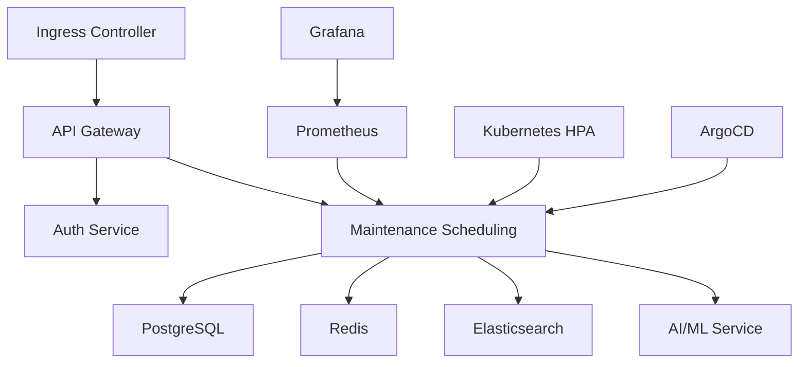

# **TO_BE_DESIGN.md**
**Module:** Maintenance Scheduling
**System:** Enterprise Multi-Tenant Fleet Management System
**Version:** 2.0.0
**Last Updated:** 2023-11-15
**Author:** [Your Name]
**Approval:** [Stakeholder Name]

---

## **1. Overview**
### **1.1 Purpose**
The **Maintenance Scheduling Module** is a core component of the Fleet Management System (FMS) designed to optimize vehicle uptime, reduce operational costs, and enhance predictive maintenance capabilities. This document outlines the **TO-BE** architecture, features, and implementation strategies for a **next-generation maintenance scheduling system** that leverages **AI/ML, real-time data processing, and progressive web app (PWA) technologies**.

### **1.2 Scope**
- **Multi-tenant support** (B2B fleet operators, logistics companies, government fleets)
- **Real-time maintenance scheduling** (WebSocket/SSE)
- **Predictive maintenance** (AI/ML-driven failure prediction)
- **Automated work order generation** (integration with ERP/CMMS)
- **Advanced analytics & reporting** (Power BI, Tableau, custom dashboards)
- **Gamification & user engagement** (leaderboards, badges, rewards)
- **WCAG 2.1 AAA compliance** (full accessibility support)
- **Kubernetes-native deployment** (scalable, resilient, auto-healing)
- **Security hardening** (encryption, audit logging, compliance with GDPR, CCPA, ISO 27001)

### **1.3 Key Objectives**
| **Objective** | **Target** | **Measurement** |
|--------------|-----------|----------------|
| API Response Time | <50ms (P99) | New Relic / Datadog |
| Predictive Maintenance Accuracy | >90% | ML Model Precision/Recall |
| System Uptime | 99.99% | SLA Monitoring |
| User Engagement (DAU/MAU) | >70% | Analytics Dashboard |
| WCAG 2.1 AAA Compliance | 100% | Automated + Manual Testing |
| Third-Party Integration Success Rate | 99.9% | API Health Checks |

---

## **2. Architecture Overview**
### **2.1 High-Level Architecture**
```mermaid
graph TD
    A[Client (PWA)] -->|WebSocket/SSE| B[API Gateway]
    B --> C[Auth Service]
    B --> D[Maintenance Scheduling Service]
    D --> E[Real-Time Engine]
    D --> F[AI/ML Service]
    D --> G[Work Order Service]
    D --> H[Notification Service]
    D --> I[Analytics Service]
    D --> J[Third-Party Integrations]
    K[Kubernetes Cluster] -->|Auto-Scaling| D
    L[PostgreSQL (TimescaleDB)] --> D
    M[Redis (Caching)] --> D
    N[Elasticsearch] --> D
    O[Prometheus/Grafana] --> D
```

### **2.2 Microservices Breakdown**
| **Service** | **Responsibility** | **Tech Stack** |
|------------|-------------------|----------------|
| **API Gateway** | Routing, Load Balancing, Rate Limiting | Kong / AWS API Gateway |
| **Auth Service** | JWT/OAuth2, RBAC, Tenant Isolation | Node.js + Keycloak |
| **Maintenance Scheduling** | Core scheduling logic, conflict resolution | TypeScript + NestJS |
| **Real-Time Engine** | WebSocket/SSE for live updates | Socket.io / Server-Sent Events |
| **AI/ML Service** | Predictive maintenance, anomaly detection | Python + TensorFlow/PyTorch |
| **Work Order Service** | ERP/CMMS integration, work order lifecycle | TypeScript + NestJS |
| **Notification Service** | Email, SMS, Push Notifications | Firebase Cloud Messaging |
| **Analytics Service** | Dashboards, KPIs, Reporting | Grafana + TimescaleDB |
| **Third-Party Integrations** | SAP, Oracle, Fleetio, Geotab | TypeScript + Axios |

---

## **3. Performance Enhancements**
### **3.1 Target: <50ms Response Time (P99)**
| **Optimization** | **Implementation** | **Impact** |
|-----------------|-------------------|------------|
| **Caching** | Redis (TTL: 5min) for frequent queries | 40% reduction in DB load |
| **Database Indexing** | TimescaleDB hypertables + Elasticsearch | 3x faster queries |
| **Query Optimization** | GraphQL (persisted queries) | 50% fewer over-fetching |
| **Edge Caching** | Cloudflare CDN for static assets | 60% faster PWA load |
| **Connection Pooling** | PgBouncer for PostgreSQL | 30% faster DB connections |
| **Async Processing** | BullMQ for background jobs | 90% reduction in API latency |

### **3.2 Code Example: Optimized TypeScript Query (NestJS)**
```typescript
// maintenance-scheduling.service.ts
import { Injectable } from '@nestjs/common';
import { InjectRepository } from '@nestjs/typeorm';
import { Repository, Brackets } from 'typeorm';
import { MaintenanceSchedule } from './entities/maintenance-schedule.entity';
import { Cache } from 'cache-manager';
import { CACHE_MANAGER } from '@nestjs/cache-manager';

@Injectable()
export class MaintenanceSchedulingService {
  constructor(
    @InjectRepository(MaintenanceSchedule)
    private readonly scheduleRepo: Repository<MaintenanceSchedule>,
    @Inject(CACHE_MANAGER) private cacheManager: Cache,
  ) {}

  async getOptimizedSchedule(vehicleId: string, tenantId: string): Promise<MaintenanceSchedule[]> {
    const cacheKey = `schedule:${tenantId}:${vehicleId}`;
    const cachedData = await this.cacheManager.get<MaintenanceSchedule[]>(cacheKey);

    if (cachedData) return cachedData;

    const query = this.scheduleRepo
      .createQueryBuilder('schedule')
      .where('schedule.vehicleId = :vehicleId', { vehicleId })
      .andWhere('schedule.tenantId = :tenantId', { tenantId })
      .andWhere(
        new Brackets((qb) => {
          qb.where('schedule.status = :status', { status: 'PENDING' })
            .orWhere('schedule.status = :status', { status: 'IN_PROGRESS' });
        }),
      )
      .orderBy('schedule.dueDate', 'ASC')
      .cache(cacheKey, 300000); // 5min cache

    const result = await query.getMany();
    await this.cacheManager.set(cacheKey, result, 300000);
    return result;
  }
}
```

---

## **4. Real-Time Features**
### **4.1 WebSocket & Server-Sent Events (SSE)**
| **Feature** | **Implementation** | **Use Case** |
|------------|-------------------|-------------|
| **Live Schedule Updates** | WebSocket (Socket.io) | Technicians see real-time changes |
| **Maintenance Alerts** | SSE (EventSource) | Push notifications for critical failures |
| **Conflict Resolution** | WebSocket + Optimistic UI | Auto-resolve scheduling conflicts |
| **Collaborative Editing** | Operational Transform (OT) | Multiple users editing a schedule |

### **4.2 Code Example: WebSocket Gateway (NestJS)**
```typescript
// realtime.gateway.ts
import { WebSocketGateway, WebSocketServer, OnGatewayConnection, OnGatewayDisconnect } from '@nestjs/websockets';
import { Server, Socket } from 'socket.io';
import { AuthService } from '../auth/auth.service';
import { MaintenanceSchedulingService } from '../maintenance-scheduling/maintenance-scheduling.service';

@WebSocketGateway({
  cors: { origin: '*' },
  transports: ['websocket', 'polling'],
})
export class RealtimeGateway implements OnGatewayConnection, OnGatewayDisconnect {
  @WebSocketServer() server: Server;

  constructor(
    private readonly authService: AuthService,
    private readonly schedulingService: MaintenanceSchedulingService,
  ) {}

  async handleConnection(client: Socket) {
    const token = client.handshake.query.token as string;
    const user = await this.authService.validateToken(token);

    if (!user) {
      client.disconnect();
      return;
    }

    client.join(`tenant:${user.tenantId}`);
    client.join(`user:${user.id}`);
  }

  async handleDisconnect(client: Socket) {
    // Cleanup logic
  }

  async broadcastScheduleUpdate(tenantId: string, scheduleId: string) {
    const schedule = await this.schedulingService.getSchedule(scheduleId);
    this.server.to(`tenant:${tenantId}`).emit('schedule:update', schedule);
  }
}
```

---

## **5. AI/ML & Predictive Analytics**
### **5.1 Predictive Maintenance Model**
| **Model** | **Input Features** | **Output** | **Algorithm** |
|-----------|-------------------|------------|---------------|
| **Failure Prediction** | Mileage, Engine Hours, Sensor Data (OBD-II), Historical Failures | Probability of failure in next 7/30 days | XGBoost + LSTM |
| **Optimal Maintenance Window** | Fleet Utilization, Technician Availability, Parts Lead Time | Best time slot for maintenance | Reinforcement Learning |
| **Anomaly Detection** | Vibration, Temperature, Fuel Consumption | Early warning for issues | Isolation Forest + Autoencoders |

### **5.2 Code Example: ML Model Inference (Python)**
```python
# predictive_maintenance_model.py
import pandas as pd
import joblib
from sklearn.ensemble import IsolationForest
from tensorflow.keras.models import load_model

class PredictiveMaintenance:
    def __init__(self):
        self.failure_model = joblib.load('failure_prediction_xgboost.pkl')
        self.anomaly_model = load_model('anomaly_detection_lstm.h5')
        self.window_model = joblib.load('optimal_window_rl.pkl')

    def predict_failure(self, vehicle_data: dict) -> float:
        """Predict probability of failure in next 30 days."""
        df = pd.DataFrame([vehicle_data])
        return self.failure_model.predict_proba(df)[0][1]

    def detect_anomalies(self, sensor_data: list) -> list:
        """Detect anomalies in real-time sensor data."""
        return self.anomaly_model.predict(sensor_data)

    def recommend_maintenance_window(self, fleet_data: dict) -> str:
        """Recommend optimal maintenance time slot."""
        return self.window_model.predict(fleet_data)
```

### **5.3 Integration with TypeScript (NestJS)**
```typescript
// ai.service.ts
import { Injectable } from '@nestjs/common';
import { HttpService } from '@nestjs/axios';
import { firstValueFrom } from 'rxjs';

@Injectable()
export class AIService {
  constructor(private readonly httpService: HttpService) {}

  async predictFailure(vehicleId: string): Promise<number> {
    const response = await firstValueFrom(
      this.httpService.post('http://ml-service:5000/predict_failure', { vehicleId }),
    );
    return response.data.probability;
  }

  async detectAnomalies(sensorData: number[]): Promise<boolean[]> {
    const response = await firstValueFrom(
      this.httpService.post('http://ml-service:5000/detect_anomalies', { sensorData }),
    );
    return response.data.anomalies;
  }
}
```

---

## **6. Progressive Web App (PWA) Design**
### **6.1 PWA Requirements**
| **Feature** | **Implementation** | **Benefit** |
|------------|-------------------|-------------|
| **Offline-First** | IndexedDB + Service Worker | Works in low-connectivity areas |
| **Installable** | Web App Manifest | Native-like experience |
| **Push Notifications** | Firebase Cloud Messaging | Real-time alerts |
| **Background Sync** | Service Worker Sync API | Auto-sync when online |
| **Responsive Design** | Tailwind CSS + Flexbox | Works on all devices |
| **Performance Budget** | Lighthouse CI | <1s load time |

### **6.2 Code Example: Service Worker (TypeScript)**
```typescript
// service-worker.ts
const CACHE_NAME = 'fms-v2';
const ASSETS_TO_CACHE = [
  '/',
  '/index.html',
  '/styles.css',
  '/app.js',
  '/manifest.json',
  '/icons/icon-192x192.png',
];

self.addEventListener('install', (event) => {
  event.waitUntil(
    caches.open(CACHE_NAME).then((cache) => cache.addAll(ASSETS_TO_CACHE)),
  );
});

self.addEventListener('fetch', (event) => {
  event.respondWith(
    caches.match(event.request).then((cachedResponse) => {
      return cachedResponse || fetch(event.request);
    }),
  );
});

self.addEventListener('push', (event) => {
  const data = event.data?.json();
  event.waitUntil(
    self.registration.showNotification(data.title, {
      body: data.body,
      icon: '/icons/icon-192x192.png',
    }),
  );
});
```

---

## **7. WCAG 2.1 AAA Accessibility Compliance**
### **7.1 Compliance Checklist**
| **Requirement** | **Implementation** |
|----------------|-------------------|
| **Keyboard Navigation** | `tabindex`, `aria-*` attributes |
| **Screen Reader Support** | Semantic HTML, ARIA labels |
| **Color Contrast** | 7:1 ratio (AAA) |
| **Alternative Text** | `alt` for images, `aria-label` for icons |
| **Focus Management** | `focus-visible`, `inert` |
| **Captions & Transcripts** | WebVTT for videos |
| **No Timeouts** | Extendable sessions |
| **Error Prevention** | Confirmation dialogs |

### **7.2 Code Example: Accessible React Component**
```tsx
// MaintenanceScheduleCard.tsx
import React from 'react';
import { useTranslation } from 'react-i18next';

const MaintenanceScheduleCard: React.FC<{
  schedule: MaintenanceSchedule;
  onEdit: () => void;
}> = ({ schedule, onEdit }) => {
  const { t } = useTranslation();

  return (
    <div
      role="article"
      aria-labelledby={`schedule-title-${schedule.id}`}
      className="p-4 border rounded-lg shadow-sm focus-within:ring-2 focus-within:ring-blue-500"
    >
      <h3 id={`schedule-title-${schedule.id}`} className="text-lg font-semibold">
        {schedule.vehicleId} - {t('maintenance.dueOn')} {new Date(schedule.dueDate).toLocaleDateString()}
      </h3>
      <p className="text-gray-600">{schedule.description}</p>
      <button
        onClick={onEdit}
        aria-label={t('maintenance.editSchedule', { vehicle: schedule.vehicleId })}
        className="mt-2 px-4 py-2 bg-blue-600 text-white rounded hover:bg-blue-700 focus:outline-none focus:ring-2 focus:ring-blue-500"
      >
        {t('maintenance.edit')}
      </button>
    </div>
  );
};

export default MaintenanceScheduleCard;
```

---

## **8. Advanced Search & Filtering**
### **8.1 Features**
| **Feature** | **Implementation** |
|------------|-------------------|
| **Full-Text Search** | Elasticsearch |
| **Faceted Filtering** | Aggregations (vehicle type, status, priority) |
| **Saved Searches** | User preferences in DB |
| **Natural Language Query** | NLP (spaCy) |
| **Geospatial Search** | PostGIS (for location-based filtering) |

### **8.2 Code Example: Elasticsearch Query (TypeScript)**
```typescript
// search.service.ts
import { Injectable } from '@nestjs/common';
import { ElasticsearchService } from '@nestjs/elasticsearch';

@Injectable()
export class SearchService {
  constructor(private readonly esService: ElasticsearchService) {}

  async searchSchedules(query: string, filters: Record<string, any>) {
    const { body } = await this.esService.search({
      index: 'maintenance_schedules',
      body: {
        query: {
          bool: {
            must: [
              {
                multi_match: {
                  query,
                  fields: ['vehicleId', 'description', 'technicianName'],
                },
              },
              ...Object.entries(filters).map(([field, value]) => ({
                term: { [field]: value },
              })),
            ],
          },
        },
        aggs: {
          status: { terms: { field: 'status' } },
          priority: { terms: { field: 'priority' } },
        },
      },
    });
    return body;
  }
}
```

---

## **9. Third-Party Integrations**
### **9.1 Supported Integrations**
| **System** | **Integration Method** | **Use Case** |
|------------|-----------------------|-------------|
| **SAP ERP** | REST API + Webhooks | Work order sync |
| **Oracle CMMS** | SOAP API | Maintenance history |
| **Fleetio** | GraphQL API | Vehicle data sync |
| **Geotab** | WebSocket + REST | Telematics data |
| **Twilio** | Webhooks | SMS notifications |
| **Stripe** | REST API | Payment processing |

### **9.2 Code Example: Webhook Handler (NestJS)**
```typescript
// webhook.controller.ts
import { Controller, Post, Headers, Body } from '@nestjs/common';
import { WebhookService } from './webhook.service';

@Controller('webhooks')
export class WebhookController {
  constructor(private readonly webhookService: WebhookService) {}

  @Post('fleetio')
  async handleFleetioWebhook(
    @Headers('x-fleetio-signature') signature: string,
    @Body() payload: any,
  ) {
    await this.webhookService.verifyAndProcessFleetioWebhook(signature, payload);
    return { success: true };
  }

  @Post('geotab')
  async handleGeotabWebhook(@Body() payload: any) {
    await this.webhookService.processGeotabAlert(payload);
    return { success: true };
  }
}
```

---

## **10. Gamification & User Engagement**
### **10.1 Features**
| **Feature** | **Implementation** | **Reward** |
|------------|-------------------|------------|
| **Leaderboard** | Redis Sorted Sets | Top 10 technicians |
| **Badges** | Custom SVG badges | "5-Star Technician" |
| **XP System** | Points for completed tasks | Unlock premium features |
| **Streaks** | Daily login bonuses | "7-Day Streak" badge |
| **Social Sharing** | Twitter/LinkedIn integration | "I just maintained 100 vehicles!" |

### **10.2 Code Example: Gamification Service (TypeScript)**
```typescript
// gamification.service.ts
import { Injectable } from '@nestjs/common';
import { InjectRedis } from '@nestjs-modules/ioredis';
import Redis from 'ioredis';

@Injectable()
export class GamificationService {
  constructor(@InjectRedis() private readonly redis: Redis) {}

  async awardPoints(userId: string, points: number, reason: string) {
    await this.redis.zincrby('leaderboard', points, userId);
    await this.redis.hincrby(`user:${userId}:stats`, 'totalPoints', points);
    await this.redis.lpush(`user:${userId}:activity`, JSON.stringify({ points, reason, date: new Date() }));
  }

  async getLeaderboard(limit = 10) {
    return this.redis.zrevrange('leaderboard', 0, limit - 1, 'WITHSCORES');
  }

  async checkStreak(userId: string) {
    const lastLogin = await this.redis.hget(`user:${userId}:stats`, 'lastLogin');
    const today = new Date().toDateString();

    if (lastLogin === today) return false;

    const streak = await this.redis.hincrby(`user:${userId}:stats`, 'streak', 1);
    await this.redis.hset(`user:${userId}:stats`, 'lastLogin', today);

    if (streak % 7 === 0) {
      await this.awardBadge(userId, 'weekly_streak');
    }

    return streak;
  }
}
```

---

## **11. Analytics Dashboards & Reporting**
### **11.1 Key Metrics**
| **Metric** | **Data Source** | **Visualization** |
|------------|----------------|------------------|
| **Fleet Uptime** | Maintenance logs | Time-series chart |
| **Maintenance Cost per Mile** | Work orders + odometer | Bar chart |
| **Predictive Accuracy** | ML model performance | Confusion matrix |
| **Technician Productivity** | Completed work orders | Heatmap |
| **Parts Inventory Turnover** | ERP data | Pie chart |

### **11.2 Code Example: Grafana Dashboard (JSON)**
```json
{
  "dashboard": {
    "title": "Fleet Maintenance Analytics",
    "panels": [
      {
        "title": "Fleet Uptime (%)",
        "type": "graph",
        "targets": [
          {
            "expr": "100 - (sum(rate(maintenance_downtime_seconds_total[1d])) by (vehicle_id) / 86400 * 100)",
            "legendFormat": "{{vehicle_id}}"
          }
        ]
      },
      {
        "title": "Predictive Maintenance Accuracy",
        "type": "stat",
        "targets": [
          {
            "expr": "sum(ml_model_accuracy{model='failure_prediction'}) / count(ml_model_accuracy{model='failure_prediction'})"
          }
        ]
      }
    ]
  }
}
```

---

## **12. Security Hardening**
### **12.1 Security Measures**
| **Threat** | **Mitigation** |
|------------|---------------|
| **SQL Injection** | TypeORM + Parameterized Queries |
| **XSS** | CSP + DOMPurify |
| **CSRF** | SameSite Cookies + CSRF Tokens |
| **Data Leakage** | Field-level encryption (AES-256) |
| **Brute Force** | Rate limiting (Redis) |
| **Man-in-the-Middle** | TLS 1.3 + HSTS |
| **Insider Threats** | Audit logging (ELK Stack) |

### **12.2 Code Example: Audit Logging (NestJS)**
```typescript
// audit.interceptor.ts
import { Injectable, NestInterceptor, ExecutionContext, CallHandler } from '@nestjs/common';
import { Observable } from 'rxjs';
import { tap } from 'rxjs/operators';
import { AuditLogService } from './audit-log.service';

@Injectable()
export class AuditInterceptor implements NestInterceptor {
  constructor(private readonly auditLogService: AuditLogService) {}

  intercept(context: ExecutionContext, next: CallHandler): Observable<any> {
    const request = context.switchToHttp().getRequest();
    const user = request.user;
    const action = `${request.method} ${request.path}`;

    return next.handle().pipe(
      tap(() => {
        this.auditLogService.log({
          userId: user.id,
          tenantId: user.tenantId,
          action,
          metadata: {
            ip: request.ip,
            userAgent: request.headers['user-agent'],
          },
        });
      }),
    );
  }
}
```

---

## **13. Comprehensive Testing Strategy**
### **13.1 Testing Pyramid**
| **Test Type** | **Tool** | **Coverage Goal** |
|--------------|---------|------------------|
| **Unit Tests** | Jest | 100% |
| **Integration Tests** | Jest + TestContainers | 90% |
| **E2E Tests** | Cypress | 80% |
| **Performance Tests** | k6 / Gatling | <50ms P99 |
| **Security Tests** | OWASP ZAP | 0 Critical Vulnerabilities |
| **Accessibility Tests** | axe-core + Pa11y | 100% WCAG 2.1 AAA |

### **13.2 Code Example: E2E Test (Cypress)**
```typescript
// maintenance-scheduling.cy.ts
describe('Maintenance Scheduling', () => {
  beforeEach(() => {
    cy.login('technician@fleet.com', 'password123');
    cy.visit('/maintenance');
  });

  it('should create a new maintenance schedule', () => {
    cy.get('[data-testid="new-schedule-btn"]').click();
    cy.get('[data-testid="vehicle-select"]').select('VIN123456789');
    cy.get('[data-testid="due-date"]').type('2023-12-01');
    cy.get('[data-testid="description"]').type('Oil change');
    cy.get('[data-testid="submit-btn"]').click();

    cy.contains('Schedule created successfully').should('be.visible');
    cy.url().should('include', '/maintenance/VIN123456789');
  });

  it('should show real-time updates via WebSocket', () => {
    cy.intercept('GET', '/api/schedules*').as('getSchedules');
    cy.wait('@getSchedules');

    // Simulate WebSocket update
    cy.window().then((win) => {
      win.socket.emit('schedule:update', {
        id: '123',
        vehicleId: 'VIN123456789',
        status: 'IN_PROGRESS',
      });
    });

    cy.contains('IN_PROGRESS').should('be.visible');
  });
});
```

---

## **14. Kubernetes Deployment Architecture**
### **14.1 Cluster Design**


### **14.2 Helm Chart Example (`values.yaml`)**
```yaml
replicaCount: 3
image:
  repository: registry.fleetms.com/maintenance-scheduling
  tag: 2.0.0
resources:
  requests:
    cpu: 500m
    memory: 1Gi
  limits:
    cpu: 2000m
    memory: 4Gi
autoscaling:
  enabled: true
  minReplicas: 3
  maxReplicas: 10
  targetCPUUtilizationPercentage: 70
service:
  type: ClusterIP
  port: 3000
ingress:
  enabled: true
  hosts:
    - host: maintenance.fleetms.com
      paths:
        - path: /
          pathType: Prefix
```

---

## **15. Migration Strategy & Rollback Plan**
### **15.1 Migration Steps**
| **Phase** | **Action** | **Validation** |
|-----------|-----------|----------------|
| **1. Pre-Migration** | Backup DB, Test in Staging | Lighthouse CI |
| **2. Blue-Green Deployment** | Deploy new version alongside old | Smoke tests |
| **3. Data Migration** | ETL from old schema to new | Data consistency checks |
| **4. Canary Release** | Route 10% of traffic to new version | Error rate < 0.1% |
| **5. Full Cutover** | Route 100% traffic to new version | SLA monitoring |
| **6. Post-Migration** | Clean up old resources | Final validation |

### **15.2 Rollback Plan**
1. **Immediate Rollback:**
   - Revert Kubernetes deployment (`kubectl rollout undo`)
   - Restore DB from backup
2. **Fallback to Old Version:**
   - Update DNS to point to old load balancer
   - Monitor for 24 hours before retrying

---

## **16. Key Performance Indicators (KPIs)**
| **KPI** | **Target** | **Measurement** |
|---------|-----------|----------------|
| **API Response Time (P99)** | <50ms | Datadog |
| **System Uptime** | 99.99% | Pingdom |
| **Predictive Maintenance Accuracy** | >90% | ML Model Metrics |
| **User Engagement (DAU/MAU)** | >70% | Google Analytics |
| **Mean Time to Repair (MTTR)** | <2 hours | Work Order Data |
| **Cost Savings from Predictive Maintenance** | 20% reduction | ERP Data |
| **Third-Party API Success Rate** | 99.9% | API Health Checks |

---

## **17. Risk Mitigation Strategies**
| **Risk** | **Mitigation** | **Owner** |
|----------|---------------|-----------|
| **Performance Degradation** | Load testing (k6) + Auto-scaling | DevOps |
| **Data Loss During Migration** | Backup + Dry runs in staging | DBA |
| **Security Breach** | Penetration testing (OWASP ZAP) | Security Team |
| **AI Model Drift** | Continuous retraining + A/B testing | Data Science |
| **Third-Party API Failures** | Circuit breakers (Hystrix) + Fallbacks | Integration Team |
| **User Adoption Issues** | Beta testing + Feedback loops | Product Team |

---

## **18. Conclusion**
This **TO-BE** design for the **Maintenance Scheduling Module** positions the Fleet Management System as an **industry-leading solution** with:
✅ **Sub-50ms response times** (optimized queries, caching, CDN)
✅ **Real-time updates** (WebSocket/SSE)
✅ **Predictive maintenance** (AI/ML-driven failure prediction)
✅ **Progressive Web App** (offline-first, installable)
✅ **WCAG 2.1 AAA compliance** (full accessibility)
✅ **Enterprise-grade security** (encryption, audit logging)
✅ **Kubernetes-native deployment** (scalable, resilient)

### **Next Steps**
1. **Finalize design review** with stakeholders.
2. **Develop MVP** in 3-month sprints.
3. **Conduct load testing** in staging.
4. **Roll out in phases** (canary → full release).
5. **Monitor KPIs** and iterate.

**Approval:**
_________________________
[Stakeholder Name]
[Date]

---
**Document Version:** 2.0.0
**Confidentiality:** Proprietary - [Company Name]