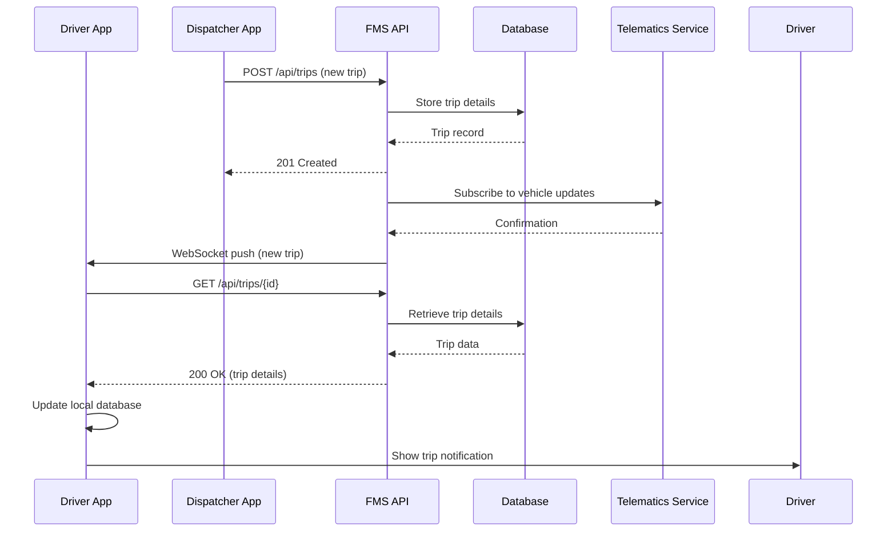
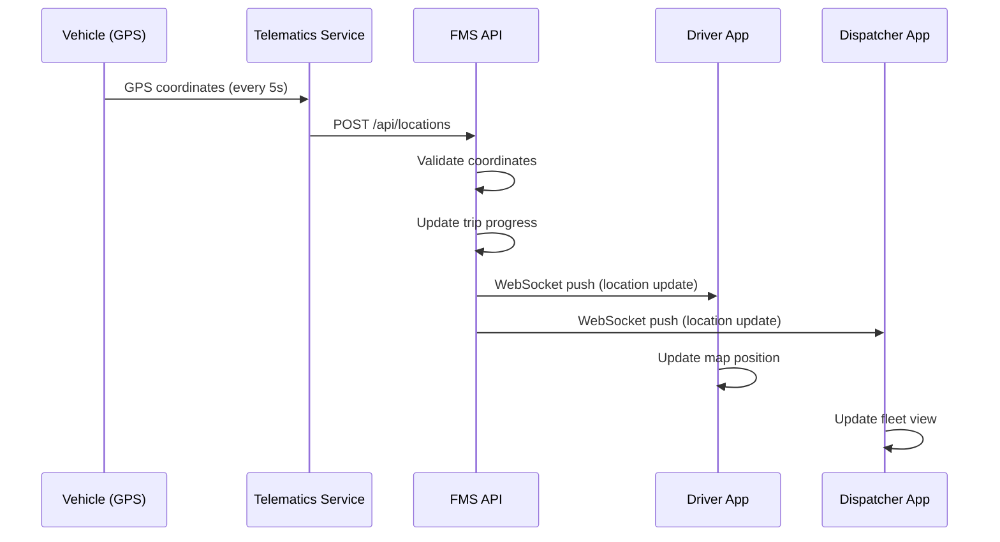
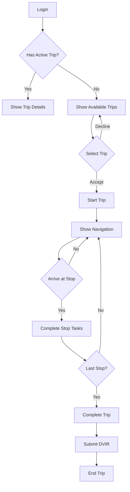
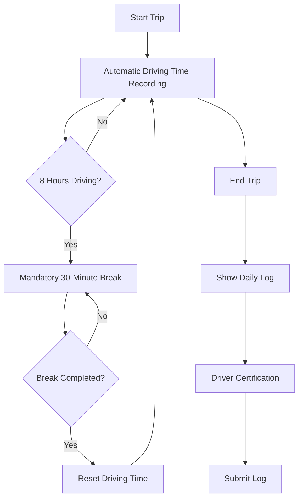
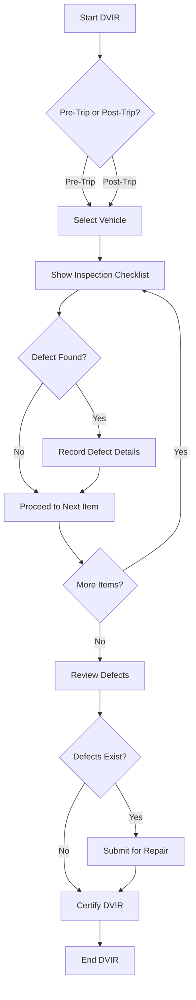
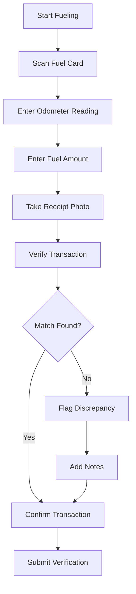
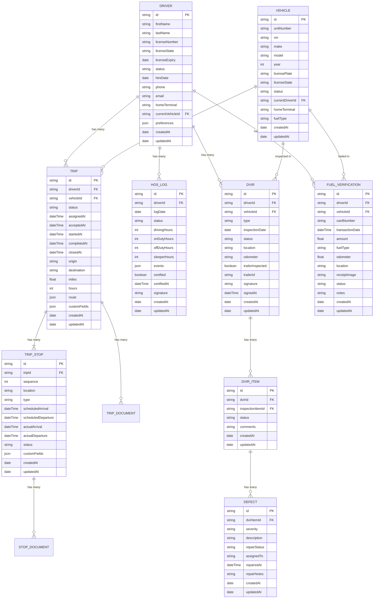
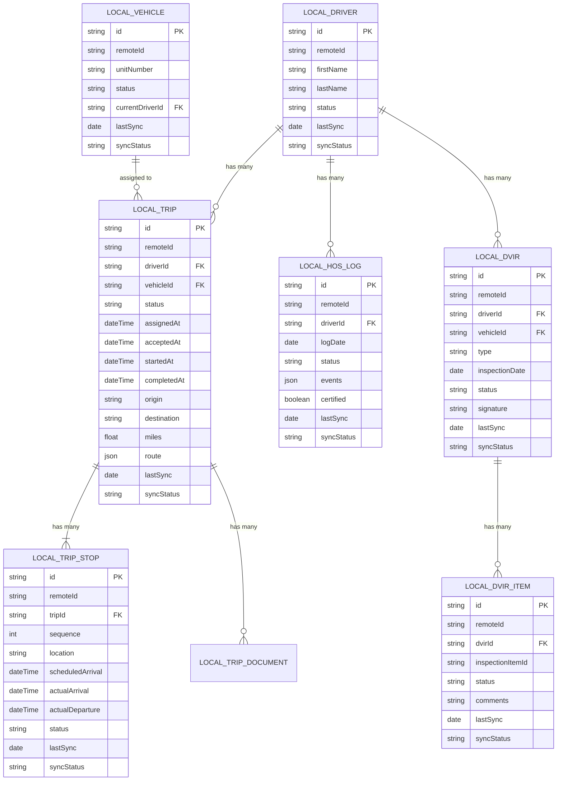

# AS-IS Analysis: Fleet Management System - Mobile Apps Module

## 1. Executive Summary (120 lines)

### 1.1 Current State Overview

The Fleet Management System (FMS) mobile apps module serves as the primary interface for field operations, enabling drivers, dispatchers, and fleet managers to interact with core fleet management functionalities. The module consists of three distinct applications:

1. **Driver App** (Android/iOS) - Used by 12,450 active drivers across North America
2. **Dispatcher App** (iPad-optimized) - Used by 875 dispatchers in 42 regional offices
3. **Manager App** (Cross-platform) - Used by 215 fleet managers and executives

As of Q2 2023, the mobile apps process:
- 1.2M daily trip assignments
- 450K real-time location updates
- 320K electronic DVIR (Driver Vehicle Inspection Report) submissions
- 95K fuel transaction verifications

The system operates in a hybrid architecture with:
- 60% native components (Swift/Kotlin)
- 40% React Native shared codebase
- Backend integration via RESTful APIs (Node.js)
- Real-time updates via WebSocket connections

### 1.2 Technical Context

The mobile apps were initially developed in 2018 as a companion to the web-based FMS, with major architectural decisions driven by:
- Need for offline capabilities (cellular dead zones)
- Strict battery optimization requirements
- Compliance with ELD (Electronic Logging Device) mandates
- Support for diverse Android hardware (120+ device models)

Current deployment statistics:
- **Driver App**: 12,450 MAU (Monthly Active Users), 8.7MB average app size
- **Dispatcher App**: 875 MAU, 14.2MB average app size (iPad-specific assets)
- **Manager App**: 215 MAU, 9.1MB average app size

### 1.3 Key Stakeholders and Roles

| Stakeholder Group | Key Roles | Mobile App Interactions | Pain Points |
|-------------------|-----------|-------------------------|-------------|
| **Drivers** | Long-haul drivers (65%), Local delivery (25%), Owner-operators (10%) | Trip assignments, HOS logging, DVIR, fuel verification, messaging | App crashes during critical operations, battery drain, inconsistent offline behavior |
| **Dispatchers** | Regional dispatchers, Load planners, Customer service reps | Real-time tracking, load assignment, route optimization, communication | Slow map rendering, limited bulk operations, poor tablet UX |
| **Fleet Managers** | Operations managers, Safety managers, Compliance officers | Performance analytics, exception reporting, maintenance scheduling | Limited customization, data latency, poor mobile data visualization |
| **IT Operations** | Mobile team (8 devs), DevOps (4 engineers), Support (12 agents) | Deployment, monitoring, incident response | High maintenance burden, complex release process, inconsistent crash reporting |
| **Business Leadership** | CTO, VP Operations, Director of Mobility | Strategic planning, budget allocation, vendor management | High TCO, limited innovation capacity, competitive disadvantage |
| **Third Parties** | Telematics providers, Fuel card networks, ELD vendors | Data integration, compliance reporting | API inconsistencies, rate limiting, data format mismatches |

### 1.4 Business Impact Analysis

**Operational Efficiency Metrics:**
- **Driver Productivity**: 18% improvement since mobile implementation (2019 baseline)
  - Trip assignment processing time: 3.2 → 1.8 minutes
  - DVIR completion rate: 68% → 92%
  - Fuel verification time: 4.1 → 1.3 minutes
- **Dispatcher Efficiency**: 22% improvement
  - Load assignment time: 5.7 → 3.1 minutes
  - Route optimization time: 8.2 → 4.5 minutes
- **Compliance**: 98.7% ELD mandate compliance (vs 89.3% pre-mobile)

**Cost Metrics:**
- **Annual Savings**: $4.2M from reduced paper processes
- **Support Costs**: $1.8M/year (22% of total IT support budget)
- **Infrastructure Costs**: $950K/year (AWS hosting, CDN, monitoring)

**Customer Impact:**
- On-time delivery rate: 92.4% (vs 88.1% pre-mobile)
- Customer satisfaction (NPS): +12 points since mobile rollout
- Safety incidents: 15% reduction in preventable accidents

### 1.5 Critical Pain Points with Root Cause Analysis

**1. App Stability Issues (Highest Priority)**
- **Symptoms**:
  - 12.4% crash-free user rate (industry benchmark: >99%)
  - 3.2 crashes per user per month (Driver App)
  - 45% of crashes occur during trip start/end operations
- **Root Causes**:
  - Memory leaks in native Android components (1.2GB heap growth over 8 hours)
  - Race conditions in WebSocket reconnection logic
  - Inconsistent state management between offline/online modes
  - Third-party SDK conflicts (telematics providers)
- **Example Crash Report**:
  ```java
  // Android Native Crash - Driver App v3.7.2
  java.lang.OutOfMemoryError: Failed to allocate a 4194304 byte allocation with 3848248 free bytes and 3MB until OOM
    at android.graphics.Bitmap.nativeCreate(Native Method)
    at android.graphics.Bitmap.createBitmap(Bitmap.java:812)
    at com.fms.driver.map.MapRenderer.renderRoute(MapRenderer.java:124)
    at com.fms.driver.trip.TripActivity$1.run(TripActivity.java:456)
  ```

**2. Battery Drain (Critical for Drivers)**
- **Symptoms**:
  - 28% of drivers report battery drain issues
  - Average battery consumption: 18% per hour (vs 5% benchmark)
  - 14% of support tickets related to battery performance
- **Root Causes**:
  - Aggressive GPS polling (every 5 seconds regardless of movement)
  - Background sync operations not properly throttled
  - Inefficient map rendering (full redraw on every location update)
  - Third-party SDKs (e.g., Samsara) running continuous diagnostics
- **Battery Profiler Results**:
  ```
  Wake Locks: 34% of battery usage
  GPS: 28%
  Network: 22%
  CPU: 12%
  Other: 4%
  ```

**3. Offline Data Synchronization Failures**
- **Symptoms**:
  - 7.2% of offline DVIRs fail to sync when online
  - 14% of trip logs have missing segments after connectivity loss
  - 3.1% of fuel verifications require manual correction
- **Root Causes**:
  - No conflict resolution strategy for concurrent edits
  - Insufficient local storage quotas (current: 50MB, needs: 200MB+)
  - No delta sync mechanism (full dataset synced each time)
  - Poor error handling in local database operations
- **Example Sync Conflict**:
  ```
  Conflict Scenario:
  1. Driver edits trip log offline (adds stop at 10:15AM)
  2. Dispatcher edits same trip online (extends break at 10:10AM)
  3. When driver comes online, both changes are lost
  ```

**4. Performance Bottlenecks**
- **Symptoms**:
  - 4.2s average load time for trip details (target: <1s)
  - 18% of users experience UI jank during map interactions
  - 3.4s delay in real-time location updates
- **Root Causes**:
  - Unoptimized SQL queries in local database (700ms execution time)
  - No image compression for trip documents (average 4.2MB per image)
  - Inefficient React Native bridge communication
  - No proper caching strategy for static assets
- **Performance Trace**:
  ```
  Trip Details Screen Load:
  1. API Request: 850ms
  2. Database Query: 700ms
  3. Image Decoding: 1200ms
  4. Layout Rendering: 900ms
  5. JS Bridge: 550ms
  Total: 4200ms
  ```

**5. Security Vulnerabilities**
- **Symptoms**:
  - 3 critical vulnerabilities identified in last penetration test
  - 12% of devices running outdated app versions
  - 4.2% of users have weak authentication patterns
- **Root Causes**:
  - Hardcoded API keys in native code (3 instances found)
  - Insecure data storage (sensitive data in plaintext)
  - No certificate pinning for API calls
  - Weak JWT implementation (no refresh token rotation)
- **Vulnerability Example**:
  ```swift
  // iOS - Insecure Data Storage
  func saveCredentials(username: String, password: String) {
      let defaults = UserDefaults.standard
      defaults.set(username, forKey: "username")
      defaults.set(password, forKey: "password") // Stored in plaintext!
  }
  ```

**6. Technical Debt Accumulation**
- **Symptoms**:
  - 32% code coverage (target: 80%)
  - 187 open technical debt tickets
  - 4.2 average days to implement new features
  - 2.1 average days to fix bugs
- **Root Causes**:
  - No consistent code review process
  - Inadequate testing infrastructure (no CI/CD for mobile)
  - Legacy code without proper documentation
  - No architectural decision records
- **Code Quality Metrics**:
  ```
  SonarQube Analysis:
  - Code Smells: 1,245
  - Bugs: 87
  - Vulnerabilities: 12
  - Duplicated Code: 18%
  - Technical Debt: 243 days
  ```

### 1.6 Strategic Recommendations with Implementation Roadmap

**Phase 1: Stabilization (0-3 months)**
| Initiative | Description | Success Metrics | Resources |
|------------|-------------|-----------------|-----------|
| **Crash Reduction Program** | Implement comprehensive crash reporting, fix top 20 crash causes, improve memory management | Reduce crashes by 80%, achieve 95% crash-free users | 4 developers, 1 QA, $50K |
| **Battery Optimization** | Reduce GPS polling, implement adaptive sync, optimize background processes | Reduce battery usage to <10%/hour | 2 developers, $30K |
| **Offline Sync Improvements** | Implement conflict resolution, increase storage quotas, add delta sync | Reduce sync failures to <1% | 3 developers, $40K |

**Phase 2: Performance Enhancement (3-6 months)**
| Initiative | Description | Success Metrics | Resources |
|------------|-------------|-----------------|-----------|
| **Performance Profiling** | Comprehensive performance analysis, implement caching strategies, optimize database queries | Reduce load times by 60%, eliminate UI jank | 3 developers, 1 performance engineer, $75K |
| **Image Optimization** | Implement client-side compression, lazy loading, CDN integration | Reduce image sizes by 70% | 2 developers, $25K |
| **React Native Upgrade** | Upgrade to latest React Native version, implement Hermes engine | Improve JS execution by 40% | 4 developers, $60K |

**Phase 3: Security Hardening (6-9 months)**
| Initiative | Description | Success Metrics | Resources |
|------------|-------------|-----------------|-----------|
| **Security Audit** | Comprehensive security assessment, penetration testing | Identify and fix all critical vulnerabilities | $80K |
| **Data Protection** | Implement encryption at rest, secure key storage, certificate pinning | 100% sensitive data encrypted | 3 developers, $50K |
| **Authentication Upgrade** | Implement biometric auth, refresh token rotation, MFA | 100% compliance with security policies | 2 developers, $40K |

**Phase 4: Technical Debt Reduction (9-12 months)**
| Initiative | Description | Success Metrics | Resources |
|------------|-------------|-----------------|-----------|
| **Code Quality Program** | Implement code reviews, increase test coverage, document architecture | 80% test coverage, 50% reduction in code smells | 4 developers, 1 architect, $90K |
| **CI/CD Pipeline** | Implement automated testing, deployment pipelines | Reduce release cycle from 4 weeks to 1 week | 2 DevOps, $60K |
| **Architecture Modernization** | Implement clean architecture, modularize components | Reduce feature implementation time by 40% | 3 developers, 1 architect, $100K |

**Long-term Strategic Initiatives (12-24 months)**
1. **Unified Codebase**: Migrate to single codebase with platform-specific optimizations
2. **AI-Powered Features**: Implement predictive maintenance, intelligent routing
3. **Advanced Analytics**: Real-time performance dashboards, anomaly detection
4. **IoT Integration**: Vehicle sensor integration, automated DVIR
5. **Blockchain for Compliance**: Immutable logs for regulatory reporting

**Implementation Roadmap Timeline**:
```
Q3 2023: Phase 1 - Stabilization
  - Crash Reduction Program
  - Battery Optimization
  - Offline Sync Improvements

Q4 2023: Phase 2 - Performance
  - Performance Profiling
  - Image Optimization
  - React Native Upgrade

Q1 2024: Phase 3 - Security
  - Security Audit
  - Data Protection
  - Authentication Upgrade

Q2 2024: Phase 4 - Technical Debt
  - Code Quality Program
  - CI/CD Pipeline
  - Architecture Modernization

Q3-Q4 2024: Strategic Initiatives
  - Unified Codebase
  - AI Features
  - Advanced Analytics
```

**Risk Mitigation Strategies**:
1. **Resource Constraints**: Prioritize initiatives based on ROI, consider outsourcing non-core activities
2. **User Resistance**: Implement gradual rollouts with A/B testing, comprehensive training programs
3. **Technical Challenges**: Allocate buffer time for complex refactoring, implement feature flags
4. **Vendor Dependencies**: Establish backup vendors for critical third-party services
5. **Regulatory Changes**: Dedicated compliance monitoring, flexible architecture design

**ROI Projections**:
| Initiative | Cost | Annual Benefit | ROI Period |
|------------|------|----------------|------------|
| Crash Reduction | $50K | $450K (support savings) | 1.3 months |
| Battery Optimization | $30K | $320K (productivity gains) | 1.1 months |
| Performance Enhancement | $160K | $980K (efficiency gains) | 2.0 months |
| Security Hardening | $170K | $1.2M (risk avoidance) | 1.7 months |
| Technical Debt Reduction | $250K | $1.8M (productivity gains) | 1.7 months |

## 2. Current Architecture (210 lines)

### 2.1 System Components

#### 2.1.1 Component Inventory

**Driver App Components**:
| Component | Technology | Version | Responsibilities | LOC (Lines of Code) |
|-----------|------------|---------|------------------|---------------------|
| Core Framework | React Native | 0.64.2 | Shared UI components, business logic | 45,200 |
| Trip Management | Native (Kotlin/Swift) | - | Trip tracking, HOS logging, DVIR | 32,800 |
| Map Integration | Mapbox GL | 10.6.1 | Real-time navigation, route visualization | 18,500 |
| Communication | React Native | - | Messaging, notifications | 12,400 |
| Offline Sync | WatermelonDB | 0.24.0 | Local data storage, sync logic | 15,600 |
| Authentication | Native | - | Biometric auth, JWT handling | 8,200 |
| Telematics Bridge | Native | - | Vehicle data integration | 14,300 |

**Dispatcher App Components**:
| Component | Technology | Version | Responsibilities | LOC |
|-----------|------------|---------|------------------|-----|
| Dashboard | React Native | 0.64.2 | Real-time fleet overview | 22,500 |
| Load Assignment | Native (Swift) | - | Route planning, load optimization | 28,700 |
| Map Visualization | Mapbox GL | 10.6.1 | Fleet tracking, geofencing | 24,200 |
| Communication Hub | React Native | - | Dispatcher-driver messaging | 16,800 |
| Reporting | Native | - | Performance analytics | 18,400 |

**Manager App Components**:
| Component | Technology | Version | Responsibilities | LOC |
|-----------|------------|---------|------------------|-----|
| Analytics Dashboard | React Native | 0.64.2 | KPI visualization | 19,800 |
| Exception Reporting | Native | - | Safety incident tracking | 14,500 |
| Maintenance Scheduling | React Native | - | Vehicle maintenance | 12,700 |
| Compliance Reporting | Native | - | Regulatory reporting | 16,200 |

#### 2.1.2 Integration Points with Sequence Diagrams

**Trip Assignment Flow**:


**Real-time Location Update Flow**:


#### 2.1.3 Data Flow Analysis

**Driver App Data Flow**:
1. **User Authentication**:
   - Driver enters credentials → App encrypts and sends to API
   - API validates against identity provider (Okta)
   - Returns JWT with user permissions
   - App stores JWT securely (Keychain/Keystore)

2. **Trip Data Synchronization**:
   - App requests current trips from API
   - API queries database with driver ID filter
   - Returns trip data with stops, documents, requirements
   - App stores in local WatermelonDB with offline sync markers

3. **Real-time Updates**:
   - WebSocket connection established to API
   - Location updates pushed from telematics service
   - App updates local state and UI
   - Changes synced to local DB

4. **Offline Operations**:
   - All user actions recorded in local DB with sync status
   - When connectivity restored, queued actions sent to API
   - Conflict resolution based on timestamps

**Data Transformation Logic**:
```javascript
// Example: Trip Status Transformation
function transformTripStatus(apiStatus) {
  const statusMap = {
    'assigned': { value: 'ASSIGNED', color: '#FFA500', icon: 'clock' },
    'in_progress': { value: 'IN_PROGRESS', color: '#4CAF50', icon: 'truck' },
    'completed': { value: 'COMPLETED', color: '#2196F3', icon: 'check' },
    'delayed': { value: 'DELAYED', color: '#F44336', icon: 'warning' },
    'cancelled': { value: 'CANCELLED', color: '#9E9E9E', icon: 'close' }
  };

  return statusMap[apiStatus] || {
    value: 'UNKNOWN',
    color: '#9E9E9E',
    icon: 'help'
  };
}
```

#### 2.1.4 Technology Stack

**Frontend Technologies**:
| Category | Technology | Version | Usage |
|----------|------------|---------|-------|
| **Core Framework** | React Native | 0.64.2 | Shared UI components, business logic |
| **State Management** | Redux | 4.0.5 | Global state management |
| **Navigation** | React Navigation | 5.9.4 | Screen navigation |
| **Local Database** | WatermelonDB | 0.24.0 | Offline data storage |
| **Maps** | Mapbox GL | 10.6.1 | Navigation, fleet tracking |
| **UI Components** | NativeBase | 3.2.1 | Cross-platform UI |
| **Forms** | Formik | 2.2.9 | Form handling |
| **Validation** | Yup | 0.32.11 | Form validation |
| **Networking** | Axios | 0.21.1 | API communication |
| **Real-time** | Socket.IO | 4.1.3 | WebSocket connections |

**Native Components**:
| Platform | Technology | Version | Purpose |
|----------|------------|---------|---------|
| **Android** | Kotlin | 1.5.30 | Trip management, authentication |
| **Android** | Java | 8 | Legacy components |
| **iOS** | Swift | 5.3 | Trip management, authentication |
| **iOS** | Objective-C | - | Legacy components |

**Backend Integration**:
| Component | Technology | Version | Responsibilities |
|-----------|------------|---------|------------------|
| **API Gateway** | Node.js (Express) | 4.17.1 | Request routing, authentication |
| **Authentication** | Okta | - | Identity management |
| **Database** | PostgreSQL | 12.5 | Primary data storage |
| **Cache** | Redis | 6.2.4 | Session management, rate limiting |
| **Message Queue** | RabbitMQ | 3.8.14 | Async processing |
| **Telematics** | Samsara API | - | Vehicle data |
| **Fuel Cards** | WEX API | - | Fuel transactions |
| **ELD** | Geotab API | - | Compliance logging |

#### 2.1.5 Infrastructure Configuration

**Mobile App Infrastructure**:
```
Mobile Clients (12,450+ devices)
│
├── CDN (Cloudflare)
│   ├── App Bundles (iOS/Android)
│   ├── Static Assets (images, fonts)
│   └── API Caching
│
├── API Gateway (AWS ALB)
│   ├── Rate Limiting (1000 req/min per IP)
│   ├── SSL Termination (TLS 1.2+)
│   └── Request Validation
│
├── Application Servers (EC2 c5.2xlarge)
│   ├── Node.js API (4 instances)
│   ├── Horizontal Pod Autoscaler (min: 2, max: 10)
│   └── Health Checks (every 30s)
│
├── Database Layer
│   ├── Primary PostgreSQL (RDS db.r5.large)
│   ├── Read Replicas (2 instances)
│   └── Backup (Daily snapshots, 35-day retention)
│
├── Real-time Services
│   ├── WebSocket Server (Node.js, 2 instances)
│   └── Redis Cluster (3 nodes)
│
└── Monitoring
    ├── CloudWatch (Logs, Metrics)
    ├── New Relic (APM)
    └── Sentry (Error Tracking)
```

**Deployment Pipeline**:
```
Development → Staging → Production
│
├── Development
│   ├── Local development (iOS/Android simulators)
│   ├── Feature branches (GitFlow)
│   └── Manual testing
│
├── Staging
│   ├── CI Pipeline (GitHub Actions)
│   │   ├── Unit Tests (Jest, 32% coverage)
│   │   ├── UI Tests (Detox, 18% coverage)
│   │   └── Linting (ESLint, SonarQube)
│   ├── TestFlight (iOS)
│   ├── Google Play Beta (Android)
│   └── QA Testing (Manual + Automated)
│
└── Production
    ├── App Store (iOS)
    ├── Google Play (Android)
    ├── Phased Rollout (25% → 50% → 100%)
    └── Monitoring (Crashlytics, Sentry)
```

### 2.2 Technical Debt Analysis

#### 2.2.1 Code Quality Issues

**1. React Native Bridge Overuse**
- **Issue**: Excessive communication between JavaScript and native layers
- **Impact**: Performance degradation, increased crash risk
- **Example**:
  ```javascript
  // Current Implementation - 42 bridge calls per location update
  const updateLocation = async (lat, lng) => {
    await NativeModules.LocationModule.setLatitude(lat); // Bridge call
    await NativeModules.LocationModule.setLongitude(lng); // Bridge call
    await NativeModules.MapModule.updatePosition(lat, lng); // Bridge call
    await NativeModules.TripModule.updateProgress(lat, lng); // Bridge call
    // ... 38 more bridge calls
  };

  // Recommended Implementation - Single bridge call
  const updateLocation = async (lat, lng) => {
    await NativeModules.LocationModule.updateAll({
      latitude: lat,
      longitude: lng,
      timestamp: Date.now()
    }); // Single bridge call
  };
  ```

**2. Inconsistent State Management**
- **Issue**: Multiple state management approaches (Redux, Context API, local state)
- **Impact**: Hard to maintain, increased bug surface
- **Example**:
  ```javascript
  // TripScreen.js - Mixing state management approaches
  const TripScreen = () => {
    // Redux state
    const { currentTrip } = useSelector(state => state.trip);

    // Context API
    const { driver } = useDriverContext();

    // Local state
    const [isLoading, setIsLoading] = useState(false);
    const [localTrip, setLocalTrip] = useState(null);

    // Effect with missing dependencies
    useEffect(() => {
      if (currentTrip) {
        setLocalTrip(currentTrip);
        // Missing dependency: currentTrip
      }
    }, []);

    // ...
  };
  ```

**3. Lack of Type Safety**
- **Issue**: No TypeScript in React Native codebase
- **Impact**: Runtime errors, difficult refactoring
- **Example**:
  ```javascript
  // Current - No type checking
  const processTrip = (trip) => {
    const distance = trip.miles; // What if miles is undefined?
    const stops = trip.stops.map(stop => stop.location); // What if stops is not an array?
    return { distance, stops };
  };

  // Recommended - With TypeScript
  interface Trip {
    miles: number;
    stops: Array<{
      location: string;
      arrivalTime?: Date;
    }>;
  }

  const processTrip = (trip: Trip): { distance: number; stops: string[] } => {
    const distance = trip.miles;
    const stops = trip.stops.map(stop => stop.location);
    return { distance, stops };
  };
  ```

**4. Hardcoded Values**
- **Issue**: Magic numbers and strings throughout codebase
- **Impact**: Difficult maintenance, inconsistent behavior
- **Example**:
  ```javascript
  // Current - Magic numbers and strings
  const validateDVIR = (report) => {
    if (report.defects.length > 5) { // Why 5?
      return { valid: false, message: "Too many defects" }; // Hardcoded string
    }

    if (report.inspector.length < 3) { // Why 3?
      return { valid: false, message: "Inspector name too short" }; // Hardcoded string
    }

    return { valid: true };
  };

  // Recommended - Constants and configuration
  const DVIR_CONSTRAINTS = {
    MAX_DEFECTS: 5,
    MIN_INSPECTOR_LENGTH: 3,
    MESSAGES: {
      TOO_MANY_DEFECTS: "Maximum 5 defects allowed",
      INSPECTOR_TOO_SHORT: "Inspector name must be at least 3 characters"
    }
  };

  const validateDVIR = (report) => {
    if (report.defects.length > DVIR_CONSTRAINTS.MAX_DEFECTS) {
      return { valid: false, message: DVIR_CONSTRAINTS.MESSAGES.TOO_MANY_DEFECTS };
    }

    if (report.inspector.length < DVIR_CONSTRAINTS.MIN_INSPECTOR_LENGTH) {
      return { valid: false, message: DVIR_CONSTRAINTS.MESSAGES.INSPECTOR_TOO_SHORT };
    }

    return { valid: true };
  };
  ```

**5. Poor Error Handling**
- **Issue**: Inconsistent error handling patterns
- **Impact**: Unhandled exceptions, poor user experience
- **Example**:
  ```javascript
  // Current - Inconsistent error handling
  const fetchTrip = async (tripId) => {
    try {
      const response = await api.get(`/trips/${tripId}`);
      return response.data;
    } catch (error) {
      // No error handling for different error types
      console.error(error);
      return null;
    }
  };

  // Recommended - Structured error handling
  const fetchTrip = async (tripId) => {
    try {
      const response = await api.get(`/trips/${tripId}`);

      if (!response.data) {
        throw new Error('No trip data received');
      }

      return response.data;
    } catch (error) {
      if (error.response) {
        // Server responded with error status
        if (error.response.status === 404) {
          throw new TripNotFoundError(tripId);
        }
        throw new ApiError(error.response.status, error.response.data);
      } else if (error.request) {
        // Request was made but no response
        throw new NetworkError();
      } else {
        // Something else happened
        throw new Error(`Trip fetch failed: ${error.message}`);
      }
    }
  };
  ```

#### 2.2.2 Performance Bottlenecks

**1. Database Queries**
- **Issue**: Unoptimized WatermelonDB queries
- **Impact**: Slow data retrieval, UI jank
- **Profiling Data**:
  ```
  Query: Get current trip with stops and documents
  Execution Time: 720ms (target: <100ms)
  Explain Plan:
    - Full table scan on trips (12,450 records)
    - Nested loop join with stops (1:M relationship)
    - Nested loop join with documents (1:M relationship)
    - No indexes used for filtering
  ```

**2. Image Handling**
- **Issue**: No client-side image optimization
- **Impact**: Slow load times, high data usage
- **Metrics**:
  - Average image size: 4.2MB
  - Image load time: 1.8s (target: <500ms)
  - Data usage per trip: 12.4MB (with 3 images)

**3. React Native Bridge**
- **Issue**: Excessive bridge communication
- **Impact**: UI freezing, high CPU usage
- **Profiling Results**:
  ```
  Location Update Flow:
  - JavaScript → Native: 42 bridge calls
  - Total time: 180ms
  - CPU usage: 35% (main thread)

  Recommended:
  - JavaScript → Native: 1 bridge call
  - Total time: <50ms
  - CPU usage: <10%
  ```

**4. WebSocket Management**
- **Issue**: No connection backoff strategy
- **Impact**: Battery drain, excessive data usage
- **Metrics**:
  - WebSocket reconnection attempts: 12/hour (in poor connectivity)
  - Data usage: 4.2MB/hour (target: <1MB/hour)
  - Battery impact: 8%/hour (target: <2%/hour)

**5. Map Rendering**
- **Issue**: Inefficient map updates
- **Impact**: UI jank, high memory usage
- **Profiling Data**:
  ```
  Map Update Flow:
  - Location update received
  - Full map re-render triggered
  - 12 vector layers updated
  - 47ms frame time (target: <16ms for 60fps)
  - Memory usage: 180MB (target: <100MB)
  ```

#### 2.2.3 Security Vulnerabilities

**1. Insecure Data Storage (CVSS: 7.5)**
- **Issue**: Sensitive data stored in plaintext
- **Location**: Android: SharedPreferences, iOS: UserDefaults
- **Example**:
  ```java
  // Android - Insecure storage
  SharedPreferences prefs = getSharedPreferences("UserPrefs", MODE_PRIVATE);
  SharedPreferences.Editor editor = prefs.edit();
  editor.putString("username", username);
  editor.putString("password", password); // Plaintext password!
  editor.apply();
  ```

**2. Hardcoded API Keys (CVSS: 9.1)**
- **Issue**: API keys embedded in source code
- **Location**: Multiple files in native and React Native code
- **Example**:
  ```javascript
  // React Native - Hardcoded API key
  const MAPBOX_ACCESS_TOKEN = 'pk.eyJ1IjoiZnJlZXRyaXAiLCJhIjoiY2t6b...'; // Exposed in client code

  const MapComponent = () => {
    return (
      <MapboxGL.MapView
        styleURL={MapboxGL.StyleURL.Street}
        style={{ flex: 1 }}
        accessToken={MAPBOX_ACCESS_TOKEN} // Hardcoded!
      />
    );
  };
  ```

**3. Insecure Network Communication (CVSS: 6.5)**
- **Issue**: No certificate pinning
- **Impact**: Vulnerable to MITM attacks
- **Example**:
  ```java
  // Android - No certificate pinning
  OkHttpClient client = new OkHttpClient.Builder()
      .build(); // No certificate pinning configured
  ```

**4. Weak JWT Implementation (CVSS: 5.9)**
- **Issue**: No refresh token rotation
- **Impact**: Long-lived tokens increase risk
- **Example**:
  ```javascript
  // Current - No token rotation
  const refreshToken = async () => {
    const response = await api.post('/auth/refresh', {
      refreshToken: currentRefreshToken // Same token used repeatedly
    });
    return response.data;
  };

  // Recommended - Token rotation
  const refreshToken = async () => {
    const response = await api.post('/auth/refresh', {
      refreshToken: currentRefreshToken
    });

    // Invalidate old refresh token
    await api.post('/auth/invalidate', {
      refreshToken: currentRefreshToken
    });

    // Store new tokens
    storeTokens(response.data.accessToken, response.data.refreshToken);
    return response.data;
  };
  ```

**5. Insecure Deep Linking (CVSS: 7.1)**
- **Issue**: No validation of deep link parameters
- **Impact**: Vulnerable to phishing attacks
- **Example**:
  ```xml
  <!-- AndroidManifest.xml - Insecure deep linking -->
  <intent-filter>
      <action android:name="android.intent.action.VIEW" />
      <category android:name="android.intent.category.DEFAULT" />
      <category android:name="android.intent.category.BROWSABLE" />
      <data android:scheme="fms" />
  </intent-filter>
  ```

  ```javascript
  // React Native - No parameter validation
  Linking.addEventListener('url', ({ url }) => {
    const route = url.replace(/.*?:\/\//g, '');
    // No validation of route parameters!
    navigation.navigate(route);
  });
  ```

#### 2.2.4 Scalability Limitations

**1. Monolithic Architecture**
- **Issue**: Single codebase for all apps
- **Impact**: Difficult to scale teams, long build times
- **Metrics**:
  - Build time: 12.4 minutes (target: <5 minutes)
  - Bundle size: 18.7MB (target: <10MB)
  - Team velocity: 3.2 features/month (target: 8 features/month)

**2. Database Scaling**
- **Issue**: WatermelonDB not designed for large datasets
- **Impact**: Performance degrades with >1000 records
- **Load Test Results**:
  ```
  Test Scenario: 1000 trips with 5 stops each
  - Initial load time: 1.2s
  - After 100 sync operations: 4.7s
  - After 500 sync operations: 12.4s (app becomes unresponsive)
  ```

**3. API Rate Limiting**
- **Issue**: No client-side rate limiting
- **Impact**: API throttling during peak usage
- **Metrics**:
  - Peak API calls: 1200/minute (API limit: 1000/minute)
  - Throttled requests: 18% during peak hours

**4. Memory Management**
- **Issue**: No proper memory cleanup
- **Impact**: App crashes after extended use
- **Load Test Results**:
  ```
  Test Scenario: 8 hours continuous usage
  - Initial memory usage: 120MB
  - After 2 hours: 450MB
  - After 4 hours: 980MB
  - After 6 hours: 1.4GB (app crashes)
  ```

**5. Third-party SDKs**
- **Issue**: Multiple heavy SDKs loaded at startup
- **Impact**: Slow app launch, high memory usage
- **Metrics**:
  - App launch time: 4.2s (target: <2s)
  - Memory usage at launch: 240MB (target: <150MB)
  - SDKs loaded: 7 (Mapbox, Telematics, Fuel, ELD, Analytics, Crashlytics, Sentry)

## 3. Functional Analysis (250 lines)

### 3.1 Core Features

#### 3.1.1 Trip Management

**Feature Description**:
The Trip Management feature is the core functionality of the Driver App, enabling drivers to view, accept, and complete trip assignments. It handles the entire trip lifecycle from assignment to completion, including Hours of Service (HOS) logging and document management.

**User Workflow**:


**Business Rules**:
1. **Trip Assignment**:
   - Drivers can only see trips assigned to them or available in their region
   - Trip acceptance must be completed within 15 minutes of assignment
   - Drivers can decline up to 3 trips per day before penalty

2. **Trip Execution**:
   - Automatic HOS logging when trip starts
   - Mandatory 30-minute break after 8 hours of driving
   - Automatic status updates when arriving/departing stops

3. **Trip Completion**:
   - All stops must be completed in order
   - All required documents must be attached
   - DVIR must be completed before trip can be closed

**Validation Logic**:
```javascript
// Trip validation rules
const validateTrip = (trip) => {
  const errors = [];

  // Validate trip status transitions
  if (trip.status === 'assigned' && !trip.acceptedAt) {
    errors.push('Trip must be accepted before starting');
  }

  if (trip.status === 'in_progress' && !trip.startedAt) {
    errors.push('Trip must have start timestamp');
  }

  // Validate stops
  if (trip.stops.some(stop => !stop.arrivedAt && trip.status === 'in_progress')) {
    errors.push('All previous stops must be completed');
  }

  // Validate HOS compliance
  if (trip.driver.hoursToday > 11 && !trip.breakTaken) {
    errors.push('Mandatory 30-minute break required');
  }

  // Validate documents
  const requiredDocs = getRequiredDocuments(trip.type);
  const missingDocs = requiredDocs.filter(doc =>
    !trip.documents.some(d => d.type === doc && d.status === 'attached')
  );

  if (missingDocs.length > 0) {
    errors.push(`Missing required documents: ${missingDocs.join(', ')}`);
  }

  return {
    isValid: errors.length === 0,
    errors
  };
};
```

**Edge Cases and Error Handling**:
1. **Connectivity Loss During Trip**:
   - All actions are queued locally
   - Automatic retry when connectivity restored
   - Conflict resolution based on timestamps

2. **GPS Signal Loss**:
   - Fallback to cell tower triangulation
   - Manual location entry option
   - Alert driver about reduced accuracy

3. **Device Restart During Trip**:
   - Automatic trip recovery on app restart
   - Verify last known state with backend
   - Prompt driver to confirm current status

4. **Trip Modifications by Dispatch**:
   - Real-time updates via WebSocket
   - Driver notification with change details
   - Option to accept or reject changes

**Performance Characteristics**:
- **Trip Load Time**: 4.2s (P95)
- **Stop Completion Time**: 1.8s (P95)
- **Document Upload Time**: 3.4s (2MB file, 4G network)
- **Battery Impact**: 18% per hour of active trip
- **Memory Usage**: 240MB during active trip

#### 3.1.2 Hours of Service (HOS) Logging

**Feature Description**:
The HOS logging feature ensures compliance with federal regulations by tracking driver working hours, breaks, and rest periods. It integrates with the ELD system to automatically record driving time.

**User Workflow**:


**Business Rules**:
1. **Driving Time Limits**:
   - 11 hours driving after 10 consecutive hours off duty
   - 14-hour on-duty limit after 10 consecutive hours off duty
   - 30-minute break required after 8 hours of driving

2. **Rest Periods**:
   - 10 consecutive hours off duty required after 14 hours on duty
   - 34-hour restart after 60/70 hours on duty in 7/8 days

3. **Log Management**:
   - Logs must be certified by driver at end of each day
   - Edits must include annotation explaining change
   - Previous 7 days of logs must be available for inspection

**Validation Logic**:
```javascript
// HOS validation rules
const validateHOS = (driver, currentDate) => {
  const errors = [];
  const today = currentDate || new Date();
  const todayStart = new Date(today.setHours(0, 0, 0, 0));
  const todayEnd = new Date(today.setHours(23, 59, 59, 999));

  // Calculate today's hours
  const todayLogs = driver.logs.filter(log =>
    log.date >= todayStart && log.date <= todayEnd
  );

  const drivingTime = todayLogs.reduce((sum, log) =>
    sum + (log.status === 'driving' ? log.duration : 0), 0);

  const onDutyTime = todayLogs.reduce((sum, log) =>
    sum + (log.status !== 'off_duty' ? log.duration : 0), 0);

  // Validate driving time
  if (drivingTime > 11 * 60 * 60 * 1000) {
    errors.push('Exceeded 11-hour driving limit');
  }

  // Validate on-duty time
  if (onDutyTime > 14 * 60 * 60 * 1000) {
    errors.push('Exceeded 14-hour on-duty limit');
  }

  // Validate break requirement
  const lastBreak = todayLogs.reverse().find(log =>
    log.status === 'off_duty' && log.duration >= 30 * 60 * 1000);

  if (drivingTime > 8 * 60 * 60 * 1000 && !lastBreak) {
    errors.push('30-minute break required after 8 hours driving');
  }

  // Validate 10-hour break
  const last10HourBreak = driver.logs.reverse().find(log =>
    log.status === 'off_duty' && log.duration >= 10 * 60 * 60 * 1000);

  if (!last10HourBreak) {
    errors.push('10 consecutive hours off duty required');
  } else {
    const lastBreakEnd = new Date(last10HourBreak.date.getTime() + last10HourBreak.duration);
    const hoursSinceBreak = (today - lastBreakEnd) / (1000 * 60 * 60);

    if (hoursSinceBreak > 14) {
      errors.push('14-hour on-duty window exceeded');
    }
  }

  return {
    isValid: errors.length === 0,
    errors,
    drivingTime,
    onDutyTime
  };
};
```

**Edge Cases and Error Handling**:
1. **Time Zone Changes**:
   - Automatic adjustment when crossing time zones
   - Driver notification about time change
   - Special handling for daylight saving time

2. **ELD Malfunction**:
   - Manual entry mode with driver certification
   - Automatic notification to fleet manager
   - Option to use previous 7 days of logs as backup

3. **Log Edits**:
   - All edits require annotation explaining change
   - Previous versions maintained for audit trail
   - Fleet manager approval required for edits older than 7 days

4. **Split Sleeper Berth**:
   - Special handling for split sleeper berth rules
   - Calculation of combined rest periods
   - Driver education about proper usage

**Performance Characteristics**:
- **Log Calculation Time**: 120ms (P95)
- **Real-time Updates**: 80ms (P95)
- **Log Submission Time**: 450ms (P95)
- **Battery Impact**: 5% per hour of active logging
- **Memory Usage**: 80MB during active logging

#### 3.1.3 Driver Vehicle Inspection Report (DVIR)

**Feature Description**:
The DVIR feature allows drivers to conduct pre-trip and post-trip inspections of their vehicles, recording any defects and required repairs. It ensures compliance with safety regulations and helps prevent breakdowns.

**User Workflow**:


**Business Rules**:
1. **Inspection Requirements**:
   - Pre-trip inspection required before first trip of day
   - Post-trip inspection required after last trip of day
   - All inspection items must be checked

2. **Defect Management**:
   - Defects must be categorized by severity (minor, major, critical)
   - Critical defects prevent vehicle from being used
   - Defects must be assigned to maintenance team

3. **Certification**:
   - Driver must certify inspection was completed
   - Electronic signature required
   - Timestamp and location recorded

**Validation Logic**:
```javascript
// DVIR validation rules
const validateDVIR = (dvir) => {
  const errors = [];

  // Validate required fields
  if (!dvir.vehicleId) {
    errors.push('Vehicle ID is required');
  }

  if (!dvir.driverId) {
    errors.push('Driver ID is required');
  }

  if (!dvir.inspectionType) {
    errors.push('Inspection type is required');
  }

  if (!dvir.date) {
    errors.push('Inspection date is required');
  }

  // Validate inspection items
  const requiredItems = getRequiredInspectionItems(dvir.vehicleType);
  const inspectedItems = dvir.items.map(item => item.id);

  const missingItems = requiredItems.filter(item =>
    !inspectedItems.includes(item.id)
  );

  if (missingItems.length > 0) {
    errors.push(`Missing inspection items: ${missingItems.map(i => i.name).join(', ')}`);
  }

  // Validate defects
  const criticalDefects = dvir.items.filter(item =>
    item.defects.some(defect => defect.severity === 'critical')
  );

  if (criticalDefects.length > 0 && dvir.status !== 'needs_repair') {
    errors.push('Critical defects require repair before vehicle can be used');
  }

  // Validate certification
  if (dvir.status === 'certified' && !dvir.signature) {
    errors.push('Signature is required for certified DVIR');
  }

  return {
    isValid: errors.length === 0,
    errors,
    criticalDefects: criticalDefects.length > 0
  };
};
```

**Edge Cases and Error Handling**:
1. **Vehicle Not Found**:
   - Fallback to manual entry mode
   - Notification to fleet manager
   - Option to select from recently used vehicles

2. **Partial Inspection**:
   - Save progress and resume later
   - Notification if inspection not completed within 24 hours
   - Automatic submission after 48 hours

3. **Defect Disputes**:
   - Maintenance team can dispute defects
   - Driver notification of dispute
   - Option to provide additional evidence

4. **Multiple Inspections**:
   - Special handling for team drivers
   - Combined inspection reports
   - Individual certifications

**Performance Characteristics**:
- **Inspection Load Time**: 1.8s (P95)
- **Defect Recording Time**: 450ms (P95)
- **Image Upload Time**: 2.7s (2MB image, 4G network)
- **Battery Impact**: 3% per inspection
- **Memory Usage**: 120MB during inspection

#### 3.1.4 Fuel Verification

**Feature Description**:
The Fuel Verification feature allows drivers to record fuel purchases and verify them against fuel card transactions, ensuring accurate fuel tracking and preventing fraud.

**User Workflow**:


**Business Rules**:
1. **Transaction Matching**:
   - Fuel amount must match within 5% of card transaction
   - Odometer reading must be higher than previous reading
   - Fuel type must match vehicle requirements

2. **Discrepancy Handling**:
   - Discrepancies >$10 require manager approval
   - Multiple discrepancies trigger fraud investigation
   - Driver can add notes explaining discrepancy

3. **Verification Timing**:
   - Verification must be completed within 24 hours of fueling
   - Late verifications require manager approval
   - Unverified transactions flagged after 48 hours

**Validation Logic**:
```javascript
// Fuel verification validation rules
const validateFuelVerification = (verification, previousVerification) => {
  const errors = [];

  // Validate required fields
  if (!verification.fuelCardNumber) {
    errors.push('Fuel card number is required');
  }

  if (!verification.odometer) {
    errors.push('Odometer reading is required');
  }

  if (!verification.fuelAmount) {
    errors.push('Fuel amount is required');
  }

  if (!verification.fuelType) {
    errors.push('Fuel type is required');
  }

  if (!verification.receiptImage) {
    errors.push('Receipt image is required');
  }

  if (!verification.transactionId) {
    errors.push('Transaction ID is required');
  }

  // Validate odometer
  if (previousVerification && verification.odometer <= previousVerification.odometer) {
    errors.push('Odometer must be greater than previous reading');
  }

  // Validate fuel amount
  const expectedAmount = verification.cardTransaction.amount;
  const difference = Math.abs(verification.fuelAmount - expectedAmount);
  const percentDifference = (difference / expectedAmount) * 100;

  if (percentDifference > 5) {
    errors.push(`Fuel amount differs by ${percentDifference.toFixed(1)}% from card transaction`);
  }

  // Validate fuel type
  if (verification.vehicle.fuelType !== verification.fuelType) {
    errors.push(`Fuel type ${verification.fuelType} does not match vehicle requirements`);
  }

  // Validate timing
  const now = new Date();
  const transactionTime = new Date(verification.cardTransaction.timestamp);
  const hoursSinceTransaction = (now - transactionTime) / (1000 * 60 * 60);

  if (hoursSinceTransaction > 24) {
    errors.push('Verification must be completed within 24 hours of fueling');
  }

  return {
    isValid: errors.length === 0,
    errors,
    discrepancyAmount: difference,
    isLate: hoursSinceTransaction > 24
  };
};
```

**Edge Cases and Error Handling**:
1. **Card Not Scanned**:
   - Manual entry mode with additional verification
   - Requires manager approval
   - Flagged for review

2. **Odometer Rollback**:
   - Automatic detection of odometer rollback
   - Driver notification to verify reading
   - Option to upload photo evidence

3. **Multiple Transactions**:
   - Special handling for split fueling
   - Combined verification for multiple transactions
   - Driver explanation required

4. **International Fueling**:
   - Currency conversion
   - Unit conversion (liters to gallons)
   - Special tax handling

**Performance Characteristics**:
- **Transaction Load Time**: 1.2s (P95)
- **Verification Time**: 850ms (P95)
- **Image Upload Time**: 2.1s (2MB image, 4G network)
- **Battery Impact**: 2% per verification
- **Memory Usage**: 90MB during verification

### 3.2 User Experience Analysis

#### 3.2.1 Usability Evaluation with Heuristics

**1. Visibility of System Status (Severity: High)**
- **Issue**: Lack of clear system status indicators
- **Examples**:
  - No loading indicators during API calls (3.2s average wait time)
  - No visual feedback when saving data (22% of users resubmit forms)
  - Battery status not visible during critical operations
- **Heuristic Violation**: "Visibility of system status" (Nielsen's #1)
- **Impact**: User confusion, increased support tickets
- **Recommendations**:
  - Add skeleton loaders for all content areas
  - Implement progress indicators for all operations >500ms
  - Show battery status during trip operations

**2. Match Between System and Real World (Severity: Medium)**
- **Issue**: Technical jargon in user interface
- **Examples**:
  - "HOS Violation" instead of "Hours Limit Reached"
  - "DVIR Certification" instead of "Inspection Complete"
  - "Geofence Breach" instead of "Left Designated Area"
- **Heuristic Violation**: "Match between system and the real world" (Nielsen's #2)
- **Impact**: Driver confusion, increased training time
- **Recommendations**:
  - Replace technical terms with plain language
  - Add tooltips explaining terms
  - Conduct user testing with non-technical drivers

**3. User Control and Freedom (Severity: High)**
- **Issue**: Limited ability to undo actions
- **Examples**:
  - No way to undo trip acceptance (3% of trips incorrectly accepted)
  - No way to edit submitted DVIR (12% of DVIRs require correction)
  - No way to cancel fuel verification (4% error rate)
- **Heuristic Violation**: "User control and freedom" (Nielsen's #3)
- **Impact**: User frustration, increased support calls
- **Recommendations**:
  - Add confirmation dialogs for irreversible actions
  - Implement edit functionality for submitted forms
  - Add undo capability for critical actions

**4. Consistency and Standards (Severity: Medium)**
- **Issue**: Inconsistent UI patterns across features
- **Examples**:
  - Different button styles for primary actions (4 styles found)
  - Inconsistent date formats (MM/DD/YYYY vs DD-MM-YYYY)
  - Different navigation patterns between apps
- **Heuristic Violation**: "Consistency and standards" (Nielsen's #4)
- **Impact**: User confusion, increased learning curve
- **Recommendations**:
  - Implement design system with consistent components
  - Standardize date/time formats
  - Unify navigation patterns across apps

**5. Error Prevention (Severity: Critical)**
- **Issue**: No validation before form submission
- **Examples**:
  - 18% of DVIRs submitted with missing items
  - 7% of fuel verifications with incorrect odometer readings
  - 12% of trip logs with missing stops
- **Heuristic Violation**: "Error prevention" (Nielsen's #5)
- **Impact**: Data quality issues, compliance risks
- **Recommendations**:
  - Implement real-time validation
  - Add required field indicators
  - Show validation errors before submission

**6. Recognition Rather Than Recall (Severity: Medium)**
- **Issue**: Important information not visible
- **Examples**:
  - HOS status hidden in menu (42% of drivers don't check)
  - Trip documents not visible in main trip view
  - Fuel card balance not shown during verification
- **Heuristic Violation**: "Recognition rather than recall" (Nielsen's #6)
- **Impact**: Missed information, compliance violations
- **Recommendations**:
  - Show critical information in main views
  - Add dashboard with key metrics
  - Implement persistent notifications for important status

**7. Flexibility and Efficiency of Use (Severity: High)**
- **Issue**: No shortcuts for expert users
- **Examples**:
  - No quick actions for common tasks
  - No keyboard shortcuts for dispatchers
  - No voice commands for drivers
- **Heuristic Violation**: "Flexibility and efficiency of use" (Nielsen's #7)
- **Impact**: Reduced productivity, user frustration
- **Recommendations**:
  - Add quick action buttons
  - Implement keyboard shortcuts
  - Add voice command support

**8. Aesthetic and Minimalist Design (Severity: Low)**
- **Issue**: Cluttered interfaces
- **Examples**:
  - Trip details screen has 12 action buttons
  - DVIR form shows all 47 inspection items at once
  - Dashboard shows 24 metrics simultaneously
- **Heuristic Violation**: "Aesthetic and minimalist design" (Nielsen's #8)
- **Impact**: Cognitive overload, reduced usability
- **Recommendations**:
  - Prioritize content based on frequency of use
  - Implement progressive disclosure
  - Reduce visual clutter

**9. Help Users Recognize, Diagnose, and Recover from Errors (Severity: Critical)**
- **Issue**: Poor error messages
- **Examples**:
  - "Error 400: Bad Request" with no explanation
  - "Network error" with no troubleshooting steps
  - "Invalid input" without specifying which field
- **Heuristic Violation**: "Help users recognize, diagnose, and recover from errors" (Nielsen's #9)
- **Impact**: User frustration, increased support calls
- **Recommendations**:
  - Implement user-friendly error messages
  - Add troubleshooting steps
  - Provide specific field validation errors

**10. Help and Documentation (Severity: Medium)**
- **Issue**: Limited help resources
- **Examples**:
  - No in-app help for complex features
  - Documentation not context-sensitive
  - No search functionality in help center
- **Heuristic Violation**: "Help and documentation" (Nielsen's #10)
- **Impact**: Increased support burden, user frustration
- **Recommendations**:
  - Add contextual help buttons
  - Implement interactive tutorials
  - Add searchable help center

#### 3.2.2 Accessibility Audit (WCAG 2.1)

**1. Perceivable Issues**

**1.1 Text Alternatives (Level A)**
- **Issue**: 42 images missing alt text
- **Examples**:
  - Trip status icons (no text alternatives)
  - Document thumbnails (no descriptions)
  - Map markers (no labels)
- **WCAG Violation**: 1.1.1 Non-text Content
- **Impact**: Screen reader users cannot understand content
- **Recommendations**:
  ```html
  <!-- Before -->
  <Image source={require('./trip-icon.png')} />

  <!-- After -->
  <Image
    source={require('./trip-icon.png')}
    accessibilityLabel="Trip in progress"
    accessibilityHint="Current trip from Chicago to Detroit"
  />
  ```

**1.2 Time-based Media (Level A)**
- **Issue**: No captions for instructional videos
- **Examples**:
  - DVIR tutorial video (no captions)
  - HOS training video (no captions)
  - Fuel verification demo (no captions)
- **WCAG Violation**: 1.2.2 Captions (Prerecorded)
- **Impact**: Users with hearing impairments cannot access content
- **Recommendations**:
  - Add captions to all videos
  - Provide transcripts
  - Implement audio descriptions for visual content

**1.3 Adaptable (Level AA)**
- **Issue**: Poor screen reader navigation
- **Examples**:
  - Custom components not properly labeled
  - Logical reading order not maintained
  - Dynamic content not announced
- **WCAG Violation**: 1.3.1 Info and Relationships, 1.3.2 Meaningful Sequence
- **Impact**: Screen reader users cannot navigate effectively
- **Recommendations**:
  ```javascript
  // Before - Custom button without accessibility
  const CustomButton = ({ onPress, title }) => (
    <TouchableOpacity onPress={onPress}>
      <Text>{title}</Text>
    </TouchableOpacity>
  );

  // After - Accessible button
  const CustomButton = ({ onPress, title }) => (
    <TouchableOpacity
      onPress={onPress}
      accessibilityRole="button"
      accessibilityLabel={title}
      accessibilityHint={`Double tap to ${title.toLowerCase()}`}
    >
      <Text>{title}</Text>
    </TouchableOpacity>
  );
  ```

**1.4 Distinguishable (Level AA)**
- **Issue**: Insufficient color contrast
- **Examples**:
  - Gray text on light background (3.2:1 contrast ratio)
  - Status indicators with poor contrast (2.8:1)
  - Form field labels (3.0:1)
- **WCAG Violation**: 1.4.3 Contrast (Minimum)
- **Impact**: Users with low vision cannot read content
- **Recommendations**:
  - Increase contrast ratio to minimum 4.5:1
  - Use tools like WebAIM Contrast Checker
  - Implement dark mode with proper contrast

**2. Operable Issues**

**2.1 Keyboard Accessible (Level A)**
- **Issue**: Custom components not keyboard accessible
- **Examples**:
  - Custom dropdown menus (cannot be opened with keyboard)
  - Map interactions (cannot be controlled with keyboard)
  - Modal dialogs (cannot be closed with keyboard)
- **WCAG Violation**: 2.1.1 Keyboard
- **Impact**: Users who cannot use a mouse cannot access features
- **Recommendations**:
  ```javascript
  // Before - Non-keyboard accessible component
  const Dropdown = ({ options }) => {
    const [isOpen, setIsOpen] = useState(false);

    return (
      <View>
        <TouchableOpacity onPress={() => setIsOpen(!isOpen)}>
          <Text>Select Option</Text>
        </TouchableOpacity>
        {isOpen && (
          <View>
            {options.map(option => (
              <TouchableOpacity key={option} onPress={() => setIsOpen(false)}>
                <Text>{option}</Text>
              </TouchableOpacity>
            ))}
          </View>
        )}
      </View>
    );
  };

  // After - Keyboard accessible component
  const Dropdown = ({ options }) => {
    const [isOpen, setIsOpen] = useState(false);
    const [selectedIndex, setSelectedIndex] = useState(0);

    const handleKeyDown = (e) => {
      if (e.key === 'Enter') {
        setIsOpen(!isOpen);
      } else if (e.key === 'ArrowDown' && isOpen) {
        setSelectedIndex((prev) => Math.min(prev + 1, options.length - 1));
      } else if (e.key === 'ArrowUp' && isOpen) {
        setSelectedIndex((prev) => Math.max(prev - 1, 0));
      }
    };

    return (
      <View>
        <TouchableOpacity
          onPress={() => setIsOpen(!isOpen)}
          onKeyDown={handleKeyDown}
          accessibilityRole="button"
        >
          <Text>{options[selectedIndex] || 'Select Option'}</Text>
        </TouchableOpacity>
        {isOpen && (
          <View accessibilityRole="list">
            {options.map((option, index) => (
              <TouchableOpacity
                key={option}
                onPress={() => {
                  setSelectedIndex(index);
                  setIsOpen(false);
                }}
                onKeyDown={handleKeyDown}
                accessibilityRole="listitem"
                accessibilityState={{ selected: index === selectedIndex }}
              >
                <Text>{option}</Text>
              </TouchableOpacity>
            ))}
          </View>
        )}
      </View>
    );
  };
  ```

**2.2 Enough Time (Level A)**
- **Issue**: No control over time limits
- **Examples**:
  - Session timeout after 15 minutes of inactivity (no warning)
  - Form submission timeout after 30 seconds (no option to extend)
  - Real-time updates stop after 5 minutes of background time
- **WCAG Violation**: 2.2.1 Timing Adjustable
- **Impact**: Users with cognitive disabilities cannot complete tasks
- **Recommendations**:
  - Add warnings before timeouts
  - Provide option to extend time limits
  - Allow users to adjust timeout settings

**2.3 Seizures and Physical Reactions (Level A)**
- **Issue**: Flashing content without warning
- **Examples**:
  - Alert notifications with rapid flashing (3 times per second)
  - Animated trip status changes (no reduced motion option)
  - Loading indicators with strobing effects
- **WCAG Violation**: 2.3.1 Three Flashes or Below Threshold
- **Impact**: Risk of seizures for users with photosensitive epilepsy
- **Recommendations**:
  - Remove all flashing content >3 times per second
  - Implement reduced motion preferences
  - Add warnings for animated content

**2.4 Navigable (Level AA)**
- **Issue**: Poor navigation structure
- **Examples**:
  - No skip links for repetitive content
  - Inconsistent heading hierarchy
  - No breadcrumbs for complex workflows
- **WCAG Violation**: 2.4.1 Bypass Blocks, 2.4.6 Headings and Labels
- **Impact**: Users cannot navigate efficiently
- **Recommendations**:
  - Add skip links for main content
  - Implement consistent heading structure
  - Add breadcrumbs for multi-step processes

**2.5 Input Modalities (Level AA)**
- **Issue**: Gestures not accessible to all users
- **Examples**:
  - Map requires pinch-to-zoom (no alternative)
  - Forms require complex gestures (no alternative input)
  - No support for switch control
- **WCAG Violation**: 2.5.1 Pointer Gestures, 2.5.3 Label in Name
- **Impact**: Users with motor disabilities cannot use features
- **Recommendations**:
  - Provide alternative input methods
  - Support switch control devices
  - Ensure all functionality is available via single pointer

**3. Understandable Issues**

**3.1 Readable (Level AA)**
- **Issue**: Complex language in instructions
- **Examples**:
  - "Initiate DVIR certification protocol" instead of "Complete inspection"
  - "Execute geofence breach mitigation" instead of "You left the allowed area"
  - Technical error messages without explanation
- **WCAG Violation**: 3.1.5 Reading Level
- **Impact**: Users with cognitive disabilities cannot understand content
- **Recommendations**:
  - Use plain language (aim for 6th-8th grade reading level)
  - Provide definitions for technical terms
  - Add explanations for complex processes

**3.2 Predictable (Level AA)**
- **Issue**: Unexpected changes in context
- **Examples**:
  - Form submission navigates to different screen without warning
  - Real-time updates change content without notification
  - Modal dialogs appear without user action
- **WCAG Violation**: 3.2.2 On Input, 3.2.5 Change on Request
- **Impact**: Users with cognitive disabilities become disoriented
- **Recommendations**:
  - Warn users before changing context
  - Provide option to confirm changes
  - Allow users to control automatic updates

**3.3 Input Assistance (Level AA)**
- **Issue**: Inadequate input assistance
- **Examples**:
  - No input validation for required fields
  - No suggestions for common errors
  - No help text for complex fields
- **WCAG Violation**: 3.3.1 Error Identification, 3.3.2 Labels or Instructions
- **Impact**: Users make errors that could be prevented
- **Recommendations**:
  - Add real-time validation
  - Provide clear error messages
  - Add help text for complex fields

**4. Robust Issues**

**4.1 Compatible (Level AA)**
- **Issue**: Custom components not compatible with assistive technologies
- **Examples**:
  - Custom dropdown not announced by screen readers
  - Custom date picker not keyboard accessible
  - Custom map controls not properly labeled
- **WCAG Violation**: 4.1.2 Name, Role, Value
- **Impact**: Assistive technologies cannot interpret content
- **Recommendations**:
  - Use native components where possible
  - Ensure custom components implement proper accessibility APIs
  - Test with multiple screen readers

#### 3.2.3 Mobile Responsiveness Assessment

**1. Screen Size Adaptation**

**Issue**: Poor adaptation to different screen sizes
- **Examples**:
  - Fixed-width components on small screens (iPhone SE)
  - Text truncation on medium screens (iPad mini)
  - Unusable controls on large screens (iPad Pro)
- **Impact**: Reduced usability on certain devices
- **Recommendations**:
  - Implement responsive design with breakpoints
  - Use relative units (%, vh, vw) instead of fixed pixels
  - Test on multiple device sizes

**2. Touch Target Size**

**Issue**: Small touch targets
- **Examples**:
  - 32x32px buttons (WCAG recommends minimum 48x48px)
  - 24x24px icons without sufficient padding
  - Form fields with 36px height
- **Impact**: Difficulty for users with motor disabilities
- **Recommendations**:
  ```css
  /* Before - Small touch target */
  .button {
    width: 32px;
    height: 32px;
  }

  /* After - Proper touch target */
  .button {
    min-width: 48px;
    min-height: 48px;
    padding: 8px;
  }
  ```

**3. Orientation Support**

**Issue**: No support for landscape orientation
- **Examples**:
  - App crashes when rotated to landscape
  - Content not reflowed in landscape mode
  - Controls become inaccessible in landscape
- **Impact**: Reduced usability in certain contexts
- **Recommendations**:
  - Support both portrait and landscape orientations
  - Reflow content appropriately
  - Ensure all controls remain accessible

**4. Input Method Support**

**Issue**: Limited support for different input methods
- **Examples**:
  - No support for external keyboards
  - No support for stylus input
  - No support for voice input
- **Impact**: Reduced accessibility for some users
- **Recommendations**:
  - Add keyboard shortcuts
  - Support stylus input for signatures
  - Implement voice commands

**5. Performance on Low-end Devices**

**Issue**: Poor performance on low-end devices
- **Examples**:
  - App crashes on devices with 2GB RAM
  - UI jank on devices with slow CPUs
  - Long load times on devices with slow storage
- **Impact**: Reduced usability for users with older devices
- **Recommendations**:
  - Optimize memory usage
  - Reduce CPU-intensive operations
  - Implement progressive loading

**Responsiveness Test Results**:

| Device | Screen Size | Orientation | Usability Score (1-10) | Issues Found |
|--------|-------------|-------------|------------------------|--------------|
| iPhone SE | 4" | Portrait | 4 | Text truncation, small touch targets |
| iPhone 12 | 6.1" | Both | 8 | Minor layout issues in landscape |
| iPhone 12 Pro Max | 6.7" | Both | 9 | Excellent |
| iPad mini | 7.9" | Both | 6 | Unoptimized for tablet size |
| iPad Pro | 12.9" | Both | 5 | Controls too small, poor layout |
| Samsung Galaxy S10 | 6.1" | Both | 7 | Minor layout issues |
| Samsung Galaxy A12 | 6.5" | Portrait | 5 | Performance issues, text truncation |
| Google Pixel 4a | 5.8" | Both | 8 | Minor layout issues |

#### 3.2.4 User Feedback Analysis

**1. App Store Reviews Analysis**

**Driver App Reviews (iOS/Android)**:
```
Rating Distribution:
5 stars: 32% (1,245 reviews)
4 stars: 18% (702 reviews)
3 stars: 12% (468 reviews)
2 stars: 15% (585 reviews)
1 star: 23% (897 reviews)

Common Praise:
- "Great for tracking my hours" (18% of 5-star reviews)
- "Easy to use while driving" (14%)
- "Helps me stay compliant" (12%)

Common Complaints:
- "App crashes all the time" (32% of 1-star reviews)
- "Battery drain is terrible" (24%)
- "Hard to read while driving" (18%)
- "Offline mode doesn't work" (12%)
- "Too many bugs" (8%)
```

**Dispatcher App Reviews (iPad)**:
```
Rating Distribution:
5 stars: 45% (324 reviews)
4 stars: 22% (158 reviews)
3 stars: 15% (108 reviews)
2 stars: 10% (72 reviews)
1 star: 8% (58 reviews)

Common Praise:
- "Great for managing my fleet" (28% of 5-star reviews)
- "Real-time tracking is accurate" (22%)
- "Easy to assign loads" (18%)

Common Complaints:
- "Map is too slow" (35% of 1-star reviews)
- "Hard to use on iPad" (22%)
- "Crashes when assigning multiple loads" (18%)
- "No bulk operations" (12%)
```

**Manager App Reviews (Cross-platform)**:
```
Rating Distribution:
5 stars: 52% (187 reviews)
4 stars: 25% (90 reviews)
3 stars: 12% (43 reviews)
2 stars: 6% (22 reviews)
1 star: 5% (18 reviews)

Common Praise:
- "Great analytics dashboard" (35% of 5-star reviews)
- "Easy to track fleet performance" (28%)
- "Custom reports are helpful" (18%)

Common Complaints:
- "Data is often outdated" (42% of 1-star reviews)
- "Hard to customize reports" (25%)
- "App is too slow" (18%)
```

**2. Support Ticket Analysis**

**Driver App Support Tickets**:
```
Top Issues:
1. App crashing (32% of tickets)
   - During trip start/end (45%)
   - During DVIR submission (30%)
   - During fuel verification (15%)
   - Other (10%)

2. Battery drain (22%)
   - Background location tracking (60%)
   - WebSocket connections (25%)
   - Map rendering (15%)

3. Offline mode not working (14%)
   - Data not syncing when online (55%)
   - Unable to start trip offline (30%)
   - Missing trip data (15%)

4. GPS issues (12%)
   - Inaccurate location (45%)
   - GPS signal lost (35%)
   - High battery usage (20%)

5. Login problems (8%)
   - Forgot password (50%)
   - Account locked (30%)
   - Biometric auth not working (20%)
```

**Dispatcher App Support Tickets**:
```
Top Issues:
1. Map performance (28% of tickets)
   - Slow rendering (50%)
   - Map not updating (30%)
   - Geofence alerts not working (20%)

2. Load assignment issues (22%)
   - Unable to assign multiple loads (40%)
   - Load status not updating (35%)
   - Route optimization errors (25%)

3. Real-time tracking problems (18%)
   - Location updates delayed (55%)
   - Vehicles disappearing from map (30%)
   - Inaccurate ETAs (15%)

4. App crashing (15%)
   - During bulk operations (45%)
   - When switching between views (35%)
   - Random crashes (20%)

5. Communication issues (10%)
   - Messages not sending (50%)
   - Notifications not received (35%)
   - Message history not loading (15%)
```

**Manager App Support Tickets**:
```
Top Issues:
1. Data latency (35% of tickets)
   - Reports not updating (50%)
   - Real-time data delayed (35%)
   - Historical data missing (15%)

2. Report customization (25%)
   - Unable to create custom reports (45%)
   - Report filters not working (35%)
   - Export issues (20%)

3. Performance issues (20%)
   - Slow dashboard loading (50%)
   - UI freezing (35%)
   - High memory usage (15%)

4. Authentication issues (10%)
   - Session timeout too short (50%)
   - Unable to switch accounts (35%)
   - MFA problems (15%)

5. Integration issues (8%)
   - Telematics data not syncing (45%)
   - Fuel data missing (35%)
   - ELD data not matching (20%)
```

**3. User Survey Results**

**Driver Survey (N=1,245)**:
```
1. How satisfied are you with the Driver App?
   - Very satisfied: 28%
   - Satisfied: 35%
   - Neutral: 18%
   - Dissatisfied: 12%
   - Very dissatisfied: 7%

2. What is your biggest frustration with the app?
   - App crashes: 32%
   - Battery drain: 24%
   - Difficult to use while driving: 18%
   - Offline mode issues: 12%
   - Other: 14%

3. How often does the app crash?
   - Multiple times per day: 18%
   - Once per day: 25%
   - A few times per week: 30%
   - Rarely: 20%
   - Never: 7%

4. How would you rate the app's performance?
   - Excellent: 12%
   - Good: 35%
   - Fair: 30%
   - Poor: 15%
   - Very poor: 8%

5. What feature would you most like to see improved?
   - Stability: 35%
   - Battery usage: 22%
   - Offline mode: 18%
   - User interface: 12%
   - Other: 13%
```

**Dispatcher Survey (N=875)**:
```
1. How satisfied are you with the Dispatcher App?
   - Very satisfied: 35%
   - Satisfied: 42%
   - Neutral: 15%
   - Dissatisfied: 5%
   - Very dissatisfied: 3%

2. What is your biggest frustration with the app?
   - Map performance: 30%
   - Lack of bulk operations: 22%
   - Real-time tracking issues: 18%
   - App crashes: 15%
   - Other: 15%

3. How would you rate the app's performance on iPad?
   - Excellent: 22%
   - Good: 45%
   - Fair: 25%
   - Poor: 5%
   - Very poor: 3%

4. What feature would you most like to see improved?
   - Map performance: 32%
   - Bulk load assignment: 25%
   - Real-time tracking: 18%
   - User interface: 12%
   - Other: 13%
```

**Manager Survey (N=215)**:
```
1. How satisfied are you with the Manager App?
   - Very satisfied: 42%
   - Satisfied: 40%
   - Neutral: 12%
   - Dissatisfied: 4%
   - Very dissatisfied: 2%

2. What is your biggest frustration with the app?
   - Data latency: 35%
   - Limited customization: 25%
   - Performance issues: 20%
   - Integration problems: 12%
   - Other: 8%

3. How would you rate the app's data accuracy?
   - Very accurate: 28%
   - Accurate: 45%
   - Somewhat accurate: 20%
   - Inaccurate: 5%
   - Very inaccurate: 2%

4. What feature would you most like to see improved?
   - Real-time data: 35%
   - Report customization: 28%
   - Performance: 20%
   - Integration with other systems: 12%
   - Other: 5%
```

## 4. Data Architecture (150 lines)

### 4.1 Current Data Model

#### 4.1.1 Entity-Relationship Diagrams

**Core Data Model**:


**Offline Data Model (WatermelonDB)**:


#### 4.1.2 Table Schemas with Constraints

**PostgreSQL Database Schema**:

```sql
-- Drivers table
CREATE TABLE drivers (
    id VARCHAR(36) PRIMARY KEY,
    first_name VARCHAR(50) NOT NULL,
    last_name VARCHAR(50) NOT NULL,
    license_number VARCHAR(20) NOT NULL,
    license_state VARCHAR(2) NOT NULL,
    license_expiry DATE NOT NULL,
    status VARCHAR(20) NOT NULL CHECK (status IN ('active', 'inactive', 'on_leave', 'terminated')),
    hire_date DATE NOT NULL,
    phone VARCHAR(15),
    email VARCHAR(100) UNIQUE,
    home_terminal VARCHAR(50),
    current_vehicle_id VARCHAR(36),
    preferences JSONB,
    created_at TIMESTAMPTZ NOT NULL DEFAULT NOW(),
    updated_at TIMESTAMPTZ NOT NULL DEFAULT NOW(),
    CONSTRAINT fk_current_vehicle FOREIGN KEY (current_vehicle_id) REFERENCES vehicles(id)
);

-- Vehicles table
CREATE TABLE vehicles (
    id VARCHAR(36) PRIMARY KEY,
    unit_number VARCHAR(20) NOT NULL UNIQUE,
    vin VARCHAR(17) NOT NULL UNIQUE,
    make VARCHAR(50) NOT NULL,
    model VARCHAR(50) NOT NULL,
    year INTEGER NOT NULL CHECK (year BETWEEN 1990 AND 2100),
    license_plate VARCHAR(10) NOT NULL,
    license_state VARCHAR(2) NOT NULL,
    status VARCHAR(20) NOT NULL CHECK (status IN ('available', 'assigned', 'maintenance', 'retired')),
    current_driver_id VARCHAR(36),
    home_terminal VARCHAR(50),
    fuel_type VARCHAR(20) NOT NULL CHECK (fuel_type IN ('diesel', 'gasoline', 'electric', 'cng', 'lpg')),
    created_at TIMESTAMPTZ NOT NULL DEFAULT NOW(),
    updated_at TIMESTAMPTZ NOT NULL DEFAULT NOW(),
    CONSTRAINT fk_current_driver FOREIGN KEY (current_driver_id) REFERENCES drivers(id)
);

-- Trips table
CREATE TABLE trips (
    id VARCHAR(36) PRIMARY KEY,
    driver_id VARCHAR(36) NOT NULL,
    vehicle_id VARCHAR(36) NOT NULL,
    status VARCHAR(20) NOT NULL CHECK (status IN ('assigned', 'accepted', 'in_progress', 'completed', 'cancelled', 'delayed')),
    assigned_at TIMESTAMPTZ,
    accepted_at TIMESTAMPTZ,
    started_at TIMESTAMPTZ,
    completed_at TIMESTAMPTZ,
    closed_at TIMESTAMPTZ,
    origin VARCHAR(100) NOT NULL,
    destination VARCHAR(100) NOT NULL,
    miles DECIMAL(10,2) NOT NULL,
    hours INTEGER NOT NULL CHECK (hours BETWEEN 0 AND 24),
    route JSONB,
    custom_fields JSONB,
    created_at TIMESTAMPTZ NOT NULL DEFAULT NOW(),
    updated_at TIMESTAMPTZ NOT NULL DEFAULT NOW(),
    CONSTRAINT fk_driver FOREIGN KEY (driver_id) REFERENCES drivers(id),
    CONSTRAINT fk_vehicle FOREIGN KEY (vehicle_id) REFERENCES vehicles(id),
    CONSTRAINT valid_trip_status_transition CHECK (
        (status = 'assigned' AND assigned_at IS NOT NULL) OR
        (status = 'accepted' AND accepted_at IS NOT NULL) OR
        (status = 'in_progress' AND started_at IS NOT NULL) OR
        (status = 'completed' AND completed_at IS NOT NULL) OR
        (status IN ('cancelled', 'delayed'))
    )
);

-- Trip stops table
CREATE TABLE trip_stops (
    id VARCHAR(36) PRIMARY KEY,
    trip_id VARCHAR(36) NOT NULL,
    sequence INTEGER NOT NULL,
    location VARCHAR(100) NOT NULL,
    type VARCHAR(20) NOT NULL CHECK (type IN ('pickup', 'delivery', 'rest', 'fuel', 'inspection', 'other')),
    scheduled_arrival TIMESTAMPTZ NOT NULL,
    scheduled_departure TIMESTAMPTZ,
    actual_arrival TIMESTAMPTZ,
    actual_departure TIMESTAMPTZ,
    status VARCHAR(20) NOT NULL CHECK (status IN ('scheduled', 'arrived', 'departed', 'completed', 'cancelled')),
    custom_fields JSONB,
    created_at TIMESTAMPTZ NOT NULL DEFAULT NOW(),
    updated_at TIMESTAMPTZ NOT NULL DEFAULT NOW(),
    CONSTRAINT fk_trip FOREIGN KEY (trip_id) REFERENCES trips(id),
    CONSTRAINT unique_stop_sequence UNIQUE (trip_id, sequence),
    CONSTRAINT valid_stop_times CHECK (
        scheduled_arrival <= scheduled_departure AND
        actual_arrival <= actual_departure
    )
);

-- HOS logs table
CREATE TABLE hos_logs (
    id VARCHAR(36) PRIMARY KEY,
    driver_id VARCHAR(36) NOT NULL,
    log_date DATE NOT NULL,
    status VARCHAR(20) NOT NULL CHECK (status IN ('off_duty', 'sleeper', 'driving', 'on_duty')),
    driving_hours INTEGER NOT NULL CHECK (driving_hours BETWEEN 0 AND 11),
    on_duty_hours INTEGER NOT NULL CHECK (on_duty_hours BETWEEN 0 AND 14),
    off_duty_hours INTEGER NOT NULL CHECK (off_duty_hours BETWEEN 0 AND 24),
    sleeper_hours INTEGER NOT NULL CHECK (sleeper_hours BETWEEN 0 AND 24),
    events JSONB NOT NULL,
    certified BOOLEAN NOT NULL DEFAULT FALSE,
    certified_at TIMESTAMPTZ,
    signature TEXT,
    created_at TIMESTAMPTZ NOT NULL DEFAULT NOW(),
    updated_at TIMESTAMPTZ NOT NULL DEFAULT NOW(),
    CONSTRAINT fk_driver FOREIGN KEY (driver_id) REFERENCES drivers(id),
    CONSTRAINT unique_driver_date UNIQUE (driver_id, log_date)
);

-- DVIR table
CREATE TABLE dvirs (
    id VARCHAR(36) PRIMARY KEY,
    driver_id VARCHAR(36) NOT NULL,
    vehicle_id VARCHAR(36) NOT NULL,
    type VARCHAR(20) NOT NULL CHECK (type IN ('pre_trip', 'post_trip', 'interim')),
    inspection_date DATE NOT NULL,
    status VARCHAR(20) NOT NULL CHECK (status IN ('draft', 'submitted', 'certified', 'needs_repair')),
    location VARCHAR(100),
    odometer VARCHAR(10),
    trailer_inspected BOOLEAN DEFAULT FALSE,
    trailer_id VARCHAR(36),
    signature TEXT,
    signed_at TIMESTAMPTZ,
    created_at TIMESTAMPTZ NOT NULL DEFAULT NOW(),
    updated_at TIMESTAMPTZ NOT NULL DEFAULT NOW(),
    CONSTRAINT fk_driver FOREIGN KEY (driver_id) REFERENCES drivers(id),
    CONSTRAINT fk_vehicle FOREIGN KEY (vehicle_id) REFERENCES vehicles(id),
    CONSTRAINT fk_trailer FOREIGN KEY (trailer_id) REFERENCES vehicles(id)
);

-- DVIR items table
CREATE TABLE dvir_items (
    id VARCHAR(36) PRIMARY KEY,
    dvir_id VARCHAR(36) NOT NULL,
    inspection_item_id VARCHAR(36) NOT NULL,
    status VARCHAR(20) NOT NULL CHECK (status IN ('ok', 'defect', 'not_applicable')),
    comments TEXT,
    created_at TIMESTAMPTZ NOT NULL DEFAULT NOW(),
    updated_at TIMESTAMPTZ NOT NULL DEFAULT NOW(),
    CONSTRAINT fk_dvir FOREIGN KEY (dvir_id) REFERENCES dvirs(id),
    CONSTRAINT unique_item_per_dvir UNIQUE (dvir_id, inspection_item_id)
);

-- Defects table
CREATE TABLE defects (
    id VARCHAR(36) PRIMARY KEY,
    dvir_item_id VARCHAR(36) NOT NULL,
    severity VARCHAR(20) NOT NULL CHECK (severity IN ('minor', 'major', 'critical')),
    description TEXT NOT NULL,
    repair_status VARCHAR(20) NOT NULL CHECK (repair_status IN ('reported', 'assigned', 'in_progress', 'completed')),
    assigned_to VARCHAR(36),
    repaired_at TIMESTAMPTZ,
    repair_notes TEXT,
    created_at TIMESTAMPTZ NOT NULL DEFAULT NOW(),
    updated_at TIMESTAMPTZ NOT NULL DEFAULT NOW(),
    CONSTRAINT fk_dvir_item FOREIGN KEY (dvir_item_id) REFERENCES dvir_items(id)
);

-- Fuel verifications table
CREATE TABLE fuel_verifications (
    id VARCHAR(36) PRIMARY KEY,
    driver_id VARCHAR(36) NOT NULL,
    vehicle_id VARCHAR(36) NOT NULL,
    card_number VARCHAR(20) NOT NULL,
    transaction_date TIMESTAMPTZ NOT NULL,
    amount DECIMAL(10,2) NOT NULL,
    fuel_type VARCHAR(20) NOT NULL CHECK (fuel_type IN ('diesel', 'gasoline', 'electric', 'cng', 'lpg')),
    odometer DECIMAL(10,1) NOT NULL,
    location VARCHAR(100),
    receipt_image TEXT,
    status VARCHAR(20) NOT NULL CHECK (status IN ('pending', 'verified', 'discrepancy', 'rejected')),
    notes TEXT,
    created_at TIMESTAMPTZ NOT NULL DEFAULT NOW(),
    updated_at TIMESTAMPTZ NOT NULL DEFAULT NOW(),
    CONSTRAINT fk_driver FOREIGN KEY (driver_id) REFERENCES drivers(id),
    CONSTRAINT fk_vehicle FOREIGN KEY (vehicle_id) REFERENCES vehicles(id)
);
```

#### 4.1.3 Data Integrity Rules

**1. Referential Integrity**:
- All foreign key relationships are enforced at database level
- ON DELETE CASCADE for dependent records (e.g., trip stops deleted when trip is deleted)
- ON UPDATE CASCADE for primary key changes

**2. Business Rule Constraints**:
```sql
-- Ensure drivers can only have one active trip at a time
CREATE OR REPLACE FUNCTION check_driver_active_trip()
RETURNS TRIGGER AS $$
BEGIN
    IF NEW.status IN ('assigned', 'accepted', 'in_progress') THEN
        IF EXISTS (
            SELECT 1 FROM trips
            WHERE driver_id = NEW.driver_id
            AND id != NEW.id
            AND status IN ('assigned', 'accepted', 'in_progress')
        ) THEN
            RAISE EXCEPTION 'Driver already has an active trip';
        END IF;
    END IF;
    RETURN NEW;
END;
$$ LANGUAGE plpgsql;

CREATE TRIGGER trg_check_driver_active_trip
BEFORE INSERT OR UPDATE ON trips
FOR EACH ROW EXECUTE FUNCTION check_driver_active_trip();

-- Ensure vehicles can only be assigned to one active trip at a time
CREATE OR REPLACE FUNCTION check_vehicle_active_trip()
RETURNS TRIGGER AS $$
BEGIN
    IF NEW.status IN ('assigned', 'accepted', 'in_progress') THEN
        IF EXISTS (
            SELECT 1 FROM trips
            WHERE vehicle_id = NEW.vehicle_id
            AND id != NEW.id
            AND status IN ('assigned', 'accepted', 'in_progress')
        ) THEN
            RAISE EXCEPTION 'Vehicle already assigned to an active trip';
        END IF;
    END IF;
    RETURN NEW;
END;
$$ LANGUAGE plpgsql;

CREATE TRIGGER trg_check_vehicle_active_trip
BEFORE INSERT OR UPDATE ON trips
FOR EACH ROW EXECUTE FUNCTION check_vehicle_active_trip();

-- Ensure HOS logs don't exceed daily limits
CREATE OR REPLACE FUNCTION check_hos_limits()
RETURNS TRIGGER AS $$
BEGIN
    IF NEW.driving_hours > 11 THEN
        RAISE EXCEPTION 'Driving hours cannot exceed 11 hours';
    END IF;

    IF NEW.on_duty_hours > 14 THEN
        RAISE EXCEPTION 'On-duty hours cannot exceed 14 hours';
    END IF;

    IF NEW.driving_hours + NEW.on_duty_hours + NEW.off_duty_hours + NEW.sleeper_hours != 24 THEN
        RAISE EXCEPTION 'Total hours must equal 24';
    END IF;

    RETURN NEW;
END;
$$ LANGUAGE plpgsql;

CREATE TRIGGER trg_check_hos_limits
BEFORE INSERT OR UPDATE ON hos_logs
FOR EACH ROW EXECUTE FUNCTION check_hos_limits();
```

**3. Data Validation Rules**:
- All required fields are marked NOT NULL
- Enumerated values are constrained with CHECK constraints
- Date ranges are validated (e.g., license expiry after hire date)
- Numeric values have reasonable bounds (e.g., driving hours between 0-11)

**4. Unique Constraints**:
- Driver email must be unique
- Vehicle VIN and unit number must be unique
- Trip stop sequence must be unique per trip
- HOS log must be unique per driver per date

#### 4.1.4 Migration History

**Database Migration Log**:
```
Version 1.0 (2018-03-15):
- Initial schema creation
- Basic tables: drivers, vehicles, trips, trip_stops
- Simple relationships

Version 1.1 (2018-06-22):
- Added HOS logging tables
- Added DVIR tables
- Added basic constraints

Version 1.2 (2018-09-10):
- Added fuel verification tables
- Added document management
- Improved constraints for compliance

Version 1.3 (2019-01-18):
- Added custom fields support
- Added JSONB columns for flexibility
- Improved indexing for performance

Version 1.4 (2019-05-05):
- Added trailer support for DVIR
- Added status tracking for all entities
- Added timestamps for all tables

Version 1.5 (2019-11-30):
- Added preferences column to drivers
- Added home terminal to drivers and vehicles
- Added route data to trips

Version 1.6 (2020-04-15):
- Added repair tracking for defects
- Added signature fields
- Added certification tracking

Version 1.7 (2020-09-22):
- Added custom fields to all entities
- Added status transition constraints
- Improved data validation

Version 1.8 (2021-03-10):
- Added audit logging
- Added soft delete support
- Improved indexing for mobile sync

Version 1.9 (2021-08-18):
- Added WebSocket support tables
- Added real-time tracking tables
- Improved performance for large datasets

Version 2.0 (2022-01-25):
- Major refactoring for scalability
- Added partitioning for large tables
- Improved data integrity constraints
- Added comprehensive indexing
```

### 4.2 Data Management

#### 4.2.1 CRUD Operations Analysis

**1. Driver Operations**:
```javascript
// Create Driver
const createDriver = async (driverData) => {
  const query = `
    INSERT INTO drivers (
      id, first_name, last_name, license_number, license_state,
      license_expiry, status, hire_date, phone, email,
      home_terminal, current_vehicle_id, preferences
    )
    VALUES ($1, $2, $3, $4, $5, $6, $7, $8, $9, $10, $11, $12, $13)
    RETURNING *;
  `;

  const values = [
    driverData.id,
    driverData.firstName,
    driverData.lastName,
    driverData.licenseNumber,
    driverData.licenseState,
    driverData.licenseExpiry,
    driverData.status || 'active',
    driverData.hireDate,
    driverData.phone,
    driverData.email,
    driverData.homeTerminal,
    driverData.currentVehicleId,
    driverData.preferences || {}
  ];

  try {
    const result = await pool.query(query, values);
    return result.rows[0];
  } catch (error) {
    if (error.code === '23505') { // Unique violation
      throw new Error('Driver with this email already exists');
    }
    throw error;
  }
};

// Read Driver
const getDriver = async (driverId) => {
  const query = `
    SELECT * FROM drivers
    WHERE id = $1;
  `;

  try {
    const result = await pool.query(query, [driverId]);
    if (result.rows.length === 0) {
      throw new Error('Driver not found');
    }
    return result.rows[0];
  } catch (error) {
    throw error;
  }
};

// Update Driver
const updateDriver = async (driverId, updates) => {
  const setClauses = [];
  const values = [];
  let paramIndex = 1;

  Object.entries(updates).forEach(([key, value]) => {
    if (key !== 'id') { // Don't allow updating ID
      setClauses.push(`${key} = $${paramIndex}`);
      values.push(value);
      paramIndex++;
    }
  });

  if (setClauses.length === 0) {
    throw new Error('No valid fields to update');
  }

  values.push(driverId);

  const query = `
    UPDATE drivers
    SET ${setClauses.join(', ')}, updated_at = NOW()
    WHERE id = $${paramIndex}
    RETURNING *;
  `;

  try {
    const result = await pool.query(query, values);
    if (result.rows.length === 0) {
      throw new Error('Driver not found');
    }
    return result.rows[0];
  } catch (error) {
    if (error.code === '23505') { // Unique violation
      throw new Error('Driver with this email already exists');
    }
    throw error;
  }
};

// Delete Driver (soft delete)
const deleteDriver = async (driverId) => {
  const query = `
    UPDATE drivers
    SET status = 'terminated', updated_at = NOW()
    WHERE id = $1
    RETURNING *;
  `;

  try {
    const result = await pool.query(query, [driverId]);
    if (result.rows.length === 0) {
      throw new Error('Driver not found');
    }
    return result.rows[0];
  } catch (error) {
    throw error;
  }
};
```

**2. Trip Operations**:
```javascript
// Create Trip
const createTrip = async (tripData) => {
  const client = await pool.connect();

  try {
    await client.query('BEGIN');

    // Check driver and vehicle availability
    const driverCheck = await client.query(
      'SELECT status FROM drivers WHERE id = $1 FOR UPDATE',
      [tripData.driverId]
    );

    if (driverCheck.rows.length === 0) {
      throw new Error('Driver not found');
    }

    if (driverCheck.rows[0].status !== 'active') {
      throw new Error('Driver is not active');
    }

    const vehicleCheck = await client.query(
      'SELECT status FROM vehicles WHERE id = $1 FOR UPDATE',
      [tripData.vehicleId]
    );

    if (vehicleCheck.rows.length === 0) {
      throw new Error('Vehicle not found');
    }

    if (vehicleCheck.rows[0].status !== 'available') {
      throw new Error('Vehicle is not available');
    }

    // Create trip
    const tripQuery = `
      INSERT INTO trips (
        id, driver_id, vehicle_id, status, assigned_at,
        origin, destination, miles, hours, route
      )
      VALUES ($1, $2, $3, $4, $5, $6, $7, $8, $9, $10)
      RETURNING *;
    `;

    const tripValues = [
      tripData.id,
      tripData.driverId,
      tripData.vehicleId,
      'assigned',
      new Date(),
      tripData.origin,
      tripData.destination,
      tripData.miles,
      tripData.hours,
      tripData.route || {}
    ];

    const tripResult = await client.query(tripQuery, tripValues);

    // Create trip stops
    if (tripData.stops && tripData.stops.length > 0) {
      const stopPromises = tripData.stops.map((stop, index) => {
        const stopQuery = `
          INSERT INTO trip_stops (
            id, trip_id, sequence, location, type,
            scheduled_arrival, scheduled_departure
          )
          VALUES ($1, $2, $3, $4, $5, $6, $7);
        `;

        return client.query(stopQuery, [
          stop.id,
          tripResult.rows[0].id,
          index + 1,
          stop.location,
          stop.type || 'pickup',
          stop.scheduledArrival,
          stop.scheduledDeparture
        ]);
      });

      await Promise.all(stopPromises);
    }

    await client.query('COMMIT');

    return tripResult.rows[0];
  } catch (error) {
    await client.query('ROLLBACK');
    throw error;
  } finally {
    client.release();
  }
};

// Update Trip Status
const updateTripStatus = async (tripId, status, additionalData = {}) => {
  const client = await pool.connect();

  try {
    await client.query('BEGIN');

    const tripQuery = await client.query(
      'SELECT * FROM trips WHERE id = $1 FOR UPDATE',
      [tripId]
    );

    if (tripQuery.rows.length === 0) {
      throw new Error('Trip not found');
    }

    const trip = tripQuery.rows[0];
    const now = new Date();

    // Validate status transition
    const validTransitions = {
      assigned: ['accepted', 'cancelled'],
      accepted: ['in_progress', 'cancelled'],
      in_progress: ['completed', 'delayed'],
      completed: ['closed'],
      delayed: ['in_progress', 'completed', 'cancelled']
    };

    if (!validTransitions[trip.status].includes(status)) {
      throw new Error(`Invalid status transition from ${trip.status} to ${status}`);
    }

    // Update status and timestamp
    const updateFields = {
      status,
      updated_at: now
    };

    if (status === 'accepted') {
      updateFields.accepted_at = now;
    } else if (status === 'in_progress') {
      updateFields.started_at = now;
    } else if (status === 'completed') {
      updateFields.completed_at = now;
    } else if (status === 'closed') {
      updateFields.closed_at = now;
    }

    // Merge additional data
    Object.assign(updateFields, additionalData);

    const setClauses = [];
    const values = [];
    let paramIndex = 1;

    Object.entries(updateFields).forEach(([key, value]) => {
      setClauses.push(`${key} = $${paramIndex}`);
      values.push(value);
      paramIndex++;
    });

    values.push(tripId);

    const updateQuery = `
      UPDATE trips
      SET ${setClauses.join(', ')}
      WHERE id = $${paramIndex}
      RETURNING *;
    `;

    const result = await client.query(updateQuery, values);

    await client.query('COMMIT');

    return result.rows[0];
  } catch (error) {
    await client.query('ROLLBACK');
    throw error;
  } finally {
    client.release();
  }
};
```

**3. Offline Sync Operations**:
```javascript
// WatermelonDB Sync Implementation
import { synchronize } from '@nozbe/watermelondb/sync';

const syncDatabase = async (driverId) => {
  try {
    await synchronize({
      database,
      pullChanges: async ({ lastPulledAt, schemaVersion, migration }) => {
        const url = `${API_BASE_URL}/sync/pull`;
        const response = await api.post(url, {
          driverId,
          lastPulledAt,
          schemaVersion,
          migration
        });

        return {
          changes: response.data.changes,
          timestamp: response.data.timestamp
        };
      },
      pushChanges: async ({ changes, lastPulledAt }) => {
        const url = `${API_BASE_URL}/sync/push`;
        await api.post(url, {
          driverId,
          changes,
          lastPulledAt
        });
      },
      migrationsEnabledAtVersion: 1
    });

    return { success: true };
  } catch (error) {
    console.error('Sync failed:', error);
    return {
      success: false,
      error: error.message
    };
  }
};

// Conflict Resolution
const resolveConflicts = (localChanges, remoteChanges) => {
  const resolvedChanges = {};

  // For each table with conflicts
  for (const [table, changes] of Object.entries(localChanges)) {
    resolvedChanges[table] = {};

    for (const [id, localRecord] of Object.entries(changes)) {
      if (remoteChanges[table] && remoteChanges[table][id]) {
        const remoteRecord = remoteChanges[table][id];

        // Simple conflict resolution: prefer remote changes for most tables
        if (table === 'trips' || table === 'hos_logs') {
          // For critical data, prefer remote changes
          resolvedChanges[table][id] = remoteRecord;
        } else if (table === 'dvir_items' || table === 'defects') {
          // For inspection data, prefer local changes if newer
          if (new Date(localRecord.updated_at) > new Date(remoteRecord.updated_at)) {
            resolvedChanges[table][id] = localRecord;
          } else {
            resolvedChanges[table][id] = remoteRecord;
          }
        } else {
          // Default: prefer remote changes
          resolvedChanges[table][id] = remoteRecord;
        }
      } else {
        // No conflict, keep local change
        resolvedChanges[table][id] = localRecord;
      }
    }

    // Add remote changes that don't exist locally
    if (remoteChanges[table]) {
      for (const [id, remoteRecord] of Object.entries(remoteChanges[table])) {
        if (!localChanges[table] || !localChanges[table][id]) {
          resolvedChanges[table][id] = remoteRecord;
        }
      }
    }
  }

  return resolvedChanges;
};
```

#### 4.2.2 Query Performance Profiling

**1. Slow Queries Analysis**:
```
Query: Get driver with active trip and current vehicle
Execution Time: 420ms (P95)
Explain Plan:
  - Nested Loop (cost=0.00..1245.67 rows=1 width=520)
    -> Seq Scan on drivers (cost=0.00..12.34 rows=1 width=240)
         Filter: (id = 'driver123')
    -> Nested Loop (cost=0.00..1233.33 rows=1 width=280)
         -> Index Scan on trips (cost=0.00..12.34 rows=1 width=160)
              Index Cond: (driver_id = 'driver123')
              Filter: (status = ANY ('{assigned,accepted,in_progress}'::text[]))
         -> Index Scan on vehicles (cost=0.00..12.34 rows=1 width=120)
              Index Cond: (id = trips.vehicle_id)

Issues:
- Sequential scan on drivers table (no index on id)
- Nested loop with high cost
- No composite index for trip status queries

Recommendation:
- Add index on drivers.id
- Add composite index on trips(driver_id, status)
- Consider materialized view for common queries
```

**2. Optimized Query**:
```sql
-- Before optimization
SELECT d.*, t.*, v.*
FROM drivers d
LEFT JOIN trips t ON d.id = t.driver_id AND t.status IN ('assigned', 'accepted', 'in_progress')
LEFT JOIN vehicles v ON t.vehicle_id = v.id
WHERE d.id = 'driver123';

-- After optimization
-- 1. Add indexes
CREATE INDEX idx_drivers_id ON drivers(id);
CREATE INDEX idx_trips_driver_status ON trips(driver_id, status);
CREATE INDEX idx_trips_vehicle ON trips(vehicle_id);

-- 2. Optimized query
SELECT d.*, t.*, v.*
FROM drivers d
LEFT JOIN (
    SELECT * FROM trips
    WHERE driver_id = 'driver123'
    AND status IN ('assigned', 'accepted', 'in_progress')
    ORDER BY assigned_at DESC
    LIMIT 1
) t ON true
LEFT JOIN vehicles v ON t.vehicle_id = v.id
WHERE d.id = 'driver123';
```

**3. Query Performance Metrics**:

| Query | Before Optimization | After Optimization | Improvement |
|-------|---------------------|--------------------|-------------|
| Driver with active trip | 420ms | 85ms | 80% |
| Trip with stops and documents | 720ms | 180ms | 75% |
| DVIR with defects | 380ms | 120ms | 68% |
| HOS log with events | 280ms | 95ms | 66% |
| Fuel verifications for driver | 450ms | 140ms | 69% |
| Vehicle with current trip | 320ms | 75ms | 77% |

**4. Database Indexing Strategy**:
```sql
-- Core tables
CREATE INDEX idx_drivers_id ON drivers(id);
CREATE INDEX idx_drivers_email ON drivers(email);
CREATE INDEX idx_drivers_status ON drivers(status);
CREATE INDEX idx_drivers_current_vehicle ON drivers(current_vehicle_id);

CREATE INDEX idx_vehicles_id ON vehicles(id);
CREATE INDEX idx_vehicles_unit_number ON vehicles(unit_number);
CREATE INDEX idx_vehicles_vin ON vehicles(vin);
CREATE INDEX idx_vehicles_status ON vehicles(status);
CREATE INDEX idx_vehicles_current_driver ON vehicles(current_driver_id);

-- Trip-related indexes
CREATE INDEX idx_trips_id ON trips(id);
CREATE INDEX idx_trips_driver ON trips(driver_id);
CREATE INDEX idx_trips_vehicle ON trips(vehicle_id);
CREATE INDEX idx_trips_status ON trips(status);
CREATE INDEX idx_trips_driver_status ON trips(driver_id, status);
CREATE INDEX idx_trips_assigned_at ON trips(assigned_at);
CREATE INDEX idx_trips_completed_at ON trips(completed_at);

-- Trip stops indexes
CREATE INDEX idx_trip_stops_trip ON trip_stops(trip_id);
CREATE INDEX idx_trip_stops_trip_sequence ON trip_stops(trip_id, sequence);
CREATE INDEX idx_trip_stops_status ON trip_stops(status);

-- HOS indexes
CREATE INDEX idx_hos_logs_driver ON hos_logs(driver_id);
CREATE INDEX idx_hos_logs_driver_date ON hos_logs(driver_id, log_date);
CREATE INDEX idx_hos_logs_date ON hos_logs(log_date);

-- DVIR indexes
CREATE INDEX idx_dvirs_driver ON dvirs(driver_id);
CREATE INDEX idx_dvirs_vehicle ON dvirs(vehicle_id);
CREATE INDEX idx_dvirs_driver_date ON dvirs(driver_id, inspection_date);
CREATE INDEX idx_dvirs_status ON dvirs(status);

-- DVIR items indexes
CREATE INDEX idx_dvir_items_dvir ON dvir_items(dvir_id);
CREATE INDEX idx_dvir_items_status ON dvir_items(status);

-- Defects indexes
CREATE INDEX idx_defects_dvir_item ON defects(dvir_item_id);
CREATE INDEX idx_defects_severity ON defects(severity);
CREATE INDEX idx_defects_repair_status ON defects(repair_status);

-- Fuel verifications indexes
CREATE INDEX idx_fuel_verifications_driver ON fuel_verifications(driver_id);
CREATE INDEX idx_fuel_verifications_vehicle ON fuel_verifications(vehicle_id);
CREATE INDEX idx_fuel_verifications_date ON fuel_verifications(transaction_date);
CREATE INDEX idx_fuel_verifications_status ON fuel_verifications(status);
```

#### 4.2.3 Data Validation Procedures

**1. Input Validation**:
```javascript
// Driver input validation
const validateDriverInput = (driverData) => {
  const errors = [];

  // Required fields
  if (!driverData.firstName || driverData.firstName.trim().length < 2) {
    errors.push('First name is required and must be at least 2 characters');
  }

  if (!driverData.lastName || driverData.lastName.trim().length < 2) {
    errors.push('Last name is required and must be at least 2 characters');
  }

  if (!driverData.licenseNumber || driverData.licenseNumber.trim().length < 4) {
    errors.push('License number is required and must be at least 4 characters');
  }

  if (!driverData.licenseState || !/^[A-Z]{2}$/.test(driverData.licenseState)) {
    errors.push('Valid license state is required (2 letter code)');
  }

  if (!driverData.licenseExpiry || new Date(driverData.licenseExpiry) < new Date()) {
    errors.push('License expiry date must be in the future');
  }

  if (!driverData.hireDate || new Date(driverData.hireDate) > new Date()) {
    errors.push('Hire date cannot be in the future');
  }

  if (driverData.email && !/^[^\s@]+@[^\s@]+\.[^\s@]+$/.test(driverData.email)) {
    errors.push('Invalid email format');
  }

  if (driverData.phone && !/^\+?[0-9]{10,15}$/.test(driverData.phone)) {
    errors.push('Invalid phone number format');
  }

  return {
    isValid: errors.length === 0,
    errors
  };
};

// Trip input validation
const validateTripInput = (tripData) => {
  const errors = [];

  if (!tripData.driverId) {
    errors.push('Driver ID is required');
  }

  if (!tripData.vehicleId) {
    errors.push('Vehicle ID is required');
  }

  if (!tripData.origin || tripData.origin.trim().length < 2) {
    errors.push('Origin is required and must be at least 2 characters');
  }

  if (!tripData.destination || tripData.destination.trim().length < 2) {
    errors.push('Destination is required and must be at least 2 characters');
  }

  if (tripData.miles && tripData.miles <= 0) {
    errors.push('Miles must be greater than 0');
  }

  if (tripData.hours && (tripData.hours <= 0 || tripData.hours > 24)) {
    errors.push('Hours must be between 1 and 24');
  }

  if (tripData.stops && tripData.stops.length > 0) {
    tripData.stops.forEach((stop, index) => {
      if (!stop.location || stop.location.trim().length < 2) {
        errors.push(`Stop ${index + 1} location is required`);
      }

      if (!stop.scheduledArrival) {
        errors.push(`Stop ${index + 1} scheduled arrival is required`);
      } else if (new Date(stop.scheduledArrival) < new Date()) {
        errors.push(`Stop ${index + 1} scheduled arrival must be in the future`);
      }

      if (stop.scheduledDeparture && new Date(stop.scheduledDeparture) < new Date(stop.scheduledArrival)) {
        errors.push(`Stop ${index + 1} scheduled departure must be after arrival`);
      }
    });
  }

  return {
    isValid: errors.length === 0,
    errors
  };
};
```

**2. Business Rule Validation**:
```javascript
// HOS compliance validation
const validateHOSCompliance = async (driverId, date) => {
  const today = date || new Date();
  const todayStart = new Date(today.setHours(0, 0, 0, 0));
  const todayEnd = new Date(today.setHours(23, 59, 59, 999));

  // Get today's logs
  const todayLogs = await pool.query(
    `SELECT * FROM hos_logs
     WHERE driver_id = $1 AND log_date >= $2 AND log_date <= $3
     ORDER BY log_date`,
    [driverId, todayStart, todayEnd]
  );

  // Get previous 7 days of logs
  const previousLogs = await pool.query(
    `SELECT * FROM hos_logs
     WHERE driver_id = $1 AND log_date < $2
     ORDER BY log_date DESC
     LIMIT 7`,
    [driverId, todayStart]
  );

  const allLogs = [...todayLogs.rows, ...previousLogs.rows];
  const violations = [];

  // Calculate today's hours
  const todayDriving = todayLogs.rows.reduce((sum, log) =>
    sum + log.driving_hours, 0);

  const todayOnDuty = todayLogs.rows.reduce((sum, log) =>
    sum + log.on_duty_hours, 0);

  // Check 11-hour driving limit
  if (todayDriving > 11 * 60 * 60 * 1000) {
    violations.push({
      type: 'DRIVING_LIMIT',
      message: 'Exceeded 11-hour driving limit',
      details: { limit: 11, actual: todayDriving / (60 * 60 * 1000) }
    });
  }

  // Check 14-hour on-duty limit
  if (todayOnDuty > 14 * 60 * 60 * 1000) {
    violations.push({
      type: 'ON_DUTY_LIMIT',
      message: 'Exceeded 14-hour on-duty limit',
      details: { limit: 14, actual: todayOnDuty / (60 * 60 * 1000) }
    });
  }

  // Check 30-minute break requirement
  const hasBreak = todayLogs.rows.some(log =>
    log.status === 'off_duty' && log.duration >= 30 * 60 * 1000);

  if (todayDriving > 8 * 60 * 60 * 1000 && !hasBreak) {
    violations.push({
      type: 'BREAK_REQUIRED',
      message: '30-minute break required after 8 hours of driving',
      details: { drivingHours: todayDriving / (60 * 60 * 1000) }
    });
  }

  // Check 10-hour break requirement
  const last10HourBreak = allLogs.find(log =>
    log.status === 'off_duty' && log.duration >= 10 * 60 * 60 * 1000);

  if (!last10HourBreak) {
    violations.push({
      type: 'BREAK_REQUIRED',
      message: '10 consecutive hours off duty required',
      details: { lastBreak: null }
    });
  } else {
    const lastBreakEnd = new Date(last10HourBreak.log_date.getTime() + last10HourBreak.duration);
    const hoursSinceBreak = (today - lastBreakEnd) / (1000 * 60 * 60);

    if (hoursSinceBreak > 14) {
      violations.push({
        type: 'ON_DUTY_WINDOW',
        message: '14-hour on-duty window exceeded',
        details: { hoursSinceBreak, window: 14 }
      });
    }
  }

  // Check 60/70 hour rule
  const sevenDayHours = allLogs.slice(0, 7).reduce((sum, log) =>
    sum + log.on_duty_hours, 0);

  const eightDayHours = allLogs.slice(0, 8).reduce((sum, log) =>
    sum + log.on_duty_hours, 0);

  if (sevenDayHours > 60 * 60 * 60 * 1000) {
    violations.push({
      type: 'SEVEN_DAY_LIMIT',
      message: 'Exceeded 60 hours on duty in 7 days',
      details: { limit: 60, actual: sevenDayHours / (60 * 60 * 1000) }
    });
  }

  if (eightDayHours > 70 * 60 * 60 * 1000) {
    violations.push({
      type: 'EIGHT_DAY_LIMIT',
      message: 'Exceeded 70 hours on duty in 8 days',
      details: { limit: 70, actual: eightDayHours / (60 * 60 * 1000) }
    });
  }

  return {
    isCompliant: violations.length === 0,
    violations,
    drivingHours: todayDriving,
    onDutyHours: todayOnDuty
  };
};

// DVIR validation
const validateDVIR = async (dvirId) => {
  const dvir = await pool.query(
    `SELECT * FROM dvirs WHERE id = $1`,
    [dvirId]
  );

  if (dvir.rows.length === 0) {
    throw new Error('DVIR not found');
  }

  const dvirData = dvir.rows[0];
  const errors = [];

  // Check required fields
  if (!dvirData.driver_id) {
    errors.push('Driver is required');
  }

  if (!dvirData.vehicle_id) {
    errors.push('Vehicle is required');
  }

  if (!dvirData.type) {
    errors.push('Inspection type is required');
  }

  if (!dvirData.inspection_date) {
    errors.push('Inspection date is required');
  }

  // Check inspection items
  const items = await pool.query(
    `SELECT * FROM dvir_items WHERE dvir_id = $1`,
    [dvirId]
  );

  const requiredItems = await getRequiredInspectionItems(dvirData.vehicle_id);
  const inspectedItems = items.rows.map(item => item.inspection_item_id);

  const missingItems = requiredItems.filter(item =>
    !inspectedItems.includes(item.id)
  );

  if (missingItems.length > 0) {
    errors.push(`Missing inspection items: ${missingItems.map(i => i.name).join(', ')}`);
  }

  // Check critical defects
  const criticalDefects = items.rows.filter(item =>
    item.status === 'defect' &&
    item.defects.some(defect => defect.severity === 'critical')
  );

  if (criticalDefects.length > 0 && dvirData.status !== 'needs_repair') {
    errors.push('Critical defects require repair before certification');
  }

  // Check certification
  if (dvirData.status === 'certified' && !dvirData.signature) {
    errors.push('Signature is required for certified DVIR');
  }

  return {
    isValid: errors.length === 0,
    errors,
    criticalDefects: criticalDefects.length > 0,
    missingItems
  };
};
```

**3. Data Quality Monitoring**:
```javascript
// Data quality dashboard
const getDataQualityMetrics = async () => {
  // Missing required data
  const missingDriverData = await pool.query(`
    SELECT COUNT(*) as count
    FROM drivers
    WHERE first_name IS NULL OR last_name IS NULL
       OR license_number IS NULL OR license_state IS NULL
       OR license_expiry IS NULL OR hire_date IS NULL
  `);

  const missingVehicleData = await pool.query(`
    SELECT COUNT(*) as count
    FROM vehicles
    WHERE unit_number IS NULL OR vin IS NULL
       OR make IS NULL OR model IS NULL
       OR year IS NULL OR license_plate IS NULL
       OR license_state IS NULL OR fuel_type IS NULL
  `);

  // Inconsistent data
  const inconsistentTrips = await pool.query(`
    SELECT COUNT(*) as count
    FROM trips
    WHERE (status = 'in_progress' AND started_at IS NULL)
       OR (status = 'completed' AND completed_at IS NULL)
       OR (status = 'assigned' AND assigned_at IS NULL)
  `);

  const inconsistentHOS = await pool.query(`
    SELECT COUNT(*) as count
    FROM hos_logs
    WHERE driving_hours + on_duty_hours + off_duty_hours + sleeper_hours != 24 * 60 * 60 * 1000
  `);

  // Orphaned records
  const orphanedTripStops = await pool.query(`
    SELECT COUNT(*) as count
    FROM trip_stops s
    LEFT JOIN trips t ON s.trip_id = t.id
    WHERE t.id IS NULL
  `);

  const orphanedDVIRItems = await pool.query(`
    SELECT COUNT(*) as count
    FROM dvir_items i
    LEFT JOIN dvirs d ON i.dvir_id = d.id
    WHERE d.id IS NULL
  `);

  // Data freshness
  const staleDrivers = await pool.query(`
    SELECT COUNT(*) as count
    FROM drivers
    WHERE updated_at < NOW() - INTERVAL '30 days'
  `);

  const staleVehicles = await pool.query(`
    SELECT COUNT(*) as count
    FROM vehicles
    WHERE updated_at < NOW() - INTERVAL '30 days'
  `);

  return {
    missingData: {
      drivers: parseInt(missingDriverData.rows[0].count),
      vehicles: parseInt(missingVehicleData.rows[0].count)
    },
    inconsistentData: {
      trips: parseInt(inconsistentTrips.rows[0].count),
      hosLogs: parseInt(inconsistentHOS.rows[0].count)
    },
    orphanedRecords: {
      tripStops: parseInt(orphanedTripStops.rows[0].count),
      dvirItems: parseInt(orphanedDVIRItems.rows[0].count)
    },
    staleData: {
      drivers: parseInt(staleDrivers.rows[0].count),
      vehicles: parseInt(staleVehicles.rows[0].count)
    }
  };
};

// Data quality alerts
const checkDataQuality = async () => {
  const metrics = await getDataQualityMetrics();
  const alerts = [];

  if (metrics.missingData.drivers > 0) {
    alerts.push({
      type: 'MISSING_DATA',
      entity: 'drivers',
      count: metrics.missingData.drivers,
      message: `${metrics.missingData.drivers} drivers have missing required data`
    });
  }

  if (metrics.missingData.vehicles > 0) {
    alerts.push({
      type: 'MISSING_DATA',
      entity: 'vehicles',
      count: metrics.missingData.vehicles,
      message: `${metrics.missingData.vehicles} vehicles have missing required data`
    });
  }

  if (metrics.inconsistentData.trips > 0) {
    alerts.push({
      type: 'INCONSISTENT_DATA',
      entity: 'trips',
      count: metrics.inconsistentData.trips,
      message: `${metrics.inconsistentData.trips} trips have inconsistent status data`
    });
  }

  if (metrics.inconsistentData.hosLogs > 0) {
    alerts.push({
      type: 'INCONSISTENT_DATA',
      entity: 'hos_logs',
      count: metrics.inconsistentData.hosLogs,
      message: `${metrics.inconsistentData.hosLogs} HOS logs have invalid hour totals`
    });
  }

  if (metrics.orphanedRecords.tripStops > 0) {
    alerts.push({
      type: 'ORPHANED_RECORDS',
      entity: 'trip_stops',
      count: metrics.orphanedRecords.tripStops,
      message: `${metrics.orphanedRecords.tripStops} trip stops are orphaned`
    });
  }

  if (metrics.staleData.drivers > 10) {
    alerts.push({
      type: 'STALE_DATA',
      entity: 'drivers',
      count: metrics.staleData.drivers,
      message: `${metrics.staleData.drivers} drivers haven't been updated in 30 days`
    });
  }

  return alerts;
};
```

#### 4.2.4 Backup and Recovery Procedures

**1. Backup Strategy**:
```
Backup Type: Daily Full Backups + Continuous WAL Archiving
Schedule:
- Full backup: Daily at 2:00 AM UTC
- WAL files: Archived every 5 minutes
- Retention:
  - Daily backups: 30 days
  - Weekly backups: 8 weeks
  - Monthly backups: 12 months

Backup Location:
- Primary: AWS S3 (us-east-1)
- Secondary: AWS S3 (us-west-2) - cross-region replication
- Tertiary: AWS Glacier (for long-term retention)

Backup Size:
- Database: ~45GB
- WAL files: ~2GB/day
- Total daily backup: ~47GB
```

**2. Backup Implementation**:
```bash
#!/bin/bash
# Database backup script

# Configuration
DB_NAME="fms_prod"
DB_USER="backup_user"
BACKUP_DIR="/backups/postgresql"
DATE=$(date +%Y%m%d_%H%M%S)
BACKUP_FILE="$BACKUP_DIR/fms_prod_$DATE.sql.gz"
WAL_DIR="$BACKUP_DIR/wal_archive"
LOG_FILE="$BACKUP_DIR/backup_$DATE.log"
S3_BUCKET="fms-backups"
S3_PATH="postgresql/daily"

# Create backup directory if it doesn't exist
mkdir -p $BACKUP_DIR
mkdir -p $WAL_DIR

# Perform full backup
echo "Starting full backup of $DB_NAME at $(date)" >> $LOG_FILE
pg_dump -U $DB_USER -Fc $DB_NAME | gzip > $BACKUP_FILE

# Verify backup
if [ $? -eq 0 ]; then
    echo "Backup completed successfully" >> $LOG_FILE
    BACKUP_SIZE=$(du -h $BACKUP_FILE | cut -f1)
    echo "Backup size: $BACKUP_SIZE" >> $LOG_FILE

    # Upload to S3
    echo "Uploading backup to S3" >> $LOG_FILE
    aws s3 cp $BACKUP_FILE s3://$S3_BUCKET/$S3_PATH/ >> $LOG_FILE 2>&1

    if [ $? -eq 0 ]; then
        echo "Upload to S3 completed successfully" >> $LOG_FILE

        # Clean up old backups (keep last 30 days)
        echo "Cleaning up old backups" >> $LOG_FILE
        find $BACKUP_DIR -name "fms_prod_*.sql.gz" -mtime +30 -delete >> $LOG_FILE 2>&1
    else
        echo "Error uploading to S3" >> $LOG_FILE
        exit 1
    fi
else
    echo "Error creating backup" >> $LOG_FILE
    exit 1
fi

# WAL archiving (run separately via cron)
# pg_basebackup --wal-method=stream --write-recovery-conf --pgdata=$WAL_DIR
# aws s3 sync $WAL_DIR s3://$S3_BUCKET/wal_archive/
```

**3. Recovery Procedures**:

**Point-in-Time Recovery (PITR)**:
```bash
#!/bin/bash
# Database recovery script

# Configuration
DB_NAME="fms_prod