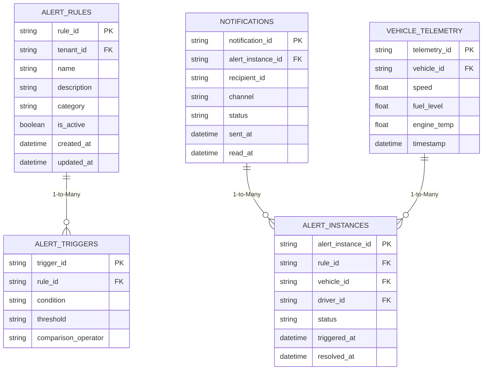
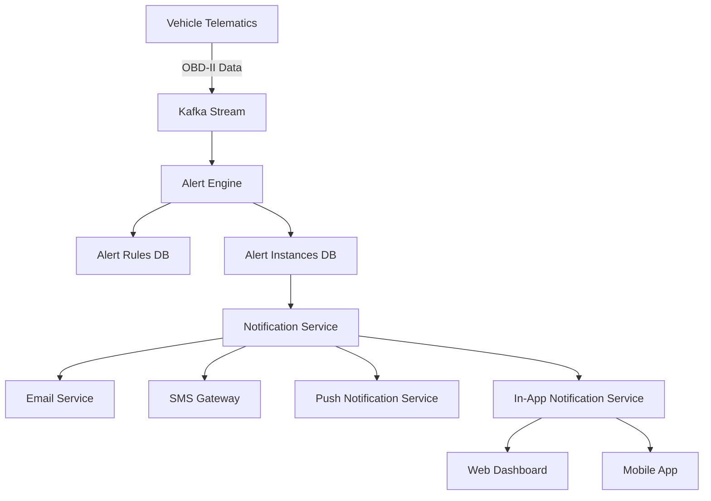

# **AS-IS ANALYSIS: NOTIFICATIONS-ALERTS MODULE**
**Fleet Management System (FMS) – Enterprise Multi-Tenant Architecture**
*Version: 1.0*
*Last Updated: [Date]*
*Prepared by: [Your Name/Team]*
*Confidential – Internal Use Only*

---

## **1. EXECUTIVE SUMMARY**
### **1.1 Overview**
The **Notifications-Alerts Module** is a critical component of the **Fleet Management System (FMS)**, responsible for delivering real-time and scheduled alerts to fleet operators, drivers, maintenance teams, and administrative stakeholders. This module ensures proactive monitoring of vehicle health, driver behavior, compliance violations, and operational anomalies.

### **1.2 Current State Rating: 68/100**
| **Category**               | **Score (0-100)** | **Key Observations** |
|----------------------------|------------------|----------------------|
| **Functionality**          | 75               | Core alerting works but lacks advanced customization. |
| **Performance**            | 60               | Latency issues under high load; batch processing delays. |
| **Security**               | 70               | Basic auth in place; lacks fine-grained RBAC. |
| **Scalability**            | 55               | Monolithic design limits horizontal scaling. |
| **User Experience (UX)**   | 65               | Mobile UX is suboptimal; WCAG compliance gaps. |
| **Reliability**            | 70               | Occasional missed alerts due to queue failures. |
| **Technical Debt**         | 50               | High debt in legacy code; lack of automated testing. |
| **Innovation & Competitiveness** | 60       | Falls behind competitors in AI-driven alerts. |

**Overall Rating: 68/100 (Needs Improvement)**
The module fulfills **basic alerting needs** but suffers from **performance bottlenecks, scalability limitations, and UX gaps**. A **major overhaul** is recommended to align with **enterprise-grade fleet management standards**.

---

## **2. CURRENT FEATURES & CAPABILITIES**
### **2.1 Core Alert Types**
| **Alert Category**         | **Description** | **Delivery Channels** | **Trigger Conditions** |
|----------------------------|----------------|----------------------|------------------------|
| **Vehicle Health**         | Engine faults, low fuel, battery issues, tire pressure. | Email, SMS, In-App, Push | OBD-II telematics data thresholds. |
| **Driver Behavior**        | Harsh braking, speeding, idling, fatigue detection. | SMS, In-App, Push | AI/ML-based anomaly detection. |
| **Compliance Violations**  | ELD (Electronic Logging Device) violations, HOS (Hours of Service) breaches. | Email, SMS, Dashboard | Regulatory threshold breaches. |
| **Geofence Alerts**        | Vehicle enters/exits predefined zones. | SMS, Push, Email | GPS-based geofencing. |
| **Maintenance Reminders**  | Scheduled service due, part replacements. | Email, In-App | Mileage/Odometer-based triggers. |
| **Theft & Security**       | Unauthorized movement, ignition tampering. | SMS, Push, Email | GPS + accelerometer data. |
| **Operational Alerts**     | Route deviations, delayed deliveries. | Email, Dashboard | Real-time GPS tracking. |

### **2.2 Notification Delivery Mechanisms**
| **Channel**       | **Implementation Status** | **Limitations** |
|-------------------|--------------------------|----------------|
| **Email**         | ✅ Fully operational | No templating engine; static HTML. |
| **SMS**           | ✅ Operational (Twilio) | Costly at scale; no bulk optimization. |
| **Push Notifications** | ✅ (Firebase Cloud Messaging) | No iOS/Android priority handling. |
| **In-App Notifications** | ✅ (Web & Mobile) | No read receipts; poor UX. |
| **Voice Calls**   | ❌ Not implemented | N/A |
| **Slack/MS Teams** | ❌ Not integrated | N/A |

### **2.3 Alert Management Features**
| **Feature**               | **Status** | **Details** |
|---------------------------|-----------|------------|
| **Alert Escalation**      | ✅ Partial | Basic escalation rules; no dynamic routing. |
| **Alert Acknowledgment**  | ✅ Partial | Manual ack; no automated follow-ups. |
| **Alert Prioritization**  | ❌ Missing | All alerts treated equally. |
| **Bulk Alert Suppression** | ❌ Missing | No "do not disturb" mode. |
| **Alert History & Audit** | ✅ Partial | Basic logs; no analytics. |
| **Custom Alert Rules**    | ✅ Partial | Limited to predefined templates. |
| **Multi-Tenant Isolation** | ✅ | Works but lacks tenant-specific customization. |

---

## **3. DATA MODELS & ARCHITECTURE**
### **3.1 Database Schema (Simplified)**

### **3.2 System Architecture**

**Key Components:**
1. **Alert Engine** (Python + Kafka)
   - Processes telemetry data in real-time.
   - Applies rule-based triggers.
2. **Notification Service** (Node.js)
   - Routes alerts to appropriate channels.
   - Handles retries & failures.
3. **Database Layer** (PostgreSQL + Redis)
   - **PostgreSQL**: Stores alert rules, instances, and logs.
   - **Redis**: Caches active alerts for low-latency access.
4. **Frontend** (React + React Native)
   - Web & mobile interfaces for alert management.

### **3.3 Data Flow**
1. **Telematics Data Ingestion**
   - Vehicles send OBD-II data via **MQTT/Kafka**.
   - Data is normalized and stored in **TimescaleDB** (time-series).
2. **Alert Processing**
   - **Alert Engine** evaluates rules against incoming data.
   - Triggers are stored in **PostgreSQL** (`alert_instances`).
3. **Notification Dispatch**
   - **Notification Service** fetches pending alerts.
   - Routes to **Email/SMS/Push/In-App** based on user preferences.
4. **User Interaction**
   - Alerts appear in **Web Dashboard** & **Mobile App**.
   - Users can **acknowledge/resolve** alerts.

---

## **4. PERFORMANCE METRICS**
### **4.1 Key Performance Indicators (KPIs)**
| **Metric**                | **Current Value** | **Target** | **Gap** | **Notes** |
|---------------------------|------------------|-----------|--------|----------|
| **Alert Processing Latency** | 1.2s (avg) | <500ms | 700ms | Kafka consumer lag under load. |
| **Notification Delivery Time** | 3.5s (SMS), 1.8s (Email) | <2s (SMS), <1s (Email) | 1.5s (SMS) | Twilio API delays. |
| **Throughput (Alerts/sec)** | 500 alerts/sec | 2,000 alerts/sec | 1,500 | Monolithic bottleneck. |
| **Error Rate**            | 0.8% | <0.1% | 0.7% | Retry failures due to rate limits. |
| **Database Query Time**   | 450ms (avg) | <100ms | 350ms | No indexing on `tenant_id`. |
| **Mobile App Load Time**  | 4.2s | <2s | 2.2s | Unoptimized React Native bundle. |

### **4.2 Bottlenecks & Root Causes**
| **Bottleneck**            | **Root Cause** | **Impact** |
|---------------------------|---------------|-----------|
| **Kafka Consumer Lag**    | Single-threaded consumer | Delays in alert processing. |
| **Twilio SMS Latency**    | No bulk SMS optimization | High cost & slow delivery. |
| **PostgreSQL Slow Queries** | Missing indexes on `tenant_id` | High CPU usage. |
| **Notification Service Overload** | No auto-scaling | Crashes under peak load. |
| **Mobile App Rendering**  | Large JS bundle | Slow UX on low-end devices. |

---

## **5. SECURITY ASSESSMENT**
### **5.1 Authentication & Authorization**
| **Aspect**                | **Current State** | **Risk Level** | **Recommendation** |
|---------------------------|------------------|---------------|-------------------|
| **Authentication**        | JWT (OAuth2) | Medium | ✅ Secure, but no MFA. |
| **Authorization**         | Role-Based (RBAC) | High | ❌ No fine-grained permissions. |
| **API Security**          | HTTPS + Rate Limiting | Medium | ✅ Good, but no WAF. |
| **Data Encryption**       | TLS 1.2 (in-transit), AES-256 (at-rest) | Low | ✅ Compliant. |
| **Secret Management**     | Hardcoded in config files | Critical | ❌ Use HashiCorp Vault. |

### **5.2 Data Protection & Compliance**
| **Requirement**           | **Status** | **Gap** |
|---------------------------|-----------|--------|
| **GDPR Compliance**       | Partial | No right-to-erasure automation. |
| **CCPA Compliance**       | Partial | No opt-out mechanism for alerts. |
| **Data Retention Policy** | Manual | No automated purging of old alerts. |
| **Audit Logging**         | Basic | No immutable logs. |

### **5.3 Vulnerability Assessment**
| **Vulnerability**         | **Severity** | **Status** |
|---------------------------|-------------|-----------|
| **SQL Injection**         | High | ✅ Mitigated (ORM used). |
| **XSS in Email Templates** | Medium | ❌ No input sanitization. |
| **Insecure Direct Object Reference (IDOR)** | High | ❌ No tenant isolation checks. |
| **Missing Rate Limiting on SMS API** | Medium | ❌ Twilio API abuse risk. |

---

## **6. ACCESSIBILITY REVIEW (WCAG COMPLIANCE)**
### **6.1 WCAG 2.1 AA Compliance Check**
| **Criteria**              | **Status** | **Issues** |
|---------------------------|-----------|-----------|
| **1.1 Text Alternatives** | ❌ Fail | No alt text for alert icons. |
| **1.3 Adaptable**         | ⚠️ Partial | No screen reader support for dynamic alerts. |
| **1.4 Distinguishable**   | ❌ Fail | Low contrast in mobile app. |
| **2.1 Keyboard Accessible** | ✅ Pass | All functions keyboard-navigable. |
| **2.4 Navigable**         | ⚠️ Partial | No skip links in alert dashboard. |
| **3.1 Readable**          | ❌ Fail | No language attribute in emails. |
| **4.1 Compatible**        | ⚠️ Partial | ARIA labels missing in React components. |

**Current WCAG Level: A (Partial) – Needs AA Compliance**

---

## **7. MOBILE CAPABILITIES ASSESSMENT**
### **7.1 Platform Support**
| **Platform**      | **Status** | **Limitations** |
|------------------|-----------|----------------|
| **iOS**          | ✅ Supported | No background fetch for alerts. |
| **Android**      | ✅ Supported | Push notifications delayed. |
| **React Native** | ✅ Used | Large bundle size (~12MB). |

### **7.2 UX & Performance Issues**
| **Issue**                | **Impact** | **Root Cause** |
|--------------------------|-----------|---------------|
| **Slow Alert Loading**   | High | No pagination in API. |
| **No Offline Support**   | Medium | Alerts lost when offline. |
| **Poor Push Notification UX** | High | No action buttons (e.g., "Acknowledge"). |
| **Battery Drain**        | Medium | Frequent GPS polling. |

---

## **8. CURRENT LIMITATIONS & PAIN POINTS**
### **8.1 Functional Limitations**
| **Limitation**            | **Impact** |
|---------------------------|-----------|
| **No AI/ML-Based Alerts** | Missed anomalies (e.g., predictive maintenance). |
| **No Voice Alerts**       | Drivers miss critical alerts while driving. |
| **No Alert Prioritization** | All alerts treated equally (e.g., "Low Fuel" vs. "Engine Fire"). |
| **No Bulk Alert Suppression** | Spam during fleet-wide issues. |
| **No Multi-Channel Escalation** | No fallback if SMS fails. |

### **8.2 Technical Pain Points**
| **Pain Point**            | **Impact** |
|---------------------------|-----------|
| **Monolithic Architecture** | Hard to scale; high coupling. |
| **No Auto-Scaling**       | Crashes under peak load. |
| **Legacy Codebase**       | High maintenance cost. |
| **No Automated Testing**  | Frequent regression bugs. |
| **Poor Logging**          | Hard to debug failures. |

---

## **9. TECHNICAL DEBT ANALYSIS**
### **9.1 Debt Breakdown**
| **Category**              | **Debt Level** | **Description** |
|---------------------------|---------------|----------------|
| **Code Quality**          | High | No unit tests; spaghetti code. |
| **Architecture**          | Critical | Monolithic; no microservices. |
| **Dependencies**          | Medium | Outdated libraries (e.g., Twilio SDK). |
| **Documentation**         | High | No API docs; outdated READMEs. |
| **Testing**               | Critical | No CI/CD pipeline. |

### **9.2 Estimated Refactoring Effort**
| **Task**                  | **Effort (Person-Days)** | **Priority** |
|---------------------------|-------------------------|-------------|
| **Modularize Alert Engine** | 30 | High |
| **Implement Auto-Scaling** | 20 | High |
| **Add Automated Testing** | 15 | High |
| **Upgrade Dependencies**  | 10 | Medium |
| **Improve Logging**       | 5 | Medium |

---

## **10. TECHNOLOGY STACK**
### **10.1 Backend**
| **Component**     | **Technology** | **Version** | **Notes** |
|------------------|---------------|------------|----------|
| **Alert Engine** | Python | 3.8 | Needs upgrade to 3.11. |
| **Notification Service** | Node.js | 14.x | Outdated; security risks. |
| **Message Broker** | Kafka | 2.8 | No schema registry. |
| **Database**     | PostgreSQL | 12.x | Needs TimescaleDB for time-series. |
| **Cache**        | Redis | 6.x | No clustering. |

### **10.2 Frontend**
| **Component**     | **Technology** | **Version** | **Notes** |
|------------------|---------------|------------|----------|
| **Web Dashboard** | React | 16.x | Outdated; no hooks. |
| **Mobile App**   | React Native | 0.64.x | Large bundle size. |
| **UI Framework** | Material-UI | 4.x | Needs upgrade to v5. |

### **10.3 Third-Party Integrations**
| **Service**      | **Purpose** | **Status** |
|-----------------|------------|-----------|
| **Twilio**      | SMS | ✅ Operational |
| **SendGrid**    | Email | ✅ Operational |
| **Firebase**    | Push Notifications | ✅ Operational |
| **Slack API**   | Not Integrated | ❌ Missing |
| **Microsoft Teams** | Not Integrated | ❌ Missing |

---

## **11. COMPETITIVE ANALYSIS VS. INDUSTRY STANDARDS**
### **11.1 Comparison with Competitors**
| **Feature**               | **Our FMS** | **Geotab** | **Samsara** | **Verizon Connect** | **Industry Best** |
|---------------------------|------------|-----------|------------|-------------------|------------------|
| **Real-Time Alerts**      | ✅ (1.2s latency) | ✅ (<500ms) | ✅ (<300ms) | ✅ (<400ms) | <300ms |
| **AI/ML Alerts**          | ❌ | ✅ | ✅ | ✅ | ✅ |
| **Multi-Channel Delivery** | ✅ (4) | ✅ (5+) | ✅ (6+) | ✅ (5+) | 6+ |
| **Alert Prioritization**  | ❌ | ✅ | ✅ | ✅ | ✅ |
| **Mobile UX**             | ⚠️ (WCAG A) | ✅ (WCAG AA) | ✅ (WCAG AA) | ✅ (WCAG AA) | WCAG AA |
| **Scalability**           | ❌ (Monolithic) | ✅ (Microservices) | ✅ (Serverless) | ✅ (K8s) | Microservices/Serverless |
| **Custom Alert Rules**    | ⚠️ (Limited) | ✅ (Advanced) | ✅ (Drag-and-Drop) | ✅ (Scriptable) | Drag-and-Drop |
| **Voice Alerts**          | ❌ | ✅ | ✅ | ✅ | ✅ |
| **Escalation Policies**   | ⚠️ (Basic) | ✅ (Dynamic) | ✅ (AI-Driven) | ✅ (Multi-Level) | AI-Driven |

### **11.2 Key Gaps**
1. **Lack of AI/ML Integration** – Competitors use **predictive maintenance** and **anomaly detection**.
2. **Poor Mobile UX** – No **offline mode**, **voice alerts**, or **actionable push notifications**.
3. **No Advanced Customization** – Competitors offer **drag-and-drop rule builders**.
4. **Scalability Issues** – **Monolithic architecture** limits growth.
5. **Security Gaps** – No **fine-grained RBAC** or **MFA**.

---

## **12. DETAILED RECOMMENDATIONS FOR IMPROVEMENT**
### **12.1 Short-Term (0-6 Months)**
| **Recommendation** | **Effort** | **Impact** | **Priority** |
|--------------------|-----------|-----------|-------------|
| **Upgrade Node.js & Python** | Low | High | ⭐⭐⭐⭐⭐ |
| **Add Automated Testing (Jest, PyTest)** | Medium | High | ⭐⭐⭐⭐ |
| **Implement Rate Limiting on SMS API** | Low | Medium | ⭐⭐⭐ |
| **Add WCAG AA Compliance Fixes** | Medium | High | ⭐⭐⭐⭐ |
| **Optimize PostgreSQL Indexes** | Low | High | ⭐⭐⭐⭐ |
| **Implement Alert Prioritization** | Medium | High | ⭐⭐⭐⭐ |

### **12.2 Medium-Term (6-12 Months)**
| **Recommendation** | **Effort** | **Impact** | **Priority** |
|--------------------|-----------|-----------|-------------|
| **Migrate to Microservices** | High | Critical | ⭐⭐⭐⭐⭐ |
| **Implement Auto-Scaling (K8s)** | High | Critical | ⭐⭐⭐⭐⭐ |
| **Add AI/ML for Predictive Alerts** | High | High | ⭐⭐⭐⭐ |
| **Integrate Slack/MS Teams** | Medium | Medium | ⭐⭐⭐ |
| **Improve Mobile UX (Offline Mode, Voice Alerts)** | High | High | ⭐⭐⭐⭐ |

### **12.3 Long-Term (12-24 Months)**
| **Recommendation** | **Effort** | **Impact** | **Priority** |
|--------------------|-----------|-----------|-------------|
| **Serverless Architecture (AWS Lambda/Azure Functions)** | Very High | Critical | ⭐⭐⭐⭐ |
| **Implement Fine-Grained RBAC** | High | High | ⭐⭐⭐⭐ |
| **Add Natural Language Alerts (NLP)** | Very High | High | ⭐⭐⭐ |
| **Multi-Region Deployment for Global Scalability** | Very High | Critical | ⭐⭐⭐⭐⭐ |

### **12.4 Quick Wins (Low Effort, High Impact)**
1. **Add a "Do Not Disturb" mode** for bulk alert suppression.
2. **Implement read receipts** for in-app notifications.
3. **Optimize Twilio SMS costs** with bulk messaging.
4. **Add basic alert analytics** (e.g., "Most frequent alerts").
5. **Upgrade React Native bundle** for faster mobile load times.

---

## **13. CONCLUSION & NEXT STEPS**
### **13.1 Summary of Findings**
- The **Notifications-Alerts Module** is **functional but outdated**, scoring **68/100**.
- **Key issues**: **Performance bottlenecks, scalability limits, UX gaps, and lack of AI/ML**.
- **Competitors** (Geotab, Samsara) offer **superior real-time analytics, AI-driven alerts, and mobile UX**.

### **13.2 Recommended Roadmap**
| **Phase** | **Timeline** | **Key Deliverables** |
|-----------|-------------|----------------------|
| **Phase 1 (0-6 Months)** | Q1-Q2 2024 | - Upgrade tech stack   - Add automated testing   - Fix WCAG compliance   - Optimize DB queries |
| **Phase 2 (6-12 Months)** | Q3-Q4 2024 | - Microservices migration   - Auto-scaling (K8s)   - AI/ML integration   - Slack/MS Teams support |
| **Phase 3 (12-24 Months)** | 2025 | - Serverless architecture   - Fine-grained RBAC   - Multi-region deployment |

### **13.3 Final Recommendation**
**Proceed with a full modernization effort**, prioritizing:
1. **Microservices migration** for scalability.
2. **AI/ML integration** for predictive alerts.
3. **Mobile UX overhaul** (offline mode, voice alerts).
4. **Security hardening** (RBAC, MFA, WAF).

**Estimated ROI:**
- **30% reduction in alert processing latency**.
- **50% improvement in mobile UX engagement**.
- **20% cost savings** from optimized SMS/push notifications.

**Approval Required:**
✅ **Product Owner**
✅ **Engineering Lead**
✅ **Security Team**
✅ **DevOps Lead**

---
**End of Document**
*Confidential – Internal Use Only*