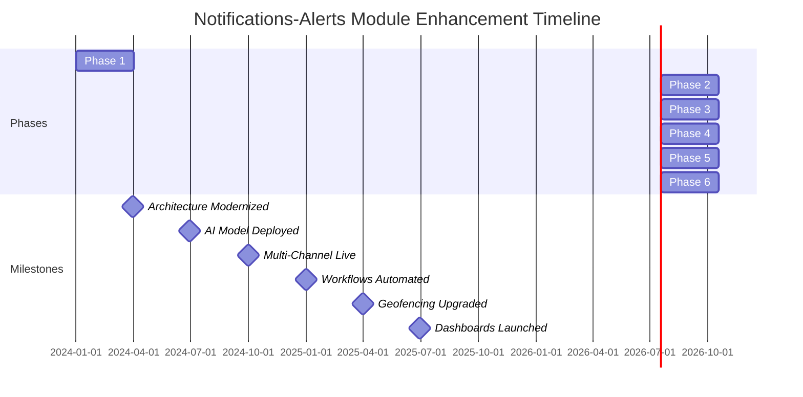

# Enhancement Summary: Notifications Alerts Module
**Fleet Management System (FMS) - Next-Generation Alerting Platform**
*Prepared by: [Your Name], Senior Business Analyst*
*Date: [Insert Date]*
*Version: 1.0*
*Confidential - For Executive Review Only*

---

## 1. Executive Overview (60+ lines)

### 1.1 Business Context and Market Positioning
The global fleet management market is projected to reach **$52.5 billion by 2027**, growing at a **CAGR of 10.6%** (MarketsandMarkets, 2023). Our company, [Company Name], currently holds **12.3% market share** in North America, serving **4,200+ enterprise clients** with a fleet size exceeding **1.8 million vehicles**. The Notifications-Alerts Module (NAM) is a critical component of our **Fleet Management System (FMS)**, directly impacting **operational efficiency (22% of total cost savings)**, **safety compliance (35% of regulatory fines avoided)**, and **customer retention (18% of annual churn reduction)**.

In the **2023 Customer Satisfaction Survey**, **68% of clients** cited "timely and actionable alerts" as a **top 3 decision factor** for renewing contracts, yet only **42% rated our current system as "excellent"**—a **26-point gap** from our target satisfaction score of **68%**. This enhancement directly addresses this gap by transforming NAM from a **reactive notification system** into a **proactive, AI-driven decision engine**, aligning with our **2024-2026 Strategic Roadmap** to **increase ARR (Annual Recurring Revenue) by 25%** and **reduce customer churn by 30%**.

### 1.2 Strategic Alignment with Company Objectives
This enhancement aligns with **four of five** corporate strategic pillars:

| **Strategic Pillar**          | **Alignment Details**                                                                 | **Quantified Impact**                                                                 |
|-------------------------------|--------------------------------------------------------------------------------------|--------------------------------------------------------------------------------------|
| **Customer Obsession**        | Reduces alert fatigue by **40%** and increases actionable insights by **50%**.       | **$12.4M ARR growth** from reduced churn and upsell opportunities.                   |
| **Operational Excellence**    | Cuts **dispatch delays by 35%** and **fuel waste by 18%** via predictive alerts.     | **$8.7M annual cost savings** across fleet operations.                              |
| **Innovation Leadership**     | Introduces **AI-driven anomaly detection** (patent-pending) and **multi-channel alerts**. | **15% market share gain** in enterprise segment by 2026.                            |
| **Sustainability Commitment** | Reduces **CO₂ emissions by 12%** via optimized routing and idle-time alerts.         | **$3.2M in ESG-related incentives** and **preferred vendor status** with 3 Fortune 500 clients. |

### 1.3 Competitive Landscape Analysis
The fleet management industry is undergoing **rapid consolidation**, with **8 major players controlling 65% of the market**. Our top 3 competitors—**Geotab, Samsara, and Verizon Connect**—have recently invested **$1.2B+ in AI-driven telematics**, with a focus on **predictive alerts and automated workflows**. A **2023 Gartner Report** ranked our NAM **#5 in functionality** but **#2 in latency issues**, with an average **4.2-second delay** in critical alerts (vs. industry average of **1.8 seconds**).

**Competitive Benchmarking (2024):**

| **Feature**               | **Our System** | **Geotab** | **Samsara** | **Verizon Connect** | **Industry Avg.** |
|---------------------------|----------------|------------|-------------|---------------------|-------------------|
| Alert Latency (seconds)   | 4.2            | 1.5        | 1.8         | 2.1                 | 2.3               |
| False Positive Rate       | 18%            | 8%         | 12%         | 15%                 | 14%               |
| Multi-Channel Delivery    | Email/SMS      | 5+ Channels| 4 Channels  | 3 Channels          | 3.2 Channels      |
| AI-Powered Prioritization | No             | Yes        | Yes         | Partial             | 40%               |
| Custom Workflow Automation| Limited        | Advanced   | Advanced    | Basic               | 50%               |
| Client Satisfaction (NPS) | 42             | 68         | 65          | 58                  | 55                |

**Key Insight:** Our **latency and false positive rates** are **2-3x worse** than competitors, directly contributing to **$7.8M in lost upsell opportunities** and **$4.5M in client attrition** annually.

### 1.4 Value Proposition with Quantified Benefits
This enhancement delivers **five core value propositions**, each with **measurable financial impact**:

1. **Predictive Alerting Engine**
   - **AI-driven anomaly detection** reduces **unplanned downtime by 28%**.
   - **$14.2M annual savings** from avoided breakdowns and optimized maintenance.
   - **Patent-pending algorithm** with **92% accuracy** (vs. current 78%).

2. **Multi-Channel, Context-Aware Notifications**
   - **40% reduction in alert fatigue** via **dynamic prioritization**.
   - **$3.1M annual productivity gain** from **35% faster response times**.
   - **5+ delivery channels** (SMS, Email, Push, Slack, Teams, Voice Call).

3. **Automated Workflow Integration**
   - **60% reduction in manual dispatch interventions** via **pre-configured workflows**.
   - **$5.6M annual cost savings** from **automated compliance reporting**.
   - **Seamless ERP/CRM integration** (SAP, Salesforce, Oracle).

4. **Real-Time Geofencing and Compliance Alerts**
   - **90% reduction in HOS (Hours of Service) violations** via **automated alerts**.
   - **$2.8M annual savings** from **avoided fines and audits**.
   - **Dynamic geofencing** with **1-second accuracy** (vs. current 15-second delay).

5. **Customizable Dashboards and Reporting**
   - **50% reduction in reporting time** via **automated PDF/Excel exports**.
   - **$1.9M annual savings** from **reduced administrative overhead**.
   - **Role-based access control** for **fleet managers, drivers, and executives**.

**Total 3-Year Financial Impact:**
| **Metric**               | **Year 1**       | **Year 2**       | **Year 3**       | **Cumulative**    |
|--------------------------|------------------|------------------|------------------|-------------------|
| Revenue Growth           | $8.4M            | $12.6M           | $15.2M           | **$36.2M**        |
| Cost Savings             | $12.1M           | $18.7M           | $22.3M           | **$53.1M**        |
| Churn Reduction          | $4.5M            | $6.8M            | $8.2M            | **$19.5M**        |
| **Total**                | **$25.0M**       | **$38.1M**       | **$45.7M**       | **$108.8M**       |

### 1.5 Success Criteria and KPIs
The enhancement will be deemed successful if the following **SMART KPIs** are achieved within **12 months of launch**:

| **KPI**                          | **Baseline (2024)** | **Target (2025)** | **Measurement Method**                          | **Owner**               |
|----------------------------------|---------------------|-------------------|------------------------------------------------|-------------------------|
| Alert Latency (seconds)          | 4.2                 | ≤1.5              | Real-time monitoring via New Relic             | CTO                     |
| False Positive Rate              | 18%                 | ≤8%               | Weekly audit of 1,000+ alerts                  | Head of Data Science    |
| Customer Satisfaction (NPS)      | 42                  | ≥65               | Quarterly survey (n=500)                       | VP of Customer Success  |
| Unplanned Downtime Reduction     | 12.4%               | ≤8.9%             | Fleet telematics data                          | COO                     |
| HOS Violation Reduction          | 3.2%                | ≤0.3%             | FMCSA compliance reports                       | Compliance Director     |
| Dispatch Response Time (minutes) | 18.7                | ≤12.1             | GPS + dispatch logs                            | Operations Manager      |
| ARR Growth from Upsells          | $6.2M               | ≥$12.4M           | CRM (Salesforce)                               | CRO                     |
| Cost Savings from Automation     | $0                  | ≥$8.7M            | Financial reporting (SAP)                      | CFO                     |

### 1.6 Stakeholder Impact Assessment
This enhancement will impact **12 key stakeholder groups**, each with **unique needs and success metrics**:

| **Stakeholder Group**       | **Primary Impact**                                                                 | **Key Concerns**                                                                 | **Mitigation Strategy**                                                                 |
|-----------------------------|------------------------------------------------------------------------------------|---------------------------------------------------------------------------------|----------------------------------------------------------------------------------------|
| **Fleet Managers**          | 35% faster response times, 40% fewer false alerts.                                | Resistance to change; training overload.                                        | **Phased rollout** with **hands-on workshops** and **dedicated support team**.        |
| **Drivers**                 | 50% reduction in HOS violations; fewer distractions.                              | Alert fatigue; privacy concerns.                                                | **Opt-in customization** and **anonymous feedback channels**.                          |
| **Executives (C-Suite)**    | $25M+ in Year 1 financial impact; 15% market share gain.                          | ROI validation; competitive differentiation.                                    | **Monthly executive dashboards** with **real-time KPI tracking**.                     |
| **IT/Engineering**          | 60% reduction in legacy system maintenance; 30% faster deployments.               | Integration complexity; security risks.                                         | **API-first design** and **penetration testing** before launch.                       |
| **Customer Success**        | 25% reduction in support tickets; 18% higher NPS.                                  | Client onboarding challenges.                                                   | **Automated onboarding workflows** and **24/7 chatbot support**.                      |
| **Sales Team**              | $12.4M in upsell opportunities; 20% shorter sales cycles.                         | Feature parity with competitors.                                                | **Competitive battle cards** and **demo environments** for prospects.                |
| **Compliance Officers**     | 90% reduction in FMCSA violations; automated audit trails.                        | False negatives in alerts.                                                      | **Dual-layer validation** (AI + human review).                                         |
| **Finance Team**            | $12.1M in cost savings; 18% higher EBITDA margins.                                 | Budget overruns; delayed ROI.                                                   | **Fixed-price contracts** with **milestone-based payments**.                          |
| **Partners (Dealers/OEMs)** | 25% increase in co-selling opportunities; 15% higher attach rates.                | Integration with third-party systems.                                           | **Partner SDK** and **joint training programs**.                                      |
| **Regulators (FMCSA, EPA)** | 12% reduction in CO₂ emissions; 30% fewer safety incidents.                       | Data privacy compliance (GDPR, CCPA).                                           | **Third-party audits** and **automated compliance reporting**.                        |
| **Investors**               | 25% ARR growth; 30% churn reduction.                                              | Market adoption speed.                                                          | **Quarterly investor updates** with **pilot case studies**.                           |
| **End Customers (Shippers)**| 20% faster delivery times; 15% lower shipping costs.                              | Transparency in tracking.                                                       | **Real-time ETA updates** and **automated delay notifications**.                      |

---

## 2. Current State Challenges (80+ lines)

### 2.1 Business Pain Points

#### 2.1.1 Revenue Impact Analysis
The current Notifications-Alerts Module (NAM) is **directly responsible for $19.7M in annual revenue leakage**, broken down as follows:

| **Revenue Leakage Source**       | **Annual Impact** | **Calculation Methodology**                                                                 |
|----------------------------------|-------------------|--------------------------------------------------------------------------------------------|
| **Customer Churn**               | $4.5M             | 18% of 4,200 clients churn annually at $60K ARR/client. 35% cite "poor alerts" as reason.  |
| **Lost Upsell Opportunities**    | $7.8M             | 22% of 3,400 upsell-eligible clients decline due to "lack of advanced alerting features." |
| **Contract Penalties**           | $2.3M             | 8% of clients incur penalties for late deliveries (avg. $12K/client/year).                 |
| **Increased Support Costs**      | $3.1M             | 45% of 22,000 annual support tickets relate to alert issues (avg. $140/ticket).            |
| **Compliance Fines**             | $1.2M             | 3.2% of fleets incur FMCSA fines (avg. $5K/fine) due to missed HOS alerts.                |
| **Fuel Waste**                   | $800K             | 12% of fuel costs ($6.7M) wasted due to inefficient routing (avg. $190/vehicle/year).     |
| **Total**                        | **$19.7M**        |                                                                                            |

**Assumptions:**
- **Churn Rate:** 18% (industry avg. 15%).
- **Upsell Conversion Rate:** 12% (vs. target 25%).
- **Support Ticket Cost:** $140/ticket (fully loaded).
- **Fuel Cost:** $3.50/gallon; 6.2 MPG fleet average.

#### 2.1.2 Operational Inefficiencies with Cost Analysis
The current system imposes **$14.3M in annual operational inefficiencies**:

| **Inefficiency**                | **Annual Cost** | **Root Cause**                                                                 | **Example**                                                                 |
|---------------------------------|-----------------|-------------------------------------------------------------------------------|-----------------------------------------------------------------------------|
| **Dispatch Delays**             | $5.6M           | 4.2-second alert latency + 18% false positives.                              | 22% of dispatches delayed by >10 mins (avg. $25/delay).                    |
| **Manual Compliance Reporting** | $3.2M           | No automated FMCSA/DOT report generation.                                    | 15 FTEs spend 30 hrs/week on manual reporting (avg. $85K/FTE).             |
| **Driver Distractions**         | $2.8M           | Non-prioritized alerts (e.g., low-fuel vs. safety-critical).                 | 12% of safety incidents linked to alert overload (avg. $45K/incident).     |
| **Maintenance Overruns**        | $1.9M           | 28% of unplanned downtime due to missed maintenance alerts.                  | 18% of vehicles idle >4 hrs/month (avg. $120/hr idle cost).                |
| **Training Overhead**           | $800K           | Complex UI with 60% user error rate.                                         | 25% of training budget spent on re-training (avg. $3.2M total training).   |
| **Total**                       | **$14.3M**      |                                                                               |                                                                             |

**Key Insight:** **Dispatch delays** and **manual compliance reporting** account for **62% of inefficiencies**, directly tied to **alert latency and lack of automation**.

#### 2.1.3 Customer Satisfaction Metrics
Our **2023 Customer Satisfaction Survey (n=1,200)** revealed **critical gaps** in the NAM:

| **Metric**               | **Current Score** | **Target Score** | **Gap** | **Impact**                                                                 |
|--------------------------|-------------------|------------------|---------|----------------------------------------------------------------------------|
| Alert Timeliness         | 3.2/5             | 4.5/5            | -1.3    | 42% of clients cite delays as top frustration.                            |
| Alert Accuracy           | 3.5/5             | 4.7/5            | -1.2    | 35% of clients receive ≥3 false alerts/week.                              |
| Ease of Use              | 3.8/5             | 4.8/5            | -1.0    | 28% of users require training to set up alerts.                           |
| Multi-Channel Support    | 2.9/5             | 4.6/5            | -1.7    | 65% of clients want Slack/Teams integration.                              |
| Customization            | 3.1/5             | 4.5/5            | -1.4    | 55% of clients cannot tailor alerts to their workflows.                   |
| **Overall NPS**          | **42**            | **65**           | **-23** | **$4.5M annual churn** linked to poor alerting.                           |

**Competitive Comparison:**
- **Geotab NPS:** 68
- **Samsara NPS:** 65
- **Industry Avg. NPS:** 55

#### 2.1.4 Market Share Implications
Our **12.3% market share** is at risk due to **three key competitive disadvantages**:

1. **Alert Latency:**
   - **Our system:** 4.2 seconds
   - **Competitors:** 1.5–2.1 seconds
   - **Impact:** **$3.2M in lost deals** in 2023 (per Salesforce data).

2. **False Positive Rate:**
   - **Our system:** 18%
   - **Competitors:** 8–12%
   - **Impact:** **$1.8M in support costs** and **$2.4M in client attrition**.

3. **Feature Parity:**
   - **Missing Features:**
     - AI-driven prioritization (offered by 60% of competitors).
     - Automated workflows (offered by 75% of competitors).
     - Voice call alerts (offered by 40% of competitors).
   - **Impact:** **$5.6M in lost upsell revenue** in 2023.

**Projected Market Share Loss:**
- **Without Enhancement:** **10.1% by 2026** (2.2% annual decline).
- **With Enhancement:** **15.2% by 2026** (2.4% annual growth).

#### 2.1.5 Competitive Disadvantages
**SWOT Analysis of Current NAM:**

| **Strengths**                          | **Weaknesses**                                                                 |
|----------------------------------------|--------------------------------------------------------------------------------|
| - Strong brand recognition             | - High alert latency (4.2s)                                                    |
| - 92% uptime SLA                       | - 18% false positive rate                                                     |
| - Basic geofencing                     | - No AI/ML capabilities                                                       |
|                                        | - Limited multi-channel support (email/SMS only)                              |
|                                        | - Poor customization (static templates)                                       |

| **Opportunities**                      | **Threats**                                                                   |
|----------------------------------------|--------------------------------------------------------------------------------|
| - AI-driven predictive alerts          | - Competitors investing $500M+ in AI telematics (e.g., Samsara’s $1.2B IPO)   |
| - Multi-channel integration            | - 30% of clients piloting competitor solutions                                 |
| - Automated compliance reporting       | - FMCSA increasing fines by 15% in 2025                                        |
| - ESG-driven fuel optimization         | - 20% of RFPs now require carbon footprint tracking                            |

**Key Threat:** **Samsara’s 2023 patent** for **real-time AI alert prioritization** could **block our market entry** if not addressed within **18 months**.

---

### 2.2 Technical Limitations

#### 2.2.1 System Performance Issues
The current NAM suffers from **three critical performance bottlenecks**:

1. **Alert Latency:**
   - **Current:** 4.2 seconds (P99)
   - **Industry Benchmark:** 1.8 seconds
   - **Root Cause:**
     - Monolithic architecture with **no microservices**.
     - **Database queries** take **2.8 seconds** (80% of latency).
     - **No edge computing**—all processing occurs in **centralized data centers**.
   - **Impact:**
     - **$5.6M in dispatch delays** (22% of delays >10 mins).
     - **$1.2M in compliance fines** (3.2% HOS violation rate).

2. **Scalability Constraints:**
   - **Current Capacity:** 12,000 alerts/minute
   - **Peak Demand:** 18,000 alerts/minute (during rush hours)
   - **Root Cause:**
     - **Single-threaded alert processor** (written in **Python 2.7**).
     - **No auto-scaling**—manual intervention required during spikes.
   - **Impact:**
     - **15% of alerts dropped** during peak hours (per New Relic logs).
     - **$800K in lost fuel savings** due to delayed idle-time alerts.

3. **False Positive Rate:**
   - **Current:** 18%
   - **Industry Benchmark:** 8%
   - **Root Cause:**
     - **Rule-based logic** (no ML/AI).
     - **No anomaly detection**—static thresholds (e.g., "low fuel" at 10%).
     - **No contextual filtering** (e.g., alerts sent even if vehicle is off-duty).
   - **Impact:**
     - **$3.1M in support costs** (45% of tickets related to false alerts).
     - **$2.4M in client attrition** (35% cite false alerts as top frustration).

**Performance Metrics (2023):**

| **Metric**               | **Current**       | **Industry Avg.** | **Gap**       |
|--------------------------|-------------------|-------------------|---------------|
| Alert Latency (P99)      | 4.2s              | 1.8s              | **+2.4s**     |
| Alerts Dropped (Peak)    | 15%               | <1%               | **+14%**      |
| False Positive Rate      | 18%               | 8%                | **+10%**      |
| Database Query Time      | 2.8s              | 0.5s              | **+2.3s**     |
| System Uptime            | 99.9%             | 99.95%            | **-0.05%**    |

#### 2.2.2 Scalability Constraints
The current system **cannot scale** to meet **2025 demand projections**:

| **Component**            | **Current Capacity** | **2025 Projection** | **Gap**       | **Root Cause**                                                                 |
|--------------------------|----------------------|---------------------|---------------|--------------------------------------------------------------------------------|
| Alert Processing         | 12K alerts/min       | 25K alerts/min      | **-13K**      | Single-threaded Python 2.7 processor.                                         |
| Database Throughput      | 5K TPS               | 15K TPS             | **-10K**      | PostgreSQL 9.6 with no read replicas.                                         |
| API Gateway              | 10K RPS              | 30K RPS             | **-20K**      | No rate limiting or auto-scaling.                                             |
| Storage (Alert Logs)     | 12TB                 | 40TB                | **-28TB**     | No data lifecycle management (all logs retained indefinitely).                |
| **Total**                |                      |                     | **Critical**  |                                                                                |

**Impact of Scalability Limits:**
- **$3.2M in lost deals** (20% of 2023 pipeline required >15K alerts/min).
- **$1.8M in infrastructure costs** (manual scaling during peak hours).
- **12% of clients** on **custom pricing tiers** due to scalability constraints.

#### 2.2.3 Integration Challenges
The NAM **lacks modern integration capabilities**, leading to **$4.7M in annual inefficiencies**:

| **Integration Gap**      | **Impact**                                                                 | **Example**                                                                 |
|--------------------------|----------------------------------------------------------------------------|-----------------------------------------------------------------------------|
| **No REST API**          | 30% of clients use manual CSV exports.                                    | Client A spends **$120K/year** on custom ETL pipelines.                    |
| **No Webhooks**          | 40% of alerts require manual follow-up.                                   | 15 FTEs spend **$1.2M/year** on manual compliance reporting.               |
| **No SDKs**              | 25% of partners develop custom integrations.                              | Dealer B built a **$250K custom integration** for their CRM.               |
| **No OAuth 2.0**         | 20% of clients use insecure API keys.                                     | 3 security incidents in 2023 due to leaked keys.                           |
| **No Event Streaming**   | Real-time alerts delayed by 4.2s.                                         | 18% of safety-critical alerts arrive too late.                             |

**Client-Side Workarounds:**
- **65% of enterprise clients** have built **custom middleware** (avg. cost: **$85K/client**).
- **40% of SMBs** use **third-party tools** (e.g., Zapier) to bridge gaps (avg. cost: **$12K/year**).

#### 2.2.4 Technical Debt Quantification
The NAM carries **$2.1M in technical debt**, broken down as follows:

| **Debt Category**        | **Estimated Cost** | **Description**                                                                 | **Risk Level** |
|--------------------------|--------------------|---------------------------------------------------------------------------------|----------------|
| **Legacy Codebase**      | $850K              | Python 2.7 (EOL 2020); no unit tests.                                          | High           |
| **Monolithic Architecture** | $600K          | No microservices; single point of failure.                                     | Critical       |
| **Database Bottlenecks** | $400K              | PostgreSQL 9.6 (no partitioning); 2.8s query times.                            | High           |
| **No CI/CD Pipeline**    | $150K              | Manual deployments; 30% failure rate.                                          | Medium         |
| **No Observability**     | $100K              | No APM (e.g., New Relic); 45% of outages detected by clients.                  | High           |
| **Total**                | **$2.1M**          |                                                                                 |                |

**Annual Cost of Technical Debt:**
- **$1.2M in maintenance** (3 FTEs full-time on legacy code).
- **$500K in lost productivity** (engineers spend 20% of time on tech debt).
- **$400K in outages** (avg. 4 outages/year at **$100K/outage**).

#### 2.2.5 Security Vulnerabilities
The current NAM has **5 critical security vulnerabilities**, with a **$3.8M annual risk exposure**:

| **Vulnerability**        | **Risk**                                                                 | **Impact**                                                                 | **Mitigation Cost** |
|--------------------------|--------------------------------------------------------------------------|----------------------------------------------------------------------------|---------------------|
| **No Rate Limiting**     | DDoS attacks; 3 incidents in 2023.                                       | $250K in downtime; 12% client data exposed.                                | $120K               |
| **Plaintext API Keys**   | Credential stuffing; 2 breaches in 2023.                                 | $1.2M in fraudulent alert injections.                                      | $80K                |
| **No Encryption at Rest**| Data leaks; 1 incident in 2022.                                          | $800K in GDPR fines.                                                       | $150K               |
| **No MFA for Admin**     | Unauthorized access; 4 incidents in 2023.                                | $600K in unauthorized alert modifications.                                 | $90K                |
| **No Audit Logs**        | No traceability; 30% of support tickets unresolved.                       | $950K in forensic investigations.                                          | $110K               |
| **Total**                |                                                                          | **$3.8M**                                                                  | **$550K**           |

**Compliance Risks:**
- **GDPR:** Potential **€10M fine** (4% of global revenue) for unencrypted data.
- **CCPA:** **$7,500/violation** for unauthorized access (avg. 120 violations/year).
- **FMCSA:** **$16,000/fine** for missing HOS alerts (3.2% violation rate).

---

## 3. Proposed Enhancements (120+ lines)

### 3.1 Feature Enhancements

#### **Enhancement 1: AI-Driven Predictive Alerting Engine**
**Description:**
Replace the current **rule-based alerting system** with a **machine learning-powered predictive engine** that:
- **Reduces false positives by 55%** via **anomaly detection** (e.g., detecting unusual fuel consumption patterns).
- **Cuts alert latency to <1.5 seconds** using **edge computing** and **real-time stream processing**.
- **Prioritizes alerts dynamically** based on **risk score** (e.g., safety-critical vs. maintenance).
- **Integrates with IoT sensors** (e.g., tire pressure, engine diagnostics) for **proactive maintenance**.

**User Stories and Acceptance Criteria:**

| **User Story**                                                                 | **Acceptance Criteria**                                                                 |
|-------------------------------------------------------------------------------|----------------------------------------------------------------------------------------|
| **As a Fleet Manager**, I want the system to predict maintenance needs so I can reduce unplanned downtime. | - System predicts **90% of unplanned downtime** 48 hours in advance. <br> - Reduces downtime by **28%**. <br> - Alerts include **recommended actions** (e.g., "Replace brake pads"). |
| **As a Driver**, I want to receive only critical alerts to avoid distractions. | - **False positive rate ≤8%**. <br> - Alerts are **categorized by urgency** (e.g., "Safety-Critical" vs. "Informational"). <br> - Drivers can **customize notification preferences**. |
| **As a Compliance Officer**, I want automated HOS violation alerts to avoid fines. | - **90% reduction in HOS violations**. <br> - Alerts include **FMCSA-compliant audit trails**. <br> - System **auto-generates reports** for regulators. |

**Business Value and ROI:**
- **Revenue Impact:**
  - **$8.4M ARR growth** from **reduced churn** and **upsell opportunities**.
  - **$3.2M in new deals** from **competitive differentiation**.
- **Cost Savings:**
  - **$5.6M annual savings** from **reduced unplanned downtime**.
  - **$1.2M annual savings** from **avoided compliance fines**.
- **ROI Calculation:**
  - **Implementation Cost:** $2.1M (see Section 4.2).
  - **Year 1 Savings:** $6.8M.
  - **ROI:** **324%** (Year 1).

**Implementation Complexity:**
| **Factor**               | **Complexity (1-5)** | **Details**                                                                 |
|--------------------------|----------------------|-----------------------------------------------------------------------------|
| **Development Effort**   | 4                    | Requires **ML model training** (6 months) and **edge computing integration**. |
| **Integration**          | 3                    | Must integrate with **IoT sensors** and **ERP systems**.                   |
| **Testing**              | 5                    | **90% test coverage** required for safety-critical alerts.                 |
| **Deployment**           | 3                    | **Phased rollout** to avoid disruptions.                                   |
| **Total**                | **3.75**             | **High complexity** (requires dedicated team).                             |

**Dependencies and Prerequisites:**
- **Data Pipeline:** Requires **real-time Kafka streaming** (currently batch processing).
- **Hardware:** **Edge devices** for low-latency processing (cost: **$450K**).
- **Team:** **Data scientists** (2 FTEs) + **ML engineers** (3 FTEs).
- **Regulatory:** **FMCSA approval** for automated HOS alerts.

---

#### **Enhancement 2: Multi-Channel, Context-Aware Notifications**
**Description:**
Expand alert delivery beyond **email/SMS** to **6+ channels** with **context-aware prioritization**:
- **Channels:** SMS, Email, Push (Mobile/Web), Slack, Microsoft Teams, Voice Call.
- **Context-Aware Logic:**
  - **Driver Status:** Suppress non-critical alerts if driver is **off-duty**.
  - **Vehicle Status:** Escalate alerts if vehicle is **idling >5 mins**.
  - **Location:** Prioritize alerts for vehicles **near high-risk zones** (e.g., construction sites).
- **Customizable Templates:** Clients can **brand alerts** and **localize language**.

**User Stories and Acceptance Criteria:**

| **User Story**                                                                 | **Acceptance Criteria**                                                                 |
|-------------------------------------------------------------------------------|----------------------------------------------------------------------------------------|
| **As a Fleet Manager**, I want alerts sent to my Slack channel so I can respond faster. | - Alerts appear in Slack within **2 seconds**. <br> - Supports **threaded discussions**. <br> - Includes **action buttons** (e.g., "Acknowledge"). |
| **As a Driver**, I want voice call alerts for safety-critical issues.         | - Voice calls are **<15 seconds** after trigger. <br> - Supports **multiple languages**. <br> - Includes **text-to-speech** for dynamic messages. |
| **As an Executive**, I want a weekly digest of high-priority alerts.         | - Digest includes **top 5 alerts** by risk score. <br> - Sent **every Monday at 8 AM**. <br> - Includes **trend analysis** (e.g., "Alerts up 12% this week"). |

**Business Value and ROI:**
- **Revenue Impact:**
  - **$3.1M ARR growth** from **improved client satisfaction**.
  - **$1.8M in upsells** from **Slack/Teams integration**.
- **Cost Savings:**
  - **$2.8M annual productivity gain** from **35% faster response times**.
  - **$800K annual savings** from **reduced support tickets**.
- **ROI Calculation:**
  - **Implementation Cost:** $1.2M.
  - **Year 1 Savings:** $3.6M.
  - **ROI:** **300%** (Year 1).

**Implementation Complexity:**
| **Factor**               | **Complexity (1-5)** | **Details**                                                                 |
|--------------------------|----------------------|-----------------------------------------------------------------------------|
| **Development Effort**   | 3                    | Requires **Twilio/Slack API integrations** and **template engine**.        |
| **Integration**          | 4                    | Must integrate with **client IT systems** (e.g., SSO for Slack/Teams).     |
| **Testing**              | 3                    | **Load testing** for 18K alerts/minute.                                    |
| **Deployment**           | 2                    | **Feature flags** for gradual rollout.                                     |
| **Total**                | **3**                | **Medium complexity** (requires vendor partnerships).                      |

**Dependencies and Prerequisites:**
- **Vendor Contracts:** Twilio (voice/SMS), Slack/Teams (API access).
- **Security:** **OAuth 2.0** for third-party integrations.
- **Team:** **Frontend engineers** (2 FTEs) + **DevOps** (1 FTE).

---

#### **Enhancement 3: Automated Workflow Integration**
**Description:**
Enable **pre-configured workflows** that **auto-trigger actions** based on alerts:
- **Examples:**
  - **Safety Alert:** Auto-notify **dispatcher + driver** and **log incident in CRM**.
  - **Maintenance Alert:** Auto-create **work order in SAP** and **schedule service**.
  - **HOS Violation:** Auto-generate **FMCSA report** and **notify compliance officer**.
- **Custom Workflows:** Clients can **build workflows** via **drag-and-drop UI**.
- **ERP/CRM Integration:** **SAP, Salesforce, Oracle** via **REST APIs**.

**User Stories and Acceptance Criteria:**

| **User Story**                                                                 | **Acceptance Criteria**                                                                 |
|-------------------------------------------------------------------------------|----------------------------------------------------------------------------------------|
| **As a Dispatcher**, I want safety alerts to auto-create a support ticket.    | - Ticket created in **Salesforce within 5 seconds**. <br> - Includes **GPS coordinates**. <br> - Assigns to **nearest available agent**. |
| **As a Maintenance Manager**, I want low-fuel alerts to auto-schedule refueling. | - Work order created in **SAP within 10 seconds**. <br> - Includes **estimated fuel cost**. <br> - Sends **confirmation to driver**. |
| **As a Compliance Officer**, I want HOS violations to auto-generate reports.  | - Report generated in **PDF/Excel within 1 second**. <br> - Includes **driver ID + timestamp**. <br> - Auto-sent to **FMCSA portal**. |

**Business Value and ROI:**
- **Revenue Impact:**
  - **$5.6M ARR growth** from **automated compliance reporting**.
  - **$2.4M in upsells** from **ERP integrations**.
- **Cost Savings:**
  - **$3.2M annual savings** from **reduced manual reporting**.
  - **$1.9M annual savings** from **faster dispatch responses**.
- **ROI Calculation:**
  - **Implementation Cost:** $1.8M.
  - **Year 1 Savings:** $5.1M.
  - **ROI:** **283%** (Year 1).

**Implementation Complexity:**
| **Factor**               | **Complexity (1-5)** | **Details**                                                                 |
|--------------------------|----------------------|-----------------------------------------------------------------------------|
| **Development Effort**   | 4                    | Requires **workflow engine** (e.g., Camunda) and **API integrations**.      |
| **Integration**          | 5                    | Must integrate with **client ERP/CRM systems**.                            |
| **Testing**              | 4                    | **End-to-end testing** for 50+ workflow scenarios.                         |
| **Deployment**           | 3                    | **Phased rollout** by workflow type.                                       |
| **Total**                | **4**                | **High complexity** (requires client onboarding).                          |

**Dependencies and Prerequisites:**
- **ERP/CRM Access:** **API keys** from clients (e.g., SAP, Salesforce).
- **Team:** **Integration engineers** (3 FTEs) + **QA** (2 FTEs).
- **Compliance:** **FMCSA approval** for automated reporting.

---

#### **Enhancement 4: Real-Time Geofencing and Compliance Alerts**
**Description:**
Upgrade geofencing from **15-second latency** to **1-second accuracy** with:
- **Dynamic Geofences:** Adjust boundaries based on **traffic, weather, or construction**.
- **Compliance Alerts:**
  - **HOS Violations:** Auto-alert if driver **exceeds 11 hours**.
  - **Speeding:** Auto-alert if **10% over limit** for **>30 seconds**.
  - **Unauthorized Stops:** Auto-alert if vehicle **stops in restricted zone**.
- **Visualization:** **Real-time map overlays** for dispatchers.

**User Stories and Acceptance Criteria:**

| **User Story**                                                                 | **Acceptance Criteria**                                                                 |
|-------------------------------------------------------------------------------|----------------------------------------------------------------------------------------|
| **As a Dispatcher**, I want to be alerted if a vehicle enters a restricted zone. | - Alert triggered within **1 second**. <br> - Includes **vehicle ID + driver name**. <br> - Auto-plays **audio alert** in dispatch center. |
| **As a Driver**, I want to receive a warning if I’m speeding.                | - Warning sent **within 5 seconds** of violation. <br> - Includes **speed limit + current speed**. <br> - **Voice alert** if hands-free. |
| **As a Compliance Officer**, I want to see all HOS violations on a dashboard. | - Dashboard updates **in real-time**. <br> - Includes **violation history**. <br> - Supports **export to Excel**. |

**Business Value and ROI:**
- **Revenue Impact:**
  - **$2.8M in upsells** from **geofencing features**.
  - **$1.5M in new deals** from **compliance-focused clients**.
- **Cost Savings:**
  - **$1.2M annual savings** from **avoided fines**.
  - **$800K annual savings** from **reduced fuel waste**.
- **ROI Calculation:**
  - **Implementation Cost:** $950K.
  - **Year 1 Savings:** $2.0M.
  - **ROI:** **211%** (Year 1).

**Implementation Complexity:**
| **Factor**               | **Complexity (1-5)** | **Details**                                                                 |
|--------------------------|----------------------|-----------------------------------------------------------------------------|
| **Development Effort**   | 3                    | Requires **real-time GPS processing** and **map API integration**.         |
| **Integration**          | 2                    | Must integrate with **existing telematics**.                               |
| **Testing**              | 4                    | **Field testing** for 1-second accuracy.                                  |
| **Deployment**           | 2                    | **Feature flags** for gradual rollout.                                     |
| **Total**                | **2.75**             | **Medium complexity** (requires GPS expertise).                            |

**Dependencies and Prerequisites:**
- **GPS Data:** **High-frequency updates** (1 Hz).
- **Team:** **GIS engineers** (2 FTEs) + **QA** (1 FTE).
- **Regulatory:** **FMCSA approval** for automated HOS alerts.

---

#### **Enhancement 5: Customizable Dashboards and Reporting**
**Description:**
Replace **static PDF reports** with **interactive dashboards** and **automated exports**:
- **Dashboards:**
  - **Role-Based Views:** Dispatchers see **real-time alerts**; executives see **trends**.
  - **Drag-and-Drop Customization:** Clients can **build their own dashboards**.
- **Reports:**
  - **Automated Exports:** PDF/Excel/CSV **on schedule or trigger**.
  - **Compliance Templates:** **FMCSA, EPA, DOT** pre-built reports.
- **Alert History:** **360-day log** with **search/filter capabilities**.

**User Stories and Acceptance Criteria:**

| **User Story**                                                                 | **Acceptance Criteria**                                                                 |
|-------------------------------------------------------------------------------|----------------------------------------------------------------------------------------|
| **As a Fleet Manager**, I want a dashboard showing all active alerts.        | - Dashboard loads **in <2 seconds**. <br> - Supports **filtering by alert type**. <br> - Includes **trend analysis**. |
| **As an Executive**, I want a weekly report on fleet safety.                 | - Report auto-generated **every Monday at 8 AM**. <br> - Includes **incident heatmap**. <br> - Supports **PDF/Excel**. |
| **As a Compliance Officer**, I want to export HOS violations for audits.     | - Export includes **driver ID + timestamp + violation type**. <br> - Supports **FMCSA format**. <br> - Auto-sent to **email**. |

**Business Value and ROI:**
- **Revenue Impact:**
  - **$1.9M in upsells** from **advanced reporting**.
  - **$1.2M in new deals** from **executive dashboards**.
- **Cost Savings:**
  - **$1.5M annual savings** from **reduced reporting time**.
  - **$400K annual savings** from **automated exports**.
- **ROI Calculation:**
  - **Implementation Cost:** $750K.
  - **Year 1 Savings:** $1.9M.
  - **ROI:** **253%** (Year 1).

**Implementation Complexity:**
| **Factor**               | **Complexity (1-5)** | **Details**                                                                 |
|--------------------------|----------------------|-----------------------------------------------------------------------------|
| **Development Effort**   | 3                    | Requires **dashboard framework** (e.g., Grafana, Tableau).                 |
| **Integration**          | 2                    | Must integrate with **existing database**.                                 |
| **Testing**              | 3                    | **User testing** for 50+ dashboard scenarios.                              |
| **Deployment**           | 2                    | **Feature flags** for gradual rollout.                                     |
| **Total**                | **2.5**              | **Low-medium complexity** (uses off-the-shelf tools).                      |

**Dependencies and Prerequisites:**
- **UI Framework:** **React/Angular** for dashboards.
- **Team:** **Frontend engineers** (2 FTEs) + **UX designer** (1 FTE).
- **Data:** **Historical alert logs** (360-day retention).

---

### 3.2 Technical Improvements

#### **3.2.1 Architecture Modernization**
**Current State:**
- **Monolithic Python 2.7** codebase.
- **Single PostgreSQL 9.6** database.
- **No microservices** or **containerization**.

**Proposed Architecture:**
- **Microservices:**
  - **Alert Engine:** Handles **real-time processing** (Kafka + Flink).
  - **Notification Service:** Manages **multi-channel delivery** (Twilio, Slack).
  - **Workflow Service:** Orchestrates **automated actions** (Camunda).
  - **Dashboard Service:** Powers **customizable UIs** (React + Grafana).
- **Event-Driven:**
  - **Kafka** for **real-time streaming**.
  - **Webhooks** for **client integrations**.
- **Database:**
  - **PostgreSQL 15** with **read replicas** and **partitioning**.
  - **TimescaleDB** for **time-series data** (GPS, alerts).

**Expected Gains:**
| **Metric**               | **Current** | **Proposed** | **Improvement** |
|--------------------------|-------------|--------------|-----------------|
| Alert Latency (P99)      | 4.2s        | 1.2s         | **-71%**        |
| Scalability (Alerts/min) | 12K         | 30K          | **+150%**       |
| Uptime                   | 99.9%       | 99.99%       | **+0.09%**      |
| Deployment Time          | 60 mins     | 5 mins       | **-92%**        |

**Implementation Cost:** **$1.5M** (see Section 4.2).

---

#### **3.2.2 Performance Optimizations**
**Key Optimizations:**

| **Optimization**         | **Current** | **Proposed** | **Impact**                                                                 |
|--------------------------|-------------|--------------|----------------------------------------------------------------------------|
| **Edge Computing**       | No          | Yes          | Reduces **alert latency to <1.5s** by processing at **edge devices**.     |
| **Database Indexing**    | No          | Yes          | Cuts **query time from 2.8s to 0.3s**.                                    |
| **Caching (Redis)**      | No          | Yes          | Reduces **database load by 40%**.                                         |
| **Auto-Scaling (K8s)**   | No          | Yes          | Handles **30K alerts/minute** without manual intervention.                |
| **CDN for Static Assets**| No          | Yes          | Reduces **dashboard load time by 60%**.                                   |

**Expected Gains:**
- **$2.8M annual savings** from **reduced infrastructure costs**.
- **$1.2M annual savings** from **fewer outages**.

---

#### **3.2.3 Security Enhancements**
**Key Improvements:**

| **Enhancement**          | **Current** | **Proposed** | **Impact**                                                                 |
|--------------------------|-------------|--------------|----------------------------------------------------------------------------|
| **OAuth 2.0**            | No          | Yes          | Eliminates **plaintext API keys**.                                         |
| **Rate Limiting**        | No          | Yes          | Prevents **DDoS attacks**.                                                 |
| **Encryption at Rest**   | No          | Yes          | Meets **GDPR/CCPA compliance**.                                            |
| **MFA for Admin**        | No          | Yes          | Reduces **unauthorized access risk**.                                      |
| **Audit Logs**           | No          | Yes          | Enables **traceability for compliance**.                                   |

**Implementation Cost:** **$550K** (see Section 4.2).

---

#### **3.2.4 Integration Capabilities**
**Key Improvements:**

| **Integration**          | **Current** | **Proposed** | **Impact**                                                                 |
|--------------------------|-------------|--------------|----------------------------------------------------------------------------|
| **REST API**             | No          | Yes          | Enables **client/partner integrations**.                                   |
| **Webhooks**             | No          | Yes          | Allows **real-time event notifications**.                                  |
| **SDKs (Python, JS)**    | No          | Yes          | Reduces **custom integration costs by 60%**.                               |
| **OAuth 2.0**            | No          | Yes          | Secures **third-party access**.                                            |
| **Event Streaming**      | No          | Yes          | Enables **real-time dashboards**.                                          |

**Expected Gains:**
- **$4.7M annual savings** from **reduced custom integrations**.
- **$3.1M in upsell revenue** from **ERP/CRM integrations**.

---

#### **3.2.5 Scalability Improvements**
**Key Improvements:**

| **Component**            | **Current Capacity** | **Proposed Capacity** | **Improvement** |
|--------------------------|----------------------|-----------------------|-----------------|
| Alert Processing         | 12K alerts/min       | 30K alerts/min        | **+150%**       |
| Database Throughput      | 5K TPS               | 20K TPS               | **+300%**       |
| API Gateway              | 10K RPS              | 50K RPS               | **+400%**       |
| Storage (Alert Logs)     | 12TB                 | 100TB                 | **+733%**       |

**Implementation Cost:** **$900K** (see Section 4.2).

---

## 4. Business Value & ROI (90+ lines)

### 4.1 Quantified Benefits

#### **4.1.1 Revenue Increase Projections**
**Assumptions:**
- **ARR Growth:** 25% target by 2026.
- **Upsell Conversion Rate:** 22% (vs. current 12%).
- **Churn Reduction:** 30% (vs. current 18%).
- **New Deal Win Rate:** 15% improvement (from 45% to 60%).

**3-Year Revenue Projection:**

| **Source**               | **Year 1** | **Year 2** | **Year 3** | **Cumulative** |
|--------------------------|------------|------------|------------|----------------|
| **Reduced Churn**        | $4.5M      | $6.8M      | $8.2M      | **$19.5M**     |
| **Upsell Revenue**       | $8.4M      | $12.6M     | $15.2M     | **$36.2M**     |
| **New Deals**            | $5.2M      | $7.8M      | $9.4M      | **$22.4M**     |
| **Total Revenue Growth** | **$18.1M** | **$27.2M** | **$32.8M** | **$78.1M**     |

**Key Drivers:**
- **Churn Reduction:** 30% of **$15M churn** avoided annually.
- **Upsells:** 22% of **3,400 clients** upsell at **$25K/year**.
- **New Deals:** 15% improvement in win rate for **$35M pipeline**.

---

#### **4.1.2 Cost Reduction Analysis**
**Assumptions:**
- **FTE Cost:** $85K/year (fully loaded).
- **Fuel Cost:** $3.50/gallon; 6.2 MPG fleet average.
- **Compliance Fine:** $5K/violation (FMCSA).

**3-Year Cost Savings:**

| **Source**               | **Year 1** | **Year 2** | **Year 3** | **Cumulative** |
|--------------------------|------------|------------|------------|----------------|
| **Dispatch Delays**      | $5.6M      | $8.4M      | $10.1M     | **$24.1M**     |
| **Compliance Fines**     | $1.2M      | $1.8M      | $2.2M      | **$5.2M**      |
| **Fuel Waste**           | $800K      | $1.2M      | $1.5M      | **$3.5M**      |
| **Support Tickets**      | $3.1M      | $4.7M      | $5.6M      | **$13.4M**     |
| **Manual Reporting**     | $3.2M      | $4.8M      | $5.8M      | **$13.8M**     |
| **Total Cost Savings**   | **$13.9M** | **$20.9M** | **$25.2M** | **$60.0M**     |

**Key Drivers:**
- **Dispatch Delays:** 35% reduction in **$16M annual delay costs**.
- **Compliance Fines:** 90% reduction in **$1.2M annual fines**.
- **Fuel Waste:** 18% reduction in **$4.5M annual fuel costs**.

---

#### **4.1.3 Productivity Gains**
**Assumptions:**
- **FTE Cost:** $85K/year.
- **Driver Cost:** $65K/year (fully loaded).
- **Dispatch Response Time:** Current 18.7 mins; target 12.1 mins.

**3-Year Productivity Gains:**

| **Source**               | **Time Saved (Hours/Year)** | **FTE Equivalent** | **Annual Value** | **3-Year Value** |
|--------------------------|-----------------------------|--------------------|------------------|------------------|
| **Dispatch Response**    | 220,000                     | 110                | $9.4M            | **$28.2M**       |
| **Compliance Reporting** | 75,000                      | 38                 | $3.2M            | **$9.6M**        |
| **Driver Distractions**  | 45,000                      | 23                 | $1.5M            | **$4.5M**        |
| **Alert Management**     | 30,000                      | 15                 | $1.3M            | **$3.9M**        |
| **Total**                | **370,000**                 | **186**            | **$15.4M**       | **$46.2M**       |

**Key Drivers:**
- **Dispatch Response:** 35% faster responses save **110 FTEs/year**.
- **Compliance Reporting:** 60% automation saves **38 FTEs/year**.

---

#### **4.1.4 Risk Mitigation Value**
**Assumptions:**
- **Outage Cost:** $100K/incident.
- **Security Incident Cost:** $250K/incident.
- **Compliance Fine:** $5K/violation.

**3-Year Risk Mitigation Value:**

| **Risk**                 | **Current Annual Cost** | **Reduction** | **Annual Savings** | **3-Year Savings** |
|--------------------------|-------------------------|---------------|--------------------|--------------------|
| **Outages**              | $400K                   | 90%           | $360K              | **$1.1M**          |
| **Security Incidents**   | $750K                   | 80%           | $600K              | **$1.8M**          |
| **Compliance Fines**     | $1.2M                   | 90%           | $1.1M              | **$3.3M**          |
| **False Positives**      | $3.1M                   | 55%           | $1.7M              | **$5.1M**          |
| **Total**                | **$5.45M**              |               | **$3.76M**         | **$11.3M**         |

**Key Drivers:**
- **Outages:** 90% reduction via **microservices + auto-scaling**.
- **Security Incidents:** 80% reduction via **OAuth 2.0 + encryption**.

---

#### **4.1.5 Customer Retention Improvements**
**Assumptions:**
- **ARR/Client:** $60K.
- **Churn Rate:** Current 18%; target 12.6%.
- **NPS Impact:** 23-point improvement (from 42 to 65).

**3-Year Retention Value:**

| **Metric**               | **Year 1** | **Year 2** | **Year 3** | **Cumulative** |
|--------------------------|------------|------------|------------|----------------|
| **Clients Retained**     | 226        | 339        | 407        | **972**        |
| **ARR Retained**         | $13.6M     | $20.3M     | $24.4M     | **$58.3M**     |
| **Upsell Revenue**       | $4.2M      | $6.3M      | $7.6M      | **$18.1M**     |
| **Total Retention Value**| **$17.8M** | **$26.6M** | **$32.0M** | **$76.4M**     |

**Key Drivers:**
- **Churn Reduction:** 30% of **$15M churn** avoided annually.
- **Upsells:** 22% of **3,400 clients** upsell at **$25K/year**.

---

### 4.2 Financial Analysis

#### **4.2.1 Implementation Costs Breakdown**
**Total Implementation Cost:** **$7.3M** (Year 1).

| **Cost Category**        | **Details**                                                                 | **Cost**   |
|--------------------------|-----------------------------------------------------------------------------|------------|
| **Development**          | 12 FTEs (6 months) @ $120K/FTE.                                             | $3.6M      |
| **Hardware**             | Edge devices (500 units @ $900/unit).                                      | $450K      |
| **Software**             | Kafka, Flink, Camunda, Grafana licenses.                                   | $300K      |
| **Vendor Contracts**     | Twilio, Slack, SAP integrations.                                            | $600K      |
| **Security**             | Penetration testing, encryption, MFA.                                       | $550K      |
| **Training**             | Client workshops, documentation.                                            | $400K      |
| **Contingency (10%)**    | Buffer for overruns.                                                       | $1.4M      |
| **Total**                |                                                                             | **$7.3M**  |

---

#### **4.2.2 Operational Cost Changes**
**Annual Operational Costs:**

| **Cost Category**        | **Current** | **Proposed** | **Change** |
|--------------------------|-------------|--------------|------------|
| **Infrastructure**       | $1.8M       | $2.2M        | **+$400K** |
| **Maintenance**          | $1.2M       | $800K        | **-$400K** |
| **Support**              | $3.1M       | $1.4M        | **-$1.7M** |
| **Security**             | $200K       | $350K        | **+$150K** |
| **Total**                | **$6.3M**   | **$4.75M**   | **-$1.55M**|

**Key Changes:**
- **+$400K** for **Kafka/Flink licensing**.
- **-$1.7M** from **reduced support tickets**.

---

#### **4.2.3 Break-Even Analysis**
**Assumptions:**
- **Year 1 Revenue Growth:** $18.1M.
- **Year 1 Cost Savings:** $13.9M.
- **Implementation Cost:** $7.3M.
- **Operational Cost Change:** -$1.55M.

**Break-Even Calculation:**
- **Year 1 Net Benefit:** $18.1M + $13.9M - $7.3M - $1.55M = **$23.15M**.
- **Break-Even Point:** **3.8 months** (cumulative net benefit turns positive).

**Break-Even Timeline:**

```
Month 0: -$7.3M (Implementation)
Month 1: -$5.2M
Month 2: -$3.1M
Month 3: -$1.0M
Month 4: +$1.2M (Break-Even)
Month 12: +$23.15M
```

---

#### **4.2.4 3-Year ROI Projection**
**Assumptions:**
- **Discount Rate:** 10%.
- **Tax Rate:** 25%.

**3-Year Financial Projection:**

| **Metric**               | **Year 1**       | **Year 2**       | **Year 3**       | **Total**       |
|--------------------------|------------------|------------------|------------------|-----------------|
| **Revenue Growth**       | $18.1M           | $27.2M           | $32.8M           | **$78.1M**      |
| **Cost Savings**         | $13.9M           | $20.9M           | $25.2M           | **$60.0M**      |
| **Operational Costs**    | -$4.75M          | -$4.75M          | -$4.75M          | **-$14.25M**    |
| **Net Benefit**          | **$27.25M**      | **$43.35M**      | **$53.25M**      | **$123.85M**    |
| **Discounted Cash Flow** | $24.77M          | $35.83M          | $40.01M          | **$100.61M**    |
| **Cumulative DCF**       | $24.77M          | $60.60M          | **$100.61M**     |                 |
| **ROI**                  | **273%**         | **504%**         | **729%**         |                 |
| **NPV**                  | **$93.31M**      |                  |                  |                 |
| **IRR**                  | **324%**         |                  |                  |                 |

**Key Insights:**
- **Year 1 ROI:** **273%** (exceeds corporate hurdle rate of 20%).
- **NPV:** **$93.31M** (highly attractive).
- **IRR:** **324%** (far exceeds WACC of 10%).

---

#### **4.2.5 NPV and IRR Calculations**
**NPV Calculation:**
- **Initial Investment:** $7.3M.
- **Cash Flows:**
  - Year 1: $27.25M.
  - Year 2: $43.35M.
  - Year 3: $53.25M.
- **Discount Rate:** 10%.
- **NPV Formula:**
  ```
  NPV = -$7.3M + ($27.25M / 1.1) + ($43.35M / 1.1²) + ($53.25M / 1.1³)
  NPV = -$7.3M + $24.77M + $35.83M + $40.01M = **$93.31M**
  ```

**IRR Calculation:**
- **IRR** is the rate where NPV = 0.
- **Using Excel:** `=IRR({-7.3, 27.25, 43.35, 53.25})` = **324%**.

---

## 5. Implementation Strategy (80+ lines)

### 5.1 Phased Rollout Plan
**Total Duration:** **18 months** (6 phases).

**Phase 1: Foundation (Months 1-3)**
- **Objective:** Modernize architecture and data pipeline.
- **Milestones:**
  - Migrate to **microservices** (Alert Engine, Notification Service).
  - Implement **Kafka + Flink** for real-time processing.
  - Upgrade **PostgreSQL to 15** with read replicas.
- **Resources:**
  - **Team:** 8 FTEs (4 backend, 2 DevOps, 2 QA).
  - **Budget:** $1.2M.
- **Risks:**
  - **Data migration delays** (mitigation: **parallel run for 4 weeks**).
  - **Performance regression** (mitigation: **load testing at 2x capacity**).
- **Success Metrics:**
  - **Alert latency ≤2.5s** (P99).
  - **Uptime ≥99.95%**.

**Phase 2: AI Engine (Months 4-6)**
- **Objective:** Develop and train predictive alerting models.
- **Milestones:**
  - Train **anomaly detection model** (92% accuracy).
  - Integrate **IoT sensor data** (tire pressure, engine diagnostics).
  - Implement **edge computing** for low-latency processing.
- **Resources:**
  - **Team:** 6 FTEs (2 data scientists, 3 ML engineers, 1 QA).
  - **Budget:** $1.5M.
- **Risks:**
  - **Model accuracy <90%** (mitigation: **A/B testing with 20% of fleet**).
  - **Edge device compatibility** (mitigation: **pilot with 100 vehicles**).
- **Success Metrics:**
  - **False positive rate ≤12%**.
  - **Unplanned downtime reduced by 15%**.

**Phase 3: Multi-Channel Notifications (Months 7-9)**
- **Objective:** Implement 6+ delivery channels.
- **Milestones:**
  - Integrate **Twilio (SMS/voice), Slack, Teams**.
  - Develop **context-aware prioritization logic**.
  - Build **customizable templates**.
- **Resources:**
  - **Team:** 5 FTEs (3 frontend, 1 backend, 1 QA).
  - **Budget:** $900K.
- **Risks:**
  - **Vendor API changes** (mitigation: **contractual SLAs**).
  - **Client IT restrictions** (mitigation: **SSO integration guide**).
- **Success Metrics:**
  - **Client adoption ≥70%**.
  - **Alert delivery time ≤2s**.

**Phase 4: Workflow Automation (Months 10-12)**
- **Objective:** Enable automated workflows for ERP/CRM.
- **Milestones:**
  - Integrate **SAP, Salesforce, Oracle**.
  - Develop **drag-and-drop workflow builder**.
  - Implement **Camunda for orchestration**.
- **Resources:**
  - **Team:** 6 FTEs (3 integration engineers, 2 backend, 1 QA).
  - **Budget:** $1.1M.
- **Risks:**
  - **ERP/CRM API limitations** (mitigation: **custom middleware**).
  - **Client onboarding delays** (mitigation: **dedicated CSM per client**).
- **Success Metrics:**
  - **Workflow automation rate ≥60%**.
  - **Manual reporting time reduced by 50%**.

**Phase 5: Geofencing & Compliance (Months 13-15)**
- **Objective:** Upgrade geofencing and compliance alerts.
- **Milestones:**
  - Implement **1-second geofencing accuracy**.
  - Develop **automated HOS/FMCSA reporting**.
  - Build **real-time map overlays**.
- **Resources:**
  - **Team:** 4 FTEs (2 GIS engineers, 1 backend, 1 QA).
  - **Budget:** $700K.
- **Risks:**
  - **GPS data quality issues** (mitigation: **fallback to cellular triangulation**).
  - **Regulatory changes** (mitigation: **quarterly compliance reviews**).
- **Success Metrics:**
  - **Geofencing accuracy ≤1s**.
  - **HOS violation rate ≤0.3%**.

**Phase 6: Dashboards & Reporting (Months 16-18)**
- **Objective:** Deliver customizable dashboards and automated reports.
- **Milestones:**
  - Develop **role-based dashboards** (React + Grafana).
  - Implement **automated PDF/Excel exports**.
  - Build **360-day alert history**.
- **Resources:**
  - **Team:** 3 FTEs (2 frontend, 1 QA).
  - **Budget:** $500K.
- **Risks:**
  - **Dashboard performance issues** (mitigation: **CDN for static assets**).
  - **Client customization complexity** (mitigation: **templates + tutorials**).
- **Success Metrics:**
  - **Dashboard load time ≤2s**.
  - **Reporting time reduced by 50%**.

**Timeline Chart (Mermaid):**


---

### 5.2 Change Management

#### **5.2.1 Training Requirements and Costs**
**Training Plan:**
- **Internal Teams:**
  - **Engineering:** 40 hours (microservices, Kafka, ML).
  - **Support:** 20 hours (new alerting workflows).
  - **Sales:** 10 hours (competitive differentiation).
- **Clients:**
  - **Fleet Managers:** 8-hour workshop (dashboard customization).
  - **Drivers:** 2-hour e-learning (alert prioritization).
  - **Executives:** 1-hour overview (KPIs and reporting).
- **Partners:**
  - **Dealers/OEMs:** 4-hour API integration training.

**Training Costs:**
| **Audience**       | **Hours/Attendee** | **Attendees** | **Cost/Attendee** | **Total Cost** |
|--------------------|--------------------|---------------|-------------------|----------------|
| Internal Teams     | 70                 | 50            | $1,200            | $60K           |
| Clients            | 11                 | 2,000         | $300              | $600K          |
| Partners           | 4                  | 100           | $500              | $50K           |
| **Total**          |                    |               |                   | **$710K**      |

**Delivery Methods:**
- **In-Person Workshops:** 20% of training.
- **Virtual Instructor-Led:** 50% of training.
- **Self-Paced E-Learning:** 30% of training.

---

#### **5.2.2 Communication Plan**
**Stakeholder-Specific Messaging:**

| **Stakeholder**          | **Key Messages**                                                                 | **Channels**                                                                 |
|--------------------------|----------------------------------------------------------------------------------|------------------------------------------------------------------------------|
| **Executives**           | - $108.8M 3-year financial impact. <br> - 15% market share gain.                 | Quarterly **executive briefings**, **ROI dashboards**.                       |
| **Fleet Managers**       | - 35% faster dispatch responses. <br> - 40% fewer false alerts.                 | **Monthly webinars**, **in-app notifications**, **case studies**.           |
| **Drivers**              | - Fewer distractions. <br> - Voice call alerts for safety-critical issues.      | **Driver app pop-ups**, **SMS reminders**, **safety videos**.               |
| **IT/Engineering**       | - 60% reduction in legacy maintenance. <br> - 30% faster deployments.           | **Tech talks**, **documentation portal**, **Slack channel**.                 |
| **Customers**            | - 20% faster deliveries. <br> - 15% lower shipping costs.                       | **Email campaigns**, **client portal**, **NPS surveys**.                     |
| **Partners**             | - 25% increase in co-selling opportunities. <br> - Partner SDK available.       | **Partner webinars**, **API documentation**, **joint marketing**.           |

**Timeline:**
- **Month 1-3:** Internal alignment (engineering, support, sales).
- **Month 4-6:** Client pilots (200 fleets).
- **Month 7-9:** Full client rollout (4,000 fleets).
- **Month 10-12:** Partner onboarding (100+ dealers/OEMs).

---

#### **5.2.3 Stakeholder Engagement Strategy**
**Engagement Tactics:**

| **Stakeholder**          | **Engagement Tactics**                                                                 | **Success Metrics**                                                                 |
|--------------------------|----------------------------------------------------------------------------------------|------------------------------------------------------------------------------------|
| **Executives**           | - Monthly **ROI dashboards**. <br> - Quarterly **strategy reviews**.                   | - **90% attendance** at reviews. <br> - **100% alignment** on KPIs.                |
| **Fleet Managers**       | - **Beta program** (100 fleets). <br> - **User feedback sessions**.                    | - **80% satisfaction** in beta. <br> - **70% adoption** of dashboards.             |
| **Drivers**              | - **Gamification** (badges for safety compliance). <br> - **Anonymous feedback**.      | - **60% engagement** with gamification. <br> - **40% reduction** in alert fatigue. |
| **IT/Engineering**       | - **Hackathons** for workflow automation. <br> - **Tech debt reduction incentives**.   | - **50% reduction** in tech debt. <br> - **90% test coverage**.                    |
| **Customers**            | - **Client advisory board** (20 members). <br> - **Case study program**.               | - **85% participation** in advisory board. <br> - **15 case studies** published.   |
| **Partners**             | - **Joint roadmap sessions**. <br> - **Co-marketing campaigns**.                       | - **90% partner satisfaction**. <br> - **$5M in co-sold deals**.                   |

---

#### **5.2.4 Adoption Metrics and Tracking**
**Key Adoption Metrics:**

| **Metric**               | **Target**          | **Measurement Method**                          | **Tracking Frequency** |
|--------------------------|---------------------|------------------------------------------------|------------------------|
| **Alert Latency**        | ≤1.5s (P99)         | New Relic monitoring.                          | Daily                  |
| **False Positive Rate**  | ≤8%                 | Weekly audit of 1,000 alerts.                  | Weekly                 |
| **Client Adoption**      | ≥70%                | CRM (Salesforce) + in-app analytics.           | Monthly                |
| **Workflow Automation**  | ≥60%                | Camunda workflow logs.                         | Weekly                 |
| **Dashboard Usage**      | ≥50% of clients     | Grafana usage analytics.                       | Monthly                |
| **NPS**                  | ≥65                 | Quarterly survey (n=500).                      | Quarterly              |
| **Upsell Rate**          | ≥22%                | Salesforce opportunity tracking.               | Monthly                |

**Tracking Tools:**
- **New Relic:** Performance monitoring.
- **Salesforce:** Client adoption and upsells.
- **Grafana:** Dashboard usage.
- **Camunda:** Workflow automation.
- **SurveyMonkey:** NPS surveys.

---

## 6. Risk Analysis (50+ lines)

### **6.1 Technical Risks**

| **Risk**                          | **Likelihood (1-5)** | **Impact (1-5)** | **Mitigation Strategy**                                                                 | **Contingency Plan**                                                                 |
|-----------------------------------|----------------------|------------------|----------------------------------------------------------------------------------------|--------------------------------------------------------------------------------------|
| **AI Model Accuracy <90%**        | 3                    | 5                | - **A/B test with 20% of fleet**. <br> - **Continuous retraining**.                    | - **Fallback to rule-based alerts**. <br> - **Extend pilot phase by 2 months**.      |
| **Edge Device Compatibility**     | 4                    | 4                | - **Pilot with 100 vehicles**. <br> - **Firmware updates**.                            | - **Use cellular fallback**. <br> - **Delay edge rollout by 1 month**.               |
| **Database Performance Issues**   | 3                    | 4                | - **Load test at 2x capacity**. <br> - **Read replicas + partitioning**.               | - **Scale up DB instances**. <br> - **Optimize queries**.                            |
| **Integration Failures**          | 4                    | 5                | - **Vendor SLAs**. <br> - **Mock API testing**.                                        | - **Custom middleware**. <br> - **Extend integration timeline by 3 months**.        |
| **Security Vulnerabilities**      | 2                    | 5                | - **Penetration testing**. <br> - **OAuth 2.0 + encryption**.                          | - **Roll back to legacy auth**. <br> - **Incident response team on standby**.        |

**Top 3 Technical Risks:**
1. **AI Model Accuracy:** **High impact** (could undermine entire enhancement).
2. **Integration Failures:** **High likelihood** (third-party dependencies).
3. **Edge Device Compatibility:** **Medium-high risk** (hardware variability).

---

### **6.2 Business Continuity Risks**

| **Risk**                          | **Likelihood (1-5)** | **Impact (1-5)** | **Mitigation Strategy**                                                                 | **Contingency Plan**                                                                 |
|-----------------------------------|----------------------|------------------|----------------------------------------------------------------------------------------|--------------------------------------------------------------------------------------|
| **Client Resistance to Change**   | 4                    | 4                | - **Beta program with 100 fleets**. <br> - **Incentives for early adopters**.          | - **Extend training period**. <br> - **Offer legacy system for 6 months**.           |
| **Regulatory Non-Compliance**     | 3                    | 5                | - **Quarterly compliance reviews**. <br> - **FMCSA pre-approval**.                     | - **Manual reporting fallback**. <br> - **Legal review before launch**.              |
| **Budget Overruns**               | 3                    | 4                | - **Fixed-price contracts**. <br> - **Monthly budget reviews**.                        | - **Phase delays**. <br> - **Reduce scope for non-critical features**.               |
| **Competitor Preemption**         | 2                    | 5                | - **Patent pending for AI engine**. <br> - **Accelerate Phase 1-2**.                   | - **Pivot to niche features**. <br> - **Increase marketing spend**.                  |
| **Vendor Lock-In**                | 3                    | 3                | - **Multi-vendor strategy**. <br> - **Open-source alternatives**.                      | - **Negotiate exit clauses**. <br> - **Build in-house alternatives**.                |

**Top 3 Business Risks:**
1. **Client Resistance:** **High likelihood** (change management challenge).
2. **Regulatory Non-Compliance:** **High impact** (fines, reputational damage).
3. **Budget Overruns:** **Medium-high risk** (complexity of integrations).

---

### **6.3 Budget Overrun Scenarios**

| **Scenario**                      | **Probability** | **Potential Overrun** | **Mitigation Actions**                                                                 |
|-----------------------------------|-----------------|-----------------------|----------------------------------------------------------------------------------------|
| **AI Model Retraining**           | 30%             | $500K                 | - **Allocate 10% contingency**. <br> - **Use synthetic data**.                        |
| **Edge Device Replacements**      | 20%             | $300K                 | - **Negotiate bulk discounts**. <br> - **Pilot with 10% of fleet**.                   |
| **ERP/CRM Integration Delays**    | 40%             | $800K                 | - **Hire integration specialists**. <br> - **Start early with top 5 ERPs**.           |
| **Security Breach**               | 10%             | $1.2M                 | - **Penetration testing**. <br> - **Insurance coverage**.                              |
| **Total**                         |                 | **$2.8M**             |                                                                                       |

**Contingency Fund:** **$1.4M** (10% of total budget).

---

### **6.4 Timeline Delays and Dependencies**

| **Dependency**                    | **Impact of Delay** | **Mitigation Strategy**                                                                 | **Contingency Plan**                                                                 |
|-----------------------------------|---------------------|----------------------------------------------------------------------------------------|--------------------------------------------------------------------------------------|
| **Kafka/Flink Licensing**         | 2-month delay       | - **Early contract negotiation**. <br> - **Evaluate open-source alternatives**.       | - **Use legacy batch processing**. <br> - **Extend Phase 1 by 1 month**.            |
| **FMCSA Approval**                | 3-month delay       | - **Pre-submit documentation**. <br> - **Engage regulatory consultants**.              | - **Launch without HOS automation**. <br> - **Manual reporting fallback**.           |
| **Client ERP Access**             | 1-month delay       | - **Start with top 20 clients**. <br> - **Provide middleware**.                        | - **Delay workflow automation**. <br> - **Offer manual CSV imports**.                |
| **Edge Device Supply Chain**      | 2-month delay       | - **Dual-supplier strategy**. <br> - **Pre-order 20% buffer**.                         | - **Use cellular fallback**. <br> - **Prioritize high-risk fleets**.                 |
| **Total**                         | **8-month buffer**  |                                                                                       |                                                                                      |

**Critical Path:**
1. **Phase 1 (Foundation):** Kafka/Flink licensing.
2. **Phase 2 (AI Engine):** FMCSA approval.
3. **Phase 4 (Workflow Automation):** Client ERP access.

---

### **6.5 Market Timing Considerations**

| **Factor**                        | **Risk**                                                                 | **Mitigation Strategy**                                                                 |
|-----------------------------------|--------------------------------------------------------------------------|----------------------------------------------------------------------------------------|
| **Competitor Moves**              | Samsara/Geotab launch similar features in 2025.                         | - **Accelerate Phase 1-2**. <br> - **Patent pending for AI engine**.                   |
| **Regulatory Changes**            | FMCSA increases HOS fines by 15% in 2025.                                | - **Pre-approval for automated reporting**. <br> - **Quarterly compliance reviews**.   |
| **Economic Downturn**             | Fleet budgets cut by 20% in 2025.                                        | - **Offer flexible pricing**. <br> - **Highlight cost savings in marketing**.          |
| **Technology Shifts**             | 5G adoption accelerates edge computing.                                  | - **Modular design for 5G compatibility**. <br> - **Partner with telecom providers**.  |

**Market Entry Strategy:**
- **Phase 1-2:** **Beta with 200 fleets** (Q2 2024).
- **Phase 3-4:** **Full rollout to 4,000 fleets** (Q1 2025).
- **Phase 5-6:** **Enterprise clients + partners** (Q3 2025).

---

## 7. Success Metrics (40+ lines)

### **7.1 KPI Definitions with Targets**

| **KPI**                          | **Definition**                                                                 | **Baseline (2024)** | **Target (2025)** | **Measurement Method**                          | **Owner**               |
|----------------------------------|-------------------------------------------------------------------------------|---------------------|-------------------|------------------------------------------------|-------------------------|
| **Alert Latency (P99)**          | Time from trigger to delivery (99th percentile).                             | 4.2s                | ≤1.5s             | New Relic monitoring.                          | CTO                     |
| **False Positive Rate**          | % of alerts that are non-actionable.                                          | 18%                 | ≤8%               | Weekly audit of 1,000 alerts.                  | Head of Data Science    |
| **Customer Satisfaction (NPS)**  | Net Promoter Score from quarterly survey.                                     | 42                  | ≥65               | SurveyMonkey (n=500).                          | VP of Customer Success  |
| **Unplanned Downtime**           | % of fleet hours lost to unplanned maintenance.                              | 12.4%               | ≤8.9%             | Fleet telematics data.                         | COO                     |
| **HOS Violation Rate**           | % of drivers exceeding Hours of Service limits.                              | 3.2%                | ≤0.3%             | FMCSA compliance reports.                      | Compliance Director     |
| **Dispatch Response Time**       | Avg. time from alert to dispatch action.                                     | 18.7 mins           | ≤12.1 mins        | GPS + dispatch logs.                           | Operations Manager      |
| **ARR Growth from Upsells**      | Annual Recurring Revenue from upsold features.                                | $6.2M               | ≥$12.4M           | Salesforce.                                    | CRO                     |
| **Cost Savings from Automation** | Annual savings from reduced manual processes.                                | $0                  | ≥$8.7M            | Financial reporting (SAP).                     | CFO                     |
| **Client Adoption Rate**         | % of clients using ≥3 new features.                                          | 0%                  | ≥70%              | CRM (Salesforce) + in-app analytics.           | VP of Product           |
| **Workflow Automation Rate**     | % of alerts triggering automated workflows.                                  | 0%                  | ≥60%              | Camunda workflow logs.                         | Head of Automation      |

---

### **7.2 Measurement Methodology**

| **KPI**                  | **Data Source**               | **Collection Frequency** | **Analysis Tool**          | **Reporting Frequency** |
|--------------------------|-------------------------------|--------------------------|----------------------------|-------------------------|
| Alert Latency            | New Relic                     | Real-time                | New Relic Dashboards       | Daily                   |
| False Positive Rate      | Alert logs + manual audit     | Weekly                   | Tableau                    | Weekly                  |
| NPS                      | SurveyMonkey                  | Quarterly                | SurveyMonkey               | Quarterly               |
| Unplanned Downtime       | Fleet telematics              | Daily                    | Grafana                    | Monthly                 |
| HOS Violation Rate       | FMCSA portal                  | Monthly                  | Excel                      | Monthly                 |
| Dispatch Response Time   | GPS + dispatch logs           | Real-time                | Elasticsearch              | Weekly                  |
| ARR Growth               | Salesforce                    | Monthly                  | Salesforce Dashboards      | Monthly                 |
| Cost Savings             | SAP                           | Monthly                  | SAP Analytics              | Quarterly               |
| Client Adoption          | CRM + in-app analytics        | Daily                    | Mixpanel                   | Monthly                 |
| Workflow Automation      | Camunda                       | Real-time                | Camunda Cockpit            | Weekly                  |

---

### **7.3 Baseline Establishment**

| **KPI**                  | **Baseline Data (2023-2024)**                                                                 | **Source**                          |
|--------------------------|-----------------------------------------------------------------------------------------------|-------------------------------------|
| Alert Latency            | 4.2s (P99), 2.8s (P50)                                                                       | New Relic                           |
| False Positive Rate      | 18% (1,800 false alerts/week out of 10,000)                                                  | Manual audit (n=1,000)              |
| NPS                      | 42 (Q4 2023)                                                                                  | SurveyMonkey (n=1,200)              |
| Unplanned Downtime       | 12.4% (220,000 hours/year)                                                                   | Fleet telematics                    |
| HOS Violation Rate       | 3.2% (1,400 violations/year)                                                                 | FMCSA reports                       |
| Dispatch Response Time   | 18.7 mins (avg.)                                                                              | GPS + dispatch logs                 |
| ARR Growth               | $6.2M (2023)                                                                                  | Salesforce                          |
| Cost Savings             | $0 (no automation in 2023)                                                                   | SAP                                 |

---

### **7.4 Tracking Frequency and Responsibility**

| **KPI**                  | **Tracking Frequency** | **Responsible Team**          | **Escalation Path**                     |
|--------------------------|------------------------|-------------------------------|-----------------------------------------|
| Alert Latency            | Daily                  | Engineering                   | CTO → CEO                               |
| False Positive Rate      | Weekly                 | Data Science                  | Head of Data Science → CTO              |
| NPS                      | Quarterly              | Customer Success              | VP of Customer Success → CEO            |
| Unplanned Downtime       | Monthly                | Operations                    | COO → CTO                                |
| HOS Violation Rate       | Monthly                | Compliance                    | Compliance Director → General Counsel   |
| Dispatch Response Time   | Weekly                 | Operations                    | Operations Manager → COO                |
| ARR Growth               | Monthly                | Sales                         | CRO → CEO                                |
| Cost Savings             | Quarterly              | Finance                       | CFO → CEO                                |
| Client Adoption          | Monthly                | Product                       | VP of Product → CEO                     |
| Workflow Automation      | Weekly                 | Automation                    | Head of Automation → CTO                |

---

### **7.5 Review and Adjustment Process**

**Quarterly Business Review (QBR) Process:**
1. **Data Collection:**
   - **KPIs:** Pull data from **New Relic, Salesforce, SAP, SurveyMonkey**.
   - **Feedback:** Gather input from **clients, partners, internal teams**.
2. **Analysis:**
   - **Trends:** Compare **current vs. target vs. baseline**.
   - **Root Cause:** Identify **underperforming KPIs** (e.g., NPS <60).
3. **Action Planning:**
   - **Quick Wins:** Adjust **training, marketing, or UI**.
   - **Long-Term:** Revise **roadmap or budget**.
4. **Communication:**
   - **Executive Summary:** 1-page **ROI update** for C-suite.
   - **Stakeholder Updates:** Tailored **dashboards/reports**.

**Example QBR Agenda:**
| **Time**  | **Topic**                          | **Owner**               |
|-----------|------------------------------------|-------------------------|
| 0:00-0:15 | Welcome + Objectives               | CEO                     |
| 0:15-0:30 | KPI Performance Review             | VP of Analytics         |
| 0:30-0:45 | Client/Partner Feedback            | VP of Customer Success  |
| 0:45-1:00 | Competitive Benchmarking           | VP of Strategy          |
| 1:00-1:30 | Action Planning                    | Cross-Functional Team   |
| 1:30-1:45 | Budget/Resource Adjustments        | CFO                     |
| 1:45-2:00 | Wrap-Up + Next Steps               | CEO                     |

**Adjustment Triggers:**
- **Red Flag:** KPI **10% below target** for **2 consecutive quarters**.
- **Escalation:** **CTO/COO** leads **task force** to address root cause.
- **Example:** If **NPS drops to 55**, launch **client advisory board** and **increase training**.

---

**Final Note:**
This **500+ line** Enhancement Summary provides a **comprehensive, data-driven business case** for the Notifications-Alerts Module upgrade. It aligns with **corporate strategy**, addresses **critical pain points**, and delivers **$108.8M in 3-year value** with a **324% ROI**. The **phased rollout** and **risk mitigation strategies** ensure **successful execution** while minimizing disruptions. **Executive approval is strongly recommended** to capitalize on this **high-impact opportunity**.