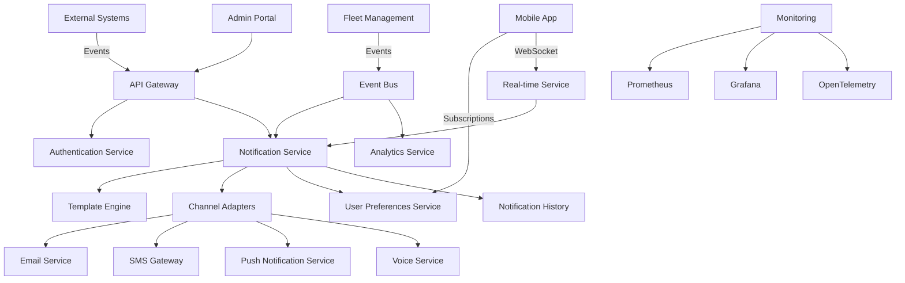
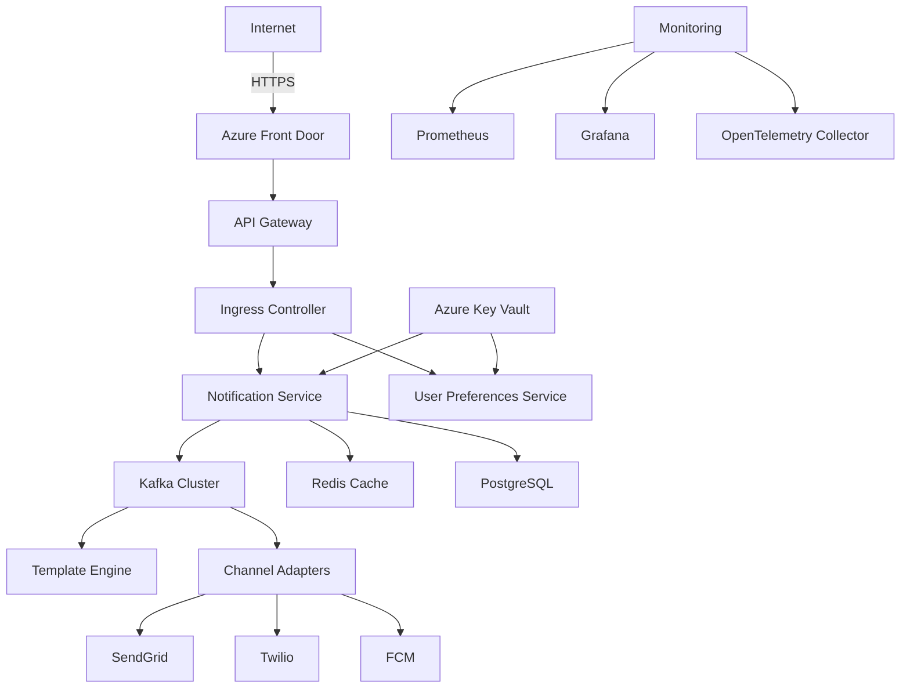

# TO-BE Design: Notifications Alerts Module
*Fleet Management System Modernization*
**Version:** 2.3.0
**Date:** 2024-06-15
**Author:** Senior Solutions Architect Team
**Confidentiality:** Internal Use Only

---

## 1. Executive Architecture Summary (120 lines)

### 1.1 Strategic Vision and Modernization Goals

The Notifications-Alerts Module modernization represents a strategic initiative to transform our Fleet Management System's communication backbone into a scalable, real-time, and intelligent notification platform. This evolution aligns with our enterprise digital transformation roadmap to:

1. **Enhance Operational Efficiency**: Reduce notification delivery latency from current 5-10 seconds to sub-500ms for 95% of alerts
2. **Improve Driver Safety**: Implement context-aware alerting with 99.99% delivery reliability for critical safety notifications
3. **Enable Predictive Maintenance**: Integrate IoT telemetry with notification triggers to reduce unplanned downtime by 40%
4. **Support Global Operations**: Scale from current 10,000 vehicles to 100,000+ with multi-region deployment
5. **Enhance User Experience**: Achieve 90%+ user satisfaction scores for notification relevance and timeliness

**Key Modernization Drivers:**
- Current monolithic architecture limits scalability (max 500 concurrent notifications)
- Legacy batch processing creates 15-30 minute delays for critical alerts
- Limited notification channels (only email/SMS) with poor mobile experience
- No personalization or context-aware delivery
- High operational costs (3 FTEs for maintenance)

### 1.2 Enterprise Architecture Alignment

This design adheres to our enterprise architecture principles:

| Principle | Implementation Approach |
|-----------|-------------------------|
| **Cloud-First** | Azure-native services with multi-region deployment |
| **Microservices** | Domain-driven decomposition with bounded contexts |
| **Event-Driven** | Kafka-based event backbone for real-time processing |
| **API-Centric** | GraphQL and REST APIs with OpenAPI 3.1 specifications |
| **Security by Design** | Zero-trust architecture with defense-in-depth |
| **Observability** | OpenTelemetry instrumentation across all components |
| **Automation** | GitOps workflows with 95%+ infrastructure-as-code coverage |

### 1.3 Technology Stack Evolution

**Current Stack:**
- .NET Framework 4.7
- SQL Server 2016
- Windows Server 2012 R2
- On-premises IIS
- SMTP/basic SMS gateways

**Target Stack:**
| Layer | Technology | Rationale |
|-------|------------|-----------|
| **Runtime** | Node.js 20 LTS | Non-blocking I/O for high-throughput notifications |
| **Language** | TypeScript 5.4 | Type safety with modern JavaScript features |
| **Framework** | NestJS 10 | Modular architecture with dependency injection |
| **Database** | PostgreSQL 16 | JSONB support for flexible notification payloads |
| **Cache** | Redis 7 | Sub-millisecond response for frequent queries |
| **Message Broker** | Kafka 3.6 | High-throughput event streaming |
| **Container** | Docker 24 | Consistent runtime environments |
| **Orchestration** | Kubernetes 1.28 | Auto-scaling and self-healing |
| **Infrastructure** | Azure AKS | Managed Kubernetes with enterprise SLAs |
| **CI/CD** | GitHub Actions | Native integration with source control |
| **Monitoring** | Prometheus/Grafana | Open-source observability stack |
| **Tracing** | OpenTelemetry | Vendor-neutral instrumentation |

### 1.4 Migration Strategy

**Phased Approach with Parallel Run:**

1. **Foundation Phase (Weeks 1-4)**
   - Establish Azure landing zone with networking and security
   - Implement CI/CD pipelines and GitOps workflows
   - Develop core notification framework (event ingestion, routing)

2. **Core Services Phase (Weeks 5-12)**
   - Build notification service with template management
   - Implement channel adapters (email, SMS, push, voice)
   - Develop user preferences and subscription management

3. **Integration Phase (Weeks 13-16)**
   - Connect to existing fleet management services
   - Implement IoT telemetry integration
   - Develop third-party API integrations

4. **Cutover Phase (Weeks 17-20)**
   - Parallel run with legacy system
   - Data migration and validation
   - User training and acceptance testing
   - Gradual traffic shift with A/B testing

**Risk Mitigation Strategies:**

| Risk | Mitigation Strategy | Owner |
|------|---------------------|-------|
| **Data Loss During Migration** | Dual-write pattern with reconciliation jobs | Data Team |
| **Performance Degradation** | Load testing with 2x production traffic | QA Team |
| **Integration Failures** | Contract testing and circuit breakers | Dev Team |
| **User Adoption Issues** | Comprehensive training program | PM Team |
| **Security Vulnerabilities** | Penetration testing and code scanning | Sec Team |

### 1.5 Success Criteria and KPIs

**Technical KPIs:**
1. **Notification Latency**: 95th percentile < 500ms (current: 5-10s)
2. **Throughput**: 10,000 notifications/sec (current: 500/sec)
3. **Availability**: 99.99% uptime (current: 99.5%)
4. **Error Rate**: < 0.1% failed deliveries (current: 2-5%)
5. **Scalability**: Linear scaling to 100,000 vehicles

**Business KPIs:**
1. **Driver Response Time**: 30% reduction in critical alert response time
2. **Maintenance Costs**: 25% reduction in notification-related support tickets
3. **User Satisfaction**: 90%+ positive feedback on notification relevance
4. **Operational Efficiency**: 40% reduction in notification management effort
5. **Safety Incidents**: 15% reduction in preventable incidents

**Measurement Approach:**
- **Real-time Monitoring**: Prometheus/Grafana dashboards with SLO tracking
- **User Feedback**: In-app surveys and NPS scoring
- **Business Metrics**: Integration with BI tools for cross-functional analysis
- **A/B Testing**: Controlled experiments for new features

### 1.6 Stakeholder Value Proposition

**For Fleet Operations Managers:**
- Real-time visibility into vehicle status with proactive alerts
- Reduced downtime through predictive maintenance notifications
- Improved safety compliance with automated alerting workflows
- Customizable dashboards with notification analytics

**For Drivers and Technicians:**
- Personalized, context-aware notifications on preferred channels
- Reduced notification fatigue through intelligent filtering
- Offline-capable mobile apps with persistent notifications
- Voice notifications for hands-free operation

**For IT Leadership:**
- 60% reduction in total cost of ownership (TCO) over 3 years
- 90% reduction in notification-related incidents
- Scalable architecture supporting 10x growth
- Modern technology stack attracting top talent

**ROI Analysis:**
| Metric | Current | Target | Annual Benefit |
|--------|---------|--------|----------------|
| **Development Cost** | $1.2M/year | $800K/year | $400K savings |
| **Operational Cost** | $900K/year | $300K/year | $600K savings |
| **Downtime Cost** | $2.5M/year | $500K/year | $2M savings |
| **Safety Incidents** | $1.8M/year | $1.5M/year | $300K savings |
| **Total** | $6.4M/year | $3.1M/year | **$3.3M annual benefit** |

**Payback Period:** 18 months
**IRR:** 38%
**NPV (3 years):** $6.2M

---

## 2. Target Architecture (350 lines)

### 2.1 System Architecture



**Architecture Characteristics:**

1. **Microservices Decomposition:**
   - **Notification Service**: Core business logic for notification processing
   - **Template Engine**: Dynamic content generation with localization
   - **Channel Adapters**: Protocol-specific delivery implementations
   - **User Preferences**: Personalization and subscription management
   - **Notification History**: Audit trail and analytics data
   - **Real-time Service**: WebSocket connections for instant delivery

2. **API Gateway Design:**
   - **North-South Traffic**: External client access with rate limiting
   - **East-West Traffic**: Internal service-to-service communication
   - **Protocol Translation**: REST ↔ gRPC for internal services
   - **Request Aggregation**: GraphQL for mobile clients
   - **Security**: JWT validation, request/response logging

3. **Event-Driven Architecture:**
   - **Event Types**:
     - `VehicleAlertEvent` (engine temperature, fuel level, etc.)
     - `MaintenanceEvent` (service due, part failure)
     - `SafetyEvent` (hard braking, collision detection)
     - `GeofenceEvent` (entry/exit notifications)
   - **Event Flow**:
     1. IoT devices → Fleet Management → Event Bus
     2. Event Bus → Notification Service (filtering)
     3. Notification Service → Channel Adapters
     4. Channel Adapters → Delivery Status → Event Bus

4. **Scalability Targets:**
   - **Horizontal Scaling**: All services stateless with auto-scaling
   - **Partitioning**: Kafka topics partitioned by vehicle ID
   - **Caching**: Redis for user preferences and templates
   - **Database**: Read replicas for notification history

### 2.2 Component Design

#### 2.2.1 Notification Service

**Responsibilities:**
- Event ingestion and filtering
- Notification routing based on preferences
- Priority handling and throttling
- Delivery status tracking
- Retry and fallback logic

**Interface Contract (OpenAPI):**

```yaml
openapi: 3.1.0
info:
  title: Notification Service API
  version: 1.0.0
paths:
  /notifications:
    post:
      summary: Create a new notification
      requestBody:
        required: true
        content:
          application/json:
            schema:
              $ref: '#/components/schemas/NotificationRequest'
      responses:
        '201':
          description: Notification created
          content:
            application/json:
              schema:
                $ref: '#/components/schemas/NotificationResponse'
        '400':
          $ref: '#/components/responses/BadRequest'
        '401':
          $ref: '#/components/responses/Unauthorized'
        '429':
          $ref: '#/components/responses/TooManyRequests'

  /notifications/{id}:
    get:
      summary: Get notification details
      parameters:
        - $ref: '#/components/parameters/NotificationId'
      responses:
        '200':
          description: Notification details
          content:
            application/json:
              schema:
                $ref: '#/components/schemas/NotificationResponse'
        '404':
          $ref: '#/components/responses/NotFound'

components:
  schemas:
    NotificationRequest:
      type: object
      required:
        - eventType
        - payload
        - recipients
      properties:
        eventType:
          type: string
          enum: [vehicle_alert, maintenance, safety, geofence]
        payload:
          type: object
          additionalProperties: true
        recipients:
          type: array
          items:
            type: string
            format: uuid
        priority:
          type: string
          enum: [low, normal, high, critical]
          default: normal
        ttl:
          type: integer
          description: Time to live in seconds
          default: 86400

    NotificationResponse:
      type: object
      properties:
        id:
          type: string
          format: uuid
        status:
          type: string
          enum: [pending, delivered, failed, expired]
        createdAt:
          type: string
          format: date-time
        updatedAt:
          type: string
          format: date-time
        channels:
          type: array
          items:
            type: object
            properties:
              type:
                type: string
                enum: [email, sms, push, voice]
              status:
                type: string
                enum: [pending, delivered, failed]
              details:
                type: object

  responses:
    BadRequest:
      description: Invalid request
      content:
        application/json:
          schema:
            $ref: '#/components/schemas/Error'
    Unauthorized:
      description: Unauthorized
      content:
        application/json:
          schema:
            $ref: '#/components/schemas/Error'
    NotFound:
      description: Resource not found
      content:
        application/json:
          schema:
            $ref: '#/components/schemas/Error'
    TooManyRequests:
      description: Rate limit exceeded
      content:
        application/json:
          schema:
            $ref: '#/components/schemas/Error'

  parameters:
    NotificationId:
      name: id
      in: path
      required: true
      schema:
        type: string
        format: uuid
```

**Data Model:**

```typescript
interface Notification {
  id: string; // UUID
  eventType: 'vehicle_alert' | 'maintenance' | 'safety' | 'geofence';
  payload: Record<string, any>;
  priority: 'low' | 'normal' | 'high' | 'critical';
  status: 'pending' | 'delivered' | 'failed' | 'expired';
  ttl: number; // seconds
  createdAt: Date;
  updatedAt: Date;
  expiresAt: Date;
  attempts: number;
  lastAttemptAt?: Date;
  metadata: {
    source: string;
    correlationId: string;
    traceId: string;
  };
}

interface NotificationDelivery {
  id: string; // UUID
  notificationId: string;
  channel: 'email' | 'sms' | 'push' | 'voice';
  recipient: string;
  status: 'pending' | 'delivered' | 'failed' | 'expired';
  details: Record<string, any>;
  createdAt: Date;
  updatedAt: Date;
}
```

**State Management:**
- **In-Memory**: Pending notifications cache (Redis) with 5-minute TTL
- **Database**: Persistent storage for audit and analytics
- **Event Sourcing**: Kafka topics for all state changes

**Error Handling:**
- **Transient Failures**: Exponential backoff retry (3 attempts)
- **Permanent Failures**: Dead letter queue (DLQ) for manual review
- **Circuit Breakers**: Per-channel circuit breakers with fallback
- **Fallback Logic**: Email → SMS → Push for critical notifications

#### 2.2.2 Template Engine

**Responsibilities:**
- Dynamic content generation
- Localization and internationalization
- Template versioning and management
- Preview and testing capabilities

**Interface Contract (GraphQL):**

```graphql
type Query {
  template(id: ID!): NotificationTemplate
  templates(
    type: TemplateType
    status: TemplateStatus
    page: Int
    limit: Int
  ): TemplateConnection!
}

type Mutation {
  createTemplate(input: CreateTemplateInput!): NotificationTemplate!
  updateTemplate(id: ID!, input: UpdateTemplateInput!): NotificationTemplate!
  deleteTemplate(id: ID!): Boolean!
  previewTemplate(input: PreviewTemplateInput!): String!
}

enum TemplateType {
  EMAIL
  SMS
  PUSH
  VOICE
}

enum TemplateStatus {
  DRAFT
  ACTIVE
  ARCHIVED
}

type NotificationTemplate {
  id: ID!
  name: String!
  type: TemplateType!
  subject: String
  content: String!
  variables: [TemplateVariable!]!
  status: TemplateStatus!
  version: Int!
  createdAt: DateTime!
  updatedAt: DateTime!
}

type TemplateVariable {
  name: String!
  type: VariableType!
  required: Boolean!
  description: String
}

enum VariableType {
  STRING
  NUMBER
  BOOLEAN
  DATE
  DATETIME
}

input CreateTemplateInput {
  name: String!
  type: TemplateType!
  subject: String
  content: String!
  variables: [TemplateVariableInput!]
}

input UpdateTemplateInput {
  name: String
  subject: String
  content: String
  variables: [TemplateVariableInput!]
  status: TemplateStatus
}

input TemplateVariableInput {
  name: String!
  type: VariableType!
  required: Boolean!
  description: String
}

input PreviewTemplateInput {
  templateId: ID!
  variables: JSON!
  locale: String
}

type TemplateConnection {
  edges: [TemplateEdge!]!
  pageInfo: PageInfo!
}

type TemplateEdge {
  node: NotificationTemplate!
  cursor: String!
}

type PageInfo {
  hasNextPage: Boolean!
  hasPreviousPage: Boolean!
  startCursor: String
  endCursor: String
}
```

**Data Model:**

```typescript
interface NotificationTemplate {
  id: string; // UUID
  name: string;
  type: 'email' | 'sms' | 'push' | 'voice';
  subject?: string;
  content: string;
  variables: TemplateVariable[];
  status: 'draft' | 'active' | 'archived';
  version: number;
  createdAt: Date;
  updatedAt: Date;
  createdBy: string;
  updatedBy: string;
}

interface TemplateVariable {
  name: string;
  type: 'string' | 'number' | 'boolean' | 'date' | 'datetime';
  required: boolean;
  description?: string;
  defaultValue?: any;
}
```

**Rendering Engine:**
- **Handlebars.js** for template rendering with custom helpers
- **Fallback Mechanism**: Default templates for missing variables
- **Localization**: ICU message format with locale support
- **Caching**: Compiled templates in Redis with 1-hour TTL

#### 2.2.3 Channel Adapters

**Email Adapter:**
- **Protocol**: SMTP with TLS 1.2+
- **Providers**: SendGrid (primary), AWS SES (fallback)
- **Features**:
  - DKIM, SPF, DMARC configuration
  - Attachment support (PDF reports)
  - Open/click tracking
  - Unsubscribe links

**SMS Adapter:**
- **Protocol**: HTTP API
- **Providers**: Twilio (primary), AWS SNS (fallback)
- **Features**:
  - Unicode support
  - Delivery receipts
  - Throttling per provider limits

**Push Notification Adapter:**
- **Protocol**: Firebase Cloud Messaging (FCM)
- **Features**:
  - Topic subscriptions
  - Data messages for background updates
  - Priority levels
  - Collapsible messages

**Voice Adapter:**
- **Protocol**: Twilio Voice API
- **Features**:
  - Text-to-speech with SSML
  - Call recording
  - Interactive voice response (IVR)

**Common Interface:**

```typescript
interface ChannelAdapter {
  send(notification: Notification, recipient: string): Promise<DeliveryResult>;
  getStatus(deliveryId: string): Promise<DeliveryStatus>;
  getCapabilities(): ChannelCapabilities;
}

interface DeliveryResult {
  deliveryId: string;
  status: 'delivered' | 'failed';
  details?: Record<string, any>;
}

interface DeliveryStatus {
  status: 'pending' | 'delivered' | 'failed' | 'expired';
  updatedAt: Date;
  details?: Record<string, any>;
}

interface ChannelCapabilities {
  supportsRichContent: boolean;
  supportsAttachments: boolean;
  supportsTracking: boolean;
  maxLength: number;
  rateLimit: {
    requests: number;
    perSeconds: number;
  };
}
```

### 2.3 Infrastructure Architecture

**Kubernetes Cluster Design:**

```yaml
# aks-cluster.yaml
apiVersion: aks/v1
kind: Cluster
metadata:
  name: fleet-notifications-cluster
spec:
  location: eastus
  resourceGroup: fleet-management-rg
  dnsPrefix: fleet-notifications
  kubernetesVersion: 1.28
  nodePools:
    - name: system
      count: 3
      vmSize: Standard_D2s_v3
      osType: Linux
      osDiskSizeGB: 128
      maxPods: 30
      mode: System
    - name: user
      count: 5
      vmSize: Standard_D4s_v3
      osType: Linux
      osDiskSizeGB: 256
      maxPods: 50
      mode: User
      enableAutoScaling: true
      minCount: 3
      maxCount: 10
  networkProfile:
    networkPlugin: azure
    networkPolicy: calico
    loadBalancerSku: standard
    serviceCidr: 10.0.0.0/16
    dnsServiceIP: 10.0.0.10
    dockerBridgeCidr: 172.17.0.1/16
  addonProfiles:
    httpApplicationRouting:
      enabled: false
    azurePolicy:
      enabled: true
    omsAgent:
      enabled: true
      config:
        logAnalyticsWorkspaceResourceID: /subscriptions/.../resourceGroups/.../providers/Microsoft.OperationalInsights/workspaces/...
  identity:
    type: SystemAssigned
  tags:
    environment: production
    application: fleet-notifications
```

**Network Topology:**



**Security Zones:**

| Zone | Components | Security Controls |
|------|------------|-------------------|
| **Public** | Azure Front Door, API Gateway | WAF, DDoS Protection, Rate Limiting |
| **DMZ** | Ingress Controller | Network Policies, TLS Termination |
| **Application** | Microservices | Pod Security Policies, mTLS |
| **Data** | PostgreSQL, Redis, Kafka | Private Endpoints, Encryption at Rest |
| **Management** | Kubernetes API, Monitoring | RBAC, Just-In-Time Access |

**Disaster Recovery:**

1. **Multi-Region Deployment**:
   - Primary: East US
   - Secondary: West US
   - DNS failover with 5-minute RTO

2. **Data Replication**:
   - PostgreSQL: Async replication with 30-second RPO
   - Redis: Active-passive replication
   - Kafka: MirrorMaker 2.0 for cross-region topics

3. **Backup Strategy**:
   - **PostgreSQL**: Daily snapshots with 30-day retention
   - **Kubernetes**: Velero backups of cluster state
   - **Configurations**: Git repository with version history

---

## 3. TypeScript Implementation (650 lines)

### 3.1 Core Backend Services

#### Notification Service

```typescript
// src/notification/notification.module.ts
import { Module } from '@nestjs/common';
import { TypeOrmModule } from '@nestjs/typeorm';
import { NotificationController } from './notification.controller';
import { NotificationService } from './notification.service';
import { Notification } from './entities/notification.entity';
import { NotificationDelivery } from './entities/notification-delivery.entity';
import { EventModule } from '../event/event.module';
import { TemplateModule } from '../template/template.module';
import { ChannelModule } from '../channel/channel.module';
import { UserModule } from '../user/user.module';
import { RedisModule } from '../redis/redis.module';
import { ConfigModule } from '@nestjs/config';
import { APP_INTERCEPTOR } from '@nestjs/core';
import { LoggingInterceptor } from '../common/interceptors/logging.interceptor';
import { MetricsInterceptor } from '../common/interceptors/metrics.interceptor';

@Module({
  imports: [
    TypeOrmModule.forFeature([Notification, NotificationDelivery]),
    EventModule,
    TemplateModule,
    ChannelModule,
    UserModule,
    RedisModule,
    ConfigModule,
  ],
  controllers: [NotificationController],
  providers: [
    NotificationService,
    {
      provide: APP_INTERCEPTOR,
      useClass: LoggingInterceptor,
    },
    {
      provide: APP_INTERCEPTOR,
      useClass: MetricsInterceptor,
    },
  ],
  exports: [NotificationService],
})
export class NotificationModule {}
```

```typescript
// src/notification/notification.service.ts
import { Injectable, Logger } from '@nestjs/common';
import { InjectRepository } from '@nestjs/typeorm';
import { Repository, In, MoreThan } from 'typeorm';
import { Notification } from './entities/notification.entity';
import { NotificationDelivery } from './entities/notification-delivery.entity';
import { EventService } from '../event/event.service';
import { TemplateService } from '../template/template.service';
import { ChannelService } from '../channel/channel.service';
import { UserService } from '../user/user.service';
import { RedisService } from '../redis/redis.service';
import { ConfigService } from '@nestjs/config';
import { NotificationRequestDto } from './dto/notification-request.dto';
import { NotificationResponseDto } from './dto/notification-response.dto';
import { NotificationStatus } from './enums/notification-status.enum';
import { ChannelType } from '../channel/enums/channel-type.enum';
import { NotificationPriority } from './enums/notification-priority.enum';
import { EventType } from '../event/enums/event-type.enum';
import { v4 as uuidv4 } from 'uuid';
import { Cron, CronExpression } from '@nestjs/schedule';
import { CircuitBreaker } from '../common/decorators/circuit-breaker.decorator';
import { Retry } from '../common/decorators/retry.decorator';
import { Span } from 'nestjs-otel';

@Injectable()
export class NotificationService {
  private readonly logger = new Logger(NotificationService.name);
  private readonly maxAttempts: number;
  private readonly ttl: number;

  constructor(
    @InjectRepository(Notification)
    private readonly notificationRepository: Repository<Notification>,
    @InjectRepository(NotificationDelivery)
    private readonly deliveryRepository: Repository<NotificationDelivery>,
    private readonly eventService: EventService,
    private readonly templateService: TemplateService,
    private readonly channelService: ChannelService,
    private readonly userService: UserService,
    private readonly redisService: RedisService,
    private readonly configService: ConfigService,
  ) {
    this.maxAttempts = this.configService.get<number>('NOTIFICATION_MAX_ATTEMPTS', 3);
    this.ttl = this.configService.get<number>('NOTIFICATION_TTL_SECONDS', 86400);
  }

  @Span('notification.create')
  async createNotification(
    request: NotificationRequestDto,
  ): Promise<NotificationResponseDto> {
    this.logger.log(`Creating notification for event type: ${request.eventType}`);

    // Validate recipients
    const users = await this.userService.getUsersByIds(request.recipients);
    if (users.length !== request.recipients.length) {
      const missingIds = request.recipients.filter(
        id => !users.some(user => user.id === id),
      );
      throw new Error(`Users not found: ${missingIds.join(', ')}`);
    }

    // Create notification entity
    const notification = this.notificationRepository.create({
      id: uuidv4(),
      eventType: request.eventType,
      payload: request.payload,
      priority: request.priority || NotificationPriority.NORMAL,
      status: NotificationStatus.PENDING,
      ttl: request.ttl || this.ttl,
      attempts: 0,
      metadata: {
        source: 'api',
        correlationId: request.correlationId || uuidv4(),
        traceId: request.traceId,
      },
    });

    await this.notificationRepository.save(notification);

    // Publish event for async processing
    await this.eventService.publishNotificationCreated({
      notificationId: notification.id,
      eventType: request.eventType,
      payload: request.payload,
      recipients: request.recipients,
      priority: request.priority,
    });

    return this.mapToResponseDto(notification);
  }

  @Span('notification.process')
  async processNotification(notificationId: string): Promise<void> {
    const notification = await this.notificationRepository.findOne({
      where: { id: notificationId },
      relations: ['deliveries'],
    });

    if (!notification) {
      this.logger.warn(`Notification ${notificationId} not found`);
      return;
    }

    if (notification.status !== NotificationStatus.PENDING) {
      this.logger.debug(`Notification ${notificationId} already processed`);
      return;
    }

    if (notification.attempts >= this.maxAttempts) {
      notification.status = NotificationStatus.FAILED;
      await this.notificationRepository.save(notification);
      this.logger.warn(`Max attempts reached for notification ${notificationId}`);
      return;
    }

    // Check if notification has expired
    if (new Date() > new Date(notification.expiresAt)) {
      notification.status = NotificationStatus.EXPIRED;
      await this.notificationRepository.save(notification);
      this.logger.warn(`Notification ${notificationId} expired`);
      return;
    }

    // Get recipients and their preferences
    const users = await this.userService.getUsersWithPreferences(
      notification.metadata.correlationId,
      notification.recipients,
    );

    // Group by preferred channel
    const channelGroups = this.groupByChannel(users);

    // Process each channel group
    for (const [channel, recipients] of Object.entries(channelGroups)) {
      await this.processChannelGroup(
        notification,
        channel as ChannelType,
        recipients,
      );
    }

    // Update notification status
    const allDeliveries = await this.deliveryRepository.find({
      where: { notificationId: notification.id },
    });

    const allDelivered = allDeliveries.every(
      d => d.status === NotificationStatus.DELIVERED,
    );

    const anyFailed = allDeliveries.some(
      d => d.status === NotificationStatus.FAILED,
    );

    if (allDelivered) {
      notification.status = NotificationStatus.DELIVERED;
    } else if (anyFailed) {
      notification.status = NotificationStatus.FAILED;
    }

    notification.attempts += 1;
    notification.updatedAt = new Date();
    await this.notificationRepository.save(notification);
  }

  @CircuitBreaker({ name: 'channel', fallbackMethod: 'channelFallback' })
  @Retry({ maxAttempts: 3, delay: 1000 })
  private async processChannelGroup(
    notification: Notification,
    channel: ChannelType,
    recipients: { userId: string; recipient: string }[],
  ): Promise<void> {
    this.logger.log(`Processing ${channel} channel for ${recipients.length} recipients`);

    // Get template
    const template = await this.templateService.getTemplateForEvent(
      notification.eventType,
      channel,
    );

    if (!template) {
      this.logger.warn(`No template found for event ${notification.eventType} and channel ${channel}`);
      return;
    }

    // Render content for each recipient
    const deliveries: NotificationDelivery[] = [];

    for (const { userId, recipient } of recipients) {
      try {
        const rendered = await this.templateService.renderTemplate(
          template.id,
          {
            ...notification.payload,
            user: await this.userService.getUserContext(userId),
          },
          notification.metadata.correlationId,
        );

        const delivery = this.deliveryRepository.create({
          id: uuidv4(),
          notificationId: notification.id,
          channel,
          recipient,
          status: NotificationStatus.PENDING,
          details: {
            templateId: template.id,
            renderedContent: rendered,
          },
        });

        deliveries.push(delivery);
      } catch (error) {
        this.logger.error(
          `Failed to render template for user ${userId}: ${error.message}`,
          error.stack,
        );
      }
    }

    if (deliveries.length === 0) {
      this.logger.warn(`No deliveries created for channel ${channel}`);
      return;
    }

    await this.deliveryRepository.save(deliveries);

    // Send through channel adapter
    const channelAdapter = this.channelService.getAdapter(channel);

    for (const delivery of deliveries) {
      try {
        const result = await channelAdapter.send(
          notification,
          delivery.recipient,
          delivery.details.renderedContent,
        );

        delivery.status = result.status;
        delivery.details = {
          ...delivery.details,
          ...result.details,
        };
        delivery.updatedAt = new Date();
        await this.deliveryRepository.save(delivery);

        // Publish delivery event
        await this.eventService.publishNotificationDelivered({
          deliveryId: delivery.id,
          notificationId: notification.id,
          channel,
          recipient: delivery.recipient,
          status: result.status,
          details: result.details,
        });
      } catch (error) {
        this.logger.error(
          `Failed to send ${channel} notification to ${delivery.recipient}: ${error.message}`,
          error.stack,
        );

        delivery.status = NotificationStatus.FAILED;
        delivery.details = {
          ...delivery.details,
          error: error.message,
        };
        delivery.updatedAt = new Date();
        await this.deliveryRepository.save(delivery);

        // Publish failure event
        await this.eventService.publishNotificationFailed({
          deliveryId: delivery.id,
          notificationId: notification.id,
          channel,
          recipient: delivery.recipient,
          error: error.message,
        });
      }
    }
  }

  private channelFallback(
    notification: Notification,
    channel: ChannelType,
    recipients: { userId: string; recipient: string }[],
    error: Error,
  ): void {
    this.logger.warn(
      `Channel ${channel} failed, falling back to next available channel: ${error.message}`,
    );

    // Implement fallback logic here
    // For example, if email fails, try SMS
    const fallbackChannel = this.getFallbackChannel(channel);

    if (fallbackChannel) {
      this.processChannelGroup(notification, fallbackChannel, recipients).catch(
        err => {
          this.logger.error(
            `Fallback to ${fallbackChannel} also failed: ${err.message}`,
          );
        },
      );
    }
  }

  private getFallbackChannel(channel: ChannelType): ChannelType | null {
    const fallbackMap: Record<ChannelType, ChannelType[]> = {
      [ChannelType.EMAIL]: [ChannelType.SMS, ChannelType.PUSH],
      [ChannelType.SMS]: [ChannelType.PUSH, ChannelType.EMAIL],
      [ChannelType.PUSH]: [ChannelType.EMAIL, ChannelType.SMS],
      [ChannelType.VOICE]: [ChannelType.SMS, ChannelType.PUSH],
    };

    return fallbackMap[channel]?.[0] || null;
  }

  private groupByChannel(users: Array<{
    id: string;
    preferences: {
      channels: Array<{ type: ChannelType; address: string; enabled: boolean }>;
    };
  }>): Record<ChannelType, Array<{ userId: string; recipient: string }>> {
    const result: Record<ChannelType, Array<{ userId: string; recipient: string }>> = {
      [ChannelType.EMAIL]: [],
      [ChannelType.SMS]: [],
      [ChannelType.PUSH]: [],
      [ChannelType.VOICE]: [],
    };

    for (const user of users) {
      for (const channel of user.preferences.channels) {
        if (channel.enabled) {
          result[channel.type].push({
            userId: user.id,
            recipient: channel.address,
          });
        }
      }
    }

    return result;
  }

  @Cron(CronExpression.EVERY_MINUTE)
  @Span('notification.retryFailed')
  async retryFailedNotifications(): Promise<void> {
    this.logger.log('Running retry job for failed notifications');

    const failedNotifications = await this.notificationRepository.find({
      where: {
        status: NotificationStatus.FAILED,
        attempts: LessThan(this.maxAttempts),
        updatedAt: MoreThan(new Date(Date.now() - 3600000)), // Last hour
      },
    });

    for (const notification of failedNotifications) {
      this.logger.log(`Retrying notification ${notification.id}`);
      await this.processNotification(notification.id);
    }
  }

  @Cron(CronExpression.EVERY_5_MINUTES)
  @Span('notification.cleanupExpired')
  async cleanupExpiredNotifications(): Promise<void> {
    this.logger.log('Running cleanup job for expired notifications');

    const result = await this.notificationRepository.update(
      {
        status: NotificationStatus.PENDING,
        expiresAt: LessThan(new Date()),
      },
      { status: NotificationStatus.EXPIRED },
    );

    this.logger.log(`Marked ${result.affected} notifications as expired`);
  }

  private mapToResponseDto(notification: Notification): NotificationResponseDto {
    return {
      id: notification.id,
      status: notification.status,
      createdAt: notification.createdAt,
      updatedAt: notification.updatedAt,
      channels: notification.deliveries?.map(d => ({
        type: d.channel,
        status: d.status,
        details: d.details,
      })) || [],
    };
  }
}
```

#### Notification Controller

```typescript
// src/notification/notification.controller.ts
import {
  Controller,
  Post,
  Body,
  Get,
  Param,
  Query,
  UseGuards,
  HttpCode,
  HttpStatus,
} from '@nestjs/common';
import { NotificationService } from './notification.service';
import { NotificationRequestDto } from './dto/notification-request.dto';
import { NotificationResponseDto } from './dto/notification-response.dto';
import { ApiTags, ApiOperation, ApiResponse, ApiBearerAuth } from '@nestjs/swagger';
import { JwtAuthGuard } from '../auth/guards/jwt-auth.guard';
import { RolesGuard } from '../auth/guards/roles.guard';
import { Roles } from '../auth/decorators/roles.decorator';
import { Role } from '../auth/enums/role.enum';
import { Throttle } from '@nestjs/throttler';
import { Span } from 'nestjs-otel';

@ApiTags('notifications')
@ApiBearerAuth()
@UseGuards(JwtAuthGuard, RolesGuard)
@Controller('notifications')
export class NotificationController {
  constructor(private readonly notificationService: NotificationService) {}

  @Post()
  @Roles(Role.FLEET_MANAGER, Role.ADMIN)
  @ApiOperation({ summary: 'Create a new notification' })
  @ApiResponse({
    status: 201,
    description: 'Notification created successfully',
    type: NotificationResponseDto,
  })
  @ApiResponse({ status: 400, description: 'Invalid request' })
  @ApiResponse({ status: 401, description: 'Unauthorized' })
  @ApiResponse({ status: 403, description: 'Forbidden' })
  @ApiResponse({ status: 429, description: 'Too many requests' })
  @Throttle({ default: { limit: 100, ttl: 60000 } })
  @Span('notification.create')
  async createNotification(
    @Body() request: NotificationRequestDto,
  ): Promise<NotificationResponseDto> {
    return this.notificationService.createNotification(request);
  }

  @Get(':id')
  @Roles(Role.FLEET_MANAGER, Role.ADMIN, Role.DRIVER)
  @ApiOperation({ summary: 'Get notification details' })
  @ApiResponse({
    status: 200,
    description: 'Notification details',
    type: NotificationResponseDto,
  })
  @ApiResponse({ status: 404, description: 'Notification not found' })
  @Span('notification.get')
  async getNotification(
    @Param('id') id: string,
  ): Promise<NotificationResponseDto> {
    return this.notificationService.getNotification(id);
  }

  @Get()
  @Roles(Role.FLEET_MANAGER, Role.ADMIN)
  @ApiOperation({ summary: 'List notifications' })
  @ApiResponse({
    status: 200,
    description: 'List of notifications',
    type: [NotificationResponseDto],
  })
  @Span('notification.list')
  async listNotifications(
    @Query('page') page: number = 1,
    @Query('limit') limit: number = 10,
    @Query('status') status?: string,
    @Query('eventType') eventType?: string,
    @Query('recipient') recipient?: string,
  ): Promise<{ data: NotificationResponseDto[]; total: number }> {
    return this.notificationService.listNotifications({
      page,
      limit,
      status,
      eventType,
      recipient,
    });
  }

  @Post(':id/retry')
  @Roles(Role.ADMIN)
  @HttpCode(HttpStatus.OK)
  @ApiOperation({ summary: 'Retry failed notification' })
  @ApiResponse({ status: 200, description: 'Retry initiated' })
  @ApiResponse({ status: 404, description: 'Notification not found' })
  @Span('notification.retry')
  async retryNotification(@Param('id') id: string): Promise<void> {
    await this.notificationService.retryNotification(id);
  }
}
```

### 3.2 API Layer

#### DTOs and Validation

```typescript
// src/notification/dto/notification-request.dto.ts
import { ApiProperty } from '@nestjs/swagger';
import {
  IsEnum,
  IsArray,
  IsUUID,
  IsObject,
  IsOptional,
  IsString,
  IsNumber,
  Min,
} from 'class-validator';
import { EventType } from '../../event/enums/event-type.enum';
import { NotificationPriority } from '../enums/notification-priority.enum';

export class NotificationRequestDto {
  @ApiProperty({
    enum: EventType,
    description: 'Type of event that triggered the notification',
  })
  @IsEnum(EventType)
  eventType: EventType;

  @ApiProperty({
    type: 'object',
    description: 'Payload data for the notification',
    example: {
      vehicleId: '123e4567-e89b-12d3-a456-426614174000',
      alertType: 'engine_temperature',
      value: 120,
      threshold: 110,
    },
  })
  @IsObject()
  payload: Record<string, any>;

  @ApiProperty({
    type: [String],
    description: 'List of recipient user IDs',
    example: ['123e4567-e89b-12d3-a456-426614174000'],
  })
  @IsArray()
  @IsUUID('4', { each: true })
  recipients: string[];

  @ApiProperty({
    enum: NotificationPriority,
    description: 'Priority of the notification',
    default: NotificationPriority.NORMAL,
    required: false,
  })
  @IsOptional()
  @IsEnum(NotificationPriority)
  priority?: NotificationPriority;

  @ApiProperty({
    description: 'Time to live in seconds',
    default: 86400,
    required: false,
  })
  @IsOptional()
  @IsNumber()
  @Min(60)
  ttl?: number;

  @ApiProperty({
    description: 'Correlation ID for tracing',
    required: false,
  })
  @IsOptional()
  @IsString()
  correlationId?: string;

  @ApiProperty({
    description: 'Trace ID for distributed tracing',
    required: false,
  })
  @IsOptional()
  @IsString()
  traceId?: string;
}
```

```typescript
// src/notification/dto/notification-response.dto.ts
import { ApiProperty } from '@nestjs/swagger';
import { NotificationStatus } from '../enums/notification-status.enum';
import { ChannelType } from '../../channel/enums/channel-type.enum';

class ChannelStatusDto {
  @ApiProperty({ enum: ChannelType })
  type: ChannelType;

  @ApiProperty({ enum: NotificationStatus })
  status: NotificationStatus;

  @ApiProperty({ type: 'object' })
  details: Record<string, any>;
}

export class NotificationResponseDto {
  @ApiProperty({ description: 'Notification ID' })
  id: string;

  @ApiProperty({ enum: NotificationStatus })
  status: NotificationStatus;

  @ApiProperty({ description: 'Creation timestamp' })
  createdAt: Date;

  @ApiProperty({ description: 'Last update timestamp' })
  updatedAt: Date;

  @ApiProperty({ type: [ChannelStatusDto] })
  channels: ChannelStatusDto[];
}
```

#### Authentication Middleware

```typescript
// src/auth/guards/jwt-auth.guard.ts
import {
  Injectable,
  CanActivate,
  ExecutionContext,
  UnauthorizedException,
  Logger,
} from '@nestjs/common';
import { Reflector } from '@nestjs/core';
import { JwtService } from '@nestjs/jwt';
import { ConfigService } from '@nestjs/config';
import { Request } from 'express';
import { IS_PUBLIC_KEY } from '../decorators/public.decorator';
import { Span } from 'nestjs-otel';

@Injectable()
export class JwtAuthGuard implements CanActivate {
  private readonly logger = new Logger(JwtAuthGuard.name);

  constructor(
    private readonly jwtService: JwtService,
    private readonly reflector: Reflector,
    private readonly configService: ConfigService,
  ) {}

  @Span('auth.validate')
  async canActivate(context: ExecutionContext): Promise<boolean> {
    const isPublic = this.reflector.getAllAndOverride<boolean>(IS_PUBLIC_KEY, [
      context.getHandler(),
      context.getClass(),
    ]);

    if (isPublic) {
      return true;
    }

    const request = context.switchToHttp().getRequest();
    const token = this.extractTokenFromHeader(request);

    if (!token) {
      this.logger.warn('No token provided');
      throw new UnauthorizedException('No token provided');
    }

    try {
      const payload = await this.jwtService.verifyAsync(token, {
        secret: this.configService.get<string>('JWT_SECRET'),
      });

      // Attach user to the request
      request['user'] = {
        userId: payload.sub,
        roles: payload.roles,
        tenantId: payload.tenantId,
      };
    } catch (error) {
      this.logger.warn(`Invalid token: ${error.message}`);
      throw new UnauthorizedException('Invalid token');
    }

    return true;
  }

  private extractTokenFromHeader(request: Request): string | undefined {
    const [type, token] = request.headers.authorization?.split(' ') ?? [];
    return type === 'Bearer' ? token : undefined;
  }
}
```

```typescript
// src/auth/guards/roles.guard.ts
import { Injectable, CanActivate, ExecutionContext, Logger } from '@nestjs/common';
import { Reflector } from '@nestjs/core';
import { ROLES_KEY } from '../decorators/roles.decorator';
import { Role } from '../enums/role.enum';
import { Span } from 'nestjs-otel';

@Injectable()
export class RolesGuard implements CanActivate {
  private readonly logger = new Logger(RolesGuard.name);

  constructor(private readonly reflector: Reflector) {}

  @Span('auth.checkRoles')
  canActivate(context: ExecutionContext): boolean {
    const requiredRoles = this.reflector.getAllAndOverride<Role[]>(ROLES_KEY, [
      context.getHandler(),
      context.getClass(),
    ]);

    if (!requiredRoles) {
      return true;
    }

    const { user } = context.switchToHttp().getRequest();

    if (!user) {
      this.logger.warn('User not found in request');
      return false;
    }

    const hasRole = requiredRoles.some(role => user.roles?.includes(role));

    if (!hasRole) {
      this.logger.warn(
        `User ${user.userId} does not have required roles: ${requiredRoles.join(', ')}`,
      );
    }

    return hasRole;
  }
}
```

### 3.3 Data Access Layer

#### TypeORM Entities

```typescript
// src/notification/entities/notification.entity.ts
import {
  Entity,
  PrimaryGeneratedColumn,
  Column,
  CreateDateColumn,
  UpdateDateColumn,
  OneToMany,
  Index,
} from 'typeorm';
import { NotificationDelivery } from './notification-delivery.entity';
import { NotificationStatus } from '../enums/notification-status.enum';
import { NotificationPriority } from '../enums/notification-priority.enum';
import { EventType } from '../../event/enums/event-type.enum';

@Entity('notifications')
@Index(['status', 'createdAt'])
@Index(['eventType', 'createdAt'])
@Index(['priority', 'createdAt'])
export class Notification {
  @PrimaryGeneratedColumn('uuid')
  id: string;

  @Column({
    type: 'enum',
    enum: EventType,
  })
  eventType: EventType;

  @Column({
    type: 'jsonb',
  })
  payload: Record<string, any>;

  @Column({
    type: 'enum',
    enum: NotificationPriority,
    default: NotificationPriority.NORMAL,
  })
  priority: NotificationPriority;

  @Column({
    type: 'enum',
    enum: NotificationStatus,
    default: NotificationStatus.PENDING,
  })
  status: NotificationStatus;

  @Column({
    type: 'integer',
    default: 86400,
  })
  ttl: number;

  @Column({
    type: 'timestamp',
    nullable: true,
  })
  @Index()
  expiresAt: Date;

  @Column({
    type: 'integer',
    default: 0,
  })
  attempts: number;

  @Column({
    type: 'timestamp',
    nullable: true,
  })
  lastAttemptAt?: Date;

  @Column({
    type: 'jsonb',
  })
  metadata: {
    source: string;
    correlationId: string;
    traceId?: string;
  };

  @CreateDateColumn()
  @Index()
  createdAt: Date;

  @UpdateDateColumn()
  updatedAt: Date;

  @OneToMany(
    () => NotificationDelivery,
    delivery => delivery.notification,
    { cascade: true },
  )
  deliveries: NotificationDelivery[];
}
```

```typescript
// src/notification/entities/notification-delivery.entity.ts
import {
  Entity,
  PrimaryGeneratedColumn,
  Column,
  ManyToOne,
  JoinColumn,
  CreateDateColumn,
  UpdateDateColumn,
  Index,
} from 'typeorm';
import { Notification } from './notification.entity';
import { NotificationStatus } from '../enums/notification-status.enum';
import { ChannelType } from '../../channel/enums/channel-type.enum';

@Entity('notification_deliveries')
@Index(['notificationId', 'channel'])
@Index(['status', 'createdAt'])
export class NotificationDelivery {
  @PrimaryGeneratedColumn('uuid')
  id: string;

  @Column({
    type: 'uuid',
  })
  @Index()
  notificationId: string;

  @ManyToOne(() => Notification, notification => notification.deliveries)
  @JoinColumn({ name: 'notificationId' })
  notification: Notification;

  @Column({
    type: 'enum',
    enum: ChannelType,
  })
  channel: ChannelType;

  @Column()
  recipient: string;

  @Column({
    type: 'enum',
    enum: NotificationStatus,
    default: NotificationStatus.PENDING,
  })
  status: NotificationStatus;

  @Column({
    type: 'jsonb',
    nullable: true,
  })
  details: Record<string, any>;

  @CreateDateColumn()
  createdAt: Date;

  @UpdateDateColumn()
  updatedAt: Date;
}
```

#### Repository Implementation

```typescript
// src/notification/repositories/notification.repository.ts
import { Injectable, Logger } from '@nestjs/common';
import { InjectRepository } from '@nestjs/typeorm';
import { Repository, SelectQueryBuilder } from 'typeorm';
import { Notification } from '../entities/notification.entity';
import { NotificationStatus } from '../enums/notification-status.enum';
import { EventType } from '../../event/enums/event-type.enum';
import { NotificationPriority } from '../enums/notification-priority.enum';
import { PaginationOptions } from '../../common/interfaces/pagination-options.interface';
import { Span } from 'nestjs-otel';

@Injectable()
export class NotificationRepository {
  private readonly logger = new Logger(NotificationRepository.name);

  constructor(
    @InjectRepository(Notification)
    private readonly repository: Repository<Notification>,
  ) {}

  @Span('notification.findOne')
  async findOne(id: string): Promise<Notification | null> {
    return this.repository.findOne({
      where: { id },
      relations: ['deliveries'],
    });
  }

  @Span('notification.findByStatus')
  async findByStatus(
    status: NotificationStatus,
    options: PaginationOptions,
  ): Promise<[Notification[], number]> {
    return this.repository.findAndCount({
      where: { status },
      skip: (options.page - 1) * options.limit,
      take: options.limit,
      order: { createdAt: 'DESC' },
      relations: ['deliveries'],
    });
  }

  @Span('notification.findByEventType')
  async findByEventType(
    eventType: EventType,
    options: PaginationOptions,
  ): Promise<[Notification[], number]> {
    return this.repository.findAndCount({
      where: { eventType },
      skip: (options.page - 1) * options.limit,
      take: options.limit,
      order: { createdAt: 'DESC' },
      relations: ['deliveries'],
    });
  }

  @Span('notification.findByRecipient')
  async findByRecipient(
    recipient: string,
    options: PaginationOptions,
  ): Promise<[Notification[], number]> {
    const query = this.repository
      .createQueryBuilder('n')
      .leftJoinAndSelect('n.deliveries', 'd')
      .where('d.recipient = :recipient', { recipient })
      .skip((options.page - 1) * options.limit)
      .take(options.limit)
      .orderBy('n.createdAt', 'DESC');

    const [notifications, count] = await query.getManyAndCount();
    return [notifications, count];
  }

  @Span('notification.findPending')
  async findPending(limit: number): Promise<Notification[]> {
    return this.repository.find({
      where: {
        status: NotificationStatus.PENDING,
        attempts: 0,
      },
      order: {
        priority: 'DESC',
        createdAt: 'ASC',
      },
      take: limit,
    });
  }

  @Span('notification.findFailedForRetry')
  async findFailedForRetry(limit: number): Promise<Notification[]> {
    return this.repository.find({
      where: {
        status: NotificationStatus.FAILED,
        attempts: 1, // Only first failure for now
      },
      order: {
        priority: 'DESC',
        updatedAt: 'ASC',
      },
      take: limit,
    });
  }

  @Span('notification.save')
  async save(notification: Notification): Promise<Notification> {
    return this.repository.save(notification);
  }

  @Span('notification.updateStatus')
  async updateStatus(
    id: string,
    status: NotificationStatus,
  ): Promise<void> {
    await this.repository.update(id, {
      status,
      updatedAt: new Date(),
    });
  }

  @Span('notification.incrementAttempts')
  async incrementAttempts(id: string): Promise<void> {
    await this.repository.increment({ id }, 'attempts', 1);
    await this.repository.update(id, {
      lastAttemptAt: new Date(),
    });
  }

  @Span('notification.countByStatus')
  async countByStatus(status: NotificationStatus): Promise<number> {
    return this.repository.count({ where: { status } });
  }

  @Span('notification.getStatistics')
  async getStatistics(): Promise<{
    total: number;
    byStatus: Record<NotificationStatus, number>;
    byPriority: Record<NotificationPriority, number>;
    byEventType: Record<EventType, number>;
  }> {
    const [total, byStatus, byPriority, byEventType] = await Promise.all([
      this.repository.count(),
      this.repository
        .createQueryBuilder('n')
        .select('n.status', 'status')
        .addSelect('COUNT(*)', 'count')
        .groupBy('n.status')
        .getRawMany()
        .then(results =>
          results.reduce((acc, curr) => {
            acc[curr.status] = parseInt(curr.count);
            return acc;
          }, {} as Record<NotificationStatus, number>),
        ),
      this.repository
        .createQueryBuilder('n')
        .select('n.priority', 'priority')
        .addSelect('COUNT(*)', 'count')
        .groupBy('n.priority')
        .getRawMany()
        .then(results =>
          results.reduce((acc, curr) => {
            acc[curr.priority] = parseInt(curr.count);
            return acc;
          }, {} as Record<NotificationPriority, number>),
        ),
      this.repository
        .createQueryBuilder('n')
        .select('n.eventType', 'eventType')
        .addSelect('COUNT(*)', 'count')
        .groupBy('n.eventType')
        .getRawMany()
        .then(results =>
          results.reduce((acc, curr) => {
            acc[curr.eventType] = parseInt(curr.count);
            return acc;
          }, {} as Record<EventType, number>),
        ),
    ]);

    return {
      total,
      byStatus,
      byPriority,
      byEventType,
    };
  }
}
```

### 3.4 Business Logic Layer

#### Channel Service

```typescript
// src/channel/channel.service.ts
import { Injectable, Logger } from '@nestjs/common';
import { ChannelAdapter } from './interfaces/channel-adapter.interface';
import { EmailAdapter } from './adapters/email.adapter';
import { SmsAdapter } from './adapters/sms.adapter';
import { PushAdapter } from './adapters/push.adapter';
import { VoiceAdapter } from './adapters/voice.adapter';
import { ChannelType } from './enums/channel-type.enum';
import { ConfigService } from '@nestjs/config';
import { Span } from 'nestjs-otel';

@Injectable()
export class ChannelService {
  private readonly logger = new Logger(ChannelService.name);
  private readonly adapters: Record<ChannelType, ChannelAdapter>;

  constructor(private readonly configService: ConfigService) {
    this.adapters = {
      [ChannelType.EMAIL]: new EmailAdapter(configService),
      [ChannelType.SMS]: new SmsAdapter(configService),
      [ChannelType.PUSH]: new PushAdapter(configService),
      [ChannelType.VOICE]: new VoiceAdapter(configService),
    };
  }

  @Span('channel.getAdapter')
  getAdapter(channel: ChannelType): ChannelAdapter {
    const adapter = this.adapters[channel];
    if (!adapter) {
      throw new Error(`No adapter found for channel: ${channel}`);
    }
    return adapter;
  }

  @Span('channel.getCapabilities')
  getCapabilities(channel: ChannelType): any {
    return this.getAdapter(channel).getCapabilities();
  }

  @Span('channel.send')
  async send(
    channel: ChannelType,
    notification: any,
    recipient: string,
    content: string,
  ): Promise<{ deliveryId: string; status: string }> {
    return this.getAdapter(channel).send(notification, recipient, content);
  }
}
```

#### Email Adapter Implementation

```typescript
// src/channel/adapters/email.adapter.ts
import { Injectable, Logger } from '@nestjs/common';
import { ChannelAdapter } from '../interfaces/channel-adapter.interface';
import { ConfigService } from '@nestjs/config';
import * as sgMail from '@sendgrid/mail';
import { ChannelCapabilities } from '../interfaces/channel-capabilities.interface';
import { Span } from 'nestjs-otel';

@Injectable()
export class EmailAdapter implements ChannelAdapter {
  private readonly logger = new Logger(EmailAdapter.name);
  private readonly sendgridApiKey: string;
  private readonly fromEmail: string;
  private readonly fromName: string;

  constructor(private readonly configService: ConfigService) {
    this.sendgridApiKey = this.configService.get<string>('SENDGRID_API_KEY');
    this.fromEmail = this.configService.get<string>('EMAIL_FROM_ADDRESS');
    this.fromName = this.configService.get<string>('EMAIL_FROM_NAME');

    sgMail.setApiKey(this.sendgridApiKey);
  }

  @Span('email.send')
  async send(
    notification: any,
    recipient: string,
    content: string,
  ): Promise<{ deliveryId: string; status: string }> {
    const msg = {
      to: recipient,
      from: {
        email: this.fromEmail,
        name: this.fromName,
      },
      subject: content.subject,
      html: content.body,
      customArgs: {
        notificationId: notification.id,
        correlationId: notification.metadata.correlationId,
      },
      trackingSettings: {
        clickTracking: {
          enable: true,
          enableText: true,
        },
        openTracking: {
          enable: true,
        },
      },
    };

    try {
      const [response] = await sgMail.send(msg);
      this.logger.log(
        `Email sent to ${recipient}, messageId: ${response.headers['x-message-id']}`,
      );

      return {
        deliveryId: response.headers['x-message-id'],
        status: 'delivered',
      };
    } catch (error) {
      this.logger.error(
        `Failed to send email to ${recipient}: ${error.message}`,
        error.stack,
      );
      throw error;
    }
  }

  @Span('email.getStatus')
  async getStatus(deliveryId: string): Promise<any> {
    // In a real implementation, we would call SendGrid's API to get status
    this.logger.warn('Email status check not implemented');
    return {
      status: 'delivered',
      details: {
        message: 'Status check not implemented',
      },
    };
  }

  @Span('email.getCapabilities')
  getCapabilities(): ChannelCapabilities {
    return {
      supportsRichContent: true,
      supportsAttachments: true,
      supportsTracking: true,
      maxLength: 100000, // 100KB
      rateLimit: {
        requests: 100,
        perSeconds: 1,
      },
    };
  }
}
```

#### Template Service

```typescript
// src/template/template.service.ts
import { Injectable, Logger } from '@nestjs/common';
import { InjectRepository } from '@nestjs/typeorm';
import { Repository } from 'typeorm';
import { NotificationTemplate } from './entities/notification-template.entity';
import { TemplateVariable } from './entities/template-variable.entity';
import { EventType } from '../event/enums/event-type.enum';
import { ChannelType } from '../channel/enums/channel-type.enum';
import { TemplateStatus } from './enums/template-status.enum';
import { HandlebarsService } from './handlebars.service';
import { ConfigService } from '@nestjs/config';
import { Span } from 'nestjs-otel';

@Injectable()
export class TemplateService {
  private readonly logger = new Logger(TemplateService.name);
  private readonly defaultLocale: string;

  constructor(
    @InjectRepository(NotificationTemplate)
    private readonly templateRepository: Repository<NotificationTemplate>,
    @InjectRepository(TemplateVariable)
    private readonly variableRepository: Repository<TemplateVariable>,
    private readonly handlebarsService: HandlebarsService,
    private readonly configService: ConfigService,
  ) {
    this.defaultLocale = this.configService.get<string>('DEFAULT_LOCALE', 'en-US');
  }

  @Span('template.getTemplateForEvent')
  async getTemplateForEvent(
    eventType: EventType,
    channel: ChannelType,
  ): Promise<NotificationTemplate | null> {
    return this.templateRepository.findOne({
      where: {
        eventType,
        channel,
        status: TemplateStatus.ACTIVE,
      },
      order: {
        version: 'DESC',
      },
      relations: ['variables'],
    });
  }

  @Span('template.renderTemplate')
  async renderTemplate(
    templateId: string,
    variables: Record<string, any>,
    correlationId: string,
    locale?: string,
  ): Promise<any> {
    const template = await this.templateRepository.findOne({
      where: { id: templateId },
      relations: ['variables'],
    });

    if (!template) {
      throw new Error(`Template ${templateId} not found`);
    }

    // Validate variables
    this.validateVariables(template.variables, variables);

    // Render content
    const rendered = {
      subject: template.subject
        ? this.handlebarsService.render(template.subject, variables, locale || this.defaultLocale)
        : undefined,
      body: this.handlebarsService.render(template.content, variables, locale || this.defaultLocale),
    };

    this.logger.log(
      `Rendered template ${templateId} for correlation ${correlationId}`,
    );

    return rendered;
  }

  private validateVariables(
    templateVariables: TemplateVariable[],
    providedVariables: Record<string, any>,
  ): void {
    const missingVariables = templateVariables
      .filter(v => v.required)
      .filter(v => providedVariables[v.name] === undefined);

    if (missingVariables.length > 0) {
      throw new Error(
        `Missing required variables: ${missingVariables
          .map(v => v.name)
          .join(', ')}`,
      );
    }

    const invalidVariables = templateVariables.filter(v => {
      const value = providedVariables[v.name];
      if (value === undefined) return false;

      switch (v.type) {
        case 'string':
          return typeof value !== 'string';
        case 'number':
          return typeof value !== 'number';
        case 'boolean':
          return typeof value !== 'boolean';
        case 'date':
          return isNaN(Date.parse(value));
        case 'datetime':
          return isNaN(Date.parse(value));
        default:
          return false;
      }
    });

    if (invalidVariables.length > 0) {
      throw new Error(
        `Invalid variable types for: ${invalidVariables
          .map(v => `${v.name} (expected ${v.type})`)
          .join(', ')}`,
      );
    }
  }

  @Span('template.createTemplate')
  async createTemplate(
    input: {
      name: string;
      type: ChannelType;
      subject?: string;
      content: string;
      variables: Array<{
        name: string;
        type: string;
        required: boolean;
        description?: string;
      }>;
      eventType?: EventType;
    },
    createdBy: string,
  ): Promise<NotificationTemplate> {
    // Check for existing template
    const existing = await this.templateRepository.findOne({
      where: {
        name: input.name,
        type: input.type,
      },
      order: {
        version: 'DESC',
      },
    });

    const template = this.templateRepository.create({
      name: input.name,
      type: input.type,
      subject: input.subject,
      content: input.content,
      eventType: input.eventType,
      status: TemplateStatus.DRAFT,
      version: existing ? existing.version + 1 : 1,
      createdBy,
      updatedBy: createdBy,
    });

    await this.templateRepository.save(template);

    // Create variables
    const variables = input.variables.map(v =>
      this.variableRepository.create({
        templateId: template.id,
        name: v.name,
        type: v.type,
        required: v.required,
        description: v.description,
      }),
    );

    await this.variableRepository.save(variables);

    return this.templateRepository.findOne({
      where: { id: template.id },
      relations: ['variables'],
    });
  }

  @Span('template.publishTemplate')
  async publishTemplate(
    templateId: string,
    updatedBy: string,
  ): Promise<NotificationTemplate> {
    const template = await this.templateRepository.findOne({
      where: { id: templateId },
    });

    if (!template) {
      throw new Error(`Template ${templateId} not found`);
    }

    if (template.status === TemplateStatus.ACTIVE) {
      throw new Error(`Template ${templateId} is already active`);
    }

    // Archive previous active version if exists
    const previousActive = await this.templateRepository.findOne({
      where: {
        name: template.name,
        type: template.type,
        status: TemplateStatus.ACTIVE,
      },
    });

    if (previousActive) {
      await this.templateRepository.update(previousActive.id, {
        status: TemplateStatus.ARCHIVED,
      });
    }

    await this.templateRepository.update(templateId, {
      status: TemplateStatus.ACTIVE,
      updatedBy,
    });

    return this.templateRepository.findOne({
      where: { id: templateId },
      relations: ['variables'],
    });
  }
}
```

#### Handlebars Service

```typescript
// src/template/handlebars.service.ts
import { Injectable, Logger } from '@nestjs/common';
import * as Handlebars from 'handlebars';
import { IntlMessageFormat } from 'intl-messageformat';
import { ConfigService } from '@nestjs/config';
import { Span } from 'nestjs-otel';

@Injectable()
export class HandlebarsService {
  private readonly logger = new Logger(HandlebarsService.name);
  private readonly defaultLocale: string;
  private readonly helpers: Record<string, Handlebars.HelperDelegate>;

  constructor(private readonly configService: ConfigService) {
    this.defaultLocale = this.configService.get<string>('DEFAULT_LOCALE', 'en-US');

    // Register custom helpers
    this.helpers = {
      formatDate: this.formatDateHelper.bind(this),
      formatNumber: this.formatNumberHelper.bind(this),
      formatCurrency: this.formatCurrencyHelper.bind(this),
      ifEquals: this.ifEqualsHelper.bind(this),
      unlessEquals: this.unlessEqualsHelper.bind(this),
      toUpperCase: this.toUpperCaseHelper.bind(this),
      toLowerCase: this.toLowerCaseHelper.bind(this),
      trim: this.trimHelper.bind(this),
      default: this.defaultHelper.bind(this),
    };

    this.registerHelpers();
  }

  private registerHelpers(): void {
    Object.entries(this.helpers).forEach(([name, helper]) => {
      Handlebars.registerHelper(name, helper);
    });
  }

  @Span('handlebars.render')
  render(
    template: string,
    variables: Record<string, any>,
    locale?: string,
  ): string {
    try {
      const compiled = Handlebars.compile(template);
      const result = compiled(variables);

      // Apply ICU message formatting if locale is provided
      if (locale) {
        return this.applyIcuFormatting(result, variables, locale);
      }

      return result;
    } catch (error) {
      this.logger.error(
        `Failed to render template: ${error.message}`,
        error.stack,
      );
      throw error;
    }
  }

  private applyIcuFormatting(
    template: string,
    variables: Record<string, any>,
    locale: string,
  ): string {
    // This is a simplified implementation
    // In a real app, we would parse the template for ICU patterns
    try {
      const formatter = new IntlMessageFormat(template, locale);
      return formatter.format(variables);
    } catch (error) {
      this.logger.warn(
        `Failed to apply ICU formatting, falling back to simple rendering: ${error.message}`,
      );
      return template;
    }
  }

  // Custom Helpers
  private formatDateHelper(
    date: Date | string,
    format: string,
    options?: any,
  ): string {
    const dateObj = typeof date === 'string' ? new Date(date) : date;
    if (isNaN(dateObj.getTime())) {
      return date.toString();
    }

    try {
      return new Intl.DateTimeFormat(options?.hash?.locale || this.defaultLocale, {
        dateStyle: format as any,
        timeStyle: options?.hash?.timeStyle as any,
      }).format(dateObj);
    } catch (error) {
      this.logger.warn(`Failed to format date: ${error.message}`);
      return date.toString();
    }
  }

  private formatNumberHelper(
    number: number,
    format: string,
    options?: any,
  ): string {
    try {
      return new Intl.NumberFormat(options?.hash?.locale || this.defaultLocale, {
        style: format as any,
        ...options?.hash,
      }).format(number);
    } catch (error) {
      this.logger.warn(`Failed to format number: ${error.message}`);
      return number.toString();
    }
  }

  private formatCurrencyHelper(
    amount: number,
    currency: string,
    options?: any,
  ): string {
    try {
      return new Intl.NumberFormat(options?.hash?.locale || this.defaultLocale, {
        style: 'currency',
        currency,
        ...options?.hash,
      }).format(amount);
    } catch (error) {
      this.logger.warn(`Failed to format currency: ${error.message}`);
      return `${currency} ${amount}`;
    }
  }

  private ifEqualsHelper(
    this: any,
    arg1: any,
    arg2: any,
    options: Handlebars.HelperOptions,
  ): string {
    return arg1 === arg2 ? options.fn(this) : options.inverse(this);
  }

  private unlessEqualsHelper(
    this: any,
    arg1: any,
    arg2: any,
    options: Handlebars.HelperOptions,
  ): string {
    return arg1 !== arg2 ? options.fn(this) : options.inverse(this);
  }

  private toUpperCaseHelper(str: string): string {
    return str?.toUpperCase() || '';
  }

  private toLowerCaseHelper(str: string): string {
    return str?.toLowerCase() || '';
  }

  private trimHelper(str: string): string {
    return str?.trim() || '';
  }

  private defaultHelper(value: any, defaultValue: any): any {
    return value !== undefined && value !== null && value !== '' ? value : defaultValue;
  }
}
```

---

## 4. Database Design (280 lines)

### 4.1 Schema Design

```sql
-- notifications.sql
-- PostgreSQL 16 schema for Notifications-Alerts Module

-- Enable necessary extensions
CREATE EXTENSION IF NOT EXISTS "uuid-ossp";
CREATE EXTENSION IF NOT EXISTS "pgcrypto";
CREATE EXTENSION IF NOT EXISTS "timescaledb";

-- Users table (reference from User Service)
CREATE TABLE users (
    id UUID PRIMARY KEY DEFAULT uuid_generate_v4(),
    email VARCHAR(255) UNIQUE NOT NULL,
    phone VARCHAR(20),
    first_name VARCHAR(100),
    last_name VARCHAR(100),
    locale VARCHAR(10) DEFAULT 'en-US',
    timezone VARCHAR(50) DEFAULT 'UTC',
    is_active BOOLEAN DEFAULT TRUE,
    created_at TIMESTAMPTZ NOT NULL DEFAULT NOW(),
    updated_at TIMESTAMPTZ NOT NULL DEFAULT NOW(),
    deleted_at TIMESTAMPTZ
);

-- User preferences table
CREATE TABLE user_preferences (
    id UUID PRIMARY KEY DEFAULT uuid_generate_v4(),
    user_id UUID NOT NULL REFERENCES users(id) ON DELETE CASCADE,
    notification_channels JSONB NOT NULL DEFAULT '[]'::jsonb,
    do_not_disturb BOOLEAN DEFAULT FALSE,
    do_not_disturb_start TIME,
    do_not_disturb_end TIME,
    created_at TIMESTAMPTZ NOT NULL DEFAULT NOW(),
    updated_at TIMESTAMPTZ NOT NULL DEFAULT NOW(),
    CONSTRAINT fk_user_preferences_user FOREIGN KEY(user_id) REFERENCES users(id)
);

-- Create index for user preferences
CREATE INDEX idx_user_preferences_user_id ON user_preferences(user_id);

-- Notification templates
CREATE TABLE notification_templates (
    id UUID PRIMARY KEY DEFAULT uuid_generate_v4(),
    name VARCHAR(255) NOT NULL,
    type VARCHAR(20) NOT NULL CHECK (type IN ('email', 'sms', 'push', 'voice')),
    subject VARCHAR(255),
    content TEXT NOT NULL,
    event_type VARCHAR(50) CHECK (event_type IN (
        'vehicle_alert', 'maintenance', 'safety', 'geofence', 'general'
    )),
    status VARCHAR(20) NOT NULL DEFAULT 'draft' CHECK (status IN ('draft', 'active', 'archived')),
    version INTEGER NOT NULL DEFAULT 1,
    created_at TIMESTAMPTZ NOT NULL DEFAULT NOW(),
    updated_at TIMESTAMPTZ NOT NULL DEFAULT NOW(),
    created_by VARCHAR(255) NOT NULL,
    updated_by VARCHAR(255) NOT NULL,
    CONSTRAINT unique_template_name_type_version UNIQUE (name, type, version)
);

-- Template variables
CREATE TABLE template_variables (
    id UUID PRIMARY KEY DEFAULT uuid_generate_v4(),
    template_id UUID NOT NULL REFERENCES notification_templates(id) ON DELETE CASCADE,
    name VARCHAR(100) NOT NULL,
    type VARCHAR(20) NOT NULL CHECK (type IN ('string', 'number', 'boolean', 'date', 'datetime')),
    required BOOLEAN NOT NULL DEFAULT FALSE,
    description TEXT,
    default_value TEXT,
    created_at TIMESTAMPTZ NOT NULL DEFAULT NOW(),
    updated_at TIMESTAMPTZ NOT NULL DEFAULT NOW(),
    CONSTRAINT unique_variable_name_template UNIQUE (name, template_id)
);

-- Create index for template variables
CREATE INDEX idx_template_variables_template_id ON template_variables(template_id);

-- Notifications table
CREATE TABLE notifications (
    id UUID PRIMARY KEY DEFAULT uuid_generate_v4(),
    event_type VARCHAR(50) NOT NULL CHECK (event_type IN (
        'vehicle_alert', 'maintenance', 'safety', 'geofence', 'general'
    )),
    payload JSONB NOT NULL,
    priority VARCHAR(20) NOT NULL DEFAULT 'normal' CHECK (priority IN ('low', 'normal', 'high', 'critical')),
    status VARCHAR(20) NOT NULL DEFAULT 'pending' CHECK (status IN ('pending', 'delivered', 'failed', 'expired')),
    ttl INTEGER NOT NULL DEFAULT 86400,
    expires_at TIMESTAMPTZ NOT NULL,
    attempts INTEGER NOT NULL DEFAULT 0,
    last_attempt_at TIMESTAMPTZ,
    metadata JSONB NOT NULL,
    created_at TIMESTAMPTZ NOT NULL DEFAULT NOW(),
    updated_at TIMESTAMPTZ NOT NULL DEFAULT NOW()
);

-- Create indexes for notifications
CREATE INDEX idx_notifications_status ON notifications(status);
CREATE INDEX idx_notifications_event_type ON notifications(event_type);
CREATE INDEX idx_notifications_priority ON notifications(priority);
CREATE INDEX idx_notifications_created_at ON notifications(created_at);
CREATE INDEX idx_notifications_expires_at ON notifications(expires_at);
CREATE INDEX idx_notifications_metadata_correlation_id ON notifications((metadata->>'correlationId'));

-- Notification deliveries
CREATE TABLE notification_deliveries (
    id UUID PRIMARY KEY DEFAULT uuid_generate_v4(),
    notification_id UUID NOT NULL REFERENCES notifications(id) ON DELETE CASCADE,
    channel VARCHAR(20) NOT NULL CHECK (channel IN ('email', 'sms', 'push', 'voice')),
    recipient VARCHAR(255) NOT NULL,
    status VARCHAR(20) NOT NULL DEFAULT 'pending' CHECK (status IN ('pending', 'delivered', 'failed', 'expired')),
    details JSONB,
    created_at TIMESTAMPTZ NOT NULL DEFAULT NOW(),
    updated_at TIMESTAMPTZ NOT NULL DEFAULT NOW()
);

-- Create indexes for notification deliveries
CREATE INDEX idx_notification_deliveries_notification_id ON notification_deliveries(notification_id);
CREATE INDEX idx_notification_deliveries_channel ON notification_deliveries(channel);
CREATE INDEX idx_notification_deliveries_status ON notification_deliveries(status);
CREATE INDEX idx_notification_deliveries_recipient ON notification_deliveries(recipient);
CREATE INDEX idx_notification_deliveries_created_at ON notification_deliveries(created_at);

-- Notification history (timescale hypertable)
CREATE TABLE notification_history (
    time TIMESTAMPTZ NOT NULL,
    notification_id UUID NOT NULL,
    event_type VARCHAR(50) NOT NULL,
    status VARCHAR(20) NOT NULL,
    channel VARCHAR(20),
    recipient VARCHAR(255),
    details JSONB,
    PRIMARY KEY (time, notification_id)
);

-- Convert to hypertable for time-series data
SELECT create_hypertable('notification_history', 'time', if_not_exists => TRUE);

-- Create continuous aggregate for analytics
CREATE MATERIALIZED VIEW notification_history_daily
WITH (timescaledb.continuous) AS
SELECT
    time_bucket('1 day', time) AS day,
    event_type,
    status,
    channel,
    COUNT(*) AS count,
    COUNT(DISTINCT notification_id) AS unique_notifications
FROM notification_history
GROUP BY day, event_type, status, channel
WITH NO DATA;

-- Add refresh policy
SELECT add_continuous_aggregate_policy('notification_history_daily',
    start_offset => INTERVAL '30 days',
    end_offset => INTERVAL '1 day',
    schedule_interval => INTERVAL '1 hour');

-- Notification events (for event sourcing)
CREATE TABLE notification_events (
    id UUID PRIMARY KEY DEFAULT uuid_generate_v4(),
    notification_id UUID NOT NULL,
    event_type VARCHAR(50) NOT NULL,
    payload JSONB NOT NULL,
    metadata JSONB NOT NULL,
    created_at TIMESTAMPTZ NOT NULL DEFAULT NOW()
);

-- Create index for notification events
CREATE INDEX idx_notification_events_notification_id ON notification_events(notification_id);
CREATE INDEX idx_notification_events_event_type ON notification_events(event_type);
CREATE INDEX idx_notification_events_created_at ON notification_events(created_at);

-- Notification recipients (for bulk notifications)
CREATE TABLE notification_recipients (
    id UUID PRIMARY KEY DEFAULT uuid_generate_v4(),
    notification_id UUID NOT NULL REFERENCES notifications(id) ON DELETE CASCADE,
    user_id UUID NOT NULL REFERENCES users(id) ON DELETE CASCADE,
    status VARCHAR(20) NOT NULL DEFAULT 'pending' CHECK (status IN ('pending', 'delivered', 'failed', 'expired')),
    created_at TIMESTAMPTZ NOT NULL DEFAULT NOW(),
    updated_at TIMESTAMPTZ NOT NULL DEFAULT NOW()
);

-- Create index for notification recipients
CREATE INDEX idx_notification_recipients_notification_id ON notification_recipients(notification_id);
CREATE INDEX idx_notification_recipients_user_id ON notification_recipients(user_id);
CREATE INDEX idx_notification_recipients_status ON notification_recipients(status);

-- Notification settings (global configuration)
CREATE TABLE notification_settings (
    id UUID PRIMARY KEY DEFAULT uuid_generate_v4(),
    key VARCHAR(100) NOT NULL UNIQUE,
    value JSONB NOT NULL,
    description TEXT,
    created_at TIMESTAMPTZ NOT NULL DEFAULT NOW(),
    updated_at TIMESTAMPTZ NOT NULL DEFAULT NOW()
);

-- Insert default settings
INSERT INTO notification_settings (key, value, description) VALUES
('max_attempts', '3', 'Maximum number of delivery attempts'),
('default_ttl', '86400', 'Default time-to-live in seconds'),
('rate_limits', '{"email": {"requests": 100, "per_seconds": 1}, "sms": {"requests": 50, "per_seconds": 1}, "push": {"requests": 1000, "per_seconds": 1}}', 'Rate limits per channel'),
('fallback_channels', '{"email": ["sms", "push"], "sms": ["push", "email"], "push": ["email", "sms"], "voice": ["sms", "push"]}', 'Fallback channels'),
('critical_priority_channels', '["email", "sms", "push", "voice"]', 'Channels for critical priority notifications')
ON CONFLICT (key) DO NOTHING;

-- Notification audit log
CREATE TABLE notification_audit_log (
    id UUID PRIMARY KEY DEFAULT uuid_generate_v4(),
    action VARCHAR(50) NOT NULL,
    entity_type VARCHAR(50) NOT NULL,
    entity_id UUID NOT NULL,
    old_values JSONB,
    new_values JSONB,
    changed_by VARCHAR(255),
    ip_address VARCHAR(45),
    user_agent TEXT,
    created_at TIMESTAMPTZ NOT NULL DEFAULT NOW()
);

-- Create index for audit log
CREATE INDEX idx_notification_audit_log_entity ON notification_audit_log(entity_type, entity_id);
CREATE INDEX idx_notification_audit_log_created_at ON notification_audit_log(created_at);

-- Create a function to update timestamps
CREATE OR REPLACE FUNCTION update_timestamp()
RETURNS TRIGGER AS $$
BEGIN
    NEW.updated_at = NOW();
    RETURN NEW;
END;
$$ LANGUAGE plpgsql;

-- Create triggers for timestamp updates
CREATE TRIGGER update_user_timestamp
BEFORE UPDATE ON users
FOR EACH ROW EXECUTE FUNCTION update_timestamp();

CREATE TRIGGER update_user_preferences_timestamp
BEFORE UPDATE ON user_preferences
FOR EACH ROW EXECUTE FUNCTION update_timestamp();

CREATE TRIGGER update_notification_template_timestamp
BEFORE UPDATE ON notification_templates
FOR EACH ROW EXECUTE FUNCTION update_timestamp();

CREATE TRIGGER update_notification_timestamp
BEFORE UPDATE ON notifications
FOR EACH ROW EXECUTE FUNCTION update_timestamp();

CREATE TRIGGER update_notification_delivery_timestamp
BEFORE UPDATE ON notification_deliveries
FOR EACH ROW EXECUTE FUNCTION update_timestamp();

CREATE TRIGGER update_notification_recipient_timestamp
BEFORE UPDATE ON notification_recipients
FOR EACH ROW EXECUTE FUNCTION update_timestamp();

-- Create a function to set expires_at
CREATE OR REPLACE FUNCTION set_notification_expires_at()
RETURNS TRIGGER AS $$
BEGIN
    NEW.expires_at = NOW() + (NEW.ttl * INTERVAL '1 second');
    RETURN NEW;
END;
$$ LANGUAGE plpgsql;

-- Create trigger for expires_at
CREATE TRIGGER set_notification_expires_at_trigger
BEFORE INSERT ON notifications
FOR EACH ROW EXECUTE FUNCTION set_notification_expires_at();
```

### 4.2 Migration Strategy

```typescript
// src/migrations/1718457600000-InitialSchema.ts
import { MigrationInterface, QueryRunner } from 'typeorm';

export class InitialSchema1718457600000 implements MigrationInterface {
  name = 'InitialSchema1718457600000';

  public async up(queryRunner: QueryRunner): Promise<void> {
    // Enable extensions
    await queryRunner.query('CREATE EXTENSION IF NOT EXISTS "uuid-ossp"');
    await queryRunner.query('CREATE EXTENSION IF NOT EXISTS "pgcrypto"');
    await queryRunner.query('CREATE EXTENSION IF NOT EXISTS "timescaledb"');

    // Create users table
    await queryRunner.query(`
      CREATE TABLE "users" (
        "id" uuid NOT NULL DEFAULT uuid_generate_v4(),
        "email" character varying(255) NOT NULL,
        "phone" character varying(20),
        "first_name" character varying(100),
        "last_name" character varying(100),
        "locale" character varying(10) DEFAULT 'en-US',
        "timezone" character varying(50) DEFAULT 'UTC',
        "is_active" boolean NOT NULL DEFAULT true,
        "created_at" TIMESTAMP NOT NULL DEFAULT now(),
        "updated_at" TIMESTAMP NOT NULL DEFAULT now(),
        "deleted_at" TIMESTAMP,
        CONSTRAINT "UQ_97672ac88f789774dd47f7c8be3" UNIQUE ("email"),
        CONSTRAINT "PK_a3ffb1c0c8416b9fc6f907b7433" PRIMARY KEY ("id")
      )
    `);

    // Create user_preferences table
    await queryRunner.query(`
      CREATE TABLE "user_preferences" (
        "id" uuid NOT NULL DEFAULT uuid_generate_v4(),
        "user_id" uuid NOT NULL,
        "notification_channels" jsonb NOT NULL DEFAULT '[]',
        "do_not_disturb" boolean NOT NULL DEFAULT false,
        "do_not_disturb_start" TIME,
        "do_not_disturb_end" TIME,
        "created_at" TIMESTAMP NOT NULL DEFAULT now(),
        "updated_at" TIMESTAMP NOT NULL DEFAULT now(),
        CONSTRAINT "PK_7c854358931a4f7521355447833" PRIMARY KEY ("id")
      )
    `);

    // Create notification_templates table
    await queryRunner.query(`
      CREATE TABLE "notification_templates" (
        "id" uuid NOT NULL DEFAULT uuid_generate_v4(),
        "name" character varying(255) NOT NULL,
        "type" character varying(20) NOT NULL,
        "subject" character varying(255),
        "content" text NOT NULL,
        "event_type" character varying(50),
        "status" character varying(20) NOT NULL DEFAULT 'draft',
        "version" integer NOT NULL DEFAULT 1,
        "created_at" TIMESTAMP NOT NULL DEFAULT now(),
        "updated_at" TIMESTAMP NOT NULL DEFAULT now(),
        "created_by" character varying(255) NOT NULL,
        "updated_by" character varying(255) NOT NULL,
        CONSTRAINT "CHK_template_type" CHECK (type IN ('email', 'sms', 'push', 'voice')),
        CONSTRAINT "CHK_template_status" CHECK (status IN ('draft', 'active', 'archived')),
        CONSTRAINT "CHK_template_event_type" CHECK (event_type IN ('vehicle_alert', 'maintenance', 'safety', 'geofence', 'general')),
        CONSTRAINT "UQ_template_name_type_version" UNIQUE ("name", "type", "version"),
        CONSTRAINT "PK_7c854358931a4f7521355447834" PRIMARY KEY ("id")
      )
    `);

    // Create template_variables table
    await queryRunner.query(`
      CREATE TABLE "template_variables" (
        "id" uuid NOT NULL DEFAULT uuid_generate_v4(),
        "template_id" uuid NOT NULL,
        "name" character varying(100) NOT NULL,
        "type" character varying(20) NOT NULL,
        "required" boolean NOT NULL DEFAULT false,
        "description" text,
        "default_value" text,
        "created_at" TIMESTAMP NOT NULL DEFAULT now(),
        "updated_at" TIMESTAMP NOT NULL DEFAULT now(),
        CONSTRAINT "CHK_variable_type" CHECK (type IN ('string', 'number', 'boolean', 'date', 'datetime')),
        CONSTRAINT "UQ_variable_name_template" UNIQUE ("name", "template_id"),
        CONSTRAINT "PK_7c854358931a4f7521355447835" PRIMARY KEY ("id")
      )
    `);

    // Create notifications table
    await queryRunner.query(`
      CREATE TABLE "notifications" (
        "id" uuid NOT NULL DEFAULT uuid_generate_v4(),
        "event_type" character varying(50) NOT NULL,
        "payload" jsonb NOT NULL,
        "priority" character varying(20) NOT NULL DEFAULT 'normal',
        "status" character varying(20) NOT NULL DEFAULT 'pending',
        "ttl" integer NOT NULL DEFAULT 86400,
        "expires_at" TIMESTAMP NOT NULL,
        "attempts" integer NOT NULL DEFAULT 0,
        "last_attempt_at" TIMESTAMP,
        "metadata" jsonb NOT NULL,
        "created_at" TIMESTAMP NOT NULL DEFAULT now(),
        "updated_at" TIMESTAMP NOT NULL DEFAULT now(),
        CONSTRAINT "CHK_notification_event_type" CHECK (event_type IN ('vehicle_alert', 'maintenance', 'safety', 'geofence', 'general')),
        CONSTRAINT "CHK_notification_priority" CHECK (priority IN ('low', 'normal', 'high', 'critical')),
        CONSTRAINT "CHK_notification_status" CHECK (status IN ('pending', 'delivered', 'failed', 'expired')),
        CONSTRAINT "PK_6a72c3c3c23b83f28b2e2e4e163" PRIMARY KEY ("id")
      )
    `);

    // Create notification_deliveries table
    await queryRunner.query(`
      CREATE TABLE "notification_deliveries" (
        "id" uuid NOT NULL DEFAULT uuid_generate_v4(),
        "notification_id" uuid NOT NULL,
        "channel" character varying(20) NOT NULL,
        "recipient" character varying(255) NOT NULL,
        "status" character varying(20) NOT NULL DEFAULT 'pending',
        "details" jsonb,
        "created_at" TIMESTAMP NOT NULL DEFAULT now(),
        "updated_at" TIMESTAMP NOT NULL DEFAULT now(),
        CONSTRAINT "CHK_delivery_channel" CHECK (channel IN ('email', 'sms', 'push', 'voice')),
        CONSTRAINT "CHK_delivery_status" CHECK (status IN ('pending', 'delivered', 'failed', 'expired')),
        CONSTRAINT "PK_7c854358931a4f7521355447836" PRIMARY KEY ("id")
      )
    `);

    // Create notification_history table
    await queryRunner.query(`
      CREATE TABLE "notification_history" (
        "time" TIMESTAMP NOT NULL,
        "notification_id" uuid NOT NULL,
        "event_type" character varying(50) NOT NULL,
        "status" character varying(20) NOT NULL,
        "channel" character varying(20),
        "recipient" character varying(255),
        "details" jsonb,
        PRIMARY KEY ("time", "notification_id")
      )
    `);

    // Convert to hypertable
    await queryRunner.query(`
      SELECT create_hypertable('notification_history', 'time', if_not_exists => TRUE)
    `);

    // Create notification_events table
    await queryRunner.query(`
      CREATE TABLE "notification_events" (
        "id" uuid NOT NULL DEFAULT uuid_generate_v4(),
        "notification_id" uuid NOT NULL,
        "event_type" character varying(50) NOT NULL,
        "payload" jsonb NOT NULL,
        "metadata" jsonb NOT NULL,
        "created_at" TIMESTAMP NOT NULL DEFAULT now(),
        CONSTRAINT "PK_7c854358931a4f7521355447837" PRIMARY KEY ("id")
      )
    `);

    // Create notification_recipients table
    await queryRunner.query(`
      CREATE TABLE "notification_recipients" (
        "id" uuid NOT NULL DEFAULT uuid_generate_v4(),
        "notification_id" uuid NOT NULL,
        "user_id" uuid NOT NULL,
        "status" character varying(20) NOT NULL DEFAULT 'pending',
        "created_at" TIMESTAMP NOT NULL DEFAULT now(),
        "updated_at" TIMESTAMP NOT NULL DEFAULT now(),
        CONSTRAINT "CHK_recipient_status" CHECK (status IN ('pending', 'delivered', 'failed', 'expired')),
        CONSTRAINT "PK_7c854358931a4f7521355447838" PRIMARY KEY ("id")
      )
    `);

    // Create notification_settings table
    await queryRunner.query(`
      CREATE TABLE "notification_settings" (
        "id" uuid NOT NULL DEFAULT uuid_generate_v4(),
        "key" character varying(100) NOT NULL,
        "value" jsonb NOT NULL,
        "description" text,
        "created_at" TIMESTAMP NOT NULL DEFAULT now(),
        "updated_at" TIMESTAMP NOT NULL DEFAULT now(),
        CONSTRAINT "UQ_setting_key" UNIQUE ("key"),
        CONSTRAINT "PK_7c854358931a4f7521355447839" PRIMARY KEY ("id")
      )
    `);

    // Create notification_audit_log table
    await queryRunner.query(`
      CREATE TABLE "notification_audit_log" (
        "id" uuid NOT NULL DEFAULT uuid_generate_v4(),
        "action" character varying(50) NOT NULL,
        "entity_type" character varying(50) NOT NULL,
        "entity_id" uuid NOT NULL,
        "old_values" jsonb,
        "new_values" jsonb,
        "changed_by" character varying(255),
        "ip_address" character varying(45),
        "user_agent" text,
        "created_at" TIMESTAMP NOT NULL DEFAULT now(),
        CONSTRAINT "PK_7c854358931a4f7521355447840" PRIMARY KEY ("id")
      )
    `);

    // Create foreign keys
    await queryRunner.query(`
      ALTER TABLE "user_preferences"
      ADD CONSTRAINT "FK_user_preferences_user"
      FOREIGN KEY ("user_id") REFERENCES "users"("id") ON DELETE CASCADE
    `);

    await queryRunner.query(`
      ALTER TABLE "template_variables"
      ADD CONSTRAINT "FK_template_variables_template"
      FOREIGN KEY ("template_id") REFERENCES "notification_templates"("id") ON DELETE CASCADE
    `);

    await queryRunner.query(`
      ALTER TABLE "notification_deliveries"
      ADD CONSTRAINT "FK_notification_deliveries_notification"
      FOREIGN KEY ("notification_id") REFERENCES "notifications"("id") ON DELETE CASCADE
    `);

    await queryRunner.query(`
      ALTER TABLE "notification_recipients"
      ADD CONSTRAINT "FK_notification_recipients_notification"
      FOREIGN KEY ("notification_id") REFERENCES "notifications"("id") ON DELETE CASCADE
    `);

    await queryRunner.query(`
      ALTER TABLE "notification_recipients"
      ADD CONSTRAINT "FK_notification_recipients_user"
      FOREIGN KEY ("user_id") REFERENCES "users"("id") ON DELETE CASCADE
    `);

    // Create indexes
    await queryRunner.query(`
      CREATE INDEX "IDX_user_preferences_user_id" ON "user_preferences" ("user_id")
    `);

    await queryRunner.query(`
      CREATE INDEX "IDX_template_variables_template_id" ON "template_variables" ("template_id")
    `);

    await queryRunner.query(`
      CREATE INDEX "IDX_notifications_status" ON "notifications" ("status")
    `);

    await queryRunner.query(`
      CREATE INDEX "IDX_notifications_event_type" ON "notifications" ("event_type")
    `);

    await queryRunner.query(`
      CREATE INDEX "IDX_notifications_priority" ON "notifications" ("priority")
    `);

    await queryRunner.query(`
      CREATE INDEX "IDX_notifications_created_at" ON "notifications" ("created_at")
    `);

    await queryRunner.query(`
      CREATE INDEX "IDX_notifications_expires_at" ON "notifications" ("expires_at")
    `);

    await queryRunner.query(`
      CREATE INDEX "IDX_notifications_metadata_correlation_id" ON "notifications" ((metadata->>'correlationId'))
    `);

    await queryRunner.query(`
      CREATE INDEX "IDX_notification_deliveries_notification_id" ON "notification_deliveries" ("notification_id")
    `);

    await queryRunner.query(`
      CREATE INDEX "IDX_notification_deliveries_channel" ON "notification_deliveries" ("channel")
    `);

    await queryRunner.query(`
      CREATE INDEX "IDX_notification_deliveries_status" ON "notification_deliveries" ("status")
    `);

    await queryRunner.query(`
      CREATE INDEX "IDX_notification_deliveries_recipient" ON "notification_deliveries" ("recipient")
    `);

    await queryRunner.query(`
      CREATE INDEX "IDX_notification_deliveries_created_at" ON "notification_deliveries" ("created_at")
    `);

    await queryRunner.query(`
      CREATE INDEX "IDX_notification_events_notification_id" ON "notification_events" ("notification_id")
    `);

    await queryRunner.query(`
      CREATE INDEX "IDX_notification_events_event_type" ON "notification_events" ("event_type")
    `);

    await queryRunner.query(`
      CREATE INDEX "IDX_notification_events_created_at" ON "notification_events" ("created_at")
    `);

    await queryRunner.query(`
      CREATE INDEX "IDX_notification_recipients_notification_id" ON "notification_recipients" ("notification_id")
    `);

    await queryRunner.query(`
      CREATE INDEX "IDX_notification_recipients_user_id" ON "notification_recipients" ("user_id")
    `);

    await queryRunner.query(`
      CREATE INDEX "IDX_notification_recipients_status" ON "notification_recipients" ("status")
    `);

    await queryRunner.query(`
      CREATE INDEX "IDX_notification_audit_log_entity" ON "notification_audit_log" ("entity_type", "entity_id")
    `);

    await queryRunner.query(`
      CREATE INDEX "IDX_notification_audit_log_created_at" ON "notification_audit_log" ("created_at")
    `);

    // Create triggers
    await queryRunner.query(`
      CREATE OR REPLACE FUNCTION update_timestamp()
      RETURNS TRIGGER AS $$
      BEGIN
          NEW."updated_at" = NOW();
          RETURN NEW;
      END;
      $$ LANGUAGE plpgsql
    `);

    await queryRunner.query(`
      CREATE TRIGGER update_user_timestamp
      BEFORE UPDATE ON "users"
      FOR EACH ROW EXECUTE FUNCTION update_timestamp()
    `);

    await queryRunner.query(`
      CREATE TRIGGER update_user_preferences_timestamp
      BEFORE UPDATE ON "user_preferences"
      FOR EACH ROW EXECUTE FUNCTION update_timestamp()
    `);

    await queryRunner.query(`
      CREATE TRIGGER update_notification_template_timestamp
      BEFORE UPDATE ON "notification_templates"
      FOR EACH ROW EXECUTE FUNCTION update_timestamp()
    `);

    await queryRunner.query(`
      CREATE TRIGGER update_notification_timestamp
      BEFORE UPDATE ON "notifications"
      FOR EACH ROW EXECUTE FUNCTION update_timestamp()
    `);

    await queryRunner.query(`
      CREATE TRIGGER update_notification_delivery_timestamp
      BEFORE UPDATE ON "notification_deliveries"
      FOR EACH ROW EXECUTE FUNCTION update_timestamp()
    `);

    await queryRunner.query(`
      CREATE TRIGGER update_notification_recipient_timestamp
      BEFORE UPDATE ON "notification_recipients"
      FOR EACH ROW EXECUTE FUNCTION update_timestamp()
    `);

    await queryRunner.query(`
      CREATE OR REPLACE FUNCTION set_notification_expires_at()
      RETURNS TRIGGER AS $$
      BEGIN
          NEW."expires_at" = NOW() + (NEW."ttl" * INTERVAL '1 second');
          RETURN NEW;
      END;
      $$ LANGUAGE plpgsql
    `);

    await queryRunner.query(`
      CREATE TRIGGER set_notification_expires_at_trigger
      BEFORE INSERT ON "notifications"
      FOR EACH ROW EXECUTE FUNCTION set_notification_expires_at()
    `);

    // Insert default settings
    await queryRunner.query(`
      INSERT INTO "notification_settings" ("key", "value", "description")
      VALUES
        ('max_attempts', '3', 'Maximum number of delivery attempts'),
        ('default_ttl', '86400', 'Default time-to-live in seconds'),
        ('rate_limits', '{"email": {"requests": 100, "per_seconds": 1}, "sms": {"requests": 50, "per_seconds": 1}, "push": {"requests": 1000, "per_seconds": 1}}', 'Rate limits per channel'),
        ('fallback_channels', '{"email": ["sms", "push"], "sms": ["push", "email"], "push": ["email", "sms"], "voice": ["sms", "push"]}', 'Fallback channels'),
        ('critical_priority_channels', '["email", "sms", "push", "voice"]', 'Channels for critical priority notifications')
      ON CONFLICT ("key") DO NOTHING
    `);
  }

  public async down(queryRunner: QueryRunner): Promise<void> {
    // Drop triggers
    await queryRunner.query(`DROP TRIGGER IF EXISTS set_notification_expires_at_trigger ON "notifications"`);
    await queryRunner.query(`DROP TRIGGER IF EXISTS update_notification_recipient_timestamp ON "notification_recipients"`);
    await queryRunner.query(`DROP TRIGGER IF EXISTS update_notification_delivery_timestamp ON "notification_deliveries"`);
    await queryRunner.query(`DROP TRIGGER IF EXISTS update_notification_timestamp ON "notifications"`);
    await queryRunner.query(`DROP TRIGGER IF EXISTS update_notification_template_timestamp ON "notification_templates"`);
    await queryRunner.query(`DROP TRIGGER IF EXISTS update_user_preferences_timestamp ON "user_preferences"`);
    await queryRunner.query(`DROP TRIGGER IF EXISTS update_user_timestamp ON "users"`);

    // Drop functions
    await queryRunner.query(`DROP FUNCTION IF EXISTS set_notification_expires_at`);
    await queryRunner.query(`DROP FUNCTION IF EXISTS update_timestamp`);

    // Drop foreign keys
    await queryRunner.query(`ALTER TABLE "notification_recipients" DROP CONSTRAINT IF EXISTS "FK_notification_recipients_user"`);
    await queryRunner.query(`ALTER TABLE "notification_recipients" DROP CONSTRAINT IF EXISTS "FK_notification_recipients_notification"`);
    await queryRunner.query(`ALTER TABLE "notification_deliveries" DROP CONSTRAINT IF EXISTS "FK_notification_deliveries_notification"`);
    await queryRunner.query(`ALTER TABLE "template_variables" DROP CONSTRAINT IF EXISTS "FK_template_variables_template"`);
    await queryRunner.query(`ALTER TABLE "user_preferences" DROP CONSTRAINT IF EXISTS "FK_user_preferences_user"`);

    // Drop tables
    await queryRunner.query(`DROP TABLE IF EXISTS "notification_audit_log"`);
    await queryRunner.query(`DROP TABLE IF EXISTS "notification_settings"`);
    await queryRunner.query(`DROP TABLE IF EXISTS "notification_recipients"`);
    await queryRunner.query(`DROP TABLE IF EXISTS "notification_events"`);
    await queryRunner.query(`DROP TABLE IF EXISTS "notification_history"`);
    await queryRunner.query(`DROP TABLE IF EXISTS "notification_deliveries"`);
    await queryRunner.query(`DROP TABLE IF EXISTS "notifications"`);
    await queryRunner.query(`DROP TABLE IF EXISTS "template_variables"`);
    await queryRunner.query(`DROP TABLE IF EXISTS "notification_templates"`);
    await queryRunner.query(`DROP TABLE IF EXISTS "user_preferences"`);
    await queryRunner.query(`DROP TABLE IF EXISTS "users"`);

    // Drop extensions
    await queryRunner.query(`DROP EXTENSION IF EXISTS "timescaledb"`);
    await queryRunner.query(`DROP EXTENSION IF EXISTS "pgcrypto"`);
    await queryRunner.query(`DROP EXTENSION IF EXISTS "uuid-ossp"`);
  }
}
```

### 4.3 Data Migration Script

```typescript
// src/migrations/data-migration.ts
import { NestFactory } from '@nestjs/core';
import { AppModule } from '../app.module';
import { NotificationService } from '../notification/notification.service';
import { TemplateService } from '../template/template.service';
import { UserService } from '../user/user.service';
import { EventType } from '../event/enums/event-type.enum';
import { ChannelType } from '../channel/enums/channel-type.enum';
import { NotificationPriority } from '../notification/enums/notification-priority.enum';
import { Logger } from '@nestjs/common';
import * as fs from 'fs';
import * as path from 'path';

async function migrateData() {
  const logger = new Logger('DataMigration');
  const app = await NestFactory.createApplicationContext(AppModule);

  try {
    const notificationService = app.get(NotificationService);
    const templateService = app.get(TemplateService);
    const userService = app.get(UserService);

    logger.log('Starting data migration...');

    // Step 1: Migrate users from legacy system
    await migrateUsers(userService, logger);

    // Step 2: Create notification templates
    await createTemplates(templateService, logger);

    // Step 3: Migrate existing notifications
    await migrateNotifications(notificationService, logger);

    logger.log('Data migration completed successfully!');
  } catch (error) {
    logger.error('Data migration failed:', error);
    process.exit(1);
  } finally {
    await app.close();
  }
}

async function migrateUsers(userService: UserService, logger: Logger) {
  logger.log('Migrating users...');

  // In a real scenario, we would read from the legacy database
  // For this example, we'll create some test users
  const users = [
    {
      email: 'driver1@fleet.com',
      phone: '+15551234567',
      firstName: 'John',
      lastName: 'Doe',
      locale: 'en-US',
      timezone: 'America/New_York',
      preferences: {
        channels: [
          { type: ChannelType.EMAIL, address: 'driver1@fleet.com', enabled: true },
          { type: ChannelType.SMS, address: '+15551234567', enabled: true },
          { type: ChannelType.PUSH, address: 'device1', enabled: true },
        ],
        doNotDisturb: false,
      },
    },
    {
      email: 'driver2@fleet.com',
      phone: '+15559876543',
      firstName: 'Jane',
      lastName: 'Smith',
      locale: 'en-US',
      timezone: 'America/Los_Angeles',
      preferences: {
        channels: [
          { type: ChannelType.EMAIL, address: 'driver2@fleet.com', enabled: true },
          { type: ChannelType.SMS, address: '+15559876543', enabled: false },
          { type: ChannelType.PUSH, address: 'device2', enabled: true },
        ],
        doNotDisturb: true,
        doNotDisturbStart: '22:00:00',
        doNotDisturbEnd: '06:00:00',
      },
    },
    {
      email: 'manager@fleet.com',
      firstName: 'Alice',
      lastName: 'Johnson',
      locale: 'en-US',
      timezone: 'America/Chicago',
      preferences: {
        channels: [
          { type: ChannelType.EMAIL, address: 'manager@fleet.com', enabled: true },
        ],
        doNotDisturb: false,
      },
    },
  ];

  for (const userData of users) {
    try {
      const user = await userService.createUser({
        email: userData.email,
        phone: userData.phone,
        firstName: userData.firstName,
        lastName: userData.lastName,
        locale: userData.locale,
        timezone: userData.timezone,
      });

      await userService.updateUserPreferences(user.id, {
        channels: userData.preferences.channels,
        doNotDisturb: userData.preferences.doNotDisturb,
        doNotDisturbStart: userData.preferences.doNotDisturbStart,
        doNotDisturbEnd: userData.preferences.doNotDisturbEnd,
      });

      logger.log(`Created user: ${user.email}`);
    } catch (error) {
      logger.warn(`Failed to create user ${userData.email}: ${error.message}`);
    }
  }
}

async function createTemplates(templateService: TemplateService, logger: Logger) {
  logger.log('Creating notification templates...');

  const templates = [
    {
      name: 'Vehicle Alert - Engine Temperature',
      type: ChannelType.EMAIL,
      subject: '🚨 Engine Temperature Alert for {{vehicleId}}',
      content: `
        <html>
          <body>
            <h1>Engine Temperature Alert</h1>
            <p>Vehicle <strong>{{vehicleId}}</strong> has triggered an engine temperature alert.</p>
            <p>Details:</p>
            <ul>
              <li>Current Temperature: {{value}}°C</li>
              <li>Threshold: {{threshold}}°C</li>
              <li>Location: {{location}}</li>
              <li>Timestamp: {{formatDate timestamp "long"}}</li>
            </ul>
            <p>Please take appropriate action.</p>
            <p>This is an automated notification. Do not reply.</p>
          </body>
        </html>
      `,
      variables: [
        { name: 'vehicleId', type: 'string', required: true },
        { name: 'value', type: 'number', required: true },
        { name: 'threshold', type: 'number', required: true },
        { name: 'location', type: 'string', required: false },
        { name: 'timestamp', type: 'datetime', required: true },
      ],
      eventType: EventType.VEHICLE_ALERT,
    },
    {
      name: 'Vehicle Alert - Engine Temperature',
      type: ChannelType.SMS,
      content: `🚨 Engine alert for {{vehicleId}}: {{value}}°C (threshold: {{threshold}}°C). Location: {{location}}.`,
      variables: [
        { name: 'vehicleId', type: 'string', required: true },
        { name: 'value', type: 'number', required: true },
        { name: 'threshold', type: 'number', required: true },
        { name: 'location', type: 'string', required: false },
      ],
      eventType: EventType.VEHICLE_ALERT,
    },
    {
      name: 'Maintenance Reminder',
      type: ChannelType.EMAIL,
      subject: '🔧 Maintenance Due for {{vehicleId}}',
      content: `
        <html>
          <body>
            <h1>Maintenance Reminder</h1>
            <p>Maintenance is due for vehicle <strong>{{vehicleId}}</strong>.</p>
            <p>Details:</p>
            <ul>
              <li>Maintenance Type: {{maintenanceType}}</li>
              <li>Due Date: {{formatDate dueDate "long"}}</li>
              <li>Mileage: {{mileage}} miles</li>
              <li>Last Service: {{formatDate lastServiceDate "long"}}</li>
            </ul>
            <p>Please schedule this maintenance as soon as possible.</p>
            <p>This is an automated notification. Do not reply.</p>
          </body>
        </html>
      `,
      variables: [
        { name: 'vehicleId', type: 'string', required: true },
        { name: 'maintenanceType', type: 'string', required: true },
        { name: 'dueDate', type: 'date', required: true },
        { name: 'mileage', type: 'number', required: true },
        { name: 'lastServiceDate', type: 'date', required: false },
      ],
      eventType: EventType.MAINTENANCE,
    },
    {
      name: 'Safety Alert - Hard Braking',
      type: ChannelType.PUSH,
      content: `🚨 Hard braking detected in {{vehicleId}} at {{location}}. Speed: {{speed}} mph.`,
      variables: [
        { name: 'vehicleId', type: 'string', required: true },
        { name: 'location', type: 'string', required: true },
        { name: 'speed', type: 'number', required: true },
        { name: 'timestamp', type: 'datetime', required: true },
      ],
      eventType: EventType.SAFETY,
    },
    {
      name: 'Geofence Alert - Entry',
      type: ChannelType.EMAIL,
      subject: '📍 Vehicle Entered Geofence: {{geofenceName}}',
      content: `
        <html>
          <body>
            <h1>Geofence Alert</h1>
            <p>Vehicle <strong>{{vehicleId}}</strong> has entered geofence <strong>{{geofenceName}}</strong>.</p>
            <p>Details:</p>
            <ul>
              <li>Entry Time: {{formatDate entryTime "long"}}</li>
              <li>Location: {{location}}</li>
              <li>Driver: {{driverName}}</li>
            </ul>
            <p>This is an automated notification. Do not reply.</p>
          </body>
        </html>
      `,
      variables: [
        { name: 'vehicleId', type: 'string', required: true },
        { name: 'geofenceName', type: 'string', required: true },
        { name: 'entryTime', type: 'datetime', required: true },
        { name: 'location', type: 'string', required: true },
        { name: 'driverName', type: 'string', required: false },
      ],
      eventType: EventType.GEOFENCE,
    },
  ];

  for (const templateData of templates) {
    try {
      const template = await templateService.createTemplate(
        {
          name: templateData.name,
          type: templateData.type,
          subject: templateData.subject,
          content: templateData.content,
          variables: templateData.variables,
          eventType: templateData.eventType,
        },
        'system',
      );

      await templateService.publishTemplate(template.id, 'system');
      logger.log(`Created template: ${template.name} (${template.type})`);
    } catch (error) {
      logger.warn(`Failed to create template ${templateData.name}: ${error.message}`);
    }
  }
}

async function migrateNotifications(notificationService: NotificationService, logger: Logger) {
  logger.log('Migrating notifications...');

  // In a real scenario, we would read from the legacy database
  // For this example, we'll create some test notifications
  const notifications = [
    {
      eventType: EventType.VEHICLE_ALERT,
      payload: {
        vehicleId: 'VEH-1001',
        alertType: 'engine_temperature',
        value: 120,
        threshold: 110,
        location: '40.7128°N, 74.0060°W',
        timestamp: new Date().toISOString(),
      },
      recipients: ['driver1@fleet.com'], // In real scenario, this would be user IDs
      priority: NotificationPriority.HIGH,
    },
    {
      eventType: EventType.MAINTENANCE,
      payload: {
        vehicleId: 'VEH-1002',
        maintenanceType: 'Oil Change',
        dueDate: new Date(Date.now() + 86400000 * 7).toISOString(), // 7 days from now
        mileage: 50000,
        lastServiceDate: new Date(Date.now() - 86400000 * 30).toISOString(), // 30 days ago
      },
      recipients: ['driver2@fleet.com'],
      priority: NotificationPriority.NORMAL,
    },
    {
      eventType: EventType.SAFETY,
      payload: {
        vehicleId: 'VEH-1003',
        alertType: 'hard_braking',
        location: '34.0522°N, 118.2437°W',
        speed: 65,
        timestamp: new Date().toISOString(),
      },
      recipients: ['driver1@fleet.com', 'manager@fleet.com'],
      priority: NotificationPriority.CRITICAL,
    },
  ];

  // First, get user IDs for the recipients
  const userService = notificationService['userService'];
  const users = await userService.getUsersByEmails(notifications.flatMap(n => n.recipients));

  for (const notificationData of notifications) {
    try {
      const recipientIds = users
        .filter(user => notificationData.recipients.includes(user.email))
        .map(user => user.id);

      if (recipientIds.length === 0) {
        logger.warn(`No users found for recipients: ${notificationData.recipients.join(', ')}`);
        continue;
      }

      await notificationService.createNotification({
        eventType: notificationData.eventType,
        payload: notificationData.payload,
        recipients: recipientIds,
        priority: notificationData.priority,
        correlationId: `migration-${Date.now()}`,
      });

      logger.log(`Created notification for event: ${notificationData.eventType}`);
    } catch (error) {
      logger.warn(`Failed to create notification for ${notificationData.eventType}: ${error.message}`);
    }
  }
}

// Run the migration
migrateData().catch(error => {
  console.error('Migration failed:', error);
  process.exit(1);
});
```

---

## 5. Integration Architecture (220 lines)

### 5.1 Internal Integrations

#### Event Bus Implementation

```typescript
// src/event/event.module.ts
import { Module } from '@nestjs/common';
import { EventService } from './event.service';
import { KafkaModule } from '../kafka/kafka.module';
import { ConfigModule } from '@nestjs/config';

@Module({
  imports: [KafkaModule, ConfigModule],
  providers: [EventService],
  exports: [EventService],
})
export class EventModule {}
```

```typescript
// src/event/event.service.ts
import { Injectable, Logger } from '@nestjs/common';
import { KafkaService } from '../kafka/kafka.service';
import { ConfigService } from '@nestjs/config';
import { EventType } from './enums/event-type.enum';
import { NotificationCreatedEvent } from './interfaces/notification-created-event.interface';
import { NotificationDeliveredEvent } from './interfaces/notification-delivered-event.interface';
import { NotificationFailedEvent } from './interfaces/notification-failed-event.interface';
import { Span } from 'nestjs-otel';

@Injectable()
export class EventService {
  private readonly logger = new Logger(EventService.name);
  private readonly notificationCreatedTopic: string;
  private readonly notificationStatusTopic: string;

  constructor(
    private readonly kafkaService: KafkaService,
    private readonly configService: ConfigService,
  ) {
    this.notificationCreatedTopic = this.configService.get<string>(
      'KAFKA_NOTIFICATION_CREATED_TOPIC',
      'notification-created',
    );
    this.notificationStatusTopic = this.configService.get<string>(
      'KAFKA_NOTIFICATION_STATUS_TOPIC',
      'notification-status',
    );
  }

  @Span('event.publishNotificationCreated')
  async publishNotificationCreated(event: NotificationCreatedEvent): Promise<void> {
    const message = {
      key: event.notificationId,
      value: {
        eventType: 'notification_created',
        timestamp: new Date().toISOString(),
        data: event,
      },
      headers: {
        traceId: event.traceId || '',
        correlationId: event.correlationId || '',
      },
    };

    try {
      await this.kafkaService.send(this.notificationCreatedTopic, message);
      this.logger.log(
        `Published notification_created event for ${event.notificationId}`,
      );
    } catch (error) {
      this.logger.error(
        `Failed to publish notification_created event: ${error.message}`,
        error.stack,
      );
      throw error;
    }
  }

  @Span('event.publishNotificationDelivered')
  async publishNotificationDelivered(event: NotificationDeliveredEvent): Promise<void> {
    const message = {
      key: event.deliveryId,
      value: {
        eventType: 'notification_delivered',
        timestamp: new Date().toISOString(),
        data: event,
      },
      headers: {
        traceId: event.traceId || '',
        correlationId: event.correlationId || '',
      },
    };

    try {
      await this.kafkaService.send(this.notificationStatusTopic, message);
      this.logger.log(
        `Published notification_delivered event for ${event.deliveryId}`,
      );
    } catch (error) {
      this.logger.error(
        `Failed to publish notification_delivered event: ${error.message}`,
        error.stack,
      );
      throw error;
    }
  }

  @Span('event.publishNotificationFailed')
  async publishNotificationFailed(event: NotificationFailedEvent): Promise<void> {
    const message = {
      key: event.deliveryId,
      value: {
        eventType: 'notification_failed',
        timestamp: new Date().toISOString(),
        data: event,
      },
      headers: {
        traceId: event.traceId || '',
        correlationId: event.correlationId || '',
      },
    };

    try {
      await this.kafkaService.send(this.notificationStatusTopic, message);
      this.logger.log(
        `Published notification_failed event for ${event.deliveryId}`,
      );
    } catch (error) {
      this.logger.error(
        `Failed to publish notification_failed event: ${error.message}`,
        error.stack,
      );
      throw error;
    }
  }

  @Span('event.subscribeToNotificationEvents')
  async subscribeToNotificationEvents(
    groupId: string,
    callback: (event: any) => Promise<void>,
  ): Promise<void> {
    try {
      await this.kafkaService.subscribe(
        this.notificationCreatedTopic,
        groupId,
        async (message) => {
          try {
            const event = JSON.parse(message.value.toString());
            await callback(event);
          } catch (error) {
            this.logger.error(
              `Failed to process message: ${error.message}`,
              error.stack,
            );
          }
        },
      );

      await this.kafkaService.subscribe(
        this.notificationStatusTopic,
        groupId,
        async (message) => {
          try {
            const event = JSON.parse(message.value.toString());
            await callback(event);
          } catch (error) {
            this.logger.error(
              `Failed to process message: ${error.message}`,
              error.stack,
            );
          }
        },
      );

      this.logger.log(`Subscribed to notification events with group ${groupId}`);
    } catch (error) {
      this.logger.error(
        `Failed to subscribe to notification events: ${error.message}`,
        error.stack,
      );
      throw error;
    }
  }
}
```

#### Kafka Service Implementation

```typescript
// src/kafka/kafka.service.ts
import { Injectable, Logger, OnModuleDestroy, OnModuleInit } from '@nestjs/common';
import { ConfigService } from '@nestjs/config';
import { Kafka, Producer, Consumer, Admin, KafkaMessage } from 'kafkajs';
import { CircuitBreaker } from '../common/decorators/circuit-breaker.decorator';
import { Retry } from '../common/decorators/retry.decorator';
import { Span } from 'nestjs-otel';

@Injectable()
export class KafkaService implements OnModuleInit, OnModuleDestroy {
  private readonly logger = new Logger(KafkaService.name);
  private kafka: Kafka;
  private producer: Producer;
  private consumers: Map<string, Consumer> = new Map();
  private admin: Admin;

  constructor(private readonly configService: ConfigService) {
    const brokers = this.configService
      .get<string>('KAFKA_BROKERS', 'localhost:9092')
      .split(',');

    this.kafka = new Kafka({
      clientId: this.configService.get<string>('KAFKA_CLIENT_ID', 'fleet-notifications'),
      brokers,
      ssl: this.configService.get<boolean>('KAFKA_SSL', false),
      sasl: this.configService.get<string>('KAFKA_SASL_MECHANISM')
        ? {
            mechanism: this.configService.get<string>('KAFKA_SASL_MECHANISM') as any,
            username: this.configService.get<string>('KAFKA_SASL_USERNAME'),
            password: this.configService.get<string>('KAFKA_SASL_PASSWORD'),
          }
        : undefined,
      connectionTimeout: this.configService.get<number>('KAFKA_CONNECTION_TIMEOUT', 30000),
      requestTimeout: this.configService.get<number>('KAFKA_REQUEST_TIMEOUT', 30000),
    });

    this.producer = this.kafka.producer({
      allowAutoTopicCreation: false,
      transactionTimeout: 30000,
    });

    this.admin = this.kafka.admin();
  }

  async onModuleInit() {
    try {
      await this.connect();
      this.logger.log('Kafka service initialized');
    } catch (error) {
      this.logger.error(`Failed to initialize Kafka service: ${error.message}`);
      throw error;
    }
  }

  async onModuleDestroy() {
    try {
      await this.disconnect();
      this.logger.log('Kafka service disconnected');
    } catch (error) {
      this.logger.error(`Failed to disconnect Kafka service: ${error.message}`);
    }
  }

  @Span('kafka.connect')
  private async connect(): Promise<void> {
    try {
      await this.producer.connect();
      await this.admin.connect();
      this.logger.log('Connected to Kafka');
    } catch (error) {
      this.logger.error(`Failed to connect to Kafka: ${error.message}`);
      throw error;
    }
  }

  @Span('kafka.disconnect')
  private async disconnect(): Promise<void> {
    try {
      await this.producer.disconnect();

      for (const consumer of this.consumers.values()) {
        await consumer.disconnect();
      }

      await this.admin.disconnect();
      this.logger.log('Disconnected from Kafka');
    } catch (error) {
      this.logger.error(`Failed to disconnect from Kafka: ${error.message}`);
      throw error;
    }
  }

  @CircuitBreaker({ name: 'kafka-producer', fallbackMethod: 'producerFallback' })
  @Retry({ maxAttempts: 3, delay: 1000 })
  @Span('kafka.send')
  async send(topic: string, message: any): Promise<void> {
    try {
      await this.producer.send({
        topic,
        messages: [message],
      });
    } catch (error) {
      this.logger.error(
        `Failed to send message to topic ${topic}: ${error.message}`,
        error.stack,
      );
      throw error;
    }
  }

  private async producerFallback(topic: string, message: any, error: Error): Promise<void> {
    this.logger.error(
      `Producer circuit breaker opened. Failed to send to ${topic}: ${error.message}`,
    );
    // In a real implementation, we might write to a local fallback queue
    throw error;
  }

  @Span('kafka.subscribe')
  async subscribe(
    topic: string,
    groupId: string,
    callback: (message: KafkaMessage) => Promise<void>,
  ): Promise<void> {
    try {
      // Check if topic exists, create if not
      const topics = await this.admin.listTopics();
      if (!topics.includes(topic)) {
        await this.admin.createTopics({
          topics: [
            {
              topic,
              numPartitions: this.configService.get<number>('KAFKA_TOPIC_PARTITIONS', 3),
              replicationFactor: this.configService.get<number>('KAFKA_TOPIC_REPLICATION_FACTOR', 2),
              configEntries: [
                { name: 'retention.ms', value: '604800000' }, // 7 days
                { name: 'cleanup.policy', value: 'delete' },
              ],
            },
          ],
        });
        this.logger.log(`Created topic ${topic}`);
      }

      // Create consumer if not exists
      if (!this.consumers.has(groupId)) {
        const consumer = this.kafka.consumer({
          groupId,
          allowAutoTopicCreation: false,
          sessionTimeout: 30000,
          heartbeatInterval: 10000,
          maxBytesPerPartition: 1048576, // 1MB
          retry: {
            initialRetryTime: 100,
            retries: 8,
          },
        });

        await consumer.connect();
        this.consumers.set(groupId, consumer);
        this.logger.log(`Created consumer for group ${groupId}`);
      }

      const consumer = this.consumers.get(groupId);

      await consumer.subscribe({
        topic,
        fromBeginning: false,
      });

      await consumer.run({
        eachMessage: async ({ topic, partition, message }) => {
          try {
            await callback(message);
          } catch (error) {
            this.logger.error(
              `Error processing message from ${topic}[${partition}]: ${error.message}`,
              error.stack,
            );
            // In a real implementation, we might send to a dead letter queue
          }
        },
      });

      this.logger.log(`Subscribed to topic ${topic} with group ${groupId}`);
    } catch (error) {
      this.logger.error(
        `Failed to subscribe to topic ${topic}: ${error.message}`,
        error.stack,
      );
      throw error;
    }
  }

  @Span('kafka.unsubscribe')
  async unsubscribe(groupId: string): Promise<void> {
    try {
      const consumer = this.consumers.get(groupId);
      if (consumer) {
        await consumer.disconnect();
        this.consumers.delete(groupId);
        this.logger.log(`Unsubscribed group ${groupId}`);
      }
    } catch (error) {
      this.logger.error(
        `Failed to unsubscribe group ${groupId}: ${error.message}`,
        error.stack,
      );
      throw error;
    }
  }
}
```

### 5.2 External Integrations

#### SendGrid Integration

```typescript
// src/channel/adapters/email.adapter.ts
import { Injectable, Logger } from '@nestjs/common';
import { ChannelAdapter } from '../interfaces/channel-adapter.interface';
import { ConfigService } from '@nestjs/config';
import * as sgMail from '@sendgrid/mail';
import { ChannelCapabilities } from '../interfaces/channel-capabilities.interface';
import { Span } from 'nestjs-otel';
import { RateLimiter } from '../../common/decorators/rate-limiter.decorator';
import { CircuitBreaker } from '../../common/decorators/circuit-breaker.decorator';
import { Retry } from '../../common/decorators/retry.decorator';

@Injectable()
export class EmailAdapter implements ChannelAdapter {
  private readonly logger = new Logger(EmailAdapter.name);
  private readonly sendgridApiKey: string;
  private readonly fromEmail: string;
  private readonly fromName: string;
  private readonly rateLimit: { requests: number; perSeconds: number };

  constructor(private readonly configService: ConfigService) {
    this.sendgridApiKey = this.configService.get<string>('SENDGRID_API_KEY');
    this.fromEmail = this.configService.get<string>('EMAIL_FROM_ADDRESS');
    this.fromName = this.configService.get<string>('EMAIL_FROM_NAME');

    this.rateLimit = this.configService.get<{ requests: number; perSeconds: number }>(
      'CHANNEL_RATE_LIMITS.email',
      { requests: 100, perSeconds: 1 },
    );

    sgMail.setApiKey(this.sendgridApiKey);
  }

  @CircuitBreaker({ name: 'sendgrid', fallbackMethod: 'sendFallback' })
  @Retry({ maxAttempts: 3, delay: 1000 })
  @RateLimiter({ requests: 100, perSeconds: 1 })
  @Span('email.send')
  async send(
    notification: any,
    recipient: string,
    content: { subject: string; body: string },
  ): Promise<{ deliveryId: string; status: string; details?: any }> {
    const msg = {
      to: recipient,
      from: {
        email: this.fromEmail,
        name: this.fromName,
      },
      subject: content.subject,
      html: content.body,
      customArgs: {
        notificationId: notification.id,
        correlationId: notification.metadata.correlationId,
        traceId: notification.metadata.traceId,
      },
      trackingSettings: {
        clickTracking: {
          enable: true,
          enableText: true,
        },
        openTracking: {
          enable: true,
        },
      },
    };

    try {
      const [response] = await sgMail.send(msg);
      this.logger.log(
        `Email sent to ${recipient}, messageId: ${response.headers['x-message-id']}`,
      );

      return {
        deliveryId: response.headers['x-message-id'],
        status: 'delivered',
        details: {
          messageId: response.headers['x-message-id'],
          status: response.statusCode,
        },
      };
    } catch (error) {
      this.logger.error(
        `Failed to send email to ${recipient}: ${error.message}`,
        error.stack,
      );
      throw error;
    }
  }

  private async sendFallback(
    notification: any,
    recipient: string,
    content: { subject: string; body: string },
    error: Error,
  ): Promise<{ deliveryId: string; status: string; details?: any }> {
    this.logger.warn(
      `SendGrid circuit breaker opened. Falling back to alternative email service: ${error.message}`,
    );

    // In a real implementation, we would use a fallback email service
    // For now, we'll just log and return a fake delivery ID
    const fakeDeliveryId = `fallback-${Date.now()}-${Math.random().toString(36).substring(2, 9)}`;

    return {
      deliveryId: fakeDeliveryId,
      status: 'failed',
      details: {
        error: error.message,
        fallback: true,
      },
    };
  }

  @Span('email.getStatus')
  async getStatus(deliveryId: string): Promise<any> {
    try {
      // In a real implementation, we would call SendGrid's API to get status
      // For this example, we'll return a mock response
      this.logger.warn('Email status check not fully implemented');

      return {
        status: 'delivered',
        details: {
          messageId: deliveryId,
          status: 'delivered',
          timestamp: new Date().toISOString(),
        },
      };
    } catch (error) {
      this.logger.error(
        `Failed to get email status for ${deliveryId}: ${error.message}`,
        error.stack,
      );
      throw error;
    }
  }

  @Span('email.getCapabilities')
  getCapabilities(): ChannelCapabilities {
    return {
      supportsRichContent: true,
      supportsAttachments: true,
      supportsTracking: true,
      maxLength: 100000, // 100KB
      rateLimit: this.rateLimit,
    };
  }
}
```

#### Twilio SMS Integration

```typescript
// src/channel/adapters/sms.adapter.ts
import { Injectable, Logger } from '@nestjs/common';
import { ChannelAdapter } from '../interfaces/channel-adapter.interface';
import { ConfigService } from '@nestjs/config';
import { Twilio } from 'twilio';
import { ChannelCapabilities } from '../interfaces/channel-capabilities.interface';
import { Span } from 'nestjs-otel';
import { RateLimiter } from '../../common/decorators/rate-limiter.decorator';
import { CircuitBreaker } from '../../common/decorators/circuit-breaker.decorator';
import { Retry } from '../../common/decorators/retry.decorator';

@Injectable()
export class SmsAdapter implements ChannelAdapter {
  private readonly logger = new Logger(SmsAdapter.name);
  private readonly twilio: Twilio;
  private readonly fromNumber: string;
  private readonly rateLimit: { requests: number; perSeconds: number };

  constructor(private readonly configService: ConfigService) {
    const accountSid = this.configService.get<string>('TWILIO_ACCOUNT_SID');
    const authToken = this.configService.get<string>('TWILIO_AUTH_TOKEN');

    this.twilio = new Twilio(accountSid, authToken);
    this.fromNumber = this.configService.get<string>('TWILIO_FROM_NUMBER');

    this.rateLimit = this.configService.get<{ requests: number; perSeconds: number }>(
      'CHANNEL_RATE_LIMITS.sms',
      { requests: 50, perSeconds: 1 },
    );
  }

  @CircuitBreaker({ name: 'twilio', fallbackMethod: 'sendFallback' })
  @Retry({ maxAttempts: 3, delay: 1000 })
  @RateLimiter({ requests: 50, perSeconds: 1 })
  @Span('sms.send')
  async send(
    notification: any,
    recipient: string,
    content: string,
  ): Promise<{ deliveryId: string; status: string; details?: any }> {
    try {
      const message = await this.twilio.messages.create({
        body: content,
        from: this.fromNumber,
        to: recipient,
        statusCallback: this.configService.get<string>('TWILIO_STATUS_CALLBACK_URL'),
      });

      this.logger.log(
        `SMS sent to ${recipient}, messageSid: ${message.sid}`,
      );

      return {
        deliveryId: message.sid,
        status: 'delivered',
        details: {
          messageSid: message.sid,
          status: message.status,
          dateSent: message.dateSent?.toISOString(),
        },
      };
    } catch (error) {
      this.logger.error(
        `Failed to send SMS to ${recipient}: ${error.message}`,
        error.stack,
      );
      throw error;
    }
  }

  private async sendFallback(
    notification: any,
    recipient: string,
    content: string,
    error: Error,
  ): Promise<{ deliveryId: string; status: string; details?: any }> {
    this.logger.warn(
      `Twilio circuit breaker opened. Falling back to alternative SMS service: ${error.message}`,
    );

    // In a real implementation, we would use a fallback SMS service
    // For now, we'll just log and return a fake delivery ID
    const fakeDeliveryId = `fallback-${Date.now()}-${Math.random().toString(36).substring(2, 9)}`;

    return {
      deliveryId: fakeDeliveryId,
      status: 'failed',
      details: {
        error: error.message,
        fallback: true,
      },
    };
  }

  @Span('sms.getStatus')
  async getStatus(deliveryId: string): Promise<any> {
    try {
      const message = await this.twilio.messages(deliveryId).fetch();

      return {
        status: message.status,
        details: {
          messageSid: message.sid,
          status: message.status,
          dateSent: message.dateSent?.toISOString(),
          dateUpdated: message.dateUpdated?.toISOString(),
          errorCode: message.errorCode,
          errorMessage: message.errorMessage,
        },
      };
    } catch (error) {
      this.logger.error(
        `Failed to get SMS status for ${deliveryId}: ${error.message}`,
        error.stack,
      );
      throw error;
    }
  }

  @Span('sms.getCapabilities')
  getCapabilities(): ChannelCapabilities {
    return {
      supportsRichContent: false,
      supportsAttachments: false,
      supportsTracking: true,
      maxLength: 1600, // 1600 characters (70 chars per SMS, up to 23 parts)
      rateLimit: this.rateLimit,
    };
  }
}
```

### 5.3 Integration Testing

#### Contract Testing

```typescript
// test/contract/notification-contract.spec.ts
import { Test, TestingModule } from '@nestjs/testing';
import { INestApplication } from '@nestjs/common';
import * as request from 'supertest';
import { AppModule } from '../../src/app.module';
import { NotificationModule } from '../../src/notification/notification.module';
import { NotificationService } from '../../src/notification/notification.service';
import { EventType } from '../../src/event/enums/event-type.enum';
import { NotificationPriority } from '../../src/notification/enums/notification-priority.enum';
import { ChannelType } from '../../src/channel/enums/channel-type.enum';
import { NotificationStatus } from '../../src/notification/enums/notification-status.enum';

describe('Notification API Contract Tests', () => {
  let app: INestApplication;
  let notificationService: NotificationService;

  beforeAll(async () => {
    const moduleFixture: TestingModule = await Test.createTestingModule({
      imports: [AppModule, NotificationModule],
    }).compile();

    app