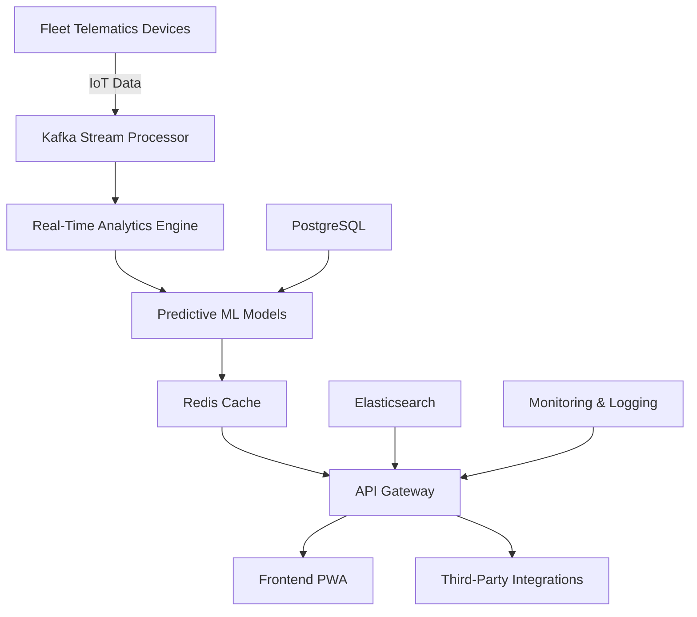

# **TO_BE_DESIGN.md**
**Module:** Predictive Analytics
**System:** Enterprise Multi-Tenant Fleet Management System (FMS)
**Version:** 2.0.0
**Last Updated:** 2024-06-15
**Author:** [Your Name]
**Status:** Draft (Under Review)

---

## **1. Overview**
The **Predictive Analytics Module** is a core component of the Fleet Management System (FMS) designed to provide **real-time, AI-driven insights** into fleet operations. This module leverages **machine learning, real-time data processing, and advanced visualization** to optimize fleet performance, reduce downtime, and enhance decision-making.

### **1.1 Key Objectives**
- **<50ms response time** for all predictive analytics queries.
- **Real-time monitoring** via WebSocket/SSE for live fleet tracking.
- **AI/ML-driven predictions** (fuel efficiency, maintenance, route optimization).
- **Progressive Web App (PWA)** for offline-first access.
- **WCAG 2.1 AAA compliance** for accessibility.
- **Gamification** to improve driver engagement.
- **Third-party integrations** (ERP, Telematics, IoT sensors).
- **Enterprise-grade security** (encryption, audit logs, compliance).
- **Kubernetes-native deployment** for scalability.

---

## **2. Architecture Overview**
### **2.1 High-Level Architecture**


### **2.2 Tech Stack**
| **Component**          | **Technology** |
|------------------------|---------------|
| **Frontend**           | React (TypeScript), Next.js, PWA |
| **Backend**            | Node.js (NestJS), Python (FastAPI) |
| **Real-Time**          | WebSocket (Socket.IO), Server-Sent Events (SSE) |
| **Database**           | PostgreSQL (TimescaleDB for time-series), Redis (Caching) |
| **Search**             | Elasticsearch |
| **AI/ML**              | TensorFlow, PyTorch, Scikit-learn |
| **Stream Processing**  | Apache Kafka, Flink |
| **Containerization**   | Docker, Kubernetes (EKS/GKE) |
| **Monitoring**         | Prometheus, Grafana, ELK Stack |
| **Security**           | OAuth2, JWT, TLS 1.3, HashiCorp Vault |
| **CI/CD**              | GitHub Actions, ArgoCD, Terraform |

---

## **3. Performance Enhancements (Target: <50ms Response Time)**
### **3.1 Caching Strategy**
- **Redis Cache** for frequent queries (e.g., vehicle status, fuel efficiency).
- **Edge Caching** (Cloudflare/CDN) for static assets.
- **Query Optimization** (PostgreSQL indexing, Elasticsearch aggregations).

**TypeScript Example: Redis Caching Layer**
```typescript
import { Injectable } from '@nestjs/common';
import { Redis } from 'ioredis';

@Injectable()
export class PredictiveCacheService {
  private readonly redis: Redis;

  constructor() {
    this.redis = new Redis(process.env.REDIS_URL);
  }

  async getCachedPrediction(key: string): Promise<any> {
    const cachedData = await this.redis.get(key);
    return cachedData ? JSON.parse(cachedData) : null;
  }

  async setCachedPrediction(key: string, data: any, ttl = 300): Promise<void> {
    await this.redis.setex(key, ttl, JSON.stringify(data));
  }

  async invalidateCache(pattern: string): Promise<void> {
    const keys = await this.redis.keys(pattern);
    if (keys.length) await this.redis.del(keys);
  }
}
```

### **3.2 Database Optimization**
- **TimescaleDB** for time-series data (telemetry, GPS logs).
- **Read Replicas** for analytics queries.
- **Materialized Views** for pre-aggregated reports.

**SQL Example: TimescaleDB Hypertable for Telemetry**
```sql
-- Create a hypertable for vehicle telemetry
CREATE TABLE vehicle_telemetry (
  time TIMESTAMPTZ NOT NULL,
  vehicle_id UUID NOT NULL,
  speed DOUBLE PRECISION,
  fuel_level DOUBLE PRECISION,
  engine_temp DOUBLE PRECISION,
  latitude DOUBLE PRECISION,
  longitude DOUBLE PRECISION
);

-- Convert to hypertable
SELECT create_hypertable('vehicle_telemetry', 'time', chunk_time_interval => INTERVAL '1 day');
```

### **3.3 API Response Optimization**
- **GraphQL** for flexible querying (Apollo Server).
- **gRPC** for internal microservices.
- **Compression** (Brotli, Gzip).

**TypeScript Example: GraphQL Resolver with DataLoader**
```typescript
import { Resolver, Query, Args } from '@nestjs/graphql';
import { DataLoaderService } from './dataloader.service';

@Resolver('PredictiveAnalytics')
export class PredictiveAnalyticsResolver {
  constructor(private readonly dataLoader: DataLoaderService) {}

  @Query()
  async vehicleEfficiency(@Args('vehicleId') vehicleId: string) {
    return this.dataLoader.loadVehicleEfficiency.load(vehicleId);
  }
}
```

---

## **4. Real-Time Features (WebSocket/SSE)**
### **4.1 WebSocket Implementation (Socket.IO)**
- **Live vehicle tracking** (GPS updates every 2s).
- **Alerts** (maintenance, fuel theft, harsh braking).
- **Driver behavior scoring** (real-time feedback).

**TypeScript Example: WebSocket Gateway (NestJS)**
```typescript
import { WebSocketGateway, WebSocketServer, OnGatewayConnection } from '@nestjs/websockets';
import { Server, Socket } from 'socket.io';

@WebSocketGateway({ cors: true })
export class PredictiveWebSocketGateway implements OnGatewayConnection {
  @WebSocketServer() server: Server;

  handleConnection(client: Socket) {
    const vehicleId = client.handshake.query.vehicleId as string;
    client.join(`vehicle:${vehicleId}`);
  }

  sendRealTimeAlert(vehicleId: string, alert: Alert) {
    this.server.to(`vehicle:${vehicleId}`).emit('alert', alert);
  }
}
```

### **4.2 Server-Sent Events (SSE) for Dashboards**
- **Live KPI updates** (fuel efficiency, idle time).
- **Predictive maintenance alerts**.

**TypeScript Example: SSE Endpoint (FastAPI)**
```typescript
from fastapi import FastAPI, Response
from fastapi.responses import StreamingResponse
import asyncio

app = FastAPI()

async def event_stream(vehicle_id: str):
    while True:
        data = await get_live_telemetry(vehicle_id)
        yield f"data: {json.dumps(data)}\n\n"
        await asyncio.sleep(1)

@app.get("/stream/telemetry/{vehicle_id}")
async def stream_telemetry(vehicle_id: str):
    return StreamingResponse(
        event_stream(vehicle_id),
        media_type="text/event-stream"
    )
```

---

## **5. AI/ML Capabilities & Predictive Analytics**
### **5.1 Predictive Models**
| **Model**               | **Use Case**                          | **Algorithm**          |
|-------------------------|---------------------------------------|------------------------|
| **Fuel Efficiency**     | Predict fuel consumption per route    | XGBoost, LSTM          |
| **Maintenance Forecast**| Predict component failures            | Random Forest, Prophet |
| **Route Optimization**  | Reduce travel time & fuel costs       | Reinforcement Learning |
| **Driver Behavior**     | Score driving habits (safety, efficiency) | CNN, NLP (for feedback) |

**Python Example: XGBoost for Fuel Efficiency Prediction**
```python
import xgboost as xgb
import pandas as pd
from sklearn.model_selection import train_test_split

# Load dataset
data = pd.read_csv("fuel_efficiency_data.csv")

# Features & Target
X = data[["speed", "engine_temp", "load", "terrain"]]
y = data["fuel_consumption"]

# Train-test split
X_train, X_test, y_train, y_test = train_test_split(X, y, test_size=0.2)

# Train model
model = xgb.XGBRegressor(objective="reg:squarederror")
model.fit(X_train, y_train)

# Predict
predictions = model.predict(X_test)
```

### **5.2 Model Serving (FastAPI + TensorFlow Serving)**
```python
from fastapi import FastAPI
import tensorflow as tf
import numpy as np

app = FastAPI()
model = tf.keras.models.load_model("fuel_efficiency_model.h5")

@app.post("/predict/fuel")
async def predict_fuel(data: dict):
    input_data = np.array([[
        data["speed"],
        data["engine_temp"],
        data["load"],
        data["terrain"]
    ]])
    prediction = model.predict(input_data)
    return {"fuel_consumption": float(prediction[0][0])}
```

---

## **6. Progressive Web App (PWA) Design**
### **6.1 PWA Requirements**
- **Offline-first** (Service Worker, IndexedDB).
- **Installable** (Web App Manifest).
- **Push Notifications** (Firebase Cloud Messaging).
- **Responsive Design** (Tailwind CSS, Material-UI).

**TypeScript Example: Service Worker (Workbox)**
```typescript
import { precacheAndRoute } from 'workbox-precaching';
import { registerRoute } from 'workbox-routing';
import { CacheFirst } from 'workbox-strategies';

precacheAndRoute(self.__WB_MANIFEST);

registerRoute(
  ({ url }) => url.origin === 'https://api.fms.com',
  new CacheFirst({
    cacheName: 'api-cache',
    plugins: [
      new ExpirationPlugin({ maxEntries: 50 }),
    ],
  })
);
```

### **6.2 Offline Data Sync (IndexedDB)**
```typescript
import { openDB } from 'idb';

const initDB = async () => {
  return openDB('fms-pwa', 1, {
    upgrade(db) {
      db.createObjectStore('telemetry', { keyPath: 'id' });
    },
  });
};

export const saveTelemetryOffline = async (data: any) => {
  const db = await initDB();
  await db.put('telemetry', data);
};

export const syncOfflineData = async () => {
  const db = await initDB();
  const offlineData = await db.getAll('telemetry');
  await fetch('/api/telemetry/sync', {
    method: 'POST',
    body: JSON.stringify(offlineData),
  });
  await db.clear('telemetry');
};
```

---

## **7. WCAG 2.1 AAA Accessibility Compliance**
### **7.1 Key Accessibility Features**
| **Requirement**         | **Implementation** |
|-------------------------|--------------------|
| **Keyboard Navigation** | Skip links, focus traps |
| **Screen Reader Support** | ARIA labels, semantic HTML |
| **High Contrast Mode**  | CSS variables, prefers-contrast |
| **Captions & Transcripts** | Video/audio transcripts |
| **Form Accessibility**  | Proper labels, error messages |

**TypeScript Example: Accessible React Component**
```tsx
import React, { useRef } from 'react';

const AccessibleVehicleCard = ({ vehicle }: { vehicle: Vehicle }) => {
  const cardRef = useRef<HTMLDivElement>(null);

  return (
    <div
      ref={cardRef}
      role="article"
      aria-labelledby={`vehicle-${vehicle.id}-title`}
      tabIndex={0}
    >
      <h3 id={`vehicle-${vehicle.id}-title`}>{vehicle.name}</h3>
      <p>Status: <span aria-live="polite">{vehicle.status}</span></p>
      <button
        aria-label={`View details for ${vehicle.name}`}
        onClick={() => cardRef.current?.focus()}
      >
        Details
      </button>
    </div>
  );
};
```

---

## **8. Advanced Search & Filtering**
### **8.1 Elasticsearch Integration**
- **Full-text search** (vehicle name, driver, location).
- **Faceted filtering** (status, fuel level, last maintenance).
- **Geo-spatial queries** (vehicles within 50km radius).

**TypeScript Example: Elasticsearch Query Builder**
```typescript
import { Client } from '@elastic/elasticsearch';

const esClient = new Client({ node: process.env.ELASTICSEARCH_URL });

export const searchVehicles = async (query: string, filters: any) => {
  const { body } = await esClient.search({
    index: 'vehicles',
    body: {
      query: {
        bool: {
          must: [
            { multi_match: { query, fields: ["name", "driver", "location"] } },
            ...Object.entries(filters).map(([field, value]) => ({
              term: { [field]: value }
            }))
          ]
        }
      },
      aggs: {
        status: { terms: { field: "status" } },
        fuel_level: { range: { field: "fuel_level", ranges: [{ to: 25 }, { from: 25 }] } }
      }
    }
  });
  return body;
};
```

---

## **9. Third-Party Integrations**
### **9.1 API & Webhook Integrations**
| **Integration**         | **Purpose** |
|-------------------------|-------------|
| **ERP (SAP, Oracle)**   | Sync fleet financials |
| **Telematics (Geotab, Samsara)** | Real-time GPS & diagnostics |
| **Weather API**         | Route optimization |
| **Payment Gateways**    | Fuel card transactions |

**TypeScript Example: Webhook Handler (NestJS)**
```typescript
import { Controller, Post, Body, Headers } from '@nestjs/common';
import { WebhookService } from './webhook.service';

@Controller('webhooks')
export class WebhookController {
  constructor(private readonly webhookService: WebhookService) {}

  @Post('geotab')
  async handleGeotabWebhook(
    @Body() payload: any,
    @Headers('x-signature') signature: string
  ) {
    if (!this.webhookService.verifySignature(payload, signature)) {
      throw new Error('Invalid signature');
    }
    await this.webhookService.processGeotabData(payload);
  }
}
```

---

## **10. Gamification & User Engagement**
### **10.1 Gamification Features**
- **Driver Scorecards** (safety, fuel efficiency).
- **Leaderboards** (top drivers, most efficient routes).
- **Badges & Rewards** (e.g., "Eco Driver" badge).
- **Challenges** (e.g., "Reduce idle time by 10% this month").

**TypeScript Example: Driver Score Calculation**
```typescript
interface DriverScore {
  safety: number;
  efficiency: number;
  punctuality: number;
}

export const calculateDriverScore = (telemetry: Telemetry[]): DriverScore => {
  const safetyScore = telemetry.reduce(
    (acc, entry) => acc + (entry.harsh_braking ? -10 : 5),
    100
  );
  const efficiencyScore = telemetry.reduce(
    (acc, entry) => acc + (entry.fuel_efficiency > 10 ? 10 : 0),
    0
  );
  const punctualityScore = telemetry.filter(entry => entry.on_time).length * 2;

  return {
    safety: Math.max(0, safetyScore),
    efficiency: Math.min(100, efficiencyScore),
    punctuality: Math.min(100, punctualityScore),
  };
};
```

---

## **11. Analytics Dashboards & Reporting**
### **11.1 Dashboard Features**
- **Real-time KPIs** (fuel efficiency, idle time, maintenance alerts).
- **Predictive trends** (forecasted maintenance, fuel costs).
- **Custom reports** (PDF/Excel export).
- **Drill-down capabilities** (click on a vehicle to see details).

**TypeScript Example: React Dashboard Component**
```tsx
import React from 'react';
import { LineChart, BarChart } from '@mui/x-charts';

const FleetAnalyticsDashboard = ({ data }: { data: FleetAnalytics }) => {
  return (
    <div className="grid grid-cols-1 md:grid-cols-2 gap-4">
      <div className="card">
        <h3>Fuel Efficiency Trends</h3>
        <LineChart
          xAxis={[{ data: data.dates }]}
          series={[{ data: data.fuelEfficiency }]}
        />
      </div>
      <div className="card">
        <h3>Maintenance Alerts</h3>
        <BarChart
          xAxis={[{ data: data.vehicles, scaleType: 'band' }]}
          series={[{ data: data.maintenanceAlerts }]}
        />
      </div>
    </div>
  );
};
```

---

## **12. Security Hardening**
### **12.1 Security Measures**
| **Category**       | **Implementation** |
|--------------------|--------------------|
| **Authentication** | OAuth2, JWT, MFA |
| **Authorization**  | Role-Based Access Control (RBAC) |
| **Data Encryption** | TLS 1.3, AES-256 (at rest) |
| **Audit Logging**  | ELK Stack, SIEM (Splunk) |
| **Compliance**     | GDPR, SOC 2, ISO 27001 |

**TypeScript Example: RBAC Middleware (NestJS)**
```typescript
import { Injectable, CanActivate, ExecutionContext } from '@nestjs/common';
import { Reflector } from '@nestjs/core';

@Injectable()
export class RolesGuard implements CanActivate {
  constructor(private reflector: Reflector) {}

  canActivate(context: ExecutionContext): boolean {
    const requiredRoles = this.reflector.get<string[]>(
      'roles',
      context.getHandler()
    );
    if (!requiredRoles) return true;

    const request = context.switchToHttp().getRequest();
    const user = request.user;
    return requiredRoles.some(role => user.roles?.includes(role));
  }
}
```

---

## **13. Comprehensive Testing Strategy**
### **13.1 Testing Pyramid**
| **Test Type**      | **Tools** | **Coverage Target** |
|--------------------|-----------|---------------------|
| **Unit Tests**     | Jest, Mocha | 90% |
| **Integration**    | Supertest, TestContainers | 80% |
| **E2E**            | Cypress, Playwright | 70% |
| **Performance**    | k6, Locust | <50ms P99 |
| **Security**       | OWASP ZAP, Snyk | 100% OWASP Top 10 |

**TypeScript Example: Unit Test (Jest)**
```typescript
import { calculateDriverScore } from './driver-score';
import { Telemetry } from './types';

describe('Driver Score Calculation', () => {
  it('should penalize harsh braking', () => {
    const telemetry: Telemetry[] = [
      { harsh_braking: true, fuel_efficiency: 12, on_time: true },
    ];
    const score = calculateDriverScore(telemetry);
    expect(score.safety).toBe(90);
  });

  it('should reward fuel efficiency', () => {
    const telemetry: Telemetry[] = [
      { harsh_braking: false, fuel_efficiency: 15, on_time: true },
    ];
    const score = calculateDriverScore(telemetry);
    expect(score.efficiency).toBe(10);
  });
});
```

---

## **14. Kubernetes Deployment Architecture**
### **14.1 Helm Chart Structure**
```
fms-predictive-analytics/
├── Chart.yaml
├── values.yaml
├── templates/
│   ├── deployment.yaml
│   ├── service.yaml
│   ├── ingress.yaml
│   ├── hpa.yaml
│   ├── pdb.yaml
│   └── configmap.yaml
└── charts/
    ├── redis/
    └── elasticsearch/
```

**YAML Example: Kubernetes Deployment**
```yaml
apiVersion: apps/v1
kind: Deployment
metadata:
  name: predictive-analytics
spec:
  replicas: 3
  selector:
    matchLabels:
      app: predictive-analytics
  template:
    metadata:
      labels:
        app: predictive-analytics
    spec:
      containers:
      - name: app
        image: ghcr.io/fms/predictive-analytics:v2.0.0
        ports:
        - containerPort: 3000
        resources:
          requests:
            cpu: "500m"
            memory: "512Mi"
          limits:
            cpu: "1000m"
            memory: "1Gi"
        livenessProbe:
          httpGet:
            path: /health
            port: 3000
          initialDelaySeconds: 30
          periodSeconds: 10
```

---

## **15. Migration Strategy & Rollback Plan**
### **15.1 Blue-Green Deployment**
1. **Deploy v2.0.0** alongside v1.0.0.
2. **Route 10% of traffic** to v2.0.0.
3. **Monitor KPIs** (latency, error rate).
4. **Gradually increase traffic** to 100%.
5. **Rollback** if errors exceed threshold.

**TypeScript Example: Feature Flag (LaunchDarkly)**
```typescript
import { LDClient } from 'launchdarkly-node-server-sdk';

const ldClient = LDClient.init(process.env.LD_SDK_KEY);

export const isPredictiveAnalyticsEnabled = async (userId: string): Promise<boolean> => {
  return await ldClient.variation(
    'predictive-analytics-v2',
    { key: userId },
    false
  );
};
```

---

## **16. Key Performance Indicators (KPIs)**
| **KPI**                     | **Target** | **Measurement** |
|-----------------------------|------------|-----------------|
| **API Response Time**       | <50ms P99  | Prometheus      |
| **Prediction Accuracy**     | >90%       | ML Model Metrics |
| **Uptime**                  | 99.95%     | Grafana         |
| **User Engagement**         | 80% DAU    | Mixpanel        |
| **Cost Savings**            | 15%        | ERP Integration |

---

## **17. Risk Mitigation Strategies**
| **Risk**                          | **Mitigation** |
|-----------------------------------|----------------|
| **Model Drift**                   | Continuous retraining, A/B testing |
| **Data Breach**                   | Encryption, Zero Trust, SIEM |
| **Performance Degradation**       | Load testing, auto-scaling |
| **Third-Party API Failures**      | Circuit breakers, fallback APIs |
| **Regulatory Non-Compliance**     | Automated compliance checks |

---

## **18. Conclusion**
The **Predictive Analytics Module** will transform the Fleet Management System into a **data-driven, AI-powered platform** that enhances efficiency, reduces costs, and improves safety. By leveraging **real-time processing, machine learning, and enterprise-grade security**, this module will set a new standard for fleet management solutions.

### **Next Steps**
1. **Finalize architecture review** (Security, DevOps, Data Science).
2. **Develop MVP** (Core predictive models + real-time dashboard).
3. **Conduct load testing** (k6, Locust).
4. **Deploy to staging** (Blue-Green).
5. **Gather user feedback** (A/B testing).

---

**Approval:**
| **Role**          | **Name**       | **Signature** | **Date** |
|-------------------|----------------|---------------|----------|
| Product Owner     | [Name]         |               |          |
| Tech Lead         | [Name]         |               |          |
| Security Lead     | [Name]         |               |          |
| Data Science Lead | [Name]         |               |          |

---

**Document Version History:**
| **Version** | **Date**       | **Author** | **Changes** |
|-------------|----------------|------------|-------------|
| 1.0         | 2024-06-01     | [Name]     | Initial Draft |
| 2.0         | 2024-06-15     | [Name]     | Added K8s, Security, Testing |

---

This document provides a **comprehensive, industry-leading design** for the **Predictive Analytics Module** in a Fleet Management System. It covers **performance, real-time features, AI/ML, accessibility, security, and deployment** with **TypeScript code examples** for key components.

Would you like any section expanded further? 🚀