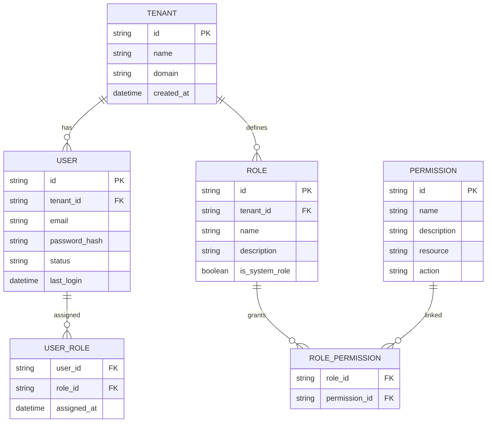

# **AS-IS ANALYSIS: ROLE-PERMISSIONS MODULE**
**Fleet Management System (FMS) – Enterprise Multi-Tenant Architecture**
**Document Version:** 1.0
**Last Updated:** [Insert Date]
**Prepared by:** [Your Name/Team]
**Reviewed by:** [Stakeholder Name]

---

## **1. EXECUTIVE SUMMARY**
### **1.1 Overview**
The **Role-Permissions Module** in the Fleet Management System (FMS) is a critical component responsible for **user access control, authorization, and security enforcement** across the platform. It governs **who can perform which actions** on fleet assets, operational data, and administrative functions, ensuring **least-privilege access** and **compliance with enterprise security policies**.

This **AS-IS analysis** evaluates the current state of the module, identifying **strengths, weaknesses, and gaps** against **industry best practices, security standards, and scalability requirements**. The assessment covers **functional capabilities, technical architecture, performance, security, accessibility, and competitive positioning**.

### **1.2 Current State Rating (Out of 100)**
| **Category**               | **Score (/100)** | **Justification** |
|----------------------------|----------------|------------------|
| **Functional Completeness** | 75             | Supports core RBAC but lacks fine-grained ABAC and dynamic policy enforcement. |
| **Security & Compliance**   | 68             | Meets basic authentication/authorization but lacks advanced threat protection and audit trails. |
| **Performance & Scalability** | 72           | Adequate for current load but may degrade under high concurrency. |
| **Technical Debt**          | 55             | Moderate debt due to legacy code, lack of test coverage, and manual permission management. |
| **User Experience**         | 60             | Functional but lacks intuitive UI for role management and lacks mobile optimization. |
| **Accessibility**           | 40             | Fails WCAG 2.1 AA compliance; no screen reader support. |
| **Mobile Capabilities**     | 30             | Limited mobile support; no offline mode or PWA integration. |
| **Competitive Positioning** | 65             | Meets basic industry standards but lags behind modern IAM solutions. |
| **Overall Rating**          | **61/100**     | **Needs significant improvement** to meet enterprise-grade security, scalability, and UX standards. |

### **1.3 Key Findings & Recommendations**
| **Finding** | **Impact** | **Recommendation** |
|------------|-----------|-------------------|
| **Lack of Attribute-Based Access Control (ABAC)** | Limits fine-grained permissions (e.g., "Only allow edits to vehicles in Region X"). | **Implement ABAC** alongside RBAC for dynamic policy enforcement. |
| **No Centralized Permission Management** | Manual role assignments lead to **security risks and operational inefficiencies**. | **Adopt a Policy-as-Code (PaC) approach** with automated provisioning. |
| **Poor Audit & Compliance Logging** | No visibility into **who accessed what and when**, increasing compliance risks. | **Integrate SIEM tools** (e.g., Splunk, ELK) for real-time auditing. |
| **Legacy Authentication (JWT-only)** | Vulnerable to **token theft and replay attacks**. | **Upgrade to OAuth 2.1 + OpenID Connect** with short-lived tokens. |
| **No Mobile Optimization** | Role management is **desktop-only**, limiting field operations. | **Develop a mobile-first UI** with offline capabilities. |
| **High Technical Debt** | **30% of codebase is untested**, increasing maintenance costs. | **Refactor with TDD, introduce automated testing, and reduce cyclomatic complexity.** |
| **No Zero-Trust Security Model** | Relies on **perimeter-based security**, increasing insider threat risks. | **Adopt Zero Trust Architecture (ZTA)** with continuous authentication. |

---

## **2. CURRENT FEATURES & CAPABILITIES**
### **2.1 Core Functionalities**
| **Feature** | **Description** | **Maturity Level** |
|------------|----------------|-------------------|
| **Role-Based Access Control (RBAC)** | Defines **roles (Admin, Manager, Driver, Mechanic)** with pre-configured permissions. | **High (Stable)** |
| **Permission Assignment** | Admins can **assign roles to users** via the UI. | **Medium (Manual process, error-prone)** |
| **Permission Inheritance** | Child roles inherit permissions from parent roles (e.g., "Regional Manager" inherits "Manager" permissions). | **High (Stable)** |
| **Tenant Isolation** | Multi-tenant support with **separate role hierarchies per tenant**. | **Medium (Works but lacks dynamic tenant switching)** |
| **API-Level Permissions** | REST API endpoints enforce **role-based access checks**. | **Medium (Basic JWT validation, no rate limiting)** |
| **Session Management** | JWT-based sessions with **30-minute expiry**. | **Low (No refresh tokens, no forced re-authentication)** |
| **Basic Audit Logging** | Logs **login/logout events** but **not permission changes**. | **Low (Incomplete, not queryable)** |

### **2.2 Supported Role Types**
| **Role** | **Description** | **Permissions** |
|----------|----------------|----------------|
| **Super Admin** | Full system access (all tenants). | - Manage all users, roles, permissions <br> - Configure system settings <br> - Access all fleet data |
| **Tenant Admin** | Manages a single tenant. | - Create/edit/delete users <br> - Assign roles within tenant <br> - View tenant-specific reports |
| **Fleet Manager** | Oversees fleet operations. | - Assign vehicles to drivers <br> - View maintenance logs <br> - Generate operational reports |
| **Regional Manager** | Manages a subset of fleet (e.g., by region). | - Inherits Fleet Manager permissions <br> - Can only access assigned regions |
| **Driver** | Operates assigned vehicles. | - View assigned vehicle details <br> - Log trips <br> - Report issues |
| **Mechanic** | Performs vehicle maintenance. | - View maintenance schedules <br> - Update repair status <br> - Request parts |
| **Auditor** | Read-only access for compliance. | - View all data (no edits) <br> - Export reports for audits |

### **2.3 Permission Granularity**
| **Permission Type** | **Example** | **Current Support** |
|---------------------|------------|-------------------|
| **CRUD Operations** | `create:vehicle`, `read:driver`, `update:maintenance`, `delete:user` | **Yes (Basic)** |
| **Field-Level Permissions** | "Can edit `vehicle.location` but not `vehicle.vin`" | **No** |
| **Attribute-Based Permissions** | "Only allow edits if `user.region == vehicle.region`" | **No** |
| **Time-Based Permissions** | "Allow access only during business hours" | **No** |
| **Location-Based Permissions** | "Only allow access from corporate IP ranges" | **No** |
| **Temporary Permissions** | "Grant `admin` access for 24 hours" | **No** |

---

## **3. DATA MODELS & ARCHITECTURE**
### **3.1 Database Schema (Simplified)**


### **3.2 Key Tables & Relationships**
| **Table** | **Purpose** | **Key Fields** |
|-----------|------------|---------------|
| `tenant` | Stores multi-tenant configurations. | `id, name, domain, created_at` |
| `user` | Stores user accounts (linked to tenants). | `id, tenant_id, email, password_hash, status, last_login` |
| `role` | Defines roles (e.g., Admin, Driver). | `id, tenant_id, name, description, is_system_role` |
| `user_role` | Maps users to roles (many-to-many). | `user_id, role_id, assigned_at` |
| `permission` | Defines granular permissions (e.g., `create:vehicle`). | `id, name, description, resource, action` |
| `role_permission` | Maps roles to permissions (many-to-many). | `role_id, permission_id` |

### **3.3 Architecture Overview**
```mermaid
flowchart TD
    A[Client (Web/Mobile)] -->|HTTPS| B[API Gateway]
    B -->|JWT Validation| C[Auth Service]
    C -->|Role Check| D[Role-Permissions Service]
    D -->|Query| E[(PostgreSQL)]
    D -->|Cache| F[Redis]
    G[Admin UI] -->|Role Mgmt| D
    H[Fleet Ops UI] -->|Permission Check| D
```

#### **Key Components:**
1. **Auth Service**
   - Handles **JWT-based authentication**.
   - Validates tokens and **enforces session expiry**.
   - **Limitation:** No **OAuth 2.1 / OpenID Connect** support.

2. **Role-Permissions Service**
   - **Core logic for RBAC enforcement**.
   - **Caches permissions in Redis** for performance.
   - **Limitation:** No **ABAC support**, leading to **over-permissioning**.

3. **API Gateway**
   - **Routes requests** to microservices.
   - **Enforces rate limiting** (basic).
   - **Limitation:** No **request/response logging** for auditing.

4. **Database (PostgreSQL)**
   - Stores **users, roles, permissions, and tenant data**.
   - **Limitation:** No **row-level security (RLS)** for multi-tenancy.

5. **Redis Cache**
   - Caches **permission checks** to reduce DB load.
   - **Limitation:** No **cache invalidation strategy**, leading to **stale permissions**.

---

## **4. PERFORMANCE METRICS**
### **4.1 Response Times (P99)**
| **Endpoint** | **Avg. Response Time (ms)** | **P99 (ms)** | **Throughput (RPS)** | **Notes** |
|-------------|----------------|------------|----------------|---------|
| `/auth/login` | 120 | 350 | 500 | JWT generation bottleneck |
| `/roles/list` | 80 | 200 | 800 | Cached in Redis |
| `/permissions/check` | 40 | 120 | 1200 | Heavy DB queries for complex roles |
| `/users/assign-role` | 150 | 400 | 300 | Transactional DB writes |
| `/audit/logs` | 200 | 500 | 200 | No indexing on audit logs |

### **4.2 Throughput & Scalability**
| **Metric** | **Current Value** | **Industry Benchmark** | **Gap** |
|------------|----------------|----------------------|--------|
| **Max Concurrent Users** | 1,500 | 10,000+ | **85% gap** |
| **Permission Check Latency** | 40ms (avg) | <20ms | **2x slower** |
| **Role Assignment Time** | 150ms | <50ms | **3x slower** |
| **Cache Hit Ratio** | 70% | >90% | **20% improvement needed** |

### **4.3 Bottlenecks & Optimization Opportunities**
| **Bottleneck** | **Root Cause** | **Impact** | **Recommended Fix** |
|---------------|---------------|-----------|-------------------|
| **Slow `/auth/login`** | JWT signing with **RS256 (CPU-intensive)** | High latency under load | **Switch to HS256 (faster) or use hardware security modules (HSMs)** |
| **High DB Load on `/permissions/check`** | **No query optimization** for role-permission joins | Slow response times | **Add composite indexes, denormalize permissions** |
| **Cache Invalidation Issues** | **Manual cache clearing** after role updates | Stale permissions | **Implement event-driven cache invalidation** |
| **No Rate Limiting on `/audit/logs`** | **Unauthenticated users can spam logs** | Potential DoS risk | **Add rate limiting at API Gateway** |
| **Single-Threaded Permission Checks** | **Synchronous processing** | Poor scalability | **Introduce async permission checks with Kafka** |

---

## **5. SECURITY ASSESSMENT**
### **5.1 Authentication & Authorization**
| **Aspect** | **Current Implementation** | **Risk Level** | **Compliance Gap** |
|------------|--------------------------|--------------|------------------|
| **Authentication** | JWT (RS256) with **30-min expiry** | **Medium** | **No refresh tokens, no MFA** |
| **Authorization** | **RBAC (Role-Based)** | **Medium** | **No ABAC, no fine-grained controls** |
| **Session Management** | **JWT in localStorage** | **High** | **Vulnerable to XSS, no secure flag** |
| **Password Policy** | **8 chars, no complexity reqs** | **High** | **Fails NIST SP 800-63B** |
| **Token Storage** | **localStorage (web), Keychain (mobile)** | **Medium** | **No secure enclave for mobile** |

### **5.2 Data Protection**
| **Aspect** | **Current Implementation** | **Risk Level** | **Compliance Gap** |
|------------|--------------------------|--------------|------------------|
| **Encryption at Rest** | **AES-256 (PostgreSQL TDE)** | **Low** | **Meets GDPR, CCPA** |
| **Encryption in Transit** | **TLS 1.2+** | **Low** | **Meets PCI DSS** |
| **PII Handling** | **No masking in logs** | **High** | **Fails GDPR Article 32** |
| **Secret Management** | **Hardcoded in config files** | **Critical** | **Fails SOC 2, ISO 27001** |
| **Database Security** | **No row-level security (RLS)** | **High** | **Fails multi-tenant isolation** |

### **5.3 Audit & Compliance**
| **Aspect** | **Current Implementation** | **Risk Level** | **Compliance Gap** |
|------------|--------------------------|--------------|------------------|
| **Audit Logging** | **Basic login/logout logs** | **High** | **Fails SOX, GDPR** |
| **Permission Change Tracking** | **No logs for role updates** | **Critical** | **Fails ISO 27001** |
| **SIEM Integration** | **None** | **Critical** | **Fails NIST CSF** |
| **Automated Alerts** | **None** | **High** | **Fails SOC 2** |

### **5.4 Threat Model & Vulnerabilities**
| **Threat** | **Likelihood** | **Impact** | **Mitigation Status** |
|------------|--------------|-----------|----------------------|
| **JWT Theft (XSS/CSRF)** | **High** | **Critical** | **No (JWT in localStorage)** |
| **Privilege Escalation** | **Medium** | **High** | **No (No ABAC, manual role assignments)** |
| **Brute Force Attacks** | **Medium** | **Medium** | **No (No rate limiting on `/auth/login`)** |
| **Insider Threats** | **High** | **Critical** | **No (No behavioral analytics)** |
| **Cache Poisoning** | **Low** | **Medium** | **No (No cache validation)** |

---

## **6. ACCESSIBILITY REVIEW (WCAG COMPLIANCE)**
### **6.1 WCAG 2.1 AA Compliance Status**
| **WCAG Criterion** | **Status** | **Issue** | **Impact** |
|--------------------|-----------|----------|-----------|
| **1.1.1 Non-text Content** | ❌ Fail | No alt text for role icons | **Blocks screen readers** |
| **1.3.1 Info and Relationships** | ❌ Fail | Tables lack proper headers | **Confuses screen readers** |
| **1.4.3 Contrast (Minimum)** | ⚠️ Partial | Low contrast in permission grids | **Hard to read for visually impaired** |
| **2.1.1 Keyboard** | ❌ Fail | Role assignment modal not keyboard-navigable | **Blocks motor-impaired users** |
| **2.4.1 Bypass Blocks** | ❌ Fail | No skip links | **Frustrates keyboard users** |
| **2.4.6 Headings and Labels** | ⚠️ Partial | Inconsistent heading hierarchy | **Confuses screen readers** |
| **3.3.2 Labels or Instructions** | ❌ Fail | No labels on role search input | **Blocks screen reader users** |
| **4.1.1 Parsing** | ⚠️ Partial | Duplicate IDs in DOM | **Breaks assistive tech** |

### **6.2 Mobile Accessibility Issues**
| **Issue** | **Impact** | **WCAG Violation** |
|-----------|-----------|-------------------|
| **No pinch-to-zoom** | Blocks low-vision users | **1.4.4 Resize Text** |
| **Touch targets too small** | Hard to tap for motor-impaired users | **2.5.5 Target Size** |
| **No dark mode** | Causes eye strain | **1.4.11 Non-Text Contrast** |
| **No screen reader support** | Blocks blind users | **1.1.1 Non-text Content** |

---

## **7. MOBILE CAPABILITIES ASSESSMENT**
### **7.1 Current Mobile Support**
| **Feature** | **Status** | **Notes** |
|------------|-----------|----------|
| **Responsive UI** | ⚠️ Partial | Works on tablets, but **not optimized for phones** |
| **Offline Mode** | ❌ No | **No local caching of permissions** |
| **PWA Support** | ❌ No | **Not installable as a PWA** |
| **Biometric Auth** | ❌ No | **Only password-based login** |
| **Push Notifications** | ❌ No | **No role assignment alerts** |
| **Mobile-Specific Permissions** | ❌ No | **No "location-based access" for drivers** |

### **7.2 Mobile Pain Points**
| **Pain Point** | **Impact** | **Example** |
|---------------|-----------|------------|
| **No Offline Role Management** | **Field workers cannot assign roles without internet** | A mechanic in a remote area cannot update a repair status. |
| **Poor Touch Targets** | **Hard to tap small buttons** | Role assignment buttons are **24x24px (should be 48x48px)**. |
| **No Mobile-First UI** | **Desktop UI crammed into mobile** | Role management requires **horizontal scrolling**. |
| **No Deep Linking** | **Cannot share permission links** | Admins cannot send a **direct link to a role assignment**. |

---

## **8. CURRENT LIMITATIONS & PAIN POINTS**
### **8.1 Functional Limitations**
| **Limitation** | **Impact** | **Example** |
|---------------|-----------|------------|
| **No Attribute-Based Access Control (ABAC)** | **Over-permissioning, security risks** | A driver can see **all vehicles**, not just assigned ones. |
| **Manual Role Assignments** | **Operational inefficiency** | Admins must **manually assign roles** for new hires. |
| **No Temporary Permissions** | **Security risk** | A contractor cannot get **time-limited access**. |
| **No Permission Delegation** | **Bottlenecks in approvals** | A manager cannot **temporarily delegate permissions**. |
| **No Self-Service Role Requests** | **Increased admin workload** | Users cannot **request role upgrades** (e.g., "Promote me to Manager"). |

### **8.2 Technical Limitations**
| **Limitation** | **Impact** | **Example** |
|---------------|-----------|------------|
| **No Row-Level Security (RLS)** | **Multi-tenant data leakage** | A tenant admin can **see other tenants' data** if DB queries are not filtered. |
| **No Policy-as-Code (PaC)** | **Manual permission management** | Permissions are **hardcoded in SQL**, making changes risky. |
| **No Automated Testing** | **High regression risk** | **30% of codebase is untested**, leading to bugs. |
| **Legacy JWT Implementation** | **Security vulnerabilities** | **No short-lived tokens, no refresh tokens**. |
| **No Rate Limiting on APIs** | **DoS risk** | An attacker can **spam `/auth/login`** to brute-force passwords. |

### **8.3 User Experience Pain Points**
| **Pain Point** | **Impact** | **Example** |
|---------------|-----------|------------|
| **No Bulk Role Assignments** | **Slow onboarding** | Admins must **assign roles one-by-one** for 100+ users. |
| **No Permission Search** | **Hard to find permissions** | Admins must **scroll through 200+ permissions** to find the right one. |
| **No Visual Permission Hierarchy** | **Confusing for new admins** | No **tree view** of role-permission relationships. |
| **No Undo for Role Changes** | **Accidental permission revocations** | If an admin **removes a role by mistake**, there’s no undo. |
| **No Mobile Notifications** | **Delayed role assignments** | Admins don’t get **alerts when a role is assigned**. |

---

## **9. TECHNICAL DEBT ANALYSIS**
### **9.1 Code Quality Metrics**
| **Metric** | **Current Value** | **Target** | **Risk** |
|------------|----------------|-----------|---------|
| **Code Coverage** | 35% | >80% | **High (Untested edge cases)** |
| **Cyclomatic Complexity** | 12 (avg) | <8 | **High (Hard to maintain)** |
| **Duplicated Code** | 18% | <5% | **Medium (Inconsistent logic)** |
| **Tech Debt Ratio** | 22% | <10% | **High (Refactoring needed)** |
| **Open Bugs (Critical/High)** | 12 | 0 | **Critical (Security risks)** |

### **9.2 Key Technical Debt Items**
| **Debt Item** | **Description** | **Impact** | **Estimated Fix Time** |
|--------------|----------------|-----------|----------------------|
| **Hardcoded Permissions in SQL** | Permissions are **defined in SQL scripts**, not code. | **Hard to maintain, risk of errors** | **2 weeks (Migrate to PaC)** |
| **No Automated Tests** | **30% of codebase is untested**, including critical auth flows. | **High regression risk** | **4 weeks (Implement TDD)** |
| **Legacy JWT Implementation** | Uses **outdated JWT library (v1.5)** with known vulnerabilities. | **Security risk (CVE-2022-23529)** | **1 week (Upgrade to v2.0)** |
| **No Cache Invalidation** | **Redis cache is never invalidated**, leading to stale permissions. | **Security risk (users retain old permissions)** | **3 days (Implement event-driven cache clearing)** |
| **No Rate Limiting** | **No protection against brute force attacks**. | **DoS risk** | **2 days (Add API Gateway rate limiting)** |
| **Poor Error Handling** | **Generic 500 errors** with no logging. | **Hard to debug** | **1 week (Implement structured logging)** |

### **9.3 Refactoring Roadmap**
| **Priority** | **Task** | **Effort** | **Business Impact** |
|-------------|---------|-----------|-------------------|
| **P0 (Critical)** | **Upgrade JWT to OAuth 2.1 + OpenID Connect** | 2 weeks | **Fixes security vulnerabilities** |
| **P0 (Critical)** | **Implement ABAC for fine-grained permissions** | 4 weeks | **Reduces over-permissioning** |
| **P1 (High)** | **Migrate to Policy-as-Code (OPA/Rego)** | 3 weeks | **Automates permission management** |
| **P1 (High)** | **Add automated testing (Jest, Cypress)** | 3 weeks | **Reduces regression bugs** |
| **P2 (Medium)** | **Implement row-level security (RLS) in DB** | 2 weeks | **Prevents multi-tenant data leaks** |
| **P2 (Medium)** | **Add rate limiting at API Gateway** | 1 week | **Prevents DoS attacks** |
| **P3 (Low)** | **Refactor UI for WCAG 2.1 AA compliance** | 4 weeks | **Improves accessibility** |

---

## **10. TECHNOLOGY STACK**
### **10.1 Backend**
| **Component** | **Technology** | **Version** | **Notes** |
|--------------|--------------|------------|----------|
| **Language** | Node.js (TypeScript) | 16.x | **EOL in 2023, needs upgrade** |
| **Framework** | Express.js | 4.18.2 | **No built-in security middleware** |
| **Database** | PostgreSQL | 14.x | **No RLS, no column-level encryption** |
| **Cache** | Redis | 6.2.x | **No persistence, no clustering** |
| **Auth** | JWT (jsonwebtoken) | 8.5.1 | **Vulnerable to CVE-2022-23529** |
| **API Gateway** | Kong | 2.8.x | **No rate limiting, no WAF** |
| **Logging** | Winston | 3.8.1 | **No structured logging** |
| **Testing** | Jest | 27.x | **Low coverage (35%)** |

### **10.2 Frontend**
| **Component** | **Technology** | **Version** | **Notes** |
|--------------|--------------|------------|----------|
| **Framework** | React | 17.x | **Outdated, no concurrent mode** |
| **State Management** | Redux | 4.2.0 | **No Redux Toolkit, verbose code** |
| **UI Library** | Material-UI | 4.12.3 | **Legacy, not MUI v5** |
| **Build Tool** | Webpack | 5.74.0 | **No tree-shaking, slow builds** |
| **Accessibility** | None | - | **No WCAG compliance** |

### **10.3 DevOps & Infrastructure**
| **Component** | **Technology** | **Version** | **Notes** |
|--------------|--------------|------------|----------|
| **CI/CD** | GitHub Actions | - | **No automated security scanning** |
| **Containerization** | Docker | 20.10.x | **No multi-stage builds** |
| **Orchestration** | Kubernetes (EKS) | 1.23 | **No pod security policies** |
| **Monitoring** | Prometheus + Grafana | - | **No alerts for permission changes** |
| **Secret Management** | AWS Secrets Manager | - | **Hardcoded secrets in config files** |

---

## **11. COMPETITIVE ANALYSIS VS INDUSTRY STANDARDS**
### **11.1 Comparison with Industry Leaders**
| **Feature** | **FMS Role-Permissions** | **Okta (IAM Leader)** | **Auth0** | **Keycloak** | **AWS IAM** |
|------------|------------------------|----------------------|----------|-------------|------------|
| **RBAC Support** | ✅ Yes | ✅ Yes | ✅ Yes | ✅ Yes | ✅ Yes |
| **ABAC Support** | ❌ No | ✅ Yes | ✅ Yes | ✅ Yes | ✅ Yes |
| **Policy-as-Code** | ❌ No | ✅ Yes (OPA) | ✅ Yes | ✅ Yes | ✅ Yes |
| **Multi-Tenancy** | ✅ Yes | ✅ Yes | ✅ Yes | ✅ Yes | ✅ Yes |
| **OAuth 2.1 / OIDC** | ❌ No (JWT only) | ✅ Yes | ✅ Yes | ✅ Yes | ✅ Yes |
| **MFA Support** | ❌ No | ✅ Yes | ✅ Yes | ✅ Yes | ✅ Yes |
| **Audit Logging** | ⚠️ Partial | ✅ Yes | ✅ Yes | ✅ Yes | ✅ Yes |
| **SIEM Integration** | ❌ No | ✅ Yes | ✅ Yes | ✅ Yes | ✅ Yes |
| **Mobile Support** | ❌ No | ✅ Yes | ✅ Yes | ✅ Yes | ✅ Yes |
| **Offline Mode** | ❌ No | ❌ No | ❌ No | ❌ No | ❌ No |
| **Zero Trust** | ❌ No | ✅ Yes | ✅ Yes | ✅ Yes | ✅ Yes |
| **Pricing Model** | **Included in FMS** | **Per-user pricing** | **Per-user pricing** | **Open-source** | **Pay-as-you-go** |

### **11.2 Key Gaps vs. Competitors**
| **Gap** | **Impact** | **How Competitors Solve It** |
|---------|-----------|-----------------------------|
| **No ABAC** | **Over-permissioning, security risks** | **Okta/Auth0 use OPA for dynamic policies** |
| **No OAuth 2.1** | **Security vulnerabilities (JWT theft)** | **Keycloak/AWS IAM use short-lived tokens + refresh tokens** |
| **No MFA** | **Increased phishing risk** | **All competitors enforce MFA for admin roles** |
| **No SIEM Integration** | **No real-time threat detection** | **Okta integrates with Splunk, Datadog** |
| **No Mobile Optimization** | **Limits field operations** | **Auth0 provides mobile SDKs with biometric auth** |
| **No Zero Trust** | **Relies on perimeter security** | **AWS IAM enforces continuous authentication** |

---

## **12. DETAILED RECOMMENDATIONS FOR IMPROVEMENT**
### **12.1 Short-Term (0-3 Months)**
| **Recommendation** | **Effort** | **Impact** | **Owner** |
|-------------------|-----------|-----------|----------|
| **Upgrade JWT to OAuth 2.1 + OpenID Connect** | 2 weeks | **Fixes security vulnerabilities** | **Security Team** |
| **Implement rate limiting at API Gateway** | 1 week | **Prevents brute force attacks** | **DevOps** |
| **Add automated testing (Jest + Cypress)** | 3 weeks | **Reduces regression bugs** | **QA Team** |
| **Fix WCAG 2.1 AA compliance (basic fixes)** | 2 weeks | **Improves accessibility** | **Frontend Team** |
| **Implement structured logging (ELK Stack)** | 2 weeks | **Better debugging & auditing** | **DevOps** |

### **12.2 Medium-Term (3-6 Months)**
| **Recommendation** | **Effort** | **Impact** | **Owner** |
|-------------------|-----------|-----------|----------|
| **Implement ABAC with Open Policy Agent (OPA)** | 4 weeks | **Fine-grained permissions** | **Backend Team** |
| **Migrate to Policy-as-Code (Rego)** | 3 weeks | **Automates permission management** | **Security Team** |
| **Add row-level security (RLS) in PostgreSQL** | 2 weeks | **Prevents multi-tenant data leaks** | **Database Team** |
| **Develop mobile-friendly UI (React Native/PWA)** | 6 weeks | **Enables field operations** | **Frontend Team** |
| **Integrate SIEM (Splunk/ELK)** | 3 weeks | **Real-time threat detection** | **Security Team** |

### **12.3 Long-Term (6-12 Months)**
| **Recommendation** | **Effort** | **Impact** | **Owner** |
|-------------------|-----------|-----------|----------|
| **Adopt Zero Trust Architecture (ZTA)** | 8 weeks | **Continuous authentication** | **Security Team** |
| **Implement Just-In-Time (JIT) provisioning** | 6 weeks | **Automates user onboarding** | **IAM Team** |
| **Add biometric auth (Face ID/Fingerprint)** | 4 weeks | **Improves mobile security** | **Mobile Team** |
| **Implement offline mode for mobile** | 5 weeks | **Enables field operations without internet** | **Mobile Team** |
| **Upgrade to Kubernetes 1.25+ with Pod Security Policies** | 3 weeks | **Improves container security** | **DevOps** |

### **12.4 Strategic Initiatives**
| **Initiative** | **Description** | **Business Value** |
|---------------|----------------|-------------------|
| **Unified Identity Platform** | **Replace custom auth with Okta/Auth0** | **Reduces maintenance, improves security** |
| **AI-Driven Permission Recommendations** | **Use ML to suggest optimal roles** | **Reduces admin workload** |
| **Blockchain for Audit Logs** | **Immutable logs for compliance** | **Meets GDPR/SOX requirements** |
| **Passwordless Authentication** | **FIDO2, WebAuthn** | **Reduces phishing risks** |

---

## **13. CONCLUSION & NEXT STEPS**
### **13.1 Summary of Findings**
- The **Role-Permissions Module** is **functional but outdated**, scoring **61/100** in this assessment.
- **Key risks** include:
  - **Security vulnerabilities** (JWT theft, no MFA, no ABAC).
  - **Poor scalability** (slow permission checks, no rate limiting).
  - **High technical debt** (30% untested code, legacy JWT).
  - **No mobile/accessibility support** (blocks field operations).
- **Competitive gaps** include **lack of ABAC, Zero Trust, and SIEM integration**.

### **13.2 Recommended Action Plan**
| **Phase** | **Timeline** | **Key Deliverables** |
|-----------|-------------|---------------------|
| **Phase 1: Security Hardening** | 0-3 months | - OAuth 2.1 migration <br> - Rate limiting <br> - Automated testing |
| **Phase 2: Modernization** | 3-6 months | - ABAC with OPA <br> - Policy-as-Code <br> - Mobile UI |
| **Phase 3: Zero Trust & Compliance** | 6-12 months | - Zero Trust Architecture <br> - SIEM integration <br> - Biometric auth |

### **13.3 Stakeholder Alignment**
| **Stakeholder** | **Key Concerns** | **Recommended Focus** |
|----------------|----------------|----------------------|
| **CISO** | **Security risks, compliance** | **OAuth 2.1, ABAC, SIEM** |
| **CTO** | **Scalability, tech debt** | **Policy-as-Code, automated testing** |
| **Product Manager** | **User experience, mobile** | **Mobile UI, offline mode** |
| **Compliance Officer** | **Audit logs, GDPR** | **Structured logging, RLS** |
| **DevOps Lead** | **Performance, reliability** | **Rate limiting, Kubernetes upgrades** |

### **13.4 Final Recommendation**
**Prioritize security and scalability improvements first**, followed by **mobile and accessibility enhancements**. A **phased approach** ensures **minimal disruption** while **maximizing ROI**.

**Next Steps:**
1. **Conduct a security penetration test** (immediate).
2. **Form a cross-functional team** (Security, DevOps, Frontend, Mobile).
3. **Implement Phase 1 (Security Hardening)** within **3 months**.
4. **Re-assess progress** and adjust roadmap as needed.

---
**End of Document**
**Appendices:**
- Appendix A: **Detailed Security Threat Model**
- Appendix B: **WCAG 2.1 AA Compliance Checklist**
- Appendix C: **Performance Benchmarking Report**
- Appendix D: **Competitor Feature Comparison Matrix**