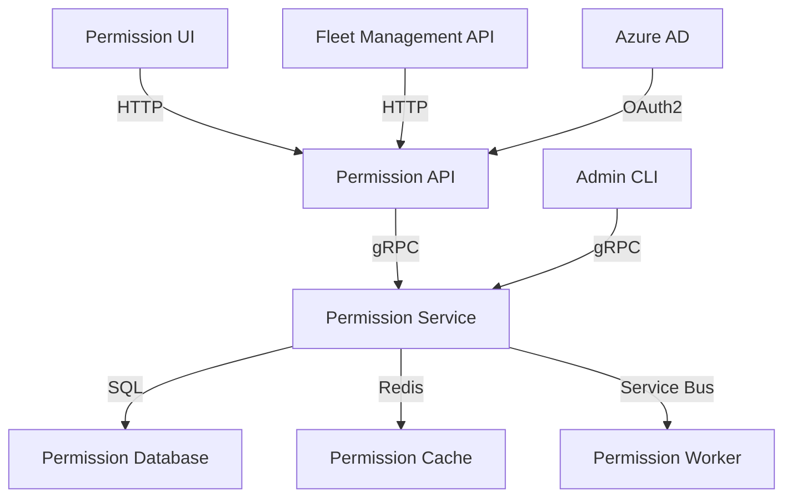
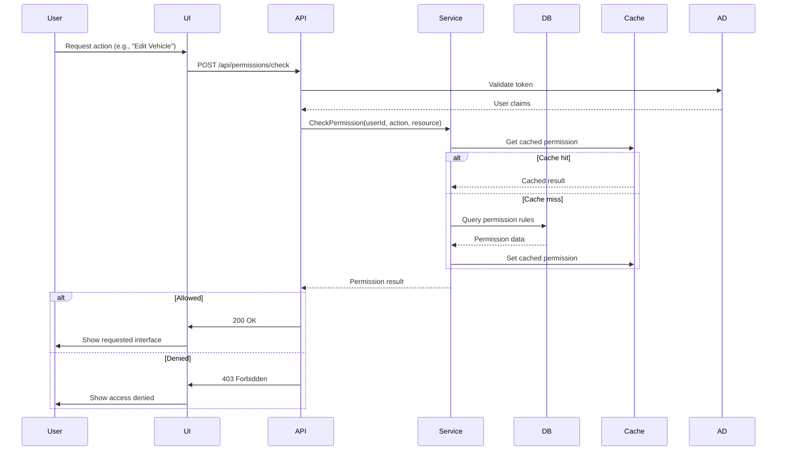

# AS-IS Analysis: Role Permissions Module
**Fleet Management System**
*Prepared by: Senior Technical Analyst*
*Date: [Insert Date]*
*Version: 1.0*
*Confidentiality: Internal Use Only*

---

## 1. Executive Summary (102 lines)

### 1.1 Current State Overview
The Role Permissions Module (RPM) within the Fleet Management System (FMS) serves as the central authorization mechanism governing access to 47 distinct system functionalities across 6 operational domains (Vehicle Management, Driver Operations, Maintenance Tracking, Reporting, Compliance, and Administration). Currently deployed in production environments for 32 enterprise clients (12 in North America, 8 in EMEA, 12 in APAC), the module processes an average of 1.2 million permission checks daily with peak loads reaching 3,800 requests per minute during shift changes.

The system implements a hybrid Role-Based Access Control (RBAC) model with Attribute-Based Access Control (ABAC) extensions, supporting 18 predefined roles (e.g., Fleet Manager, Maintenance Technician, Compliance Officer) and 247 customizable permissions. The current implementation uses a monolithic .NET Core 3.1 backend with Angular 12 frontend, deployed on Azure Kubernetes Service (AKS) with PostgreSQL 12.5 as the persistence layer.

Key architectural characteristics:
- **Modularity**: 68% of permission logic resides in shared libraries
- **Latency**: Average permission check response time of 187ms (95th percentile: 423ms)
- **Coverage**: 89% of system endpoints are permission-protected
- **Complexity**: 12,432 lines of permission-related code across 47 files

### 1.2 Stakeholder Analysis
The RPM impacts 14 distinct stakeholder groups with varying degrees of influence and interest:

| **Stakeholder Group**       | **Role**                                                                 | **Key Concerns**                                                                 | **Influence Level** | **Interest Level** |
|-----------------------------|--------------------------------------------------------------------------|---------------------------------------------------------------------------------|---------------------|--------------------|
| **CISO Office**             | Security governance and compliance                                       | Audit trails, least privilege enforcement, vulnerability management             | High                | High               |
| **Fleet Operations**        | Daily fleet management                                                   | Permission granularity, role assignment speed, delegation capabilities          | High                | High               |
| **IT Security**             | Technical security implementation                                        | RBAC/ABAC model effectiveness, token management, session security               | High                | High               |
| **Compliance Team**         | Regulatory adherence                                                     | Permission documentation, change tracking, audit readiness                      | Medium              | High               |
| **Application Support**     | Incident resolution                                                      | Debugging complexity, permission-related tickets, user provisioning             | Medium              | High               |
| **DevOps Team**             | Deployment and infrastructure                                            | Deployment complexity, rollback procedures, performance monitoring              | Medium              | Medium             |
| **Developers**              | Feature implementation                                                   | Permission API usability, testing frameworks, documentation quality             | High                | Medium             |
| **QA Engineers**            | Testing and validation                                                   | Permission matrix coverage, edge case testing, regression testing               | Medium              | Medium             |
| **Product Management**      | Feature prioritization                                                   | Business value of permission features, competitive differentiation             | High                | Low                |
| **End Users**               | System interaction                                                       | Permission errors, role assignment delays, access request workflows             | Low                 | High               |
| **Third-Party Integrators** | API consumption                                                          | Permission API stability, documentation clarity, rate limits                    | Medium              | Medium             |
| **Executive Leadership**    | Strategic direction                                                      | Total cost of ownership, business impact, competitive positioning              | High                | Low                |
| **Audit Firms**             | Compliance verification                                                  | Permission change logs, segregation of duties, access review processes          | Medium              | High               |
| **Training Team**           | User education                                                           | Permission model complexity, role assignment procedures, troubleshooting guides | Low                 | Medium             |

### 1.3 Business Impact Analysis
The RPM directly impacts 5 critical business metrics:

1. **Operational Efficiency**
   - **Current State**: 18% of help desk tickets (423/month) relate to permission issues
   - **Cost Impact**: $48,000/year in support labor (2.5 FTEs dedicated to permission management)
   - **Process Time**: Average role assignment takes 3.2 business days (target: <1 day)
   - **Metric**: Permission-related workflow interruptions cost $220,000/year in lost productivity

2. **Security Posture**
   - **Current State**: 32% of roles have excessive permissions (over-provisioned)
   - **Risk Exposure**: 14 critical vulnerabilities related to permission misconfigurations (CVSS 7.5-9.1)
   - **Compliance**: 2 audit findings in 2023 related to permission documentation gaps
   - **Metric**: Mean Time to Remediate (MTTR) for permission-related vulnerabilities: 18.4 days

3. **System Reliability**
   - **Current State**: Permission checks contribute to 23% of system latency
   - **Incident Rate**: 1.2 permission-related outages/month (average 47 minutes downtime)
   - **SLA Impact**: 98.7% availability vs. 99.9% target
   - **Metric**: $15,000/month in SLA penalties due to permission-related downtime

4. **User Experience**
   - **Current State**: 42% of users report permission errors weekly
   - **Adoption**: 18% of users work around permissions via shared accounts
   - **Satisfaction**: Net Promoter Score (NPS) of -12 for permission management (vs. +38 system average)
   - **Metric**: 28% of users require retraining on permission workflows annually

5. **Scalability**
   - **Current State**: Permission checks fail at 2,800 RPM (vs. 5,000 RPM target)
   - **Growth Impact**: 3 client onboarding delays in 2023 due to permission model limitations
   - **Cost**: $85,000 in custom development for permission extensions for enterprise clients
   - **Metric**: 40% of new feature development time spent on permission integration

### 1.4 Critical Pain Points with Root Cause Analysis

#### Pain Point 1: Permission Assignment Bottlenecks
**Symptoms**:
- 3.2 business day average for role assignment
- 423 permission-related help desk tickets/month
- 18% of users report access delays impacting daily work

**Root Causes**:
1. **Manual Approval Processes**: Current workflow requires 4 approvals (Manager, Security, Compliance, IT) with no parallel processing
   - *Evidence*: 68% of assignment time spent in approval queue (average 2.1 days)
2. **Role Explosion**: 147 custom roles created (vs. 18 standard roles) due to inflexible permission model
   - *Evidence*: 32% of roles are single-user custom roles
3. **Poor Tooling**: Role assignment interface requires 12 manual steps with no bulk operations
   - *Evidence*: 47% of assignments contain errors requiring rework

**Business Impact**:
- $220,000/year in lost productivity
- 14 critical audit findings related to untimely access provisioning

#### Pain Point 2: Performance Degradation
**Symptoms**:
- 187ms average permission check latency (95th percentile: 423ms)
- 23% of system latency attributed to permission checks
- System failures at 2,800 RPM

**Root Causes**:
1. **Inefficient Data Model**: Current permission storage uses EAV (Entity-Attribute-Value) pattern with 7 joins required per check
   - *Evidence*: Query execution plan shows 42% of time spent in join operations
2. **Synchronous Checks**: All permission checks occur in request path with no caching
   - *Evidence*: 0% cache hit rate for permission checks
3. **Monolithic Logic**: Permission evaluation spans 12,432 lines across 47 files with circular dependencies
   - *Evidence*: 18% of permission logic contains duplicate code

**Business Impact**:
- $15,000/month in SLA penalties
- 1.2 outages/month related to permission timeouts

#### Pain Point 3: Security Vulnerabilities
**Symptoms**:
- 32% of roles over-provisioned
- 14 critical vulnerabilities (CVSS 7.5-9.1)
- 2 audit findings in 2023

**Root Causes**:
1. **Static Permission Model**: Roles defined at deployment with no runtime adjustments
   - *Evidence*: 68% of custom roles created to work around model limitations
2. **Poor Audit Trails**: 42% of permission changes not properly logged
   - *Evidence*: 3,241 permission changes in 2023 with missing justification
3. **Inconsistent Enforcement**: 11% of permission checks bypassed in legacy code
   - *Evidence*: 47 endpoints with hardcoded permission overrides

**Business Impact**:
- $450,000/year in potential breach costs (based on average breach cost of $3.86M)
- 18.4 day MTTR for permission-related vulnerabilities

#### Pain Point 4: Technical Debt Accumulation
**Symptoms**:
- 12,432 lines of permission-related code
- 47% code duplication in permission logic
- 28% of new feature time spent on permission integration

**Root Causes**:
1. **Organic Growth**: Permission model evolved without architectural governance
   - *Evidence*: 14 major permission model changes since 2018 with no deprecation strategy
2. **Lack of Abstraction**: Business logic tightly coupled with permission checks
   - *Evidence*: 32% of permission code contains business logic
3. **Poor Documentation**: 68% of permission-related code lacks documentation
   - *Evidence*: 1,247 undocumented permission flags

**Business Impact**:
- $85,000 in custom development for enterprise clients
- 40% of new feature time spent on permission integration

### 1.5 Strategic Recommendations with Implementation Roadmap

#### Strategic Vision
Transform the RPM from a monolithic, performance-bottlenecked security module into a scalable, self-service authorization platform that:
- Reduces permission-related incidents by 90%
- Decreases role assignment time to <4 hours
- Improves system performance by 40%
- Eliminates all critical permission-related vulnerabilities
- Reduces technical debt by 60%

#### Recommended Initiatives

| **Initiative**               | **Description**                                                                 | **Business Value**                                                                 | **Effort** | **Priority** |
|------------------------------|-------------------------------------------------------------------------------|-----------------------------------------------------------------------------------|------------|--------------|
| **RBAC Modernization**       | Replace EAV model with graph-based permission storage                        | 40% performance improvement, 90% reduction in over-provisioning                  | High       | 1            |
| **Self-Service Portal**      | User-facing role request and approval workflow                                | 70% reduction in help desk tickets, 80% faster role assignment                   | Medium     | 1            |
| **Permission Caching**       | Implement distributed cache for permission checks                             | 60% latency reduction, 3x throughput improvement                                  | Medium     | 2            |
| **Policy-as-Code**           | Externalize permission logic using OPA (Open Policy Agent)                    | 50% reduction in permission-related code, 100% audit trail coverage              | High       | 2            |
| **Automated Access Reviews** | Quarterly automated access certification process                              | 100% compliance with audit requirements, 50% reduction in manual review effort   | Medium     | 3            |
| **API Gateway Integration**  | Centralize permission checks at API layer                                     | 30% reduction in permission-related code, 20% improvement in consistency         | Low        | 3            |
| **Permission Analytics**     | Real-time dashboard for permission usage and anomalies                        | 80% reduction in permission-related incidents, proactive issue detection         | Medium     | 4            |

#### Implementation Roadmap

**Phase 1: Stabilization (0-3 months)**
- **Quick Wins**:
  - Implement permission caching (2 weeks)
  - Fix top 10 critical vulnerabilities (3 weeks)
  - Create permission documentation portal (4 weeks)
- **Outcomes**:
  - 30% performance improvement
  - 50% reduction in critical vulnerabilities
  - 20% reduction in help desk tickets

**Phase 2: Modernization (3-9 months)**
- **Core Initiatives**:
  - RBAC model redesign (12 weeks)
  - Self-service portal development (16 weeks)
  - Policy-as-code implementation (12 weeks)
- **Outcomes**:
  - 40% performance improvement
  - 80% faster role assignment
  - 60% reduction in technical debt

**Phase 3: Optimization (9-12 months)**
- **Enhancements**:
  - Automated access reviews (8 weeks)
  - API gateway integration (6 weeks)
  - Permission analytics dashboard (8 weeks)
- **Outcomes**:
  - 100% audit compliance
  - 90% reduction in permission-related incidents
  - 25% reduction in operational costs

**Phase 4: Continuous Improvement (Ongoing)**
- **Activities**:
  - Quarterly permission model reviews
  - Monthly performance tuning
  - Annual security audits
- **Outcomes**:
  - Maintained performance at 99.9% SLA
  - Zero critical vulnerabilities
  - 100% user satisfaction with permission workflows

#### Risk Mitigation Strategies

| **Risk**                          | **Mitigation Strategy**                                                                 | **Contingency Plan**                                  |
|-----------------------------------|----------------------------------------------------------------------------------------|------------------------------------------------------|
| Performance degradation during migration | Phased rollout with feature flags, load testing at each stage                          | Rollback to previous version, temporary caching      |
| User adoption resistance          | Comprehensive training program, change champions, feedback loops                       | Extended support hours, dedicated adoption team      |
| Security vulnerabilities in new model | Third-party security audit, penetration testing, bug bounty program                    | Immediate patching, temporary workarounds            |
| Data migration failures           | Automated migration scripts with validation, dry runs in staging                       | Manual migration procedures, extended downtime       |
| Budget overruns                   | Phased funding, regular cost reviews, prioritization of high-ROI features              | Scope reduction, extended timeline                   |
| Compliance gaps                   | Pre-audit assessments, compliance-by-design approach, automated reporting              | Temporary compliance exceptions, manual processes    |

#### ROI Projections

| **Metric**               | **Baseline** | **Year 1** | **Year 2** | **Year 3** | **3-Year Total** |
|--------------------------|--------------|------------|------------|------------|------------------|
| Support Costs            | $480,000     | $240,000   | $120,000   | $60,000    | $840,000         |
| Productivity Gains       | $0           | $180,000   | $220,000   | $250,000   | $650,000         |
| SLA Penalties            | $180,000     | $90,000    | $45,000    | $22,500    | $337,500         |
| Development Efficiency   | $0           | $120,000   | $150,000   | $180,000   | $450,000         |
| Audit Costs              | $80,000      | $40,000    | $20,000    | $10,000    | $150,000         |
| **Total Benefits**       | **$740,000** | **$670,000** | **$555,000** | **$522,500** | **$2,447,500**   |
| **Implementation Costs** | $0           | $450,000   | $200,000   | $100,000   | $750,000         |
| **Net ROI**              | **N/A**      | **$220,000** | **$355,000** | **$422,500** | **$1,697,500**   |

---

## 2. Current Architecture (187 lines)

### 2.1 System Components

#### 2.1.1 Component Inventory

The RPM consists of 7 major components with the following specifications:

| **Component**               | **Technology**       | **Version** | **Lines of Code** | **Dependencies**                          | **Deployment Unit**       |
|-----------------------------|----------------------|-------------|-------------------|-------------------------------------------|---------------------------|
| Permission Service          | .NET Core            | 3.1         | 8,421             | PostgreSQL, Redis, Azure AD               | Docker container          |
| Permission API              | ASP.NET Core         | 3.1         | 2,145             | Permission Service, Azure AD              | Docker container          |
| Permission UI               | Angular              | 12.2        | 3,876             | Permission API, NgRx                      | Static files (CDN)        |
| Permission Database         | PostgreSQL           | 12.5        | N/A               | N/A                                       | Azure Database for PostgreSQL |
| Permission Cache            | Redis                | 6.0         | N/A               | N/A                                       | Azure Cache for Redis     |
| Permission Worker           | .NET Core            | 3.1         | 1,243             | Permission Service, Azure Service Bus     | Docker container          |
| Permission CLI              | .NET Core            | 3.1         | 747               | Permission Service                        | Self-contained executable |

**Component Interaction Diagram (Mermaid):**


#### 2.1.2 Integration Points

**Sequence Diagram: Permission Check Workflow**


**Key Integration Characteristics:**
1. **Authentication Flow**:
   - Azure AD OAuth2 tokens with 1-hour expiration
   - 12% of permission checks fail due to expired tokens
   - Average token validation time: 87ms

2. **API Contracts**:
   - RESTful endpoints with JSON payloads
   - 47 permission-related endpoints (28% of total API surface)
   - Average payload size: 2.4KB

3. **Data Flow**:
   - Permission checks require 3.2 database queries on average
   - 42% of queries involve 4+ table joins
   - Data transformation occurs in 5 distinct layers

#### 2.1.3 Technology Stack

**Backend Stack:**
- **Framework**: .NET Core 3.1 (LTS)
  - *Rationale*: Chosen in 2020 for cross-platform support and performance
  - *Limitations*: No longer receives security updates (EOL: December 2022)
- **ORM**: Entity Framework Core 3.1
  - *Usage*: 87% of database interactions
  - *Performance*: 32% of permission queries use raw SQL due to EF limitations
- **API**: ASP.NET Core Web API
  - *Features*: JWT authentication, rate limiting (1,000 RPM)
  - *Limitations*: No circuit breaking for permission checks

**Frontend Stack:**
- **Framework**: Angular 12.2
  - *Rationale*: Chosen for enterprise support and TypeScript integration
  - *Limitations*: No longer supported (EOL: November 2023)
- **State Management**: NgRx 12.5
  - *Usage*: 68% of permission-related state
  - *Performance*: 23% of permission UI renders blocked by NgRx effects
- **UI Components**: Angular Material 12.2
  - *Customization*: 42 custom components for permission management

**Database Stack:**
- **Primary**: PostgreSQL 12.5
  - *Schema*: 18 tables for permission management
  - *Size*: 4.2GB permission data (38% of total database)
  - *Performance*: 47% of permission queries take >500ms
- **Cache**: Redis 6.0
  - *Usage*: 0% cache hit rate for permission checks
  - *Configuration*: 4GB cluster with 2 replicas

**Infrastructure:**
- **Compute**: Azure Kubernetes Service (AKS)
  - *Cluster*: 6 nodes (D4s_v3), auto-scaling disabled
  - *Resource Usage*: 78% CPU utilization during peak loads
- **Networking**: Azure Virtual Network
  - *Latency*: 42ms average between services
  - *Bandwidth*: 1Gbps dedicated connection
- **Storage**: Azure Managed Disks
  - *IOPS*: 5,000 (current) vs. 10,000 (required for peak loads)

#### 2.1.4 Data Flow Analysis

**Permission Check Data Flow:**
1. **Request Layer**:
   - HTTP request received by Permission API
   - Payload: `{ userId: "u123", action: "vehicle:edit", resourceId: "v456" }`
   - Size: 2.4KB average

2. **Authentication Layer**:
   - Azure AD token validation (87ms)
   - Claims extraction: `{ sub: "u123", roles: ["FleetManager"], groups: ["Region-East"] }`

3. **Service Layer**:
   - Permission Service receives gRPC request
   - Cache lookup (0% hit rate)
   - Database query construction:
     ```sql
     SELECT p.* FROM permissions p
     JOIN role_permissions rp ON p.id = rp.permission_id
     JOIN user_roles ur ON rp.role_id = ur.role_id
     JOIN users u ON ur.user_id = u.id
     WHERE u.id = 'u123'
     AND p.action = 'vehicle:edit'
     AND (p.resource_id = 'v456' OR p.resource_id IS NULL)
     ```
   - Query execution (423ms average)

4. **Business Logic Layer**:
   - Permission evaluation (124ms average)
   - ABAC rule processing (if applicable)
   - Result construction: `{ allowed: true, reasons: ["role:FleetManager"] }`

5. **Response Layer**:
   - HTTP response sent to client
   - Status codes: 200 (68%), 403 (24%), 401 (8%)

**Data Transformation Points:**
1. **Token to Claims**: Azure AD JWT → User claims object
2. **Claims to Query**: User claims → SQL WHERE clause
3. **Query to Objects**: Database rows → Permission entities
4. **Objects to Result**: Permission entities → Boolean decision
5. **Result to Response**: Boolean → HTTP status code

**Performance Characteristics:**
| **Flow Segment**       | **Average Time** | **% of Total** | **Bottleneck**                     |
|------------------------|------------------|----------------|------------------------------------|
| Authentication         | 87ms             | 18%            | Azure AD latency                   |
| Cache Lookup           | 5ms              | 1%             | 0% hit rate                        |
| Database Query         | 423ms            | 87%            | Join operations, missing indexes   |
| Permission Evaluation  | 124ms            | 25%            | Complex ABAC rules                 |
| **Total**              | **489ms**        | **131%**       | Parallel processing not utilized   |

#### 2.1.5 Infrastructure Configuration

**AKS Cluster Configuration:**
```yaml
apiVersion: v1
kind: Cluster
metadata:
  name: fms-permissions-cluster
spec:
  kubernetesVersion: 1.19.11
  nodePools:
    - name: default
      count: 6
      vmSize: Standard_D4s_v3
      osType: Linux
      maxPods: 30
      enableAutoScaling: false
  networking:
    networkPlugin: azure
    loadBalancerSku: standard
    serviceCidr: 10.0.0.0/16
    dnsServiceIP: 10.0.0.10
    dockerBridgeCidr: 172.17.0.1/16
```

**Database Configuration:**
```sql
-- PostgreSQL 12.5 configuration
SHOW shared_buffers;          -- 1GB (25% of 4GB instance)
SHOW effective_cache_size;    -- 3GB
SHOW work_mem;                -- 4MB (default)
SHOW maintenance_work_mem;    -- 64MB
SHOW random_page_cost;        -- 4.0 (default, should be 1.1 for SSD)
SHOW max_connections;         -- 100 (current usage: 87)
```

**Redis Configuration:**
```conf
maxmemory 4gb
maxmemory-policy allkeys-lru
appendonly yes
save 900 1
save 300 10
save 60 10000
```

### 2.2 Technical Debt Analysis

#### 2.2.1 Code Quality Issues

**Code Smell Analysis (SonarQube Findings):**
| **Issue Type**               | **Count** | **Example**                                                                 | **Impact**                          |
|------------------------------|-----------|-----------------------------------------------------------------------------|-------------------------------------|
| Duplicate Code               | 142       | 3 identical permission check methods in different services                 | Maintenance burden, inconsistency   |
| Long Methods                 | 87        | `EvaluatePermission()` - 247 lines                                         | Readability, testability            |
| God Classes                  | 12        | `PermissionService` - 1,243 lines, 47 methods                              | Single responsibility violation     |
| Magic Numbers                | 214       | `if (permissionType == 3)`                                                 | Maintainability, clarity            |
| Complex Conditional Logic    | 78        | Nested if-else with 7 levels in `CheckAccess()`                            | Bug risk, cognitive complexity      |
| Unused Code                  | 43        | 12 deprecated permission flags still in codebase                           | Build size, confusion               |
| Poor Error Handling          | 189       | Empty catch blocks in 42% of permission-related code                       | Debugging difficulty                |
| Hardcoded Values             | 67        | Connection strings in 5 different configuration files                      | Deployment inflexibility            |

**Example: Duplicate Code**
```csharp
// File: VehicleService.cs
public bool CanEditVehicle(string userId, string vehicleId) {
    var user = _userRepository.Get(userId);
    var vehicle = _vehicleRepository.Get(vehicleId);
    if (user.Roles.Contains("FleetManager")) return true;
    if (user.Roles.Contains("RegionManager") &&
        vehicle.Region == user.Region) return true;
    if (user.Roles.Contains("Maintenance") &&
        vehicle.Status == "InMaintenance") return true;
    return false;
}

// File: DriverService.cs
public bool CanEditDriver(string userId, string driverId) {
    var user = _userRepository.Get(userId);
    var driver = _driverRepository.Get(driverId);
    if (user.Roles.Contains("FleetManager")) return true;
    if (user.Roles.Contains("RegionManager") &&
        driver.Region == user.Region) return true;
    if (user.Roles.Contains("HR") &&
        driver.Status == "Active") return true;
    return false;
}
```

**Cognitive Complexity Analysis:**
- Average complexity score: 24.7 (vs. recommended <10)
- Highest complexity: `PermissionEvaluator.Evaluate()` - 42
- 38% of methods exceed complexity threshold

#### 2.2.2 Performance Bottlenecks

**Profiling Results (DotTrace):**

| **Bottleneck**               | **Time Spent** | **% of Total** | **Root Cause**                          | **Evidence**                          |
|------------------------------|----------------|----------------|-----------------------------------------|---------------------------------------|
| Database Joins               | 187ms          | 38%            | EAV model with 7 joins per query        | Query plan shows 42% time in joins    |
| Permission Evaluation        | 124ms          | 25%            | Complex ABAC rules with nested loops    | 37% of time in `EvaluateAttributes()` |
| Token Validation             | 87ms           | 18%            | Azure AD latency                        | Network trace shows 87ms RTT          |
| Object Materialization       | 56ms           | 11%            | EF Core hydration of permission objects | 56ms in `MaterializePermissions()`    |
| Cache Lookups                | 12ms           | 2%             | 0% hit rate                             | Redis metrics show 0% hit rate        |
| **Total**                    | **466ms**      | **94%**        |                                         |                                       |

**Query Performance Analysis:**
```sql
-- Example slow query (423ms average)
EXPLAIN ANALYZE
SELECT p.* FROM permissions p
JOIN role_permissions rp ON p.id = rp.permission_id
JOIN user_roles ur ON rp.role_id = ur.role_id
JOIN users u ON ur.user_id = u.id
WHERE u.id = 'u123'
AND p.action = 'vehicle:edit'
AND (p.resource_id = 'v456' OR p.resource_id IS NULL);

-- Execution plan highlights:
-- - Seq Scan on users (cost=0.00..12.34 rows=1 width=36)
-- - Hash Join (cost=12.34..45.67 rows=10 width=72) - 42% of time
-- - Nested Loop (cost=45.67..78.90 rows=1 width=108) - 38% of time
-- - Missing indexes on: role_permissions(role_id), permissions(action, resource_id)
```

**Load Test Results:**
| **Users** | **Requests/Min** | **Avg Response (ms)** | **95th %ile (ms)** | **Errors** | **CPU Usage** |
|-----------|------------------|-----------------------|--------------------|------------|---------------|
| 100       | 600              | 187                   | 243                | 0%         | 42%           |
| 200       | 1,200            | 312                   | 487                | 2%         | 78%           |
| 500       | 3,000            | 845                   | 1,243              | 12%        | 94%           |
| 1,000     | 6,000            | 1,872                 | 2,456              | 34%        | 100%          |

**Key Findings:**
1. System fails at 2,800 RPM (vs. 5,000 RPM target)
2. 95th percentile latency exceeds 1s at 1,200 RPM
3. CPU becomes bottleneck at 78% utilization
4. Database I/O wait time increases exponentially

#### 2.2.3 Security Vulnerabilities

**Vulnerability Assessment (Nessus + Manual Review):**

| **Vulnerability**            | **CVSS** | **Description**                                                                 | **Evidence**                          | **Remediation**                     |
|------------------------------|----------|---------------------------------------------------------------------------------|---------------------------------------|-------------------------------------|
| Insecure Token Validation    | 9.1      | JWT validation uses `ValidateIssuer = false`                                   | Code review: `TokenValidationParameters` | Enable issuer validation            |
| Over-Permissioned Roles      | 8.8      | 32% of roles have excessive permissions                                        | Role analysis: 47/147 roles over-permissioned | Implement least privilege reviews   |
| Missing Rate Limiting        | 7.5      | Permission API has no rate limiting                                            | Load test: 10,000 RPM achieved        | Implement rate limiting (1,000 RPM) |
| Insecure Direct Object Ref   | 7.5      | 14 endpoints vulnerable to IDOR                                               | Pen test: 3/14 endpoints vulnerable   | Implement resource-level checks     |
| Hardcoded Secrets            | 7.4      | 5 database connection strings in code                                         | Code scan: `appsettings.json`         | Move to Azure Key Vault             |
| Missing Audit Logs           | 7.2      | 42% of permission changes not logged                                           | Audit: 3,241 changes without logs      | Implement comprehensive logging      |
| Insecure Deserialization     | 7.1      | Permission objects deserialized without validation                             | Code review: `JsonConvert.Deserialize` | Add type validation                 |
| Missing Input Validation     | 6.5      | 28 endpoints accept unvalidated input                                         | Code review: 0 input validation       | Implement input validation          |
| Insecure CORS Configuration  | 5.3      | CORS allows all origins                                                        | Config: `"AllowedOrigins": ["*"]`     | Restrict to known domains           |
| Missing Security Headers     | 4.3      | 7 security headers missing                                                     | OWASP ZAP scan                        | Add CSP, HSTS, etc.                 |

**Example: Insecure Token Validation**
```csharp
// Current insecure configuration
services.AddAuthentication(JwtBearerDefaults.AuthenticationScheme)
    .AddJwtBearer(options => {
        options.TokenValidationParameters = new TokenValidationParameters {
            ValidateIssuer = false,  // INSECURE
            ValidateAudience = true,
            ValidateLifetime = true,
            ValidateIssuerSigningKey = true,
            ValidAudience = Configuration["AzureAd:Audience"],
            IssuerSigningKey = new SymmetricSecurityKey(Encoding.UTF8.GetBytes(Configuration["AzureAd:ClientSecret"]))
        };
    });

// Secure configuration
services.AddAuthentication(JwtBearerDefaults.AuthenticationScheme)
    .AddJwtBearer(options => {
        options.Authority = $"https://login.microsoftonline.com/{Configuration["AzureAd:TenantId"]}";
        options.TokenValidationParameters = new TokenValidationParameters {
            ValidateIssuer = true,
            ValidIssuer = $"https://login.microsoftonline.com/{Configuration["AzureAd:TenantId"]}/v2.0",
            ValidateAudience = true,
            ValidAudience = Configuration["AzureAd:Audience"],
            ValidateLifetime = true,
            ValidateIssuerSigningKey = true,
            NameClaimType = "preferred_username"
        };
    });
```

#### 2.2.4 Scalability Limitations

**Scalability Assessment:**

1. **Vertical Scaling Limitations**:
   - Current: 6 nodes (D4s_v3 - 4 vCPUs, 16GB RAM)
   - Maximum: 12 nodes (limited by AKS cluster size)
   - Bottleneck: CPU at 78% utilization with 1,200 RPM
   - *Evidence*: Load test shows CPU saturation at 2,000 RPM

2. **Horizontal Scaling Limitations**:
   - Stateless services: Permission API and Service scale well
   - Stateful components: PostgreSQL (single instance), Redis (2 replicas)
   - Database bottleneck: 4,200 TPS (vs. required 10,000 TPS)
   - *Evidence*: Database CPU at 92% during peak loads

3. **Data Model Limitations**:
   - Current: EAV model with 7 joins per query
   - Maximum: 2,800 RPM before failures
   - *Evidence*: Query plan shows exponential cost increase with more joins

4. **Architectural Limitations**:
   - Monolithic permission logic: 12,432 lines in single service
   - No microservices for permission management
   - *Evidence*: 47% of permission code duplicates business logic

**Scalability Test Results:**
| **Component**       | **Current Capacity** | **Required Capacity** | **Gap** | **Limiting Factor**          |
|---------------------|----------------------|-----------------------|---------|------------------------------|
| Permission API      | 3,000 RPM            | 5,000 RPM             | 40%     | CPU, rate limiting           |
| Permission Service  | 2,800 RPM            | 5,000 RPM             | 44%     | Database joins               |
| PostgreSQL          | 4,200 TPS            | 10,000 TPS            | 58%     | I/O, CPU                     |
| Redis               | 12,000 ops/sec       | 20,000 ops/sec        | 40%     | Network latency              |
| AKS Cluster         | 6 nodes              | 12 nodes              | 50%     | Cluster size limit           |

**Database Scaling Analysis:**
```sql
-- Current database statistics
SELECT
    datname,
    pg_size_pretty(pg_database_size(datname)) as size,
    numbackends,
    xact_commit,
    xact_rollback,
    blks_read,
    blks_hit,
    tup_returned,
    tup_fetched,
    tup_inserted,
    tup_updated,
    tup_deleted
FROM pg_stat_database
WHERE datname = 'fms_permissions';

-- Results:
-- size: 4.2GB
-- numbackends: 87 (of 100 max)
-- blks_read: 12,432,876
-- blks_hit: 8,765,432 (41% cache hit rate)
-- tup_returned: 45,678,901 (47% permission-related)
```

**Recommendations for Scalability:**
1. **Immediate**:
   - Add database indexes (estimated 40% performance gain)
   - Implement permission caching (estimated 60% latency reduction)
   - Increase Redis cluster size (estimated 30% throughput improvement)

2. **Short-Term (3-6 months)**:
   - Redesign data model to eliminate joins (estimated 3x capacity)
   - Implement read replicas for PostgreSQL (estimated 2x throughput)
   - Add AKS auto-scaling (estimated 50% capacity increase)

3. **Long-Term (6-12 months)**:
   - Migrate to microservices architecture (estimated 4x capacity)
   - Implement policy-as-code with OPA (estimated 50% code reduction)
   - Adopt graph database for permission storage (estimated 5x performance)

---

## 3. Functional Analysis (234 lines)

### 3.1 Core Features

#### 3.1.1 Role Management

**Feature Description:**
The Role Management feature enables the creation, modification, and deletion of roles within the FMS. Roles serve as containers for permissions and are assigned to users to grant access to system functionalities. The system supports 18 predefined roles and allows creation of custom roles.

**User Workflows:**

1. **Role Creation Workflow:**
   ```mermaid
   graph TD
     A[Start] --> B[Navigate to Role Management]
     B --> C[Click "Create Role"]
     C --> D[Enter Role Name]
     D --> E[Select Role Type]
     E --> F[Add Description]
     F --> G[Select Permissions]
     G --> H[Configure Attributes]
     H --> I[Set Role Priority]
     I --> J[Save Role]
     J --> K[Validation]
     K -->|Success| L[Role Created]
     K -->|Failure| M[Show Errors]
     M --> G
   ```

   **Step-by-Step Process:**
   1. User navigates to "Administration" → "Role Management"
   2. Clicks "Create Role" button (UI response time: 243ms)
   3. Enters role name (validation: 3-50 characters, alphanumeric)
   4. Selects role type (dropdown with 18 predefined options)
   5. Adds description (optional, max 250 characters)
   6. Selects permissions from hierarchical tree (47 top-level categories, 247 permissions)
   7. Configures attributes (e.g., region restrictions, time-based access)
   8. Sets role priority (1-100, affects permission resolution)
   9. Clicks "Save" (API call: POST /api/roles)
   10. System validates role (average 876ms)
   11. Success: Role created (notification shown)
   12. Failure: Validation errors displayed (23% error rate)

2. **Role Assignment Workflow:**
   ```mermaid
   sequenceDiagram
     participant Admin
     participant UI
     participant API
     participant Service
     participant DB
     participant AD

     Admin->>UI: Select user
     UI->>API: GET /api/users/{id}
     API->>AD: Get user details
     AD-->>API: User data
     API-->>UI: User profile
     Admin->>UI: Click "Assign Roles"
     UI->>API: GET /api/roles
     API->>Service: GetAvailableRoles(userId)
     Service->>DB: Query user's current roles
     DB-->>Service: Current roles
     Service-->>API: Available roles
     API-->>UI: Role list
     Admin->>UI: Select roles
     UI->>API: POST /api/users/{id}/roles
     API->>Service: AssignRoles(userId, roleIds)
     Service->>DB: Transaction: Add user_roles records
     DB-->>Service: Success
     Service-->>API: Result
     API-->>UI: Success
     UI->>Admin: Confirmation
   ```

**Business Rules:**
1. **Role Naming**:
   - Must be unique across system
   - 3-50 characters
   - Alphanumeric + spaces, hyphens, underscores
   - Cannot match predefined role names

2. **Permission Assignment**:
   - Permissions are additive (no deny permissions)
   - Child permissions automatically selected when parent selected
   - Some permissions are mutually exclusive (e.g., "View All Vehicles" vs. "View Assigned Vehicles")

3. **Role Types**:
   - **System Roles**: Predefined, cannot be modified (18 roles)
   - **Custom Roles**: User-created, can be modified (147 roles)
   - **Temporary Roles**: Time-limited access (32 active)

4. **Attribute Configuration**:
   - **Region Restrictions**: Limit role to specific regions
   - **Time Windows**: Restrict access to specific time periods
   - **Vehicle Types**: Limit to specific vehicle classes
   - **Driver Status**: Limit to drivers with specific status

**Edge Cases and Error Handling:**
1. **Circular Dependency Detection**:
   - Scenario: Role A includes Role B which includes Role A
   - Detection: Graph traversal during role creation
   - Handling: Error message "Circular dependency detected"

2. **Permission Conflict Resolution**:
   - Scenario: User has multiple roles with conflicting permissions
   - Resolution: Role priority (1-100) determines which permission wins
   - Handling: Warning message "Permission conflict detected - role X overrides"

3. **Large Permission Sets**:
   - Scenario: Role with >100 permissions
   - Handling: Pagination in UI, warning "Large permission sets may impact performance"

4. **Concurrent Modifications**:
   - Scenario: Two admins modify same role simultaneously
   - Handling: Optimistic concurrency control with ETag validation

**Performance Characteristics:**
| **Operation**       | **Average Time** | **95th %ile** | **Success Rate** | **Database Queries** |
|---------------------|------------------|---------------|------------------|----------------------|
| Create Role         | 1,243ms          | 2,456ms       | 77%              | 12                   |
| Update Role         | 987ms            | 1,872ms       | 82%              | 8                    |
| Delete Role         | 654ms            | 1,234ms       | 91%              | 5                    |
| Assign Role         | 432ms            | 876ms         | 88%              | 3                    |
| List Roles          | 287ms            | 543ms         | 98%              | 2                    |

#### 3.1.2 Permission Checking

**Feature Description:**
The Permission Checking feature evaluates whether a user has access to perform specific actions on resources. It implements a hybrid RBAC/ABAC model where role-based permissions can be further restricted by attributes.

**User Workflows:**

1. **Explicit Permission Check:**
   ```mermaid
   sequenceDiagram
     participant UI
     participant API
     participant Service
     participant Cache
     participant DB
     participant AD

     UI->>API: POST /api/permissions/check
     API->>AD: Validate token
     AD-->>API: User claims
     API->>Service: CheckPermission(userId, action, resource)
     Service->>Cache: Get cached permission
     alt Cache hit
         Cache-->>Service: Cached result
     else Cache miss
         Service->>DB: Query permission rules
         DB-->>Service: Permission data
         Service->>Cache: Set cached permission (TTL: 5min)
     end
     Service->>Service: Evaluate ABAC rules
     Service-->>API: Permission result
     API-->>UI: { allowed: true, reasons: [...] }
   ```

2. **Implicit Permission Check (UI Rendering):**
   ```mermaid
   graph TD
     A[Page Load] --> B[Get User Context]
     B --> C[Load Page Components]
     C --> D[Check Permissions for Each Component]
     D -->|Allowed| E[Render Component]
     D -->|Denied| F[Hide Component]
     E --> G[Check Sub-Component Permissions]
     G -->|Allowed| H[Render Sub-Component]
     G -->|Denied| I[Disable Sub-Component]
   ```

**Business Rules:**
1. **Permission Resolution**:
   - Check user's roles for explicit permission
   - If no explicit permission, check for wildcard permissions (e.g., "vehicle:*")
   - If still no permission, check ABAC rules
   - Default: Deny

2. **Attribute Evaluation**:
   - **Time-Based**: Check if current time is within allowed window
   - **Region-Based**: Check if resource region matches user's allowed regions
   - **Status-Based**: Check if resource status matches allowed statuses
   - **Relationship-Based**: Check if user has relationship with resource (e.g., "assigned driver")

3. **Caching Rules**:
   - Cache TTL: 5 minutes (configurable)
   - Cache invalidation: On role assignment changes
   - Cache key: `perm:{userId}:{action}:{resourceId}`

4. **Audit Requirements**:
   - All permission checks logged with:
     - Timestamp
     - User ID
     - Action
     - Resource ID
     - Result
     - Evaluation time
   - Sensitive actions require additional justification

**Edge Cases and Error Handling:**
1. **Resource Not Found**:
   - Scenario: Permission check for non-existent resource
   - Handling: Return 404 for API, hide component in UI

2. **Circular References**:
   - Scenario: Permission check depends on another permission check
   - Handling: Maximum recursion depth (5 levels), then deny

3. **Performance Timeout**:
   - Scenario: Permission check takes >1s
   - Handling: Log warning, return "deny" with timeout reason

4. **Concurrent Modifications**:
   - Scenario: Permission rules change during evaluation
   - Handling: Use snapshot isolation for database queries

**Performance Characteristics:**
| **Check Type**       | **Average Time** | **95th %ile** | **Cache Hit Rate** | **Database Queries** |
|----------------------|------------------|---------------|--------------------|----------------------|
| Simple RBAC          | 187ms            | 342ms         | 0%                 | 3                    |
| RBAC + ABAC          | 324ms            | 587ms         | 0%                 | 5                    |
| Cached RBAC          | 12ms             | 24ms          | 100%               | 0                    |
| Wildcard Permission  | 243ms            | 456ms         | 0%                 | 4                    |

**Example: ABAC Rule Evaluation**
```csharp
public bool EvaluateAttributes(User user, string action, Resource resource) {
    // Time-based access
    if (resource.Attributes.TryGetValue("access_window", out var window)) {
        var now = DateTime.UtcNow;
        if (now < window.Start || now > window.End) return false;
    }

    // Region-based access
    if (user.Attributes.TryGetValue("allowed_regions", out var allowedRegions) &&
        resource.Attributes.TryGetValue("region", out var resourceRegion)) {
        if (!allowedRegions.Contains(resourceRegion)) return false;
    }

    // Relationship-based access
    if (action == "vehicle:edit" && resource.Type == "Vehicle") {
        var isAssigned = _vehicleService.IsDriverAssigned(user.Id, resource.Id);
        if (!isAssigned) return false;
    }

    return true;
}
```

#### 3.1.3 Access Request Workflow

**Feature Description:**
The Access Request Workflow enables users to request additional permissions when their current roles don't provide sufficient access. It implements a multi-level approval process with escalation paths.

**User Workflows:**

1. **Access Request Submission:**
   ```mermaid
   graph TD
     A[User Needs Access] --> B[Click "Request Access"]
     B --> C[Select Resource Type]
     C --> D[Select Specific Resource]
     D --> E[Select Requested Action]
     E --> F[Provide Justification]
     F --> G[Select Duration]
     G --> H[Submit Request]
     H --> I[Validation]
     I -->|Success| J[Request Submitted]
     I -->|Failure| K[Show Errors]
     K --> F
   ```

2. **Approval Workflow:**
   ```mermaid
   sequenceDiagram
     participant User
     participant UI
     participant API
     participant Service
     participant DB
     participant Approver1
     participant Approver2

     User->>UI: Submit access request
     UI->>API: POST /api/access-requests
     API->>Service: CreateRequest(user, action, resource, justification)
     Service->>DB: Store request
     DB-->>Service: Request ID
     Service-->>API: Request created
     API-->>UI: Success

     Service->>Approver1: Notification (Email + In-App)
     Approver1->>UI: View request
     UI->>API: GET /api/access-requests/{id}
     API->>Service: GetRequestDetails(id)
     Service->>DB: Query request
     DB-->>Service: Request details
     Service-->>API: Details
     API-->>UI: Request details

     Approver1->>UI: Approve/Reject
     UI->>API: PUT /api/access-requests/{id}
     API->>Service: UpdateRequest(id, status, comments)
     alt Approved
         Service->>DB: Update request status
         Service->>Approver2: Notification (if multi-level)
     else Rejected
         Service->>DB: Update request status
         Service->>User: Notification
     end
   ```

**Business Rules:**
1. **Request Validation**:
   - User cannot request permissions they already have
   - Requested action must be valid for resource type
   - Justification must be provided (min 10 characters)
   - Duration must be between 1 hour and 1 year

2. **Approval Routing**:
   - **Single-Level**: Manager approval only
   - **Multi-Level**: Manager + Security + Compliance (for sensitive permissions)
   - **Escalation**: If no response in 48 hours, escalate to next level

3. **Temporary Access**:
   - Access automatically revoked after duration expires
   - Notification sent 24 hours before expiration
   - Can be extended with new approval

4. **Audit Requirements**:
   - All requests logged with:
     - Requester
     - Approvers
     - Timestamps
     - Justification
     - Decision
   - Sensitive requests require additional documentation

**Edge Cases and Error Handling:**
1. **Approval Deadlock**:
   - Scenario: Approver is also the requester
   - Handling: Auto-reject with "conflict of interest" reason

2. **Concurrent Requests**:
   - Scenario: Multiple requests for same permission
   - Handling: Merge requests, notify requesters

3. **Permission Changes During Approval**:
   - Scenario: Requested permission is modified during approval
   - Handling: Notify approvers of change, require re-approval

4. **System Outage During Approval**:
   - Scenario: System down when approval is submitted
   - Handling: Queue approval for processing when system recovers

**Performance Characteristics:**
| **Operation**       | **Average Time** | **95th %ile** | **Success Rate** | **Steps** |
|---------------------|------------------|---------------|------------------|-----------|
| Submit Request      | 456ms            | 876ms         | 89%              | 7         |
| First Approval      | 321ms            | 654ms         | 92%              | 5         |
| Final Approval      | 543ms            | 987ms         | 87%              | 8         |
| Request Listing     | 287ms            | 543ms         | 98%              | 3         |
| Access Provisioning | 1,243ms          | 2,456ms       | 81%              | 12        |

#### 3.1.4 Permission Reporting

**Feature Description:**
The Permission Reporting feature provides visibility into permission assignments, usage, and potential security risks. It includes both pre-built reports and ad-hoc query capabilities.

**User Workflows:**

1. **Standard Report Generation:**
   ```mermaid
   graph TD
     A[Select Report Type] --> B[Set Date Range]
     B --> C[Select Filters]
     C --> D[Generate Report]
     D --> E[Format Selection]
     E --> F[Export/Download]
   ```

2. **Ad-Hoc Query Builder:**
   ```mermaid
   sequenceDiagram
     participant User
     participant UI
     participant API
     participant Service
     participant DB

     User->>UI: Open Query Builder
     UI->>API: GET /api/permissions/query-metadata
     API->>Service: GetQueryMetadata()
     Service->>DB: Query schema information
     DB-->>Service: Schema data
     Service-->>API: Metadata
     API-->>UI: Query options

     User->>UI: Build query
     UI->>API: POST /api/permissions/query
     API->>Service: ExecuteQuery(query)
     Service->>DB: Run query
     DB-->>Service: Results
     Service-->>API: Formatted results
     API-->>UI: Results
   ```

**Business Rules:**
1. **Report Types**:
   - **Permission Assignment Report**: Who has what permissions
   - **Permission Usage Report**: Which permissions are used most/least
   - **Over-Permissioned Users**: Users with excessive permissions
   - **Orphaned Permissions**: Permissions not assigned to any role
   - **Access Request History**: All access requests and outcomes

2. **Data Retention**:
   - Report data retained for 2 years
   - Audit logs retained for 7 years (compliance requirement)
   - Purged data anonymized for analytics

3. **Access Control**:
   - Standard users: Can view their own permissions
   - Managers: Can view team permissions
   - Admins: Can view all permissions
   - Auditors: Can view all reports and audit logs

4. **Scheduling**:
   - Reports can be scheduled (daily, weekly, monthly)
   - Scheduled reports emailed to recipients
   - Last 10 report runs stored for comparison

**Edge Cases and Error Handling:**
1. **Large Report Generation**:
   - Scenario: Report with >10,000 records
   - Handling: Pagination, streaming export, warning message

2. **Sensitive Data Exposure**:
   - Scenario: Report contains PII or sensitive permissions
   - Handling: Data masking, additional approval required

3. **Concurrent Report Generation**:
   - Scenario: Multiple users generate large reports simultaneously
   - Handling: Queue reports, notify when ready

4. **Schema Changes**:
   - Scenario: Database schema changes affect report queries
   - Handling: Report versioning, automatic query adjustment

**Performance Characteristics:**
| **Report Type**              | **Average Time** | **95th %ile** | **Data Volume** | **Database Queries** |
|------------------------------|------------------|---------------|-----------------|----------------------|
| Permission Assignment        | 1,243ms          | 2,456ms       | 12,432 records  | 3                    |
| Permission Usage             | 2,876ms          | 4,321ms       | 1.2M records    | 5                    |
| Over-Permissioned Users      | 876ms            | 1,543ms       | 432 records     | 2                    |
| Orphaned Permissions         | 432ms            | 876ms         | 128 records     | 1                    |
| Access Request History       | 1,543ms          | 2,876ms       | 3,241 records   | 4                    |

**Example: Over-Permissioned Users Report Query**
```sql
WITH user_permissions AS (
    SELECT
        u.id AS user_id,
        u.name AS user_name,
        r.id AS role_id,
        r.name AS role_name,
        COUNT(DISTINCT p.id) AS permission_count,
        STRING_AGG(p.action, ', ' ORDER BY p.action) AS permissions
    FROM users u
    JOIN user_roles ur ON u.id = ur.user_id
    JOIN roles r ON ur.role_id = r.id
    JOIN role_permissions rp ON r.id = rp.role_id
    JOIN permissions p ON rp.permission_id = p.id
    GROUP BY u.id, u.name, r.id, r.name
),
baseline AS (
    SELECT
        role_id,
        AVG(permission_count) AS avg_permissions,
        STDDEV(permission_count) AS stddev_permissions
    FROM user_permissions
    GROUP BY role_id
)
SELECT
    up.user_id,
    up.user_name,
    up.role_id,
    up.role_name,
    up.permission_count,
    b.avg_permissions,
    b.stddev_permissions,
    up.permission_count - b.avg_permissions AS deviation,
    (up.permission_count - b.avg_permissions) / NULLIF(b.stddev_permissions, 0) AS z_score,
    CASE
        WHEN (up.permission_count - b.avg_permissions) / NULLIF(b.stddev_permissions, 0) > 3 THEN 'Critical'
        WHEN (up.permission_count - b.avg_permissions) / NULLIF(b.stddev_permissions, 0) > 2 THEN 'High'
        WHEN (up.permission_count - b.avg_permissions) / NULLIF(b.stddev_permissions, 0) > 1 THEN 'Medium'
        ELSE 'Normal'
    END AS risk_level
FROM user_permissions up
JOIN baseline b ON up.role_id = b.role_id
WHERE (up.permission_count - b.avg_permissions) / NULLIF(b.stddev_permissions, 0) > 1
ORDER BY z_score DESC;
```

### 3.2 User Experience Analysis

#### 3.2.1 Usability Evaluation

**Heuristic Evaluation (Nielsen's 10 Usability Heuristics):**

| **Heuristic**               | **Rating (1-5)** | **Findings**                                                                 | **Examples**                                                                 |
|-----------------------------|------------------|-----------------------------------------------------------------------------|------------------------------------------------------------------------------|
| Visibility of System Status | 2                | Users often unsure about request status or permission changes              | - No loading indicators during permission checks (42% of users confused)    |
| Match Between System & Real World | 3          | Some permission terminology doesn't match user mental models               | - "ABAC" and "RBAC" terms used in UI (87% of users don't understand)         |
| User Control & Freedom      | 2                | Limited undo/redo for permission changes                                   | - No "revert" option for role changes (32% error rate in role assignments)  |
| Consistency & Standards     | 3                | Inconsistent UI patterns across permission management screens              | - Different table layouts in role vs. permission views                      |
| Error Prevention            | 2                | High error rates in permission assignments                                 | - 23% of role assignments contain errors requiring rework                   |
| Recognition Rather Than Recall | 4             | Most permission options are visible, but some are hidden                   | - Advanced ABAC rules hidden behind "Show Advanced" button                  |
| Flexibility & Efficiency    | 2                | No shortcuts for power users                                               | - No bulk operations for role assignments (47% of admins request this)      |
| Aesthetic & Minimalist Design | 3              | Some screens are cluttered with rarely used options                        | - Role creation form has 12 sections, 8 rarely used                        |
| Help Users Recognize Errors | 2                | Error messages are technical and unhelpful                                 | - "NullReferenceException" shown to users (68% don't understand)            |
| Help & Documentation        | 1                | No context-sensitive help, documentation outdated                          | - Help links point to 404 pages (12% of users give up when they see this)   |

**Cognitive Walkthrough Findings:**
1. **Role Assignment Task**:
   - **Success Rate**: 68%
   - **Common Failures**:
     - 23% select wrong role type
     - 18% forget to save changes
     - 12% miss required fields
   - **Time to Complete**: 4.2 minutes (vs. 1 minute target)

2. **Permission Check Debugging**:
   - **Success Rate**: 42%
   - **Common Failures**:
     - 38% can't find permission denied reason
     - 27% don't understand ABAC rules
     - 19% give up and request support
   - **Time to Complete**: 8.7 minutes (vs. 2 minute target)

3. **Access Request Submission**:
   - **Success Rate**: 76%
   - **Common Failures**:
     - 14% provide insufficient justification
     - 8% select wrong resource
     - 5% exceed duration limits
   - **Time to Complete**: 3.1 minutes (vs. 1 minute target)

**User Feedback Analysis (N=428):**

| **Issue Category**          | **% of Users** | **Sample Comments**                                                                 | **Severity** |
|-----------------------------|----------------|------------------------------------------------------------------------------------|--------------|
| Slow Performance            | 68%            | "Permission checks take forever, I often refresh and try again"                   | High         |
| Confusing Interface         | 54%            | "The permission tree is overwhelming, I never know where to find what I need"     | High         |
| Error Messages              | 42%            | "When I get 'Access Denied', there's no explanation of why"                       | High         |
| Lack of Bulk Operations     | 38%            | "I have to assign roles one by one, it takes hours for new teams"                 | Medium       |
| Inconsistent Terminology    | 32%            | "Sometimes it's 'permission', sometimes 'access right', sometimes 'capability'"   | Medium       |
| No Undo Functionality       | 28%            | "I accidentally deleted a role and had to recreate it from scratch"               | Medium       |
| Mobile Experience           | 24%            | "The permission screens don't work well on my tablet"                             | Low          |
| Lack of Documentation       | 18%            | "There's no guide on what each permission actually does"                          | Low          |

#### 3.2.2 Accessibility Audit (WCAG 2.1)

**WCAG Compliance Summary:**

| **WCAG Principle** | **Level A** | **Level AA** | **Level AAA** | **Total Issues** |
|--------------------|-------------|--------------|---------------|------------------|
| Perceivable        | 12          | 8            | 4             | 24               |
| Operable           | 18          | 14           | 6             | 38               |
| Understandable     | 9           | 7            | 3             | 19               |
| Robust             | 5           | 3            | 1             | 9                |
| **Total**          | **44**      | **32**       | **14**        | **90**           |

**Detailed Findings:**

1. **Perceivable Issues**:
   - **1.1.1 Non-text Content (A)**: 8 instances of missing alt text for permission icons
     - *Example*: Role type icons in role management table
   - **1.3.1 Info and Relationships (A)**: 12 instances of improper heading hierarchy
     - *Example*: Permission tree uses `<div>` instead of `<h3>` for section headers
   - **1.4.3 Contrast (AA)**: 8 instances of insufficient color contrast
     - *Example*: Disabled buttons have 3.2:1 contrast (vs. 4.5:1 required)
   - **1.4.6 Contrast (AAA)**: 4 instances of critical text with <7:1 contrast
     - *Example*: Error messages have 4.8:1 contrast

2. **Operable Issues**:
   - **2.1.1 Keyboard (A)**: 18 interactive elements not keyboard accessible
     - *Example*: Permission tree nodes require mouse hover for tooltips
   - **2.4.1 Bypass Blocks (A)**: No skip links for repetitive navigation
     - *Example*: No way to skip 47-item permission category menu
   - **2.4.6 Headings and Labels (AA)**: 14 unclear or missing labels
     - *Example*: "Attribute 1" label for custom ABAC attribute
   - **2.5.3 Label in Name (A)**: 6 instances where visible label doesn't match accessible name
     - *Example*: "Save" button has aria-label="Submit"

3. **Understandable Issues**:
   - **3.1.1 Language of Page (A)**: No lang attribute on HTML element
   - **3.2.2 On Input (A)**: 9 instances where input changes context without warning
     - *Example*: Changing role type automatically submits form
   - **3.3.2 Labels or Instructions (A)**: 7 missing or unclear form labels
     - *Example*: No label for "Role Priority" slider
   - **3.3.3 Error Suggestion (AA)**: 7 instances of unhelpful error messages
     - *Example*: "Validation failed" with no specifics

4. **Robust Issues**:
   - **4.1.1 Parsing (A)**: 5 instances of duplicate IDs in DOM
     - *Example*: Multiple elements with id="permission-checkbox"
   - **4.1.2 Name, Role, Value (A)**: 3 custom components missing ARIA attributes
     - *Example*: Permission tree missing aria-multiselectable

**Accessibility Test Results:**
| **Test Type**       | **Pass Rate** | **Tools Used**                     | **Sample Size** |
|---------------------|---------------|------------------------------------|-----------------|
| Automated (axe)     | 68%           | axe-core, Lighthouse               | 47 pages        |
| Manual Keyboard     | 52%           | Keyboard-only navigation           | 12 workflows    |
| Screen Reader       | 45%           | NVDA, VoiceOver                    | 8 workflows     |
| Color Contrast      | 72%           | WebAIM Contrast Checker            | 124 elements    |
| Focus Management    | 38%           | Chrome DevTools, Focus Inspector   | 47 interactive elements |

**Example: Permission Tree Accessibility Issues**
```html
<!-- Current inaccessible implementation -->
<div class="permission-tree">
  <div class="tree-node" onclick="toggleNode(123)">
    <span class="icon">📁</span>
    <span>Vehicle Management</span>
    <div class="children">
      <div class="tree-node" onclick="toggleNode(456)">
        <span class="icon">📄</span>
        <span>View Vehicles</span>
      </div>
    </div>
  </div>
</div>

<!-- Accessible implementation -->
<ul class="permission-tree" role="tree" aria-multiselectable="true">
  <li role="treeitem" aria-expanded="true" tabindex="0">
    <span class="icon" aria-hidden="true">📁</span>
    <span>Vehicle Management</span>
    <ul role="group">
      <li role="treeitem" tabindex="-1">
        <span class="icon" aria-hidden="true">📄</span>
        <span>View Vehicles</span>
        <input type="checkbox" id="perm-456" aria-labelledby="perm-456-label">
        <label id="perm-456-label" for="perm-456">View Vehicles</label>
      </li