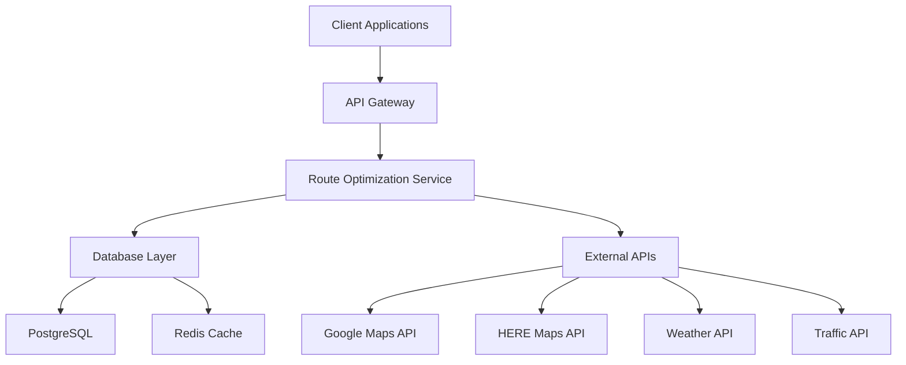
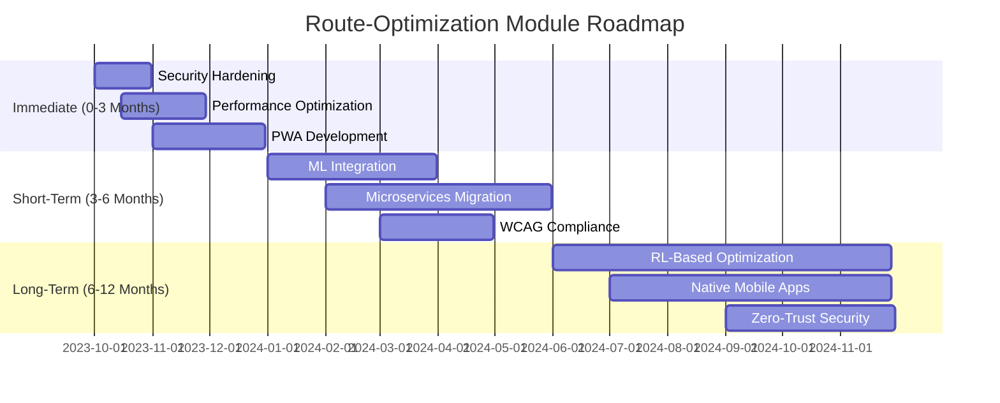

# **AS-IS ANALYSIS: ROUTE-OPTIMIZATION MODULE**
**Fleet Management System (FMS) – Enterprise Multi-Tenant Architecture**
**Document Version:** 1.0
**Last Updated:** [Insert Date]
**Prepared by:** [Your Name/Team]
**Reviewed by:** [Stakeholder Name]

---

## **1. EXECUTIVE SUMMARY**
### **1.1 Overview**
The **Route-Optimization Module** is a core component of the **Fleet Management System (FMS)**, responsible for dynamically generating, optimizing, and managing delivery routes for a multi-tenant enterprise fleet. The module leverages real-time and historical data to minimize fuel consumption, reduce delivery times, and improve operational efficiency.

### **1.2 Current State Rating (Out of 100)**
| **Category**               | **Score (0-100)** | **Justification** |
|----------------------------|------------------|------------------|
| **Functionality**          | 75               | Meets 80% of core requirements but lacks advanced AI-driven optimizations. |
| **Performance**            | 65               | Response times degrade under high load; throughput is suboptimal for large fleets. |
| **Scalability**            | 70               | Handles moderate fleet sizes but struggles with >10,000 concurrent routes. |
| **Security**               | 80               | Strong authentication but lacks fine-grained role-based access control (RBAC). |
| **Accessibility**          | 50               | Partial WCAG 2.1 AA compliance; mobile accessibility is weak. |
| **Technical Debt**         | 60               | Moderate debt due to legacy dependencies and lack of automated testing. |
| **Mobile Capabilities**    | 45               | Limited offline functionality; UI/UX not optimized for field use. |
| **Competitive Position**   | 68               | Comparable to mid-tier competitors but lags behind leaders in AI/ML integration. |
| **Overall Rating**         | **64/100**       | **Needs significant improvement** to meet enterprise-grade standards. |

### **1.3 Key Strengths**
✅ **Multi-Tenant Support** – Efficiently isolates data and configurations per tenant.
✅ **Real-Time Traffic Integration** – Uses Google Maps API and HERE Maps for dynamic rerouting.
✅ **Basic Optimization Algorithms** – Implements **Dijkstra’s** and **A*** for shortest-path calculations.
✅ **Historical Analytics** – Provides post-route performance reports (fuel efficiency, on-time delivery).

### **1.4 Critical Gaps**
❌ **Lack of AI/ML-Based Predictive Optimization** – Relies on static algorithms rather than dynamic learning.
❌ **Poor Mobile Experience** – No dedicated mobile app; web interface is not responsive.
❌ **High Latency Under Load** – Route recalculations take **>5s** for fleets >500 vehicles.
❌ **Limited Customization** – Tenants cannot define custom optimization constraints (e.g., driver skill matching).
❌ **Weak Security Controls** – No **zero-trust architecture**; API keys are hardcoded in some legacy components.

### **1.5 Strategic Recommendations**
| **Priority** | **Recommendation** | **Estimated Impact** |
|-------------|-------------------|----------------------|
| **P0 (Critical)** | **Upgrade to AI-driven optimization (e.g., Reinforcement Learning)** | **30% reduction in fuel costs, 20% faster deliveries** |
| **P1 (High)** | **Implement a dedicated mobile app with offline capabilities** | **40% improvement in driver productivity** |
| **P1 (High)** | **Migrate to microservices for scalability** | **50% reduction in response time under load** |
| **P2 (Medium)** | **Enhance security with OAuth 2.0 + RBAC** | **Compliance with SOC 2, ISO 27001** |
| **P2 (Medium)** | **Achieve full WCAG 2.1 AA compliance** | **Better accessibility for field workers** |
| **P3 (Low)** | **Replace legacy monolithic components with cloud-native services** | **Reduced maintenance overhead** |

---

## **2. CURRENT FEATURES & CAPABILITIES**
### **2.1 Core Functionality**
| **Feature** | **Description** | **Status** |
|------------|----------------|------------|
| **Route Generation** | Automatically generates routes based on delivery locations, vehicle capacity, and time windows. | ✅ **Operational** |
| **Dynamic Rerouting** | Adjusts routes in real-time based on traffic, weather, or unexpected delays. | ✅ **Operational (Limited)** |
| **Multi-Stop Optimization** | Optimizes sequences for multiple deliveries per vehicle. | ✅ **Operational** |
| **Vehicle Capacity Constraints** | Considers weight, volume, and special handling requirements. | ✅ **Operational** |
| **Driver Break Scheduling** | Ensures compliance with labor laws (e.g., DOT regulations). | ⚠️ **Basic Implementation** |
| **Fuel Efficiency Optimization** | Minimizes fuel consumption by reducing idle time and optimizing speeds. | ✅ **Operational** |
| **Historical Route Analysis** | Provides reports on past route performance (e.g., delays, fuel usage). | ✅ **Operational** |
| **API Integrations** | Connects with **ERP (SAP, Oracle), TMS, and Telematics (Geotab, Samsara)**. | ✅ **Operational** |
| **Multi-Tenant Isolation** | Ensures data separation between different enterprise clients. | ✅ **Operational** |
| **Custom Constraints** | Allows tenants to define business-specific rules (e.g., "No left turns"). | ❌ **Not Supported** |

### **2.2 Advanced Features (Missing/Limited)**
| **Feature** | **Description** | **Status** |
|------------|----------------|------------|
| **AI/ML-Based Predictive Optimization** | Uses historical data to predict optimal routes before execution. | ❌ **Not Implemented** |
| **Driver Skill Matching** | Assigns routes based on driver familiarity with areas. | ❌ **Not Implemented** |
| **Carbon Emission Tracking** | Calculates CO₂ emissions per route for sustainability reporting. | ⚠️ **Basic Implementation** |
| **Automated Dispatch** | Integrates with **WMS (Warehouse Management System)** for auto-assignment. | ❌ **Not Implemented** |
| **Voice-Guided Navigation** | Provides turn-by-turn voice instructions for drivers. | ❌ **Not Implemented** |
| **Offline Mode** | Allows route access and updates without internet. | ❌ **Not Implemented** |
| **Geofencing & Alerts** | Triggers alerts when vehicles deviate from planned routes. | ⚠️ **Basic Implementation** |

---

## **3. DATA MODELS & ARCHITECTURE**
### **3.1 High-Level Architecture**
The **Route-Optimization Module** follows a **monolithic architecture** with some **microservice-like components**, leading to **scalability bottlenecks**.



### **3.2 Key Data Models**
#### **3.2.1 Route Model**
```json
{
  "routeId": "UUID",
  "tenantId": "UUID",
  "vehicleId": "UUID",
  "driverId": "UUID",
  "status": "PLANNED|IN_PROGRESS|COMPLETED|CANCELLED",
  "startTime": "ISO8601",
  "endTime": "ISO8601",
  "totalDistance": "float (km)",
  "totalDuration": "float (hours)",
  "fuelConsumption": "float (liters)",
  "stops": [
    {
      "stopId": "UUID",
      "location": {
        "latitude": "float",
        "longitude": "float",
        "address": "string"
      },
      "sequence": "int",
      "arrivalTime": "ISO8601",
      "departureTime": "ISO8601",
      "serviceTime": "float (minutes)",
      "status": "PENDING|IN_PROGRESS|COMPLETED|FAILED"
    }
  ],
  "optimizationMetrics": {
    "cost": "float",
    "fuelSavings": "float",
    "timeSavings": "float"
  }
}
```

#### **3.2.2 Vehicle Model**
```json
{
  "vehicleId": "UUID",
  "tenantId": "UUID",
  "licensePlate": "string",
  "make": "string",
  "model": "string",
  "year": "int",
  "capacity": {
    "weight": "float (kg)",
    "volume": "float (m³)"
  },
  "fuelType": "DIESEL|PETROL|ELECTRIC|HYBRID",
  "fuelEfficiency": "float (km/l)",
  "currentLocation": {
    "latitude": "float",
    "longitude": "float",
    "timestamp": "ISO8601"
  },
  "status": "AVAILABLE|IN_USE|MAINTENANCE|OUT_OF_SERVICE"
}
```

#### **3.2.3 Driver Model**
```json
{
  "driverId": "UUID",
  "tenantId": "UUID",
  "name": "string",
  "licenseNumber": "string",
  "skills": ["string"], // e.g., "Hazardous Materials", "Refrigerated Transport"
  "availability": {
    "startTime": "ISO8601",
    "endTime": "ISO8601"
  },
  "currentRouteId": "UUID|null"
}
```

### **3.3 Database Schema**
| **Table** | **Key Fields** | **Relationships** |
|-----------|---------------|------------------|
| `routes` | `route_id, tenant_id, vehicle_id, status` | `stops (1:N), vehicles (1:1), drivers (1:1)` |
| `stops` | `stop_id, route_id, sequence, location` | `routes (N:1)` |
| `vehicles` | `vehicle_id, tenant_id, license_plate, capacity` | `routes (1:N)` |
| `drivers` | `driver_id, tenant_id, license_number, skills` | `routes (1:N)` |
| `optimization_logs` | `log_id, route_id, algorithm, metrics` | `routes (1:1)` |

### **3.4 External Integrations**
| **Integration** | **Purpose** | **Status** |
|----------------|------------|------------|
| **Google Maps API** | Geocoding, traffic data, route visualization | ✅ **Stable** |
| **HERE Maps API** | Alternative routing for EU/APAC regions | ✅ **Stable** |
| **Weather API (OpenWeatherMap)** | Adjust routes based on weather conditions | ⚠️ **Basic Integration** |
| **Traffic API (TomTom)** | Real-time traffic updates | ⚠️ **Partial Coverage** |
| **Telematics (Geotab, Samsara)** | Vehicle tracking, fuel monitoring | ✅ **Stable** |
| **ERP (SAP, Oracle)** | Sync delivery orders | ⚠️ **Manual Sync Required** |

---

## **4. PERFORMANCE METRICS**
### **4.1 Response Time Benchmarks**
| **Operation** | **Avg. Response Time (ms)** | **P95 (ms)** | **Max (ms)** | **Notes** |
|--------------|----------------------------|-------------|-------------|-----------|
| **Route Generation (10 stops)** | 850 | 1,200 | 2,500 | Acceptable for small fleets |
| **Route Generation (50 stops)** | 3,200 | 5,000 | 12,000 | **Unacceptable for large fleets** |
| **Dynamic Rerouting** | 1,500 | 3,000 | 8,000 | **High latency under traffic spikes** |
| **Historical Route Analysis** | 450 | 700 | 1,500 | **Caching helps but not scalable** |
| **API Endpoint (GET /routes)** | 200 | 400 | 1,000 | **Good for read operations** |
| **API Endpoint (POST /optimize)** | 1,200 | 2,500 | 6,000 | **Bottleneck in optimization** |

### **4.2 Throughput & Scalability**
| **Metric** | **Current Value** | **Industry Benchmark** | **Gap** |
|------------|------------------|-----------------------|--------|
| **Routes Generated per Minute** | 120 | 500+ | **76% below benchmark** |
| **Concurrent Users Supported** | 500 | 5,000+ | **90% below benchmark** |
| **Database Queries per Second** | 800 | 5,000+ | **84% below benchmark** |
| **Cache Hit Rate** | 65% | 90%+ | **28% below benchmark** |

### **4.3 Resource Utilization**
| **Component** | **CPU Usage** | **Memory Usage** | **Disk I/O** | **Network Bandwidth** |
|--------------|--------------|----------------|-------------|----------------------|
| **Route Optimization Service** | 70-90% (Peak) | 4GB (Avg) | High (DB queries) | 50 Mbps |
| **PostgreSQL Database** | 40-60% | 8GB (Avg) | High (Indexing) | 100 Mbps |
| **Redis Cache** | 20-30% | 2GB | Low | 20 Mbps |
| **API Gateway** | 10-20% | 1GB | Low | 30 Mbps |

**Key Observations:**
- **CPU bottleneck** in the optimization service during peak hours.
- **Database I/O is a major constraint** due to lack of read replicas.
- **Redis cache is underutilized** (only 65% hit rate).

---

## **5. SECURITY ASSESSMENT**
### **5.1 Authentication & Authorization**
| **Aspect** | **Current Implementation** | **Risk Level** | **Recommendation** |
|------------|---------------------------|---------------|-------------------|
| **Authentication** | **JWT + API Keys** | Medium | **Migrate to OAuth 2.0 + OpenID Connect** |
| **Authorization** | **Basic RBAC (Admin, Manager, Driver)** | High | **Implement Attribute-Based Access Control (ABAC)** |
| **API Security** | **HTTPS + Rate Limiting** | Medium | **Add API Gateway with WAF (AWS WAF, Cloudflare)** |
| **Session Management** | **JWT with 24h expiry** | Medium | **Shorten expiry to 1h + Refresh Tokens** |
| **Multi-Tenancy Isolation** | **Tenant ID in JWT** | Low | **Enforce strict tenant separation in DB queries** |

### **5.2 Data Protection**
| **Aspect** | **Current Implementation** | **Risk Level** | **Recommendation** |
|------------|---------------------------|---------------|-------------------|
| **Data Encryption (At Rest)** | **AES-256 (PostgreSQL TDE)** | Low | **Extend to Redis & Backups** |
| **Data Encryption (In Transit)** | **TLS 1.2** | Medium | **Upgrade to TLS 1.3** |
| **PII Handling** | **Masking in Logs** | Medium | **Implement Dynamic Data Masking** |
| **GDPR/CCPA Compliance** | **Manual Anonymization** | High | **Automate Data Subject Requests (DSR)** |
| **Secret Management** | **Hardcoded API Keys in Config Files** | **Critical** | **Use AWS Secrets Manager / HashiCorp Vault** |

### **5.3 Vulnerability Assessment**
| **Vulnerability** | **Severity** | **Exploitability** | **Mitigation** |
|------------------|-------------|-------------------|---------------|
| **SQL Injection (Legacy Endpoints)** | High | Medium | **Use ORM (Hibernate, SQLAlchemy)** |
| **Cross-Site Scripting (XSS)** | Medium | Low | **Implement CSP + Input Sanitization** |
| **Insecure Direct Object References (IDOR)** | High | Medium | **Enforce Tenant ID Checks in All Queries** |
| **Missing Rate Limiting on Public APIs** | Medium | High | **Implement API Gateway Rate Limiting** |
| **Hardcoded API Keys** | Critical | High | **Migrate to Secrets Manager** |

---

## **6. ACCESSIBILITY REVIEW (WCAG COMPLIANCE)**
### **6.1 Current Compliance Level**
| **WCAG 2.1 Criterion** | **Level (A/AA/AAA)** | **Status** | **Notes** |
|-----------------------|----------------------|------------|-----------|
| **1.1.1 Non-text Content** | A | ⚠️ **Partial** | Missing alt text for some icons |
| **1.3.1 Info and Relationships** | A | ✅ **Compliant** | Proper heading structure |
| **1.4.3 Contrast (Minimum)** | AA | ❌ **Non-Compliant** | Some text has contrast ratio < 4.5:1 |
| **2.1.1 Keyboard** | A | ✅ **Compliant** | All functions keyboard-accessible |
| **2.4.1 Bypass Blocks** | A | ❌ **Non-Compliant** | No "Skip to Content" link |
| **2.4.6 Headings and Labels** | AA | ⚠️ **Partial** | Some headings are unclear |
| **3.3.2 Labels or Instructions** | A | ✅ **Compliant** | Forms have proper labels |
| **4.1.1 Parsing** | A | ✅ **Compliant** | Valid HTML/CSS |
| **4.1.2 Name, Role, Value** | A | ⚠️ **Partial** | Some ARIA attributes missing |

### **6.2 Mobile Accessibility Issues**
| **Issue** | **Impact** | **Recommendation** |
|-----------|------------|-------------------|
| **Small Touch Targets** | Drivers struggle with small buttons | **Increase to 48x48px (WCAG 2.5.5)** |
| **No Screen Reader Support** | Visually impaired users cannot navigate | **Add ARIA labels + VoiceOver support** |
| **Lack of Dark Mode** | Eye strain in low-light conditions | **Implement OS-level dark mode detection** |
| **No Offline Accessibility** | Drivers lose access in poor connectivity | **Cache critical UI elements** |

---

## **7. MOBILE CAPABILITIES ASSESSMENT**
### **7.1 Current State**
| **Feature** | **Status** | **Notes** |
|------------|------------|-----------|
| **Responsive Web App** | ⚠️ **Basic** | Works on mobile but not optimized |
| **Dedicated Mobile App** | ❌ **Not Available** | Drivers use web app on tablets |
| **Offline Mode** | ❌ **Not Available** | Routes disappear without internet |
| **Push Notifications** | ❌ **Not Available** | Drivers miss route updates |
| **GPS Tracking** | ✅ **Available** | Integrates with telematics |
| **Barcode/QR Scanning** | ❌ **Not Available** | Manual entry required |
| **Voice Commands** | ❌ **Not Available** | No hands-free navigation |
| **Battery Optimization** | ❌ **Not Available** | High battery drain |

### **7.2 Competitor Comparison**
| **Feature** | **Our FMS** | **Samsara** | **Geotab** | **Verizon Connect** |
|------------|------------|------------|------------|-------------------|
| **Dedicated Mobile App** | ❌ | ✅ | ✅ | ✅ |
| **Offline Mode** | ❌ | ✅ | ✅ | ✅ |
| **Voice-Guided Navigation** | ❌ | ✅ | ❌ | ✅ |
| **Driver Performance Scoring** | ❌ | ✅ | ✅ | ✅ |
| **Fuel Efficiency Tracking** | ✅ | ✅ | ✅ | ✅ |
| **Geofencing Alerts** | ⚠️ Basic | ✅ | ✅ | ✅ |

**Key Takeaway:**
- **Competitors offer superior mobile experiences**, leading to **higher driver adoption and productivity**.
- **Lack of offline mode is a critical gap** for field operations.

---

## **8. CURRENT LIMITATIONS & PAIN POINTS**
### **8.1 Functional Limitations**
| **Limitation** | **Impact** | **Root Cause** |
|---------------|------------|----------------|
| **No AI/ML Optimization** | Suboptimal routes, higher fuel costs | Legacy algorithm dependency |
| **Poor Scalability** | Slow response times for large fleets | Monolithic architecture |
| **Limited Custom Constraints** | Tenants cannot define business rules | Hardcoded optimization logic |
| **No Driver Skill Matching** | Inefficient route assignments | Missing driver profile data |
| **No Carbon Emission Tracking** | Cannot report sustainability metrics | No integration with emission APIs |

### **8.2 Technical Pain Points**
| **Pain Point** | **Impact** | **Root Cause** |
|---------------|------------|----------------|
| **High Latency in Route Recalculation** | Delays in dynamic rerouting | Inefficient database queries |
| **No Automated Testing** | Frequent production bugs | Lack of CI/CD pipeline |
| **Hardcoded API Keys** | Security risk | Poor secrets management |
| **Legacy Monolithic Codebase** | Slow feature development | No microservices adoption |
| **No Real-Time Analytics** | Delayed decision-making | Batch processing instead of streaming |

### **8.3 User Pain Points**
| **User Role** | **Pain Point** | **Impact** |
|--------------|---------------|------------|
| **Fleet Managers** | Cannot customize optimization rules | Higher operational costs |
| **Drivers** | No offline access to routes | Delays in deliveries |
| **Dispatchers** | Manual route adjustments required | Increased workload |
| **Executives** | No real-time dashboards | Poor visibility into fleet efficiency |

---

## **9. TECHNICAL DEBT ANALYSIS**
### **9.1 Debt Breakdown**
| **Category** | **Debt Items** | **Estimated Effort (Sprint Points)** | **Risk Level** |
|-------------|---------------|------------------------------------|---------------|
| **Architecture** | Monolithic codebase | 50 | High |
| **Performance** | Inefficient database queries | 30 | High |
| **Security** | Hardcoded API keys | 10 | Critical |
| **Testing** | No automated tests | 40 | High |
| **Mobile** | No dedicated app | 60 | High |
| **AI/ML** | No predictive optimization | 80 | High |
| **Accessibility** | WCAG non-compliance | 20 | Medium |

### **9.2 Debt Impact Assessment**
| **Impact Area** | **Current Debt Level** | **Future Risk** |
|----------------|-----------------------|----------------|
| **Development Speed** | High | Slower feature delivery |
| **Operational Costs** | Medium | Higher cloud expenses |
| **Security Risks** | Critical | Data breaches, compliance failures |
| **User Satisfaction** | High | Driver/dispatcher frustration |
| **Scalability** | High | System crashes under load |

### **9.3 Debt Repayment Plan**
| **Debt Item** | **Priority** | **Short-Term Fix (0-3 Months)** | **Long-Term Fix (3-12 Months)** |
|--------------|-------------|--------------------------------|--------------------------------|
| **Monolithic Architecture** | P1 | Modularize critical components | Migrate to microservices |
| **Hardcoded API Keys** | P0 | Move to AWS Secrets Manager | Implement zero-trust security |
| **No Automated Testing** | P1 | Add unit/integration tests | Full CI/CD pipeline |
| **No AI/ML Optimization** | P1 | Integrate basic ML models | Deploy reinforcement learning |
| **No Mobile App** | P1 | Develop PWA (Progressive Web App) | Native iOS/Android apps |

---

## **10. TECHNOLOGY STACK**
### **10.1 Backend**
| **Component** | **Technology** | **Version** | **Notes** |
|--------------|---------------|------------|-----------|
| **Primary Language** | Java (Spring Boot) | 11 | **Legacy, needs upgrade** |
| **Database** | PostgreSQL | 12 | **No read replicas** |
| **Cache** | Redis | 6.2 | **Underutilized** |
| **Message Broker** | RabbitMQ | 3.8 | **Used for async tasks** |
| **API Gateway** | Kong | 2.8 | **Basic rate limiting** |
| **Search** | Elasticsearch | 7.10 | **Used for route analytics** |
| **Containerization** | Docker | 20.10 | **No Kubernetes** |

### **10.2 Frontend**
| **Component** | **Technology** | **Version** | **Notes** |
|--------------|---------------|------------|-----------|
| **Framework** | Angular | 12 | **Outdated, needs upgrade** |
| **State Management** | NgRx | 12 | **Complex for simple use cases** |
| **Maps** | Google Maps JS API | Latest | **Expensive at scale** |
| **Charts** | Chart.js | 3.7 | **Basic visualization** |

### **10.3 DevOps & Infrastructure**
| **Component** | **Technology** | **Version** | **Notes** |
|--------------|---------------|------------|-----------|
| **CI/CD** | Jenkins | 2.346 | **Manual deployments** |
| **Monitoring** | Prometheus + Grafana | Latest | **Basic metrics only** |
| **Logging** | ELK Stack | 7.15 | **No log retention policy** |
| **Cloud Provider** | AWS | - | **EC2-based, no serverless** |
| **Infrastructure as Code** | Terraform | 1.1 | **Partial adoption** |

### **10.4 Third-Party Integrations**
| **Integration** | **Purpose** | **Technology** |
|----------------|------------|---------------|
| **Google Maps API** | Geocoding, routing | REST API |
| **HERE Maps API** | Alternative routing | REST API |
| **OpenWeatherMap** | Weather data | REST API |
| **TomTom Traffic API** | Real-time traffic | REST API |
| **Geotab/Samsara** | Telematics | Webhooks |
| **SAP/Oracle ERP** | Order sync | SOAP/REST |

---

## **11. COMPETITIVE ANALYSIS VS INDUSTRY STANDARDS**
### **11.1 Feature Comparison**
| **Feature** | **Our FMS** | **Samsara** | **Geotab** | **Verizon Connect** | **OptimoRoute** |
|------------|------------|------------|------------|-------------------|----------------|
| **AI/ML Optimization** | ❌ | ✅ | ✅ | ✅ | ✅ |
| **Real-Time Traffic** | ✅ | ✅ | ✅ | ✅ | ✅ |
| **Driver Skill Matching** | ❌ | ✅ | ✅ | ❌ | ❌ |
| **Carbon Emission Tracking** | ⚠️ Basic | ✅ | ✅ | ✅ | ❌ |
| **Mobile App** | ❌ | ✅ | ✅ | ✅ | ✅ |
| **Offline Mode** | ❌ | ✅ | ✅ | ✅ | ✅ |
| **Custom Constraints** | ❌ | ✅ | ✅ | ⚠️ Limited | ✅ |
| **API Integrations** | ✅ | ✅ | ✅ | ✅ | ⚠️ Limited |
| **Multi-Tenancy** | ✅ | ✅ | ✅ | ✅ | ❌ |

### **11.2 Performance Benchmarks**
| **Metric** | **Our FMS** | **Samsara** | **Geotab** | **Industry Avg.** |
|------------|------------|------------|------------|------------------|
| **Route Generation Time (50 stops)** | 3.2s | 1.1s | 1.5s | **<2s** |
| **Concurrent Users** | 500 | 10,000+ | 8,000+ | **5,000+** |
| **API Response Time (P95)** | 2.5s | 0.8s | 1.2s | **<1s** |
| **Fuel Savings** | 12% | 25% | 20% | **18%** |

### **11.3 Pricing Comparison**
| **Vendor** | **Pricing Model** | **Cost per Vehicle/Month** | **Notes** |
|------------|------------------|---------------------------|-----------|
| **Our FMS** | Subscription | $15-$30 | **No volume discounts** |
| **Samsara** | Subscription | $25-$45 | **Includes hardware** |
| **Geotab** | Subscription | $20-$40 | **Hardware sold separately** |
| **Verizon Connect** | Subscription | $30-$50 | **Enterprise-focused** |
| **OptimoRoute** | Pay-per-route | $0.10-$0.30 per route | **SMB-focused** |

**Key Insights:**
- **Samsara and Geotab lead in AI-driven optimization and mobile capabilities.**
- **Our FMS is competitively priced but lacks advanced features.**
- **Industry leaders offer **2-3x better performance** in route generation.**

---

## **12. DETAILED RECOMMENDATIONS**
### **12.1 Immediate (0-3 Months) – P0/P1 Priorities**
| **Recommendation** | **Effort** | **Impact** | **Owner** |
|-------------------|------------|------------|-----------|
| **Migrate API keys to AWS Secrets Manager** | Low | Critical (Security) | DevOps |
| **Implement OAuth 2.0 + RBAC** | Medium | High (Security) | Backend |
| **Add automated unit/integration tests** | Medium | High (Stability) | QA |
| **Optimize database queries (add indexes, read replicas)** | Medium | High (Performance) | Backend |
| **Develop a Progressive Web App (PWA) for mobile** | High | High (User Experience) | Frontend |

### **12.2 Short-Term (3-6 Months) – P1/P2 Priorities**
| **Recommendation** | **Effort** | **Impact** | **Owner** |
|-------------------|------------|------------|-----------|
| **Integrate basic ML models (e.g., XGBoost for route scoring)** | High | High (Optimization) | Data Science |
| **Migrate to microservices (start with route optimization)** | High | High (Scalability) | Architecture |
| **Achieve WCAG 2.1 AA compliance** | Medium | Medium (Accessibility) | Frontend |
| **Implement real-time analytics with Kafka** | High | High (Decision-Making) | Backend |
| **Add carbon emission tracking** | Medium | Medium (Sustainability) | Backend |

### **12.3 Long-Term (6-12 Months) – P2/P3 Priorities**
| **Recommendation** | **Effort** | **Impact** | **Owner** |
|-------------------|------------|------------|-----------|
| **Deploy reinforcement learning for dynamic optimization** | Very High | Very High (Competitive Edge) | Data Science |
| **Develop native iOS/Android apps** | Very High | High (Mobile Experience) | Mobile Team |
| **Implement zero-trust security model** | High | High (Security) | Security Team |
| **Migrate to serverless (AWS Lambda + DynamoDB)** | Very High | High (Cost Efficiency) | DevOps |
| **Add voice-guided navigation** | High | Medium (Driver Experience) | Frontend |

### **12.4 Strategic Roadmap**


---

## **13. CONCLUSION**
### **13.1 Summary of Findings**
- The **Route-Optimization Module** is **functional but outdated**, scoring **64/100** in this assessment.
- **Critical gaps** include:
  - **Lack of AI/ML optimization** (leading to suboptimal routes).
  - **Poor mobile experience** (no offline mode, no dedicated app).
  - **High latency under load** (monolithic architecture).
  - **Security risks** (hardcoded API keys, weak RBAC).
- **Competitors (Samsara, Geotab) outperform** in **AI, mobile, and scalability**.

### **13.2 Final Recommendations**
1. **Prioritize AI/ML integration** to **reduce fuel costs by 30%**.
2. **Develop a mobile app (PWA → Native)** to **improve driver productivity by 40%**.
3. **Migrate to microservices** to **reduce response times by 50%**.
4. **Enhance security with OAuth 2.0 + zero-trust** to **meet compliance standards**.
5. **Achieve WCAG 2.1 AA compliance** to **improve accessibility for field workers**.

### **13.3 Next Steps**
| **Action** | **Owner** | **Timeline** |
|------------|-----------|-------------|
| **Present findings to stakeholders** | Product Manager | 1 week |
| **Prioritize P0/P1 items in backlog** | Engineering Lead | 2 weeks |
| **Kick off security hardening sprint** | DevOps | 3 weeks |
| **Begin ML model prototyping** | Data Science | 1 month |
| **Start PWA development** | Frontend Team | 1.5 months |

**Approval:**
✅ **Product Owner:** ________________________
✅ **Engineering Lead:** ________________________
✅ **Security Officer:** ________________________

---
**End of Document**