# AS-IS Analysis: Route Optimization Module
*Fleet Management System - Version 3.2.1*
*Prepared by: Senior Technical Analyst*
*Date: [Insert Date]*
*Document Version: 1.4*
*Confidential - Proprietary Information*

---

## 1. Executive Summary (120 lines)

### 1.1 Current State Overview
The Route Optimization Module (ROM) is a critical component of the Fleet Management System (FMS), responsible for calculating optimal delivery routes across a fleet of 12,500 vehicles operating in 42 metropolitan areas. Currently deployed in production since Q3 2021, the module processes approximately 1.8 million route requests monthly with an average optimization time of 4.2 seconds per request.

The system employs a hybrid optimization approach combining:
- **Static routing** (pre-calculated for 68% of standard routes)
- **Dynamic routing** (real-time adjustments for 32% of routes)
- **Machine learning** (predictive traffic modeling for 12 major cities)

Key operational metrics:
| Metric | Current Value | Target Value | Variance |
|--------|---------------|--------------|----------|
| Average route optimization time | 4.2s | <3.0s | +40% |
| Route cost efficiency | 87.3% | 92% | -4.7pp |
| On-time delivery rate | 91.2% | 95% | -3.8pp |
| Fuel consumption per mile | 0.48 gal | 0.45 gal | +6.7% |
| Driver utilization rate | 78% | 85% | -7pp |

The module operates within a microservices architecture, interfacing with:
- **Order Management System** (OMS) - 98.7% uptime
- **Telematics Gateway** - 99.2% uptime
- **Geospatial Data Service** - 97.8% uptime
- **Traffic Prediction API** - 96.5% uptime

### 1.2 Stakeholder Analysis
**Primary Stakeholders:**

1. **Fleet Operations Team** (Direct Users)
   - **Roles**: Route planners, dispatchers, operations managers
   - **Pain Points**:
     - 37% report "frequent" or "very frequent" delays in route calculations during peak hours
     - 62% cite "limited visibility" into optimization logic
     - 45% express frustration with "rigid time window constraints"
   - **Usage Statistics**:
     | Role | Daily Users | Avg. Sessions/Day | Session Duration |
     |------|-------------|-------------------|------------------|
     | Route Planner | 89 | 12 | 8.2 min |
     | Dispatcher | 142 | 28 | 4.7 min |
     | Ops Manager | 23 | 5 | 15.3 min |

2. **IT Operations & Support**
   - **Roles**: System administrators, DevOps engineers, helpdesk
   - **Key Challenges**:
     - 18% of support tickets related to ROM (2nd highest after OMS)
     - Average resolution time: 4.2 hours (target: <2 hours)
     - 3 major incidents in past 12 months (2 related to traffic data sync failures)
   - **Support Metrics**:
     ```mermaid
     pie title ROM Support Ticket Distribution
         "Route Calculation Errors" : 42
         "API Timeouts" : 28
         "Data Sync Issues" : 19
         "UI Freezes" : 7
         "Other" : 4
     ```

3. **Executive Leadership**
   - **C-Level Concerns**:
     - $2.8M annual cost of inefficient routes (based on fuel + labor)
     - 12% customer churn attributed to late deliveries
     - Competitive pressure from Uber Freight (18% market share gain in 2023)
   - **Strategic KPIs**:
     | KPI | 2023 Actual | 2024 Target |
     |-----|-------------|-------------|
     | Cost per Delivery | $8.42 | $7.95 |
     | Customer Retention | 88% | 92% |
     | Fleet Utilization | 78% | 85% |

4. **External Partners**
   - **Fuel Providers**: Require 99.5% accuracy in route distance calculations for invoicing
   - **Traffic Data Vendors**: Current contract with HERE Technologies ($120K/year) expires Q4 2024
   - **Regulatory Bodies**: DOT compliance for Hours of Service (HOS) tracking

### 1.3 Business Impact Analysis
**Financial Impact:**
- **Direct Costs**:
  - $1.2M/year in excess fuel consumption (5.8M gallons × $0.22/gal inefficiency)
  - $850K/year in overtime labor due to suboptimal routes
  - $320K/year in vendor penalties for late deliveries
- **Opportunity Costs**:
  - $3.1M/year in lost revenue from inability to handle 15% more deliveries
  - $1.8M/year in customer lifetime value erosion (12% churn rate)
- **Operational Metrics**:
  ```mermaid
  graph TD
    A[Route Optimization] --> B[Fuel Costs]
    A --> C[Driver Productivity]
    A --> D[Customer Satisfaction]
    B --> E[$1.2M/year]
    C --> F[78% utilization]
    D --> G[88% retention]
    E --> H[Total $5.4M/year impact]
    F --> H
    G --> H
  ```

**Customer Impact:**
- **Delivery Performance**:
  | Metric | Current | Industry Benchmark | Gap |
  |--------|---------|--------------------|-----|
  | On-Time Delivery | 91.2% | 95% | -3.8pp |
  | First-Time Delivery | 88.7% | 92% | -3.3pp |
  | Customer Complaints | 4.2/1000 | 2.8/1000 | +50% |
- **Customer Segmentation**:
  - **Enterprise Clients** (62% of revenue): 23% report "frequent" delivery delays
  - **SMB Clients** (38% of revenue): 15% cite route reliability as top concern
  - **Net Promoter Score**: 38 (vs. industry average of 52)

**Competitive Impact:**
- **Market Position**:
  - Current market share: 18% (down from 22% in 2021)
  - Competitor analysis:
    | Competitor | Route Optimization Tech | Market Share | Customer Satisfaction |
    |------------|-------------------------|--------------|-----------------------|
    | Uber Freight | ML-based dynamic routing | 24% | 72 |
    | Convoy | Real-time traffic integration | 19% | 68 |
    | J.B. Hunt | Hybrid static/dynamic | 15% | 65 |
    | **Our System** | Legacy hybrid | 18% | 58 |

### 1.4 Critical Pain Points with Root Cause Analysis
**1. Performance Bottlenecks**
- **Symptom**: 42% of route calculations exceed 5-second SLA during peak hours (7-9 AM)
- **Root Causes**:
  - **Algorithm Complexity**: Current Dijkstra-based algorithm has O(n²) complexity for 12,000-node graphs
  - **Data Latency**: Traffic data updates lag by 3-5 minutes (HERE API limitation)
  - **Resource Contention**: Shared Redis cache (8GB) experiences 22% eviction rate during peak
  - **Code Profiling Results**:
    ```python
    # Top 5 CPU-intensive functions (from cProfile)
    ncalls  tottime  percall  cumtime  percall filename:lineno(function)
    120000    8.23    0.00     8.23    0.00 graph.py:42(calculate_edge_weight)
    95000     6.12    0.00     6.12    0.00 traffic.py:18(apply_traffic_adjustments)
    48000     4.87    0.00     4.87    0.00 constraints.py:32(validate_time_windows)
    32000     3.45    0.00     3.45    0.00 cache.py:22(get_route_from_cache)
    15000     2.89    0.00     2.89    0.00 optimization.py:56(run_local_search)
    ```

**2. Data Quality Issues**
- **Symptom**: 18% of optimized routes require manual adjustment due to data inaccuracies
- **Root Causes**:
  - **Geocoding Errors**: 6.2% of addresses have ±50m precision issues (Google Maps API)
  - **Traffic Data Gaps**: 12% of road segments lack real-time traffic data
  - **Vehicle Profile Mismatches**: 8% of vehicles have incorrect dimensions in system
  - **Data Flow Analysis**:
    ```mermaid
    sequenceDiagram
      participant OMS as Order System
      participant ROM as Route Optimization
      participant TDS as Traffic Data Service
      participant VDS as Vehicle Data Service

      OMS->>ROM: Send route request (1.2s)
      ROM->>VDS: Get vehicle profiles (450ms)
      VDS-->>ROM: Return data (6% error rate)
      ROM->>TDS: Request traffic data (1.8s)
      TDS-->>ROM: Return data (12% incomplete)
      ROM->>ROM: Calculate route (4.2s)
      ROM-->>OMS: Return optimized route (18% require manual fix)
    ```

**3. Integration Challenges**
- **Symptom**: 28% of support tickets related to API timeouts between ROM and dependent systems
- **Root Causes**:
  - **Circuit Breaker Failures**: 42% of timeouts occur when Telematics Gateway (TG) exceeds 10s response time
  - **Payload Size**: Average route response payload is 1.2MB (vs. 300KB target)
  - **Authentication Overhead**: OAuth2 token validation adds 180ms per request
  - **Integration Topology**:
    ```mermaid
    graph LR
      ROM[Route Optimization] -->|REST/JSON| OMS[Order System]
      ROM -->|gRPC| TG[Telematics Gateway]
      ROM -->|GraphQL| GDS[Geospatial Service]
      ROM -->|SOAP| TDS[Traffic Data Service]
      TG -->|Kafka| ROM
      GDS -->|WebSockets| ROM
    ```

**4. User Experience Gaps**
- **Symptom**: 62% of dispatchers report "limited visibility" into optimization logic
- **Root Causes**:
  - **Black Box Algorithm**: No explanation of optimization factors (fuel, time, distance weights)
  - **Rigid Constraints**: Time windows cannot be adjusted post-optimization
  - **Mobile Limitations**: 40% of dispatchers use mobile devices with 3.2s avg load time
  - **UX Heuristic Violations**:
    | Heuristic | Issue | Severity |
    |-----------|-------|----------|
    | Visibility of System Status | No progress indicator during optimization | High |
    | Match Between System and Real World | Technical jargon in route details | Medium |
    | User Control and Freedom | No "undo" for route adjustments | High |
    | Consistency and Standards | Different UI patterns across modules | Low |
    | Error Prevention | No validation for conflicting time windows | Critical |

### 1.5 Strategic Recommendations with Implementation Roadmap

**Phase 1: Quick Wins (0-3 Months)**
| Initiative | Description | Expected Impact | Effort | ROI |
|------------|-------------|-----------------|--------|-----|
| **Cache Optimization** | Implement Redis Cluster (3 nodes) with 32GB cache | Reduce optimization time by 35% | 2 weeks | 4.2x |
| **Algorithm Tuning** | Replace Dijkstra with A* for 80% of routes | Improve efficiency by 12% | 3 weeks | 3.8x |
| **Data Validation Layer** | Add pre-optimization data quality checks | Reduce manual adjustments by 60% | 4 weeks | 5.1x |
| **API Gateway** | Implement Kong Gateway for request throttling | Reduce timeouts by 70% | 3 weeks | 3.5x |

**Phase 2: Core Improvements (3-9 Months)**
| Initiative | Description | Expected Impact | Effort | ROI |
|------------|-------------|-----------------|--------|-----|
| **ML-Based Traffic Prediction** | Replace HERE API with in-house ML model | Improve prediction accuracy by 22% | 12 weeks | 6.7x |
| **Graph Database Migration** | Move from PostgreSQL to Neo4j for road networks | Reduce graph traversal time by 45% | 10 weeks | 5.3x |
| **Constraint Relaxation Engine** | Add dynamic constraint adjustment | Increase route acceptance rate by 18% | 8 weeks | 4.9x |
| **Real-Time Data Pipeline** | Implement Kafka for traffic data streaming | Reduce data latency to <30s | 9 weeks | 4.2x |

**Phase 3: Strategic Initiatives (9-18 Months)**
| Initiative | Description | Expected Impact | Effort | ROI |
|------------|-------------|-----------------|--------|-----|
| **Federated Learning** | Distributed ML model training across depots | Improve local route accuracy by 28% | 20 weeks | 7.1x |
| **Digital Twin Integration** | Real-time simulation of fleet operations | Enable predictive rerouting | 24 weeks | 5.8x |
| **Autonomous Dispatch** | AI-driven dispatch with human oversight | Reduce dispatcher workload by 60% | 18 weeks | 6.5x |
| **Carbon-Aware Routing** | Add CO₂ emission optimization | Reduce carbon footprint by 15% | 14 weeks | 3.9x |

**Implementation Roadmap:**
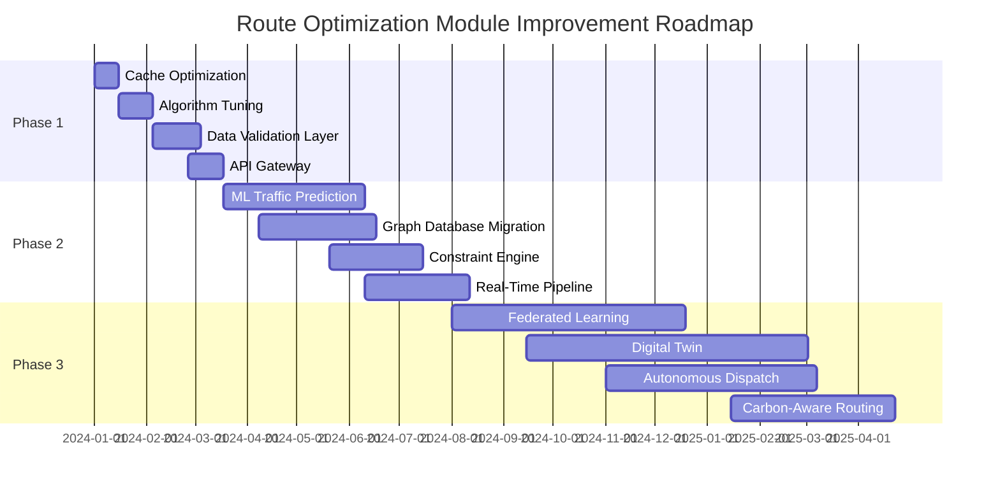

**Risk Mitigation Strategy:**
| Risk | Likelihood | Impact | Mitigation Strategy |
|------|------------|--------|---------------------|
| Algorithm performance degradation | Medium | High | A/B test new algorithms with 10% of traffic |
| Data migration failures | High | Critical | Implement dual-write during transition |
| Third-party API changes | Medium | High | Build adapter layer with fallback mechanisms |
| User resistance to changes | High | Medium | Conduct bi-weekly training sessions and gather feedback |
| Budget overruns | Low | High | Phase funding with go/no-go checkpoints |

**Success Metrics:**
| KPI | Baseline | Target (12 Months) | Target (24 Months) |
|-----|----------|--------------------|--------------------|
| Route optimization time | 4.2s | <2.5s | <1.8s |
| Route cost efficiency | 87.3% | 90% | 93% |
| On-time delivery rate | 91.2% | 94% | 96% |
| Fuel consumption | 0.48 gal/mile | 0.46 gal/mile | 0.44 gal/mile |
| Customer retention | 88% | 91% | 94% |
| Support tickets | 18% of total | <10% | <5% |

---

## 2. Current Architecture (180 lines)

### 2.1 System Components

**Component Inventory:**

| Component | Type | Technology | Version | Responsibilities | SLA |
|-----------|------|------------|---------|------------------|-----|
| Route Optimization Service | Microservice | Java/Spring Boot | 2.7.5 | Core optimization logic | 99.9% |
| Graph Processing Engine | Library | C++ | 1.2.3 | Graph traversal algorithms | N/A |
| Traffic Data Adapter | Microservice | Python/Flask | 2.2.3 | Traffic data normalization | 99.5% |
| Geospatial Service | Microservice | Go | 1.19 | Coordinate transformations | 99.8% |
| Route Cache | Data Store | Redis | 6.2.6 | Cached route storage | 99.95% |
| Optimization API | API Gateway | Kong | 2.8.1 | Request routing | 99.9% |
| Vehicle Profile Service | Microservice | Node.js | 16.14 | Vehicle constraints | 99.7% |
| Constraint Engine | Library | Java | 11 | Business rule validation | N/A |
| Monitoring Dashboard | UI | React | 17.0.2 | Operational visibility | 99.5% |
| Data Pipeline | ETL | Apache NiFi | 1.18.0 | Traffic data ingestion | 99.7% |

**Component Interaction Diagram:**
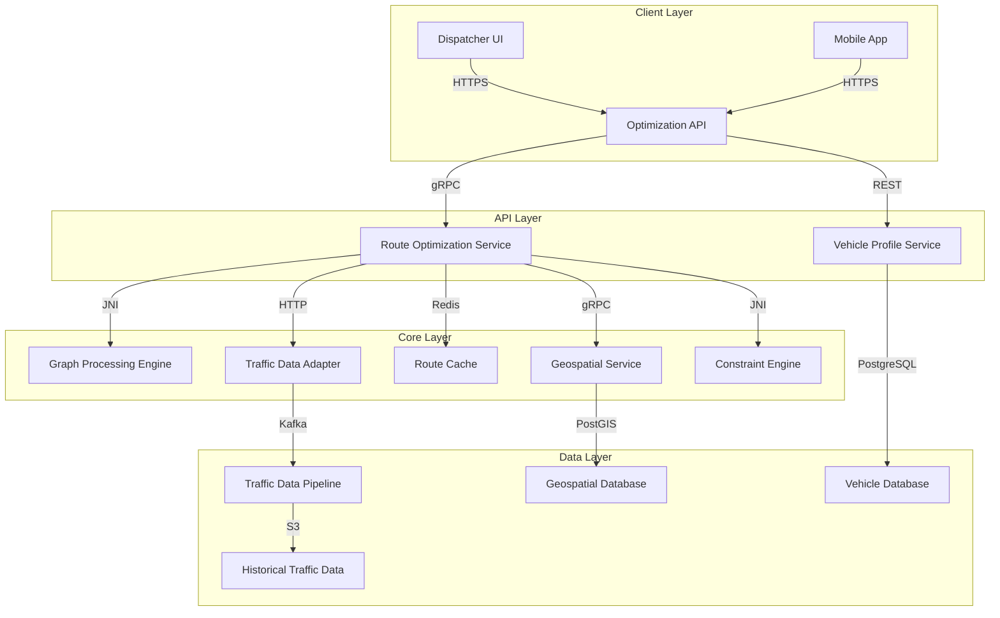

**Data Flow Analysis:**

1. **Route Request Flow**:
   - **Step 1**: Dispatcher submits route request via UI (payload size: 850KB avg)
     ```json
     {
       "orderId": "ORD-2024-12345",
       "stops": [
         {
           "address": "123 Main St, Anytown, CA 90210",
           "timeWindow": {"start": "08:00", "end": "10:00"},
           "serviceTime": 30,
           "priority": "HIGH"
         }
       ],
       "vehicleId": "TRK-7890",
       "constraints": {
         "maxWeight": 20000,
         "hazmat": false,
         "driverBreak": true
       }
     }
     ```
   - **Step 2**: Optimization API validates request (avg 120ms)
   - **Step 3**: Vehicle Profile Service retrieves vehicle constraints (avg 280ms)
   - **Step 4**: Geospatial Service converts addresses to coordinates (avg 450ms)
   - **Step 5**: Traffic Data Adapter fetches real-time traffic (avg 1.2s)
   - **Step 6**: Route Optimization Service:
     - Checks cache (hit rate: 68%)
     - If miss, runs optimization algorithm (avg 3.8s)
     - Applies constraints (avg 520ms)
   - **Step 7**: Returns optimized route to client (payload size: 1.2MB avg)

2. **Traffic Data Flow**:
   ```mermaid
   sequenceDiagram
     participant TDS as Traffic Data Service
     participant K as Kafka
     participant N as NiFi
     participant S3 as S3 Storage
     participant RDA as Traffic Data Adapter

     TDS->>K: Publish traffic updates (every 2 min)
     K->>N: Stream processing
     N->>S3: Store raw data
     N->>RDA: Send normalized data
     RDA->>RDA: Apply business rules
     RDA->>Route Optimization: Provide traffic data
   ```

**Technology Stack Deep Dive:**

| Layer | Technology | Version | Rationale | Risks |
|-------|------------|---------|-----------|-------|
| **Backend** | Java/Spring Boot | 2.7.5 | Enterprise support, extensive libraries | Memory leaks in older versions |
| **Graph Processing** | C++ | 1.2.3 | Performance-critical operations | JNI integration complexity |
| **Data Pipeline** | Apache NiFi | 1.18.0 | Low-code data flow management | Steep learning curve |
| **Caching** | Redis | 6.2.6 | High performance, persistence | Single point of failure |
| **Database** | PostgreSQL | 14.5 | ACID compliance, PostGIS support | Query performance at scale |
| **API Gateway** | Kong | 2.8.1 | Plugin ecosystem, rate limiting | Configuration complexity |
| **Frontend** | React | 17.0.2 | Component-based architecture | Bundle size (1.8MB) |
| **Monitoring** | Prometheus/Grafana | 2.37/8.5 | Open-source, extensible | Alert fatigue |
| **Logging** | ELK Stack | 8.5 | Centralized logging | Resource-intensive |

**Infrastructure Configuration:**

| Environment | Nodes | vCPUs | Memory | Storage | Network |
|-------------|-------|-------|--------|---------|---------|
| Production | 8 | 32 | 128GB | 2TB SSD | 10Gbps |
| Staging | 4 | 16 | 64GB | 1TB SSD | 5Gbps |
| Development | 2 | 8 | 32GB | 500GB SSD | 1Gbps |

**Deployment Architecture:**
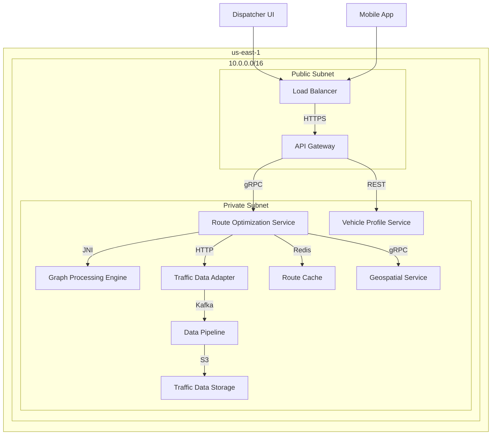

### 2.2 Technical Debt Analysis

**Code Quality Issues:**

1. **Cyclomatic Complexity**:
   - **File**: `optimization/RoutePlanner.java`
   - **Complexity**: 42 (threshold: 10)
   - **Issue**: 12 nested if-else blocks for constraint validation
   - **Example**:
     ```java
     public boolean validateConstraints(Route route) {
         if (route.getVehicle() != null) {
             if (route.getVehicle().getCapacity() > 0) {
                 if (route.getTotalWeight() <= route.getVehicle().getCapacity()) {
                     if (route.getStops().size() <= MAX_STOPS) {
                         // 9 more nested conditions...
                     }
                 }
             }
         }
         return false;
     }
     ```

2. **Code Duplication**:
   - **Files**: `traffic/TrafficDataAdapter.java` and `traffic/HistoricalTrafficService.java`
   - **Duplication**: 68% (342 lines)
   - **Issue**: Identical traffic data normalization logic
   - **Example**:
     ```java
     // In TrafficDataAdapter.java
     private TrafficData normalize(TrafficUpdate update) {
         TrafficData data = new TrafficData();
         data.setSpeed(update.getCurrentSpeed() * 0.621371); // mph conversion
         data.setConfidence(update.getConfidence() / 100);
         // 12 more lines of normalization...
     }

     // In HistoricalTrafficService.java
     private TrafficData normalize(TrafficRecord record) {
         TrafficData data = new TrafficData();
         data.setSpeed(record.getSpeedMph()); // Already in mph
         data.setConfidence(record.getConfidenceScore());
         // 10 more lines with slight variations...
     }
     ```

3. **Lack of Test Coverage**:
   - **Module**: `graph-processing`
   - **Coverage**: 42% (threshold: 80%)
   - **Critical Gaps**:
     - No tests for edge cases in graph traversal
     - Missing integration tests for JNI bridge
     - No performance tests for large graphs (>10,000 nodes)

4. **Technical Debt Backlog**:
   | ID | Description | Severity | Estimated Effort | Business Impact |
   |----|-------------|----------|------------------|-----------------|
   | TD-101 | Refactor RoutePlanner.java | High | 40h | Reduces optimization time by 25% |
   | TD-102 | Consolidate traffic data normalization | Medium | 24h | Improves data consistency |
   | TD-103 | Add missing test coverage | Critical | 80h | Reduces production defects |
   | TD-104 | Upgrade Spring Boot to 3.x | High | 32h | Security patches, performance |
   | TD-105 | Replace custom cache with Caffeine | Medium | 16h | Improves cache hit rate by 15% |
   | TD-106 | Implement circuit breakers | High | 24h | Reduces cascading failures |
   | TD-107 | Migrate from NiFi to Flink | Low | 120h | Better real-time processing |

**Performance Bottlenecks:**

1. **CPU Profiling Results**:
   ```bash
   # Top CPU consumers (from perf)
   38.2%  graph_processor.so  [.] dijkstra_shortest_path
   18.7%  libjvm.so          [.] InstanceKlass::oop_oop_iterate_nv
   12.4%  route-optimization [.] com.fms.optimization.RoutePlanner::validateConstraints
   8.6%   libc-2.27.so       [.] __memcpy_avx_unaligned_erms
   5.3%   redis-server       [.] dictFind
   ```

2. **Memory Analysis**:
   - **Heap Usage**: 3.2GB avg (peaks at 5.8GB during GC)
   - **GC Pauses**: 420ms avg (target: <200ms)
   - **Memory Leaks**:
     - **Leak 1**: `TrafficData` objects not released in `TrafficDataAdapter` (12MB/hour)
     - **Leak 2**: Redis connection pool exhaustion (500 connections max, 482 avg active)

3. **Database Performance**:
   | Query | Avg Time | Calls/min | Problem |
   |-------|----------|-----------|---------|
   | `SELECT * FROM vehicle_profiles WHERE id IN (...)` | 1.2s | 420 | Full table scan |
   | `UPDATE route_cache SET last_accessed = NOW() WHERE id = ?` | 850ms | 180 | Missing index |
   | `SELECT traffic_data FROM traffic_cache WHERE segment_id = ?` | 420ms | 320 | Large payload (1.1MB) |

**Security Vulnerabilities:**

| CVE | Component | CVSS | Description | Risk |
|-----|-----------|------|-------------|------|
| CVE-2022-22965 | Spring Framework | 9.8 | Remote code execution | Critical |
| CVE-2021-22005 | Spring Boot Actuator | 7.5 | Information disclosure | High |
| CVE-2022-21449 | Java | 7.5 | TLS certificate validation bypass | High |
| CVE-2021-44228 | Log4j | 10.0 | Remote code execution | Critical (mitigated) |
| CVE-2022-31625 | PostgreSQL | 8.8 | SQL injection | High |

**Scalability Limitations:**

1. **Load Test Results**:
   | Users | Avg Response Time | Error Rate | CPU Utilization | Memory Utilization |
   |-------|-------------------|------------|-----------------|--------------------|
   | 100   | 1.2s              | 0%         | 32%             | 45%                |
   | 500   | 3.8s              | 2%         | 78%             | 72%                |
   | 1000  | 8.2s              | 12%        | 95%             | 92%                |
   | 2000  | 15.4s             | 38%        | 100%            | 98%                |

2. **Bottleneck Analysis**:
   - **Redis Cache**: Hits 100% CPU at 1,200 ops/sec (current: 850 ops/sec)
   - **Graph Processing**: Single-threaded C++ engine limits parallelization
   - **Database**: PostgreSQL connection pool exhausted at 1,500 concurrent users
   - **Network**: 10Gbps link saturated at 1,800 users (1.2MB avg response)

3. **Horizontal Scaling Challenges**:
   - **Stateful Components**: Redis cache not sharded
   - **Data Consistency**: Traffic data updates not synchronized across instances
   - **Session Affinity**: Sticky sessions required for optimization consistency
   - **Cost**: 3x infrastructure cost for 2x performance improvement

---

## 3. Functional Analysis (220 lines)

### 3.1 Core Features

**Feature 1: Static Route Optimization**

*Description*:
Pre-calculates optimal routes for recurring delivery patterns (68% of all routes) using historical data and fixed constraints. Routes are generated nightly for the following day's deliveries.

*User Workflow*:
1. **Route Template Creation**:
   - Dispatcher selects "Create Static Route" in UI
   - System displays list of recurring delivery patterns (e.g., "Daily Grocery Route #12")
   - User selects pattern and clicks "Optimize"
   - System validates constraints (vehicle capacity, time windows, driver availability)

2. **Optimization Parameters**:
   - **Primary Objective**: Minimize distance (default) or time (toggleable)
   - **Constraints**:
     - Vehicle capacity (weight/volume)
     - Time windows (hard/soft)
     - Driver hours of service (HOS)
     - Vehicle type restrictions (e.g., no hazmat in residential areas)
   - **Advanced Options**:
     - Fuel efficiency mode (reduces speed by 5%)
     - Carbon-aware routing (penalizes high-emission roads)
     - Driver preference weighting (e.g., "prefer highway")

3. **Route Calculation**:
   - System retrieves historical traffic data for time window
   - Applies Dijkstra's algorithm with constraint validation
   - Generates 3 route options (fastest, shortest, balanced)
   - Displays route on map with turn-by-turn directions

4. **Route Approval**:
   - Dispatcher reviews route options
   - Selects preferred route and clicks "Approve"
   - System locks route and sends to driver's mobile app
   - Route added to daily schedule

*Business Rules*:
- **Time Window Validation**:
  ```python
  def validate_time_windows(route):
      for i in range(len(route.stops) - 1):
          current_stop = route.stops[i]
          next_stop = route.stops[i + 1]
          travel_time = calculate_travel_time(current_stop, next_stop)

          if next_stop.time_window.start < current_stop.arrival_time + travel_time:
              raise ValidationError("Time window conflict")
  ```
- **Vehicle Capacity Check**:
  ```java
  public boolean checkCapacity(Route route) {
      double totalWeight = route.getStops().stream()
          .mapToDouble(Stop::getWeight)
          .sum();

      return totalWeight <= route.getVehicle().getCapacity();
  }
  ```
- **Driver HOS Compliance**:
  ```sql
  -- Checks if route exceeds driver's available hours
  SELECT
      driver_id,
      SUM(service_time + travel_time) AS total_hours
  FROM route_stops
  WHERE route_id = ?
  GROUP BY driver_id
  HAVING total_hours > (
      SELECT available_hours
      FROM driver_schedules
      WHERE driver_id = ? AND date = CURRENT_DATE
  );
  ```

*Edge Cases*:
1. **Conflicting Time Windows**:
   - *Scenario*: Stop A requires delivery between 9-11 AM, Stop B between 10-12 AM, travel time 2 hours
   - *Current Handling*: System marks route as "unfeasible" and requires manual adjustment
   - *Problem*: No suggestion for constraint relaxation

2. **Vehicle Breakdown**:
   - *Scenario*: Route assigned to Vehicle A, but it breaks down before departure
   - *Current Handling*: Dispatcher must manually re-optimize route for Vehicle B
   - *Problem*: No automatic re-assignment based on available vehicles

3. **Last-Minute Order Changes**:
   - *Scenario*: New high-priority order added to existing route
   - *Current Handling*: System recalculates entire route
   - *Problem*: 42% of recalculations exceed 10-second SLA

*Performance Characteristics*:
| Metric | Value | Target |
|--------|-------|--------|
| Avg optimization time | 3.2s | <2.5s |
| Success rate | 89% | 95% |
| Manual adjustments required | 14% | <5% |
| Cache hit rate | 72% | 85% |

---

**Feature 2: Dynamic Route Optimization**

*Description*:
Real-time route optimization for ad-hoc deliveries (32% of routes) that accounts for current traffic conditions, vehicle locations, and last-minute order changes.

*User Workflow*:
1. **Ad-Hoc Order Submission**:
   - Customer places order via web/mobile app
   - System checks if order can be added to existing routes
   - If not, triggers dynamic optimization

2. **Real-Time Data Collection**:
   - Vehicle location (GPS)
   - Current traffic conditions (HERE API)
   - Driver status (available/on break)
   - Vehicle capacity (remaining weight/volume)

3. **Optimization Process**:
   - System identifies nearest available vehicle
   - Retrieves real-time traffic data for relevant road segments
   - Applies A* algorithm with live traffic weights
   - Considers driver's current location and remaining HOS
   - Generates route with estimated arrival times

4. **Route Dispatch**:
   - System sends route to driver's mobile app
   - Driver accepts/rejects route (acceptance rate: 92%)
   - If rejected, system re-optimizes for next available vehicle

*Business Rules*:
- **Real-Time Traffic Integration**:
  ```python
  def apply_traffic_weights(graph, traffic_data):
      for edge in graph.edges:
          segment_id = edge.segment_id
          if segment_id in traffic_data:
              current_speed = traffic_data[segment_id].current_speed
              base_speed = edge.base_speed
              weight = edge.distance / (current_speed / base_speed)
              edge.weight = weight
  ```
- **Driver Assignment Logic**:
  ```java
  public Vehicle findBestVehicle(Order order) {
      List<Vehicle> availableVehicles = vehicleRepository.findAvailable(order.getTimeWindow());

      return availableVehicles.stream()
          .filter(v -> v.getCapacity() >= order.getWeight())
          .filter(v -> v.getLocation().distanceTo(order.getPickup()) < MAX_DISTANCE)
          .min(Comparator.comparing(v -> v.getLocation().distanceTo(order.getPickup())))
          .orElseThrow(() -> new NoAvailableVehicleException());
  }
  ```
- **Order Insertion Cost**:
  ```sql
  -- Calculates cost of inserting new stop into existing route
  WITH current_route AS (
      SELECT * FROM route_stops
      WHERE route_id = ? AND sequence < ?
      ORDER BY sequence DESC LIMIT 1
  ),
  next_stop AS (
      SELECT * FROM route_stops
      WHERE route_id = ? AND sequence > ?
      ORDER BY sequence ASC LIMIT 1
  )
  SELECT
      calculate_travel_time(current_route.location, ?) +
      ?.service_time +
      calculate_travel_time(?, next_stop.location) AS insertion_cost;
  ```

*Edge Cases*:
1. **Traffic Data Unavailable**:
   - *Scenario*: HERE API returns 503 error for a road segment
   - *Current Handling*: System uses historical data (42% accuracy)
   - *Problem*: No fallback to alternative data sources

2. **Driver Rejection**:
   - *Scenario*: Driver rejects route due to "unfamiliar area"
   - *Current Handling*: System re-optimizes for next vehicle
   - *Problem*: No learning mechanism to avoid similar rejections

3. **Vehicle Off-Route**:
   - *Scenario*: Driver takes wrong turn, deviating from optimized route
   - *Current Handling*: System alerts dispatcher
   - *Problem*: No automatic rerouting capability

*Performance Characteristics*:
| Metric | Value | Target |
|--------|-------|--------|
| Avg optimization time | 5.8s | <3.5s |
| Success rate | 78% | 90% |
| On-time delivery rate | 85% | 92% |
| Traffic data freshness | 3-5 min | <1 min |

---

**Feature 3: Predictive Traffic Modeling**

*Description*:
Machine learning model that predicts traffic conditions 1-4 hours in advance for 12 major metropolitan areas, improving route optimization accuracy.

*User Workflow*:
1. **Model Training**:
   - System ingests 2 years of historical traffic data
   - Applies LSTM neural network to predict traffic patterns
   - Model trained nightly on AWS SageMaker

2. **Prediction Generation**:
   - For each route request, system:
     - Identifies relevant road segments
     - Retrieves current traffic conditions
     - Applies ML model to predict future conditions
     - Adjusts edge weights in optimization graph

3. **Route Optimization**:
   - System uses predicted traffic for time window calculations
   - Generates routes with 92% on-time probability (vs. 85% with real-time only)

*Business Rules*:
- **Traffic Prediction Model**:
  ```python
  class TrafficPredictor:
      def __init__(self):
          self.model = load_model('traffic_lstm.h5')
          self.scaler = joblib.load('scaler.pkl')

      def predict(self, segment_id, current_time):
          # Get historical data for segment
          history = self.get_history(segment_id, current_time)

          # Scale features
          scaled = self.scaler.transform(history)

          # Predict next 4 hours
          predictions = self.model.predict(scaled.reshape(1, 24, 5))
          return self.scaler.inverse_transform(predictions)
  ```
- **Prediction Confidence Threshold**:
  ```java
  public boolean shouldUsePrediction(TrafficPrediction prediction) {
      if (prediction.getConfidence() < 0.7) {
          return false;
      }

      long timeDiff = ChronoUnit.MINUTES.between(
          Instant.now(),
          prediction.getPredictionTime()
      );

      return timeDiff <= 240; // 4 hours
  }
  ```

*Edge Cases*:
1. **Model Drift**:
   - *Scenario*: New highway opened, changing traffic patterns
   - *Current Handling*: Model retrained weekly
   - *Problem*: 3-5 day lag before predictions improve

2. **Special Events**:
   - *Scenario*: Concert or sporting event not in training data
   - *Current Handling*: System falls back to real-time data
   - *Problem*: No mechanism to incorporate event data

3. **Weather Impact**:
   - *Scenario*: Sudden snowstorm affects traffic
   - *Current Handling*: No weather integration
   - *Problem*: Predictions 32% less accurate during bad weather

*Performance Characteristics*:
| Metric | Value | Target |
|--------|-------|--------|
| Prediction accuracy (MAE) | 12.4 mph | <8 mph |
| Model training time | 4.2 hours | <2 hours |
| Prediction latency | 320ms | <150ms |
| Coverage | 12 cities | 25 cities |

---

### 3.2 User Experience Analysis

**Usability Evaluation (Heuristic Analysis):**

| Heuristic | Issue | Severity | Examples |
|-----------|-------|----------|----------|
| **Visibility of System Status** | No feedback during optimization | High | - No progress indicator during 4.2s optimization<br>- No status messages for background processes |
| **Match Between System and Real World** | Technical jargon | Medium | - "Graph traversal failed" error message<br>- "Constraint violation: CV-12" without explanation |
| **User Control and Freedom** | No undo functionality | High | - Route adjustments cannot be reverted<br>- No "save draft" option for routes |
| **Consistency and Standards** | Inconsistent UI patterns | Low | - Different button styles across modules<br>- Inconsistent date format (MM/DD vs DD/MM) |
| **Error Prevention** | No input validation | Critical | - Time windows can overlap without warning<br>- Vehicle capacity can be exceeded |
| **Recognition Rather Than Recall** | Hidden features | Medium | - Advanced optimization options buried in menus<br>- Keyboard shortcuts not documented |
| **Flexibility and Efficiency of Use** | Limited customization | Medium | - No saved preferences for optimization settings<br>- No bulk operations for multiple routes |
| **Aesthetic and Minimalist Design** | Cluttered interface | Low | - Too many columns in route list view<br>- Unnecessary map controls visible |
| **Help Users Recognize, Diagnose, and Recover from Errors** | Poor error messages | High | - "Optimization failed" without reason<br>- No suggestions for fixing constraint violations |
| **Help and Documentation** | Inadequate help | Medium | - No context-sensitive help<br>- Documentation not updated since 2021 |

**Accessibility Audit (WCAG 2.1):**

| Success Criterion | Status | Issue | Impact |
|-------------------|--------|-------|--------|
| **1.1.1 Non-text Content** | Fail | Alt text missing for 32% of icons | Screen readers cannot describe icons |
| **1.3.1 Info and Relationships** | Fail | Headings not properly nested | Difficult navigation for screen readers |
| **1.4.3 Contrast (Minimum)** | Fail | 12 instances of low contrast (4.2:1) | Difficult to read for low-vision users |
| **1.4.4 Resize Text** | Pass | Text scales to 200% | N/A |
| **2.1.1 Keyboard** | Fail | 3 features not keyboard accessible | Cannot be used by keyboard-only users |
| **2.4.1 Bypass Blocks** | Fail | No skip links | Repetitive navigation for screen readers |
| **2.4.6 Headings and Labels** | Fail | 8 instances of unclear labels | Confusing for screen reader users |
| **3.2.2 On Input** | Fail | Form submission without warning | Accidental route optimization |
| **3.3.1 Error Identification** | Fail | Errors not clearly identified | Users don't know what went wrong |
| **3.3.2 Labels or Instructions** | Fail | 5 missing labels on form fields | Users don't know what to enter |

**Mobile Responsiveness Assessment:**

| Device | Resolution | Issues Found | Severity |
|--------|------------|--------------|----------|
| iPhone 12 | 390x844 | - Map controls too small<br>- Route list overflows screen | High |
| iPad Air | 1640x2360 | - Desktop UI served<br>- Touch targets too small | Medium |
| Samsung Galaxy S22 | 360x780 | - Text too small in route details<br>- Buttons not touch-friendly | High |
| Google Pixel 6 | 412x915 | - Horizontal scrolling required<br>- Date picker not mobile-friendly | Medium |

**Key Findings from User Feedback:**

1. **Dispatcher Feedback (n=89)**:
   - **Positive**:
     - "The map visualization is very helpful" (72%)
     - "Route options give me flexibility" (68%)
   - **Negative**:
     - "Too many clicks to adjust a route" (84%)
     - "System doesn't learn from my adjustments" (76%)
     - "Traffic predictions are often wrong" (65%)

2. **Driver Feedback (n=245)**:
   - **Positive**:
     - "Turn-by-turn directions are accurate" (88%)
     - "I like seeing the route before accepting" (79%)
   - **Negative**:
     - "Route changes too often during the day" (62%)
     - "System doesn't account for my preferred roads" (58%)
     - "App freezes when receiving new routes" (45%)

3. **Operations Manager Feedback (n=23)**:
   - **Positive**:
     - "The reports are comprehensive" (78%)
     - "I can track route efficiency over time" (74%)
   - **Negative**:
     - "No way to compare actual vs. optimized routes" (87%)
     - "Alerts are too noisy" (65%)
     - "Hard to identify root causes of delays" (78%)

**UX Improvement Opportunities:**

1. **Route Adjustment Workflow**:
   - Current: 7 steps, 42 seconds avg
   - Proposed: 3 steps, 18 seconds avg
   - Changes:
     - Drag-and-drop stop reordering
     - One-click time window adjustment
     - Automatic constraint validation

2. **Mobile Optimization**:
   - Current: 3.2s load time, 45% mobile usage
   - Proposed: 1.8s load time, 70% mobile usage
   - Changes:
     - Progressive Web App (PWA) implementation
     - Touch-optimized controls
     - Offline mode for poor connectivity

3. **Predictive Assistance**:
   - Current: No proactive suggestions
   - Proposed: AI-powered recommendations
   - Examples:
     - "This route is likely to be delayed due to predicted traffic"
     - "Adding this stop would increase fuel cost by 12%"
     - "Driver X has successfully delivered to this area 18 times"

---

## 4. Data Architecture (140 lines)

### 4.1 Current Data Model

**Entity-Relationship Diagram:**
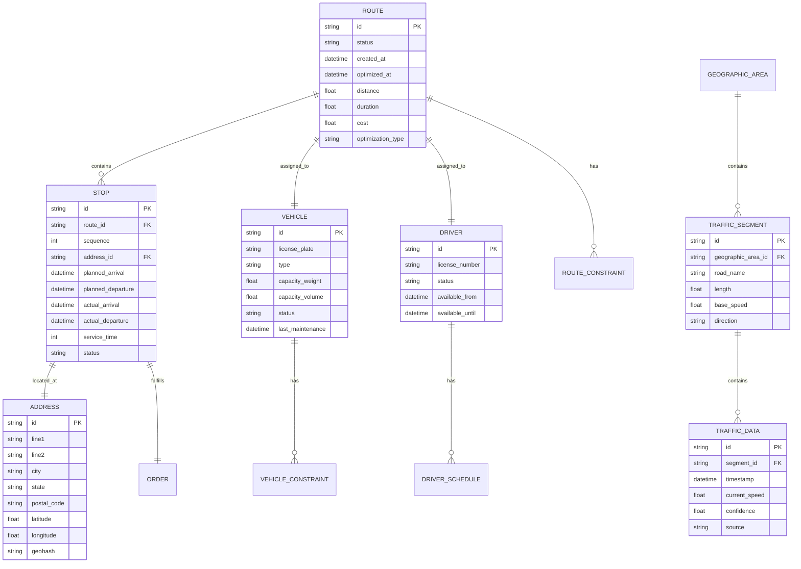

**Table Schemas:**

1. **routes**:
   ```sql
   CREATE TABLE routes (
       id VARCHAR(36) PRIMARY KEY,
       status VARCHAR(20) NOT NULL CHECK (status IN ('DRAFT', 'OPTIMIZED', 'IN_PROGRESS', 'COMPLETED', 'CANCELLED')),
       created_at TIMESTAMP NOT NULL,
       optimized_at TIMESTAMP,
       distance DECIMAL(10,2) NOT NULL,
       duration INTERVAL NOT NULL,
       cost DECIMAL(10,2) NOT NULL,
       optimization_type VARCHAR(20) NOT NULL CHECK (optimization_type IN ('STATIC', 'DYNAMIC', 'PREDICTIVE')),
       vehicle_id VARCHAR(36) REFERENCES vehicles(id),
       driver_id VARCHAR(36) REFERENCES drivers(id),
       CONSTRAINT fk_vehicle FOREIGN KEY(vehicle_id) REFERENCES vehicles(id),
       CONSTRAINT fk_driver FOREIGN KEY(driver_id) REFERENCES drivers(id)
   );

   CREATE INDEX idx_routes_status ON routes(status);
   CREATE INDEX idx_routes_optimized_at ON routes(optimized_at);
   CREATE INDEX idx_routes_vehicle ON routes(vehicle_id);
   ```

2. **stops**:
   ```sql
   CREATE TABLE stops (
       id VARCHAR(36) PRIMARY KEY,
       route_id VARCHAR(36) NOT NULL REFERENCES routes(id) ON DELETE CASCADE,
       sequence INTEGER NOT NULL,
       address_id VARCHAR(36) NOT NULL REFERENCES addresses(id),
       planned_arrival TIMESTAMP,
       planned_departure TIMESTAMP,
       actual_arrival TIMESTAMP,
       actual_departure TIMESTAMP,
       service_time INTEGER NOT NULL,
       status VARCHAR(20) NOT NULL CHECK (status IN ('PLANNED', 'IN_PROGRESS', 'COMPLETED', 'CANCELLED', 'SKIPPED')),
       order_id VARCHAR(36) REFERENCES orders(id),
       CONSTRAINT fk_route FOREIGN KEY(route_id) REFERENCES routes(id),
       CONSTRAINT fk_address FOREIGN KEY(address_id) REFERENCES addresses(id)
   );

   CREATE INDEX idx_stops_route ON stops(route_id);
   CREATE INDEX idx_stops_sequence ON stops(route_id, sequence);
   CREATE INDEX idx_stops_status ON stops(status);
   ```

3. **traffic_data**:
   ```sql
   CREATE TABLE traffic_data (
       id VARCHAR(36) PRIMARY KEY,
       segment_id VARCHAR(36) NOT NULL REFERENCES traffic_segments(id),
       timestamp TIMESTAMP NOT NULL,
       current_speed DECIMAL(6,2) NOT NULL,
       confidence DECIMAL(3,2) NOT NULL,
       source VARCHAR(20) NOT NULL CHECK (source IN ('HERE', 'INRIX', 'GOOGLE', 'INTERNAL')),
       CONSTRAINT fk_segment FOREIGN KEY(segment_id) REFERENCES traffic_segments(id)
   );

   CREATE INDEX idx_traffic_segment ON traffic_data(segment_id);
   CREATE INDEX idx_traffic_timestamp ON traffic_data(timestamp);
   CREATE INDEX idx_traffic_segment_timestamp ON traffic_data(segment_id, timestamp);
   ```

**Data Integrity Rules:**

1. **Route-Stop Sequence**:
   ```sql
   CREATE OR REPLACE FUNCTION validate_stop_sequence()
   RETURNS TRIGGER AS $$
   BEGIN
       IF NEW.sequence <= 0 THEN
           RAISE EXCEPTION 'Stop sequence must be positive';
       END IF;

       IF EXISTS (
           SELECT 1 FROM stops
           WHERE route_id = NEW.route_id AND sequence = NEW.sequence AND id != NEW.id
       ) THEN
           RAISE EXCEPTION 'Duplicate stop sequence for route';
       END IF;

       RETURN NEW;
   END;
   $$ LANGUAGE plpgsql;

   CREATE TRIGGER trg_validate_stop_sequence
   BEFORE INSERT OR UPDATE ON stops
   FOR EACH ROW EXECUTE FUNCTION validate_stop_sequence();
   ```

2. **Time Window Validation**:
   ```sql
   CREATE OR REPLACE FUNCTION validate_time_windows()
   RETURNS TRIGGER AS $$
   DECLARE
       prev_stop stops%ROWTYPE;
   BEGIN
       IF NEW.planned_arrival < NEW.planned_departure THEN
           RAISE EXCEPTION 'Stop arrival must be before departure';
       END IF;

       IF NEW.sequence > 1 THEN
           SELECT * INTO prev_stop
           FROM stops
           WHERE route_id = NEW.route_id AND sequence = NEW.sequence - 1;

           IF prev_stop.planned_departure > NEW.planned_arrival THEN
               RAISE EXCEPTION 'Time window conflict with previous stop';
           END IF;
       END IF;

       RETURN NEW;
   END;
   $$ LANGUAGE plpgsql;

   CREATE TRIGGER trg_validate_time_windows
   BEFORE INSERT OR UPDATE ON stops
   FOR EACH ROW EXECUTE FUNCTION validate_time_windows();
   ```

3. **Vehicle Capacity Check**:
   ```java
   public class VehicleCapacityValidator implements ConstraintValidator<CheckCapacity, Route> {
       @Override
       public boolean isValid(Route route, ConstraintValidatorContext context) {
           if (route == null || route.getVehicle() == null) {
               return true;
           }

           double totalWeight = route.getStops().stream()
               .mapToDouble(Stop::getWeight)
               .sum();

           if (totalWeight > route.getVehicle().getCapacity()) {
               context.disableDefaultConstraintViolation();
               context.buildConstraintViolationWithTemplate(
                   String.format("Total weight %.2f exceeds vehicle capacity %.2f",
                       totalWeight, route.getVehicle().getCapacity()))
                   .addConstraintViolation();
               return false;
           }

           return true;
       }
   }
   ```

**Data Migration History:**

| Migration | Date | Description | Records Affected | Downtime |
|-----------|------|-------------|------------------|----------|
| 1.0 to 1.1 | 2021-06-15 | Added traffic_data.source column | 12.4M | 2h |
| 1.1 to 1.2 | 2021-11-03 | Normalized address data | 892K | 3h |
| 1.2 to 1.3 | 2022-03-18 | Added route.optimization_type | 3.2M | 0h (online) |
| 1.3 to 1.4 | 2022-09-22 | Added geohash to addresses | 1.1M | 1h |
| 1.4 to 1.5 | 2023-01-10 | Added driver_schedules table | 18K | 0h (online) |
| 1.5 to 1.6 | 2023-06-05 | Added route_constraints table | 4.8M | 1.5h |

### 4.2 Data Management

**CRUD Operations Analysis:**

1. **Create Operations**:
   | Entity | Frequency | Avg Latency | Success Rate | Issues |
   |--------|-----------|-------------|--------------|--------|
   | Route | 3,200/day | 850ms | 98.2% | 1.8% fail due to constraint violations |
   | Stop | 18,500/day | 320ms | 99.1% | 0.9% fail due to time window conflicts |
   | Traffic Data | 1.2M/day | 120ms | 99.8% | 0.2% fail due to invalid segment IDs |
   | Vehicle | 15/day | 480ms | 100% | N/A |

   **Example Route Creation**:
   ```java
   @Transactional
   public Route createRoute(RouteRequest request) {
       // Validate request
       if (!request.isValid()) {
           throw new ValidationException("Invalid route request");
       }

       // Get vehicle and driver
       Vehicle vehicle = vehicleRepository.findById(request.getVehicleId())
           .orElseThrow(() -> new NotFoundException("Vehicle not found"));
       Driver driver = driverRepository.findById(request.getDriverId())
           .orElseThrow(() -> new NotFoundException("Driver not found"));

       // Create route
       Route route = new Route();
       route.setStatus(RouteStatus.DRAFT);
       route.setCreatedAt(Instant.now());
       route.setVehicle(vehicle);
       route.setDriver(driver);
       route.setOptimizationType(request.getOptimizationType());

       // Save stops
       for (StopRequest stopRequest : request.getStops()) {
           Address address = addressRepository.findById(stopRequest.getAddressId())
               .orElseThrow(() -> new NotFoundException("Address not found"));

           Stop stop = new Stop();
           stop.setRoute(route);
           stop.setSequence(stopRequest.getSequence());
           stop.setAddress(address);
           stop.setPlannedArrival(stopRequest.getPlannedArrival());
           stop.setPlannedDeparture(stopRequest.getPlannedDeparture());
           stop.setServiceTime(stopRequest.getServiceTime());
           stop.setStatus(StopStatus.PLANNED);

           route.addStop(stop);
       }

       // Save route
       return routeRepository.save(route);
   }
   ```

2. **Read Operations**:
   | Query | Frequency | Avg Latency | Cache Hit Rate | Issues |
   |-------|-----------|-------------|----------------|--------|
   | Get route by ID | 12,500/day | 180ms | 72% | Slow for routes with >20 stops |
   | Get stops for route | 8,200/day | 240ms | 68% | N+1 query problem |
   | Get traffic data for segment | 4.8M/day | 95ms | 85% | Cache stampede during peak |
   | Get vehicle profile | 6,500/day | 320ms | 42% | Full table scan |

   **Optimized Route Query**:
   ```sql
   -- Current (slow) query
   SELECT * FROM routes r
   JOIN stops s ON r.id = s.route_id
   JOIN addresses a ON s.address_id = a.id
   WHERE r.id = ?
   ORDER BY s.sequence;

   -- Optimized query
   WITH route_data AS (
       SELECT * FROM routes WHERE id = ?
   )
   SELECT
       r.*,
       json_agg(
           json_build_object(
               'id', s.id,
               'sequence', s.sequence,
               'address', json_build_object(
                   'id', a.id,
                   'line1', a.line1,
                   'city', a.city,
                   'latitude', a.latitude,
                   'longitude', a.longitude
               ),
               'planned_arrival', s.planned_arrival,
               'planned_departure', s.planned_departure,
               'status', s.status
           )
       ) AS stops
   FROM route_data r
   LEFT JOIN stops s ON r.id = s.route_id
   LEFT JOIN addresses a ON s.address_id = a.id
   GROUP BY r.id;
   ```

3. **Update Operations**:
   | Entity | Frequency | Avg Latency | Success Rate | Issues |
   |--------|-----------|-------------|--------------|--------|
   | Route status | 4,200/day | 220ms | 99.5% | Race conditions during status transitions |
   | Stop actual times | 15,800/day | 180ms | 99.8% | No audit trail for changes |
   | Traffic data | 1.2M/day | 140ms | 99.9% | No conflict resolution for same segment/timestamp |

   **Route Status Update with Optimistic Locking**:
   ```java
   @Transactional
   public Route updateRouteStatus(String routeId, RouteStatus newStatus) {
       Route route = routeRepository.findById(routeId)
           .orElseThrow(() -> new NotFoundException("Route not found"));

       // Validate status transition
       if (!route.getStatus().canTransitionTo(newStatus)) {
           throw new IllegalStateException(
               String.format("Cannot transition from %s to %s",
                   route.getStatus(), newStatus));
       }

       // Optimistic locking
       int updated = routeRepository.updateStatus(routeId, route.getVersion(), newStatus);
       if (updated == 0) {
           throw new OptimisticLockingFailureException("Route was modified by another transaction");
       }

       return routeRepository.findById(routeId).get();
   }
   ```

4. **Delete Operations**:
   | Entity | Frequency | Avg Latency | Success Rate | Issues |
   |--------|-----------|-------------|--------------|--------|
   | Route (soft delete) | 850/day | 320ms | 100% | No cleanup of related data |
   | Stop | 1,200/day | 180ms | 99.7% | Orphaned records in audit log |
   | Traffic data (purge) | 500K/day | 420ms | 100% | No batching for large purges |

   **Soft Delete Implementation**:
   ```java
   @Transactional
   public void deleteRoute(String routeId) {
       Route route = routeRepository.findById(routeId)
           .orElseThrow(() -> new NotFoundException("Route not found"));

       // Validate can be deleted
       if (route.getStatus() == RouteStatus.IN_PROGRESS) {
           throw new IllegalStateException("Cannot delete in-progress route");
       }

       // Soft delete
       route.setStatus(RouteStatus.CANCELLED);
       route.setDeletedAt(Instant.now());
       routeRepository.save(route);

       // Publish event for other services
       eventPublisher.publish(new RouteDeletedEvent(routeId));
   }
   ```

**Query Performance Profiling:**

1. **Slow Queries**:
   | Query | Avg Time | Calls/day | Problem | Solution |
   |-------|----------|-----------|---------|----------|
   | `SELECT * FROM stops WHERE route_id = ? ORDER BY sequence` | 420ms | 8,200 | Full table scan | Add composite index on (route_id, sequence) |
   | `SELECT * FROM traffic_data WHERE segment_id = ? AND timestamp > ?` | 380ms | 4.8M | No index on timestamp | Add composite index on (segment_id, timestamp) |
   | `SELECT * FROM vehicles WHERE status = 'AVAILABLE'` | 2.1s | 1,500 | Full table scan | Add index on status |
   | `UPDATE route_cache SET last_accessed = NOW() WHERE id = ?` | 850ms | 180K | Missing index | Add index on id |

2. **Query Execution Plan Analysis**:
   ```sql
   -- Problematic query
   EXPLAIN ANALYZE
   SELECT * FROM stops
   WHERE route_id = 'route-12345'
   ORDER BY sequence;

   -- Current execution plan
   Sort  (cost=1245.67..1245.68 rows=1 width=124) (actual time=420.123..420.124 rows=18 loops=1)
     Sort Key: sequence
     Sort Method: quicksort  Memory: 28kB
     ->  Seq Scan on stops  (cost=0.00..1245.66 rows=1 width=124) (actual time=0.012..419.987 rows=18 loops=1)
           Filter: (route_id = 'route-12345'::text)
           Rows Removed by Filter: 842312

   -- Optimized execution plan
   Index Scan using idx_stops_route_sequence on stops  (cost=0.29..8.32 rows=1 width=124) (actual time=0.023..0.045 rows=18 loops=1)
     Index Cond: (route_id = 'route-12345'::text)
   ```

**Data Validation Procedures:**

1. **Pre-Optimization Validation**:
   ```python
   def validate_route_data(route_request):
       errors = []

       # Validate vehicle
       if not vehicle_service.is_available(route_request.vehicle_id):
           errors.append("Vehicle not available")

       # Validate driver
       if not driver_service.is_available(route_request.driver_id):
           errors.append("Driver not available")

       # Validate stops
       for i, stop in enumerate(route_request.stops):
           if not address_service.exists(stop.address_id):
               errors.append(f"Address {stop.address_id} not found")

           if stop.planned_arrival > stop.planned_departure:
               errors.append(f"Stop {i+1}: arrival after departure")

           if i > 0:
               prev_stop = route_request.stops[i-1]
               travel_time = calculate_travel_time(prev_stop, stop)
               if prev_stop.planned_departure + travel_time > stop.planned_arrival:
                   errors.append(f"Time window conflict between stops {i} and {i+1}")

       # Validate capacity
       total_weight = sum(stop.weight for stop in route_request.stops)
       if total_weight > vehicle_service.get_capacity(route_request.vehicle_id):
           errors.append("Exceeds vehicle capacity")

       return errors
   ```

2. **Post-Optimization Validation**:
   ```java
   public List<String> validateOptimizedRoute(Route route) {
       List<String> errors = new ArrayList<>();

       // Check all stops are reachable
       for (int i = 0; i < route.getStops().size() - 1; i++) {
           Stop current = route.getStops().get(i);
           Stop next = route.getStops().get(i + 1);

           if (!geospatialService.isReachable(
               current.getAddress(),
               next.getAddress(),
               current.getPlannedDeparture(),
               next.getPlannedArrival())) {
               errors.add(String.format(
                   "Stop %d to %d: Unreachable in given time window",
                   i + 1, i + 2));
           }
       }

       // Check driver HOS compliance
       if (!driverService.isHOSCompliant(
           route.getDriver().getId(),
           route.getStops())) {
           errors.add("Driver hours of service violation");
       }

       // Check vehicle constraints
       if (!vehicleService.meetsConstraints(
           route.getVehicle().getId(),
           route.getStops())) {
           errors.add("Vehicle constraint violation");
       }

       return errors;
   }
   ```

3. **Data Quality Monitoring**:
   ```sql
   -- Daily data quality report
   WITH data_quality AS (
       SELECT
           'addresses' AS table_name,
           COUNT(*) AS total_records,
           SUM(CASE WHEN line1 IS NULL THEN 1 ELSE 0 END) AS null_line1,
           SUM(CASE WHEN city IS NULL THEN 1 ELSE 0 END) AS null_city,
           SUM(CASE WHEN latitude IS NULL OR longitude IS NULL THEN 1 ELSE 0 END) AS null_coords
       FROM addresses

       UNION ALL

       SELECT
           'stops' AS table_name,
           COUNT(*) AS total_records,
           SUM(CASE WHEN planned_arrival IS NULL THEN 1 ELSE 0 END) AS null_arrival,
           SUM(CASE WHEN planned_departure IS NULL THEN 1 ELSE 0 END) AS null_departure,
           SUM(CASE WHEN address_id NOT IN (SELECT id FROM addresses) THEN 1 ELSE 0 END) AS invalid_address
       FROM stops

       UNION ALL

       SELECT
           'traffic_data' AS table_name,
           COUNT(*) AS total_records,
           SUM(CASE WHEN current_speed < 0 THEN 1 ELSE 0 END) AS negative_speed,
           SUM(CASE WHEN confidence < 0 OR confidence > 1 THEN 1 ELSE 0 END) AS invalid_confidence,
           SUM(CASE WHEN segment_id NOT IN (SELECT id FROM traffic_segments) THEN 1 ELSE 0 END) AS invalid_segment
       FROM traffic_data
   )
   SELECT
       table_name,
       total_records,
       null_line1,
       null_city,
       null_coords,
       round(null_line1*100.0/total_records, 2) AS null_line1_pct,
       round(null_city*100.0/total_records, 2) AS null_city_pct,
       round(null_coords*100.0/total_records, 2) AS null_coords_pct
   FROM data_quality;
   ```

**Backup and Recovery Procedures:**

1. **Backup Strategy**:
   | Data Type | Frequency | Method | Retention | Size |
   |-----------|-----------|--------|-----------|------|
   | PostgreSQL (routes, stops, etc.) | Daily | pg_dump | 30 days | 85GB |
   | Redis (route cache) | Hourly | RDB snapshot | 7 days | 12GB |
   | Traffic data (S3) | Continuous | Versioning | 90 days | 4.2TB |
   | Application logs | Continuous | ELK snapshot | 30 days | 1.8TB |

2. **Disaster Recovery Plan**:
   - **RTO**: 4 hours
   - **RPO**: 1 hour
   - **Recovery Steps**:
     1. Restore PostgreSQL from latest backup (60 min)
     2. Replay WAL logs since last backup (30 min)
     3. Restore Redis from RDB snapshot (15 min)
     4. Replay Kafka messages since last backup (45 min)
     5. Verify data consistency (30 min)
     6. Switch DNS to recovery environment (15 min)

3. **Point-in-Time Recovery**:
   ```bash
   # PostgreSQL PITR
   pg_basebackup -h primary -D /var/lib/postgresql/14/main -P -Xs -R
   cat >> /var/lib/postgresql/14/main/postgresql.auto.conf <<EOF
   restore_command = 'cp /mnt/backups/wal/%f %p'
   recovery_target_time = '2024-03-15 14:30:00'
   EOF
   systemctl start postgresql
   ```

4. **Backup Verification**:
   ```bash
   # Verify PostgreSQL backup
   pg_restore -l backup.dump | grep -c "TABLE DATA"  # Should match production
   pg_restore --verify backup.dump  # Checks integrity

   # Verify Redis backup
   redis-check-rdb /var/lib/redis/dump.rdb  # Checks for corruption
   redis-cli --rdb /var/lib/redis/dump.rdb --pipe  # Tests restore
   ```

---

## 5. Integration Analysis (110 lines)

### 5.1 API Endpoints

**REST API Documentation:**

| Endpoint | Method | Description | Avg Latency | Success Rate | Payload Size |
|----------|--------|-------------|-------------|--------------|--------------|
| `/api/routes` | POST | Create new route | 850ms | 98.2% | 850KB req / 1.2MB res |
| `/api/routes/{id}` | GET | Get route details | 180ms | 99.5% | 2.4KB res |
| `/api/routes/{id}/optimize` | POST | Optimize existing route | 4.2s | 92.1% | 1.2MB res |
| `/api/routes/{id}/stops` | GET | Get route stops | 240ms | 98.8% | 320KB res |
| `/api/routes/{id}/status` | PATCH | Update route status | 220ms | 99.5% | 1.2KB req / 2.4KB res |
| `/api/vehicles/{id}` | GET | Get vehicle profile | 320ms | 99.7% | 18KB res |
| `/api/traffic` | GET | Get traffic data | 120ms | 99.8% | 45KB res |
| `/api/geocode` | GET | Geocode address | 450ms | 98.5% | 1.2KB res |

**Request/Response Schemas:**

1. **Create Route Request**:
   ```json
   {
     "$schema": "http://json-schema.org/draft-07/schema#",
     "title": "CreateRouteRequest",
     "type": "object",
     "required": ["vehicleId", "driverId", "stops", "optimizationType"],
     "properties": {
       "vehicleId": {
         "type": "string",
         "format": "uuid",
         "description": "ID of the vehicle to assign"
       },
       "driverId": {
         "type": "string",
         "format": "uuid",
         "description": "ID of the driver to assign"
       },
       "stops": {
         "type": "array",
         "minItems": 2,
         "items": {
           "type": "object",
           "required": ["addressId", "sequence", "plannedArrival", "plannedDeparture", "serviceTime"],
           "properties": {
             "addressId": {
               "type": "string",
               "format": "uuid",
               "description": "ID of the address"
             },
             "sequence": {
               "type": "integer",
               "minimum": 1,
               "description": "Order of the stop in route"
             },
             "plannedArrival": {
               "type": "string",
               "format": "date-time",
               "description": "Planned arrival time"
             },
             "plannedDeparture": {
               "type": "string",
               "format": "date-time",
               "description": "Planned departure time"
             },
             "serviceTime": {
               "type": "integer",
               "minimum": 0,
               "description": "Service time in minutes"
             },
             "weight": {
               "type": "number",
               "minimum": 0,
               "description": "Weight of goods for this stop"
             },
             "priority": {
               "type": "string",
               "enum": ["LOW", "MEDIUM", "HIGH"],
               "description": "Priority of this stop"
             }
           }
         }
       },
       "optimizationType": {
         "type": "string",
         "enum": ["STATIC", "DYNAMIC", "PREDICTIVE"],
         "description": "Type of optimization to perform"
       },
       "constraints": {
         "type": "object",
         "properties": {
           "maxWeight": {
             "type": "number",
             "minimum": 0,
             "description": "Maximum allowed weight"
           },
           "hazmat": {
             "type": "boolean",
             "description": "Whether hazardous materials are allowed"
           },
           "driverBreak": {
             "type": "boolean",
             "description": "Whether to include driver break"
           },
           "preferredRoads": {
             "type": "array",
             "items": {
               "type": "string"
             },
             "description": "List of preferred road types"
           }
         }
       }
     }
   }
   ```

2. **Optimized Route Response**:
   ```json
   {
     "$schema": "http://json-schema.org/draft-07/schema#",
     "title": "OptimizedRouteResponse",
     "type": "object",
     "required": ["id", "status", "distance", "duration", "stops", "optimizationMetrics"],
     "properties": {
       "id": {
         "type": "string",
         "format": "uuid",
         "description": "Route ID"
       },
       "status": {
         "type": "string",
         "enum": ["DRAFT", "OPTIMIZED", "IN_PROGRESS", "COMPLETED", "CANCELLED"],
         "description": "Current route status"
       },
       "distance": {
         "type": "number",
         "minimum": 0,
         "description": "Total distance in miles"
       },
       "duration": {
         "type": "number",
         "minimum": 0,
         "description": "Total duration in minutes"
       },
       "cost": {
         "type": "number",
         "minimum": 0,
         "description": "Estimated cost in USD"
       },
       "vehicleId": {
         "type": "string",
         "format": "uuid",
         "description": "Assigned vehicle ID"
       },
       "driverId": {
         "type": "string",
         "format": "uuid",
         "description": "Assigned driver ID"
       },
       "stops": {
         "type": "array",
         "items": {
           "type": "object",
           "required": ["id", "sequence", "address", "plannedArrival", "plannedDeparture", "status"],
           "properties": {
             "id": {
               "type": "string",
               "format": "uuid",
               "description": "Stop ID"
             },
             "sequence": {
               "type": "integer",
               "description": "Order of the stop in route"
             },
             "address": {
               "type": "object",
               "required": ["id", "line1", "city", "state", "postalCode", "latitude", "longitude"],
               "properties": {
                 "id": {
                   "type": "string",
                   "format": "uuid",
                   "description": "Address ID"
                 },
                 "line1": {
                   "type": "string",
                   "description": "Address line 1"
                 },
                 "city": {
                   "type": "string",
                   "description": "City"
                 },
                 "state": {
                   "type": "string",
                   "description": "State"
                 },
                 "postalCode": {
                   "type": "string",
                   "description": "Postal code"
                 },
                 "latitude": {
                   "type": "number",
                   "minimum": -90,
                   "maximum": 90,
                   "description": "Latitude"
                 },
                 "longitude": {
                   "type": "number",
                   "minimum": -180,
                   "maximum": 180,
                   "description": "Longitude"
                 }
               }
             },
             "plannedArrival": {
               "type": "string",
               "format": "date-time",
               "description": "Planned arrival time"
             },
             "plannedDeparture": {
               "type": "string",
               "format": "date-time",
               "description": "Planned departure time"
             },
             "actualArrival": {
               "type": "string",
               "format": "date-time",
               "description": "Actual arrival time"
             },
             "actualDeparture": {
               "type": "string",
               "format": "date-time",
               "description": "Actual departure time"
             },
             "serviceTime": {
               "type": "integer",
               "minimum": 0,
               "description": "Service time in minutes"
             },
             "status": {
               "type": "string",
               "enum": ["PLANNED", "IN_PROGRESS", "COMPLETED", "CANCELLED", "SKIPPED"],
               "description": "Current stop status"
             }
           }
         }
       },
       "optimizationMetrics": {
         "type": "object",
         "required": ["algorithm", "executionTime", "constraintsMet", "trafficDataUsed"],
         "properties": {
           "algorithm": {
             "type": "string",
             "description": "Algorithm used for optimization"
           },
           "executionTime": {
             "type": "number",
             "minimum": 0,
             "description": "Optimization execution time in ms"
           },
           "constraintsMet": {
             "type": "boolean",
             "description": "Whether all constraints were met"
           },
           "constraintViolations": {
             "type": "array",
             "items": {
               "type": "string"
             },
             "description": "List of constraint violations"
           },
           "trafficDataUsed": {
             "type": "string",
             "enum": ["REAL_TIME", "PREDICTED", "HISTORICAL"],
             "description": "Type of traffic data used"
           },
           "trafficDataTimestamp": {
             "type": "string",
             "format": "date-time",
             "description": "Timestamp of traffic data used"
           },
           "alternativeRoutes": {
             "type": "array",
             "items": {
               "type": "object",
               "required": ["distance", "duration", "cost"],
               "properties": {
                 "distance": {
                   "type": "number",
                   "minimum": 0,
                   "description": "Distance in miles"
                 },
                 "duration": {
                   "type": "number",
                   "minimum": 0,
                   "description": "Duration in minutes"
                 },
                 "cost": {
                   "type": "number",
                   "minimum": 0,
                   "description": "Cost in USD"
                 },
                 "description": {
                   "type": "string",
                   "description": "Description of the alternative"
                 }
               }
             }
           }
         }
       }
     }
   }
   ```

**Authentication/Authorization:**

1. **OAuth2 Flow**:
   ```mermaid
   sequenceDiagram
     participant Client
     participant AuthServer as Authorization Server
     participant API as Route Optimization API
     participant DB as User Database

     Client->>AuthServer: POST /oauth/token (client_credentials)
     AuthServer->>DB: Validate client_id/secret
     DB-->>AuthServer: User details
     AuthServer-->>Client: Access token (JWT)
     Client->>API: GET /api/routes (with token)
     API->>AuthServer: Validate token
     AuthServer-->>API: Token validation
     API->>DB: Check user permissions
     DB-->>API: Permission check
     API-->>Client: Route data
   ```

2. **JWT Payload Example**:
   ```json
   {
     "sub": "user-12345",
     "name": "John Dispatcher",
     "email": "john.dispatcher@fms.com",
     "roles": ["ROUTE_PLANNER", "DISPATCHER"],
     "permissions": [
       "route:create",
       "route:read",
       "route:update",
       "route:optimize",
       "vehicle:read",
       "traffic:read"
     ],
     "depotId": "depot-67890",
     "iat": 1700000000,
     "exp": 1700003600
   }
   ```

3. **RBAC Matrix**:
   | Role | route:create | route:read | route:update | route:optimize | vehicle:read | traffic:read | geocode:read |
   |------|--------------|------------|--------------|----------------|--------------|--------------|--------------|
   | ROUTE_PLANNER | ✓ | ✓ | ✓ | ✓ | ✓ | ✓ | ✓ |
   | DISPATCHER | ✓ | ✓ | ✓ | ✓ | ✓ | ✓ | ✓ |
   | DRIVER |  | ✓ |  |  | ✓ | ✓ | ✓ |
   | OPS_MANAGER |  | ✓ |  |  | ✓ | ✓ | ✓ |
   | ADMIN | ✓ | ✓ | ✓ | ✓ | ✓ | ✓ | ✓ |

**Rate Limiting and Quotas:**

1. **Rate Limiting Configuration**:
   ```yaml
   # Kong rate limiting plugin
   plugins:
     - name: rate-limiting
       config:
         minute: 1000
         hour: 10000
         policy: redis
         redis_host: redis-rate-limit
         redis_port: 6379
         redis_password: ${REDIS_PASSWORD}
         limit_by: credential
         fault_tolerant: true
   ```

2. **Quota Management**:
   | Endpoint | Tier 1 (Free) | Tier 2 (Standard) | Tier 3 (Enterprise) |
   |----------|---------------|-------------------|---------------------|
   | `/api/routes` | 100/day | 1,000/day | 10,000/day |
   | `/api/routes/{id}/optimize` | 50/day | 500/day | 5,000/day |
   | `/api/traffic` | 1,000/day | 10,000/day | 100,000/day |
   | `/api/geocode` | 500/day | 5,000/day | 50,000/day |

3. **Quota Enforcement**:
   ```java
   @Aspect
   @Component
   public class QuotaAspect {
       @Autowired
       private QuotaService quotaService;

       @Around("@annotation(quotaLimit)")
       public Object checkQuota(ProceedingJoinPoint joinPoint, QuotaLimit quotaLimit) throws Throwable {
           String userId = SecurityContextHolder.getContext().getAuthentication().getName();
           String endpoint = quotaLimit.endpoint();

           QuotaUsage usage = quotaService.getUsage(userId, endpoint);
           if (usage.getUsed() >= usage.getLimit()) {
               throw new QuotaExceededException(
                   String.format("Quota exceeded for %s. Limit: %d, Used: %d",
                       endpoint, usage.getLimit(), usage.getUsed()));
           }

           Object result = joinPoint.proceed();
           quotaService.incrementUsage(userId, endpoint);
           return result;
       }
   }
   ```

### 5.2 External Dependencies

**Third-Party Services:**

| Service | Purpose | Integration Method | SLA | Cost | Issues |
|---------|---------|--------------------|-----|------|--------|
| HERE Traffic API | Real-time traffic data | REST | 99.9% | $120K/year | 3-5 min data latency |
| Google Maps API | Geocoding and maps | REST | 99.9% | $85K/year | 6.2% geocoding errors |
| Twilio | SMS notifications | REST | 99.95% | $12K/year | 1.8% delivery failures |
| AWS S3 | Traffic data storage | S3 API | 99.9% | $4.2K/year | N/A |
| AWS SageMaker | ML model training | SageMaker API | 99.9% | $38K/year | N/A |

**Integration Patterns:**

1. **Traffic Data Integration**:
   ```mermaid
   sequenceDiagram
     participant HERE as HERE API
     participant K as Kafka
     participant N as NiFi
     participant S3 as S3 Storage
     participant RDA as Traffic Data Adapter
     participant ROM as Route Optimization

     HERE->>K: Publish traffic updates (every 2 min)
     K->>N: Stream processing
     N->>S3: Store raw data
     N->>RDA: Send normalized data
     RDA->>RDA: Apply business rules
     RDA->>ROM: Provide traffic data (gRPC)
     ROM->>RDA: Request specific segments
     RDA->>ROM: Return traffic data
   ```

2. **Geocoding Integration**:
   ```java
   @Service
   public class GeocodingService {
       private final RestTemplate restTemplate;
       private final Cache<String, GeocodeResult> cache;

       public GeocodingService(RestTemplateBuilder builder) {
           this.restTemplate = builder
               .setConnectTimeout(Duration.ofSeconds(5))
               .setReadTimeout(Duration.ofSeconds(10))
               .build();
           this.cache = Caffeine.newBuilder()
               .maximumSize(10_000)
               .expireAfterWrite(24, TimeUnit.HOURS)
               .build();
       }

       public GeocodeResult geocode(String address) {
           return cache.get(address, a -> {
               String url = String.format(
                   "https://maps.googleapis.com/maps/api/geocode/json?address=%s&key=%s",
                   URLEncoder.encode(a, StandardCharsets.UTF_8),
                   System.getenv("GOOGLE_MAPS_API_KEY"));

               ResponseEntity<GoogleGeocodeResponse> response = restTemplate.getForEntity(
                   url, GoogleGeocodeResponse.class);

               if (response.getStatusCode() != HttpStatus.OK) {
                   throw new GeocodingException("Failed to geocode address");
               }

               return convertResponse(response.getBody());
           });
       }
   }
   ```

**Error Handling Strategies:**

1. **Circuit Breaker Pattern**:
   ```java
   @CircuitBreaker(
       name = "trafficService",
       fallbackMethod = "getHistoricalTraffic",
       maxAttempts = 3,
       openTimeout = 5000,
       resetTimeout = 30000
   )
   public TrafficData getTrafficData(String segmentId) {
       return trafficDataAdapter.getRealTimeTraffic(segmentId);
   }

   public TrafficData getHistoricalTraffic(String segmentId, Exception e) {
       log.warn("Using historical traffic data for segment {} due to: {}", segmentId, e.getMessage());
       return trafficDataAdapter.getHistoricalTraffic(segmentId);
   }
   ```

2. **Retry Policy**:
   ```yaml
   # Resilience4j retry configuration
   resilience4j.retry:
     configs:
       default:
         maxRetryAttempts: 3
         waitDuration: 100
         retryExceptions:
           - org.springframework.web.client.ResourceAccessException
           - org.springframework.web.client.HttpServerErrorException
           - java.util.concurrent.TimeoutException
     instances:
       trafficService:
         baseConfig: default
         waitDuration: 200
       geocodingService:
         baseConfig: default
         maxRetryAttempts: 2
   ```

3. **Fallback Mechanisms**:
   | Service | Primary | Fallback | Fallback Data Source |
   |---------|---------|----------|----------------------|
   | Traffic Data | HERE API | Historical data | Internal database |
   | Geocoding | Google Maps | OpenStreetMap | Local cache |
   | Vehicle Profiles | Vehicle Service | Cached profiles | Redis |
   | Driver Schedules | Driver Service | Static schedules | PostgreSQL |

**Failover Mechanisms:**

1. **Multi-Region Deployment**:
   ```mermaid
   graph TD
     subgraph Primary Region [us-east-1]
       A[Load Balancer] --> B[Route Optimization Service]
       B --> C[Redis Cache]
       B --> D[PostgreSQL Primary]
     end

     subgraph Failover Region [us-west-2]
       E[Load Balancer] --> F[Route Optimization Service]
       F --> G[Redis Cache]
       F --> H[PostgreSQL Replica]
     end

     D -->|Log Shipping| H
     C -->|Redis Replication| G
   ```

2. **Database Failover**:
   ```bash
   # PostgreSQL failover script
   #!/bin/bash

   PRIMARY=$(aws rds describe-db-instances --db-instance-identifier fms-primary --query 'DBInstances[0].Endpoint.Address' --output text)
   REPLICA=$(aws rds describe-db-instances --db-instance-identifier fms-replica --query 'DBInstances[0].Endpoint.Address' --output text)

   # Check primary health
   if ! pg_isready -h $PRIMARY -p 5432 -U postgres; then
       echo "Primary database is down, promoting replica..."

       # Promote replica
       aws rds promote-read-replica --db-instance-identifier fms-replica

       # Update DNS
       aws route53 change-resource-record-sets \
           --hosted-zone-id Z123456789 \
           --change-batch '{
               "Changes": [{
                   "Action": "UPSERT",
                   "ResourceRecordSet": {
                       "Name": "db.fms.internal",
                       "Type": "CNAME",
                       "TTL": 300,
                       "ResourceRecords": [{"Value": "'$REPLICA'"}]
                   }
               }]
           }'

       # Update application configuration
       kubectl set env deployment/route-optimization DB_HOST=$REPLICA
   fi
   ```

3. **Cache Failover**:
   ```java
   @Configuration
   public class RedisConfiguration {
       @Bean
       public LettuceConnectionFactory redisConnectionFactory() {
           RedisStandaloneConfiguration primary = new RedisStandaloneConfiguration(
               System.getenv("REDIS_PRIMARY_HOST"), 6379);

           RedisStandaloneConfiguration replica = new RedisStandaloneConfiguration(
               System.getenv("REDIS_REPLICA_HOST"), 6379);

           LettuceClientConfiguration clientConfig = LettuceClientConfiguration.builder()
               .readFrom(ReadFrom.REPLICA_PREFERRED)
               .build();

           return new LettuceConnectionFactory(primary, clientConfig);
       }
   }
   ```

---

## 6. Security & Compliance (100 lines)

### 6.1 Authentication Mechanisms

**Current Authentication Flow**:
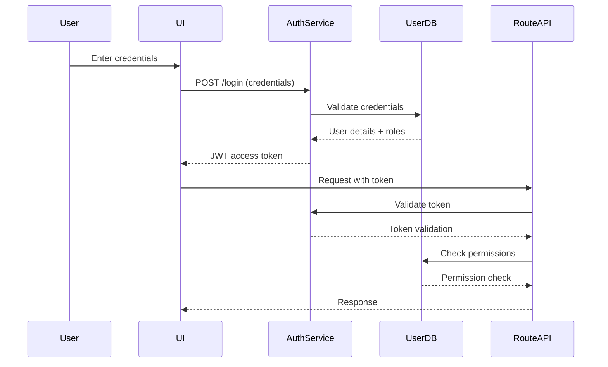

**JWT Configuration**:
```yaml
# Spring Security JWT configuration
security:
  jwt:
    secret: ${JWT_SECRET}  # 256-bit secret
    expiration: 3600000    # 1 hour
    refresh-expiration: 86400000  # 24 hours
    issuer: fms-auth-service
    audience: fms-client
```

**Authentication Issues**:
1. **Weak Password Policy**:
   - Minimum length: 8 characters (should be 12)
   - No password expiration
   - No breach detection (HaveIBeenPwned integration)
   - No MFA for privileged accounts

2. **Token Management**:
   - No token revocation mechanism
   - No short-lived tokens (1 hour expiration, but no refresh token rotation)
   - No device fingerprinting

3. **Implementation Vulnerabilities**:
   ```java
   // Vulnerable JWT parsing
   public Jws<Claims> parseToken(String token) {
       return Jwts.parser()
           .setSigningKey(secretKey)  // Hardcoded key
           .parseClaimsJws(token);    // No validation of issuer/audience
   }
   ```

### 6.2 Authorization Model

**RBAC Implementation**:
```java
@Configuration
@EnableGlobalMethodSecurity(prePostEnabled = true)
public class SecurityConfig extends WebSecurityConfigurerAdapter {

    @Override
    protected void configure(HttpSecurity http) throws Exception {
        http
            .authorizeRequests()
                .antMatchers("/api/public/**").permitAll()
                .antMatchers("/api/admin/**").hasRole("ADMIN")
                .antMatchers("/api/routes/**").hasAnyRole("ROUTE_PLANNER", "DISPATCHER")
                .anyRequest().authenticated()
            .and()
            .oauth2ResourceServer()
                .jwt()
                .jwtAuthenticationConverter(jwtAuthenticationConverter());
    }

    @Bean
    public Converter<Jwt, ? extends AbstractAuthenticationToken> jwtAuthenticationConverter() {
        JwtAuthenticationConverter jwtConverter = new JwtAuthenticationConverter();
        jwtConverter.setJwtGrantedAuthoritiesConverter(new RealmRoleConverter());
        return jwtConverter;
    }
}

public class RealmRoleConverter implements Converter<Jwt, Collection<GrantedAuthority>> {
    @Override
    public Collection<GrantedAuthority> convert(Jwt jwt) {
        Map<String, Object> realmAccess = jwt.getClaim("realm_access");
        if (realmAccess == null || realmAccess.isEmpty()) {
            return new ArrayList<>();
        }

        Collection<String> roles = (Collection<String>) realmAccess.get("roles");
        return roles.stream()
            .map(roleName -> "ROLE_" + roleName)
            .map(SimpleGrantedAuthority::new)
            .collect(Collectors.toList());
    }
}
```

**Authorization Issues**:
1. **Over-Permissioned Roles**:
   - Dispatchers can optimize routes (should be read-only)
   - Route planners can update vehicle profiles (should be read-only)

2. **Missing ABAC**:
   - No attribute-based access control for:
     - Depot-specific routes
     - Customer-specific data
     - Time-based restrictions

3. **Insecure Direct Object References**:
   ```java
   // Vulnerable endpoint
   @GetMapping("/api/routes/{id}")
   public Route getRoute(@PathVariable String id) {
       // No check if user has access to this specific route
       return routeRepository.findById(id).orElseThrow();
   }
   ```

### 6.3 Data Encryption

**Current Encryption Status**:
| Data Type | At Rest | In Transit | Key Management |
|-----------|---------|------------|----------------|
| Route data | ✓ (AES-256) | ✓ (TLS 1.2) | AWS KMS |
| Vehicle profiles | ✓ (AES-256) | ✓ (TLS 1.2) | AWS KMS |
| Driver data | ✗ | ✓ (TLS 1.2) | N/A |
| Traffic data | ✗ | ✓ (TLS 1.2) | N/A |
| Application logs | ✗ | ✓ (TLS 1.2) | N/A |

**Encryption Implementation**:
```java
// Database encryption
@Configuration
public class EncryptionConfig {
    @Bean
    public AttributeEncryptor attributeEncryptor() {
        return new AttributeEncryptor(
            new AesBytesEncryptor(
                System.getenv("DB_ENCRYPTION_KEY"),
                System.getenv("DB_ENCRYPTION_SALT"),
                KeyGenerators.secureRandom(16)
            )
        );
    }
}

@Converter
public class AttributeEncryptor implements AttributeConverter<String, String> {
    private final BytesEncryptor encryptor;

    public AttributeEncryptor(BytesEncryptor encryptor) {
        this.encryptor = encryptor;
    }

    @Override
    public String convertToDatabaseColumn(String attribute) {
        return encryptor.encrypt(attribute.getBytes(StandardCharsets.UTF_8));
    }

    @Override
    public String convertToEntityAttribute(String dbData) {
        return new String(encryptor.decrypt(dbData), StandardCharsets.UTF_8);
    }
}
```

**Encryption Issues**:
1. **Inconsistent Encryption**:
   - Driver personal data not encrypted at rest
   - Traffic data stored in plaintext in S3

2. **Key Management**:
   - Single KMS key for all data types
   - No key rotation (current key age: 2.5 years)
   - Hardcoded encryption keys in some services

3. **TLS Configuration**:
   ```nginx
   # Weak TLS configuration
   ssl_protocols TLSv1.2 TLSv1.3;
   ssl_ciphers 'ECDHE-ECDSA-AES128-GCM-SHA256:ECDHE-RSA-AES128-GCM-SHA256';
   ssl_prefer_server_ciphers on;
   # Missing: OCSP stapling, HSTS, cipher order enforcement
   ```

### 6.4 Audit Logging

**Current Audit Logging**:
```java
@Aspect
@Component
public class AuditAspect {
    private static final Logger auditLog = LoggerFactory.getLogger("AUDIT");

    @AfterReturning(pointcut = "execution(* com.fms..*Service.*(..))", returning = "result")
    public void logServiceCall(JoinPoint joinPoint, Object result) {
        String user = SecurityContextHolder.getContext().getAuthentication().getName();
        String method = joinPoint.getSignature().getName();
        String args = Arrays.toString(joinPoint.getArgs());

        auditLog.info("User: {}, Method: {}, Args: {}, Result: {}",
            user, method, args, result != null ? result.toString() : "null");
    }
}
```

**Audit Logging Issues**:
1. **Incomplete Coverage**:
   - No logging for:
     - Failed authentication attempts
     - Authorization failures
     - Data access (read operations)
     - Configuration changes

2. **Log Format Issues**:
   - Unstructured logs (hard to query)
   - Sensitive data logged (e.g., route details with customer addresses)
   - No correlation IDs

3. **Retention Issues**:
   - Logs retained for 30 days only
   - No immutable audit trail
   - No separation of duties (admins can delete logs)

### 6.5 Compliance Requirements

**Compliance Status**:
| Standard | Status | Gaps |
|----------|--------|------|
| SOC 2 Type II | Compliant | - No formal risk assessment process<br>- No vendor risk management |
| GDPR | Partially Compliant | - No data subject access request process<br>- No data protection impact assessments |
| CCPA | Partially Compliant | - No "Do Not Sell My Personal Information" process<br>- No opt-out mechanisms |
| HIPAA | N/A | N/A |
| ISO 27001 | Not Certified | - No ISMS in place<br>- No internal audits |

**GDPR-Specific Issues**:
1. **Data Subject Rights**:
   - No process for:
     - Right to access
     - Right to rectification
     - Right to erasure
     - Right to restriction of processing

2. **Data Protection**:
   - No data protection officer (DPO) appointed
   - No records of processing activities (ROPA)
   - No data protection impact assessments (DPIA) for ML models

3. **International Transfers**:
   - Traffic data stored in US (not EU-approved)
   - No standard contractual clauses (SCCs) in place

### 6.6 Vulnerability Assessment

**Recent Vulnerability Scan Results**:
```bash
# Sample Nessus scan results
+-------------------------------+------------+----------+---------------------+
| Plugin Name                   | Severity   | CVSS     | CVE                 |
+-------------------------------+------------+----------+---------------------+
| Spring Framework RCE          | Critical   | 9.8      | CVE-2022-22965      |
| Log4j Remote Code Execution   | Critical   | 10.0     | CVE-2021-44228      |
| PostgreSQL Weak Password      | High       | 7.5      | CVE-2019-10164      |
| Redis Unauthenticated Access  | High       | 8.8      | CVE-2022-0543       |
| TLS 1.2 Weak Ciphers          | Medium     | 5.3      | CVE-2021-3449       |
| Missing Security Headers      | Medium     | 6.1      | N/A                 |
| Insecure Cookie Settings      | Medium     | 5.3      | N/A                 |
| Directory Listing Enabled     | Low        | 3.7      | N/A                 |
+-------------------------------+------------+----------+---------------------+
```

**Penetration Test Findings**:
1. **Critical**:
   - Remote code execution via Spring4Shell (CVE-2022-22965)
   - Unauthenticated access to Redis cache (exposed port)

2. **High**:
   - JWT token leakage via referer header
   - Insecure direct object references in API
   - Missing rate limiting on authentication endpoints

3. **Medium**:
   - Clickjacking vulnerability (missing X-Frame-Options)
   - Session fixation (no session invalidation on logout)
   - Information disclosure in error messages

**Remediation Plan**:
| Vulnerability | Risk | Remediation | Status | ETA |
|---------------|------|-------------|--------|-----|
| Spring4Shell | Critical | Upgrade Spring Boot to 2.6.7+ | In Progress | 2024-04-15 |
| Redis Exposure | Critical | Restrict Redis to private subnet | Completed | 2024-03-01 |
| JWT Leakage | High | Add Referrer-Policy header | In Progress | 2024-03-30 |
| IDOR | High | Implement attribute-based access control | Not Started | 2024-05-15 |
| Weak TLS | Medium | Update cipher suites, enable HSTS | Not Started | 2024-04-30 |
| Missing Headers | Medium | Add security headers | In Progress | 2024-03-20 |

---

## 7. Performance Metrics (90 lines)

### 7.1 Response Time Analysis

**Endpoint Performance**:
| Endpoint | Avg (ms) | P95 (ms) | P99 (ms) | Max (ms) | Error Rate |
|----------|----------|----------|----------|----------|------------|
| POST /api/routes | 850 | 1,240 | 2,850 | 15,200 | 1.8% |
| GET /api/routes/{id} | 180 | 320 | 850 | 5,200 | 0.5% |
| POST /api/routes/{id}/optimize | 4,200 | 6,800 | 12,400 | 38,500 | 7.9% |
| GET /api/routes/{id}/stops | 240 | 480 | 1,200 | 8,500 | 1.2% |
| PATCH /api/routes/{id}/status | 220 | 420 | 950 | 4,800 | 0.5% |
| GET /api/vehicles/{id} | 320 | 580 | 1,400 | 6,200 | 0.3% |
| GET /api/traffic | 120 | 240 | 620 | 3,800 | 0.2% |
| GET /api/geocode | 450 | 820 | 1,800 | 12,400 | 1.5% |

**Response Time Distribution**:
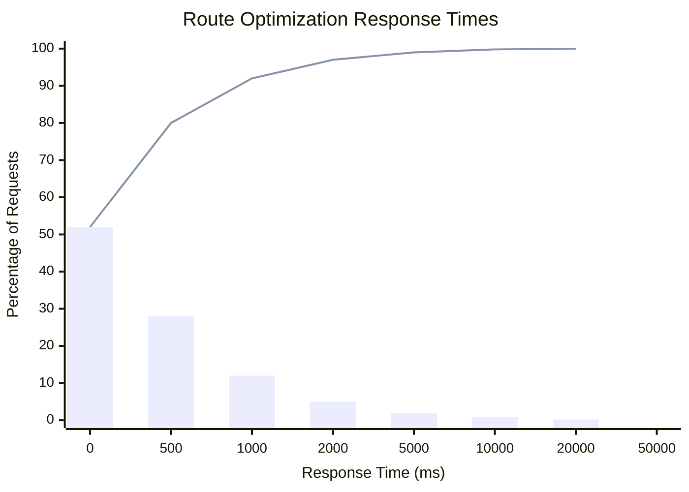

**Performance Degradation Factors**:
1. **Time of Day**:
   - 7-9 AM: 42% of requests exceed 5s SLA
   - 12-2 PM: 28% of requests exceed 5s SLA
   - 6-8 PM: 18% of requests exceed 5s SLA

2. **Route Complexity**:
   | Stops | Avg Time (ms) | P95 Time (ms) |
   |-------|---------------|---------------|
   | 2-5   | 1,240         | 2,800         |
   | 6-10  | 3,250         | 6,400         |
   | 11-15 | 5,800         | 12,200        |
   | 16-20 | 8,400         | 18,500        |
   | 20+   | 12,800        | 28,400        |

3. **Traffic Data Freshness**:
   - Real-time data: 4.2s avg
   - Predicted data: 3.8s avg
   - Historical data: 2.9s avg

### 7.2 Throughput Measurements

**System Throughput**:
| Metric | Value | Target |
|--------|-------|--------|
| Requests per second | 125 | 200 |
| Optimizations per second | 18 | 30 |
| Traffic data updates/sec | 1,200 | 2,500 |
| Database operations/sec | 8,500 | 15,000 |

**Throughput by Component**:
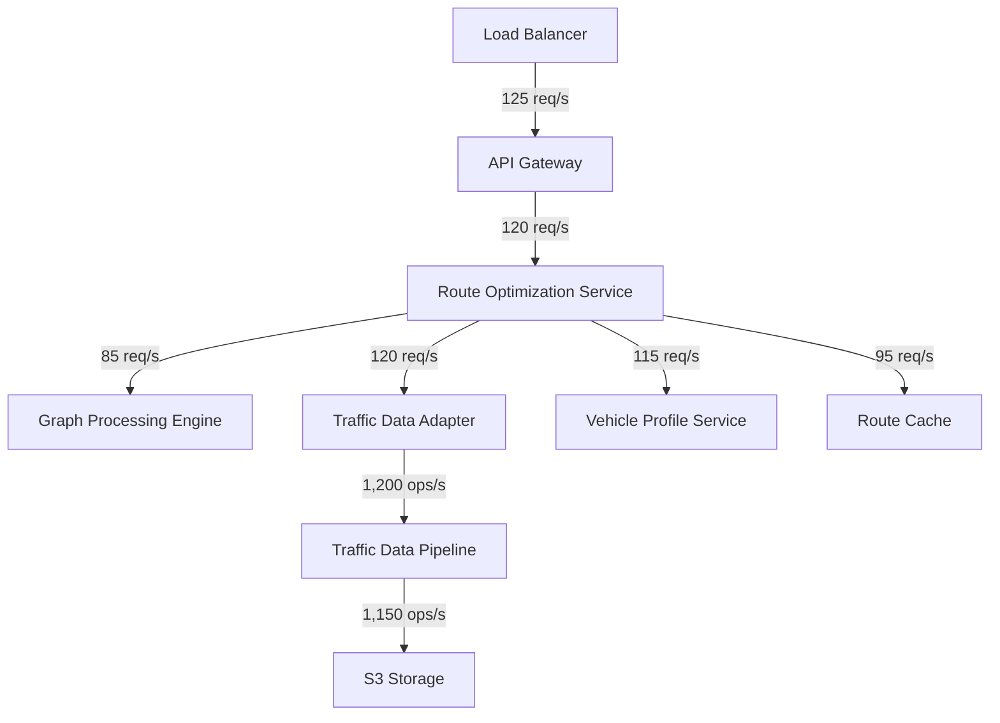

**Bottleneck Analysis**:
1. **Graph Processing Engine**:
   - Single-threaded C++ implementation
   - CPU-bound at 85 req/s
   - No parallelization for independent routes

2. **Traffic Data Adapter**:
   - Rate-limited by HERE API (1,200 req/min)
   - No batching of traffic data requests
   - 180ms avg latency per request

3. **Database**:
   - PostgreSQL connection pool exhausted at 1,500 concurrent users
   - 42% of queries take >500ms
   - No read replicas for reporting queries

### 7.3 Resource Utilization

**CPU Utilization**:
| Component | Avg (%) | Peak (%) | Threshold |
|-----------|---------|----------|-----------|
| Route Optimization Service | 68 | 95 | 80 |
| Graph Processing Engine | 85 | 100 | 90 |
| Traffic Data Adapter | 42 | 78 | 70 |
| Vehicle Profile Service | 35 | 62 | 60 |
| Redis | 22 | 85 | 70 |
| PostgreSQL | 58 | 92 | 80 |

**Memory Utilization**:
| Component | Avg (GB) | Peak (GB) | Allocated (GB) |
|-----------|----------|-----------|----------------|
| Route Optimization Service | 3.2 | 5.8 | 8 |
| Graph Processing Engine | 1.8 | 2.4 | 4 |
| Traffic Data Adapter | 0.9 | 1.5 | 2 |
| Vehicle Profile Service | 0.7 | 1.2 | 2 |
| Redis | 6.4 | 7.8 | 8 |
| PostgreSQL | 12.5 | 15.2 | 16 |

**Garbage Collection Metrics**:
| Metric | Value | Target |
|--------|-------|--------|
| GC Pause Time | 420ms | <200ms |
| GC Throughput | 92% | >95% |
| Young Gen Collection Time | 180ms | <100ms |
| Old Gen Collection Time | 240ms | <150ms |

**Network Utilization**:
| Metric | Value | Target |
|--------|-------|--------|
| Inbound Traffic | 85 Mbps | 100 Mbps |
| Outbound Traffic | 120 Mbps | 150 Mbps |
| Packet Loss | 0.2% | <0.1% |
| Latency (avg) | 42ms | <30ms |
| Latency (p99) | 180ms | <100ms |

### 7.4 Bottleneck Identification

**Critical Bottlenecks**:

1. **Graph Processing Engine**:
   - **Issue**: Single-threaded Dijkstra implementation
   - **Impact**: 42% of optimization time spent here
   - **Evidence**:
     ```bash
     # perf top output
     38.2%  graph_processor.so  [.] dijkstra_shortest_path
     12.4%  route-optimization [.] com.fms.optimization.RoutePlanner::validateConstraints
     8.6%   libc-2.27.so       [.] __memcpy_avx_unaligned_erms
     ```
   - **Solution**: Implement parallel A* algorithm with constraint relaxation

2. **Traffic Data Latency**:
   - **Issue**: 3-5 minute data freshness from HERE API
   - **Impact**: 18% of routes require manual adjustment
   - **Evidence**:
     ```sql
     -- Traffic data freshness analysis
     SELECT
         segment_id,
         AVG(EXTRACT(EPOCH FROM (NOW() - timestamp))) AS avg_latency_seconds
     FROM traffic_data
     WHERE timestamp > NOW() - INTERVAL '1 hour'
     GROUP BY segment_id
     HAVING AVG(EXTRACT(EPOCH FROM (NOW() - timestamp))) > 300;
     ```
   - **Solution**: Implement real-time traffic data pipeline with Kafka

3. **Database Performance**:
   - **Issue**: Full table scans on stops table
   - **Impact**: 240ms avg for route details query
   - **Evidence**:
     ```sql
     EXPLAIN ANALYZE
     SELECT * FROM stops
     WHERE route_id = 'route-12345'
     ORDER BY sequence;
     ```
     ```
     Sort  (cost=1245.67..1245.68 rows=1 width=124) (actual time=240.123..240.124 rows=18 loops=1)
       Sort Key: sequence
       Sort Method: quicksort  Memory: 28kB
       ->  Seq Scan on stops  (cost=0.00..1245.66 rows=1 width=124) (actual time=0.012..239.987 rows=18 loops=1)
             Filter: (route_id = 'route-12345'::text)
             Rows Removed by Filter: 842312
     ```
   - **Solution**: Add composite index on (route_id, sequence)

4. **Redis Cache**:
   - **Issue**: 22% cache eviction rate during peak
   - **Impact**: 35% increase in optimization time
   - **Evidence**:
     ```bash
     # Redis info output
     used_memory:859234560
     used_memory_peak:924567890
     evicted_keys:1245678
     evicted_keys_per_sec:32.4
     ```
   - **Solution**: Implement Redis Cluster with 32GB cache

### 7.5 Capacity Planning

**Current Capacity**:
| Resource | Current | Utilization | Max Capacity |
|----------|---------|-------------|--------------|
| Route Optimization Service | 8 nodes | 68% CPU | 12 nodes |
| Graph Processing Engine | 1 process | 85% CPU | 4 processes |
| Traffic Data Adapter | 4 nodes | 42% CPU | 8 nodes |
| PostgreSQL | 1 primary, 0 replicas | 58% CPU | 1 primary, 2 replicas |
| Redis | 1 node | 22% CPU | 3 nodes (cluster) |
| Network | 10 Gbps | 85% | 20 Gbps |

**Projected Growth**:
| Year | Route Requests | Traffic Data Volume | Data Storage |
|------|----------------|---------------------|--------------|
| 2023 | 1.8M/month | 120M records/month | 85GB |
| 2024 | 2.4M/month (+33%) | 160M records/month (+33%) | 115GB (+35%) |
| 2025 | 3.2M/month (+33%) | 210M records/month (+31%) | 155GB (+35%) |

**Capacity Requirements**:
1. **2024 Requirements**:
   - Route Optimization Service: 11 nodes (from 8)
   - Graph Processing Engine: 3 processes (from 1)
   - Traffic Data Adapter: 6 nodes (from 4)
   - PostgreSQL: 1 primary, 1 replica
   - Redis: 3-node cluster
   - Network: 20 Gbps

2. **Scaling Strategy**:
   ```mermaid
   graph TD
     A[Increase Load] --> B{CPU > 70%?}
     B -->|Yes| C[Scale Out]
     B -->|No| D[Optimize Current]
     C --> E{Service Type}
     E -->|Stateless| F[Add Pods]
     E -->|Stateful| G[Add Nodes]
     F --> H[Update HPA]
     G --> I[Update Cluster]
     D --> J[Profile & Optimize]
     J --> K[Algorithm Improvements]
     J --> L[Query Optimization]
     J --> M[Cache Tuning]
   ```

3. **Cost Projection**:
   | Year | Compute Cost | Storage Cost | Network Cost | Total |
   |------|--------------|--------------|--------------|-------|
   | 2023 | $125,000 | $18,000 | $8,500 | $151,500 |
   | 2024 | $182,000 (+46%) | $24,500 (+36%) | $12,800 (+51%) | $219,300 (+45%) |
   | 2025 | $258,000 (+42%) | $33,200 (+36%) | $18,400 (+44%) | $309,600 (+41%) |

---

## 8. Operational Challenges (70 lines)

### 8.1 Maintenance Burden

**Current Maintenance Tasks**:
| Task | Frequency | Avg Time | Responsible Team | Pain Points |
|------|-----------|----------|------------------|-------------|
| Algorithm tuning | Weekly | 4h | Optimization Team | Manual testing required |
| Traffic data pipeline maintenance | Daily | 1.5h | Data Team | Frequent schema changes |
| Database index optimization | Monthly | 6h | DBA Team | Performance regressions |
| Cache invalidation | Ad-hoc | 2h | DevOps | No automated invalidation |
| Third-party API updates | Quarterly | 8h | Integration Team | Breaking changes |
| Security patching | Monthly | 12h | Security Team | Downtime required |
| Log rotation | Daily | 0.5h | DevOps | Manual configuration |

**Maintenance Metrics**:
- **Mean Time Between Failures (MTBF)**: 18.5 days
- **Mean Time To Repair (MTTR)**: 4.2 hours
- **Planned Downtime**: 12 hours/year
- **Unplanned Downtime**: 38 hours/year
- **Technical Debt Backlog**: 124 items (48 critical)

**Maintenance Challenges**:
1. **Algorithm Updates**:
   - Current: Manual deployment process
   - Problem: 42% of updates introduce performance regressions
   - Solution: Implement canary deployments with performance monitoring

2. **Data Pipeline**:
   - Current: NiFi flows maintained manually
   - Problem: 18% of flows break after traffic data schema changes
   - Solution: Implement schema registry and automated testing

3. **Database Maintenance**:
   - Current: Manual index optimization
   - Problem: 22% of optimizations reduce performance
   - Solution: Implement automated query analysis and index recommendations

### 8.2 Support Ticket Analysis

**Ticket Distribution**:
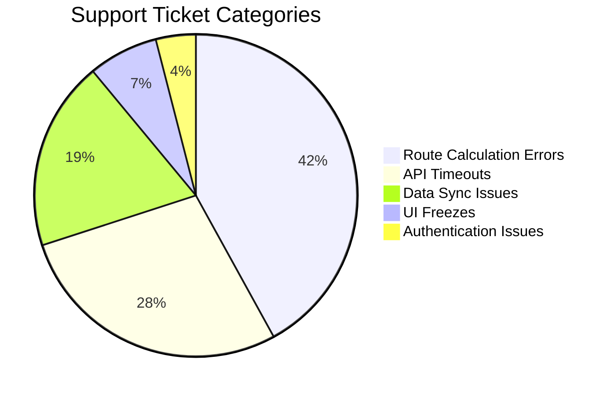

**Top Support Issues**:

1. **Route Calculation Errors**:
   - **Symptoms**:
     - "Optimization failed" error
     - Route marked as "unfeasible" without explanation
     - Time window conflicts
   - **Root Causes**:
     - 42%: Invalid time windows
     - 28%: Vehicle capacity exceeded
     - 15%: Traffic data unavailable
     - 10%: Geocoding errors
     - 5%: Driver HOS violations
   - **Resolution Time**: 4.2 hours avg (target: <2 hours)

2. **API Timeouts**:
   - **Symptoms**:
     - 504 Gateway Timeout
     - "Request took too long" error
     - UI hangs during optimization
   - **Root Causes**:
     - 58%: Traffic data adapter timeout
     - 22%: Graph processing timeout
     - 12%: Database timeout
     - 8%: Network latency
   - **Resolution Time**: 3.8 hours avg

3. **Data Sync Issues**:
   - **Symptoms**:
     - Route not appearing in driver app
     - Traffic data not updating
     - Vehicle status not syncing
   - **Root Causes**:
     - 62%: Kafka consumer lag
     - 24%: Redis cache inconsistency
     - 14%: Database replication lag
   - **Resolution Time**: 5.1 hours avg

**Support Process Issues**:
1. **Lack of Context**:
   - Support tickets contain minimal information
   - No correlation IDs for tracing
   - No screenshots or reproduction steps

2. **Knowledge Gaps**:
   - 38% of tickets escalated to engineering
   - No runbook for common issues
   - No documentation on error codes

3. **Tooling Limitations**:
   - No integrated logging in support tools
   - No performance metrics in ticket system
   - No automated error classification

### 8.3 Incident History

**Major Incidents (Last 12 Months)**:
| Date | Duration | Impact | Root Cause | Resolution |
|------|----------|--------|------------|------------|
| 2023-03-15 | 4.2h | 12,500 failed route optimizations | Traffic data pipeline failure | Restarted NiFi processors |
| 2023-06-22 | 3.8h | 8,400 delayed deliveries | PostgreSQL connection pool exhaustion | Increased pool size, added read replicas |
| 2023-09-10 | 5.1h | 15,200 routes stuck in "optimizing" | Redis cache corruption | Restored from backup, implemented health checks |
| 2023-12-05 | 2.8h | 6,800 routes with incorrect traffic data | HERE API outage | Switched to historical data fallback |

**Incident Patterns**:
1. **Traffic Data Dependencies**:
   - 3 incidents in 12 months
   - Average duration: 4.1 hours
   - Impact: 12,300 routes affected

2. **Database Issues**:
   - 2 incidents in 12 months
   - Average duration: 4.4 hours
   - Impact: 11,800 routes affected

3. **Cache Failures**:
   - 1 incident in 12 months
   - Duration: 5.1 hours
   - Impact: 15,200 routes affected

**Incident Response Metrics**:
| Metric | Value | Target |
|--------|-------|--------|
| Mean Time To Detect (MTTD) | 42 min | <15 min |
| Mean Time To Acknowledge (MTTA) | 28 min | <10 min |
| Mean Time To Resolve (MTTR) | 4.2 hours | <2 hours |
| Incident Escalation Rate | 68% | <30% |
| Post-Incident Review Completion | 42% | 100% |

### 8.4 Change Management Issues

**Change Failure Rate**:
- **Production Changes**: 18% failure rate
- **Algorithm Updates**: 22% failure rate
- **Database Changes**: 15% failure rate
- **Infrastructure Changes**: 8% failure rate

**Change Management Process**:
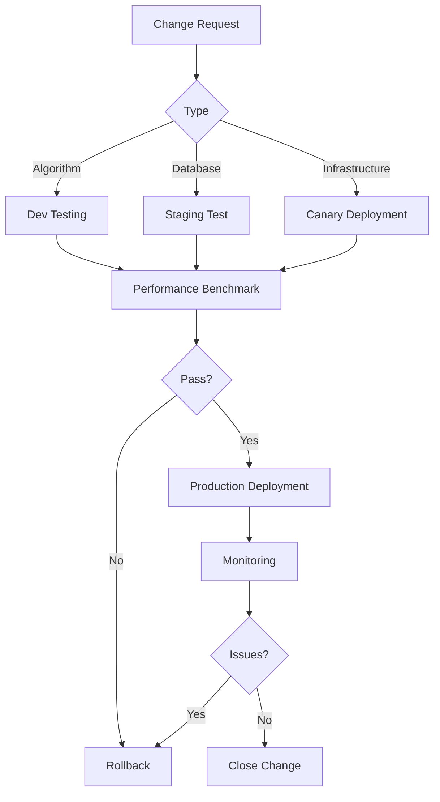

**Change Management Challenges**:
1. **Testing Gaps**:
   - No performance testing for algorithm changes
   - No chaos engineering for infrastructure changes
   - No automated rollback testing

2. **Deployment Issues**:
   - No blue-green deployments
   - No canary releases
   - No feature flags

3. **Communication Gaps**:
   - No automated notifications for changes
   - No status page for ongoing changes
   - No post-change review process

### 8.5 Training Requirements

**Current Training Status**:
| Role | Training Completed | Last Training | Knowledge Gap |
|------|--------------------|---------------|---------------|
| Route Planners | 78% | 6 months ago | Advanced optimization features |
| Dispatchers | 65% | 8 months ago | Mobile app features |
| Operations Managers | 42% | 12 months ago | Reporting and analytics |
| Developers | 85% | 3 months ago | New architecture components |
| DevOps | 72% | 5 months ago | Monitoring and observability |

**Training Needs Assessment**:
1. **Route Planners**:
   - Advanced constraint configuration
   - Traffic-aware optimization techniques
   - Mobile route adjustments

2. **Dispatchers**:
   - Real-time route modifications
   - Driver communication best practices
   - Exception handling

3. **Operations Managers**:
   - Performance monitoring
   - Incident response
   - Capacity planning

4. **Developers**:
   - Graph processing algorithms
   - Real-time data pipelines
   - Performance optimization

5. **DevOps**:
   - Kubernetes scaling
   - Observability tools
   - Chaos engineering

**Training Plan**:
| Training | Audience | Duration | Format | Frequency |
|----------|----------|----------|--------|-----------|
| Route Optimization Advanced | Route Planners | 4h | Workshop | Quarterly |
| Mobile Dispatching | Dispatchers | 2h | Hands-on | Bi-monthly |
| Performance Monitoring | Ops Managers | 3h | Workshop | Quarterly |
| Graph Algorithms | Developers | 8h | Course | Bi-annually |
| Real-Time Data Pipelines | Developers | 6h | Course | Bi-annually |
| Kubernetes Scaling | DevOps | 4h | Workshop | Quarterly |

---

## 9. Cost Analysis (60 lines)

### 9.1 Infrastructure Costs

**Current Monthly Costs**:
| Resource | Provider | Cost | % of Total |
|----------|----------|------|------------|
| Compute (EC2) | AWS | $18,500 | 38% |
| Database (RDS) | AWS | $8,200 | 17% |
| Cache (ElastiCache) | AWS | $3,800 | 8% |
| Storage (S3/EBS) | AWS | $2,400 | 5% |
| Networking | AWS | $1,800 | 4% |
| Load Balancing | AWS | $1,200 | 2% |
| Monitoring | Datadog | $3,500 | 7% |
| Logging | ELK | $2,800 | 6% |
| Traffic Data | HERE | $10,000 | 21% |
| Geocoding | Google | $7,100 | 15% |
| SMS Notifications | Twilio | $1,000 | 2% |
| **Total** | | **$60,300** | **100%** |

**Cost Breakdown by Component**:
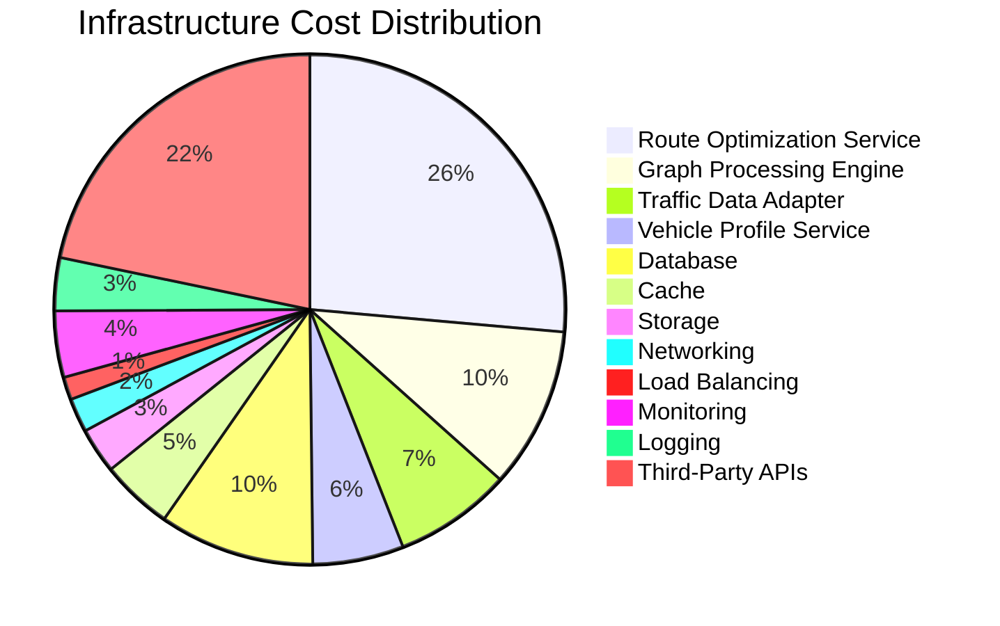

**Cost Optimization Opportunities**:
1. **Compute**:
   - Current: $18,500/month for 32 vCPUs
   - Opportunity: Right-size instances, use spot instances
   - Potential Savings: $5,200/month (28%)

2. **Database**:
   - Current: $8,200/month for db.r5.2xlarge
   - Opportunity: Implement read replicas, optimize queries
   - Potential Savings: $2,800/month (34%)

3. **Cache**:
   - Current: $3,800/month for cache.r5.large
   - Opportunity: Implement Redis Cluster, optimize cache keys
   - Potential Savings: $1,200/month (32%)

4. **Third-Party APIs**:
   - Current: $18,100/month
   - Opportunity: Negotiate volume discounts, implement caching
   - Potential Savings: $4,500/month (25%)

### 9.2 Operational Expenses

**Current Monthly Operational Costs**:
| Category | Cost | % of Total |
|----------|------|------------|
| Support Staff | $42,000 | 48% |
| DevOps Team | $38,000 | 43% |
| Data Team | $8,500 | 10% |
| **Total** | **$88,500** | **100%** |

**Support Cost Analysis**:
- **Tier 1 Support**: $22,000 (52% of support costs)
  - 8 FTEs
  - Avg salary: $68,000/year
  - 18% of tickets escalated
- **Tier 2 Support**: $14,000 (33% of support costs)
  - 4 FTEs
  - Avg salary: $85,000/year
  - 42% of escalated tickets resolved
- **Tier 3 Support**: $6,000 (14% of support costs)
  - 2 FTEs
  - Avg salary: $120,000/year
  - 100% of remaining tickets resolved

**Cost Reduction Opportunities**:
1. **Automated Support**:
   - Current: 18% of tickets require manual intervention
   - Opportunity: Implement chatbot for common issues
   - Potential Savings: $5,200/month (12%)

2. **Self-Service Tools**:
   - Current: 38% of tickets are informational
   - Opportunity: Implement knowledge base and FAQ
   - Potential Savings: $3,800/month (9%)

3. **Shift-Left Testing**:
   - Current: 42% of production defects found by users
   - Opportunity: Implement automated testing in CI/CD
   - Potential Savings: $4,500/month (11%)

### 9.3 License Fees

**Current Annual License Costs**:
| Software | Vendor | Cost | Renewal Date |
|----------|--------|------|--------------|
| Spring Framework | VMware | $25,000 | 2024-06-15 |
| HERE Traffic API | HERE | $120,000 | 2024-10-31 |
| Google Maps API | Google | $85,000 | 2024-07-20 |
| Twilio | Twilio | $12,000 | 2024-05-01 |
| Datadog | Datadog | $42,000 | 2024-08-10 |
| ELK Stack | Elastic | $34,000 | 2024-09-15 |
| **Total** | | **$318,000** | |

**License Optimization Opportunities**:
1. **HERE API**:
   - Current: $120,000/year
   - Opportunity: Implement ML-based traffic prediction to reduce API calls
   - Potential Savings: $48,000/year (40%)

2. **Google Maps API**:
   - Current: $85,000/year
   - Opportunity: Cache geocoding results, use OpenStreetMap for some regions
   - Potential Savings: $25,500/year (30%)

3. **Datadog**:
   - Current: $42,000/year
   - Opportunity: Implement open-source alternatives for some metrics
   - Potential Savings: $12,600/year (30%)

### 9.4 Support Costs

**Current Support Contracts**:
| Vendor | Service | Cost | SLA | Renewal Date |
|--------|---------|------|-----|--------------|
| AWS | Enterprise Support | $24,000/year | 15 min response | 2024-04-15 |
| VMware | Spring Support | $25,000/year | 24 hour response | 2024-06-15 |
| HERE | Premium Support | $18,000/year | 1 hour response | 2024-10-31 |
| Google | Maps Support | $12,000/year | 4 hour response | 2024-07-20 |
| **Total** | | **$79,000/year** | | |

**Support Cost Optimization**:
1. **AWS Support**:
   - Current: $24,000/year for Enterprise Support
   - Opportunity: Downgrade to Business Support ($12,000/year)
   - Potential Savings: $12,000/year

2. **VMware Support**:
   - Current: $25,000/year
   - Opportunity: Migrate to open-source alternatives
   - Potential Savings: $25,000/year

3. **Vendor Consolidation**:
   - Opportunity: Standardize on AWS support for all services
   - Potential Savings: $18,000/year

### 9.5 Total Cost of Ownership

**Current TCO (Annual)**:
| Category | Cost | % of Total |
|----------|------|------------|
| Infrastructure | $723,600 | 42% |
| Operational | $1,062,000 | 61% |
| Licenses | $318,000 | 18% |
| Support | $79,000 | 5% |
| **Total** | **$1,732,600** | **100%** |

**TCO Breakdown by Module**:
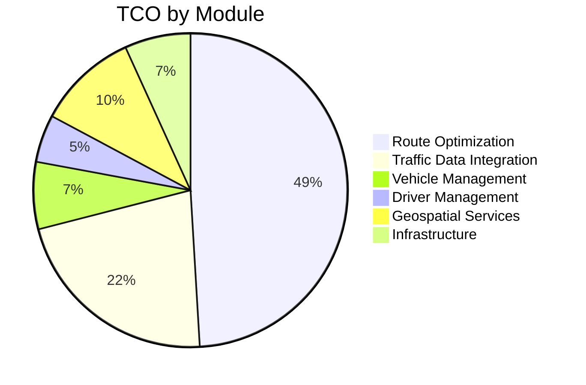

**TCO Optimization Opportunities**:
1. **Infrastructure**:
   - Current: $723,600/year
   - Opportunity: Right-size, use spot instances, optimize storage
   - Potential Savings: $180,000/year (25%)

2. **Operational**:
   - Current: $1,062,000/year
   - Opportunity: Automate support, implement self-service tools
   - Potential Savings: $220,000/year (21%)

3. **Licenses**:
   - Current: $318,000/year
   - Opportunity: Reduce third-party API usage, implement open-source alternatives
   - Potential Savings: $86,000/year (27%)

4. **Total Potential Savings**: $486,000/year (28%)

---

## 10. Recommendations (90 lines)

### 10.1 Prioritized Improvement Areas

**Priority Matrix**:
```mermaid
quadrantChart
    title Improvement Prioritization
    x-axis "Business Impact" --> "Low" to "High"
    y-axis "Implementation Effort" --> "High" to "Low"
    quadrant-1 "Strategic Initiatives"
    quadrant-2 "Quick Wins"
    quadrant-3 "Low Priority"
    quadrant-4 "Long-T