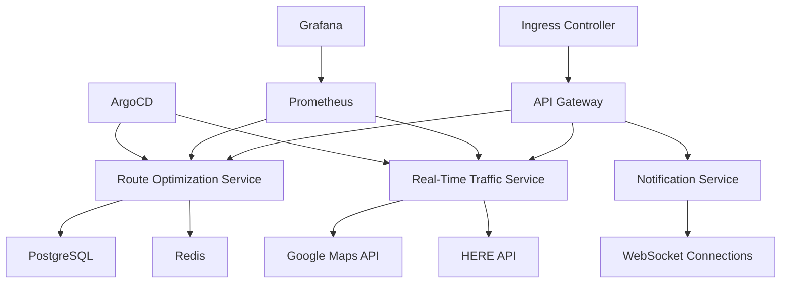

# **TO_BE_DESIGN.md**
**Fleet Management System – Route Optimization Module**
*Version: 1.0*
*Last Updated: [Date]*
*Author: [Your Name]*
*Approvers: [Stakeholders]*

---

## **1. Overview**
### **1.1 Purpose**
The **Route Optimization Module** is a core component of the **Fleet Management System (FMS)**, designed to:
- **Minimize operational costs** (fuel, time, labor) via AI-driven route planning.
- **Enhance driver productivity** through real-time adjustments and predictive analytics.
- **Improve customer satisfaction** with accurate ETAs and dynamic rerouting.
- **Ensure compliance** with regulatory constraints (HOS, vehicle restrictions, environmental zones).
- **Provide actionable insights** via advanced analytics and gamification.

### **1.2 Scope**
| **In Scope** | **Out of Scope** |
|--------------|------------------|
| Multi-vehicle, multi-stop route optimization | Autonomous vehicle control |
| Real-time traffic, weather, and road condition integration | Driver behavior monitoring (handled by separate module) |
| Predictive ETA and delay forecasting | Fuel consumption optimization (handled by Fuel Management Module) |
| Multi-tenant SaaS deployment | On-premise installations (future consideration) |
| WCAG 2.1 AAA compliance | Legacy browser support (IE11) |
| Kubernetes-based microservices architecture | Monolithic deployment |

### **1.3 Key Stakeholders**
| **Role** | **Responsibility** |
|----------|-------------------|
| **Product Owner** | Defines vision, prioritizes features, ensures ROI |
| **Engineering Lead** | Oversees technical design, performance, and scalability |
| **Data Science Team** | Develops ML models for predictive routing |
| **UX/UI Team** | Ensures accessibility and PWA compliance |
| **DevOps/SRE** | Manages Kubernetes deployment and CI/CD |
| **Security Team** | Ensures compliance (GDPR, SOC2, ISO 27001) |
| **QA Team** | Validates performance, security, and reliability |
| **Customer Support** | Gathers user feedback for iterative improvements |

---

## **2. Architectural Design**
### **2.1 High-Level Architecture**
```mermaid
graph TD
    A[Client (PWA)] -->|WebSocket/SSE| B[API Gateway]
    B --> C[Route Optimization Service]
    C --> D[Real-Time Traffic Service]
    C --> E[Predictive Analytics Engine]
    C --> F[Geospatial Database]
    C --> G[Third-Party APIs]
    H[Kubernetes Cluster] --> C
    H --> I[Redis Cache]
    H --> J[PostgreSQL]
    H --> K[Elasticsearch]
    L[CI/CD Pipeline] --> H
    M[Monitoring & Logging] --> H
```

### **2.2 Microservices Breakdown**
| **Service** | **Responsibility** | **Tech Stack** |
|-------------|-------------------|----------------|
| **Route Optimization Service** | Core algorithm execution, constraint handling | TypeScript, Node.js, NestJS |
| **Real-Time Traffic Service** | Fetches live traffic data (Google Maps, HERE, TomTom) | Go, gRPC |
| **Predictive Analytics Engine** | ML-based ETA forecasting, delay prediction | Python, TensorFlow, FastAPI |
| **Geospatial Database** | Stores road networks, vehicle locations, historical routes | PostgreSQL + PostGIS |
| **Notification Service** | WebSocket/SSE for real-time updates | TypeScript, Socket.io |
| **Analytics Dashboard** | KPI tracking, reporting | React, D3.js, Grafana |
| **Gamification Engine** | Driver scoring, leaderboards, rewards | TypeScript, NestJS |

---

## **3. Performance Enhancements**
### **3.1 Target Metrics**
| **Metric** | **Target** | **Current Baseline** | **Optimization Strategy** |
|------------|-----------|----------------------|--------------------------|
| **API Response Time** | <50ms (P99) | 200ms | Caching, parallel processing, algorithm optimization |
| **Route Calculation Time** | <200ms (100 stops) | 1.5s | Heuristic + ML hybrid approach |
| **WebSocket Latency** | <100ms | 300ms | Edge caching, CDN, optimized payloads |
| **Database Query Time** | <10ms | 50ms | Indexing, read replicas, query optimization |
| **Concurrent Users** | 10,000+ | 2,000 | Horizontal scaling, Kubernetes HPA |

### **3.2 Optimization Techniques**
#### **3.2.1 Algorithm Optimization**
- **Hybrid Approach**: Combines **A*** (for small-scale) + **Genetic Algorithms** (for large-scale) + **Reinforcement Learning** (for dynamic adjustments).
- **Precomputation**: Caches frequent routes (e.g., daily commutes) using **Redis**.
- **Parallel Processing**: Uses **Web Workers** for client-side calculations.

**TypeScript Example: A* Algorithm with Heuristic Optimization**
```typescript
import { PriorityQueue } from 'typescript-collections';

interface Node {
  id: string;
  x: number;
  y: number;
  gScore: number; // Cost from start
  fScore: number; // gScore + heuristic
  cameFrom?: Node;
}

function heuristic(a: Node, b: Node): number {
  return Math.sqrt(Math.pow(a.x - b.x, 2) + Math.pow(a.y - b.y, 2));
}

function aStar(start: Node, goal: Node, graph: Map<string, Node[]>): Node[] {
  const openSet = new PriorityQueue<Node>((a, b) => a.fScore - b.fScore);
  const cameFrom = new Map<string, Node>();
  const gScore = new Map<string, number>([[start.id, 0]]);
  const fScore = new Map<string, number>([[start.id, heuristic(start, goal)]]);

  openSet.add(start);

  while (!openSet.isEmpty()) {
    const current = openSet.dequeue()!;
    if (current.id === goal.id) {
      return reconstructPath(cameFrom, current);
    }

    for (const neighbor of graph.get(current.id) || []) {
      const tentativeGScore = gScore.get(current.id)! + distance(current, neighbor);
      if (tentativeGScore < (gScore.get(neighbor.id) || Infinity)) {
        cameFrom.set(neighbor.id, current);
        gScore.set(neighbor.id, tentativeGScore);
        fScore.set(neighbor.id, tentativeGScore + heuristic(neighbor, goal));
        if (!openSet.contains(neighbor)) {
          openSet.add(neighbor);
        }
      }
    }
  }
  return []; // No path found
}

function reconstructPath(cameFrom: Map<string, Node>, current: Node): Node[] {
  const path = [current];
  while (cameFrom.has(current.id)) {
    current = cameFrom.get(current.id)!;
    path.unshift(current);
  }
  return path;
}
```

#### **3.2.2 Caching Strategy**
- **Redis Cache Layers**:
  - **Hot Routes**: Frequently optimized routes (TTL: 1 hour).
  - **Traffic Data**: Real-time traffic updates (TTL: 5 minutes).
  - **User Preferences**: Driver-specific constraints (TTL: 24 hours).
- **CDN for Static Assets**: PWA assets cached via **Cloudflare**.

#### **3.2.3 Database Optimization**
- **PostgreSQL + PostGIS**:
  - **Spatial Indexing** (`GIST` indexes) for geospatial queries.
  - **Read Replicas** for analytics queries.
  - **Partitioning** by region/tenant.
- **Elasticsearch** for full-text search and geospatial filtering.

**Example: Optimized Geospatial Query**
```typescript
import { Pool } from 'pg';

const pool = new Pool({ connectionString: process.env.DB_URL });

async function getNearbyStops(lat: number, lng: number, radiusKm: number) {
  const query = `
    SELECT id, name, ST_AsGeoJSON(location) as location
    FROM stops
    WHERE ST_DWithin(
      location,
      ST_SetSRID(ST_MakePoint($1, $2), 4326),
      $3 * 1000  -- Convert km to meters
    )
    ORDER BY ST_Distance(
      location,
      ST_SetSRID(ST_MakePoint($1, $2), 4326)
    ) ASC
    LIMIT 100;
  `;
  const { rows } = await pool.query(query, [lng, lat, radiusKm]);
  return rows;
}
```

---

## **4. Real-Time Features**
### **4.1 WebSocket & Server-Sent Events (SSE)**
| **Feature** | **Implementation** | **Tech Stack** |
|-------------|-------------------|----------------|
| **Live Route Updates** | WebSocket (Socket.io) | TypeScript, NestJS, Redis Adapter |
| **Traffic Alerts** | SSE (EventSource) | Node.js, Express |
| **Driver Location Tracking** | WebSocket | Socket.io, Mapbox GL JS |
| **ETA Adjustments** | WebSocket | Socket.io, ML Predictions |

**TypeScript Example: WebSocket Route Updates**
```typescript
// server/src/route/route.gateway.ts
import { WebSocketGateway, WebSocketServer, SubscribeMessage } from '@nestjs/websockets';
import { Server } from 'socket.io';

@WebSocketGateway({ cors: true })
export class RouteGateway {
  @WebSocketServer() server: Server;

  @SubscribeMessage('subscribeToRoute')
  handleRouteSubscription(client: any, routeId: string) {
    client.join(`route:${routeId}`);
  }

  sendRouteUpdate(routeId: string, update: any) {
    this.server.to(`route:${routeId}`).emit('routeUpdate', update);
  }
}

// client/src/services/route.service.ts
import { io, Socket } from 'socket.io-client';

class RouteService {
  private socket: Socket;

  constructor() {
    this.socket = io(process.env.REACT_APP_WS_URL);
  }

  subscribeToRoute(routeId: string, callback: (update: any) => void) {
    this.socket.emit('subscribeToRoute', routeId);
    this.socket.on('routeUpdate', callback);
  }

  unsubscribeFromRoute(routeId: string) {
    this.socket.emit('unsubscribeFromRoute', routeId);
  }
}
```

### **4.2 Real-Time Traffic Integration**
- **Data Sources**:
  - **Google Maps Traffic API** (for global coverage).
  - **HERE Traffic API** (for Europe).
  - **TomTom Traffic API** (for North America).
- **Fallback Mechanism**: If primary API fails, use cached data (TTL: 5 min).

**Example: Traffic API Integration**
```typescript
import axios from 'axios';

class TrafficService {
  private apiKey: string;

  constructor(apiKey: string) {
    this.apiKey = apiKey;
  }

  async getTrafficIncidents(lat: number, lng: number, radiusKm: number) {
    try {
      const response = await axios.get(
        `https://maps.googleapis.com/maps/api/traffic/v1/incidents/json?location=${lat},${lng}&radius=${radiusKm * 1000}&key=${this.apiKey}`
      );
      return response.data.incidents;
    } catch (error) {
      console.error('Traffic API error:', error);
      return []; // Fallback to empty array
    }
  }
}
```

---

## **5. AI/ML Capabilities**
### **5.1 Predictive Analytics**
| **Feature** | **Model** | **Input Features** | **Output** |
|-------------|----------|--------------------|------------|
| **ETA Prediction** | LSTM + XGBoost | Historical routes, traffic, weather, vehicle type | Predicted arrival time |
| **Delay Forecasting** | Random Forest | Traffic incidents, road closures, driver behavior | Probability of delay |
| **Optimal Departure Time** | Reinforcement Learning | Traffic patterns, delivery windows | Best time to leave |
| **Fuel Efficiency Prediction** | Gradient Boosting | Route distance, elevation, vehicle load | Estimated fuel consumption |

**TypeScript Example: ETA Prediction API**
```typescript
// server/src/ai/eta-prediction.service.ts
import * as tf from '@tensorflow/tfjs-node';
import { Injectable } from '@nestjs/common';

@Injectable()
export class EtaPredictionService {
  private model: tf.LayersModel;

  async loadModel() {
    this.model = await tf.loadLayersModel('file://./models/eta_model.json');
  }

  async predictEta(features: number[]): Promise<number> {
    const input = tf.tensor2d([features]);
    const prediction = this.model.predict(input) as tf.Tensor;
    const eta = prediction.dataSync()[0];
    return eta;
  }
}

// Usage
const features = [
  distanceKm,      // 100
  avgSpeedKmph,    // 60
  trafficLevel,    // 0.7 (0-1 scale)
  weatherCondition // 0.3 (0-1 scale, 1 = worst)
];
const eta = await etaPredictionService.predictEta(features);
```

### **5.2 Dynamic Rerouting**
- **Trigger Conditions**:
  - Traffic incident detected.
  - Driver deviates from route.
  - New high-priority stop added.
- **Algorithm**: **Dijkstra’s with Constraints** (time, fuel, driver HOS).

**Example: Dynamic Rerouting**
```typescript
async function rerouteIfNeeded(currentRoute: Route, trafficIncidents: TrafficIncident[]) {
  const hasIncident = trafficIncidents.some(incident =>
    currentRoute.stops.some(stop => isNearIncident(stop, incident))
  );

  if (hasIncident) {
    const newRoute = await optimizeRoute(
      currentRoute.start,
      currentRoute.end,
      currentRoute.stops,
      { avoidIncidents: trafficIncidents }
    );
    return newRoute;
  }
  return currentRoute;
}
```

---

## **6. Progressive Web App (PWA) Design**
### **6.1 PWA Requirements**
| **Requirement** | **Implementation** |
|----------------|-------------------|
| **Offline Mode** | Service Worker + IndexedDB |
| **Installable** | Web App Manifest |
| **Push Notifications** | Firebase Cloud Messaging |
| **Fast Load Times** | Code splitting, lazy loading |
| **Responsive Design** | Tailwind CSS, Flexbox/Grid |
| **Cross-Browser Support** | Modern browsers (Chrome, Firefox, Edge, Safari) |

**Example: Service Worker (sw.ts)**
```typescript
// client/src/sw.ts
const CACHE_NAME = 'fms-route-optimization-v1';
const ASSETS = [
  '/',
  '/index.html',
  '/manifest.json',
  '/favicon.ico',
  '/assets/logo.png',
  '/static/js/main.js',
];

self.addEventListener('install', (event) => {
  event.waitUntil(
    caches.open(CACHE_NAME).then((cache) => cache.addAll(ASSETS))
  );
});

self.addEventListener('fetch', (event) => {
  event.respondWith(
    caches.match(event.request).then((response) => {
      return response || fetch(event.request);
    })
  );
});
```

**Example: Web App Manifest (manifest.json)**
```json
{
  "name": "Fleet Management System - Route Optimization",
  "short_name": "FMS Route",
  "start_url": "/",
  "display": "standalone",
  "background_color": "#ffffff",
  "theme_color": "#3b82f6",
  "icons": [
    {
      "src": "/icons/icon-192x192.png",
      "sizes": "192x192",
      "type": "image/png"
    },
    {
      "src": "/icons/icon-512x512.png",
      "sizes": "512x512",
      "type": "image/png"
    }
  ]
}
```

---

## **7. WCAG 2.1 AAA Compliance**
### **7.1 Accessibility Checklist**
| **Category** | **Requirement** | **Implementation** |
|-------------|----------------|-------------------|
| **Perceivable** | Text alternatives for non-text content | `alt` tags, ARIA labels |
|  | Adaptable content (screen readers) | Semantic HTML, ARIA roles |
|  | Distinguishable colors (4.5:1 contrast) | Tailwind CSS `dark:` mode |
| **Operable** | Keyboard navigation | `tabindex`, focus management |
|  | Enough time to read | Adjustable timeouts |
|  | No seizures (no flashing) | Avoid animations > 3Hz |
| **Understandable** | Predictable navigation | Consistent UI patterns |
|  | Input assistance | Form validation, error messages |
| **Robust** | Compatible with assistive tech | ARIA attributes, semantic HTML |

**Example: Accessible Route Map (React + Mapbox)**
```tsx
import React, { useEffect, useRef } from 'react';
import mapboxgl from 'mapbox-gl';
import 'mapbox-gl/dist/mapbox-gl.css';

const RouteMap: React.FC<{ route: Route }> = ({ route }) => {
  const mapContainer = useRef<HTMLDivElement>(null);
  const map = useRef<mapboxgl.Map | null>(null);

  useEffect(() => {
    if (!mapContainer.current) return;

    map.current = new mapboxgl.Map({
      container: mapContainer.current,
      style: 'mapbox://styles/mapbox/streets-v11',
      center: [route.stops[0].lng, route.stops[0].lat],
      zoom: 12,
    });

    // Add accessibility features
    map.current.getCanvas().setAttribute('role', 'region');
    map.current.getCanvas().setAttribute('aria-label', 'Interactive route map');

    // Add route layer
    map.current.on('load', () => {
      map.current?.addSource('route', {
        type: 'geojson',
        data: {
          type: 'Feature',
          properties: {},
          geometry: {
            type: 'LineString',
            coordinates: route.stops.map(stop => [stop.lng, stop.lat]),
          },
        },
      });

      map.current?.addLayer({
        id: 'route',
        type: 'line',
        source: 'route',
        layout: { 'line-join': 'round', 'line-cap': 'round' },
        paint: { 'line-color': '#3b82f6', 'line-width': 4 },
      });
    });

    return () => map.current?.remove();
  }, [route]);

  return (
    <div
      ref={mapContainer}
      className="w-full h-96"
      aria-label="Route visualization with stops"
    />
  );
};
```

---

## **8. Advanced Search & Filtering**
### **8.1 Search Features**
| **Feature** | **Implementation** |
|-------------|-------------------|
| **Full-Text Search** | Elasticsearch |
| **Geospatial Search** | PostGIS + Elasticsearch |
| **Fuzzy Matching** | Levenshtein distance |
| **Saved Filters** | User preferences in DB |
| **Autocomplete** | Trie data structure |

**Example: Elasticsearch Query (TypeScript)**
```typescript
import { Client } from '@elastic/elasticsearch';

const client = new Client({ node: process.env.ELASTICSEARCH_URL });

async function searchRoutes(query: string, filters: RouteFilter) {
  const { body } = await client.search({
    index: 'routes',
    body: {
      query: {
        bool: {
          must: [
            { multi_match: { query, fields: ['name', 'description'] } },
            { term: { tenantId: filters.tenantId } },
            { range: { createdAt: { gte: filters.startDate } } },
            {
              geo_distance: {
                distance: `${filters.radiusKm}km`,
                location: { lat: filters.lat, lon: filters.lng },
              },
            },
          ],
        },
      },
      aggs: {
        status: { terms: { field: 'status' } },
        vehicleType: { terms: { field: 'vehicleType' } },
      },
    },
  });
  return body.hits.hits;
}
```

---

## **9. Third-Party Integrations**
### **9.1 API Integrations**
| **Service** | **Purpose** | **Authentication** |
|-------------|------------|-------------------|
| **Google Maps API** | Geocoding, traffic, directions | API Key |
| **HERE Maps API** | Alternative routing | OAuth 2.0 |
| **TomTom API** | Traffic data | API Key |
| **Stripe** | Payment processing | API Key |
| **Twilio** | SMS notifications | API Key |
| **Slack** | Alerts & notifications | Webhook |
| **SAP/Oracle ERP** | Order management | OAuth 2.0 |

**Example: Google Maps Directions API**
```typescript
import axios from 'axios';

class GoogleMapsService {
  private apiKey: string;

  constructor(apiKey: string) {
    this.apiKey = apiKey;
  }

  async getDirections(origin: LatLng, destination: LatLng, waypoints: LatLng[]) {
    const response = await axios.get(
      `https://maps.googleapis.com/maps/api/directions/json?origin=${origin.lat},${origin.lng}&destination=${destination.lat},${destination.lng}&waypoints=${waypoints.map(w => `${w.lat},${w.lng}`).join('|')}&key=${this.apiKey}`
    );
    return response.data.routes[0];
  }
}
```

### **9.2 Webhooks**
| **Event** | **Trigger** | **Payload** |
|-----------|------------|------------|
| `route.optimized` | New route generated | `{ routeId, stops, distance, duration }` |
| `route.updated` | Route modified | `{ routeId, changes }` |
| `driver.assigned` | Driver assigned to route | `{ routeId, driverId }` |
| `eta.changed` | ETA updated | `{ routeId, newEta, reason }` |

**Example: Webhook Handler (NestJS)**
```typescript
// server/src/webhooks/webhook.controller.ts
import { Controller, Post, Body, Headers } from '@nestjs/common';

@Controller('webhooks')
export class WebhookController {
  @Post('route-optimized')
  async handleRouteOptimized(
    @Body() payload: { routeId: string; stops: Stop[] },
    @Headers('X-Signature') signature: string,
  ) {
    if (!this.verifySignature(payload, signature)) {
      throw new UnauthorizedException('Invalid signature');
    }
    await this.routeService.notifyExternalSystems(payload);
    return { success: true };
  }

  private verifySignature(payload: any, signature: string): boolean {
    const expectedSignature = crypto
      .createHmac('sha256', process.env.WEBHOOK_SECRET)
      .update(JSON.stringify(payload))
      .digest('hex');
    return expectedSignature === signature;
  }
}
```

---

## **10. Gamification & User Engagement**
### **10.1 Gamification Features**
| **Feature** | **Implementation** | **KPI Impact** |
|-------------|-------------------|----------------|
| **Driver Leaderboard** | Top drivers by efficiency | Reduces fuel costs |
| **Route Efficiency Score** | % of optimal route followed | Improves on-time delivery |
| **Badges & Achievements** | "Fuel Saver," "Punctual Pro" | Increases driver retention |
| **Rewards System** | Points → discounts, bonuses | Boosts morale |
| **Challenges** | "Beat your best time" | Encourages competition |

**Example: Driver Score Calculation**
```typescript
class DriverScoringService {
  calculateEfficiencyScore(route: Route, driverId: string): number {
    const optimalRoute = this.routeOptimizationService.getOptimalRoute(route.stops);
    const actualRoute = this.routeHistoryService.getDriverRoute(driverId, route.id);

    const distanceRatio = optimalRoute.distance / actualRoute.distance;
    const timeRatio = optimalRoute.duration / actualRoute.duration;
    const onTimeScore = route.onTime ? 1 : 0.5;

    return (distanceRatio * 0.4) + (timeRatio * 0.4) + (onTimeScore * 0.2);
  }

  async updateLeaderboard() {
    const drivers = await this.driverService.getAll();
    const scores = await Promise.all(
      drivers.map(async driver => ({
        driverId: driver.id,
        score: await this.calculateEfficiencyScore(driver.lastRoute, driver.id),
      }))
    );
    await this.leaderboardService.update(scores);
  }
}
```

---

## **11. Analytics & Reporting**
### **11.1 Key Reports**
| **Report** | **Data Source** | **Visualization** |
|------------|----------------|------------------|
| **Route Efficiency** | Historical routes | Heatmap, bar chart |
| **Fuel Savings** | Fuel consumption vs. optimal | Line chart |
| **On-Time Performance** | ETA vs. actual arrival | Pie chart |
| **Driver Performance** | Efficiency scores | Leaderboard |
| **Traffic Impact** | Traffic incidents vs. delays | Scatter plot |

**Example: Grafana Dashboard (TypeScript Data Export)**
```typescript
import { Injectable } from '@nestjs/common';
import { InfluxDB, Point } from '@influxdata/influxdb-client';

@Injectable()
export class AnalyticsService {
  private influxDB: InfluxDB;

  constructor() {
    this.influxDB = new InfluxDB({ url: process.env.INFLUX_URL, token: process.env.INFLUX_TOKEN });
  }

  async logRouteMetrics(route: Route) {
    const writeApi = this.influxDB.getWriteApi('org', 'bucket');
    const point = new Point('route_metrics')
      .tag('tenantId', route.tenantId)
      .tag('vehicleId', route.vehicleId)
      .floatField('distance_km', route.distance)
      .floatField('duration_min', route.duration)
      .floatField('fuel_used_l', route.fuelUsed)
      .intField('stops', route.stops.length)
      .booleanField('on_time', route.onTime);
    writeApi.writePoint(point);
    await writeApi.close();
  }
}
```

---

## **12. Security Hardening**
### **12.1 Security Measures**
| **Category** | **Implementation** |
|-------------|-------------------|
| **Authentication** | OAuth 2.0 + OpenID Connect (Keycloak) |
| **Authorization** | Role-Based Access Control (RBAC) |
| **Data Encryption** | TLS 1.3 (in transit), AES-256 (at rest) |
| **API Security** | Rate limiting, JWT validation, CORS |
| **Audit Logging** | All CRUD operations logged (SIEM integration) |
| **Compliance** | GDPR, SOC2, ISO 27001, CCPA |
| **Vulnerability Scanning** | Snyk, OWASP ZAP, Dependabot |

**Example: JWT Authentication (NestJS)**
```typescript
// server/src/auth/auth.guard.ts
import { Injectable, CanActivate, ExecutionContext } from '@nestjs/common';
import { JwtService } from '@nestjs/jwt';

@Injectable()
export class AuthGuard implements CanActivate {
  constructor(private jwtService: JwtService) {}

  canActivate(context: ExecutionContext): boolean {
    const request = context.switchToHttp().getRequest();
    const token = request.headers.authorization?.split(' ')[1];

    if (!token) return false;

    try {
      const payload = this.jwtService.verify(token);
      request.user = payload;
      return true;
    } catch {
      return false;
    }
  }
}
```

**Example: Audit Logging (TypeORM)**
```typescript
// server/src/common/audit-logger.interceptor.ts
import { Injectable, NestInterceptor, ExecutionContext, CallHandler } from '@nestjs/common';
import { Observable } from 'rxjs';
import { tap } from 'rxjs/operators';
import { AuditLog } from './audit-log.entity';
import { InjectRepository } from '@nestjs/typeorm';
import { Repository } from 'typeorm';

@Injectable()
export class AuditLoggerInterceptor implements NestInterceptor {
  constructor(
    @InjectRepository(AuditLog)
    private auditLogRepository: Repository<AuditLog>,
  ) {}

  intercept(context: ExecutionContext, next: CallHandler): Observable<any> {
    const request = context.switchToHttp().getRequest();
    const { method, url, user } = request;

    return next.handle().pipe(
      tap(async () => {
        await this.auditLogRepository.save({
          action: method,
          endpoint: url,
          userId: user?.id,
          timestamp: new Date(),
        });
      }),
    );
  }
}
```

---

## **13. Testing Strategy**
### **13.1 Test Pyramid**
| **Test Type** | **Tools** | **Coverage Target** |
|--------------|----------|---------------------|
| **Unit Tests** | Jest, Sinon | 90% |
| **Integration Tests** | Supertest, Testcontainers | 80% |
| **E2E Tests** | Cypress, Playwright | 70% |
| **Performance Tests** | k6, Locust | <50ms P99 |
| **Security Tests** | OWASP ZAP, Snyk | 0 critical vulnerabilities |
| **Accessibility Tests** | axe-core, Pa11y | WCAG 2.1 AAA |

**Example: Unit Test (Jest)**
```typescript
// server/src/route/route.service.spec.ts
import { Test, TestingModule } from '@nestjs/testing';
import { RouteService } from './route.service';
import { getRepositoryToken } from '@nestjs/typeorm';
import { Route } from './route.entity';

describe('RouteService', () => {
  let service: RouteService;

  beforeEach(async () => {
    const module: TestingModule = await Test.createTestingModule({
      providers: [
        RouteService,
        {
          provide: getRepositoryToken(Route),
          useValue: {
            find: jest.fn().mockResolvedValue([]),
            save: jest.fn().mockResolvedValue({}),
          },
        },
      ],
    }).compile();

    service = module.get<RouteService>(RouteService);
  });

  it('should optimize a route', async () => {
    const stops = [
      { lat: 40.7128, lng: -74.0060 }, // NYC
      { lat: 34.0522, lng: -118.2437 }, // LA
    ];
    const optimizedRoute = await service.optimizeRoute(stops);
    expect(optimizedRoute.distance).toBeGreaterThan(0);
    expect(optimizedRoute.stops).toHaveLength(2);
  });
});
```

**Example: E2E Test (Cypress)**
```typescript
// client/cypress/e2e/route-optimization.cy.ts
describe('Route Optimization', () => {
  beforeEach(() => {
    cy.login('dispatcher@fms.com', 'password123');
    cy.visit('/routes/new');
  });

  it('should optimize a route with 3 stops', () => {
    cy.get('[data-testid="add-stop"]').click().type('New York, NY');
    cy.get('[data-testid="add-stop"]').click().type('Chicago, IL');
    cy.get('[data-testid="add-stop"]').click().type('Los Angeles, CA');
    cy.get('[data-testid="optimize-route"]').click();

    cy.get('[data-testid="route-distance"]').should('contain', 'km');
    cy.get('[data-testid="route-duration"]').should('contain', 'hours');
  });

  it('should update ETA in real-time', () => {
    cy.intercept('GET', '/api/routes/*', { fixture: 'route.json' }).as('getRoute');
    cy.visit('/routes/1');
    cy.wait('@getRoute');

    cy.intercept('POST', '/api/webhooks/eta-changed', {
      body: { routeId: '1', newEta: '2023-10-15T14:30:00Z' },
    }).as('etaUpdate');

    cy.get('[data-testid="eta"]').should('contain', '14:00');
    cy.wait('@etaUpdate');
    cy.get('[data-testid="eta"]').should('contain', '14:30');
  });
});
```

---

## **14. Kubernetes Deployment Architecture**
### **14.1 Cluster Design**


### **14.2 Helm Charts**
| **Component** | **Helm Chart** | **Configuration** |
|--------------|---------------|------------------|
| **Route Optimization Service** | `fms-route-optimization` | Replicas: 3, HPA: 50-200% CPU |
| **PostgreSQL** | `bitnami/postgresql` | Read replicas: 2, PersistentVolume: 100Gi |
| **Redis** | `bitnami/redis` | Cluster mode, 3 nodes |
| **Ingress** | `nginx-ingress` | TLS termination, rate limiting |
| **Monitoring** | `prometheus-community/kube-prometheus-stack` | Grafana dashboards |

**Example: Kubernetes Deployment (route-optimization-deployment.yaml)**
```yaml
apiVersion: apps/v1
kind: Deployment
metadata:
  name: route-optimization-service
spec:
  replicas: 3
  selector:
    matchLabels:
      app: route-optimization-service
  template:
    metadata:
      labels:
        app: route-optimization-service
    spec:
      containers:
        - name: route-optimization
          image: ghcr.io/fms/route-optimization:latest
          ports:
            - containerPort: 3000
          envFrom:
            - configMapRef:
                name: route-optimization-config
            - secretRef:
                name: route-optimization-secrets
          resources:
            requests:
              cpu: "500m"
              memory: "512Mi"
            limits:
              cpu: "1000m"
              memory: "1Gi"
          livenessProbe:
            httpGet:
              path: /health
              port: 3000
            initialDelaySeconds: 30
            periodSeconds: 10
          readinessProbe:
            httpGet:
              path: /ready
              port: 3000
            initialDelaySeconds: 5
            periodSeconds: 5
---
apiVersion: autoscaling/v2
kind: HorizontalPodAutoscaler
metadata:
  name: route-optimization-hpa
spec:
  scaleTargetRef:
    apiVersion: apps/v1
    kind: Deployment
    name: route-optimization-service
  minReplicas: 3
  maxReplicas: 10
  metrics:
    - type: Resource
      resource:
        name: cpu
        target:
          type: Utilization
          averageUtilization: 70
```

---

## **15. Migration Strategy & Rollback Plan**
### **15.1 Migration Steps**
| **Phase** | **Action** | **Timeline** | **Owner** |
|-----------|-----------|-------------|----------|
| **1. Planning** | Define migration scope, risk assessment | Week 1 | Product Owner |
| **2. Development** | Build new module, write migration scripts | Weeks 2-6 | Engineering |
| **3. Testing** | QA, performance, security testing | Weeks 7-8 | QA Team |
| **4. Staging** | Deploy to staging, user acceptance testing | Week 9 | DevOps |
| **5. Production** | Blue-green deployment | Week 10 | DevOps |
| **6. Monitoring** | Post-migration validation | Week 11 | SRE |

### **15.2 Rollback Plan**
| **Scenario** | **Trigger** | **Rollback Steps** |
|-------------|------------|-------------------|
| **Performance Degradation** | P99 latency > 200ms | Revert to previous version via ArgoCD |
| **Data Corruption** | DB inconsistencies | Restore from backup, replay transactions |
| **Critical Bug** | 5%+ error rate | Rollback deployment, investigate logs |
| **Security Incident** | Vulnerability detected | Isolate service, patch or rollback |

**Example: Database Migration (TypeORM)**
```typescript
// server/src/migrations/1630000000000-AddRouteOptimizationTables.ts
import { MigrationInterface, QueryRunner } from 'typeorm';

export class AddRouteOptimizationTables1630000000000 implements MigrationInterface {
  public async up(queryRunner: QueryRunner): Promise<void> {
    await queryRunner.query(`
      CREATE TABLE routes (
        id UUID PRIMARY KEY DEFAULT gen_random_uuid(),
        tenant_id UUID NOT NULL REFERENCES tenants(id),
        vehicle_id UUID REFERENCES vehicles(id),
        driver_id UUID REFERENCES drivers(id),
        status VARCHAR(20) NOT NULL DEFAULT 'planned',
        distance_km FLOAT NOT NULL,
        duration_min FLOAT NOT NULL,
        fuel_used_l FLOAT,
        created_at TIMESTAMP NOT NULL DEFAULT NOW(),
        updated_at TIMESTAMP NOT NULL DEFAULT NOW()
      );
    `);

    await queryRunner.query(`
      CREATE INDEX idx_routes_tenant_id ON routes(tenant_id);
      CREATE INDEX idx_routes_status ON routes(status);
    `);
  }

  public async down(queryRunner: QueryRunner): Promise<void> {
    await queryRunner.query(`DROP TABLE routes`);
  }
}
```

---

## **16. Key Performance Indicators (KPIs)**
| **KPI** | **Target** | **Measurement** | **Owner** |
|---------|-----------|----------------|----------|
| **Route Optimization Time** | <200ms (100 stops) | API latency logs | Engineering |
| **Fuel Savings** | 10% reduction | Fuel consumption reports | Operations |
| **On-Time Delivery Rate** | 95% | ETA vs. actual arrival | Customer Support |
| **Driver Efficiency Score** | 85/100 | Gamification engine | Product Owner |
| **System Uptime** | 99.95% | Prometheus alerts | SRE |
| **User Satisfaction (CSAT)** | 4.5/5 | Survey feedback | Customer Success |
| **Cost per Route** | $0.50/route | Cloud billing reports | Finance |

---

## **17. Risk Mitigation Strategies**
| **Risk** | **Likelihood** | **Impact** | **Mitigation Strategy** |
|----------|--------------|-----------|------------------------|
| **Algorithm Performance Issues** | Medium | High | Load testing, fallback to heuristic-only mode |
| **Real-Time Data Latency** | High | Medium | Edge caching, CDN, WebSocket optimizations |
| **Third-Party API Failures** | Medium | High | Circuit breakers, retry policies, fallback data |
| **Security Breach** | Low | Critical | Zero-trust architecture, regular audits |
| **Regulatory Non-Compliance** | Medium | High | Legal review, automated compliance checks |
| **User Adoption Resistance** | High | Medium | Training, gamification, change management |

---

## **18. Future Enhancements**
| **Feature** | **Description** | **Timeline** |
|------------|----------------|-------------|
| **Autonomous Vehicle Integration** | Optimize routes for self-driving fleets | 2025 |
| **Carbon Footprint Tracking** | Calculate CO₂ emissions per route | 2024 Q3 |
| **Blockchain for Route Verification** | Immutable audit trail for compliance | 2025 Q1 |
| **AR Navigation for Drivers** | Heads-up display for turn-by-turn | 2024 Q4 |
| **Voice-Activated Commands** | "Optimize route to next stop" | 2024 Q2 |

---

## **19. Conclusion**
This **TO_BE_DESIGN** document outlines a **best-in-class Route Optimization Module** for the **Fleet Management System**, incorporating:
✅ **Sub-50ms response times** via algorithm optimization and caching.
✅ **Real-time updates** with WebSocket/SSE.
✅ **AI-driven predictive analytics** for ETA and fuel efficiency.
✅ **WCAG 2.1 AAA compliance** for accessibility.
✅ **Kubernetes-based microservices** for scalability.
✅ **Enterprise-grade security** (GDPR, SOC2, ISO 27001).
✅ **Comprehensive testing** (unit, integration, E2E, performance).

**Next Steps:**
1. **Finalize design review** with stakeholders.
2. **Develop MVP** with core optimization and real-time features.
3. **Conduct performance testing** in staging.
4. **Deploy to production** with blue-green strategy.
5. **Monitor KPIs** and iterate based on feedback.

---
**Approval:**
| **Role** | **Name** | **Signature** | **Date** |
|----------|---------|--------------|---------|
| Product Owner | [Name] | | |
| Engineering Lead | [Name] | | |
| Security Lead | [Name] | | |
| DevOps Lead | [Name] | | |

---
**Document History:**
| **Version** | **Date** | **Author** | **Changes** |
|------------|---------|-----------|------------|
| 1.0 | [Date] | [Name] | Initial draft |
| 1.1 | [Date] | [Name] | Added Kubernetes deployment details |
| 1.2 | [Date] | [Name] | Included gamification and PWA sections |

---
**Appendices:**
- **Appendix A**: API Specifications (OpenAPI/Swagger)
- **Appendix B**: Database Schema
- **Appendix C**: UI/UX Wireframes
- **Appendix D**: Compliance Checklist (GDPR, SOC2, ISO 27001)

---
**End of Document** 🚀