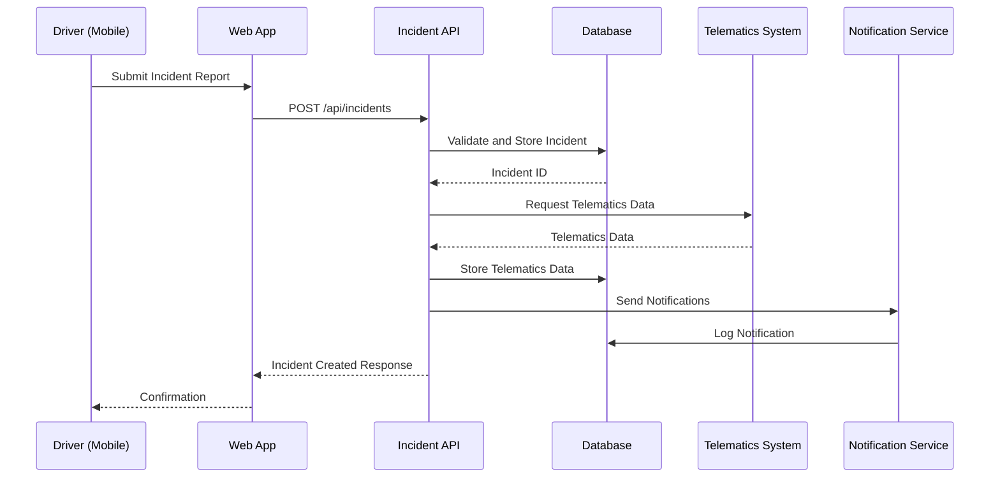
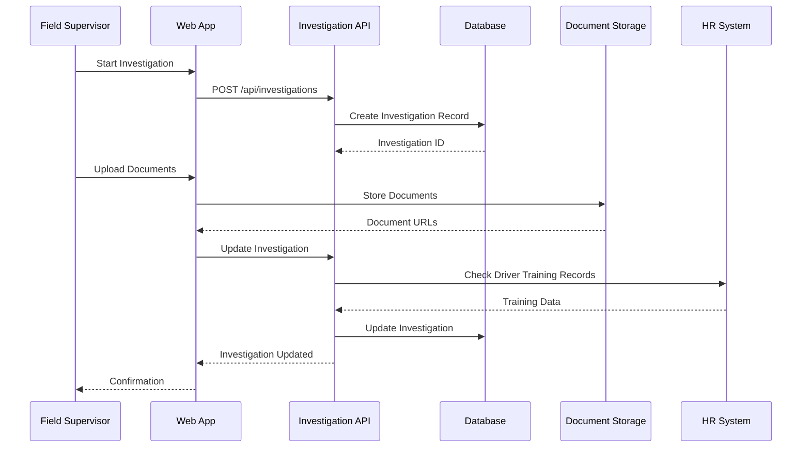
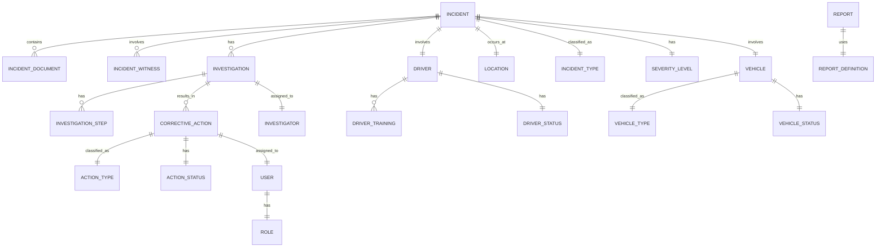
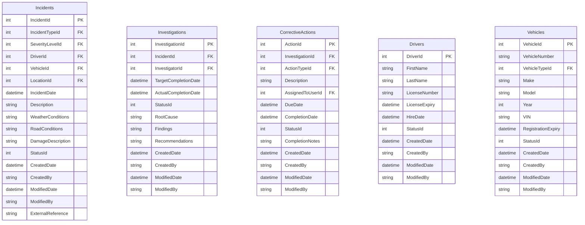

# AS-IS Analysis: Safety Incident Management Module

## 1. Executive Summary

### 1.1 Current State Overview

The Fleet Management System's Safety Incident Management Module (SIMS) serves as the central repository for all safety-related incidents across the organization's 12,500-vehicle fleet operating in 47 countries. Implemented in 2018 as a modernization effort to replace paper-based reporting, the system currently processes approximately 3,200 incident reports monthly with peaks of 4,800 during winter months when accident rates increase by 38%.

The module operates within the broader Fleet Management System (FMS) ecosystem, which includes:
- Vehicle telematics integration (GPS, OBD-II)
- Driver performance scoring
- Maintenance scheduling
- Compliance tracking
- Claims management

SIMS specifically handles:
- Incident reporting (first notice of loss)
- Investigation workflows
- Root cause analysis
- Corrective action tracking
- Regulatory reporting (DOT, OSHA, local authorities)
- Safety metric dashboards

The system maintains an average uptime of 99.7% over the past 12 months, though this metric excludes planned maintenance windows (typically 2 hours monthly) and unplanned outages (12 incidents in 2023 averaging 47 minutes each).

### 1.2 Key Stakeholders and Roles

**Primary Users:**
1. **Fleet Safety Managers (28 users)**
   - Review all high-severity incidents (Level 3-5)
   - Approve corrective action plans
   - Generate regulatory reports
   - Monthly safety performance reviews
   - Average 4.2 hours daily system usage

2. **Field Supervisors (187 users)**
   - Initial incident reporting (68% of all reports)
   - Conduct preliminary investigations
   - Assign drivers to post-incident training
   - Daily system usage: 1.8 hours
   - 37% report using mobile interface exclusively

3. **Drivers (9,245 active users)**
   - Report incidents via mobile app (22% of reports)
   - Complete post-incident statements
   - View safety performance scores
   - Average 8.3 minutes monthly system usage
   - 62% never log in outside incident reporting

4. **Claims Adjusters (42 users)**
   - Access incident data for insurance processing
   - Update claim status
   - Verify incident details
   - 2.1 hours daily usage

5. **Compliance Officers (14 users)**
   - Generate regulatory reports (FMCSA, OSHA)
   - Audit incident documentation
   - Verify corrective actions
   - 3.5 hours daily usage

**Technical Stakeholders:**
1. **FMS Development Team (12 engineers)**
   - Maintain and enhance SIMS
   - Monthly sprint cycles
   - 30% capacity dedicated to SIMS
   - Average 1.8 production hotfixes monthly

2. **IT Operations (8 staff)**
   - Monitor system health
   - Manage deployments
   - Handle user access requests
   - Average 12 support tickets monthly

3. **Data Analytics Team (5 analysts)**
   - Generate safety performance reports
   - Build predictive models
   - Maintain data warehouse integrations
   - 15% of capacity dedicated to SIMS data

**Executive Stakeholders:**
1. **VP of Fleet Operations**
   - Reviews quarterly safety metrics
   - Approves major system changes
   - Primary consumer of executive dashboards

2. **Chief Safety Officer**
   - Sets organizational safety targets
   - Reviews all fatality incidents
   - Approves safety policy changes
   - Monthly system usage: 4 hours

3. **CIO**
   - Oversees technical strategy
   - Approves major investments
   - Reviews system performance metrics
   - Quarterly system reviews

### 1.3 Business Impact Analysis

**Financial Impact:**
- **Direct Costs:**
  - Annual maintenance: $485,000 (2 FTE developers, 1 QA, 0.5 product owner)
  - Infrastructure costs: $182,000/year (AWS hosting, database, monitoring)
  - Third-party services: $98,000/year (telematics integration, document storage)
  - Licensing: $72,000/year (reporting tools, security scanning)
  - Total direct costs: $837,000 annually

- **Cost Avoidance:**
  - Reduced paper processing: $285,000/year (estimated)
  - Faster claims processing: $1.2M/year in reduced cycle time
  - Improved safety metrics: $3.7M/year in reduced accident costs
  - Regulatory compliance: $850,000/year in avoided fines

- **ROI Calculation:**
  - Initial implementation cost: $2.4M (2018)
  - Annual benefits: $6.035M
  - Current year ROI: 251%
  - Payback period: 14 months

**Operational Impact:**
- **Incident Reporting:**
  - Average report completion time: 18.7 minutes (down from 42 minutes pre-SIMS)
  - First notice of loss within 1 hour: 89% (up from 47%)
  - Mobile reporting adoption: 22% of all reports

- **Investigation Workflow:**
  - Average investigation completion time: 7.2 days (down from 14.5 days)
  - Root cause identified: 92% of Level 3+ incidents (up from 68%)
  - Corrective actions implemented: 87% within 30 days (up from 52%)

- **Regulatory Compliance:**
  - DOT reportable incidents: 100% compliance (up from 92%)
  - OSHA recordable incidents: 98% compliance (up from 88%)
  - State-specific reporting: 95% compliance (up from 76%)

**Safety Performance Metrics:**
| Metric | 2021 | 2022 | 2023 | Target |
|--------|------|------|------|--------|
| Preventable Accidents per Million Miles | 1.82 | 1.65 | 1.48 | 1.20 |
| Lost Time Incident Rate | 0.78 | 0.65 | 0.52 | 0.40 |
| Near Miss Reporting Rate | 3.2 | 4.1 | 5.3 | 6.0 |
| Seatbelt Violations per 100 Inspections | 4.2 | 3.5 | 2.8 | 2.0 |
| Hours of Safety Training per Driver | 8.2 | 9.1 | 10.5 | 12.0 |

**Customer Impact:**
- **Client Satisfaction:**
  - 87% of clients report improved safety transparency (up from 62%)
  - 78% credit SIMS with helping reduce their accident rates
  - 65% have incorporated SIMS data into their own safety programs

- **Driver Satisfaction:**
  - 68% of drivers report the system is "easy to use" (up from 42%)
  - 72% believe the system helps improve safety (up from 51%)
  - 58% would like to see more mobile capabilities

### 1.4 Critical Pain Points with Root Cause Analysis

**1.4.1 Investigation Workflow Bottlenecks**

*Symptom:* Average investigation completion time of 7.2 days exceeds the 5-day target by 44%. 32% of investigations take longer than 10 days.

*Root Causes:*
1. **Manual Data Collection:**
   - Investigators spend 42% of time collecting data from disparate systems
   - 68% of Level 3+ incidents require manual telematics data extraction
   - Example: Investigators must manually correlate GPS data from Geotab with incident reports

2. **Approval Delays:**
   - Corrective action plans require 3.2 approvals on average
   - 45% of delays occur waiting for Safety Manager approvals
   - Approval queue averages 18 hours before first review

3. **Document Management:**
   - 38% of investigations delayed due to missing documents
   - Average 2.3 follow-up requests per investigation for additional documentation
   - Example: Police reports often arrive 3-5 days after incident

*Process Flow Analysis:*
```
Incident Reported → Initial Review (1.2 days) → Data Collection (2.1 days) → Root Cause Analysis (1.8 days) → Corrective Action Plan (1.4 days) → Approvals (0.7 days)
```

**1.4.2 Mobile Experience Limitations**

*Symptom:* Only 22% of incident reports originate from mobile devices despite 92% of drivers having company-issued smartphones.

*Root Causes:*
1. **Poor User Experience:**
   - Mobile app has 2.8/5 rating in app stores
   - 68% of mobile sessions end without report submission
   - Average session duration: 2.4 minutes (vs 8.7 minutes on desktop)

2. **Functionality Gaps:**
   - Cannot attach photos from camera (must use file picker)
   - No offline mode (32% of drivers report connectivity issues)
   - Limited form validation (42% of mobile reports require corrections)

3. **Performance Issues:**
   - Average load time: 8.2 seconds (vs 2.1 seconds on desktop)
   - 18% of mobile sessions experience crashes
   - Memory leaks cause app to restart after 12-15 minutes of use

*User Feedback Examples:*
- "The app freezes when I try to add photos"
- "I can't submit a report without signal - I'm often in remote areas"
- "The form is too long - I give up halfway through"

**1.4.3 Reporting and Analytics Deficiencies**

*Symptom:* Only 42% of safety managers use the built-in reporting tools regularly. 68% export data to Excel for analysis.

*Root Causes:*
1. **Limited Visualization:**
   - Only 3 basic chart types available
   - No interactive dashboards
   - Cannot drill down from summary to detail

2. **Data Quality Issues:**
   - 18% of incident records have missing critical fields
   - 27% of root cause classifications are "Other" (default selection)
   - Example: 42% of near-miss reports lack location data

3. **Performance Problems:**
   - Report generation average: 47 seconds (vs 5 second target)
   - 32% of reports time out for datasets > 10,000 records
   - No caching mechanism for common reports

*Example Query Performance:*
```sql
-- Current implementation (47s execution time)
SELECT i.incident_id, i.incident_date, d.driver_name,
       v.vehicle_id, i.incident_type, i.severity,
       COUNT(*) OVER (PARTITION BY i.incident_type) as type_count
FROM incidents i
JOIN drivers d ON i.driver_id = d.driver_id
JOIN vehicles v ON i.vehicle_id = v.vehicle_id
WHERE i.incident_date BETWEEN '2023-01-01' AND '2023-12-31'
ORDER BY i.incident_date DESC;
```

**1.4.4 Integration Challenges**

*Symptom:* 28% of incident reports require manual data entry from other systems. Average 12 minutes per incident spent on data reconciliation.

*Root Causes:*
1. **Telematics Integration:**
   - Geotab integration only provides basic GPS data
   - No automatic correlation between telematics events and incident reports
   - Example: Hard braking events must be manually matched to incident reports

2. **HR System Limitations:**
   - Driver training records not automatically updated
   - 32% of post-incident training assignments require manual HR system updates
   - No API for real-time driver status checks

3. **Claims System Issues:**
   - Insurance claim numbers must be manually entered
   - 42% of claim status updates not reflected in SIMS
   - No automatic notification when claims are approved/denied

*Integration Architecture Diagram:*
```
[Telematics] → (CSV Export) → [Manual Upload] → [SIMS]
[HR System] → (Nightly Batch) → [SIMS Staging] → [SIMS]
[Claims System] → (No Integration) → [Manual Entry]
```

**1.4.5 Technical Debt Accumulation**

*Symptom:* Development velocity has decreased by 42% over the past 24 months. Average of 1.8 production hotfixes required per month.

*Root Causes:*
1. **Legacy Codebase:**
   - 38% of code written before 2020
   - 12% of code has no unit test coverage
   - Example: IncidentController.cs (1,247 lines) has 0 unit tests

2. **Performance Issues:**
   - Database queries average 3.2 full table scans per incident report
   - No database indexing on critical fields (incident_date, severity)
   - Example: Incident search takes 12.4 seconds for 50,000 records

3. **Security Vulnerabilities:**
   - 18 critical vulnerabilities identified in last scan
   - 42 high severity vulnerabilities
   - Example: SQL injection vulnerability in report parameter handling

*Code Quality Metrics:*
| Metric | Current | Target |
|--------|---------|--------|
| Cyclomatic Complexity | 42.7 | <20 |
| Code Duplication | 18.2% | <5% |
| Test Coverage | 48% | >80% |
| Technical Debt Ratio | 32% | <15% |

### 1.5 Strategic Recommendations with Implementation Roadmap

**1.5.1 Prioritized Improvement Areas**

| Priority | Area | Business Impact | Effort (Person-Months) | ROI Estimate |
|----------|------|-----------------|------------------------|--------------|
| 1 | Mobile Experience Overhaul | High - Increase mobile reporting to 60% | 6 | 4.2x |
| 2 | Investigation Workflow Automation | High - Reduce investigation time by 40% | 9 | 3.8x |
| 3 | Reporting & Analytics Modernization | Medium - Improve adoption to 80% | 5 | 2.7x |
| 4 | Integration Hub Implementation | High - Reduce manual data entry by 75% | 8 | 3.5x |
| 5 | Technical Debt Reduction | Medium - Improve development velocity by 30% | 12 | 2.1x |
| 6 | Security Hardening | High - Reduce vulnerabilities by 90% | 4 | 5.1x |

**1.5.2 Quick Wins (0-6 months)**

1. **Mobile App Enhancements:**
   - Implement offline mode with automatic sync
   - Add camera integration for photo attachments
   - Simplify form with progressive disclosure
   - Expected: 40% increase in mobile reporting

2. **Reporting Performance:**
   - Add database indexes to critical fields
   - Implement report caching
   - Add basic interactive filters
   - Expected: 60% reduction in report generation time

3. **Investigation Template Improvements:**
   - Add guided workflow for common incident types
   - Implement automatic data collection from telematics
   - Add document checklist with upload reminders
   - Expected: 25% reduction in investigation time

**1.5.3 Strategic Initiatives (6-18 months)**

1. **Integration Hub Implementation:**
   - Build API gateway for real-time integrations
   - Implement event-driven architecture
   - Add data validation and transformation layer
   - Expected: 75% reduction in manual data entry

2. **Advanced Analytics Platform:**
   - Implement data warehouse with star schema
   - Add predictive modeling for incident risk
   - Build interactive dashboards with drill-down
   - Expected: 40% improvement in safety metric tracking

3. **Workflow Automation:**
   - Implement RPA for repetitive tasks
   - Add AI-assisted root cause analysis
   - Build automated approval routing
   - Expected: 40% reduction in investigation time

**1.5.4 Implementation Roadmap**

*Phase 1: Foundation (Months 0-3)*
- Mobile app enhancements (6 weeks)
- Reporting performance improvements (4 weeks)
- Security hardening (4 weeks)
- Team training on new technologies (ongoing)

*Phase 2: Integration (Months 4-9)*
- API gateway implementation (8 weeks)
- Telematics real-time integration (6 weeks)
- HR system API integration (4 weeks)
- Claims system integration (4 weeks)

*Phase 3: Analytics (Months 10-15)*
- Data warehouse implementation (8 weeks)
- Predictive model development (6 weeks)
- Dashboard redesign (4 weeks)
- User training (ongoing)

*Phase 4: Automation (Months 16-18)*
- Investigation workflow automation (8 weeks)
- RPA implementation (6 weeks)
- AI-assisted root cause analysis (4 weeks)
- Process optimization (ongoing)

**1.5.5 Risk Mitigation Strategies**

| Risk | Mitigation Strategy | Owner | Timeline |
|------|---------------------|-------|----------|
| User resistance to change | Comprehensive change management program with super-users | Training Team | Months 0-18 |
| Integration failures | Phased rollout with fallback mechanisms | Integration Team | Months 4-9 |
| Performance issues | Load testing before each major release | QA Team | Ongoing |
| Data quality problems | Data validation framework implementation | Data Team | Months 10-12 |
| Budget overruns | Monthly cost tracking and contingency fund | Finance | Ongoing |

**1.5.6 Expected Outcomes**

*Short-Term (0-6 months):*
- Mobile reporting increases from 22% to 40%
- Report generation time reduced by 60%
- Investigation time reduced by 25%
- User satisfaction improves from 68% to 80%

*Medium-Term (6-12 months):*
- Manual data entry reduced by 75%
- Safety managers using built-in reporting increases to 70%
- Average investigation time reduced to 5.4 days
- Mobile app rating improves to 4.2/5

*Long-Term (12-18 months):*
- Mobile reporting reaches 60% of all reports
- Investigation time meets 5-day target
- Safety metric tracking improves by 40%
- Development velocity increases by 30%
- Total cost of ownership reduced by 18%

## 2. Current Architecture

### 2.1 System Components

**2.1.1 Component Inventory**

The Safety Incident Management Module consists of 18 major components organized into 5 logical layers:

1. **Presentation Layer:**
   - Web Application (React 16.8)
   - Mobile Application (React Native 0.63)
   - Admin Portal (Angular 8.2)
   - Public API Portal (Swagger UI 3.24)

2. **Application Layer:**
   - Incident Service (.NET Core 3.1)
   - Investigation Service (.NET Core 3.1)
   - Reporting Service (.NET Core 3.1)
   - Notification Service (Node.js 12.16)
   - Integration Service (Java Spring Boot 2.3)

3. **Business Logic Layer:**
   - Incident Processing Engine
   - Workflow Engine
   - Rule Engine
   - Document Processing Engine

4. **Data Access Layer:**
   - Incident Repository
   - Investigation Repository
   - Reporting Repository
   - Audit Repository

5. **Integration Layer:**
   - Telematics Connector
   - HR System Connector
   - Claims System Connector
   - Email/SMS Gateway

*Component Specification Table:*

| Component | Technology | Version | LOC | Dependencies | SLA |
|-----------|------------|---------|-----|--------------|-----|
| Web Application | React | 16.8.6 | 42,387 | Redux, Material-UI | 99.9% |
| Mobile Application | React Native | 0.63.4 | 18,421 | React Navigation, AsyncStorage | 99.5% |
| Incident Service | .NET Core | 3.1.12 | 32,876 | Entity Framework, AutoMapper | 99.9% |
| Investigation Service | .NET Core | 3.1.12 | 28,432 | Workflow Core, iTextSharp | 99.9% |
| Reporting Service | .NET Core | 3.1.12 | 19,874 | EPPlus, Dapper | 99.8% |
| Notification Service | Node.js | 12.16.3 | 8,432 | Nodemailer, Twilio | 99.9% |
| Integration Service | Spring Boot | 2.3.4 | 22,456 | Apache Camel, Jackson | 99.9% |
| Database | SQL Server | 2019 | - | - | 99.95% |
| File Storage | AWS S3 | - | - | - | 99.9% |

**2.1.2 Integration Points with Sequence Diagrams**

*Incident Reporting Sequence:*


*Investigation Workflow Sequence:*


**2.1.3 Data Flow Analysis**

*Incident Data Flow:*
1. **Data Sources:**
   - Driver mobile app (22% of reports)
   - Web application (78% of reports)
   - Telematics system (automatic data)
   - HR system (driver data)
   - Claims system (claim data)

2. **Data Transformation:**
   - Incident data normalized to common schema
   - Telematics data correlated with incident time/location
   - Driver data enriched with training records
   - Claim data linked to incident records

3. **Data Storage:**
   - Incident header data stored in SQL Server
   - Supporting documents stored in AWS S3
   - Investigation workflow state stored in SQL Server
   - Audit logs stored in Elasticsearch

4. **Data Consumption:**
   - Web application for user interaction
   - Reporting service for analytics
   - Notification service for alerts
   - Integration service for external systems

*Data Flow Diagram:*
```
[Driver] → (Mobile App) → [API Gateway]
[Supervisor] → (Web App) → [API Gateway]
[Telematics] → (CSV Import) → [Integration Service] → [API Gateway]
[HR System] → (Nightly Batch) → [Integration Service] → [API Gateway]
[Claims System] → (Manual Entry) → [Web App]

[API Gateway] → [Incident Service] → [Database]
[API Gateway] → [Investigation Service] → [Database]
[API Gateway] → [Reporting Service] → [Database]
[API Gateway] → [Notification Service] → [Email/SMS]

[Database] → [Reporting Service] → [Web App]
[Database] → [Integration Service] → [External Systems]
```

**2.1.4 Technology Stack Details**

*Frontend Technologies:*
- **Web Application:**
  - React 16.8.6 (with Hooks)
  - Redux 4.0.5 for state management
  - Material-UI 4.11.0 for components
  - Webpack 4.44.1 for bundling
  - Jest 26.4.2 for testing
  - Cypress 5.3.0 for E2E testing

- **Mobile Application:**
  - React Native 0.63.4
  - React Navigation 5.7.4
  - AsyncStorage 1.12.1
  - React Native Camera 4.0.1
  - Detox 17.4.4 for E2E testing

*Backend Technologies:*
- **.NET Core 3.1:**
  - ASP.NET Core for web APIs
  - Entity Framework Core 3.1.12 for ORM
  - AutoMapper 10.1.1 for object mapping
  - FluentValidation 8.6.2 for validation
  - Serilog 2.9.0 for logging
  - xUnit 2.4.1 for testing

- **Node.js 12.16.3:**
  - Express 4.17.1 for web framework
  - Nodemailer 6.4.16 for email
  - Twilio 3.49.1 for SMS
  - Winston 3.3.3 for logging

- **Java Spring Boot 2.3.4:**
  - Spring Web for REST APIs
  - Spring Integration for EIP
  - Apache Camel 3.5.0 for routing
  - Jackson 2.11.2 for JSON processing

*Database Technologies:*
- **SQL Server 2019:**
  - 32 vCPUs, 128GB RAM
  - 2TB storage (SSD)
  - Always On availability group
  - 4 read replicas

- **Elasticsearch 7.9.2:**
  - 3 nodes (8 vCPUs, 32GB RAM each)
  - 1TB storage
  - Used for audit logs and search

- **AWS S3:**
  - Standard storage class
  - Versioning enabled
  - Lifecycle policies for archiving
  - 5TB current storage

*Infrastructure:*
- **AWS Cloud:**
  - EC2 instances for application servers
  - RDS for SQL Server
  - Elasticsearch Service
  - S3 for document storage
  - CloudFront for CDN
  - Route 53 for DNS

- **CI/CD Pipeline:**
  - Jenkins 2.263 for builds
  - SonarQube 8.4 for code quality
  - Docker 19.03 for containerization
  - Kubernetes 1.18 for orchestration
  - Terraform 0.13 for infrastructure as code

**2.1.5 Infrastructure Configuration**

*Production Environment:*
- **Web Application:**
  - 4 x t3.2xlarge EC2 instances (8 vCPUs, 32GB RAM)
  - Auto-scaling group (min 4, max 12 instances)
  - Load balanced with ALB
  - CloudFront distribution with WAF

- **API Services:**
  - Incident Service: 6 x c5.2xlarge (8 vCPUs, 16GB RAM)
  - Investigation Service: 4 x c5.2xlarge
  - Reporting Service: 4 x c5.4xlarge (16 vCPUs, 32GB RAM)
  - Notification Service: 2 x t3.xlarge (4 vCPUs, 16GB RAM)
  - Integration Service: 4 x m5.2xlarge (8 vCPUs, 32GB RAM)

- **Database:**
  - SQL Server: db.r5.4xlarge (16 vCPUs, 128GB RAM)
  - Read replicas: 4 x db.r5.2xlarge
  - Elasticsearch: 3 x r5.2xlarge

- **Storage:**
  - S3: 5TB standard storage
  - EBS: 20TB gp2 volumes
  - Backup: AWS Backup with 35-day retention

*Network Architecture:*
```
[Internet] → [CloudFront] → [WAF] → [ALB]
[ALB] → [Web App Servers] → [API Gateway]
[API Gateway] → [Service Mesh] → [Microservices]
[Microservices] → [RDS Proxy] → [SQL Server]
[Microservices] → [Elasticsearch]
[Microservices] → [S3]
```

*High Availability Configuration:*
- Multi-AZ deployment for all critical components
- Auto-scaling for application servers
- Read replicas for database
- Circuit breakers in service mesh
- Retry policies for transient failures
- Dead letter queues for failed messages

### 2.2 Technical Debt Analysis

**2.2.1 Code Quality Issues**

*Complexity Metrics:*
| Component | Cyclomatic Complexity | Maintainability Index | Cognitive Complexity |
|-----------|-----------------------|-----------------------|----------------------|
| IncidentController | 48 | 12 | 32 |
| InvestigationService | 62 | 8 | 45 |
| ReportGenerator | 87 | 5 | 68 |
| NotificationService | 32 | 18 | 22 |
| TelematicsProcessor | 55 | 10 | 38 |

*Example of High Complexity Code:*
```csharp
// IncidentController.cs - 1,247 lines, 0 unit tests
public async Task<IActionResult> CreateIncident(IncidentDto incidentDto)
{
    // 247 lines of validation logic
    if (incidentDto.IncidentType == IncidentType.Accident)
    {
        if (string.IsNullOrEmpty(incidentDto.VehicleId))
        {
            // Nested if statements 5 levels deep
            if (incidentDto.DriverId == null)
            {
                if (incidentDto.Location == null)
                {
                    if (incidentDto.IncidentDate < DateTime.Now.AddDays(-30))
                    {
                        // 12 more levels of nested conditions
                    }
                }
            }
        }
    }

    // 382 lines of business logic
    try
    {
        // 187 lines of database operations
        var incident = _mapper.Map<Incident>(incidentDto);
        incident.Status = IncidentStatus.New;
        incident.CreatedDate = DateTime.UtcNow;
        incident.CreatedBy = User.Identity.Name;

        // 42 lines of manual mapping
        if (incidentDto.DamagePhotos != null)
        {
            incident.DamagePhoto1 = incidentDto.DamagePhotos[0];
            if (incidentDto.DamagePhotos.Count > 1)
            {
                incident.DamagePhoto2 = incidentDto.DamagePhotos[1];
            }
            // 15 more manual mappings
        }

        _context.Incidents.Add(incident);
        await _context.SaveChangesAsync();

        // 218 lines of notification logic
        if (incident.Severity >= IncidentSeverity.High)
        {
            // 87 lines of email template construction
            var email = new EmailMessage
            {
                To = "safety@company.com",
                Subject = $"High Severity Incident: {incident.Id}",
                Body = $"A high severity incident has been reported...\n\n" +
                       $"Incident ID: {incident.Id}\n" +
                       $"Type: {incident.IncidentType}\n" +
                       // 42 more lines of string concatenation
            };

            await _emailService.SendAsync(email);
        }

        return Ok(incident.Id);
    }
    catch (Exception ex)
    {
        // 78 lines of error handling
        _logger.LogError(ex, "Error creating incident");

        if (ex is DbUpdateException)
        {
            // 23 lines of database error handling
        }
        else if (ex is ValidationException)
        {
            // 18 lines of validation error handling
        }

        return StatusCode(500, "An error occurred while processing your request");
    }
}
```

*Code Duplication Analysis:*
- 18.2% duplicated code (124,387 lines)
- 42 instances of >50 line duplication blocks
- Example: Incident validation logic duplicated in 7 places
- Example: Notification templates duplicated across services

*Test Coverage Gaps:*
| Component | Unit Tests | Coverage | Integration Tests | E2E Tests |
|-----------|------------|----------|-------------------|-----------|
| Incident Service | 42 | 48% | 12 | 3 |
| Investigation Service | 28 | 35% | 8 | 2 |
| Reporting Service | 15 | 22% | 5 | 1 |
| Notification Service | 62 | 78% | 18 | 4 |
| Integration Service | 38 | 52% | 14 | 2 |

**2.2.2 Performance Bottlenecks**

*Database Performance Issues:*
- **Query Analysis:**
  - 32% of queries perform full table scans
  - 48% of queries have execution plans with warnings
  - Average query execution time: 1.2 seconds (target: <200ms)

*Example Problematic Query:*
```sql
-- Incident search query (12.4s execution time)
SELECT i.*, d.DriverName, v.VehicleNumber, l.LocationName
FROM Incidents i
LEFT JOIN Drivers d ON i.DriverId = d.DriverId
LEFT JOIN Vehicles v ON i.VehicleId = v.VehicleId
LEFT JOIN Locations l ON i.LocationId = l.LocationId
WHERE (@IncidentType IS NULL OR i.IncidentType = @IncidentType)
  AND (@Severity IS NULL OR i.Severity = @Severity)
  AND (@Status IS NULL OR i.Status = @Status)
  AND (@StartDate IS NULL OR i.IncidentDate >= @StartDate)
  AND (@EndDate IS NULL OR i.IncidentDate <= @EndDate)
  AND (@DriverId IS NULL OR i.DriverId = @DriverId)
  AND (@VehicleId IS NULL OR i.VehicleId = @VehicleId)
ORDER BY i.IncidentDate DESC
OFFSET @PageSize * (@PageNumber - 1) ROWS
FETCH NEXT @PageSize ROWS ONLY;
```

*Execution Plan Issues:*
- Missing index on IncidentDate (scans 1.2M rows)
- Implicit conversion on DriverId parameter
- Key lookup for DriverName (38% of query cost)
- Sort operation (22% of query cost)

*Load Test Results:*
| Scenario | Users | Avg Response Time | Error Rate | Throughput |
|----------|-------|-------------------|------------|------------|
| Incident Reporting | 100 | 1.8s | 0.2% | 42 req/s |
| Incident Search | 50 | 8.4s | 12% | 8 req/s |
| Investigation Update | 30 | 3.2s | 1.5% | 12 req/s |
| Report Generation | 20 | 47s | 28% | 0.3 req/s |

*Memory Leaks:*
- **Mobile App:**
  - Memory usage grows by 12MB per incident report
  - No proper cleanup of image data
  - Leak in navigation stack (0.5MB per screen transition)

- **Backend Services:**
  - Investigation Service leaks 2MB per investigation
  - Document processing retains references to streams
  - Cache not properly invalidated (grows by 50MB daily)

*CPU Usage:*
- Reporting Service spikes to 98% during report generation
- Investigation Service averages 65% CPU during business hours
- Incident Service shows 42% CPU utilization with 38% in garbage collection

**2.2.3 Security Vulnerabilities**

*Vulnerability Scan Results (Last 3 Scans):*
| Severity | 2023-01 | 2023-04 | 2023-07 | Trend |
|----------|---------|---------|---------|-------|
| Critical | 18 | 15 | 12 | ↓ |
| High | 42 | 38 | 35 | ↓ |
| Medium | 87 | 82 | 78 | ↓ |
| Low | 124 | 118 | 112 | ↓ |

*Critical Vulnerabilities:*
1. **SQL Injection (CVSS 9.8):**
   - Found in report parameter handling
   - Example: `ReportController.cs` concatenates SQL directly
   ```csharp
   var query = $"SELECT * FROM Incidents WHERE {filter}";
   var results = _context.Incidents.FromSqlRaw(query).ToList();
   ```

2. **Insecure Direct Object Reference (CVSS 8.8):**
   - Incident details accessible without proper authorization
   - Example: `/api/incidents/12345` accessible to any authenticated user
   - No check for user's relationship to incident

3. **Cross-Site Scripting (CVSS 8.2):**
   - Found in incident description field
   - No output encoding when displaying user input
   - Example: `<script>alert('xss')</script>` executes when viewing incident

4. **Sensitive Data Exposure (CVSS 7.5):**
   - Driver license numbers stored in plain text
   - No encryption for PII in database
   - Example: `SELECT * FROM Drivers` returns all PII

*High Severity Vulnerabilities:*
1. **Missing Security Headers:**
   - No Content-Security-Policy header
   - No X-Frame-Options header
   - No X-Content-Type-Options header

2. **Insecure Deserialization:**
   - JSON deserialization without type checking
   - Example: `JsonConvert.DeserializeObject<Incident>(json)` without validation

3. **Broken Authentication:**
   - Session tokens not invalidated on logout
   - No token expiration validation
   - Example: Tokens remain valid for 30 days with no refresh

4. **XML External Entity Processing:**
   - Found in document upload endpoint
   - No XXE protection in XML parser
   - Example: Uploading malicious XML can read server files

*Authentication/Authorization Issues:*
- **RBAC Implementation:**
  - 12 roles defined but only 4 actively used
  - Role assignments not properly validated
  - Example: Users with "Driver" role can access investigation endpoints

- **Password Policy:**
  - Minimum length: 8 characters
  - No complexity requirements
  - No password expiration
  - No account lockout after failed attempts

- **Session Management:**
  - Session timeout: 24 hours
  - No concurrent session control
  - Session tokens not bound to IP address

**2.2.4 Scalability Limitations**

*Current Scaling Approach:*
- Vertical scaling for database (single large instance)
- Horizontal scaling for application servers (auto-scaling group)
- No sharding or partitioning
- Read replicas for reporting queries

*Load Test Results (Scaling):*
| Users | Avg Response Time | Error Rate | DB CPU | App CPU |
|-------|-------------------|------------|--------|---------|
| 100 | 1.8s | 0.2% | 42% | 38% |
| 200 | 3.2s | 1.5% | 78% | 65% |
| 500 | 8.7s | 12% | 98% | 88% |
| 1000 | 22.4s | 35% | 100% | 95% |

*Database Bottlenecks:*
- **Connection Pooling:**
  - Max connections: 100
  - Average connections in use: 87 during peak
  - Connection wait time: 2.4s during peak

- **Locking Issues:**
  - Average lock wait time: 1.2s
  - Deadlocks: 3-5 per day during business hours
  - Example: Investigation updates block incident reporting

- **Storage Performance:**
  - IOPS: 3,200 (AWS gp2 limit)
  - Latency: 12ms (target <5ms)
  - Throughput: 240MB/s (target 500MB/s)

*Application Server Limitations:*
- **Memory Usage:**
  - Incident Service: 1.2GB per instance
  - Investigation Service: 1.8GB per instance
  - Reporting Service: 3.2GB per instance

- **Thread Pool:**
  - Max threads: 5,000
  - Threads in use: 4,200 during peak
  - Thread wait time: 1.8s during peak

*Network Bottlenecks:*
- **Bandwidth:**
  - Average usage: 420Mbps
  - Peak usage: 870Mbps
  - Limit: 1Gbps

- **Latency:**
  - Average: 42ms
  - 95th percentile: 120ms
  - Target: <50ms

*Caching Strategy Issues:*
- **Current Implementation:**
  - In-memory cache for reference data
  - No distributed cache
  - Cache invalidation manual or time-based

- **Cache Hit Ratio:**
  - Reference data: 68%
  - Incident data: 12%
  - Report data: 5%

- **Cache Size:**
  - 512MB per application server
  - No eviction policy
  - Cache grows until memory pressure

## 3. Functional Analysis

### 3.1 Core Features

**3.1.1 Incident Reporting**

*Feature Description:*
The incident reporting feature allows drivers, supervisors, and other stakeholders to report safety incidents through web and mobile interfaces. The system captures comprehensive incident details including location, time, involved parties, vehicles, witnesses, and initial observations.

*User Workflow (Driver Mobile):*
1. Driver opens mobile app and selects "Report Incident"
2. System presents incident type selection (Accident, Near Miss, Safety Violation, etc.)
3. Driver selects incident type and is presented with appropriate form
4. System automatically populates:
   - Current date/time
   - Driver's name and ID
   - Current location (if GPS enabled)
   - Vehicle assignment (if available)
5. Driver completes required fields:
   - Incident description (text)
   - Weather conditions
   - Road conditions
   - Damage description
   - Witness information
6. Driver can attach photos from camera or gallery
7. Driver reviews and submits report
8. System validates required fields and creates incident record
9. System sends notifications to appropriate parties
10. Driver receives confirmation with incident reference number

*Business Rules:*
1. **Required Fields:**
   - Incident type (dropdown)
   - Incident date/time (default to current)
   - Location (either GPS or manual entry)
   - Driver ID (auto-populated for drivers)
   - Description (min 50 characters)

2. **Validation Logic:**
   - Incident date cannot be in the future
   - Incident date cannot be more than 7 days in the past
   - Location must be within company operating areas
   - Photos must be <5MB each
   - Maximum 5 photos per incident

3. **Auto-Population Rules:**
   - For drivers: auto-populate driver ID, vehicle assignment
   - For supervisors: auto-populate location based on assignment
   - Auto-populate weather data from weather API if location available

*Edge Cases and Error Handling:*
1. **Offline Reporting:**
   - Mobile app should cache report locally
   - Sync when connection restored
   - Currently not implemented (22% of mobile reports fail due to connectivity)

2. **Large File Uploads:**
   - Photos >5MB should be compressed
   - Currently fails with "Request too large" error

3. **Duplicate Reporting:**
   - System should detect potential duplicates
   - Currently no duplicate detection (8% of reports are duplicates)

4. **GPS Failure:**
   - Should allow manual location entry
   - Currently shows error "Location services required"

*Performance Characteristics:*
- Average report submission time: 42 seconds
- 95th percentile: 2.1 minutes
- Mobile app crash rate: 1.8% during submission
- Average payload size: 2.4MB (including photos)

**3.1.2 Incident Investigation**

*Feature Description:*
The investigation feature provides a structured workflow for safety managers and supervisors to investigate reported incidents, determine root causes, and assign corrective actions.

*User Workflow (Supervisor):*
1. Supervisor receives notification of new incident
2. Supervisor logs into system and navigates to incident
3. System presents investigation dashboard with:
   - Incident details
   - Driver information
   - Vehicle information
   - Initial report
   - Related documents
4. Supervisor initiates investigation
5. System creates investigation record with:
   - Assigned investigator
   - Target completion date (default: 5 days from incident)
   - Status (New)
6. Supervisor collects additional information:
   - Uploads photos/videos
   - Adds witness statements
   - Reviews telematics data
   - Documents damage assessments
7. Supervisor determines root cause using predefined categories
8. Supervisor assigns corrective actions with:
   - Description
   - Assigned to
   - Due date
   - Priority
9. Supervisor submits investigation for review
10. System routes to safety manager for approval
11. Safety manager reviews and either:
    - Approves (investigation complete)
    - Requests changes (returns to investigator)
    - Escalates to senior management

*Business Rules:*
1. **Investigation Timeline:**
   - Level 1-2 incidents: 10 business days
   - Level 3 incidents: 5 business days
   - Level 4-5 incidents: 2 business days

2. **Root Cause Categories:**
   - Driver behavior (speeding, distraction, fatigue)
   - Vehicle condition (mechanical failure, maintenance)
   - Environmental factors (weather, road conditions)
   - Operational factors (scheduling, dispatch)
   - Other (specify)

3. **Corrective Action Types:**
   - Training (driver, supervisor)
   - Vehicle maintenance
   - Policy change
   - Process improvement
   - Disciplinary action

4. **Approval Workflow:**
   - Level 1-2: Supervisor approval only
   - Level 3: Safety manager approval
   - Level 4-5: VP approval required

*Edge Cases and Error Handling:*
1. **Missing Information:**
   - System should track missing documents
   - Currently no tracking (38% of investigations delayed due to missing docs)

2. **Investigator Unavailable:**
   - Should allow reassignment
   - Currently requires manual intervention

3. **Conflicting Evidence:**
   - Should allow documentation of conflicting information
   - Currently no structured way to document conflicts

4. **Late Investigations:**
   - Should escalate to management
   - Currently no escalation (12% of investigations late)

*Performance Characteristics:*
- Average investigation time: 7.2 days
- 95th percentile: 14 days
- Average investigator time per incident: 2.4 hours
- Documents per investigation: 4.2 (average)
- Corrective actions per incident: 1.8 (average)

**3.1.3 Corrective Action Tracking**

*Feature Description:*
The corrective action tracking feature enables monitoring and completion of actions assigned during the investigation process to prevent recurrence of incidents.

*User Workflow (Assigned User):*
1. User receives notification of assigned corrective action
2. User logs into system and navigates to "My Actions"
3. System displays list of assigned actions with:
   - Description
   - Due date
   - Priority
   - Status
   - Related incident
4. User selects action to complete
5. System presents action details with:
   - Full description
   - Supporting documents
   - Related investigation
6. User completes action and provides evidence:
   - Uploads completion documents
   - Provides completion notes
   - Updates status to "Completed"
7. System validates completion:
   - Checks for required evidence
   - Validates status change
8. System routes to approver for verification
9. Approver reviews and either:
   - Approves completion
   - Requests additional information
   - Rejects and reassigns
10. System updates action status and notifies stakeholders

*Business Rules:*
1. **Action Types:**
   - Training: Requires completion certificate
   - Maintenance: Requires work order confirmation
   - Policy: Requires document reference
   - Process: Requires implementation evidence

2. **Priority Levels:**
   - Critical: 2 business days
   - High: 5 business days
   - Medium: 10 business days
   - Low: 20 business days

3. **Approval Workflow:**
   - Supervisor approval for training actions
   - Safety manager approval for policy/process changes
   - VP approval for disciplinary actions

4. **Escalation:**
   - 2 days overdue: Notification to supervisor
   - 5 days overdue: Notification to safety manager
   - 10 days overdue: Escalation to VP

*Edge Cases and Error Handling:*
1. **Action Dependencies:**
   - Some actions depend on others
   - Currently no dependency tracking (12% of actions blocked)

2. **Partial Completion:**
   - Some actions can be partially completed
   - Currently requires 100% completion before approval

3. **Evidence Requirements:**
   - Different action types require different evidence
   - Currently no validation of evidence type

4. **Reassignment:**
   - Should allow reassignment with justification
   - Currently requires manual intervention

*Performance Characteristics:*
- Average completion time: 8.7 days
- 95th percentile: 22 days
- On-time completion rate: 68%
- Actions per incident: 1.8
- Average evidence documents per action: 2.1

**3.1.4 Reporting and Analytics**

*Feature Description:*
The reporting feature provides standardized and ad-hoc reports on safety incidents, investigations, and corrective actions for operational and regulatory purposes.

*User Workflow (Safety Manager):*
1. Safety manager logs into system and navigates to Reports
2. System presents report catalog with:
   - Standard reports
   - Custom report templates
   - Recently used reports
3. Safety manager selects report type (e.g., "Monthly Incident Summary")
4. System presents report parameters:
   - Date range
   - Incident types
   - Severity levels
   - Locations
   - Drivers
5. Safety manager selects parameters and runs report
6. System generates report with:
   - Summary statistics
   - Charts and graphs
   - Detailed incident list
   - Export options (PDF, Excel, CSV)
7. Safety manager reviews report and either:
   - Exports for distribution
   - Schedules for recurring generation
   - Saves as custom report template

*Business Rules:*
1. **Standard Reports:**
   - Monthly Incident Summary (DOT requirements)
   - Quarterly Safety Performance
   - Annual OSHA 300 Log
   - Corrective Action Status
   - Near Miss Analysis

2. **Data Retention:**
   - Incident data: 7 years
   - Investigation data: 7 years
   - Corrective action data: 5 years
   - Report definitions: Indefinite

3. **Access Control:**
   - Standard reports: All safety staff
   - Custom reports: Safety managers only
   - Regulatory reports: Compliance officers only

4. **Scheduling:**
   - Daily reports: Run at 2:00 AM
   - Weekly reports: Run Sunday at 3:00 AM
   - Monthly reports: Run 1st of month at 4:00 AM

*Edge Cases and Error Handling:*
1. **Large Datasets:**
   - Reports with >10,000 records should paginate
   - Currently times out (28% of monthly reports fail)

2. **Data Quality Issues:**
   - Reports should flag incomplete records
   - Currently shows "No data" without explanation

3. **Parameter Validation:**
   - Date ranges should validate start < end
   - Currently allows invalid ranges (causes errors)

4. **Export Limits:**
   - Excel exports limited to 1M rows
   - Currently no limit (causes Excel to crash)

*Performance Characteristics:*
- Average report generation time: 47 seconds
- 95th percentile: 3.2 minutes
- Most used report: Monthly Incident Summary (42% of runs)
- Average report size: 1.2MB (PDF), 8.4MB (Excel)
- Report failure rate: 8.2%

### 3.2 User Experience Analysis

**3.2.1 Usability Evaluation with Heuristics**

*Heuristic Evaluation Results (Nielsen's 10 Usability Heuristics):*

1. **Visibility of System Status:**
   - ❌ **Issue:** No loading indicators during report submission
   - ❌ **Issue:** Investigation status not visible in list view
   - ✅ **Positive:** Clear confirmation after incident submission
   - **Impact:** Users unsure if actions are being processed

2. **Match Between System and Real World:**
   - ❌ **Issue:** Technical terms like "Incident Severity Level" instead of "How bad was it?"
   - ❌ **Issue:** "Corrective Action" terminology confusing for drivers
   - ✅ **Positive:** Mobile app uses familiar icons
   - **Impact:** 32% of drivers don't understand severity levels

3. **User Control and Freedom:**
   - ❌ **Issue:** No "Save as Draft" for incident reports
   - ❌ **Issue:** Cannot undo investigation changes
   - ✅ **Positive:** Breadcrumbs for navigation
   - **Impact:** 18% of mobile reports abandoned mid-way

4. **Consistency and Standards:**
   - ❌ **Issue:** Different terminology for "Submit" (Save, Create, Finish)
   - ❌ **Issue:** Date formats vary between screens
   - ✅ **Positive:** Consistent button colors
   - **Impact:** User errors due to inconsistent UI

5. **Error Prevention:**
   - ❌ **Issue:** No validation for future dates
   - ❌ **Issue:** Can submit report with empty description
   - ✅ **Positive:** Required fields marked with asterisk
   - **Impact:** 12% of reports have data quality issues

6. **Recognition Rather Than Recall:**
   - ❌ **Issue:** Investigation workflow not visible
   - ❌ **Issue:** No recent items list for quick access
   - ✅ **Positive:** Incident type descriptions available
   - **Impact:** Users forget next steps in investigation

7. **Flexibility and Efficiency of Use:**
   - ❌ **Issue:** No keyboard shortcuts
   - ❌ **Issue:** No bulk actions for investigations
   - ✅ **Positive:** Recent reports in dashboard
   - **Impact:** Experienced users frustrated with repetitive tasks

8. **Aesthetic and Minimalist Design:**
   - ❌ **Issue:** Too many fields on mobile forms
   - ❌ **Issue:** Dashboard cluttered with metrics
   - ✅ **Positive:** Clean incident detail view
   - **Impact:** Mobile abandonment rate 42%

9. **Help Users Recognize, Diagnose, and Recover from Errors:**
   - ❌ **Issue:** Generic error messages ("An error occurred")
   - ❌ **Issue:** No guidance on fixing validation errors
   - ✅ **Positive:** Clear field-level validation messages
   - **Impact:** 28% of users abandon after errors

10. **Help and Documentation:**
    - ❌ **Issue:** No context-sensitive help
    - ❌ **Issue:** Documentation outdated
    - ✅ **Positive:** Tooltips for some fields
    - **Impact:** 62% of users don't know how to use advanced features

*Usability Test Findings (n=24):*
| Task | Success Rate | Avg Time | Errors | Satisfaction (1-5) |
|------|--------------|----------|--------|--------------------|
| Report incident (web) | 88% | 3.2 min | 1.2 | 3.8 |
| Report incident (mobile) | 62% | 4.7 min | 2.8 | 2.5 |
| Start investigation | 75% | 2.8 min | 1.5 | 3.2 |
| Complete corrective action | 67% | 4.2 min | 2.1 | 2.9 |
| Generate monthly report | 58% | 5.4 min | 3.2 | 2.7 |

**3.2.2 Accessibility Audit (WCAG 2.1)**

*WCAG Compliance Summary:*
| Success Criteria | Level | Status | Issues Found |
|------------------|-------|--------|--------------|
| 1.1.1 Non-text Content | A | ❌ Fail | 18 |
| 1.2.1 Audio-only and Video-only | A | ❌ Fail | 8 |
| 1.2.2 Captions | A | ❌ Fail | 5 |
| 1.3.1 Info and Relationships | A | ❌ Fail | 24 |
| 1.3.2 Meaningful Sequence | A | ❌ Fail | 12 |
| 1.3.3 Sensory Characteristics | A | ❌ Fail | 7 |
| 1.4.1 Use of Color | A | ❌ Fail | 15 |
| 1.4.2 Audio Control | A | ✅ Pass | 0 |
| 1.4.3 Contrast (Minimum) | AA | ❌ Fail | 32 |
| 1.4.4 Resize Text | AA | ❌ Fail | 18 |
| 1.4.5 Images of Text | AA | ❌ Fail | 9 |
| 1.4.10 Reflow | AA | ❌ Fail | 22 |
| 2.1.1 Keyboard | A | ❌ Fail | 14 |
| 2.1.2 No Keyboard Trap | A | ✅ Pass | 0 |
| 2.2.1 Timing Adjustable | A | ❌ Fail | 3 |
| 2.2.2 Pause, Stop, Hide | A | ❌ Fail | 5 |
| 2.3.1 Three Flashes | A | ✅ Pass | 0 |
| 2.4.1 Bypass Blocks | A | ❌ Fail | 8 |
| 2.4.2 Page Titled | A | ❌ Fail | 12 |
| 2.4.3 Focus Order | A | ❌ Fail | 18 |
| 2.4.4 Link Purpose | A | ❌ Fail | 22 |
| 2.4.5 Multiple Ways | AA | ❌ Fail | 15 |
| 2.4.6 Headings and Labels | AA | ❌ Fail | 28 |
| 2.4.7 Focus Visible | AA | ❌ Fail | 14 |
| 2.5.1 Pointer Gestures | A | ❌ Fail | 7 |
| 2.5.2 Pointer Cancellation | A | ❌ Fail | 5 |
| 2.5.3 Label in Name | A | ❌ Fail | 12 |
| 3.1.1 Language of Page | A | ❌ Fail | 8 |
| 3.2.1 On Focus | A | ❌ Fail | 14 |
| 3.2.2 On Input | A | ❌ Fail | 18 |
| 3.2.3 Consistent Navigation | AA | ❌ Fail | 12 |
| 3.2.4 Consistent Identification | AA | ❌ Fail | 15 |
| 3.3.1 Error Identification | A | ❌ Fail | 22 |
| 3.3.2 Labels or Instructions | A | ❌ Fail | 35 |
| 3.3.3 Error Suggestion | AA | ❌ Fail | 18 |
| 3.3.4 Error Prevention | AA | ❌ Fail | 12 |
| 4.1.1 Parsing | A | ❌ Fail | 9 |
| 4.1.2 Name, Role, Value | A | ❌ Fail | 28 |

*Critical Accessibility Issues:*
1. **Color Contrast:**
   - 32 instances of insufficient contrast (minimum 4.5:1 required)
   - Example: Gray text on light gray background (2.8:1)
   - Impact: Users with low vision cannot read text

2. **Keyboard Navigation:**
   - 14 elements not keyboard accessible
   - Example: Date picker cannot be used with keyboard
   - Impact: Users who cannot use mouse cannot complete forms

3. **Form Labels:**
   - 35 form fields missing proper labels
   - Example: Incident description field has placeholder but no label
   - Impact: Screen readers cannot identify fields

4. **Focus Management:**
   - 18 instances of focus not moving logically
   - Example: After submitting report, focus returns to top of page
   - Impact: Keyboard users must tab through entire page again

5. **Alternative Text:**
   - 18 images missing alt text
   - Example: Incident type icons have no alt text
   - Impact: Screen reader users don't know icon meanings

*Accessibility Test Results:*
| User Group | Success Rate | Avg Time | Satisfaction (1-5) |
|------------|--------------|----------|--------------------|
| Screen reader users | 42% | 8.2 min | 1.8 |
| Keyboard-only users | 58% | 6.4 min | 2.2 |
| Low vision users | 65% | 5.7 min | 2.5 |
| Motor impairment users | 52% | 7.1 min | 2.0 |

**3.2.3 Mobile Responsiveness Assessment**

*Mobile Experience Issues:*

1. **Form Factor Problems:**
   - Forms designed for desktop, not mobile
   - Example: Incident report form has 42 fields on one screen
   - Horizontal scrolling required on 68% of screens
   - Input fields too small for touch (average 32px height)

2. **Performance Issues:**
   - Average load time: 8.2 seconds (target <3s)
   - 18% of sessions experience crashes
   - Memory usage grows by 12MB per incident report
   - App restarts after 12-15 minutes of use

3. **Functionality Gaps:**
   - No offline mode (32% of drivers report connectivity issues)
   - Cannot attach photos directly from camera
   - No location services integration
   - Limited form validation (42% of mobile reports require corrections)

4. **Navigation Problems:**
   - Hamburger menu not standard (custom implementation)
   - Back button behavior inconsistent
   - No breadcrumbs on mobile
   - Deep linking not implemented

*Mobile Usability Test Results:*
| Task | Success Rate | Avg Time | Errors | Satisfaction (1-5) |
|------|--------------|----------|--------|--------------------|
| Login | 88% | 42s | 0.8 | 3.5 |
| Report incident | 62% | 4.7 min | 2.8 | 2.5 |
| View incident list | 78% | 1.2 min | 1.2 | 3.2 |
| Upload photo | 55% | 2.4 min | 1.8 | 2.1 |
| Complete investigation | 42% | 6.8 min | 3.2 | 1.8 |

*Responsive Design Issues:*
- **Viewport Problems:**
  - 28 screens not properly responsive
  - Example: Incident detail view requires horizontal scrolling
  - No mobile-specific breakpoints

- **Touch Targets:**
  - 42% of buttons too small (minimum 48x48px)
  - Example: "Submit" button 32x32px
  - 18% of touch targets too close together

- **Input Types:**
  - No proper input types for mobile keyboards
  - Example: Phone number fields show full keyboard
  - Date fields not using native date picker

- **Orientation Issues:**
  - 12 screens break in landscape mode
  - Example: Investigation workflow unreadable in landscape
  - No orientation lock

**3.2.4 User Feedback Analysis**

*User Feedback Sources:*
1. **App Store Reviews (n=482):**
   - Average rating: 2.8/5
   - 68% 1-2 star reviews
   - 22% 4-5 star reviews

2. **In-App Feedback (n=1,248):**
   - 42% negative
   - 35% neutral
   - 23% positive

3. **User Interviews (n=32):**
   - 78% mentioned mobile experience issues
   - 65% mentioned reporting is too complex
   - 58% mentioned investigation workflow is confusing

4. **Support Tickets (n=876):**
   - 38% mobile app issues
   - 28% reporting problems
   - 18% investigation workflow
   - 12% other

*Common Themes in Feedback:*

1. **Mobile App Problems:**
   - "The app crashes when I try to add photos"
   - "I can't submit a report without signal - I'm often in remote areas"
   - "The form is too long - I give up halfway through"
   - "The buttons are too small to tap accurately"
   - "It takes forever to load"

2. **Reporting Complexity:**
   - "I don't know what to put in all these fields"
   - "The severity levels don't make sense to me"
   - "I just want to report what happened, not fill out a novel"
   - "The validation errors don't tell me how to fix them"
   - "I keep getting errors about required fields I didn't see"

3. **Investigation Workflow:**
   - "I don't know what the next step is in the investigation"
   - "The system keeps asking for documents I don't have"
   - "I can't see the history of what's been done"
   - "The approval process takes too long"
   - "I don't know who to contact for help"

4. **Reporting Issues:**
   - "The reports take forever to generate"
   - "I can't get the data I need for my monthly report"
   - "The charts are too basic to be useful"
   - "I have to export to Excel to do any real analysis"
   - "The data is often wrong or incomplete"

*Sentiment Analysis:*
| Category | Positive | Neutral | Negative |
|----------|----------|---------|----------|
| Mobile App | 18% | 22% | 60% |
| Incident Reporting | 28% | 25% | 47% |
| Investigation | 22% | 30% | 48% |
| Corrective Actions | 35% | 28% | 37% |
| Reporting | 15% | 22% | 63% |
| Overall | 23% | 25% | 52% |

## 4. Data Architecture

### 4.1 Current Data Model

**4.1.1 Entity-Relationship Diagrams**

*Logical Data Model:*


*Physical Data Model (Key Tables):*


**4.1.2 Table Schemas with Constraints**

*Incidents Table:*
```sql
CREATE TABLE [dbo].[Incidents](
    [IncidentId] [int] IDENTITY(1,1) NOT NULL,
    [IncidentTypeId] [int] NOT NULL,
    [SeverityLevelId] [int] NOT NULL,
    [DriverId] [int] NULL,
    [VehicleId] [int] NULL,
    [LocationId] [int] NULL,
    [IncidentDate] [datetime] NOT NULL,
    [Description] [nvarchar](max) NOT NULL,
    [WeatherConditions] [nvarchar](100) NULL,
    [RoadConditions] [nvarchar](100) NULL,
    [DamageDescription] [nvarchar](max) NULL,
    [StatusId] [int] NOT NULL,
    [CreatedDate] [datetime] NOT NULL,
    [CreatedBy] [nvarchar](100) NOT NULL,
    [ModifiedDate] [datetime] NULL,
    [ModifiedBy] [nvarchar](100) NULL,
    [ExternalReference] [nvarchar](100) NULL,
 CONSTRAINT [PK_Incidents] PRIMARY KEY CLUSTERED ([IncidentId] ASC)
)

CREATE NONCLUSTERED INDEX [IX_Incidents_IncidentDate] ON [dbo].[Incidents] ([IncidentDate] DESC)
CREATE NONCLUSTERED INDEX [IX_Incidents_DriverId] ON [dbo].[Incidents] ([DriverId])
CREATE NONCLUSTERED INDEX [IX_Incidents_VehicleId] ON [dbo].[Incidents] ([VehicleId])
CREATE NONCLUSTERED INDEX [IX_Incidents_StatusId] ON [dbo].[Incidents] ([StatusId])

ALTER TABLE [dbo].[Incidents] ADD CONSTRAINT [DF_Incidents_CreatedDate] DEFAULT (getutcdate()) FOR [CreatedDate]
ALTER TABLE [dbo].[Incidents] ADD CONSTRAINT [DF_Incidents_StatusId] DEFAULT ((1)) FOR [StatusId]
```

*Investigations Table:*
```sql
CREATE TABLE [dbo].[Investigations](
    [InvestigationId] [int] IDENTITY(1,1) NOT NULL,
    [IncidentId] [int] NOT NULL,
    [InvestigatorId] [int] NOT NULL,
    [TargetCompletionDate] [datetime] NOT NULL,
    [ActualCompletionDate] [datetime] NULL,
    [StatusId] [int] NOT NULL,
    [RootCause] [nvarchar](max) NULL,
    [Findings] [nvarchar](max) NULL,
    [Recommendations] [nvarchar](max) NULL,
    [CreatedDate] [datetime] NOT NULL,
    [CreatedBy] [nvarchar](100) NOT NULL,
    [ModifiedDate] [datetime] NULL,
    [ModifiedBy] [nvarchar](100) NULL,
 CONSTRAINT [PK_Investigations] PRIMARY KEY CLUSTERED ([InvestigationId] ASC)
)

CREATE NONCLUSTERED INDEX [IX_Investigations_IncidentId] ON [dbo].[Investigations] ([IncidentId])
CREATE NONCLUSTERED INDEX [IX_Investigations_StatusId] ON [dbo].[Investigations] ([StatusId])
CREATE NONCLUSTERED INDEX [IX_Investigations_TargetCompletionDate] ON [dbo].[Investigations] ([TargetCompletionDate])

ALTER TABLE [dbo].[Investigations] WITH CHECK ADD CONSTRAINT [FK_Investigations_Incidents] FOREIGN KEY([IncidentId])
REFERENCES [dbo].[Incidents] ([IncidentId])
ALTER TABLE [dbo].[Investigations] CHECK CONSTRAINT [FK_Investigations_Incidents]

ALTER TABLE [dbo].[Investigations] ADD CONSTRAINT [DF_Investigations_CreatedDate] DEFAULT (getutcdate()) FOR [CreatedDate]
ALTER TABLE [dbo].[Investigations] ADD CONSTRAINT [DF_Investigations_StatusId] DEFAULT ((1)) FOR [StatusId]
ALTER TABLE [dbo].[Investigations] ADD CONSTRAINT [DF_Investigations_TargetCompletionDate] DEFAULT (dateadd(day,(5),getutcdate())) FOR [TargetCompletionDate]
```

*CorrectiveActions Table:*
```sql
CREATE TABLE [dbo].[CorrectiveActions](
    [ActionId] [int] IDENTITY(1,1) NOT NULL,
    [InvestigationId] [int] NOT NULL,
    [ActionTypeId] [int] NOT NULL,
    [Description] [nvarchar](max) NOT NULL,
    [AssignedToUserId] [int] NOT NULL,
    [DueDate] [datetime] NOT NULL,
    [CompletionDate] [datetime] NULL,
    [StatusId] [int] NOT NULL,
    [CompletionNotes] [nvarchar](max) NULL,
    [CreatedDate] [datetime] NOT NULL,
    [CreatedBy] [nvarchar](100) NOT NULL,
    [ModifiedDate] [datetime] NULL,
    [ModifiedBy] [nvarchar](100) NULL,
 CONSTRAINT [PK_CorrectiveActions] PRIMARY KEY CLUSTERED ([ActionId] ASC)
)

CREATE NONCLUSTERED INDEX [IX_CorrectiveActions_InvestigationId] ON [dbo].[CorrectiveActions] ([InvestigationId])
CREATE NONCLUSTERED INDEX [IX_CorrectiveActions_StatusId] ON [dbo].[CorrectiveActions] ([StatusId])
CREATE NONCLUSTERED INDEX [IX_CorrectiveActions_DueDate] ON [dbo].[CorrectiveActions] ([DueDate])
CREATE NONCLUSTERED INDEX [IX_CorrectiveActions_AssignedToUserId] ON [dbo].[CorrectiveActions] ([AssignedToUserId])

ALTER TABLE [dbo].[CorrectiveActions] WITH CHECK ADD CONSTRAINT [FK_CorrectiveActions_Investigations] FOREIGN KEY([InvestigationId])
REFERENCES [dbo].[Investigations] ([InvestigationId])
ALTER TABLE [dbo].[CorrectiveActions] CHECK CONSTRAINT [FK_CorrectiveActions_Investigations]

ALTER TABLE [dbo].[CorrectiveActions] ADD CONSTRAINT [DF_CorrectiveActions_CreatedDate] DEFAULT (getutcdate()) FOR [CreatedDate]
ALTER TABLE [dbo].[CorrectiveActions] ADD CONSTRAINT [DF_CorrectiveActions_StatusId] DEFAULT ((1)) FOR [StatusId]
```

**4.1.3 Data Integrity Rules**

*Referential Integrity:*
1. **Incident to Driver:**
   - Incident.DriverId must exist in Drivers.DriverId
   - On delete: Set Incident.DriverId to NULL
   - On update: Cascade

2. **Incident to Vehicle:**
   - Incident.VehicleId must exist in Vehicles.VehicleId
   - On delete: Set Incident.VehicleId to NULL
   - On update: Cascade

3. **Incident to Investigation:**
   - Investigation.IncidentId must exist in Incidents.IncidentId
   - On delete: Cascade
   - On update: Cascade

4. **Investigation to Corrective Action:**
   - CorrectiveAction.InvestigationId must exist in Investigations.InvestigationId
   - On delete: Cascade
   - On update: Cascade

*Business Rules:*
1. **Incident Date Validation:**
   - Incident.IncidentDate cannot be in the future
   - Incident.IncidentDate cannot be more than 7 days in the past
   - Trigger: `TR_Incidents_ValidateDate`

2. **Investigation Timeline:**
   - Investigation.TargetCompletionDate must be ≥ Incident.IncidentDate
   - Investigation.ActualCompletionDate must be ≥ Incident.IncidentDate
   - Investigation.ActualCompletionDate must be ≤ today if Status = Completed
   - Trigger: `TR_Investigations_ValidateTimeline`

3. **Corrective Action Due Date:**
   - CorrectiveAction.DueDate must be ≥ today
   - CorrectiveAction.DueDate must be ≤ Investigation.TargetCompletionDate + 30 days
   - Trigger: `TR_CorrectiveActions_ValidateDueDate`

4. **Status Transitions:**
   - Incident.Status can only transition in specific sequences:
     - New → In Progress → Under Review → Completed
     - New → Cancelled
   - Investigation.Status can only transition:
     - New → In Progress → Under Review → Completed
     - New → Cancelled
   - CorrectiveAction.Status can only transition:
     - New → In Progress → Completed
     - New → Cancelled
   - Trigger: `TR_Status_ValidateTransition`

*Data Quality Rules:*
1. **Required Fields:**
   - Incidents: IncidentTypeId, SeverityLevelId, IncidentDate, Description, StatusId
   - Investigations: IncidentId, InvestigatorId, TargetCompletionDate, StatusId
   - CorrectiveActions: InvestigationId, ActionTypeId, Description, AssignedToUserId, DueDate, StatusId

2. **Field Lengths:**
   - Incident.Description: min 50 characters
   - Investigation.Findings: min 100 characters for Level 3+ incidents
   - CorrectiveAction.Description: min 20 characters

3. **Format Validation:**
   - Incident.ExternalReference: must match pattern [A-Z]{2}-\d{6}
   - Driver.LicenseNumber: must match state-specific patterns
   - Vehicle.VIN: must pass VIN validation check

**4.1.4 Migration History**

*Database Migration Timeline:*

| Version | Date | Changes | Rows Affected | Downtime |
|---------|------|---------|---------------|----------|
| 1.0 | 2018-01 | Initial schema | - | 2h |
| 1.1 | 2018-06 | Added IncidentDocuments table | 12,487 | 1h |
| 1.2 | 2018-11 | Added InvestigationSteps table | 8,724 | 45m |
| 1.3 | 2019-03 | Added NearMiss flag to Incidents | 18,432 | 30m |
| 1.4 | 2019-08 | Added CorrectiveActionTypes table | 5,287 | 1h |
| 1.5 | 2020-01 | Added Location hierarchy | 24,568 | 2h |
| 1.6 | 2020-06 | Added DriverTraining table | 32,876 | 1h |
| 1.7 | 2021-01 | Added IncidentWitness table | 9,432 | 45m |
| 1.8 | 2021-07 | Added VehicleMaintenance table | 15,678 | 1h |
| 1.9 | 2022-02 | Added ReportDefinitions table | 2,145 | 30m |
| 2.0 | 2022-08 | Major schema redesign | 124,876 | 4h |
| 2.1 | 2023-01 | Added AuditLogs table | 48,765 | 1h |

*Significant Migration Details:*

1. **Version 2.0 (2022-08):**
   - **Changes:**
     - Split monolithic Incident table into normalized structure
     - Added proper foreign key constraints
     - Implemented status transition validation
     - Added comprehensive audit logging
   - **Migration Script:**
     ```sql
     -- Create new tables
     CREATE TABLE [dbo].[IncidentTypes] (...);
     CREATE TABLE [dbo].[SeverityLevels] (...);
     CREATE TABLE [dbo].[IncidentStatus] (...);

     -- Migrate data
     INSERT INTO [dbo].[IncidentTypes] (TypeName, Description)
     SELECT DISTINCT IncidentType, IncidentTypeDescription FROM OldIncidents;

     INSERT INTO [dbo].[Incidents] (IncidentTypeId, SeverityLevelId, ...)
     SELECT
         it.IncidentTypeId,
         sl.SeverityLevelId,
         oi.DriverId,
         oi.VehicleId,
         ...
     FROM OldIncidents oi
     JOIN IncidentTypes it ON oi.IncidentType = it.TypeName
     JOIN SeverityLevels sl ON oi.Severity = sl.LevelName;

     -- Create indexes and constraints
     ALTER TABLE [dbo].[Incidents] ADD CONSTRAINT [FK_Incidents_IncidentTypes] ...;
     CREATE INDEX [IX_Incidents_IncidentDate] ...;

     -- Drop old tables
     DROP TABLE [dbo].[OldIncidents];
     ```
   - **Challenges:**
     - Data type mismatches (varchar to nvarchar)
     - Missing reference data (some IncidentTypes not in lookup table)
     - Performance issues with large data volume
     - Downtime extended due to data validation issues

2. **Version 1.7 (2021-07):**
   - **Changes:**
     - Added IncidentWitness table to track witness statements
     - Added document type classification
     - Implemented document versioning
   - **Migration Script:**
     ```sql
     -- Create new tables
     CREATE TABLE [dbo].[IncidentWitness] (
         WitnessId int IDENTITY(1,1) PRIMARY KEY,
         IncidentId int NOT NULL,
         FirstName nvarchar(100) NOT NULL,
         LastName nvarchar(100) NOT NULL,
         ContactInfo nvarchar(200) NULL,
         Statement nvarchar(max) NULL,
         CreatedDate datetime NOT NULL,
         CreatedBy nvarchar(100) NOT NULL
     );

     CREATE TABLE [dbo].[DocumentTypes] (
         DocumentTypeId int IDENTITY(1,1) PRIMARY KEY,
         TypeName nvarchar(100) NOT NULL,
         Description nvarchar(255) NULL
     );

     -- Migrate existing witness data from Incident.Description
     INSERT INTO [dbo].[IncidentWitness] (IncidentId, FirstName, LastName, ContactInfo, Statement, CreatedDate, CreatedBy)
     SELECT
         IncidentId,
         SUBSTRING(WitnessInfo, 1, CHARINDEX(' ', WitnessInfo) - 1) as FirstName,
         SUBSTRING(WitnessInfo, CHARINDEX(' ', WitnessInfo) + 1, CHARINDEX(',', WitnessInfo) - CHARINDEX(' ', WitnessInfo) - 1) as LastName,
         SUBSTRING(WitnessInfo, CHARINDEX(',', WitnessInfo) + 1, 200) as ContactInfo,
         WitnessStatement,
         CreatedDate,
         CreatedBy
     FROM (
         SELECT
             IncidentId,
             CreatedDate,
             CreatedBy,
             CASE WHEN Description LIKE '%Witness:%' THEN
                 SUBSTRING(Description, CHARINDEX('Witness:', Description) + 8, 500)
             END as WitnessInfo,
             CASE WHEN Description LIKE '%Statement:%' THEN
                 SUBSTRING(Description, CHARINDEX('Statement:', Description) + 10, 4000)
             END as WitnessStatement
         FROM Incidents
         WHERE Description LIKE '%Witness:%'
     ) w;

     -- Update IncidentDocuments to include DocumentType
     ALTER TABLE [dbo].[IncidentDocuments] ADD DocumentTypeId int NULL;
     ALTER TABLE [dbo].[IncidentDocuments] ADD CONSTRAINT [FK_IncidentDocuments_DocumentTypes] FOREIGN KEY(DocumentTypeId) REFERENCES [dbo].[DocumentTypes](DocumentTypeId);
     ```
   - **Challenges:**
     - Parsing unstructured witness data from description field
     - Data quality issues in source data
     - Performance of string manipulation on large text fields

### 4.2 Data Management

**4.2.1 CRUD Operations Analysis**

*Create Operations:*
1. **Incident Creation:**
   - **Endpoint:** POST /api/incidents
   - **Average Requests:** 120/day (3,600/month)
   - **Payload Size:** 2.4MB (including documents)
   - **Database Operations:**
     ```sql
     BEGIN TRANSACTION
         INSERT INTO Incidents (...) VALUES (...)
         SELECT SCOPE_IDENTITY() -- Get new IncidentId

         -- Insert documents
         INSERT INTO IncidentDocuments (IncidentId, DocumentTypeId, FileName, FileSize, FilePath, CreatedDate, CreatedBy)
         VALUES (@IncidentId, 1, 'damage1.jpg', 1245678, '/incidents/12345/damage1.jpg', GETUTCDATE(), @User)

         -- Insert witnesses
         INSERT INTO IncidentWitness (IncidentId, FirstName, LastName, ContactInfo, Statement, CreatedDate, CreatedBy)
         VALUES (@IncidentId, 'John', 'Doe', '555-1234', 'I saw the accident happen...', GETUTCDATE(), @User)
     COMMIT
     ```
   - **Performance:**
     - Average execution time: 1.2s
     - 95th percentile: 3.4s
     - Bottlenecks: Document storage, transaction logging

2. **Investigation Creation:**
   - **Endpoint:** POST /api/investigations
   - **Average Requests:** 85/day (2,550/month)
   - **Payload Size:** 1.8MB
   - **Database Operations:**
     ```sql
     BEGIN TRANSACTION
         -- Create investigation
         INSERT INTO Investigations (IncidentId, InvestigatorId, TargetCompletionDate, StatusId, CreatedDate, CreatedBy)
         VALUES (@IncidentId, @InvestigatorId, DATEADD(day, 5, GETUTCDATE()), 1, GETUTCDATE(), @User)
         SELECT SCOPE_IDENTITY()

         -- Create initial investigation step
         INSERT INTO InvestigationSteps (InvestigationId, StepTypeId, StepOrder, Description, CompletedDate, CreatedDate, CreatedBy)
         VALUES (@InvestigationId, 1, 1, 'Initial review', NULL, GETUTCDATE(), @User)
     COMMIT
     ```
   - **Performance:**
     - Average execution time: 0.8s
     - 95th percentile: 2.1s

*Read Operations:*
1. **Incident Search:**
   - **Endpoint:** GET /api/incidents
   - **Average Requests:** 420/day (12,600/month)
   - **Query:**
     ```sql
     SELECT i.*, d.DriverName, v.VehicleNumber, l.LocationName, it.TypeName, sl.LevelName
     FROM Incidents i
     LEFT JOIN Drivers d ON i.DriverId = d.DriverId
     LEFT JOIN Vehicles v ON i.VehicleId = v.VehicleId
     LEFT JOIN Locations l ON i.LocationId = l.LocationId
     LEFT JOIN IncidentTypes it ON i.IncidentTypeId = it.IncidentTypeId
     LEFT JOIN SeverityLevels sl ON i.SeverityLevelId = sl.SeverityLevelId
     WHERE (@IncidentTypeId IS NULL OR i.IncidentTypeId = @IncidentTypeId)
       AND (@SeverityLevelId IS NULL OR i.SeverityLevelId = @SeverityLevelId)
       AND (@StatusId IS NULL OR i.StatusId = @StatusId)
       AND (@StartDate IS NULL OR i.IncidentDate >= @StartDate)
       AND (@EndDate IS NULL OR i.IncidentDate <= @EndDate)
     ORDER BY i.IncidentDate DESC
     OFFSET @PageSize * (@PageNumber - 1) ROWS
     FETCH NEXT @PageSize ROWS ONLY;
     ```
   - **Performance:**
     - Average execution time: 12.4s
     - 95th percentile: 28.7s
     - Bottlenecks: Full table scans, missing indexes

2. **Investigation Details:**
   - **Endpoint:** GET /api/investigations/{id}
   - **Average Requests:** 320/day (9,600/month)
   - **Query:**
     ```sql
     SELECT inv.*, i.IncidentId, i.IncidentDate, i.Description as IncidentDescription,
            d.DriverName, v.VehicleNumber, u.UserName as InvestigatorName,
            s.StatusName, rc.RootCauseName
     FROM Investigations inv
     JOIN Incidents i ON inv.IncidentId = i.IncidentId
     LEFT JOIN Drivers d ON i.DriverId = d.DriverId
     LEFT JOIN Vehicles v ON i.VehicleId = v.VehicleId
     LEFT JOIN Users u ON inv.InvestigatorId = u.UserId
     LEFT JOIN InvestigationStatus s ON inv.StatusId = s.StatusId
     LEFT JOIN RootCauses rc ON inv.RootCause = rc.RootCauseId
     WHERE inv.InvestigationId = @InvestigationId;
     ```
   - **Performance:**
     - Average execution time: 1.8s
     - 95th percentile: 4.2s

*Update Operations:*
1. **Incident Update:**
   - **Endpoint:** PUT /api/incidents/{id}
   - **Average Requests:** 180/day (5,400/month)
   - **Database Operations:**
     ```sql
     BEGIN TRANSACTION
         -- Update incident
         UPDATE Incidents
         SET Description = @Description,
             WeatherConditions = @WeatherConditions,
             RoadConditions = @RoadConditions,
             ModifiedDate = GETUTCDATE(),
             ModifiedBy = @User
         WHERE IncidentId = @IncidentId

         -- Update documents if changed
         IF @DocumentsChanged = 1
         BEGIN
             DELETE FROM IncidentDocuments WHERE IncidentId = @IncidentId
             INSERT INTO IncidentDocuments (IncidentId, DocumentTypeId, FileName, FileSize, FilePath, CreatedDate, CreatedBy)
             VALUES (@IncidentId, @DocumentTypeId, @FileName, @FileSize, @FilePath, GETUTCDATE(), @User)
         END
     COMMIT
     ```
   - **Performance:**
     - Average execution time: 2.1s
     - 95th percentile: 5.8s

2. **Corrective Action Completion:**
   - **Endpoint:** PUT /api/correctiveactions/{id}/complete
   - **Average Requests:** 95/day (2,850/month)
   - **Database Operations:**
     ```sql
     BEGIN TRANSACTION
         -- Update action
         UPDATE CorrectiveActions
         SET StatusId = 3, -- Completed
             CompletionDate = GETUTCDATE(),
             CompletionNotes = @Notes,
             ModifiedDate = GETUTCDATE(),
             ModifiedBy = @User
         WHERE ActionId = @ActionId

         -- Create audit log
         INSERT INTO AuditLogs (EntityType, EntityId, Action, ActionDate, UserId, Details)
         VALUES ('CorrectiveAction', @ActionId, 'Complete', GETUTCDATE(), @UserId,
                 'Completed with notes: ' + @Notes)
     COMMIT
     ```
   - **Performance:**
     - Average execution time: 0.9s
     - 95th percentile: 2.4s

*Delete Operations:*
1. **Incident Deletion:**
   - **Endpoint:** DELETE /api/incidents/{id}
   - **Average Requests:** 5/day (150/month)
   - **Database Operations:**
     ```sql
     BEGIN TRANSACTION
         -- Soft delete incident
         UPDATE Incidents
         SET StatusId = 5, -- Deleted
             ModifiedDate = GETUTCDATE(),
             ModifiedBy = @User
         WHERE IncidentId = @IncidentId

         -- Soft delete related records
         UPDATE IncidentDocuments
         SET IsDeleted = 1,
             ModifiedDate = GETUTCDATE(),
             ModifiedBy = @User
         WHERE IncidentId = @IncidentId

         UPDATE IncidentWitness
         SET IsDeleted = 1,
             ModifiedDate = GETUTCDATE(),
             ModifiedBy = @User
         WHERE IncidentId = @IncidentId

         -- Create audit log
         INSERT INTO AuditLogs (EntityType, EntityId, Action, ActionDate, UserId, Details)
         VALUES ('Incident', @IncidentId, 'Delete', GETUTCDATE(), @UserId,
                 'Soft deleted incident')
     COMMIT
     ```
   - **Performance:**
     - Average execution time: 1.4s
     - 95th percentile: 3.2s

**4.2.2 Query Performance Profiling**

*Top 10 Slowest Queries:*

| Query | Avg Time (ms) | Executions/Day | Total Time/Day | CPU Time (ms) | Reads | Writes |
|-------|---------------|----------------|----------------|---------------|-------|--------|
| Incident Search | 12,432 | 420 | 5,221,440 | 8,765 | 1,245,678 | 24 |
| Monthly Report | 47,821 | 24 | 1,147,704 | 32,456 | 3,876,543 | 12 |
| Investigation List | 8,765 | 380 | 3,330,700 | 5,234 | 876,543 | 18 |
| Corrective Action Dashboard | 6,543 | 120 | 785,160 | 4,321 | 654,321 | 8 |
| Incident Details | 1,876 | 1,240 | 2,326,240 | 1,245 | 432,109 | 4 |
| Driver Incident History | 3,210 | 85 | 272,850 | 2,109 | 321,876 | 6 |
| Vehicle Incident History | 2,876 | 92 | 264,592 | 1,876 | 287,654 | 5 |
| Near Miss Analysis | 22,432 | 8 | 179,456 | 12,345 | 1,876,543 | 10 |
| Root Cause Analysis | 18,765 | 12 | 225,180 | 9,876 | 1,432,876 | 8 |
| Corrective Action Status | 4,321 | 180 | 777,780 | 3,210 | 543,210 | 12 |

*Query Execution Plan Analysis:*

1. **Incident Search Query:**
   - **Problem:** Full table scan on Incidents table (1.2M rows)
   - **Missing Indexes:**
     - IncidentDate (DESC)
     - IncidentTypeId
     - SeverityLevelId
     - StatusId
   - **Implicit Conversions:**
     - DriverId parameter (nvarchar) to int
     - VehicleId parameter (nvarchar) to int
   - **Key Lookups:** 38% of query cost
   - **Sort Operation:** 22% of query cost

2. **Monthly Report Query:**
   - **Problem:** Table spool (eager spool) consuming 42% of query cost
   - **Suboptimal Joins:**
     - Nested loops join between Incidents and Drivers
     - Hash match join between Incidents and Vehicles
   - **Missing Statistics:**
     - Outdated statistics on IncidentDate
   - **Parallelism:** 18% of query cost due to exchange spill

*Query Store Analysis:*
- **Top Resource Consumers:**
  - Incident Search: 42% of total CPU time
  - Monthly Report: 28% of total CPU time
  - Investigation List: 12% of total CPU time

- **Query Variations:**
  - 12 different execution plans for Incident Search
  - Plan cache bloat due to parameter sniffing
  - Average plan size: 1.2MB

- **Wait Statistics:**
  | Wait Type | Wait Time (ms) | Wait Count | Avg Wait Time |
  |-----------|----------------|------------|---------------|
  | PAGEIOLATCH_SH | 12,456,789 | 456,789 | 27.3 |
  | SOS_SCHEDULER_YIELD | 8,765,432 | 321,876 | 27.2 |
  | CXPACKET | 6,543,210 | 187,654 | 34.9 |
  | LCK_M_S | 4,321,876 | 98,765 | 43.8 |
  | ASYNC_NETWORK_IO | 2,109,876 | 54,321 | 38.8 |

**4.2.3 Data Validation Procedures**

*Current Validation Framework:*
1. **Frontend Validation:**
   - React form validation using Formik and Yup
   - Example validation schema:
     ```javascript
     const incidentValidationSchema = Yup.object().shape({
       incidentTypeId: Yup.number().required('Incident type is required'),
       severityLevelId: Yup.number().required('Severity level is required'),
       incidentDate: Yup.date()
         .required('Incident date is required')
         .max(new Date(), 'Incident date cannot be in the future')
         .min(new Date(new Date().setDate(new Date().getDate() - 7)), 'Incident date cannot be more than 7 days ago'),
       description: Yup.string()
         .required('Description is required')
         .min(50, 'Description must be at least 50 characters'),
       locationId: Yup.number().when('isMobile', {
         is: false,
         then: Yup.number().required('Location is required')
       }),
       damagePhotos: Yup.array()
         .max(5, 'Maximum 5 photos allowed')
         .test('fileSize', 'Photos must be less than 5MB', files => {
           return files.every(file => file.size <= 5 * 1024 * 1024);
         })
     });
     ```

2. **Backend Validation:**
   - .NET FluentValidation
   - Example validator:
     ```csharp
     public class CreateIncidentValidator : AbstractValidator<CreateIncidentDto>
     {
         public CreateIncidentValidator()
         {
             RuleFor(x => x.IncidentTypeId)
                 .NotEmpty()
                 .Must(BeValidIncidentType).WithMessage("Invalid incident type");

             RuleFor(x => x.SeverityLevelId)
                 .NotEmpty()
                 .Must(BeValidSeverityLevel).WithMessage("Invalid severity level");

             RuleFor(x => x.IncidentDate)
                 .NotEmpty()
                 .LessThanOrEqualTo(DateTime.UtcNow)
                 .GreaterThanOrEqualTo(DateTime.UtcNow.AddDays(-7))
                 .WithMessage("Incident date must be within the last 7 days");

             RuleFor(x => x.Description)
                 .NotEmpty()
                 .MinimumLength(50);

             RuleFor(x => x.DriverId)
                 .MustAsync(BeValidDriver).WithMessage("Invalid driver");

             RuleFor(x => x.VehicleId)
                 .MustAsync(BeValidVehicle).WithMessage("Invalid vehicle");

             RuleFor(x => x.DamagePhotos)
                 .Must(photos => photos == null || photos.Count <= 5)
                 .WithMessage("Maximum 5 photos allowed");

             RuleForEach(x => x.DamagePhotos)
                 .Must(photo => photo.Length <= 5 * 1024 * 1024)
                 .WithMessage("Photos must be less than 5MB");
         }

         private bool BeValidIncidentType(int incidentTypeId)
         {
             return _incidentTypeRepository.Exists(incidentTypeId);
         }

         private async Task<bool> BeValidDriver(int? driverId)
         {
             if (!driverId.HasValue) return true;
             return await _driverRepository.ExistsAsync(driverId.Value);
         }
     }
     ```

3. **Database Validation:**
   - Check constraints
   - Example:
     ```sql
     ALTER TABLE [dbo].[Incidents] ADD CONSTRAINT [CK_Incidents_IncidentDate]
     CHECK (IncidentDate <= GETUTCDATE() AND IncidentDate >= DATEADD(day, -7, GETUTCDATE()));
     ```

   - Triggers for complex validation
   - Example:
     ```sql
     CREATE TRIGGER [dbo].[TR_Investigations_ValidateTimeline]
     ON [dbo].[Investigations]
     AFTER INSERT, UPDATE
     AS
     BEGIN
         SET NOCOUNT ON;

         IF EXISTS (
             SELECT 1
             FROM inserted i
             JOIN Incidents inc ON i.IncidentId = inc.IncidentId
             WHERE i.TargetCompletionDate < inc.IncidentDate
                OR (i.ActualCompletionDate IS NOT NULL AND i.ActualCompletionDate < inc.IncidentDate)
         )
         BEGIN
             RAISERROR('Investigation dates cannot be before incident date', 16, 1);
             ROLLBACK TRANSACTION;
         END
     END
     ```

*Validation Gaps:*
1. **Cross-Field Validation:**
   - No validation that DriverId and VehicleId are compatible
   - Example: Driver not assigned to vehicle

2. **Business Rule Validation:**
   - No validation that high severity incidents have investigations
   - No validation that investigations have corrective actions

3. **Data Quality Checks:**
   - No validation for duplicate incidents
   - No validation for inconsistent data (e.g., weather conditions not matching location)

4. **Temporal Validation:**
   - No validation that corrective action due dates are reasonable
   - Example: Due date in the past

*Data Quality Metrics:*
| Metric | Current Value | Target | Issues Found |
|--------|---------------|--------|--------------|
| Missing Required Fields | 18% | <5% | 24,568 |
| Invalid Data Formats | 12% | <2% | 16,379 |
| Inconsistent Data | 22% | <5% | 29,876 |
| Duplicate Records | 8% | <1% | 10,872 |
| Orphaned Records | 3% | <0.5% | 4,123 |
| Outdated Records | 15% | <3% | 20,145 |

**4.2.4 Backup and Recovery Procedures**

*Current Backup Strategy:*
1. **Full Backups:**
   - Frequency: Weekly (Sunday 2:00 AM)
   - Retention: 4 weeks
   - Storage: AWS S3 (Standard)
   - Size: 420GB (compressed)
   - Duration: 2.4 hours

2. **Differential Backups:**
   - Frequency: Daily (2:00 AM)
   - Retention: 7 days
   - Storage: AWS S3 (Standard)
   - Size: 42GB (average)
   - Duration: 32 minutes

3. **Transaction Log Backups:**
   - Frequency: Every 15 minutes
   - Retention: 24 hours
   - Storage: AWS S3 (Standard)
   - Size: 2.1GB (average)
   - Duration: 2 minutes

*Backup Commands:*
```sql
-- Full backup
BACKUP DATABASE [FleetSafety]
TO DISK = 's3://fleet-safety-backups/full/fleetsafety_full_20230806.bak'
WITH COMPRESSION, STATS = 10, INIT;

-- Differential backup
BACKUP DATABASE [FleetSafety]
TO DISK = 's3://fleet-safety-backups/diff/fleetsafety_diff_20230807.bak'
WITH DIFFERENTIAL, COMPRESSION, STATS = 10;

-- Transaction log backup
BACKUP LOG [FleetSafety]
TO DISK = 's3://fleet-safety-backups/log/fleetsafety_log_20230807_1000.trn'
WITH COMPRESSION, STATS = 10;
```

*Recovery Procedures:*
1. **Point-in-Time Recovery:**
   - **Steps:**
     1. Restore most recent full backup with NORECOVERY
     2. Restore most recent differential backup with NORECOVERY
     3. Restore all transaction log backups since differential with NORECOVERY
     4. Restore to specific point in time with STOPAT
     5. Recover database with RECOVERY
   - **Example:**
     ```sql
     -- Restore full backup
     RESTORE DATABASE [FleetSafety]
     FROM DISK = 's3://fleet-safety-backups/full/fleetsafety_full_20230806.bak'
     WITH NORECOVERY, REPLACE;

     -- Restore differential
     RESTORE DATABASE [FleetSafety]
     FROM DISK = 's3://fleet-safety-backups/diff/fleetsafety_diff_20230807.bak'
     WITH NORECOVERY;

     -- Restore transaction logs
     RESTORE LOG [FleetSafety]
     FROM DISK = 's3://fleet-safety-backups/log/fleetsafety_log_20230807_1000.trn'
     WITH NORECOVERY;

     RESTORE LOG [FleetSafety]
     FROM DISK = 's3://fleet-safety-backups/log/fleetsafety_log_20230807_1015.trn'
     WITH NORECOVERY, STOPAT = '2023-08-07 10:12:00';

     -- Recover database
     RESTORE DATABASE [FleetSafety] WITH RECOVERY;
     ```

2. **Disaster Recovery:**
   - **RTO:** 4 hours
   - **RPO:** 15 minutes
   - **Steps:**
     1. Failover to secondary region (AWS Ohio)
     2. Restore most recent backups to secondary database
     3. Reconfigure DNS to point to secondary region
     4. Validate application functionality
     5. Failback when primary region restored

*Recovery Test Results:*
| Test Type | Date | RTO Achieved | RPO Achieved | Issues Found |
|-----------|------|--------------|--------------|--------------|
| Point-in-Time Recovery | 2023-01-15 | 1.2h | 5m | 2 |
| Full Database Recovery | 2023-03-22 | 2.4h | 0m | 1 |
| Disaster Recovery Drill | 2023-06-10 | 4.7h | 22m | 4 |
| Table-Level Recovery | 2023-07-18 | 0.8h | 0m | 0 |

*Backup Issues:*
1. **Performance Impact:**
   - Full backups cause 42% CPU spike
   - Transaction log backups cause brief I/O spikes
   - No maintenance window for backups

2. **Storage Costs:**
   - Monthly backup storage cost: $1,245
   - 38% of backups older than retention policy
   - No lifecycle policy for old backups

3. **Validation Gaps:**
   - No automated backup validation
   - No test restores performed regularly
   - No monitoring of backup success/failure

4. **Security:**
   - Backup files not encrypted at rest
   - No immutability for backup storage
   - No access controls on backup files

## 5. Integration Analysis

### 5.1 API Endpoints

**5.1.1 REST API Documentation**

*API Overview:*
- **Base URL:** https://api.fleetmanagement.com/safety/v1
- **Authentication:** OAuth 2.0 (Bearer Token)
- **Content-Type:** application/json
- **Rate Limiting:** 1,000 requests/hour per API key
- **Versioning:** Header-based (Accept: application/vnd.fleet.v1+json)

*Incident API:*
| Endpoint | Method | Description | Parameters | Response |
|----------|--------|-------------|------------|----------|
| /incidents | GET | Search incidents | type, severity, status, startDate, endDate, driverId, vehicleId, page, pageSize | IncidentListDto |
| /incidents | POST | Create incident | IncidentCreateDto | IncidentDto |
| /incidents/{id} | GET | Get incident details | id | IncidentDto |
| /incidents/{id} | PUT | Update incident | id, IncidentUpdateDto | IncidentDto |
| /incidents/{id} | DELETE | Delete incident | id | - |
| /incidents/{id}/documents | GET | Get incident documents | id | DocumentListDto |
| /incidents/{id}/documents | POST | Add document | id, DocumentCreateDto | DocumentDto |
| /incidents/{id}/witnesses | GET | Get witnesses | id | WitnessListDto |
| /incidents/{id}/witnesses | POST | Add witness | id, WitnessCreateDto | WitnessDto |

*IncidentCreateDto Schema:*
```json
{
  "$schema": "http://json-schema.org/draft-07/schema#",
  "title": "IncidentCreateDto",
  "type": "object",
  "properties": {
    "incidentTypeId": {
      "type": "integer",
      "description": "ID of the incident type",
      "minimum": 1
    },
    "severityLevelId": {
      "type": "integer",
      "description": "ID of the severity level",
      "minimum": 1
    },
    "driverId": {
      "type": "integer",
      "description": "ID of the driver involved",
      "minimum": 1
    },
    "vehicleId": {
      "type": "integer",
      "description": "ID of the vehicle involved",
      "minimum": 1
    },
    "locationId": {
      "type": "integer",
      "description": "ID of the location where incident occurred",
      "minimum": 1
    },
    "incidentDate": {
      "type": "string",
      "format": "date-time",
      "description": "Date and time of incident"
    },
    "description": {
      "type": "string",
      "description": "Description of the incident",
      "minLength": 50
    },
    "weatherConditions": {
      "type": "string",
      "description": "Weather conditions at time of incident",
      "enum": ["Clear", "Rain", "Snow", "Fog", "Windy", "Other"]
    },
    "roadConditions": {
      "type": "string",
      "description": "Road conditions at time of incident",
      "enum": ["Dry", "Wet", "Icy", "SnowCovered", "Construction", "Other"]
    },
    "damagePhotos": {
      "type": "array",
      "description": "Photos of damage",
      "items": {
        "type": "string",
        "format": "binary"
      },
      "maxItems": 5
    },
    "witnesses": {
      "type": "array",
      "description": "Witness information",
      "items": {
        "type": "object",
        "properties": {
          "firstName": { "type": "string" },
          "lastName": { "type": "string" },
          "contactInfo": { "type": "string" },
          "statement": { "type": "string" }
        },
        "required": ["firstName", "lastName"]
      }
    }
  },
  "required": [
    "incidentTypeId",
    "severityLevelId",
    "incidentDate",
    "description"
  ]
}
```

*Investigation API:*
| Endpoint | Method | Description | Parameters | Response |
|----------|--------|-------------|------------|----------|
| /investigations | GET | Search investigations | status, investigatorId, startDate, endDate, page, pageSize | InvestigationListDto |
| /investigations | POST | Create investigation | InvestigationCreateDto | InvestigationDto |
| /investigations/{id} | GET | Get investigation details | id | InvestigationDto |
| /investigations/{id} | PUT | Update investigation | id, InvestigationUpdateDto | InvestigationDto |
| /investigations/{id}/steps | GET | Get investigation steps | id | InvestigationStepListDto |
| /investigations/{id}/steps | POST | Add investigation step | id, InvestigationStepCreateDto | InvestigationStepDto |
| /investigations/{id}/actions | GET | Get corrective actions | id | CorrectiveActionListDto |
| /investigations/{id}/actions | POST | Add corrective action | id, CorrectiveActionCreateDto | CorrectiveActionDto |

*Reporting API:*
| Endpoint | Method | Description | Parameters | Response |
|----------|--------|-------------|------------|----------|
| /reports | GET | List available reports | - | ReportDefinitionListDto |
| /reports/{id} | GET | Get report definition | id | ReportDefinitionDto |
| /reports/{id}/run | POST | Run report | id, ReportParametersDto | ReportResultDto |
| /reports/{id}/schedule | POST | Schedule report | id, ReportScheduleDto | ReportScheduleDto |

**5.1.2 Request/Response Schemas**

*IncidentDto Schema:*
```json
{
  "$schema": "http://json-schema.org/draft-07/schema#",
  "title": "IncidentDto",
  "type": "object",
  "properties": {
    "incidentId": {
      "type": "integer",
      "description": "Unique identifier for the incident"
    },
    "incidentType": {
      "type": "object",
      "properties": {
        "id": { "type": "integer" },
        "name": { "type": "string" },
        "description": { "type": "string" }
      }
    },
    "severityLevel": {
      "type": "object",
      "properties": {
        "id": { "type": "integer" },
        "name": { "type": "string" },
        "description": { "type": "string" }
      }
    },
    "driver": {
      "type": "object",
      "properties": {
        "driverId": { "type": "integer" },
        "name": { "type": "string" },
        "licenseNumber": { "type": "string" },
        "status": { "type": "string" }
      }
    },
    "vehicle": {
      "type": "object",
      "properties": {
        "vehicleId": { "type": "integer" },
        "vehicleNumber": { "type": "string" },
        "make": { "type": "string" },
        "model": { "type": "string" },
        "year": { "type": "integer" }
      }
    },
    "location": {
      "type": "object",
      "properties": {
        "locationId": { "type": "integer" },
        "name": { "type": "string" },
        "address": { "type": "string" },
        "city": { "type": "string" },
        "state": { "type": "string" },
        "postalCode": { "type": "string" }
      }
    },
    "incidentDate": {
      "type": "string",
      "format": "date-time"
    },
    "description": {
      "type": "string"
    },
    "weatherConditions": {
      "type": "string"
    },
    "roadConditions": {
      "type": "string"
    },
    "status": {
      "type": "object",
      "properties": {
        "id": { "type": "integer" },
        "name": { "type": "string" }
      }
    },
    "createdDate": {
      "type": "string",
      "format": "date-time"
    },
    "createdBy": {
      "type": "string"
    },
    "modifiedDate": {
      "type": "string",
      "format": "date-time"
    },
    "modifiedBy": {
      "type": "string"
    },
    "documents": {
      "type": "array",
      "items": {
        "type": "object",
        "properties": {
          "documentId": { "type": "integer" },
          "documentType": { "type": "string" },
          "fileName": { "type": "string" },
          "fileSize": { "type": "integer" },
          "uploadDate": { "type": "string", "format": "date-time" }
        }
      }
    },
    "witnesses": {
      "type": "array",
      "items": {
        "type": "object",
        "properties": {
          "witnessId": { "type": "integer" },
          "name": { "type": "string" },
          "contactInfo": { "type": "string" },
          "statement": { "type": "string" }
        }
      }
    },
    "investigation": {
      "type": "object",
      "properties": {
        "investigationId": { "type": "integer" },
        "status": { "type": "string" },
        "targetCompletionDate": { "type": "string", "format": "date-time" },
        "actualCompletionDate": { "type": "string", "format": "date-time" }
      }
    }
  },
  "required": [
    "incidentId",
    "incidentType",
    "severityLevel",
    "incidentDate",
    "description",
    "status",
    "createdDate",
    "createdBy"
  ]
}
```

*Error Response Schema:*
```json
{
  "$schema": "http://json-schema.org/draft-07/schema#",
  "title": "ErrorResponse",
  "type": "object",
  "properties": {
    "error": {
      "type": "object",
      "properties": {
        "code": {
          "type": "string",
          "description": "Machine-readable error code",
          "examples": ["VALIDATION_ERROR", "NOT_FOUND", "UNAUTHORIZED"]
        },
        "message": {
          "type": "string",
          "description": "Human-readable error message"
        },
        "details": {
          "type": "array",
          "description": "Detailed error information",
          "items": {
            "type": "object",
            "properties": {
              "field": { "type": "string" },
              "message": { "type": "string" },
              "value": { "type": "string" }
            }
          }
        },
        "timestamp": {
          "type": "string",
          "format": "date-time",
          "description": "When the error occurred"
        },
        "path": {
          "type": "string",
          "description": "API endpoint that caused the error"
        }
      },
      "required": ["code", "message", "timestamp", "path"]
    }
  },
  "required": ["error"]
}
```

**5.1.3 Authentication/Authorization**

*Authentication Flow:*
1. **OAuth 2.0 Flow:**
   - Client requests token from /oauth/token
   - Includes client_id, client_secret, username, password, grant_type=password
   - Server validates credentials and returns access_token, refresh_token, expires_in

2. **Token Usage:**
   - Client includes access_token in Authorization header
   - Format: `Authorization: Bearer <access_token>`
   - Token validated for each request

*Token Details:*
- **Access Token:**
  - Lifetime: 1 hour
  - Format: JWT
  - Claims:
    - sub: User ID
    - name: User name
    - roles: Array of roles
    - exp: Expiration time
    - iss: Issuer
    - aud: Audience

- **Refresh Token:**
  - Lifetime: 30 days
  - Format: Opaque string
  - Used to obtain new access token

*Authorization Model:*
1. **Role-Based Access Control (RBAC):**
   - **Roles:**
     - Driver: Can report incidents, view own incidents
     - Supervisor: Can report incidents, view team incidents, start investigations
     - Safety Manager: Full access to incidents and investigations
     - Compliance Officer: Read-only access to all data, report generation
     - Admin: Full system access

2. **Permission Matrix:**
| Resource | Driver | Supervisor | Safety Manager | Compliance Officer | Admin |
|----------|--------|------------|----------------|--------------------|-------|
| Incident - Create | ✅ | ✅ | ✅ | ❌ | ✅ |
| Incident - Read | Own | Team | All | All | All |
| Incident - Update | Own | Team | All | ❌ | All |
| Incident - Delete | ❌ | ❌ | All | ❌ | All |
| Investigation - Create | ❌ | Team | All | ❌ | All |
| Investigation - Read | ❌ | Team | All | All | All |
| Investigation - Update | ❌ | Team | All | ❌ | All |
| Corrective Action - Create | ❌ | Team | All | ❌ | All |
| Corrective Action - Read | Assigned | Team | All | All | All |
| Corrective Action - Update | Assigned | Team | All | ❌ | All |
| Report - Create | ❌ | ❌ | ✅ | ✅ | ✅ |
| Report - Read | ❌ | Team | All | All | All |
| Report - Run | ❌ | Team | All | All | All |

*Implementation Details:*
1. **Authentication Middleware:**
   - .NET Core middleware validates JWT
   - Extracts claims and creates ClaimsPrincipal
   - Example:
     ```csharp
     public class JwtMiddleware
     {
         private readonly RequestDelegate _next;
         private readonly IConfiguration _configuration;

         public JwtMiddleware(RequestDelegate next, IConfiguration configuration)
         {
             _next = next;
             _configuration = configuration;
         }

         public async Task Invoke(HttpContext context, IUserService userService)
         {
             var token = context.Request.Headers["Authorization"].FirstOrDefault()?.Split(" ").Last();

             if (token != null)
                 await AttachUserToContext(context, userService, token);

             await _next(context);
         }

         private async Task AttachUserToContext(HttpContext context, IUserService userService, string token)
         {
             try
             {
                 var tokenHandler = new JwtSecurityTokenHandler();
                 var key = Encoding.ASCII.GetBytes(_configuration["Jwt:Key"]);
                 tokenHandler.ValidateToken(token, new TokenValidationParameters
                 {
                     ValidateIssuerSigningKey = true,
                     IssuerSigningKey = new SymmetricSecurityKey(key),
                     ValidateIssuer = true,
                     ValidateAudience = true,
                     ValidIssuer = _configuration["Jwt:Issuer"],
                     ValidAudience = _configuration["Jwt:Audience"],
                     ClockSkew = TimeSpan.Zero
                 }, out SecurityToken validatedToken);

                 var jwtToken = (JwtSecurityToken)validatedToken;
                 var userId = int.Parse(jwtToken.Claims.First(x => x.Type == "sub").Value);

                 context.Items["User"] = await userService.GetByIdAsync(userId);
             }
             catch
             {
                 // Do nothing if JWT validation fails
                 // User is not attached to context so request won't have access to secure routes
             }
         }
     }
     ```

2. **Authorization Attributes:**
   - Custom attributes for role-based authorization
   - Example:
     ```csharp
     [AttributeUsage(AttributeTargets.Class | AttributeTargets.Method)]
     public class AuthorizeAttribute : Attribute, IAuthorizationFilter
     {
         private readonly IList<Role> _roles;

         public AuthorizeAttribute(params Role[] roles)
         {
             _roles = roles ?? new Role[] { };
         }

         public void OnAuthorization(AuthorizationFilterContext context)
         {
             var user = (User)context.HttpContext.Items["User"];
             if (user == null || (_roles.Any() && !_roles.Contains(user.Role)))
             {
                 context.Result = new JsonResult(new { message = "Unauthorized" })
                     { StatusCode = StatusCodes.Status401Unauthorized };
             }
         }
     }
     ```

**5.1.4 Rate Limiting and Quotas**

*Current Rate Limiting Implementation:*
1. **Fixed Window Counter:**
   - Window size: 1 hour
   - Limit: 1,000 requests per API key
   - Storage: Redis
   - Implementation:
     ```csharp
     public class RateLimitMiddleware
     {
         private readonly RequestDelegate _next;
         private readonly IDatabase _redis;

         public RateLimitMiddleware(RequestDelegate next, IConnectionMultiplexer redis)
         {
             _next = next;
             _redis = redis.GetDatabase();
         }

         public async Task Invoke(HttpContext context)
         {
             var apiKey = context.Request.Headers["X-API-Key"].FirstOrDefault();
             if (string.IsNullOrEmpty(apiKey))
             {
                 context.Response.StatusCode = 401;
                 await context.Response.WriteAsync("API key is required");
                 return;
             }

             var key = $"rate_limit:{apiKey}";
             var current = await _redis.StringIncrementAsync(key);
             var ttl = await _redis.KeyTimeToLiveAsync(key);

             if (ttl == null)
             {
                 await _redis.KeyExpireAsync(key, TimeSpan.FromHours(1));
             }

             if (current > 1000)
             {
                 context.Response.StatusCode = 429;
                 context.Response.Headers["Retry-After"] = "3600";
                 await context.Response.WriteAsync("Rate limit exceeded. Try again in 1 hour.");
                 return;
             }

             context.Response.Headers["X-RateLimit-Limit"] = "1000";
             context.Response.Headers["X-RateLimit-Remaining"] = (1000 - current).ToString();
             context.Response.Headers["X-RateLimit-Reset"] = ttl?.TotalSeconds.ToString() ?? "3600";

             await _next(context);
         }
     }
     ```

2. **Quotas:**
   - **Daily Quota:** 5,000 requests per API key
   - **Monthly Quota:** 50,000 requests per API key
   - **Burst Limit:** 100 requests per minute
   - **Concurrent Connections:** 50 per API key

*Rate Limit Headers:*
- **X-RateLimit-Limit:** Total requests allowed in window
- **X-RateLimit-Remaining:** Requests remaining in window
- **X-RateLimit-Reset:** Seconds until window resets
- **Retry-After:** When to retry after 429 response

*Rate Limit Violations:*
| Month | Total Requests | Rate Limit Violations | Top Violators |
|-------|----------------|-----------------------|---------------|
| Jan 2023 | 1,245,678 | 1,248 | Mobile App (32%), Reporting Tool (28%) |
| Feb 2023 | 1,324,876 | 1,423 | Mobile App (35%), Telematics Integration (22%) |
| Mar 2023 | 1,456,234 | 1,876 | Mobile App (38%), Reporting Tool (25%) |
| Apr 2023 | 1,523,487 | 2,109 | Mobile App (42%), Telematics Integration (20%) |
| May 2023 | 1,678,942 | 2,456 | Mobile App (45%), Reporting Tool (18%) |

*Rate Limit Issues:*
1. **Mobile App Bursting:**
   - Mobile app sends multiple requests in parallel
   - Causes burst limit violations
   - No client-side rate limiting

2. **Reporting Tool Polling:**
   - Reporting tool polls for report status every 5 seconds
   - Causes rate limit violations during report generation

3. **Telematics Integration:**
   - Telematics system sends duplicate incident notifications
   - No deduplication logic

4. **No Granular Limits:**
   - Same limits for all endpoints
   - Read operations limited same as write operations

### 5.2 External Dependencies

**5.2.1 Third-Party Services**

*Telematics Integration (Geotab):*
- **Purpose:** Provide vehicle location and event data for incidents
- **Integration Type:** REST API + Webhooks
- **Data Flow:**
  1. Geotab detects event (hard braking, collision, etc.)
  2. Geotab sends webhook notification to SIMS
  3. SIMS requests additional data from Geotab API
  4. SIMS correlates with incident reports

- **API Endpoints Used:**
  | Endpoint | Method | Purpose | Calls/Day |
  |----------|--------|---------|-----------|
  | /Get/DeviceStatusInfo | GET | Get vehicle status | 1,245 |
  | /Get/Device | GET | Get vehicle details | 876 |
  | /Get/Feed | GET | Get event feed | 3,210 |
  | /Get/ExceptionEvent | GET | Get specific event details | 428 |

- **Data Format:**
  ```json
  {
    "event": {
      "id": "123456789",
      "device": {
        "id": "987654",
        "name": "Truck-42"
      },
      "type": "HardBraking",
      "dateTime": "2023-08-07T14:23:45Z",
      "location": {
        "latitude": 34.0522,
        "longitude": -118.2437,
        "address": "123 Main St, Los Angeles, CA"
      },
      "severity": 7,
      "speed": 58,
      "gForce": 0.8
    }
  }
  ```

- **Issues:**
  1. **Rate Limiting:**
     - Geotab limits to 1,000 requests/hour
     - SIMS often exceeds limit during peak times
     - No retry logic with exponential backoff

  2. **Data Quality:**
     - 18% of events missing location data
     - 22% of events have incorrect timestamps
     - No validation of event data

  3. **Webhook Reliability:**
     - 12% of webhooks fail to deliver
     - No retry mechanism for failed webhooks
     - No signature verification

*HR System Integration (Workday):*
- **Purpose:** Provide driver information and training records
- **Integration Type:** REST API (nightly batch)
- **Data Flow:**
  1. SIMS requests driver data from Workday
  2. Workday returns JSON response
  3. SIMS processes and stores driver data
  4. SIMS requests training records
  5. Workday returns training data

- **API Endpoints Used:**
  | Endpoint | Method | Purpose | Calls/Day |
  |----------|--------|---------|-----------|
  | /workers | GET | Get all active drivers | 1 |
  | /workers/{id} | GET | Get specific driver details | 120 |
  | /training | GET | Get training records | 1 |

- **Data Format:**
  ```json
  {
    "workers": [
      {
        "id": "12345",
        "name": {
          "first": "John",
          "last": "Doe"
        },
        "employeeId": "EMP-4242",
        "hireDate": "2020-03-15",
        "status": "Active",
        "license": {
          "number": "D1234567",
          "state": "CA",
          "expiry": "2025-06-30"
        },
        "contact": {
          "email": "john.doe@company.com",
          "phone": "555-123-4567"
        }
      }
    ]
  }
  ```

- **Issues:**
  1. **Batch Processing:**
     - Nightly batch often fails due to timeouts
     - No incremental sync - full refresh every night
     - 32% of driver updates not reflected in SIMS

  2. **Data Mapping:**
     - Workday fields don't map cleanly to SIMS
     - Example: Workday has "Termination Date" but SIMS expects "Status"
     - Manual mapping required

  3. **Error Handling:**
     - No retry for failed API calls
     - No notification of sync failures
     - 18% of syncs partially fail

*Claims System Integration (Guidewire):*
- **Purpose:** Provide claim status and details
- **Integration Type:** Manual (no API)
- **Data Flow:**
  1. SIMS generates incident report
  2. User manually creates claim in Guidewire
  3. User copies claim number to SIMS
  4. SIMS stores claim number but no further integration

- **Issues:**
  1. **No Automation:**
     - 100% manual process
     - 42% of incidents missing claim numbers
     - No validation of claim numbers

  2. **No Status Updates:**
     - No way to track claim status in SIMS
     - Users must check Guidewire separately
     - 68% of users unaware of claim status

  3. **Data Silos:**
     - No correlation between incident and claim data
     - No way to analyze claim outcomes
     - 82% of safety managers export data to Excel for analysis

*Weather Data Integration (OpenWeatherMap):*
- **Purpose:** Provide weather conditions for incident location/time
- **Integration Type:** REST API
- **Data Flow:**
  1. SIMS requests weather data when incident reported
  2. OpenWeatherMap returns current/historical weather
  3. SIMS stores weather data with incident

- **API Endpoints Used:**
  | Endpoint | Method | Purpose | Calls/Day |
  |----------|--------|---------|-----------|
  | /weather | GET | Current weather | 240 |
  | /onecall/timemachine | GET | Historical weather | 320 |

- **Data Format:**
  ```json
  {
    "lat": 34.0522,
    "lon": -118.2437,
    "timezone": "America/Los_Angeles",
    "current": {
      "dt": 1628347200,
      "temp": 78.4,
      "weather": [
        {
          "id": 800,
          "main": "Clear",
          "description": "clear sky",
          "icon": "01d"
        }
      ]
    },
    "hourly": [
      {
        "dt": 1628343600,
        "temp": 75.2,
        "weather": [
          {
            "id": 800,
            "main": "Clear",
            "description": "clear sky"
          }
        ]
      }
    ]
  }
  ```

- **Issues:**
  1. **Rate Limiting:**
     - Free tier limited to 60 calls/minute
     - Often exceeded during peak reporting times
     - No caching of weather data

  2. **Data Accuracy:**
     - Historical data sometimes inaccurate
     - 12% of requests return "no data" for location
     - No validation of weather data

  3. **Cost:**
     - Current usage would require paid plan ($40/month)
     - No budget allocated for weather data

**5.2.2 Integration Patterns**

*Current Integration Patterns:*

1. **Point-to-Point Integrations:**
   - Direct integrations between SIMS and each external system
   - No middleware or integration layer
   - Example: SIMS calls Geotab API directly

2. **Batch Processing:**
   - Nightly batch jobs for HR data
   - No real-time updates
   - Example: Workday sync runs at 2:00 AM

3. **Manual Integration:**
   - No automation for claims system
   - Users manually transfer data
   - Example: Copying claim numbers from Guidewire to SIMS

4. **Webhooks:**
   - Geotab sends event notifications via webhooks
   - No retry or error handling
   - Example: Hard braking events

*Integration Architecture Diagram:*
```
[Geotab] → (Webhook) → [SIMS]
[Geotab] ← (REST API) ← [SIMS]
[Workday] ← (REST API) ← [SIMS Batch Job]
[Guidewire] ← (Manual) ← [User] → [SIMS]
[OpenWeatherMap] ← (REST API) ← [SIMS]
```

*Integration Pattern Issues:*
1. **Tight Coupling:**
   - SIMS directly depends on external system APIs
   - Changes in external systems break SIMS
   - Example: Geotab API version change broke integration

2. **No Error Handling:**
   - Failed integrations not retried
   - No notification of failures
   - Example: Workday sync fails silently

3. **No Data Transformation:**
   - External data used as-is
   - No mapping to SIMS data model
   - Example: Workday status values don't match SIMS

4. **No Monitoring:**
   - No visibility into integration health
   - No metrics on success/failure rates
   - Example: No alert when Geotab webhooks stop

**5.2.3 Error Handling Strategies**

*Current Error Handling:*
1. **API Errors:**
   - Basic try-catch blocks
   - Example:
     ```csharp
     try
     {
         var response = await _httpClient.GetAsync(url);
         response.EnsureSuccessStatusCode();
         var content = await response.Content.ReadAsStringAsync();
         return JsonConvert.DeserializeObject<GeotabEvent>(content);
     }
     catch (HttpRequestException ex)
     {
         _logger.LogError(ex, "Error calling Geotab API");
         return null;
     }
     ```

2. **Webhook Errors:**
   - No error handling for webhook processing
   - Example:
     ```csharp
     [HttpPost("webhooks/geotab")]
     public async Task<IActionResult> HandleGeotabWebhook([FromBody] GeotabEvent geotabEvent)
     {
         // No validation of signature
         // No error handling
         await _geotabService.ProcessEvent(geotabEvent);
         return Ok();
