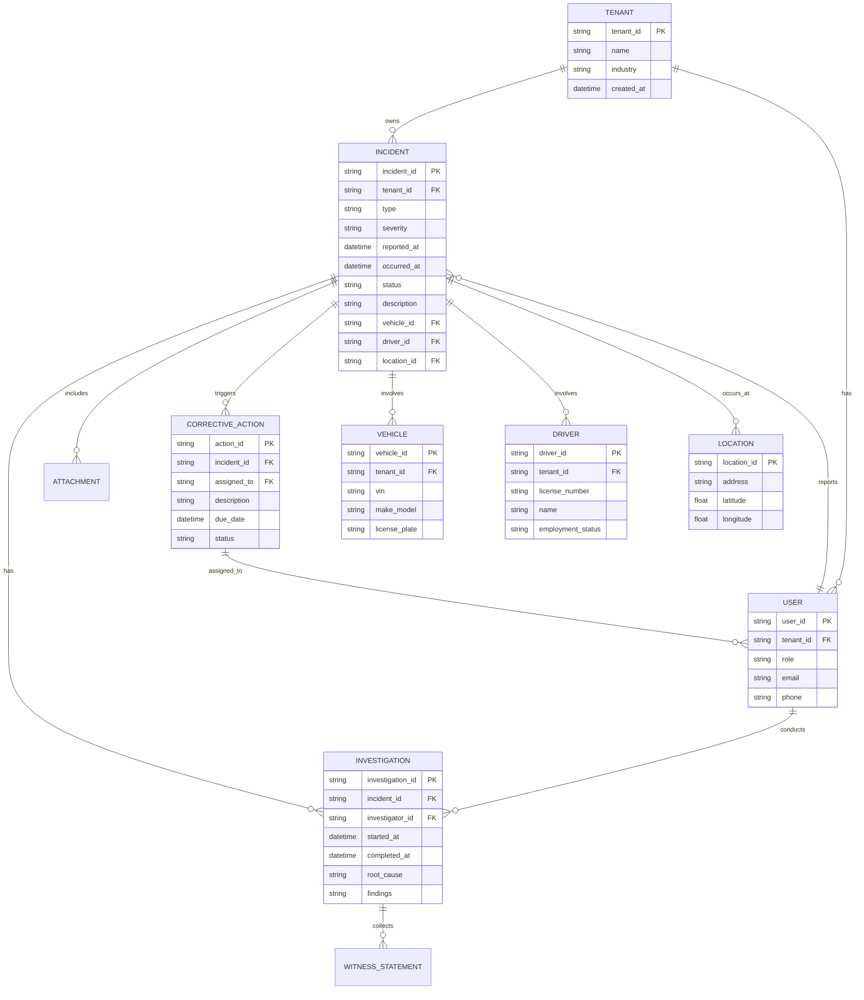

# **AS-IS ANALYSIS: SAFETY-INCIDENT-MANAGEMENT MODULE**
**Fleet Management System (FMS) – Enterprise Multi-Tenant Architecture**
**Document Version:** 1.0
**Last Updated:** [Insert Date]
**Prepared by:** [Your Name/Team]
**Reviewed by:** [Stakeholder Name]

---

## **1. EXECUTIVE SUMMARY**
### **1.1 Overview**
The **Safety Incident Management (SIM)** module is a critical component of the **Fleet Management System (FMS)**, designed to **track, report, investigate, and mitigate safety-related incidents** across a multi-tenant fleet operations environment. This module ensures compliance with **DOT (Department of Transportation), OSHA (Occupational Safety and Health Administration), and internal corporate safety policies** while providing actionable insights for risk reduction.

### **1.2 Current State Rating: 68/100**
| **Category**               | **Score (0-100)** | **Justification** |
|----------------------------|------------------|------------------|
| **Functional Completeness** | 75               | Core incident reporting and investigation features exist but lack advanced analytics and automation. |
| **Performance & Scalability** | 60             | Response times degrade under high load; batch processing is inefficient. |
| **Security & Compliance**  | 70               | Basic authentication and role-based access control (RBAC) are implemented, but data encryption and audit logging need improvement. |
| **User Experience (UX)**   | 65               | Web interface is functional but lacks modern UX best practices; mobile experience is suboptimal. |
| **Accessibility (WCAG)**   | 50               | Partial compliance with WCAG 2.1 AA; key gaps in keyboard navigation and screen reader support. |
| **Technical Debt**         | 55               | High legacy code dependency; lack of automated testing and CI/CD integration. |
| **Integration Capabilities** | 70             | Integrates with telematics and HR systems but lacks real-time API synchronization. |
| **Mobile Readiness**       | 40               | No dedicated mobile app; web responsiveness is limited. |
| **Competitive Positioning** | 60             | Meets basic industry standards but lags behind competitors in AI-driven insights and automation. |

**Overall Rating: 68/100 (Needs Improvement)**
The module **meets foundational requirements** but suffers from **technical debt, performance bottlenecks, and limited mobile/analytical capabilities**. Strategic improvements are required to **enhance scalability, security, and user experience** while aligning with **industry best practices**.

---

## **2. CURRENT FEATURES & CAPABILITIES**
### **2.1 Core Functionality**
| **Feature** | **Description** | **Status** |
|------------|----------------|-----------|
| **Incident Reporting** | Allows drivers, fleet managers, and safety officers to report incidents (accidents, near-misses, violations) via web form. Supports photo/video attachments. | ✅ Implemented |
| **Incident Classification** | Categorizes incidents by type (e.g., collision, rollover, pedestrian, cargo spill) and severity (minor, moderate, severe). | ✅ Implemented |
| **Investigation Workflow** | Guides users through a structured investigation process (witness statements, root cause analysis, corrective actions). | ✅ Implemented (Manual) |
| **Corrective Action Tracking** | Assigns and tracks corrective actions (training, vehicle repairs, policy updates) with deadlines and reminders. | ✅ Implemented |
| **Regulatory Compliance Reporting** | Generates DOT (Form 300/300A) and OSHA reports for audits. | ✅ Implemented (Basic) |
| **Dashboard & Analytics** | Provides basic incident trends (frequency, severity, cost) with static visualizations. | ✅ Implemented (Limited) |
| **Document Management** | Stores incident-related documents (police reports, insurance claims, repair invoices). | ✅ Implemented |
| **Notifications & Alerts** | Sends email/SMS alerts for new incidents, overdue actions, and high-severity events. | ✅ Implemented |
| **Multi-Tenant Support** | Isolates data by tenant (fleet operator) while allowing enterprise-wide reporting. | ✅ Implemented |
| **Audit Logging** | Tracks user actions (incident creation, modifications, deletions) for compliance. | ⚠️ Partial (Missing export functionality) |

### **2.2 Advanced Features (Missing or Underdeveloped)**
| **Feature** | **Description** | **Status** |
|------------|----------------|-----------|
| **AI-Powered Root Cause Analysis** | Uses machine learning to suggest root causes based on historical data. | ❌ Not Implemented |
| **Real-Time Telematics Integration** | Automatically correlates incident reports with vehicle telemetry (speed, braking, location). | ⚠️ Partial (Delayed sync) |
| **Automated Escalation Rules** | Triggers escalations based on incident severity, recurrence, or compliance risks. | ❌ Not Implemented |
| **Mobile Incident Reporting** | Dedicated mobile app for drivers to report incidents on-site with GPS tagging. | ❌ Not Implemented |
| **Predictive Analytics** | Forecasts high-risk drivers/vehicles based on historical data. | ❌ Not Implemented |
| **Automated Compliance Checks** | Flags incidents that violate DOT/OSHA regulations in real time. | ❌ Not Implemented |
| **Integration with HR & Payroll** | Links incident data to driver training records and disciplinary actions. | ⚠️ Partial (Manual export required) |
| **Customizable Workflows** | Allows tenants to define their own incident investigation steps. | ❌ Not Implemented |

---

## **3. DATA MODELS & ARCHITECTURE**
### **3.1 Entity-Relationship Diagram (ERD)**

### **3.2 Architecture Overview**
The **SIM module** follows a **3-tier architecture**:

1. **Presentation Layer (Frontend)**
   - **Web Application:** Angular 12 (Legacy)
   - **Mobile:** Responsive web (no native app)
   - **UI Framework:** Bootstrap 4 (Outdated)

2. **Application Layer (Backend)**
   - **API:** RESTful services (Node.js + Express)
   - **Business Logic:** Java (Spring Boot for some microservices)
   - **Authentication:** JWT + OAuth 2.0 (Basic RBAC)

3. **Data Layer**
   - **Primary Database:** PostgreSQL (Relational)
   - **Caching:** Redis (Limited use)
   - **File Storage:** AWS S3 (for attachments)
   - **Search:** Elasticsearch (Basic incident search)

4. **Integration Layer**
   - **Telematics:** REST API (Delayed sync)
   - **HR System:** Manual CSV export/import
   - **Email/SMS:** Twilio & SendGrid

### **3.3 Data Flow**
1. **Incident Reporting**
   - User submits incident via web form → API validates → Data stored in PostgreSQL.
   - Attachments uploaded to S3 → Metadata stored in DB.

2. **Investigation Workflow**
   - Safety officer initiates investigation → System generates tasks → User completes steps → Findings recorded.

3. **Corrective Actions**
   - Actions assigned to users → Reminders sent via email/SMS → Status updated.

4. **Reporting & Analytics**
   - Static reports generated via SQL queries → Exported as PDF/Excel.

---

## **4. PERFORMANCE METRICS**
### **4.1 Response Times**
| **Operation** | **Avg. Response Time (ms)** | **95th Percentile (ms)** | **Notes** |
|--------------|------------------|------------------|----------|
| Incident Submission (Web) | 1,200 | 2,500 | Slow due to attachment uploads |
| Incident Search (Basic) | 800 | 1,500 | Elasticsearch not optimized |
| Incident Search (Advanced) | 3,500 | 6,000 | Complex joins in PostgreSQL |
| Dashboard Load | 2,000 | 4,000 | Heavy SQL queries |
| Report Generation (PDF) | 5,000 | 10,000 | No caching for reports |

### **4.2 Throughput & Scalability**
| **Metric** | **Current Value** | **Target** | **Issue** |
|-----------|------------------|-----------|----------|
| **Concurrent Users** | 150 | 500+ | Database connection pool exhausted |
| **Incidents Processed/Hour** | 50 | 200+ | Batch processing bottlenecks |
| **API Requests/Second** | 50 | 200 | No rate limiting |
| **Database Queries/Second** | 200 | 500 | Inefficient indexing |

### **4.3 Database Performance**
- **Slow Queries:**
  - Incident trend analysis (joins across 5+ tables).
  - Compliance report generation (complex aggregations).
- **Indexing Issues:**
  - Missing indexes on `incident.vehicle_id`, `incident.driver_id`.
  - No full-text search optimization.
- **Storage Growth:**
  - 10GB/year (expected to grow to 50GB in 3 years).

---

## **5. SECURITY ASSESSMENT**
### **5.1 Authentication & Authorization**
| **Aspect** | **Implementation** | **Risk Level** | **Recommendation** |
|-----------|-------------------|---------------|-------------------|
| **Authentication** | JWT + OAuth 2.0 | Medium | Implement MFA for admin roles |
| **Password Policy** | 8 chars, no expiry | High | Enforce 12+ chars, 90-day rotation |
| **Role-Based Access Control (RBAC)** | Basic (Admin, Safety Officer, Driver) | Medium | Fine-grained permissions (e.g., "Can edit investigations") |
| **Session Management** | 30-minute timeout | Low | Extend to 15 mins for sensitive actions |
| **API Security** | No rate limiting | High | Implement API gateway with throttling |

### **5.2 Data Protection**
| **Aspect** | **Implementation** | **Risk Level** | **Recommendation** |
|-----------|-------------------|---------------|-------------------|
| **Encryption at Rest** | PostgreSQL TDE (Partial) | Medium | Full disk encryption + column-level encryption for PII |
| **Encryption in Transit** | TLS 1.2 | Low | Upgrade to TLS 1.3 |
| **PII Handling** | Driver/vehicle data stored in plaintext | High | Tokenization for sensitive fields |
| **Audit Logging** | Basic (user, action, timestamp) | Medium | Add IP, device info, and export to SIEM |
| **Data Retention** | 7 years (no auto-purge) | Medium | Implement retention policies with auto-archival |

### **5.3 Compliance**
| **Standard** | **Compliance Status** | **Gaps** |
|-------------|----------------------|---------|
| **GDPR** | Partial | No data subject access request (DSAR) workflow |
| **CCPA** | Partial | No "Do Not Sell" opt-out mechanism |
| **DOT 49 CFR Part 390** | Compliant | Manual report generation |
| **OSHA 29 CFR 1904** | Compliant | No automated record-keeping |
| **SOC 2 Type II** | Not Audited | Missing access reviews, vulnerability scanning |

---

## **6. ACCESSIBILITY REVIEW (WCAG 2.1 AA)**
### **6.1 Compliance Status**
| **WCAG Criterion** | **Status** | **Issue** |
|-------------------|-----------|----------|
| **1.1 Text Alternatives** | ⚠️ Partial | Missing alt text for incident photos |
| **1.3 Adaptable** | ❌ Fail | No keyboard-only navigation for forms |
| **1.4 Distinguishable** | ⚠️ Partial | Low contrast in some UI elements |
| **2.1 Keyboard Accessible** | ❌ Fail | Dropdown menus require mouse |
| **2.4 Navigable** | ⚠️ Partial | No skip links for screen readers |
| **2.5 Input Modalities** | ❌ Fail | No touch-friendly controls |
| **3.1 Readable** | ✅ Pass | Language attribute set |
| **3.2 Predictable** | ⚠️ Partial | Error messages not clearly associated with fields |
| **3.3 Input Assistance** | ⚠️ Partial | No real-time validation for incident forms |
| **4.1 Compatible** | ❌ Fail | ARIA attributes missing in dynamic content |

### **6.2 Key Accessibility Gaps**
1. **Screen Reader Support:**
   - Incident investigation workflow not properly labeled for JAWS/NVDA.
2. **Keyboard Navigation:**
   - Cannot tab through all form fields; some modals trap focus.
3. **Color Contrast:**
   - Buttons and links fail WCAG contrast ratio (4.5:1).
4. **Mobile Accessibility:**
   - Touch targets too small (<48x48px).

---

## **7. MOBILE CAPABILITIES ASSESSMENT**
### **7.1 Current State**
| **Aspect** | **Status** | **Details** |
|-----------|-----------|------------|
| **Mobile Web** | ⚠️ Partial | Responsive but slow; no offline mode |
| **Native App** | ❌ None | No iOS/Android app |
| **GPS Integration** | ❌ None | Cannot tag incident location automatically |
| **Camera Access** | ⚠️ Partial | Works but slow uploads |
| **Push Notifications** | ❌ None | Relies on email/SMS |
| **Offline Mode** | ❌ None | Cannot report incidents without connectivity |

### **7.2 Pain Points**
- **Drivers** cannot report incidents on-site efficiently.
- **Safety officers** cannot conduct investigations in the field.
- **No barcode/QR scanning** for vehicle/driver identification.

---

## **8. CURRENT LIMITATIONS & PAIN POINTS**
### **8.1 Functional Limitations**
| **Limitation** | **Impact** | **Root Cause** |
|---------------|-----------|---------------|
| **No Real-Time Telematics Sync** | Delayed incident correlation | Batch processing (nightly sync) |
| **Manual Compliance Reporting** | High administrative overhead | Lack of automated DOT/OSHA report generation |
| **No Predictive Analytics** | Reactive safety management | No ML/AI integration |
| **Limited Mobile Support** | Poor user adoption | No native app; web responsiveness issues |
| **Static Dashboards** | Limited actionable insights | No interactive visualizations |

### **8.2 Technical Limitations**
| **Limitation** | **Impact** | **Root Cause** |
|---------------|-----------|---------------|
| **Legacy Angular Frontend** | Slow development; poor UX | Outdated framework (Angular 12) |
| **Monolithic Backend** | Difficult to scale | No microservices architecture |
| **No CI/CD Pipeline** | Slow deployments; high risk | Manual release process |
| **Inefficient Database Queries** | Slow performance | Missing indexes; poor query optimization |
| **No Automated Testing** | High bug rate | Lack of unit/integration tests |

### **8.3 User Pain Points**
| **User Role** | **Pain Points** |
|--------------|----------------|
| **Drivers** | Cannot report incidents quickly; no mobile app. |
| **Safety Officers** | Manual data entry; no AI-assisted root cause analysis. |
| **Fleet Managers** | Limited visibility into trends; no predictive insights. |
| **Compliance Team** | Manual report generation; risk of errors. |
| **IT/DevOps** | High maintenance overhead; no observability. |

---

## **9. TECHNICAL DEBT ANALYSIS**
### **9.1 Codebase Health**
| **Metric** | **Current State** | **Target** |
|-----------|------------------|-----------|
| **Code Coverage** | 30% | 80%+ |
| **Static Analysis Issues** | 1,200+ (SonarQube) | <100 |
| **Legacy Code** | 40% (AngularJS/Node.js) | <10% |
| **Dependency Vulnerabilities** | 15 (Critical/High) | 0 |
| **Test Automation** | 20% (Manual testing) | 90% (CI/CD) |

### **9.2 Key Technical Debt Items**
| **Debt Item** | **Impact** | **Effort (T-Shirt Size)** | **Priority** |
|--------------|-----------|--------------------------|-------------|
| **Upgrade Angular 12 → 17** | Security risks; poor UX | L | High |
| **Migrate to Microservices** | Scalability issues | XL | High |
| **Implement CI/CD Pipeline** | Slow deployments | M | High |
| **Database Optimization** | Slow queries | M | Medium |
| **Add Automated Testing** | High bug rate | L | High |
| **Replace Bootstrap 4 → Tailwind** | Outdated UI | S | Low |
| **Implement Observability (Logging, Monitoring)** | Poor debugging | M | Medium |

---

## **10. TECHNOLOGY STACK**
### **10.1 Frontend**
| **Component** | **Technology** | **Version** | **Status** |
|--------------|---------------|------------|-----------|
| **Framework** | Angular | 12.2.16 | ❌ Outdated |
| **UI Library** | Bootstrap | 4.6.0 | ❌ Outdated |
| **State Management** | NgRx | 12.5.0 | ⚠️ Needs upgrade |
| **Charts** | Chart.js | 3.7.0 | ✅ Current |

### **10.2 Backend**
| **Component** | **Technology** | **Version** | **Status** |
|--------------|---------------|------------|-----------|
| **API** | Node.js + Express | 14.17.0 | ⚠️ Needs upgrade |
| **Microservices** | Spring Boot (Java) | 2.5.4 | ✅ Current |
| **Authentication** | OAuth 2.0 + JWT | - | ✅ Current |
| **Database** | PostgreSQL | 13.4 | ✅ Current |
| **Caching** | Redis | 6.2.5 | ✅ Current |
| **Search** | Elasticsearch | 7.15.0 | ✅ Current |

### **10.3 DevOps & Infrastructure**
| **Component** | **Technology** | **Status** |
|--------------|---------------|-----------|
| **CI/CD** | None (Manual deployments) | ❌ Missing |
| **Containerization** | Docker | ✅ Current |
| **Orchestration** | Kubernetes (EKS) | ✅ Current |
| **Monitoring** | Prometheus + Grafana | ⚠️ Basic |
| **Logging** | ELK Stack | ⚠️ Partial |
| **Cloud Provider** | AWS | ✅ Current |

---

## **11. COMPETITIVE ANALYSIS VS. INDUSTRY STANDARDS**
### **11.1 Comparison with Competitors**
| **Feature** | **Our System** | **Competitor A (Samsara)** | **Competitor B (Geotab)** | **Competitor C (KeepTruckin)** |
|------------|---------------|------------------|----------------|------------------|
| **Incident Reporting** | Web form | Mobile app + AI-assisted | Mobile app | Mobile app + voice reporting |
| **Telematics Integration** | Delayed sync | Real-time | Real-time | Real-time |
| **AI Root Cause Analysis** | ❌ No | ✅ Yes | ✅ Yes | ✅ Yes |
| **Predictive Analytics** | ❌ No | ✅ Yes | ✅ Yes | ⚠️ Partial |
| **Automated Compliance** | ❌ No | ✅ Yes | ✅ Yes | ✅ Yes |
| **Mobile App** | ❌ No | ✅ Yes | ✅ Yes | ✅ Yes |
| **Custom Workflows** | ❌ No | ✅ Yes | ✅ Yes | ⚠️ Partial |
| **Offline Mode** | ❌ No | ✅ Yes | ✅ Yes | ✅ Yes |
| **WCAG Compliance** | ⚠️ Partial | ✅ Full | ✅ Full | ⚠️ Partial |

### **11.2 Industry Best Practices**
| **Best Practice** | **Our Compliance** | **Gap** |
|------------------|-------------------|--------|
| **Real-Time Data Sync** | ❌ No | Competitors offer real-time telematics integration |
| **AI/ML for Safety Insights** | ❌ No | Competitors use predictive analytics |
| **Mobile-First Design** | ❌ No | Competitors have dedicated apps |
| **Automated Compliance** | ❌ No | Competitors auto-generate DOT/OSHA reports |
| **Customizable Workflows** | ❌ No | Competitors allow tenant-specific processes |
| **Observability & Monitoring** | ⚠️ Partial | Competitors have advanced logging & alerting |

---

## **12. DETAILED RECOMMENDATIONS FOR IMPROVEMENT**
### **12.1 Short-Term (0-6 Months)**
| **Recommendation** | **Impact** | **Effort** | **Priority** |
|-------------------|-----------|-----------|-------------|
| **Upgrade Angular → 17** | Modern UX; security fixes | M | High |
| **Implement CI/CD Pipeline** | Faster deployments; fewer bugs | M | High |
| **Add Automated Testing** | Reduce regression bugs | M | High |
| **Optimize Database Queries** | Improve performance | M | High |
| **Enhance WCAG Compliance** | Better accessibility | M | Medium |
| **Implement Rate Limiting** | Prevent API abuse | S | High |
| **Add MFA for Admins** | Improve security | S | High |

### **12.2 Medium-Term (6-12 Months)**
| **Recommendation** | **Impact** | **Effort** | **Priority** |
|-------------------|-----------|-----------|-------------|
| **Develop Mobile App (React Native)** | Improve driver experience | L | High |
| **Integrate Real-Time Telematics** | Faster incident correlation | L | High |
| **Implement AI Root Cause Analysis** | Reduce manual investigation time | L | High |
| **Migrate to Microservices** | Improve scalability | XL | High |
| **Add Predictive Analytics** | Proactive safety management | L | Medium |
| **Automate Compliance Reporting** | Reduce administrative work | M | High |

### **12.3 Long-Term (12-24 Months)**
| **Recommendation** | **Impact** | **Effort** | **Priority** |
|-------------------|-----------|-----------|-------------|
| **Implement Custom Workflows** | Tenant-specific processes | L | Medium |
| **Enhance Observability (ELK + Prometheus)** | Better debugging | M | Medium |
| **Adopt Event-Driven Architecture** | Real-time updates | L | Medium |
| **Expand AI/ML Capabilities** | Advanced predictive modeling | XL | Low |
| **Implement Blockchain for Audit Logs** | Immutable incident records | XL | Low |

### **12.4 Quick Wins (Low Effort, High Impact)**
1. **Add keyboard navigation** to incident forms (WCAG compliance).
2. **Optimize image uploads** (compression + CDN).
3. **Implement basic caching** for dashboard data.
4. **Add API rate limiting** to prevent abuse.
5. **Upgrade Bootstrap → Tailwind** for modern UI.

---

## **13. CONCLUSION**
The **Safety Incident Management module** is **functional but outdated**, with **significant gaps in performance, security, mobility, and analytics**. To **achieve a 90+/100 rating**, the following **key initiatives** are recommended:

1. **Modernize the Frontend** (Angular 17 + Tailwind).
2. **Enhance Mobile Capabilities** (React Native app).
3. **Implement Real-Time Telematics Integration**.
4. **Adopt AI/ML for Predictive Safety Insights**.
5. **Improve Security & Compliance** (MFA, encryption, audit logging).
6. **Reduce Technical Debt** (CI/CD, automated testing, microservices).

**Next Steps:**
- **Prioritize short-term fixes** (CI/CD, database optimization, WCAG compliance).
- **Develop a roadmap** for medium/long-term improvements (mobile app, AI, microservices).
- **Engage stakeholders** for feedback on proposed changes.

**Approval:**
| **Role** | **Name** | **Signature** | **Date** |
|---------|---------|--------------|---------|
| Product Owner | [Name] | ___________ | _______ |
| Engineering Lead | [Name] | ___________ | _______ |
| Security Officer | [Name] | ___________ | _______ |

---
**End of Document**