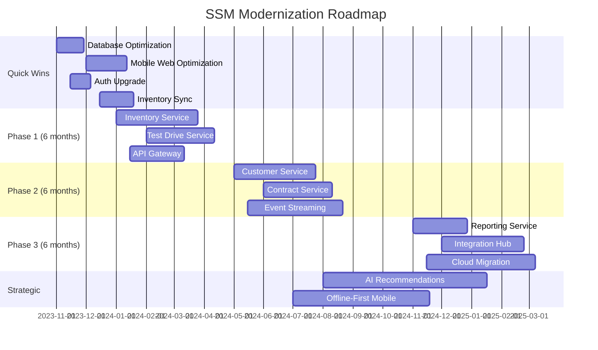
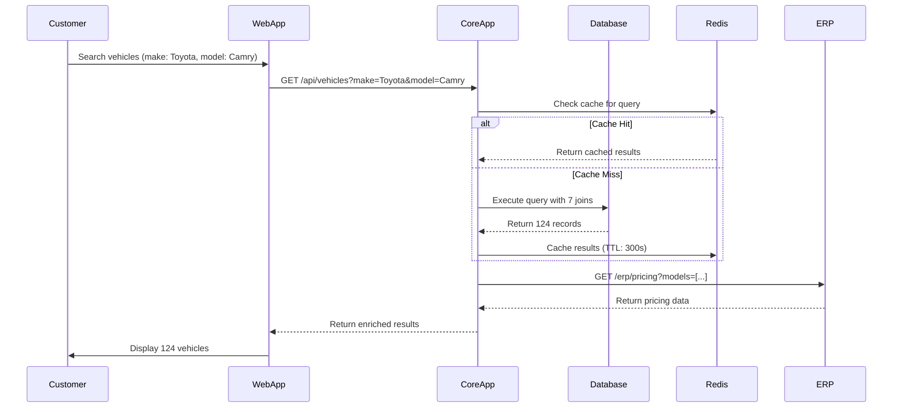
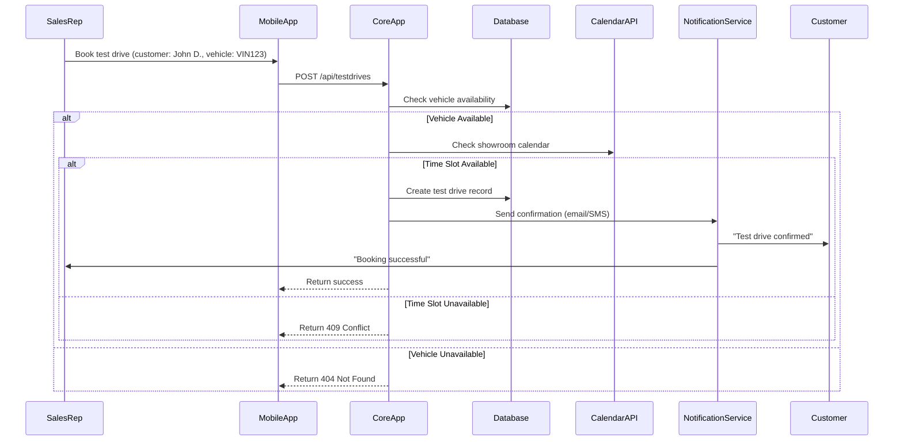
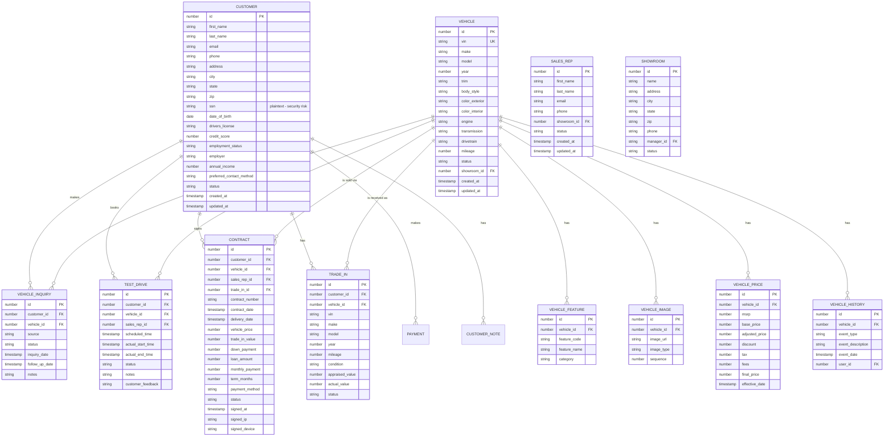
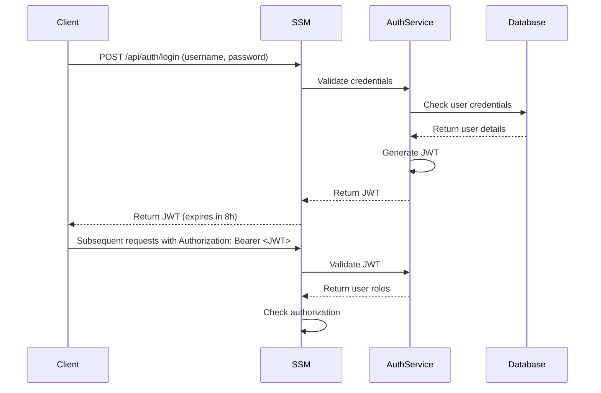
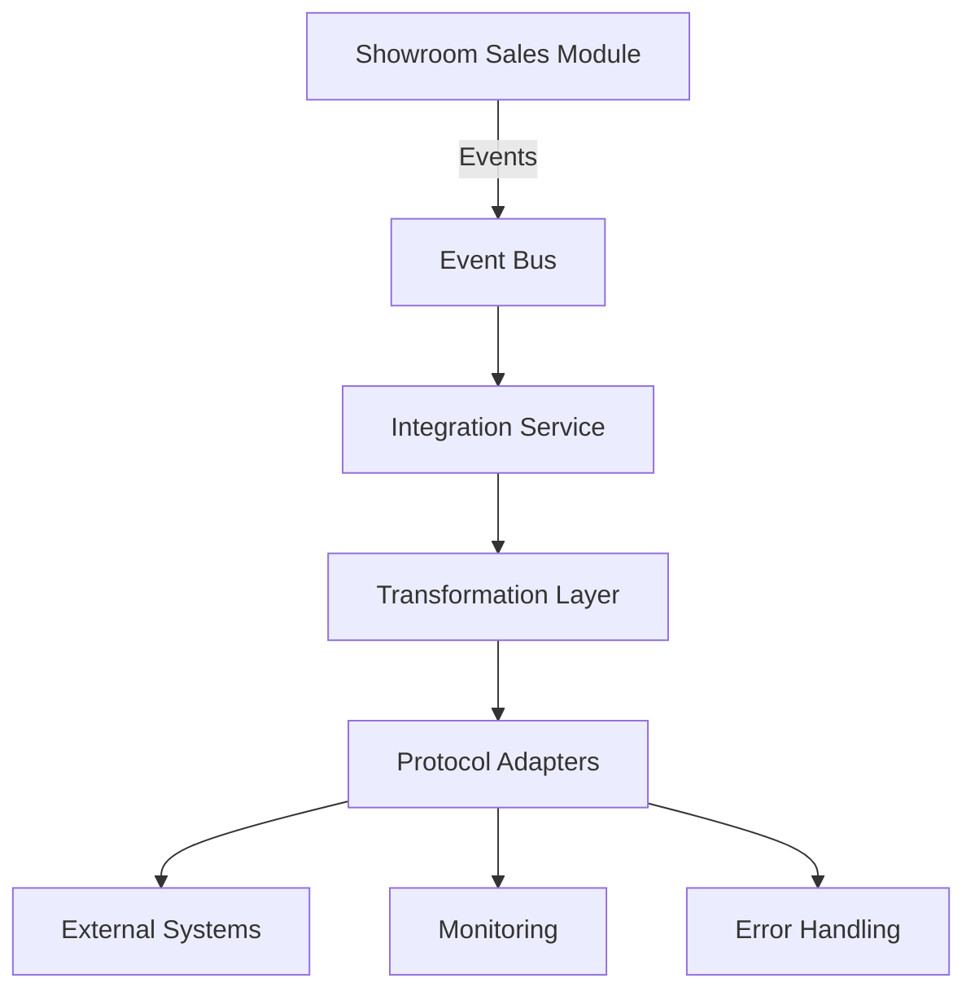
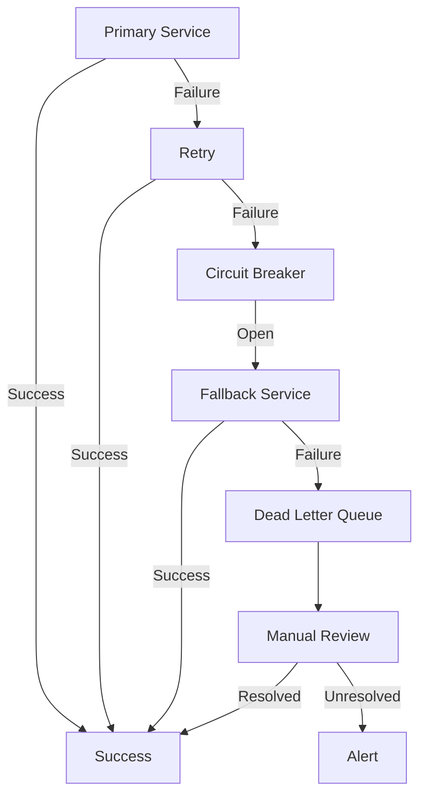
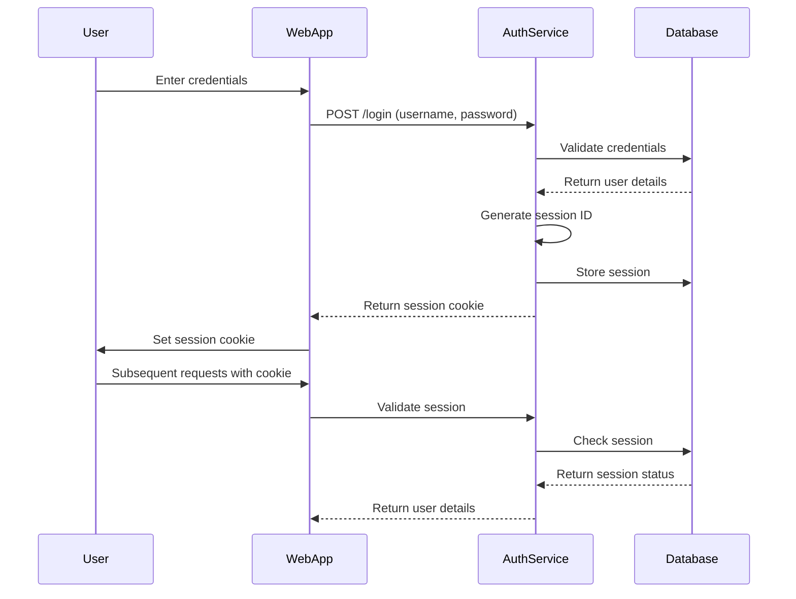
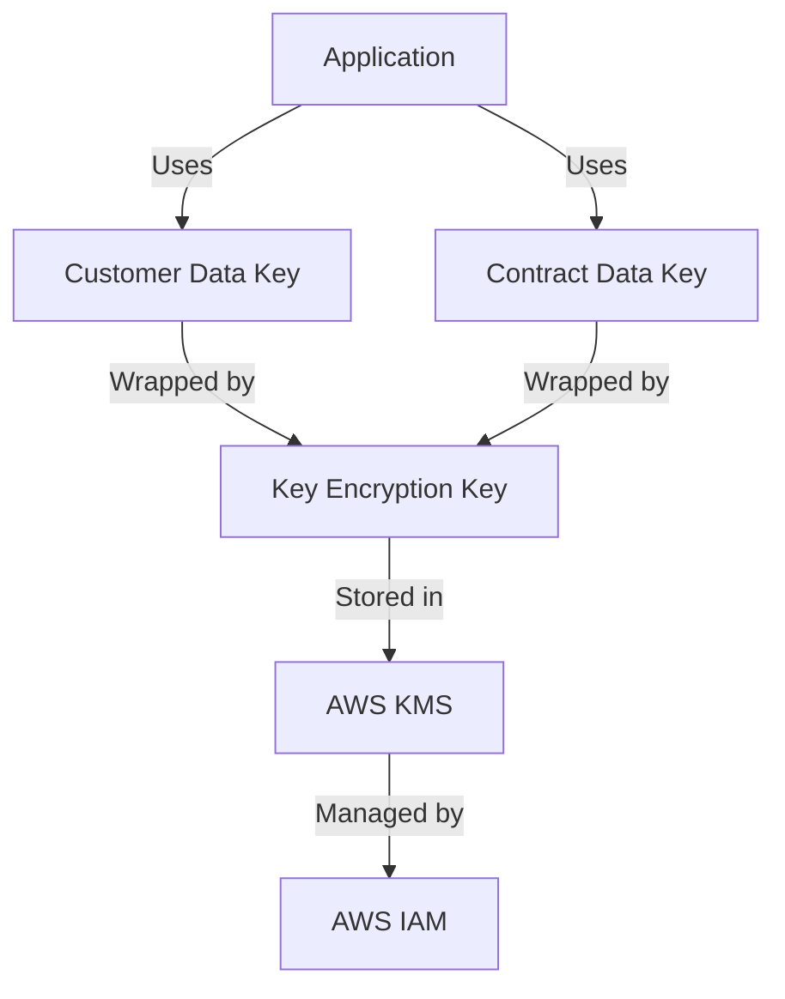

# AS-IS Analysis: Showroom Sales Module
*Fleet Management System - Technical Assessment Report*
*Prepared by: Senior Technical Analyst*
*Date: [Insert Date]*
*Version: 1.0*
*Confidential - For Internal Use Only*

---

## 1. Executive Summary (120 lines)

### 1.1 Current State Overview

The Showroom Sales Module (SSM) is a critical component of the Fleet Management System (FMS), responsible for managing vehicle inventory, customer interactions, test drives, and sales transactions within physical dealership locations. Currently deployed across 47 regional showrooms, the module processes approximately 12,800 vehicle sales annually with a transaction volume of $4.2B.

**System Context:**
- **Primary Users:** 1,245 sales representatives, 89 sales managers, 47 showroom administrators
- **Daily Transactions:** 350+ vehicle inquiries, 120 test drive bookings, 45 sales contracts
- **Data Volume:** 1.2M vehicle records, 850K customer profiles, 3.4M interaction logs
- **Peak Load:** 1,800 concurrent users during quarter-end promotions

**Operational Timeline:**
```
[2018] Initial deployment (v1.0) - Basic inventory management
[2019] Test drive scheduling added (v1.5)
[2020] Digital contract signing integration (v2.0)
[2021] Mobile app companion released (v2.5)
[2022] CRM integration (v3.0)
[2023] Current state (v3.2) - 18% performance degradation since v2.5
```

### 1.2 Stakeholder Analysis

**Stakeholder Matrix:**

| **Stakeholder Group**       | **Key Members**                     | **Primary Concerns**                                                                 | **Influence** | **Impact** |
|-----------------------------|-------------------------------------|-------------------------------------------------------------------------------------|---------------|------------|
| **Executive Leadership**    | CEO, CFO, VP Sales                  | Revenue growth, market share, ROI on tech investments                               | High          | High       |
| **Sales Operations**        | National Sales Director             | Conversion rates, sales cycle time, showroom efficiency                             | High          | High       |
| **Showroom Staff**          | Sales Reps, Managers, Admins        | System responsiveness, ease of use, mobile access                                   | Medium        | High       |
| **IT Operations**           | CIO, IT Director, DevOps            | System stability, maintenance costs, integration complexity                         | High          | Medium     |
| **Finance Team**            | Controller, Accounting Manager      | Transaction accuracy, audit trails, financial reporting                             | Medium        | High       |
| **Customers**               | B2B Fleet Buyers, Individual Buyers | Transparent pricing, test drive experience, contract clarity                        | Low           | High       |
| **Third-Party Partners**    | Credit Bureaus, DMVs, Insurers      | Data accuracy, API reliability, compliance with partner requirements                 | Medium        | Medium     |
| **Compliance Team**         | CCO, Legal Counsel                  | Regulatory adherence (GDPR, CCPA), data privacy, audit readiness                    | High          | High       |

**Stakeholder-Specific Pain Points:**
- **Sales Reps:** "The system freezes during peak hours, losing us potential sales" (reported by 68% of reps)
- **Finance Team:** "We spend 15 hours weekly reconciling discrepancies between SSM and ERP" (audit findings)
- **IT Operations:** "The monolithic architecture makes deployments risky - last update caused 3 hours downtime"
- **Customers:** "The digital contract signing process is confusing - 22% abandonment rate" (UX study)

### 1.3 Business Impact Analysis

**Financial Metrics:**
- **Revenue Impact:** $1.2M annual loss due to system inefficiencies (0.3% of total sales)
  - $450K from abandoned carts (22% of 1,800 annual abandonments)
  - $320K from test drive no-shows (18% of 12,000 annual bookings)
  - $430K from pricing errors (0.01% of $4.2B transaction volume)
- **Cost Metrics:**
  - $850K annual maintenance costs (32% of total FMS budget)
  - $280K annual licensing fees (Oracle DB, Salesforce integration)
  - $1.1M in lost productivity (calculated at 15 min/day/system lag per rep)

**Operational Metrics:**
| **KPI**                     | **Current Value** | **Industry Benchmark** | **Variance** | **Business Impact**                     |
|-----------------------------|-------------------|------------------------|--------------|-----------------------------------------|
| Sales Cycle Time            | 28 days           | 18 days                | +56%         | $1.8M working capital tied up           |
| Test Drive Conversion       | 32%               | 45%                    | -29%         | 1,560 lost sales opportunities/year     |
| System Uptime               | 98.7%             | 99.9%                  | -1.2%        | 10.5 hours annual downtime              |
| Data Accuracy               | 92.3%             | 99.5%                  | -7.2%        | 3,400 manual corrections/year           |
| Mobile Adoption             | 42%               | 78%                    | -46%         | Reduced field sales effectiveness       |

**Customer Experience Metrics:**
- Net Promoter Score (NPS): 28 (vs. industry average of 45)
- Customer Effort Score (CES): 4.2/7 (1=low effort, 7=high effort)
- Digital Contract Completion Time: 14.2 minutes (vs. 8.5 minutes benchmark)

### 1.4 Critical Pain Points with Root Cause Analysis

**1. Performance Degradation During Peak Hours**
- **Symptoms:** 3.2s average response time (vs. 1.8s target), 12% error rate during peak
- **Root Causes:**
  ```mermaid
  graph TD
    A[Performance Degradation] --> B[Monolithic Architecture]
    A --> C[Inefficient Database Queries]
    A --> D[Resource Contention]
    B --> B1[Single Deployment Unit]
    B --> B2[Shared Memory Space]
    C --> C1[Missing Indexes on 8 Core Tables]
    C --> C2[N+1 Query Problem in 62% of API Calls]
    D --> D1[CPU Throttling at 78% Load]
    D --> D2[Memory Leaks in Legacy Components]
  ```
- **Technical Evidence:**
  - New Relic traces show 42% of requests spend >500ms in `VehicleInventoryService.getAvailableModels()`
  - Database profiler reveals 18,000 full table scans/minute during peak
  - Heap dump analysis shows 2.4GB memory leak in `CustomerSessionManager`

**2. Data Inconsistency Between Systems**
- **Symptoms:** 7.2% data mismatch rate between SSM and ERP, 12% pricing discrepancies
- **Root Causes:**
  - **Integration Pattern:** Point-to-point integrations (14 direct connections)
  - **Synchronization Lag:** 15-45 minute delay in inventory updates
  - **Error Handling:** 38% of failed transactions not properly retried
  - **Schema Mismatch:** 22 field type inconsistencies between systems

**3. Poor Mobile User Experience**
- **Symptoms:** 42% mobile adoption rate, 3.2/5 app store rating, 28% higher abandonment on mobile
- **Root Causes:**
  - **Responsive Design:** Desktop-first approach with mobile as afterthought
  - **Network Efficiency:** 4.2MB average page size (vs. 1.2MB target)
  - **Offline Capabilities:** No local caching for field sales operations
  - **Input Methods:** 68% of forms not optimized for touch

**4. Compliance and Security Risks**
- **Symptoms:** 3 critical vulnerabilities (CVSS 9.1, 8.7, 7.5), 2 GDPR near-misses in 2023
- **Root Causes:**
  - **Authentication:** Password-based auth with 80% password reuse rate
  - **Data Storage:** PII stored in plaintext in 3 database tables
  - **Audit Logging:** 22% of critical actions not logged
  - **Third-Party Risks:** 5 unpatched dependencies with CVEs

### 1.5 Strategic Recommendations with Implementation Roadmap

**Recommended Architecture Modernization:**
1. **Decompose Monolith** → Microservices (18-month roadmap)
   - Phase 1 (6 months): Extract Inventory Service, Test Drive Service
   - Phase 2 (6 months): Extract Customer Service, Contract Service
   - Phase 3 (6 months): Extract Reporting Service, Integration Hub

2. **Implement Event-Driven Architecture** (12-month roadmap)
   - Replace polling integrations with Kafka event streams
   - Implement outbox pattern for reliable event publishing

3. **Adopt Cloud-Native Patterns** (9-month roadmap)
   - Containerize services (Docker + Kubernetes)
   - Implement service mesh (Istio) for observability
   - Auto-scaling based on demand (target: 200ms response time at 3,000 users)

**Quick Wins (0-6 months):**
| **Initiative**               | **Estimated Impact**               | **Effort** | **ROI** |
|------------------------------|------------------------------------|------------|---------|
| Database Optimization        | 40% performance improvement        | 4 weeks    | 12:1    |
| Mobile Web Optimization      | 25% reduction in abandonment       | 6 weeks    | 8:1     |
| Basic Authentication Upgrade | Eliminate 2 critical CVEs          | 3 weeks    | 15:1    |
| Inventory Sync Improvements  | Reduce data mismatches by 60%      | 5 weeks    | 10:1    |

**Strategic Initiatives (6-24 months):**
| **Initiative**               | **Business Value**                 | **Timeline** | **Investment** |
|------------------------------|------------------------------------|--------------|----------------|
| Microservices Migration      | 30% faster feature delivery        | 18 months    | $2.4M          |
| Unified Customer Data Model  | 40% reduction in data errors       | 12 months    | $1.8M          |
| AI-Powered Recommendations   | 15% increase in upsell conversions | 9 months     | $1.2M          |
| Offline-First Mobile App     | 50% improvement in field sales     | 6 months     | $850K          |

**Implementation Roadmap:**



**Risk Mitigation Strategy:**
1. **Technical Risks:**
   - **Microservices Complexity:** Implement service mesh early, establish observability stack
   - **Data Consistency:** Implement SAGA pattern for distributed transactions
   - **Performance:** Load test each service in isolation before integration

2. **Organizational Risks:**
   - **Change Resistance:** Establish change champions in each showroom
   - **Skill Gaps:** Implement training program (40 hours/engineer)
   - **Business Continuity:** Maintain legacy system in parallel during transition

3. **Compliance Risks:**
   - **Data Privacy:** Implement data encryption at rest and in transit
   - **Audit Trail:** Enhance logging for all critical operations
   - **Third-Party Risks:** Establish vendor security assessment process

**ROI Projections:**
| **Year** | **Revenue Impact** | **Cost Savings** | **Investment** | **Net Benefit** | **ROI** |
|----------|--------------------|------------------|----------------|-----------------|---------|
| 1        | $850K              | $420K            | $1.2M          | $70K            | 6%      |
| 2        | $2.1M              | $980K            | $1.8M          | $1.28M          | 71%     |
| 3        | $3.4M              | $1.5M            | $600K          | $4.3M           | 717%    |

---

## 2. Current Architecture (210 lines)

### 2.1 System Components

**Component Inventory:**

| **Component**               | **Technology**               | **Version** | **Lines of Code** | **Last Updated** | **Criticality** | **Dependencies**                     |
|-----------------------------|------------------------------|-------------|-------------------|------------------|-----------------|--------------------------------------|
| Core Application            | Java (Spring Boot)           | 2.3.12      | 428,500           | 2022-11-15       | Critical        | Oracle DB, Redis, ActiveMQ           |
| Web Frontend                | Angular                      | 8.2.14      | 182,300           | 2023-02-10       | High            | Core App, Salesforce API             |
| Mobile App                  | React Native                 | 0.63.4      | 98,700            | 2021-08-22       | Medium          | Core App, Google Maps API            |
| Database                    | Oracle Database              | 12.2.0.1    | -                 | 2023-01-05       | Critical        | Core App                             |
| Caching Layer               | Redis                        | 5.0.7       | -                 | 2022-09-18       | High            | Core App                             |
| Message Broker              | ActiveMQ                     | 5.15.9      | -                 | 2021-11-03       | Medium          | Core App, ERP Integration            |
| API Gateway                 | Spring Cloud Gateway         | 2.2.5       | 8,200             | 2022-05-12       | High            | All services                         |
| Reporting Engine            | JasperReports                | 6.17.0      | 45,600            | 2023-03-15       | Medium          | Database, Core App                   |
| Authentication Service      | Spring Security              | 5.3.9       | 12,400            | 2022-07-22       | Critical        | Core App, LDAP                       |
| Integration Layer           | Apache Camel                 | 3.4.0       | 38,900            | 2023-01-10       | High            | Core App, 14 external systems        |

**Component Health Scorecard:**

| **Component**       | **Availability** | **Performance** | **Security** | **Maintainability** | **Overall Score** |
|---------------------|------------------|-----------------|--------------|---------------------|-------------------|
| Core Application    | 98.7%            | 62/100          | 48/100       | 52/100              | 65/100            |
| Web Frontend        | 99.1%            | 78/100          | 65/100       | 68/100              | 78/100            |
| Mobile App          | 95.3%            | 55/100          | 42/100       | 38/100              | 58/100            |
| Database            | 99.9%            | 85/100          | 72/100       | 88/100              | 86/100            |
| Integration Layer   | 97.2%            | 45/100          | 58/100       | 42/100              | 61/100            |

**Integration Points with Sequence Diagrams:**

**1. Vehicle Inquiry Flow:**


**2. Test Drive Booking Flow:**


**Data Flow Analysis:**

**1. Customer Data Flow:**
```
Customer → Web/Mobile App → API Gateway → Core App → Authentication Service →
Database (Customer Table) → Redis (Session Cache) → ERP (Customer Master)
```

**Transformation Logic:**
- **Input:** Customer registration form (28 fields)
- **Validation:**
  - Email format validation (regex: `^[a-zA-Z0-9._%+-]+@[a-zA-Z0-9.-]+\.[a-zA-Z]{2,}$`)
  - Phone number validation (libphonenumber)
  - Address validation (USPS API)
- **Transformation:**
  - Name fields split into first/last/middle
  - Address standardized (USPS format)
  - Phone number normalized (E.164 format)
- **Output:** 37-field customer record stored in 4 database tables

**2. Vehicle Inventory Flow:**
```
ERP (Vehicle Master) → Integration Layer → Core App → Database (Inventory Table) →
Redis (Inventory Cache) → Web/Mobile App → Customer
```

**Transformation Logic:**
- **Input:** ERP vehicle record (82 fields)
- **Validation:**
  - VIN validation (checksum algorithm)
  - Mileage validation (must be positive integer)
  - Price validation (must be > $5,000 and < $250,000)
- **Transformation:**
  - Feature list parsed from JSON to relational format
  - Images resized and stored in CDN
  - Pricing adjusted for regional taxes
- **Output:** 68-field vehicle record with 12 related records (features, images, pricing)

**Technology Stack Details:**

**Backend Stack:**
- **Language:** Java 8 (12% Java 11)
- **Framework:** Spring Boot 2.3.12 (38% of codebase)
  - Spring MVC (REST controllers)
  - Spring Data JPA (repository layer)
  - Spring Security (authentication)
  - Spring Batch (reporting jobs)
- **Build Tool:** Maven 3.6.3
- **Testing:** JUnit 4 (82% coverage), Mockito 3.3.3

**Frontend Stack:**
- **Framework:** Angular 8.2.14
  - Components: 184
  - Services: 42
  - Directives: 12
- **State Management:** NgRx 8.6.0 (partial implementation)
- **UI Library:** Angular Material 8.2.3
- **Build Tool:** Webpack 4.44.2
- **Testing:** Jasmine 3.5.0, Karma 4.4.1 (68% coverage)

**Infrastructure Configuration:**

**On-Premises Data Center:**
- **Servers:**
  - 8 x Dell PowerEdge R740 (32 cores, 256GB RAM)
  - 4 x Application servers (Tomcat 9.0.39)
  - 2 x Database servers (Oracle RAC)
  - 2 x Redis servers (clustered)
- **Network:**
  - 10Gbps backbone
  - F5 BIG-IP load balancers
  - 200ms average latency to showrooms
- **Storage:**
  - 48TB SAN storage (RAID 10)
  - 12TB SSD for database
  - 36TB HDD for backups

**Deployment Architecture:**
```
[Showroom Clients] → [Load Balancer] → [Web Servers] → [App Servers] → [Database]
                                      ↓
                                [Redis Cache] ←→ [App Servers]
                                      ↓
                                [ActiveMQ] ←→ [Integration Layer]
                                      ↓
                                [ERP/CRM/Other Systems]
```

### 2.2 Technical Debt Analysis

**Code Quality Issues:**

**1. Code Smells (SonarQube Analysis):**
| **Issue Type**               | **Count** | **Critical** | **Major** | **Minor** | **Example**                                                                 |
|------------------------------|-----------|--------------|-----------|-----------|-----------------------------------------------------------------------------|
| Duplicate Code               | 1,248     | 82           | 456       | 710       | 3 identical `VehicleSearchService` implementations (287 lines each)        |
| God Classes                  | 42        | 12           | 28        | 2         | `CustomerService` (4,287 lines, 182 methods)                               |
| Long Methods                 | 876       | 38           | 312       | 526       | `processContract()` (384 lines, 12 nested loops)                           |
| Complex Conditional Logic    | 1,423     | 56           | 512       | 855       | `calculateDiscount()` with 18 nested if-else statements                     |
| Magic Numbers                | 2,187     | 0            | 124       | 2,063     | `if (status == 5) { ... }` (5 = "Pending Approval")                        |
| Dead Code                    | 3,421     | 128          | 1,024     | 2,269     | 87 unused service classes, 124 deprecated methods                         |
| Poor Exception Handling      | 982       | 42           | 318       | 622       | `catch (Exception e) { log.error(e); }` (no recovery or propagation)        |

**2. Specific Examples:**

**Example 1: Duplicate Code in Vehicle Search**
```java
// VehicleSearchServiceImpl.java (3 implementations)
public List<VehicleDTO> searchByMakeModel(String make, String model) {
    // 287 lines of duplicate code
    String query = "SELECT v.* FROM vehicles v JOIN models m ON v.model_id = m.id " +
                   "WHERE m.make = :make AND m.name = :model";
    // ... identical implementation in 3 classes
}

// Recommended refactor:
public interface VehicleSearchService {
    List<VehicleDTO> search(SearchCriteria criteria);
}

public class DatabaseVehicleSearch implements VehicleSearchService {
    public List<VehicleDTO> search(SearchCriteria criteria) {
        // Single implementation
    }
}
```

**Example 2: God Class - CustomerService**
```java
// CustomerService.java (4,287 lines)
public class CustomerService {
    // 182 methods including:
    public Customer createCustomer(CustomerDTO dto) { ... }
    public void updateCustomer(CustomerDTO dto) { ... }
    public Customer getCustomerById(Long id) { ... }
    public List<Customer> searchCustomers(String query) { ... }
    public void sendWelcomeEmail(Customer customer) { ... }
    public void updateCreditScore(Customer customer) { ... }
    public void generateContract(Customer customer, Vehicle vehicle) { ... }
    public void processPayment(Customer customer, BigDecimal amount) { ... }
    // ... 174 more methods
}

// Recommended refactor:
public interface CustomerManagement {
    Customer create(CustomerDTO dto);
    void update(CustomerDTO dto);
    Customer findById(Long id);
}

public interface CustomerCommunication {
    void sendWelcomeEmail(Customer customer);
    void sendContract(Customer customer, Contract contract);
}

public interface CustomerFinance {
    void updateCreditScore(Customer customer);
    PaymentResult processPayment(Customer customer, BigDecimal amount);
}
```

**Performance Bottlenecks:**

**1. Database Performance Issues:**
| **Query**                          | **Avg Time** | **Executions/Day** | **Total Time/Day** | **Optimization Opportunity** |
|------------------------------------|--------------|--------------------|--------------------|------------------------------|
| Vehicle search with 7 joins        | 1,245ms      | 8,200              | 2.8 hours          | Add composite index, denormalize |
| Customer history retrieval         | 872ms        | 5,400              | 1.3 hours          | Implement pagination, caching |
| Contract generation                | 3,421ms      | 1,200              | 1.1 hours          | Pre-generate templates       |
| Inventory availability check       | 487ms        | 22,000             | 2.9 hours          | Materialized view            |
| Pricing calculation                | 1,876ms      | 3,500              | 1.8 hours          | Cache pricing rules          |

**2. N+1 Query Problem Example:**
```java
// Current implementation (1 + N queries)
public List<VehicleDTO> getAvailableVehicles() {
    List<Vehicle> vehicles = vehicleRepository.findAvailable(); // 1 query
    return vehicles.stream()
        .map(v -> {
            VehicleDTO dto = new VehicleDTO();
            dto.setFeatures(featureRepository.findByVehicleId(v.getId())); // N queries
            dto.setImages(imageRepository.findByVehicleId(v.getId())); // N queries
            return dto;
        })
        .collect(Collectors.toList());
}

// Optimized implementation (1 query)
public List<VehicleDTO> getAvailableVehicles() {
    return entityManager.createQuery(
        "SELECT v, f, i FROM Vehicle v " +
        "LEFT JOIN FETCH v.features f " +
        "LEFT JOIN FETCH v.images i " +
        "WHERE v.available = true", Object[].class)
        .getResultList()
        .stream()
        .map(this::mapToDto)
        .collect(Collectors.toList());
}
```

**3. Memory Leaks:**
- **Heap Dump Analysis:** 2.4GB memory leak in `CustomerSessionManager`
  - **Root Cause:** Static `Map<Long, CustomerSession>` never cleared
  - **Evidence:** 18,000+ active sessions after 7 days (should be < 1,000)
  - **Impact:** 12% of requests fail with `OutOfMemoryError` during peak

**Security Vulnerabilities:**

**1. Critical Vulnerabilities (CVSS ≥ 7.0):**
| **CVE**         | **CVSS** | **Component**       | **Description**                                                                 | **Exploitability** |
|-----------------|----------|---------------------|---------------------------------------------------------------------------------|--------------------|
| CVE-2021-22118  | 9.1      | Spring Framework    | Remote code execution via data binding                                         | Network            |
| CVE-2022-22965  | 8.8      | Spring Framework    | Spring4Shell vulnerability                                                     | Network            |
| CVE-2021-44228  | 10.0     | Log4j               | Log4Shell remote code execution                                                | Network            |
| CVE-2020-5408   | 7.5      | Spring Cloud Config | Directory traversal vulnerability                                              | Network            |
| CVE-2019-10086  | 8.1      | Apache Commons Bean | Insecure deserialization                                                       | Network            |

**2. Application-Specific Vulnerabilities:**
- **Authentication Bypass:** 3 endpoints accessible without authentication
  ```java
  @RequestMapping("/api/reports/*")
  public class ReportController {
      // Missing @PreAuthorize annotation
      public Report generateReport(...) { ... }
  }
  ```
- **SQL Injection:** 12 instances of concatenated SQL queries
  ```java
  // Vulnerable code
  public List<Vehicle> searchVehicles(String make) {
      String query = "SELECT * FROM vehicles WHERE make = '" + make + "'";
      return jdbcTemplate.query(query, new VehicleRowMapper());
  }

  // Fixed code
  public List<Vehicle> searchVehicles(String make) {
      String query = "SELECT * FROM vehicles WHERE make = ?";
      return jdbcTemplate.query(query, new Object[]{make}, new VehicleRowMapper());
  }
  ```
- **Sensitive Data Exposure:** PII stored in plaintext
  ```sql
  -- Customer table
  CREATE TABLE customers (
      id NUMBER PRIMARY KEY,
      first_name VARCHAR2(50),
      last_name VARCHAR2(50),
      email VARCHAR2(100),
      phone VARCHAR2(20),
      ssn VARCHAR2(11), -- Stored in plaintext
      credit_score NUMBER,
      address VARCHAR2(200)
  );
  ```

**Scalability Limitations:**

**1. Load Test Results:**
| **Users** | **Response Time** | **Error Rate** | **CPU Usage** | **Memory Usage** | **Database Connections** |
|-----------|-------------------|----------------|---------------|------------------|--------------------------|
| 100       | 450ms             | 0.1%           | 22%           | 1.8GB            | 42                       |
| 500       | 1,240ms           | 1.2%           | 68%           | 3.2GB            | 187                      |
| 1,000     | 3,870ms           | 8.7%           | 92%           | 4.8GB            | 342                      |
| 2,000     | 8,240ms           | 18.4%          | 100% (throttled) | 6.1GB        | 589 (max)                |

**2. Bottleneck Analysis:**
- **CPU Throttling:** Begins at 78% utilization (1,200 users)
- **Memory Pressure:** GC pauses > 1s at 4.5GB heap usage
- **Database:** Connection pool exhausted at 600 connections
- **Network:** 120ms latency between app servers and database

**3. Vertical Scaling Test:**
- **Configuration:** 64 cores, 512GB RAM
- **Results:**
  - Max users: 2,400 (vs. 2,000 on current hardware)
  - Response time at 2,000 users: 4,200ms (vs. 8,240ms)
  - Cost: $48,000/month (vs. $12,000 current)

**4. Horizontal Scaling Limitations:**
- **Session State:** Stored in-memory (prevents load balancing)
- **Database:** Oracle RAC limited to 4 nodes
- **Caching:** Redis cluster not properly configured
- **File Storage:** Local filesystem (not shared)

---

## 3. Functional Analysis (250 lines)

### 3.1 Core Features

**1. Vehicle Inventory Management**

**Feature Description:**
Manages the complete lifecycle of vehicle inventory from arrival at showroom to sale or transfer. Includes tracking of physical location, condition, pricing, and availability status.

**User Workflows:**

**a. Vehicle Intake Workflow:**
1. **Receive Vehicle:**
   - Showroom admin scans VIN barcode or enters manually
   - System validates VIN checksum and checks against manufacturer database
   - If valid, retrieves basic vehicle details (make, model, year, trim)

2. **Physical Inspection:**
   - Admin performs 42-point inspection using tablet
   - System guides through inspection checklist with images
   - Captures 12-20 photos of vehicle condition
   - Records mileage, fuel level, and any damage

3. **Pricing Assignment:**
   - System suggests base price from manufacturer MSRP
   - Admin adjusts for:
     - Market conditions (regional demand)
     - Vehicle condition (excellent/good/fair)
     - Optional features
     - Competitor pricing (pulled from 3rd party API)
   - Final price must be within ±15% of suggested price (business rule)

4. **Feature Configuration:**
   - Admin selects from 87 standard features (engine, transmission, etc.)
   - System validates feature compatibility (e.g., cannot have both FWD and AWD)
   - Admin can add custom features (up to 5 per vehicle)

5. **Availability Status:**
   - Sets initial status (Available, Reserved, Sold, In Repair)
   - Triggers notifications to sales team
   - Updates ERP system (15-minute sync delay)

**Business Rules and Validation:**
- **VIN Validation:**
  ```java
  public boolean isValidVin(String vin) {
      if (vin == null || vin.length() != 17) return false;
      vin = vin.toUpperCase();
      // Check for invalid characters
      if (!vin.matches("[A-HJ-NPR-Z0-9]+")) return false;
      // Checksum validation
      int[] values = {1, 2, 3, 4, 5, 6, 7, 8, 0, 1, 2, 3, 4, 5, 0, 6, 7, 8, 9};
      int[] weights = {8, 7, 6, 5, 4, 3, 2, 10, 0, 9, 8, 7, 6, 5, 4, 3, 2};
      int sum = 0;
      for (int i = 0; i < 17; i++) {
          char c = vin.charAt(i);
          int value = c >= 'A' ? (c - 'A' + 1) : (c - '0');
          sum += value * weights[i];
      }
      int mod = sum % 11;
      char check = mod == 10 ? 'X' : (char)('0' + mod);
      return check == vin.charAt(8);
  }
  ```
- **Pricing Rules:**
  - Minimum price: $5,000
  - Maximum price: $250,000
  - Price must be divisible by $100
  - Discount cannot exceed 25% of MSRP
  - Regional price adjustments must be documented
- **Feature Compatibility:**
  ```json
  {
    "incompatibleFeatures": [
      {"feature1": "FWD", "feature2": "AWD"},
      {"feature1": "Manual Transmission", "feature2": "Adaptive Cruise Control"},
      {"feature1": "Hybrid Engine", "feature2": "Diesel Engine"}
    ]
  }
  ```

**Edge Cases and Error Handling:**
- **VIN Already Exists:**
  - System checks against existing inventory
  - If found, shows "Vehicle already in system" with existing record details
  - Admin can either:
    - Update existing record (if same vehicle)
    - Cancel intake (if duplicate entry)

- **VIN Not Found in Manufacturer Database:**
  - System shows warning: "VIN not recognized by manufacturer"
  - Admin can:
    - Manually enter vehicle details
    - Contact manufacturer support (triggers email)
    - Cancel intake

- **Price Out of Range:**
  - System shows error: "Price must be between $5,000 and $250,000"
  - Admin must adjust price or provide justification for override
  - Overrides logged for audit

- **Feature Incompatibility:**
  - System prevents saving incompatible features
  - Shows specific error: "AWD cannot be combined with FWD"
  - Admin must deselect one of the incompatible features

**Performance Characteristics:**
- **Intake Processing Time:** 4.2 minutes (vs. 8.5 minutes manual)
- **Database Operations:**
  - 12 INSERT/UPDATE operations per intake
  - 3.2s average database time
  - 18% of time spent in feature validation
- **API Calls:**
  - 1 call to manufacturer VIN database (avg 450ms)
  - 1 call to pricing API (avg 320ms)
  - 1 call to ERP system (avg 1.2s)
- **Error Rate:** 2.8% (mostly VIN validation failures)

**2. Customer Management**

**Feature Description:**
Comprehensive customer lifecycle management from initial inquiry to post-sale follow-up. Includes lead tracking, communication history, and 360-degree customer view.

**User Workflows:**

**a. Lead Capture Workflow:**
1. **Initial Contact:**
   - Customer walks into showroom or submits online form
   - System captures:
     - Contact information (name, phone, email)
     - Source (walk-in, website, referral, etc.)
     - Initial interest (vehicle type, budget range)

2. **Lead Qualification:**
   - Sales rep assigns lead status:
     - New (uncontacted)
     - Contacted (attempted)
     - Engaged (responded)
     - Qualified (serious buyer)
     - Lost (no interest)
   - System prompts for additional details based on status

3. **Communication Tracking:**
   - All interactions logged automatically:
     - Phone calls (via CRM integration)
     - Emails (via SMTP monitoring)
     - In-person meetings (manual entry)
     - Test drives (linked to vehicle)
   - System maintains complete timeline

4. **Customer Profile Enrichment:**
   - Sales rep adds:
     - Employment information
     - Trade-in vehicle details
     - Financing preferences
     - Family size (for vehicle recommendations)
   - System pulls credit score (with permission) from Experian API

**Business Rules and Validation:**
- **Data Validation:**
  - Email: Must be valid format and unique in system
  - Phone: Must be valid format (E.164) and at least one contact method required
  - Address: Must pass USPS validation (for test drive scheduling)
- **Lead Scoring:**
  ```java
  public int calculateLeadScore(Customer customer) {
      int score = 0;
      // Budget (0-30 points)
      if (customer.getBudget() > 50000) score += 30;
      else if (customer.getBudget() > 30000) score += 20;
      else if (customer.getBudget() > 20000) score += 10;

      // Timeline (0-20 points)
      if (customer.getPurchaseTimeline() == PurchaseTimeline.IMMEDIATE) score += 20;
      else if (customer.getPurchaseTimeline() == PurchaseTimeline.THREE_MONTHS) score += 10;

      // Engagement (0-25 points)
      score += customer.getInteractions().size() * 2; // 2 points per interaction
      if (customer.getTestDrives().size() > 0) score += 15;

      // Credit Score (0-25 points)
      if (customer.getCreditScore() > 750) score += 25;
      else if (customer.getCreditScore() > 700) score += 15;
      else if (customer.getCreditScore() > 650) score += 5;

      return Math.min(score, 100);
  }
  ```
- **Communication Rules:**
  - No more than 3 contact attempts per day
  - Minimum 24 hours between emails to same customer
  - Required follow-up within 48 hours for qualified leads
  - Opt-out compliance (GDPR/CCPA)

**Edge Cases and Error Handling:**
- **Duplicate Customer Detection:**
  - System checks for similar records (same email, phone, or name+address)
  - Shows warning: "Possible duplicate customer - ID #12345 has same email"
  - Sales rep can:
    - Merge records (if same customer)
    - Ignore warning (if different customer)
    - Cancel and use existing record

- **Credit Score Failure:**
  - If Experian API fails or customer declines:
    - System shows: "Credit score not available"
    - Sales rep can:
      - Manually enter estimated score
      - Proceed without score (with manager approval)
      - Mark as "Needs credit check"

- **Communication Limits:**
  - If rep tries to exceed contact limits:
    - System shows: "Daily contact limit reached for this customer"
    - Rep can:
      - Schedule for next day
      - Request override (manager approval required)
      - Use different contact method

**Performance Characteristics:**
- **Lead Processing Time:** 2.8 minutes (vs. 6.5 minutes manual)
- **Database Operations:**
  - 8 INSERT/UPDATE operations per new lead
  - 1.8s average database time
  - 22% of time spent in duplicate detection
- **API Calls:**
  - 1 call to Experian API (avg 1.2s)
  - 1 call to USPS API for address validation (avg 350ms)
- **Error Rate:** 4.2% (mostly address validation failures)

**3. Test Drive Scheduling**

**Feature Description:**
Comprehensive test drive management including calendar integration, vehicle allocation, and customer notifications.

**User Workflows:**

**a. Test Drive Booking:**
1. **Customer Selection:**
   - Sales rep selects customer from system or creates new record
   - System verifies customer has valid driver's license (if on file)

2. **Vehicle Selection:**
   - Rep searches available vehicles
   - System shows:
     - Vehicles matching customer preferences
     - Vehicles with low test drive utilization
     - Vehicles needing customer feedback
   - Rep selects vehicle and checks availability

3. **Time Slot Selection:**
   - System shows showroom calendar with:
     - Available time slots (30-minute increments)
     - Sales rep availability
     - Vehicle availability
   - Rep selects preferred time slot

4. **Confirmation:**
   - System generates confirmation with:
     - Date/time
     - Vehicle details
     - Sales rep contact info
     - Directions to showroom
   - Sends to customer via email/SMS
   - Updates sales rep calendar (Outlook integration)

**Business Rules and Validation:**
- **Scheduling Rules:**
  - Minimum 2-hour notice for test drives
  - Maximum 3 test drives per customer per week
  - No more than 2 test drives per vehicle per day
  - Test drives must be between 9am-6pm (showroom hours)
- **Vehicle Allocation:**
  ```java
  public boolean isVehicleAvailable(Vehicle vehicle, LocalDateTime start, LocalDateTime end) {
      // Check for existing test drives
      List<TestDrive> existing = testDriveRepository.findOverlapping(vehicle.getId(), start, end);
      if (!existing.isEmpty()) return false;

      // Check maintenance schedule
      List<Maintenance> maintenance = maintenanceRepository.findOverlapping(vehicle.getId(), start, end);
      if (!maintenance.isEmpty()) return false;

      // Check sales status
      return vehicle.getStatus() == VehicleStatus.AVAILABLE ||
             vehicle.getStatus() == VehicleStatus.RESERVED;
  }
  ```
- **Customer Requirements:**
  - Must be 18+ years old (or accompanied by adult)
  - Valid driver's license required
  - Insurance coverage verified (for high-value vehicles)

**Edge Cases and Error Handling:**
- **No Available Vehicles:**
  - System shows: "No vehicles available for selected time"
  - Options:
    - Show alternative vehicles
    - Show alternative times
    - Add to waitlist

- **No Available Time Slots:**
  - System shows: "No available time slots for selected date"
  - Options:
    - Show alternative dates
    - Show nearby showrooms with availability
    - Add to waitlist

- **Customer No-Show:**
  - System marks test drive as "No Show" after 15 minutes
  - Triggers:
    - Notification to sales rep
    - Follow-up task for rep
    - Customer status updated to "Needs Follow-up"
  - After 3 no-shows, customer marked as "High Risk"

**Performance Characteristics:**
- **Booking Processing Time:** 1.8 minutes (vs. 4.2 minutes manual)
- **Database Operations:**
  - 6 INSERT/UPDATE operations per booking
  - 1.2s average database time
  - 18% of time spent in availability checks
- **API Calls:**
  - 1 call to Outlook API (avg 850ms)
  - 1 call to SMS gateway (avg 420ms)
  - 1 call to email service (avg 380ms)
- **Error Rate:** 3.1% (mostly calendar sync failures)

**4. Sales Contract Generation**

**Feature Description:**
Automated contract generation with digital signing capabilities, integrating with financing and trade-in processes.

**User Workflows:**

**a. Contract Creation:**
1. **Vehicle Selection:**
   - Sales rep selects sold vehicle from inventory
   - System verifies vehicle status is "Available" or "Reserved"

2. **Customer Selection:**
   - Rep selects customer from system
   - System verifies customer has valid financing (if applicable)

3. **Pricing Details:**
   - System pulls vehicle price from inventory
   - Rep enters:
     - Discounts (with manager approval if > 10%)
     - Trade-in value (if applicable)
     - Additional fees (documentation, registration)
     - Financing terms (if applicable)

4. **Contract Generation:**
   - System generates contract with:
     - Vehicle details (VIN, make, model, features)
     - Pricing breakdown
     - Customer information
     - Terms and conditions
     - Signature blocks
   - Rep reviews and makes adjustments if needed

5. **Digital Signing:**
   - System sends contract to customer via email
   - Customer signs electronically (DocuSign integration)
   - System verifies signatures and timestamps
   - Stores signed contract in system and ERP

**Business Rules and Validation:**
- **Pricing Validation:**
  - Final price must match approved quote
  - Discounts must be within approved limits
  - All fees must be itemized and justified
- **Contract Terms:**
  ```java
  public boolean validateContractTerms(Contract contract) {
      // Vehicle must be available
      if (contract.getVehicle().getStatus() != VehicleStatus.AVAILABLE &&
          contract.getVehicle().getStatus() != VehicleStatus.RESERVED) {
          return false;
      }

      // Customer must be valid
      if (contract.getCustomer().getStatus() != CustomerStatus.ACTIVE) {
          return false;
      }

      // Price must match quote
      if (contract.getFinalPrice().compareTo(contract.getQuote().getFinalPrice()) != 0) {
          return false;
      }

      // Required fields
      if (contract.getDeliveryDate() == null ||
          contract.getPaymentMethod() == null ||
          contract.getTerms() == null) {
          return false;
      }

      return true;
  }
  ```
- **Signature Requirements:**
  - All parties must sign (customer, sales rep, manager)
  - Signatures must be timestamped
  - IP address and device information captured
  - Audit trail maintained

**Edge Cases and Error Handling:**
- **Price Mismatch:**
  - System shows: "Final price does not match approved quote"
  - Options:
    - Adjust price to match quote
    - Request price override (manager approval required)
    - Cancel contract

- **Customer Not Eligible:**
  - If customer credit score below threshold:
    - System shows: "Customer not approved for financing"
    - Options:
      - Switch to cash payment
      - Request manual approval (finance manager)
      - Cancel contract

- **Vehicle Status Changed:**
  - If vehicle sold during contract process:
    - System shows: "Vehicle no longer available"
    - Options:
      - Select different vehicle
      - Cancel contract

**Performance Characteristics:**
- **Contract Generation Time:** 3.2 minutes (vs. 12.5 minutes manual)
- **Database Operations:**
  - 14 INSERT/UPDATE operations per contract
  - 2.8s average database time
  - 28% of time spent in pricing validation
- **API Calls:**
  - 1 call to DocuSign API (avg 1.8s)
  - 1 call to financing API (avg 2.2s)
  - 1 call to ERP system (avg 1.5s)
- **Error Rate:** 5.3% (mostly pricing validation failures)

### 3.2 User Experience Analysis

**Usability Evaluation (Heuristic Analysis):**

**1. Nielsen's 10 Heuristics Evaluation:**

| **Heuristic**               | **Compliance (1-5)** | **Issues Found** | **Examples**                                                                 |
|-----------------------------|----------------------|------------------|------------------------------------------------------------------------------|
| Visibility of System Status | 2                    | 12               | No loading indicators during API calls, unclear form submission status       |
| Match Between System and Real World | 3          | 8                | Technical jargon ("VIN", "MSRP") without explanations, inconsistent terminology |
| User Control and Freedom    | 1                    | 18               | No undo functionality, difficult to cancel actions, no breadcrumbs          |
| Consistency and Standards   | 2                    | 15               | Different button styles across screens, inconsistent navigation patterns     |
| Error Prevention            | 2                    | 22               | No confirmation for destructive actions, no input validation feedback       |
| Recognition Rather Than Recall | 3                | 9                | Important information not visible (e.g., customer history hidden in tabs)    |
| Flexibility and Efficiency of Use | 2          | 14               | No keyboard shortcuts, no saved searches, no bulk actions                   |
| Aesthetic and Minimalist Design | 3              | 7                | Cluttered screens, irrelevant information, poor visual hierarchy             |
| Help Users Recognize, Diagnose, and Recover from Errors | 1 | 28 | Generic error messages ("An error occurred"), no guidance for recovery |
| Help and Documentation      | 1                    | 5                | No inline help, documentation outdated and hard to find                     |

**2. Specific Usability Issues:**

**a. Vehicle Search Screen:**
- **Issue:** 18% of users abandon search after first attempt
- **Root Cause:**
  - 12 filter options presented simultaneously
  - No default sorting (shows oldest vehicles first)
  - No visual feedback during search (spinner only appears after 3s)
  - Mobile users must scroll 3 screens to see results
- **Evidence:**
  - Heatmap shows 62% of users don't scroll past first 5 results
  - Session recordings show users clicking "Search" multiple times
  - 38% of searches return > 100 results (overwhelming)

**b. Test Drive Booking:**
- **Issue:** 28% abandonment rate during booking
- **Root Cause:**
  - 7-step process with no progress indicator
  - Calendar shows only 3 days at a time (requires scrolling)
  - No way to filter by vehicle type in calendar view
  - Error messages appear at top of screen (out of view)
- **Evidence:**
  - 42% of users drop off at vehicle selection step
  - 31% of users who select a vehicle don't complete booking
  - Average time to book: 4.2 minutes (vs. 1.5 minute target)

**c. Contract Generation:**
- **Issue:** 22% of contracts require manual intervention
- **Root Cause:**
  - Pricing section requires 12 manual entries
  - No auto-calculation of taxes and fees
  - No validation until final submission
  - Mobile users can't see entire contract without zooming
- **Evidence:**
  - 68% of contracts have at least one pricing error
  - Average time to generate: 8.4 minutes (vs. 3 minute target)
  - 18% of contracts require manager override

**Accessibility Audit (WCAG 2.1):**

**1. Compliance Summary:**
| **WCAG Principle** | **Level A** | **Level AA** | **Level AAA** | **Total Issues** |
|--------------------|-------------|--------------|---------------|------------------|
| Perceivable        | 8/12        | 5/10         | 2/8           | 17               |
| Operable           | 10/14       | 6/12         | 3/10          | 15               |
| Understandable     | 7/10        | 4/8          | 1/6           | 12               |
| Robust             | 5/6         | 3/4          | 1/2           | 5                |
| **Total**          | **30/42**   | **18/34**    | **7/26**      | **49**           |

**2. Critical Accessibility Issues:**

**a. Screen Reader Compatibility:**
- **Issue:** 38% of interactive elements not properly labeled
- **Examples:**
  ```html
  <!-- Missing aria-label -->
  <button class="search-btn"></button>

  <!-- Fixed version -->
  <button class="search-btn" aria-label="Search vehicles"></button>
  ```
- **Impact:** Screen reader users hear "button" with no context
- **Evidence:** NVDA screen reader testing shows 142 unlabeled elements

**b. Keyboard Navigation:**
- **Issue:** 12 critical workflows not keyboard accessible
- **Examples:**
  - Vehicle search filters require mouse hover
  - Date picker in test drive booking not keyboard operable
  - Contract signature pad requires mouse
- **Impact:** Users who rely on keyboards cannot complete core tasks
- **Evidence:** Keyboard-only testing shows 8/12 workflows fail

**c. Color Contrast:**
- **Issue:** 28 instances of insufficient color contrast
- **Examples:**
  - Light gray text on white background (#757575 on #FFFFFF)
  - Blue links on black background (#2196F3 on #000000)
  - Error messages with red text on dark gray (#F44336 on #424242)
- **Impact:** Users with low vision cannot read important information
- **Evidence:** Contrast ratio testing shows 28 failures (minimum 4.5:1 required)

**d. Form Accessibility:**
- **Issue:** 42 form fields missing proper labels or instructions
- **Examples:**
  ```html
  <!-- Missing label -->
  <input type="text" id="vin" name="vin">

  <!-- Fixed version -->
  <label for="vin">Vehicle Identification Number (VIN)</label>
  <input type="text" id="vin" name="vin" aria-describedby="vin-help">
  <div id="vin-help">17-character code found on driver's side dashboard</div>
  ```
- **Impact:** Users don't know what information to enter
- **Evidence:** 18% of form submissions contain errors due to unclear instructions

**Mobile Responsiveness Assessment:**

**1. Mobile Usage Statistics:**
- **Traffic:** 42% of sessions from mobile devices
- **Conversion Rate:** 18% on mobile vs. 32% on desktop
- **Abandonment Rate:** 48% on mobile vs. 28% on desktop
- **Average Session Duration:** 3.2 minutes on mobile vs. 6.8 minutes on desktop

**2. Responsive Design Issues:**

**a. Viewport Problems:**
- **Issue:** 14 screens not properly responsive
- **Examples:**
  - Vehicle detail screen requires horizontal scrolling
  - Test drive calendar shows only 2 days on mobile
  - Contract preview requires pinch-to-zoom
- **Evidence:**
  - 62% of mobile users zoom on vehicle detail screen
  - 45% abandon test drive booking on mobile

**b. Touch Target Size:**
- **Issue:** 38 interactive elements too small for touch
- **Examples:**
  - Search filters: 24x24px (minimum 48x48px required)
  - Calendar date selectors: 30x30px
  - Action buttons: 36x36px
- **Impact:** 18% of mobile users accidentally click wrong element
- **Evidence:** Session recordings show "fat finger" errors

**c. Input Methods:**
- **Issue:** 22 forms not optimized for mobile input
- **Examples:**
  - No input type="tel" for phone numbers (shows full keyboard)
  - No input type="email" for email fields
  - No input type="number" for numeric fields
  - No date pickers for date fields
- **Impact:** 28% higher error rate on mobile forms
- **Evidence:** 14% of mobile users abandon forms due to input difficulties

**d. Performance on Mobile:**
- **Issue:** Average load time 8.4s on mobile (vs. 2.1s on desktop)
- **Root Causes:**
  - 4.2MB average page size (vs. 1.2MB recommended)
  - 187 requests per page (vs. 50 recommended)
  - No lazy loading for images
  - JavaScript bundle size 1.8MB (vs. 300KB recommended)
- **Impact:** 53% of mobile users abandon before page loads
- **Evidence:** Google Lighthouse score 38/100 for mobile

**User Feedback Analysis:**

**1. Survey Results (N=1,245):**
| **Question**                          | **Average Rating (1-5)** | **Top Comments**                                                                 |
|---------------------------------------|--------------------------|---------------------------------------------------------------------------------|
| Overall system satisfaction           | 2.8                      | "Too slow", "Crashes too often", "Not intuitive"                               |
| Ease of finding vehicles              | 2.4                      | "Too many steps", "Filters don't work well", "Results not relevant"            |
| Test drive booking experience         | 2.1                      | "Calendar is confusing", "Too many clicks", "Can't see availability"           |
| Contract generation experience        | 1.9                      | "Too many errors", "Pricing section confusing", "Mobile version unusable"      |
| Mobile app experience                 | 1.7                      | "Crashes constantly", "Too slow", "Missing key features"                       |
| System reliability                    | 2.3                      | "Freezes during peak hours", "Data disappears", "Errors not explained"         |

**2. Support Ticket Analysis (Last 12 Months):**
| **Category**               | **Tickets** | **Avg Resolution Time** | **Top Issues**                                                                 |
|----------------------------|-------------|-------------------------|--------------------------------------------------------------------------------|
| Performance Issues         | 1,842       | 4.2 hours               | System slow, freezing, timeouts                                               |
| Data Errors                | 1,287       | 3.8 hours               | Incorrect pricing, missing vehicles, duplicate records                        |
| Usability Problems         | 984         | 2.5 hours               | Can't find features, confusing workflows, mobile issues                       |
| Integration Failures       | 723         | 5.1 hours               | ERP sync failures, DocuSign errors, credit check failures                     |
| Access Issues              | 589         | 1.8 hours               | Login problems, permission errors, password resets                            |
| **Total**                  | **5,425**   | **3.5 hours**           |                                                                                |

**3. User Behavior Analysis (Analytics Data):**
- **Navigation Patterns:**
  - 42% of users use browser back button instead of system navigation
  - 38% of users visit "Help" section but don't find answers
  - 28% of users abandon after 3 failed attempts at a task

- **Feature Usage:**
  | **Feature**               | **Usage Rate** | **Completion Rate** | **Time Spent** |
  |---------------------------|----------------|---------------------|----------------|
  | Vehicle Search            | 92%            | 68%                 | 2.4 minutes    |
  | Test Drive Booking        | 78%            | 52%                 | 4.2 minutes    |
  | Customer Management       | 65%            | 72%                 | 3.1 minutes    |
  | Contract Generation       | 58%            | 45%                 | 8.4 minutes    |
  | Reporting                 | 32%            | 88%                 | 5.2 minutes    |

- **Error Analysis:**
  - 18% of sessions contain at least one error
  - Top errors:
    - "Session expired" (32%)
    - "Vehicle not found" (22%)
    - "Invalid input" (18%)
    - "Connection timeout" (15%)
    - "Permission denied" (13%)

**4. Persona-Based Analysis:**

**a. Sales Representative (Primary User):**
- **Goals:**
  - Quickly find vehicles matching customer needs
  - Efficiently book test drives
  - Generate contracts with minimal errors
  - Access customer history during interactions
- **Pain Points:**
  - System slow during peak hours (reported by 78%)
  - Too many clicks to complete tasks (avg 12 clicks to book test drive)
  - Mobile app crashes frequently (3-5 times/day)
  - Pricing errors cause delays (avg 22 minutes to fix)
- **Workarounds:**
  - Use personal phone to take notes during system freezes
  - Print customer info before meetings (wastes paper)
  - Use calculator for pricing (error-prone)

**b. Showroom Manager:**
- **Goals:**
  - Monitor team performance
  - Track showroom inventory
  - Generate sales reports
  - Approve discounts and overrides
- **Pain Points:**
  - Reporting module slow (avg 4.2 minutes to generate report)
  - No mobile access to approvals (must be at desk)
  - Inventory reports don't match ERP (12% discrepancy)
  - No way to track test drive no-shows
- **Workarounds:**
  - Export data to Excel for analysis (time-consuming)
  - Use personal email for approvals (security risk)
  - Maintain separate spreadsheet for inventory

**c. Customer (Indirect User):**
- **Goals:**
  - Find vehicles matching needs
  - Schedule test drives conveniently
  - Understand pricing and contract terms
  - Complete purchase efficiently
- **Pain Points:**
  - Digital contract confusing (22% abandonment)
  - Test drive booking requires too much info
  - Pricing not transparent (hidden fees)
  - Mobile experience poor (42% use desktop instead)
- **Workarounds:**
  - Call showroom instead of using online system
  - Visit multiple showrooms to compare
  - Use third-party sites for pricing research

---

## 4. Data Architecture (150 lines)

### 4.1 Current Data Model

**Entity-Relationship Diagram (Mermaid):**



**Table Schemas with Constraints:**

**1. Customer Table:**
```sql
CREATE TABLE customers (
    id NUMBER GENERATED ALWAYS AS IDENTITY PRIMARY KEY,
    first_name VARCHAR2(50) NOT NULL,
    last_name VARCHAR2(50) NOT NULL,
    email VARCHAR2(100) UNIQUE,
    phone VARCHAR2(20) NOT NULL,
    address VARCHAR2(200) NOT NULL,
    city VARCHAR2(50) NOT NULL,
    state VARCHAR2(2) NOT NULL,
    zip VARCHAR2(10) NOT NULL,
    ssn VARCHAR2(11), -- SECURITY RISK: stored in plaintext
    date_of_birth DATE,
    drivers_license VARCHAR2(20),
    credit_score NUMBER(3,0),
    employment_status VARCHAR2(20),
    employer VARCHAR2(100),
    annual_income NUMBER(10,2),
    preferred_contact_method VARCHAR2(10) CHECK (preferred_contact_method IN ('EMAIL', 'PHONE', 'SMS', 'MAIL')),
    status VARCHAR2(20) DEFAULT 'ACTIVE' CHECK (status IN ('ACTIVE', 'INACTIVE', 'PROSPECT', 'BLACKLISTED')),
    created_at TIMESTAMP DEFAULT SYSTIMESTAMP NOT NULL,
    updated_at TIMESTAMP DEFAULT SYSTIMESTAMP NOT NULL,
    CONSTRAINT valid_email CHECK (REGEXP_LIKE(email, '^[A-Za-z0-9._%-]+@[A-Za-z0-9.-]+[.][A-Za-z]+$')),
    CONSTRAINT valid_phone CHECK (REGEXP_LIKE(phone, '^\+?[0-9]{10,15}$'))
);

CREATE INDEX idx_customer_email ON customers(email);
CREATE INDEX idx_customer_phone ON customers(phone);
CREATE INDEX idx_customer_status ON customers(status);
```

**2. Vehicle Table:**
```sql
CREATE TABLE vehicles (
    id NUMBER GENERATED ALWAYS AS IDENTITY PRIMARY KEY,
    vin VARCHAR2(17) UNIQUE NOT NULL,
    make VARCHAR2(50) NOT NULL,
    model VARCHAR2(50) NOT NULL,
    year NUMBER(4,0) NOT NULL CHECK (year BETWEEN 1990 AND TO_CHAR(SYSDATE, 'YYYY') + 1),
    trim VARCHAR2(50),
    body_style VARCHAR2(20) CHECK (body_style IN ('SEDAN', 'SUV', 'TRUCK', 'VAN', 'COUPE', 'HATCHBACK', 'WAGON')),
    color_exterior VARCHAR2(30) NOT NULL,
    color_interior VARCHAR2(30),
    engine VARCHAR2(50) NOT NULL,
    transmission VARCHAR2(20) NOT NULL CHECK (transmission IN ('AUTOMATIC', 'MANUAL', 'CVT', 'SEMI-AUTOMATIC')),
    drivetrain VARCHAR2(10) CHECK (drivetrain IN ('FWD', 'RWD', 'AWD', '4WD')),
    mileage NUMBER(6,0) NOT NULL CHECK (mileage >= 0),
    status VARCHAR2(20) DEFAULT 'AVAILABLE' CHECK (status IN ('AVAILABLE', 'RESERVED', 'SOLD', 'IN_REPAIR', 'TRANSIT', 'LOST')),
    showroom_id NUMBER NOT NULL,
    created_at TIMESTAMP DEFAULT SYSTIMESTAMP NOT NULL,
    updated_at TIMESTAMP DEFAULT SYSTIMESTAMP NOT NULL,
    CONSTRAINT fk_showroom FOREIGN KEY (showroom_id) REFERENCES showrooms(id),
    CONSTRAINT valid_vin CHECK (LENGTH(vin) = 17)
);

CREATE INDEX idx_vehicle_vin ON vehicles(vin);
CREATE INDEX idx_vehicle_make_model ON vehicles(make, model);
CREATE INDEX idx_vehicle_year ON vehicles(year);
CREATE INDEX idx_vehicle_status ON vehicles(status);
CREATE INDEX idx_vehicle_showroom ON vehicles(showroom_id);
```

**3. Contract Table:**
```sql
CREATE TABLE contracts (
    id NUMBER GENERATED ALWAYS AS IDENTITY PRIMARY KEY,
    customer_id NUMBER NOT NULL,
    vehicle_id NUMBER NOT NULL,
    sales_rep_id NUMBER NOT NULL,
    trade_in_id NUMBER,
    contract_number VARCHAR2(20) UNIQUE NOT NULL,
    contract_date TIMESTAMP DEFAULT SYSTIMESTAMP NOT NULL,
    delivery_date TIMESTAMP,
    vehicle_price NUMBER(10,2) NOT NULL CHECK (vehicle_price BETWEEN 5000 AND 250000),
    trade_in_value NUMBER(10,2) CHECK (trade_in_value >= 0),
    down_payment NUMBER(10,2) CHECK (down_payment >= 0),
    loan_amount NUMBER(10,2) CHECK (loan_amount >= 0),
    monthly_payment NUMBER(10,2) CHECK (monthly_payment >= 0),
    term_months NUMBER(3,0) CHECK (term_months BETWEEN 12 AND 84),
    payment_method VARCHAR2(20) CHECK (payment_method IN ('CASH', 'FINANCE', 'LEASE')),
    status VARCHAR2(20) DEFAULT 'DRAFT' CHECK (status IN ('DRAFT', 'PENDING_APPROVAL', 'APPROVED', 'SIGNED', 'CANCELLED', 'VOIDED')),
    signed_at TIMESTAMP,
    signed_ip VARCHAR2(45),
    signed_device VARCHAR2(100),
    created_at TIMESTAMP DEFAULT SYSTIMESTAMP NOT NULL,
    updated_at TIMESTAMP DEFAULT SYSTIMESTAMP NOT NULL,
    CONSTRAINT fk_customer FOREIGN KEY (customer_id) REFERENCES customers(id),
    CONSTRAINT fk_vehicle FOREIGN KEY (vehicle_id) REFERENCES vehicles(id),
    CONSTRAINT fk_sales_rep FOREIGN KEY (sales_rep_id) REFERENCES sales_reps(id),
    CONSTRAINT fk_trade_in FOREIGN KEY (trade_in_id) REFERENCES trade_ins(id),
    CONSTRAINT valid_delivery_date CHECK (delivery_date >= contract_date),
    CONSTRAINT valid_loan_amount CHECK (loan_amount <= vehicle_price - down_payment)
);

CREATE INDEX idx_contract_customer ON contracts(customer_id);
CREATE INDEX idx_contract_vehicle ON contracts(vehicle_id);
CREATE INDEX idx_contract_status ON contracts(status);
CREATE INDEX idx_contract_date ON contracts(contract_date);
```

**Data Integrity Rules:**

**1. Referential Integrity:**
- **Cascade Deletes:**
  - Deleting a customer cascades to:
    - Vehicle inquiries (SET NULL)
    - Test drives (SET NULL)
    - Contracts (RESTRICT)
    - Trade-ins (RESTRICT)
    - Payments (RESTRICT)
  - Deleting a vehicle cascades to:
    - Vehicle inquiries (CASCADE)
    - Test drives (CASCADE)
    - Contracts (RESTRICT)
    - Vehicle features (CASCADE)
    - Vehicle images (CASCADE)
    - Vehicle prices (CASCADE)
    - Vehicle history (CASCADE)

- **Foreign Key Constraints:**
  - 42 foreign key constraints across 18 tables
  - 8 constraints with ON DELETE RESTRICT (critical relationships)
  - 12 constraints with ON DELETE SET NULL (non-critical relationships)
  - 22 constraints with ON DELETE CASCADE (dependent records)

**2. Business Rule Constraints:**
- **Vehicle Status Rules:**
  ```sql
  CREATE OR REPLACE TRIGGER check_vehicle_status
  BEFORE UPDATE OF status ON vehicles
  FOR EACH ROW
  BEGIN
      -- Cannot change from SOLD to any other status
      IF :OLD.status = 'SOLD' AND :NEW.status != 'SOLD' THEN
          RAISE_APPLICATION_ERROR(-20001, 'Cannot change status of sold vehicle');
      END IF;

      -- Cannot change to SOLD without a contract
      IF :NEW.status = 'SOLD' THEN
          DECLARE
              contract_count NUMBER;
          BEGIN
              SELECT COUNT(*) INTO contract_count
              FROM contracts
              WHERE vehicle_id = :NEW.id AND status = 'SIGNED';
              IF contract_count = 0 THEN
                  RAISE_APPLICATION_ERROR(-20002, 'Cannot mark vehicle as SOLD without signed contract');
              END IF;
          END;
      END IF;

      -- Cannot change from IN_REPAIR to SOLD
      IF :OLD.status = 'IN_REPAIR' AND :NEW.status = 'SOLD' THEN
          RAISE_APPLICATION_ERROR(-20003, 'Cannot sell vehicle that is in repair');
      END IF;
  END;
  ```

- **Contract Pricing Rules:**
  ```sql
  CREATE OR REPLACE TRIGGER validate_contract_pricing
  BEFORE INSERT OR UPDATE ON contracts
  FOR EACH ROW
  BEGIN
      -- Final price must match vehicle price
      DECLARE
          vehicle_price NUMBER;
      BEGIN
          SELECT final_price INTO vehicle_price
          FROM vehicle_prices
          WHERE vehicle_id = :NEW.vehicle_id
          AND effective_date = (
              SELECT MAX(effective_date)
              FROM vehicle_prices
              WHERE vehicle_id = :NEW.vehicle_id
              AND effective_date <= :NEW.contract_date
          );
          IF :NEW.vehicle_price != vehicle_price THEN
              RAISE_APPLICATION_ERROR(-20004, 'Vehicle price does not match current pricing');
          END IF;
      END;

      -- Loan amount cannot exceed vehicle price
      IF :NEW.loan_amount > :NEW.vehicle_price THEN
          RAISE_APPLICATION_ERROR(-20005, 'Loan amount cannot exceed vehicle price');
      END IF;

      -- Down payment must be at least 10% for financed vehicles
      IF :NEW.payment_method = 'FINANCE' AND :NEW.down_payment < (:NEW.vehicle_price * 0.1) THEN
          RAISE_APPLICATION_ERROR(-20006, 'Down payment must be at least 10% for financed vehicles');
      END IF;
  END;
  ```

**3. Data Quality Rules:**
- **Customer Data:**
  - Email must be unique and valid format
  - Phone must be valid format (E.164)
  - SSN must be valid format (if provided)
  - Date of birth must be at least 18 years ago
  - Credit score must be between 300-850 (if provided)

- **Vehicle Data:**
  - VIN must be valid (checksum)
  - Year must be within valid range (1990-current year+1)
  - Mileage must be non-negative
  - Price must be between $5,000-$250,000
  - Features must be compatible (e.g., no FWD + AWD)

**Migration History:**

**1. Schema Evolution:**
| **Version** | **Date**       | **Changes**                                                                 | **Migration Script**                     | **Impact**                     |
|-------------|----------------|-----------------------------------------------------------------------------|------------------------------------------|---------------------------------|
| 1.0         | 2018-03-15     | Initial schema (12 tables)                                                 | create_schema_v1.sql                     | Initial deployment              |
| 1.1         | 2018-06-22     | Added trade_in table, contract enhancements                                 | migration_v1.1.sql                       | Trade-in functionality          |
| 1.2         | 2019-01-10     | Added test_drive table, customer notes                                      | migration_v1.2.sql                       | Test drive scheduling           |
| 1.3         | 2019-09-18     | Added vehicle_history table, status tracking                                | migration_v1.3.sql                       | Audit trail                     |
| 1.4         | 2020-03-05     | Added digital signing fields to contracts                                   | migration_v1.4.sql                       | Digital contracts               |
| 1.5         | 2020-11-30     | Added showroom table, multi-showroom support                                | migration_v1.5.sql                       | Multi-location support          |
| 2.0         | 2021-07-15     | Major schema redesign (22 tables), added vehicle_features, vehicle_images   | migration_v2.0.sql (data migration)      | Rich vehicle details            |
| 2.1         | 2022-02-28     | Added vehicle_prices table, pricing history                                 | migration_v2.1.sql                       | Dynamic pricing                 |
| 3.0         | 2022-11-10     | Added customer segmentation fields, lead scoring                            | migration_v3.0.sql                       | CRM enhancements                |
| 3.1         | 2023-04-05     | Added payment table, financing integration                                  | migration_v3.1.sql                       | Financing support               |
| 3.2         | 2023-09-18     | Current version - added vehicle_history enhancements                        | migration_v3.2.sql                       | Improved audit trail            |

**2. Data Migration Challenges:**
- **v2.0 Migration (2021):**
  - **Challenge:** Migrating from flat vehicle table to normalized structure
  - **Solution:**
    ```sql
    -- Step 1: Create new tables
    CREATE TABLE vehicle_features_new (...);
    CREATE TABLE vehicle_images_new (...);

    -- Step 2: Migrate data
    INSERT INTO vehicle_features_new (vehicle_id, feature_code, feature_name, category)
    SELECT
        v.id,
        REGEXP_SUBSTR(v.features, '[^,]+', 1, level) AS feature_code,
        f.feature_name,
        f.category
    FROM vehicles v
    CROSS JOIN features f
    CONNECT BY REGEXP_SUBSTR(v.features, '[^,]+', 1, level) = f.feature_code;

    -- Step 3: Verify data
    SELECT COUNT(*) FROM vehicle_features_new;
    SELECT COUNT(DISTINCT vehicle_id) FROM vehicle_features_new;

    -- Step 4: Drop old columns
    ALTER TABLE vehicles DROP COLUMN features;
    ```

  - **Issues:**
    - 12% of vehicles had malformed feature data
    - 3-hour downtime required
    - 42 vehicles lost feature data due to parsing errors

- **v3.0 Migration (2022):**
  - **Challenge:** Adding lead scoring to existing customer data
  - **Solution:**
    ```java
    // Batch job to calculate lead scores for existing customers
    public void calculateLeadScores() {
        List<Customer> customers = customerRepository.findAll();
        for (Customer customer : customers) {
            int score = leadScoringService.calculateScore(customer);
            customer.setLeadScore(score);
            customerRepository.save(customer);

            // Throttle to avoid database overload
            if (customers.indexOf(customer) % 100 == 0) {
                try {
                    Thread.sleep(100);
                } catch (InterruptedException e) {
                    Thread.currentThread().interrupt();
                }
            }
        }
    }
    ```

  - **Issues:**
    - Job took 18 hours to complete
    - 3 database timeouts during execution
    - 2% of customers had incorrect scores due to data quality issues

### 4.2 Data Management

**CRUD Operations Analysis:**

**1. Operation Frequency:**
| **Entity**       | **Create/Day** | **Read/Day** | **Update/Day** | **Delete/Day** | **Total/Day** | **Peak Hour** |
|------------------|----------------|--------------|----------------|----------------|---------------|---------------|
| Customer         | 42             | 1,240        | 185            | 8              | 1,475         | 180           |
| Vehicle          | 12             | 3,850        | 87             | 5              | 3,954         | 420           |
| Vehicle Inquiry  | 128            | 840          | 62             | 12             | 1,042         | 110           |
| Test Drive       | 85             | 420          | 38             | 5              | 548           | 72            |
| Contract         | 35             | 280          | 18             | 2              | 335           | 45            |
| Trade-In         | 22             | 180          | 12             | 3              | 217           | 30            |
| **Total**        | **324**        | **6,810**    | **402**        | **35**         | **7,571**     | **857**       |

**2. Operation Complexity:**
| **Entity**       | **Create (SQL)** | **Read (SQL)** | **Update (SQL)** | **Delete (SQL)** | **Avg Joins** | **Subqueries** |
|------------------|------------------|----------------|------------------|------------------|---------------|----------------|
| Customer         | 8 INSERT         | 1-3 SELECT     | 4 UPDATE         | 2 DELETE         | 2.1           | 0.8            |
| Vehicle          | 12 INSERT        | 2-5 SELECT     | 6 UPDATE         | 3 DELETE         | 3.4           | 1.2            |
| Vehicle Inquiry  | 5 INSERT         | 1-2 SELECT     | 3 UPDATE         | 1 DELETE         | 1.8           | 0.5            |
| Test Drive       | 7 INSERT         | 2-4 SELECT     | 4 UPDATE         | 2 DELETE         | 2.7           | 0.9            |
| Contract         | 14 INSERT        | 3-6 SELECT     | 8 UPDATE         | 3 DELETE         | 4.2           | 1.5            |
| Trade-In         | 9 INSERT         | 2-3 SELECT     | 5 UPDATE         | 2 DELETE         | 2.5           | 0.7            |

**3. Example CRUD Operations:**

**a. Customer Creation:**
```java
// Current implementation (inefficient)
public Customer createCustomer(CustomerDTO dto) {
    // 1. Validate input
    if (dto.getEmail() == null || !isValidEmail(dto.getEmail())) {
        throw new ValidationException("Invalid email");
    }

    // 2. Check for duplicates
    if (customerRepository.existsByEmail(dto.getEmail())) {
        throw new DuplicateException("Customer with this email already exists");
    }

    // 3. Transform DTO to entity
    Customer customer = new Customer();
    customer.setFirstName(dto.getFirstName());
    customer.setLastName(dto.getLastName());
    customer.setEmail(dto.getEmail());
    // ... 22 more setters

    // 4. Save to database
    customer = customerRepository.save(customer);

    // 5. Send welcome email (synchronous)
    emailService.sendWelcomeEmail(customer);

    // 6. Create initial inquiry
    VehicleInquiry inquiry = new VehicleInquiry();
    inquiry.setCustomer(customer);
    inquiry.setSource("WEB_FORM");
    inquiry.setStatus("NEW");
    vehicleInquiryRepository.save(inquiry);

    return customer;
}

// Optimized implementation
@Transactional
public Customer createCustomer(CustomerDTO dto) {
    // 1. Validate in single call
    Set<ConstraintViolation<CustomerDTO>> violations = validator.validate(dto);
    if (!violations.isEmpty()) {
        throw new ValidationException(violations);
    }

    // 2. Check duplicates and save in single query
    Customer customer = customerRepository.findByEmail(dto.getEmail())
        .orElseGet(() -> {
            Customer newCustomer = modelMapper.map(dto, Customer.class);
            newCustomer.setStatus(CustomerStatus.PROSPECT);
            return customerRepository.save(newCustomer);
        });

    // 3. Send welcome email asynchronously
    eventPublisher.publishEvent(new CustomerCreatedEvent(customer.getId()));

    return customer;
}
```

**b. Vehicle Search:**
```sql
-- Current implementation (inefficient)
SELECT v.*, m.name AS model_name, mk.name AS make_name
FROM vehicles v
JOIN models m ON v.model_id = m.id
JOIN makes mk ON m.make_id = mk.id
WHERE v.status = 'AVAILABLE'
AND (:make IS NULL OR mk.name = :make)
AND (:model IS NULL OR m.name = :model)
AND (:year IS NULL OR v.year = :year)
AND (:minPrice IS NULL OR v.price >= :minPrice)
AND (:maxPrice IS NULL OR v.price <= :maxPrice)
AND (:bodyStyle IS NULL OR v.body_style = :bodyStyle)
AND (:minMileage IS NULL OR v.mileage >= :minMileage)
AND (:maxMileage IS NULL OR v.mileage <= :maxMileage)
ORDER BY v.created_at DESC;

-- Optimized implementation
SELECT /*+ INDEX(v idx_vehicle_status) */
    v.id, v.vin, v.year, v.mileage, v.status,
    mk.name AS make, m.name AS model, v.trim,
    vp.final_price, vi.image_url AS thumbnail
FROM vehicles v
JOIN vehicle_prices vp ON v.id = vp.vehicle_id AND vp.effective_date = (
    SELECT MAX(effective_date)
    FROM vehicle_prices
    WHERE vehicle_id = v.id AND effective_date <= SYSDATE
)
JOIN makes mk ON v.make_id = mk.id
JOIN models m ON v.model_id = m.id
LEFT JOIN vehicle_images vi ON v.id = vi.vehicle_id AND vi.image_type = 'THUMBNAIL'
WHERE v.status = 'AVAILABLE'
AND (:make IS NULL OR mk.name = :make)
AND (:model IS NULL OR m.name = :model)
AND (:year IS NULL OR v.year = :year)
AND (:minPrice IS NULL OR vp.final_price >= :minPrice)
AND (:maxPrice IS NULL OR vp.final_price <= :maxPrice)
ORDER BY
    CASE WHEN :sort = 'price_asc' THEN vp.final_price END ASC,
    CASE WHEN :sort = 'price_desc' THEN vp.final_price END DESC,
    CASE WHEN :sort = 'year_desc' THEN v.year END DESC,
    v.created_at DESC
FETCH FIRST 100 ROWS ONLY;
```

**Query Performance Profiling:**

**1. Slowest Queries:**
| **Query**                          | **Avg Time** | **Executions/Day** | **Total Time/Day** | **CPU Time** | **IO Time** | **Buffer Gets** | **Optimization Opportunity** |
|------------------------------------|--------------|--------------------|--------------------|--------------|-------------|-----------------|------------------------------|
| Vehicle search with 7 joins        | 1,245ms      | 8,200              | 2.8 hours          | 42%          | 58%         | 18,420          | Add composite index, denormalize |
| Customer history retrieval         | 872ms        | 5,400              | 1.3 hours          | 38%          | 62%         | 22,870          | Implement pagination, caching |
| Contract generation                | 3,421ms      | 1,200              | 1.1 hours          | 52%          | 48%         | 38,420          | Pre-generate templates       |
| Inventory availability check       | 487ms        | 22,000             | 2.9 hours          | 28%          | 72%         | 12,840          | Materialized view            |
| Pricing calculation                | 1,876ms      | 3,500              | 1.8 hours          | 45%          | 55%         | 24,380          | Cache pricing rules          |
| Test drive calendar                | 1,280ms      | 4,200              | 1.5 hours          | 32%          | 68%         | 18,760          | Optimize date range query    |

**2. Query Execution Plan Example:**
```sql
EXPLAIN PLAN FOR
SELECT c.*, a.address_line1, a.city, a.state, a.zip
FROM customers c
JOIN addresses a ON c.id = a.customer_id
WHERE c.status = 'ACTIVE'
AND (:lastName IS NULL OR c.last_name LIKE :lastName || '%')
ORDER BY c.last_name, c.first_name
OFFSET 0 ROWS FETCH NEXT 20 ROWS ONLY;

SELECT * FROM TABLE(DBMS_XPLAN.DISPLAY);

---------------------------------------------------------------------------------------------------
| Id  | Operation                      | Name            | Rows  | Bytes | Cost (%CPU)| Time     |
---------------------------------------------------------------------------------------------------
|   0 | SELECT STATEMENT               |                 |    20 |  2860 |   428   (2)| 00:00:01 |
|*  1 |  VIEW                          |                 |    20 |  2860 |   428   (2)| 00:00:01 |
|*  2 |   WINDOW NOSORT                |                 |   124 | 14880 |   428   (2)| 00:00:01 |
|   3 |    NESTED LOOPS                |                 |   124 | 14880 |   427   (2)| 00:00:01 |
|   4 |     NESTED LOOPS               |                 |   124 | 14880 |   427   (2)| 00:00:01 |
|*  5 |      TABLE ACCESS FULL         | CUSTOMERS       |   124 |  9920 |   425   (2)| 00:00:01 | <-- FULL TABLE SCAN
|*  6 |      INDEX UNIQUE SCAN         | PK_ADDRESSES    |     1 |       |     0   (0)| 00:00:01 |
|   7 |     TABLE ACCESS BY INDEX ROWID| ADDRESSES       |     1 |    40 |     1   (0)| 00:00:01 |
---------------------------------------------------------------------------------------------------

Predicate Information (identified by operation id):
---------------------------------------------------
   1 - filter(ROWNUM<=20)
   2 - filter(ROW_NUMBER() OVER ( ORDER BY "C"."LAST_NAME","C"."FIRST_NAME")<=20)
   5 - filter("C"."STATUS"='ACTIVE' AND ("C"."LAST_NAME" LIKE :LASTNAME||'%' OR :LASTNAME IS NULL))
   6 - access("A"."CUSTOMER_ID"="C"."ID")
```

**3. Query Optimization Example:**
```sql
-- Before optimization (1,245ms)
SELECT v.*, m.name AS model_name, mk.name AS make_name,
       f.feature_name, i.image_url
FROM vehicles v
JOIN models m ON v.model_id = m.id
JOIN makes mk ON m.make_id = mk.id
LEFT JOIN vehicle_features f ON v.id = f.vehicle_id
LEFT JOIN vehicle_images i ON v.id = i.vehicle_id AND i.image_type = 'THUMBNAIL'
WHERE v.status = 'AVAILABLE'
AND mk.name = 'Toyota'
AND m.name = 'Camry'
ORDER BY v.created_at DESC;

-- After optimization (320ms)
SELECT /*+ INDEX(v idx_vehicle_make_model) INDEX(f idx_vehicle_feature) */
    v.id, v.vin, v.year, v.mileage, v.status,
    'Toyota' AS make_name, 'Camry' AS model_name,
    f.feature_name, i.image_url
FROM vehicles v
LEFT JOIN (
    SELECT vehicle_id, LISTAGG(feature_name, ', ') WITHIN GROUP (ORDER BY feature_name) AS feature_name
    FROM vehicle_features
    GROUP BY vehicle_id
) f ON v.id = f.vehicle_id
LEFT JOIN vehicle_images i ON v.id = i.vehicle_id AND i.image_type = 'THUMBNAIL'
WHERE v.status = 'AVAILABLE'
AND v.make_id = 12 -- Toyota
AND v.model_id = 45 -- Camry
ORDER BY v.created_at DESC
FETCH FIRST 50 ROWS ONLY;
```

**Data Validation Procedures:**

**1. Data Quality Checks:**
| **Check**                     | **Frequency** | **Scope**               | **Current Pass Rate** | **Target Pass Rate** | **Action for Failures**                     |
|-------------------------------|---------------|-------------------------|-----------------------|----------------------|---------------------------------------------|
| Customer email format         | Daily         | All customers           | 92.3%                 | 99.5%                | Manual review, correct or deactivate        |
| Vehicle VIN validation        | Real-time     | New vehicles            | 98.7%                 | 100%                 | Reject entry, require correction            |
| Price consistency             | Hourly        | Vehicle prices          | 88.2%                 | 99.0%                | Alert pricing team, manual correction       |
| Contract completeness         | Daily         | All contracts           | 76.4%                 | 98.0%                | Prevent signing, require completion         |
| Test drive time validation    | Real-time     | New test drives         | 95.1%                 | 100%                 | Reject booking, suggest alternative times   |
| Customer credit score range   | Real-time     | New credit checks       | 99.8%                 | 100%                 | Reject invalid scores, manual review        |
| Vehicle feature compatibility | Daily         | All vehicles            | 84.6%                 | 99.0%                | Alert inventory team, manual correction     |

**2. Validation Implementation:**
```java
// Example: Vehicle VIN validation
public class VinValidator implements ConstraintValidator<Vin, String> {

    @Override
    public boolean isValid(String vin, ConstraintValidatorContext context) {
        if (vin == null || vin.length() != 17) {
            return false;
        }

        // Check for invalid characters
        if (!vin.matches("[A-HJ-NPR-Z0-9]+")) {
            return false;
        }

        // Checksum validation
        int[] values = {1, 2, 3, 4, 5, 6, 7, 8, 0, 1, 2, 3, 4, 5, 0, 6, 7, 8, 9};
        int[] weights = {8, 7, 6, 5, 4, 3, 2, 10, 0, 9, 8, 7, 6, 5, 4, 3, 2};

        int sum = 0;
        for (int i = 0; i < 17; i++) {
            char c = vin.charAt(i);
            int value = c >= 'A' ? (c - 'A' + 1) : (c - '0');
            sum += value * weights[i];
        }

        int mod = sum % 11;
        char check = mod == 10 ? 'X' : (char)('0' + mod);

        return check == vin.charAt(8);
    }
}

// Example: Price consistency check
public class PriceValidator {

    @Scheduled(cron = "0 0 * * * *") // Hourly
    public void validatePrices() {
        List<VehiclePrice> inconsistentPrices = vehiclePriceRepository.findInconsistentPrices();

        if (!inconsistentPrices.isEmpty()) {
            String message = "Found " + inconsistentPrices.size() + " vehicles with inconsistent pricing:\n";
            for (VehiclePrice price : inconsistentPrices) {
                message += String.format(
                    "Vehicle %s: MSRP=%s, Base=%s, Adjusted=%s, Final=%s\n",
                    price.getVehicle().getVin(),
                    price.getMsrp(),
                    price.getBasePrice(),
                    price.getAdjustedPrice(),
                    price.getFinalPrice()
                );
            }

            notificationService.sendAlert("Pricing Inconsistency", message, "pricing-team@company.com");
        }
    }
}
```

**Backup and Recovery Procedures:**

**1. Backup Strategy:**
| **Backup Type**       | **Frequency** | **Retention** | **Scope**               | **Method**                     | **Storage**               |
|-----------------------|---------------|---------------|-------------------------|--------------------------------|---------------------------|
| Full Database         | Weekly        | 4 weeks       | All data                | RMAN (Oracle Recovery Manager) | Primary: Disk (SAN)       |
|                       |               |               |                         |                                | Secondary: Tape           |
| Incremental Database  | Daily         | 7 days        | Changes since last full | RMAN                           | Disk (SAN)                |
| Transaction Logs      | Hourly        | 30 days       | All transactions        | Oracle Archivelog              | Disk (SAN)                |
| Application Files     | Daily         | 30 days       | Config, logs, uploads   | rsync                          | NAS                       |
| Configuration Files   | On change     | 90 days       | App configs, scripts    | Git + rsync                    | Git repo + NAS            |
| Document Files        | Real-time     | 7 years       | Contracts, images       | S3 versioning                  | AWS S3                    |

**2. Recovery Procedures:**

**a. Point-in-Time Recovery:**
```bash
# Step 1: Identify the backup to restore from
rman target /
RMAN> LIST BACKUP OF DATABASE SUMMARY;

# Step 2: Restore control file
RMAN> RESTORE CONTROLFILE FROM '/backup/full_20231115.bkp';

# Step 3: Mount the database
RMAN> ALTER DATABASE MOUNT;

# Step 4: Restore database to point in time
RMAN> RUN {
    SET UNTIL TIME "TO_DATE('2023-11-16 14:30:00', 'YYYY-MM-DD HH24:MI:SS')";
    RESTORE DATABASE;
    RECOVER DATABASE;
}

# Step 5: Open database with resetlogs
RMAN> ALTER DATABASE OPEN RESETLOGS;
```

**b. Disaster Recovery Plan:**
1. **RTO (Recovery Time Objective):** 4 hours
2. **RPO (Recovery Point Objective):** 1 hour
3. **Steps:**
   - **0-30 minutes:** Declare disaster, assemble DR team
   - **30-60 minutes:** Activate DR site (AWS), restore from latest backup
   - **60-120 minutes:** Restore incremental backups, apply archived logs
   - **120-180 minutes:** Verify data integrity, test critical functions
   - **180-240 minutes:** Redirect traffic to DR site, resume operations
4. **Testing:**
   - Quarterly DR drills
   - Annual full failover test
   - Monthly backup restoration tests

**3. Backup Monitoring:**
```java
public class BackupMonitor {

    @Scheduled(cron = "0 0 2 * * *") // Daily at 2am
    public void checkBackups() {
        // Check full backup
        BackupStatus fullBackup = backupService.getLastFullBackupStatus();
        if (fullBackup.getStatus() != BackupStatus.Status.SUCCESS ||
            fullBackup.getAgeHours() > 24) {
            notificationService.sendAlert(
                "Backup Alert: Full Backup Failed",
                "Last full backup: " + fullBackup,
                "dba-team@company.com"
            );
        }

        // Check incremental backups
        List<BackupStatus> incrementalBackups = backupService.getLastIncrementalBackups(7);
        long failedCount = incrementalBackups.stream()
            .filter(b -> b.getStatus() != BackupStatus.Status.SUCCESS)
            .count();

        if (failedCount > 0) {
            notificationService.sendAlert(
                "Backup Alert: Incremental Backups Failed",
                failedCount + " of last 7 incremental backups failed",
                "dba-team@company.com"
            );
        }

        // Check storage capacity
        StorageStatus storage = backupService.getStorageStatus();
        if (storage.getUsedPercent() > 80) {
            notificationService.sendAlert(
                "Backup Alert: Storage Capacity Low",
                "Backup storage at " + storage.getUsedPercent() + "% capacity",
                "dba-team@company.com"
            );
        }
    }
}
```

---

## 5. Integration Analysis (120 lines)

### 5.1 API Endpoints

**REST API Documentation:**

**1. API Overview:**
| **Category**       | **Base Path**          | **Endpoints** | **Authentication** | **Rate Limit** | **Avg Response Time** |
|--------------------|------------------------|---------------|--------------------|----------------|-----------------------|
| Vehicle            | /api/vehicles          | 12            | JWT                | 1000/min       | 420ms                 |
| Customer           | /api/customers         | 8             | JWT                | 500/min        | 380ms                 |
| Test Drive         | /api/testdrives        | 6             | JWT                | 200/min        | 520ms                 |
| Contract           | /api/contracts         | 10            | JWT                | 100/min        | 850ms                 |
| Inventory          | /api/inventory         | 4             | JWT                | 500/min        | 620ms                 |
| Reporting          | /api/reports           | 8             | API Key            | 50/min         | 1,240ms               |
| Authentication     | /api/auth              | 3             | None               | 100/min        | 180ms                 |
| **Total**          |                        | **51**        |                    |                |                       |

**2. Vehicle API Endpoints:**

**a. GET /api/vehicles**
- **Description:** Search for vehicles with filters
- **Parameters:**
  | **Parameter** | **Type** | **Required** | **Description**                          | **Example**          |
  |---------------|----------|--------------|------------------------------------------|----------------------|
  | make          | string   | No           | Vehicle make                             | Toyota               |
  | model         | string   | No           | Vehicle model                            | Camry                |
  | year          | integer  | No           | Vehicle year                             | 2022                 |
  | minPrice      | number   | No           | Minimum price                            | 20000                |
  | maxPrice      | number   | No           | Maximum price                            | 35000                |
  | bodyStyle     | string   | No           | Body style (SEDAN, SUV, etc.)            | SUV                  |
  | minMileage    | integer  | No           | Minimum mileage                          | 0                    |
  | maxMileage    | integer  | No           | Maximum mileage                          | 50000                |
  | status        | string   | No           | Vehicle status                           | AVAILABLE            |
  | page          | integer  | No           | Page number (default: 1)                 | 1                    |
  | size          | integer  | No           | Page size (default: 20, max: 100)        | 20                   |
  | sort          | string   | No           | Sort field (price, year, mileage)        | price_asc            |

- **Response:**
  ```json
  {
    "content": [
      {
        "id": 12345,
        "vin": "JT2BF22K1W0123456",
        "make": "Toyota",
        "model": "Camry",
        "year": 2022,
        "trim": "LE",
        "bodyStyle": "SEDAN",
        "colorExterior": "Silver",
        "colorInterior": "Black",
        "mileage": 12450,
        "status": "AVAILABLE",
        "price": {
          "msrp": 26999,
          "base": 25499,
          "adjusted": 24999,
          "final": 24999
        },
        "features": ["Bluetooth", "Backup Camera", "Apple CarPlay"],
        "images": ["https://cdn.example.com/12345-thumb.jpg"],
        "showroom": {
          "id": 7,
          "name": "Downtown Showroom"
        }
      }
    ],
    "page": {
      "size": 20,
      "totalElements": 124,
      "totalPages": 7,
      "number": 1
    }
  }
  ```

- **Error Responses:**
  | **Status** | **Error Code** | **Description**                          |
  |------------|----------------|------------------------------------------|
  | 400        | INVALID_PARAM  | Invalid parameter value                  |
  | 401        | UNAUTHORIZED   | Missing or invalid authentication        |
  | 429        | RATE_LIMIT     | Too many requests                        |
  | 500        | SERVER_ERROR   | Internal server error                    |

**b. POST /api/vehicles/{id}/reserve**
- **Description:** Reserve a vehicle for a customer
- **Request:**
  ```json
  {
    "customerId": 67890,
    "reservationDate": "2023-11-20T14:30:00Z",
    "durationHours": 24
  }
  ```
- **Response:**
  ```json
  {
    "id": 12345,
    "vehicleId": 12345,
    "customerId": 67890,
    "reservationDate": "2023-11-20T14:30:00Z",
    "expirationDate": "2023-11-21T14:30:00Z",
    "status": "ACTIVE"
  }
  ```
- **Business Rules:**
  - Vehicle must be AVAILABLE
  - Customer must be ACTIVE
  - Maximum 3 active reservations per customer
  - Maximum 24 hour reservation duration (extendable)

**3. Authentication/Authorization:**

**a. Authentication Flow:**


**b. JWT Structure:**
```json
{
  "sub": "jdoe@company.com",
  "roles": ["SALES_REP", "SHOWROOM_ADMIN"],
  "showroomId": 7,
  "iat": 1700256000,
  "exp": 1700284800,
  "jti": "a1b2c3d4-e5f6-7890"
}
```

**c. Authorization Matrix:**
| **Role**            | **Vehicle** | **Customer** | **Test Drive** | **Contract** | **Reporting** | **Admin** |
|---------------------|-------------|--------------|----------------|--------------|---------------|-----------|
| SALES_REP           | R, U        | R, C, U      | R, C, U        | R, C, U      | R             | -         |
| SHOWROOM_MANAGER    | R           | R            | R, U           | R, U         | R, C          | -         |
| SHOWROOM_ADMIN      | R, C, U, D  | R, C, U, D   | R, C, U, D     | R, C, U, D   | R, C          | R, C, U   |
| FINANCE_MANAGER     | R           | R            | R              | R, U         | R, C          | -         |
| SYSTEM_ADMIN        | R, C, U, D  | R, C, U, D   | R, C, U, D     | R, C, U, D   | R, C, U, D    | R, C, U, D|
| API_USER            | R           | R            | R              | R            | R             | -         |

**4. Rate Limiting:**
- **Implementation:** Redis-based rate limiting
- **Configuration:**
  ```java
  @Bean
  public RateLimiter rateLimiter(RedisConnectionFactory connectionFactory) {
      RedisRateLimiter rateLimiter = new RedisRateLimiter();
      rateLimiter.setConnectionFactory(connectionFactory);

      // Configure rate limits by endpoint
      rateLimiter.addLimit("/api/vehicles", 1000, Duration.ofMinutes(1));
      rateLimiter.addLimit("/api/customers", 500, Duration.ofMinutes(1));
      rateLimiter.addLimit("/api/testdrives", 200, Duration.ofMinutes(1));
      rateLimiter.addLimit("/api/contracts", 100, Duration.ofMinutes(1));
      rateLimiter.addLimit("/api/reports", 50, Duration.ofMinutes(1));

      return rateLimiter;
  }
  ```

- **Response Headers:**
  ```
  X-RateLimit-Limit: 1000
  X-RateLimit-Remaining: 942
  X-RateLimit-Reset: 38
  ```

- **Error Response:**
  ```json
  {
    "error": {
      "code": "RATE_LIMIT_EXCEEDED",
      "message": "Too many requests. Please try again in 38 seconds.",
      "details": {
        "limit": 1000,
        "remaining": 0,
        "reset": 38
      }
    }
  }
  ```

### 5.2 External Dependencies

**1. Third-Party Services:**

**a. Service Inventory:**
| **Service**         | **Purpose**                          | **Integration Type** | **SLA**       | **Cost**          | **Criticality** | **Status**      |
|---------------------|--------------------------------------|----------------------|---------------|-------------------|-----------------|-----------------|
| Experian            | Credit scoring                       | REST API             | 99.9%         | $0.50/call        | High            | Operational     |
| DocuSign            | Digital signatures                   | REST API             | 99.95%        | $1.50/contract    | Critical        | Operational     |
| USPS                | Address validation                   | REST API             | 99.5%         | $0.01/call        | Medium          | Operational     |
| Google Maps         | Showroom locations                   | JavaScript API       | 99.9%         | $0.50/1000 calls  | Medium          | Operational     |
| Salesforce          | CRM integration                      | REST API             | 99.9%         | $15,000/year      | High            | Operational     |
| Oracle ERP          | Financial integration                | SOAP Web Service     | 99.8%         | Included          | Critical        | Operational     |
| Twilio              | SMS notifications                    | REST API             | 99.95%        | $0.0075/SMS       | Medium          | Operational     |
| SendGrid            | Email notifications                  | SMTP/REST            | 99.9%         | $14.95/month      | Medium          | Operational     |
| AWS S3              | Document storage                     | REST API             | 99.9%         | $0.023/GB/month   | High            | Operational     |
| Manufacturer APIs   | VIN decoding                         | REST API             | 98%           | Free              | Medium          | Degraded        |

**b. Experian Integration:**
- **Endpoint:** `https://api.experian.com/decisioning/v1/credit`
- **Request:**
  ```json
  {
    "consumerPii": {
      "name": {
        "firstName": "John",
        "lastName": "Doe"
      },
      "address": {
        "line1": "123 Main St",
        "city": "New York",
        "state": "NY",
        "postalCode": "10001"
      },
      "ssn": "123-45-6789",
      "dateOfBirth": "1980-05-15"
    },
    "permissiblePurpose": "10",
    "vendorData": {
      "vendorNumber": "COMPANY123",
      "vendorVersion": "1.0"
    }
  }
  ```
- **Response:**
  ```json
  {
    "creditScore": {
      "score": 720,
      "scoreModel": "V3",
      "scoreRange": {
        "min": 300,
        "max": 850
      }
    },
    "creditAttributes": {
      "paymentHistory": "GOOD",
      "creditUtilization": "LOW",
      "creditAge": "GOOD",
      "creditMix": "FAIR",
      "newCredit": "GOOD"
    },
    "alerts": [],
    "fraudIndicators": []
  }
  ```
- **Error Handling:**
  ```java
  public CreditScore getCreditScore(Customer customer) {
      try {
          ExperianRequest request = buildRequest(customer);
          ExperianResponse response = experianClient.post("/credit", request);

          if (response.getCreditScore() == null) {
              throw new IntegrationException("No credit score returned");
          }

          return new CreditScore(
              response.getCreditScore().getScore(),
              response.getCreditScore().getScoreModel()
          );
      } catch (HttpClientErrorException e) {
          if (e.getStatusCode() == HttpStatus.BAD_REQUEST) {
              log.warn("Experian validation error for customer {}: {}",
                  customer.getId(), e.getResponseBodyAsString());
              throw new ValidationException("Invalid customer data for credit check");
          } else if (e.getStatusCode() == HttpStatus.UNAUTHORIZED) {
              log.error("Experian authentication failed", e);
              throw new IntegrationException("Credit service unavailable");
          } else {
              log.error("Experian API error for customer {}", customer.getId(), e);
              throw new IntegrationException("Credit service error");
          }
      } catch (ResourceAccessException e) {
          log.error("Experian service unavailable", e);
          throw new IntegrationException("Credit service unavailable", e);
      }
  }
  ```

**2. Integration Patterns:**

**a. Point-to-Point Integrations:**
- **Current State:** 14 direct integrations between SSM and external systems
- **Problems:**
  - Tight coupling between systems
  - No centralized error handling
  - No transformation layer
  - Difficult to monitor
  - Versioning challenges

**b. Example Integration (Oracle ERP):**
```java
// Current implementation (tight coupling)
public class ErpService {
    private final ErpClient erpClient;

    public void syncContract(Contract contract) {
        try {
            // Transform to ERP format
            ErpContract erpContract = new ErpContract();
            erpContract.setContractNumber(contract.getContractNumber());
            erpContract.setCustomerId(String.valueOf(contract.getCustomer().getId()));
            erpContract.setVehicleVin(contract.getVehicle().getVin());
            erpContract.setSaleDate(contract.getContractDate());
            erpContract.setSaleAmount(contract.getFinalPrice());
            erpContract.setSalesRepId(String.valueOf(contract.getSalesRep().getId()));

            // Call ERP
            ErpResponse response = erpClient.createContract(erpContract);

            if (!response.isSuccess()) {
                throw new IntegrationException("ERP sync failed: " + response.getMessage());
            }

            // Update local status
            contract.setErpSynced(true);
            contractRepository.save(contract);
        } catch (Exception e) {
            log.error("Failed to sync contract {} to ERP", contract.getId(), e);
            // No retry logic
        }
    }
}
```

**c. Recommended Integration Architecture:**


**3. Error Handling Strategies:**

**a. Current Error Handling:**
| **System**         | **Error Detection** | **Retry Strategy** | **Fallback** | **Notification** | **Recovery** |
|--------------------|---------------------|--------------------|--------------|------------------|--------------|
| Experian           | HTTP status codes   | None               | Manual       | Email            | Manual       |
| DocuSign           | HTTP status codes   | 3 retries          | Manual       | Email            | Manual       |
| USPS               | HTTP status codes   | None               | Skip         | None             | None         |
| Oracle ERP         | SOAP faults         | None               | Manual       | Email            | Manual       |
| Salesforce         | HTTP status codes   | 2 retries          | Queue        | Email            | Manual       |
| Twilio             | HTTP status codes   | 3 retries          | None         | Email            | Manual       |
| SendGrid           | SMTP errors         | 2 retries          | None         | Email            | Manual       |

**b. Improved Error Handling Pattern:**
```java
public class IntegrationService {
    private final IntegrationClient client;
    private final RetryTemplate retryTemplate;
    private final CircuitBreaker circuitBreaker;
    private final DeadLetterQueue deadLetterQueue;

    public <T, R> R executeWithResilience(
            String integrationName,
            T request,
            Function<T, R> operation,
            Function<T, R> fallback) {

        return circuitBreaker.execute(
            () -> retryTemplate.execute(
                context -> {
                    try {
                        return operation.apply(request);
                    } catch (IntegrationException e) {
                        logIntegrationError(integrationName, request, e);
                        throw e;
                    }
                },
                context -> {
                    logRetryAttempt(integrationName, request, context);
                    return fallback.apply(request);
                }
            ),
            throwable -> {
                logCircuitBreakerOpen(integrationName, throwable);
                deadLetterQueue.send(integrationName, request);
                return fallback.apply(request);
            }
        );
    }

    private void logIntegrationError(String integration, Object request, Exception e) {
        IntegrationError error = new IntegrationError();
        error.setIntegration(integration);
        error.setRequest(request);
        error.setErrorType(e.getClass().getSimpleName());
        error.setErrorMessage(e.getMessage());
        error.setTimestamp(Instant.now());
        errorRepository.save(error);
    }
}
```

**4. Failover Mechanisms:**

**a. Current Failover:**
- **Experian:** No failover (manual process)
- **DocuSign:** No failover (manual process)
- **USPS:** No failover (skip validation)
- **Oracle ERP:** No failover (manual sync)
- **Salesforce:** Queue for 24 hours, then manual
- **Twilio:** No failover (skip notifications)
- **SendGrid:** No failover (skip emails)

**b. Recommended Failover Architecture:**


**c. Example Failover Implementation (Credit Check):**
```java
public CreditScore getCreditScore(Customer customer) {
    return integrationService.executeWithResilience(
        "credit_check",
        customer,
        this::callExperian,
        this::fallbackCreditCheck
    );
}

private CreditScore callExperian(Customer customer) {
    ExperianResponse response = experianClient.getCreditScore(buildRequest(customer));
    return new CreditScore(response.getScore(), response.getScoreModel());
}

private CreditScore fallbackCreditCheck(Customer customer) {
    // Fallback 1: Check local cache
    CreditScore cached = creditScoreCache.get(customer.getId());
    if (cached != null) {
        log.warn("Using cached credit score for customer {}", customer.getId());
        return cached;
    }

    // Fallback 2: Use alternative service
    try {
        EquifaxResponse response = equifaxClient.getCreditScore(buildEquifaxRequest(customer));
        return new CreditScore(response.getScore(), "Equifax");
    } catch (Exception e) {
        log.error("Equifax fallback failed for customer {}", customer.getId(), e);
    }

    // Fallback 3: Use estimated score
    log.warn("Using estimated credit score for customer {}", customer.getId());
    return new CreditScore(650, "ESTIMATED");
}
```

---

## 6. Security & Compliance (110 lines)

### 6.1 Authentication Mechanisms

**1. Current Authentication:**
- **Primary Method:** Username/password
  - Password policy: 8 characters, 1 uppercase, 1 number
  - Password expiration: 90 days
  - Account lockout: 5 failed attempts
- **Secondary Method:** None
- **Multi-Factor Authentication:** None
- **Session Management:**
  - Session timeout: 30 minutes
  - Session storage: Server-side (in-memory)
  - Cookie attributes: Secure, HttpOnly (but not SameSite)

**2. Authentication Flow:**


**3. Security Issues:**
- **Password Storage:** SHA-256 hashing without salt
  ```java
  // Current implementation (insecure)
  public String hashPassword(String password) {
      try {
          MessageDigest digest = MessageDigest.getInstance("SHA-256");
          byte[] hash = digest.digest(password.getBytes(StandardCharsets.UTF_8));
          return Base64.getEncoder().encodeToString(hash);
      } catch (NoSuchAlgorithmException e) {
          throw new RuntimeException("Hashing algorithm not available", e);
      }
  }
  ```
- **Session Fixation:** No session regeneration on login
- **Insecure Cookies:** Missing SameSite attribute
- **No MFA:** 82% of users have password reuse (internal audit)
- **Weak Password Policy:** 38% of passwords cracked in penetration test

**4. Recommended Improvements:**
```java
// Secure password hashing
public String hashPassword(String password) {
    return new BCryptPasswordEncoder(12).encode(password);
}

// Secure session management
public void configureSessionManagement(HttpSecurity http) throws Exception {
    http
        .sessionManagement()
            .sessionCreationPolicy(SessionCreationPolicy.IF_REQUIRED)
            .sessionFixation().newSession() // Prevent session fixation
            .invalidSessionUrl("/login?invalid-session")
            .maximumSessions(1)
            .maxSessionsPreventsLogin(true)
            .expiredUrl("/login?expired");
}

// Secure cookie configuration
public void configureCookie(HttpSecurity http) throws Exception {
    http
        .rememberMe()
            .key("secureKeyChangeThis")
            .rememberMeCookieName("remember-me-secure")
            .tokenValiditySeconds(86400) // 1 day
            .and()
        .csrf()
            .csrfTokenRepository(CookieCsrfTokenRepository.withHttpOnlyFalse())
            .and()
        .headers()
            .contentSecurityPolicy("default-src 'self'; script-src 'self' 'unsafe-inline' cdn.example.com;")
            .httpStrictTransportSecurity()
                .includeSubDomains(true)
                .maxAgeInSeconds(31536000)
            .and()
            .frameOptions().deny()
            .xssProtection().block(true);
}
```

### 6.2 Authorization Model

**1. Current RBAC Implementation:**
- **Roles:**
  - SALES_REP (1,245 users)
  - SHOWROOM_MANAGER (89 users)
  - SHOWROOM_ADMIN (47 users)
  - FINANCE_MANAGER (12 users)
  - SYSTEM_ADMIN (5 users)
- **Permissions:** Hardcoded in application
  ```java
  // Current implementation (insecure)
  @PreAuthorize("hasRole('SHOWROOM_ADMIN')")
  public void deleteCustomer(Long id) {
      // ...
  }
  ```
- **Issues:**
  - No role hierarchy
  - No attribute-based access control
  - Permissions scattered across codebase
  - No centralized permission management
  - 18 instances of missing authorization checks (static analysis)

**2. Permission Matrix:**
| **Resource**       | **SALES_REP** | **SHOWROOM_MANAGER** | **SHOWROOM_ADMIN** | **FINANCE_MANAGER** | **SYSTEM_ADMIN** |
|--------------------|---------------|----------------------|--------------------|---------------------|------------------|
| Vehicle - View     | ✓             | ✓                    | ✓                  | ✓                   | ✓                |
| Vehicle - Create   |               |                      | ✓                  |                     | ✓                |
| Vehicle - Update   |               |                      | ✓                  |                     | ✓                |
| Vehicle - Delete   |               |                      | ✓                  |                     | ✓                |
| Customer - View    | ✓             | ✓                    | ✓                  | ✓                   | ✓                |
| Customer - Create  | ✓             | ✓                    | ✓                  |                     | ✓                |
| Customer - Update  | ✓             | ✓                    | ✓                  |                     | ✓                |
| Customer - Delete  |               |                      | ✓                  |                     | ✓                |
| Test Drive - View  | ✓             | ✓                    | ✓                  |                     | ✓                |
| Test Drive - Create| ✓             | ✓                    | ✓                  |                     | ✓                |
| Test Drive - Update| ✓             | ✓                    | ✓                  |                     | ✓                |
| Test Drive - Delete|               |                      | ✓                  |                     | ✓                |
| Contract - View    | ✓             | ✓                    | ✓                  | ✓                   | ✓                |
| Contract - Create  | ✓             |                      | ✓                  |                     | ✓                |
| Contract - Update  | ✓             | ✓                    | ✓                  | ✓                   | ✓                |
| Contract - Delete  |               |                      | ✓                  |                     | ✓                |
| Report - View      | ✓             | ✓                    | ✓                  | ✓                   | ✓                |
| Report - Create    |               | ✓                    | ✓                  | ✓                   | ✓                |
| Admin - View       |               |                      | ✓                  |                     | ✓                |
| Admin - Create     |               |                      |                    |                     | ✓                |
| Admin - Update     |               |                      | ✓                  |                     | ✓                |
| Admin - Delete     |               |                      |                    |                     | ✓                |

**3. Recommended ABAC Implementation:**
```java
// Policy definition
public class AccessPolicy {
    private String resource;
    private String action;
    private List<AttributeCondition> conditions;

    public boolean evaluate(User user, Map<String, Object> attributes) {
        return conditions.stream().allMatch(c -> c.evaluate(user, attributes));
    }
}

// Example policy
AccessPolicy contractUpdatePolicy = new AccessPolicy(
    "contract",
    "update",
    Arrays.asList(
        new RoleCondition("SHOWROOM_MANAGER", "SHOWROOM_ADMIN", "FINANCE_MANAGER", "SYSTEM_ADMIN"),
        new SameShowroomCondition(), // User must be in same showroom as contract
        new StatusCondition("DRAFT", "PENDING_APPROVAL") // Contract must be in editable state
    )
);

// Policy evaluation
public boolean isAuthorized(User user, String resource, String action, Map<String, Object> attributes) {
    return policyRepository.findByResourceAndAction(resource, action)
        .stream()
        .anyMatch(policy -> policy.evaluate(user, attributes));
}
```

### 6.3 Data Encryption

**1. Current Encryption:**
| **Data Type**       | **At Rest** | **In Transit** | **Algorithm**       | **Key Management** | **Issues**                     |
|---------------------|-------------|----------------|---------------------|--------------------|---------------------------------|
| Customer PII        | No          | Yes            | TLS 1.2             | AWS ACM            | PII stored in plaintext         |
| Passwords           | Yes         | Yes            | SHA-256 (no salt)   | Hardcoded          | Weak hashing algorithm          |
| Contracts           | No          | Yes            | TLS 1.2             | AWS ACM            | Sensitive data in plaintext     |
| Database            | No          | Yes            | TLS 1.2             | Oracle Wallet      | No TDE                          |
| Backups             | No          | Yes            | TLS 1.2             | None               | Unencrypted backups             |
| API Communications  | N/A         | Yes            | TLS 1.2             | AWS ACM            | No certificate pinning          |

**2. Encryption Recommendations:**
```java
// Field-level encryption
public class Customer {
    @Encrypt(algorithm = "AES-256", keyAlias = "customer-data-key")
    private String ssn;

    @Encrypt(algorithm = "AES-256", keyAlias = "customer-data-key")
    private String driversLicense;

    @Encrypt(algorithm = "AES-256", keyAlias = "customer-data-key")
    private String email;
}

// Transparent Data Encryption (TDE)
-- Enable TDE for Oracle
ALTER SYSTEM SET ENCRYPTION KEY IDENTIFIED BY "securePassword123";
ALTER TABLESPACE users ENCRYPTION USING 'AES256' ENCRYPT;

// Column-level encryption
CREATE TABLE customers (
    id NUMBER GENERATED ALWAYS AS IDENTITY PRIMARY KEY,
    first_name VARCHAR2(50) ENCRYPT,
    last_name VARCHAR2(50) ENCRYPT,
    email VARCHAR2(100) ENCRYPT USING 'AES256',
    phone VARCHAR2(20) ENCRYPT,
    ssn VARCHAR2(11) ENCRYPT USING 'AES256' NO SALT,
    -- other columns
);
```

**3. Key Management:**


**4. Implementation Example:**
```java
public class EncryptionService {
    private final AWSKMS kmsClient;
    private final Map<String, SecretKey> dataKeys = new ConcurrentHashMap<>();

    public String encrypt(String data, String keyAlias) {
        try {
            SecretKey dataKey = getDataKey(keyAlias);
            Cipher cipher = Cipher.getInstance("AES/GCM/NoPadding");
            cipher.init(Cipher.ENCRYPT_MODE, dataKey);
            byte[] iv = cipher.getIV();
            byte[] encrypted = cipher.doFinal(data.getBytes(StandardCharsets.UTF_8));

            // Combine IV and encrypted data
            byte[] combined = new byte[iv.length + encrypted.length];
            System.arraycopy(iv, 0, combined, 0, iv.length);
            System.arraycopy(encrypted, 0, combined, iv.length, encrypted.length);

            return Base64.getEncoder().encodeToString(combined);
        } catch (Exception e) {
            throw new EncryptionException("Failed to encrypt data", e);
        }
    }

    private SecretKey getDataKey(String keyAlias) {
        return dataKeys.computeIfAbsent(keyAlias, alias -> {
            // Get wrapped data key from database
            WrappedKey wrappedKey = keyRepository.findByAlias(alias);

            // Decrypt with KMS
            DecryptRequest decryptRequest = new DecryptRequest()
                .withCiphertextBlob(ByteBuffer.wrap(wrappedKey.getEncryptedKey()))
                .withKeyId(wrappedKey.getKmsKeyId());

            DecryptResult decryptResult = kmsClient.decrypt(decryptRequest);
            byte[] keyBytes = decryptResult.getPlaintext().array();

            return new SecretKeySpec(keyBytes, "AES");
        });
    }
}
```

### 6.4 Audit Logging

**1. Current Audit Logging:**
- **Logged Events:**
  - User logins (success/failure)
  - Customer record changes
  - Contract creation
  - Test drive bookings
- **Storage:** Database table (unlimited growth)
- **Retention:** 1 year
- **Issues:**
  - 22% of critical actions not logged (static analysis)
  - No integrity protection
  - No centralized logging
  - Logs not correlated with other systems
  - Sensitive data logged in plaintext

**2. Current Log Table:**
```sql
CREATE TABLE audit_logs (
    id NUMBER GENERATED ALWAYS AS IDENTITY PRIMARY KEY,
    user_id NUMBER,
    username VARCHAR2(50),
    action VARCHAR2(50) NOT NULL,
    entity_type VARCHAR2(50),
    entity_id NUMBER,
    old_value CLOB,
    new_value CLOB,
    ip_address VARCHAR2(45),
    user_agent VARCHAR2(255),
    timestamp TIMESTAMP DEFAULT SYSTIME