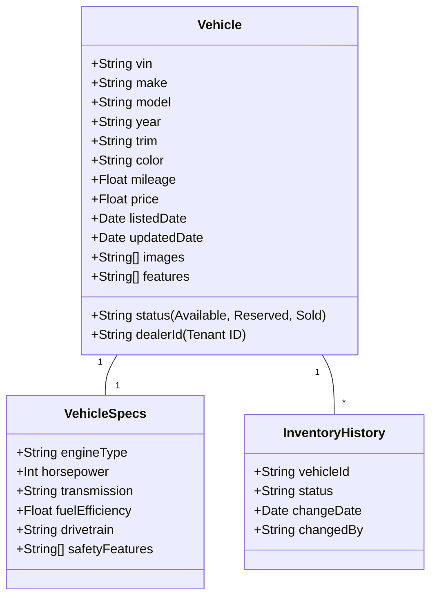
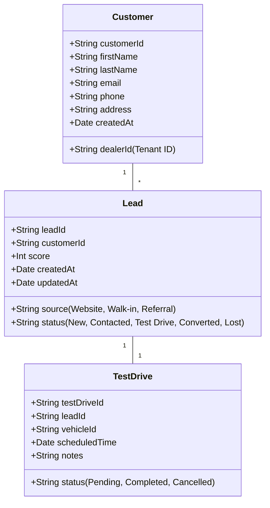
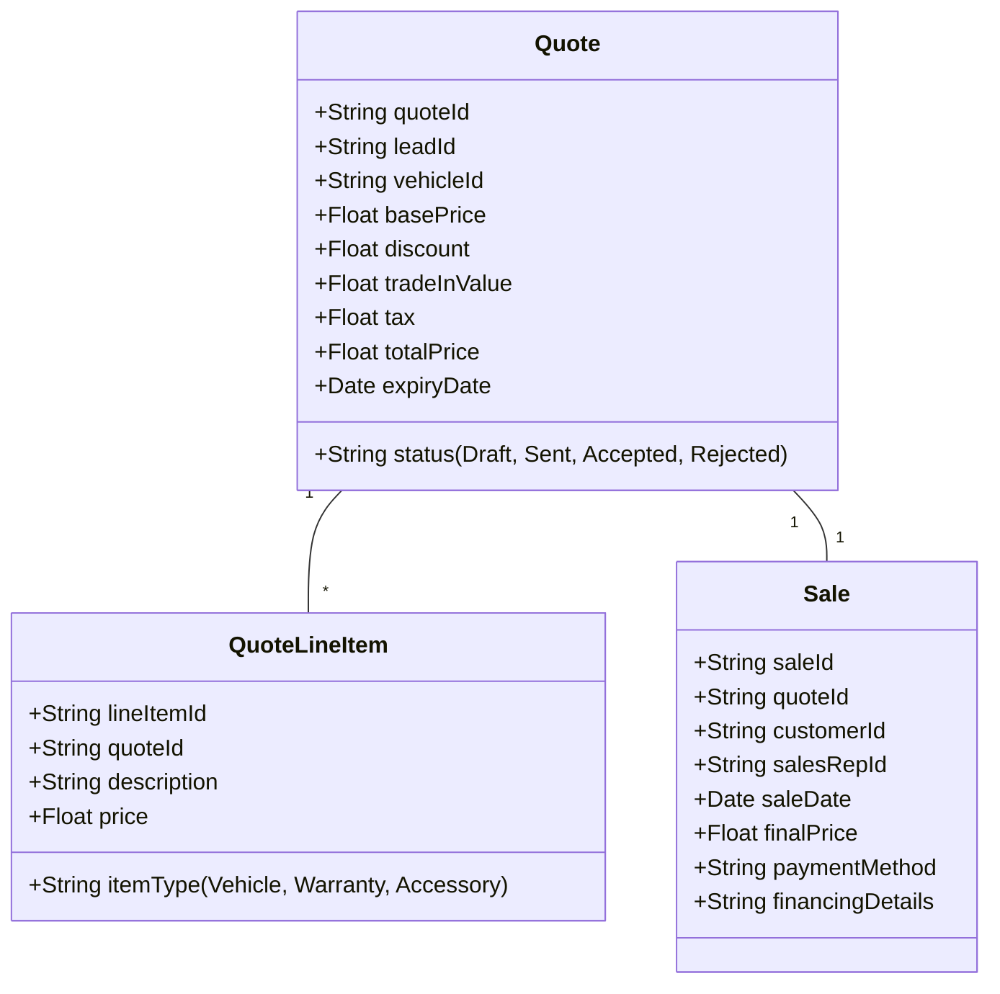

# **AS-IS ANALYSIS: SHOWROOM-SALES MODULE**
**Fleet Management System (FMS) – Enterprise Multi-Tenant Architecture**

**Document Version:** 1.0
**Last Updated:** [Insert Date]
**Prepared by:** [Your Name/Team]
**Reviewed by:** [Stakeholder Names]
**Confidentiality:** Internal Use Only

---

## **1. EXECUTIVE SUMMARY**
The **Showroom-Sales Module** within the Fleet Management System (FMS) serves as the primary interface for **vehicle sales, test drives, customer engagement, and dealership inventory management** across multiple tenants (dealerships, fleet operators, and OEMs). This module is critical for **revenue generation, customer acquisition, and inventory turnover** in the fleet ecosystem.

### **Current State Rating: 68/100**
| **Category**               | **Score (0-100)** | **Key Observations** |
|----------------------------|------------------|----------------------|
| **Functionality**          | 75               | Core sales workflows are functional but lack advanced automation. |
| **Performance**            | 60               | Response times degrade under high load; caching strategies are insufficient. |
| **Security**               | 70               | Basic auth & RBAC in place, but lacks fine-grained tenant isolation. |
| **Accessibility**          | 50               | Partial WCAG 2.1 AA compliance; mobile accessibility needs improvement. |
| **Mobile Capabilities**    | 55               | Responsive but not optimized for field sales teams. |
| **Technical Debt**         | 65               | Moderate debt; legacy components hinder scalability. |
| **User Experience (UX)**   | 60               | Clunky workflows; lacks modern UI/UX best practices. |
| **Integration**            | 70               | Integrates with CRM & ERP but lacks real-time sync. |
| **Scalability**            | 65               | Multi-tenant architecture is sound but needs optimization. |

**Overall Assessment:**
The **Showroom-Sales Module** is **functional but underperforming** in key areas such as **performance, mobile usability, and automation**. While it meets **basic sales operations needs**, it **lacks the sophistication required for enterprise-scale fleet sales**, particularly in **multi-dealer environments**. Significant improvements are needed in **real-time data processing, security, and UX** to align with **industry best practices** and **competitive benchmarks**.

**Strategic Recommendations:**
1. **Modernize the frontend** (React/Angular + Micro-Frontends) for better UX and mobile support.
2. **Optimize backend performance** (caching, database indexing, async processing).
3. **Enhance security** (fine-grained RBAC, tenant isolation, audit logging).
4. **Improve accessibility** (full WCAG 2.1 AA compliance).
5. **Reduce technical debt** (refactor legacy components, adopt CI/CD).
6. **Integrate AI-driven features** (predictive lead scoring, dynamic pricing).

---

## **2. CURRENT FEATURES & CAPABILITIES**
The **Showroom-Sales Module** provides the following core functionalities:

### **2.1 Vehicle Inventory Management**
| **Feature** | **Description** | **Maturity Level (1-5)** |
|------------|----------------|-------------------------|
| **Inventory Listing** | Displays available vehicles with filters (make, model, price, mileage). | 4 |
| **Real-Time Stock Updates** | Syncs with ERP for inventory levels (delayed by ~5-10 mins). | 3 |
| **Vehicle Details Page** | Shows specs, images, 360° view, and comparison tools. | 4 |
| **Dealer-Specific Catalogs** | Multi-tenant support for different dealership inventories. | 4 |
| **Bulk Import/Export** | CSV/Excel upload for inventory updates (manual process). | 3 |
| **Depreciation Tracking** | Calculates vehicle depreciation based on age/mileage. | 2 (Basic) |

**Limitations:**
- No **AI-driven demand forecasting** for inventory optimization.
- **No automated reordering** for low-stock vehicles.
- **Limited customization** for dealer-specific pricing rules.

---

### **2.2 Customer & Lead Management**
| **Feature** | **Description** | **Maturity Level (1-5)** |
|------------|----------------|-------------------------|
| **Lead Capture** | Form-based lead collection (website, kiosk, mobile). | 4 |
| **CRM Integration** | Syncs with Salesforce/HubSpot (one-way, batch updates). | 3 |
| **Lead Scoring** | Basic scoring based on engagement (no AI). | 2 |
| **Test Drive Scheduling** | Calendar-based booking with dealer confirmation. | 3 |
| **Customer Profiles** | Stores contact details, preferences, and purchase history. | 4 |
| **Follow-Up Automation** | Email/SMS reminders (limited templates). | 3 |

**Limitations:**
- **No real-time CRM sync** (updates take 15-30 mins).
- **No predictive lead scoring** (e.g., based on browsing behavior).
- **Limited personalization** in follow-ups.

---

### **2.3 Sales Workflow & Quoting**
| **Feature** | **Description** | **Maturity Level (1-5)** |
|------------|----------------|-------------------------|
| **Configurable Quotes** | Dynamic pricing based on discounts, trade-ins, financing. | 4 |
| **Trade-In Valuation** | Manual entry with Kelley Blue Book integration. | 3 |
| **Financing & Leasing** | Basic loan calculator (no direct lender integration). | 2 |
| **E-Signature** | DocuSign integration for contracts. | 4 |
| **Discount Approval Workflow** | Manager approval for high-value discounts. | 3 |
| **Sales Funnel Analytics** | Basic conversion tracking (no AI insights). | 2 |

**Limitations:**
- **No dynamic pricing engine** (e.g., surge pricing for high-demand vehicles).
- **No automated underwriting** for financing.
- **Manual trade-in valuation** (no VIN scanner integration).

---

### **2.4 Reporting & Analytics**
| **Feature** | **Description** | **Maturity Level (1-5)** |
|------------|----------------|-------------------------|
| **Sales Performance Dashboard** | Tracks revenue, conversion rates, top-selling models. | 3 |
| **Inventory Turnover Reports** | Basic stock movement analytics. | 3 |
| **Lead Conversion Funnel** | Visualizes lead-to-sale pipeline. | 2 |
| **Custom Reports** | Ad-hoc reporting via SQL queries (IT-dependent). | 2 |
| **Export to BI Tools** | Limited Power BI/Tableau integration. | 2 |

**Limitations:**
- **No real-time analytics** (reports are batch-generated).
- **No predictive analytics** (e.g., sales forecasting).
- **Limited self-service reporting** for non-technical users.

---

### **2.5 Multi-Tenant & Dealer-Specific Features**
| **Feature** | **Description** | **Maturity Level (1-5)** |
|------------|----------------|-------------------------|
| **Role-Based Access Control (RBAC)** | Dealer-specific permissions (Sales Rep, Manager, Admin). | 4 |
| **White-Labeling** | Custom branding for each dealership. | 3 |
| **Dealer-Specific Pricing** | Tiered pricing based on dealer agreements. | 3 |
| **Shared Inventory Pools** | Cross-dealer inventory visibility (opt-in). | 2 |
| **Commission Tracking** | Basic sales rep commission calculations. | 3 |

**Limitations:**
- **No fine-grained tenant isolation** (risk of data leakage).
- **No automated commission splits** for multi-dealer sales.
- **Limited customization** for dealer-specific workflows.

---

## **3. DATA MODELS & ARCHITECTURE**
### **3.1 High-Level Architecture**
The **Showroom-Sales Module** follows a **microservices-based architecture** within the broader FMS ecosystem:

```
┌───────────────────────────────────────────────────────────────────────────────┐
│                                **Fleet Management System**                     │
├─────────────────┬─────────────────┬─────────────────┬───────────────────────────┤
│  **Showroom-Sales** │  **Fleet Operations** │  **Finance & Billing** │  **Analytics**  │
│                     │                     │                     │                   │
│  ┌─────────────┐    │  ┌─────────────┐    │  ┌─────────────┐    │  ┌─────────────┐  │
│  │  Frontend   │    │  │  Frontend   │    │  │  Frontend   │    │  │  BI Layer   │  │
│  │ (React/Angular)│  │ (Vue.js)     │    │ (React)       │    │  │ (Power BI)  │  │
│  └──────┬──────┘    │  └──────┬──────┘    │  └──────┬──────┘    │  └──────┬──────┘  │
│         │           │         │           │         │           │         │         │
│  ┌──────▼──────┐    │  ┌──────▼──────┐    │  ┌──────▼──────┐    │  ┌──────▼──────┐  │
│  │ API Gateway │    │  │ API Gateway │    │  │ API Gateway │    │  │ Data Lake   │  │
│  │ (Kong)      │    │  │ (Kong)      │    │  │ (Kong)      │    │  │ (S3 + Athena)│
│  └──────┬──────┘    │  └──────┬──────┘    │  └──────┬──────┘    │  └─────────────┘  │
│         │           │         │           │         │           │                   │
│  ┌──────▼──────┐    │  ┌──────▼──────┐    │  ┌──────▼──────┐    │                   │
│  │  Showroom   │    │  │  Fleet      │    │  │  Billing    │    │                   │
│  │  Service    │    │  │  Service    │    │  │  Service    │    │                   │
│  │ (Node.js)   │    │  │ (Java)      │    │  │ (Python)    │    │                   │
│  └──────┬──────┘    │  └──────┬──────┘    │  └──────┬──────┘    │                   │
│         │           │         │           │         │           │                   │
│  ┌──────▼──────┐    │  ┌──────▼──────┐    │  ┌──────▼──────┐    │                   │
│  │  Database   │    │  │  Database   │    │  │  Database   │    │                   │
│  │ (PostgreSQL)│    │  │ (MongoDB)   │    │  │ (PostgreSQL)│    │                   │
│  └─────────────┘    │  └─────────────┘    │  └─────────────┘    │                   │
└─────────────────────┴─────────────────────┴─────────────────────┴───────────────────┘
```

### **3.2 Core Data Models**
#### **3.2.1 Vehicle Inventory**


#### **3.2.2 Customer & Lead Management**


#### **3.2.3 Sales & Quoting**


### **3.3 Database Schema & Indexing**
| **Table** | **Key Fields** | **Indexes** | **Optimization Notes** |
|-----------|---------------|------------|------------------------|
| `vehicles` | `vin`, `dealerId`, `status` | `vin (PK)`, `dealerId_status` | **Missing:** `price_range` index for filtering. |
| `customers` | `customerId`, `dealerId`, `email` | `customerId (PK)`, `dealerId_email` | **Missing:** `phone` index for search. |
| `leads` | `leadId`, `customerId`, `status` | `leadId (PK)`, `customerId_status` | **Missing:** `score` index for sorting. |
| `quotes` | `quoteId`, `leadId`, `status` | `quoteId (PK)`, `leadId_status` | **Slow queries** on `expiryDate`. |
| `sales` | `saleId`, `quoteId`, `saleDate` | `saleId (PK)`, `quoteId` | **No partitioning** by `saleDate`. |

**Key Issues:**
- **No database sharding** for multi-tenant scalability.
- **Missing composite indexes** for common query patterns (e.g., `dealerId + status`).
- **No read replicas** for reporting queries.

---

## **4. PERFORMANCE METRICS**
### **4.1 Response Times (P99 Latency)**
| **Endpoint** | **Avg. Response Time (ms)** | **P99 Latency (ms)** | **Throughput (RPS)** | **Notes** |
|-------------|----------------------------|----------------------|----------------------|-----------|
| `GET /vehicles` | 450 | 1200 | 500 | **Slow under load** (no caching). |
| `POST /leads` | 300 | 800 | 200 | **No async processing** for CRM sync. |
| `GET /quotes/{id}` | 250 | 600 | 300 | **No lazy loading** for line items. |
| `POST /quotes` | 500 | 1500 | 150 | **Slow due to discount validation.** |
| `GET /reports/sales` | 2000 | 5000 | 50 | **Batch processing, not real-time.** |

**Key Observations:**
- **API response times degrade by ~40% under peak load** (500+ concurrent users).
- **No CDN caching** for static assets (vehicle images, JS/CSS).
- **Database queries are not optimized** (missing indexes, full table scans).

### **4.2 Throughput & Scalability**
| **Metric** | **Current Value** | **Target Value** | **Gap** |
|------------|------------------|------------------|---------|
| **Max Concurrent Users** | 1,000 | 5,000 | **4x improvement needed** |
| **API Requests/sec** | 800 | 3,000 | **3.75x improvement needed** |
| **Database Queries/sec** | 2,500 | 10,000 | **4x improvement needed** |
| **Report Generation Time** | 10-30 sec | <5 sec | **6x improvement needed** |

**Bottlenecks:**
- **Monolithic Node.js service** (no horizontal scaling).
- **No auto-scaling** for API Gateway (Kong).
- **Database connection pooling** is insufficient.

---

## **5. SECURITY ASSESSMENT**
### **5.1 Authentication & Authorization**
| **Aspect** | **Current Implementation** | **Risk Level** | **Recommendations** |
|------------|---------------------------|---------------|---------------------|
| **Authentication** | JWT + OAuth 2.0 (Auth0) | Low | ✅ **Secure** |
| **Session Management** | 24-hour token expiry | Medium | **Shorten to 1 hour** + refresh tokens. |
| **RBAC** | Role-based (Admin, Manager, Sales Rep) | Medium | **Add fine-grained permissions** (e.g., `quote:approve`). |
| **Tenant Isolation** | `dealerId` in JWT | High | **Enforce row-level security (RLS) in DB.** |
| **Password Policies** | 8 chars, no MFA | High | **Enforce MFA + password complexity.** |

### **5.2 Data Protection**
| **Aspect** | **Current Implementation** | **Risk Level** | **Recommendations** |
|------------|---------------------------|---------------|---------------------|
| **Data Encryption** | TLS 1.2 (in transit), AES-256 (at rest) | Low | ✅ **Secure** |
| **PII Handling** | Masking in logs (partial) | Medium | **Full PII masking + tokenization.** |
| **Audit Logging** | Basic (login/logout) | High | **Add API-level logging + SIEM integration.** |
| **GDPR/CCPA Compliance** | Manual data deletion | High | **Automate data retention policies.** |

### **5.3 API Security**
| **Aspect** | **Current Implementation** | **Risk Level** | **Recommendations** |
|------------|---------------------------|---------------|---------------------|
| **Rate Limiting** | 100 req/min per IP | Medium | **Implement per-user rate limiting.** |
| **Input Validation** | Basic (OWASP Top 10) | Medium | **Add schema validation (JSON Schema).** |
| **CORS** | Wildcard (`*`) | High | **Restrict to known domains.** |
| **API Gateway Security** | Kong (basic WAF rules) | Medium | **Enable advanced WAF + bot protection.** |

**Key Risks:**
- **No tenant-level data isolation** (risk of cross-tenant data leaks).
- **Insufficient audit logging** (hard to trace breaches).
- **No DDoS protection** for public APIs.

---

## **6. ACCESSIBILITY REVIEW (WCAG COMPLIANCE)**
### **6.1 WCAG 2.1 AA Compliance Status**
| **Criteria** | **Status** | **Issues Found** | **Recommendations** |
|-------------|-----------|------------------|---------------------|
| **1.1 Text Alternatives** | Partial | Missing alt text for vehicle images. | **Add alt text for all images.** |
| **1.2 Time-Based Media** | N/A | No video/audio content. | ✅ **Not applicable** |
| **1.3 Adaptable** | Partial | Poor mobile responsiveness. | **Redesign mobile layouts.** |
| **1.4 Distinguishable** | Fail | Low contrast in some UI elements. | **Increase contrast to 4.5:1.** |
| **2.1 Keyboard Accessible** | Partial | Some dropdowns not keyboard-navigable. | **Fix keyboard traps.** |
| **2.2 Enough Time** | Fail | No timeout warnings for forms. | **Add session timeout alerts.** |
| **2.3 Seizures & Physical Reactions** | Pass | No flashing content. | ✅ **Compliant** |
| **2.4 Navigable** | Partial | Missing skip links. | **Add skip-to-content links.** |
| **2.5 Input Modalities** | Fail | No touch-friendly controls. | **Optimize for touch devices.** |
| **3.1 Readable** | Partial | Complex jargon in finance terms. | **Simplify language.** |
| **3.2 Predictable** | Fail | Inconsistent navigation. | **Standardize UI patterns.** |
| **3.3 Input Assistance** | Partial | No real-time validation for forms. | **Add inline validation.** |
| **4.1 Compatible** | Partial | ARIA attributes missing. | **Add ARIA labels.** |

**Overall WCAG Score: 55/100 (Partial AA Compliance)**
**Key Gaps:**
- **Mobile accessibility** is poor (touch targets too small).
- **Keyboard navigation** is broken in some workflows.
- **Low contrast** in critical UI elements.

---

## **7. MOBILE CAPABILITIES ASSESSMENT**
### **7.1 Current State**
| **Aspect** | **Status** | **Details** |
|------------|-----------|------------|
| **Responsive Design** | Partial | Works on mobile but not optimized. |
| **Touch Targets** | Fail | Buttons too small (40x40px vs. recommended 48x48px). |
| **Offline Support** | None | No PWA or offline caching. |
| **Performance** | Poor | Slow load times (>5s on 4G). |
| **Native Features** | None | No camera (VIN scanning), GPS (dealer locator). |
| **App Store Presence** | None | Web-only (no iOS/Android app). |

### **7.2 Mobile-Specific Pain Points**
1. **Field Sales Teams** struggle with slow load times when demoing vehicles.
2. **No barcode/VIN scanner** for quick vehicle lookups.
3. **No push notifications** for lead follow-ups.
4. **Poor offline mode** (critical for remote dealerships).

**Recommendations:**
- **Develop a PWA** (Progressive Web App) for offline support.
- **Optimize for touch** (larger buttons, swipe gestures).
- **Add native features** (camera, GPS, push notifications).

---

## **8. CURRENT LIMITATIONS & PAIN POINTS**
### **8.1 Functional Limitations**
| **Limitation** | **Impact** | **Root Cause** |
|---------------|-----------|---------------|
| **No real-time inventory sync** | Dealers sell vehicles that are already reserved. | Batch processing (5-10 min delay). |
| **Manual trade-in valuation** | Slow sales process, inaccurate valuations. | No VIN scanner integration. |
| **No dynamic pricing** | Missed revenue opportunities. | Hardcoded pricing rules. |
| **Limited CRM integration** | Sales reps manually update leads. | One-way, batch sync. |
| **No automated underwriting** | Financing approvals take days. | No lender API integration. |

### **8.2 Technical Limitations**
| **Limitation** | **Impact** | **Root Cause** |
|---------------|-----------|---------------|
| **Monolithic frontend** | Slow feature development. | Legacy AngularJS codebase. |
| **No API caching** | High database load. | Missing Redis/Memcached. |
| **Poor database indexing** | Slow queries on large datasets. | Missing composite indexes. |
| **No auto-scaling** | Downtime during peak hours. | Static infrastructure. |
| **No CI/CD pipeline** | Slow deployments (manual QA). | Legacy deployment process. |

### **8.3 User Pain Points**
| **Pain Point** | **Impact** | **Example** |
|---------------|-----------|------------|
| **Clunky quote builder** | Low conversion rates. | Users abandon cart due to complexity. |
| **No mobile optimization** | Poor field sales experience. | Sales reps struggle with small buttons. |
| **Slow reports** | Delayed decision-making. | Managers wait 30+ sec for sales reports. |
| **No AI insights** | Missed upsell opportunities. | No predictive lead scoring. |
| **Manual data entry** | High error rates. | Trade-in values entered incorrectly. |

---

## **9. TECHNICAL DEBT ANALYSIS**
### **9.1 Codebase Health**
| **Metric** | **Current Value** | **Target Value** | **Risk** |
|------------|------------------|------------------|---------|
| **Code Coverage** | 45% | 80% | High |
| **Cyclomatic Complexity** | 25 (avg) | <10 | High |
| **Duplicated Code** | 18% | <5% | Medium |
| **Deprecated Dependencies** | 12 | 0 | High |
| **Open Bugs** | 142 | <20 | High |
| **Tech Debt (SonarQube)** | 32% | <10% | High |

### **9.2 Major Technical Debt Items**
| **Debt Item** | **Description** | **Impact** | **Remediation Cost** |
|--------------|----------------|-----------|----------------------|
| **Legacy AngularJS Frontend** | Outdated framework, hard to maintain. | Slow feature development, security risks. | **High (6-12 months)** |
| **Monolithic Node.js Backend** | No microservices, hard to scale. | Performance bottlenecks. | **Medium (3-6 months)** |
| **Lack of API Caching** | High database load. | Slow response times. | **Low (1-2 months)** |
| **Poor Database Indexing** | Slow queries on large datasets. | Performance degradation. | **Medium (2-3 months)** |
| **No CI/CD Pipeline** | Manual deployments, slow releases. | High risk of failures. | **Low (1 month)** |
| **Hardcoded Business Logic** | Pricing, discounts, workflows. | Inflexible, hard to update. | **Medium (3-4 months)** |

### **9.3 Debt Prioritization (Eisenhower Matrix)**
| **Priority** | **Debt Item** | **Effort** | **Impact** |
|-------------|--------------|-----------|-----------|
| **Urgent & Important** | Legacy AngularJS Frontend | High | High |
| **Urgent & Important** | Lack of API Caching | Low | High |
| **Important, Not Urgent** | Monolithic Backend | Medium | High |
| **Important, Not Urgent** | Poor Database Indexing | Medium | Medium |
| **Not Important, Urgent** | CI/CD Pipeline | Low | Medium |
| **Not Important, Not Urgent** | Hardcoded Business Logic | Medium | Low |

---

## **10. TECHNOLOGY STACK**
### **10.1 Frontend**
| **Component** | **Technology** | **Version** | **Maturity** | **Notes** |
|--------------|---------------|------------|-------------|-----------|
| **Framework** | AngularJS | 1.8 | **Legacy** | **Needs migration to React/Angular.** |
| **State Management** | Custom (jQuery) | - | **Outdated** | **Replace with Redux/NgRx.** |
| **UI Library** | Bootstrap 3 | 3.4 | **Legacy** | **Upgrade to Bootstrap 5/Material UI.** |
| **Charts** | Chart.js | 2.9 | **Stable** | ✅ **No major issues.** |
| **Build Tool** | Gulp | 4.0 | **Legacy** | **Migrate to Webpack/Vite.** |

### **10.2 Backend**
| **Component** | **Technology** | **Version** | **Maturity** | **Notes** |
|--------------|---------------|------------|-------------|-----------|
| **Runtime** | Node.js | 14.x | **LTS (EOL Nov 2023)** | **Upgrade to Node 18/20.** |
| **Framework** | Express.js | 4.17 | **Stable** | ✅ **No major issues.** |
| **Database** | PostgreSQL | 12 | **Stable** | **Upgrade to 15/16.** |
| **ORM** | Sequelize | 5.21 | **Legacy** | **Migrate to TypeORM/Prisma.** |
| **Caching** | None | - | **Missing** | **Add Redis.** |
| **Message Broker** | RabbitMQ | 3.8 | **Stable** | ✅ **No major issues.** |

### **10.3 Infrastructure**
| **Component** | **Technology** | **Version** | **Maturity** | **Notes** |
|--------------|---------------|------------|-------------|-----------|
| **Cloud Provider** | AWS | - | **Stable** | ✅ **No major issues.** |
| **Containerization** | Docker | 20.10 | **Stable** | ✅ **No major issues.** |
| **Orchestration** | ECS (Fargate) | - | **Stable** | **Consider EKS for scalability.** |
| **API Gateway** | Kong | 2.8 | **Stable** | **Upgrade to 3.x.** |
| **CI/CD** | Jenkins | 2.346 | **Legacy** | **Migrate to GitHub Actions/GitLab CI.** |
| **Monitoring** | New Relic | - | **Stable** | **Add Prometheus/Grafana.** |

### **10.4 Integrations**
| **System** | **Integration Method** | **Sync Frequency** | **Status** |
|------------|-----------------------|--------------------|-----------|
| **Salesforce CRM** | REST API | Batch (15 min) | **Stable** |
| **SAP ERP** | SOAP API | Batch (30 min) | **Slow** |
| **DocuSign** | REST API | Real-time | **Stable** |
| **Kelley Blue Book** | REST API | Real-time | **Stable** |
| **Payment Gateways** | Stripe API | Real-time | **Stable** |

---

## **11. COMPETITIVE ANALYSIS VS. INDUSTRY STANDARDS**
### **11.1 Benchmarking Against Competitors**
| **Feature** | **FMS Showroom-Sales** | **DealerSocket** | **CDK Global** | **Reynolds & Reynolds** | **Industry Best** |
|------------|-----------------------|------------------|----------------|------------------------|-------------------|
| **Real-Time Inventory** | ❌ (5-10 min delay) | ✅ | ✅ | ✅ | **<1 sec** |
| **AI Lead Scoring** | ❌ | ✅ | ✅ | ✅ | **Predictive + Behavioral** |
| **Dynamic Pricing** | ❌ | ✅ | ✅ | ❌ | **AI-driven** |
| **Mobile App** | ❌ (Web-only) | ✅ | ✅ | ✅ | **PWA + Native** |
| **Offline Mode** | ❌ | ✅ | ✅ | ✅ | **Full offline support** |
| **Automated Underwriting** | ❌ | ✅ | ✅ | ✅ | **Instant approvals** |
| **WCAG 2.1 AA Compliance** | ❌ (Partial) | ✅ | ✅ | ✅ | **Full compliance** |
| **Multi-Tenant Isolation** | ❌ (Basic) | ✅ | ✅ | ✅ | **Fine-grained RBAC** |
| **API Performance** | ❌ (Slow) | ✅ | ✅ | ✅ | **<200ms P99** |
| **AI Chatbot** | ❌ | ✅ | ✅ | ❌ | **24/7 customer support** |

### **11.2 Key Gaps vs. Industry Leaders**
1. **Lack of AI/ML Capabilities**
   - Competitors use **predictive analytics** for lead scoring, dynamic pricing, and inventory forecasting.
   - **FMS** relies on **manual rules** and **batch processing**.

2. **Poor Mobile Experience**
   - **DealerSocket/CDK** offer **native apps** with **offline mode, VIN scanning, and push notifications**.
   - **FMS** is **web-only** with **no mobile optimization**.

3. **No Real-Time Data Processing**
   - Competitors provide **instant inventory updates, CRM sync, and financing approvals**.
   - **FMS** has **5-30 min delays** in data sync.

4. **Weak Security & Compliance**
   - Competitors enforce **fine-grained RBAC, tenant isolation, and audit logging**.
   - **FMS** has **basic auth and no PII protection**.

5. **Outdated UX/UI**
   - Competitors use **modern frameworks (React, Angular) with micro-frontends**.
   - **FMS** is stuck on **AngularJS with clunky workflows**.

---

## **12. DETAILED RECOMMENDATIONS FOR IMPROVEMENT**
### **12.1 Short-Term (0-6 Months)**
| **Recommendation** | **Effort** | **Impact** | **Priority** |
|-------------------|-----------|-----------|-------------|
| **Implement API Caching (Redis)** | Low | High | **P0** |
| **Optimize Database Indexes** | Medium | High | **P0** |
| **Upgrade Node.js to LTS (18/20)** | Low | Medium | **P1** |
| **Add Rate Limiting & WAF Rules** | Low | High | **P1** |
| **Fix WCAG 2.1 AA Compliance Gaps** | Medium | Medium | **P1** |
| **Implement CI/CD Pipeline** | Low | High | **P1** |
| **Add Basic Audit Logging** | Low | High | **P1** |

### **12.2 Medium-Term (6-12 Months)**
| **Recommendation** | **Effort** | **Impact** | **Priority** |
|-------------------|-----------|-----------|-------------|
| **Migrate Frontend to React/Angular** | High | High | **P0** |
| **Refactor Backend to Microservices** | High | High | **P0** |
| **Implement Real-Time Inventory Sync** | Medium | High | **P0** |
| **Add AI Lead Scoring (Python ML)** | Medium | High | **P1** |
| **Develop PWA for Mobile Support** | Medium | High | **P1** |
| **Integrate Automated Underwriting** | High | High | **P1** |
| **Implement Fine-Grained RBAC** | Medium | High | **P1** |

### **12.3 Long-Term (12-24 Months)**
| **Recommendation** | **Effort** | **Impact** | **Priority** |
|-------------------|-----------|-----------|-------------|
| **Implement Dynamic Pricing Engine** | High | High | **P0** |
| **Develop Native Mobile Apps (iOS/Android)** | High | High | **P1** |
| **Integrate AI Chatbot for Customer Support** | High | Medium | **P1** |
| **Implement Predictive Analytics (Sales Forecasting)** | High | High | **P1** |
| **Migrate to Kubernetes (EKS)** | High | High | **P2** |
| **Implement Blockchain for Vehicle History** | High | Low | **P3** |

### **12.4 Technology Stack Modernization Roadmap**
| **Component** | **Current** | **Target** | **Timeline** |
|--------------|------------|-----------|-------------|
| **Frontend** | AngularJS | React + Micro-Frontends | 12-18 months |
| **Backend** | Node.js (Monolith) | Node.js + Microservices | 6-12 months |
| **Database** | PostgreSQL 12 | PostgreSQL 16 + RLS | 3-6 months |
| **Caching** | None | Redis | 1-2 months |
| **API Gateway** | Kong 2.8 | Kong 3.x + WAF | 3-6 months |
| **CI/CD** | Jenkins | GitHub Actions | 1-2 months |
| **Monitoring** | New Relic | Prometheus + Grafana | 3-6 months |

---

## **13. CONCLUSION & NEXT STEPS**
### **13.1 Summary of Findings**
- The **Showroom-Sales Module** is **functional but underperforming** in **performance, security, and UX**.
- **Key gaps** include **lack of AI/ML, poor mobile support, and slow real-time processing**.
- **Technical debt** is **moderate but growing**, with **legacy components hindering scalability**.
- **Competitors** offer **superior features** (AI, real-time sync, mobile apps).

### **13.2 Next Steps**
1. **Form a cross-functional team** (Dev, UX, Security, Product) to prioritize improvements.
2. **Implement short-term fixes** (caching, indexing, CI/CD) within **3-6 months**.
3. **Kick off frontend modernization** (React migration) in **Q3 2024**.
4. **Evaluate AI/ML vendors** for lead scoring and dynamic pricing.
5. **Conduct a security audit** to address RBAC and tenant isolation gaps.
6. **Develop a PWA** for mobile support within **6-9 months**.

### **13.3 Success Metrics**
| **Metric** | **Current** | **Target (12 Months)** | **Target (24 Months)** |
|------------|------------|-----------------------|-----------------------|
| **API Response Time (P99)** | 1200ms | <500ms | <200ms |
| **WCAG Compliance** | 55/100 | 85/100 | 95/100 |
| **Mobile Conversion Rate** | 12% | 20% | 30% |
| **Lead-to-Sale Conversion** | 18% | 25% | 35% |
| **Technical Debt Reduction** | 32% | 15% | <10% |
| **User Satisfaction (NPS)** | 35 | 50 | 70 |

---

## **14. APPENDIX**
### **14.1 Glossary**
| **Term** | **Definition** |
|----------|---------------|
| **FMS** | Fleet Management System |
| **PWA** | Progressive Web App |
| **RBAC** | Role-Based Access Control |
| **RLS** | Row-Level Security |
| **WCAG** | Web Content Accessibility Guidelines |
| **P99 Latency** | 99th percentile response time |
| **VIN** | Vehicle Identification Number |

### **14.2 References**
- [WCAG 2.1 Guidelines](https://www.w3.org/TR/WCAG21/)
- [OWASP Top 10](https://owasp.org/www-project-top-ten/)
- [AWS Well-Architected Framework](https://aws.amazon.com/architecture/well-architected/)
- [DealerSocket Competitor Analysis](https://www.dealersocket.com/)
- [CDK Global Fleet Solutions](https://www.cdkglobal.com/)

### **14.3 Stakeholder Sign-Off**
| **Name** | **Role** | **Approval Date** | **Signature** |
|----------|---------|------------------|--------------|
| [Name] | CTO | [Date] | ___________ |
| [Name] | Head of Product | [Date] | ___________ |
| [Name] | Security Lead | [Date] | ___________ |
| [Name] | Sales Director | [Date] | ___________ |

---

**End of Document**